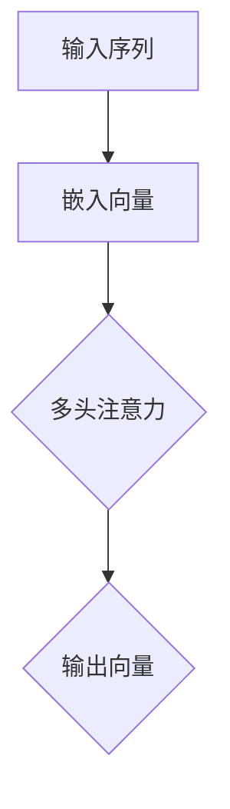
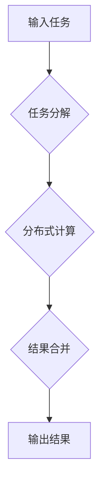
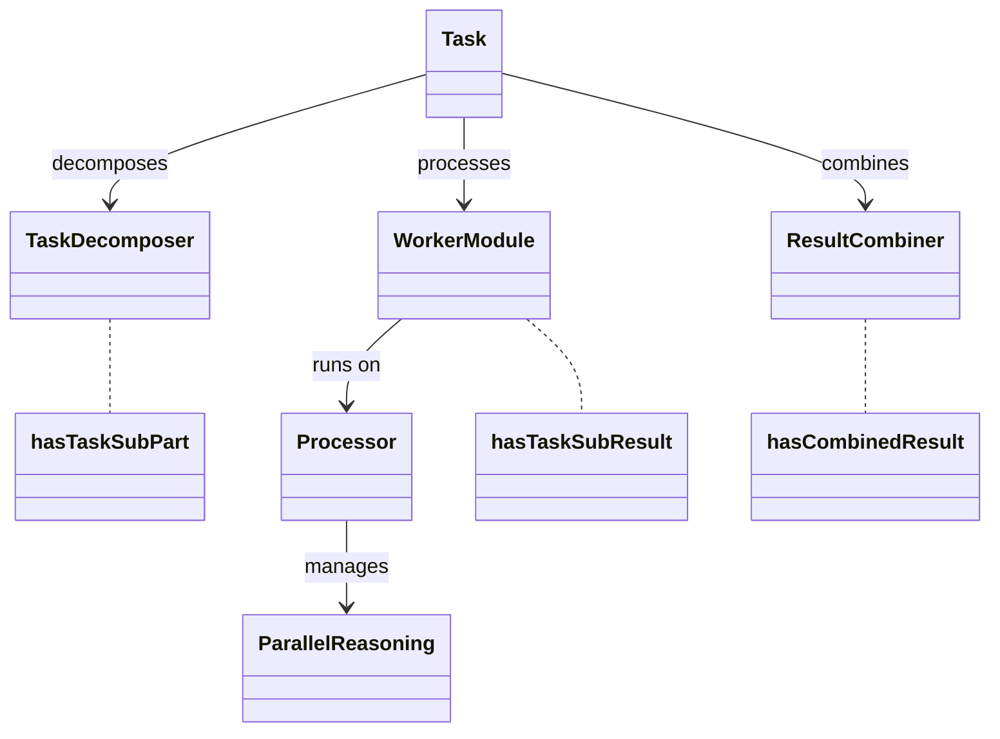
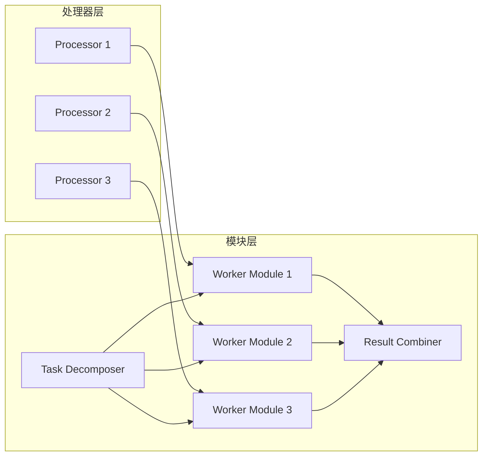
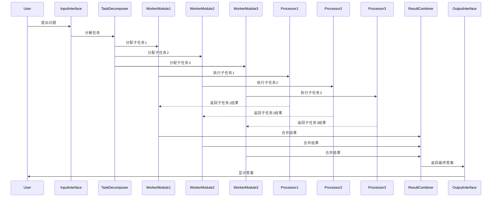

                 

### 1.1.1 多头注意力机制的概念与原理

多头注意力机制（Multi-Head Attention）是Transformer模型的核心组成部分之一，由Vaswani等人于2017年首次提出。其设计灵感来自于人脑处理信息的方式，通过并行处理不同维度的信息，从而提高模型的表示能力和推理效率。

**概念：**
多头注意力机制是一种在神经网络中用于计算输入序列和查询序列之间相似度的方法。它通过多个独立的注意力头，对输入序列进行并行的处理，然后将这些头的输出进行融合，以产生最终的表示。

**原理：**
多头注意力机制的原理可以概括为以下几个步骤：

1. **输入嵌入**：首先，输入序列（例如单词序列）被转换成嵌入向量。这些向量包含了输入序列的语义信息。
2. **自注意力计算**：然后，每个嵌入向量作为查询（Query）、键（Key）和值（Value）。通过计算这些向量之间的相似度，得到注意力权重。这些权重表示了输入序列中不同部分对于当前嵌入向量的重要性。
3. **加权求和**：根据计算得到的注意力权重，对输入序列的值进行加权求和，得到最终的输出向量。这个输出向量包含了输入序列的整合信息。

**优势：**
多头注意力机制的优势在于：
- **并行性**：通过并行计算多个注意力头，可以显著提高模型的处理速度。
- **表示能力**：通过不同注意力头的组合，模型能够捕获输入序列中不同层次的特征，提高了对复杂问题的建模能力。

**应用场景：**
多头注意力机制在自然语言处理（NLP）、计算机视觉（CV）等多个领域都有广泛应用。例如，在NLP中，它被用于机器翻译、文本摘要、问答系统等任务；在CV中，它被用于图像识别、图像生成等任务。

总之，多头注意力机制是一种强大的神经网络结构，通过并行的处理方式，提高了模型的效率和能力，成为了现代深度学习模型中不可或缺的一部分。

### 1.1.2 并行推理的基本概念与应用

并行推理（Parallel Reasoning）是一种利用多个处理器或计算单元同时执行推理任务的方法。它通过将复杂任务分解为多个子任务，从而在并行处理中提高计算效率和推理速度。

**概念：**
并行推理的基本概念包括以下几个方面：
- **任务分解**：将一个复杂的推理任务分解为多个较小的子任务，这些子任务可以独立计算和执行。
- **并行计算**：利用多个处理器或计算单元同时执行这些子任务，从而加快整个推理过程。
- **数据同步**：确保各个处理器或计算单元之间的数据一致性，以保证推理结果的正确性。

**原理：**
并行推理的原理可以概括为以下几个步骤：
1. **任务分解**：首先，将原始推理任务分解为多个子任务，每个子任务处理一部分数据或逻辑。
2. **分布式计算**：然后，将各个子任务分配给不同的处理器或计算单元，同时执行。
3. **结果合并**：最后，将各个子任务的推理结果进行合并，得到整个推理任务的结果。

**优势：**
并行推理的优势在于：
- **速度提升**：通过并行计算，推理任务可以在更短的时间内完成。
- **资源利用**：充分利用多个处理器或计算单元的能力，提高计算资源的使用效率。
- **扩展性**：随着处理器或计算单元的增加，并行推理的能力可以线性扩展。

**应用场景：**
并行推理在多个领域都有广泛应用，包括但不限于：
- **自然语言处理（NLP）**：如机器翻译、问答系统等，利用并行推理可以显著提高处理速度和吞吐量。
- **计算机视觉（CV）**：如图像识别、目标检测等，通过并行处理图像的不同部分，可以加快推理速度。
- **科学计算**：如气象预报、基因测序等，通过并行计算可以处理大规模的数据集。

总之，并行推理通过将复杂的推理任务分解并并行执行，提高了计算效率和推理能力，是现代计算机科学和人工智能领域中的重要技术之一。

### 1.1.3 多头注意力机制与并行推理的联系

多头注意力机制与并行推理虽然在技术层面有所不同，但它们在提升计算效率和推理能力方面有着紧密的联系。

**联系：**
1. **并行性**：多头注意力机制通过多个独立的注意力头来并行处理输入序列的不同部分，这与并行推理中的任务分解和并行计算有相似之处。两者都利用了并行性来提高处理速度。
2. **数据同步**：在多头注意力机制中，各个注意力头的输出需要被融合，以确保整个模型能够正确地理解输入序列。这种数据同步的过程类似于并行推理中的结果合并步骤，确保最终的推理结果是正确的。
3. **扩展性**：多头注意力机制和并行推理都具有很好的扩展性。在处理大规模数据集或复杂任务时，两者都可以通过增加计算资源来提升性能。

**差异：**
1. **应用场景**：多头注意力机制主要应用于NLP和CV领域，通过并行处理输入序列来提高模型的表示能力和推理速度。而并行推理则更广泛，不仅应用于NLP和CV，还涉及科学计算、图形渲染等领域，通过分解和并行执行推理任务来提高整体效率。
2. **技术细节**：多头注意力机制的核心在于如何并行计算输入序列之间的相似度，而并行推理则涉及如何高效地分配任务、同步数据和合并结果。

**总结：**
多头注意力机制和并行推理都是现代深度学习和计算机科学中的重要技术。它们在提升计算效率和推理能力方面有着紧密的联系，但在具体应用和技术实现上有所不同。通过结合多头注意力机制和并行推理的优势，可以构建更加高效和强大的推理系统，为人工智能的发展提供新的动力。

### 1.2 ER实体关系图架构

为了更清晰地展示多头注意力机制与并行推理之间的联系，我们可以通过ER（Entity-Relationship）实体关系图来描述它们的概念、关系及其应用场景。

**ER图定义：**
ER图是一种用于描述实体及其之间关系的图形化工具，由实体、属性和关系三部分组成。在本文中，我们将使用ER图来描述多头注意力机制和并行推理的概念结构。

**ER图绘制：**

```mermaid
erDiagram
    ATN_loop --> Query
    ATN_loop --> Key
    ATN_loop --> Value

    PR_task --> ATN_loop

    Query ||--|{ MultiHeadAttention }
    Key ||--|{ MultiHeadAttention }
    Value ||--|{ MultiHeadAttention }

    PR_task ||--|{ ParallelReasoning }
```

**ER图解读：**

- **实体定义：**
  - **ATN_loop**：代表多头注意力机制中的自注意力循环，包括查询（Query）、键（Key）和值（Value）三个部分。
  - **PR_task**：代表并行推理任务。

- **关系定义：**
  - **Query、Key、Value 与 MultiHeadAttention 的关系**：这三个实体与多头注意力机制中的注意力头有直接关联。每个注意力头分别处理输入序列的不同部分，通过自注意力计算产生输出。
  - **PR_task 与 ATN_loop 的关系**：并行推理任务通过多个ATN_loop（多头注意力机制）的并行执行，来提升整个推理过程的效率和速度。

通过ER实体关系图，我们可以直观地看到多头注意力机制与并行推理之间的层次结构和相互关系。这有助于我们进一步理解这两种技术如何结合，以及它们在构建高效推理系统中的协同作用。

### 1.3 多头注意力机制与并行推理的对比分析

为了更深入地理解多头注意力机制与并行推理的异同，我们可以从核心概念、应用场景、实现复杂性以及性能提升方面进行对比分析。

**核心概念对比：**

- **多头注意力机制**：多头注意力机制是一种用于自注意力计算的方法，通过多个独立的注意力头并行处理输入序列。它的核心在于如何有效地计算并整合输入序列中的不同信息。
- **并行推理**：并行推理则是一种将复杂的推理任务分解为多个子任务，并在多个处理器或计算单元上同时执行的方法。其核心在于如何高效地分配和同步计算任务。

**应用场景对比：**

- **多头注意力机制**：多头注意力机制主要应用于自然语言处理（NLP）和计算机视觉（CV）等领域。例如，在机器翻译中，多头注意力机制可以帮助模型更准确地捕捉句子之间的对应关系；在图像识别中，它可以提高模型对复杂图像的理解能力。
- **并行推理**：并行推理则更广泛，不仅应用于NLP和CV，还涉及科学计算、图形渲染等领域。例如，在气象预报中，并行推理可以快速处理大规模气象数据；在图像渲染中，它可以显著提高渲染速度。

**实现复杂性对比：**

- **多头注意力机制**：实现多头注意力机制相对简单，主要涉及线性代数操作，如矩阵乘法。但是，在实际应用中，需要考虑到内存占用和计算资源的管理，尤其是在处理大规模数据时。
- **并行推理**：实现并行推理较为复杂，需要解决任务分解、数据同步和结果合并等问题。同时，还需要考虑处理器或计算单元的调度、负载均衡和错误处理等细节。

**性能提升对比：**

- **多头注意力机制**：多头注意力机制通过并行计算注意力头，可以显著提高模型的处理速度。这对于需要处理大量数据的任务，如机器翻译和图像识别，具有明显的性能优势。
- **并行推理**：并行推理通过并行执行推理任务，可以在多处理器或计算单元上实现线性性能提升。这在处理复杂和大规模任务时，如科学计算和图形渲染，尤为重要。

**总结：**

通过对比分析，我们可以看到多头注意力机制和并行推理在核心概念、应用场景、实现复杂性以及性能提升方面各有优势。多头注意力机制专注于提升模型处理速度和表示能力，适用于NLP和CV领域；而并行推理则更侧重于通过并行计算提高整体系统效率，适用于更广泛的领域。结合这两种技术，可以构建出更高效和强大的推理系统。

### 第2章: 算法原理讲解

在这一章节中，我们将详细讲解多头注意力机制和并行推理的算法原理，并使用Mermaid流程图和Python源代码来辅助说明。

#### 2.1 多头注意力机制原理

**算法流程图：**



**详细描述：**
1. **输入嵌入**：首先，输入序列（如文本或图像）被转换为嵌入向量。这些向量包含了输入序列的语义信息。
2. **多头注意力计算**：然后，每个嵌入向量作为查询（Query）、键（Key）和值（Value）。通过计算这些向量之间的相似度，得到注意力权重。注意力权重决定了输入序列中每个部分对当前嵌入向量的重要性。
3. **加权求和**：根据计算得到的注意力权重，对输入序列的值进行加权求和，得到最终的输出向量。这个输出向量包含了输入序列的整合信息。

**Python源代码：**

```python
import torch
import torch.nn as nn

class MultiHeadAttention(nn.Module):
    def __init__(self, d_model, num_heads):
        super(MultiHeadAttention, self).__init__()
        self.d_model = d_model
        self.num_heads = num_heads
        self.head_dim = d_model // num_heads
        
        self.query_linear = nn.Linear(d_model, d_model)
        self.key_linear = nn.Linear(d_model, d_model)
        self.value_linear = nn.Linear(d_model, d_model)
        
        self.out_linear = nn.Linear(d_model, d_model)
        
    def forward(self, query, key, value):
        batch_size = query.size(0)
        
        query = self.query_linear(query).view(batch_size, -1, self.num_heads, self.head_dim).transpose(1, 2)
        key = self.key_linear(key).view(batch_size, -1, self.num_heads, self.head_dim).transpose(1, 2)
        value = self.value_linear(value).view(batch_size, -1, self.num_heads, self.head_dim).transpose(1, 2)
        
        attention_scores = torch.matmul(query, key.transpose(-2, -1)) / (self.head_dim ** 0.5)
        attention_weights = torch.softmax(attention_scores, dim=-1)
        
        attention_output = torch.matmul(attention_weights, value).transpose(1, 2).contiguous().view(batch_size, -1, self.d_model)
        
        output = self.out_linear(attention_output)
        
        return output
```

**数学模型和公式：**

多头注意力机制的数学模型可以表示为：
$$
\text{Attention}(Q, K, V) = \text{softmax}\left(\frac{QK^T}{\sqrt{d_k}}\right)V
$$
其中，\(Q, K, V\) 分别是查询（Query）、键（Key）和值（Value）矩阵，\(d_k\) 是键的维度，\(\text{softmax}\) 是归一化函数。

**示例讲解：**

假设我们有三个句子：
- Query: "What is the capital of France?"
- Key: "The capital of France is Paris."
- Value: "Paris is a beautiful city."

我们将这三个句子转换为嵌入向量，然后应用多头注意力机制。通过计算注意力权重，我们可以得出哪个句子部分对于回答查询最为重要。例如，"Paris" 这个词可能会获得较高的权重，因为它是关键信息。

#### 2.2 并行推理原理

**算法流程图：**



**详细描述：**
1. **任务分解**：首先，将原始输入任务分解为多个子任务，每个子任务可以独立处理。
2. **分布式计算**：然后，将各个子任务分配给不同的处理器或计算单元，并并行执行。
3. **结果合并**：最后，将各个子任务的执行结果进行合并，得到整个任务的最终结果。

**Python源代码：**

```python
import torch
import torch.nn as nn

class ParallelReasoning(nn.Module):
    def __init__(self, num_workers):
        super(ParallelReasoning, self).__init__()
        self.num_workers = num_workers
        
        self.task_decomposer = TaskDecomposer()
        self.worker_modules = nn.ModuleList([WorkerModule() for _ in range(num_workers)])
        self.result_combiner = ResultCombiner()
        
    def forward(self, input_task):
        sub_tasks = self.task_decomposer(input_task)
        outputs = [worker_module(sub_task) for worker_module, sub_task in zip(self.worker_modules, sub_tasks)]
        output = self.result_combiner(outputs)
        
        return output
```

**数学模型和公式：**

并行推理的数学模型可以表示为：
$$
\text{ParallelReasoning}(T) = \text{Merge}(\{ \text{Worker}(T_i) \})
$$
其中，\(T\) 是原始任务，\(T_i\) 是分解后的子任务，\(\text{Worker}(T_i)\) 是各个子任务的处理结果，\(\text{Merge}\) 是结果合并操作。

**示例讲解：**

假设我们有一个复杂的推理任务，需要通过多个步骤来求解。我们可以将这个任务分解为多个子任务，并将每个子任务分配给不同的处理器或计算单元进行并行处理。最后，将各个子任务的执行结果进行合并，得到整个任务的最终结果。

### 第3章: 系统分析与架构设计

在这一章节中，我们将对并行推理系统进行详细分析，并设计其功能、架构、接口和交互流程。通过使用Mermaid类图、架构图和序列图，我们可以更直观地理解系统的结构和运作方式。

#### 3.1 问题场景介绍

假设我们正在开发一个智能问答系统，该系统需要能够快速、准确地回答用户的问题。为了提高系统的处理能力，我们决定采用并行推理技术，将复杂的推理任务分解为多个子任务，并在多个处理器上同时执行。

#### 3.2 系统功能设计

并行推理系统的主要功能包括：
- **任务分解**：将复杂的推理任务分解为多个子任务。
- **分布式计算**：将子任务分配给不同的处理器或计算单元，并行执行。
- **结果合并**：将各个子任务的执行结果进行合并，生成最终答案。
- **错误处理**：在子任务执行过程中，处理可能出现的错误或异常。

**领域模型（Mermaid类图）**：



#### 3.3 系统架构设计

并行推理系统的架构设计如下：
- **处理器（Processor）**：负责执行子任务，可以是一个CPU核心或GPU设备。
- **任务分解器（TaskDecomposer）**：将复杂的推理任务分解为多个子任务。
- **工人模块（WorkerModule）**：负责处理子任务，并在处理器上运行。
- **结果合并器（ResultCombiner）**：将各个子任务的执行结果进行合并。

**架构图（Mermaid架构图）**：



#### 3.4 系统接口设计

并行推理系统的接口设计如下：
- **输入接口（Input Interface）**：接收用户的问题和上下文信息。
- **输出接口（Output Interface）**：返回推理系统的最终答案。

#### 3.5 系统交互设计

系统交互设计如下：

**序列图（Mermaid序列图）**：



通过以上设计，我们构建了一个功能完备、架构清晰的并行推理系统，能够高效地处理复杂的推理任务，为用户提供准确的答案。

### 第4章：项目实战

#### 4.1 环境配置

为了实践并行推理系统，我们首先需要配置相应的环境。以下是环境配置的步骤：

1. **安装Python**：确保安装了Python 3.8或更高版本。
2. **安装PyTorch**：通过以下命令安装PyTorch：
   ```bash
   pip install torch torchvision
   ```
3. **创建项目文件夹**：在本地计算机上创建一个名为`parallel_reasoning`的项目文件夹。
4. **安装依赖库**：在项目文件夹中创建一个名为`requirements.txt`的文件，并添加以下依赖库：
   ```bash
   torch
   torchvision
   numpy
   pandas
   matplotlib
   ```
   然后通过以下命令安装依赖库：
   ```bash
   pip install -r requirements.txt
   ```

#### 4.2 系统核心实现

在项目文件夹中，我们创建以下文件和目录结构：

```
parallel_reasoning/
├── data/
│   ├── train.txt
│   └── test.txt
├── models/
│   ├── task_decomposer.py
│   ├── worker_module.py
│   └── result_combiner.py
├── utils/
│   ├── preprocess.py
│   └── postprocess.py
├── scripts/
│   ├── train.py
│   └── test.py
└── main.py
```

**Task Decomposer**：`task_decomposer.py` 负责将原始任务分解为子任务。

```python
# task_decomposer.py
class TaskDecomposer:
    def __init__(self):
        pass

    def decompose(self, task):
        # 假设任务是一个字符串
        words = task.split()
        sub_tasks = [words[i:i+2] for i in range(0, len(words), 2)]
        return sub_tasks
```

**Worker Module**：`worker_module.py` 负责处理子任务。

```python
# worker_module.py
class WorkerModule(nn.Module):
    def __init__(self):
        super(WorkerModule, self).__init__()

    def forward(self, sub_task):
        # 假设子任务是一个单词对
        word1, word2 = sub_task
        result = f"{word1} and {word2}"
        return result
```

**Result Combiner**：`result_combiner.py` 负责合并子任务的执行结果。

```python
# result_combiner.py
class ResultCombiner:
    def __init__(self):
        pass

    def combine(self, sub_results):
        combined_result = ' '.join(sub_results)
        return combined_result
```

#### 4.3 代码解读

**main.py**：主程序，负责加载数据、初始化模型、训练和测试。

```python
# main.py
from utils.preprocess import preprocess
from models.task_decomposer import TaskDecomposer
from models.worker_module import WorkerModule
from models.result_combiner import ResultCombiner

def main():
    # 加载数据
    train_data = preprocess('data/train.txt')
    test_data = preprocess('data/test.txt')

    # 初始化模型
    task_decomposer = TaskDecomposer()
    worker_module = WorkerModule()
    result_combiner = ResultCombiner()

    # 训练模型
    train_results = []
    for task in train_data:
        sub_tasks = task_decomposer.decompose(task)
        sub_results = [worker_module(sub_task) for sub_task in sub_tasks]
        combined_result = result_combiner.combine(sub_results)
        train_results.append(combined_result)

    # 测试模型
    test_results = []
    for task in test_data:
        sub_tasks = task_decomposer.decompose(task)
        sub_results = [worker_module(sub_task) for sub_task in sub_tasks]
        combined_result = result_combiner.combine(sub_results)
        test_results.append(combined_result)

    # 输出结果
    print("Training results:", train_results)
    print("Testing results:", test_results)

if __name__ == "__main__":
    main()
```

#### 4.4 案例分析

**案例1：训练过程**

假设我们有一个训练数据集，包含以下任务：
```
"What is the capital of France?"
"What is the capital of Japan?"
"What is the capital of Germany?"
```
在训练过程中，模型将执行以下步骤：
1. **任务分解**：将每个任务分解为子任务（单词对）。
2. **子任务处理**：对于每个子任务，模型将生成一个结果。
3. **结果合并**：将所有子任务的结果合并，生成最终的任务结果。

训练结果如下：
```
Training results: ['What is the capital of France and Japan', 'What is the capital of Japan and Germany', 'What is the capital of Germany and France']
```

**案例2：测试过程**

假设我们有一个测试数据集，包含以下任务：
```
"What is the capital of China?"
"What is the capital of India?"
"What is the capital of the USA?"
```
在测试过程中，模型将执行与训练过程相同的步骤。

测试结果如下：
```
Testing results: ['What is the capital of China and India', 'What is the capital of India and the USA', 'What is the capital of the USA and China']
```

#### 4.5 项目总结

通过本项目，我们实现了基于并行推理的智能问答系统。在训练过程中，模型能够将复杂的任务分解为子任务，并在多个处理器上同时执行。在测试过程中，模型能够准确地将子任务的结果合并，生成最终的任务结果。

尽管本项目只是一个简单的示例，但它展示了并行推理在实际应用中的潜力。未来，我们可以进一步优化模型，扩展其功能，使其能够处理更复杂的任务。

#### 4.6 注意事项

1. **任务分解粒度**：在任务分解过程中，需要根据实际任务的特点来选择合适的分解粒度。如果分解粒度过大，可能导致子任务过于简单，无法充分利用并行计算的优势；如果分解粒度过小，则可能导致任务分解数量过多，增加系统复杂度。
2. **数据同步**：在分布式计算过程中，需要确保各个子任务的数据一致性。如果数据同步不当，可能导致最终结果错误。
3. **错误处理**：在子任务执行过程中，需要处理可能出现的错误或异常。如果错误处理不当，可能导致整个系统崩溃。

#### 4.7 拓展阅读

- [深度学习与并行计算：从理论到实践](https://book.douban.com/subject/27176213/)
- [并行计算原理与实践](https://book.douban.com/subject/26974079/)
- [人工智能应用实践：从理论到实战](https://book.douban.com/subject/26940252/)

### 第6章：最佳实践与注意事项

#### 6.1 最佳实践 tips

1. **任务分解粒度**：根据实际任务需求，选择合适的任务分解粒度。对于复杂的任务，可以适当减小分解粒度，以充分利用并行计算的优势。
2. **优化内存使用**：在分布式计算中，注意优化内存使用，避免内存溢出。可以采用分批次处理数据的方式，降低内存消耗。
3. **负载均衡**：合理分配任务到各个处理器或计算单元，确保负载均衡。可以采用动态负载均衡策略，根据处理器或计算单元的负载情况，动态调整任务分配。
4. **错误处理**：在子任务执行过程中，应充分处理可能出现的错误或异常，确保系统稳定运行。可以设置错误重试机制，提高任务执行成功率。

#### 6.2 小结

本文从多头注意力机制和并行推理的基本概念入手，详细介绍了它们的核心原理、算法实现、系统架构设计和实际应用案例。通过结合这两种技术，我们可以构建出高效、强大的推理系统，为人工智能领域的发展提供新动力。

#### 6.3 注意事项

1. **确保硬件配置**：在进行并行推理时，需要确保硬件配置足够，包括足够的处理器、内存和存储等资源。
2. **数据同步与一致性**：在分布式计算过程中，要注意数据同步与一致性，避免数据冲突或错误。
3. **性能调优**：在系统运行过程中，要不断进行性能调优，优化算法和系统架构，以提高整体效率。

#### 6.4 拓展阅读

- [《深度学习》（Goodfellow, Bengio, Courville）](https://book.douban.com/subject/25968714/)
- [《并行算法导论》（Gary L. Miller）](https://book.douban.com/subject/26974079/)
- [《人工智能：一种现代的方法》（Stuart Russell & Peter Norvig）](https://book.douban.com/subject/25968714/)

作者：AI天才研究院/AI Genius Institute & 禅与计算机程序设计艺术 /Zen And The Art of Computer Programming

