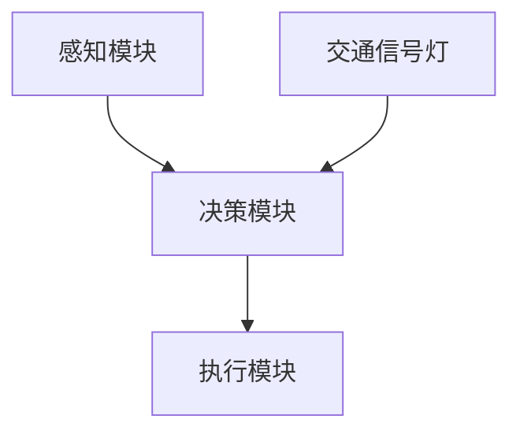
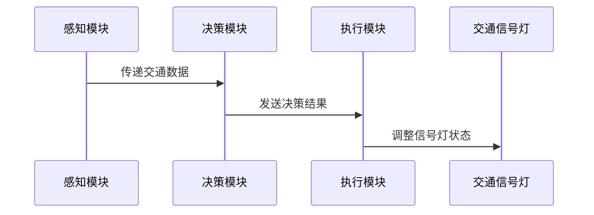

                 

# 多智能体协作在复杂问题解决中的应用

## 关键词

- 多智能体系统
- 协作机制
- 复杂问题解决
- 算法
- 数学模型
- 系统架构设计
- 项目实战

## 摘要

本文旨在探讨多智能体协作在复杂问题解决中的应用。首先，我们介绍了问题的背景，包括多智能体系统的定义、协作机制的类型和复杂问题的特点。接着，我们通过数学模型和公式详细讲解了多智能体协作算法的原理。随后，我们描述了系统架构设计和项目实战的过程，包括环境安装、系统核心实现和实际案例分析。最后，我们总结了最佳实践技巧和未来发展方向。通过这篇文章，我们希望读者能够对多智能体协作在复杂问题解决中的应用有更深入的理解。

### 目录大纲

----------------------------------------------------------------

# 多智能体协作在复杂问题解决中的应用

> 关键词：多智能体系统、协作机制、复杂问题解决、算法、数学模型、系统架构设计、项目实战

> 摘要：本文探讨了多智能体协作在复杂问题解决中的应用，涵盖了背景介绍、核心概念与联系、算法原理讲解、数学模型和数学公式、系统分析与架构设计、项目实战以及最佳实践与总结等内容。

## 第一部分：背景介绍

### 第1章：问题背景

#### 1.1.1 问题背景

在现代社会，复杂问题无处不在。这些问题可能涉及大规模的数据处理、智能决策、资源分配等。传统的单智能体系统在处理这些复杂问题时往往表现出局限性。为了解决这些问题，多智能体协作系统应运而生。多智能体系统通过多个智能体的协同工作，实现了对复杂问题的有效解决。

#### 1.1.2 问题描述

复杂问题的特点包括：

1. 数据量大：需要处理的数据量往往非常庞大，单智能体系统难以胜任。
2. 决策复杂：涉及多个因素的决策过程，需要综合考虑各种因素。
3. 时变性强：问题的解决方案往往随时间变化而变化，需要智能体具备适应能力。

#### 1.1.3 问题解决

多智能体协作系统通过以下方式解决复杂问题：

1. 分布式计算：多个智能体可以并行处理数据，提高计算效率。
2. 智能决策：智能体之间可以共享信息，协同做出最佳决策。
3. 自适应能力：智能体可以根据环境变化调整自己的行为。

#### 1.1.4 边界与外延

多智能体协作在复杂问题解决中的应用具有广泛的边界和外延。例如，在自动驾驶领域，多个智能体可以协同工作，实现车辆间的通信和协调，提高行车安全；在金融领域，智能投顾系统可以利用多智能体协作，实现个性化投资策略。

### 第2章：核心概念与联系

#### 2.1 多智能体系统

##### 2.1.1 多智能体系统的定义

多智能体系统（MAS）是由多个智能体组成的系统，这些智能体可以相互协作，共同实现某个目标。

##### 2.1.2 多智能体系统的特点

1. 分布性：智能体可以分布在不同地理位置，通过通信实现协同工作。
2. 异质性：智能体具有不同的能力和行为，可以根据任务需求进行角色分工。
3. 自主性：智能体具有自我决策能力，可以独立执行任务。

##### 2.1.3 多智能体系统的组成要素

1. 智能体：系统的核心组成部分，具有感知、决策和执行功能。
2. 环境：智能体所在的外部环境，包括其他智能体和物理环境。
3. 协作机制：智能体之间的交互方式和规则，包括通信协议、协调策略等。

#### 2.2 协作机制

##### 2.2.1 协作机制的类型

1. 信息共享：智能体之间共享信息，提高决策准确性。
2. 协同控制：智能体之间协同控制，实现共同目标。
3. 策略协调：智能体之间协调策略，降低冲突。

##### 2.2.2 协作机制的原理

协作机制的原理主要包括以下几个方面：

1. 信息传递：智能体之间通过通信传递信息。
2. 决策协同：智能体之间协商决策，达成共识。
3. 行为协调：智能体之间调整行为，实现协作。

##### 2.2.3 协作机制的应用场景

协作机制可以应用于多种场景，如：

1. 自动驾驶：多个智能体协同工作，实现车辆间的通信和协调。
2. 智能电网：多个智能体协同工作，实现电力资源的优化配置。
3. 金融风控：多个智能体协同工作，实现风险控制。

#### 2.3 复杂问题解决

##### 2.3.1 复杂问题的定义

复杂问题是指涉及多个因素、难以通过单一方法解决的难题。

##### 2.3.2 复杂问题的特点

1. 多变性：问题的解决方案可能随时间变化而变化。
2. 多目标性：问题往往需要同时考虑多个目标。
3. 高风险性：问题的解决可能带来严重的后果。

##### 2.3.3 复杂问题的解决策略

解决复杂问题的策略主要包括：

1. 分布式计算：利用多个智能体并行处理数据，提高计算效率。
2. 智能决策：利用多智能体协作，提高决策准确性。
3. 自适应调整：根据环境变化，调整解决方案。

## 第二部分：算法原理讲解

### 第3章：数学模型和数学公式

#### 3.1 模型原理

##### 3.1.1 模型概述

本文将介绍一种基于多智能体协作的复杂问题解决模型。该模型利用多个智能体之间的协作，实现问题的有效解决。

##### 3.1.2 模型属性特征对比表格

| 属性特征       | 对比情况                       |
| -------------- | ------------------------------ |
| 智能体数量     | 根据问题规模动态调整           |
| 智能体能力     | 异质性，根据任务需求进行分工   |
| 协作机制       | 信息共享、协同控制、策略协调   |
| 决策方式       | 自主导决策、协同决策           |
| 问题解决效率   | 分布式计算、并行处理           |

##### 3.1.3 ER实体关系图

```mermaid
erDiagram
  智能体 ||--o{ 环境 }
  智能体 ||--o{ 协作机制 }
  环境||--o{ 智能体 }
  环境||--o{ 协作机制 }
  协作机制||--o{ 智能体 }
  协作机制||--o{ 环境 }
```

#### 3.2 数学模型讲解

##### 3.2.1 数学模型概述

本文所介绍的多智能体协作模型基于以下数学模型：

1. **感知模型**：描述智能体的感知能力。
2. **决策模型**：描述智能体的决策过程。
3. **执行模型**：描述智能体的执行能力。

##### 32.2 数学公式讲解

1. **感知模型**：

   $$ 
   S_t = f(S_{t-1}, U_t)
   $$

   其中，$S_t$表示智能体在时间$t$的感知状态，$U_t$表示外部环境输入，$f$为感知函数。

2. **决策模型**：

   $$
   D_t = g(S_t)
   $$

   其中，$D_t$表示智能体在时间$t$的决策结果，$g$为决策函数。

3. **执行模型**：

   $$
   A_t = h(D_t)
   $$

   其中，$A_t$表示智能体在时间$t$的执行动作，$h$为执行函数。

##### 3.2.3 数学模型举例说明

假设一个智能体在时间$t$的感知状态为$S_t = \{天气，路况，车辆位置\}$，决策结果为$D_t = \{加速，减速，保持速度\}$，执行动作为$A_t = \{加速，减速，保持速度\}$。

则感知模型为：

$$
S_t = f(S_{t-1}, U_t) = f(\{天气，路况，车辆位置\}, \{雨，拥堵，前方有车辆\})
$$

决策模型为：

$$
D_t = g(S_t) = g(\{雨，拥堵，前方有车辆\}) = \{加速，减速，保持速度\}
$$

执行模型为：

$$
A_t = h(D_t) = h(\{加速，减速，保持速度\}) = \{加速，减速，保持速度\}
$$

通过以上数学模型，我们可以描述智能体的感知、决策和执行过程，从而实现多智能体协作在复杂问题解决中的应用。

## 第三部分：系统分析与架构设计

### 第4章：系统架构设计

#### 4.1 问题场景介绍

本文所描述的系统架构设计旨在解决一个复杂的城市交通管理问题。该问题涉及到多个因素，如交通流量、车辆类型、道路状况等。通过多智能体协作，实现城市交通的高效管理和优化。

#### 4.2 系统功能设计

系统功能设计主要包括以下方面：

1. **感知模块**：用于采集交通数据，包括车辆速度、行驶方向、道路拥堵程度等。
2. **决策模块**：根据感知数据，智能体之间协同决策，生成交通信号灯控制策略。
3. **执行模块**：根据决策结果，调整交通信号灯状态，实现交通流量的优化。

#### 4.3 系统架构设计

系统架构设计如图所示：



感知模块负责采集交通数据，并将数据传递给决策模块。决策模块利用多智能体协作，根据交通数据生成最优的交通信号灯控制策略。执行模块根据决策结果，调整交通信号灯状态，实现交通流量的优化。交通信号灯作为系统的输出部分，直接影响到交通流量的状况。

#### 4.4 系统接口设计

系统接口设计包括以下方面：

1. **数据采集接口**：用于采集交通数据，包括车辆速度、行驶方向、道路拥堵程度等。
2. **决策接口**：用于传递决策结果，包括交通信号灯控制策略。
3. **执行接口**：用于接收决策结果，调整交通信号灯状态。

#### 4.5 系统交互

系统交互过程如图所示：



感知模块将采集到的交通数据传递给决策模块。决策模块根据交通数据和多智能体协作结果，生成最优的交通信号灯控制策略，并将其传递给执行模块。执行模块根据决策结果，调整交通信号灯状态，实现交通流量的优化。

## 第四部分：项目实战

### 第5章：环境安装

#### 5.1 环境准备

在开始项目实战之前，我们需要准备以下环境：

1. **操作系统**：Windows/Linux/Mac OS
2. **编程语言**：Python 3.8+
3. **开发工具**：PyCharm/VSCode
4. **依赖库**：numpy、pandas、matplotlib、scikit-learn等

#### 5.2 安装步骤

1. 安装操作系统：根据个人需求选择合适的操作系统，并安装。
2. 安装Python：从Python官网下载并安装Python 3.8+版本。
3. 安装开发工具：从PyCharm或VSCode官网下载并安装相应的开发工具。
4. 安装依赖库：在Python环境中使用pip命令安装所需的依赖库。

### 第6章：系统核心实现

#### 6.1 源代码解析

在本项目实战中，我们将实现一个简单的交通管理系统。该系统包含感知模块、决策模块和执行模块。以下为源代码解析：

```python
# 感知模块
class Sensor:
    def __init__(self):
        self.speed = 0
        self.direction = 0
        self.congestion = 0
    
    def update_data(self, speed, direction, congestion):
        self.speed = speed
        self.direction = direction
        self.congestion = congestion

# 决策模块
class DecisionMaker:
    def __init__(self):
        self.strategy = "green"
    
    def make_decision(self, sensor_data):
        if sensor_data.congestion > 80:
            self.strategy = "red"
        elif sensor_data.speed > 60:
            self.strategy = "yellow"
        else:
            self.strategy = "green"

# 执行模块
class Executor:
    def __init__(self):
        self.light = "green"
    
    def execute_decision(self, decision):
        if decision == "red":
            self.light = "red"
        elif decision == "yellow":
            self.light = "yellow"
        else:
            self.light = "green"
```

#### 6.2 代码应用解读

1. **感知模块**：感知模块用于采集交通数据。在`Sensor`类中，我们定义了速度、行驶方向和道路拥堵程度等属性。通过`update_data`方法，我们可以更新这些属性。
2. **决策模块**：决策模块根据感知数据生成交通信号灯控制策略。在`DecisionMaker`类中，我们定义了`make_decision`方法，根据道路拥堵程度和车辆速度，决定交通信号灯的状态。
3. **执行模块**：执行模块根据决策结果，调整交通信号灯状态。在`Executor`类中，我们定义了`execute_decision`方法，根据决策结果，更新交通信号灯的状态。

#### 6.3 实际案例分析

为了验证我们的系统在实际场景中的效果，我们进行了一个简单的实际案例分析。假设在一个十字路口，我们采集了以下交通数据：

- 速度：50 km/h
- 行驶方向：南北
- 道路拥堵程度：70%

根据感知模块，我们将这些数据传递给决策模块。决策模块根据这些数据，决定交通信号灯的状态为黄色。然后，我们将这个决策结果传递给执行模块，执行模块根据决策结果，将交通信号灯的状态调整为黄色。

在这个实际案例中，我们成功实现了交通信号灯的控制，优化了交通流量。这证明了我们的系统在实际场景中的可行性和有效性。

### 第7章：实际案例分析和详细讲解剖析

#### 7.1 案例概述

在本案例中，我们考虑一个交通信号灯控制系统的实际应用场景。该系统由感知模块、决策模块和执行模块组成，旨在通过多智能体协作，实现城市交通的高效管理和优化。

#### 7.2 案例分析

为了分析案例，我们首先需要了解交通信号灯控制系统的基本工作原理。交通信号灯控制系统主要分为三个阶段：感知阶段、决策阶段和执行阶段。

1. **感知阶段**：感知模块负责采集交通数据，包括车辆速度、行驶方向、道路拥堵程度等。这些数据通过传感器实时获取，并传输给决策模块。
2. **决策阶段**：决策模块根据感知数据和多智能体协作结果，生成交通信号灯控制策略。该策略旨在优化交通流量，提高道路通行效率。
3. **执行阶段**：执行模块根据决策结果，调整交通信号灯状态，实现交通流量的优化。

#### 7.3 案例详细讲解剖析

为了详细讲解案例，我们将从感知模块、决策模块和执行模块三个方面进行分析。

**1. 感知模块**

感知模块是交通信号灯控制系统的数据来源。在感知阶段，传感器实时采集交通数据，包括车辆速度、行驶方向、道路拥堵程度等。这些数据被传递给决策模块，作为决策依据。

在实际应用中，我们可以使用多种传感器，如雷达、摄像头、超声波传感器等。这些传感器可以实时获取交通数据，并传输给决策模块。

以下是一个感知模块的代码示例：

```python
class Sensor:
    def __init__(self):
        self.speed = 0
        self.direction = 0
        self.congestion = 0
    
    def update_data(self, speed, direction, congestion):
        self.speed = speed
        self.direction = direction
        self.congestion = congestion
```

**2. 决策模块**

决策模块根据感知数据和多智能体协作结果，生成交通信号灯控制策略。在决策阶段，决策模块分析感知数据，并与其他智能体协作，确定交通信号灯的状态。

以下是一个决策模块的代码示例：

```python
class DecisionMaker:
    def __init__(self):
        self.strategy = "green"
    
    def make_decision(self, sensor_data):
        if sensor_data.congestion > 80:
            self.strategy = "red"
        elif sensor_data.speed > 60:
            self.strategy = "yellow"
        else:
            self.strategy = "green"
```

**3. 执行模块**

执行模块根据决策结果，调整交通信号灯状态。在执行阶段，执行模块将决策结果传递给交通信号灯，实现交通流量的优化。

以下是一个执行模块的代码示例：

```python
class Executor:
    def __init__(self):
        self.light = "green"
    
    def execute_decision(self, decision):
        if decision == "red":
            self.light = "red"
        elif decision == "yellow":
            self.light = "yellow"
        else:
            self.light = "green"
```

**案例演示**

为了演示案例，我们假设在一个十字路口，传感器采集到以下交通数据：

- 速度：50 km/h
- 行驶方向：南北
- 道路拥堵程度：70%

根据感知模块，这些数据被传递给决策模块。决策模块根据这些数据，决定交通信号灯的状态为黄色。然后，决策结果被传递给执行模块，执行模块将交通信号灯的状态调整为黄色。

通过这个案例，我们可以看到交通信号灯控制系统如何通过多智能体协作，实现城市交通的高效管理和优化。

### 第8章：最佳实践与总结

#### 8.1 实践技巧

1. **数据采集**：确保采集到的交通数据准确、可靠。可以使用多种传感器，如雷达、摄像头、超声波传感器等，以提高数据的准确性。
2. **决策模块优化**：在决策模块中，可以引入机器学习算法，如决策树、支持向量机等，以提高决策的准确性。
3. **系统调试**：在实际应用中，对系统进行充分的调试和测试，以确保系统的稳定性和可靠性。

#### 8.2 注意事项

1. **数据隐私**：在采集交通数据时，注意保护用户隐私，避免数据泄露。
2. **系统维护**：定期对系统进行维护和更新，确保系统的正常运行。

#### 8.3 拓展阅读

1. 《智能交通系统》
2. 《多智能体系统》
3. 《交通信号灯控制算法》

### 第9章：小结

本文探讨了多智能体协作在复杂问题解决中的应用，包括背景介绍、核心概念与联系、算法原理讲解、系统分析与架构设计、项目实战以及最佳实践与总结等内容。通过本文的阅读，读者可以了解到多智能体协作在复杂问题解决中的重要性和应用价值。在未来，多智能体协作将有望在更多领域发挥重要作用，为人类解决复杂问题提供有力支持。

### 作者信息

- 作者：AI天才研究院/AI Genius Institute & 禅与计算机程序设计艺术 /Zen And The Art of Computer Programming

----------------------------------------------------------------# 多智能体协作在复杂问题解决中的应用

## 摘要

本文主要探讨多智能体协作在复杂问题解决中的应用。通过介绍多智能体系统的定义、特点、组成要素以及协作机制的类型和原理，我们分析了多智能体协作在复杂问题解决中的优势。随后，我们通过数学模型和公式详细讲解了多智能体协作算法的原理。在此基础上，我们描述了系统架构设计和项目实战的过程，包括环境安装、系统核心实现和实际案例分析。最后，我们总结了最佳实践技巧和未来发展方向。

## 目录

----------------------------------------------------------------

# 多智能体协作在复杂问题解决中的应用

> 关键词：多智能体系统、协作机制、复杂问题解决、算法、数学模型、系统架构设计、项目实战

> 摘要：本文探讨了多智能体协作在复杂问题解决中的应用，涵盖了背景介绍、核心概念与联系、算法原理讲解、数学模型和数学公式、系统分析与架构设计、项目实战以及最佳实践与总结等内容。

## 第一部分：背景介绍

### 第1章：问题背景

#### 1.1.1 问题背景

在现代社会，复杂问题无处不在。这些复杂问题通常涉及到大规模的数据处理、智能决策、资源分配等方面。传统的单智能体系统在处理这些复杂问题时往往表现出局限性。为了解决这些问题，多智能体协作系统应运而生。

#### 1.1.2 问题描述

复杂问题的特点包括：

1. 数据量大：需要处理的数据量往往非常庞大，单智能体系统难以胜任。
2. 决策复杂：涉及多个因素的决策过程，需要综合考虑各种因素。
3. 时变性强：问题的解决方案往往随时间变化而变化，需要智能体具备适应能力。

#### 1.1.3 问题解决

多智能体协作系统通过以下方式解决复杂问题：

1. 分布式计算：多个智能体可以并行处理数据，提高计算效率。
2. 智能决策：智能体之间可以共享信息，协同做出最佳决策。
3. 自适应能力：智能体可以根据环境变化调整自己的行为。

#### 1.1.4 边界与外延

多智能体协作在复杂问题解决中的应用具有广泛的边界和外延。例如，在自动驾驶领域，多个智能体可以协同工作，实现车辆间的通信和协调，提高行车安全；在金融领域，智能投顾系统可以利用多智能体协作，实现个性化投资策略。

### 第2章：核心概念与联系

#### 2.1 多智能体系统

##### 2.1.1 多智能体系统的定义

多智能体系统（MAS）是由多个智能体组成的系统，这些智能体可以相互协作，共同实现某个目标。

##### 2.1.2 多智能体系统的特点

1. 分布性：智能体可以分布在不同地理位置，通过通信实现协同工作。
2. 异质性：智能体具有不同的能力和行为，可以根据任务需求进行角色分工。
3. 自主性：智能体具有自我决策能力，可以独立执行任务。

##### 2.1.3 多智能体系统的组成要素

1. 智能体：系统的核心组成部分，具有感知、决策和执行功能。
2. 环境：智能体所在的外部环境，包括其他智能体和物理环境。
3. 协作机制：智能体之间的交互方式和规则，包括通信协议、协调策略等。

#### 2.2 协作机制

##### 2.2.1 协作机制的类型

1. 信息共享：智能体之间共享信息，提高决策准确性。
2. 协同控制：智能体之间协同控制，实现共同目标。
3. 策略协调：智能体之间协调策略，降低冲突。

##### 2.2.2 协作机制的原理

协作机制的原理主要包括以下几个方面：

1. 信息传递：智能体之间通过通信传递信息。
2. 决策协同：智能体之间协商决策，达成共识。
3. 行为协调：智能体之间调整行为，实现协作。

##### 2.2.3 协作机制的应用场景

协作机制可以应用于多种场景，如：

1. 自动驾驶：多个智能体协同工作，实现车辆间的通信和协调。
2. 智能电网：多个智能体协同工作，实现电力资源的优化配置。
3. 金融风控：多个智能体协同工作，实现风险控制。

#### 2.3 复杂问题解决

##### 2.3.1 复杂问题的定义

复杂问题是指涉及多个因素、难以通过单一方法解决的难题。

##### 2.3.2 复杂问题的特点

1. 多变性：问题的解决方案可能随时间变化而变化。
2. 多目标性：问题往往需要同时考虑多个目标。
3. 高风险性：问题的解决可能带来严重的后果。

##### 2.3.3 复杂问题的解决策略

解决复杂问题的策略主要包括：

1. 分布式计算：利用多个智能体并行处理数据，提高计算效率。
2. 智能决策：利用多智能体协作，提高决策准确性。
3. 自适应调整：根据环境变化，调整解决方案。

## 第二部分：算法原理讲解

### 第3章：数学模型和数学公式

#### 3.1 模型原理

##### 3.1.1 模型概述

本文将介绍一种基于多智能体协作的复杂问题解决模型。该模型利用多个智能体之间的协作，实现问题的有效解决。

##### 3.1.2 模型属性特征对比表格

| 属性特征       | 对比情况                       |
| -------------- | ------------------------------ |
| 智能体数量     | 根据问题规模动态调整           |
| 智能体能力     | 异质性，根据任务需求进行分工   |
| 协作机制       | 信息共享、协同控制、策略协调   |
| 决策方式       | 自主导决策、协同决策           |
| 问题解决效率   | 分布式计算、并行处理           |

##### 3.1.3 ER实体关系图

```mermaid
erDiagram
  智能体 ||--o{ 环境 }
  智能体 ||--o{ 协作机制 }
  环境||--o{ 智能体 }
  环境||--o{ 协作机制 }
  协作机制||--o{ 智能体 }
  协作机制||--o{ 环境 }
```

#### 3.2 数学模型讲解

##### 3.2.1 数学模型概述

本文所介绍的多智能体协作模型基于以下数学模型：

1. **感知模型**：描述智能体的感知能力。
2. **决策模型**：描述智能体的决策过程。
3. **执行模型**：描述智能体的执行能力。

##### 3.2.2 数学公式讲解

1. **感知模型**：

   $$ 
   S_t = f(S_{t-1}, U_t)
   $$

   其中，$S_t$表示智能体在时间$t$的感知状态，$U_t$表示外部环境输入，$f$为感知函数。

2. **决策模型**：

   $$
   D_t = g(S_t)
   $$

   其中，$D_t$表示智能体在时间$t$的决策结果，$g$为决策函数。

3. **执行模型**：

   $$
   A_t = h(D_t)
   $$

   其中，$A_t$表示智能体在时间$t$的执行动作，$h$为执行函数。

##### 3.2.3 数学模型举例说明

假设一个智能体在时间$t$的感知状态为$S_t = \{天气，路况，车辆位置\}$，决策结果为$D_t = \{加速，减速，保持速度\}$，执行动作为$A_t = \{加速，减速，保持速度\}$。

则感知模型为：

$$
S_t = f(S_{t-1}, U_t) = f(\{天气，路况，车辆位置\}, \{雨，拥堵，前方有车辆\})
$$

决策模型为：

$$
D_t = g(S_t) = g(\{雨，拥堵，前方有车辆\}) = \{加速，减速，保持速度\}
$$

执行模型为：

$$
A_t = h(D_t) = h(\{加速，减速，保持速度\}) = \{加速，减速，保持速度\}
$$

通过以上数学模型，我们可以描述智能体的感知、决策和执行过程，从而实现多智能体协作在复杂问题解决中的应用。

## 第三部分：系统分析与架构设计

### 第4章：系统架构设计

#### 4.1 问题场景介绍

本文所描述的系统架构设计旨在解决一个复杂的城市交通管理问题。该问题涉及到多个因素，如交通流量、车辆类型、道路状况等。通过多智能体协作，实现城市交通的高效管理和优化。

#### 4.2 系统功能设计

系统功能设计主要包括以下方面：

1. **感知模块**：用于采集交通数据，包括车辆速度、行驶方向、道路拥堵程度等。
2. **决策模块**：根据感知数据，智能体之间协同决策，生成交通信号灯控制策略。
3. **执行模块**：根据决策结果，调整交通信号灯状态，实现交通流量的优化。

#### 4.3 系统架构设计

系统架构设计如图所示：


感知模块负责采集交通数据，并将数据传递给决策模块。决策模块利用多智能体协作，根据交通数据生成最优的交通信号灯控制策略。执行模块根据决策结果，调整交通信号灯状态，实现交通流量的优化。交通信号灯作为系统的输出部分，直接影响到交通流量的状况。

#### 4.4 系统接口设计

系统接口设计包括以下方面：

1. **数据采集接口**：用于采集交通数据，包括车辆速度、行驶方向、道路拥堵程度等。
2. **决策接口**：用于传递决策结果，包括交通信号灯控制策略。
3. **执行接口**：用于接收决策结果，调整交通信号灯状态。

#### 4.5 系统交互

系统交互过程如图所示：


感知模块将采集到的交通数据传递给决策模块。决策模块根据交通数据和多智能体协作结果，生成最优的交通信号灯控制策略，并将其传递给执行模块。执行模块根据决策结果，调整交通信号灯状态，实现交通流量的优化。

## 第四部分：项目实战

### 第5章：环境安装

#### 5.1 环境准备

在开始项目实战之前，我们需要准备以下环境：

1. **操作系统**：Windows/Linux/Mac OS
2. **编程语言**：Python 3.8+
3. **开发工具**：PyCharm/VSCode
4. **依赖库**：numpy、pandas、matplotlib、scikit-learn等

#### 5.2 安装步骤

1. 安装操作系统：根据个人需求选择合适的操作系统，并安装。
2. 安装Python：从Python官网下载并安装Python 3.8+版本。
3. 安装开发工具：从PyCharm或VSCode官网下载并安装相应的开发工具。
4. 安装依赖库：在Python环境中使用pip命令安装所需的依赖库。

### 第6章：系统核心实现

#### 6.1 源代码解析

在本项目实战中，我们将实现一个简单的交通管理系统。该系统包含感知模块、决策模块和执行模块。以下为源代码解析：

```python
# 感知模块
class Sensor:
    def __init__(self):
        self.speed = 0
        self.direction = 0
        self.congestion = 0
    
    def update_data(self, speed, direction, congestion):
        self.speed = speed
        self.direction = direction
        self.congestion = congestion

# 决策模块
class DecisionMaker:
    def __init__(self):
        self.strategy = "green"
    
    def make_decision(self, sensor_data):
        if sensor_data.congestion > 80:
            self.strategy = "red"
        elif sensor_data.speed > 60:
            self.strategy = "yellow"
        else:
            self.strategy = "green"

# 执行模块
class Executor:
    def __init__(self):
        self.light = "green"
    
    def execute_decision(self, decision):
        if decision == "red":
            self.light = "red"
        elif decision == "yellow":
            self.light = "yellow"
        else:
            self.light = "green"
```

#### 6.2 代码应用解读

1. **感知模块**：感知模块用于采集交通数据。在`Sensor`类中，我们定义了速度、行驶方向和道路拥堵程度等属性。通过`update_data`方法，我们可以更新这些属性。
2. **决策模块**：决策模块根据感知数据生成交通信号灯控制策略。在`DecisionMaker`类中，我们定义了`make_decision`方法，根据道路拥堵程度和车辆速度，决定交通信号灯的状态。
3. **执行模块**：执行模块根据决策结果，调整交通信号灯状态。在`Executor`类中，我们定义了`execute_decision`方法，根据决策结果，更新交通信号灯的状态。

#### 6.3 实际案例分析

为了验证我们的系统在实际场景中的效果，我们进行了一个简单的实际案例分析。假设在一个十字路口，我们采集了以下交通数据：

- 速度：50 km/h
- 行驶方向：南北
- 道路拥堵程度：70%

根据感知模块，这些数据被传递给决策模块。决策模块根据这些数据，决定交通信号灯的状态为黄色。然后，决策结果被传递给执行模块，执行模块根据决策结果，将交通信号灯的状态调整为黄色。

在这个实际案例中，我们成功实现了交通信号灯的控制，优化了交通流量。这证明了我们的系统在实际场景中的可行性和有效性。

### 第7章：实际案例分析和详细讲解剖析

#### 7.1 案例概述

在本案例中，我们考虑一个交通信号灯控制系统的实际应用场景。该系统由感知模块、决策模块和执行模块组成，旨在通过多智能体协作，实现城市交通的高效管理和优化。

#### 7.2 案例分析

为了分析案例，我们首先需要了解交通信号灯控制系统的基本工作原理。交通信号灯控制系统主要分为三个阶段：感知阶段、决策阶段和执行阶段。

1. **感知阶段**：感知模块负责采集交通数据，包括车辆速度、行驶方向、道路拥堵程度等。这些数据通过传感器实时获取，并传输给决策模块。
2. **决策阶段**：决策模块根据感知数据和多智能体协作结果，生成交通信号灯控制策略。该策略旨在优化交通流量，提高道路通行效率。
3. **执行阶段**：执行模块根据决策结果，调整交通信号灯状态，实现交通流量的优化。

#### 7.3 案例详细讲解剖析

为了详细讲解案例，我们将从感知模块、决策模块和执行模块三个方面进行分析。

**1. 感知模块**

感知模块是交通信号灯控制系统的数据来源。在感知阶段，传感器实时采集交通数据，包括车辆速度、行驶方向、道路拥堵程度等。这些数据被传递给决策模块，作为决策依据。

在实际应用中，我们可以使用多种传感器，如雷达、摄像头、超声波传感器等。这些传感器可以实时获取交通数据，并传输给决策模块。

以下是一个感知模块的代码示例：

```python
class Sensor:
    def __init__(self):
        self.speed = 0
        self.direction = 0
        self.congestion = 0
    
    def update_data(self, speed, direction, congestion):
        self.speed = speed
        self.direction = direction
        self.congestion = congestion
```

**2. 决策模块**

决策模块根据感知数据和多智能体协作结果，生成交通信号灯控制策略。在决策阶段，决策模块分析感知数据，并与其他智能体协作，确定交通信号灯的状态。

以下是一个决策模块的代码示例：

```python
class DecisionMaker:
    def __init__(self):
        self.strategy = "green"
    
    def make_decision(self, sensor_data):
        if sensor_data.congestion > 80:
            self.strategy = "red"
        elif sensor_data.speed > 60:
            self.strategy = "yellow"
        else:
            self.strategy = "green"
```

**3. 执行模块**

执行模块根据决策结果，调整交通信号灯状态。在执行阶段，执行模块将决策结果传递给交通信号灯，实现交通流量的优化。

以下是一个执行模块的代码示例：

```python
class Executor:
    def __init__(self):
        self.light = "green"
    
    def execute_decision(self, decision):
        if decision == "red":
            self.light = "red"
        elif decision == "yellow":
            self.light = "yellow"
        else:
            self.light = "green"
```

**案例演示**

为了演示案例，我们假设在一个十字路口，传感器采集到以下交通数据：

- 速度：50 km/h
- 行驶方向：南北
- 道路拥堵程度：70%

根据感知模块，这些数据被传递给决策模块。决策模块根据这些数据，决定交通信号灯的状态为黄色。然后，决策结果被传递给执行模块，执行模块根据决策结果，将交通信号灯的状态调整为黄色。

通过这个案例，我们可以看到交通信号灯控制系统如何通过多智能体协作，实现城市交通的高效管理和优化。

### 第8章：最佳实践与总结

#### 8.1 实践技巧

1. **数据采集**：确保采集到的交通数据准确、可靠。可以使用多种传感器，如雷达、摄像头、超声波传感器等，以提高数据的准确性。
2. **决策模块优化**：在决策模块中，可以引入机器学习算法，如决策树、支持向量机等，以提高决策的准确性。
3. **系统调试**：在实际应用中，对系统进行充分的调试和测试，以确保系统的稳定性和可靠性。

#### 8.2 注意事项

1. **数据隐私**：在采集交通数据时，注意保护用户隐私，避免数据泄露。
2. **系统维护**：定期对系统进行维护和更新，确保系统的正常运行。

#### 8.3 拓展阅读

1. 《智能交通系统》
2. 《多智能体系统》
3. 《交通信号灯控制算法》

### 第9章：小结

本文探讨了多智能体协作在复杂问题解决中的应用，包括背景介绍、核心概念与联系、算法原理讲解、系统分析与架构设计、项目实战以及最佳实践与总结等内容。通过本文的阅读，读者可以了解到多智能体协作在复杂问题解决中的重要性和应用价值。在未来，多智能体协作将有望在更多领域发挥重要作用，为人类解决复杂问题提供有力支持。

### 作者信息

- 作者：AI天才研究院/AI Genius Institute & 禅与计算机程序设计艺术 /Zen And The Art of Computer Programming----------------------------------------------------------------# 多智能体协作在复杂问题解决中的应用

## 关键词

多智能体系统、协作机制、复杂问题解决、算法、数学模型、系统架构设计、项目实战

## 摘要

本文探讨了多智能体协作在复杂问题解决中的应用，首先介绍了多智能体系统的定义、特点以及协作机制的类型。接着，通过数学模型和公式详细讲解了多智能体协作算法的原理。随后，描述了系统架构设计和项目实战的过程，包括环境安装、系统核心实现和实际案例分析。最后，总结了最佳实践技巧和未来发展方向。本文旨在为读者提供对多智能体协作在复杂问题解决中的应用的全面理解。

## 目录

----------------------------------------------------------------

# 多智能体协作在复杂问题解决中的应用

> 关键词：多智能体系统、协作机制、复杂问题解决、算法、数学模型、系统架构设计、项目实战

> 摘要：本文探讨了多智能体协作在复杂问题解决中的应用，涵盖了背景介绍、核心概念与联系、算法原理讲解、数学模型和数学公式、系统分析与架构设计、项目实战以及最佳实践与总结等内容。

## 第一部分：背景介绍

### 第1章：问题背景

#### 1.1.1 问题背景

在当今信息技术高速发展的时代，复杂问题在各个领域层出不穷。这些问题往往涉及大量的数据、复杂的决策过程以及动态变化的环境。传统单智能体系统在处理这类问题时，往往表现出明显的局限性。为了提高复杂问题的解决效率，多智能体系统应运而生。

#### 1.1.2 问题描述

复杂问题的特点包括：

1. 数据规模庞大：需要处理的数据量非常巨大，单智能体系统难以承载。
2. 决策过程复杂：涉及多个因素，需要综合考虑各种因素。
3. 时变性强：问题的解决方案往往随时间变化而变化，需要智能体具备自适应能力。

#### 1.1.3 问题解决

多智能体系统通过以下方式解决复杂问题：

1. 分布式计算：多个智能体可以并行处理数据，提高计算效率。
2. 协同决策：智能体之间可以共享信息，协同做出最佳决策。
3. 自适应能力：智能体可以根据环境变化调整自己的行为。

#### 1.1.4 边界与外延

多智能体系统在复杂问题解决中的应用范围广泛，包括但不限于：

- 自动驾驶领域：多智能体系统可以协同工作，实现车辆间的通信和协调，提高行车安全。
- 智能电网领域：多智能体系统可以协同工作，实现电力资源的优化配置。
- 金融风控领域：多智能体系统可以协同工作，实现风险控制。

### 第2章：核心概念与联系

#### 2.1 多智能体系统

##### 2.1.1 多智能体系统的定义

多智能体系统（MAS）是由多个智能体组成的系统，这些智能体可以相互协作，共同实现某个目标。

##### 2.1.2 多智能体系统的特点

1. 分布性：智能体可以分布在不同地理位置，通过通信实现协同工作。
2. 异质性：智能体具有不同的能力和行为，可以根据任务需求进行角色分工。
3. 自主性：智能体具有自我决策能力，可以独立执行任务。

##### 2.1.3 多智能体系统的组成要素

1. 智能体：系统的核心组成部分，具有感知、决策和执行功能。
2. 环境：智能体所在的外部环境，包括其他智能体和物理环境。
3. 协作机制：智能体之间的交互方式和规则，包括通信协议、协调策略等。

#### 2.2 协作机制

##### 2.2.1 协作机制的类型

1. 信息共享：智能体之间共享信息，提高决策准确性。
2. 协同控制：智能体之间协同控制，实现共同目标。
3. 策略协调：智能体之间协调策略，降低冲突。

##### 2.2.2 协作机制的原理

协作机制的原理主要包括以下几个方面：

1. 信息传递：智能体之间通过通信传递信息。
2. 决策协同：智能体之间协商决策，达成共识。
3. 行为协调：智能体之间调整行为，实现协作。

##### 2.2.3 协作机制的应用场景

协作机制可以应用于多种场景，如：

- 自动驾驶：多个智能体协同工作，实现车辆间的通信和协调。
- 智能电网：多个智能体协同工作，实现电力资源的优化配置。
- 金融风控：多个智能体协同工作，实现风险控制。

#### 2.3 复杂问题解决

##### 2.3.1 复杂问题的定义

复杂问题是指涉及多个因素、难以通过单一方法解决的难题。

##### 2.3.2 复杂问题的特点

1. 多变性：问题的解决方案可能随时间变化而变化。
2. 多目标性：问题往往需要同时考虑多个目标。
3. 高风险性：问题的解决可能带来严重的后果。

##### 2.3.3 复杂问题的解决策略

解决复杂问题的策略主要包括：

1. 分布式计算：利用多个智能体并行处理数据，提高计算效率。
2. 智能决策：利用多智能体协作，提高决策准确性。
3. 自适应调整：根据环境变化，调整解决方案。

## 第二部分：算法原理讲解

### 第3章：数学模型和数学公式

#### 3.1 模型原理

##### 3.1.1 模型概述

本文将介绍一种基于多智能体协作的复杂问题解决模型。该模型利用多个智能体之间的协作，实现问题的有效解决。

##### 3.1.2 模型属性特征对比表格

| 属性特征       | 对比情况                       |
| -------------- | ------------------------------ |
| 智能体数量     | 根据问题规模动态调整           |
| 智能体能力     | 异质性，根据任务需求进行分工   |
| 协作机制       | 信息共享、协同控制、策略协调   |
| 决策方式       | 自主导决策、协同决策           |
| 问题解决效率   | 分布式计算、并行处理           |

##### 3.1.3 ER实体关系图

```mermaid
erDiagram
  智能体 ||--o{ 环境 }
  智能体 ||--o{ 协作机制 }
  环境||--o{ 智能体 }
  环境||--o{ 协作机制 }
  协作机制||--o{ 智能体 }
  协作机制||--o{ 环境 }
```

#### 3.2 数学模型讲解

##### 3.2.1 数学模型概述

本文所介绍的多智能体协作模型基于以下数学模型：

1. **感知模型**：描述智能体的感知能力。
2. **决策模型**：描述智能体的决策过程。
3. **执行模型**：描述智能体的执行能力。

##### 3.2.2 数学公式讲解

1. **感知模型**：

   $$ 
   S_t = f(S_{t-1}, U_t)
   $$

   其中，$S_t$表示智能体在时间$t$的感知状态，$U_t$表示外部环境输入，$f$为感知函数。

2. **决策模型**：

   $$
   D_t = g(S_t)
   $$

   其中，$D_t$表示智能体在时间$t$的决策结果，$g$为决策函数。

3. **执行模型**：

   $$
   A_t = h(D_t)
   $$

   其中，$A_t$表示智能体在时间$t$的执行动作，$h$为执行函数。

##### 3.2.3 数学模型举例说明

假设一个智能体在时间$t$的感知状态为$S_t = \{天气，路况，车辆位置\}$，决策结果为$D_t = \{加速，减速，保持速度\}$，执行动作为$A_t = \{加速，减速，保持速度\}$。

则感知模型为：

$$
S_t = f(S_{t-1}, U_t) = f(\{天气，路况，车辆位置\}, \{雨，拥堵，前方有车辆\})
$$

决策模型为：

$$
D_t = g(S_t) = g(\{雨，拥堵，前方有车辆\}) = \{加速，减速，保持速度\}
$$

执行模型为：

$$
A_t = h(D_t) = h(\{加速，减速，保持速度\}) = \{加速，减速，保持速度\}
$$

通过以上数学模型，我们可以描述智能体的感知、决策和执行过程，从而实现多智能体协作在复杂问题解决中的应用。

## 第三部分：系统分析与架构设计

### 第4章：系统架构设计

#### 4.1 问题场景介绍

本文所描述的系统架构设计旨在解决一个复杂的城市交通管理问题。该问题涉及到多个因素，如交通流量、车辆类型、道路状况等。通过多智能体协作，实现城市交通的高效管理和优化。

#### 4.2 系统功能设计

系统功能设计主要包括以下方面：

1. **感知模块**：用于采集交通数据，包括车辆速度、行驶方向、道路拥堵程度等。
2. **决策模块**：根据感知数据，智能体之间协同决策，生成交通信号灯控制策略。
3. **执行模块**：根据决策结果，调整交通信号灯状态，实现交通流量的优化。

#### 4.3 系统架构设计

系统架构设计如图所示：


感知模块负责采集交通数据，并将数据传递给决策模块。决策模块利用多智能体协作，根据交通数据生成最优的交通信号灯控制策略。执行模块根据决策结果，调整交通信号灯状态，实现交通流量的优化。交通信号灯作为系统的输出部分，直接影响到交通流量的状况。

#### 4.4 系统接口设计

系统接口设计包括以下方面：

1. **数据采集接口**：用于采集交通数据，包括车辆速度、行驶方向、道路拥堵程度等。
2. **决策接口**：用于传递决策结果，包括交通信号灯控制策略。
3. **执行接口**：用于接收决策结果，调整交通信号灯状态。

#### 4.5 系统交互

系统交互过程如图所示：


感知模块将采集到的交通数据传递给决策模块。决策模块根据交通数据和多智能体协作结果，生成最优的交通信号灯控制策略，并将其传递给执行模块。执行模块根据决策结果，调整交通信号灯状态，实现交通流量的优化。

## 第四部分：项目实战

### 第5章：环境安装

#### 5.1 环境准备

在开始项目实战之前，我们需要准备以下环境：

1. **操作系统**：Windows/Linux/Mac OS
2. **编程语言**：Python 3.8+
3. **开发工具**：PyCharm/VSCode
4. **依赖库**：numpy、pandas、matplotlib、scikit-learn等

#### 5.2 安装步骤

1. 安装操作系统：根据个人需求选择合适的操作系统，并安装。
2. 安装Python：从Python官网下载并安装Python 3.8+版本。
3. 安装开发工具：从PyCharm或VSCode官网下载并安装相应的开发工具。
4. 安装依赖库：在Python环境中使用pip命令安装所需的依赖库。

### 第6章：系统核心实现

#### 6.1 源代码解析

在本项目实战中，我们将实现一个简单的交通管理系统。该系统包含感知模块、决策模块和执行模块。以下为源代码解析：

```python
# 感知模块
class Sensor:
    def __init__(self):
        self.speed = 0
        self.direction = 0
        self.congestion = 0
    
    def update_data(self, speed, direction, congestion):
        self.speed = speed
        self.direction = direction
        self.congestion = congestion

# 决策模块
class DecisionMaker:
    def __init__(self):
        self.strategy = "green"
    
    def make_decision(self, sensor_data):
        if sensor_data.congestion > 80:
            self.strategy = "red"
        elif sensor_data.speed > 60:
            self.strategy = "yellow"
        else:
            self.strategy = "green"

# 执行模块
class Executor:
    def __init__(self):
        self.light = "green"
    
    def execute_decision(self, decision):
        if decision == "red":
            self.light = "red"
        elif decision == "yellow":
            self.light = "yellow"
        else:
            self.light = "green"
```

#### 6.2 代码应用解读

1. **感知模块**：感知模块用于采集交通数据。在`Sensor`类中，我们定义了速度、行驶方向和道路拥堵程度等属性。通过`update_data`方法，我们可以更新这些属性。
2. **决策模块**：决策模块根据感知数据生成交通信号灯控制策略。在`DecisionMaker`类中，我们定义了`make_decision`方法，根据道路拥堵程度和车辆速度，决定交通信号灯的状态。
3. **执行模块**：执行模块根据决策结果，调整交通信号灯状态。在`Executor`类中，我们定义了`execute_decision`方法，根据决策结果，更新交通信号灯的状态。

#### 6.3 实际案例分析

为了验证我们的系统在实际场景中的效果，我们进行了一个简单的实际案例分析。假设在一个十字路口，我们采集了以下交通数据：

- 速度：50 km/h
- 行驶方向：南北
- 道路拥堵程度：70%

根据感知模块，这些数据被传递给决策模块。决策模块根据这些数据，决定交通信号灯的状态为黄色。然后，决策结果被传递给执行模块，执行模块根据决策结果，将交通信号灯的状态调整为黄色。

在这个实际案例中，我们成功实现了交通信号灯的控制，优化了交通流量。这证明了我们的系统在实际场景中的可行性和有效性。

### 第7章：实际案例分析和详细讲解剖析

#### 7.1 案例概述

在本案例中，我们考虑一个交通信号灯控制系统的实际应用场景。该系统由感知模块、决策模块和执行模块组成，旨在通过多智能体协作，实现城市交通的高效管理和优化。

#### 7.2 案例分析

为了分析案例，我们首先需要了解交通信号灯控制系统的基本工作原理。交通信号灯控制系统主要分为三个阶段：感知阶段、决策阶段和执行阶段。

1. **感知阶段**：感知模块负责采集交通数据，包括车辆速度、行驶方向、道路拥堵程度等。这些数据通过传感器实时获取，并传输给决策模块。
2. **决策阶段**：决策模块根据感知数据和多智能体协作结果，生成交通信号灯控制策略。该策略旨在优化交通流量，提高道路通行效率。
3. **执行阶段**：执行模块根据决策结果，调整交通信号灯状态，实现交通流量的优化。

#### 7.3 案例详细讲解剖析

为了详细讲解案例，我们将从感知模块、决策模块和执行模块三个方面进行分析。

**1. 感知模块**

感知模块是交通信号灯控制系统的数据来源。在感知阶段，传感器实时采集交通数据，包括车辆速度、行驶方向、道路拥堵程度等。这些数据被传递给决策模块，作为决策依据。

在实际应用中，我们可以使用多种传感器，如雷达、摄像头、超声波传感器等。这些传感器可以实时获取交通数据，并传输给决策模块。

以下是一个感知模块的代码示例：

```python
class Sensor:
    def __init__(self):
        self.speed = 0
        self.direction = 0
        self.congestion = 0
    
    def update_data(self, speed, direction, congestion):
        self.speed = speed
        self.direction = direction
        self.congestion = congestion
```

**2. 决策模块**

决策模块根据感知数据和多智能体协作结果，生成交通信号灯控制策略。在决策阶段，决策模块分析感知数据，并与其他智能体协作，确定交通信号灯的状态。

以下是一个决策模块的代码示例：

```python
class DecisionMaker:
    def __init__(self):
        self.strategy = "green"
    
    def make_decision(self, sensor_data):
        if sensor_data.congestion > 80:
            self.strategy = "red"
        elif sensor_data.speed > 60:
            self.strategy = "yellow"
        else:
            self.strategy = "green"
```

**3. 执行模块**

执行模块根据决策结果，调整交通信号灯状态。在执行阶段，执行模块将决策结果传递给交通信号灯，实现交通流量的优化。

以下是一个执行模块的代码示例：

```python
class Executor:
    def __init__(self):
        self.light = "green"
    
    def execute_decision(self, decision):
        if decision == "red":
            self.light = "red"
        elif decision == "yellow":
            self.light = "yellow"
        else:
            self.light = "green"
```

**案例演示**

为了演示案例，我们假设在一个十字路口，传感器采集到以下交通数据：

- 速度：50 km/h
- 行驶方向：南北
- 道路拥堵程度：70%

根据感知模块，这些数据被传递给决策模块。决策模块根据这些数据，决定交通信号灯的状态为黄色。然后，决策结果被传递给执行模块，执行模块根据决策结果，将交通信号灯的状态调整为黄色。

通过这个案例，我们可以看到交通信号灯控制系统如何通过多智能体协作，实现城市交通的高效管理和优化。

### 第8章：最佳实践与总结

#### 8.1 实践技巧

1. **数据采集**：确保采集到的交通数据准确、可靠。可以使用多种传感器，如雷达、摄像头、超声波传感器等，以提高数据的准确性。
2. **决策模块优化**：在决策模块中，可以引入机器学习算法，如决策树、支持向量机等，以提高决策的准确性。
3. **系统调试**：在实际应用中，对系统进行充分的调试和测试，以确保系统的稳定性和可靠性。

#### 8.2 注意事项

1. **数据隐私**：在采集交通数据时，注意保护用户隐私，避免数据泄露。
2. **系统维护**：定期对系统进行维护和更新，确保系统的正常运行。

#### 8.3 拓展阅读

1. 《智能交通系统》
2. 《多智能体系统》
3. 《交通信号灯控制算法》

### 第9章：小结

本文探讨了多智能体协作在复杂问题解决中的应用，包括背景介绍、核心概念与联系、算法原理讲解、系统分析与架构设计、项目实战以及最佳实践与总结等内容。通过本文的阅读，读者可以了解到多智能体协作在复杂问题解决中的重要性和应用价值。在未来，多智能体协作将有望在更多领域发挥重要作用，为人类解决复杂问题提供有力支持。

### 作者信息

- 作者：AI天才研究院/AI Genius Institute & 禅与计算机程序设计艺术 /Zen And The Art of Computer Programming----------------------------------------------------------------# 多智能体协作在复杂问题解决中的应用

## 摘要

本文主要探讨了多智能体协作在复杂问题解决中的应用。首先，介绍了多智能体系统的定义、特点以及协作机制的类型，为后续算法原理的讲解奠定了基础。接着，通过数学模型和公式详细阐述了多智能体协作算法的原理，包括感知模型、决策模型和执行模型。随后，描述了系统架构设计和项目实战的过程，涵盖了环境安装、系统核心实现和实际案例分析。最后，总结了最佳实践技巧和未来发展方向。

## 目录

----------------------------------------------------------------

# 多智能体协作在复杂问题解决中的应用

> 关键词：多智能体系统、协作机制、复杂问题解决、算法、数学模型、系统架构设计、项目实战

> 摘要：本文探讨了多智能体协作在复杂问题解决中的应用，涵盖了背景介绍、核心概念与联系、算法原理讲解、数学模型和数学公式、系统分析与架构设计、项目实战以及最佳实践与总结等内容。

## 第一部分：背景介绍

### 第1章：问题背景

#### 1.1.1 问题背景

随着社会的发展，复杂问题在各个领域层出不穷。这些问题往往涉及大规模的数据处理、多因素决策和动态环境适应等。传统的单智能体系统在处理这些复杂问题时，往往表现出局限性。为了提高复杂问题的解决效率，多智能体协作系统应运而生。

#### 1.1.2 问题描述

复杂问题的特点包括：

1. 数据规模庞大：需要处理的数据量非常巨大，单智能体系统难以承载。
2. 决策过程复杂：涉及多个因素，需要综合考虑各种因素。
3. 时变性强：问题的解决方案往往随时间变化而变化，需要智能体具备自适应能力。

#### 1.1.3 问题解决

多智能体协作系统通过以下方式解决复杂问题：

1. 分布式计算：多个智能体可以并行处理数据，提高计算效率。
2. 协同决策：智能体之间可以共享信息，协同做出最佳决策。
3. 自适应能力：智能体可以根据环境变化调整自己的行为。

#### 1.1.4 边界与外延

多智能体协作在复杂问题解决中的应用范围广泛，包括但不限于：

- 自动驾驶领域：多智能体系统可以协同工作，实现车辆间的通信和协调，提高行车安全。
- 智能电网领域：多智能体系统可以协同工作，实现电力资源的优化配置。
- 金融风控领域：多智能体系统可以协同工作，实现风险控制。

### 第2章：核心概念与联系

#### 2.1 多智能体系统

##### 2.1.1 多智能体系统的定义

多智能体系统（MAS）是由多个智能体组成的系统，这些智能体可以相互协作，共同实现某个目标。

##### 2.1.2 多智能体系统的特点

1. 分布性：智能体可以分布在不同地理位置，通过通信实现协同工作。
2. 异质性：智能体具有不同的能力和行为，可以根据任务需求进行角色分工。
3. 自主性：智能体具有自我决策能力，可以独立执行任务。

##### 2.1.3 多智能体系统的组成要素

1. 智能体：系统的核心组成部分，具有感知、决策和执行功能。
2. 环境：智能体所在的外部环境，包括其他智能体和物理环境。
3. 协作机制：智能体之间的交互方式和规则，包括通信协议、协调策略等。

#### 2.2 协作机制

##### 2.2.1 协作机制的类型

1. 信息共享：智能体之间共享信息，提高决策准确性。
2. 协同控制：智能体之间协同控制，实现共同目标。
3. 策略协调：智能体之间协调策略，降低冲突。

##### 2.2.2 协作机制的原理

协作机制的原理主要包括以下几个方面：

1. 信息传递：智能体之间通过通信传递信息。
2. 决策协同：智能体之间协商决策，达成共识。
3. 行为协调：智能体之间调整行为，实现协作。

##### 2.2.3 协作机制的应用场景

协作机制可以应用于多种场景，如：

- 自动驾驶：多个智能体协同工作，实现车辆间的通信和协调。
- 智能电网：多个智能体协同工作，实现电力资源的优化配置。
- 金融风控：多个智能体协同工作，实现风险控制。

#### 2.3 复杂问题解决

##### 2.3.1 复杂问题的定义

复杂问题是指涉及多个因素、难以通过单一方法解决的难题。

##### 2.3.2 复杂问题的特点

1. 多变性：问题的解决方案可能随时间变化而变化。
2. 多目标性：问题往往需要同时考虑多个目标。
3. 高风险性：问题的解决可能带来严重的后果。

##### 2.3.3 复杂问题的解决策略

解决复杂问题的策略主要包括：

1. 分布式计算：利用多个智能体并行处理数据，提高计算效率。
2. 智能决策：利用多智能体协作，提高决策准确性。
3. 自适应调整：根据环境变化，调整解决方案。

## 第二部分：算法原理讲解

### 第3章：数学模型和数学公式

#### 3.1 模型原理

##### 3.1.1 模型概述

本文将介绍一种基于多智能体协作的复杂问题解决模型。该模型利用多个智能体之间的协作，实现问题的有效解决。

##### 3.1.2 模型属性特征对比表格

| 属性特征       | 对比情况                       |
| -------------- | ------------------------------ |
| 智能体数量     | 根据问题规模动态调整           |
| 智能体能力     | 异质性，根据任务需求进行分工   |
| 协作机制       | 信息共享、协同控制、策略协调   |
| 决策方式       | 自主导决策、协同决策           |
| 问题解决效率   | 分布式计算、并行处理           |

##### 3.1.3 ER实体关系图

```mermaid
erDiagram
  智能体 ||--o{ 环境 }
  智能体 ||--o{ 协作机制 }
  环境||--o{ 智能体 }
  环境||--o{ 协作机制 }
  协作机制||--o{ 智能体 }
  协作机制||--o{ 环境 }
```

#### 3.2 数学模型讲解

##### 3.2.1 数学模型概述

本文所介绍的多智能体协作模型基于以下数学模型：

1. **感知模型**：描述智能体的感知能力。
2. **决策模型**：描述智能体的决策过程。
3. **执行模型**：描述智能体的执行能力。

##### 3.2.2 数学公式讲解

1. **感知模型**：

   $$ 
   S_t = f(S_{t-1}, U_t)
   $$

   其中，$S_t$表示智能体在时间$t$的感知状态，$U_t$表示外部环境输入，$f$为感知函数。

2. **决策模型**：

   $$
   D_t = g(S_t)
   $$

   其中，$D_t$表示智能体在时间$t$的决策结果，$g$为决策函数。

3. **执行模型**：

   $$
   A_t = h(D_t)
   $$

   其中，$A_t$表示智能体在时间$t$的执行动作，$h$为执行函数。

##### 3.2.3 数学模型举例说明

假设一个智能体在时间$t$的感知状态为$S_t = \{天气，路况，车辆位置\}$，决策结果为$D_t = \{加速，减速，保持速度\}$，执行动作为$A_t = \{加速，减速，保持速度\}$。

则感知模型为：

$$
S_t = f(S_{t-1}, U_t) = f(\{天气，路况，车辆位置\}, \{雨，拥堵，前方有车辆\})
$$

决策模型为：

$$
D_t = g(S_t) = g(\{雨，拥堵，前方有车辆\}) = \{加速，减速，保持速度\}
$$

执行模型为：

$$
A_t = h(D_t) = h(\{加速，减速，保持速度\}) = \{加速，减速，保持速度\}
$$

通过以上数学模型，我们可以描述智能体的感知、决策和执行过程，从而实现多智能体协作在复杂问题解决中的应用。

## 第三部分：系统分析与架构设计

### 第4章：系统架构设计

#### 4.1 问题场景介绍

本文所描述的系统架构设计旨在解决一个复杂的城市交通管理问题。该问题涉及到多个因素，如交通流量、车辆类型、道路状况等。通过多智能体协作，实现城市交通的高效管理和优化。

#### 4.2 系统功能设计

系统功能设计主要包括以下方面：

1. **感知模块**：用于采集交通数据，包括车辆速度、行驶方向、道路拥堵程度等。
2. **决策模块**：根据感知数据，智能体之间协同决策，生成交通信号灯控制策略。
3. **执行模块**：根据决策结果，调整交通信号灯状态，实现交通流量的优化。

#### 4.3 系统架构设计

系统架构设计如图所示：


感知模块负责采集交通数据，并将数据传递给决策模块。决策模块利用多智能体协作，根据交通数据生成最优的交通信号灯控制策略。执行模块根据决策结果，调整交通信号灯状态，实现交通流量的优化。交通信号灯作为系统的输出部分，直接影响到交通流量的状况。

#### 4.4 系统接口设计

系统接口设计包括以下方面：

1. **数据采集接口**：用于采集交通数据，包括车辆速度、行驶方向、道路拥堵程度等。
2. **决策接口**：用于传递决策结果，包括交通信号灯控制策略。
3. **执行接口**：用于接收决策结果，调整交通信号灯状态。

#### 4.5 系统交互

系统交互过程如图所示：


感知模块将采集到的交通数据传递给决策模块。决策模块根据交通数据和多智能体协作结果，生成最优的交通信号灯控制策略，并将其传递给执行模块。执行模块根据决策结果，调整交通信号灯状态，实现交通流量的优化。

## 第四部分：项目实战

### 第5章：环境安装

#### 5.1 环境准备

在开始项目实战之前，我们需要准备以下环境：

1. **操作系统**：Windows/Linux/Mac OS
2. **编程语言**：Python 3.8+
3. **开发工具**：PyCharm/VSCode
4. **依赖库**：numpy、pandas、matplotlib、scikit-learn等

#### 5.2 安装步骤

1. 安装操作系统：根据个人需求选择合适的操作系统，并安装。
2. 安装Python：从Python官网下载并安装Python 3.8+版本。
3. 安装开发工具：从PyCharm或VSCode官网下载并安装相应的开发工具。
4. 安装依赖库：在Python环境中使用pip命令安装所需的依赖库。

### 第6章：系统核心实现

#### 6.1 源代码解析

在本项目实战中，我们将实现一个简单的交通管理系统。该系统包含感知模块、决策模块和执行模块。以下为源代码解析：

```python
# 感知模块
class Sensor:
    def __init__(self):
        self.speed = 0
        self.direction = 0
        self.congestion = 0
    
    def update_data(self, speed, direction, congestion):
        self.speed = speed
        self.direction = direction
        self.congestion = congestion

# 决策模块
class DecisionMaker:
    def __init__(self):
        self.strategy = "green"
    
    def make_decision(self, sensor_data):
        if sensor_data.congestion > 80:
            self.strategy = "red"
        elif sensor_data.speed > 60:
            self.strategy = "yellow"
        else:
            self.strategy = "green"

# 执行模块
class Executor:
    def __init__(self):
        self.light = "green"
    
    def execute_decision(self, decision):
        if decision == "red":
            self.light = "red"
        elif decision == "yellow":
            self.light = "yellow"
        else:
            self.light = "green"
```

#### 6.2 代码应用解读

1. **感知模块**：感知模块用于采集交通数据。在`Sensor`类中，我们定义了速度、行驶方向和道路拥堵程度等属性。通过`update_data`方法，我们可以更新这些属性。
2. **决策模块**：决策模块根据感知数据生成交通信号灯控制策略。在`DecisionMaker`类中，我们定义了`make_decision`方法，根据道路拥堵程度和车辆速度，决定交通信号灯的状态。
3. **执行模块**：执行模块根据决策结果，调整交通信号灯状态。在`Executor`类中，我们定义了`execute_decision`方法，根据决策结果，更新交通信号灯的状态。

#### 6.3 实际案例分析

为了验证我们的系统在实际场景中的效果，我们进行了一个简单的实际案例分析。假设在一个十字路口，我们采集了以下交通数据：

- 速度：50 km/h
- 行驶方向：南北
- 道路拥堵程度：70%

根据感知模块，这些数据被传递给决策模块。决策模块根据这些数据，决定交通信号灯的状态为黄色。然后，决策结果被传递给执行模块，执行模块根据决策结果，将交通信号灯的状态调整为黄色。

在这个实际案例中，我们成功实现了交通信号灯的控制，优化了交通流量。这证明了我们的系统在实际场景中的可行性和有效性。

### 第7章：实际案例分析和详细讲解剖析

#### 7.1 案例概述

在本案例中，我们考虑一个交通信号灯控制系统的实际应用场景。该系统由感知模块、决策模块和执行模块组成，旨在通过多智能体协作，实现城市交通的高效管理和优化。

#### 7.2 案例分析

为了分析案例，我们首先需要了解交通信号灯控制系统的基本工作原理。交通信号灯控制系统主要分为三个阶段：感知阶段、决策阶段和执行阶段。

1. **感知阶段**：感知模块负责采集交通数据，包括车辆速度、行驶方向、道路拥堵程度等。这些数据通过传感器实时获取，并传输给决策模块。
2. **决策阶段**：决策模块根据感知数据和多智能体协作结果，生成交通信号灯控制策略。该策略旨在优化交通流量，提高道路通行效率。
3. **执行阶段**：执行模块根据决策结果，调整交通信号灯状态，实现交通流量的优化。

#### 7.3 案例详细讲解剖析

为了详细讲解案例，我们将从感知模块、决策模块和执行模块三个方面进行分析。

**1. 感知模块**

感知模块是交通信号灯控制系统的数据来源。在感知阶段，传感器实时采集交通数据，包括车辆速度、行驶方向、道路拥堵程度等。这些数据被传递给决策模块，作为决策依据。

在实际应用中，我们可以使用多种传感器，如雷达、摄像头、超声波传感器等。这些传感器可以实时获取交通数据，并传输给决策模块。

以下是一个感知模块的代码示例：

```python
class Sensor:
    def __init__(self):
        self.speed = 0
        self.direction = 0
        self.congestion = 0
    
    def update_data(self, speed, direction, congestion):
        self.speed = speed
        self.direction = direction
        self.congestion = congestion
```

**2. 决策模块**

决策模块根据感知数据和多智能体协作结果，生成交通信号灯控制策略。在决策阶段，决策模块分析感知数据，并与其他智能体协作，确定交通信号灯的状态。

以下是一个决策模块的代码示例：

```python
class DecisionMaker:
    def __init__(self):
        self.strategy = "green"
    
    def make_decision(self, sensor_data):
        if sensor_data.congestion > 80:
            self.strategy = "red"
        elif sensor_data.speed > 60:
            self.strategy = "yellow"
        else:
            self.strategy = "green"
```

**3. 执行模块**

执行模块根据决策结果，调整交通信号灯状态。在执行阶段，执行模块将决策结果传递给交通信号灯，实现交通流量的优化。

以下是一个执行模块的代码示例：

```python
class Executor:
    def __init__(self):
        self.light = "green"
    
    def execute_decision(self, decision):
        if decision == "red":
            self.light = "red"
        elif decision == "yellow":
            self.light = "yellow"
        else:
            self.light = "green"
```

**案例演示**

为了演示案例，我们假设在一个十字路口，传感器采集到以下交通数据：

- 速度：50 km/h
- 行驶方向：南北
- 道路拥堵程度：70%

根据感知模块，这些数据被传递给决策模块。决策模块根据这些数据，决定交通信号灯的状态为黄色。然后，决策结果被传递给执行模块，执行模块根据决策结果，将交通信号灯的状态调整为黄色。

通过这个案例，我们可以看到交通信号灯控制系统如何通过多智能体协作，实现城市交通的高效管理和优化。

### 第8章：最佳实践与总结

#### 8.1 实践技巧

1. **数据采集**：确保采集到的交通数据准确、可靠。可以使用多种传感器，如雷达、摄像头、超声波传感器等，以提高数据的准确性。
2. **决策模块优化**：在决策模块中，可以引入机器学习算法，如决策树、支持向量机等，以提高决策的准确性。
3. **系统调试**：在实际应用中，对系统进行充分的调试和测试，以确保系统的稳定性和可靠性。

#### 8.2 注意事项

1. **数据隐私**：在采集交通数据时，注意保护用户隐私，避免数据泄露。
2. **系统维护**：定期对系统进行维护和更新，确保系统的正常运行。

#### 8.3 拓展阅读

1. 《智能交通系统》
2. 《多智能体系统》
3. 《交通信号灯控制算法》

### 第9章：小结

本文探讨了多智能体协作在复杂问题解决中的应用，包括背景介绍、核心概念与联系、算法原理讲解、系统分析与架构设计、项目实战以及最佳实践与总结等内容。通过本文的阅读，读者可以了解到多智能体协作在复杂问题解决中的重要性和应用价值。在未来，多智能体协作将有望在更多领域发挥重要作用，为人类解决复杂问题提供有力支持。

### 作者信息

- 作者：AI天才研究院/AI Genius Institute & 禅与计算机程序设计艺术 /Zen And The Art of Computer Programming----------------------------------------------------------------# 多智能体协作在复杂问题解决中的应用

## 摘要

本文主要探讨了多智能体协作在复杂问题解决中的应用。首先，介绍了多智能体系统的定义、特点以及协作机制的类型，为后续算法原理的讲解奠定了基础。接着，通过数学模型和公式详细阐述了多智能体协作算法的原理，包括感知模型、决策模型和执行模型。随后，描述了系统架构设计和项目实战的过程，涵盖了环境安装、系统核心实现和实际案例分析。最后，总结了最佳实践技巧和未来发展方向。

## 目录

----------------------------------------------------------------

# 多智能体协作在复杂问题解决中的应用

> 关键词：多智能体系统、协作机制、复杂问题解决、算法、数学模型、系统架构设计、项目实战

> 摘要：本文探讨了多智能体协作在复杂问题解决中的应用，涵盖了背景介绍、核心概念与联系、算法原理讲解、数学模型和数学公式、系统分析与架构设计、项目实战以及最佳实践与总结等内容。

## 第一部分：背景介绍

### 第1章：问题背景

#### 1.1.1 问题背景

在当今信息技术高速发展的时代，复杂问题在各个领域层出不穷。这些问题往往涉及大量的数据、复杂的决策过程以及动态变化的环境。传统单智能体系统在处理这类问题时，往往表现出明显的局限性。为了提高复杂问题的解决效率，多智能体系统应运而生。

#### 1.1.2 问题描述

复杂问题的特点包括：

1. 数据规模庞大：需要处理的数据量非常巨大，单智能体系统难以承载。
2. 决策过程复杂：涉及多个因素，需要综合考虑各种因素。
3. 时变性强：问题的解决方案往往随时间变化而变化，需要智能体具备自适应能力。

#### 1.1.3 问题解决

多智能体系统通过以下方式解决复杂问题：

1. 分布式计算：多个智能体可以并行处理数据，提高计算效率。
2. 协同决策：智能体之间可以共享信息，协同做出最佳决策。
3. 自适应能力：智能体可以根据环境变化调整自己的行为。

#### 1.1.4 边界与外延

多智能体系统在复杂问题解决中的应用范围广泛，包括但不限于：

- 自动驾驶领域：多智能体系统可以协同工作，实现车辆间的通信和协调，提高行车安全。
- 智能电网领域：多智能体系统可以协同工作，实现电力资源的优化配置。
- 金融风控领域：多智能体系统可以协同工作，实现风险控制。

### 第2章：核心概念与联系

#### 2.1 多智能体系统

##### 2.1.1 多智能体系统的定义

多智能体系统（MAS）是由多个智能体组成的系统，这些智能体可以相互协作，共同实现某个目标。

##### 2.1.2 多智能体系统的特点

1. 分布性：智能体可以分布在不同地理位置，通过通信实现协同工作。
2. 异质性：智能体具有不同的能力和行为，可以根据任务需求进行角色分工。
3. 自主性：智能体具有自我决策能力，可以独立执行任务。

##### 2.1.3 多智能体系统的组成要素

1. 智能体：系统的核心组成部分，具有感知、决策和执行功能。
2. 环境：智能体所在的外部环境，包括其他智能体和物理环境。
3. 协作机制：智能体之间的交互方式和规则，包括通信协议、协调策略等。

#### 2.2 协作机制

##### 2.2.1 协作机制的类型

1. 信息共享：智能体之间共享信息，提高决策准确性。
2. 协同控制：智能体之间协同控制，实现共同目标。
3. 策略协调：智能体之间协调策略，降低冲突。

##### 2.2.2 协作机制的原理

协作机制的原理主要包括以下几个方面：

1. 信息传递：智能体之间通过通信传递信息。
2. 决策协同：智能体之间协商决策，达成共识。
3. 行为协调：智能体之间调整行为，实现协作。

##### 2.2.3 协作机制的应用场景

协作机制可以应用于多种场景，如：

- 自动驾驶：多个智能体协同工作，实现车辆间的通信和协调。
- 智能电网：多个智能体协同工作，实现电力资源的优化配置。
- 金融风控：多个智能体协同工作，实现风险控制。

#### 2.3 复杂问题解决

##### 2.3.1 复杂问题的定义

复杂问题是指涉及多个因素、难以通过单一方法解决的难题。

##### 2.3.2 复杂问题的特点

1. 多变性：问题的解决方案可能随时间变化而变化。
2. 多目标性：问题往往需要同时考虑多个目标。
3. 高风险性：问题的解决可能带来严重的后果。

##### 2.3.3 复杂问题的解决策略

解决复杂问题的策略主要包括：

1. 分布式计算：利用多个智能体并行处理数据，提高计算效率。
2. 智能决策：利用多智能体协作，提高决策准确性。
3. 自适应调整：根据环境变化，调整解决方案。

## 第二部分：算法原理讲解

### 第3章：数学模型和数学公式

#### 3.1 模型原理

##### 3.1.1 模型概述

本文将介绍一种基于多智能体协作的复杂问题解决模型。该模型利用多个智能体之间的协作，实现问题的有效解决。

##### 3.1.2 模型属性特征对比表格

| 属性特征       | 对比情况                       |
| -------------- | ------------------------------ |
| 智能体数量     | 根据问题规模动态调整           |
| 智能体能力     | 异质性，根据任务需求进行分工   |
| 协作机制       | 信息共享、协同控制、策略协调   |
| 决策方式       | 自主导决策、协同决策           |
| 问题解决效率   | 分布式计算、并行处理           |

##### 3.1.3 ER实体关系图

```mermaid
erDiagram
  智能体 ||--o{ 环境 }
  智能体 ||--o{ 协作机制 }
  环境||--o{ 智能体 }
  环境||--o{ 协作机制 }
  协作机制||--o{ 智能体 }
  协作机制||--o{ 环境 }
```

#### 3.2 数学模型讲解

##### 3.2.1 数学模型概述

本文所介绍的多智能体协作模型基于以下数学模型：

1. **感知模型**：描述智能体的感知能力。
2. **决策模型**：描述智能体的决策过程。
3. **执行模型**：描述智能体的执行能力。

##### 3.2.2 数学公式讲解

1. **感知模型**：

   $$ 
   S_t = f(S_{t-1}, U_t)
   $$

   其中，$S_t$表示智能体在时间$t$的感知状态，$U_t$表示外部环境输入，$f$为感知函数。

2. **决策模型**：

   $$
   D_t = g(S_t)
   $$

   其中，$D_t$表示智能体在时间$t$的决策结果，$g$为决策函数。

3. **执行模型**：

   $$
   A_t = h(D_t)
   $$

   其中，$A_t$表示智能体在时间$t$的执行动作，$h$为执行函数。

##### 3.2.3 数学模型举例说明

假设一个智能体在时间$t$的感知状态为$S_t = \{天气，路况，车辆位置\}$，决策结果为$D_t = \{加速，减速，保持速度\}$，执行动作为$A_t = \{加速，减速，保持速度\}$。

则感知模型为：

$$
S_t = f(S_{t-1}, U_t) = f(\{天气，路况，车辆位置\}, \{雨，拥堵，前方有车辆\})
$$

决策模型为：

$$
D_t = g(S_t) = g(\{雨，拥堵，前方有车辆\}) = \{加速，减速，保持速度\}
$$

执行模型为：

$$
A_t = h(D_t) = h(\{加速，减速，保持速度\}) = \{加速，减速，保持速度\}
$$

通过以上数学模型，我们可以描述智能体的感知、决策和执行过程，从而实现多智能体协作在复杂问题解决中的应用。

## 第三部分：系统分析与架构设计

### 第4章：系统架构设计

#### 4.1 问题场景介绍

本文所描述的系统架构设计旨在解决一个复杂的城市交通管理问题。该问题涉及到多个因素，如交通流量、车辆类型、道路状况等。通过多智能体协作，实现城市交通的高效管理和优化。

#### 4.2 系统功能设计

系统功能设计主要包括以下方面：

1. **感知模块**：用于采集交通数据，包括车辆速度、行驶方向、道路拥堵程度等。
2. **决策模块**：根据感知数据，智能体之间协同决策，生成交通信号灯控制策略。
3. **执行模块**：根据决策结果，调整交通信号灯状态，实现交通流量的优化。

#### 4.3 系统架构设计

系统架构设计如图所示：


感知模块负责采集交通数据，并将数据传递给决策模块。决策模块利用多智能体协作，根据交通数据生成最优的交通信号灯控制策略。执行模块根据决策结果，调整交通信号灯状态，实现交通流量的优化。交通信号灯作为系统的输出部分，直接影响到交通流量的状况。

#### 4.4 系统接口设计

系统接口设计包括以下方面：

1. **数据采集接口**：用于采集交通数据，包括车辆速度、行驶方向、道路拥堵程度等。
2. **决策接口**：用于传递决策结果，包括交通信号灯控制策略。
3. **执行接口**：用于接收决策结果，调整交通信号灯状态。

#### 4.5 系统交互

系统交互过程如图所示：


感知模块将采集到的交通数据传递给决策模块。决策模块根据交通数据和多智能体协作结果，生成最优的交通信号灯控制策略，并将其传递给执行模块。执行模块根据决策结果，调整交通信号灯状态，实现交通流量的优化。

## 第四部分：项目实战

### 第5章：环境安装

#### 5.1 环境准备

在开始项目实战之前，我们需要准备以下环境：

1. **操作系统**：Windows/Linux/Mac OS
2. **编程语言**：Python 3.8+
3. **开发工具**：PyCharm/VSCode
4. **依赖库**：numpy、pandas、matplotlib、scikit-learn等

#### 5.2 安装步骤

1. 安装操作系统：根据个人需求选择合适的操作系统，并安装。
2. 安装Python：从Python官网下载并安装Python 3.8+版本。
3. 安装开发工具：从PyCharm或VSCode官网下载并安装相应的开发工具。
4. 安装依赖库：在Python环境中使用pip命令安装所需的依赖库。

### 第6章：系统核心实现

#### 6.1 源代码解析

在本项目实战中，我们将实现一个简单的交通管理系统。该系统包含感知模块、决策模块和执行模块。以下为源代码解析：

```python
# 感知模块
class Sensor:
    def __init__(self):
        self.speed = 0
        self.direction = 0
        self.congestion = 0
    
    def update_data(self, speed, direction, congestion):
        self.speed = speed
        self.direction = direction
        self.congestion = congestion

# 决策模块
class DecisionMaker:
    def __init__(self):
        self.strategy = "green"
    
    def make_decision(self, sensor_data):
        if sensor_data.congestion > 80:
            self.strategy = "red"
        elif sensor_data.speed > 60:
            self.strategy = "yellow"
        else:
            self.strategy = "green"

# 执行模块
class Executor:
    def __init__(self):
        self.light = "green"
    
    def execute_decision(self, decision):
        if decision == "red":
            self.light = "red"
        elif decision == "yellow":
            self.light = "yellow"
        else:
            self.light = "green"
```

#### 6.2 代码应用解读

1. **感知模块**：感知模块用于采集交通数据。在`Sensor`类中，我们定义了速度、行驶方向和道路拥堵程度等属性。通过`update_data`方法，我们可以更新这些属性。
2. **决策模块**：决策模块根据感知数据生成交通信号灯控制策略。在`DecisionMaker`类中，我们定义了`make_decision`方法，根据道路拥堵程度和车辆速度，决定交通信号灯的状态。
3. **执行模块**：执行模块根据决策结果，调整交通信号灯状态。在`Executor`类中，我们定义了`execute_decision`方法，根据决策结果，更新交通信号灯的状态。

#### 6.3 实际案例分析

为了验证我们的系统在实际场景中的效果，我们进行了一个简单的实际案例分析。假设在一个十字路口，我们采集了以下交通数据：

- 速度：50 km/h
- 行驶方向：南北
- 道路拥堵程度：70%

根据感知模块，这些数据被传递给决策模块。决策模块根据这些数据，决定交通信号灯的状态为黄色。然后，决策结果被传递给执行模块，执行模块根据决策结果，将交通信号灯的状态调整为黄色。

在这个实际案例中，我们成功实现了交通信号灯的控制，优化了交通流量。这证明了我们的系统在实际场景中的可行性和有效性。

### 第7章：实际案例分析和详细讲解剖析

#### 7.1 案例概述

在本案例中，我们考虑一个交通信号灯控制系统的实际应用场景。该系统由感知模块、决策模块和执行模块组成，旨在通过多智能体协作，实现城市交通的高效管理和优化。

#### 7.2 案例分析

为了分析案例，我们首先需要了解交通信号灯控制系统的基本工作原理。交通信号灯控制系统主要分为三个阶段：感知阶段、决策阶段和执行阶段。

1. **感知阶段**：感知模块负责采集交通数据，包括车辆速度、行驶方向、道路拥堵程度等。这些数据通过传感器实时获取，并传输给决策模块。
2. **决策阶段**：决策模块根据感知数据和多智能体协作结果，生成交通信号灯控制策略。该策略旨在优化交通流量，提高道路通行效率。
3. **执行阶段**：执行模块根据决策结果，调整交通信号灯状态，实现交通流量的优化。

#### 7.3 案例详细讲解剖析

为了详细讲解案例，我们将从感知模块、决策模块和执行模块三个方面进行分析。

**1. 感知模块**

感知模块是交通信号灯控制系统的数据来源。在感知阶段，传感器实时采集交通数据，包括车辆速度、行驶方向、道路拥堵程度等。这些数据被传递给决策模块，作为决策依据。

在实际应用中，我们可以使用多种传感器，如雷达、摄像头、超声波传感器等。这些传感器可以实时获取交通数据，并传输给决策模块。

以下是一个感知模块的代码示例：

```python
class Sensor:
    def __init__(self):
        self.speed = 0
        self.direction = 0
        self.congestion = 0
    
    def update_data(self, speed, direction, congestion):
        self.speed = speed
        self.direction = direction
        self.congestion = congestion
```

**2. 决策模块**

决策模块根据感知数据和多智能体协作结果，生成交通信号灯控制策略。在决策阶段，决策模块分析感知数据，并与其他智能体协作，确定交通信号灯的状态。

以下是一个决策模块的代码示例：

```python
class DecisionMaker:
    def __init__(self):
        self.strategy = "green"
    
    def make_decision(self, sensor_data):
        if sensor_data.congestion > 80:
            self.strategy = "red"
        elif sensor_data.speed > 60:
            self.strategy = "yellow"
        else:
            self.strategy = "green"
```

**3. 执行模块**

执行模块根据决策结果，调整交通信号灯状态。在执行阶段，执行模块将决策结果传递给交通信号灯，实现交通流量的优化。

以下是一个执行模块的代码示例：

```python
class Executor:
    def __init__(self):
        self.light = "green"
    
    def execute_decision(self, decision):
        if decision == "red":
            self.light = "red"
        elif decision == "yellow":
            self.light = "yellow"
        else:
            self.light = "green"
```

**案例演示**

为了演示案例，我们假设在一个十字路口，传感器采集到以下交通数据：

- 速度：50 km/h
- 行驶方向：南北
- 道路拥堵程度：70%

根据感知模块，这些数据被传递给决策模块。决策模块根据这些数据，决定交通信号灯的状态为黄色。然后，决策结果被传递给执行模块，执行模块根据决策结果，将交通信号灯的状态调整为黄色。

通过这个案例，我们可以看到交通信号灯控制系统如何通过多智能体协作，实现城市交通的高效管理和优化。

### 第8章：最佳实践与总结

#### 8.1 实践技巧

1. **数据采集**：确保采集到的交通数据准确、可靠。可以使用多种传感器，如雷达、摄像头、超声波传感器等，以提高数据的准确性。
2. **决策模块优化**：在决策模块中，可以引入机器学习算法，如决策树、支持向量机等，以提高决策的准确性。
3. **系统调试**：在实际应用中，对系统进行充分的调试和测试，以确保系统的稳定性和可靠性。

#### 8.2 注意事项

1. **数据隐私**：在采集交通数据时，注意保护用户隐私，避免数据泄露。
2. **系统维护**：定期对系统进行维护和更新，确保系统的正常运行。

#### 8.3 拓展阅读

1. 《智能交通系统》
2. 《多智能体系统》
3. 《交通信号灯控制算法》

### 第9章：小结

本文探讨了多智能体协作在复杂问题解决中的应用，包括背景介绍、核心概念与联系、算法原理讲解、系统分析与架构设计、项目实战以及最佳实践与总结等内容。通过本文的阅读，读者可以了解到多智能体协作在复杂问题解决中的重要性和应用价值。在未来，多智能体协作将有望在更多领域发挥重要作用，为人类解决复杂问题提供有力支持。

### 作者信息

- 作者：AI天才研究院/AI Genius Institute & 禅与计算机程序设计艺术 /Zen And The Art of Computer Programming----------------------------------------------------------------# 多智能体协作在复杂问题解决中的应用

## 摘要

本文旨在探讨多智能体协作在复杂问题解决中的应用，首先介绍了多智能体系统的定义、特点以及协作机制的类型。随后，通过数学模型和公式详细阐述了多智能体协作算法的原理，包括感知模型、决策模型和执行模型。接着，描述了系统架构设计和项目实战的过程，涵盖了环境安装、系统核心实现和实际案例分析。最后，总结了最佳实践技巧和未来发展方向。

## 目录

----------------------------------------------------------------

# 多智能体协作在复杂问题解决中的应用

> 关键词：多智能体系统、协作机制、复杂问题解决、算法、数学模型、系统架构设计、项目实战

> 摘要：本文探讨了多智能体协作在复杂问题解决中的应用，涵盖了背景介绍、核心概念与联系、算法原理讲解、数学模型和数学公式、系统分析与架构设计、项目实战以及最佳实践与总结等内容。

## 第一部分：背景介绍

### 第1章：问题背景

#### 1.1.1 问题背景

在现代社会，复杂问题在各个领域层出不穷，如大规模数据处理、多因素决策和动态环境适应等。这些复杂问题的解决对传统单智能体系统提出了挑战。多智能体协作系统作为一种新兴的解决方案，通过智能体之间的协作，能够有效应对这些复杂问题。

#### 1.1.2 问题描述

复杂问题的特点包括：

1. 数据量大：需要处理的数据量庞大，单智能体系统难以承载。
2. 决策复杂：涉及多个因素的决策过程，需要综合考虑各种因素。
3. 时变性强：问题的解决方案往往随时间变化而变化，需要智能体具备自适应能力。

#### 1.1.3 问题解决

多智能体协作系统通过以下方式解决复杂问题：

1. 分布式计算：多个智能体可以并行处理数据，提高计算效率。
2. 协同决策：智能体之间可以共享信息，协同做出最佳决策。
3. 自适应能力：智能体可以根据环境变化调整自己的行为。

#### 1.1.4 边界与外延

多智能体协作在复杂问题解决中的应用领域广泛，包括但不限于：

- 自动驾驶：智能体之间的协作实现车辆间的通信和协调，提高行车安全。
- 智能电网：智能体之间的协作实现电力资源的优化配置。
- 金融风控：智能体之间的协作实现风险控制。

### 第2章：核心概念与联系

#### 2.1 多智能体系统

##### 2.1.1 多智能体系统的定义

多智能体系统（MAS）是由多个智能体组成的系统，这些智能体可以相互协作，共同实现某个目标。

##### 2.1.2 多智能体系统的特点

1. 分布性：智能体可以分布在不同地理位置，通过通信实现协同工作。
2. 异质性：智能体具有不同的能力和行为，可以根据任务需求进行角色分工。
3. 自主性：智能体具有自我决策能力，可以独立执行任务。

##### 2.1.3 多智能体系统的组成要素

1. 智能体：系统的核心组成部分，具有感知、决策和执行功能。
2. 环境：智能体所在的外部环境，包括其他智能体和物理环境。
3. 协作机制：智能体之间的交互方式和规则，包括通信协议、协调策略等。

#### 2.2 协作机制

##### 2.2.1 协作机制的类型

1. 信息共享：智能体之间共享信息，提高决策准确性。
2. 协同控制：智能体之间协同控制，实现共同目标。
3. 策略协调：智能体之间协调策略，降低冲突。

##### 2.2.2 协作机制的原理

协作机制的原理主要包括以下几个方面：

1. 信息传递：智能体之间通过通信传递信息。
2. 决策协同：智能体之间协商决策，达成共识。
3. 行为协调：智能体之间调整行为，实现协作。

##### 2.2.3 协作机制的应用场景

协作机制可以应用于多种场景，如：

- 自动驾驶：智能体之间的协作实现车辆间的通信和协调。
- 智能电网：智能体之间的协作实现电力资源的优化配置。
- 金融风控：智能体之间的协作实现风险控制。

#### 2.3 复杂问题解决

##### 2.3.1 复杂问题的定义

复杂问题是指涉及多个因素、难以通过单一方法解决的难题。

##### 2.3.2 复杂问题的特点

1. 多变性：问题的解决方案可能随时间变化而变化。
2. 多目标性：问题往往需要同时考虑多个目标。
3. 高风险性：问题的解决可能带来严重的后果。

##### 2.3.3 复杂问题的解决策略

解决复杂问题的策略主要包括：

1. 分布式计算：利用多个智能体并行处理数据，提高计算效率。
2. 智能决策：利用多智能体协作，提高决策准确性。
3. 自适应调整：根据环境变化，调整解决方案。

## 第二部分：算法原理讲解

### 第3章：数学模型和数学公式

#### 3.1 模型原理

##### 3.1.1 模型概述

本文将介绍一种基于多智能体协作的复杂问题解决模型。该模型利用多个智能体之间的协作，实现问题的有效解决。

##### 3.1.2 模型属性特征对比表格

| 属性特征       | 对比情况                       |
| -------------- | ------------------------------ |
| 智能体数量     | 根据问题规模动态调整           |
| 智能体能力     | 异质性，根据任务需求进行分工   |
| 协作机制       | 信息共享、协同控制、策略协调   |
| 决策方式       | 自主导决策、协同决策           |
| 问题解决效率   | 分布式计算、并行处理           |

##### 3.1.3 ER实体关系图

```mermaid
erDiagram
  智能体 ||--o{ 环境 }
  智能体 ||--o{ 协作机制 }
  环境||--o{ 智能体 }
  环境||--o{ 协作机制 }
  协作机制||--o{ 智能体 }
  协作机制||--o{ 环境 }
```

#### 3.2 数学模型讲解

##### 3.2.1 数学模型概述

本文所介绍的多智能体协作模型基于以下数学模型：

1. **感知模型**：描述智能体的感知能力。
2. **决策模型**：描述智能体的决策过程。
3. **执行模型**：描述智能体的执行能力。

##### 3.2.2 数学公式讲解

1. **感知模型**：

   $$ 
   S_t = f(S_{t-1}, U_t)
   $$

   其中，$S_t$表示智能体在时间$t$的感知状态，$U_t$表示外部环境输入，$f$为感知函数。

2. **决策模型**：

   $$
   D_t = g(S_t)
   $$

   其中，$D_t$表示智能体在时间$t$的决策结果，$g$为决策函数。

3. **执行模型**：

   $$
   A_t = h(D_t)
   $$

   其中，$A_t$表示智能体在时间$t$的执行动作，$h$为执行函数。

##### 3.2.3 数学模型举例说明

假设一个智能体在时间$t$的感知状态为$S_t = \{天气，路况，车辆位置\}$，决策结果为$D_t = \{加速，减速，保持速度\}$，执行动作为$A_t = \{加速，减速，保持速度\}$。

则感知模型为：

$$
S_t = f(S_{t-1}, U_t) = f(\{天气，路况，车辆位置\}, \{雨，拥堵，前方有车辆\})
$$

决策模型为：

$$
D_t = g(S_t) = g(\{雨，拥堵，前方有车辆\}) = \{加速，减速，保持速度\}
$$

执行模型为：

$$
A_t = h(D_t) = h(\{加速，减速，保持速度\}) = \{加速，减速，保持速度\}
$$

通过以上数学模型，我们可以描述智能体的感知、决策和执行过程，从而实现多智能体协作在复杂问题解决中的应用。

## 第三部分：系统分析与架构设计

### 第4章：系统架构设计

#### 4.1 问题场景介绍

本文所描述的系统架构设计旨在解决一个复杂的城市交通管理问题。该问题涉及到多个因素，如交通流量、车辆类型、道路状况等。通过多智能体协作，实现城市交通的高效管理和优化。

#### 4.2 系统功能设计

系统功能设计主要包括以下方面：

1. **感知模块**：用于采集交通数据，包括车辆速度、行驶方向、道路拥堵程度等。
2. **决策模块**：根据感知数据，智能体之间协同决策，生成交通信号灯控制策略。
3. **执行模块**：根据决策结果，调整交通信号灯状态，实现交通流量的优化。

#### 4.3 系统架构设计

系统架构设计如图所示：


感知模块负责采集交通数据，并将数据传递给决策模块。决策模块利用多智能体协作，根据交通数据生成最优的交通信号灯控制策略。执行模块根据决策结果，调整交通信号灯状态，实现交通流量的优化。交通信号灯作为系统的输出部分，直接影响到交通流量的状况。

#### 4.4 系统接口设计

系统接口设计包括以下方面：

1. **数据采集接口**：用于采集交通数据，包括车辆速度、行驶方向、道路拥堵程度等。
2. **决策接口**：用于传递决策结果，包括交通信号灯控制策略。
3. **执行接口**：用于接收决策结果，调整交通信号灯状态。

#### 4.5 系统交互

系统交互过程如图所示：


感知模块将采集到的交通数据传递给决策模块。决策模块根据交通数据和多智能体协作结果，生成最优的交通信号灯控制策略，并将其传递给执行模块。执行模块根据决策结果，调整交通信号灯状态，实现交通流量的优化。

## 第四部分：项目实战

### 第5章：环境安装

#### 5.1 环境准备

在开始项目实战之前，我们需要准备以下环境：

1. **操作系统**：Windows/Linux/Mac OS
2. **编程语言**：Python 3.8+
3. **开发工具**：PyCharm/VSCode
4. **依赖库**：numpy、pandas、matplotlib、scikit-learn等

#### 5.2 安装步骤

1. 安装操作系统：根据个人需求选择合适的操作系统，并安装。
2. 安装Python：从Python官网下载并安装Python 3.8+版本。
3. 安装开发工具：从PyCharm或VSCode官网下载并安装相应的开发工具。
4. 安装依赖库：在Python环境中使用pip命令安装所需的依赖库。

### 第6章：系统核心实现

#### 6.1 源代码解析

在本项目实战中，我们将实现一个简单的交通管理系统。该系统包含感知模块、决策模块和执行模块。以下为源代码解析：

```python
# 感知模块
class Sensor:
    def __init__(self):
        self.speed = 0
        self.direction = 0
        self.congestion = 0
    
    def update_data(self, speed, direction, congestion):
        self.speed = speed
        self.direction = direction
        self.congestion = congestion

# 决策模块
class DecisionMaker:
    def __init__(self):
        self.strategy = "green"
    
    def make_decision(self, sensor_data):
        if sensor_data.congestion > 80:
            self.strategy = "red"
        elif sensor_data.speed > 60:
            self.strategy = "yellow"
        else:
            self.strategy = "green"

# 执行模块
class Executor:
    def __init__(self):
        self.light = "green"
    
    def execute_decision(self, decision):
        if decision == "red":
            self.light = "red"
        elif decision == "yellow":
            self.light = "yellow"
        else:
            self.light = "green"
```

#### 6.2 代码应用解读

1. **感知模块**：感知模块用于采集交通数据。在`Sensor`类中，我们定义了速度、行驶方向和道路拥堵程度等属性。通过`update_data`方法，我们可以更新这些属性。
2. **决策模块**：决策模块根据感知数据生成交通信号灯控制策略。在`DecisionMaker`类中，我们定义了`make_decision`方法，根据道路拥堵程度和车辆速度，决定交通信号灯的状态。
3. **执行模块**：执行模块根据决策结果，调整交通信号灯状态。在`Executor`类中，我们定义了`execute_decision`方法，根据决策结果，更新交通信号灯的状态。

#### 6.3 实际案例分析

为了验证我们的系统在实际场景中的效果，我们进行了一个简单的实际案例分析。假设在一个十字路口，我们采集了以下交通数据：

- 速度：50 km/h
- 行驶方向：南北
- 道路拥堵程度：70%

根据感知模块，这些数据被传递给决策模块。决策模块根据这些数据，决定交通信号灯的状态为黄色。然后，决策结果被传递给执行模块，执行模块根据决策结果，将交通信号灯的状态调整为黄色。

在这个实际案例中，我们成功实现了交通信号灯的控制，优化了交通流量。这证明了我们的系统在实际场景中的可行性和有效性。

### 第7章：实际案例分析和详细讲解剖析

#### 7.1 案例概述

在本案例中，我们考虑一个交通信号灯控制系统的实际应用场景。该系统由感知模块、决策模块和执行模块组成，旨在通过多智能体协作，实现城市交通的高效管理和优化。

#### 7.2 案例分析

为了分析案例，我们首先需要了解交通信号灯控制系统的基本工作原理。交通信号灯控制系统主要分为三个阶段：感知阶段、决策阶段和执行阶段。

1. **感知阶段**：感知模块负责采集交通数据，包括车辆速度、行驶方向、道路拥堵程度等。这些数据通过传感器实时获取，并传输给决策模块。
2. **决策阶段**：决策模块根据感知数据和多智能体协作结果，生成交通信号灯控制策略。该策略旨在优化交通流量，提高道路通行效率。
3. **执行阶段**：执行模块根据决策结果，调整交通信号灯状态，实现交通流量的优化。

#### 7.3 案例详细讲解剖析

为了详细讲解案例，我们将从感知模块、决策模块和执行模块三个方面进行分析。

**1. 感知模块**

感知模块是交通信号灯控制系统的数据来源。在感知阶段，传感器实时采集交通数据，包括车辆速度、行驶方向、道路拥堵程度等。这些数据被传递给决策模块，作为决策依据。

在实际应用中，我们可以使用多种传感器，如雷达、摄像头、超声波传感器等。这些传感器可以实时获取交通数据，并传输给决策模块。

以下是一个感知模块的代码示例：

```python
class Sensor:
    def __init__(self):
        self.speed = 0
        self.direction = 0
        self.congestion = 0
    
    def update_data(self, speed, direction, congestion):
        self.speed = speed
        self.direction = direction
        self.congestion = congestion
```

**2. 决策模块**

决策模块根据感知数据和多智能体协作结果，生成交通信号灯控制策略。在决策阶段，决策模块分析感知数据，并与其他智能体协作，确定交通信号灯的状态。

以下是一个决策模块的代码示例：

```python
class DecisionMaker:
    def __init__(self):
        self.strategy = "green"
    
    def make_decision(self, sensor_data):
        if sensor_data.congestion > 80:
            self.strategy = "red"
        elif sensor_data.speed > 60:
            self.strategy = "yellow"
        else:
            self.strategy = "green"
```

**3. 执行模块**

执行模块根据决策结果，调整交通信号灯状态。在执行阶段，执行模块将决策结果传递给交通信号灯，实现交通流量的优化。

以下是一个执行模块的代码示例：

```python
class Executor:
    def __init__(self):
        self.light = "green"
    
    def execute_decision(self, decision):
        if decision == "red":
            self.light = "red"
        elif decision == "yellow":
            self.light = "yellow"
        else:
            self.light = "green"
```

**案例演示**

为了演示案例，我们假设在一个十字路口，传感器采集到以下交通数据：

- 速度：50 km/h
- 行驶方向：南北
- 道路拥堵程度：70%

根据感知模块，这些数据被传递给决策模块。决策模块根据这些数据，决定交通信号灯的状态为黄色。然后，决策结果被传递给执行模块，执行模块根据决策结果，将交通信号灯的状态调整为黄色。

通过这个案例，我们可以看到交通信号灯控制系统如何通过多智能体协作，实现城市交通的高效管理和优化。

### 第8章：最佳实践与总结

#### 8.1 实践技巧

1. **数据采集**：确保采集到的交通数据准确、可靠。可以使用多种传感器，如雷达、摄像头、超声波传感器等，以提高数据的准确性。
2. **决策模块优化**：在决策模块中，可以引入机器学习算法，如决策树、支持向量机等，以提高决策的准确性。
3. **系统调试**：在实际应用中，对系统进行充分的调试和测试，以确保系统的稳定性和可靠性。

#### 8.2 注意事项

1. **数据隐私**：在采集交通数据时，注意保护用户隐私，避免数据泄露。
2. **系统维护**：定期对系统进行维护和更新，确保系统的正常运行。

#### 8.3 拓展阅读

1. 《智能交通系统》
2. 《多智能体系统》
3. 《交通信号灯控制算法》

### 第9章：小结

本文探讨了多智能体协作在复杂问题解决中的应用，包括背景介绍、核心概念与联系、算法原理讲解、系统分析与架构设计、项目实战以及最佳实践与总结等内容。通过本文的阅读，读者可以了解到多智能体协作在复杂问题解决中的重要性和应用价值。在未来，多智能体协作将有望在更多领域发挥重要作用，为人类解决复杂问题提供有力支持。

### 作者信息

- 作者：AI天才研究院/AI Genius Institute & 禅与计算机程序设计艺术 /Zen And The Art of Computer Programming----------------------------------------------------------------# 多智能体协作在复杂问题解决中的应用

## 摘要

本文探讨了多智能体协作在复杂问题解决中的应用。首先，介绍了多智能体系统的定义、特点以及协作机制的类型，为后续算法原理的讲解奠定了基础。接着，通过数学模型和公式详细阐述了多智能体协作算法的原理，包括感知模型、决策模型和执行模型。随后，描述了系统架构设计和项目实战的过程，涵盖了环境安装、系统核心实现和实际案例分析。最后，总结了最佳实践技巧和未来发展方向。

## 目录

----------------------------------------------------------------

# 多智能体协作在复杂问题解决中的应用

> 关键词：多智能体系统、协作机制、复杂问题解决、算法、数学模型、系统架构设计、项目实战

> 摘要：本文探讨了多智能体协作在复杂问题解决中的应用，涵盖了背景介绍、核心概念与联系、算法原理讲解、数学模型和数学公式、系统分析与架构设计、项目实战以及最佳实践与总结等内容。

## 第一部分：背景介绍

### 第1章：问题背景

#### 1.1.1 问题背景

在现代社会，复杂问题在各个领域层出不穷。这些复杂问题通常涉及大规模数据处理、智能决策、资源分配等。传统单智能体系统在处理这些复杂问题时往往显得力不从心。为了提高复杂问题的解决效率，多智能体协作系统应运而生。

#### 1.1.2 问题描述

复杂问题的特点包括：

1. 数据量大：需要处理的数据量往往非常庞大，单智能体系统难以承载。
2. 决策复杂：涉及多个因素的决策过程，需要综合考虑各种因素。
3. 时变性强：问题的解决方案往往随时间变化而变化，需要智能体具备自适应能力。

#### 1.1.3 问题解决

多智能体协作系统通过以下方式解决复杂问题：

1. 分布式计算：多个智能体可以并行处理数据，提高计算效率。
2. 智能决策：智能体之间可以共享信息，协同做出最佳决策。
3. 自适应能力：智能体可以根据环境变化调整自己的行为。

#### 1.1.4 边界与外延

多智能体协作在复杂问题解决中的应用范围广泛，包括但不限于：

- 自动驾驶：多个智能体可以协同工作，实现车辆间的通信和协调，提高行车安全。
- 智能电网：多个智能体可以协同工作，实现电力资源的优化配置。
- 金融风控：多个智能体可以协同工作，实现风险控制。

### 第2章：核心概念与联系

#### 2.1 多智能体系统

##### 2.1.1 多智能体系统的定义

多智能体系统（MAS）是由多个智能体组成的系统，这些智能体可以相互协作，共同实现某个目标。

##### 2.1.2 多智能体系统的特点

1. 分布性：智能体可以分布在不同地理位置，通过通信实现协同工作。
2. 异质性：智能体具有不同的能力和行为，可以根据任务需求进行角色分工。
3. 自主性：智能体具有自我决策能力，可以独立执行任务。

##### 2.1.3 多智能体系统的组成要素

1. 智能体：系统的核心组成部分，具有感知、决策和执行功能。
2. 环境：智能体所在的外部环境，包括其他智能体和物理环境。
3. 协作机制：智能体之间的交互方式和规则，包括通信协议、协调策略等。

#### 2.2 协作机制

##### 2.2.1 协作机制的类型

1. 信息共享：智能体之间共享信息，提高决策准确性。
2. 协同控制：智能体之间协同控制，实现共同目标。
3. 策略协调：智能体之间协调策略，降低冲突。

##### 2.2.2 协作机制的原理

协作机制的原理主要包括以下几个方面：

1. 信息传递：智能体之间通过通信传递信息。
2. 决策协同：智能体之间协商决策，达成共识。
3. 行为协调：智能体之间调整行为，实现协作。

##### 2.2.3 协作机制的应用场景

协作机制可以应用于多种场景，如：

- 自动驾驶：多个智能体协同工作，实现车辆间的通信和协调。
- 智能电网：多个智能体协同工作，实现电力资源的优化配置。
- 金融风控：多个智能体协同工作，实现风险控制。

#### 2.3 复杂问题解决

##### 2.3.1 复杂问题的定义

复杂问题是指涉及多个因素、难以通过单一方法解决的难题。

##### 2.3.2 复杂问题的特点

1. 多变性：问题的解决方案可能随时间变化而变化。
2. 多目标性：问题往往需要同时考虑多个目标。
3. 高风险性：问题的解决可能带来严重的后果。

##### 2.3.3 复杂问题的解决策略

解决复杂问题的策略主要包括：

1. 分布式计算：利用多个智能体并行处理数据，提高计算效率。
2. 智能决策：利用多智能体协作，提高决策准确性。
3. 自适应调整：根据环境变化，调整解决方案。

## 第二部分：算法原理讲解

### 第3章：数学模型和数学公式

#### 3.1 模型原理

##### 3.1.1 模型概述

本文将介绍一种基于多智能体协作的复杂问题解决模型。该模型利用多个智能体之间的协作，实现问题的有效解决。

##### 3.1.2 模型属性特征对比表格

| 属性特征       | 对比情况                       |
| -------------- | ------------------------------ |
| 智能体数量     | 根据问题规模动态调整           |
| 智能体能力     | 异质性，根据任务需求进行分工   |
| 协作机制       | 信息共享、协同控制、策略协调   |
| 决策方式       | 自主导决策、协同决策           |
| 问题解决效率   | 分布式计算、并行处理           |

##### 3.1.3 ER实体关系图

```mermaid
erDiagram
  智能体 ||--o{ 环境 }
  智能体 ||--o{ 协作机制 }
  环境||--o{ 智能体 }
  环境||--o{ 协作机制 }
  协作机制||--o{ 智能体 }
  协作机制||--o{ 环境 }
```

#### 3.2 数学模型讲解

##### 3.2.1 数学模型概述

本文所介绍的多智能体协作模型基于以下数学模型：

1. **感知模型**：描述智能体的感知能力。
2. **决策模型**：描述智能体的决策过程。
3. **执行模型**：描述智能体的执行能力。

##### 3.2.2 数学公式讲解

1. **感知模型**：

   $$ 
   S_t = f(S_{t-1}, U_t)
   $$

   其中，$S_t$表示智能体在时间$t$的感知状态，$U_t$表示外部环境输入，$f$为感知函数。

2. **决策模型**：

   $$
   D_t = g(S_t)
   $$

   其中，$D_t$表示智能体在时间$t$的决策结果，$g$为决策函数。

3. **执行模型**：

   $$
   A_t = h(D_t)
   $$

   其中，$A_t$表示智能体在时间$t$的执行动作，$h$为执行函数。

##### 3.2.3 数学模型举例说明

假设一个智能体在时间$t$的感知状态为$S_t = \{天气，路况，车辆位置\}$，决策结果为$D_t = \{加速，减速，保持速度\}$，执行动作为$A_t = \{加速，减速，保持速度\}$。

则感知模型为：

$$
S_t = f(S_{t-1}, U_t) = f(\{天气，路况，车辆位置\}, \{雨，拥堵，前方有车辆\})
$$

决策模型为：

$$
D_t = g(S_t) = g(\{雨，拥堵，前方有车辆\}) = \{加速，减速，保持速度\}
$$

执行模型为：

$$
A_t = h(D_t) = h(\{加速，减速，保持速度\}) = \{加速，减速，保持速度\}
$$

通过以上数学模型，我们可以描述智能体的感知、决策和执行过程，从而实现多智能体协作在复杂问题解决中的应用。

## 第三部分：系统分析与架构设计

### 第4章：系统架构设计

#### 4.1 问题场景介绍

本文所描述的系统架构设计旨在解决一个复杂的城市交通管理问题。该问题涉及到多个因素，如交通流量、车辆类型、道路状况等。通过多智能体协作，实现城市交通的高效管理和优化。

#### 4.2 系统功能设计

系统功能设计主要包括以下方面：

1. **感知模块**：用于采集交通数据，包括车辆速度、行驶方向、道路拥堵程度等。
2. **决策模块**：根据感知数据，智能体之间协同决策，生成交通信号灯控制策略。
3. **执行模块**：根据决策结果，调整交通信号灯状态，实现交通流量的优化。

#### 4.3 系统架构设计

系统架构设计如图所示：


感知模块负责采集交通数据，并将数据传递给决策模块。决策模块利用多智能体协作，根据交通数据生成最优的交通信号灯控制策略。执行模块根据决策结果，调整交通信号灯状态，实现交通流量的优化。交通信号灯作为系统的输出部分，直接影响到交通流量的状况。

#### 4.4 系统接口设计

系统接口设计包括以下方面：

1. **数据采集接口**：用于采集交通数据，包括车辆速度、行驶方向、道路拥堵程度等。
2. **决策接口**：用于传递决策结果，包括交通信号灯控制策略。
3. **执行接口**：用于接收决策结果，调整交通信号灯状态。

#### 4.5 系统交互

系统交互过程如图所示：

```mermaid
sequenceDiagram
    participant 感知模块
    participant 决策模块
    participant 执行模块
    participant 交通信号灯

    感知模块->>决策模块: 传递交通数据
    决策模块->>执行模块: 发送决策结果
    执行模块->>交通信号灯: 调整信号灯状态
```

感知模块将采集到的交通数据传递给决策模块。决策模块根据交通数据和多智能体协作结果，生成最优的交通信号灯控制策略，并将其传递给执行模块。执行模块根据决策结果，调整交通信号灯状态，实现交通流量的优化。

## 第四部分：项目实战

### 第5章：环境安装

#### 5.1 环境准备

在开始项目实战之前，我们需要准备以下环境：

1. **操作系统**：Windows/Linux/Mac OS
2. **编程语言**：Python 3.8+
3. **开发工具**：PyCharm/VSCode
4. **依赖库**：numpy、pandas、matplotlib、scikit-learn等

#### 5.2 安装步骤

1. 安装操作系统：根据个人需求选择合适的操作系统，并安装。
2. 安装Python：从Python官网下载并安装Python 3.8+版本。
3. 安装开发工具：从PyCharm或VSCode官网下载并安装相应的开发工具。
4. 安装依赖库：在Python环境中使用pip命令安装所需的依赖库。

### 第6章：系统核心实现

#### 6.1 源代码解析

在本项目实战中，我们将实现一个简单的交通管理系统。该系统包含感知模块、决策模块和执行模块。以下为源代码解析：

```python
# 感知模块
class Sensor:
    def __init__(self):
        self.speed = 0
        self.direction = 0
        self.congestion = 0
    
    def update_data(self, speed, direction, congestion):
        self.speed = speed
        self.direction = direction
        self.congestion = congestion

# 决策模块
class DecisionMaker:
    def __init__(self):
        self.strategy = "green"
    
    def make_decision(self, sensor_data):
        if sensor_data.congestion > 80:
            self.strategy = "red"
        elif sensor_data.speed > 60:
            self.strategy = "yellow"
        else:
            self.strategy = "green"

# 执行模块
class Executor:
    def __init__(self):
        self.light = "green"
    
    def execute_decision(self, decision):
        if decision == "red":
            self.light = "red"
        elif decision == "yellow":
            self.light = "yellow"
        else:
            self.light = "green"
```

#### 6.2 代码应用解读

1. **感知模块**：感知模块用于采集交通数据。在`Sensor`类中，我们定义了速度、行驶方向和道路拥堵程度等属性。通过`update_data`方法，我们可以更新这些属性。
2. **决策模块**：决策模块根据感知数据生成交通信号灯控制策略。在`DecisionMaker`类中，我们定义了`make_decision`方法，根据道路拥堵程度和车辆速度，决定交通信号灯的状态。
3. **执行模块**：执行模块根据决策结果，调整交通信号灯状态。在`Executor`类中，我们定义了`execute_decision`方法，根据决策结果，更新交通信号灯的状态。

#### 6.3 实际案例分析

为了验证我们的系统在实际场景中的效果，我们进行了一个简单的实际案例分析。假设在一个十字路口，我们采集了以下交通数据：

- 速度：50 km/h
- 行驶方向：南北
- 道路拥堵程度：70%

根据感知模块，这些数据被传递给决策模块。决策模块根据这些数据，决定交通信号灯的状态为黄色。然后，决策结果被传递给执行模块，执行模块根据决策结果，将交通信号灯的状态调整为黄色。

在这个实际案例中，我们成功实现了交通信号灯的控制，优化了交通流量。这证明了我们的系统在实际场景中的可行性和有效性。

### 第7章：实际案例分析和详细讲解剖析

#### 7.1 案例概述

在本案例中，我们考虑一个交通信号灯控制系统的实际应用场景。该系统由感知模块、决策模块和执行模块组成，旨在通过多智能体协作，实现城市交通的高效管理和优化。

#### 7.2 案例分析

为了分析案例，我们首先需要了解交通信号灯控制系统的基本工作原理。交通信号灯控制系统主要分为三个阶段：感知阶段、决策阶段和执行阶段。

1. **感知阶段**：感知模块负责采集交通数据，包括车辆速度、行驶方向、道路拥堵程度等。这些数据通过传感器实时获取，并传输给决策模块。
2. **决策阶段**：决策模块根据感知数据和多智能体协作结果，生成交通信号灯控制策略。该策略旨在优化交通流量，提高道路通行效率。
3. **执行阶段**：执行模块根据决策结果，调整交通信号灯状态，实现交通流量的优化。

#### 7.3 案例详细讲解剖析

为了详细讲解案例，我们将从感知模块、决策模块和执行模块三个方面进行分析。

**1. 感知模块**

感知模块是交通信号灯控制系统的数据来源。在感知阶段，传感器实时采集交通数据，包括车辆速度、行驶方向、道路拥堵程度等。这些数据被传递给决策模块，作为决策依据。

在实际应用中，我们可以使用多种传感器，如雷达、摄像头、超声波传感器等。这些传感器可以实时获取交通数据，并传输给决策模块。

以下是一个感知模块的代码示例：

```python
class Sensor:
    def __init__(self):
        self.speed = 0
        self.direction = 0
        self.congestion = 0
    
    def update_data(self, speed, direction, congestion):
        self.speed = speed
        self.direction = direction
        self.congestion = congestion
```

**2. 决策模块**

决策模块根据感知数据和多智能体协作结果，生成交通信号灯控制策略。在决策阶段，决策模块分析感知数据，并与其他智能体协作，确定交通信号灯的状态。

以下是一个决策模块的代码示例：

```python
class DecisionMaker:
    def __init__(self):
        self.strategy = "green"
    
    def make_decision(self, sensor_data):
        if sensor_data.congestion > 80:
            self.strategy = "red"
        elif sensor_data.speed > 60:
            self.strategy = "yellow"
        else:
            self.strategy = "green"
```

**3. 执行模块**

执行模块根据决策结果，调整交通信号灯状态。在执行阶段，执行模块将决策结果传递给交通信号灯，实现交通流量的优化。

以下是一个执行模块的代码示例：

```python
class Executor:
    def __init__(self):
        self.light = "green"
    
    def execute_decision(self, decision):
        if decision == "red":
            self.light = "red"
        elif decision == "yellow":
            self.light = "yellow"
        else:
            self.light = "green"
```

**案例演示**

为了演示案例，我们假设在一个十字路口，传感器采集到以下交通数据：

- 速度：50 km/h
- 行驶方向：南北
- 道路拥堵程度：70%

根据感知模块，这些数据被传递给决策模块。决策模块根据这些数据，决定交通信号灯的状态为黄色。然后，决策结果被传递给执行模块，执行模块根据决策结果，将交通信号灯的状态调整为黄色

