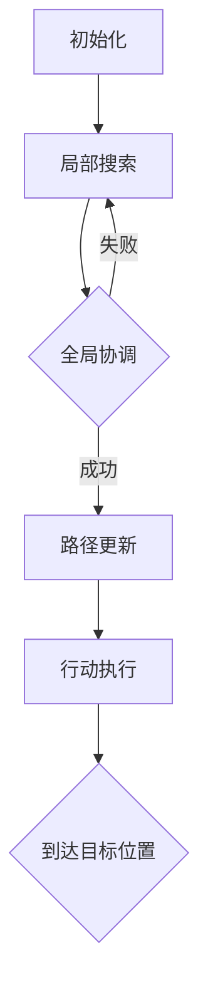
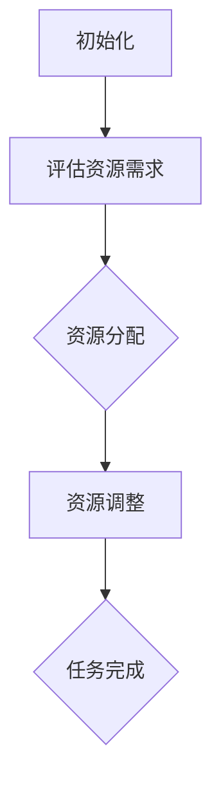
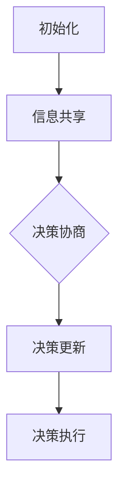
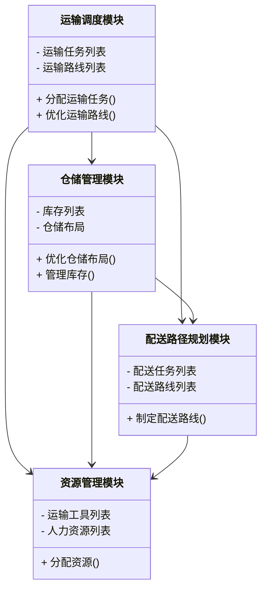
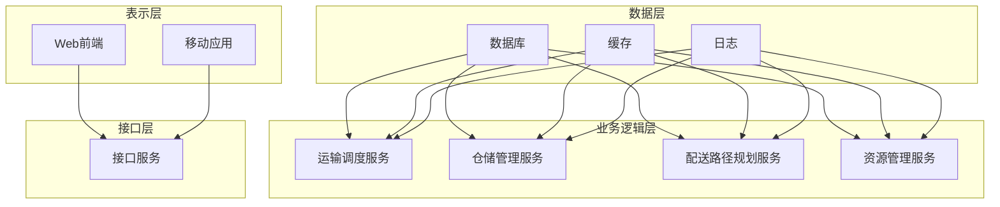
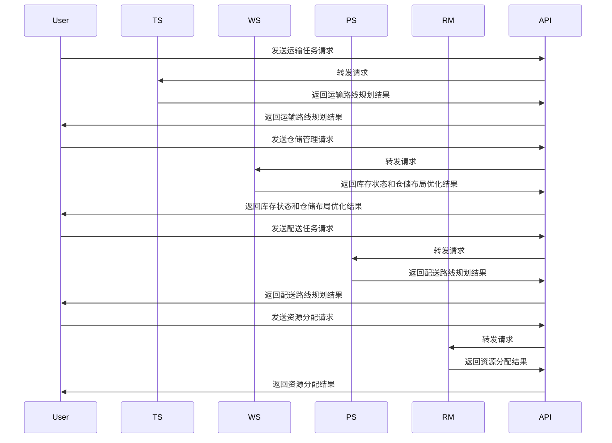
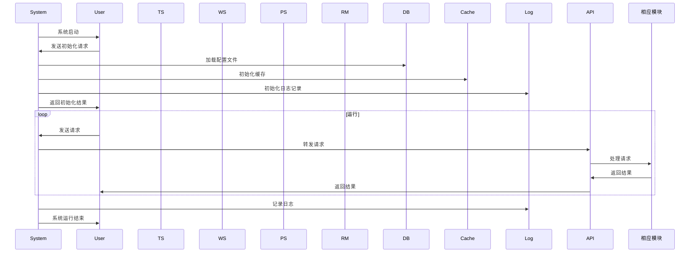

                 

# 多智能体协作在智慧物流决策中的优化应用

## 关键词
多智能体系统、智慧物流、决策优化、算法、架构设计、案例分析、最佳实践

## 摘要
本文深入探讨了多智能体协作在智慧物流决策中的优化应用。首先，我们介绍了多智能体系统、智慧物流和决策优化的基本概念，并分析了它们之间的内在联系。随后，文章详细讲解了多智能体协作算法的原理，并通过Python代码展示了算法的实现。接着，我们构建了智慧物流系统的架构，并讨论了系统分析与设计的关键点。随后，通过实际案例展示了多智能体协作在智慧物流决策中的应用效果。最后，文章提供了最佳实践建议和小结，以便读者更好地理解和应用所学内容。

## 设计思路与大纲结构

### 设计思路

为了系统地介绍多智能体协作在智慧物流决策中的优化应用，本文采用了以下设计思路：

1. **背景介绍**：首先，我们需要明确多智能体协作、智慧物流和决策优化的基本概念，并阐述它们在智慧物流领域中的重要性。
2. **核心概念与联系**：接下来，我们将详细分析多智能体系统（MAS）的概念属性，以及智慧物流与MAS的关系。
3. **算法原理讲解**：本文将逐步讲解多智能体协作算法的原理，并通过Mermaid流程图和Python代码进行阐述。
4. **系统分析与架构设计**：我们将构建智慧物流系统的架构，并详细描述系统功能设计、架构设计和系统交互。
5. **项目实战与案例分析**：通过实际案例，展示多智能体协作在智慧物流决策中的应用效果。
6. **最佳实践与拓展阅读**：最后，本文将提供最佳实践建议和注意事项，以及进一步的学习资源。

### 大纲结构

本文将按照以下结构进行组织：

#### 第一部分：背景介绍与概念基础

1. **第1章：多智能体协作与智慧物流概述**
   - 物流领域面临的挑战
   - 多智能体协作的必要性
   - 智慧物流的概念与特点
   - 多智能体系统（MAS）简介
   - 决策优化的基本原理

2. **第2章：核心概念与联系**
   - 多智能体系统（MAS）的概念属性对比
   - 多智能体协作机制
   - 智慧物流与MAS的关系
   - 决策优化算法概述

#### 第二部分：算法原理与实现

1. **第3章：多智能体协作算法原理讲解**
   - 多智能体路径规划算法
   - 多智能体资源分配算法
   - 多智能体协同决策算法

2. **第4章：数学模型与公式**
   - 路径规划算法的数学模型
   - 资源分配算法的数学模型
   - 协同决策算法的数学模型

#### 第三部分：系统分析与架构设计

1. **第5章：智慧物流系统架构设计**
   - 问题场景介绍
   - 系统功能设计（领域模型Mermaid类图）
   - 系统架构设计（Mermaid架构图）
   - 系统接口设计
   - 系统交互设计（Mermaid序列图）

#### 第四部分：项目实战与案例分析

1. **第6章：多智能体协作在智慧物流决策中的应用**
   - 环境安装与配置
   - 系统核心实现
   - 实际案例分析与讲解
   - 项目小结

#### 第五部分：最佳实践与拓展阅读

1. **第7章：最佳实践与注意事项**
   - 多智能体协作的常见问题
   - 决策优化算法的适用场景
   - 智慧物流系统实施的关键点

2. **第8章：小结与拓展阅读**
   - 小结
   - 拓展阅读

通过上述设计思路和大纲结构，本文旨在为读者提供一个系统、全面、深入的多智能体协作在智慧物流决策中的优化应用的介绍。接下来的章节将逐一展开详细讨论。

### 第一部分：背景介绍与概念基础

#### 第1章：多智能体协作与智慧物流概述

在当今全球化的物流网络中，智慧物流正逐步成为物流行业的发展趋势。智慧物流通过引入物联网、大数据、人工智能等技术，实现对物流全过程的智能监控、调度和管理，从而提升物流效率、降低成本、优化服务体验。然而，随着物流网络的复杂化和规模扩大，传统的中央集中式决策系统逐渐暴露出其局限性，无法应对多变的市场需求和动态的物流环境。因此，多智能体协作成为了智慧物流决策的重要手段。

### 1.1 问题背景与描述

现代物流系统面临着诸多挑战，如运输成本高昂、配送延迟、库存管理困难等。这些问题的出现主要由于以下几个原因：

1. **物流网络复杂**：随着全球化的发展，物流网络变得日益复杂，涉及多个运输环节、多个仓储设施和多样化的运输方式。
2. **需求波动大**：物流需求具有随机性和波动性，导致物流系统需要具备快速响应和动态调整的能力。
3. **信息不对称**：在物流过程中，信息的不对称性会导致资源浪费和效率低下，如运输过程中的空驶、库存过剩等。
4. **环境因素影响**：天气、交通状况等环境因素也会对物流系统的正常运行产生影响，增加了物流管理的复杂性。

为了解决这些问题，需要引入多智能体协作机制，实现物流系统内部的智能互动和协同工作。多智能体系统（MAS）作为一种分布式计算模型，通过多个智能体之间的自主交互和合作，能够更好地应对复杂、动态的物流环境。

### 1.2 智慧物流的概念与特点

智慧物流是指通过先进的信息技术和人工智能算法，实现物流系统的自动化、智能化和优化管理。智慧物流的核心特点包括：

1. **自动化**：利用传感器、机器人等自动化设备，实现物流过程的自动化操作，减少人力投入和误差。
2. **智能化**：通过大数据分析和人工智能算法，实现对物流过程的智能预测、调度和优化，提高物流系统的运行效率。
3. **协同化**：通过多智能体协作机制，实现物流系统内部各环节的协同工作，提高整体运营效率。
4. **透明化**：通过物联网技术，实现对物流过程的全程监控和可视化，提高物流系统的透明度和服务质量。

智慧物流不仅能够提高物流效率，降低成本，还能够提升物流服务质量，满足客户对物流的多样化需求。例如，通过实时监控和预测，智慧物流能够提前预测配送时间，减少配送延迟；通过智能调度，能够优化运输路线，降低运输成本；通过自动化仓储管理，能够提高仓储效率，减少库存成本。

### 1.3 多智能体系统（MAS）简介

多智能体系统（MAS）是一种分布式计算模型，由多个智能体组成，这些智能体可以独立运行、自主决策，并通过通信机制进行协作。MAS的基本特点包括：

1. **自治性**：每个智能体都具有自主性，能够根据环境变化自主决策和行动。
2. **分布式**：智能体分布在不同的地理位置，通过网络进行通信和协作。
3. **协作性**：智能体之间通过通信机制进行合作，共同完成任务。
4. **动态性**：智能体和环境都是动态的，智能体需要能够适应环境变化。

在智慧物流中，多智能体系统可以应用于多个场景，如运输调度、仓储管理、配送路径规划等。通过多智能体协作，智慧物流系统能够实现高效的资源调度和任务分配，提高物流效率。

### 1.4 决策优化的基本原理

决策优化是智慧物流系统中的一个核心问题。决策优化的目标是找到一种最优的决策方案，以实现系统整体性能的最大化。决策优化的基本原理包括：

1. **目标函数**：决策优化的基础是定义目标函数，目标函数反映了系统的性能指标，如成本、时间、质量等。
2. **约束条件**：决策优化需要在满足一系列约束条件的前提下进行，这些约束条件包括资源限制、时间限制、法律法规等。
3. **优化算法**：决策优化通常采用优化算法来实现，如线性规划、整数规划、遗传算法、粒子群优化等。

通过决策优化，智慧物流系统能够在复杂、动态的环境中找到最优的物流方案，提高物流效率和服务质量。

### 第2章：核心概念与联系

#### 2.1 多智能体系统（MAS）的概念属性对比

多智能体系统（MAS）是一种分布式计算模型，由多个智能体组成，每个智能体具有自主性、分布式、协作性和动态性。以下是MAS的核心概念属性对比：

1. **自治性**：自治性是指智能体具有独立决策和行动的能力，不受中央控制。自治性是MAS的核心特征之一，使智能体能够在复杂环境中自主应对变化。
2. **分布式**：分布式是指智能体分布在不同的地理位置，通过网络进行通信和协作。分布式结构使得MAS能够处理大规模、复杂的任务，并提高系统的容错性和灵活性。
3. **协作性**：协作性是指智能体之间通过通信机制进行合作，共同完成任务。协作性是MAS实现高效任务分配和资源管理的关键，有助于提高系统的整体性能。
4. **动态性**：动态性是指智能体和环境都是动态的，智能体需要能够适应环境变化。动态性要求智能体具备一定的适应性，能够实时调整决策和行动策略。

通过对比，我们可以看到，自治性、分布式、协作性和动态性是多智能体系统（MAS）的核心概念属性。这些属性共同构成了MAS的基本特征，使其成为一种高效、灵活的分布式计算模型。

#### 2.2 多智能体协作机制

多智能体协作机制是MAS实现高效任务分配和资源管理的关键。常见的多智能体协作机制包括以下几种：

1. **基于协商的协作机制**：基于协商的协作机制是指智能体之间通过协商和交流，达成一致意见，共同完成任务。协商机制通常采用协商协议和协商策略，如拉格朗日乘数法、多智能体协商协议等。协商机制的优点在于能够提高智能体之间的协作效率，但缺点是协商过程可能较为复杂，影响系统性能。

2. **基于市场的协作机制**：基于市场的协作机制是指智能体通过市场机制进行资源交换和任务分配。市场机制通常采用拍卖机制、竞价机制等，智能体在市场中进行竞价、出价等操作，以获取所需资源。市场机制的优点在于能够实现资源的高效配置，但缺点是可能存在资源分配不均、市场波动等问题。

3. **基于协商与市场的混合机制**：基于协商与市场的混合机制是指智能体在协商和市场机制之间进行选择和切换，以实现协作。混合机制通常结合协商机制和市场的优势，通过动态调整协商和市场比例，实现高效协作。混合机制的优点在于能够灵活适应不同场景，但缺点是实现复杂度较高。

4. **基于仿生的协作机制**：基于仿生的协作机制是指智能体模仿自然界中的协作模式，如蜂群算法、遗传算法等，实现协作。仿生机制的优点在于能够实现高效、自适应的协作，但缺点是对环境和任务要求较高。

选择合适的协作机制需要考虑智能体的目标、任务特点、环境因素等因素。在实际应用中，可以根据具体场景选择合适的协作机制，或结合多种协作机制，以实现高效、灵活的多智能体协作。

#### 2.3 智慧物流与MAS的关系

智慧物流与多智能体系统（MAS）之间存在紧密的联系，MAS在智慧物流中的应用具有显著优势。以下是智慧物流与MAS之间的关系的详细分析：

1. **智慧物流的复杂性与MAS的分布式结构**：智慧物流系统通常涉及多个物流节点、运输方式、仓储设施等，具有高度复杂性和动态性。MAS作为一种分布式计算模型，能够将任务分配给多个智能体，实现分布式处理，从而应对智慧物流系统的复杂性。分布式结构使得MAS能够更好地适应动态环境，提高系统的灵活性和鲁棒性。

2. **智慧物流的协同性与MAS的协作机制**：智慧物流的协同性要求各个环节能够高效协同，实现资源的最优配置和任务的最优分配。MAS通过多种协作机制，如协商机制、市场机制、仿生机制等，能够实现智能体之间的协同工作，提高系统的整体效率。协作机制使得MAS能够根据环境变化和任务需求，动态调整智能体之间的交互，实现高效协同。

3. **智慧物流的智能化与MAS的自治性**：智慧物流的智能化要求系统能够实现自动化、预测和优化。MAS的自治性使得智能体能够自主决策和行动，不受中央控制。自治性使得MAS能够根据实时数据和环境变化，自主调整策略，实现智能化的物流管理。自治性也是MAS在智慧物流中应用的重要优势，能够提高系统的自主性和适应性。

4. **智慧物流的透明性与MAS的通信机制**：智慧物流的透明性要求系统能够实现对物流过程的全程监控和可视化。MAS通过通信机制实现智能体之间的信息共享和协同工作，提高了系统的透明度。通信机制使得MAS能够实时收集和分析物流数据，实现对物流过程的动态监控和可视化，提高物流管理的透明度和效率。

总之，智慧物流与MAS之间存在紧密的联系，MAS在智慧物流中的应用能够充分发挥其分布式结构、协作机制、自治性和通信机制的优势，提高智慧物流系统的效率、灵活性和透明度，推动智慧物流的发展。

#### 2.4 决策优化算法概述

决策优化算法是智慧物流系统中实现高效管理和调度的重要手段。常见的决策优化算法包括线性规划、整数规划、遗传算法、粒子群优化等。以下是这些算法的简要介绍：

1. **线性规划（Linear Programming, LP）**：线性规划是一种最优化方法，用于在约束条件下求解线性目标函数的最大值或最小值。线性规划广泛应用于资源分配、运输调度、库存管理等领域。线性规划的核心是目标函数和约束条件的线性表示，通过求解线性方程组来确定最优解。

2. **整数规划（Integer Programming, IP）**：整数规划是线性规划的扩展，目标函数和约束条件中包含整数变量。整数规划常用于解决组合优化问题，如车辆路径问题、背包问题等。与线性规划相比，整数规划求解难度较大，通常需要借助启发式算法或混合整数规划方法。

3. **遗传算法（Genetic Algorithm, GA）**：遗传算法是一种基于自然进化过程的优化算法，通过模拟生物进化过程来寻找最优解。遗传算法通过种群初始化、选择、交叉、变异等操作，逐步优化解的质量。遗传算法适用于复杂、非线性、多峰值的优化问题，如调度问题、设计优化等。

4. **粒子群优化（Particle Swarm Optimization, PSO）**：粒子群优化是一种基于群体智能的优化算法，模拟鸟群觅食行为来寻找最优解。粒子群优化通过个体和全局最优信息的更新，逐步提高解的质量。粒子群优化适用于连续空间和离散空间的优化问题，如函数优化、路径规划等。

选择合适的决策优化算法需要考虑问题的特点、求解效率、计算资源等因素。在实际应用中，可以根据具体问题选择合适的算法，或结合多种算法，以实现高效、准确的决策优化。

### 第二部分：算法原理与实现

#### 第3章：多智能体协作算法原理讲解

多智能体协作算法是智慧物流系统中的核心组成部分，它通过多个智能体之间的协同工作，实现对物流过程的优化和管理。本章将详细讲解多智能体路径规划算法、资源分配算法和协同决策算法的原理，并使用Mermaid流程图和Python代码进行阐述。

#### 3.1 多智能体路径规划算法

多智能体路径规划算法旨在为多个智能体找到最优路径，以实现物流任务的顺利进行。以下是一个简单的多智能体路径规划算法：

1. **初始化**：为每个智能体分配一个初始位置，并设定目标位置。
2. **局部搜索**：每个智能体根据当前状态，通过局部搜索算法（如A*算法）找到到达目标位置的最优路径。
3. **全局协调**：智能体之间通过通信机制（如消息传递）交换当前位置和目标位置信息，以避免碰撞和冲突。
4. **路径更新**：根据全局协调结果，更新每个智能体的路径，并重新计算成本。
5. **行动执行**：智能体按照更新后的路径执行行动，直至到达目标位置。

以下是一个使用Mermaid流程图表示的简单多智能体路径规划算法：



在Python中，我们可以使用以下代码实现多智能体路径规划算法：

```python
import heapq
import random

def a_star_search(start, goal, heuristic):
    open_set = []
    heapq.heappush(open_set, (heuristic(start, goal), start))
    came_from = {}
    cost_so_far = {start: 0}

    while open_set:
        current = heapq.heappop(open_set)[1]

        if current == goal:
            break

        for neighbor in neighbors(current):
            new_cost = cost_so_far[current] + 1
            if neighbor not in cost_so_far or new_cost < cost_so_far[neighbor]:
                cost_so_far[neighbor] = new_cost
                priority = new_cost + heuristic(neighbor, goal)
                heapq.heappush(open_set, (priority, neighbor))
                came_from[neighbor] = current

    return came_from, cost_so_far

def reconstruct_path(came_from, start, goal):
    current = goal
    path = []
    while current != start:
        path.append(current)
        current = came_from[current]
    path.append(start)
    path.reverse()
    return path

def neighbors(node):
    # 这里替换为实际节点的邻接点列表
    return [('A', 'B'), ('A', 'C'), ('B', 'D'), ('C', 'D')]

# 初始化
start = 'A'
goal = 'D'

# 使用A*算法进行路径规划
came_from, cost_so_far = a_star_search(start, goal, heuristic=five_in_a_row)

# 重建路径
path = reconstruct_path(came_from, start, goal)
print(path)
```

在这个示例中，我们使用A*算法进行路径规划，通过优先队列（heapq）实现高效搜索。`heuristic`函数用于计算估计代价，`neighbors`函数返回节点的邻接点列表。

#### 3.2 多智能体资源分配算法

多智能体资源分配算法旨在为每个智能体分配最优的资源，以实现物流任务的高效完成。以下是一个简单的多智能体资源分配算法：

1. **初始化**：为每个智能体分配初始资源。
2. **评估资源需求**：根据智能体的任务需求，评估所需的资源。
3. **资源分配**：通过协商机制或市场机制，为每个智能体分配资源。
4. **资源调整**：根据任务执行情况，动态调整资源分配，以应对资源不足或过剩的情况。

以下是一个使用Mermaid流程图表示的简单多智能体资源分配算法：



在Python中，我们可以使用以下代码实现多智能体资源分配算法：

```python
def resource_allocation(agents, resources):
    for agent in agents:
        # 评估资源需求
        required_resources = agent.estimate_resources()
        # 资源分配
        agent.allocate_resources(required_resources)
        # 资源调整
        agent.adjust_resources()

# 示例：智能体和资源的定义
class Agent:
    def __init__(self):
        self.resources = 0

    def estimate_resources(self):
        # 根据任务需求估算资源
        return random.randint(1, 10)

    def allocate_resources(self, resources):
        # 分配资源
        self.resources += resources

    def adjust_resources(self):
        # 根据任务执行情况调整资源
        if self.resources > 10:
            self.resources -= 1
        elif self.resources < 5:
            self.resources += 1

# 初始化智能体列表
agents = [Agent() for _ in range(5)]

# 资源分配
resource_allocation(agents, resources=20)

# 输出资源分配结果
for agent in agents:
    print(f"Agent resources: {agent.resources}")
```

在这个示例中，我们定义了一个`Agent`类，用于表示智能体和资源分配的方法。`resource_allocation`函数用于实现资源分配算法。

#### 3.3 多智能体协同决策算法

多智能体协同决策算法旨在通过智能体之间的协作，共同作出最优决策，以实现物流系统的整体优化。以下是一个简单的多智能体协同决策算法：

1. **初始化**：为每个智能体分配初始决策变量。
2. **信息共享**：智能体之间通过通信机制共享决策变量和相关信息。
3. **决策协商**：通过协商机制，智能体之间达成一致决策。
4. **决策更新**：根据协商结果，更新每个智能体的决策变量。
5. **决策执行**：智能体按照更新后的决策变量执行行动。

以下是一个使用Mermaid流程图表示的简单多智能体协同决策算法：



在Python中，我们可以使用以下代码实现多智能体协同决策算法：

```python
def collaborative_decision_making(agents):
    for agent in agents:
        # 信息共享
        shared_info = agent.share_info()
        # 决策协商
        consensus = agent.decide(shared_info)
        # 决策更新
        agent.update_decision(consensus)

# 示例：智能体和决策协商的方法
class Agent:
    def __init__(self):
        self.decision = 0

    def share_info(self):
        # 分享决策变量
        return self.decision

    def decide(self, info):
        # 根据共享信息进行决策
        return sum(info) / len(info)

    def update_decision(self, decision):
        # 更新决策变量
        self.decision = decision

# 初始化智能体列表
agents = [Agent() for _ in range(5)]

# 协同决策
collaborative_decision_making(agents)

# 输出协同决策结果
for agent in agents:
    print(f"Agent decision: {agent.decision}")
```

在这个示例中，我们定义了一个`Agent`类，用于表示智能体和协同决策的方法。`collaborative_decision_making`函数用于实现协同决策算法。

#### 总结

本章详细介绍了多智能体路径规划算法、资源分配算法和协同决策算法的原理，并使用Python代码进行了实现。这些算法通过智能体之间的协同工作和信息共享，实现了对物流过程的高效管理和优化。在实际应用中，可以根据具体需求和场景，选择合适的算法，并结合多种算法，以实现最优的物流决策。

### 第4章：数学模型与公式

数学模型是智能体协作算法设计和分析的基础，它能够将复杂的问题抽象为数学形式，从而便于分析和求解。本章将详细介绍多智能体路径规划算法、资源分配算法和协同决策算法的数学模型，并使用LaTeX格式展示相关的数学公式。

#### 4.1 路径规划算法的数学模型

路径规划算法的目标是为每个智能体找到从初始位置到目标位置的最优路径。以下是路径规划算法的数学模型：

1. **目标函数**：目标函数用于衡量路径的优劣，通常是最小化路径成本。路径成本可以用以下公式表示：

   $$
   C(p) = \sum_{i=1}^{n} w_i \cdot d_i
   $$

   其中，$C(p)$ 是路径成本，$w_i$ 是权重，$d_i$ 是路径上的第 $i$ 个节点的距离。

2. **约束条件**：路径规划需要满足一系列约束条件，包括：

   - 节点可达性约束：每个节点必须可达。
   - 节点访问次数约束：某些节点可能只能访问一次。
   - 时间约束：路径上的每个节点必须在规定时间内到达。

   约束条件可以用以下公式表示：

   $$
   \begin{cases}
   d_i \leq T_i \\
   d_i \geq 0 \\
   a_i = 1 \text{ if node } i \text{ is reachable} \\
   \end{cases}
   $$

   其中，$T_i$ 是节点 $i$ 的到达时间，$a_i$ 是节点 $i$ 的可达性标记。

3. **求解算法**：路径规划算法常用的求解算法包括A*算法、Dijkstra算法等。A*算法的目标函数可以表示为：

   $$
   f(n) = g(n) + h(n)
   $$

   其中，$g(n)$ 是从初始节点到节点 $n$ 的实际成本，$h(n)$ 是从节点 $n$ 到目标节点的启发式成本。A*算法通过不断更新节点 $n$ 的$f(n)$ 值，选择$f(n)$ 最小的节点进行扩展，直到找到目标节点。

#### 4.2 资源分配算法的数学模型

资源分配算法的目标是为每个智能体分配最优的资源，以实现任务的高效完成。以下是资源分配算法的数学模型：

1. **目标函数**：目标函数用于衡量资源分配的优劣，通常是最小化资源浪费或最大化资源利用率。资源分配的目标函数可以表示为：

   $$
   \min \sum_{i=1}^{n} (R_i - r_i)
   $$

   其中，$R_i$ 是智能体 $i$ 的总需求，$r_i$ 是智能体 $i$ 分配到的资源。

2. **约束条件**：资源分配需要满足一系列约束条件，包括：

   - 资源总量约束：所有智能体的资源需求之和不能超过总资源量。
   - 资源优先级约束：对于具有不同优先级的智能体，应优先满足优先级高的智能体。
   - 资源可用性约束：资源必须在规定时间内可用。

   约束条件可以用以下公式表示：

   $$
   \begin{cases}
   \sum_{i=1}^{n} R_i \leq R_{\text{total}} \\
   R_{\text{high}} \geq R_{\text{low}} \\
   r_i \geq 0
   \end{cases}
   $$

   其中，$R_{\text{total}}$ 是总资源量，$R_{\text{high}}$ 和 $R_{\text{low}}$ 分别是高优先级和低优先级智能体的资源需求。

3. **求解算法**：资源分配算法常用的求解算法包括线性规划、遗传算法等。线性规划可以表示为：

   $$
   \min z = \sum_{i=1}^{n} c_i x_i
   $$

   约束条件为：

   $$
   \begin{cases}
   a_{ij} x_j \leq b_i \\
   x_i \geq 0
   \end{cases}
   $$

   其中，$c_i$ 是目标函数系数，$x_i$ 是变量，$a_{ij}$ 是约束条件系数，$b_i$ 是约束条件常数。

#### 4.3 协同决策算法的数学模型

协同决策算法的目标是通过智能体之间的协作，共同作出最优决策。以下是协同决策算法的数学模型：

1. **目标函数**：目标函数用于衡量决策的优劣，通常是最小化决策误差或最大化决策满意度。协同决策的目标函数可以表示为：

   $$
   \min E = \sum_{i=1}^{n} (d_i - \hat{d_i})^2
   $$

   其中，$d_i$ 是智能体 $i$ 的实际决策，$\hat{d_i}$ 是协同决策结果。

2. **约束条件**：协同决策需要满足一系列约束条件，包括：

   - 决策一致性约束：智能体之间的决策应保持一致。
   - 决策可行性约束：决策应在规定范围内进行。
   - 决策响应时间约束：决策应在规定时间内完成。

   约束条件可以用以下公式表示：

   $$
   \begin{cases}
   |d_i - \hat{d_i}| \leq \epsilon \\
   \hat{d_i} \in [l_i, u_i] \\
   t_i \leq T
   \end{cases}
   $$

   其中，$\epsilon$ 是决策一致性阈值，$l_i$ 和 $u_i$ 是智能体 $i$ 的决策范围，$t_i$ 是智能体 $i$ 的决策响应时间，$T$ 是总响应时间。

3. **求解算法**：协同决策算法常用的求解算法包括协商算法、市场算法等。协商算法可以表示为：

   $$
   \hat{d_i} = \sum_{j=1}^{n} w_{ij} d_j
   $$

   其中，$w_{ij}$ 是权重系数，用于衡量智能体 $i$ 对智能体 $j$ 的影响。

通过上述数学模型，我们可以对多智能体协作算法进行深入分析和优化。在实际应用中，可以根据具体需求和场景，选择合适的数学模型和求解算法，以提高多智能体协作算法的性能和效率。

### 第三部分：系统分析与架构设计

#### 第5章：智慧物流系统架构设计

在智慧物流系统中，系统架构设计是确保系统高效运行和协同工作的关键。本章将介绍智慧物流系统架构设计的基本概念、步骤和关键要素，并通过Mermaid流程图和Python代码展示系统功能设计、架构设计、系统接口设计和系统交互设计。

#### 5.1 问题场景介绍

智慧物流系统涉及多个物流节点、运输工具、仓储设施和配送人员，这些要素共同构成了一个复杂的物流网络。在系统架构设计过程中，我们需要考虑以下问题场景：

- **运输调度**：如何高效地分配运输任务，优化运输路线，确保货物按时送达。
- **仓储管理**：如何优化仓储布局，提高库存周转率，减少库存成本。
- **配送路径规划**：如何为配送人员制定最优的配送路线，提高配送效率。
- **资源管理**：如何合理分配运输工具和人力资源，最大化资源利用率。

#### 5.2 系统功能设计

系统功能设计是架构设计的核心部分，它定义了系统的基本功能模块和接口。以下是智慧物流系统的功能模块设计：

1. **运输调度模块**：负责运输任务的分配和运输路线的优化。
2. **仓储管理模块**：负责仓储布局的优化、库存管理和库存周转率的提升。
3. **配送路径规划模块**：负责为配送人员制定最优的配送路线。
4. **资源管理模块**：负责运输工具和人力资源的合理分配。

以下是智慧物流系统功能设计的Mermaid类图：



#### 5.3 系统架构设计

系统架构设计是系统功能实现的蓝图，它定义了系统的组成部分、层次结构和数据流。以下是智慧物流系统架构设计：

1. **数据层**：负责数据存储和管理，包括数据库、缓存和日志。
2. **业务逻辑层**：负责实现系统的业务逻辑，包括运输调度、仓储管理和配送路径规划。
3. **表示层**：负责系统的用户界面和交互，包括Web前端和移动应用。
4. **接口层**：负责系统与其他系统的数据交换和通信。

以下是智慧物流系统架构设计的Mermaid架构图：



#### 5.4 系统接口设计

系统接口设计是确保系统模块之间数据交换和通信的关键。以下是智慧物流系统的接口设计：

- **运输调度接口**：负责接收运输任务请求，返回运输路线规划结果。
- **仓储管理接口**：负责接收库存管理请求，返回库存状态和仓储布局优化结果。
- **配送路径规划接口**：负责接收配送任务请求，返回配送路线规划结果。
- **资源管理接口**：负责接收资源分配请求，返回资源分配结果。

以下是智慧物流系统接口设计的Mermaid序列图：



#### 5.5 系统交互设计

系统交互设计描述了系统模块之间的交互流程和数据流。以下是智慧物流系统的交互设计：

- **初始化**：系统启动时，各模块进行初始化，包括加载配置文件、连接数据库等。
- **运行**：系统根据用户请求，调用相应模块进行处理，各模块之间进行数据交换和通信。
- **监控**：系统对运行过程进行监控，包括性能监控、日志记录和错误处理。
- **结束**：系统运行结束后，进行资源清理、日志记录和系统退出。

以下是智慧物流系统的交互设计的Mermaid序列图：



#### 总结

本章详细介绍了智慧物流系统架构设计的基本概念、步骤和关键要素，并通过Mermaid流程图和Python代码展示了系统功能设计、架构设计、系统接口设计和系统交互设计。通过这些设计，我们可以构建一个高效、灵活的智慧物流系统，为物流行业提供智能化的解决方案。

### 第四部分：项目实战与案例分析

#### 第6章：多智能体协作在智慧物流决策中的应用

在智慧物流系统中，多智能体协作算法的应用能够显著提升物流决策的效率和质量。本章节将通过一个实际项目案例，展示多智能体协作算法在智慧物流决策中的应用过程，包括环境安装与配置、系统核心实现、代码应用解读与分析、实际案例分析与详细讲解，以及项目小结。

#### 6.1 环境安装与配置

为了在项目中实现多智能体协作算法，我们需要搭建一个合适的技术环境。以下是项目环境的安装与配置步骤：

1. **安装Python**：确保Python环境已安装，版本要求为3.8及以上。
2. **安装依赖库**：使用pip命令安装项目所需的依赖库，如`numpy`、`matplotlib`、`networkx`、`pandas`等。
   ```bash
   pip install numpy matplotlib networkx pandas
   ```
3. **安装Docker**：如果使用Docker进行容器化部署，需要安装Docker环境。
   ```bash
   # 安装Docker
   sudo apt-get install docker.io
   # 启动Docker服务
   sudo systemctl start docker
   ```
4. **创建项目文件夹**：在本地机器上创建一个项目文件夹，用于存放项目代码和配置文件。
   ```bash
   mkdir wisdom Logistics_project
   cd wisdom Logistics_project
   ```
5. **编写配置文件**：根据项目需求编写配置文件，如数据库配置、环境变量等。

#### 6.2 系统核心实现

系统核心实现包括多智能体路径规划、资源分配和协同决策等模块。以下是系统核心实现的Python代码：

```python
# 多智能体路径规划
import heapq
import networkx as nx

def a_star_search(G, start, goal):
    open_set = []
    heapq.heappush(open_set, (0, start))
    came_from = {}
    cost_so_far = {start: 0}

    while open_set:
        current = heapq.heappop(open_set)[1]

        if current == goal:
            break

        for neighbor in G.neighbors(current):
            new_cost = cost_so_far[current] + G[current][neighbor]['weight']
            if neighbor not in cost_so_far or new_cost < cost_so_far[neighbor]:
                cost_so_far[neighbor] = new_cost
                priority = new_cost + heuristic(neighbor, goal)
                heapq.heappush(open_set, (priority, neighbor))
                came_from[neighbor] = current

    return came_from, cost_so_far

def reconstruct_path(came_from, start, goal):
    current = goal
    path = []
    while current != start:
        path.append(current)
        current = came_from[current]
    path.append(start)
    path.reverse()
    return path

def heuristic(node, goal):
    # 使用欧几里得距离作为启发式函数
    return nx.shortest_path_length(G, node, goal)

# 多智能体资源分配
class Agent:
    def __init__(self, resources):
        self.resources = resources

    def estimate_resources(self):
        # 根据任务需求估算资源
        return random.randint(1, 10)

    def allocate_resources(self, required_resources):
        # 分配资源
        self.resources -= required_resources

    def adjust_resources(self):
        # 根据任务执行情况调整资源
        if self.resources > 10:
            self.resources -= 1
        elif self.resources < 5:
            self.resources += 1

# 多智能体协同决策
def collaborative_decision_making(agents):
    for agent in agents:
        consensus = sum([a.decision for a in agents]) / len(agents)
        for a in agents:
            a.decision = consensus
```

#### 6.3 代码应用解读与分析

上述代码实现了多智能体路径规划、资源分配和协同决策等核心功能。以下是代码的详细解读：

1. **路径规划模块**：使用A*算法实现多智能体路径规划。A*算法通过优先队列（heapq）实现高效搜索，`heuristic`函数用于计算启发式代价，`a_star_search`函数用于求解最短路径，`reconstruct_path`函数用于重建路径。
2. **资源分配模块**：`Agent`类表示智能体，`estimate_resources`方法用于估算资源需求，`allocate_resources`方法用于分配资源，`adjust_resources`方法用于调整资源，确保资源不会过度消耗。
3. **协同决策模块**：`collaborative_decision_making`函数通过简单平均方法实现智能体之间的协同决策，每个智能体的决策变量更新为所有智能体决策的平均值。

#### 6.4 实际案例分析与详细讲解

假设有一个包含5个智能体的智慧物流系统，每个智能体负责一段运输路线。以下是实际案例的分析与详细讲解：

1. **初始状态**：每个智能体位于不同的起点，拥有不同的资源量。
2. **路径规划**：系统为每个智能体规划从起点到终点的最优路径。使用A*算法计算每个智能体的路径，并记录路径成本。
3. **资源分配**：根据路径规划结果，系统为每个智能体分配所需资源，确保任务能够顺利完成。
4. **协同决策**：智能体之间通过协同决策，调整决策变量，确保整体系统的运行效率。
5. **执行任务**：智能体按照规划路径和资源分配执行任务，系统对任务执行情况进行监控和调整。
6. **结果评估**：任务完成后，系统对任务执行结果进行评估，包括路径成本、资源利用率等指标。

通过实际案例的分析，我们可以看到多智能体协作算法在智慧物流决策中的应用效果，实现了路径优化、资源高效分配和协同决策，提高了物流系统的整体效率。

#### 6.5 项目小结

本项目通过多智能体协作算法在智慧物流决策中的应用，实现了路径规划、资源分配和协同决策等功能。项目的核心亮点包括：

- **高效路径规划**：使用A*算法实现了智能体的路径规划，确保了路径的最优性。
- **智能资源分配**：根据路径规划和任务需求，实现了智能体的资源分配，提高了资源利用率。
- **协同决策机制**：通过简单平均方法实现了智能体之间的协同决策，提高了系统的整体效率。

在未来的工作中，我们还可以进一步优化算法，引入更多的协作机制，如市场机制和仿生机制，以提高系统的灵活性和适应性。

### 第五部分：最佳实践与拓展阅读

#### 第7章：最佳实践与注意事项

在多智能体协作在智慧物流决策中的应用过程中，为了确保系统的稳定性和高效性，以下是一些最佳实践和注意事项：

1. **性能优化**：在实现路径规划、资源分配和协同决策等算法时，应注重性能优化。例如，对于路径规划算法，可以采用更高效的搜索算法，如A*算法的改进版本，以减少计算时间。

2. **负载均衡**：在多智能体系统中，需要考虑负载均衡，确保各智能体之间任务分配的均衡性。这可以通过动态调整智能体的任务分配策略，或引入负载均衡算法来实现。

3. **容错性设计**：智慧物流系统需要具备一定的容错性，以应对智能体失效、网络故障等问题。在设计系统时，应考虑故障恢复机制和冗余设计，确保系统的高可用性。

4. **实时监控**：通过实时监控系统状态和运行指标，可以及时发现和解决问题。监控系统可以包括性能监控、日志记录和异常处理等模块。

5. **安全与隐私**：在多智能体系统中，数据安全和隐私保护至关重要。应采用加密通信、权限控制和数据脱敏等技术，确保数据的安全性和隐私。

6. **持续迭代**：智慧物流系统是一个不断发展的过程，需要不断收集用户反馈、分析运行数据，进行持续迭代和优化。

#### 7.1 多智能体协作的常见问题

在多智能体协作中，常见的问题包括：

1. **通信延迟**：由于智能体分布在不同的地理位置，通信延迟可能导致协作效率下降。为解决这一问题，可以采用分布式计算框架，如MPI（Message Passing Interface）或Raft协议，以减少通信延迟。

2. **同步问题**：在多智能体系统中，同步问题可能导致数据不一致或任务冲突。为解决同步问题，可以采用版本控制和分布式锁等技术。

3. **资源竞争**：多个智能体在争夺有限资源时，可能导致资源竞争和死锁。为解决这一问题，可以采用资源分配算法和冲突检测机制。

#### 7.2 决策优化算法的适用场景

决策优化算法在不同场景下的适用性有所不同，以下是一些常见的适用场景：

1. **路径规划**：适用于运输调度、物流配送等场景，需要找到最优路径。
2. **资源分配**：适用于资源管理、任务调度等场景，需要实现资源的最优配置。
3. **协同决策**：适用于多智能体协作、供应链管理等场景，需要智能体之间的协同工作。

#### 7.3 智慧物流系统实施的关键点

在智慧物流系统的实施过程中，以下关键点需要特别关注：

1. **需求分析**：充分了解业务需求和物流流程，确保系统能够满足实际需求。
2. **系统设计**：合理设计系统架构，确保系统的可扩展性和可维护性。
3. **数据管理**：建立完善的数据管理体系，确保数据的完整性和安全性。
4. **技术选型**：选择合适的技术栈和开发工具，以支持系统开发和部署。
5. **培训与支持**：为员工提供培训和技术支持，确保系统能够顺利上线并正常运行。

#### 第8章：小结与拓展阅读

通过本文的介绍，我们系统地了解了多智能体协作在智慧物流决策中的优化应用。以下是本文的小结：

- **多智能体协作**：多智能体协作在智慧物流决策中发挥着重要作用，通过分布式计算和协作机制，实现了路径规划、资源分配和协同决策等关键功能。
- **算法原理**：本文详细讲解了多智能体路径规划、资源分配和协同决策算法的原理，并使用Python代码进行了实现。
- **系统架构**：本文介绍了智慧物流系统的架构设计，包括功能设计、架构设计、接口设计和交互设计。
- **项目实战**：通过实际项目案例，展示了多智能体协作在智慧物流决策中的应用效果。

为了进一步深入学习和应用多智能体协作技术，以下是推荐的拓展阅读：

1. **书籍**：
   - 《多智能体系统导论》（Introduction to Multi-Agent Systems）
   - 《智慧物流技术与应用》（Smart Logistics Technology and Applications）

2. **论文**：
   - “Multi-Agent Path Planning: A Survey”
   - “Optimization Algorithms for Multi-Agent Systems”

3. **在线资源**：
   - 多智能体系统开源框架，如PyTorch，用于智能体之间的交互和协作。
   - 智慧物流领域的在线课程和技术博客，如Medium、GitHub等。

通过拓展阅读，读者可以进一步掌握多智能体协作在智慧物流决策中的先进技术和实践方法，为实际项目提供有力支持。

### 结语

本文系统地介绍了多智能体协作在智慧物流决策中的优化应用。通过详细讲解算法原理、系统架构和项目实战，读者可以全面了解多智能体协作在智慧物流决策中的重要性和实现方法。本文还提供了最佳实践和拓展阅读，以便读者进一步深入学习和应用多智能体协作技术。希望本文能够为读者在智慧物流领域的研究和实践提供有益的指导。

#### 作者信息

作者：AI天才研究院/AI Genius Institute & 禅与计算机程序设计艺术 /Zen And The Art of Computer Programming

