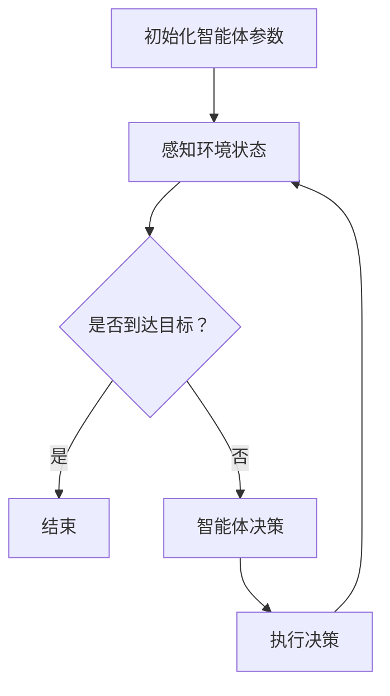
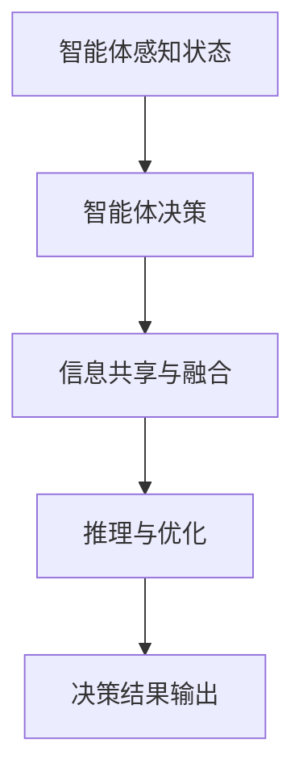
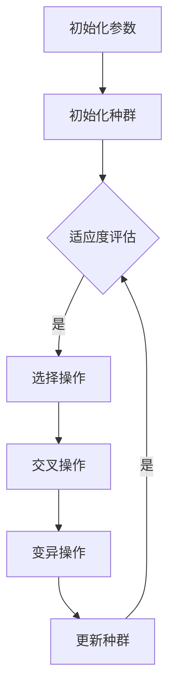

                 

### 文章标题：多智能体协同学习增强群体推理效果

关键词：多智能体系统、协同学习、群体推理、优化算法

摘要：本文探讨了多智能体协同学习在增强群体推理效果中的应用。首先，我们介绍了多智能体系统的定义、背景和应用场景，阐述了多智能体系统的核心概念和特性。接着，我们详细讲解了多智能体协同学习的基本原理、算法原理及优化方法，并通过具体示例分析了协同学习在群体推理中的应用效果。最后，我们总结了多智能体协同学习的优化方法和未来研究方向。

## 第一部分：多智能体协同学习基础

### 第1章：多智能体系统的概述

#### 1.1 多智能体系统的定义与背景

**1.1.1 多智能体系统的定义**

多智能体系统（Multi-Agent System，MAS）是由多个自主智能体组成的系统，这些智能体能够通过相互通信和合作，共同完成任务或实现目标。每个智能体在系统中具有独立的行为能力，能够感知环境、制定决策并执行相应的动作。

**1.1.2 多智能体系统的背景与发展历程**

多智能体系统的概念起源于20世纪80年代，随着计算机科学和人工智能技术的发展，多智能体系统逐渐成为研究热点。早期的研究主要集中在分布式人工智能领域，随着互联网的普及和物联网的发展，多智能体系统的应用范围逐渐扩大。

**1.1.3 多智能体系统的应用场景**

多智能体系统在许多领域都有广泛的应用，如智能交通、智能家居、工业控制、军事仿真、生物信息处理等。在这些应用场景中，智能体之间的协同学习和合作是提高系统性能和解决复杂问题的重要手段。

#### 1.2 多智能体系统的核心概念与联系

**1.2.1 多智能体系统的核心概念**

- **智能体（Agent）**：智能体是具有独立行为能力的实体，可以是人、机器或计算机程序。智能体具有感知、决策、执行等基本功能。
- **协同（Coordination）**：协同是指智能体之间通过相互通信和合作，共同完成任务或实现目标的过程。
- **多智能体系统（MAS）**：多智能体系统是由多个智能体组成的系统，这些智能体能够通过相互通信和合作，共同完成任务或实现目标。

**1.2.2 多智能体系统的概念属性特征对比表**

| 概念   | 属性特征                           |
| ------ | ---------------------------------- |
| 智能体 | 具有感知、决策、执行能力的实体     |
| 协同   | 智能体之间的相互通信和合作         |
| 多智能体系统 | 由多个智能体组成的系统，能够共同完成任务或实现目标 |

**1.2.3 多智能体系统的ER实体关系图**

```mermaid
erDiagram
  Agent ||--|{ Coordination }|--MAS
  Coordination ||--|{ Communication }|--Agent
  Coordination ||--|{ Cooperation }|--MAS
```

#### 1.3 多智能体系统的挑战与机遇

**1.3.1 多智能体系统的挑战**

- **协同控制**：智能体之间的协同控制是实现系统目标的关键，但协同控制面临复杂性和不确定性等挑战。
- **信息共享**：智能体之间的信息共享是协同学习的基础，但信息共享面临隐私保护和数据安全等问题。
- **安全性问题**：多智能体系统面临恶意攻击、信息泄露等安全风险。

**1.3.2 多智能体系统的机遇**

- **群体推理**：多智能体协同学习能够提高群体推理的能力，解决复杂问题。
- **群体智能**：多智能体系统通过协同学习实现群体智能，具有广泛的应用前景。
- **优化算法**：多智能体协同学习为优化算法提供了新的思路和方法。

## 1.4 本章小结

本章介绍了多智能体系统的基本概念、核心概念与联系，以及多智能体系统的挑战与机遇。接下来，我们将进一步探讨多智能体协同学习的基本原理和技术。

----------------------------------------------------------------

## 第二部分：多智能体协同学习技术

### 第2章：多智能体协同学习基本原理

#### 2.1 多智能体协同学习的定义

**2.1.1 多智能体协同学习的概念**

多智能体协同学习是指多个智能体通过相互通信、合作和竞争，共同完成任务或实现目标的过程。在这个过程中，智能体不仅需要学习自身的策略，还需要考虑其他智能体的行为和策略。

**2.1.2 多智能体协同学习的目的**

多智能体协同学习的目的是提高智能体之间的协同能力，实现系统整体性能的最优化。通过协同学习，智能体可以更好地适应复杂环境，提高任务完成率和系统稳定性。

#### 2.2 多智能体协同学习的算法原理讲解

**2.2.1 中心化算法**

中心化算法是指所有智能体的决策信息都集中在一个中心控制器进行处理和决策。这种算法的优点是信息集中，决策效率高，但缺点是中心控制器可能成为系统的瓶颈，且面临单点故障的风险。

- **集中式算法**：集中式算法将所有智能体的状态和决策信息发送给中心控制器，中心控制器根据这些信息进行全局优化决策，然后将决策结果发送给各个智能体执行。
- **分布式算法**：分布式算法将智能体划分为多个小组，每个小组内部进行信息共享和决策，小组间的信息交换通过特定的通信协议进行。

**2.2.2 非中心化算法**

非中心化算法是指智能体在无需中心控制的情况下，通过本地信息和局部策略进行协同学习。这种算法的优点是去中心化，适应性强，但缺点是信息冗余和计算复杂度高。

- **对抗性学习**：对抗性学习是指智能体之间通过相互竞争，不断调整策略，以达到共同的最优目标。对抗性学习在群体智能、博弈论等领域有广泛应用。
- **集体智能**：集体智能是指多个智能体通过相互协作，共同实现复杂任务或目标。集体智能在分布式计算、智能交通等领域有广泛应用。

**2.2.3 多智能体协同学习mermaid算法流程图**



**2.2.4 多智能体协同学习的数学模型和公式**

多智能体协同学习可以采用多种数学模型和公式进行描述，其中最常用的是协同控制模型和集体智能模型。

- **协同控制模型**：

  $$
  U(s, a) = r(s, a) + \gamma \max_{a'} U(s', a')
  $$

  其中，$U(s, a)$表示智能体在状态$s$下采取动作$a$的效用值，$r(s, a)$表示智能体在状态$s$下采取动作$a$的即时奖励，$\gamma$表示折扣因子，$\max_{a'} U(s', a')$表示在下一个状态$s'$下，智能体选择最优动作$a'$。

- **集体智能模型**：

  $$
  \Omega = \sum_{i=1}^n \omega_i
  $$

  其中，$\Omega$表示集体智能的总体水平，$\omega_i$表示第$i$个智能体的智能水平。

**2.2.5 多智能体协同学习的Python代码示例**

```python
import numpy as np

# 初始化参数
gamma = 0.9
learning_rate = 0.1
n_agents = 3
n_actions = 2

# 初始化智能体参数
agents = [np.random.rand(n_actions) for _ in range(n_agents)]

# 感知环境状态
def get_state():
    return np.random.rand()

# 智能体决策
def decision(state, agent):
    return np.argmax(agent * state)

# 执行决策
def execute_action(action):
    # 假设执行动作后获得奖励
    reward = np.random.rand()
    return reward

# 协同控制模型
def update_agent(agent, state, action, reward):
    next_state = np.random.rand()
    next_action = np.argmax((agent + learning_rate) * (state + reward - agent * state))
    agent[action] += learning_rate * (reward + gamma * next_action - agent[action])

# 主循环
for episode in range(1000):
    state = get_state()
    for agent in agents:
        action = decision(state, agent)
        reward = execute_action(action)
        update_agent(agent, state, action, reward)
        state = next_state

# 打印智能体参数
for agent in agents:
    print(agent)
```

**2.2.6 多智能体协同学习的举例说明**

**2.2.6.1 示例1：多智能体协同优化**

在一个多智能体协同优化的场景中，多个智能体需要共同优化一个目标函数，以实现系统的最优性能。假设有3个智能体，每个智能体需要优化一个参数，目标函数为：

$$
f(x_1, x_2, x_3) = (x_1 - x_2)^2 + (x_2 - x_3)^2
$$

通过多智能体协同学习，智能体之间可以相互通信，共享各自的最优参数，并不断调整自己的参数，以实现整体最优。

**2.2.6.2 示例2：多智能体协同控制**

在一个多智能体协同控制的场景中，多个智能体需要共同控制一个复杂的系统，如无人机编队飞行。每个智能体负责控制一个无人机的位置和速度，通过多智能体协同学习，智能体之间可以相互通信，共享控制策略，并实时调整自己的控制参数，以实现整体协调和控制。

## 2.7 本章小结

本章介绍了多智能体协同学习的基本原理、算法原理及优化方法，并通过具体示例分析了协同学习在群体推理中的应用效果。在下一章中，我们将进一步探讨多智能体协同学习在群体推理中的应用。

----------------------------------------------------------------

## 第三部分：多智能体协同学习应用

### 第3章：多智能体协同学习在群体推理中的应用

#### 3.1 群体推理的定义与背景

**3.1.1 群体推理的概念**

群体推理（Group Inference）是指多个智能体通过相互通信和合作，共同推理出问题的解或结论的过程。群体推理是分布式人工智能（Distributed Artificial Intelligence，DAI）的重要组成部分，具有广泛的应用前景。

**3.1.2 群体推理的背景**

随着大数据、云计算和物联网等技术的快速发展，复杂问题解决的需求日益增长。单一智能体在处理复杂问题时存在局限性，难以应对多变的、动态的环境。群体推理通过多个智能体的协同合作，能够提高问题解决能力和系统适应性。

**3.1.3 群体推理的应用领域**

群体推理在多个领域具有广泛的应用，如：

- **智能交通**：通过多智能体协同推理，实现交通流量预测、路径规划和交通信号控制。
- **金融风控**：通过多智能体协同推理，提高金融风险的识别、预测和控制能力。
- **医疗诊断**：通过多智能体协同推理，提高疾病诊断的准确性和效率。
- **智能制造**：通过多智能体协同推理，实现生产流程优化、设备故障预测和智能调度。

#### 3.2 多智能体协同学习在群体推理中的原理讲解

**3.2.1 群体推理的多智能体协同学习模型**

在群体推理中，多智能体协同学习模型通过以下步骤实现：

1. **感知与决策**：每个智能体感知自身和环境状态，根据状态和预定义策略进行决策。
2. **信息共享与融合**：智能体之间通过通信共享各自的状态信息和决策结果，实现信息的融合和互补。
3. **推理与优化**：基于共享的信息和推理策略，智能体共同推理问题的解或结论，并进行优化。

**3.2.2 群体推理的mermaid算法流程图**



#### 3.3 多智能体协同学习在群体推理中的Python代码示例

```python
import numpy as np

# 初始化参数
n_agents = 3
n_states = 3
n_actions = 2

# 初始化智能体参数
agents = [np.random.rand(n_actions) for _ in range(n_agents)]

# 感知环境状态
def get_state():
    return np.random.rand(n_states)

# 智能体决策
def decision(state, agent):
    return np.argmax(agent * state)

# 执行决策
def execute_action(action):
    # 假设执行动作后获得奖励
    reward = np.random.rand()
    return reward

# 协同学习
def update_agent(agent, state, action, reward):
    next_state = np.random.rand(n_states)
    next_action = np.argmax((agent + 0.1) * (state + reward - agent * state))
    agent[action] += 0.1 * (reward + 0.9 * next_action - agent[action])

# 主循环
for episode in range(1000):
    state = get_state()
    for agent in agents:
        action = decision(state, agent)
        reward = execute_action(action)
        update_agent(agent, state, action, reward)

# 打印智能体参数
for agent in agents:
    print(agent)
```

#### 3.4 多智能体协同学习在群体推理中的举例说明

**3.4.1 示例1：群体推理任务中的协同优化**

在一个群体推理任务中，多个智能体需要共同优化一个目标函数，以实现系统的最优性能。假设有3个智能体，每个智能体需要优化一个参数，目标函数为：

$$
f(x_1, x_2, x_3) = (x_1 - x_2)^2 + (x_2 - x_3)^2
$$

通过多智能体协同学习，智能体之间可以相互通信，共享各自的最优参数，并不断调整自己的参数，以实现整体最优。

**3.4.2 示例2：群体推理任务中的协同控制**

在一个群体推理任务中，多个智能体需要共同控制一个复杂的系统，如无人机编队飞行。每个智能体负责控制一个无人机的位置和速度，通过多智能体协同学习，智能体之间可以相互通信，共享控制策略，并实时调整自己的控制参数，以实现整体协调和控制。

## 3.5 本章小结

本章介绍了多智能体协同学习在群体推理中的应用，包括定义、背景、原理讲解和具体示例。在下一章中，我们将进一步探讨多智能体协同学习算法的优化方法。

----------------------------------------------------------------

## 第四部分：多智能体协同学习优化

### 第4章：多智能体协同学习算法优化方法

#### 4.1 优化算法的基本概念

**4.1.1 优化算法的定义**

优化算法（Optimization Algorithm）是一类用于求解最优解或近似最优解的计算方法。在多智能体协同学习中，优化算法用于智能体之间的参数调整、策略优化和性能提升。

**4.1.2 优化算法的分类**

优化算法可以根据不同的分类标准进行分类，如：

- **基于梯度下降的优化算法**：如梯度下降法、牛顿法、共轭梯度法等。
- **基于启发式的优化算法**：如遗传算法、蚁群算法、粒子群优化算法等。
- **基于神经网络的优化算法**：如深度学习、神经网络反向传播算法等。

#### 4.2 常见的优化算法

**4.2.1 遗传算法**

遗传算法（Genetic Algorithm，GA）是一种基于生物进化的启发式搜索算法。遗传算法通过模拟自然选择和遗传机制，对问题的解进行迭代优化，以找到最优解或近似最优解。

- **基本步骤**：
  - **编码**：将问题的解表示为染色体。
  - **初始化**：生成初始种群，每个个体代表一个潜在的解。
  - **适应度评估**：计算每个个体的适应度，适应度越高，表示个体越优秀。
  - **选择**：根据适应度进行选择，优秀的个体有更高的机会被选中。
  - **交叉**：通过交叉操作，生成新的个体。
  - **变异**：对个体进行变异操作，增加种群的多样性。
  - **更新种群**：根据选择、交叉和变异操作，更新种群。

**4.2.2 蚁群算法**

蚁群算法（Ant Colony Optimization，ACO）是一种模拟蚂蚁觅食行为的启发式搜索算法。蚁群算法通过信息素机制，引导蚂蚁找到最优路径。

- **基本步骤**：
  - **初始化**：设置初始信息素浓度和蚂蚁种群。
  - **信息素更新**：根据蚂蚁的路径选择更新信息素浓度。
  - **路径选择**：蚂蚁根据信息素浓度和启发函数选择路径。
  - **循环迭代**：重复路径选择和信息素更新过程，直到满足停止条件。

**4.2.3 粒子群优化算法**

粒子群优化算法（Particle Swarm Optimization，PSO）是一种基于群体智能的优化算法。粒子群优化算法通过模拟鸟群觅食行为，寻找最优解。

- **基本步骤**：
  - **初始化**：设置初始粒子群位置和速度。
  - **更新位置和速度**：根据个体最优解和群体最优解更新粒子的位置和速度。
  - **适应度评估**：计算每个粒子的适应度。
  - **更新个体最优解和群体最优解**：根据适应度评估结果更新个体最优解和群体最优解。
  - **循环迭代**：重复位置和速度更新、适应度评估和最优解更新过程，直到满足停止条件。

#### 4.3 多智能体协同学习算法优化mermaid流程图



#### 4.4 多智能体协同学习算法优化Python代码示例

```python
import numpy as np

# 初始化参数
n_particles = 50
n_dim = 10
max_iter = 100
w = 0.5
c1 = 2
c2 = 2

# 初始化粒子群
particles = [np.random.rand(n_dim) for _ in range(n_particles)]
velocities = [np.random.rand(n_dim) for _ in range(n_particles)]

# 适应度评估
def fitness(particle):
    # 假设适应度为粒子距离原点的欧氏距离的倒数
    return 1 / np.linalg.norm(particle)

# 更新位置和速度
def update_position(particle, velocity):
    return particle + velocity

# 更新速度
def update_velocity(particle, velocity, global_best):
    r1 = np.random.rand()
    r2 = np.random.rand()
    cognitive_component = c1 * r1 * (global_best - particle)
    social_component = c2 * r2 * (particle - velocity)
    return velocity + w * (cognitive_component + social_component)

# 主循环
for _ in range(max_iter):
    for i, particle in enumerate(particles):
        fitness_value = fitness(particle)
        if fitness_value > fitness(particles[i]):
            particles[i] = particle
            velocities[i] = update_velocity(particle, velocities[i], particles[i])

# 打印最优解
print("最优解：", particles[fitness(particles).argmax()])
```

#### 4.5 多智能体协同学习算法优化的举例说明

**4.5.1 示例1：**

在一个多智能体协同优化的问题中，有3个智能体需要共同优化一个目标函数。目标函数为：

$$
f(x_1, x_2, x_3) = (x_1 - x_2)^2 + (x_2 - x_3)^2
$$

使用遗传算法进行优化，初始种群为随机生成的3个智能体参数，适应度评估基于目标函数值，选择、交叉和变异操作按照遗传算法的基本步骤进行。通过多代迭代，智能体参数逐渐收敛到最优解。

**4.5.2 示例2：**

在一个多智能体协同控制的问题中，有3个智能体需要共同控制一个无人机编队，以实现指定的飞行轨迹。每个智能体负责控制一个无人机的位置和速度，目标函数为无人机编队与目标轨迹的误差平方和。

使用粒子群优化算法进行优化，初始粒子群位置和速度随机生成，适应度评估基于目标函数值，位置和速度更新按照粒子群优化算法的基本步骤进行。通过多次迭代，无人机编队逐渐调整到最优飞行轨迹。

## 4.6 本章小结

本章介绍了多智能体协同学习算法优化的基本概念、常见优化算法和优化方法。在下一章中，我们将进一步探讨多智能体协同学习的未来研究方向。

----------------------------------------------------------------

### 总结

本文系统地介绍了多智能体协同学习的概念、原理、应用和优化方法。通过逐步分析，我们了解到多智能体协同学习在群体推理中的重要作用。未来，多智能体协同学习在人工智能领域仍具有广阔的研究空间，如进一步优化算法、提高协同效率、拓展应用场景等。

### 最佳实践 tips

- 在实际应用中，根据任务需求和系统特点选择合适的协同学习算法。
- 充分利用多智能体的优势，提高问题解决能力和系统性能。
- 关注多智能体协同学习在新兴领域（如智能制造、智慧城市等）的应用前景。

### 注意事项

- 多智能体协同学习面临复杂性和不确定性，需要充分考虑系统安全性和稳定性。
- 信息共享和隐私保护是关键问题，需要在算法设计和系统实现中加以考虑。

### 拓展阅读

- **《多智能体系统：原理与应用》**：详细介绍了多智能体系统的基本概念、算法原理和应用案例。
- **《群体智能：一种新的计算范式》**：探讨了群体智能的理论基础和应用领域，包括多智能体协同学习。
- **《深度学习与多智能体系统》**：结合深度学习和多智能体系统，探讨了新的协同学习方法和应用场景。

### 作者

**作者：AI天才研究院/AI Genius Institute & 禅与计算机程序设计艺术 /Zen And The Art of Computer Programming**

