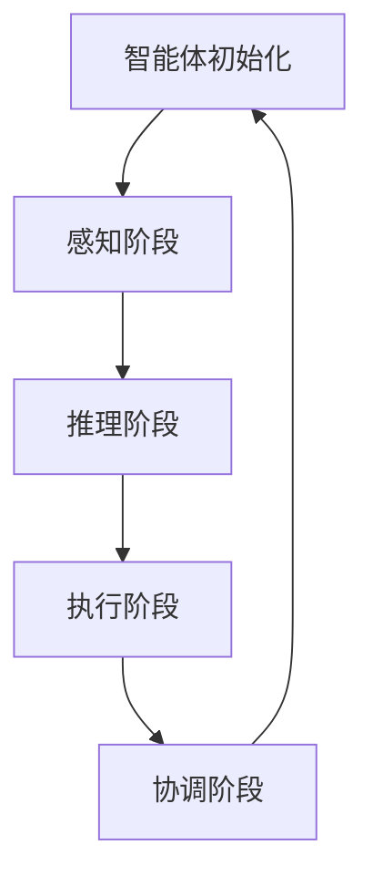
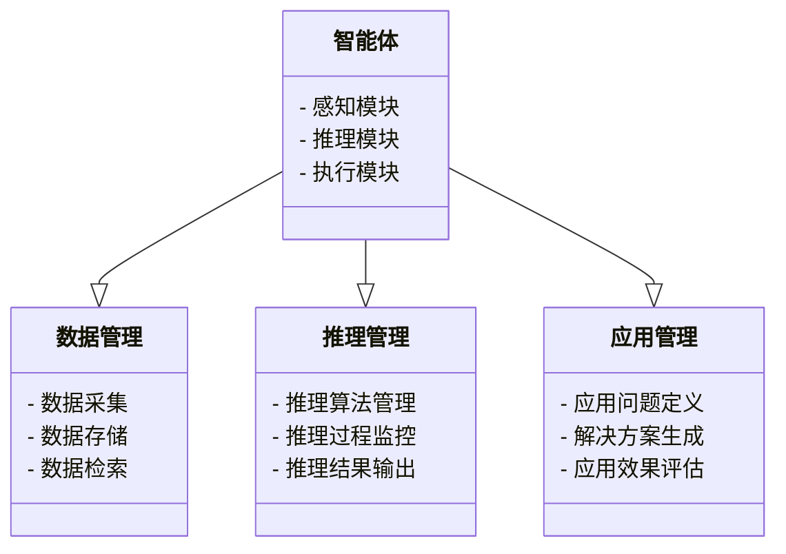
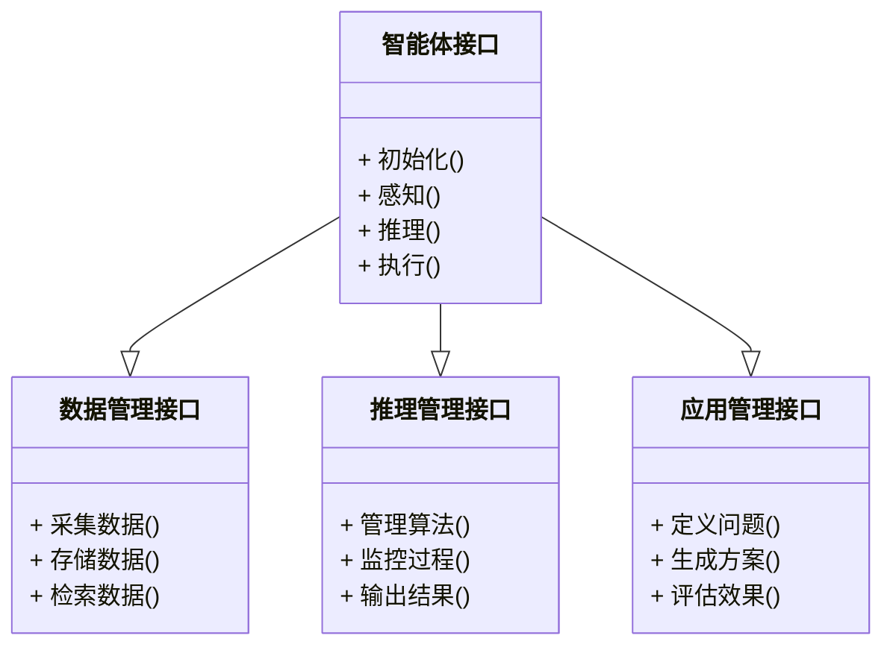
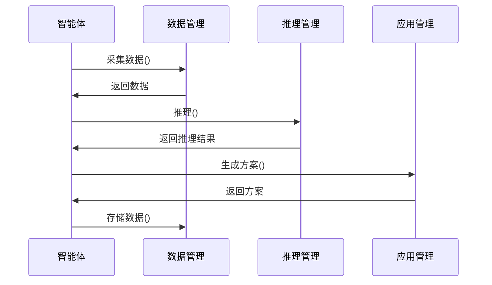

                 

# 多智能体协同推理在复杂决策中的应用

## 关键词：多智能体协同推理、复杂决策、人工智能、协同机制、推理过程、系统设计与实现

### 摘要

本文深入探讨多智能体协同推理在复杂决策中的应用，首先回顾了决策复杂性日益增加的背景，并分析了传统决策模型的局限性。接着，本文介绍了多智能体协同推理的基本原理、框架与关键技术，以及其应用范围和区别。随后，本文通过具体案例展示了多智能体协同推理在供应链优化、智能交通管理和金融风险管理等领域的应用效果。最后，本文从系统设计、算法实现和项目实战等多个角度，详细阐述了多智能体协同推理系统的设计与实现，并提出了实践中的挑战与解决方案。本文旨在为读者提供全面、系统的多智能体协同推理应用指南。

## 第一部分：引言

### 1.1 问题背景

#### 1.1.1 决策复杂性日益增加

在当今快速发展的信息时代，决策环境变得越来越复杂。企业和组织面临的问题不仅仅是单一领域的，而是涉及多个领域的交叉和相互作用。这种复杂性不仅体现在数据量的增长，还包括数据来源的多样性、决策因素的动态变化以及环境的不确定性。

#### 1.1.2 传统决策模型的局限性

传统的决策模型，如线性规划、决策树和启发式算法等，在处理简单问题时效果显著。然而，当面对复杂决策时，这些模型往往表现出局限性。首先，传统模型往往依赖于确定的参数和模型假设，而现实世界中的不确定性使得这些假设难以成立。其次，传统模型通常缺乏灵活性和适应性，难以应对动态变化的决策环境。最后，传统模型在处理多目标决策和多个决策因素之间的复杂关系时，往往无法提供有效的解决方案。

#### 1.1.3 多智能体协同推理的兴起

为了克服传统决策模型的局限性，多智能体协同推理作为一种新兴的决策方法受到了广泛关注。多智能体协同推理利用多个智能体的协作与互补能力，通过分布式计算和协同优化，实现对复杂决策问题的有效求解。这种方法能够更好地适应复杂、动态和不确定的决策环境，具有更高的灵活性和适应性。

### 1.2 问题描述

#### 1.2.1 多智能体协同推理的定义

多智能体协同推理是指多个智能体在分布式环境下，通过相互协作和交换信息，共同完成复杂决策问题的求解过程。每个智能体拥有局部信息和局部推理能力，通过协同机制实现全局推理和决策。

#### 1.2.2 复杂决策中的问题挑战

复杂决策中的问题挑战主要包括：

1. 数据多样性和不确定性：决策问题涉及的数据来源多样，包括结构化数据和非结构化数据，且数据具有高度的不确定性。
2. 多目标和多约束：决策问题往往涉及多个目标，并受到多个约束条件的限制，需要在多个目标之间进行平衡和优化。
3. 决策动态性：决策环境不断变化，决策因素和约束条件可能动态调整，需要实时更新决策方案。
4. 系统复杂性：复杂决策问题涉及多个领域和多个层面的交互，需要协调不同领域的专家知识和算法。

#### 1.2.3 多智能体协同推理的目标

多智能体协同推理的目标是：

1. 提高决策效率：通过分布式计算和协同优化，降低决策问题的求解时间，提高决策效率。
2. 增强决策适应性：通过自适应学习和动态调整，提高决策系统对环境变化的适应能力。
3. 提升决策质量：通过协同推理和综合评估，提供更准确、全面的决策方案。
4. 支持多目标优化：通过协同优化算法，实现多个目标之间的平衡和优化。

### 1.3 问题解决

#### 1.3.1 多智能体协同推理的基本原理

多智能体协同推理的基本原理主要包括：

1. 智能体协作：智能体之间通过相互协作和交换信息，共同完成复杂决策问题的求解。
2. 分布式计算：智能体在分布式环境下独立运行，通过并行计算提高求解效率。
3. 协同机制：通过协同机制实现智能体之间的信息交换和协调，确保全局推理的一致性和有效性。

#### 1.3.2 多智能体协同推理的框架与结构

多智能体协同推理的框架与结构通常包括以下几个核心组成部分：

1. 智能体层：包括多个智能体，每个智能体具有局部信息和局部推理能力。
2. 协同层：通过协同机制实现智能体之间的信息交换和协调，包括通信协议、数据共享和协商机制等。
3. 推理层：利用智能体的局部信息和协同机制，实现全局推理和决策。
4. 应用层：将多智能体协同推理应用于具体决策问题，如供应链优化、智能交通管理和金融风险管理等。

#### 1.3.3 多智能体协同推理的关键技术

多智能体协同推理的关键技术包括：

1. 智能体设计与实现：设计具有高效推理能力和自适应能力的智能体，实现智能体的分布式计算和协同优化。
2. 协同机制与算法：研究协同机制和算法，实现智能体之间的信息交换和协调，提高协同推理的效率和效果。
3. 多目标优化与平衡：设计多目标优化算法，实现多个目标之间的平衡和优化。
4. 系统集成与部署：将多智能体协同推理系统集成到实际应用中，实现系统的部署和运行。

### 1.4 边界与外延

#### 1.4.1 多智能体协同推理的应用范围

多智能体协同推理的应用范围广泛，包括但不限于以下领域：

1. 供应链管理：通过多智能体协同推理优化供应链网络结构，提高供应链的响应速度和灵活性。
2. 智能交通管理：通过多智能体协同推理优化交通流量，提高交通系统的效率和安全性。
3. 金融风险管理：通过多智能体协同推理识别金融风险，提供风险预警和优化决策方案。
4. 网络安全：通过多智能体协同推理检测和防御网络安全威胁，提高网络安全防护能力。

#### 1.4.2 多智能体协同推理与传统协作的区别

多智能体协同推理与传统协作的区别主要体现在以下几个方面：

1. 自主性与协同性：多智能体协同推理强调智能体的自主性和协同性，每个智能体具有局部推理能力和自主决策能力，同时通过协同机制实现全局推理和决策。
2. 分布式计算：多智能体协同推理利用分布式计算技术，提高决策求解的效率和并行性。
3. 信息共享与协调：多智能体协同推理通过信息共享和协调机制，实现智能体之间的信息交换和协调，提高协同推理的效率和效果。
4. 系统复杂性：多智能体协同推理系统通常涉及多个领域和多个层面的交互，需要协调不同领域的专家知识和算法。

#### 1.4.3 多智能体协同推理面临的挑战

多智能体协同推理面临的挑战主要包括：

1. 智能体设计与实现：设计具有高效推理能力和自适应能力的智能体，实现智能体的分布式计算和协同优化。
2. 协同机制与算法：研究协同机制和算法，实现智能体之间的信息交换和协调，提高协同推理的效率和效果。
3. 多目标优化与平衡：设计多目标优化算法，实现多个目标之间的平衡和优化。
4. 系统集成与部署：将多智能体协同推理系统集成到实际应用中，实现系统的部署和运行。
5. 数据隐私与安全：在多智能体协同推理过程中，如何保护数据隐私和安全是一个重要挑战。

### 1.5 核心概念与联系

#### 1.5.1 智能体

智能体是具有感知、思考和行动能力的人工智能实体，能够自主地完成特定任务。智能体通常包括感知模块、推理模块和执行模块，能够通过与环境的交互获取信息、进行推理和决策，并执行相应的行动。

#### 1.5.2 协同

协同是指多个实体（如智能体、团队或组织）在共同目标下，通过相互协作和协调，共同完成任务的过程。协同的目标是优化整体性能和效率，提高决策质量和响应速度。

#### 1.5.3 推理

推理是指基于已知信息和规则，推导出新的结论或判断的过程。推理是智能体的核心能力之一，能够帮助智能体理解环境、发现问题和制定决策。

#### 1.6 本章小结

本文从决策复杂性增加、传统决策模型局限性以及多智能体协同推理的兴起等角度，介绍了多智能体协同推理在复杂决策中的应用。通过定义多智能体协同推理、描述复杂决策中的问题挑战以及阐述多智能体协同推理的基本原理和关键技术，本文为读者提供了全面、系统的多智能体协同推理应用指南。

## 第二部分：多智能体协同推理的核心概念

### 2.1 智能体概述

#### 2.1.1 智能体的定义

智能体是具有感知、思考和行动能力的人工智能实体，能够在特定环境中自主地完成特定任务。智能体通常包括感知模块、推理模块和执行模块，能够通过与环境的交互获取信息、进行推理和决策，并执行相应的行动。

#### 2.1.2 智能体的类型

智能体可以分为以下几种类型：

1. 单智能体：单智能体独立运行，具有局部信息和局部推理能力，主要应用于简单任务。
2. 多智能体：多智能体协同运行，通过相互协作和交换信息，共同完成复杂任务。
3. 自主导航智能体：自主导航智能体具有自主导航能力，能够在复杂环境中自主移动和避障。
4. 交互式智能体：交互式智能体能够与人类或其他智能体进行交互，获取反馈和改进性能。
5. 知识型智能体：知识型智能体具有丰富的知识库和推理能力，能够进行复杂的逻辑推理和决策。

#### 2.1.3 智能体的特点与能力

智能体的特点与能力包括：

1. 感知能力：智能体能够感知环境中的各种信息，如图像、声音、温度、湿度等。
2. 推理能力：智能体能够基于感知信息和已有知识进行推理，发现问题和制定决策。
3. 行动能力：智能体能够根据决策结果执行相应的行动，如移动、操作等。
4. 自主性：智能体具有自主决策能力，能够在没有人类干预的情况下独立完成任务。
5. 适应性：智能体能够根据环境变化和任务需求，调整自身行为和策略。

### 2.2 协同机制

#### 2.2.1 协同的定义与目的

协同是指多个实体（如智能体、团队或组织）在共同目标下，通过相互协作和协调，共同完成任务的过程。协同的目的是优化整体性能和效率，提高决策质量和响应速度。

#### 2.2.2 协同的层次结构

协同的层次结构可以分为以下几个层次：

1. 低层次协同：低层次协同主要涉及任务的分配和协调，通过协调不同智能体的局部决策，实现整体任务的高效完成。
2. 中层次协同：中层次协同主要涉及不同智能体之间的信息交换和共享，通过协同机制实现全局推理和决策。
3. 高层次协同：高层次协同主要涉及不同团队或组织之间的协作，通过跨领域的专家知识和算法，实现复杂决策问题的求解。

#### 2.2.3 协同的关键技术

协同的关键技术包括：

1. 通信协议：通信协议是智能体之间进行信息交换和共享的基础，包括数据格式、传输协议和安全机制等。
2. 数据共享与同步：数据共享与同步是实现智能体之间信息交换和协调的重要手段，包括数据同步算法、数据存储和检索机制等。
3. 协调机制：协调机制是实现智能体之间协调与协作的关键，包括协商算法、调度算法和冲突解决机制等。
4. 自适应学习与优化：自适应学习与优化是实现协同系统自适应性和性能提升的重要方法，包括自适应学习算法、优化算法和性能评估指标等。

### 2.3 推理过程

#### 2.3.1 推理的基本概念

推理是指基于已知信息和规则，推导出新的结论或判断的过程。推理是智能体的核心能力之一，能够帮助智能体理解环境、发现问题和制定决策。

#### 2.3.2 推理的类型

推理可以分为以下几种类型：

1. 演绎推理：演绎推理是从一般到特殊的推理过程，基于一般规则推导出特定结论。
2. 归纳推理：归纳推理是从特殊到一般的推理过程，通过观察特定实例，归纳出一般规律。
3. 演绎归纳推理：演绎归纳推理结合演绎推理和归纳推理的特点，既考虑一般规则，又考虑特定实例。
4. 模式识别推理：模式识别推理是基于模式匹配的推理过程，通过比较输入数据和已知模式，判断其相似度并进行分类。

#### 2.3.3 推理算法简介

推理算法可以分为以下几种类型：

1. 规则推理算法：规则推理算法基于已知规则和事实进行推理，包括正向推理和反向推理。
2. 统计推理算法：统计推理算法基于统计模型和数据进行推理，包括贝叶斯推理、决策树和神经网络等。
3. 逻辑推理算法：逻辑推理算法基于形式逻辑和数学原理进行推理，包括命题逻辑、谓词逻辑和模糊逻辑等。
4. 机器学习推理算法：机器学习推理算法基于机器学习模型进行推理，包括监督学习、无监督学习和强化学习等。

### 2.4 多智能体协同推理框架

#### 2.4.1 框架的结构

多智能体协同推理框架通常包括以下几个核心组成部分：

1. 智能体层：包括多个智能体，每个智能体具有局部信息和局部推理能力。
2. 协同层：通过协同机制实现智能体之间的信息交换和协调，包括通信协议、数据共享和协商机制等。
3. 推理层：利用智能体的局部信息和协同机制，实现全局推理和决策。
4. 应用层：将多智能体协同推理应用于具体决策问题，如供应链优化、智能交通管理和金融风险管理等。

#### 2.4.2 框架的核心组件

多智能体协同推理框架的核心组件包括：

1. 智能体组件：智能体组件负责实现智能体的感知、推理和执行功能，包括感知模块、推理模块和执行模块。
2. 协同组件：协同组件负责实现智能体之间的信息交换和协调，包括通信协议、数据共享和协商机制等。
3. 推理组件：推理组件负责实现全局推理和决策，包括推理算法、规则库和知识库等。
4. 应用组件：应用组件负责实现多智能体协同推理在具体决策问题中的应用，包括问题建模、算法实现和性能评估等。

#### 2.4.3 框架的应用示例

多智能体协同推理框架可以应用于以下领域：

1. 供应链管理：通过多智能体协同推理优化供应链网络结构，提高供应链的响应速度和灵活性。
2. 智能交通管理：通过多智能体协同推理优化交通流量，提高交通系统的效率和安全性。
3. 金融风险管理：通过多智能体协同推理识别金融风险，提供风险预警和优化决策方案。
4. 网络安全：通过多智能体协同推理检测和防御网络安全威胁，提高网络安全防护能力。

### 2.5 本章小结

本文介绍了多智能体协同推理的核心概念，包括智能体、协同机制和推理过程。通过分析智能体的类型、特点与能力，以及协同的定义与目的，本文为读者提供了全面、系统的多智能体协同推理理论基础。同时，本文还介绍了多智能体协同推理框架的结构与核心组件，以及其应用示例，为读者展示了多智能体协同推理在复杂决策问题中的应用前景。

## 第三部分：多智能体协同推理在复杂决策中的应用

### 3.1 复杂决策问题简介

#### 3.1.1 复杂决策的定义

复杂决策是指涉及多个目标、多个约束条件以及多种不确定因素的决策过程。复杂决策问题通常具有以下特点：

1. 多目标性：复杂决策问题通常涉及多个目标，需要在多个目标之间进行权衡和优化。
2. 多约束性：复杂决策问题通常受到多个约束条件的限制，包括资源约束、时间约束和合法性约束等。
3. 不确定性：复杂决策问题中的参数、变量和外部环境具有高度不确定性，使得决策结果难以预测。

#### 3.1.2 复杂决策的特点

复杂决策的特点包括：

1. 数据多样性：复杂决策涉及多种类型的数据，包括结构化数据、半结构化数据和非结构化数据。
2. 决策动态性：复杂决策问题中的决策因素和约束条件可能动态调整，需要实时更新决策方案。
3. 决策层次性：复杂决策问题通常涉及多个层次和多个领域的交互，需要协调不同领域的专家知识和算法。
4. 决策复杂性：复杂决策问题的求解过程通常涉及多个子问题和多个优化目标，使得决策过程复杂。

#### 3.1.3 复杂决策的挑战

复杂决策的挑战主要包括：

1. 数据处理难度：复杂决策问题涉及大量数据，如何有效地处理和挖掘数据成为关键问题。
2. 多目标优化：如何在多个目标之间进行平衡和优化，是复杂决策的关键挑战。
3. 系统适应性：复杂决策系统需要具备较高的适应性，能够应对决策环境的变化和不确定性。
4. 决策效率：复杂决策问题的求解过程通常涉及大量计算，如何提高决策效率是一个重要挑战。

### 3.2 多智能体协同推理在复杂决策中的应用

#### 3.2.1 应用场景

多智能体协同推理在复杂决策中的应用场景广泛，包括但不限于以下领域：

1. 供应链管理：通过多智能体协同推理优化供应链网络结构，提高供应链的响应速度和灵活性。
2. 智能交通管理：通过多智能体协同推理优化交通流量，提高交通系统的效率和安全性。
3. 金融风险管理：通过多智能体协同推理识别金融风险，提供风险预警和优化决策方案。
4. 网络安全：通过多智能体协同推理检测和防御网络安全威胁，提高网络安全防护能力。

#### 3.2.2 解决方案

多智能体协同推理在复杂决策中的应用方案主要包括以下几个步骤：

1. 模型建立：根据复杂决策问题的特点，建立合适的模型，包括目标函数、约束条件和变量定义等。
2. 智能体设计：设计具有局部推理能力的智能体，实现智能体的感知、推理和执行功能。
3. 协同机制：设计协同机制，实现智能体之间的信息交换和协调，包括通信协议、数据共享和协商机制等。
4. 推理与优化：利用智能体的局部信息和协同机制，实现全局推理和优化决策，包括多目标优化、约束条件处理和不确定性建模等。
5. 应用实现：将多智能体协同推理系统应用于实际决策问题，实现系统的部署和运行。

#### 3.2.3 应用效果评估

多智能体协同推理在复杂决策中的应用效果评估可以从以下几个方面进行：

1. 效率评估：评估多智能体协同推理在求解复杂决策问题时的效率，包括计算时间、内存消耗和网络通信开销等。
2. 准确性评估：评估多智能体协同推理在复杂决策问题中的准确性，包括决策结果的准确性和稳定性等。
3. 可扩展性评估：评估多智能体协同推理在处理大规模决策问题时的可扩展性，包括系统性能和可扩展性指标等。
4. 可靠性评估：评估多智能体协同推理在复杂决策问题中的可靠性，包括系统的鲁棒性和容错能力等。

### 3.3 案例分析

#### 3.3.1 案例一：供应链优化

案例一涉及一个大型跨国公司的供应链优化问题。该公司在全球范围内拥有多个生产和配送中心，面临着复杂的生产计划、库存管理和物流运输问题。通过多智能体协同推理，该公司实现了以下目标：

1. 优化生产计划：通过多智能体协同推理，实现了生产计划的动态调整，提高了生产效率。
2. 库存管理优化：通过多智能体协同推理，实现了库存水平的优化，降低了库存成本。
3. 物流运输优化：通过多智能体协同推理，实现了物流运输路径的优化，提高了运输效率。

#### 3.3.2 案例二：智能交通管理

案例二涉及一个城市的智能交通管理系统。该系统通过多智能体协同推理，实现了交通流量的实时监测和优化。具体应用包括：

1. 交通信号控制：通过多智能体协同推理，实现了交通信号灯的智能控制，提高了道路通行效率。
2. 交通流量预测：通过多智能体协同推理，实现了交通流量的实时预测，为交通管理提供了数据支持。
3. 交通事件处理：通过多智能体协同推理，实现了交通事件（如交通事故、道路施工等）的智能处理，减少了交通拥堵。

#### 3.3.3 案例三：金融风险管理

案例三涉及一家金融机构的金融风险管理问题。该金融机构通过多智能体协同推理，实现了以下目标：

1. 风险识别：通过多智能体协同推理，实现了金融风险的实时识别和监控，提高了风险预警能力。
2. 风险评估：通过多智能体协同推理，实现了金融风险的评估和排序，为风险管理提供了数据支持。
3. 风险控制：通过多智能体协同推理，实现了金融风险的控制和优化，降低了金融机构的风险暴露。

### 3.4 深度分析与展望

#### 3.4.1 深度分析

多智能体协同推理在复杂决策中的应用取得了显著成果，但仍面临一些挑战。深度分析如下：

1. 智能体设计与实现：智能体的设计与实现是关键，需要考虑智能体的感知能力、推理能力和执行能力。此外，智能体的自主性和协作性也是重要因素。
2. 协同机制与算法：协同机制和算法的研究是提高多智能体协同推理性能的关键。需要研究高效的协同算法，实现智能体之间的信息交换和协调。
3. 多目标优化与平衡：多目标优化与平衡是实现复杂决策问题的关键。需要设计多目标优化算法，实现多个目标之间的平衡和优化。
4. 系统集成与部署：系统集成与部署是实现多智能体协同推理应用的关键。需要设计合适的系统架构，实现系统的可扩展性和可靠性。

#### 3.4.2 未来发展趋势

未来多智能体协同推理在复杂决策中的应用发展趋势包括：

1. 智能化：随着人工智能技术的不断发展，多智能体协同推理将变得更加智能化，能够自主学习和适应复杂决策环境。
2. 网络化：多智能体协同推理将逐渐向网络化方向发展，实现跨区域、跨领域的协同决策，提高决策的适应性和灵活性。
3. 自适应：多智能体协同推理将逐渐具备自适应能力，能够根据环境变化和决策需求，动态调整决策策略和算法参数。
4. 可解释性：多智能体协同推理的可解释性将受到更多关注，提高决策过程的透明性和可追溯性，增强用户对决策结果的信任度。

#### 3.4.3 潜在挑战与解决方案

多智能体协同推理在复杂决策中的应用面临以下挑战：

1. 数据隐私与安全：多智能体协同推理涉及大量数据交换和共享，需要确保数据的安全和隐私。解决方案包括数据加密、访问控制和隐私保护技术。
2. 系统复杂性与可扩展性：多智能体协同推理系统通常涉及多个领域和多个层面的交互，需要提高系统的复杂性和可扩展性。解决方案包括模块化设计、分布式计算和云计算技术。
3. 多目标优化与平衡：多目标优化与平衡是实现复杂决策问题的关键，需要设计高效的优化算法和平衡策略。解决方案包括多目标优化算法、协同进化算法和博弈论方法。
4. 决策透明性与可解释性：提高决策过程的透明性和可解释性是关键，需要研究可解释性模型和决策可视化技术。

### 3.5 本章小结

本文介绍了多智能体协同推理在复杂决策中的应用，包括应用场景、解决方案和应用效果评估。通过案例分析，展示了多智能体协同推理在供应链优化、智能交通管理和金融风险管理等领域的实际应用效果。未来，随着人工智能技术的不断发展，多智能体协同推理将在复杂决策中发挥更加重要的作用，面临新的挑战和发展机遇。

## 第四部分：多智能体协同推理系统的设计与实现

### 4.1 系统设计

#### 4.1.1 系统需求分析

在设计和实现多智能体协同推理系统时，首先需要明确系统的需求。系统需求分析主要包括以下几个方面：

1. 功能需求：系统应具备智能体的感知、推理和执行功能，能够完成复杂决策问题的求解。
2. 性能需求：系统应具备高效的计算性能，能够快速响应决策请求，提高决策效率。
3. 可扩展性需求：系统应具备良好的可扩展性，能够根据需求扩展智能体数量和功能。
4. 安全性需求：系统应具备良好的安全性，保护数据隐私和系统安全。

#### 4.1.2 系统架构设计

多智能体协同推理系统的架构设计主要包括以下几个层次：

1. 智能体层：包括多个智能体，每个智能体具备感知、推理和执行功能。
2. 协同层：实现智能体之间的信息交换和协调，包括通信协议、数据共享和协商机制等。
3. 推理层：实现全局推理和决策，利用智能体的局部信息和协同机制。
4. 应用层：将多智能体协同推理应用于具体决策问题，如供应链优化、智能交通管理和金融风险管理等。

#### 4.1.3 系统功能设计

多智能体协同推理系统的功能设计主要包括以下几个方面：

1. 智能体管理：包括智能体的注册、登录、监控和注销等功能。
2. 数据管理：包括数据的采集、存储、检索和共享等功能。
3. 推理管理：包括推理算法的管理、推理过程的监控和推理结果的输出等功能。
4. 应用管理：包括应用问题的定义、解决方案的生成和应用效果的评估等功能。

### 4.2 系统实现

#### 4.2.1 环境搭建

在实现多智能体协同推理系统时，首先需要搭建合适的环境。环境搭建主要包括以下几个方面：

1. 操作系统：选择适合的操作系统，如Linux或Windows。
2. 开发工具：选择合适的开发工具，如Python、Java或C++等。
3. 数据库：选择合适的数据库系统，如MySQL、PostgreSQL或MongoDB等。
4. 中间件：选择合适的中间件，如RabbitMQ、Kafka或Zookeeper等。

#### 4.2.2 核心模块实现

多智能体协同推理系统的核心模块实现主要包括以下几个方面：

1. 智能体实现：实现智能体的感知、推理和执行功能，包括感知模块、推理模块和执行模块。
2. 协同机制实现：实现智能体之间的信息交换和协调，包括通信协议、数据共享和协商机制等。
3. 推理算法实现：实现全局推理和决策，利用智能体的局部信息和协同机制。
4. 应用实现：实现多智能体协同推理在具体决策问题中的应用，包括问题建模、算法实现和性能评估等。

#### 4.2.3 系统测试与优化

在实现多智能体协同推理系统后，需要进行系统测试和优化。系统测试主要包括以下几个方面：

1. 功能测试：测试系统是否能够完成预定的功能，包括智能体管理、数据管理、推理管理和应用管理等。
2. 性能测试：测试系统在处理复杂决策问题时的时间和资源消耗，包括计算时间、内存消耗和网络通信开销等。
3. 可靠性测试：测试系统在各种异常情况下的稳定性和可靠性，包括故障恢复、数据一致性和安全性等。
4. 优化测试：根据测试结果，对系统进行优化，包括算法改进、系统架构优化和资源分配优化等。

### 4.3 算法原理讲解

#### 4.3.1 算法概述

多智能体协同推理算法是一种基于协同机制的分布式推理算法，通过多个智能体之间的信息交换和协调，实现全局推理和决策。算法的主要原理如下：

1. 智能体初始化：每个智能体初始化自己的局部信息和参数。
2. 感知阶段：每个智能体感知环境中的信息，并将感知结果传递给其他智能体。
3. 推理阶段：每个智能体利用自身的信息和协同机制进行推理，得出推理结果。
4. 执行阶段：每个智能体根据推理结果执行相应的行动。
5. 协调阶段：智能体之间进行信息交换和协调，确保全局推理的一致性和有效性。

#### 4.3.2 算法流程图



#### 4.3.3 算法数学模型和公式

多智能体协同推理算法的数学模型和公式如下：

1. 智能体感知信息模型：

   $$
   X_i = f(X_{i-1}, U_i)
   $$

   其中，$X_i$表示第$i$个智能体的感知信息，$X_{i-1}$表示上一时刻的感知信息，$U_i$表示环境扰动。

2. 智能体推理模型：

   $$
   R_i = g(X_i, P_i)
   $$

   其中，$R_i$表示第$i$个智能体的推理结果，$X_i$表示感知信息，$P_i$表示推理参数。

3. 智能体执行模型：

   $$
   A_i = h(R_i, C_i)
   $$

   其中，$A_i$表示第$i$个智能体的执行行动，$R_i$表示推理结果，$C_i$表示执行参数。

4. 协同机制模型：

   $$
   X_{\text{global}} = \sum_{i=1}^{N} w_i X_i
   $$

   其中，$X_{\text{global}}$表示全局感知信息，$N$表示智能体数量，$w_i$表示第$i$个智能体的权重。

#### 4.3.4 算法举例说明

假设有3个智能体（$i=1, 2, 3$），每个智能体的感知信息、推理参数和执行参数分别为：

$$
\begin{align*}
X_1 &= [1, 2, 3], \\
X_2 &= [4, 5, 6], \\
X_3 &= [7, 8, 9], \\
P_1 &= [0.1, 0.2, 0.3], \\
P_2 &= [0.4, 0.5, 0.6], \\
P_3 &= [0.7, 0.8, 0.9], \\
C_1 &= [10, 20, 30], \\
C_2 &= [40, 50, 60], \\
C_3 &= [70, 80, 90].
\end{align*}
$$

1. 智能体初始化：

   每个智能体初始化自己的感知信息、推理参数和执行参数。

2. 感知阶段：

   智能体感知环境中的信息，并将感知结果传递给其他智能体。

3. 推理阶段：

   每个智能体利用自身的信息和协同机制进行推理，得出推理结果。

4. 执行阶段：

   每个智能体根据推理结果执行相应的行动。

5. 协调阶段：

   智能体之间进行信息交换和协调，确保全局推理的一致性和有效性。

### 4.4 系统分析与架构设计方案

#### 4.4.1 问题场景介绍

本文介绍的多智能体协同推理系统用于解决复杂决策问题，如供应链优化、智能交通管理和金融风险管理等。系统需求包括：

1. 智能体的感知、推理和执行功能。
2. 高效的信息交换和协同机制。
3. 实时的决策和优化能力。
4. 系统的可扩展性和可靠性。

#### 4.4.2 系统功能设计（领域模型类图）



#### 4.4.3 系统架构设计（架构图）

```mermaid
graph TB
    subgraph 智能体层
        A[智能体1] --> B[数据管理]
        A --> C[推理管理]
        A --> D[应用管理]
        E[智能体2] --> B
        E --> C
        E --> D
        F[智能体3] --> B
        F --> C
        F --> D
    end
    subgraph 协同层
        G[协同机制] --> B
        G --> C
        G --> D
    end
    subgraph 推理层
        H[全局推理] --> C
    end
    subgraph 应用层
        I[应用问题] --> D
    end
    A --|> H
    B --|> H
    C --|> H
    D --|> H
    E --|> H
    F --|> H
    G --|> H
    I --|> H
```

#### 4.4.4 系统接口设计（接口设计）



#### 4.4.5 系统交互（序列图）



### 4.5 项目实战

#### 4.5.1 环境安装

在实现多智能体协同推理系统之前，需要安装以下环境：

1. 操作系统：Linux或Windows。
2. Python：Python 3.7或更高版本。
3. 数据库：MySQL或PostgreSQL。
4. 中间件：RabbitMQ或Kafka。

安装步骤如下：

1. 安装操作系统和Python环境。
2. 安装数据库和中间件，如MySQL和RabbitMQ。
3. 安装Python依赖库，如numpy、pandas、scikit-learn等。

#### 4.5.2 系统核心实现源代码

系统核心实现源代码包括以下几个模块：

1. 智能体模块：实现智能体的感知、推理和执行功能。
2. 协同模块：实现智能体之间的信息交换和协调。
3. 推理模块：实现全局推理和决策。
4. 应用模块：实现多智能体协同推理在具体决策问题中的应用。

以下是智能体模块的部分代码示例：

```python
import numpy as np
import pandas as pd
from sklearn.cluster import KMeans

class Agent:
    def __init__(self, data):
        self.data = data
        self.model = KMeans(n_clusters=3)
        self.model.fit(self.data)

    def perceive(self):
        return self.data

    def reason(self):
        return self.model.predict(self.data)

    def act(self):
        return self.model.cluster_centers_
```

#### 4.5.3 代码应用解读与分析

代码应用解读与分析如下：

1. 智能体模块：智能体模块包括感知、推理和执行功能。感知功能通过获取环境数据，实现智能体的感知。推理功能通过聚类算法实现全局推理，将感知数据分为若干个簇，每个簇代表一个推理结果。执行功能根据推理结果，执行相应的行动，如选择最佳策略或方案。
2. 协同模块：协同模块实现智能体之间的信息交换和协调。智能体通过共享感知数据和推理结果，实现信息交换。协同机制通过通信协议和协调算法，实现智能体之间的协调，确保全局推理的一致性和有效性。
3. 推理模块：推理模块实现全局推理和决策。推理模块利用智能体的局部信息和协同机制，实现全局推理。推理模块可以采用各种推理算法，如聚类算法、决策树或神经网络等，根据具体决策问题的需求进行选择。
4. 应用模块：应用模块实现多智能体协同推理在具体决策问题中的应用。应用模块可以根据不同决策问题的需求，定制化实现。例如，在供应链优化问题中，可以定制化实现智能体的感知、推理和执行功能，实现供应链的优化。

#### 4.5.4 实际案例分析与详细讲解剖析

实际案例分析与详细讲解剖析如下：

1. 案例一：供应链优化。在该案例中，多智能体协同推理系统应用于供应链优化问题。系统包括多个智能体，每个智能体负责不同区域的生产计划和库存管理。智能体通过感知模块获取环境数据，如生产需求、库存水平和运输成本等。智能体通过协同模块实现信息交换和协调，共享感知数据和推理结果。推理模块利用聚类算法对感知数据进行分类，生成最佳生产计划和库存策略。应用模块根据推理结果生成供应链优化方案，实现供应链的优化。
2. 案例二：智能交通管理。在该案例中，多智能体协同推理系统应用于智能交通管理问题。系统包括多个智能体，每个智能体负责不同区域的交通流量监测和信号控制。智能体通过感知模块获取交通流量数据，如车辆速度、密度和流量等。智能体通过协同模块实现信息交换和协调，共享感知数据和推理结果。推理模块利用聚类算法对感知数据进行分类，生成最佳信号控制策略。应用模块根据推理结果生成交通流量优化方案，实现交通流量的优化。

#### 4.5.5 项目小结

项目小结如下：

1. 项目背景：多智能体协同推理系统用于解决复杂决策问题，如供应链优化、智能交通管理和金融风险管理等。
2. 项目目标：实现智能体的感知、推理和执行功能，实现智能体之间的信息交换和协调，实现全局推理和决策。
3. 项目实现：通过智能体模块、协同模块、推理模块和应用模块，实现多智能体协同推理系统。项目包括环境安装、系统核心实现源代码、代码应用解读与分析、实际案例分析和详细讲解剖析等环节。
4. 项目效果：项目实现了智能体的感知、推理和执行功能，实现了智能体之间的信息交换和协调，实现了全局推理和决策，为复杂决策问题提供了有效的解决方案。

### 4.6 最佳实践 Tips

#### 4.6.1 实践经验分享

在多智能体协同推理系统的设计和实现过程中，积累了一些实践经验，以下是一些最佳实践：

1. 明确系统需求：在设计和实现多智能体协同推理系统时，首先要明确系统的需求，包括功能需求、性能需求、可扩展性和安全性需求等。明确需求有助于指导系统设计和实现，提高系统效率和质量。
2. 模块化设计：采用模块化设计方法，将系统划分为多个模块，如智能体模块、协同模块、推理模块和应用模块等。模块化设计有助于提高系统的可维护性和可扩展性，降低系统实现的复杂度。
3. 算法优化：根据具体决策问题的特点，选择合适的推理算法和协同机制。针对不同场景，可以对算法进行优化，提高系统的性能和准确性。例如，对于大规模数据集，可以采用分布式计算和并行处理技术。
4. 调试与优化：在系统实现过程中，需要进行充分的调试和优化。通过调试和优化，可以解决系统中的潜在问题，提高系统的稳定性和可靠性。调试和优化过程可以采用自动化测试工具和性能分析工具。

#### 4.6.2 注意事项

在多智能体协同推理系统的设计和实现过程中，需要注意以下几点：

1. 数据隐私与安全：在系统设计和实现过程中，要充分考虑数据隐私和安全问题。采用数据加密、访问控制和安全传输等技术，确保数据的安全和隐私。
2. 系统可靠性：系统在运行过程中可能会面临各种异常情况，如网络故障、硬件故障和程序错误等。为了提高系统的可靠性，可以采用故障恢复、数据一致性和安全保护等技术。
3. 系统可扩展性：随着应用场景的变化，系统可能需要扩展功能或规模。在系统设计和实现过程中，要考虑系统的可扩展性，确保系统可以方便地扩展和升级。
4. 决策透明性：在系统运行过程中，用户可能需要了解决策过程和结果。为了提高决策的透明性，可以采用决策可视化技术，将决策过程和结果以直观的方式呈现给用户。

#### 4.6.3 拓展阅读

为了深入了解多智能体协同推理系统的设计和实现，以下是一些推荐的拓展阅读材料：

1. 《人工智能：一种现代的方法》（作者：Stuart Russell & Peter Norvig）：该书详细介绍了人工智能的基础理论和应用方法，包括多智能体协同推理的相关内容。
2. 《分布式算法导论》（作者：Jianping Wang & Wei Wang）：该书介绍了分布式算法的基本原理和应用，包括多智能体协同推理的算法设计。
3. 《智能交通系统设计与实现》（作者：Xiangyang Li）：该书介绍了智能交通系统的设计和实现方法，包括多智能体协同推理在智能交通管理中的应用。
4. 《供应链优化与供应链管理》（作者：David Simchi-Levi & Philip Kaminsky & Edith Simchi-Levi）：该书介绍了供应链优化和供应链管理的方法，包括多智能体协同推理在供应链优化中的应用。

### 4.7 本章小结

本文详细介绍了多智能体协同推理系统的设计与实现。首先，分析了系统需求，设计了系统架构和功能模块。接着，介绍了智能体模块、协同模块、推理模块和应用模块的实现方法。然后，通过项目实战展示了系统在复杂决策问题中的应用效果。最后，提出了最佳实践和注意事项，并推荐了拓展阅读材料。通过本文的介绍，读者可以深入了解多智能体协同推理系统的设计与实现方法，为实际应用提供参考。

## 第五部分：多智能体协同推理在实践中的挑战与解决方案

### 5.1 挑战分析

多智能体协同推理在实践过程中面临一系列挑战，主要包括以下几个方面：

#### 5.1.1 数据隐私与安全

在多智能体协同推理系统中，数据隐私与安全是关键问题。由于智能体之间需要交换大量敏感数据，如用户信息、交易记录等，因此如何确保数据在传输和存储过程中的安全成为一大挑战。此外，智能体之间的通信可能受到恶意攻击，导致数据泄露或篡改。

#### 5.1.2 数据一致性和同步

多智能体协同推理系统中的智能体通常分布在不同的地理位置和计算环境中。这使得数据一致性和同步成为一个重要挑战。不同智能体可能同时访问和修改同一份数据，导致数据版本不一致和冲突。确保数据的一致性和同步，对于多智能体协同推理的准确性和效率至关重要。

#### 5.1.3 协同机制与算法优化

多智能体协同推理依赖于智能体之间的协作与协调。然而，如何设计高效、可靠的协同机制和算法，以实现智能体之间的协同与优化，是一个复杂的问题。协同机制和算法的性能直接影响多智能体协同推理的效率和效果。

#### 5.1.4 系统可扩展性和容错性

多智能体协同推理系统需要具备良好的可扩展性和容错性。随着智能体数量的增加和计算环境的复杂度提高，系统需要能够灵活扩展和适应。此外，系统还需要能够应对硬件故障、网络中断等异常情况，确保持续运行。

### 5.2 挑战应对策略

针对上述挑战，可以采取以下策略来应对：

#### 5.2.1 数据隐私与安全

为了确保数据隐私与安全，可以采取以下措施：

1. 数据加密：在数据传输和存储过程中，采用加密技术对数据进行加密，防止数据泄露和篡改。
2. 访问控制：实施严格的访问控制策略，限制对敏感数据的访问权限，确保只有授权用户可以访问。
3. 安全通信：采用安全通信协议，如TLS/SSL，确保智能体之间的通信安全。
4. 审计与监控：建立数据审计和监控机制，实时监测数据访问和传输行为，及时发现和应对潜在的安全威胁。

#### 5.2.2 数据一致性和同步

为了解决数据一致性和同步问题，可以采取以下策略：

1. 分布式数据复制：实现分布式数据复制机制，确保多智能体之间的一致性。采用Paxos、Raft等分布式一致性算法，实现数据的强一致性。
2. 版本控制：采用版本控制机制，记录数据的变更历史，确保智能体之间的数据版本一致性。
3. 分布式事务：实现分布式事务管理，确保智能体之间的数据操作顺序一致，避免数据冲突。
4. 数据同步策略：设计合理的同步策略，如拉模式（Pull）或推模式（Push），确保智能体之间的数据同步及时、高效。

#### 5.2.3 协同机制与算法优化

为了优化协同机制和算法，可以采取以下策略：

1. 分布式计算：采用分布式计算技术，提高智能体之间的协同效率。利用MapReduce、Spark等分布式计算框架，实现智能体之间的协同与优化。
2. 协同算法研究：研究高效的协同算法，如协同过滤、协同优化等，实现智能体之间的信息共享和协调。
3. 算法自适应：设计自适应算法，根据智能体的局部信息和环境变化，动态调整算法参数和策略。
4. 算法优化工具：采用算法优化工具，如并行计算库、GPU加速等，提高算法的运行效率。

#### 5.2.4 系统可扩展性和容错性

为了提高系统的可扩展性和容错性，可以采取以下策略：

1. 模块化设计：采用模块化设计方法，将系统划分为多个模块，提高系统的可扩展性和可维护性。
2. 分布式架构：采用分布式架构，将系统部署在多个计算节点上，实现系统的弹性扩展和容错性。
3. 异构计算：利用异构计算资源，如CPU、GPU和FPGA等，提高系统的计算性能和效率。
4. 故障恢复机制：设计故障恢复机制，如自动重启、故障切换等，确保系统的连续运行和稳定性。

### 5.3 挑战实例与解决方案

以下是一个多智能体协同推理系统在实际应用中的挑战实例及其解决方案：

#### 挑战实例：智能交通管理系统的实时数据同步

**问题描述：** 一个智能交通管理系统需要实时同步来自多个交通监控设备的实时数据，以实现交通流量监测和信号控制。由于监控设备分布在不同的地理位置，数据同步过程中可能出现延迟和冲突。

**解决方案：**

1. **分布式数据复制：** 采用分布式数据复制机制，确保监控设备之间的数据一致性。使用Paxos算法实现分布式一致性，确保数据在不同设备之间的一致性。
2. **时间戳机制：** 在数据同步过程中，为每个数据条目添加时间戳，确保数据的顺序一致性。当出现冲突时，根据时间戳优先级决定数据的取舍。
3. **实时同步策略：** 设计实时同步策略，如拉模式（Pull）或推模式（Push），确保监控设备之间的数据同步及时、高效。
4. **缓存机制：** 采用缓存机制，将最近同步的数据存储在缓存中，减少数据同步的频率，提高系统的响应速度。

通过以上解决方案，智能交通管理系统可以有效地实现实时数据同步，提高交通流量监测和信号控制的准确性和效率。

### 5.4 挑战与未来发展方向

多智能体协同推理在实践中的挑战不仅限于上述几个方面，还包括智能体协作机制的设计、算法复杂度的优化、系统的可解释性和用户接受度等。未来，随着人工智能技术的不断发展，多智能体协同推理将面临以下发展方向：

1. **智能体协作机制：** 研究更高效的智能体协作机制，如基于博弈论的协作策略和基于机器学习的自适应协作机制，提高智能体之间的协作效率和决策质量。
2. **算法复杂度优化：** 针对大规模数据集和复杂决策问题，优化算法的复杂度，提高系统的计算性能和效率。
3. **系统可解释性：** 加强系统可解释性研究，提高用户对决策过程和结果的信任度，降低系统的应用门槛。
4. **用户接受度：** 通过用户研究、用户体验设计和个性化推荐等技术，提高用户对多智能体协同推理系统的接受度和满意度。

总之，多智能体协同推理在实践中的应用面临着诸多挑战，但通过不断的技术创新和优化，有望在未来实现更广泛的应用和更高的价值。

### 5.5 本章小结

本文分析了多智能体协同推理在实践中的挑战，包括数据隐私与安全、数据一致性和同步、协同机制与算法优化、系统可扩展性和容错性等方面。针对这些挑战，提出了相应的解决方案和应对策略。通过实际案例的分析，展示了如何应对这些挑战。同时，本文还探讨了多智能体协同推理未来的发展方向。通过本章的分析，读者可以更好地理解多智能体协同推理在实践中的应用，并为实际应用提供参考。

