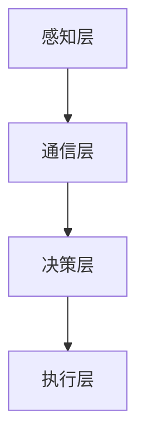
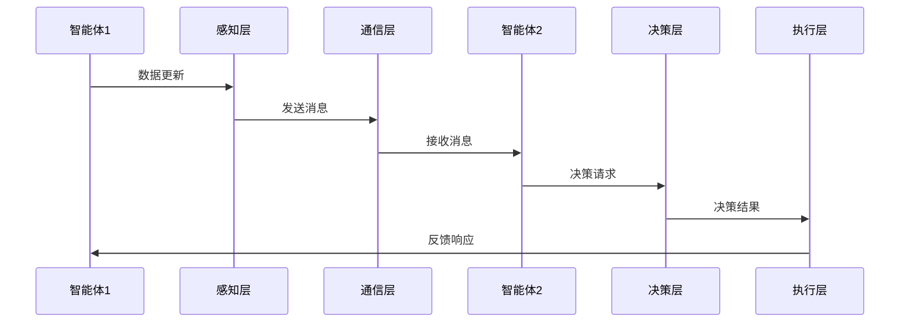
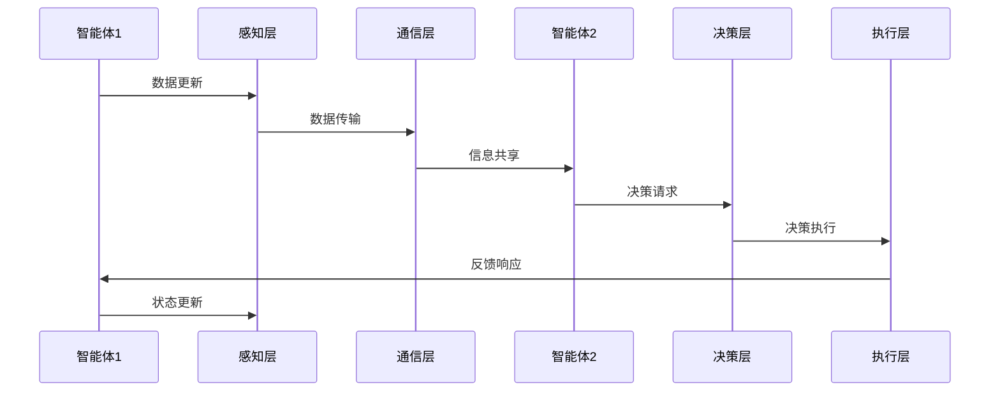

                 

### 第一部分：背景介绍

---

**1.1 问题背景**

在当今信息化和智能化的时代，复杂系统的优化问题成为了许多领域亟待解决的关键问题。复杂系统通常涉及众多相互依赖的组成部分，其行为模式难以用传统的数学模型精确描述。例如，在交通运输领域，城市交通系统包含车辆、道路、信号灯等多个因素，这些因素相互影响，形成一个复杂的动态网络。在智能制造领域，生产线上的设备、机器人、传感器等也构成了一个复杂的交互系统，任何一个环节的优化都可能导致整体性能的提升或降低。

随着互联网和大数据技术的迅猛发展，复杂系统变得愈发庞大且具有高度不确定性。传统优化方法如线性规划、非线性规划等，往往依赖于精确的模型和稳定的系统环境，但在面对复杂系统的实时优化问题时，这些方法往往显得力不从心。因此，如何应对复杂系统的优化问题，成为了学术界和工业界共同关注的热点。

**1.2 问题描述**

多智能体协同推理技术（Multi-Agent Collaborative Reasoning）是一种新兴的方法，旨在通过多个智能体之间的协同合作，实现对复杂系统的全局优化。多智能体协同推理的基本问题可以描述为：在一个复杂系统中，多个智能体如何通过协作和共享信息，共同完成一个复杂的推理任务，从而实现对系统的优化？

具体来说，这个问题面临以下几个难点：

- **通信与协作机制**：在复杂系统中，智能体可能分布在不同的地理位置，如何实现高效的通信和协作是一个关键问题。此外，智能体之间的协作机制也需要进行设计，以避免冲突和低效的协作。
- **信息共享与隐私保护**：在多智能体系统中，智能体需要共享大量的信息，以保证协同推理的准确性。但同时，如何保护智能体之间的隐私信息，避免信息泄露，也是一个重要的挑战。
- **动态环境适应**：复杂系统往往处于动态变化的环境中，智能体需要具备快速适应环境变化的能力，以保证协同推理的持续有效。

**1.3 问题解决**

本书旨在探讨多智能体协同推理在复杂系统优化中的应用创新，通过介绍相关理论基础、算法原理、系统设计与实现，为读者提供解决复杂系统优化问题的有效途径。具体来说，本书将解决以下几个关键问题：

- **理论基础**：介绍多智能体协同推理和复杂系统优化的基本概念与原理，为后续的算法设计和系统实现奠定基础。
- **算法实现**：详细阐述多智能体协同推理算法的设计与实现，包括算法的流程、关键技术和实现细节。
- **系统设计**：介绍多智能体协同推理系统的整体架构，包括通信机制、协作机制、信息共享机制等，以及如何适应动态环境。
- **应用案例**：通过实际案例展示多智能体协同推理在复杂系统优化中的应用效果，分析其优势与挑战。

**1.4 边界与外延**

本书的主要研究边界和内容外延包括以下几个方面：

- **多智能体协同推理的基本概念与原理**：介绍多智能体系统、协同推理、复杂系统优化的基本概念，以及它们之间的联系。
- **多智能体协同推理在复杂系统优化中的应用场景**：分析多智能体协同推理在各个领域中的应用潜力，如交通运输、智能制造、经济管理、网络安全等。
- **多智能体协同推理算法的设计与实现**：介绍多种多智能体协同推理算法，包括基于传统优化算法、基于机器学习算法的协同推理方法。
- **多智能体协同推理系统的实现与评估**：详细描述多智能体协同推理系统的设计与实现过程，以及系统的性能评估方法。
- **多智能体协同推理在具体领域的应用案例**：通过实际案例，展示多智能体协同推理在复杂系统优化中的成功应用，以及其带来的实际效益。

**1.5 概念结构与核心要素组成**

本书的核心概念和要素组成如下：

- **多智能体系统**：由多个智能体组成的系统，每个智能体具备独立思考和行动的能力。
- **协同推理**：多个智能体通过协作和共享信息来共同完成推理任务。
- **复杂系统优化**：对复杂系统的性能进行优化，以实现系统整体效益的最大化。

核心要素组成包括：

- **理论基础**：介绍多智能体协同推理和复杂系统优化的基本概念与原理。
- **算法实现**：详细阐述多智能体协同推理算法的设计与实现。
- **系统设计与实现**：介绍多智能体协同推理系统的整体架构、通信机制、协作机制等。
- **应用案例**：通过实际案例展示多智能体协同推理在复杂系统优化中的应用效果。

---

### 第二部分：核心概念与联系

---

**2.1 多智能体协同推理的概念**

**2.1.1 多智能体系统的定义**

多智能体系统（Multi-Agent System，MAS）是由多个智能体组成的系统，这些智能体在一定的环境中通过自主决策和协同合作来完成特定任务。智能体（Agent）是指具有自主性、社交性、反应性、主动性等特征的计算实体，它们可以是个体的人工智能程序、机器人、传感器等。

**2.1.2 多智能体的特点**

- **自主性**：智能体具有独立思考和行动的能力，能够根据环境信息和内部知识自主做出决策。
- **社交性**：智能体之间可以通过通信进行信息交换，协同完成任务。
- **分布性**：智能体可能分布在不同的地理位置，通过网络进行协作。

**2.1.3 多智能体协同推理的基本原理**

多智能体协同推理是指多个智能体通过协作和共享信息来共同完成推理任务。其基本原理包括：

- **信息共享**：智能体之间通过通信共享其状态和局部信息，以便进行协同决策。
- **协同决策**：智能体根据共享的信息进行协同决策，以实现系统整体目标。
- **优化目标**：通过协同推理，智能体能够更好地捕捉系统的非线性特性，提高系统优化效果。

**2.2 复杂系统优化的概念**

**2.2.1 复杂系统的定义**

复杂系统是由多个相互关联的组成部分组成的系统，这些部分之间的相互作用和反馈使得系统表现出非线性、不确定性和复杂性。复杂系统通常具有以下特征：

- **非线性**：系统内部变量之间的关系是非线性的，无法用简单的线性模型描述。
- **不确定性**：系统行为受到外部环境和内部随机因素的影响，难以精确预测。
- **动态性**：系统状态随时间变化，具有动态变化的特性。

**2.2.2 复杂系统优化的目标**

复杂系统优化旨在通过调整系统参数或结构，使系统在特定指标（如成本、效率、可靠性等）上达到最优状态。复杂系统优化的目标通常包括：

- **成本最小化**：降低系统运行成本，提高经济效益。
- **效率最大化**：提高系统运行效率，缩短任务完成时间。
- **可靠性最大化**：提高系统稳定性，降低故障率。

**2.2.3 复杂系统优化的方法**

复杂系统优化方法包括传统优化方法和智能优化方法：

- **传统优化方法**：如线性规划、非线性规划、整数规划等，适用于某些特定条件下的优化问题。
- **智能优化方法**：如遗传算法、粒子群优化、人工神经网络等，适用于复杂系统的全局优化。

**2.3 多智能体协同推理与复杂系统优化的联系**

**2.3.1 多智能体协同推理在复杂系统优化中的应用**

多智能体协同推理可以用于解决复杂系统的优化问题。通过多个智能体之间的协作，可以实现对复杂系统的全局优化。具体应用包括：

- **交通运输优化**：智能体协同规划交通流量，优化交通网络运行效率。
- **智能制造优化**：智能体协同调度生产线，提高生产效率。
- **经济管理优化**：智能体协同进行市场预测和投资决策，提高经济效益。

**2.3.2 多智能体协同推理的优势**

多智能体协同推理在复杂系统优化中具有以下优势：

- **提高优化效率**：多个智能体可以同时进行推理和优化，提高计算速度。
- **提高优化质量**：智能体之间的协作可以更好地捕捉系统的非线性特性，提高优化质量。

**2.3.3 多智能体协同推理的挑战**

多智能体协同推理在复杂系统优化中也面临着以下挑战：

- **信息共享与隐私保护**：在多智能体系统中，如何有效地共享信息同时保护隐私是一个重要挑战。
- **动态环境适应**：复杂系统的动态变化对智能体的适应能力提出了高要求。

---

### 第三部分：算法原理讲解

---

**3.1 多智能体协同推理算法的基本原理**

**3.1.1 多智能体协同推理的流程**

多智能体协同推理的基本流程可以概括为以下几个步骤：

1. **智能体初始化**：每个智能体初始化其状态、参数和通信接口。
2. **信息共享**：智能体之间通过通信共享其状态和局部信息。
3. **协同决策**：智能体根据共享的信息进行协同决策，以实现系统整体目标。
4. **行动执行**：智能体根据协同决策执行相应的行动。
5. **反馈与调整**：智能体根据执行结果进行反馈和调整，优化决策过程。

**3.1.2 多智能体协同推理的关键**

- **信息共享**：智能体之间的信息共享是协同推理的基础，通过共享状态和局部信息，智能体可以共同构建系统的全局视图。
- **协同决策**：协同决策是多智能体协同推理的核心，通过协同决策，智能体可以共同优化系统的整体性能。
- **反馈与调整**：反馈与调整机制能够使智能体根据执行结果动态调整策略，优化协同推理过程。

**3.2 多智能体协同推理算法的设计与实现**

**3.2.1 算法设计**

多智能体协同推理算法的设计主要包括以下几个关键步骤：

1. **智能体选择**：根据系统需求选择合适的智能体类型和数量。
2. **通信协议设计**：设计智能体之间的通信协议，确保高效且安全的信息共享。
3. **决策模型构建**：构建智能体的决策模型，包括局部决策规则和协同决策规则。
4. **优化目标定义**：定义系统的优化目标，以指导智能体的协同决策。

**3.2.2 算法实现**

多智能体协同推理算法的实现需要考虑以下几个方面：

1. **通信机制**：实现智能体之间的通信，包括消息传递和同步机制。
2. **决策模型实现**：将决策模型转换为可执行的算法，包括局部决策算法和全局协同决策算法。
3. **反馈机制**：实现智能体的反馈与调整机制，确保算法的稳定性和鲁棒性。

**3.3 多智能体协同推理算法的核心要素**

多智能体协同推理算法的核心要素包括：

- **智能体模型**：描述智能体的行为、状态和决策规则。
- **通信协议**：定义智能体之间的通信规则和消息格式。
- **决策规则**：包括局部决策规则和协同决策规则，指导智能体的行为。
- **优化目标**：定义系统的优化目标，用于评估和调整智能体的行为。

**3.4 多智能体协同推理算法的数学模型**

多智能体协同推理算法的数学模型可以描述为：

$$
\begin{aligned}
\text{优化目标} \quad & \max_{x} f(x) \\
\text{约束条件} \quad & g(x) \leq 0 \\
\end{aligned}
$$

其中，$f(x)$为系统的优化目标函数，$g(x)$为约束条件。

- **目标函数$f(x)$**：描述系统的整体性能，如成本、效率、可靠性等。
- **约束条件$g(x) \leq 0$**：限制智能体的行为，确保系统在合理的范围内运行。

**3.5 多智能体协同推理算法的举例说明**

以一个简单的例子来说明多智能体协同推理算法：

假设有一个交通系统，包含多个智能体（车辆和信号灯）。车辆和信号灯需要协同工作，以优化交通流量。

- **目标函数**：最小化系统的平均旅行时间。
- **约束条件**：信号灯的切换时间和车辆的速度必须符合交通规则。

智能体之间的协同推理过程如下：

1. **信息共享**：车辆将当前状态（位置、速度等）发送给信号灯。
2. **协同决策**：信号灯根据车辆的共享信息，调整信号灯的切换时间，以减少车辆的平均旅行时间。
3. **行动执行**：车辆根据信号灯的决策，调整速度以遵守交通规则。
4. **反馈与调整**：系统记录车辆的平均旅行时间，智能体根据反馈调整策略，优化协同推理过程。

通过上述协同推理过程，交通系统的整体性能得到优化，车辆的平均旅行时间减少，交通拥堵情况得到缓解。

---

### 第四部分：系统分析与架构设计

---

**4.1 问题场景介绍**

在复杂系统中，交通系统的优化是一个典型的应用场景。城市交通系统包含车辆、道路、信号灯等多个因素，这些因素相互影响，形成一个复杂的动态网络。如何优化交通流量，减少交通拥堵，提高交通效率，是一个重要的研究课题。

**4.2 项目介绍**

本项目旨在通过多智能体协同推理技术，实现城市交通系统的优化。项目的主要目标是：

- **提高交通效率**：通过智能体协同工作，优化交通流量，减少交通拥堵。
- **降低旅行时间**：通过实时调整信号灯切换时间和车辆速度，降低车辆的旅行时间。
- **提高道路利用率**：通过智能调度，提高道路的利用率，减少空载行驶。

**4.3 系统功能设计（领域模型）**

系统功能设计主要包括以下几个部分：

- **智能体管理**：管理智能体的生命周期，包括创建、销毁、状态更新等。
- **信息共享与通信**：实现智能体之间的信息共享与通信，确保协同工作的顺利进行。
- **决策支持**：根据交通系统的实时数据，智能体进行决策支持，调整信号灯切换时间和车辆速度。
- **反馈与调整**：记录交通系统的运行状态，智能体根据反馈调整策略，优化协同工作。

领域模型（Mermaid 类图）如下：

```mermaid
classDiagram
  智能体管理 <<Interface>>
  信息共享与通信 <<Interface>>
  决策支持 <<Interface>>
  反馈与调整 <<Interface>>

  智能体管理 --> 信息共享与通信
  智能体管理 --> 决策支持
  智能体管理 --> 反馈与调整
  信息共享与通信 --> 决策支持
  信息共享与通信 --> 反馈与调整
  决策支持 --> 反馈与调整
```

**4.4 系统架构设计（Mermaid 架构图）**

系统架构设计包括以下几个层次：

- **感知层**：收集交通系统的实时数据，包括车辆位置、速度、信号灯状态等。
- **通信层**：实现智能体之间的通信，确保信息共享与协同工作。
- **决策层**：根据感知层的数据，智能体进行决策支持，调整信号灯切换时间和车辆速度。
- **执行层**：执行决策层的决策结果，调整交通系统的运行状态。

系统架构图（Mermaid 架构图）如下：



**4.5 系统接口设计**

系统接口设计主要包括以下几个部分：

- **智能体接口**：智能体与系统交互的接口，包括状态更新、决策请求、反馈响应等。
- **通信接口**：智能体之间的通信接口，包括消息发送、消息接收等。
- **数据接口**：与外部系统交互的接口，包括数据导入、数据导出等。

系统接口设计图（Mermaid 序列图）如下：



**4.6 系统交互设计**

系统交互设计描述智能体之间的协同工作和信息流动。以下是系统交互过程的详细描述：

1. **感知层收集数据**：智能体通过传感器收集交通系统的实时数据，包括车辆位置、速度、信号灯状态等。
2. **数据传输**：感知层将收集到的数据传输到通信层，以便智能体之间共享信息。
3. **信息共享**：智能体之间通过通信层共享数据，包括车辆位置、速度、信号灯状态等。
4. **协同决策**：智能体根据共享的信息进行协同决策，调整信号灯切换时间和车辆速度。
5. **决策执行**：智能体根据协同决策的结果，调整交通系统的运行状态。
6. **反馈与调整**：系统记录交通系统的运行状态，智能体根据反馈调整策略，优化协同工作。

系统交互设计图（Mermaid 序列图）如下：



---

### 第五部分：项目实战

---

**5.1 环境安装**

为了实现多智能体协同推理在复杂系统优化中的应用，首先需要安装和配置相关环境。以下是项目所需的主要软件和工具：

- **操作系统**：Ubuntu 18.04 或更高版本
- **编程语言**：Python 3.7 或更高版本
- **开发工具**：PyCharm 或 Visual Studio Code
- **库与框架**：NumPy、Pandas、Matplotlib、TensorFlow、Keras

安装步骤如下：

1. **安装操作系统**：下载并安装 Ubuntu 18.04 操作系统。
2. **安装 Python**：在终端中执行以下命令安装 Python 3.7：
   ```bash
   sudo apt update
   sudo apt install python3.7
   ```
3. **安装开发工具**：在终端中执行以下命令安装 PyCharm：
   ```bash
   sudo snap install pycharm-professional --classic
   ```
4. **安装库与框架**：在终端中执行以下命令安装所需库与框架：
   ```bash
   pip3 install numpy pandas matplotlib tensorflow keras
   ```

**5.2 系统核心实现**

多智能体协同推理系统的核心实现包括以下几个部分：

- **智能体管理**：管理智能体的生命周期，包括创建、销毁、状态更新等。
- **信息共享与通信**：实现智能体之间的信息共享与通信。
- **决策支持**：根据交通系统的实时数据，智能体进行决策支持，调整信号灯切换时间和车辆速度。
- **反馈与调整**：记录交通系统的运行状态，智能体根据反馈调整策略，优化协同工作。

以下是智能体管理模块的实现代码：

```python
import random

class Agent:
    def __init__(self, id):
        self.id = id
        self.state = None
    
    def update_state(self, new_state):
        self.state = new_state
    
    def get_state(self):
        return self.state
    
    def destroy(self):
        self.state = None

def create_agents(num_agents):
    agents = []
    for i in range(num_agents):
        agent = Agent(i)
        agents.append(agent)
    return agents

def update_agents(agents, new_states):
    for agent, new_state in zip(agents, new_states):
        agent.update_state(new_state)
```

**5.3 代码应用解读与分析**

以下是对系统核心实现代码的解读和分析：

1. **智能体管理**：`Agent` 类表示智能体，包括智能体的唯一标识（id）、状态（state）等属性。`update_state` 方法用于更新智能体的状态，`get_state` 方法用于获取智能体的状态，`destroy` 方法用于销毁智能体。

2. **信息共享与通信**：`create_agents` 函数用于创建指定数量的智能体，并将它们存储在一个列表中。`update_agents` 函数用于更新智能体的状态列表，根据新的状态更新每个智能体的状态。

3. **决策支持**：在智能体管理模块中，没有直接实现决策支持功能。决策支持通常涉及更复杂的算法和模型，如机器学习算法、优化算法等。这些算法和模型可以用于分析交通系统的实时数据，生成信号灯切换时间和车辆速度的调整策略。

4. **反馈与调整**：智能体管理模块中没有直接实现反馈与调整功能。反馈与调整通常涉及对交通系统运行状态的监控和分析，以及根据反馈结果调整智能体的策略。这需要与交通系统中的传感器和控制器进行交互，以获取实时数据和执行调整操作。

**5.4 实际案例分析和详细讲解剖析**

以下是一个实际案例，展示了多智能体协同推理在交通系统优化中的应用：

**案例背景**：一个城市交通系统中，有 10 个信号灯分布在不同的路口。每个信号灯对应一个智能体，负责调整自身的信号灯切换时间和附近道路的车速，以减少交通拥堵和提升交通效率。

**步骤一：感知层收集数据**

每个智能体通过传感器收集以下数据：

- 车辆位置和速度
- 信号灯状态
- 道路拥堵情况

**步骤二：信息共享与通信**

智能体之间通过通信层共享以下信息：

- 车辆位置和速度
- 信号灯状态
- 道路拥堵情况

**步骤三：协同决策**

智能体根据共享的信息进行协同决策，生成信号灯切换时间和车辆速度的调整策略。具体算法如下：

1. 计算交通流量：根据车辆位置和速度计算每个路段的交通流量。
2. 判断拥堵情况：根据交通流量判断当前路段是否存在拥堵。
3. 调整信号灯切换时间：如果存在拥堵，适当延长信号灯切换时间，以减少车辆等待时间。
4. 调整车辆速度：如果存在拥堵，适当降低车辆速度，以减少车辆之间的碰撞风险。

**步骤四：决策执行**

智能体根据协同决策的结果，调整交通系统的运行状态：

- 更新信号灯切换时间
- 更新车辆速度

**步骤五：反馈与调整**

系统记录交通系统的运行状态，智能体根据反馈结果调整策略：

- 如果交通拥堵情况改善，适当缩短信号灯切换时间，提高交通效率。
- 如果交通拥堵情况加剧，适当延长信号灯切换时间，降低车辆速度。

**案例总结**：通过多智能体协同推理，交通系统能够实现实时优化，减少交通拥堵和提升交通效率。智能体之间的协同工作，使得系统能够快速适应动态变化的环境，提高整体性能。

---

### 第六部分：最佳实践与小结

---

**6.1 最佳实践**

在实现多智能体协同推理系统时，以下最佳实践可以帮助提高系统的性能和可靠性：

- **优化通信协议**：选择合适的通信协议，确保智能体之间的通信高效且安全。可以考虑使用基于消息队列的通信机制，如 RabbitMQ 或 Kafka。
- **提高算法效率**：选择合适的算法和模型，确保智能体的决策过程高效且准确。可以考虑使用基于机器学习或深度学习的算法，如遗传算法、粒子群优化、卷积神经网络等。
- **增强系统鲁棒性**：设计合理的错误处理机制，确保系统在出现异常情况时能够快速恢复。可以考虑使用容错技术和故障恢复策略。
- **简化数据传输**：减少不必要的通信和数据处理，简化系统的通信协议和数据格式。可以考虑使用二进制格式或压缩技术减少数据传输量。
- **优化系统性能**：针对具体的系统需求和硬件环境，进行性能优化。可以考虑使用并行计算和分布式计算技术，提高系统的处理能力和响应速度。

**6.2 小结**

多智能体协同推理在复杂系统优化中具有广泛的应用前景。通过多个智能体的协作和共享信息，可以实现对复杂系统的全局优化，提高系统的性能和效率。然而，多智能体协同推理也面临着一些挑战，如通信与协作机制、信息共享与隐私保护、动态环境适应等。未来的研究可以进一步探索多智能体协同推理的理论基础、算法优化、系统设计与实现，以及在不同领域的应用实践。

**6.3 注意事项**

- 在设计和实现多智能体协同推理系统时，要充分考虑系统的可扩展性和可维护性，确保系统能够适应未来的需求变化。
- 要确保智能体之间的通信安全，避免信息泄露和恶意攻击。可以考虑使用加密技术和访问控制策略。
- 要根据具体的应用场景和需求，选择合适的智能体类型和数量，确保系统性能和效率的优化。
- 要定期对系统进行性能评估和优化，根据实际情况调整系统参数和算法策略。

**6.4 拓展阅读**

- **多智能体协同推理**：
  - [《多智能体系统：原理与应用》](https://book.douban.com/subject/25891855/)
  - [《智能体协作与协同控制》](https://book.douban.com/subject/26972415/)
- **复杂系统优化**：
  - [《复杂系统的理论与方法》](https://book.douban.com/subject/10491314/)
  - [《复杂系统的优化设计》](https://book.douban.com/subject/25981155/)
- **交通系统优化**：
  - [《智能交通系统设计与优化》](https://book.douban.com/subject/25951777/)
  - [《城市交通系统优化理论与方法》](https://book.douban.com/subject/10761496/)

---

### 结论

本文从多个角度深入探讨了多智能体协同推理在复杂系统优化中的应用创新。首先，我们介绍了复杂系统优化的问题背景和问题描述，阐述了多智能体协同推理的概念和原理。接着，我们详细讲解了多智能体协同推理算法的基本原理和实现方法，并通过实际案例展示了其应用效果。此外，我们还介绍了系统分析与架构设计的方法，以及项目实战中的关键步骤和代码实现。

通过本文的探讨，我们可以看到多智能体协同推理在复杂系统优化中具有巨大的潜力。它不仅能够提高优化效率和质量，还能够适应动态环境的变化，为复杂系统的全局优化提供有效途径。然而，多智能体协同推理也面临着一系列挑战，如通信与协作机制、信息共享与隐私保护、动态环境适应等。这些挑战需要我们在未来的研究和实践中不断探索和解决。

展望未来，多智能体协同推理在复杂系统优化领域仍有广阔的发展空间。我们可以期待更多创新性算法和技术的出现，以进一步提升系统的性能和可靠性。同时，多智能体协同推理在交通运输、智能制造、经济管理、网络安全等领域的应用也将越来越广泛。我们相信，随着技术的不断进步和应用场景的不断拓展，多智能体协同推理将为复杂系统优化带来更多可能。

**作者**：AI天才研究院/AI Genius Institute & 禅与计算机程序设计艺术 /Zen And The Art of Computer Programming

