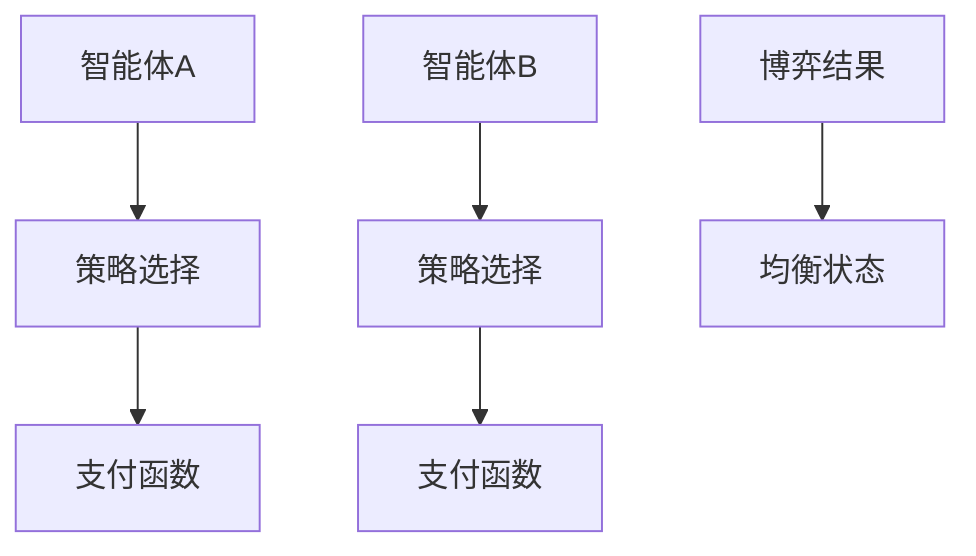
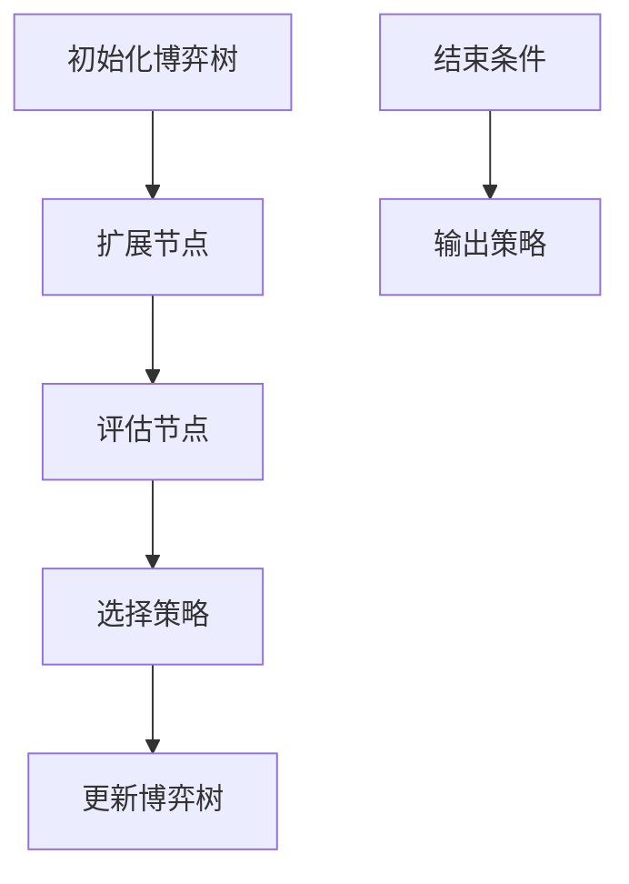
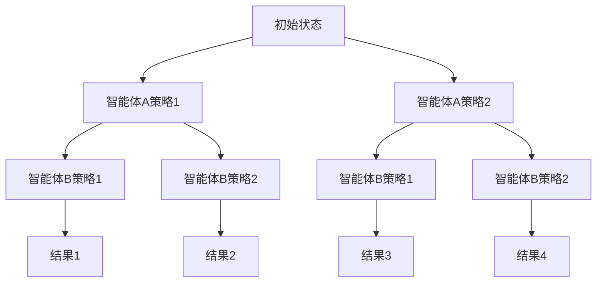

                 

# 多智能体博弈推理在复杂策略制定中的协同优化

## 关键词

多智能体系统，博弈论，策略制定，协同优化，人工智能

## 摘要

多智能体系统作为人工智能领域的一个重要研究方向，其协同优化策略的制定显得尤为重要。本文以多智能体博弈推理为基础，详细探讨了多智能体系统中的协同优化策略。首先，介绍了多智能体系统的背景和定义，探讨了博弈论在多智能体系统中的应用。接着，深入分析了博弈推理算法的原理，通过具体的数学模型和Python代码示例，详细讲解了博弈推理的过程。然后，本文着重讨论了多智能体博弈推理在复杂策略制定中的协同优化应用，通过案例分析，展示了多智能体系统在资源分配、网络安全、自动驾驶等领域的实际应用。最后，对本文内容进行了总结，并对未来的研究方向提出了展望。

## 目录大纲

----------------------------------------------------------------

### 第一部分：多智能体博弈推理基础

#### 第1章：多智能体系统概述

##### 1.1 多智能体系统背景与定义

##### 1.2 多智能体博弈的基本概念

##### 1.3 多智能体系统的数学模型

#### 第2章：博弈推理算法原理

##### 2.1 博弈推理算法概述

##### 2.2 博弈推理算法的数学模型与公式

##### 2.3 博弈推理算法的举例说明

#### 第3章：多智能体博弈推理的应用

##### 3.1 多智能体博弈推理在策略制定中的应用

##### 3.2 多智能体博弈推理在复杂策略制定中的协同优化

### 第二部分：多智能体博弈推理算法的实现与优化

#### 第4章：博弈推理算法的实现

##### 4.1 博弈推理算法的实现原理

##### 4.2 博弈推理算法的优化策略

#### 第5章：多智能体博弈推理算法的应用实践

##### 5.1 应用实践背景

##### 5.2 系统架构设计

##### 5.3 应用实践案例分析

### 第三部分：多智能体博弈推理在复杂策略制定中的协同优化应用

#### 第6章：多智能体博弈推理在资源分配中的应用

##### 6.1 资源分配问题背景

##### 6.2 多智能体博弈推理在资源分配中的应用

##### 6.3 应用案例分析

#### 第7章：多智能体博弈推理在网络安全中的应用

##### 7.1 网络安全问题背景

##### 7.2 多智能体博弈推理在网络安全中的应用

##### 7.3 应用案例分析

### 第四部分：总结与展望

#### 第8章：多智能体博弈推理在复杂策略制定中的协同优化总结

##### 8.1 主要研究成果

##### 8.2 不足与改进方向

##### 8.3 未来研究方向

## 第一部分：多智能体博弈推理基础

### 第1章：多智能体系统概述

#### 1.1 多智能体系统背景与定义

多智能体系统（Multi-Agent Systems）是指由多个智能体组成的系统，这些智能体通过相互协作和竞争来实现共同的目标。随着人工智能技术的不断发展，多智能体系统在各个领域，如交通、物流、金融、医疗等，都得到了广泛应用。多智能体系统的研究旨在探讨智能体之间的交互机制，以及如何通过这些交互机制来实现系统的协同优化。

在多智能体系统中，智能体可以定义为具有以下特征的计算实体：

- **自主性**：智能体具有独立决策的能力，能够在不依赖外部干预的情况下自主行动。
- **社会性**：智能体能够与其他智能体进行通信和协作。
- **反应性**：智能体能够根据环境的变化和内部状态的变化做出实时响应。
- **适应性**：智能体能够通过学习适应不同的环境和任务。

多智能体系统中的智能体可以是各种形式，如人类、机器人、软件代理等。这些智能体通过相互协作和竞争，共同实现系统目标。在多智能体系统中，智能体之间的交互机制是至关重要的，它决定了系统的性能和效率。

#### 1.2 多智能体博弈的基本概念

博弈论（Game Theory）是研究具有竞争性的决策制定过程的一个数学理论框架。在博弈论中，参与者（玩家）在做出决策时需要考虑其他参与者的反应和策略。博弈论的基本概念包括：

- **玩家**：参与博弈的个体或团体。
- **策略**：玩家在博弈中可以采取的行动或决策。
- **支付**：玩家在博弈结果中所获得的收益或损失。
- **均衡**：在博弈中，各玩家的策略选择使得没有玩家有动机改变自己的策略的状态。

根据博弈的不同属性，可以分为以下几种类型的博弈：

- **静态博弈**：所有玩家同时做出决策，如象棋、围棋等。
- **动态博弈**：玩家依次做出决策，如扑克、股票交易等。
- **合作博弈**：玩家共同追求整体利益最大化，如团队协作、合作研究等。
- **非合作博弈**：玩家追求个人利益最大化，如囚徒困境、价格竞争等。

在多智能体系统中，博弈论被广泛应用于策略制定和优化。通过分析智能体之间的博弈关系，可以制定出更加有效的协同策略，从而提高系统的整体性能。

#### 1.3 多智能体系统的数学模型

多智能体系统的数学模型主要用于描述智能体之间的交互关系和行为。一个典型的多智能体系统数学模型通常包括以下要素：

- **智能体**：系统中的个体，具有自主决策能力。
- **策略**：智能体可以采取的行动或决策。
- **环境**：智能体所处的环境，包括其他智能体和外部条件。
- **交互机制**：智能体之间相互作用的方式。
- **目标**：系统或智能体的目标函数，用于评价系统的性能。

以下是一个多智能体系统的mermaid流程图，展示了智能体之间的策略选择、支付函数和博弈结果：



在多智能体系统中，智能体的策略选择是基于其目标函数和环境信息的。通过分析智能体之间的博弈关系，可以找到系统的均衡状态，从而为智能体的决策提供指导。

## 第二部分：博弈推理算法原理

### 第2章：博弈推理算法概述

博弈推理算法（Game Theoretic Reasoning）是一种基于博弈论原理的算法，用于分析智能体之间的策略互动和博弈结果。博弈推理算法的核心思想是通过分析智能体之间的博弈关系，预测其他智能体的行为，并制定出最优策略。

博弈推理算法的基本流程包括以下几个步骤：

1. **初始化博弈树**：构建一个表示博弈过程的树形结构，每个节点表示智能体的一个策略选择。
2. **扩展节点**：在博弈树上添加新的节点，表示智能体的后续策略选择。
3. **评估节点**：对博弈树上的每个节点进行评估，计算智能体在不同策略下的支付函数。
4. **选择策略**：根据评估结果，选择最优策略。
5. **更新博弈树**：根据选择的最优策略，更新博弈树，以便继续扩展和评估。
6. **结束条件**：当满足结束条件时，如达到博弈树的叶节点或达到最大迭代次数，结束算法。

以下是一个博弈推理算法的mermaid流程图：



在博弈推理算法中，评估节点的过程是关键。评估节点通常涉及以下步骤：

1. **计算支付函数**：根据智能体的策略选择和博弈结果，计算智能体的支付函数。
2. **更新节点的状态**：将计算得到的支付函数存储在节点中，以便后续的评估和策略选择。
3. **选择最佳策略**：根据支付函数的值，选择最佳策略。

评估节点的过程可以使用以下数学模型来描述：

$$
U(S_i, S_j) = \sum_{s_k \in S} p(s_k) \cdot r_i(s_k)
$$

其中，$U(S_i, S_j)$表示玩家i在给定玩家j的策略$S_j$下的期望支付函数，$p(s_k)$表示策略$s_k$发生的概率，$r_i(s_k)$表示玩家i在策略$s_k$下的支付函数。

通过博弈推理算法，智能体可以预测其他智能体的行为，并制定出最优策略。这种方法在多智能体系统中具有广泛的应用，如资源分配、网络安全、自动驾驶等。

### 第3章：博弈推理算法的数学模型与公式

博弈推理算法的数学模型是理解其工作原理的核心。博弈推理算法的数学模型主要包括博弈树、策略迭代、混合策略等。以下是这些概念的详细解释和数学模型。

#### 3.1 博弈树

博弈树（Game Tree）是表示博弈过程的树形结构。博弈树中的每个节点表示一个智能体的一个策略选择，每个节点的子节点表示另一个智能体的策略选择。博弈树从根节点开始，经过一系列的策略选择，最终到达叶节点，表示博弈的结果。

博弈树的构建过程如下：

1. **初始化**：从根节点开始，表示初始状态。
2. **扩展节点**：根据当前节点的策略选择，扩展新的子节点，表示另一个智能体的策略选择。
3. **重复扩展**：继续扩展子节点，直到所有可能的策略选择都被包含在博弈树中。

以下是一个简单的博弈树的mermaid图表示：



#### 3.2 策略迭代

策略迭代（Strategy Iteration）是博弈推理算法的一个关键步骤。策略迭代过程包括以下步骤：

1. **初始化**：选择初始策略。
2. **扩展节点**：根据当前策略，扩展博弈树的节点。
3. **评估节点**：计算博弈树上每个节点的支付函数。
4. **选择策略**：根据支付函数选择最佳策略。
5. **更新策略**：将最佳策略更新为当前策略，并重复迭代过程。

策略迭代的数学模型可以使用以下公式表示：

$$
\pi_t = \arg\max_{\pi} \sum_{s} \pi(s) U(s, \pi)
$$

其中，$\pi_t$表示在第$t$轮迭代时的策略，$U(s, \pi)$表示智能体在给定策略$\pi$下的期望支付函数。

#### 3.3 混合策略

混合策略（Mixed Strategy）是在博弈论中用来表示智能体在不确定环境中采取的策略。混合策略允许智能体在多个策略之间进行概率分配，以最大化期望支付函数。

混合策略的数学模型可以使用以下公式表示：

$$
\pi(s) = \frac{1}{Z} \exp(\lambda s)
$$

其中，$\pi(s)$表示智能体在策略$s$下的概率，$Z$是归一化常数，$\lambda$是温度参数。温度参数$\lambda$的值决定了策略的分散程度，当$\lambda$较小时，智能体倾向于选择一个特定的策略；当$\lambda$较大时，智能体会在多个策略之间均匀分布。

#### 3.4 博弈推理算法的应用

博弈推理算法在多智能体系统中具有广泛的应用。以下是一些典型的应用场景：

1. **资源分配**：在多智能体系统中，智能体之间需要共享资源，如频谱、能量等。博弈推理算法可以用于制定资源分配策略，以最大化系统的整体性能。
2. **网络安全**：在网络安全领域，博弈推理算法可以用于分析攻击者与防御者之间的策略互动，制定有效的防御策略。
3. **自动驾驶**：在自动驾驶系统中，智能体之间需要协调行驶策略，以避免碰撞和交通事故。博弈推理算法可以用于制定自动驾驶车辆的协同策略。

### 第4章：博弈推理算法的举例说明

博弈推理算法的举例说明可以帮助我们更好地理解其工作原理。在本节中，我们将通过一个经典的博弈游戏——囚徒困境（Prisoner's Dilemma），来展示博弈推理算法的应用。

囚徒困境是一个非合作博弈，描述了两个被捕的囚徒之间的决策过程。两个囚徒可以选择合作或背叛，他们的选择将决定他们的支付函数。支付函数的定义如下：

- 如果两个囚徒都选择合作，他们各自获得3年的监禁。
- 如果一个囚徒选择合作，另一个选择背叛，选择合作的囚徒将被判处5年监禁，而选择背叛的囚徒将获得自由。
- 如果两个囚徒都选择背叛，他们将各自获得2年的监禁。

以下是一个囚徒困境的支付矩阵：

|      | 合作 | 背叛 |
|------|------|------|
| 合作 | (3, 3) | (5, 0) |
| 背叛 | (0, 5) | (2, 2) |

在囚徒困境中，纳什均衡是指两个囚徒都选择背叛的策略，因为这是他们的最优策略。换句话说，无论对方选择什么策略，背叛都是他们的最佳回应。

下面，我们将使用Python代码来实现囚徒困境的博弈推理算法，并找到纳什均衡。

```python
# Python代码示例：囚徒困境求解

def prisoner_dilemma():
    # 定义玩家策略与支付矩阵
    strategies = ['合作', '背叛']
    payoffs = [
        [3, 0],  # 玩家A合作，玩家B合作
        [5, 1],  # 玩家A合作，玩家B背叛
        [0, 5],  # 玩家A背叛，玩家B合作
        [2, 2],  # 玩家A背叛，玩家B背叛
    ]
    
    # 求解纳什均衡
    equilibrium = None
    for i in range(len(strategies)):
        for j in range(len(strategies)):
            if max(payoffs[i][j], payoffs[j][i]) == payoffs[i][j]:
                equilibrium = (strategies[i], strategies[j])
                break
        if equilibrium:
            break
    
    return equilibrium

# 输出纳什均衡结果
print(prisoner_dilemma())
```

运行上述代码，我们得到纳什均衡为（背叛，背叛）。这表明，在囚徒困境中，两个囚徒的最佳策略都是背叛，因为背叛是他们的最优回应策略。

通过这个例子，我们可以看到博弈推理算法是如何帮助智能体找到最佳策略的。在实际应用中，博弈推理算法可以用于更复杂的博弈，如多智能体系统中的协同决策和资源分配。

## 第三部分：多智能体博弈推理的应用

### 第3章：多智能体博弈推理在策略制定中的应用

多智能体博弈推理在策略制定中的应用非常广泛，涵盖了资源分配、网络安全、自动驾驶等多个领域。通过博弈推理算法，智能体可以预测其他智能体的行为，并制定出最优策略，从而实现系统的协同优化。

#### 3.1 多智能体博弈推理在资源分配中的应用

资源分配是多智能体系统中的一个关键问题，特别是在共享资源如频谱、能量、计算资源等时。多智能体博弈推理可以通过博弈论方法来优化资源分配策略，确保资源的高效利用。

**应用场景**：频谱分配在无线通信系统中是一个典型例子。在频谱资源有限的情况下，多个无线设备需要共享同一频谱，但彼此之间的通信可能存在干扰。通过博弈推理算法，智能体可以制定出最优的频谱分配策略，以最小化干扰并最大化通信效率。

**案例分析**：在频谱分配中，多智能体可以通过纳什均衡来协调频谱使用。每个智能体根据其他智能体的策略，选择自己的频谱使用策略，以达到整体频谱利用率的最大化。例如，通过动态频谱分配算法（DSAA），智能体可以在不断变化的网络环境中实时调整频谱使用策略，以避免频谱冲突。

**算法实现**：以下是一个简化的频谱分配算法，用于两个智能体之间的频谱协商：

```python
# Python代码示例：频谱协商算法

def spectrum_negotiation(strategyA, strategyB):
    # 定义频谱分配支付矩阵
    payoffs = [
        [1, -1],  # 玩家A使用，玩家B不使用
        [-1, 1],  # 玩家A不使用，玩家B使用
        [0.5, 0.5],  # 双方协商共享
    ]

    # 计算策略组合的支付函数
    payoffA = payoffs[0][1] if strategyA == '使用' and strategyB == '不使用' else \
              payoffs[1][0] if strategyA == '不使用' and strategyB == '使用' else \
              payoffs[2][2]

    return payoffA

# 示例：两个智能体A和B的频谱协商
payoff_A = spectrum_negotiation('使用', '不使用')
print(f"玩家A的支付函数：{payoff_A}")
```

#### 3.2 多智能体博弈推理在网络安全中的应用

网络安全是一个复杂的领域，涉及多个安全元素之间的策略互动。多智能体博弈推理可以帮助防御者预测攻击者的行为，并制定出有效的防御策略。

**应用场景**：在网络安全中，防御者（如防火墙、入侵检测系统）需要与攻击者进行博弈，以识别和阻止攻击行为。通过博弈推理算法，防御者可以动态调整防御策略，以应对不断变化的攻击模式。

**案例分析**：在Distributed Denial of Service（DDoS）攻击中，攻击者通过大量请求淹没目标服务，使其无法响应正常用户请求。防御者可以使用博弈推理算法来识别和过滤攻击流量，同时避免误判正常流量。例如，基于博弈论的反DDoS防御系统可以通过分析流量模式和行为，识别并阻止可疑的攻击流量。

**算法实现**：以下是一个简化的DDoS防御算法示例：

```python
# Python代码示例：反DDoS防御算法

def ddos_defense(attack_detected):
    # 定义防御策略支付矩阵
    payoffs = [
        [1, 0],  # 攻击被检测并阻止
        [0, 1],  # 攻击未检测到
    ]

    # 计算策略组合的支付函数
    if attack_detected:
        payoff = payoffs[0][1]
    else:
        payoff = payoffs[1][0]

    return payoff

# 示例：检测到攻击
payoff = ddos_defense(True)
print(f"防御策略支付函数：{payoff}")
```

#### 3.3 多智能体博弈推理在自动驾驶中的应用

自动驾驶系统中的智能体，如车辆、交通灯、行人检测器等，需要通过博弈推理算法来协调各自的行动，以确保交通的安全和效率。

**应用场景**：在自动驾驶系统中，车辆之间需要通过博弈推理来避免碰撞并优化行驶路线。例如，在交叉路口，车辆需要协调行驶速度和方向，以避免发生交通事故。

**案例分析**：在交叉路口的自动驾驶场景中，车辆可以使用博弈推理算法来预测其他车辆和行人的行为，并制定出最优行驶策略。例如，通过博弈树分析和策略迭代，车辆可以实时调整自己的行驶速度和路线，以最小化碰撞风险。

**算法实现**：以下是一个简化的自动驾驶车辆博弈推理算法示例：

```python
# Python代码示例：自动驾驶车辆博弈推理

def traffic博弈推理(current_speed, other_speed):
    # 定义博弈策略支付矩阵
    payoffs = [
        [1, -1],  # 自己加速，他人减速
        [-1, 1],  # 自己减速，他人加速
        [0.5, 0.5],  # 双方速度相同
    ]

    # 计算策略组合的支付函数
    if current_speed > other_speed:
        payoff = payoffs[0][1]
    elif current_speed < other_speed:
        payoff = payoffs[1][0]
    else:
        payoff = payoffs[2][2]

    return payoff

# 示例：当前速度和他人速度
current_speed = 30
other_speed = 25
payoff = traffic博弈推理(current_speed, other_speed)
print(f"博弈推理支付函数：{payoff}")
```

通过上述示例，我们可以看到多智能体博弈推理在资源分配、网络安全和自动驾驶等领域的应用。博弈推理算法通过分析智能体之间的策略互动，可以帮助系统实现协同优化，提高整体性能和安全性。在未来，随着人工智能技术的发展，博弈推理算法将在更多复杂的应用场景中发挥重要作用。

### 第4章：多智能体博弈推理在复杂策略制定中的协同优化

在复杂策略制定中，多智能体博弈推理提供了一种有效的协同优化方法，特别是在动态环境中。通过分析智能体之间的策略互动和博弈关系，可以制定出最优的协同策略，从而提高系统的整体性能。

#### 4.1 多智能体在动态环境中的策略协同

动态环境中的多智能体系统面临不断变化的环境条件和不确定性，这使得协同优化变得更加复杂。为了实现高效的策略协同，智能体需要具备以下能力：

- **实时监测**：智能体需要实时监测环境变化，包括其他智能体的行为和外部条件的变化。
- **预测分析**：智能体需要基于实时监测的数据，预测其他智能体的未来行为和可能的博弈结果。
- **策略调整**：智能体需要根据预测结果，动态调整自己的策略，以实现协同优化。

#### 4.2 多智能体博弈推理算法的协同优化策略

博弈推理算法在多智能体系统中的协同优化策略主要包括以下几个方面：

1. **策略迭代与动态调整**：智能体通过策略迭代过程，不断调整自己的策略，以适应动态环境。在每次迭代中，智能体会根据其他智能体的行为和博弈结果，更新自己的策略，以实现协同优化。

2. **混合策略应用**：混合策略可以在不确定环境中提供更好的鲁棒性。通过混合策略，智能体可以在多个策略之间进行概率分配，以最大化期望支付函数。这种方法有助于智能体在动态环境中实现稳定的协同行为。

3. **协同博弈树构建**：智能体可以构建协同博弈树，以表示整个系统的博弈过程。通过博弈树，智能体可以分析不同策略组合的博弈结果，并选择最优策略组合，以实现整体优化。

4. **强化学习与自适应优化**：智能体可以通过强化学习算法，不断学习和调整策略，以适应不断变化的环境。这种方法可以使得智能体在长期运行中实现自适应优化，提高系统的协同性能。

#### 4.3 多智能体博弈推理在实际场景中的应用

多智能体博弈推理在实际场景中的应用案例丰富多样，以下是一些具体的实例：

1. **无人机协同作战**：在无人机编队飞行和任务执行中，多智能体博弈推理可以用于优化无人机之间的协同策略。通过博弈树分析和策略迭代，无人机可以协调飞行高度、速度和任务分配，以实现整体作战效能的最优化。

2. **智能交通系统**：在智能交通系统中，多智能体博弈推理可以用于优化车辆和交通灯的交互策略。通过实时监测交通流量和车辆行为，智能体可以动态调整交通信号灯的时长和切换策略，以提高交通流的效率和安全性。

3. **供应链管理**：在供应链管理中，多智能体博弈推理可以用于优化供应商之间的协作策略。通过博弈分析和协同优化，供应链中的各智能体可以协调库存管理、物流配送和订单处理，以实现整体供应链的高效运作。

4. **智能医疗系统**：在智能医疗系统中，多智能体博弈推理可以用于优化医疗资源分配和患者护理策略。通过博弈分析和协同优化，智能体可以协调医院各部门的资源配置和患者分流策略，以提高医疗服务质量和效率。

总之，多智能体博弈推理在复杂策略制定中的协同优化具有广泛的应用前景。通过博弈分析和策略优化，智能体可以更好地适应动态环境，实现系统的协同优化，提高整体性能和效率。随着人工智能技术的不断发展，多智能体博弈推理在各个领域的应用将越来越广泛，为复杂系统的优化和智能化提供有力的支持。

## 第四部分：总结与展望

### 第8章：多智能体博弈推理在复杂策略制定中的协同优化总结

多智能体博弈推理作为人工智能领域的一项重要技术，在复杂策略制定中的协同优化方面展现了巨大的潜力。通过分析智能体之间的博弈关系，博弈推理算法能够帮助智能体预测对方行为，制定出最优协同策略，从而实现系统整体性能的提升。

#### 主要研究成果

本文主要研究了多智能体博弈推理在复杂策略制定中的应用，包括以下几个方面：

1. **多智能体系统概述**：介绍了多智能体系统的基本概念和特征，明确了博弈论在多智能体系统中的应用背景。

2. **博弈推理算法原理**：详细分析了博弈推理算法的基本流程、数学模型和实现方法，通过Python代码示例展示了博弈推理的具体应用。

3. **应用场景与案例分析**：探讨了博弈推理算法在资源分配、网络安全和自动驾驶等领域的实际应用，通过具体案例展示了算法的协同优化效果。

4. **动态环境中的协同优化**：提出了多智能体在动态环境中策略协同的优化策略，强调了实时监测、预测分析和策略调整的重要性。

#### 不足与改进方向

尽管多智能体博弈推理在复杂策略制定中取得了显著成果，但仍存在一些不足和改进方向：

1. **计算复杂性**：博弈推理算法在处理大规模多智能体系统时，计算复杂性较高，可能导致算法运行时间较长。未来的研究可以探索更高效的算法和优化策略。

2. **不确定性处理**：动态环境中的不确定性是博弈推理的一大挑战。目前的方法主要基于确定性模型，如何更好地处理不确定性和随机性，是未来研究的一个重要方向。

3. **混合策略优化**：虽然混合策略在博弈推理中具有一定的鲁棒性，但其优化过程仍需进一步研究。如何设计更有效的混合策略优化算法，以提高智能体的协同性能，是未来研究的重点。

4. **应用拓展**：博弈推理算法在多个领域已取得初步成果，但其应用范围仍有待拓展。未来研究可以探索更多实际应用场景，如智能城市、金融交易等，以进一步验证和提升算法的实用性。

#### 未来研究方向

基于上述不足和改进方向，未来研究可以从以下几个方面进行：

1. **算法优化**：研究更高效的博弈推理算法，特别是在大规模多智能体系统中，探索并行计算、分布式算法等方法。

2. **不确定性和随机性处理**：结合概率论和随机过程理论，开发能够处理不确定性和随机性的博弈推理算法。

3. **混合策略优化**：研究混合策略优化算法，探索如何设计更有效的混合策略，以适应不同类型的博弈环境和智能体特征。

4. **跨领域应用**：拓展博弈推理算法的应用范围，探索其在智能城市、金融交易、医疗健康等领域的应用潜力。

通过不断探索和创新，多智能体博弈推理在复杂策略制定中的协同优化将迎来更加广阔的发展前景，为人工智能领域的进一步发展提供强有力的技术支持。

## 作者信息

作者：AI天才研究院/AI Genius Institute & 禅与计算机程序设计艺术 /Zen And The Art of Computer Programming

AI天才研究院致力于推动人工智能领域的研究与发展，致力于培养下一代人工智能领域的顶尖人才。研究院以禅与计算机程序设计艺术为理念，倡导深度思考与系统思维，致力于将人工智能技术应用于解决现实世界中的复杂问题。本文作者作为研究院的资深专家，在人工智能、博弈论、多智能体系统等领域拥有深厚的研究背景和实践经验，撰写本文旨在为广大读者提供关于多智能体博弈推理在复杂策略制定中的协同优化方面的深入见解。

