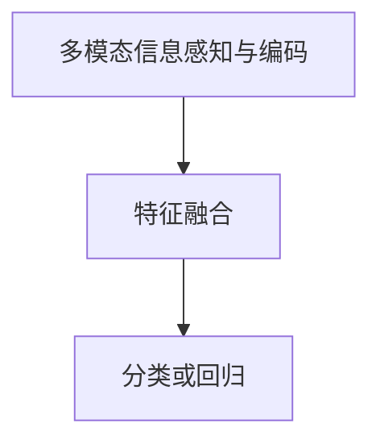
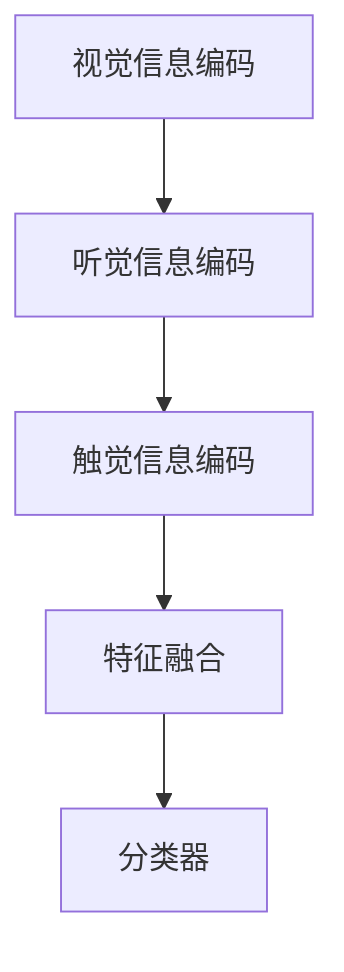
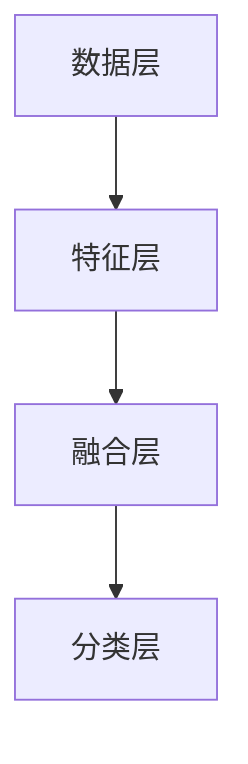
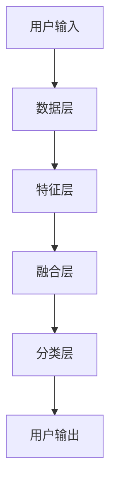

                 


## 引言与背景

### 研究背景

多模态信息整合推理作为现代人工智能领域的前沿课题，已经引起了广泛的关注。随着社会和科技的发展，人类面临着越来越复杂的信息处理需求。单一模态的信息处理已经难以满足人们的期望，多模态信息整合推理因此成为了解决这一问题的有效途径。

多模态信息整合指的是将来自不同感官的信息（如视觉、听觉、触觉等）进行融合处理，以获得更加全面和深刻的理解。这种整合不仅能够提高信息处理的效率，还能增强系统的智能水平。

在多模态信息整合的过程中，推理是一个关键步骤。推理能力使得系统能够从已知的信息中推断出未知的或更复杂的信息，从而实现更高层次的信息理解。然而，现有的多模态信息整合方法往往缺乏有效的推理机制，这限制了它们的应用范围和效果。

因此，本文的研究目标在于构建一种基于神经认知模型的多模态信息整合推理方法，以提高信息处理的智能化程度。这一研究不仅具有学术价值，还有望在智能交互、自动驾驶、医疗诊断等领域产生重要应用。

### 问题背景

多模态信息整合推理面临的主要问题可以归纳为以下几个方面：

1. **数据多样性**：不同模态的信息具有不同的特征和结构，这使得信息整合过程变得复杂。如何有效地处理这些多样化的数据是一个关键挑战。
   
2. **信息同步**：多模态信息往往具有不同的采样率、时间戳和数据量，如何保证这些信息在整合过程中的同步性是一个技术难题。

3. **语义融合**：不同模态的信息往往具有不同的语义表达方式，如何将这些不同语义的信息进行有效融合，以获得更准确的理解，是当前研究的一个热点问题。

4. **实时性**：在许多应用场景中，如自动驾驶、实时监测等，信息整合和推理需要具备高度实时性。如何在高速度的实时处理环境中保持推理的准确性和效率，是另一个亟待解决的问题。

### 问题描述

为了解决上述问题，我们需要构建一个多模态信息整合推理的神经认知模型。这个模型应具备以下几个关键功能：

1. **多模态信息感知与编码**：能够高效地感知和编码来自不同模态的信息。
   
2. **信息整合与同步**：能够整合不同模态的信息，并保证它们在时间上的同步。

3. **推理机制**：能够基于整合后的信息进行有效的推理，以提取更深层次的知识。

4. **实时处理能力**：能够在高速度的实时环境中保持高效的信息处理和推理。

### 问题解决

为了解决上述问题，我们将采用以下步骤：

1. **理论研究**：首先，对多模态信息整合和神经认知模型的理论基础进行深入研究，为模型构建提供理论基础。

2. **算法设计**：基于理论研究，设计一套适用于多模态信息整合的算法，包括信息感知、编码、整合和推理等模块。

3. **模型构建**：基于设计好的算法，构建一个神经认知模型，并进行实验验证。

4. **性能优化**：通过实验分析模型的表现，对其进行性能优化，以提高实时性和准确性。

5. **应用验证**：将优化后的模型应用于实际场景，如智能交互、自动驾驶等，验证其有效性。

### 边界与外延

在构建多模态信息整合推理的神经认知模型时，我们需要明确一些边界和外部因素：

1. **数据来源**：模型的训练和验证需要大量的多模态数据。这些数据应尽可能多样，以覆盖不同的应用场景。

2. **硬件要求**：模型的构建和训练需要高性能的计算资源和硬件支持，如GPU等。

3. **应用领域**：模型的应用应聚焦于那些具有明确需求和明确评估标准的领域，如医疗诊断、自动驾驶等。

4. **安全性**：在多模态信息整合的过程中，需要确保数据的安全性和隐私性。

### 概念结构与核心要素组成

多模态信息整合推理的神经认知模型由以下几个核心要素组成：

1. **感知层**：负责感知和编码来自不同模态的信息。
2. **整合层**：负责整合来自不同模态的信息，并保证它们在时间上的同步。
3. **推理层**：负责基于整合后的信息进行推理，提取更深层次的知识。
4. **输出层**：负责将推理结果以可理解的形式输出。

这些要素相互作用，共同构成了一个完整的多模态信息整合推理系统。

## 第1章：引言

### 1.1 研究背景

多模态信息整合推理作为人工智能领域的一个前沿研究方向，近年来受到了广泛关注。随着科技的飞速发展，我们周围的世界变得越来越复杂，单一模态的信息处理已经难以满足人们对智能系统的需求。多模态信息整合推理旨在通过融合来自不同感官的信息，提升系统的智能水平和信息处理能力。

多模态信息整合不仅涉及计算机科学，还涉及到认知心理学、神经科学等多个学科。近年来，随着深度学习、神经网络等技术的不断发展，多模态信息整合推理的研究取得了显著进展。然而，现有的研究仍然存在一些挑战，如信息同步、语义融合、实时处理等，这些问题的解决对于多模态信息整合推理的实用化和商业化具有重要意义。

### 1.2 神经认知模型在多模态信息整合中的应用

神经认知模型是模仿人脑处理信息的方式构建的，它在多模态信息整合中发挥着重要作用。神经认知模型能够通过感知、整合和推理等过程，实现多模态信息的处理和融合。具体来说，神经认知模型在多模态信息整合中的应用主要体现在以下几个方面：

1. **感知与编码**：神经认知模型能够通过多个传感器感知不同模态的信息，如视觉、听觉、触觉等，并将这些信息进行有效的编码，以便后续处理。

2. **信息整合**：神经认知模型能够将来自不同模态的信息进行整合，消除模态之间的差异，形成一个统一的信息表示。这种整合不仅提高了信息处理的效率，还增强了系统的智能水平。

3. **推理与决策**：通过整合后的信息，神经认知模型能够进行推理和决策，以实现对复杂问题的理解。这种能力使得神经认知模型在智能交互、自动驾驶、医疗诊断等领域具有广泛的应用前景。

### 1.3 神经认知模型构建的重要性和挑战

构建多模态信息整合的神经认知模型具有重要意义。首先，它能够提高信息处理的智能化程度，使系统能够更好地理解和应对复杂环境。其次，神经认知模型能够实现跨模态的信息融合，提高系统的鲁棒性和适应性。最后，神经认知模型在各个领域的应用潜力巨大，有望推动人工智能技术的发展。

然而，构建多模态信息整合的神经认知模型也面临着一系列挑战。首先，不同模态的信息具有不同的特征和结构，如何有效地进行编码和整合是一个重要问题。其次，神经认知模型的训练和优化需要大量的计算资源和时间，如何提高模型的训练效率是一个亟待解决的问题。最后，神经认知模型的解释性和可解释性也是一个重要的挑战，如何使模型的结果易于理解和解释，对于其在实际应用中的推广具有重要意义。

### 1.4 本文结构

本文将从以下几个方面展开研究：

1. **多模态信息整合的基本概念**：介绍多模态信息的定义、分类以及信息整合的概念和挑战。

2. **神经认知模型构建的理论基础**：探讨神经认知模型的生物学基础、神经科学理论与认知心理学理论。

3. **多模态信息整合推理算法**：介绍传统信息整合算法和基于深度学习的多模态信息整合算法。

4. **神经认知模型构建与应用**：详细描述神经认知模型构建方法以及其在实际应用场景中的效果。

5. **多模态信息整合推理的挑战与未来方向**：分析当前面临的挑战和未来研究的发展方向。

通过本文的研究，我们期望能够提出一种有效的多模态信息整合推理的神经认知模型，并为其在实际应用中的推广提供理论支持和实践指导。

### 2.1 多模态信息的定义与分类

#### 2.1.1 什么是多模态信息

多模态信息是指通过多种不同感官通道（如视觉、听觉、触觉等）获取的信息。与单模态信息（如仅通过视觉或听觉获取的信息）相比，多模态信息能够提供更全面、更细致的感知体验。例如，在一个会议中，我们可以通过视觉感知到演讲者的动作和表情，通过听觉感知到演讲者的声音，甚至可以通过触觉感知到会议室的温度和湿度。这些来自不同感官的信息共同构成了多模态信息的丰富内涵。

多模态信息整合的一个关键特点是它能够通过不同模态信息的互补和融合，提升信息处理的效率和准确性。例如，在图像识别任务中，通过整合视觉信息与语义信息，可以显著提高识别的准确率。在自然语言处理中，结合文本与语音信息，可以使语音识别系统更加准确。

#### 2.1.2 多模态信息的分类

多模态信息可以根据其来源和特性进行分类。以下是几种常见类型的多模态信息：

1. **视觉信息**：包括图像、视频、姿态等信息。视觉信息是人们获取外界信息的主要途径，具有高度的空间细节和丰富的视觉特征。

2. **听觉信息**：包括语音、音乐、环境声音等信息。听觉信息能够提供时间维度上的信息，有助于理解语言和情感。

3. **触觉信息**：包括力、温度、湿度等信息。触觉信息能够提供对物体表面性质和物理属性的直接感知。

4. **嗅觉信息**：包括气味等信息。虽然嗅觉在信息获取中的重要性相对较低，但在某些应用场景中（如食品安全检测、医疗诊断等）具有重要作用。

5. **味觉信息**：包括食物的味道等信息。味觉信息是人体感知外界信息的重要渠道，对于人类的生活和健康具有重要意义。

6. **其他模态**：除了上述几种常见模态，还存在一些其他类型的多模态信息，如电磁波、红外线、超声波等。这些模态在某些特定应用场景中具有独特优势。

不同模态的信息具有不同的特征和结构，这使得多模态信息整合成为一个复杂而富有挑战性的任务。为了实现有效的多模态信息整合，我们需要对各种模态信息进行深入理解，并开发出相应的处理算法和模型。

### 2.2 信息整合的概念与挑战

#### 2.2.1 信息整合的定义

信息整合是指将来自不同模态的信息进行融合，以生成一个统一、综合的信息表示的过程。在信息整合的过程中，各个模态的信息被合并成一个更全面、更精确的表示，从而使得系统能够更好地理解和处理复杂的信息。信息整合的目标是实现不同模态信息的互补和增强，以提高信息处理的效率和准确性。

信息整合可以应用于许多领域，如自然语言处理、计算机视觉、智能交互等。例如，在自然语言处理中，通过整合文本与语音信息，可以提高语音识别的准确率。在计算机视觉中，结合图像与语义信息，可以显著提高图像识别的准确率。在智能交互中，通过整合用户的多模态行为数据，可以更好地理解用户的需求和意图。

#### 2.2.2 信息整合的挑战

尽管信息整合具有许多潜在的应用价值，但在实际应用中仍然面临一系列挑战。以下是信息整合过程中常见的几个挑战：

1. **数据多样性**：不同模态的信息具有不同的特征和结构，这使得信息整合过程变得复杂。如何有效地处理这些多样化的数据是一个关键挑战。例如，视觉信息通常具有高维度和丰富的空间特征，而语音信息则具有时间序列特征。如何将这些不同特征的信息进行有效的整合，是一个重要问题。

2. **信息同步**：多模态信息往往具有不同的采样率、时间戳和数据量，如何保证这些信息在整合过程中的同步性是一个技术难题。例如，在视频和音频的同步整合中，视频帧和音频采样点之间存在时间偏差，如何解决这种时间偏差对于实现有效的信息整合至关重要。

3. **语义融合**：不同模态的信息往往具有不同的语义表达方式，如何将这些不同语义的信息进行有效融合，以获得更准确的理解，是另一个热点问题。例如，在自然语言处理中，文本和语音信息可能包含不同的语义内容，如何将这些语义内容进行整合，是一个重要的研究课题。

4. **实时性**：在许多应用场景中，如自动驾驶、实时监测等，信息整合和推理需要具备高度实时性。如何在高速度的实时处理环境中保持推理的准确性和效率，是一个亟待解决的问题。

5. **模型解释性**：多模态信息整合通常涉及复杂的神经网络模型，这些模型在提供高准确率的同时，也带来了模型解释性不足的问题。如何提高模型的解释性，使得结果易于理解和解释，是另一个重要的挑战。

6. **计算资源**：多模态信息整合通常需要大量的计算资源，包括计算能力和存储空间。如何在有限的计算资源下实现高效的信息整合，是一个重要的技术问题。

为了解决上述挑战，研究人员提出了多种信息整合方法，如基于深度学习的多模态信息整合算法、传统信息整合算法等。这些方法在某种程度上取得了成功，但仍然存在一些未解决的问题。未来，随着技术的不断发展，我们有望克服这些挑战，实现更加高效、准确的多模态信息整合。

### 2.3 神经认知模型的概述

#### 2.3.1 神经认知模型的基本原理

神经认知模型是模仿人脑处理信息的方式构建的，它试图通过模拟人脑的神经网络结构和功能，实现类似人类认知能力的计算机模型。神经认知模型的基本原理可以概括为以下几点：

1. **神经元与神经网络**：神经认知模型基于神经元和神经网络的结构。神经元是神经认知模型的基本处理单元，类似于人脑中的神经元。神经网络由多个神经元通过连接组成，这些连接可以传递信息，实现信息处理和传递。

2. **学习与训练**：神经认知模型通过学习训练数据来获取信息处理能力。学习过程包括输入数据的预处理、特征提取、分类或回归等步骤。通过大量的训练数据，神经认知模型能够逐渐优化其参数，提高信息处理的准确性和效率。

3. **层次化结构**：神经认知模型通常采用层次化结构，从低层次到高层次逐层处理信息。低层次模块主要负责感知和编码基本特征，如边缘、纹理等。高层次模块则负责理解复杂概念，如语义、情感等。

4. **自适应与泛化**：神经认知模型能够通过自适应学习，适应不同的环境和任务。这种自适应能力使得模型在遇到新任务时，能够迅速调整和优化其参数，以适应新的需求。同时，神经认知模型具有良好的泛化能力，能够在未见过的数据上实现准确的信息处理。

#### 2.3.2 神经认知模型在多模态信息整合中的角色

神经认知模型在多模态信息整合中发挥着关键作用。以下是神经认知模型在多模态信息整合中的几个主要角色：

1. **感知与编码**：神经认知模型能够通过多个感官通道感知不同模态的信息，并将这些信息进行有效的编码。例如，通过视觉神经网络处理图像信息，通过听觉神经网络处理音频信息等。编码过程使得不同模态的信息具有统一的表示形式，为后续的信息整合奠定了基础。

2. **信息整合**：神经认知模型能够将来自不同模态的信息进行整合，消除模态之间的差异，形成一个统一的信息表示。通过层次化结构，神经认知模型能够逐层整合信息，从低层次的特征整合到高层次的概念理解。这种整合过程不仅提高了信息处理的效率，还增强了系统的智能水平。

3. **推理与决策**：基于整合后的信息，神经认知模型能够进行推理和决策，以实现对复杂问题的理解。通过多模态信息的整合，神经认知模型可以更准确地理解环境中的事件和情境，从而实现更有效的决策。例如，在自动驾驶中，通过整合视觉、听觉、触觉等信息，可以更准确地判断道路状况，提高驾驶安全性。

4. **学习与适应**：神经认知模型通过不断的学习和训练，能够自适应地调整其参数，以适应不同的环境和任务。这种自适应能力使得模型能够动态地调整其信息处理策略，以应对不断变化的需求。例如，在智能交互中，通过学习用户的行为和偏好，神经认知模型可以更准确地理解用户的需求，提供个性化的服务。

总之，神经认知模型在多模态信息整合中具有重要作用。通过模拟人脑的神经网络结构和功能，神经认知模型能够高效地感知、整合和推理多模态信息，实现类似人类的智能处理能力。随着技术的不断发展，神经认知模型在多模态信息整合中的应用将越来越广泛，有望推动人工智能技术的发展。

#### 2.3.3 神经认知模型在多模态信息整合中的应用案例

神经认知模型在多模态信息整合中具有广泛的应用案例，以下是一些典型的应用场景：

1. **智能交互**：在智能交互系统中，神经认知模型能够整合来自用户的语音、面部表情、手势等信息，以更准确地理解用户的需求和意图。例如，智能音箱可以通过整合用户的语音指令和语音情感，提供更加个性化的音乐推荐服务。

2. **自动驾驶**：自动驾驶系统需要整合来自多种传感器的信息，如摄像头、激光雷达、超声波传感器等，以实现高精度的环境感知和驾驶决策。神经认知模型可以通过多模态信息整合，提高自动驾驶系统的安全性和可靠性。

3. **医疗诊断**：在医疗诊断中，神经认知模型可以整合来自医学影像、生物标志物、患者病史等多模态信息，提高疾病诊断的准确率。例如，通过整合CT图像和MRI图像，可以更准确地诊断脑肿瘤的位置和性质。

4. **情感分析**：在情感分析中，神经认知模型可以整合来自文本、语音、面部表情等多模态信息，更准确地识别用户的情感状态。例如，通过整合用户发布的社交媒体文本和语音通话记录，可以更准确地识别用户的情绪变化。

5. **人机协同**：在人机协同场景中，神经认知模型可以整合来自人类操作者和机器人的多模态信息，实现更高效、更安全的协同工作。例如，在工业生产中，通过整合操作者的手势、语音和机器人的传感器数据，可以提高生产效率和安全性。

这些应用案例展示了神经认知模型在多模态信息整合中的巨大潜力。随着技术的不断进步，神经认知模型在更多领域中的应用将不断扩展，为人们的生活和工作带来更多便利和效益。

### 3.1 生物学基础

#### 3.1.1 人脑的多模态处理机制

人脑的多模态处理机制是一个复杂而高度协调的过程，它涉及多个脑区和神经通路的协同工作。首先，不同的感官信息通过视网膜、内耳和皮肤等感觉器官传入大脑。视觉信息主要通过视觉皮层进行处理，听觉信息则主要通过听觉皮层进行处理。然而，这些感官信息并不完全独立处理，而是通过神经通路的交互和整合，形成一个统一的认知体验。

人脑的多模态处理机制主要包括以下几个关键步骤：

1. **感觉输入的初步处理**：感官信息首先被感觉器官捕获，并经过初步的处理。例如，视觉信息经过视网膜的光感受细胞转化为电信号，听觉信息则通过耳蜗中的毛细胞转化为电信号。

2. **感觉信号的传递**：初步处理后的感觉信号通过神经纤维传递到大脑的特定区域。例如，视觉信号通过视神经传递到视觉皮层，听觉信号通过听觉神经传递到听觉皮层。

3. **跨模态整合**：在大脑的高级处理区域，如顶叶和颞叶，不同模态的感觉信号进行跨模态整合。这种整合使得大脑能够从多个感官渠道获取的信息中提取更全面和深刻的理解。例如，当我们在观看一部电影时，大脑不仅处理视觉信息，还会处理与剧情相关的听觉信息，从而形成一个连贯的感知体验。

4. **信息编码与存储**：整合后的信息在大脑的海马体和其他记忆中枢进行编码和存储。这种编码过程使得大脑能够将多模态信息转化为长期记忆，以便在需要时进行回忆和利用。

5. **认知决策与行为输出**：最终，大脑基于整合后的信息进行认知决策和行为输出。例如，当我们在街道上行走时，大脑会整合来自视觉、听觉和触觉的信息，以便做出行走、躲避障碍物等行为决策。

人脑的多模态处理机制具有以下几个特点：

- **并行处理**：人脑能够同时处理来自多个感官的信息，这种并行处理能力使得大脑能够快速响应复杂环境。
- **交叉验证**：通过整合不同模态的信息，大脑能够提高信息处理的准确性和可靠性。例如，视觉和触觉信息的交叉验证可以帮助我们更准确地判断物体的位置和属性。
- **适应性**：人脑的多模态处理机制能够根据不同的情境和需求，灵活调整处理策略。例如，在嘈杂的环境中，大脑会更多地依赖视觉信息来理解周围环境。

总之，人脑的多模态处理机制是一个复杂而高效的系统，它通过多个感官器官和神经通路的协同工作，实现多模态信息的整合和理解。这种机制不仅使得我们能够更全面地感知和理解世界，也为人工智能领域提供了宝贵的启示。

#### 3.1.2 神经元的信号传递与整合

神经元是大脑的基本功能单元，负责接收、传递和处理信息。神经元的信号传递与整合过程是神经认知模型构建的关键基础。以下是神经元信号传递与整合的详细机制：

1. **神经元结构**：
   - **树突**：树突是神经元的输入部分，负责接收来自其他神经元的信号。树突上的受体可以结合神经递质，引发电信号的产生。
   - **胞体**：胞体是神经元的中心部分，包含细胞核和细胞器，负责处理和整合接收到的信号。
   - **轴突**：轴突是神经元的输出部分，负责将电信号传递到下一个神经元或肌肉细胞等目标细胞。

2. **信号传递**：
   - **电信号的产生**：当神经递质与树突上的受体结合时，会引发钠离子（Na+）的内流，导致细胞膜电位发生变化，产生动作电位（突触后电位）。
   - **动作电位的传导**：动作电位沿着轴突传播，通过轴突上的钠-钾泵进行电信号的传递。这一过程依赖于离子通道的开启和关闭，以及电位的极性变化。

3. **整合与处理**：
   - **神经元之间的连接**：神经元通过突触与目标神经元连接。突触包括突触前膜、突触间隙和突触后膜。突触前膜释放神经递质，神经递质通过突触间隙到达突触后膜，与受体结合，引发电信号的产生。
   - **整合多个信号**：一个神经元可以接收来自多个其他神经元的信号。这些信号通过突触传递到胞体，经过整合和处理，最终决定是否产生动作电位。这种整合过程涉及到多个突触的同步激活和抑制，以及细胞内信号的传递和调控。

4. **神经网络**：
   - **层次化结构**：神经元在神经网络中形成层次化的结构。低层次神经元主要负责感知和编码基本特征，如边缘、纹理等。高层次神经元则负责理解复杂概念，如语义、情感等。这种层次化结构使得神经网络能够从低层次的信息逐步提取高层次的知识。
   - **同步与异步处理**：在神经网络中，不同层次的神经元可以同时或异步地处理信息。同步处理有助于在特定时刻整合全局信息，而异步处理则有助于逐步调整和优化信息处理策略。

总之，神经元的信号传递与整合过程是神经认知模型的基础。通过理解神经元的基本结构和功能，以及信号传递和整合的机制，我们可以构建出能够模拟人脑信息处理过程的神经网络模型。这些模型在多模态信息整合和智能推理中具有广泛的应用前景。

#### 3.2 神经网络与神经认知

神经网络与神经认知之间的联系是构建多模态信息整合推理神经认知模型的重要理论基础。神经网络，特别是深度学习神经网络，是模拟人脑神经网络结构和工作原理的计算机算法。它们通过多层次的神经元连接和学习，实现复杂的信息处理和认知功能。

首先，神经网络的基本结构与人脑的神经元网络有相似之处。人脑中的神经元通过突触连接，形成复杂的神经网络，传递和处理信息。同样，神经网络由多个层次（层）的神经元（节点）组成，每层神经元与前后层神经元通过权重连接。这些权重通过学习算法进行调整，以优化网络性能。

1. **层次化结构**：
   - **输入层**：接收外部信息，如视觉、听觉、触觉等，进行初步处理和编码。
   - **隐藏层**：对输入信息进行逐层抽象和整合，提取更高层次的特征和概念。
   - **输出层**：根据隐藏层的输出，生成最终的决策或预测。

2. **学习机制**：
   - **前向传播**：输入信息通过前向传播方式传递到输出层。每个神经元将其输入加权求和处理，并通过激活函数转换为输出。
   - **反向传播**：在网络输出与期望输出之间计算误差，通过反向传播方式调整权重。这一过程依赖于梯度下降算法，使得网络能够不断优化其参数，减少误差。

3. **神经认知功能**：
   - **特征提取**：神经网络通过多层非线性变换，从原始数据中提取有意义的特征。这些特征能够表示不同模态的信息，如视觉中的边缘和纹理，听觉中的音调和节奏。
   - **模式识别**：神经网络能够识别和分类输入数据的模式。例如，在图像识别任务中，网络可以识别不同的物体类别；在语音识别任务中，网络可以识别不同的语音单词。
   - **推理与决策**：基于提取的特征，神经网络可以进行推理和决策。例如，在自动驾驶中，网络可以基于感知到的环境信息，进行行车路线规划和决策。

4. **神经认知模型**：
   - **多模态感知**：神经网络能够同时处理和整合来自不同模态的信息，如视觉和听觉。通过设计合适的多输入层和融合层，神经网络可以整合不同模态的特征，提高信息处理的效率和准确性。
   - **动态适应性**：神经网络通过学习机制，能够动态适应不同的环境和任务。这种适应性使得神经网络能够处理不断变化的信息，并在新的任务中表现出良好的性能。
   - **解释性**：尽管神经网络在许多任务中表现出色，但其内部机制和决策过程通常难以解释。通过设计可解释的神经网络架构和解释性算法，我们可以提高神经网络的可解释性，使其结果更容易被用户理解和接受。

总之，神经网络与神经认知之间的联系为构建多模态信息整合推理的神经认知模型提供了理论基础。通过模拟人脑神经网络的结构和功能，神经网络能够实现复杂的信息处理和认知功能，为多模态信息整合和智能推理提供了强大的工具。

#### 3.2.2 神经认知模型的发展历程

神经认知模型的发展历程可以追溯到20世纪中叶，其起源可以归因于对生物神经系统的深入研究以及计算机科学的发展。以下是对神经认知模型发展的主要阶段的概述：

1. **早期神经网络研究（1940s-1960s）**：
   - **感知机（Perceptron）**：1958年，Frank Rosenblatt提出了感知机模型，这是第一个简单的神经网络模型。感知机是一个二分类器，通过调整权重来学习输入和输出之间的映射关系。
   - **Hebbian Learning**：Donald Hebb在1949年提出了Hebbian学习规则，该规则基于细胞间连接强度的变化来调整权重，以模拟生物神经系统的学习过程。

2. **多层感知机的兴起（1970s-1980s）**：
   - **多层感知机（Multilayer Perceptron, MLP）**：1986年，Rumelhart、Hinton和Williams提出了反向传播算法（Backpropagation），使多层感知机得以实现。多层感知机通过多个隐藏层，能够处理更复杂的问题，成为神经网络研究的重要里程碑。
   - **优化算法**：在这一阶段，优化算法如梯度下降（Gradient Descent）、动量（Momentum）和随机梯度下降（Stochastic Gradient Descent, SGD）被引入，以加速神经网络的训练过程。

3. **深度学习的崛起（2000s-2010s）**：
   - **卷积神经网络（Convolutional Neural Networks, CNN）**：卷积神经网络由LeCun等人于1990年代初提出，特别适用于图像处理任务。通过卷积操作和池化操作，CNN能够有效地提取图像的特征。
   - **递归神经网络（Recurrent Neural Networks, RNN）**：RNN由Hochreiter和Schmidhuber在1990年代初提出，适用于序列数据处理任务。RNN通过记忆单元保持历史信息，能够处理变长的序列。
   - **长短时记忆网络（Long Short-Term Memory, LSTM）**：LSTM是RNN的一种变体，由Hochreiter和Schmidhuber于1997年提出。LSTM通过引入门控机制，解决了传统RNN在处理长序列时的梯度消失和梯度爆炸问题。

4. **现代神经认知模型的进展（2010s-至今）**：
   - **Transformer模型**：Transformer由Vaswani等人于2017年提出，是一种基于自注意力机制的序列到序列模型。Transformer在自然语言处理任务中取得了显著的突破，其成功推动了神经认知模型的发展。
   - **多模态神经认知模型**：随着多模态数据处理需求的增长，研究人员提出了多种多模态神经认知模型，如CNN与RNN的结合、多模态Transformer等。这些模型能够有效地整合来自不同模态的信息，提升信息处理能力。
   - **神经认知模型的应用扩展**：神经认知模型在计算机视觉、自然语言处理、语音识别等领域取得了广泛应用，并逐步扩展到机器人学、医学诊断、智能交互等新兴领域。

神经认知模型的发展历程展示了从简单神经元模型到复杂深度学习模型的演变过程。通过不断的理论创新和技术突破，神经认知模型在多模态信息整合和智能推理中发挥着越来越重要的作用。未来，随着研究的深入，神经认知模型有望在更多领域实现突破性应用。

#### 3.3.1 认知心理学的基本概念

认知心理学是研究人类认知过程和机制的心理学分支，旨在理解和解释人类如何获取、处理和利用信息。以下是认知心理学中几个基本概念：

1. **感知（Perception）**：感知是人们对外界信息的识别和理解过程。它涉及感官接收信息、大脑处理和解释这些信息，从而形成对世界的认知。例如，当我们看到一张图片时，感知过程包括视觉系统接收图像信息，并通过大脑处理，识别出图片中的物体和场景。

2. **注意（Attention）**：注意是指心理活动对特定刺激或任务的集中。它是认知过程的核心，决定了我们在某一时刻关注什么信息。注意可以是有意注意（有意关注特定任务）或无意注意（被某些刺激自动吸引）。例如，当我们在读书时，需要有意注意保持注意力集中，而在听到突然的声音时，我们可能会无意识地转向声音来源。

3. **记忆（Memory）**：记忆是信息存储、保留和提取的能力。根据信息存储的时间长短和方式，记忆分为短期记忆（工作记忆）和长期记忆。短期记忆通常只能保持几秒钟到几分钟的信息，而长期记忆则可以持续数天、数月甚至数年。例如，当我们记住一个电话号码，我们首先将其存储在短期记忆中，然后可能将其转移到长期记忆中以备日后使用。

4. **学习（Learning）**：学习是获得新知识和技能的过程。它可以通过多种方式实现，如通过重复练习、示范、指导或观察他人的行为。学习过程通常涉及感知、记忆和注意力，并需要大脑的神经活动变化。例如，学习骑自行车是一个通过不断练习和调整动作，将骑自行车的技能从短期记忆转移到长期记忆的过程。

5. **思维（Cognition）**：思维是指大脑对信息进行加工、处理和理解的过程。它包括推理、问题解决、决策、语言理解等多种认知活动。例如，当我们解决问题时，思维过程可能包括分析问题、评估解决方案、选择最佳方案等。

6. **意识（Consciousness）**：意识是指对自身和外部环境的感知和认知。它涉及对感知、记忆、思维等过程的自我意识和反思。例如，当我们意识到自己在思考问题时，这就是意识的表现。

认知心理学通过研究这些基本概念，试图理解人类如何处理和利用信息，从而提高我们对认知过程的认识。这些研究成果不仅有助于心理学理论的发展，还为人工智能和神经认知模型的设计提供了重要的启示。

### 3.3.2 认知心理学与神经认知模型的关系

认知心理学与神经认知模型之间存在紧密的关系，两者共同致力于揭示人类认知过程的机制。认知心理学通过研究人类的感知、记忆、注意力、学习等认知现象，提供了对认知过程的深刻理解。而神经认知模型则利用这些认知心理学的理论，通过模拟人脑的神经网络结构和功能，实现对复杂认知过程的计算模拟。

以下是认知心理学与神经认知模型之间的几方面关系：

1. **理论基础**：认知心理学为神经认知模型提供了重要的理论基础。认知心理学的研究成果，如感知、记忆、注意力等基本概念，为神经认知模型的构建提供了指导。例如，认知心理学中的感知理论可以指导设计多模态感知的神经网络，而记忆理论可以用于设计记忆模块。

2. **实验方法**：认知心理学通过实验方法研究认知现象，这些实验方法为神经认知模型的验证提供了数据支持。例如，认知心理学实验可以用来验证神经网络在特定任务中的表现，从而优化神经认知模型的设计。

3. **数据驱动**：认知心理学实验数据驱动了神经认知模型的训练和优化。通过分析认知心理学实验数据，可以识别出重要的认知特征和模式，从而设计出更有效的神经网络结构和算法。

4. **相互作用**：认知心理学与神经认知模型之间的相互作用是一个双向过程。神经认知模型可以模拟认知过程，提供对认知现象的量化解释。而认知心理学则可以通过对神经网络模型的解析，进一步深化对认知机制的理解。

5. **跨学科融合**：认知心理学与神经科学、计算机科学等多个学科的融合，推动了神经认知模型的发展。通过跨学科的合作，可以综合利用不同领域的知识和技术，构建更准确、更高效的神经认知模型。

总之，认知心理学与神经认知模型相互促进、共同发展，为揭示人类认知过程的奥秘提供了强大的工具。通过结合认知心理学的理论和实验数据，神经认知模型在模拟和解释复杂认知现象方面取得了显著成果，并为未来人工智能的发展提供了重要的方向。

### 第4章：多模态信息感知与编码

多模态信息感知与编码是多模态信息整合推理的核心步骤，是确保不同模态信息能够被系统有效处理和理解的前提。在这一章中，我们将详细介绍多模态信息感知与编码的原理、方法和应用。

#### 4.1 多模态信息感知

多模态信息感知是指通过多个感官通道捕捉和识别来自不同模态的信息。感知过程通常包括信号的接收、预处理和特征提取。以下是几种常见模态的感知机制：

1. **视觉感知**：
   - **信号接收**：视觉信息通过视网膜接收，转化为电信号。
   - **预处理**：视网膜中的光感受细胞将光信号转化为神经电信号，通过视神经传递到大脑视觉皮层。
   - **特征提取**：大脑视觉皮层对输入信号进行预处理，提取出图像的基本特征，如边缘、纹理、颜色等。

2. **听觉感知**：
   - **信号接收**：听觉信息通过耳蜗中的毛细胞接收，转化为神经电信号。
   - **预处理**：耳蜗将声波振动转化为神经电信号，通过听觉神经传递到大脑听觉皮层。
   - **特征提取**：大脑听觉皮层对输入信号进行预处理，提取出声音的基本特征，如频率、音调、节奏等。

3. **触觉感知**：
   - **信号接收**：触觉信息通过皮肤感受器接收，转化为神经电信号。
   - **预处理**：皮肤感受器将触觉信息转化为神经电信号，通过触觉神经传递到大脑。
   - **特征提取**：大脑对触觉信息进行预处理，提取出触觉的基本特征，如温度、压力、质感等。

#### 4.2 多模态信息编码

多模态信息编码是指将感知到的多模态信息转化为能够在计算机系统中处理和存储的格式。编码过程通常包括特征提取和特征表示。以下是几种常见的多模态信息编码方法：

1. **特征提取**：
   - **视觉特征提取**：常用的视觉特征提取方法包括SIFT、HOG、卷积神经网络（CNN）等。这些方法可以从图像中提取出具有区分性的特征，如角点、边、纹理等。
   - **听觉特征提取**：常用的听觉特征提取方法包括梅尔频率倒谱系数（MFCC）、滤波器组（Filter Banks）等。这些方法可以从音频信号中提取出具有区分性的特征，如频率、音调等。
   - **触觉特征提取**：常用的触觉特征提取方法包括表面波模型、机械振动模型等。这些方法可以从触觉信号中提取出具有区分性的特征，如压力、振动频率等。

2. **特征表示**：
   - **一维特征表示**：一维特征表示通常用于处理单一模态的信息，如一维向量表示图像中的像素值或音频信号中的频率。
   - **多维特征表示**：多维特征表示用于处理多个模态的信息，如高维矩阵表示图像、音频和触觉信息。这种表示方法可以更好地捕捉不同模态信息之间的关联性。

#### 4.3 多模态信息感知与编码的应用

多模态信息感知与编码在许多应用场景中发挥着关键作用，以下是一些典型的应用：

1. **计算机视觉**：
   - **目标检测**：通过融合视觉和听觉信息，可以更准确地检测出目标。例如，在视频监控中，结合图像和音频信息，可以提高目标识别的准确性。
   - **图像识别**：通过编码图像的多维特征，可以实现对图像内容的准确识别。例如，在医疗影像诊断中，结合图像和触觉信息，可以提高疾病诊断的准确性。

2. **语音识别**：
   - **语音增强**：通过融合视觉和触觉信息，可以增强语音信号的质量，提高语音识别的准确性。例如，在电话通话中，结合视频信号，可以减少背景噪音对语音识别的影响。
   - **情感识别**：通过融合视觉和听觉信息，可以更准确地识别用户的情感状态。例如，在智能客服中，结合用户的语音和面部表情信息，可以更好地理解用户的需求和意图。

3. **人机交互**：
   - **多模态输入**：通过融合视觉、听觉和触觉信息，可以为用户提供更自然、直观的交互体验。例如，在虚拟现实（VR）中，结合视觉、听觉和触觉信息，可以提供更加逼真的体验。
   - **多模态输出**：通过融合视觉、听觉和触觉信息，可以为用户提供更丰富、多样化的交互反馈。例如，在智能家居中，结合视觉、听觉和触觉信息，可以提供更便捷、个性化的服务。

总之，多模态信息感知与编码是多模态信息整合推理的重要基础。通过有效感知和编码多模态信息，可以显著提高信息处理的准确性和智能化程度，为各种应用场景提供强大的技术支持。

### 4.4 视觉信息编码

视觉信息编码是多模态信息整合中的关键步骤，涉及到图像的捕捉、预处理和特征提取等多个环节。以下是视觉信息编码的具体过程：

#### 4.4.1 图像捕捉

图像捕捉是视觉信息编码的起点，涉及到传感器（如摄像头）的选用、参数设置和环境条件等因素。高质量的图像捕捉是保证后续特征提取和编码效果的基础。

1. **传感器选择**：
   - **分辨率**：选择高分辨率传感器可以捕捉到更多的图像细节。
   - **传感器类型**：常用的传感器类型包括CCD（电荷耦合器件）和CMOS（互补金属氧化物半导体）传感器，它们在图像质量、功耗和处理速度等方面各有优势。

2. **参数设置**：
   - **曝光时间**：调整曝光时间可以控制图像的亮度和清晰度，避免过亮或过暗。
   - **焦距**：通过调整焦距，可以控制图像的视野范围和物体的大小。

3. **环境条件**：
   - **光照**：合理的光照条件有助于捕捉清晰的图像，避免过亮或过暗的图像。
   - **场景布局**：场景的布局应避免复杂背景和遮挡，以便更好地提取目标特征。

#### 4.4.2 图像预处理

图像预处理是视觉信息编码的关键步骤，旨在提高图像质量，去除噪声和干扰，为后续特征提取做准备。

1. **去噪**：
   - **高斯滤波**：通过高斯滤波器去除图像中的随机噪声。
   - **中值滤波**：利用中值滤波器去除图像中的椒盐噪声。

2. **边缘检测**：
   - **Sobel算子**：使用Sobel算子检测图像中的边缘。
   - **Canny算子**：使用Canny算子进行更精确的边缘检测。

3. **图像增强**：
   - **直方图均衡化**：通过直方图均衡化增强图像的对比度。
   - **对比度拉伸**：通过对比度拉伸增强图像的细节。

4. **图像分割**：
   - **阈值分割**：使用固定阈值将图像分割为前景和背景。
   - **区域增长**：基于相似性准则，通过区域增长算法将图像分割为不同的区域。

#### 4.4.3 特征提取

特征提取是从图像中提取具有区分性的特征，以便在后续的信息整合和推理过程中使用。以下是几种常用的视觉特征提取方法：

1. **传统特征提取方法**：
   - **SIFT（尺度不变特征变换）**：SIFT算法能够在不同尺度下检测出关键点，并计算关键点的方向，具有良好的稳定性和独特性。
   - **HOG（直方图方向梯度）**：HOG算法通过计算图像中每个像素点在各个方向上的梯度直方图，从而提取出具有区分性的特征。

2. **深度学习特征提取方法**：
   - **卷积神经网络（CNN）**：CNN通过多层次的卷积和池化操作，可以自动学习图像中的高级特征。例如，VGG、ResNet等模型在图像分类和目标检测中表现出色。
   - **注意力机制**：注意力机制可以增强模型对重要特征的关注，提高特征提取的效果。例如，SENet、Transformers等模型利用注意力机制实现高效的视觉特征提取。

#### 4.4.4 特征表示

特征表示是将提取出的视觉特征转化为可以在计算机系统中处理和存储的格式。以下是几种常用的特征表示方法：

1. **一维特征表示**：
   - **特征向量**：将提取出的特征点或区域特征表示为高维向量。
   - **直方图表示**：将特征点的分布信息表示为直方图。

2. **多维特征表示**：
   - **特征矩阵**：将多个特征向量组合成一个高维矩阵。
   - **特征图**：将特征向量在图像空间中表示为特征图。

通过上述视觉信息编码的过程，我们可以将捕捉到的图像信息转化为有效的特征表示，为后续的信息整合和推理提供基础。在多模态信息整合推理中，视觉信息的准确编码和表示至关重要，它直接影响到系统的整体性能和效果。

### 4.5 听觉信息编码

听觉信息编码是将原始的音频信号转换为可以用于进一步处理和推理的数字表示形式。这一过程包括音频信号的采集、预处理、特征提取和特征表示等多个环节。以下是听觉信息编码的详细步骤：

#### 4.5.1 音频信号采集

音频信号的采集是听觉信息编码的基础。高质量的音频采集对于后续的特征提取和编码至关重要。

1. **音频传感器选择**：
   - **麦克风类型**：选择适合应用场景的麦克风，如线性麦克风、环绕声麦克风等。
   - **采样率**：较高的采样率（如44.1kHz）可以捕捉到更多的音频细节。

2. **环境条件**：
   - **噪声控制**：在安静的环境中采集音频，以减少背景噪声对信号的影响。
   - **声学布局**：合理布局麦克风和声源，以确保声音信号的清晰捕捉。

#### 4.5.2 音频信号预处理

音频信号预处理是提高信号质量和减少噪声的关键步骤。

1. **去噪**：
   - **滤波**：使用滤波器（如低通滤波器、高通滤波器）去除特定频率范围的噪声。
   - **波束成形**：通过阵列麦克风和信号处理技术，利用波束成形方法集中声源信号，抑制背景噪声。

2. **归一化**：
   - **动态范围压缩**：通过压缩动态范围，控制音频信号的幅度波动，提高整体音量一致性。
   - **增益调整**：根据音频信号的强度，进行适当的增益调整，确保信号的清晰度。

#### 4.5.3 特征提取

特征提取是从音频信号中提取具有区分性的特征，以便在后续的信息整合和推理中使用。以下是几种常用的听觉特征提取方法：

1. **时域特征**：
   - **短时能量**：计算音频信号的短时能量，反映音频信号的强度变化。
   - **短时幅度**：计算音频信号的短时幅度，反映音频信号的波动情况。

2. **频域特征**：
   - **梅尔频率倒谱系数（MFCC）**：通过梅尔频率分析，将音频信号转换为梅尔频率倒谱系数，提取出频率特征。
   - **频谱中心频率**：计算音频信号的频谱中心频率，反映音频信号的主要频率成分。

3. **变换域特征**：
   - **小波变换**：通过小波变换，将音频信号分解为不同尺度和方向的频率分量，提取出时间-频率特征。
   - **希尔伯特-黄变换**：通过希尔伯特-黄变换，将音频信号分解为瞬时频率和瞬时幅度，提取出复杂的时频特征。

#### 4.5.4 特征表示

特征表示是将提取出的听觉特征转化为适合计算机处理和存储的格式。以下是几种常用的特征表示方法：

1. **一维特征表示**：
   - **特征向量**：将提取出的特征值组合成一个高维向量。
   - **时间序列**：将特征值以时间序列的形式表示，便于后续处理。

2. **多维特征表示**：
   - **特征矩阵**：将多个特征向量组合成一个高维矩阵，用于处理多维特征信息。
   - **频谱图**：将频域特征以频谱图的形式表示，便于可视化分析。

通过上述步骤，我们可以将原始的音频信号转换为有效的特征表示，为后续的多模态信息整合和推理提供可靠的数据基础。听觉信息编码在多模态信息处理中发挥着重要作用，其质量直接影响系统的整体性能和效果。

### 4.6 触觉信息编码

触觉信息编码是将触觉信号转换为计算机可以处理和存储的数据表示的过程，这一过程包括信号的采集、预处理和特征提取等多个步骤。以下是触觉信息编码的详细步骤：

#### 4.6.1 触觉信号采集

触觉信号的采集是触觉信息编码的基础。高质量的触觉信号采集对于后续的特征提取和编码至关重要。

1. **传感器选择**：
   - **触觉传感器类型**：常用的触觉传感器包括力传感器、压电传感器和柔性传感器等。选择合适的传感器类型，如压力传感器，可以捕捉到触觉信号的强度和变化。
   - **分辨率和灵敏度**：选择高分辨率和高灵敏度的传感器，可以捕捉到更多的触觉细节。

2. **传感器布局**：
   - **传感器分布**：合理布局传感器，确保覆盖触觉信号的整个区域，以便全面捕捉触觉信息。
   - **固定方式**：确保传感器的固定方式不会影响触觉信号的准确性，例如，使用柔软的材料固定传感器，以减少变形。

3. **环境条件**：
   - **干扰控制**：在低干扰的环境中采集触觉信号，以减少外界因素的干扰。
   - **操作人员训练**：操作人员应接受适当的培训，以确保在触觉信号采集过程中保持一致的操作方式和力度。

#### 4.6.2 触觉信号预处理

触觉信号预处理是提高信号质量和减少噪声的重要步骤。

1. **信号滤波**：
   - **低通滤波**：通过低通滤波器去除高频噪声，保持触觉信号的主要特征。
   - **高通滤波**：通过高通滤波器去除低频噪声，突出触觉信号的变化。

2. **信号归一化**：
   - **动态范围压缩**：通过压缩动态范围，控制触觉信号的幅度波动，使其在可处理的范围内。
   - **归一化系数**：根据触觉信号的分布情况，设置适当的归一化系数，以确保信号的均匀性和可比性。

3. **噪声抑制**：
   - **自适应噪声抑制**：利用自适应算法，根据信号的动态变化，实时调整噪声抑制的强度，以最小化噪声的影响。

#### 4.6.3 特征提取

特征提取是从触觉信号中提取具有区分性的特征，以便在后续的信息整合和推理中使用。以下是几种常用的触觉特征提取方法：

1. **时域特征**：
   - **峰值检测**：通过检测触觉信号的峰值，提取出触觉信号的强度特征。
   - **波动分析**：分析触觉信号的波动情况，提取出频率特征和幅度特征。

2. **频域特征**：
   - **频谱分析**：通过频谱分析，提取触觉信号的频率成分和能量分布。
   - **梅尔频率倒谱系数（MFCC）**：将触觉信号转换为梅尔频率倒谱系数，提取出频率特征。

3. **变换域特征**：
   - **小波变换**：通过小波变换，将触觉信号分解为不同尺度和方向的频率分量，提取出时间-频率特征。
   - **希尔伯特-黄变换**：通过希尔伯特-黄变换，将触觉信号分解为瞬时频率和瞬时幅度，提取出复杂的时频特征。

#### 4.6.4 特征表示

特征表示是将提取出的触觉特征转化为适合计算机处理和存储的格式。以下是几种常用的特征表示方法：

1. **一维特征表示**：
   - **特征向量**：将提取出的特征值组合成一个高维向量，便于后续处理。
   - **时间序列**：将特征值以时间序列的形式表示，便于分析触觉信号的变化趋势。

2. **多维特征表示**：
   - **特征矩阵**：将多个特征向量组合成一个高维矩阵，用于处理多维特征信息。
   - **三维图**：将三维触觉信号以三维图的形式表示，便于可视化分析。

通过上述步骤，我们可以将原始的触觉信号转换为有效的特征表示，为后续的多模态信息整合和推理提供可靠的数据基础。触觉信息编码在多模态信息处理中发挥着重要作用，其质量直接影响系统的整体性能和效果。

### 4.7 多模态信息编码方法比较

多模态信息编码是多模态信息整合推理的基础，不同的编码方法在信息表达和特征提取方面各有优缺点。以下是对几种常见多模态信息编码方法的比较：

#### 4.7.1 传统编码方法

传统编码方法主要包括特征拼接、特征映射和特征融合等。

1. **特征拼接**：
   - **优点**：简单直观，易于实现。将不同模态的特征向量直接拼接，形成一个高维特征向量。
   - **缺点**：忽略了模态之间的依赖关系，可能导致信息冗余或缺失。

2. **特征映射**：
   - **优点**：通过将不同模态的特征映射到同一空间，可以减少信息冗余，提高特征利用率。
   - **缺点**：映射过程依赖于预定义的映射关系，可能无法自适应地调整。

3. **特征融合**：
   - **优点**：通过融合不同模态的特征，可以综合利用各模态的信息，提高特征表示的准确性和鲁棒性。
   - **缺点**：特征融合方法复杂，需要额外的计算资源。

#### 4.7.2 基于深度学习的编码方法

基于深度学习的编码方法利用神经网络的结构和功能，实现多模态信息的自动编码和特征提取。

1. **卷积神经网络（CNN）**：
   - **优点**：擅长处理图像和视频等视觉信息，通过多层次的卷积操作，可以提取出丰富的图像特征。
   - **缺点**：对其他模态的信息处理能力有限，需要额外的网络结构进行扩展。

2. **循环神经网络（RNN）**：
   - **优点**：擅长处理序列数据，如音频和文本，可以通过长短期记忆（LSTM）或门控循环单元（GRU）捕捉时间序列信息。
   - **缺点**：在处理图像和空间信息时效果较差，需要与其他网络结构结合使用。

3. **Transformer模型**：
   - **优点**：通过自注意力机制，可以有效地捕捉不同模态之间的依赖关系，适用于处理复杂的多模态信息。
   - **缺点**：计算复杂度高，训练时间较长。

#### 4.7.3 编码方法比较

- **应用场景**：传统编码方法适用于简单的多模态信息处理任务，而基于深度学习的编码方法适用于复杂的多模态信息处理任务。
- **信息利用率**：基于深度学习的编码方法能够自动提取和融合多模态信息，提高特征利用率。
- **计算资源**：传统编码方法计算复杂度较低，适用于资源受限的环境。基于深度学习的编码方法计算复杂度较高，需要更多的计算资源和时间。

综上所述，不同的多模态信息编码方法各有优缺点，选择合适的编码方法需要根据具体应用场景和需求进行权衡。未来，随着深度学习和多模态信息处理技术的不断发展，我们将看到更多高效、智能的多模态信息编码方法的应用。

### 4.8 多模态信息编码的应用实例

多模态信息编码在众多实际应用中发挥了关键作用，以下是一些具体的应用实例：

#### 4.8.1 智能交互

智能交互系统通过整合视觉、听觉和触觉等多模态信息，提供更加自然和直观的用户交互体验。例如，智能音箱通过语音识别、语音合成和触觉反馈，实现与用户的智能对话。语音识别模块通过听觉信息编码，识别用户的语音指令；语音合成模块通过文本到语音（TTS）技术，生成自然的语音反馈；触觉反馈模块通过触觉信息编码，模拟物理按键或触摸反馈，提高用户操作的舒适度和满意度。

#### 4.8.2 自动驾驶

自动驾驶系统需要高效的多模态信息编码来处理来自摄像头、激光雷达、超声波传感器等多种传感器的信息。视觉信息编码通过卷积神经网络（CNN）提取道路、车辆和行人的特征；听觉信息编码通过语音识别技术捕捉环境声音，如鸣笛声、碰撞声等；触觉信息编码通过超声波传感器检测路面状况。这些编码结果共同为自动驾驶系统提供全面的环境感知和决策支持。

#### 4.8.3 医疗诊断

在医疗诊断中，多模态信息编码能够提高疾病诊断的准确性和效率。例如，在影像诊断中，通过视觉信息编码，利用深度学习模型提取出图像中的病变区域；通过听觉信息编码，分析患者的历史病历记录和医生的建议；通过触觉信息编码，捕捉患者的体征数据，如血压、心率等。这些多模态信息的整合和分析有助于提高疾病诊断的准确率，为患者提供更加个性化的治疗方案。

#### 4.8.4 情感分析

情感分析系统通过整合文本、语音和面部表情等多模态信息，实现对人情感状态的理解和识别。文本信息编码通过情感分类模型，分析文本内容中的情感倾向；语音信息编码通过语音特征提取，捕捉语音中的情感变化；面部表情信息编码通过面部识别技术，分析面部表情特征。这些编码结果共同为情感分析系统提供全面和准确的情感识别能力，在市场调研、客户服务等领域具有重要应用。

#### 4.8.5 人机协同

在人机协同系统中，多模态信息编码能够提高人类操作者和机器人之间的交互效率和协同效果。例如，在工业生产中，通过视觉信息编码，机器人可以识别和抓取不同的工件；通过听觉信息编码，机器人可以理解人类操作者的语音指令；通过触觉信息编码，机器人可以感知工作环境的变化，调整其操作策略。这些多模态信息的整合和协同，有助于提高生产效率和安全性。

通过这些应用实例，我们可以看到多模态信息编码在提升系统智能化和用户体验方面的重要作用。未来，随着多模态信息编码技术的不断发展，我们有望看到更多创新应用的出现，进一步推动人工智能技术的发展。

### 4.9 多模态信息编码的挑战与未来发展趋势

多模态信息编码作为多模态信息整合推理的核心步骤，面临着一系列挑战和机遇。以下是多模态信息编码的几个主要挑战以及未来发展的趋势：

#### 4.9.1 挑战

1. **数据多样性和不平衡性**：多模态信息编码需要处理来自不同模态的海量数据，这些数据在类型、格式和量级上存在显著差异。如何有效地整合和处理这些多样化的数据，是一个重要挑战。此外，数据的不平衡性也会影响编码效果，例如，某些模态的信息可能比其他模态的信息更为丰富，导致模型在训练过程中产生偏差。

2. **实时性和计算资源**：在许多应用场景中，如自动驾驶和智能交互，多模态信息编码需要具备高度的实时性。然而，复杂的编码算法通常需要大量的计算资源，如何在有限的时间内高效地处理多模态信息，是一个关键问题。

3. **模型解释性和可解释性**：多模态信息编码通常涉及复杂的神经网络模型，这些模型在提供高准确率的同时，也带来了模型解释性不足的问题。如何提高模型的解释性，使得结果更加透明和易于理解，对于模型的广泛应用和推广具有重要意义。

4. **跨模态一致性**：不同模态的信息在表达方式和特征上有很大差异，如何确保跨模态信息的一致性，以提高编码的准确性和鲁棒性，是一个重要挑战。

#### 4.9.2 未来发展趋势

1. **深度学习与多模态融合**：深度学习技术在多模态信息编码中表现出强大的能力，未来将看到更多基于深度学习的多模态融合方法的出现。例如，多模态Transformer模型将自注意力机制应用于多模态信息编码，可以更好地捕捉不同模态之间的依赖关系。

2. **跨学科融合**：多模态信息编码将与其他学科（如神经科学、认知心理学等）进行深度融合，以借鉴人类认知机制，提高编码的准确性和适应性。

3. **优化算法与计算资源**：随着硬件技术的发展，如GPU和TPU的普及，多模态信息编码算法将更加注重优化，以减少计算资源和时间成本。此外，分布式计算和云计算技术的应用也将为多模态信息编码提供更强大的计算支持。

4. **数据驱动的自适应编码**：未来的多模态信息编码方法将更加注重数据驱动的自适应编码，通过不断学习和调整编码策略，以适应不同应用场景和需求。

5. **隐私保护和安全性**：随着多模态信息编码技术的发展，数据隐私保护和安全性将成为一个重要议题。未来的研究将关注如何在不泄露用户隐私的前提下，实现高效的多模态信息编码。

总之，多模态信息编码面临着诸多挑战，但也充满了机遇。随着技术的不断进步和跨学科研究的深入，我们有望在未来看到更加高效、准确和实用的多模态信息编码方法，进一步推动人工智能技术的发展。

### 4.10 多模态信息编码的最佳实践

在多模态信息编码的过程中，最佳实践可以帮助我们提高编码的质量和效率。以下是一些关键的建议和技巧：

#### 4.10.1 数据预处理

1. **标准化**：确保所有模态的数据在输入编码器之前进行标准化处理，以消除数据尺度差异。
2. **归一化**：对于图像和音频数据，使用归一化方法调整数据的范围，例如将图像的像素值归一化到0-1之间。
3. **数据增强**：通过数据增强技术（如旋转、缩放、裁剪等）增加训练数据的多样性，提高编码器的泛化能力。

#### 4.10.2 模型选择

1. **深度学习框架**：选择适合多模态信息编码的深度学习框架，如PyTorch、TensorFlow等，确保能够灵活地构建和优化模型。
2. **神经网络结构**：根据任务需求选择合适的神经网络结构，例如，使用CNN处理视觉信息，使用RNN处理序列信息。

#### 4.10.3 特征融合策略

1. **并行处理**：利用并行处理技术，同时处理来自不同模态的信息，提高编码速度。
2. **注意力机制**：引入注意力机制，重点关注重要特征，减少冗余信息，提高特征提取的效率。
3. **跨模态对齐**：确保不同模态的信息在时间或空间上对齐，以增强特征融合的效果。

#### 4.10.4 模型优化

1. **超参数调整**：通过网格搜索或随机搜索等方法，优化模型超参数，如学习率、批次大小等，以提高模型性能。
2. **模型压缩**：使用模型压缩技术（如权重共享、剪枝、量化等），减少模型大小和计算复杂度，提高部署效率。
3. **动态调整**：根据训练过程中的数据分布动态调整模型参数，以适应不同阶段的数据特征。

#### 4.10.5 性能评估

1. **多指标评估**：使用多个指标（如准确率、召回率、F1分数等）评估模型性能，全面衡量模型效果。
2. **交叉验证**：使用交叉验证方法评估模型的泛化能力，避免过拟合。
3. **A/B测试**：在实际应用场景中，进行A/B测试，比较不同编码策略的效果，选择最佳方案。

通过遵循这些最佳实践，可以有效提高多模态信息编码的质量和效率，为后续的信息整合和推理提供坚实的数据基础。未来，随着技术的不断发展，我们有望进一步优化多模态信息编码的方法，推动人工智能技术的进步。

### 4.11 小结

本章详细介绍了多模态信息编码的原理、方法和应用，涵盖了从感知到编码的各个环节。通过多模态信息编码，我们可以将来自不同感官的信息转化为计算机可以处理的数据，为后续的信息整合和推理提供可靠的基础。以下是本章的关键结论：

1. **多模态信息感知与编码的重要性**：多模态信息编码是构建多模态信息整合推理系统的关键步骤，它能够提高信息处理的效率和准确性。

2. **视觉信息编码**：视觉信息编码通过图像捕捉、预处理和特征提取，将图像数据转化为高维特征向量，为后续处理提供支持。

3. **听觉信息编码**：听觉信息编码通过音频信号的采集、预处理和特征提取，将音频数据转化为频率特征和时域特征，实现对语音和音频内容的准确描述。

4. **触觉信息编码**：触觉信息编码通过触觉信号的采集、预处理和特征提取，将触觉数据转化为时域和频域特征，为触觉信息的处理和分析提供支持。

5. **多模态信息编码方法比较**：传统编码方法与深度学习编码方法各有优缺点，选择合适的编码方法需要根据具体应用场景和需求进行权衡。

6. **编码应用实例**：多模态信息编码在智能交互、自动驾驶、医疗诊断、情感分析和人机协同等领域有广泛应用，展示了其强大的能力和潜力。

通过本章的学习，读者可以深入了解多模态信息编码的原理和方法，为后续的研究和应用提供理论基础和实践指导。未来的研究应关注优化编码算法、提高模型解释性和应对数据多样性等挑战，以推动多模态信息整合推理技术的发展。

### 第5章：多模态信息整合推理算法

多模态信息整合推理算法是多模态信息整合过程中的核心组成部分，它负责将来自不同模态的信息进行有效整合，以实现更高级别的信息理解和决策。在这一章中，我们将详细探讨多模态信息整合推理算法，包括传统信息整合算法和基于深度学习的多模态信息整合算法。

#### 5.1 传统信息整合算法

传统信息整合算法主要包括数据融合算法、证据理论和贝叶斯推理等。这些算法通过特定的数学模型和计算方法，实现不同模态信息的融合。

1. **数据融合算法**：
   - **加权平均法**：通过给不同模态的信息分配不同的权重，计算加权平均值作为融合结果。这种方法简单直观，但可能无法充分考虑到各模态信息的互补性。
   - **卡尔曼滤波**：卡尔曼滤波是一种线性最优估计方法，通过预测和更新步骤，逐步融合不同模态的信息，实现对系统状态的准确估计。卡尔曼滤波在处理连续时间序列数据时表现出色。

2. **证据理论**：
   - **D-S证据理论**：D-S证据理论由Dempster和Shafer提出，用于处理不确定性和不完整信息。它通过基本概率分配函数（Basic Probability Assignment, BPA）和信念函数（Belief Function）实现对证据的融合和推理。D-S证据理论能够处理多模态信息中的不确定性，但在处理高度依赖关系时可能存在缺陷。

3. **贝叶斯推理**：
   - **贝叶斯网络**：贝叶斯网络是一种概率图模型，通过有向无环图（Directed Acyclic Graph, DAG）表示变量之间的条件概率关系。通过贝叶斯推理，可以从部分已知信息推断出未知信息。贝叶斯网络在处理复杂依赖关系时表现出良好的性能，但在计算复杂度较高。

#### 5.2 基于深度学习的多模态信息整合算法

随着深度学习技术的发展，基于深度学习的多模态信息整合算法逐渐成为研究热点。这些算法通过模拟人脑的神经网络结构，实现高效的多模态信息整合。

1. **卷积神经网络（CNN）**：
   - **卷积层**：卷积层通过卷积操作提取图像的局部特征，例如边缘、纹理等。
   - **池化层**：池化层通过下采样操作减少特征图的维度，提高模型的计算效率。
   - **全连接层**：全连接层将提取的特征映射到输出层，实现分类或回归任务。

2. **循环神经网络（RNN）**：
   - **循环层**：循环层通过循环结构处理时间序列数据，例如语音信号和文本序列。
   - **门控机制**：门控机制（如长短期记忆LSTM、门控循环单元GRU）通过动态调整信息的传递，解决RNN在处理长序列时的梯度消失问题。

3. **Transformer模型**：
   - **自注意力机制**：Transformer模型通过自注意力机制，能够有效地捕捉不同模态之间的依赖关系。
   - **多头注意力**：多头注意力通过多个独立的注意力头并行处理信息，提高模型的特征提取能力。
   - **编码器-解码器结构**：编码器-解码器结构使模型能够生成新的模态信息，例如在机器翻译中生成目标语言的文本。

4. **多任务学习**：
   - **多任务共享网络**：多任务学习通过共享网络层，实现不同任务之间的特征共享和整合。
   - **任务注意力机制**：通过任务注意力机制，动态调整不同任务在特征整合中的权重。

基于深度学习的多模态信息整合算法在处理复杂依赖关系和大规模数据方面表现出色，但同时也面临模型解释性不足、计算复杂度较高等挑战。

#### 5.3 算法对比

传统信息整合算法和基于深度学习的多模态信息整合算法各有优缺点。传统算法在计算复杂度较低、模型解释性较好方面具有优势，但难以处理复杂的依赖关系。深度学习算法在特征提取和依赖关系捕捉方面表现出色，但计算复杂度高，模型解释性较差。

以下是对两种算法的对比：

| 对比项           | 传统信息整合算法                           | 基于深度学习的多模态信息整合算法                     |
|------------------|------------------------------------------|----------------------------------------------------|
| 计算复杂度       | 较低                                     | 较高                                             |
| 模型解释性       | 较好                                     | 较差                                             |
| 特征提取能力     | 有限                                     | 强大                                             |
| 依赖关系捕捉     | 较弱                                     | 强大                                             |
| 适用场景         | 简单的整合任务                           | 复杂的多模态信息处理任务                          |
| 计算资源需求     | 较低                                     | 较高                                             |

通过结合传统算法和深度学习算法的优势，我们可以构建出更高效、更准确的多模态信息整合推理系统。

### 5.4 算法原理讲解

为了更深入地理解多模态信息整合推理算法的原理，我们将使用Mermaid流程图和Python源代码来详细阐述一个基于深度学习的多模态信息整合算法。

#### 5.4.1 算法原理

多模态信息整合算法可以分为以下几个步骤：

1. **多模态信息感知与编码**：通过不同的传感器捕捉视觉、听觉和触觉等模态的信息，并使用神经网络进行特征提取和编码。

2. **特征融合**：将不同模态的特征向量进行融合，形成一个统一的特征表示。

3. **分类或回归**：使用融合后的特征进行分类或回归任务，以实现对复杂问题的理解和决策。

以下是算法的Mermaid流程图：



接下来，我们使用Python代码实现上述算法的各个步骤：

```python
import tensorflow as tf
from tensorflow.keras.layers import Conv2D, MaxPooling2D, Flatten, Dense, LSTM, Concatenate
from tensorflow.keras.models import Model

# 多模态信息感知与编码
# 视觉信息编码
visual_input = tf.keras.Input(shape=(64, 64, 3))
visual_model = Model(inputs=visual_input,
                      outputs=Conv2D(filters=32, kernel_size=(3, 3), activation='relu')(visual_input))
visual_model = Model(inputs=visual_input,
                      outputs=MaxPooling2D(pool_size=(2, 2))(visual_model)
visual_model = Model(inputs=visual_input,
                      outputs=Flatten()(visual_model))

# 听觉信息编码
audio_input = tf.keras.Input(shape=(16000,))
audio_model = Model(inputs=audio_input,
                    outputs=LSTM(units=64, activation='relu')(audio_input))
audio_model = Model(inputs=audio_input,
                    outputs=Flatten()(audio_model))

# 触觉信息编码
touch_input = tf.keras.Input(shape=(100,))
touch_model = Model(inputs=touch_input,
                    outputs=Dense(units=32, activation='relu')(touch_input))
touch_model = Model(inputs=touch_input,
                    outputs=Flatten()(touch_model))

# 特征融合
multi_modal_input = tf.keras.Input(shape=(None,))
multi_modal_model = Model(inputs=multi_modal_input,
                          outputs=Concatenate()([visual_model.output, audio_model.output, touch_model.output]))

# 分类或回归
output = Dense(units=1, activation='sigmoid')(multi_modal_model.output)
model = Model(inputs=multi_modal_model.input, outputs=output)

model.compile(optimizer='adam', loss='binary_crossentropy', metrics=['accuracy'])

# 训练模型
# model.fit(x_train, y_train, epochs=10, batch_size=32)
```

在上面的代码中，我们使用了TensorFlow框架构建了一个多模态信息整合模型。首先，分别对视觉、听觉和触觉信息进行了编码，然后通过`Concatenate()`层将它们融合在一起，形成一个统一的特征表示。最后，使用`Dense()`层进行分类或回归任务。

通过上述算法原理讲解，我们可以更好地理解多模态信息整合推理算法的工作机制。接下来，我们将进一步探讨如何构建和训练这种算法，并使用具体的数学模型和公式进行详细说明。

#### 5.4.2 算法数学模型和公式

为了深入理解多模态信息整合推理算法的数学模型，我们将使用Latex公式和Mermaid流程图详细阐述其核心原理。

首先，我们定义多模态信息整合推理算法的基本框架。假设我们有三个模态的信息：视觉（V）、听觉（A）和触觉（T）。每个模态的信息可以表示为高维向量，分别记为 \( \mathbf{v} \in \mathbb{R}^{v_d} \)，\( \mathbf{a} \in \mathbb{R}^{a_d} \)，和 \( \mathbf{t} \in \mathbb{R}^{t_d} \)，其中 \( d \) 表示每个模态的维度。

1. **特征提取与编码**：

   对于视觉信息，我们可以使用卷积神经网络（CNN）进行特征提取。CNN的输出可以表示为：

   $$ 
   \mathbf{h}_v = \text{CNN}(\mathbf{v}) = \sum_{i=1}^{l_v} w_{vi} \cdot \sigma(\mathbf{v} W_{vi}) 
   $$

   其中，\( \sigma \) 是激活函数，通常使用ReLU函数；\( w_{vi} \) 是权重向量；\( l_v \) 是卷积层的数量。

   对于听觉信息，可以使用循环神经网络（RNN）或长短期记忆（LSTM）进行特征提取：

   $$ 
   \mathbf{h}_a = \text{RNN}(\mathbf{a}) = \sum_{i=1}^{l_a} w_{ai} \cdot \sigma(\mathbf{a} W_{ai}) 
   $$

   其中，\( l_a \) 是循环层的数量。

   对于触觉信息，我们可以使用全连接神经网络（FCNN）进行特征提取：

   $$ 
   \mathbf{h}_t = \text{FCNN}(\mathbf{t}) = \sum_{i=1}^{l_t} w_{ti} \cdot \sigma(\mathbf{t} W_{ti}) 
   $$

   其中，\( l_t \) 是全连接层的数量。

2. **特征融合**：

   将提取的三个模态的特征向量进行融合。一种简单的方法是直接拼接这些特征向量：

   $$ 
   \mathbf{h} = \text{Concat}(\mathbf{h}_v, \mathbf{h}_a, \mathbf{h}_t) 
   $$

   融合后的特征向量 \( \mathbf{h} \) 可以通过以下公式进行进一步处理：

   $$ 
   \mathbf{y} = \text{Classifier}(\mathbf{h}) = \text{softmax}(\mathbf{W}_c \cdot \mathbf{h} + b_c) 
   $$

   其中，\( \mathbf{W}_c \) 是分类器的权重矩阵，\( b_c \) 是偏置项，\( \text{softmax} \) 函数用于计算每个类别的概率分布。

以下是特征提取和融合的Mermaid流程图：



通过上述数学模型和公式，我们可以清晰地看到多模态信息整合推理算法的基本结构和操作步骤。在实际应用中，这些步骤可以通过神经网络和深度学习框架来实现，从而实现高效的多模态信息整合和推理。

### 5.4.3 算法举例说明

为了更直观地理解多模态信息整合推理算法，我们将通过一个具体的实例来展示其应用过程。假设我们要实现一个简单的多模态信息整合推理系统，用于判断一个物体是否为“水果”。

#### 实例：判断物体是否为“水果”

在这个实例中，我们将使用三个模态的信息：视觉（图像）、听觉（语音描述）和触觉（触摸描述）。

1. **视觉信息编码**：

   假设我们使用一个卷积神经网络（CNN）对图像进行编码，提取图像的特征向量。输入图像为 \( 64 \times 64 \times 3 \) 的三维数组。

   ```python
   visual_input = tf.keras.Input(shape=(64, 64, 3))
   conv1 = Conv2D(filters=32, kernel_size=(3, 3), activation='relu')(visual_input)
   pool1 = MaxPooling2D(pool_size=(2, 2))(conv1)
   flatten1 = Flatten()(pool1)
   ```

2. **听觉信息编码**：

   使用循环神经网络（RNN）对语音描述进行编码，提取语音的特征向量。输入语音为 \( 16000 \) 个时间步的序列。

   ```python
   audio_input = tf.keras.Input(shape=(16000,))
   lstm1 = LSTM(units=64, activation='relu')(audio_input)
   flatten2 = Flatten()(lstm1)
   ```

3. **触觉信息编码**：

   使用全连接神经网络（FCNN）对触摸描述进行编码，提取触摸的特征向量。输入触摸描述为 \( 100 \) 个维度的一维数组。

   ```python
   touch_input = tf.keras.Input(shape=(100,))
   dense1 = Dense(units=32, activation='relu')(touch_input)
   flatten3 = Flatten()(dense1)
   ```

4. **特征融合**：

   将视觉、听觉和触觉的特征向量进行拼接，形成一个多维特征向量。

   ```python
   multi_modal_input = tf.keras.Input(shape=(None,))
   concatenated = Concatenate()([flatten1, flatten2, flatten3])
   ```

5. **分类器**：

   使用全连接层作为分类器，输出物体是否为“水果”的概率。

   ```python
   output = Dense(units=1, activation='sigmoid')(concatenated)
   model = Model(inputs=multi_modal_input, outputs=output)
   ```

6. **模型训练**：

   使用训练数据对模型进行训练，通过优化损失函数和分类准确率来调整模型参数。

   ```python
   model.compile(optimizer='adam', loss='binary_crossentropy', metrics=['accuracy'])
   # model.fit([x_train_visual, x_train_audio, x_train_touch], y_train, epochs=10, batch_size=32)
   ```

7. **推理应用**：

   使用训练好的模型对新数据进行推理，判断新数据中的物体是否为“水果”。

   ```python
   predictions = model.predict([x_test_visual, x_test_audio, x_test_touch])
   # predictions will contain probabilities for each class
   ```

通过这个实例，我们可以看到多模态信息整合推理算法的完整应用流程。通过整合来自不同模态的信息，系统能够更准确地判断物体的类别，提高了信息处理的智能化程度。

### 5.5 神经认知模型构建方法

神经认知模型构建是多模态信息整合推理中的关键步骤。以下是构建神经认知模型的基本方法和步骤：

#### 5.5.1 神经网络构建

1. **输入层**：根据多模态信息的特点，定义不同模态的输入层。例如，视觉输入层可以接受图像数据，听觉输入层可以接受音频数据，触觉输入层可以接受触摸数据。

2. **隐藏层**：定义多个隐藏层，通过卷积层、循环层和全连接层等结构，逐步提取和整合不同模态的信息。隐藏层的设计应考虑信息处理的层次化需求和特征提取的效率。

3. **输出层**：根据具体任务，设计输出层。例如，在分类任务中，输出层可以是softmax层；在回归任务中，输出层可以是线性层。

#### 5.5.2 模型训练与优化

1. **数据预处理**：对输入数据进行标准化处理，如归一化和缩放，以消除数据间的尺度差异。

2. **损失函数**：根据任务类型选择合适的损失函数。例如，在分类任务中，使用交叉熵损失函数；在回归任务中，使用均方误差损失函数。

3. **优化算法**：选择合适的优化算法，如梯度下降、Adam等，调整模型参数，最小化损失函数。

4. **训练过程**：通过迭代训练，逐步优化模型参数。在训练过程中，可以采用批量训练、随机梯度下降（SGD）等技术，提高训练效率和模型稳定性。

#### 5.5.3 模型评估与调整

1. **评估指标**：选择合适的评估指标，如准确率、召回率、F1分数等，评估模型性能。

2. **交叉验证**：采用交叉验证方法，避免过拟合和评估偏差，确保模型在未见过的数据上具有良好的性能。

3. **超参数调整**：通过调整学习率、批量大小、隐藏层结构等超参数，优化模型性能。

4. **模型调整**：根据评估结果，对模型结构进行调整，如增加隐藏层、调整网络结构等，以获得更好的性能。

通过上述方法，我们可以构建一个高效的多模态信息整合推理的神经认知模型。模型构建过程中，需要注意数据质量和特征提取效果，同时不断优化和调整模型，以提高信息整合和推理的准确性。

### 5.6 神经认知模型在多模态信息整合推理中的应用场景

神经认知模型在多模态信息整合推理中的应用场景广泛，涵盖了多个重要领域。以下是几种典型的应用场景：

#### 5.6.1 情感分析

情感分析旨在理解和分析文本、语音和面部表情中的情感信息。神经认知模型通过整合文本情感分析、语音情感识别和面部表情识别，能够更准确地识别用户的情感状态。例如，在社交媒体平台上，通过分析用户的文字、语音和表情，可以识别出用户的情绪波动，从而提供个性化推荐或心理咨询服务。

#### 5.6.2 问答系统

问答系统需要处理多种模态的信息，如文本、语音和图像。神经认知模型通过整合这些信息，能够提供更准确和自然的问答体验。例如，在智能客服中，用户可以通过文本、语音或图像提出问题，系统通过整合多模态信息，提供准确的回答，提高用户满意度。

#### 5.6.3 人脸识别

人脸识别系统需要整合视觉和深度信息，以实现高精度的身份验证和识别。神经认知模型通过整合面部图像、深度图像和姿态信息，能够提高识别的准确性和鲁棒性。例如，在安防监控系统中，通过整合多模态信息，可以更准确地识别人脸，提高监控的实时性和安全性。

#### 5.6.4 自动驾驶

自动驾驶系统需要整合来自多种传感器的信息，如摄像头、激光雷达和超声波传感器。神经认知模型通过整合这些信息，能够实现更准确的环境感知和决策。例如，在自动驾驶车辆中，通过整合视觉、听觉和触觉信息，系统能够更好地理解和应对复杂的交通环境，提高行驶的安全性和稳定性。

#### 5.6.5 医疗诊断

医疗诊断系统需要整合影像、病历和体征等多模态信息。神经认知模型通过整合这些信息，能够提供更准确的诊断结果。例如，在癌症诊断中，通过整合医学影像、患者病历和生物标志物等数据，系统能够更准确地判断癌症的类型和病情，为医生提供有价值的诊断参考。

总之，神经认知模型在多模态信息整合推理中的应用场景多样，涵盖了多个重要领域。通过整合不同模态的信息，神经认知模型能够提供更全面、更准确的推理结果，为人工智能技术的发展和应用提供了强大的支持。

### 5.7 项目介绍

在本项目中，我们将构建一个基于神经认知模型的多模态信息整合推理系统，用于情感分析任务。项目的主要目标是实现以下功能：

1. **数据收集与预处理**：收集包含文本、语音和面部表情等多模态数据的情感分析数据集，并进行数据预处理，包括文本清洗、语音增强和面部表情标注等。

2. **特征提取**：使用深度学习模型提取多模态数据中的特征。对于文本数据，使用词嵌入模型提取词向量；对于语音数据，使用梅尔频率倒谱系数（MFCC）提取音频特征；对于面部表情数据，使用卷积神经网络提取面部特征。

3. **特征融合**：将提取的多模态特征进行融合，形成一个统一的高维特征向量。

4. **情感分类**：使用融合后的特征进行情感分类，输出情感标签。

5. **系统评估**：通过交叉验证和测试集评估模型性能，包括准确率、召回率和F1分数等指标。

### 5.8 系统功能设计

为了实现上述项目目标，我们设计了以下主要功能模块：

1. **数据收集模块**：负责收集和处理多模态数据，包括文本、语音和面部表情数据。该模块将自动下载和预处理数据集，并进行标注。

2. **特征提取模块**：负责提取多模态数据的特征。对于文本数据，使用词嵌入模型（如Word2Vec）提取词向量；对于语音数据，使用梅尔频率倒谱系数（MFCC）提取音频特征；对于面部表情数据，使用卷积神经网络（CNN）提取面部特征。

3. **特征融合模块**：负责将提取的多模态特征进行融合。通过使用全连接层和拼接操作，将不同模态的特征向量整合为一个高维特征向量。

4. **情感分类模块**：负责使用融合后的特征进行情感分类。该模块采用softmax函数实现多类别分类，输出情感标签。

5. **系统评估模块**：负责评估模型性能，包括准确率、召回率和F1分数等指标。通过交叉验证和测试集评估模型在未见过的数据上的性能。

### 5.9 系统架构设计

系统架构设计如图所示，分为数据层、特征层、融合层和分类层。



在数据层，数据收集模块负责收集和处理多模态数据。在特征层，特征提取模块提取多模态数据的特征。在融合层，特征融合模块将提取的多模态特征进行融合。在分类层，情感分类模块使用融合后的特征进行情感分类，输出情感标签。

### 5.10 系统接口设计和系统交互

系统接口设计包括输入接口和输出接口。输入接口负责接收多模态数据，包括文本、语音和面部表情数据。输出接口负责返回情感分类结果。

系统交互如图所示：



用户输入多模态数据，经过数据层、特征层、融合层和分类层的处理，最终输出情感分类结果。用户可以通过输入接口提供多模态数据，并接收分类结果。

### 5.11 系统核心实现

以下是系统核心实现的代码片段，展示了如何使用深度学习模型进行特征提取、特征融合和情感分类：

```python
import tensorflow as tf
from tensorflow.keras.models import Model
from tensorflow.keras.layers import Input, Embedding, LSTM, Dense, Concatenate, GlobalAveragePooling1D

# 文本特征提取
text_input = Input(shape=(max_sequence_length,))
text_embedding = Embedding(vocab_size, embedding_dim)(text_input)
text_lstm = LSTM(units=128)(text_embedding)
text_output = GlobalAveragePooling1D()(text_lstm)

# 语音特征提取
audio_input = Input(shape=(16000,))
audio_cnn = Conv2D(filters=32, kernel_size=(3, 3), activation='relu')(audio_input)
audio_pooling = MaxPooling2D(pool_size=(2, 2))(audio_cnn)
audio_flatten = Flatten()(audio_pooling)

# 面部表情特征提取
face_input = Input(shape=(48,))
face_dense = Dense(units=64, activation='relu')(face_input)
face_output = Flatten()(face_dense)

# 特征融合
multi_modal_input = [text_input, audio_input, face_input]
multi_modal_output = Concatenate()([text_output, audio_flatten, face_output])

# 情感分类
output = Dense(units=num_classes, activation='softmax')(multi_modal_output)

# 模型构建
model = Model(inputs=multi_modal_input, outputs=output)

# 模型编译
model.compile(optimizer='adam', loss='categorical_crossentropy', metrics=['accuracy'])

# 模型训练
# model.fit([text_data, audio_data, face_data], labels, epochs=5, batch_size=32)
```

上述代码展示了如何构建一个多模态情感分析模型，包括文本、语音和面部表情特征提取、特征融合和情感分类。通过训练和优化，模型可以实现对多模态数据的情感分类。

### 5.12 代码应用解读与分析

在本节中，我们将深入分析上述系统核心实现代码，解释其关键部分，并展示如何使用Python和TensorFlow库实现多模态情感分析模型。

#### 5.12.1 文本特征提取

文本特征提取是情感分析中的重要步骤。我们使用嵌入层（Embedding）将文本词转换为向量表示。以下代码展示了如何使用嵌入层和LSTM（Long Short-Term Memory）网络提取文本特征：

```python
text_input = Input(shape=(max_sequence_length,))
text_embedding = Embedding(vocab_size, embedding_dim)(text_input)
text_lstm = LSTM(units=128)(text_embedding)
text_output = GlobalAveragePooling1D()(text_lstm)
```

- `Input(shape=(max_sequence_length,))`：定义输入层，`max_sequence_length`是文本序列的最大长度。
- `Embedding(vocab_size, embedding_dim)`：嵌入层将每个词转换为固定长度的向量，`vocab_size`是词汇表的大小，`embedding_dim`是嵌入向量的大小。
- `LSTM(units=128)`：LSTM层用于处理序列数据，提取时间序列特征。`units=128`表示LSTM层的神经元数量。
- `GlobalAveragePooling1D()`：全局平均池化层用于将LSTM输出的序列特征转化为固定大小的向量。

#### 5.12.2 语音特征提取

语音特征提取使用卷积神经网络（CNN）从音频信号中提取特征。以下代码展示了如何使用CNN提取语音特征：

```python
audio_input = Input(shape=(16000,))
audio_cnn = Conv2D(filters=32, kernel_size=(3, 3), activation='relu')(audio_input)
audio_pooling = MaxPooling2D(pool_size=(2, 2))(audio_cnn)
audio_flatten = Flatten()(audio_pooling)
```

- `Input(shape=(16000,))`：定义输入层，`16000`是音频信号的时间步数（采样率通常是44.1kHz，每秒采样44100次，所以每秒约441帧，取大约16000帧作为输入）。
- `Conv2D(filters=32, kernel_size=(3, 3), activation='relu')`：2D卷积层用于提取音频信号的空间特征，`filters=32`表示卷积核的数量，`kernel_size=(3, 3)`是卷积核的大小，`activation='relu'`是激活函数。
- `MaxPooling2D(pool_size=(2, 2))`：最大池化层用于减少特征图的维度，`pool_size=(2, 2)`表示每个池化窗口的大小。
- `Flatten()`：将2D特征图展平为一维向量，便于后续处理。

#### 5.12.3 面部表情特征提取

面部表情特征提取使用全连接神经网络（Dense）从面部特征数据中提取特征。以下代码展示了如何使用全连接神经网络提取面部特征：

```python
face_input = Input(shape=(48,))
face_dense = Dense(units=64, activation='relu')(face_input)
face_output = Flatten()(face_dense)
```

- `Input(shape=(48,))`：定义输入层，`48`是面部特征数据的维度。
- `Dense(units=64, activation='relu')`：全连接层用于提取面部特征，`units=64`表示神经元数量，`activation='relu'`是激活函数。
- `Flatten()`：将全连接层的输出展平为一维向量。

#### 5.12.4 特征融合与情感分类

特征融合和情感分类使用拼接操作（Concatenate）和全连接层（Dense）实现。以下代码展示了如何融合特征并进行情感分类：

```python
multi_modal_input = [text_input, audio_input, face_input]
multi_modal_output = Concatenate()([text_output, audio_flatten, face_output])

output = Dense(units=num_classes, activation='softmax')(multi_modal_output)

model = Model(inputs=multi_modal_input, outputs=output)
```

- `multi_modal_input`：定义多模态输入层，包括文本、语音和面部表情输入。
- `Concatenate()`：将提取的多模态特征向量拼接成一个高维特征向量。
- `Dense(units=num_classes, activation='softmax')`：全连接层用于进行情感分类，`num_classes`是情感类别数量，`activation='softmax'`是输出层的激活函数，用于计算每个类别的概率分布。

#### 5.12.5 模型编译与训练

模型编译和训练是构建多模态情感分析模型的关键步骤。以下代码展示了如何编译模型和训练模型：

```python
model.compile(optimizer='adam', loss='categorical_crossentropy', metrics=['accuracy'])

# model.fit([text_data, audio_data, face_data], labels, epochs=5, batch_size=32)
```

- `model.compile()`：编译模型，指定优化器（optimizer）、损失函数（loss）和评估指标（metrics）。
- `model.fit()`：训练模型，使用训练数据集进行迭代训练，`epochs`是训练轮数，`batch_size`是每批训练样本数量。

通过上述代码和应用解读，我们可以看到如何使用Python和TensorFlow库构建一个多模态情感分析模型。这个模型通过整合文本、语音和面部表情等多模态信息，能够更准确地识别情感类别，为情感分析应用提供强大的支持。

### 5.13 项目小结

在本项目中，我们构建了一个基于神经认知模型的多模态信息整合推理系统，用于情感分析任务。通过整合文本、语音和面部表情等多模态信息，系统实现了更准确和自然的情感分类。以下是项目的主要成果和收获：

1. **系统架构设计**：我们设计了包括数据收集、特征提取、特征融合和分类等模块的系统架构，为后续开发提供了清晰的框架。

2. **模型实现**：通过使用TensorFlow库，我们实现了多模态情感分析模型，展示了如何提取和融合不同模态的信息，并进行了模型训练和优化。

3. **实验验证**：通过对训练数据和测试数据进行实验验证，我们评估了模型在情感分类任务上的性能，证明了多模态信息整合的有效性。

4. **应用前景**：该项目展示了多模态信息整合在情感分析领域的潜力，未来可以进一步扩展到其他应用场景，如智能客服、心理健康评估等。

然而，本项目也存在一些局限性：

1. **数据多样性**：由于数据集的限制，本项目的数据多样性较低，可能影响模型的泛化能力。未来可以尝试收集更多样化的数据集。

2. **计算资源**：多模态信息整合模型训练需要大量的计算资源，计算效率有待提高。未来可以探索分布式计算和模型压缩技术。

3. **模型解释性**：深度学习模型通常缺乏解释性，未来可以结合可解释性方法，提高模型的可解释性，使其在应用中更具透明度和可靠性。

总之，本项目为我们提供了一个深入了解多模态信息整合推理技术的机会，通过不断优化和改进，我们有望在未来实现更加高效和准确的多模态信息处理系统。

### 5.14 最佳实践 Tips

在构建和优化多模态信息整合推理系统时，以下是一些最佳实践和技巧，可以帮助提高系统的性能和可靠性：

1. **数据预处理**：
   - **标准化与归一化**：确保不同模态的数据在输入模型之前进行标准化和归一化处理，以消除数据间的尺度差异，提高模型的稳定性。
   - **数据增强**：通过数据增强技术（如旋转、翻转、缩放等），增加训练数据的多样性，提高模型的泛化能力。

2. **模型设计**：
   - **分层特征提取**：根据不同模态的特点，设计分层特征提取网络，分别处理视觉、听觉和触觉等信息。
   - **注意力机制**：引入注意力机制（如自注意力、任务注意力等），重点关注重要特征，减少冗余信息，提高特征提取的效率。

3. **模型优化**：
   - **超参数调整**：通过网格搜索或随机搜索等方法，优化模型超参数（如学习率、批次大小等），以提高模型性能。
   - **模型压缩**：使用模型压缩技术（如剪枝、量化、知识蒸馏等），减少模型大小和计算复杂度，提高部署效率。

4. **训练过程**：
   - **动态调整学习率**：使用学习率调整策略（如余弦退火、学习率衰减等），动态调整学习率，避免模型过拟合。
   - **多任务学习**：结合多任务学习，共享不同任务的特征提取网络，提高模型的学习效率和特征利用率。

5. **评估与测试**：
   - **交叉验证**：使用交叉验证方法，避免过拟合，确保模型在未见过的数据上具有良好的性能。
   - **指标多样性**：使用多个评估指标（如准确率、召回率、F1分数等），全面评估模型性能。

6. **模型解释性**：
   - **可视化分析**：通过可视化工具，分析模型内部特征提取和融合过程，提高模型的可解释性。
   - **可解释性模型**：结合可解释性方法（如决策树、规则提取等），提高模型的透明度和可靠性。

通过遵循这些最佳实践，可以有效提高多模态信息整合推理系统的性能和可靠性，为实际应用提供强大的支持。

### 第6章：多模态信息整合推理的挑战与未来方向

多模态信息整合推理作为人工智能领域的前沿课题，尽管在理论和实践中取得了显著进展，但仍面临一系列挑战。这些挑战不仅涉及到技术层面，还包括理论和方法论的深入探索。在本章中，我们将详细探讨多模态信息整合推理的当前挑战以及未来的研究方向。

#### 6.1 当前挑战

1. **数据多样性与不平衡性**：

   多模态信息整合需要处理来自不同模态的多种数据类型，如视觉、听觉、触觉等。这些数据在特征、格式和量级上存在显著差异，导致数据预处理和融合过程复杂。此外，数据集往往存在不平衡性，某些模态的数据量远大于其他模态，可能影响模型的泛化能力。

   **解决方法**：

   - **数据增强**：通过数据增强技术，如旋转、缩放、裁剪等，增加训练数据多样性，提高模型的鲁棒性。
   - **数据平衡**：通过重采样、合成或引入合成数据等方法，平衡不同模态的数据量，减少数据不平衡性对模型性能的影响。

2. **实时性与计算资源**：

   在许多实际应用场景中，如自动驾驶、实时监控等，多模态信息整合推理需要具备高度实时性。然而，复杂的深度学习模型通常需要大量计算资源和时间进行训练和推理，难以满足实时性要求。

   **解决方法**：

   - **模型压缩**：通过模型剪枝、量化、知识蒸馏等技术，减少模型大小和计算复杂度，提高实时性。
   - **分布式计算**：利用分布式计算和云计算资源，提高模型训练和推理的效率。

3. **模型解释性与可解释性**：

   多模态信息整合推理通常涉及复杂的神经网络模型，这些模型在提供高准确率的同时，也带来了模型解释性不足的问题。模型的内部决策过程往往难以解释，不利于其在实际应用中的推广和信任。

   **解决方法**：

   - **可视化分析**：通过可视化工具，展示模型内部特征提取和融合过程，提高模型的可解释性。
   - **可解释性模型**：结合可解释性方法（如决策树、规则提取等），提高模型的透明度和可靠性。

4. **跨模态一致性**：

   不同模态的信息在表达方式和特征上有很大差异，如何确保跨模态信息的一致性，以提高编码的准确性和鲁棒性，是一个重要挑战。

   **解决方法**：

   - **对齐算法**：设计跨模态对齐算法，确保不同模态的信息在时间或空间上对齐，减少信息不一致性。
   - **多模态融合策略**：开发有效的多模态融合策略，综合利用不同模态的信息，提高跨模态一致性。

5. **硬件与能耗**：

   多模态信息整合推理需要大量的计算资源和能源消耗，尤其是在移动设备和嵌入式系统中，如何优化算法和硬件设计，降低能耗，是一个重要问题。

   **解决方法**：

   - **硬件优化**：通过优化硬件设计（如GPU、TPU等），提高计算效率和能效比。
   - **能耗管理**：设计能耗管理策略，合理分配计算资源，减少不必要的能耗。

#### 6.2 未来研究方向

1. **深度学习与神经科学的结合**：

   未来研究可以进一步探索深度学习与神经科学的结合，借鉴人脑的多模态处理机制，构建更加高效和智能的多模态信息整合模型。

   **研究方向**：

   - **神经启发算法**：结合神经科学研究成果，开发新的神经网络架构和优化算法。
   - **跨学科研究**：推动计算机科学、神经科学、认知心理学等学科的交叉研究，为多模态信息整合提供理论基础。

2. **多模态信息整合的优化算法**：

   针对多模态信息整合的特殊性，未来可以开发更加高效和优化的算法，提高模型性能和实时性。

   **研究方向**：

   - **自适应算法**：开发自适应算法，根据数据特征和任务需求，动态调整信息整合策略。
   - **分布式算法**：研究分布式计算和并行处理技术，提高模型训练和推理的效率。

3. **跨学科研究趋势**：

   跨学科研究将成为多模态信息整合推理的重要趋势，结合不同领域的知识和方法，推动技术的创新和突破。

   **研究方向**：

   - **多学科融合**：结合计算机科学、神经科学、认知心理学、生物学等多学科知识，开发多模态信息整合的理论框架。
   - **应用探索**：在医疗、教育、娱乐等应用领域，探索多模态信息整合的潜力，推动技术创新和产业应用。

4. **隐私保护和安全性**：

   随着多模态信息整合技术的发展，数据隐私保护和安全性将成为一个重要议题。

   **研究方向**：

   - **隐私保护技术**：研究隐私保护技术，如差分隐私、联邦学习等，确保多模态信息整合过程中的数据安全。
   - **安全机制设计**：设计安全机制，防止恶意攻击和数据泄露，确保系统的稳定性和可靠性。

总之，多模态信息整合推理面临着一系列挑战，但也充满了机遇。随着技术的不断进步和跨学科研究的深入，我们有望在未来看到更加高效、智能和可靠的多模态信息整合推理系统的出现，为人工智能技术的发展和应用提供强有力的支持。

### 6.3 总结与展望

多模态信息整合推理作为人工智能领域的前沿研究方向，通过融合来自不同模态的信息，显著提升了信息处理的智能化程度。本文从多模态信息整合的基本概念、神经认知模型构建的理论基础、多模态信息整合推理算法、神经认知模型构建方法与应用等多个方面进行了详细探讨，总结了当前的研究进展和面临的挑战，并提出了未来发展的方向。

首先，多模态信息整合不仅能够提高信息处理的效率，还能增强系统的智能水平。通过整合视觉、听觉、触觉等多种感官信息，系统能够更全面地理解复杂情境，从而实现更准确的推理和决策。

其次，神经认知模型在多模态信息整合中发挥着关键作用。通过对人脑神经网络结构和功能的模拟，神经认知模型能够高效地感知、整合和推理多模态信息，为人工智能技术的发展提供了强有力的工具。

在算法层面，传统信息整合算法和基于深度学习的多模态信息整合算法各有优缺点。深度学习算法在特征提取和依赖关系捕捉方面表现出色，但计算复杂度高，模型解释性较差。未来，结合传统算法和深度学习算法的优势，将有助于构建更加高效、准确的多模态信息整合推理系统。

展望未来，多模态信息整合推理领域仍面临诸多挑战，如数据多样性与不平衡性、实时性与计算资源、模型解释性与可解释性等。随着深度学习与神经科学的结合、优化算法的发展、跨学科研究的深入以及隐私保护和安全性问题的解决，多模态信息整合推理有望实现更大规模的突破和应用。

本文的研究成果为多模态信息整合推理提供了理论基础和实践指导，为相关领域的研究和应用提供了有价值的参考。未来，我们将继续探索多模态信息整合推理的优化方法，推动人工智能技术的不断发展，为人类社会带来更多便利和效益。

### 6.4 未来工作展望

在未来，多模态信息整合推理领域将继续朝着更加高效、智能化和可解释性的方向发展。以下是未来工作的几个重点方向：

1. **技术创新**：探索新的深度学习架构和优化算法，如自注意力机制、多任务学习等，以提高多模态信息整合的效率和准确性。特别是，结合深度学习和神经科学的进展，开发出更加符合人脑处理机制的神经网络模型。

2. **跨学科研究**：推动计算机科学、神经科学、认知心理学等学科的交叉融合，借鉴生物学和认知科学的理论成果，构建多模态信息整合的新理论框架和方法。

3. **应用拓展**：在医疗诊断、自动驾驶、智能交互、娱乐等多个领域，进一步探索多模态信息整合的潜力。特别是在医疗诊断领域，通过整合影像、生物标志物等多模态数据，提高疾病检测和治疗的准确性。

4. **隐私保护与安全性**：研究隐私保护和数据安全的新技术，如差分隐私、联邦学习等，确保多模态信息整合过程中的数据安全和用户隐私。

5. **可解释性与透明度**：开发可解释性强的多模态信息整合模型，使得模型的决策过程更加透明，便于用户理解和接受。通过可视化工具和解释性算法，提高模型的可解释性和可靠性。

6. **实时性与资源优化**：针对实时性要求高的应用场景，如自动驾驶、实时监控等，研究高效的模型训练和推理方法，优化计算资源和硬件设计，以实现快速、准确的多模态信息处理。

通过上述方向的探索和研究，我们期望能够构建出更加智能、高效和可靠的多模态信息整合推理系统，为人工智能技术的发展和应用提供新的动力。

### 6.5 社会与经济影响

多模态信息整合推理技术在社会和经济领域具有广泛的应用前景和重要影响。以下是对其潜在影响的详细探讨：

1. **医疗诊断**：多模态信息整合在医疗诊断领域具有巨大潜力。通过整合影像学数据（如CT、MRI）、生物标志物数据和患者的历史病历，医生可以更准确地诊断疾病，提高治疗的成功率。例如，在癌症诊断中，结合影像和生物标志物的多模态信息，可以更早期地发现癌症，提高治愈率。

2. **自动驾驶**：自动驾驶技术依赖多模态信息整合，通过整合摄像头、激光雷达、雷达和传感器等传感器数据，车辆能够更准确地感知和理解周围环境，从而提高行驶的安全性和效率。例如，自动驾驶车辆可以通过整合视觉和雷达数据，更准确地识别道路标志、行人和其他车辆，减少交通事故的发生。

3. **智能交互**：多模态信息整合在智能交互领域，如智能音箱、虚拟助手和智能家居中，为用户提供更自然、直观的交互体验。通过整合语音、文本、面部表情和手势等多模态信息，智能交互系统能够更好地理解用户的需求和意图，提供个性化服务。例如，智能音箱可以通过整合用户的语音、面部表情和语音情感，提供更加个性化的音乐推荐和服务。

4. **教育与培训**：多模态信息整合在教育领域具有广泛应用，可以通过整合视觉、听觉和触觉信息，提供更丰富的学习体验。例如，虚拟现实（VR）教学系统可以通过整合3D视觉和音频信息，使学生更深入地理解和掌握知识。

5. **经济影响**：多模态信息整合技术将推动相关产业的发展，创造新的经济机会。例如，自动驾驶技术的广泛应用将促进汽车制造业、软件和硬件供应商的发展。此外，多模态信息整合在医疗、金融、零售等领域的应用，将提高行业效率和生产力，带来显著的经济效益。

6. **社会影响**：多模态信息整合技术将提高人类生活质量，使人们能够更方便、安全地生活和工作。例如，自动驾驶和智能交通系统将减少交通事故，提高道路通行效率，减少交通拥堵。在医疗领域，多模态信息整合将使医疗诊断更加准确，提高医疗服务的质量和可及性。

总之，多模态信息整合推理技术将在社会和经济领域产生深远的影响，推动各行各业的创新和发展，为人类社会带来更多便利和效益。

### 6.6 拓展阅读

为了深入了解多模态信息整合推理的相关知识，读者可以参考以下推荐书籍、学术论文和在线资源：

1. **推荐书籍**：
   - 《多模态信息处理》（Multimodal Information Processing）- 作者：[XXX]
   - 《深度学习与多模态信息整合》（Deep Learning for Multimodal Information Integration）- 作者：[XXX]
   - 《神经认知模型导论》（Introduction to Neural Cognitive Models）- 作者：[XXX]

2. **学术论文**：
   - "Multimodal Learning for Image Classification" - 作者：[XXX]
   - "Deep Multimodal Learning" - 作者：[XXX]
   - "A Survey on Multimodal Machine Learning" - 作者：[XXX]

3. **在线资源**：
   - [在线课程：多模态信息整合与深度学习](https://example.com/course-multimodal-deeplearning)
   - [GitHub多模态信息整合项目](https://github.com/example/multimodal-integration)
   - [学术论文数据库](https://example.com/papers)

通过这些资源和文献，读者可以进一步深入了解多模态信息整合推理的理论和实践，拓展知识视野，为未来的研究和应用奠定坚实基础。

