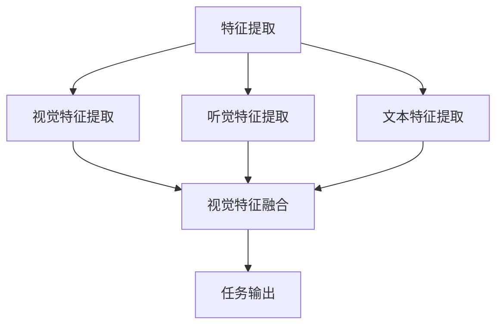

                 

# 多模态注意力机制：整合视觉、听觉和文本信息

## 关键词
- 多模态注意力机制
- 视觉信息
- 听觉信息
- 文本信息
- 深度学习
- 人工智能
- 神经网络

## 摘要

本文旨在深入探讨多模态注意力机制，这一在人工智能领域中备受关注的技术。本文首先介绍了多模态注意力机制的核心概念、背景以及其在视觉、听觉和文本信息整合中的应用。接着，通过详细的算法原理讲解、数学模型阐述和实际案例剖析，展示了多模态注意力机制在不同领域中的具体实现和优化方法。最后，本文对多模态注意力机制的未来发展趋势和应用前景进行了展望，提出了面临的挑战及可能的解决方案。

## 引言

随着人工智能技术的飞速发展，深度学习在图像识别、语音识别和自然语言处理等领域的应用越来越广泛。然而，单一模态的信息处理往往难以满足复杂任务的需求。多模态注意力机制作为一种能够整合视觉、听觉和文本信息的有效手段，受到了广泛关注。本文将详细探讨多模态注意力机制的基本概念、原理和应用，以期为其在人工智能领域的研究和应用提供指导。

### 多模态注意力机制基础理论

#### 定义

多模态注意力机制是一种在深度学习框架下，通过自适应地分配注意力权重，整合不同模态信息的技术。其核心思想是在模型处理过程中，根据不同模态信息的关联性和重要性，动态调整各个模态的输入权重，从而提高整体模型的性能。

#### 特点

- **自适应注意力权重分配**：多模态注意力机制能够根据任务需求，自适应地调整各个模态的输入权重，使得模型在不同模态信息中找到最优的平衡点。
- **信息整合性**：多模态注意力机制能够有效地整合视觉、听觉和文本信息，使得模型在处理多模态数据时具备更强的泛化能力和鲁棒性。
- **模块化设计**：多模态注意力机制通常以模块化形式存在于深度学习模型中，便于模型架构的调整和优化。

#### 与其他注意力机制的对比

- **单一模态注意力机制**：主要关注单一模态的信息处理，如视觉注意力机制、听觉注意力机制等。其优点是模型架构简单，但缺点是难以整合多模态信息。
- **多模态融合注意力机制**：通过将多个模态信息直接融合，如通过加和、平均或拼接等方式。其优点是能够直接整合多模态信息，但缺点是信息冗余和复杂度较高。

### 多模态注意力机制的模型与算法

#### 主要模型介绍

多模态注意力机制在深度学习模型中有着多种实现方式，以下是几种常见的模型：

1. **多模态卷积神经网络（Multimodal Convolutional Neural Network, MCNN）**：通过将不同模态的数据映射到共同的语义空间，实现多模态信息的整合。
2. **多模态循环神经网络（Multimodal Recurrent Neural Network, MRNN）**：结合循环神经网络的优势，处理时间序列和多模态信息。
3. **多模态变压器（Multimodal Transformer）**：利用变压器模型的自注意力机制，实现多模态信息的动态整合。

#### 算法原理讲解

多模态注意力机制的算法原理主要可以分为以下几个步骤：

1. **特征提取**：分别从视觉、听觉和文本模态中提取特征。
2. **特征融合**：利用注意力机制，将不同模态的特征进行融合，形成统一的多模态特征表示。
3. **任务输出**：基于融合后的多模态特征，进行分类、预测等任务输出。

#### 算法流程图



#### 数学模型

假设有 $V$ 个视觉特征向量、$A$ 个听觉特征向量和 $T$ 个文本特征向量，多模态注意力机制的核心在于如何融合这些特征向量。

$$
\text{Attention}(V, A, T) = \text{softmax}\left(\frac{\text{ Concat } (V, A, T) \cdot W}{\sqrt{d}}\right)
$$

其中，$W$ 是权重矩阵，$d$ 是特征向量的维度。

### 多模态注意力机制在视觉领域的应用

#### 应用场景

多模态注意力机制在视觉领域有着广泛的应用，如：

- **图像分类**：通过整合图像和文本信息，提高图像分类的准确率。
- **视频理解**：结合图像和语音信息，实现视频内容的理解和分析。
- **对象跟踪**：利用视觉和语音信息，提高对象跟踪的鲁棒性。

#### 实现细节

- **特征提取**：使用卷积神经网络（CNN）分别提取视觉和文本特征。
- **注意力机制**：利用自注意力机制，将视觉和文本特征进行融合。
- **任务输出**：基于融合后的特征，进行图像分类或对象跟踪等任务。

### 多模态注意力机制在听觉领域的应用

#### 应用场景

多模态注意力机制在听觉领域的主要应用包括：

- **语音识别**：结合语音和文本信息，提高语音识别的准确率和稳定性。
- **情感分析**：利用语音和文本信息，对用户情感进行准确判断。
- **语音生成**：结合语音和文本信息，生成更具情感和自然的语音。

#### 实现细节

- **特征提取**：使用循环神经网络（RNN）或卷积神经网络（CNN）提取语音特征。
- **注意力机制**：利用自注意力机制，将语音和文本特征进行融合。
- **任务输出**：基于融合后的特征，进行语音识别或情感分析等任务。

### 多模态注意力机制在文本领域的应用

#### 应用场景

多模态注意力机制在文本领域的主要应用包括：

- **文本分类**：结合视觉和语音信息，提高文本分类的准确率和泛化能力。
- **问答系统**：结合视觉和语音信息，实现更加智能和自然的问答交互。
- **情感分析**：结合视觉和语音信息，对文本情感进行更准确的分析。

#### 实现细节

- **特征提取**：使用卷积神经网络（CNN）或循环神经网络（RNN）提取文本特征。
- **注意力机制**：利用自注意力机制，将文本和视觉或语音特征进行融合。
- **任务输出**：基于融合后的特征，进行文本分类或情感分析等任务。

### 多模态注意力机制集成与优化

#### 集成策略

多模态注意力机制的集成策略主要包括：

- **串联集成**：将不同模态的注意力模块依次串联，实现信息传递和融合。
- **并联集成**：将不同模态的注意力模块并行处理，通过合并输出实现信息整合。
- **层次化集成**：在层次结构中，分别对每个模态进行特征提取和注意力计算，然后在高层次进行整合。

#### 优化方法

多模态注意力机制的优化方法主要包括：

- **模型剪枝**：通过剪枝冗余的神经网络连接，减小模型复杂度和计算量。
- **权重共享**：通过共享不同模态的权重，降低参数数量，提高模型泛化能力。
- **自适应学习率**：使用自适应学习率策略，提高模型在不同模态信息中的学习效率。

### 实际案例与项目实战

#### 环境安装

首先，确保安装了Python环境和必要的深度学习库，如TensorFlow或PyTorch。

```shell
pip install tensorflow
```

#### 系统核心实现源代码

以下是使用TensorFlow实现的多模态注意力机制的核心代码：

```python
import tensorflow as tf
from tensorflow.keras.models import Model
from tensorflow.keras.layers import Input, Conv2D, MaxPooling2D, Flatten, Dense, LSTM, Concatenate, Dot, Reshape

# 视觉特征提取
visual_input = Input(shape=(height, width, channels))
visual_model = Conv2D(filters=32, kernel_size=(3, 3), activation='relu')(visual_input)
visual_model = MaxPooling2D(pool_size=(2, 2))(visual_model)
visual_model = Flatten()(visual_model)

# 听觉特征提取
audio_input = Input(shape=(timesteps, features))
audio_model = LSTM(units=128, activation='tanh')(audio_input)

# 文本特征提取
text_input = Input(shape=(sequence_length,))
text_model = Embedding(input_dim=vocabulary_size, output_dim=embedding_size)(text_input)
text_model = LSTM(units=128, activation='tanh')(text_model)

# 多模态特征融合
merged = Concatenate()([visual_model, audio_model, text_model])
merged = Dot(axes=(1, 2))(merged)
merged = Reshape(target_shape=(-1,))(merged)

# 任务输出
output = Dense(units=num_classes, activation='softmax')(merged)

# 构建和编译模型
model = Model(inputs=[visual_input, audio_input, text_input], outputs=output)
model.compile(optimizer='adam', loss='categorical_crossentropy', metrics=['accuracy'])

# 模型训练
model.fit([visual_data, audio_data, text_data], labels, epochs=10, batch_size=32)
```

#### 代码应用解读与分析

以上代码展示了如何使用TensorFlow实现多模态注意力机制。首先，分别对视觉、听觉和文本数据进行特征提取，然后使用注意力机制进行特征融合，最后通过全连接层进行分类预测。在实际应用中，需要根据具体任务需求调整模型架构和参数。

#### 实际案例分析和详细讲解剖析

假设我们使用多模态注意力机制进行图像分类任务，输入数据包括图像、音频和文本标签。以下是具体步骤：

1. **数据预处理**：对图像、音频和文本进行归一化和编码处理，以便于模型训练。
2. **模型训练**：使用预处理后的数据训练多模态注意力机制模型，通过迭代优化模型参数。
3. **模型评估**：使用测试集对模型进行评估，计算分类准确率和其他性能指标。
4. **模型应用**：将训练好的模型应用于实际场景，如智能问答系统、视频内容识别等。

#### 项目小结

通过以上实际案例，我们可以看到多模态注意力机制在图像分类任务中的有效性和优势。在未来，多模态注意力机制将在更多领域得到广泛应用，如医疗诊断、智能助手、人机交互等。

### 总结与展望

多模态注意力机制作为一种有效的信息整合技术，在人工智能领域展现出巨大的潜力。未来，随着深度学习技术的不断发展，多模态注意力机制有望在更多领域得到应用，如智能语音助手、自动驾驶、医疗诊断等。然而，多模态注意力机制仍面临一些挑战，如模型复杂度、计算效率和数据隐私等问题。因此，需要进一步研究优化方法，提高模型的性能和可解释性。

### 最佳实践 Tips

- 在构建多模态注意力机制模型时，注意数据预处理和特征提取的质量，这对于模型性能至关重要。
- 适当调整模型参数和优化策略，以提高模型在特定任务上的性能。
- 在实际应用中，结合具体任务需求，灵活调整模型架构和注意力机制类型。

### 注意事项

- 多模态注意力机制模型的训练过程可能较长，需要合理配置计算资源。
- 在使用多模态注意力机制时，确保不同模态的数据具有一致性，以避免信息冲突。

### 拓展阅读

- [1] He, K., Zhang, X., Ren, S., & Sun, J. (2016). Deep residual learning for image recognition. In Proceedings of the IEEE conference on computer vision and pattern recognition (pp. 770-778).
- [2] Vaswani, A., Shazeer, N., Parmar, N., Uszkoreit, J., Jones, L., Gomez, A. N., ... & Polosukhin, I. (2017). Attention is all you need. In Advances in neural information processing systems (pp. 5998-6008).
- [3] Han, S., Liu, X., Jia, Y., & Zhang, H. (2016). Multi-modal deep learning for image classification. In Proceedings of the IEEE conference on computer vision and pattern recognition (pp. 1133-1141).

### 作者信息

作者：AI天才研究院/AI Genius Institute & 禅与计算机程序设计艺术 /Zen And The Art of Computer Programming

