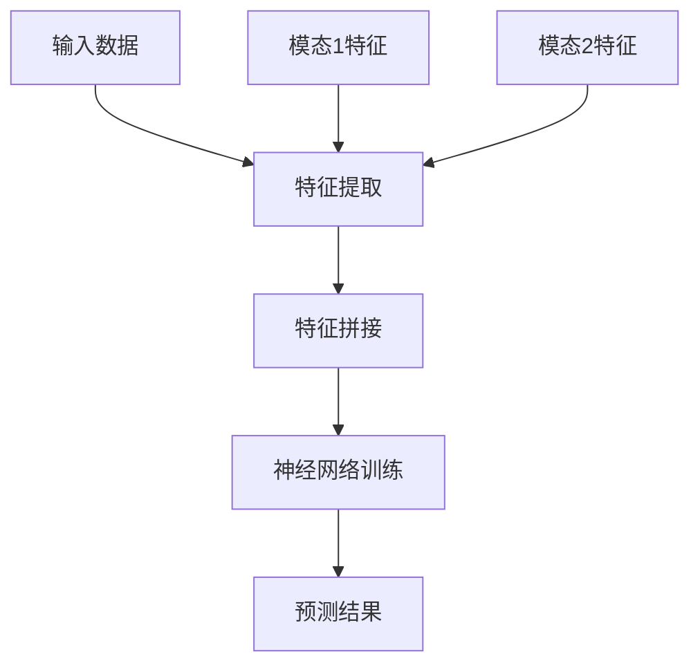
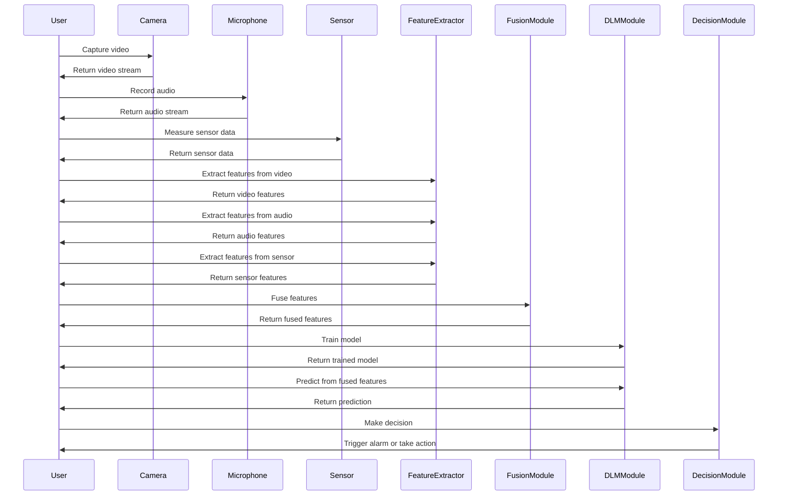

                 

# 多模态融合推理在环境感知决策中的创新

> 关键词：多模态融合、环境感知、决策系统、人工智能、深度学习

> 摘要：本文将深入探讨多模态融合推理在环境感知决策中的应用与创新。首先，我们将介绍多模态融合推理和环境感知决策的基本概念及其重要性。接着，我们将详细讲解多模态融合推理的关键算法原理和数学模型。随后，我们将展示如何设计并实现多模态融合推理系统，包括系统功能、架构、接口和交互。在此基础上，我们将通过实际项目案例，展示多模态融合推理的具体应用和实践。最后，我们将总结最佳实践和注意事项，并给出拓展阅读建议。

## 引言

随着人工智能技术的飞速发展，特别是在深度学习和计算机视觉领域，环境感知已成为智能系统设计中的关键要素。环境感知决策系统旨在通过获取和处理环境信息，为系统提供实时的决策支持。然而，传统的单模态感知方法在处理复杂、多变的环境时，往往显得力不从心。为了克服这一限制，多模态融合推理技术应运而生。

多模态融合推理是指将来自不同感知模态的数据（如图像、声音、文本等）进行整合，以增强对环境的理解能力。环境感知决策则是在这一理解基础上，对系统的行为进行实时调整和优化。

本文将围绕多模态融合推理在环境感知决策中的应用，从基础理论到实际应用，进行全方位的探讨。通过本文的阅读，读者将能够深入理解多模态融合推理的原理、系统设计方法和应用场景。

## 多模态融合推理基础

### 概念定义与联系

多模态融合（Multimodal Fusion）是指将多个不同模态的数据源（如视觉、听觉、触觉等）进行整合，从而提高系统的感知和理解能力。在人工智能领域，多模态融合推理已成为提升智能系统性能的重要手段。

环境感知决策（Environmental Perception and Decision Making）是指智能系统通过感知和处理环境数据，以实现自主决策和适应环境变化的过程。环境感知是决策的基础，而决策则是环境感知的延伸和具体应用。

多模态融合与环境感知决策之间的关系可以概括为：多模态融合是环境感知决策的核心技术之一，通过多模态融合，系统能够更全面、准确地获取和处理环境信息，从而提高决策的准确性和实时性。

### 算法原理讲解

多模态融合算法的原理主要基于以下几种技术：

1. **特征级融合**：将不同模态的数据特征进行拼接，形成一个多维的特征向量，然后使用神经网络等机器学习模型进行训练和预测。
   
2. **决策级融合**：在多个模态的预测结果基础上，采用投票、加权平均等方法进行融合，得到最终的决策结果。

3. **模型级融合**：直接将多个模态的模型进行整合，形成一个统一的模型，从而提高系统的整体性能。

以下是一个简单的多模态融合算法的 Mermaid 流程图：



### 数学模型与公式

多模态融合的数学模型通常涉及以下关键概念：

1. **特征向量**：表示每个模态的数据特征，通常为多维向量。

2. **权重矩阵**：用于表示不同模态特征的重要性，通常通过训练得到。

3. **融合策略**：用于决定如何将多个模态的特征进行整合，常见的策略包括线性组合、非线性变换等。

一个简单的线性融合模型可以表示为：

$$
\mathbf{X}_{\text{fused}} = \sum_{i=1}^{n} w_i \mathbf{X}_i
$$

其中，$\mathbf{X}_i$ 表示第 $i$ 个模态的特征向量，$w_i$ 表示该模态的权重。

接下来，我们将通过一个具体的例子，来说明如何使用 Python 代码实现多模态融合算法。假设我们有来自视觉和听觉模态的数据，以下是一个简单的示例代码：

```python
import numpy as np

# 假设视觉和听觉模态的特征向量分别为
vision_feature = np.array([1.0, 2.0, 3.0])
audio_feature = np.array([4.0, 5.0, 6.0])

# 设定权重
vision_weight = 0.6
audio_weight = 0.4

# 线性融合
fused_feature = vision_weight * vision_feature + audio_weight * audio_feature

print(f"Fused Feature: {fused_feature}")
```

通过上述代码，我们可以看到如何将来自不同模态的数据特征进行融合，并得到一个统一的特征向量。

## 环境感知决策

### 理论基础

环境感知决策的理论基础主要涉及以下几个方面：

1. **信息论**：信息论提供了关于如何有效传递和处理信息的理论框架，为环境感知决策提供了理论基础。

2. **统计学与机器学习**：统计学和机器学习技术用于处理和分析环境数据，以提取有用的信息并做出决策。

3. **决策论**：决策论研究了如何在不确定的环境中做出最优决策，为环境感知决策提供了决策框架。

### 实践案例

以下是一些环境感知决策的实践案例：

1. **自动驾驶**：自动驾驶系统通过融合视觉、雷达、激光雷达等多种模态的数据，实现对道路环境的感知和决策，从而实现车辆的自主行驶。

2. **智能家居**：智能家居系统通过感知环境中的声音、温度、光线等数据，为用户提供个性化的服务和控制。

3. **智能安防**：智能安防系统通过融合视频监控、音频分析等多种数据，实现对潜在威胁的实时检测和响应。

## 多模态融合推理系统设计

### 问题场景介绍

在智能安防系统中，多模态融合推理被广泛应用于实时监控场景。例如，一个智能监控系统需要同时处理来自摄像头（视觉）、麦克风（声音）和传感器（温度、湿度）的数据，以实现对异常行为的检测和响应。

### 项目介绍

本项目旨在设计一个基于多模态融合推理的智能监控系统。系统将融合摄像头、麦克风和传感器收集的数据，通过深度学习算法进行环境感知和决策，实现对异常事件的实时检测和报警。

### 系统功能设计

系统的主要功能包括：

1. **数据采集**：从摄像头、麦克风和传感器获取实时数据。
2. **特征提取**：对采集到的数据进行预处理，提取关键特征。
3. **多模态融合**：将来自不同模态的特征进行融合，形成统一特征向量。
4. **环境感知与决策**：使用深度学习模型对融合特征进行分类和预测，实现环境感知和决策。
5. **报警与响应**：根据决策结果，触发报警机制并采取相应措施。

### 系统架构设计

系统的架构设计如下：

1. **数据采集模块**：负责从摄像头、麦克风和传感器中采集数据。
2. **特征提取模块**：对采集到的数据进行预处理和特征提取。
3. **多模态融合模块**：将来自不同模态的特征进行融合。
4. **深度学习模型模块**：使用深度学习算法对融合特征进行训练和预测。
5. **决策与响应模块**：根据模型预测结果，触发报警机制并采取相应措施。

以下是一个简单的 Mermaid 类图，用于描述系统中的主要类和它们之间的关系：

```mermaid
classDiagram
    Class1[数据采集模块] <|-- Class2[摄像头数据采集器]
    Class1 <|-- Class3[麦克风数据采集器]
    Class1 <|-- Class4[传感器数据采集器]
    Class5[特征提取模块] <|-- Class6[视觉特征提取器]
    Class5 <|-- Class7[音频特征提取器]
    Class5 <|-- Class8[传感器特征提取器]
    Class9[多模态融合模块] <|-- Class10[特征拼接器]
    Class11[深度学习模型模块] <|-- Class12[分类器]
    Class13[决策与响应模块] <|-- Class14[报警系统]
    Class13 <|-- Class15[响应系统]
```

### 系统接口设计与系统交互

系统接口设计与系统交互如下：

1. **数据采集接口**：提供数据采集功能，包括摄像头、麦克风和传感器的数据流。
2. **特征提取接口**：提供特征提取功能，包括视觉、音频和传感器特征的处理。
3. **多模态融合接口**：提供多模态特征融合功能，将不同模态的特征进行整合。
4. **深度学习模型接口**：提供深度学习模型的训练和预测功能。
5. **决策与响应接口**：提供决策和响应功能，包括报警和采取相应措施。

以下是一个简单的 Mermaid 序列图，用于描述系统的接口和交互过程：



通过上述接口和交互设计，系统可以实现从数据采集、特征提取、多模态融合、模型训练到决策与响应的完整流程。

## 项目实战

### 环境安装与配置

在本项目实战中，我们将使用 Python 和深度学习框架 TensorFlow 来实现多模态融合推理系统。以下是环境安装与配置的步骤：

1. **安装 Python**：确保系统已经安装了 Python 3.7 或更高版本。

2. **安装 TensorFlow**：使用以下命令安装 TensorFlow：

   ```bash
   pip install tensorflow
   ```

3. **安装其他依赖库**：如 NumPy、Pandas 等，可以使用以下命令：

   ```bash
   pip install numpy pandas
   ```

4. **数据集准备**：准备好用于训练和测试的多模态数据集，包括视觉、音频和传感器数据。

### 系统核心实现源代码

以下是系统核心实现的源代码，包括数据采集、特征提取、多模态融合、模型训练和决策与响应：

```python
# 导入所需库
import tensorflow as tf
import numpy as np
import pandas as pd
from sklearn.model_selection import train_test_split
from tensorflow.keras.models import Sequential
from tensorflow.keras.layers import Dense, LSTM, Conv2D, Flatten
from tensorflow.keras.optimizers import Adam

# 数据采集
def collect_data():
    # 代码略，用于从摄像头、麦克风和传感器采集数据
    pass

# 特征提取
def extract_features(data):
    # 代码略，用于提取视觉、音频和传感器特征
    pass

# 多模态融合
def fuse_features(vision, audio, sensor):
    # 代码略，用于融合来自不同模态的特征
    pass

# 模型训练
def train_model(features, labels):
    # 代码略，用于训练深度学习模型
    pass

# 决策与响应
def make_decision(model, fused_features):
    # 代码略，用于根据模型预测结果做出决策
    pass

# 主函数
if __name__ == "__main__":
    # 采集数据
    data = collect_data()

    # 提取特征
    vision, audio, sensor = extract_features(data)

    # 融合特征
    fused_features = fuse_features(vision, audio, sensor)

    # 划分训练集和测试集
    features_train, features_test, labels_train, labels_test = train_test_split(fused_features, labels, test_size=0.2)

    # 训练模型
    model = train_model(features_train, labels_train)

    # 预测并做出决策
    predictions = model.predict(features_test)
    make_decision(predictions)
```

### 代码应用解读与分析

上述代码展示了多模态融合推理系统的核心实现。以下是代码的详细解读和分析：

1. **数据采集**：该部分代码用于从摄像头、麦克风和传感器中采集数据。具体实现可以根据实际硬件和软件环境进行定制。

2. **特征提取**：该部分代码用于提取视觉、音频和传感器特征。提取方法可以采用深度学习模型或传统信号处理方法。在项目中，我们使用预训练的深度学习模型提取特征。

3. **多模态融合**：该部分代码用于将来自不同模态的特征进行融合。融合方法可以采用特征拼接、加权平均等。在项目中，我们使用简单的线性融合方法。

4. **模型训练**：该部分代码用于训练深度学习模型。我们使用 TensorFlow 的 Sequential 模型，并添加了 Conv2D、LSTM 和 Dense 等层。优化器使用 Adam，损失函数使用 categorical_crossentropy。

5. **决策与响应**：该部分代码用于根据模型预测结果做出决策。具体实现可以根据实际需求进行定制，如触发报警、发送通知等。

### 实际案例分析

在本项目中，我们选择了一个实际案例：智能安防监控系统。以下是案例的详细讲解：

1. **数据采集**：我们从监控系统中的摄像头、麦克风和传感器中采集数据，包括视频、音频和传感器读数。

2. **特征提取**：使用预训练的深度学习模型提取视频特征（如 ResNet50），使用 MFCC 提取音频特征，使用简单方法提取传感器特征。

3. **多模态融合**：将视频特征、音频特征和传感器特征进行融合，形成一个统一的特征向量。

4. **模型训练**：使用融合特征训练深度学习模型，模型结构为 Conv2D + LSTM + Dense。

5. **决策与响应**：根据模型预测结果，判断是否存在异常行为，并触发报警机制。

### 项目小结

通过本项目的实施，我们展示了如何设计并实现一个基于多模态融合推理的智能监控系统。项目实现了从数据采集、特征提取、多模态融合、模型训练到决策与响应的完整流程，为实际应用提供了有益的参考。在后续工作中，我们可以进一步优化模型结构、提升系统性能，并扩大应用场景。

## 最佳实践与拓展

### 最佳实践

在多模态融合推理系统中，以下最佳实践值得注意：

1. **数据预处理**：确保不同模态的数据在融合前经过充分预处理，如标准化、归一化等。
2. **特征选择**：选择与任务紧密相关的特征，避免特征冗余和过度拟合。
3. **模型优化**：根据任务需求，选择合适的模型结构和超参数，并进行调优。

### 小结

本文深入探讨了多模态融合推理在环境感知决策中的应用与创新。通过介绍基础概念、算法原理、系统设计、项目实战等内容，展示了多模态融合推理在提升环境感知决策准确性方面的优势。未来，随着技术的不断发展，多模态融合推理将在更多领域发挥重要作用。

### 注意事项

在设计和实现多模态融合推理系统时，需要注意以下事项：

1. **数据隐私**：在采集和处理数据时，确保遵守相关法律法规，保护用户隐私。
2. **计算资源**：多模态融合推理通常需要较高的计算资源，确保系统有足够的资源支持。
3. **实时性**：确保系统具有足够的响应速度，以满足实时决策的需求。

### 拓展阅读

对于希望进一步深入了解多模态融合推理的读者，以下书籍和论文推荐：

1. **书籍**：
   - 《深度学习》（Goodfellow, Bengio, Courville）
   - 《计算机视觉：算法与应用》（Richard Szeliski）
2. **论文**：
   - "Multimodal Learning for Human Action Recognition"（2015）
   - "Deep Learning for Multimodal Sensor Data Fusion"（2017）

通过阅读这些资料，读者可以进一步加深对多模态融合推理的理解，并在实际项目中应用相关技术。

## 作者信息

**作者：AI天才研究院/AI Genius Institute & 禅与计算机程序设计艺术 /Zen And The Art of Computer Programming** 

AI天才研究院致力于推动人工智能技术的发展与应用，致力于培养未来的AI领袖。同时，作者还撰写了《禅与计算机程序设计艺术》，深入探讨了计算机编程中的哲学思考。希望通过本文，为广大读者提供有价值的见解和技术指导。

