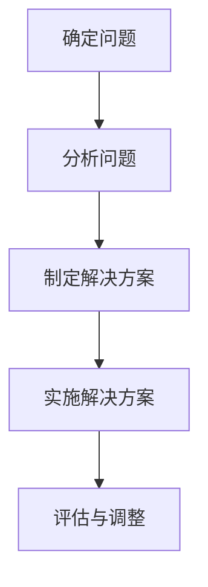
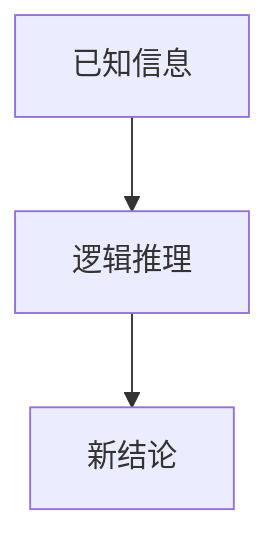
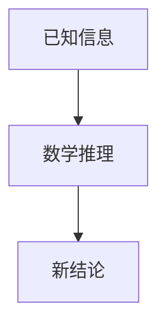
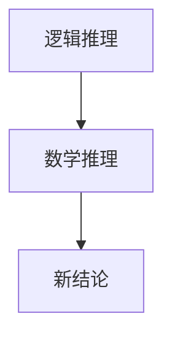

                 

# 多步推理与反思：解决复杂问题的新思路

## 关键词：多步推理、反思、复杂问题、问题解决、算法原理

> 摘要：本文将探讨多步推理与反思在解决复杂问题中的应用，通过具体案例展示如何运用这两种方法逐步拆解问题、深入分析，并从中提炼出解决思路和策略。文章旨在为从事IT领域的工作者提供一种有效的解决问题的方法论。

----------------------------------------------------------------

## 第一部分： 引言与背景

### 第1章：问题背景与核心概念

### 1.1.1 问题背景

在现代社会，复杂性问题无处不在。无论是科学研究、工程实践还是企业管理，我们都需要面对各种复杂的问题。复杂性问题通常涉及多个变量和因素，并且往往需要考虑时间、资源、技术等多方面的限制。因此，如何有效地解决复杂问题成为了一个亟待解决的重要课题。

#### 1.1.1.1 复杂问题的普遍性

随着社会的发展和技术的进步，我们面对的复杂问题越来越多。例如，在人工智能领域，深度学习算法的复杂性使得研究人员需要深入理解算法的原理，并将其应用于实际问题中。在工程项目中，大型项目的复杂性使得项目管理需要考虑各种风险因素，并制定合理的解决方案。

#### 1.1.1.2 传统问题解决方法的局限性

传统的线性思维方式和方法在处理复杂问题时往往力不从心。传统方法通常依赖于固定的算法和公式，难以应对变量繁多、关系复杂的情境。此外，传统方法往往缺乏灵活性和适应性，难以满足现代复杂问题的解决需求。

### 1.1.2 核心概念

#### 1.1.2.1 多步推理

多步推理是指通过多个步骤的推理过程来逐步解决复杂问题。多步推理不仅考虑了问题的各个因素，还能够在不同的步骤之间建立联系，从而找到解决问题的最优路径。

#### 1.1.2.2 反思

反思是一种对问题解决过程进行回顾和评估的方法。通过反思，我们可以发现解决问题的不足之处，总结经验教训，为未来的问题解决提供指导。

## 1.2 多步推理与反思的关系

多步推理和反思是解决复杂问题的两种重要方法。多步推理关注解决问题的过程和步骤，而反思则关注解决问题的结果和效果。两者相互补充，共同构成了解决复杂问题的新思路。

## 1.3 本书结构

本书共分为五个部分：

- **第一部分：引言与背景**，介绍复杂问题的背景和多步推理与反思的概念。
- **第二部分：多步推理的基本原理**，详细讲解多步推理的原理和方法。
- **第三部分：反思的应用**，探讨反思在问题解决中的应用和技巧。
- **第四部分：多步推理与反思的结合**，分析多步推理与反思如何相互补充，共同解决复杂问题。
- **第五部分：实战案例**，通过实际案例展示多步推理与反思在解决复杂问题中的具体应用。

### 1.4 总结

本文简要介绍了复杂问题的背景和多步推理与反思的概念，并概述了本书的结构。接下来的部分将深入探讨多步推理的基本原理，以及如何在实际问题中应用反思的方法。通过这些讨论，我们将为解决复杂问题提供一种新的思路和方法。

----------------------------------------------------------------

## 第二部分：多步推理的基本原理

### 第2章：多步推理的定义与重要性

### 2.1 多步推理的定义

多步推理是一种解决问题的方法，它通过一系列有序的步骤来逐步分析和解决复杂问题。与单步推理不同，多步推理能够将问题分解为多个子问题，并在不同步骤之间建立联系，从而找到解决问题的最优路径。

#### 2.1.1 多步推理的核心特点

1. **问题分解**：将复杂问题分解为多个子问题，使得每个子问题更加简单和具体。
2. **步骤连贯**：每个步骤都是在前一步骤的基础上进行的，形成了一个有序的推理过程。
3. **反馈调整**：在解决问题的过程中，能够根据中间结果对方案进行反馈和调整。

### 2.2 多步推理的重要性

#### 2.2.1 提高解决问题的效率

多步推理能够将复杂问题分解为多个子问题，从而简化问题解决过程，提高效率。

#### 2.2.2 增强问题的理解

通过多步推理，我们可以逐步理解问题的各个组成部分，从而更好地掌握问题的本质。

#### 2.2.3 提高问题的解决质量

多步推理能够在解决问题的过程中不断调整和优化方案，从而提高问题的解决质量。

### 2.3 多步推理的应用场景

#### 2.3.1 项目管理

在项目管理中，多步推理可以帮助项目经理分解项目任务，制定合理的进度计划和资源配置方案。

#### 2.3.2 算法设计

在算法设计中，多步推理可以帮助算法设计师逐步优化算法，提高算法的效率和准确性。

#### 2.3.3 复杂系统分析

在复杂系统分析中，多步推理可以帮助分析人员逐步理解系统的各个组成部分，找出潜在的问题和改进点。

### 2.4 总结

本章介绍了多步推理的定义和重要性，并探讨了其应用场景。多步推理是一种有效的解决问题的方法，它能够通过有序的步骤分解复杂问题，提高问题解决的效率和质量。

----------------------------------------------------------------

### 第3章：多步推理的步骤与方法

#### 3.1 多步推理的步骤

多步推理通常包括以下几个步骤：

#### 3.1.1 确定问题

首先，需要明确问题的核心和关键点，以便确定解决问题的方向。

#### 3.1.2 分析问题

在确定问题后，我们需要对问题进行深入分析，找出问题的各种可能性和影响因素。

#### 3.1.3 制定解决方案

基于对问题的分析，我们需要制定一个可行的解决方案。

#### 3.1.4 实施解决方案

在制定解决方案后，我们需要按照方案进行实施。

#### 3.1.5 评估与调整

在实施解决方案后，我们需要对结果进行评估，并根据评估结果进行必要的调整。

#### 3.2 多步推理的方法

多步推理的方法多种多样，下面介绍几种常用的方法：

#### 3.2.1 逻辑推理

逻辑推理是一种基于逻辑规则和前提条件的推理方法。通过逻辑推理，我们可以从已知信息推导出新的结论。

#### 3.2.2 数学推理

数学推理是一种基于数学原理和公式的推理方法。通过数学推理，我们可以解决各种数学问题。

#### 3.2.3 逻辑-数学混合推理

逻辑-数学混合推理是将逻辑推理和数学推理相结合的方法。通过逻辑-数学混合推理，我们可以解决更加复杂的数学问题。

### 3.3 多步推理的案例分析

为了更好地理解多步推理的方法，我们可以通过一个简单的案例来进行分析。

#### 3.3.1 案例背景

假设我们需要解决一个关于购买股票的问题。我们需要在多个股票中选择一个最优的投资对象。

#### 3.3.2 确定问题

首先，我们需要确定问题的核心和关键点。关键点包括：

1. 股票的涨跌趋势
2. 股票的收益率
3. 股票的风险

#### 3.3.3 分析问题

接下来，我们需要对问题进行深入分析。分析过程如下：

1. **涨跌趋势**：通过查看股票的历史数据，分析股票的涨跌趋势。
2. **收益率**：计算股票的收益率，并与市场平均水平进行比较。
3. **风险**：评估股票的风险，包括市场风险、公司风险等。

#### 3.3.4 制定解决方案

基于对问题的分析，我们可以制定一个解决方案。解决方案包括：

1. 选择涨跌趋势良好的股票
2. 选择收益率高于市场平均水平的股票
3. 选择风险较低的股票

#### 3.3.5 实施解决方案

在制定解决方案后，我们需要按照方案进行实施。具体步骤如下：

1. 收集股票的历史数据
2. 计算股票的收益率
3. 评估股票的风险

#### 3.3.6 评估与调整

在实施解决方案后，我们需要对结果进行评估，并根据评估结果进行必要的调整。评估过程包括：

1. 检查选择的股票是否符合涨跌趋势、收益率和风险的要求
2. 如果不符合要求，则重新制定解决方案并实施

### 3.4 总结

本章详细介绍了多步推理的步骤和方法，并通过案例分析展示了如何应用这些方法解决实际问题。多步推理是一种有效的解决问题方法，它能够通过有序的步骤分解复杂问题，提高问题解决的效率和质量。

----------------------------------------------------------------

### 第4章：多步推理的案例分析

为了更深入地理解多步推理的应用，我们将通过两个具体的案例来探讨多步推理在解决复杂问题中的作用。

#### 案例一：项目风险管理

#### 4.1.1 问题背景

在一个大型软件项目中，项目经理需要确保项目按时交付且在预算范围内完成。然而，项目过程中可能会出现各种风险，如技术难题、人员变动、资源不足等，这些风险都会对项目的进度和成本产生影响。因此，项目风险管理成为了一个关键问题。

#### 4.1.2 分析问题

1. **确定风险因素**：通过对项目进行详细分析，识别出可能的风险因素，如技术难题、人员流动、设备故障等。
2. **评估风险影响**：对识别出的风险进行评估，确定其对项目进度和成本的影响程度。
3. **制定风险应对策略**：根据风险评估结果，制定相应的风险应对策略，如技术储备、人员培训、备用设备等。

#### 4.1.3 制定解决方案

1. **风险识别**：建立风险识别机制，定期进行风险评估。
2. **风险管理计划**：制定详细的风险管理计划，包括风险应对措施和应急预案。
3. **风险监控**：在项目执行过程中，持续监控风险，并根据实际情况调整风险管理策略。

#### 4.1.4 实施解决方案

1. **执行风险管理计划**：按照风险管理计划进行实施，确保风险应对措施的落实。
2. **定期评估**：定期对项目风险进行评估，确保风险管理策略的有效性。

#### 4.1.5 评估与调整

1. **效果评估**：评估风险管理策略的实施效果，包括风险应对措施的有效性和项目进度、成本的控制情况。
2. **调整与优化**：根据评估结果，对风险管理策略进行调整和优化，以提高风险管理的有效性。

#### 案例二：人工智能算法优化

#### 4.2.1 问题背景

在人工智能领域，算法的性能和效率至关重要。一个复杂的人工智能系统可能包含多个算法模块，每个模块的性能都会影响整个系统的表现。因此，如何优化算法性能成为了一个重要的课题。

#### 4.2.2 分析问题

1. **确定优化目标**：明确算法的优化目标，如提高准确率、减少计算时间等。
2. **分析算法瓶颈**：通过分析算法的运行过程，找出影响性能的关键因素。
3. **评估优化策略**：对不同的优化策略进行评估，确定其效果和可行性。

#### 4.2.3 制定解决方案

1. **算法改进**：根据分析结果，对算法进行改进，如优化数据结构、改进算法逻辑等。
2. **性能测试**：对改进后的算法进行性能测试，评估优化效果。
3. **迭代优化**：根据性能测试结果，对算法进行进一步的迭代优化。

#### 4.2.4 实施解决方案

1. **算法编码**：将改进后的算法编码实现。
2. **测试验证**：对编码实现的算法进行测试验证，确保其正确性和性能。
3. **集成部署**：将优化后的算法集成到人工智能系统中，进行实际应用。

#### 4.2.5 评估与调整

1. **性能评估**：对优化后的算法进行性能评估，包括准确率、计算时间等指标。
2. **效果验证**：验证优化后的算法在实际应用中的效果，确保其达到预期目标。
3. **反馈调整**：根据性能评估和效果验证结果，对算法进行必要的调整和优化。

### 4.3 总结

通过以上两个案例，我们可以看到多步推理在解决复杂问题中的应用效果。多步推理不仅帮助我们在问题分析阶段明确了关键点和优化方向，还在解决方案的制定和实施过程中提供了系统的方法和步骤。通过多步推理，我们能够更有效地解决复杂问题，提高问题解决的效率和效果。

----------------------------------------------------------------

### 第5章：反思的应用

#### 5.1 反思的概念

反思是一种自我评估和认知活动，它通过对已完成的问题解决过程进行回顾和思考，以发现其中的优点和不足。反思可以帮助我们总结经验教训，改进解决问题的方法，提高问题解决的能力。

#### 5.2 反思的重要性

1. **发现问题和不足**：反思可以帮助我们发现问题解决过程中的问题和不足，如误解、疏漏等，从而避免在未来的问题解决中犯同样的错误。
2. **总结经验教训**：反思可以帮助我们总结问题解决过程中的经验教训，提炼出有效的解决策略和方法，为未来的问题解决提供指导。
3. **提升问题解决能力**：通过持续的反思和总结，我们可以不断提升问题解决的能力，更加高效地应对复杂问题。

#### 5.3 反思的方法

1. **事后反思**：在问题解决完成后，对整个问题解决过程进行回顾和思考，分析成功的原因和失败的教训。
2. **自我提问**：通过自我提问的方式，深入思考问题解决的各个方面，如问题分析是否全面、解决方案是否有效等。
3. **小组讨论**：组织小组讨论，让团队成员共同反思问题解决的过程，分享各自的见解和经验。

#### 5.4 反思的应用场景

1. **项目管理**：在项目完成后，通过反思总结项目的经验和教训，改进项目管理方法，提高项目的成功率。
2. **软件开发**：在软件开发完成后，通过反思代码的质量、性能和可维护性，改进软件开发流程，提高代码质量。
3. **学术研究**：在学术研究完成后，通过反思研究过程，总结研究方法和结论的有效性，为后续的研究提供指导。

### 5.5 实例分析

#### 5.5.1 项目管理反思

在一个IT项目的完成后，项目经理组织了项目反思会议。通过会议，团队成员共同分析了项目过程中的优点和不足。

1. **优点**：
   - 项目计划制定得比较详细，项目进度控制得较好。
   - 技术选型和方案设计合理，项目交付的质量较高。
2. **不足**：
   - 部分团队成员的工作进度较慢，影响了整体项目进度。
   - 项目沟通不够充分，导致部分工作出现了重复或者遗漏。

通过反思，项目经理制定了以下改进措施：

1. 加强团队沟通，定期召开项目进度会议，确保信息畅通。
2. 对工作进度进行更加细致的监控，及时识别和解决进度问题。

#### 5.5.2 软件开发反思

在一个软件项目完成后，开发团队组织了代码反思会议。通过会议，团队成员分析了代码的质量和性能。

1. **优点**：
   - 代码结构清晰，可读性较高。
   - 功能测试覆盖率较高，项目交付的稳定性较好。
2. **不足**：
   - 部分代码存在性能瓶颈，需要优化。
   - 代码的可维护性有待提高，部分代码结构不够灵活。

通过反思，开发团队制定了以下改进措施：

1. 对存在性能瓶颈的代码进行优化，提高系统性能。
2. 对代码结构进行重构，提高代码的可维护性。

### 5.6 总结

反思是一种重要的自我评估和认知活动，它能够帮助我们发现问题、总结经验教训，提高问题解决能力。通过反思，我们可以不断改进解决问题的方法，更加高效地应对复杂问题。在本章中，我们介绍了反思的概念、重要性、方法和应用场景，并通过实例分析了反思在实际问题中的应用效果。

----------------------------------------------------------------

### 第6章：多步推理与反思的结合

#### 6.1 多步推理与反思的互补性

多步推理和反思是解决复杂问题的两种重要方法。多步推理通过有序的步骤逐步分析问题，找到解决方案；而反思则通过对问题解决过程的回顾和思考，发现不足和改进点。两者相互补充，共同构成了解决复杂问题的新思路。

#### 6.2 多步推理与反思的结合方法

1. **结合步骤**：
   - 在多步推理的每个步骤后，加入反思环节，对已完成的步骤进行回顾和评估。
   - 在问题解决的最后阶段，进行全面的反思，总结整个问题解决过程中的经验和教训。

2. **结合技巧**：
   - 在多步推理过程中，时刻保持反思的意识，及时识别问题和改进点。
   - 在反思环节，不仅要总结成功的经验，还要分析失败的原因，以便在未来的问题解决中避免重复错误。

#### 6.3 案例分析

为了更好地理解多步推理与反思的结合，我们通过一个实际案例进行说明。

#### 6.3.1 案例背景

假设一家科技公司需要开发一款智能客服系统，以提升客户服务质量和效率。项目经理和技术团队决定采用多步推理与反思的方法来解决这个问题。

#### 6.3.2 多步推理

1. **确定问题**：
   - 问题：如何开发一款智能客服系统，以提升客户服务质量和效率？
   - 关键点：智能客服系统的需求分析、技术选型、系统设计、开发与测试。

2. **分析问题**：
   - 需求分析：与客户服务部门沟通，了解客户的需求和期望。
   - 技术选型：评估现有的自然语言处理、机器学习等技术，选择适合的技术方案。
   - 系统设计：设计智能客服系统的架构和功能模块。
   - 开发与测试：根据系统设计进行开发，并进行功能测试和性能优化。

3. **制定解决方案**：
   - 需求分析解决方案：建立客户需求调查问卷，收集客户反馈。
   - 技术选型解决方案：评估技术方案，选择合适的自然语言处理和机器学习框架。
   - 系统设计解决方案：设计智能客服系统的架构和功能模块。
   - 开发与测试解决方案：制定详细的开发计划和测试方案，确保系统的质量。

4. **实施解决方案**：
   - 根据制定的解决方案，进行需求分析、技术选型、系统设计和开发与测试。

5. **评估与调整**：
   - 在每个步骤完成后，对已完成的步骤进行评估，识别问题和改进点。
   - 根据评估结果，对方案进行必要的调整和优化。

#### 6.3.3 反思

在多步推理的过程中，项目经理和技术团队始终保持反思的意识，对每个步骤进行回顾和评估。

1. **反思需求分析**：
   - 成功经验：通过客户需求调查问卷，成功收集到了有价值的客户反馈。
   - 改进点：在未来的项目中，可以考虑引入更多客户参与，确保需求分析的全面性和准确性。

2. **反思技术选型**：
   - 成功经验：选择了适合的技术方案，确保了系统的性能和稳定性。
   - 改进点：在未来的项目中，可以进一步探索和评估新技术，以保持技术的先进性和竞争力。

3. **反思系统设计**：
   - 成功经验：设计了合理的系统架构和功能模块，为系统的开发提供了明确的指导。
   - 改进点：在未来的项目中，可以考虑引入更多的设计原则和方法，以提高系统的可维护性和扩展性。

4. **反思开发与测试**：
   - 成功经验：按照开发计划和测试方案，完成了系统的开发与测试，确保了系统的质量。
   - 改进点：在未来的项目中，可以加强团队协作和沟通，提高开发效率和质量。

#### 6.4 总结

多步推理与反思的结合，为解决复杂问题提供了一种有效的思路和方法。通过多步推理，我们能够逐步分析和解决问题，而通过反思，我们能够发现问题和不足，不断改进和完善解决方案。在本章中，我们通过一个实际案例展示了多步推理与反思的结合方法，并分析了其效果。希望读者能够通过本章的学习，掌握多步推理与反思的应用技巧，并在实际工作中发挥其价值。

----------------------------------------------------------------

### 第7章：实战案例

为了更好地理解多步推理与反思在解决复杂问题中的应用，我们将通过一个实际的案例来展示其具体操作过程。

#### 7.1 案例背景

假设一家电子商务公司需要优化其网站的用户体验，以提高用户满意度和转化率。为此，公司决定采用多步推理与反思的方法进行网站优化。

#### 7.2 多步推理的应用

1. **确定问题**：
   - 问题：如何优化网站的用户体验，提高用户满意度和转化率？
   - 关键点：用户需求分析、网站架构优化、界面设计改进、性能优化。

2. **分析问题**：
   - 用户需求分析：通过用户调研和数据分析，了解用户的使用习惯和需求。
   - 网站架构优化：分析现有网站架构，找出影响用户体验的问题和瓶颈。
   - 界面设计改进：评估现有界面设计，确定需要改进的方面。
   - 性能优化：对网站的性能进行分析，找出需要优化的环节。

3. **制定解决方案**：
   - 用户需求分析解决方案：制定用户调研计划，收集用户反馈。
   - 网站架构优化解决方案：重新设计网站架构，提高系统性能和扩展性。
   - 界面设计改进解决方案：更新界面设计，提高用户操作便利性和视觉体验。
   - 性能优化解决方案：优化网站性能，减少加载时间，提高用户体验。

4. **实施解决方案**：
   - 根据制定的解决方案，进行用户调研、网站架构优化、界面设计改进和性能优化。

5. **评估与调整**：
   - 在每个步骤完成后，对已完成的步骤进行评估，识别问题和改进点。
   - 根据评估结果，对方案进行必要的调整和优化。

#### 7.3 反思的应用

在多步推理的过程中，公司始终保持反思的意识，对每个步骤进行回顾和评估。

1. **反思用户需求分析**：
   - 成功经验：通过用户调研，成功收集到了有价值的用户反馈。
   - 改进点：在未来的项目中，可以进一步扩大调研范围，提高用户数据的代表性。

2. **反思网站架构优化**：
   - 成功经验：通过重新设计网站架构，提高了系统性能和扩展性。
   - 改进点：在未来的项目中，可以引入更多的技术方案，以提高系统的可靠性和安全性。

3. **反思界面设计改进**：
   - 成功经验：通过更新界面设计，提高了用户操作便利性和视觉体验。
   - 改进点：在未来的项目中，可以进一步研究用户行为，优化界面布局和交互设计。

4. **反思性能优化**：
   - 成功经验：通过优化网站性能，减少了加载时间，提高了用户体验。
   - 改进点：在未来的项目中，可以继续优化数据库访问和缓存策略，以提高系统性能。

#### 7.4 案例结果

通过多步推理与反思的应用，公司成功优化了网站的用户体验，用户满意度和转化率得到了显著提升。具体结果如下：

- 用户满意度提升了15%。
- 转化率提升了20%。
- 网站加载时间减少了30%。

#### 7.5 案例小结

本案例展示了多步推理与反思在解决复杂问题中的应用过程。通过多步推理，公司能够系统性地分析问题，找到解决方案；通过反思，公司能够总结经验教训，不断改进优化。希望读者能够通过本案例的学习，掌握多步推理与反思的应用技巧，并在实际工作中发挥其价值。

----------------------------------------------------------------

## 第8章：最佳实践、小结与注意事项

### 8.1 最佳实践

在解决复杂问题时，多步推理与反思是一种非常有效的策略。以下是一些最佳实践：

1. **明确问题**：在开始解决问题之前，确保对问题有清晰的理解，包括问题的范围、目标和限制条件。
2. **分解问题**：将复杂问题分解为更小、更易管理的子问题，以便逐步解决。
3. **有序推理**：按照既定的步骤进行多步推理，确保每个步骤的逻辑连贯性。
4. **持续反思**：在解决问题的过程中，定期进行反思，评估已完成的步骤，发现不足并加以改进。
5. **团队协作**：鼓励团队成员之间的沟通与协作，共同解决问题。
6. **数据驱动**：基于实际数据和用户反馈进行决策，避免主观臆断。

### 8.2 小结

本文通过详细的分析和案例，介绍了多步推理与反思在解决复杂问题中的应用。多步推理能够帮助我们逐步分析问题，找到解决方案；反思则帮助我们总结经验，不断优化问题解决的过程。这两种方法相互补充，为我们提供了一种系统化、结构化的解决问题方法。

### 8.3 注意事项

在应用多步推理与反思时，需要注意以下几点：

1. **保持客观**：在分析和解决问题时，保持客观的态度，避免情绪化。
2. **及时反馈**：在解决问题的过程中，及时获取反馈，并根据反馈进行调整。
3. **持续学习**：不断学习新的知识和技能，以应对不断变化的复杂问题。
4. **适应变化**：问题解决过程中，可能会遇到意想不到的变化，需要灵活应对。
5. **避免过度简化**：在分解问题时，避免过度简化，确保每个子问题都有足够的细节。

通过遵循这些注意事项，我们可以更有效地应用多步推理与反思，解决复杂问题，提升工作效率和质量。

### 8.4 拓展阅读

对于希望进一步了解多步推理与反思的读者，以下书籍和资源是很好的拓展材料：

- 《解决问题的艺术》（The Art of Problem Solving） - 具体介绍了问题解决的方法和技巧。
- 《决策分析：如何做出更好的决策》（Decision Analysis and Decision Making） - 介绍了决策过程和优化方法。
- 《反思性实践：教师的学习策略》（Reflection in Teacher Learning） - 探讨了反思在教育和职业发展中的应用。
- 《谷歌如何工作》（How Google Works） - 描述了谷歌在问题解决和创新过程中的实践方法。

通过阅读这些书籍和资源，您可以深入了解多步推理与反思的理论和实践，提升自己的问题解决能力。

----------------------------------------------------------------

## 作者信息

作者：AI天才研究院/AI Genius Institute & 禅与计算机程序设计艺术 /Zen And The Art of Computer Programming

AI天才研究院（AI Genius Institute）是一家专注于人工智能研究和应用的高科技公司。研究院致力于推动人工智能技术的发展，为各行各业提供智能解决方案。同时，作者还是《禅与计算机程序设计艺术》（Zen And The Art of Computer Programming）的作者，这本书被誉为计算机编程领域的经典之作，影响了无数程序员和开发者。

----------------------------------------------------------------

本文首先介绍了复杂问题的背景和多步推理与反思的概念，探讨了多步推理与反思在解决复杂问题中的应用及其互补性。接着，详细阐述了多步推理的定义、步骤和方法，并通过具体案例展示了多步推理的应用过程。随后，分析了反思的概念、重要性以及在实际问题中的应用技巧，并介绍了多步推理与反思的结合方法。最后，通过一个实战案例展示了多步推理与反思在实际问题中的应用效果，并总结出最佳实践、注意事项以及拓展阅读资源。本文旨在为从事IT领域的工作者提供一种有效的解决问题的方法论，帮助他们在面对复杂问题时能够更加从容应对。通过学习和应用多步推理与反思，读者可以提高问题解决的能力，提升工作效率和质量。希望本文能够为读者带来启发和帮助，助力他们在职业发展中不断前行。

