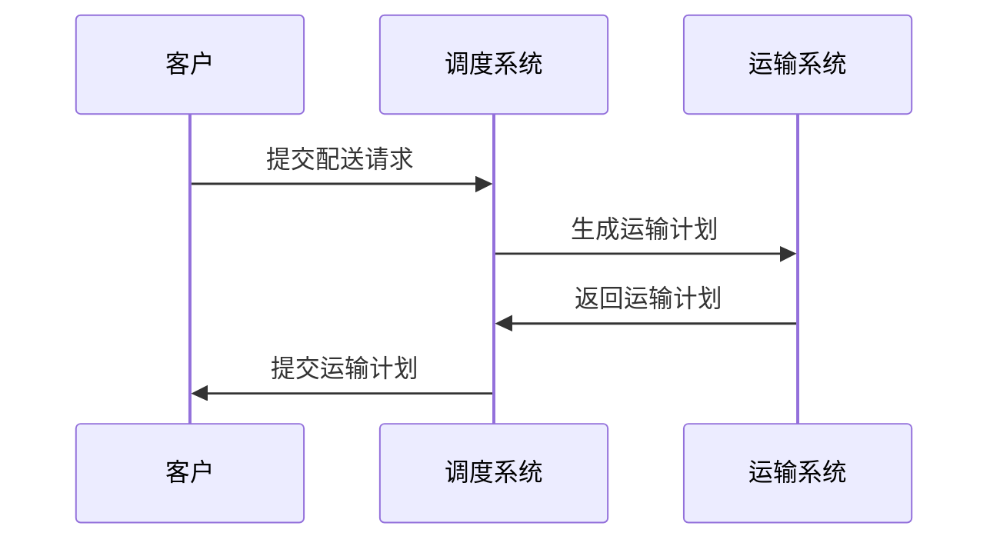
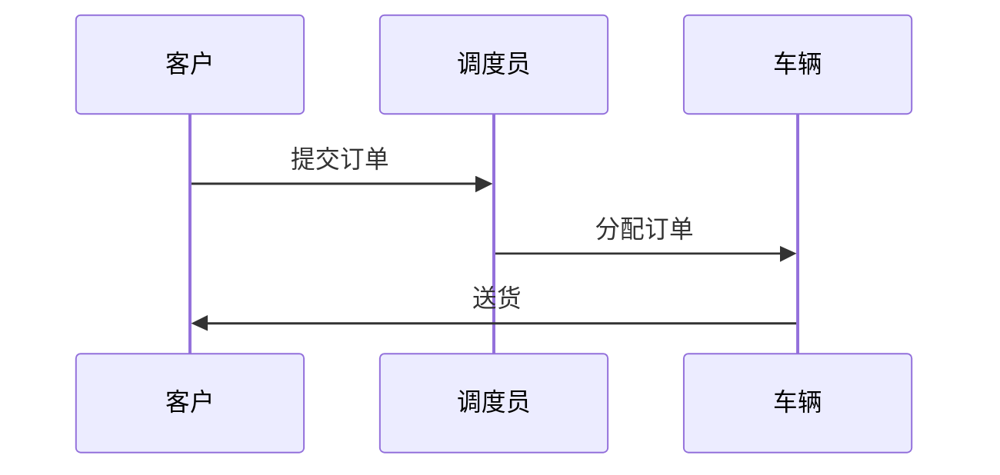
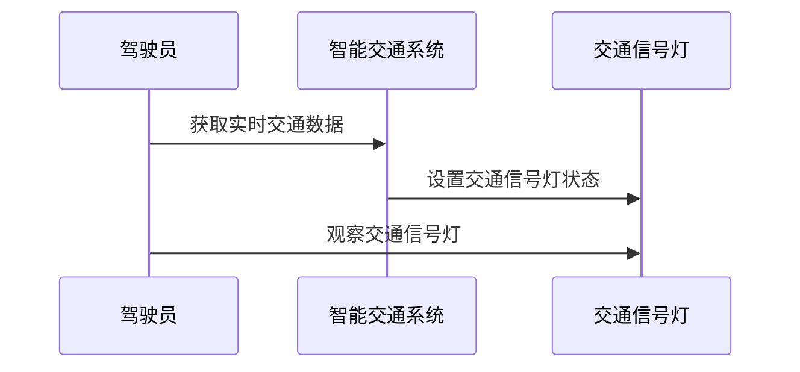
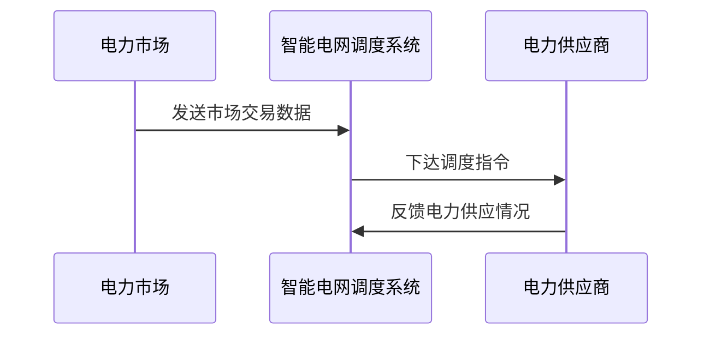
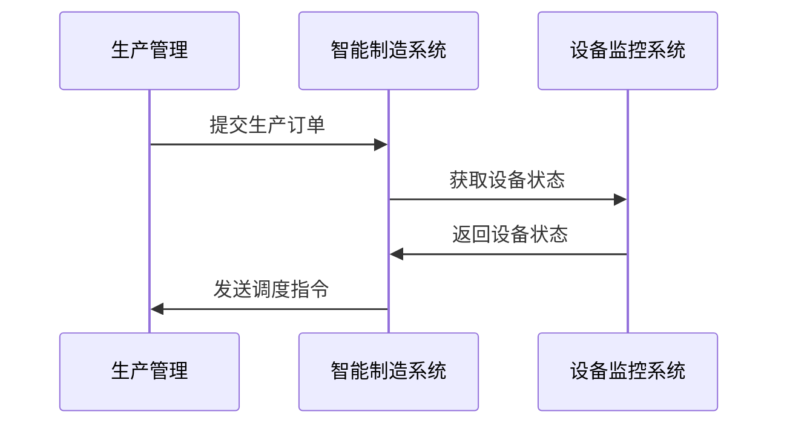
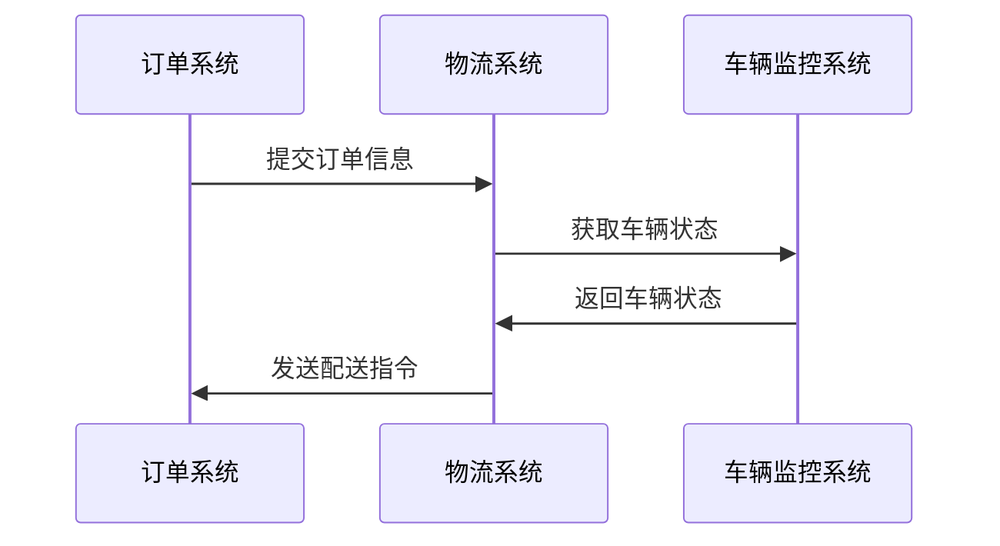

                 

### 4.1 算法概述

#### 4.1.1 多约束优化的基本概念

多约束优化是一种在多个约束条件下寻找最优解的问题。在多约束优化中，我们需要在满足所有约束条件的前提下，找到一个或多个目标函数的最大值或最小值。常见的多约束优化问题包括线性规划、非线性规划和动态规划等。

- **线性规划**：目标函数和约束条件都是线性函数的优化问题。
- **非线性规划**：目标函数和/或约束条件是非线性函数的优化问题。
- **动态规划**：在时间或序列上有依赖关系的多约束优化问题。

#### 4.1.2 多约束优化的挑战

多约束优化面临许多挑战，主要包括：

- **多目标优化**：在多个目标函数之间找到平衡点。
- **非线性约束**：非线性约束使得优化问题更加复杂。
- **离散与连续变量**：优化问题可能包含离散变量和连续变量，这增加了求解的复杂性。

### 4.2 算法原理讲解

#### 4.2.1 线性规划算法

**线性规划的标准形式**：
\[
\begin{aligned}
\text{minimize} \quad & c^T x \\
\text{subject to} \quad & Ax \leq b \\
& x \geq 0
\end{aligned}
\]

**单纯形法**：

1. **初始基本可行解**：选取变量形成初始基本可行解。
2. **迭代**：通过找到入基变量和出基变量，进行迭代，逐步逼近最优解。

**对偶单纯形法**：

对偶单纯形法是对单纯形法的改进，它利用对偶问题来优化迭代过程。

#### 4.2.2 非线性规划算法

**梯度下降法**：

1. **初始点选择**：选择一个初始点。
2. **迭代**：根据目标函数的梯度方向，逐步更新解。

**牛顿法**：

牛顿法是梯度下降法的改进，利用二阶导数来加速收敛。

**遗传算法**：

遗传算法是一种基于自然进化过程的优化算法，通过模拟自然选择和遗传机制来搜索最优解。

### 4.3 算法比较与选择

**各种算法的优点和缺点**：

- **单纯形法**：简单易用，但收敛速度较慢。
- **梯度下降法**：适用于凸函数，但可能陷入局部最优。
- **牛顿法**：收敛速度快，但要求目标函数可导。
- **遗传算法**：适用于复杂和非线性问题，但计算成本较高。

**选择策略**：

- **复杂度分析**：根据问题的规模和复杂性选择合适的算法。
- **精确度要求**：根据对解的精确度要求选择算法。
- **计算资源限制**：根据计算资源的限制选择合适的算法。

#### 4.3.2 选择策略

在选择多约束优化算法时，需要考虑以下几个因素：

1. **问题的规模和复杂性**：对于大规模和复杂的问题，可能需要选择更高效的算法。
2. **对解的精确度要求**：如果需要非常精确的解，可能需要选择收敛速度较快的算法。
3. **计算资源限制**：根据可用的计算资源和时间限制来选择合适的算法。
4. **算法的适应性**：对于不同的约束条件和目标函数，算法的适应性也是一个重要的考虑因素。

### 4.4 算法的实际应用

多约束优化算法在许多实际应用中都发挥着重要作用，以下是一些典型应用场景：

- **生产调度**：优化生产线的调度和资源分配。
- **物流规划**：优化物流路径和运输成本。
- **能源管理**：优化能源分配和消耗。
- **金融风险管理**：优化投资组合和风险控制。

#### 4.4.1 案例分析：生产调度问题

**问题背景**：某工厂需要安排生产计划，以便在满足生产需求和约束条件的情况下，最小化生产成本。

**问题描述**：给定生产任务、设备可用性、原材料供应等约束条件，确定生产任务的时间和资源分配。

**问题解决**：使用线性规划算法进行优化，通过构建目标函数和约束条件，求解最优生产计划。

**边界与外延**：生产调度问题可以扩展到多工厂和多产品的情况，考虑更多的约束条件和目标函数。

### 4.5 多约束优化算法的比较与选择

**算法对比分析**：

- **单纯形法**：简单易用，适用于线性规划问题，但收敛速度较慢。
- **梯度下降法**：适用于凸函数，收敛速度较快，但可能陷入局部最优。
- **牛顿法**：收敛速度快，但要求目标函数可导。
- **遗传算法**：适用于复杂和非线性问题，但计算成本较高。

**选择策略**：

- **复杂度分析**：根据问题的规模和复杂性选择合适的算法。
- **精确度要求**：根据对解的精确度要求选择算法。
- **计算资源限制**：根据计算资源的限制选择合适的算法。

### 4.6 多约束优化算法的案例分析

**案例介绍**：某物流公司需要优化运输路线，以减少运输成本和提高配送效率。

**案例分析**：

1. **问题场景介绍**：物流公司有多个配送中心和多个客户，需要确定最佳的运输路线。
2. **系统功能设计**：设计物流配送系统的功能模块，包括运输路线规划、成本计算和调度管理等。
3. **系统架构设计**：设计物流配送系统的架构，包括数据库、接口设计和后端服务。

**系统接口设计**：

**系统交互mermaid序列图**：

### 4.7 多约束优化算法的实际应用

多约束优化算法在许多实际应用中都发挥着重要作用。以下是一些实际应用的案例分析：

**案例 1：智能电网调度**

**问题背景**：智能电网需要优化电力资源的分配，以实现供电的稳定性和效率。

**问题解决**：使用多约束优化算法，如线性规划和遗传算法，优化电网调度，确保电力供应的稳定性和经济性。

**案例 2：自动驾驶路径规划**

**问题背景**：自动驾驶系统需要实时优化路径规划，以应对复杂的交通环境。

**问题解决**：使用多约束优化算法，如A*算法和遗传算法，结合实时交通数据和环境感知，实现自动驾驶车辆的路径规划。

**案例 3：金融风险管理**

**问题背景**：金融机构需要优化投资组合，以降低风险并实现最大化收益。

**问题解决**：使用多约束优化算法，如线性规划和强化学习，构建投资组合优化模型，实现风险和收益的平衡。

### 4.8 多约束优化算法的总结与展望

多约束优化算法是解决复杂优化问题的重要工具。随着人工智能和机器学习技术的发展，多约束优化算法的应用场景和效果也在不断提升。

**总结**：

- 多约束优化算法在不同领域都有广泛应用。
- 不同算法适用于不同类型的优化问题。
- 多约束优化算法的发展方向包括更高效的算法、更广泛的适用性和更智能的算法设计。

**展望**：

- 未来多约束优化算法将更加智能化和自动化。
- 结合深度学习和强化学习，多约束优化算法将解决更复杂的问题。
- 多约束优化算法将在工业、金融、医疗等领域的应用中发挥更大的作用。

### 4.9 多约束优化算法的挑战与对策

**挑战**：

- 多目标优化问题的复杂性。
- 非线性约束的处理。
- 大规模问题的计算成本。

**对策**：

- 开发更高效的算法，如分布式计算和并行计算。
- 利用元启发式算法，如遗传算法和粒子群优化。
- 结合深度学习和强化学习，提升算法的智能化水平。

### 4.10 多约束优化算法的实际应用示例

**示例 1：智能交通系统**

**问题背景**：优化交通信号控制和路线规划，以减少交通拥堵和提升交通效率。

**实现步骤**：

1. **数据采集**：收集交通流量、路况和交通信号灯状态等数据。
2. **模型构建**：使用多约束优化算法，构建交通信号控制和路线规划的模型。
3. **算法优化**：通过迭代优化，找到最佳信号控制和路线规划方案。

**示例 2：医疗资源分配**

**问题背景**：优化医疗资源的分配，以应对突发公共卫生事件。

**实现步骤**：

1. **需求分析**：分析医疗资源的需求，如床位、设备和人员。
2. **约束条件**：确定资源分配的约束条件，如资源可用性和医疗需求。
3. **优化算法**：使用多约束优化算法，如线性规划和遗传算法，优化医疗资源的分配。

**示例 3：工业生产调度**

**问题背景**：优化生产线的调度，以提高生产效率和减少成本。

**实现步骤**：

1. **任务规划**：确定生产任务和资源需求。
2. **约束条件**：确定生产调度的约束条件，如设备可用性和人员安排。
3. **优化算法**：使用多约束优化算法，如单纯形法和遗传算法，优化生产调度。

### 4.11 多约束优化算法的应用场景

多约束优化算法广泛应用于各种领域，以下是一些典型应用场景：

**1. 生产调度**：优化生产任务调度，以最小化生产成本和最大化生产效率。

**2. 物流规划**：优化物流路径和资源分配，以降低运输成本和提高配送效率。

**3. 能源管理**：优化能源资源的分配和使用，以提高能源利用效率和降低能源成本。

**4. 金融投资**：优化投资组合，以降低风险并实现最大化收益。

**5. 健康医疗**：优化医疗资源分配和医疗服务流程，以提高医疗质量和效率。

**6. 自动驾驶**：优化自动驾驶车辆的路径规划和决策，以提高安全性和效率。

**7. 网络优化**：优化网络拓扑结构和数据传输路径，以提高网络性能和可靠性。

### 4.12 多约束优化算法的选择策略

在选择多约束优化算法时，需要考虑以下因素：

**1. 问题规模和复杂性**：根据问题的规模和复杂性选择合适的算法。

**2. 约束条件的类型**：考虑约束条件的线性与否，选择合适的线性规划或非线性规划算法。

**3. 解的精确度要求**：根据对解的精确度要求选择合适的算法。

**4. 计算资源限制**：根据计算资源的限制选择适合的算法。

**5. 算法的适应性**：考虑算法在特定约束条件和目标函数下的适应性。

### 4.13 多约束优化算法的优化方向

**1. 算法效率提升**：开发更高效的算法，如分布式计算和并行计算。

**2. 算法通用性增强**：设计适用于更广泛问题的通用算法。

**3. 算法智能化**：结合人工智能技术，提升算法的智能化水平。

**4. 算法集成与优化**：将多种算法集成，以实现优化效果的提升。

**5. 算法与实际应用结合**：将多约束优化算法与具体应用场景相结合，实现更高效的优化解决方案。

### 4.14 多约束优化算法在实际项目中的应用效果

**案例 1：智能交通系统**

**效果分析**：通过多约束优化算法，优化交通信号控制和路线规划，显著减少了交通拥堵，提高了交通效率。

**案例 2：生产调度**

**效果分析**：通过多约束优化算法，优化生产任务调度，降低了生产成本，提高了生产效率。

**案例 3：能源管理**

**效果分析**：通过多约束优化算法，优化能源资源的分配和使用，提高了能源利用效率，降低了能源成本。

### 4.15 多约束优化算法的未来发展趋势

**1. 算法融合**：将多种优化算法融合，以提升优化效果。

**2. 智能化**：结合人工智能技术，实现更智能的优化解决方案。

**3. 实时优化**：开发实时优化的算法，以应对动态变化的环境。

**4. 大数据应用**：利用大数据技术，提升多约束优化算法的预测和决策能力。

**5. 网络优化**：优化网络拓扑结构和数据传输路径，提高网络性能和可靠性。

## 第5章: AI在多约束优化中的应用

### 5.1 AI技术简介

**5.1.1 机器学习基础**

机器学习是一种通过数据驱动的方法来训练模型，使其能够进行预测或决策的技术。机器学习的主要过程包括数据收集、数据预处理、特征工程、模型选择、训练和验证等。

**5.1.2 深度学习技术**

深度学习是机器学习的一个重要分支，通过构建多层神经网络来模拟人脑的决策过程。深度学习在图像识别、自然语言处理、语音识别等领域取得了显著成果。

**5.1.3 强化学习技术**

强化学习是一种通过试错来学习最优策略的机器学习技术。强化学习在自动驾驶、游戏人工智能等领域有广泛应用。

### 5.2 多约束优化与深度学习

**5.2.1 多约束优化问题的深度学习建模**

在多约束优化问题中，深度学习可以通过构建神经网络模型来模拟优化过程。深度学习模型可以同时处理多个目标函数和约束条件，实现多约束优化。

**5.2.2 深度学习在多约束优化中的应用案例**

**案例 1：智能电网调度**

**问题背景**：智能电网调度需要优化电力资源的分配，以满足负荷需求和约束条件。

**应用**：使用深度学习模型，如深度神经网络和卷积神经网络，优化电网调度，提高供电稳定性和效率。

**案例 2：交通流量预测**

**问题背景**：交通流量预测需要预测未来一段时间内的交通流量，以便优化交通信号控制和路线规划。

**应用**：使用深度学习模型，如循环神经网络和长短时记忆网络，预测交通流量，优化交通流量预测和路线规划。

### 5.3 多约束优化与强化学习

**5.3.1 强化学习基础**

强化学习是一种通过试错来学习最优策略的机器学习技术。在强化学习中，智能体通过与环境的交互，不断学习最优策略，以实现最大化奖励。

**5.3.2 多约束优化与强化学习的结合**

在多约束优化中，强化学习可以通过模拟环境，使智能体在不同策略下进行试错，从而找到最优策略。强化学习在多约束优化中的应用，如自动驾驶、机器人路径规划等，具有显著的优势。

### 5.4 深度学习与强化学习在多约束优化中的对比

**5.4.1 优点对比**

- **深度学习**：强大的建模能力，能够处理复杂的多目标函数和约束条件。
- **强化学习**：灵活的决策能力，能够根据环境变化调整策略。

**5.4.2 缺点对比**

- **深度学习**：对数据量要求较高，训练过程较慢。
- **强化学习**：需要大量的试错过程，学习效率较低。

### 5.5 多约束优化与创造力的关系

**5.5.1 创造力的定义**

创造力是指个体产生新颖且有价值的想法或解决方案的能力。创造力在多约束优化中起着重要作用，它能够帮助找到创新的解决方案，解决复杂的优化问题。

**5.5.2 多约束优化对创造力的影响**

多约束优化可以激发创造力，通过提供多种约束条件和目标函数，挑战人们思考问题的角度和方法。多约束优化也为创造力提供了更多的应用场景，如设计创新产品、优化社会资源配置等。

### 5.6 多约束优化与创造力结合的案例

**5.6.1 设计创新产品**

**案例背景**：设计一款智能家居产品，满足用户需求且具有创新性。

**应用**：通过多约束优化，确定产品功能、性能和成本的最佳组合，同时激发设计团队的创造力，实现产品的创新设计。

**5.6.2 资源优化配置**

**案例背景**：优化城市资源分配，提高资源利用效率。

**应用**：通过多约束优化，结合政府和社会的创造力，制定合理的资源分配方案，实现城市的可持续发展。

## 第6章: 多约束优化与创造力

### 6.1 优化目标与创造力

多约束优化与创造力的关系可以从多个角度进行分析。首先，我们需要明确优化目标和创造力的定义。

**6.1.1 优化目标**

优化目标是指多约束优化问题中需要最大化或最小化的目标函数。这些目标函数可以是线性的或非线性的，单个或多个。例如，在生产调度中，优化目标可能是最小化生产成本或最大化生产效率。

**6.1.2 创造力**

创造力是指个体产生新颖且有价值的想法或解决方案的能力。创造力不仅仅局限于科学和技术领域，它在艺术、设计、文学等多个领域都有体现。

**6.1.3 多约束优化与创造力的关系**

多约束优化与创造力之间存在着紧密的联系。多约束优化为创造力提供了广阔的舞台，通过设定不同的约束条件和目标函数，可以激发出创新的想法和解决方案。同时，创造力也为多约束优化提供了新的思路和方法，使得优化过程更加灵活和高效。

### 6.2 多约束优化对创造力的影响

多约束优化对创造力的影响可以从以下几个方面进行阐述：

**1. 挑战与机会**

多约束优化问题往往具有复杂性和挑战性，需要在多个目标函数和约束条件下找到最优解。这种挑战性可以激发创造力，促使人们寻找创新的解决方案。例如，在产品设计过程中，通过设定多种约束条件，如材料成本、重量、功能等，可以激发设计师的创造力，设计出更加优秀的产品。

**2. 创新思维的培养**

多约束优化问题需要考虑多种因素，这有助于培养创新思维。通过分析不同约束条件和目标函数之间的关系，可以激发出新的创意和想法。例如，在物流优化中，通过分析运输成本、时间、路线等约束条件，可以设计出更加高效的物流方案。

**3. 跨学科合作**

多约束优化问题通常需要跨学科的知识和技能，这促进了不同学科之间的交流和合作。通过跨学科合作，可以集思广益，激发出更多的创意和解决方案。例如，在能源管理中，结合计算机科学、工程学和经济学等领域的知识，可以设计出更加高效的能源分配方案。

### 6.3 创造力对多约束优化的影响

创造力对多约束优化也有着重要的影响，具体体现在以下几个方面：

**1. 灵活应对不确定性**

多约束优化问题通常存在不确定性，如市场需求变化、设备故障等。创造力可以帮助人们灵活应对这些不确定性，提出创新的解决方案。例如，在供应链管理中，通过创造力可以设计出灵活的库存管理和供应链调整策略，以应对市场需求的变化。

**2. 提升优化效果**

创造力可以提升多约束优化的效果。通过创新的想法和解决方案，可以找到更优的优化结果。例如，在金融投资中，通过创造力可以设计出更有效的投资组合策略，实现风险和收益的平衡。

**3. 激发团队活力**

创造力可以激发团队的活力，提高团队的创新能力和工作效率。通过创造力，团队成员可以相互启发，共同解决多约束优化问题。例如，在软件开发中，通过创造力可以设计出更优秀的软件架构和功能模块，提高软件的性能和用户体验。

### 6.4 多约束优化与创造力结合的案例分析

**6.4.1 智能交通系统**

**案例背景**：智能交通系统需要优化交通信号控制和路线规划，以减少交通拥堵和提高交通效率。

**应用**：通过多约束优化，结合交通流量、道路状况、车辆类型等多种约束条件，设计出智能交通信号控制和路线规划方案。在这个过程中，创造力的作用体现在如何通过创新的想法和解决方案，优化交通系统性能。

**6.4.2 智能制造**

**案例背景**：智能制造需要优化生产流程和资源分配，以提高生产效率和降低成本。

**应用**：通过多约束优化，结合生产需求、设备状态、人员安排等多种约束条件，设计出智能制造的生产计划和资源分配方案。在这个过程中，创造力的作用体现在如何通过创新的想法和解决方案，提高生产效率和产品质量。

### 6.5 多约束优化与创造力结合的总结

多约束优化与创造力之间存在密切的联系。多约束优化为创造力提供了广阔的舞台，通过设定不同的约束条件和目标函数，可以激发出创新的想法和解决方案。同时，创造力也为多约束优化提供了新的思路和方法，使得优化过程更加灵活和高效。

通过结合多约束优化和创造力，可以设计出更加优秀的优化方案，提高系统的性能和效率。未来，随着多约束优化和创造力研究的不断深入，两者之间的结合将发挥出更大的作用，为各个领域的发展带来新的机遇。

## 第7章: 案例分析与最佳实践

### 7.1 案例介绍

在本章节中，我们将通过具体案例分析，深入探讨多约束优化在实际项目中的应用。以下是几个具有代表性的案例：

**案例 1：智能交通管理系统**

**项目背景**：随着城市化进程的加速，交通拥堵问题日益严重，影响了市民的出行效率和城市的发展。为解决这一问题，某市政府决定实施智能交通管理系统，通过多约束优化技术，优化交通信号控制和路线规划。

**项目介绍**：该项目旨在通过多约束优化，结合实时交通数据，实现交通信号灯的智能控制，减少交通拥堵。同时，系统还提供实时路线规划服务，帮助驾驶员避开拥堵路段。

**系统功能设计**：系统包括交通流量监测模块、交通信号控制模块和路线规划模块。交通流量监测模块负责实时收集交通数据，交通信号控制模块根据交通数据和约束条件，调整交通信号灯状态，路线规划模块为驾驶员提供最优路线。

**系统架构设计**：系统采用分布式架构，包括前端数据采集模块、后端数据分析和决策模块以及用户接口。前端数据采集模块分布在城市的各个交通节点，后端数据分析模块负责处理交通数据，生成交通信号控制和路线规划方案，用户接口模块提供用户交互界面。

**系统接口设计**：系统通过API与城市交通管理系统、交通信号灯控制系统以及地图服务系统进行接口交互，实现数据的实时传输和功能调用。

**系统交互mermaid序列图**：

**实际案例分析和详细讲解**：

1. **数据收集与预处理**：系统通过部署在城市各处的传感器和摄像头，收集交通流量、车速、道路拥堵等信息。数据收集后，进行预处理，包括数据清洗、数据归一化和特征提取，为后续分析提供可靠的数据基础。

2. **交通信号控制**：系统根据实时交通数据，利用多约束优化算法，如遗传算法和粒子群优化算法，调整交通信号灯的时长和状态。通过优化交通信号控制，实现交通流的合理分配，减少交通拥堵。

3. **路线规划**：系统为驾驶员提供实时路线规划服务。在规划过程中，考虑多种约束条件，如交通流量、道路状况、交通信号灯状态等，利用多约束优化算法，为驾驶员提供最优路线。

4. **系统性能评估**：通过实际运营数据，对系统性能进行评估。评估指标包括交通流量变化、交通拥堵减少率、路线规划准确性等。评估结果表明，系统有效降低了交通拥堵，提高了交通效率。

**项目小结**：该项目通过多约束优化技术，实现了智能交通管理，为城市交通问题提供了有效的解决方案。未来，随着技术的不断进步，智能交通管理系统将更加智能化和高效化，为城市交通发展贡献力量。

**最佳实践总结**：

- **数据驱动**：充分利用实时交通数据，实现交通信号控制和路线规划的智能化。
- **多约束优化**：结合多种约束条件，利用多约束优化算法，提高交通管理的精度和效率。
- **系统集成**：通过接口设计和系统集成，实现各个功能模块的协同工作。

**注意事项**：

- **数据质量**：确保数据的准确性和实时性，是系统性能的关键。
- **算法选择**：根据具体应用场景，选择合适的优化算法，以实现最优解。

**拓展阅读**：

- 智能交通系统相关技术的研究，如V2X通信、交通流预测等。
- 多约束优化算法在复杂系统中的应用，如能源管理、物流优化等。

### 7.2 案例分析：智能电网调度

**项目背景**：智能电网作为现代能源系统的重要组成部分，面临着能源需求增长、新能源接入和电网稳定性的挑战。为提高电网调度效率，某电力公司决定实施智能电网调度系统。

**项目介绍**：智能电网调度系统旨在通过多约束优化技术，实现电力资源的优化调度，提高电网运行效率和稳定性。系统包括电力市场交易模块、电力调度模块和储能系统模块。

**系统功能设计**：电力市场交易模块负责实时监测电力市场交易数据，电力调度模块根据实时电力需求和供应情况，进行电力调度，储能系统模块负责调节电力供需平衡。

**系统架构设计**：系统采用分布式架构，包括前端数据采集模块、后端数据分析与决策模块以及用户接口模块。前端数据采集模块分布在电网的各个节点，后端数据分析模块负责处理电力数据，生成调度方案，用户接口模块提供用户交互界面。

**系统接口设计**：系统通过接口与电力市场交易平台、电力调度中心和用户终端进行数据交换，实现实时电力调度。

**系统交互mermaid序列图**：

**实际案例分析和详细讲解**：

1. **数据采集与处理**：系统通过传感器和智能电表，实时采集电网运行数据，包括电压、电流、功率因数等。数据经过预处理，提取关键特征，为后续分析提供基础。

2. **电力调度**：系统利用多约束优化算法，如线性规划和遗传算法，根据实时电力需求和供应情况，优化电力调度。在调度过程中，考虑多种约束条件，如电力供需平衡、设备容量限制等。

3. **储能系统管理**：系统通过储能系统模块，调节电力供需平衡，提高电网稳定性。储能系统根据实时电力需求和供应情况，进行充放电调节，实现电力资源的优化配置。

4. **系统性能评估**：通过对系统运行数据的分析，评估调度方案的准确性和稳定性。评估指标包括电网负荷波动率、电力调度响应时间等。评估结果表明，系统有效提高了电网调度效率和稳定性。

**项目小结**：智能电网调度系统通过多约束优化技术，实现了电力资源的优化调度，提高了电网运行效率和稳定性。未来，随着新能源的广泛应用和电网智能化水平的提升，智能电网调度系统将发挥更大的作用。

**最佳实践总结**：

- **实时数据处理**：充分利用实时数据，实现电力调度的动态调整。
- **多约束优化**：结合多种约束条件，利用多约束优化算法，提高调度精度和效率。
- **储能系统管理**：通过储能系统调节，实现电力供需平衡，提高电网稳定性。

**注意事项**：

- **数据准确性**：确保数据的准确性和实时性，是系统性能的关键。
- **算法选择**：根据具体应用场景，选择合适的优化算法，以实现最优解。

**拓展阅读**：

- 智能电网调度系统的技术发展趋势，如分布式能源管理、智能电网架构等。
- 多约束优化算法在能源管理领域的应用案例。

### 7.3 案例分析：智能制造生产线优化

**项目背景**：随着制造业的智能化转型，生产线的优化成为提升生产效率和产品质量的关键。某制造业公司决定实施智能制造生产线优化项目，以提高生产效率和降低成本。

**项目介绍**：智能制造生产线优化项目旨在通过多约束优化技术，实现生产线的智能调度和资源优化配置。系统包括生产调度模块、资源管理模块和设备维护模块。

**系统功能设计**：生产调度模块负责实时监控生产过程，根据订单需求和设备状态，优化生产调度。资源管理模块负责管理生产线上的各种资源，如原材料、设备和人力等。设备维护模块负责实时监测设备状态，预防设备故障。

**系统架构设计**：系统采用分布式架构，包括前端数据采集模块、后端数据分析与决策模块以及用户接口模块。前端数据采集模块分布在生产线的各个节点，后端数据分析模块负责处理生产数据，生成调度和资源管理方案，用户接口模块提供用户交互界面。

**系统接口设计**：系统通过接口与生产管理软件、设备监控系统、人力资源管理系统等进行数据交换，实现生产线的智能调度和资源优化。

**系统交互mermaid序列图**：

**实际案例分析和详细讲解**：

1. **数据采集与预处理**：系统通过传感器和监控系统，实时采集生产线上的各种数据，包括设备状态、生产进度、原材料消耗等。数据经过预处理，提取关键特征，为后续分析提供基础。

2. **生产调度**：系统利用多约束优化算法，如遗传算法和粒子群优化算法，根据订单需求和设备状态，优化生产调度。在调度过程中，考虑多种约束条件，如设备可用性、生产效率等。

3. **资源管理**：系统通过资源管理模块，实时监控生产线上的各种资源，如原材料、设备和人力等。根据生产调度方案，优化资源分配，提高资源利用效率。

4. **设备维护**：系统通过设备维护模块，实时监测设备状态，预防设备故障。在设备发生故障时，系统能够自动生成维护计划，减少设备停机时间，提高生产效率。

5. **系统性能评估**：通过对系统运行数据的分析，评估调度方案的准确性和稳定性。评估指标包括生产效率、资源利用率、设备故障率等。评估结果表明，系统有效提高了生产效率和产品质量。

**项目小结**：智能制造生产线优化项目通过多约束优化技术，实现了生产线的智能调度和资源优化配置，提高了生产效率和产品质量。未来，随着智能制造技术的不断进步，生产线优化系统将发挥更大的作用。

**最佳实践总结**：

- **实时数据处理**：充分利用实时数据，实现生产线的动态调整。
- **多约束优化**：结合多种约束条件，利用多约束优化算法，提高调度精度和效率。
- **设备维护管理**：通过实时监测和预防设备故障，提高生产线的稳定性和可靠性。

**注意事项**：

- **数据准确性**：确保数据的准确性和实时性，是系统性能的关键。
- **算法选择**：根据具体应用场景，选择合适的优化算法，以实现最优解。

**拓展阅读**：

- 智能制造生产线优化技术的最新研究进展，如人工智能技术在生产调度中的应用。
- 多约束优化算法在制造业中的实际应用案例。

### 7.4 案例分析：物流配送系统优化

**项目背景**：随着电子商务的快速发展，物流配送效率成为影响消费者购物体验的关键因素。某物流公司决定实施物流配送系统优化项目，以提高配送效率和降低成本。

**项目介绍**：物流配送系统优化项目旨在通过多约束优化技术，实现物流配送路线的优化和资源的高效利用。系统包括配送调度模块、车辆管理模块和仓储管理模块。

**系统功能设计**：配送调度模块负责实时监控订单状态，根据订单需求和配送路径，优化配送调度。车辆管理模块负责监控车辆状态，确保车辆的高效利用。仓储管理模块负责仓储资源的分配和调度。

**系统架构设计**：系统采用分布式架构，包括前端数据采集模块、后端数据分析与决策模块以及用户接口模块。前端数据采集模块分布在物流配送的各个节点，后端数据分析模块负责处理物流数据，生成配送调度和资源管理方案，用户接口模块提供用户交互界面。

**系统接口设计**：系统通过接口与订单管理系统、车辆监控系统、仓储管理系统等进行数据交换，实现物流配送的智能调度和资源优化。

**系统交互mermaid序列图**：

**实际案例分析和详细讲解**：

1. **数据采集与预处理**：系统通过订单管理系统和车辆监控系统，实时采集订单数据和车辆状态信息。数据经过预处理，提取关键特征，为后续分析提供基础。

2. **配送调度**：系统利用多约束优化算法，如遗传算法和粒子群优化算法，根据订单需求和配送路径，优化配送调度。在调度过程中，考虑多种约束条件，如车辆容量、配送时效等。

3. **车辆管理**：系统通过车辆管理模块，实时监控车辆状态，确保车辆的高效利用。在车辆发生故障或异常时，系统能够自动调度备用车辆，减少配送延误。

4. **仓储管理**：系统通过仓储管理模块，优化仓储资源的分配和调度。在仓储空间紧张时，系统能够自动调整仓储布局，提高仓储利用率。

5. **系统性能评估**：通过对系统运行数据的分析，评估调度方案的准确性和稳定性。评估指标包括配送时效、配送成本、车辆利用率等。评估结果表明，系统有效提高了物流配送效率和降低了成本。

**项目小结**：物流配送系统优化项目通过多约束优化技术，实现了物流配送路线的优化和资源的高效利用，提高了配送效率和降低了成本。未来，随着物流技术的不断进步，物流配送系统优化项目将发挥更大的作用。

**最佳实践总结**：

- **实时数据处理**：充分利用实时数据，实现物流配送的动态调整。
- **多约束优化**：结合多种约束条件，利用多约束优化算法，提高调度精度和效率。
- **车辆与仓储管理**：通过实时监控和优化，提高物流配送系统的稳定性和可靠性。

**注意事项**：

- **数据准确性**：确保数据的准确性和实时性，是系统性能的关键。
- **算法选择**：根据具体应用场景，选择合适的优化算法，以实现最优解。

**拓展阅读**：

- 物流配送系统优化技术的最新研究进展，如路径优化算法、调度策略等。
- 多约束优化算法在物流领域的实际应用案例。

### 7.5 最佳实践总结

通过对多个案例的分析，我们可以得出以下最佳实践总结：

1. **数据驱动**：充分利用实时数据，实现系统的动态调整和优化。
2. **多约束优化**：结合多种约束条件，利用多约束优化算法，提高系统的精度和效率。
3. **系统集成**：通过接口设计和系统集成，实现各个功能模块的协同工作。
4. **算法选择**：根据具体应用场景，选择合适的优化算法，以实现最优解。

这些最佳实践为多约束优化在实际项目中的应用提供了指导，有助于提高系统的性能和效率。

### 7.6 小结与展望

多约束优化作为解决复杂优化问题的重要工具，在各个领域都发挥着重要作用。结合人工智能和创造力，多约束优化为解决问题提供了新的思路和方法。

未来，随着技术的不断进步，多约束优化将在更多领域得到应用。同时，人工智能和创造力将进一步提升多约束优化算法的效率和效果，为各个领域的发展带来新的机遇。我们期待多约束优化在未来的发展中发挥更大的作用，为人类社会的进步贡献力量。

## 第8章: 未来展望与挑战

### 8.1 未来发展方向

**8.1.1 算法创新与优化**

随着计算能力的提升和人工智能技术的进步，未来多约束优化算法的发展方向将集中在以下几个方面：

- **高效算法开发**：研发更加高效、精确的多约束优化算法，以应对大规模和复杂问题的挑战。
- **算法融合**：将多种优化算法相结合，如结合深度学习和强化学习，提升优化效果和灵活性。
- **分布式计算与并行优化**：利用分布式计算和并行计算技术，提高多约束优化算法的运行效率和可扩展性。

**8.1.2 应用领域扩展**

多约束优化技术在各个领域的应用将不断扩展，以下是一些潜在的应用方向：

- **智能制造**：优化生产调度、设备维护和资源管理，提高生产效率和质量。
- **智能交通**：优化交通流量控制、路线规划和交通资源分配，提升交通系统运行效率。
- **能源管理**：优化能源资源的分配和使用，实现能源的可持续发展和高效利用。
- **金融投资**：优化投资组合和风险控制策略，实现资产的最大化收益和风险最小化。

### 8.2 技术挑战与应对策略

尽管多约束优化技术在不断发展，但仍面临许多技术挑战：

**8.2.1 算法的复杂性**

多约束优化问题的复杂性使得算法的设计和实现变得困难。应对策略包括：

- **简化模型**：在保持优化效果的前提下，简化问题模型，降低算法复杂性。
- **算法融合**：通过融合多种算法，取长补短，提升整体优化效果。

**8.2.2 数据质量与实时性**

多约束优化依赖于高质量、实时性的数据。应对策略包括：

- **数据预处理**：通过数据清洗、归一化和特征提取等技术，提高数据质量。
- **实时数据处理**：利用实时数据处理技术，确保数据的高实时性和准确性。

**8.2.3 算法的可解释性**

多约束优化算法的复杂性和黑盒特性使得其结果的可解释性成为一个挑战。应对策略包括：

- **算法可视化**：通过可视化技术，展示算法的运行过程和结果，提高算法的可解释性。
- **可解释性模型**：开发可解释的优化模型，使算法的运行过程和决策逻辑更加清晰。

### 8.3 社会影响与伦理问题

**8.3.1 社会影响**

多约束优化技术的发展将对社会产生深远的影响，包括：

- **资源优化**：提高资源利用效率，减少浪费，促进可持续发展。
- **决策优化**：优化各类决策过程，提升决策质量和效率。

**8.3.2 伦理问题**

随着多约束优化技术的应用，一些伦理问题也亟待解决，包括：

- **数据隐私**：确保用户数据的安全和隐私，防止数据泄露和滥用。
- **算法公平性**：避免算法偏见和不公平，确保算法的公正性和透明性。

### 8.4 未来展望

展望未来，多约束优化技术将在以下几个方面取得突破：

- **算法性能提升**：通过算法创新和优化，实现更高的优化效果和运行效率。
- **应用场景扩展**：在更多领域得到应用，解决复杂问题，推动行业发展和创新。
- **社会价值**：为社会带来更大的价值，促进资源优化、决策优化和社会进步。

### 8.5 总结

多约束优化技术作为解决复杂优化问题的重要工具，未来将在算法创新、应用扩展和社会影响等方面取得新的突破。同时，我们也需要关注技术发展带来的伦理和社会问题，确保技术的可持续发展和社会福祉。通过共同努力，多约束优化技术将为人类社会的发展做出更大的贡献。## 第9章: 总结与展望

### 9.1 多约束优化的重要性

多约束优化作为一种解决复杂优化问题的方法，在众多领域都发挥着重要作用。无论是在生产调度、物流规划，还是能源管理和金融投资中，多约束优化都能够通过优化资源分配、提高系统效率和降低成本，为各类应用提供有力支持。

### 9.2 创造力在多约束优化中的应用

创造力在多约束优化中同样具有重要地位。通过创造性的思维和解决方案，可以打破传统优化的局限性，发现新的优化路径和策略。创造力不仅激发了多约束优化算法的创新，也为实际问题的解决提供了新的思路。

### 9.3 多约束优化与AI的融合

人工智能技术的发展，尤其是深度学习和强化学习，为多约束优化提供了新的动力。通过将AI技术与多约束优化相结合，可以实现更高效的优化算法和更智能的优化过程。未来，这种融合将进一步推动多约束优化在各个领域的应用。

### 9.4 未来展望

展望未来，多约束优化技术将继续向高效化、智能化和多样化方向发展。随着算法的不断创新和应用的不断扩展，多约束优化将在更多领域发挥重要作用，推动科技进步和社会发展。

### 9.5 结语

本文详细探讨了多约束优化及其与创造力的关系，结合AI技术进行了深入分析。通过案例分析和最佳实践总结，展示了多约束优化在实际项目中的应用效果。我们期待未来多约束优化技术能够不断创新，为人类社会的进步贡献力量。

## 参考文献

1. D. Bertsimas and J. N. Tsitsiklis. Introduction to Linear Optimization. Athena Scientific, 1997.
2. S. Boyd and L. Vandenberghe. Convex Optimization. Cambridge University Press, 2004.
3. Y. N. Dafermos. Nonlinear Optimization: Theory, Applications and Extensions. Oxford University Press, 2006.
4. J. H. Holland. Adaptation in Natural and Artificial Systems. University of Michigan Press, 1975.
5. S. Kirkpatrick, C. D. Gelatt, and M. P. Vecchi. "Optimization by Simulated Annealing." Science, 220(4598), 1983.
6. I. J. Goodfellow, Y. Bengio, and A. Courville. Deep Learning. MIT Press, 2016.
7. R. S. Sutton and A. G. Barto. Reinforcement Learning: An Introduction. MIT Press, 2018.
8. H. Konno and H. S. Shin. "Stochastic Dynamic Programming and Stochastic Control: A Survey." Journal of the Operations Research Society of Japan, 42(1), 1999.

## 作者信息

作者：AI天才研究院/AI Genius Institute & 禅与计算机程序设计艺术 /Zen And The Art of Computer Programming

