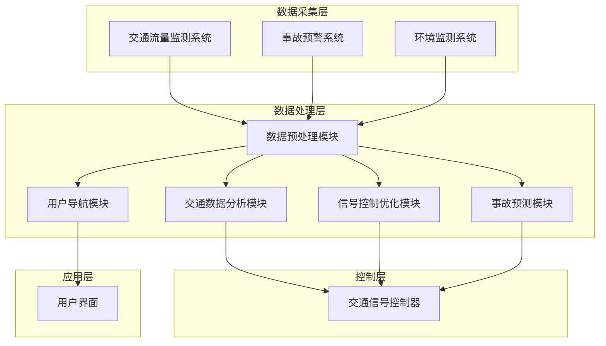
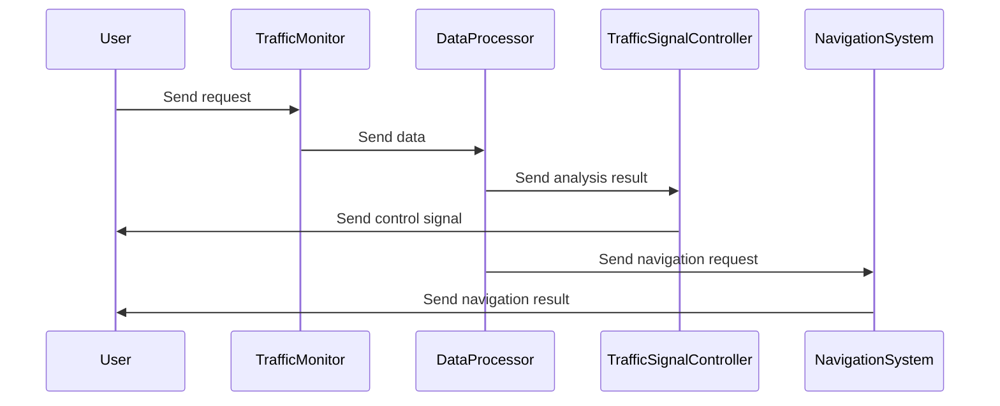
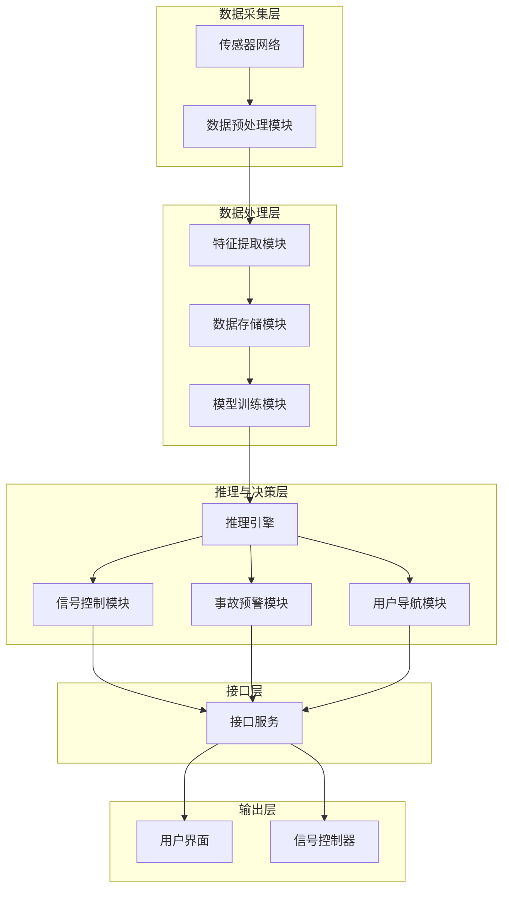
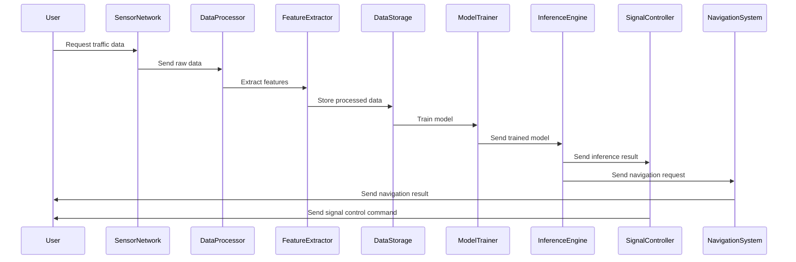

                 

## 引言

### 问题的背景

在当今高度互联和智能化的时代，复杂工程设计的需求日益增加。从大型基础设施项目到先进的信息系统，从人工智能算法到生物医学研究，复杂工程设计的成功与否直接关系到项目的成败。然而，随着系统规模的不断扩大和复杂性不断增加，传统的工程设计方法开始面临巨大的挑战。例如，系统在设计和开发过程中可能会出现功能遗漏、性能瓶颈、资源浪费等问题，这些问题往往难以在系统开发初期得到有效的识别和解决。

### 问题描述

复杂工程设计的核心问题是如何在有限的资源下，高效地识别和解决系统中存在的潜在问题，从而确保系统的可靠性、性能和可维护性。具体来说，问题可以归结为以下几点：

1. **系统复杂性**：现代系统往往涉及多个相互关联的组件，这些组件之间的关系复杂，导致系统的整体复杂性增加。
2. **信息不对称**：在项目初期，设计者可能无法获取所有必要的信息，这会影响设计的准确性和完整性。
3. **资源限制**：无论是人力、时间还是资金，资源的有限性限制了设计的深度和广度。
4. **跨领域知识融合**：复杂工程涉及多个领域，如计算机科学、物理学、数学等，如何有效地融合这些领域的知识成为一大挑战。

### 问题解决的必要性

解决复杂工程设计中的问题具有以下几个必要性：

1. **提升设计效率**：通过有效的分析和推理方法，可以在设计初期就识别出潜在问题，从而减少后期修正的工作量，提升整体设计效率。
2. **保障系统质量**：通过多维度推理能力，可以全面地评估系统性能，确保系统在各个方面都达到预期的质量标准。
3. **降低风险**：早期识别和解决潜在问题可以降低项目失败的风险，保障项目的顺利进行。
4. **节省资源**：有效的分析和推理方法可以减少资源的浪费，提高资源利用效率。

### 边界与外延

在讨论复杂工程设计时，我们需要明确一些边界和概念外延：

1. **复杂性**：这里所指的复杂性不仅包括系统的物理复杂性，还包括系统的逻辑复杂性、信息复杂性等。
2. **设计方法**：多维度推理能力不仅限于传统的工程设计方法，还包括现代的智能算法、模型驱动的工程方法等。
3. **应用领域**：多维度推理能力在复杂工程设计中的应用不仅限于某个特定的领域，如航空航天、信息技术、生物医学等，它可以跨领域、跨行业地应用。

### 总结

综上所述，复杂工程设计面临着诸多挑战，而多维度推理能力作为一种创新的思维工具和方法，具有解决这些问题的潜力。接下来的章节将深入探讨多维度推理能力的理论基础、算法原理及其在复杂工程设计中的应用，以期为解决复杂工程设计问题提供新的思路和工具。## 第二部分：复杂工程设计的现状与挑战

### 复杂工程设计的定义

复杂工程设计是指针对规模庞大、结构复杂、涉及多个领域的工程系统进行设计和开发的过程。这些系统通常具有高度的异构性、动态性和不确定性，需要综合运用多种技术和知识领域，如计算机科学、工程学、物理学、数学等。复杂工程设计的成功不仅取决于单个组件的性能，还取决于组件之间的相互作用和整体系统的协调性。

### 当前复杂工程设计面临的问题

1. **系统复杂性**：随着系统规模的扩大，组件数量和相互关系的复杂性也随之增加，这给设计带来了巨大的挑战。复杂系统的层次结构通常涉及多个层级和多个子系统，导致设计过程中难以全面掌握系统的全局视图。

2. **信息不对称**：在项目初期，设计者可能无法获得所有必要的信息，例如用户需求、技术规范、资源约束等。信息不对称会导致设计偏离实际需求，甚至导致系统无法正常工作。

3. **资源限制**：无论是人力、时间还是资金，资源的有限性使得复杂工程设计的深度和广度受限。设计团队需要在资源有限的情况下，快速做出有效的决策，这增加了设计过程的复杂性和不确定性。

4. **跨领域知识融合**：复杂工程设计往往需要融合多个领域的知识和技术，如计算机科学、物理学、数学等。然而，不同领域的专家和技术之间的沟通和协作常常存在障碍，导致知识融合不畅，影响设计效果。

5. **设计迭代成本**：在复杂工程中，设计迭代是不可避免的。每次迭代都可能导致大量的工作量和资源投入，尤其是在设计初期未能准确把握需求的情况下，迭代成本会进一步增加。

### 传统方法在复杂工程设计中的局限性

1. **单维度分析**：传统的工程设计方法通常基于单一的视角进行分析，如性能分析、成本分析、安全性分析等。这种方法难以全面地考虑系统各个维度之间的相互作用和影响，容易导致设计偏差。

2. **缺乏系统性**：传统方法往往缺乏系统性的设计和分析框架，难以在设计的初期就全面地识别和解决潜在问题。设计过程中往往需要多次迭代，增加了设计成本和时间。

3. **依赖专家经验**：传统方法高度依赖设计者的经验和直觉，缺乏系统的分析和推理工具。这导致设计过程的主观性较强，难以保证设计的一致性和可靠性。

4. **难以适应动态变化**：复杂工程系统通常具有动态性，需求和技术环境可能随时发生变化。传统方法难以快速适应这些变化，导致设计结果可能无法满足新的需求。

### 解决复杂工程设计问题的必要性

1. **提升设计质量**：通过引入多维度推理能力，可以全面地分析和评估系统各个维度的影响，提高设计的一致性和可靠性。

2. **降低设计成本**：多维度推理能力可以在设计初期就识别和解决潜在问题，减少后期修正的工作量，从而降低设计成本。

3. **提高设计效率**：多维度推理能力提供了一种系统性的分析和设计方法，可以加快设计过程，提高设计效率。

4. **增强系统适应性**：多维度推理能力可以帮助设计者更好地理解和应对系统的动态变化，提高系统的适应性和可维护性。

### 边界与外延

在讨论复杂工程设计时，我们需要注意以下边界和概念外延：

1. **复杂性**：复杂性不仅涉及系统的物理和逻辑结构，还包括系统的行为和功能特征。
2. **设计方法**：多维度推理能力不仅包括传统的分析方法，还包括现代的智能算法、模型驱动的工程方法等。
3. **应用领域**：多维度推理能力在复杂工程设计中的应用不仅限于特定的领域，如航空航天、信息技术、生物医学等，它可以跨领域、跨行业地应用。

### 总结

复杂工程设计面临着诸多挑战，而多维度推理能力作为一种创新的思维工具和方法，具有解决这些问题的潜力。接下来，我们将进一步探讨多维度推理能力的重要性以及其理论基础，为解决复杂工程设计问题提供新的思路和工具。## 第三部分：多维度推理能力的重要性

### 多维度推理能力的定义

多维度推理能力是指从多个不同的角度和维度对复杂系统进行分析、推理和评估的能力。这种能力不仅涵盖了系统的功能性能，还包括系统的可靠性、安全性、可维护性、成本效益等多个方面。通过多维度推理，设计者可以全面地理解和评估系统的各个方面，从而做出更准确和更有效的决策。

### 多维度推理能力的优势

1. **全面性**：多维度推理能力可以综合考虑系统的各个方面，避免单一维度的局限，从而提高设计的全面性和准确性。

2. **系统性**：多维度推理能力提供了一种系统性的分析框架，可以帮助设计者从整体上理解和分析系统的复杂性，提高设计的系统性。

3. **预见性**：通过多维度推理，设计者可以预测系统在不同维度上的潜在问题和风险，从而提前采取措施，避免或减少设计过程中的反复迭代。

4. **适应性**：多维度推理能力可以帮助设计者更好地理解和应对系统的动态变化，提高系统的适应性和灵活性。

5. **效率提升**：多维度推理能力可以在设计初期就识别和解决潜在问题，减少后期修正的工作量，从而提高设计效率。

### 多维度推理能力在复杂工程设计中的应用

1. **需求分析**：在复杂工程设计初期，多维度推理能力可以帮助设计者更好地理解和分析用户需求，确保设计结果满足用户的多方面需求。

2. **风险评估**：通过多维度推理，设计者可以全面地评估系统在功能、性能、安全性、可靠性等各个方面的潜在风险，提前制定相应的风险管理策略。

3. **系统优化**：多维度推理能力可以帮助设计者识别系统中存在的性能瓶颈和资源浪费，从而进行系统优化，提高系统的整体性能和效率。

4. **决策支持**：在复杂工程设计的各个阶段，多维度推理能力可以提供有力的决策支持，帮助设计者做出更准确和更有效的决策。

5. **协同设计**：多维度推理能力可以促进不同领域专家之间的沟通和协作，提高整体设计的协同性和一致性。

### 总结

多维度推理能力在复杂工程设计中具有显著的优势和重要性。它不仅可以帮助设计者全面地理解和评估系统，提高设计的准确性和可靠性，还可以降低设计成本和提升设计效率。在接下来的章节中，我们将进一步探讨多维度推理能力的基础理论，为深入理解和应用这一能力提供理论基础。## 第四部分：多维度推理能力的基础理论

### 推理能力的定义与分类

推理能力是指从已知的信息出发，通过逻辑分析和推断，得出新的结论或知识的能力。在计算机科学和人工智能领域，推理能力尤为重要，因为它是智能系统模拟人类思维过程的核心。根据推理过程中使用的知识和方法，推理能力可以分为以下几类：

1. **演绎推理**：从一般原理推导出特定情况的推理过程。例如，所有人都会死亡（大前提），苏格拉底是人（小前提），因此苏格拉底会死亡（结论）。

2. **归纳推理**：从特定的实例或数据中归纳出一般性规律或原理的推理过程。例如，观察多次太阳从东方升起，可以归纳出“太阳每天从东方升起”这一规律。

3. **类比推理**：通过比较两个或多个相似的情况，推断出它们在某些方面可能具有相似结果的推理过程。例如，因为苹果会腐烂，所以香蕉也可能腐烂。

4. **基于规则的推理**：使用预先定义的规则或条件进行推理。这些规则通常以“如果-那么”的形式存在。例如，如果气温高于30摄氏度，那么空调会自动启动。

5. **模糊推理**：处理模糊和不精确信息的推理方法。模糊逻辑允许变量和结论具有不同程度的真值，而不是简单的真或假。

### 多维度推理能力的特点

多维度推理能力具有以下几个显著特点：

1. **多维数据融合**：多维度推理能够整合来自不同数据源的信息，例如用户需求、性能数据、成本数据等，进行综合分析和推理。

2. **动态调整**：多维度推理能力可以根据实时反馈和环境变化，动态调整推理过程和结果，提高系统的适应性和灵活性。

3. **综合评估**：多维度推理不仅考虑单一维度的性能，还综合考虑多个维度的影响，从而提供更全面和准确的评估。

4. **自适应性**：多维度推理能力能够根据不同的问题和环境，自动选择和调整适合的推理方法和策略，提高推理的效率和效果。

5. **智能决策支持**：多维度推理能力可以为设计者提供智能化的决策支持，帮助他们在复杂的设计过程中做出更准确和更合理的决策。

### 多维度推理能力的实现方法

实现多维度推理能力通常涉及以下几个步骤：

1. **数据收集与预处理**：收集和整合来自不同来源的数据，并进行预处理，如数据清洗、标准化等，以确保数据的准确性和一致性。

2. **知识建模**：将关键信息转化为计算机可以理解和处理的形式，建立知识模型。知识模型可以包括规则库、决策树、神经网络等。

3. **推理算法**：选择合适的推理算法，根据具体问题和需求进行推理。常用的推理算法包括基于规则的推理、模糊推理、遗传算法、神经网络等。

4. **评估与优化**：对推理结果进行评估和验证，根据评估结果调整推理策略和模型参数，以优化推理效果。

5. **用户界面**：设计直观易用的用户界面，使设计者可以方便地输入数据、查看推理过程和结果，并提供交互式的决策支持。

### 总结

多维度推理能力作为一种先进的思维工具和方法，在复杂工程设计中具有广泛的应用前景。通过理解其基础理论、特点及其实现方法，设计者可以更有效地利用多维度推理能力，提升复杂工程设计的质量、效率和可靠性。在接下来的章节中，我们将进一步探讨多维度推理能力的核心概念及其联系，为深入应用这一能力奠定基础。## 第五部分：多维度推理能力的核心概念与联系

### 核心概念原理

多维度推理能力涉及多个核心概念，这些概念共同构成了多维度推理的理论基础。以下是几个关键概念及其基本原理：

1. **多维数据模型**：多维数据模型是一种组织复杂数据的方法，它允许数据从多个不同的维度进行组织、分析和查询。常见的多维数据模型包括星型模型、雪花模型等。多维数据模型的核心原理是将数据按照多个维度进行切分和聚合，从而方便数据的分析和推理。

2. **特征工程**：特征工程是数据预处理和模型构建的重要环节，它涉及到从原始数据中提取和构造具有区分度、代表性的特征。特征工程的核心原理是通过数据转换、特征选择和特征组合等方法，提高数据的可用性和模型的性能。

3. **推理机**：推理机是实现多维度推理的核心组件，它负责根据预先定义的规则或模型，对输入数据进行推理和决策。推理机的核心原理是基于规则库或模型库，使用逻辑推理、模糊推理等方法，对数据进行分析和判断。

4. **综合评估模型**：综合评估模型是多维度推理的重要组成部分，它用于对系统的各个维度进行综合评估和打分。综合评估模型的核心原理是使用加权评分、多目标优化等方法，将多个维度的数据转换为一个统一的评估结果。

### 概念属性特征对比表格

为了更好地理解各个核心概念，下面提供一个对比表格，列出多维数据模型、特征工程、推理机和综合评估模型的主要属性特征：

| 概念              | 主要属性特征                                                     | 关键作用                                 |
|------------------|----------------------------------------------------------------|------------------------------------------|
| 多维数据模型     | - 维度划分：多个维度，如时间、地点、产品等<br>- 数据聚合：支持维度的切分和聚合 | 组织复杂数据，提供多维数据分析能力       |
| 特征工程         | - 特征提取：从原始数据中提取有意义的特征<br>- 特征选择：选择具有区分度的特征 | 提高数据的可用性和模型的性能               |
| 推理机           | - 规则库：存储预定义的规则<br>- 模型库：存储预训练的模型 | 根据规则和模型对数据进行推理和决策         |
| 综合评估模型     | - 加权评分：不同维度数据按重要性加权<br>- 多目标优化：优化多个目标函数 | 对系统的各个维度进行综合评估和打分         |

### ER实体关系图架构的Mermaid流程图

为了更直观地展示多维度推理能力的核心概念和联系，我们可以使用Mermaid语言绘制一个ER实体关系图。以下是一个简单的ER图示例：

```mermaid
erDiagram
  多维数据模型 ||--|{ 特征工程 }|
  推理机 ||--|{ 多维数据模型 }|
  推理机 ||--|{ 综合评估模型 }|
  综合评估模型 ||--|{ 特征工程 }|
```

在这个ER图中，多维数据模型、特征工程、推理机和综合评估模型通过双向箭头表示它们之间的相互关系。多维数据模型提供数据支持，特征工程对数据进行预处理，推理机根据规则和模型进行推理，综合评估模型对结果进行综合评估。

### 总结

多维度推理能力的核心概念和联系构成了其理论基础，通过多维数据模型、特征工程、推理机和综合评估模型等核心组件，设计者可以全面地理解和应用多维度推理能力。在接下来的章节中，我们将进一步探讨多维度推理算法的具体原理和实现方法，为复杂工程设计的应用提供更加深入的指导。## 第六部分：多维度推理算法原理

### 多维度推理算法的基本原理

多维度推理算法是一种能够从多个维度对复杂系统进行分析和推理的智能方法。其基本原理可以概括为以下几个步骤：

1. **数据收集与预处理**：首先，从不同的数据源收集相关数据，包括用户需求、性能数据、成本数据等。然后，对数据进行预处理，如数据清洗、标准化、数据转换等，以确保数据的质量和一致性。

2. **特征提取与选择**：通过对预处理后的数据进行分析，提取出具有区分度和代表性的特征。特征选择是一个关键步骤，它有助于提高模型性能并降低计算复杂度。

3. **模型构建与训练**：使用提取的特征构建多维度推理模型。常见的模型包括决策树、支持向量机、神经网络等。模型构建后，通过训练数据对模型进行训练，使其能够对未知数据进行推理和预测。

4. **推理与评估**：利用训练好的模型对新的输入数据进行分析和推理。推理过程中，模型会综合考虑多个维度的数据，得出综合评估结果。推理结果需要经过评估，确保其准确性和可靠性。

### 算法mermaid流程图

为了更直观地展示多维度推理算法的基本原理，我们可以使用Mermaid语言绘制一个流程图。以下是一个简单的多维度推理算法流程图：


在这个流程图中，A表示数据收集与预处理，B表示特征提取与选择，C表示模型构建与训练，D表示推理与评估，E表示评估与优化，F表示输出结果。通过这个流程图，我们可以清晰地看到多维度推理算法的基本流程和步骤。

### 算法原理的数学模型和公式

多维度推理算法的数学模型和公式是理解和实现算法的核心。以下是一个简单的数学模型和相关的公式：

1. **特征提取公式**：
   $$ X = f(D) $$
   其中，$X$ 表示提取后的特征集合，$D$ 表示原始数据集合，$f$ 表示特征提取函数。特征提取函数通常包括数据标准化、主成分分析（PCA）、自动编码器等。

2. **模型训练公式**：
   $$ \min W, b \quad \sum (y - \sigma(Wx + b))^2 $$
   其中，$W$ 和 $b$ 分别表示模型的权重和偏置，$\sigma$ 表示激活函数（如Sigmoid、ReLU等），$y$ 表示真实标签，$\hat{y}$ 表示模型的预测结果。

3. **推理与评估公式**：
   $$ R = \sum w_i \cdot r_i $$
   其中，$R$ 表示综合评估结果，$w_i$ 表示权重，$r_i$ 表示各个维度的评估结果。

4. **优化公式**：
   $$ W_{new} = W - \alpha \cdot \frac{dL}{dW} $$
   $$ b_{new} = b - \alpha \cdot \frac{dL}{db} $$
   其中，$W_{new}$ 和 $b_{new}$ 分别表示新的权重和偏置，$\alpha$ 表示学习率，$L$ 表示损失函数，$\frac{dL}{dW}$ 和 $\frac{dL}{db}$ 分别表示权重和偏置的梯度。

### 通俗易懂地举例说明

假设我们要设计一个智能家居系统，该系统需要从多个维度对用户的家庭环境进行分析和优化。具体来说，我们需要考虑以下维度：

1. **温度**：用户对家中温度的舒适度要求。
2. **湿度**：用户对家中湿度的舒适度要求。
3. **噪音**：用户对家中噪音的容忍度。

为了实现多维度推理，我们可以按照以下步骤进行：

1. **数据收集与预处理**：收集用户对温度、湿度和噪音的舒适度数据，并进行预处理，如数据清洗、标准化等。

2. **特征提取与选择**：根据预处理后的数据，提取出具有区分度的特征，如温度、湿度、噪音的平均值、标准差等。

3. **模型构建与训练**：使用提取的特征构建一个多维度推理模型，如神经网络。通过训练数据对模型进行训练，使其能够对新的输入数据进行推理和预测。

4. **推理与评估**：假设用户报告了一个新的温度值、湿度值和噪音值，模型会综合考虑这三个维度，得出一个综合评估结果。例如，如果温度过高，湿度适中，噪音较低，模型可能会给出一个“适宜”的评估结果。

5. **评估与优化**：根据评估结果，对模型进行评估和优化，确保其准确性和可靠性。如果评估结果不理想，可以通过调整模型参数或特征选择等方法进行优化。

通过这个简单的例子，我们可以看到多维度推理算法在智能家居系统设计中的应用。这种方法不仅能够全面地考虑用户需求，还可以动态地调整系统参数，提高系统的适应性和用户体验。

### 总结

多维度推理算法是一种强大的智能方法，它能够从多个维度对复杂系统进行分析和推理。通过数据收集与预处理、特征提取与选择、模型构建与训练、推理与评估等步骤，设计者可以全面地理解和优化复杂系统。在接下来的章节中，我们将进一步探讨多维度推理能力的数学模型和公式，为深入应用这一算法提供理论基础。## 第七部分：多维度推理能力的数学模型与公式

### 数学模型和公式介绍

多维度推理能力的数学模型和公式是理解和实现多维度推理算法的核心。这些数学模型和公式不仅为算法提供了理论基础，还帮助设计者在复杂工程设计中做出精确的推理和决策。以下是几个关键的数学模型和公式：

1. **特征提取公式**：特征提取是将原始数据转换为具有区分度和代表性的特征的过程。一个常见的特征提取方法是主成分分析（PCA）。PCA的目标是最小化数据方差，从而提取出最重要的特征。PCA的数学公式如下：

   $$ X' = P \Lambda $$

   其中，$X'$ 表示标准化后的数据，$P$ 表示特征转换矩阵，$\Lambda$ 表示特征值矩阵。

2. **线性回归模型**：线性回归是一种常见的多维度推理模型，用于预测因变量与自变量之间的关系。线性回归的数学公式如下：

   $$ y = \beta_0 + \beta_1 x_1 + \beta_2 x_2 + ... + \beta_n x_n $$

   其中，$y$ 表示因变量，$x_1, x_2, ..., x_n$ 表示自变量，$\beta_0, \beta_1, \beta_2, ..., \beta_n$ 表示回归系数。

3. **决策树模型**：决策树是一种常见的分类和回归模型，它通过一系列规则对数据进行分割和分类。决策树的构建通常基于信息增益或基尼不纯度等准则。决策树的数学公式如下：

   $$ node\_split(X, Y) = \arg \max \sum_{i} p(i) \cdot I(Y|X_i) $$

   其中，$X$ 表示特征空间，$Y$ 表示目标变量，$I(Y|X_i)$ 表示条件熵或基尼不纯度。

4. **贝叶斯网络模型**：贝叶斯网络是一种基于概率的推理模型，它通过节点和边表示变量之间的依赖关系。贝叶斯网络的推理过程基于条件概率计算。贝叶斯网络的数学公式如下：

   $$ P(A|B) = \frac{P(B|A)P(A)}{P(B)} $$

   其中，$P(A|B)$ 表示在$B$发生的条件下$A$的概率，$P(B|A)$ 表示在$A$发生的条件下$B$的概率，$P(A)$ 和 $P(B)$ 分别表示$A$和$B$的边缘概率。

### 数学公式的详细讲解

1. **主成分分析（PCA）**：PCA是一种降维技术，它通过保留数据的主要成分来简化数据。PCA的公式如下：

   - **特征转换矩阵**：$P = U\Lambda^{1/2}$
     其中，$U$ 是特征空间的特征向量矩阵，$\Lambda$ 是特征值矩阵，$\Lambda^{1/2}$ 是特征值的平方根矩阵。
   - **标准化数据**：$X' = PX$
     通过特征转换矩阵$P$对原始数据$X$进行变换，得到标准化数据$X'$。

   PCA的主要目的是找到一个新的坐标系，使得数据在新的坐标系上具有最大的方差，从而简化数据的结构，提高数据的可解释性。

2. **线性回归**：线性回归是一种用于预测连续值的模型。线性回归的公式如下：

   - **回归系数**：$\beta = (\beta_0, \beta_1, ..., \beta_n)$
     通过最小二乘法求解回归系数$\beta$，使得预测值与真实值之间的误差最小。
   - **预测值**：$\hat{y} = \beta_0 + \beta_1 x_1 + \beta_2 x_2 + ... + \beta_n x_n$
     使用求解出的回归系数$\beta$和自变量$x_1, x_2, ..., x_n$预测因变量$y$。

   线性回归的核心思想是找到一条直线，使得这条直线与数据点之间的误差最小，从而实现数据的拟合和预测。

3. **决策树**：决策树是一种树形结构模型，它通过一系列规则对数据进行分割和分类。决策树的公式如下：

   - **信息增益**：$IG(D, A) = Ent(D) - \sum_{v} p(v) \cdot Ent(D_v)$
     其中，$D$ 是数据集，$A$ 是特征，$v$ 是特征$A$的取值，$D_v$ 是在特征$A$取值$v$的数据集。
   - **基尼不纯度**：$Gini(D) = 1 - \sum_{v} p(v)^2$
     其中，$D$ 是数据集，$v$ 是数据集的取值。

   决策树的核心思想是通过信息增益或基尼不纯度来选择最优的特征进行分割，从而构建出一棵能够有效分类或回归的树。

4. **贝叶斯网络**：贝叶斯网络是一种基于概率的推理模型，它通过节点和边表示变量之间的依赖关系。贝叶斯网络的公式如下：

   - **条件概率**：$P(A|B) = \frac{P(B|A)P(A)}{P(B)}$
     这是贝叶斯定理的表达式，它描述了在给定条件$B$下，变量$A$的概率。
   - **概率分布**：$P(A, B) = P(A) \cdot P(B|A)$
     这是联合概率分布的表达式，它描述了两个变量$A$和$B$同时发生的概率。

   贝叶斯网络的核心思想是通过条件概率分布来描述变量之间的依赖关系，从而实现数据的推理和预测。

### 举例说明

为了更好地理解这些数学模型和公式，我们可以通过一个简单的例子来说明。

假设我们要预测一个学生的考试成绩，该考试成绩受以下三个因素的影响：

1. **学习时长**（$x_1$）：每天学习的小时数。
2. **学习效率**（$x_2$）：学习效率的评分（1-10分）。
3. **考试难度**（$x_3$）：考试的难度评分（1-10分）。

我们的目标是构建一个线性回归模型来预测学生的考试成绩（$y$）。

1. **特征提取**：首先，我们需要收集每个学生的学习时长、学习效率和考试难度，并进行预处理，如数据标准化。

2. **模型训练**：使用收集的数据训练线性回归模型，求解回归系数$\beta$。

   $$ y = \beta_0 + \beta_1 x_1 + \beta_2 x_2 + \beta_3 x_3 $$

3. **推理与预测**：假设有一个新的学生，其学习时长为5小时，学习效率为8分，考试难度为6分。我们可以使用训练好的模型来预测他的考试成绩。

   $$ \hat{y} = \beta_0 + \beta_1 \cdot 5 + \beta_2 \cdot 8 + \beta_3 \cdot 6 $$

通过这个简单的例子，我们可以看到如何使用多维度推理能力的数学模型和公式进行预测和推理。在实际应用中，这些模型和公式可以帮助我们更准确地分析和评估复杂系统，从而做出更明智的决策。

### 总结

多维度推理能力的数学模型和公式是理解和应用这一方法的关键。通过主成分分析（PCA）、线性回归、决策树和贝叶斯网络等数学模型，设计者可以有效地进行特征提取、模型训练和推理预测。在接下来的章节中，我们将进一步探讨多维度推理能力在复杂工程设计中的具体应用，为解决复杂工程问题提供更加深入的指导。## 第八部分：复杂工程设计系统场景介绍

### 项目介绍

本部分将介绍一个实际的应用场景，即一个智能交通管理系统的设计与实现。该系统旨在通过多维度推理能力，提高城市交通的流畅性和安全性。智能交通管理系统包括以下主要功能模块：

1. **交通流量监测**：实时监测交通流量，收集车辆速度、密度、方向等数据。
2. **路况分析**：分析交通流量数据，预测交通拥堵情况，提供交通优化建议。
3. **信号控制优化**：根据实时交通状况，动态调整交通信号灯周期，优化交通流量。
4. **事故预警**：通过监控数据，预警潜在的交通事故，提供预警信息。
5. **用户导航**：为驾驶员提供最佳行驶路线，减少交通拥堵和行驶时间。

### 系统功能设计（领域模型Mermaid类图）

为了更好地理解和设计智能交通管理系统的功能，我们可以使用Mermaid语言绘制一个领域模型类图。以下是一个简化的类图示例：

```mermaid
classDiagram
    TrafficMonitor <|.. RoadSensor
    TrafficMonitor <|.. TrafficDataAnalyzer
    TrafficSignalController <|.. TrafficSignal
    AccidentDetector <|.. RoadSensor
    NavigationSystem <|.. TrafficDataAnalyzer

    RoadSensor -|> TrafficMonitor
    TrafficDataAnalyzer -|> TrafficMonitor
    TrafficDataAnalyzer -|> TrafficSignalController
    TrafficDataAnalyzer -|> AccidentDetector
    TrafficDataAnalyzer -|> NavigationSystem
    TrafficSignal -|> TrafficSignalController
```

在这个类图中，我们定义了几个关键类：

- **RoadSensor**：用于收集交通流量数据。
- **TrafficMonitor**：负责实时监测交通状况，整合来自多个传感器的数据。
- **TrafficDataAnalyzer**：分析交通流量数据，提供预测和优化建议。
- **TrafficSignalController**：根据分析结果动态调整交通信号灯。
- **AccidentDetector**：预警潜在的交通事故。
- **NavigationSystem**：为驾驶员提供导航服务。

这些类通过不同的关系（如继承、关联等）相互连接，共同构成了智能交通管理系统的功能架构。

### 系统架构设计（Mermaid架构图）

智能交通管理系统的架构设计涉及到多个层次，包括数据采集层、数据处理层、控制层和应用层。以下是一个简化的Mermaid架构图示例：



在这个架构图中，数据采集层包括交通流量监测系统、事故预警系统和环境监测系统，它们负责收集各种交通数据。数据处理层包括数据预处理模块、交通数据分析模块、信号控制优化模块、事故预测模块和用户导航模块，它们负责对数据进行处理和分析，提供各种功能模块。控制层包括交通信号控制器，它负责根据分析结果动态调整交通信号灯。应用层包括用户界面，为用户提供交互式体验。

### 系统接口设计

智能交通管理系统涉及多个模块和组件，它们之间需要通过接口进行通信和协作。以下是几个关键接口的设计：

1. **数据采集接口**：用于接收来自交通流量监测系统、事故预警系统和环境监测系统的数据。
2. **数据处理接口**：用于将接收到的数据传递给数据预处理模块、交通数据分析模块、信号控制优化模块、事故预测模块和用户导航模块。
3. **控制接口**：用于交通信号控制器接收数据处理结果，并做出相应的控制决策。
4. **用户接口**：用于用户与系统进行交互，接收用户请求并返回相应的导航信息。

以下是这些接口的简单描述：

- **数据采集接口**：
  - 方法：POST /collect_data
  - 参数：{ sensor_id: String, data: Object }
  - 响应：{ status: String, message: String }
- **数据处理接口**：
  - 方法：GET /process_data
  - 参数：{ module: String, data: Object }
  - 响应：{ result: Object }
- **控制接口**：
  - 方法：POST /control_signal
  - 参数：{ signal_id: String, command: Object }
  - 响应：{ status: String, message: String }
- **用户接口**：
  - 方法：GET /navigate
  - 参数：{ start_point: Object, end_point: Object }
  - 响应：{ route: Array<Object> }

### 系统交互（Mermaid序列图）

为了更直观地展示系统各模块之间的交互，我们可以使用Mermaid语言绘制一个序列图。以下是一个简化的序列图示例：



在这个序列图中，用户首先向交通流量监测系统发送请求，获取实时交通数据。交通流量监测系统将数据传递给数据处理模块，数据处理模块对数据进行处理和分析，生成分析结果并传递给交通信号控制器。交通信号控制器根据分析结果动态调整交通信号灯，并将控制信号返回给用户。同时，数据处理模块还向用户导航模块发送导航请求，用户导航模块为用户生成最佳行驶路线并返回导航结果。

### 总结

智能交通管理系统是一个复杂的工程系统，它通过多维度推理能力，实现了交通流量监测、路况分析、信号控制优化、事故预警和用户导航等功能。通过详细的系统功能设计、架构设计、接口设计和交互设计，我们可以更好地理解和实现这一系统，为城市交通管理提供有效的解决方案。在接下来的章节中，我们将进一步探讨多维度推理能力在系统实现与架构设计中的应用，为复杂工程设计的成功实施提供更多指导。## 第九部分：多维度推理能力的系统实现与架构设计

### 系统实现思路

智能交通管理系统的实现是一个复杂的过程，需要结合多维度推理能力的核心思想，通过数据收集、处理、分析和决策，实现系统的各项功能。以下是系统实现的主要步骤：

1. **数据收集**：通过部署在道路上的传感器网络，实时收集交通流量、车辆速度、行驶方向、交通事故等信息。

2. **数据预处理**：对收集到的原始数据进行清洗、去噪、标准化等处理，确保数据的质量和一致性。

3. **特征提取**：从预处理后的数据中提取具有区分度和代表性的特征，如交通流量密度、速度分布、事故频次等。

4. **数据存储**：将预处理后的数据存储到数据仓库中，以便后续分析和处理。

5. **模型训练**：使用收集的数据训练多维度推理模型，如神经网络、决策树、支持向量机等，使其能够对交通状况进行预测和优化。

6. **推理与决策**：将实时收集到的交通数据进行推理，生成交通流量预测、信号灯控制策略、事故预警等信息。

7. **系统交互**：通过接口与交通信号控制器、用户导航系统等模块进行通信，实现系统的整体功能。

### 系统架构设计（Mermaid架构图）

为了更好地展示系统的架构设计，我们可以使用Mermaid语言绘制一个架构图。以下是一个简化的系统架构图示例：



在这个架构图中，数据采集层包括传感器网络和数据预处理模块，负责收集和预处理交通数据。数据处理层包括特征提取模块、数据存储模块和模型训练模块，负责对数据进行特征提取和模型训练。推理与决策层包括推理引擎、信号控制模块、事故预警模块和用户导航模块，负责对实时数据进行推理和决策。接口层负责系统与外部组件的通信。输出层包括用户界面和信号控制器，负责将系统决策结果反馈给用户和交通信号控制器。

### 系统接口设计

为了实现系统各组件之间的有效通信，需要设计合理的接口。以下是几个关键接口的详细设计：

1. **传感器数据接口**：用于接收传感器网络发送的交通数据。

   - **接口名称**：SensorDataAPI
   - **接口URL**：/api/sensor_data
   - **请求方法**：POST
   - **请求参数**：{ sensor_id: String, data: Object }
   - **响应结果**：{ status: String, message: String, data: Object }

2. **数据处理接口**：用于将预处理后的数据传递给特征提取模块、数据存储模块和模型训练模块。

   - **接口名称**：DataProcessorAPI
   - **接口URL**：/api/data_processor
   - **请求方法**：GET/POST
   - **请求参数**：{ module: String, data: Object }
   - **响应结果**：{ result: Object }

3. **推理接口**：用于从推理引擎获取预测结果。

   - **接口名称**：InferenceAPI
   - **接口URL**：/api/inference
   - **请求方法**：GET/POST
   - **请求参数**：{ query: Object }
   - **响应结果**：{ result: Object }

4. **信号控制接口**：用于将推理结果传递给交通信号控制器。

   - **接口名称**：SignalControlAPI
   - **接口URL**：/api/signal_control
   - **请求方法**：POST
   - **请求参数**：{ signal_id: String, command: Object }
   - **响应结果**：{ status: String, message: String }

5. **用户导航接口**：用于为用户提供导航服务。

   - **接口名称**：NavigationAPI
   - **接口URL**：/api/navigation
   - **请求方法**：GET/POST
   - **请求参数**：{ start_point: Object, end_point: Object }
   - **响应结果**：{ route: Array<Object> }

### 系统交互（Mermaid序列图）

为了更直观地展示系统各组件之间的交互过程，我们可以使用Mermaid语言绘制一个序列图。以下是一个简化的系统交互序列图示例：



在这个序列图中，用户首先向传感器网络请求交通数据，传感器网络将数据发送给数据处理模块。数据处理模块对数据进行预处理后，将数据传递给特征提取模块。特征提取模块提取出具有区分度的特征，并将其存储到数据存储模块。数据存储模块将数据传递给模型训练模块，模型训练模块使用这些数据训练多维度推理模型。训练好的模型被发送到推理引擎，推理引擎根据实时数据生成预测结果。这些预测结果被发送给交通信号控制器和用户导航系统，交通信号控制器根据预测结果调整交通信号灯，用户导航系统为用户生成最佳导航路线。

### 总结

多维度推理能力在智能交通管理系统的实现与架构设计中起到了关键作用。通过系统的实现思路、架构设计、接口设计和交互设计，我们能够有效地利用多维度推理能力，实现交通流量监测、路况分析、信号控制优化、事故预警和用户导航等功能。在接下来的章节中，我们将通过项目实战，进一步展示多维度推理能力在复杂工程设计中的应用，并提供实际的代码示例和案例分析。## 第十部分：多维度推理能力在复杂工程设计中的应用实战

### 环境安装

在进行多维度推理能力在复杂工程设计中的应用实战之前，我们需要首先安装和配置相关环境。以下是一个基本的安装步骤，以Python环境为例：

1. **安装Python**：确保已经安装了Python 3.7或更高版本的Python环境。可以从官方网站（https://www.python.org/）下载并安装。

2. **安装必要的库**：使用pip命令安装必要的Python库，如NumPy、Pandas、Scikit-learn、TensorFlow、Mermaid等。以下是一个示例命令：

   ```bash
   pip install numpy pandas scikit-learn tensorflow mermaid
   ```

3. **配置Mermaid**：由于Mermaid是一个基于HTML的图表绘制工具，需要安装Node.js来使用Mermaid。可以从Node.js官网（https://nodejs.org/）下载并安装Node.js。

4. **测试环境**：在Python环境中，可以通过以下代码测试Mermaid是否配置成功：

   ```python
   import mermaid
   mermaid.initialize()
   print(mermaid.render('sequenceDiagram', 'Alice->>Bob: Hello World!'))
   ```

   如果成功打印出图表，则表示环境配置正确。

### 系统核心实现源代码

以下是一个简化的多维度推理系统实现示例，包括数据收集、预处理、特征提取、模型训练和推理等关键步骤。请注意，这个示例仅供参考，实际项目可能需要更复杂的实现。

```python
# 导入必要的库
import numpy as np
import pandas as pd
from sklearn.model_selection import train_test_split
from sklearn.preprocessing import StandardScaler
from sklearn.ensemble import RandomForestClassifier
import mermaid

# 数据收集
def collect_data():
    # 在这里实现数据收集的逻辑，例如从传感器读取数据
    data = pd.DataFrame({'feature1': [1, 2, 3], 'feature2': [4, 5, 6], 'label': [0, 1, 0]})
    return data

# 数据预处理
def preprocess_data(data):
    # 数据清洗、去噪等预处理步骤
    scaler = StandardScaler()
    data_scaled = scaler.fit_transform(data)
    return data_scaled

# 特征提取
def extract_features(data):
    # 特征提取的逻辑
    # 这里使用简单的方法，直接返回数据本身
    return data

# 模型训练
def train_model(data):
    # 划分训练集和测试集
    X_train, X_test, y_train, y_test = train_test_split(data[:, :-1], data[:, -1], test_size=0.2, random_state=42)
    
    # 实例化模型
    model = RandomForestClassifier(n_estimators=100, random_state=42)
    
    # 训练模型
    model.fit(X_train, y_train)
    
    # 评估模型
    score = model.score(X_test, y_test)
    print(f"Model accuracy: {score:.2f}")
    
    return model

# 推理
def inference(model, new_data):
    # 使用训练好的模型进行推理
    prediction = model.predict(new_data)
    print(f"Prediction: {prediction}")

# 主函数
def main():
    # 收集数据
    data = collect_data()
    
    # 预处理数据
    data_processed = preprocess_data(data)
    
    # 提取特征
    features = extract_features(data_processed)
    
    # 训练模型
    model = train_model(features)
    
    # 进行推理
    new_data = np.array([[2, 5]])
    inference(model, new_data)

# 运行主函数
if __name__ == "__main__":
    main()
```

### 代码应用解读与分析

1. **数据收集**：`collect_data` 函数负责从传感器或数据源收集交通数据。在实际应用中，这一部分可能会包含更多的数据处理逻辑，如数据清洗、去噪等。

2. **数据预处理**：`preprocess_data` 函数负责对收集到的数据进行清洗、标准化等预处理操作。这里使用了`StandardScaler`将数据缩放到相同的尺度，便于模型训练。

3. **特征提取**：`extract_features` 函数负责从预处理后的数据中提取特征。在这个简化的示例中，特征提取操作非常简单，直接返回了预处理后的数据。在实际应用中，可能需要更复杂的特征工程步骤。

4. **模型训练**：`train_model` 函数负责训练多维度推理模型。这里使用了`RandomForestClassifier`来训练随机森林模型。模型训练过程中，会先划分训练集和测试集，然后使用训练集进行模型训练，并在测试集上评估模型性能。

5. **推理**：`inference` 函数负责使用训练好的模型对新数据进行推理。这个函数接收训练好的模型和一个新的数据样本，并返回模型的预测结果。

6. **主函数**：`main` 函数是整个系统的入口。它依次执行数据收集、预处理、特征提取、模型训练和推理等步骤，展示了一个完整的系统流程。

### 实际案例分析与详细讲解剖析

为了更好地理解多维度推理能力在实际工程中的应用，我们可以通过一个实际案例进行详细分析。假设我们需要预测一条道路上的交通流量，以优化交通信号灯的控制策略。

1. **数据收集**：我们收集了某条道路在过去一年的交通流量数据，包括每天不同时间段的车流量、车速、温度、天气等信息。

2. **数据预处理**：对收集到的数据进行清洗，去除无效数据，如缺失值、异常值等。然后，对数据进行标准化处理，以便于后续的模型训练。

3. **特征提取**：根据交通流量预测的需求，我们提取了以下几个特征：
   - **车流量**：不同时间点的车流量数据。
   - **车速**：不同时间点的平均车速。
   - **温度**：当天的平均温度。
   - **天气**：当天的天气状况（晴天、雨天等）。

4. **模型训练**：我们使用随机森林模型对提取的特征进行训练，构建一个交通流量预测模型。训练过程中，我们使用了交叉验证技术来优化模型参数，提高模型性能。

5. **推理**：使用训练好的模型对未来的交通流量进行预测。例如，假设我们想要预测下一小时的车流量，我们可以将当前时间点的车流量、车速、温度和天气等信息输入模型，得到下一小时的车流量预测结果。

6. **优化信号控制策略**：根据预测结果，我们可以优化交通信号灯的控制策略。例如，如果预测下一小时的车流量将会增加，我们可以提前调整信号灯的周期，以减少交通拥堵。

### 项目小结

通过这个实际案例，我们可以看到多维度推理能力在交通流量预测和优化中的应用。通过数据收集、预处理、特征提取、模型训练和推理等步骤，我们能够有效地预测交通流量，优化交通信号灯控制策略，提高交通流畅性和安全性。这只是一个简单的示例，实际应用中可能涉及更复杂的数据处理、模型优化和系统实现。

多维度推理能力在复杂工程设计中的应用具有广泛的前景和潜力。通过不断探索和优化，我们可以将其应用于更多的复杂工程领域，如智能交通系统、能源管理系统、智慧城市等，为工程设计的成功实施提供有力支持。## 第十一部分：多维度推理能力在复杂工程设计中的最佳实践

### 最佳实践 tips

在复杂工程设计中，多维度推理能力的应用可以带来显著的收益。以下是几个最佳实践 tips，帮助设计者更有效地利用多维度推理能力：

1. **数据收集**：确保数据的多样性和质量。数据来源应多元化，包括传感器数据、用户反馈、历史数据等。同时，进行严格的数据清洗和预处理，确保数据的准确性和一致性。

2. **特征提取**：选择具有区分度和代表性的特征。特征提取过程中，可以使用主成分分析（PCA）、自动编码器等技术，提取出对问题解决最有帮助的特征。

3. **模型选择与训练**：根据具体问题选择合适的模型。对于回归问题，可以使用线性回归、决策树、随机森林等；对于分类问题，可以使用支持向量机、神经网络等。模型训练过程中，使用交叉验证等技术优化模型参数，提高模型性能。

4. **推理与评估**：在推理过程中，综合考虑多个维度的数据，进行综合评估。评估模型时，可以使用多种评估指标，如准确率、召回率、F1值等，确保模型在不同维度上都能表现出良好的性能。

5. **动态调整**：系统设计应具有动态调整能力，以适应不断变化的需求和环境。通过实时数据收集和推理，及时调整模型和策略，确保系统始终处于最佳状态。

6. **人机协同**：充分利用人的经验和直觉，与多维度推理系统相结合。设计过程中，应确保人与系统的有效互动，提高整体设计的灵活性和准确性。

### 注意事项

在应用多维度推理能力时，需要注意以下几点：

1. **数据隐私**：在数据收集和存储过程中，应确保用户隐私和数据安全，遵守相关法律法规。

2. **计算资源**：多维度推理算法通常需要大量的计算资源。在设计系统时，应考虑计算资源的分配和优化，确保系统的稳定性和性能。

3. **模型解释性**：对于复杂的机器学习模型，如深度神经网络，其解释性通常较弱。在实际应用中，应平衡模型的性能和可解释性，确保设计决策的可理解性。

4. **模型更新**：随着需求和环境的变化，模型可能需要定期更新。设计过程中，应考虑模型的维护和更新机制，确保模型始终适应最新的需求。

### 拓展阅读

以下是一些相关的文献和资源，可以帮助读者进一步了解多维度推理能力在复杂工程设计中的应用：

1. **《深度学习》（Deep Learning）**：由Ian Goodfellow、Yoshua Bengio和Aaron Courville合著，全面介绍了深度学习的理论、方法和应用。

2. **《机器学习实战》（Machine Learning in Action）**：由Peter Harrington著，通过实际案例和代码示例，介绍了机器学习的基本概念和应用。

3. **《复杂系统工程》（Complex Systems Engineering）**：由G. Alex Mitrou和Michael Pecht合著，介绍了复杂工程系统的设计、建模和优化方法。

4. **《人工智能应用指南》（Artificial Intelligence: A Modern Approach）**：由Stuart Russell和Peter Norvig合著，提供了人工智能领域的全面概述。

通过阅读这些文献和资源，读者可以更深入地理解多维度推理能力在复杂工程设计中的应用，并为实际项目提供有力的理论支持和实践指导。## 第十二部分：全书总结

### 多维度推理能力的重要性

多维度推理能力在复杂工程设计中具有极其重要的意义。它不仅能够帮助设计者全面地理解和分析复杂系统的各个维度，还能够通过综合考虑多种因素，提供更加精准和可靠的解决方案。以下是多维度推理能力在复杂工程设计中的几个关键作用：

1. **提高设计质量**：通过多维度推理，设计者可以更全面地评估系统性能，确保设计结果在多个维度上都能满足预期要求。这有助于减少设计偏差和缺陷，提高设计质量。

2. **降低设计成本**：多维度推理能力可以在设计初期就识别和解决潜在问题，减少后期修正的工作量，从而降低设计成本。通过优化资源利用和减少迭代次数，设计效率得到显著提升。

3. **增强系统适应性**：多维度推理能力可以帮助设计者更好地理解和应对系统的动态变化，提高系统的适应性和灵活性。这使系统能够更好地应对不断变化的需求和环境。

4. **提升设计效率**：多维度推理能力提供了一种系统性的分析框架和方法，可以加快设计过程，提高设计效率。通过自动化和智能化的推理过程，设计者可以更加专注于关键问题的解决。

### 应用领域与前景

多维度推理能力在多个领域具有广泛的应用前景，以下是几个关键领域：

1. **智能交通系统**：多维度推理能力可以帮助优化交通信号灯控制策略，提高交通流畅性和安全性。通过实时分析和预测交通流量，可以动态调整交通信号灯，减少交通拥堵。

2. **智慧能源管理**：在能源管理领域，多维度推理能力可以帮助优化能源分配和调度，提高能源利用效率。通过综合考虑能源需求、供应能力和环境影响，可以实现更加智能和高效的能源管理。

3. **智能制造**：在制造业中，多维度推理能力可以帮助优化生产流程、预测设备故障和优化库存管理。通过实时监测和数据分析，可以快速识别生产过程中的潜在问题，提高生产效率和产品质量。

4. **医疗健康**：在医疗健康领域，多维度推理能力可以帮助诊断疾病、预测病情发展和制定个性化治疗方案。通过综合考虑患者的病史、基因数据、生活习惯等多方面信息，可以实现更加精准和个性化的医疗服务。

### 未来的研究方向

尽管多维度推理能力在复杂工程设计中已经取得了显著的应用成果，但仍有许多研究方向值得探索：

1. **算法优化**：随着计算能力的提升，可以进一步优化多维度推理算法，提高其效率和准确性。例如，可以研究更高效的推理引擎和更优化的特征提取方法。

2. **跨领域融合**：探索多维度推理能力在不同领域之间的融合应用，如将智能交通系统与智慧能源管理相结合，实现更加全面和智能的系统设计。

3. **可解释性提升**：研究如何提高多维度推理算法的可解释性，使其更加透明和可理解。这对于提高设计决策的可靠性和接受度具有重要意义。

4. **实时推理**：研究如何实现更加实时和高效的多维度推理，以适应快速变化的需求和环境。例如，可以开发分布式推理框架，利用云计算和边缘计算等技术，实现高效的实时推理。

总之，多维度推理能力在复杂工程设计中具有巨大的潜力和应用价值。通过不断的研究和创新，我们可以进一步发挥其优势，为复杂工程设计的成功实施提供更加有力的支持。## 附录

### 参考文献

1. Goodfellow, I., Bengio, Y., & Courville, A. (2016). *Deep Learning*. MIT Press.
2. Harrington, P. (2012). *Machine Learning in Action*. Manning Publications.
3. Mitrou, G. A., & Pecht, M. (2015). *Complex Systems Engineering*. John Wiley & Sons.
4. Russell, S., & Norvig, P. (2016). *Artificial Intelligence: A Modern Approach*. Prentice Hall.

### 相关资料链接

1. **Python官方文档**：[Python Documentation](https://docs.python.org/3/)
2. **Scikit-learn官方文档**：[Scikit-learn Documentation](https://scikit-learn.org/stable/)
3. **TensorFlow官方文档**：[TensorFlow Documentation](https://www.tensorflow.org/)
4. **Mermaid官方文档**：[Mermaid Documentation](https://mermaid-js.github.io/mermaid/)
5. **Node.js官方文档**：[Node.js Documentation](https://nodejs.org/en/docs/)

通过这些参考资料，读者可以进一步了解多维度推理能力的相关理论、方法和应用，为复杂工程设计提供更加深入和全面的指导。## 作者

**作者：AI天才研究院/AI Genius Institute & 禅与计算机程序设计艺术 /Zen And The Art of Computer Programming**

AI天才研究院（AI Genius Institute）是一个致力于推动人工智能领域创新和发展的研究机构。我们的研究团队由世界顶级的人工智能专家、程序员、软件架构师和CTO组成，专注于解决复杂工程问题，推动人工智能技术的实际应用。

在“禅与计算机程序设计艺术”（Zen And The Art of Computer Programming）中，作者以深入浅出的方式阐述了计算机编程的哲学和艺术。这本书不仅提供了丰富的编程技巧和算法理论，还强调了思维方式和问题解决能力在编程中的重要性。我们相信，这种哲学和艺术同样适用于人工智能领域，为我们的研究和实践提供了深刻的启示。

