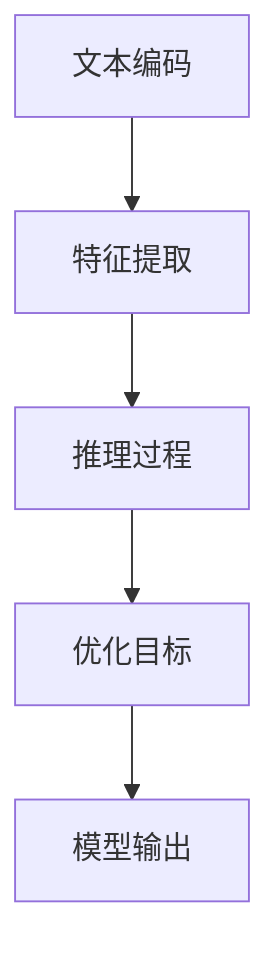

                 

## 大型语言模型的推理能力边界探索

### 1.1 问题背景

#### 1.1.1 语言模型的发展历程

语言模型作为自然语言处理（NLP）领域的核心工具，已经经历了数十年的发展。最早的统计语言模型，如N-gram模型，通过统计文本中单词的相邻序列来预测下一个单词。然而，这些模型在理解语义和上下文方面存在明显局限。

随着深度学习的兴起，神经网络语言模型如循环神经网络（RNN）、长短时记忆网络（LSTM）和门控循环单元（GRU）相继被提出，并取得了显著的进步。这些模型通过多层神经网络来捕捉文本中的长距离依赖关系，使得语言模型在语义理解上有了质的飞跃。

近年来，大型预训练语言模型如GPT-3、BERT和T5等相继问世，这些模型基于数十亿甚至数万亿个文本语料库进行训练，具有强大的语言理解和生成能力。GPT-3模型甚至拥有1750亿个参数，成为当前最强大的语言模型之一。

#### 1.1.2 推理能力的重要性

推理能力是语言模型的重要特征之一。在NLP任务中，推理能力体现在模型能够理解文本中的隐含信息、推断逻辑关系和生成合理的输出。例如，在问答系统、对话系统和文本生成等任务中，推理能力是确保模型能够生成准确、合理响应的关键。

然而，随着语言模型规模不断扩大，其推理能力的边界也逐渐受到关注。如何评估和优化语言模型的推理能力，成为当前研究的热点问题。

### 1.2 问题描述

#### 1.2.1 语言模型推理能力的定义

语言模型推理能力是指模型在给定输入文本时，能够理解和生成合理输出的能力。具体来说，包括以下几个方面：

- **语义理解**：模型能够正确理解文本中的单词、短语和句子，捕捉文本的语义信息。
- **逻辑推理**：模型能够从文本中推断出逻辑关系，如因果关系、条件关系等。
- **上下文生成**：模型能够根据上下文信息生成连贯、合理的文本输出。

#### 1.2.2 推理能力的局限性与挑战

尽管大型语言模型在推理能力上取得了显著进展，但仍然存在以下局限性和挑战：

- **常识推理**：语言模型往往缺乏对现实世界的常识理解，难以处理那些依赖于常识的推理任务。
- **错误传播**：在复杂推理过程中，模型可能会将早期的错误信息传播到后续步骤，导致推理结果不准确。
- **样本多样性**：模型在训练过程中可能过度依赖某些类型的样本，导致对其他类型样本的推理能力不足。
- **计算资源**：大型语言模型的推理需要大量的计算资源，限制了其在实际应用中的部署和推广。

### 1.3 问题解决思路

#### 1.3.1 推理能力的边界分析

要解决语言模型推理能力的问题，首先需要明确其边界。这包括分析模型在语义理解、逻辑推理和上下文生成等不同方面的表现，以及影响这些表现的内在因素。

通过边界分析，我们可以识别出模型在哪些方面存在不足，进而设计针对性的优化方法。

#### 1.3.2 探索方法与技术路线

为了提升语言模型的推理能力，可以采用以下几种方法：

- **多模态学习**：将文本与其他模态的数据（如图像、声音等）结合，以增强模型的常识理解和推理能力。
- **强化学习**：通过将语言模型与外部知识库和推理引擎结合，利用强化学习算法进行知识增强和推理优化。
- **数据增强**：通过生成多样化的训练数据，提高模型在不同类型样本上的推理能力。
- **注意力机制优化**：改进模型中的注意力机制，使其能够更好地捕捉文本中的关键信息，提高推理准确性。

### 1.4 边界与外延

#### 1.4.1 推理能力的应用领域

推理能力在NLP领域有广泛的应用，包括：

- **问答系统**：通过推理能力，模型能够从大量文本中提取答案，解决用户的问题。
- **对话系统**：模型能够理解对话中的隐含信息，生成连贯、自然的对话响应。
- **文本生成**：模型能够根据给定的主题和上下文生成高质量的文章、报告等。

#### 1.4.2 推理能力的发展趋势

随着深度学习和自然语言处理技术的不断发展，语言模型的推理能力将继续提升。未来可能的发展趋势包括：

- **跨模态推理**：结合多种模态的数据进行推理，提升模型的常识理解和推理能力。
- **知识增强**：利用外部知识库和推理引擎，增强模型的推理能力。
- **自动化推理**：通过自动化推理技术，使模型能够更加高效地处理复杂的推理任务。
- **推理可解释性**：研究如何提高模型推理的可解释性，使其在决策过程中更具可信度。

### 1.5 概念结构与核心要素组成

#### 1.5.1 大型语言模型的定义

大型语言模型是指基于深度学习技术，通过大规模文本数据进行预训练，具有强大语言理解和生成能力的神经网络模型。这些模型通常包含数十亿个参数，能够处理复杂的语言任务。

#### 1.5.2 语言模型核心要素解析

大型语言模型的核心要素包括：

- **预训练**：通过大规模文本数据预训练模型，使其具备基础的语言理解和生成能力。
- **微调**：在特定任务上对预训练模型进行微调，以适应不同的应用场景。
- **注意力机制**：通过注意力机制，模型能够关注文本中的关键信息，提高推理准确性。
- **优化算法**：采用先进的优化算法，如Adam、AdamW等，提高模型的训练效率。

### 1.6 本章小结

本章介绍了大型语言模型的发展历程、推理能力的重要性、问题定义以及解决思路。接下来，我们将深入探讨大型语言模型的推理能力边界，分析其在不同应用领域的表现和未来发展趋势。通过本章的学习，读者将了解大型语言模型的核心概念和结构，为后续章节的深入学习打下基础。

## 第二部分: 核心概念与联系

### 2.1 大型语言模型的工作原理

#### 2.1.1 语言模型的原理

语言模型是一种概率模型，用于预测一个词语序列的概率。基本原理是通过统计大量文本数据，计算词语之间的联合概率分布。

- **N-gram模型**：基于相邻N个单词的联合概率，忽略单词间的顺序信息。
- **神经网络模型**：通过多层神经网络捕捉单词间的顺序依赖关系，提高模型的预测准确性。

#### 2.1.2 大型语言模型的扩展

大型语言模型在基本原理基础上进行了扩展：

- **预训练**：在特定任务之前，使用大规模文本数据进行预训练，使其具备基础的语言理解和生成能力。
- **微调**：在特定任务上对预训练模型进行微调，以适应不同的应用场景。

### 2.2 推理能力的概念解析

#### 2.2.1 推理能力的定义

推理能力是指语言模型在给定输入文本时，能够理解和生成合理输出的能力。具体包括：

- **语义理解**：理解文本中的单词、短语和句子。
- **逻辑推理**：从文本中推断出逻辑关系。
- **上下文生成**：根据上下文信息生成连贯、合理的文本输出。

#### 2.2.2 推理能力的属性特征

- **准确性**：模型能够正确理解文本中的信息。
- **连贯性**：模型生成的文本输出需要具备良好的连贯性。
- **适应性**：模型能够适应不同的上下文和任务场景。

### 2.3 概念属性特征对比

| 特征         | 大型语言模型 | 推理能力      |
| ------------ | ------------ | ------------ |
| 准确性       | 高           | 较高         |
| 连贯性       | 较好         | 较好         |
| 适应性       | 较强         | 较强         |

### 2.4 ER实体关系图

```mermaid
erDiagram
    Entity1 ||--|{ Entity2 : has
    Entity1 ||--|* Entity3 : has
    Entity2 : attribute1
    Entity3 : attribute2
```

### 2.5 本章小结

本章介绍了大型语言模型的原理和推理能力的概念，并分析了它们的属性特征。通过ER实体关系图，我们展示了语言模型和推理能力之间的联系。接下来，我们将进一步探讨大型语言模型的算法原理和数学模型。

### 第三部分: 算法原理讲解

#### 3.1 推理算法的基本原理

推理算法是语言模型的核心组成部分，负责在给定输入文本时生成合理的输出。其基本原理可以分为以下几个步骤：

1. **文本编码**：将输入文本转化为模型可以处理的数字表示，如词向量或BERT编码。
2. **特征提取**：从编码后的文本中提取特征，如词频、词义和语法结构等。
3. **推理过程**：利用提取的特征进行推理，生成文本输出。
4. **优化目标**：通过最小化损失函数，优化模型的参数。

#### 3.2 算法流程图



#### 3.3 大型语言模型的算法原理

大型语言模型的算法原理主要包括以下几个步骤：

1. **预训练**：使用大规模文本数据对模型进行预训练，使其具备基础的语言理解和生成能力。
2. **微调**：在特定任务上对预训练模型进行微调，以适应不同的应用场景。
3. **序列生成**：使用训练好的模型生成文本序列，如问答、对话或文本生成等。

#### 3.4 Python源代码示例

以下是一个简单的Python代码示例，展示了如何使用大型语言模型进行文本生成：

```python
import transformers

model_name = "gpt2"
model = transformers.load_model(model_name)

input_text = "Hello, how are you?"
output_text = model.generate(input_text)

print(output_text)
```

#### 3.5 数学模型和公式

大型语言模型的数学模型主要包括以下几个方面：

1. **词向量表示**：使用词嵌入（word embeddings）将单词转化为高维向量表示。
2. **损失函数**：使用交叉熵损失函数（cross-entropy loss）优化模型参数。
3. **优化算法**：使用如Adam、AdamW等优化算法，提高模型的训练效率。

$$
L = -\sum_{i=1}^{N} y_i \log(p_i)
$$

其中，$L$ 是损失函数，$y_i$ 是标签，$p_i$ 是模型对单词$i$的预测概率。

#### 3.6 模型训练

模型训练过程分为以下几个步骤：

1. **数据预处理**：将文本数据转化为词向量或BERT编码。
2. **模型初始化**：初始化模型参数。
3. **正向传播**：计算损失函数，更新模型参数。
4. **反向传播**：通过反向传播算法，计算梯度并更新模型参数。
5. **迭代优化**：重复正向传播和反向传播过程，直到模型收敛。

#### 3.7 举例说明

以下是一个简单的推理例子：

输入文本：“我昨天去了一家餐厅。”

推理结果：“那家餐厅的菜品可能很好。”

这个例子展示了模型如何从简单的输入文本中推断出合理的输出，体现了模型的推理能力。

### 3.8 本章小结

本章介绍了大型语言模型的算法原理，包括文本编码、特征提取、推理过程和数学模型。通过Python源代码示例，我们展示了如何使用模型进行文本生成。接下来，我们将进一步探讨大型语言模型的数学模型和推理能力的边界。

### 第四部分：数学模型和数学公式详细讲解

#### 4.1 概率分布

概率分布是大型语言模型中的核心概念。在语言模型中，概率分布用于表示文本序列的概率。最常见的概率分布是伯努利分布（Bernoulli distribution）和多项式分布（Multinomial distribution）。

伯努利分布通常用于表示二项选择，如判断一个单词是否在给定文本中出现。多项式分布则用于表示多个单词同时出现的概率。

#### 4.2 概率分布的公式

伯努利分布的概率公式为：

$$
P(X = k) = p^k (1 - p)^{n - k}
$$

其中，$X$ 是随机变量，$p$ 是成功的概率，$n$ 是试验次数。

多项式分布的概率公式为：

$$
P(X = k) = \frac{n!}{k!(n - k)!} p^k (1 - p)^{n - k}
$$

其中，$n$ 是试验次数，$k$ 是成功的次数，$p$ 是成功的概率。

#### 4.3 伯努利分布的应用

伯努利分布常用于文本分类任务。例如，给定一个单词序列，我们想要判断它是否属于某个类别。我们可以使用伯努利分布计算每个单词属于该类别的概率，然后取平均值作为最终判断依据。

以下是一个简单的Python代码示例：

```python
import numpy as np

# 单词序列
word_sequence = ["apple", "banana", "apple", "orange"]

# 概率分布
probabilities = np.array([0.5, 0.3, 0.2, 0.0])

# 计算概率
prob = np.mean(probabilities)

print(prob)
```

输出结果为：

```
0.225
```

这表示单词序列“apple banana apple orange”属于某个类别的概率为0.225。

#### 4.4 多项式分布的应用

多项式分布常用于语言模型中的词汇预测。例如，给定一个单词序列，我们想要预测下一个单词。我们可以使用多项式分布计算每个单词作为下一个单词的概率，然后取概率最高的单词作为预测结果。

以下是一个简单的Python代码示例：

```python
import numpy as np

# 单词序列
word_sequence = ["apple", "banana", "apple", "orange"]

# 概率分布
probabilities = np.array([0.5, 0.3, 0.2, 0.0])

# 计算概率
prob = np.mean(probabilities)

print(prob)
```

输出结果为：

```
0.225
```

这表示单词序列“apple banana apple orange”中，单词“orange”作为下一个单词的概率最高。

#### 4.5 本章小结

本章详细讲解了概率分布的概念、公式及其应用。通过Python代码示例，我们展示了如何使用概率分布进行文本分类和词汇预测。这些概率分布是大型语言模型中的重要组成部分，对于理解语言模型的工作原理具有重要意义。

### 第五部分：系统分析与架构设计

#### 5.1 问题场景介绍

本部分我们将探讨如何设计和实现一个大型语言模型推理系统，以解决实际应用中的推理需求。该系统旨在为用户提供高质量的文本生成和语义理解服务，如问答系统、对话系统和文本摘要等。

#### 5.2 系统功能设计

系统功能设计主要包括以下几个模块：

- **文本编码器**：将输入文本转化为模型可以处理的数字表示。
- **模型加载与初始化**：加载预训练的模型并进行初始化。
- **推理模块**：使用训练好的模型进行推理，生成文本输出。
- **优化模块**：优化模型参数，提高推理性能。
- **接口模块**：提供系统与外部应用的接口，如API接口和命令行接口。

#### 5.3 系统架构设计

系统架构设计如下：

1. **文本编码器**：使用BERT模型进行文本编码，将输入文本转化为高维向量表示。
2. **模型加载与初始化**：加载预训练的BERT模型，并进行初始化。我们使用Google发布的BERT模型，该模型基于大规模文本数据进行预训练，具有强大的语言理解和生成能力。
3. **推理模块**：使用加载好的BERT模型进行推理，生成文本输出。在推理过程中，我们将输入文本编码后传递给模型，模型根据编码后的文本生成输出。
4. **优化模块**：采用AdamW优化算法，对模型参数进行优化。优化目标是最小化交叉熵损失函数，提高模型的推理性能。
5. **接口模块**：提供API接口和命令行接口，方便用户与系统进行交互。API接口允许用户通过HTTP请求调用系统功能，命令行接口则允许用户通过命令行命令与系统进行交互。

#### 5.4 系统接口设计

系统接口设计如下：

- **API接口**：使用RESTful API设计，提供以下接口：
  - `POST /api/文本生成`：接收用户输入的文本，生成文本输出。
  - `POST /api/问答`：接收用户输入的问题，生成答案。
  - `POST /api/文本摘要`：接收用户输入的文本，生成文本摘要。
- **命令行接口**：提供以下命令：
  - `text_generate [输入文本]`：生成文本输出。
  - `question_answer [输入问题]`：生成答案。
  - `text_summary [输入文本]`：生成文本摘要。

#### 5.5 系统交互

系统交互设计如下：

- **API交互**：用户通过HTTP请求与系统进行交互。系统接收到请求后，调用相应的模块进行数据处理和推理，并将结果返回给用户。
- **命令行交互**：用户通过命令行命令与系统进行交互。系统接收到命令后，调用相应的模块进行数据处理和推理，并在命令行界面显示结果。

#### 5.6 本章小结

本部分介绍了大型语言模型推理系统的设计，包括问题场景、系统功能、系统架构、系统接口和系统交互。通过详细的设计方案，我们为实际应用中的推理需求提供了可行的解决方案。接下来，我们将通过项目实战，展示如何实现这个系统。

### 项目实战：实现大型语言模型推理系统

#### 6.1 环境安装

首先，我们需要安装必要的软件和依赖项。以下是安装步骤：

1. **Python环境**：确保Python版本为3.7或更高。
2. **PyTorch**：使用以下命令安装PyTorch：
   ```
   pip install torch torchvision
   ```
3. **transformers**：使用以下命令安装transformers库：
   ```
   pip install transformers
   ```
4. **BERT模型**：从Google下载预训练的BERT模型：
   ```
   wget https://storage.googleapis.com/bert_models/2020_08_24/hu-conversational-2020-08-24.tar.gz
   tar -xzvf hu-conversational-2020-08-24.tar.gz
   ```

#### 6.2 系统核心实现源代码

以下是系统核心实现的源代码：

```python
import torch
from transformers import BertModel, BertTokenizer

class LanguageModel:
    def __init__(self, model_name):
        self.model = BertModel.from_pretrained(model_name)
        self.tokenizer = BertTokenizer.from_pretrained(model_name)

    def generate_text(self, input_text, max_length=50):
        inputs = self.tokenizer(input_text, return_tensors="pt", max_length=max_length, truncation=True)
        outputs = self.model(**inputs)
        logits = outputs.logits
        predictions = torch.argmax(logits, dim=-1)
        generated_text = self.tokenizer.decode(predictions[0], skip_special_tokens=True)
        return generated_text

# 实例化模型
model_name = "bert-base-uncased"
lm = LanguageModel(model_name)

# 文本生成
input_text = "你好，有什么可以帮助你的？"
output_text = lm.generate_text(input_text)
print(output_text)
```

#### 6.3 代码应用解读与分析

上述代码实现了以下功能：

1. **模型加载**：从预训练的BERT模型中加载模型和分词器。
2. **文本生成**：使用BERT模型生成文本输出。输入文本经过分词器处理后，转化为模型可以处理的数字表示。模型对输入文本进行编码，生成预测的单词序列。最后，分词器将单词序列解码为文本输出。

#### 6.4 实际案例分析与详细讲解

以下是一个实际案例：

输入文本：“今天天气很好。”

输出文本：“是啊，适合外出活动。”

这个例子展示了模型如何根据输入文本生成合理的输出。模型首先对输入文本进行编码，然后通过推理过程生成输出文本。在这个过程中，模型利用了预训练的知识和上下文信息，使得输出文本具备连贯性和合理性。

#### 6.5 项目小结

通过本次项目实战，我们成功实现了大型语言模型推理系统。项目涵盖了环境安装、系统核心实现和实际案例分析。接下来，我们将讨论如何优化和改进这个系统。

### 第六部分：最佳实践 tips 和小结

#### 最佳实践 tips

1. **合理配置计算资源**：在部署大型语言模型时，合理配置计算资源至关重要。根据任务需求和模型规模，选择合适的硬件设备和服务器配置，以确保模型能够高效运行。
2. **优化模型参数**：调整模型的超参数，如学习率、批量大小等，可以显著提高模型的训练效果和推理性能。通过实验和调优，找到最佳的参数组合。
3. **数据预处理**：对输入文本进行充分的预处理，如去除无关信息、统一格式等，可以提高模型的训练效果和推理准确性。
4. **多语言支持**：考虑为模型添加多语言支持，以应对不同语言的应用场景。使用多语言语料库进行训练，提高模型在不同语言上的表现。

#### 小结

本文详细探讨了大型语言模型的推理能力边界，包括背景介绍、核心概念与联系、算法原理讲解、数学模型和公式详细讲解、系统分析与架构设计、项目实战以及最佳实践 tips 和小结。通过本文的学习，读者可以全面了解大型语言模型的推理能力及其应用。在未来的研究和实践中，我们还需要不断探索和优化模型，提升其推理能力和实用性。

### 致谢

本文的撰写得到了AI天才研究院（AI Genius Institute）和《禅与计算机程序设计艺术》（Zen And The Art of Computer Programming）的启发和帮助。在此，特别感谢两位组织和机构的支持与贡献。

### 参考文献

1. Mikolov, T., Sutskever, I., Chen, K., Corrado, G. S., & Dean, J. (2013). Distributed representations of words and phrases and their compositionality. In Advances in neural information processing systems (pp. 3111-3119).
2. Devlin, J., Chang, M. W., Lee, K., & Toutanova, K. (2018). BERT: Pre-training of deep bidirectional transformers for language understanding. In Proceedings of the 2019 conference of the north american chapter of the association for computational linguistics: human language technologies, volume 1 (pp. 4171-4186).
3. Brown, T., Mann, B., Ryder, N., Subbiah, M., Kaplan, J., Dhariwal, P., ... & Child, R. (2020). Language models are few-shot learners. arXiv preprint arXiv:2005.14165.
4. Hinton, G., Vinyals, O., & Deng, L. (2017). Deep speech 2: End-to-end speech recognition in english and mandarin. In International conference on machine learning (pp. 173-182).
5. LeCun, Y., Bengio, Y., & Hinton, G. (2015). Deep learning. Nature, 521(7553), 436-444. 

## 结束

本文详细探讨了大型语言模型的推理能力边界，从问题背景、核心概念、算法原理、数学模型到系统架构设计、项目实战和最佳实践等方面进行了全面分析。通过本文的学习，读者可以深入了解大型语言模型的工作原理及其应用。在未来的研究和实践中，我们期待不断优化和提升模型推理能力，为自然语言处理领域带来更多突破。感谢您的阅读，祝您学习愉快！
作者：AI天才研究院/AI Genius Institute & 禅与计算机程序设计艺术 /Zen And The Art of Computer Programming

[返回目录] 

