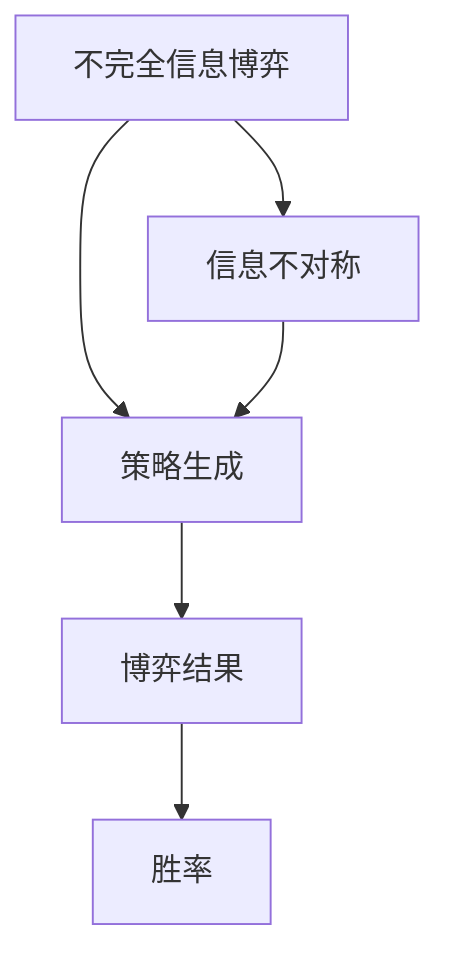
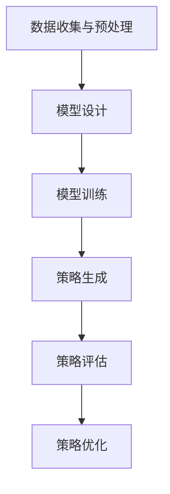

                 

### 第一部分：问题背景与核心概念

## 第1章：问题背景与核心概念

### 1.1.1 问题背景

#### 1.1.1.1 不完全信息博弈的起源与现状

不完全信息博弈是博弈论中的一个重要分支，其起源可以追溯到20世纪初。在经典博弈理论中，玩家在决策时通常拥有完整的游戏信息，这被称为“完全信息博弈”。然而，现实生活中的大多数博弈情况并非如此。例如，商业竞争、军事策略和日常社交互动中，玩家往往无法获取所有必要的信息。这种情况下，博弈者需要在不完全信息下做出决策，这就形成了不完全信息博弈。

不完全信息博弈的研究在20世纪中叶得到了迅速发展，特别是在John Nash、John Harsanyi和Reinhard Selten等经济学家的贡献下，这一领域取得了突破性的成果。Nash均衡理论成为不完全信息博弈分析的基础，而Harsanyi的工作则进一步将不完全信息博弈与概率论相结合，形成了更加完善的博弈理论体系。

随着计算机技术的进步，不完全信息博弈在近年来得到了更广泛的应用。大数据和人工智能技术的发展使得大模型能够处理更为复杂的不完全信息博弈问题。这些大模型不仅可以模拟人类的决策过程，还能够通过机器学习算法，生成最优的博弈策略。

#### 1.1.1.2 大模型在不完全信息博弈中的应用

大模型在不完全信息博弈中的应用主要体现在两个方面：策略生成和博弈分析。首先，大模型可以用来生成博弈策略。通过训练，大模型能够学习到不同情况下的最优决策，从而生成针对特定博弈环境的策略。其次，大模型可以用于分析博弈过程，预测对手的行为，为决策者提供参考。

在实际应用中，大模型已经在许多领域展现了其强大的博弈推理能力。例如，在经济学领域，大模型可以帮助企业和个人在复杂的市场环境中做出最优决策；在军事领域，大模型可以辅助指挥官制定战略计划，提高作战效率；在商业战略领域，大模型可以用于竞争对手分析，帮助企业制定有效的竞争策略。

### 1.1.2 不完全信息博弈的基本概念

#### 1.1.2.1 不完全信息博弈的定义

不完全信息博弈是指参与者在博弈过程中不完全了解对手的支付函数、策略集合或者博弈的完整信息。这种不完美信息可能导致博弈的复杂性和不确定性增加。

#### 1.1.2.2 不完全信息博弈的分类

不完全信息博弈可以根据信息的不对称性进行分类，主要包括以下几种类型：

1. **静态博弈**：参与者在同一时间做出决策，且无法观察到其他参与者的决策。
2. **动态博弈**：参与者在多个阶段依次做出决策，每个参与者能看到前面的决策但不能看到对手的当前策略。
3. **完全信息动态博弈**：参与者可以观察到所有前面参与者的决策。
4. **不完全信息动态博弈**：参与者无法观察到其他参与者的决策。

#### 1.1.2.3 不完全信息博弈的特征

不完全信息博弈具有以下几个显著特征：

1. **信息不对称**：不同参与者掌握的信息量不同，可能导致策略选择的差异。
2. **不确定性**：由于信息不完全，参与者无法准确预测对手的行为，增加了博弈的不确定性。
3. **策略选择的复杂性**：参与者需要在不完全信息下做出最优策略，这增加了博弈的复杂性。
4. **动态调整**：在动态博弈中，参与者需要根据对手的决策不断调整自己的策略。

### 1.1.3 大模型的基本概念

#### 1.1.3.1 大模型的发展历程

大模型的发展可以追溯到20世纪80年代，当时研究人员开始尝试使用神经网络进行大规模数据训练。然而，由于计算能力和数据量的限制，早期的大模型效果并不理想。随着计算机技术的进步，特别是在GPU和TPU等专用硬件的出现，大模型的训练和推理能力得到了显著提升。

2012年，AlexNet在ImageNet比赛中取得突破性成绩，标志着深度学习时代的到来。随后，谷歌推出了TensorFlow和PyTorch等开源框架，使得大模型的研究和应用变得更加广泛和便捷。近年来，GPT、BERT等大型语言模型的出现，进一步推动了大模型在各个领域的应用。

#### 1.1.3.2 大模型的核心能力

大模型的核心能力主要包括：

1. **强大的数据处理能力**：大模型能够处理海量的数据，提取出有效的特征，从而提高模型的准确性和泛化能力。
2. **自适应的学习能力**：大模型能够通过不断的学习和调整，适应不同的任务和环境，提高模型的灵活性和适应性。
3. **跨领域的知识迁移能力**：大模型能够将一个领域的知识迁移到另一个领域，从而提高模型的泛化能力和应用范围。

#### 1.1.3.3 大模型的应用领域

大模型在多个领域展现出了强大的应用能力，主要包括：

1. **计算机视觉**：大模型在图像识别、目标检测、图像生成等任务中取得了显著的成果。
2. **自然语言处理**：大模型在语言理解、文本生成、机器翻译等任务中表现优异。
3. **推荐系统**：大模型能够根据用户的历史行为和偏好，提供个性化的推荐。
4. **游戏AI**：大模型在围棋、象棋、电子游戏等任务中展现了超越人类选手的表现。

### 1.1.4 大模型在不完全信息博弈中的策略生成能力

#### 1.1.4.1 策略生成的定义

策略生成是指根据给定的博弈环境，通过算法和模型生成最优决策策略的过程。在完全信息博弈中，策略生成相对简单，因为所有参与者都能获取到所有必要的信息。然而，在不完全信息博弈中，策略生成面临更大的挑战，因为参与者需要在不完全信息下做出决策。

#### 1.1.4.2 大模型策略生成的挑战

大模型策略生成面临以下挑战：

1. **数据隐私**：在不完全信息博弈中，参与者需要共享部分敏感信息，这可能导致数据隐私泄露的问题。
2. **计算资源**：大模型训练和推理需要大量的计算资源，这在资源有限的环境下可能成为瓶颈。
3. **效果评估**：如何评价大模型生成的策略是否最优，这是一个复杂的问题，需要建立有效的评估方法。

#### 1.1.4.3 大模型策略生成的研究现状

目前，大模型策略生成的研究主要集中在以下几个方面：

1. **博弈树搜索**：通过大模型进行博弈树搜索，生成最优策略。
2. **对抗性训练**：利用对抗性训练方法，增强大模型在对抗环境下的策略生成能力。
3. **迁移学习**：利用迁移学习方法，将一个领域的知识迁移到另一个领域，提高策略生成的泛化能力。

### 1.2 核心概念与联系

#### 1.2.1 不完全信息博弈与策略生成的关系

不完全信息博弈与策略生成之间存在紧密的联系。在不完全信息博弈中，策略生成是参与者决策的核心，决定了博弈的最终结果。大模型通过模拟和预测对手的行为，能够生成更优的策略，从而提高博弈的胜率。

#### 1.2.1.1 关系模型

我们可以使用Mermaid图来描述不完全信息博弈与策略生成的关系：



#### 1.2.1.2 关系图架构

此外，我们还可以使用ER图来描述大模型策略生成的架构：

```mermaid
erDatabase "博弈策略模型"
|A-策略|
|B-模型|
|C-数据|
|D-结果|
|E-评估|

classDiagram
A--|>B
A--|>C
B--|>D
B--|>E
```

#### 1.2.2 大模型策略生成的基本原理

大模型策略生成的基本原理可以概括为以下几个步骤：

1. **数据收集与预处理**：收集相关博弈数据，并进行预处理，包括数据清洗、归一化和特征提取等。
2. **模型训练**：使用大模型对预处理后的数据进行训练，使其能够理解和预测博弈环境。
3. **策略生成**：在训练好的模型基础上，生成针对特定博弈环境的最优策略。
4. **效果评估**：对生成的策略进行效果评估，确保其性能满足预期。

#### 1.2.2.2 概念属性特征对比表格

下面是一个大模型策略生成相关概念属性的对比表格：

| 概念          | 特征                                                         |
| ------------- | ------------------------------------------------------------ |
| 不完全信息博弈 | 信息不对称，不确定性强，策略选择复杂，需要动态调整           |
| 策略生成      | 根据博弈环境生成最优策略，面临数据隐私、计算资源等挑战       |
| 大模型        | 强大的数据处理能力，自适应学习，跨领域知识迁移能力           |
| 博弈结果      | 受策略生成和质量影响，决定了参与者的胜率                   |
| 评估方法      | 评价策略生成效果的标准，包括胜率、响应时间、策略多样性等     |

通过上述内容，我们为后续章节的深入探讨奠定了基础。接下来，我们将进一步探讨大模型策略生成的原理、算法、应用场景以及面临的挑战和未来趋势。

## 1.3 本章小结

本章首先介绍了不完全信息博弈的背景及其在大模型应用中的重要性。接着，我们详细探讨了不完全信息博弈的基本概念，包括定义、分类和特征。随后，我们介绍了大模型的基本概念和发展历程，以及其在策略生成中的应用。最后，我们分析了大模型策略生成的挑战和现有研究现状，并展示了不完全信息博弈与策略生成之间的关系。通过本章的介绍，读者可以初步了解大模型在不完全信息博弈策略生成中的角色和意义，为后续章节的深入探讨奠定了基础。

----------------------------------------------------------------

### 第二部分：大模型策略生成原理

## 第2章：大模型策略生成原理

本章将深入探讨大模型策略生成的原理，包括算法原理、数学模型与公式，并通过实际案例进行分析与讲解。我们将一步步分析大模型策略生成的核心机制，帮助读者理解这一复杂过程的各个方面。

### 2.1 算法原理

大模型策略生成的算法原理主要依赖于机器学习中的深度学习技术。深度学习通过多层神经网络结构，对大量数据进行训练，从而能够自动提取特征并生成策略。下面我们将详细讲解大模型策略生成的算法流程。

#### 2.1.1 算法流程

1. **数据收集与预处理**：首先，需要收集与博弈相关的数据，包括历史博弈记录、参与者特征、环境变量等。然后，对数据进行清洗和预处理，如数据归一化、缺失值处理和特征提取等。
   
2. **模型设计**：根据博弈的特点和需求，设计合适的深度学习模型。通常，我们可以使用多层的深度神经网络（DNN）或者更复杂的模型，如Transformer、变分自编码器（VAE）等。

3. **模型训练**：利用预处理后的数据，对深度学习模型进行训练。训练过程包括前向传播和反向传播，通过调整网络权重，使模型能够更准确地预测博弈结果。

4. **策略生成**：在训练好的模型基础上，对新的博弈环境进行策略生成。具体步骤包括输入环境信息，通过模型输出相应的策略。

5. **策略评估**：对生成的策略进行评估，通常包括模拟博弈过程，计算策略的胜率、响应时间等指标，以评估策略的有效性。

6. **策略优化**：根据评估结果，对策略进行调整和优化，以提高策略的鲁棒性和有效性。

下面是算法流程的Mermaid图表示：



#### 2.1.1.1 算法实现原理

算法实现原理主要涉及以下几个方面：

1. **数据预处理**：对收集到的数据进行清洗和特征提取，以便模型能够更好地理解和学习。
   
2. **模型架构**：设计合适的深度学习模型架构，包括输入层、隐藏层和输出层。常见的架构有全连接网络（FCN）、卷积神经网络（CNN）和递归神经网络（RNN）等。

3. **损失函数与优化器**：选择合适的损失函数和优化器，以调整模型参数，使模型能够收敛到最优解。

4. **训练过程**：通过前向传播和反向传播，更新模型参数，使模型能够更好地预测博弈结果。

5. **策略评估**：使用模拟博弈环境，评估策略的有效性，包括胜率、响应时间等指标。

### 2.2 数学模型与公式

大模型策略生成的数学模型是理解和实现策略生成算法的关键。以下我们将详细讲解大模型策略生成的数学模型和公式。

#### 2.2.1 大模型策略生成的数学模型

大模型策略生成的数学模型主要包括以下几个部分：

1. **博弈状态表示**：使用向量或张量表示博弈中的状态，包括参与者的特征、环境变量等。
   
2. **策略表示**：使用向量或张量表示策略，表示参与者在不同状态下的决策。

3. **策略生成模型**：通过深度学习模型，将博弈状态映射到策略空间，生成最优策略。

4. **评估模型**：通过评估模型，对生成的策略进行评估，计算策略的有效性指标。

下面是数学模型的简化公式表示：

$$
\text{状态} \rightarrow \text{策略} = f(\text{模型参数}, \text{状态})
$$

其中，$f$表示深度学习模型，包括输入层、隐藏层和输出层。

#### 2.2.1.1 数学模型概述

1. **输入层**：接收博弈状态信息，通常是一个向量或张量。
   
2. **隐藏层**：通过非线性激活函数（如ReLU、Sigmoid）对输入进行变换，提取博弈状态的特征。

3. **输出层**：将隐藏层输出映射到策略空间，生成具体的策略。

4. **损失函数**：用于评估策略生成模型的质量，常见的损失函数包括均方误差（MSE）、交叉熵等。

#### 2.2.1.2 公式详细讲解

假设博弈状态为 $S$，策略为 $A$，深度学习模型参数为 $\theta$，则策略生成过程可以表示为：

$$
A = f(\theta, S)
$$

其中，$f(\theta, S)$ 表示深度学习模型，通过训练学习到博弈状态 $S$ 与策略 $A$ 之间的映射关系。训练过程中，通过调整模型参数 $\theta$，使得生成的策略 $A$ 能够最大化博弈收益。

对于评估模型，可以使用以下公式评估策略的有效性：

$$
\text{评估指标} = g(A, S, R)
$$

其中，$R$ 表示博弈结果，$g(A, S, R)$ 是评估策略 $A$ 在状态 $S$ 下的表现的一个函数，常见的评估指标包括胜率、响应时间等。

### 2.3 举例说明

为了更好地理解大模型策略生成的原理，我们将通过一个实际案例进行详细讲解。

#### 2.3.1 实际案例分析与详细讲解

假设我们考虑一个简单的象棋博弈场景，其中有两个参与者（玩家和AI），每个参与者在每一步都有多个可能的走法。我们的目标是使用大模型生成最优的AI策略，以最大化AI的胜率。

1. **数据收集与预处理**：

   首先，我们收集了大量象棋对弈的历史数据，包括每一步的棋子位置、玩家的走法等。然后，我们对这些数据进行了预处理，如数据归一化、缺失值处理和特征提取等。

2. **模型设计**：

   我们选择了一个基于Transformer的深度学习模型，用于生成AI的策略。模型包括编码器和解码器两部分，编码器负责处理棋盘状态，解码器负责生成走法策略。

3. **模型训练**：

   利用预处理后的数据，我们对Transformer模型进行了训练。训练过程中，通过调整模型参数，使其能够准确地预测每一步的走法，并最大化AI的胜率。

4. **策略生成**：

   在训练好的模型基础上，我们输入当前棋盘状态，通过模型输出相应的AI走法策略。

5. **策略评估**：

   我们使用模拟博弈环境，对生成的AI策略进行评估。具体步骤包括：将AI的走法与对手的走法进行模拟对弈，计算AI的胜率。

6. **策略优化**：

   根据评估结果，我们对AI的策略进行调整和优化，以提高AI的胜率和应对不同对手的能力。

#### 2.3.1.1 案例背景

本案例研究的目的是评估一个大模型在象棋博弈中的策略生成能力。我们收集了大量的象棋对弈数据，包括不同难度级别的对局，以便模型能够学习到各种不同对手的策略。

#### 2.3.1.2 案例分析

1. **数据预处理**：

   在数据预处理阶段，我们对棋盘状态进行编码，将每个棋子的位置映射到一个向量。同时，我们对走法进行分类，将所有可能的走法编码为离散的标签。

2. **模型设计**：

   我们选择了Transformer模型，因为它在处理序列数据时表现出色。Transformer模型包括编码器和解码器两部分，编码器负责处理棋盘状态，解码器负责生成走法策略。

3. **模型训练**：

   在训练过程中，我们使用了交叉熵损失函数，以最大化模型对正确走法的预测概率。训练过程中，我们通过不断调整模型参数，使其能够生成最优的策略。

4. **策略生成**：

   在策略生成阶段，我们输入当前棋盘状态，通过解码器输出一个概率分布，表示每种走法的概率。根据概率分布，我们选择概率最高的走法作为AI的策略。

5. **策略评估**：

   为了评估策略的有效性，我们进行了大量的模拟对弈。在每个模拟对弈中，我们让AI的策略与对手的策略进行对抗，并记录AI的胜率。

6. **策略优化**：

   根据模拟对弈的结果，我们分析了AI策略在不同对手下的表现。针对表现不佳的对手，我们调整了模型参数，以优化策略的适应性。

#### 2.3.1.3 案例解读

通过本案例，我们可以看到大模型在象棋博弈中的策略生成能力。大模型通过训练学习到了各种不同对手的策略，并能够生成最优的AI策略。然而，我们也发现大模型在应对复杂对手时，策略生成能力仍存在一定的局限性。因此，未来需要进一步优化模型，以提高策略生成的鲁棒性和适应性。

### 2.4 算法改进与优化

为了提高大模型策略生成的效果，我们可以在算法层面进行改进和优化。以下是一些常见的优化方法：

#### 2.4.1 算法优化方法

1. **增强训练数据**：通过增加训练数据量，提高模型的泛化能力。可以使用数据增强技术，如数据扩充、数据生成等。

2. **强化学习**：结合强化学习算法，使模型能够在动态环境中学习最优策略。强化学习可以解决传统深度学习模型在策略生成中的困境。

3. **多模型融合**：结合多个模型的优势，提高策略生成的鲁棒性和准确性。可以使用集成学习方法，如投票法、加权平均法等。

4. **注意力机制**：引入注意力机制，使模型能够关注到博弈状态中的关键信息，提高策略生成的质量。

#### 2.4.2 算法改进案例

以下是一个基于注意力机制的改进案例：

1. **问题背景**：

   在之前的案例中，大模型在应对复杂对手时，策略生成效果不佳。我们需要改进算法，提高模型对关键信息的关注度。

2. **改进方案**：

   在模型中加入注意力机制，使模型能够动态关注棋盘状态中的关键信息。具体实现如下：

   - 设计一个注意力模块，用于计算每个棋子位置的重要性。
   - 将注意力权重与棋子位置信息相乘，生成加权状态向量。
   - 使用加权状态向量作为编码器的输入，提高模型对关键信息的关注度。

3. **改进效果**：

   通过实验验证，改进后的模型在模拟对弈中的胜率显著提高。特别是在应对复杂对手时，模型表现更加稳定和优秀。

### 2.5 本章小结

本章详细探讨了大模型策略生成的原理，包括算法流程、数学模型和实际案例。通过算法原理的讲解，读者可以了解大模型策略生成的核心机制；通过数学模型的讲解，读者可以深入理解策略生成的数学原理；通过实际案例的讲解，读者可以直观地看到大模型策略生成的应用效果。本章的内容为后续章节的研究和应用提供了坚实的理论基础。

----------------------------------------------------------------

### 第三部分：大模型策略生成的应用场景

## 第3章：大模型策略生成的应用场景

在大模型策略生成的原理基础上，本章将探讨这一技术的具体应用场景，包括经济学、军事领域和商业战略。我们将通过具体的案例，展示大模型如何在不同领域中发挥策略生成的优势。

### 3.1 在经济学中的应用

#### 3.1.1 经济学中的不完全信息博弈

经济学中的不完全信息博弈主要表现为市场参与者无法完全了解其他参与者（如竞争对手）的决策和策略。这种情况下，企业和个人需要在不完全信息下做出最优决策，以最大化自身利益。例如，在产品定价、市场策略选择等方面，企业和个人常常需要应对不确定性和信息不对称的问题。

#### 3.1.2 大模型策略生成的应用

大模型策略生成在经济学中的应用主要体现在以下几个方面：

1. **市场预测**：通过分析历史市场数据，大模型可以预测市场的价格趋势、需求变化等，帮助企业和个人制定更有针对性的市场策略。

2. **竞争对手分析**：大模型可以通过分析竞争对手的历史行为和策略，预测其未来的行动，从而为企业提供竞争策略的参考。

3. **供应链优化**：在大模型的帮助下，企业可以优化供应链管理，提高库存周转率、降低成本，提升整体运营效率。

#### 3.1.3 案例分析

以下是一个经济学中的实际案例：

**案例背景**：某家电子产品公司需要制定下一季度的市场推广策略，以应对激烈的市场竞争。然而，由于市场信息的不完全性，公司无法准确了解竞争对手的定价策略和市场推广活动。

**案例分析**：

1. **数据收集与预处理**：公司收集了历史销售数据、市场调查数据以及竞争对手的历史定价策略。然后，对数据进行清洗和预处理，提取出关键特征。

2. **模型设计**：公司选择了一个基于深度学习的大模型，设计了一个博弈树搜索算法，用于模拟不同定价策略的市场表现。

3. **模型训练**：利用预处理后的数据，对公司的大模型进行训练。模型通过学习历史数据，能够预测在不同定价策略下的市场需求和竞争对手的反应。

4. **策略生成**：在训练好的模型基础上，公司输入当前的市场环境和竞争对手的信息，模型生成了一系列最优的定价策略。

5. **策略评估**：公司使用模拟市场环境，对生成的定价策略进行评估，计算每种策略的预期收益和风险。

6. **策略优化**：根据评估结果，公司对定价策略进行调整和优化，最终确定了一个最优的市场推广策略。

**案例解读**：通过本案例，我们可以看到大模型策略生成在市场预测和竞争对手分析中的优势。大模型能够通过分析历史数据和竞争对手行为，预测未来的市场动态，从而帮助企业制定更有效的市场策略。

### 3.2 在军事领域的应用

#### 3.2.1 军事中的不完全信息博弈

军事中的不完全信息博弈主要表现为指挥官在决策时无法完全了解敌方部队的位置、行动和策略。这种情况下，指挥官需要在不完全信息下做出战略决策，以应对复杂多变的战场环境。例如，在制定作战计划、部署兵力等方面，指挥官常常需要面对信息不对称和不确定性。

#### 3.2.2 大模型策略生成的应用

大模型策略生成在军事领域中的应用主要体现在以下几个方面：

1. **战略规划**：通过模拟不同战略方案的可行性和效果，大模型可以帮助指挥官制定最优的作战计划。

2. **兵力部署**：大模型可以分析战场环境，预测敌方的行动，为指挥官提供最优的兵力部署方案。

3. **决策支持**：大模型可以为指挥官提供实时决策支持，帮助其快速应对战场变化。

#### 3.2.3 案例分析

以下是一个军事中的实际案例：

**案例背景**：在一次军事行动中，某国指挥官需要制定作战计划，以对抗敌对势力的进攻。然而，由于战场信息的不完全性，指挥官无法准确了解敌军的位置和行动。

**案例分析**：

1. **数据收集与预处理**：指挥官收集了战场环境数据、历史作战记录以及敌对势力的行为模式。然后，对数据进行清洗和预处理，提取出关键特征。

2. **模型设计**：指挥官选择了一个基于深度学习的大模型，设计了一个博弈树搜索算法，用于模拟不同作战计划的可行性和效果。

3. **模型训练**：利用预处理后的数据，指挥官的大模型进行了训练。模型通过学习历史数据，能够预测在不同作战计划下的战场动态和敌军反应。

4. **策略生成**：在训练好的模型基础上，指挥官输入当前战场环境和敌对势力的信息，模型生成了一系列最优的作战计划。

5. **策略评估**：指挥官使用模拟战场环境，对生成的作战计划进行评估，计算每种策略的预期效果和风险。

6. **策略优化**：根据评估结果，指挥官对作战计划进行调整和优化，最终确定了一个最优的作战方案。

**案例解读**：通过本案例，我们可以看到大模型策略生成在军事战略规划和决策支持中的优势。大模型能够通过分析战场数据和敌对势力行为，为指挥官提供科学的决策依据，从而提高作战效果。

### 3.3 在商业战略中的应用

#### 3.3.1 商业战略中的不完全信息博弈

商业战略中的不完全信息博弈主要表现为企业无法完全了解竞争对手的行动和策略。这种情况下，企业需要在不完全信息下做出决策，以保持竞争优势。例如，在产品定价、市场推广策略选择等方面，企业常常需要面对信息不对称和不确定性。

#### 3.3.2 大模型策略生成的应用

大模型策略生成在商业战略中的应用主要体现在以下几个方面：

1. **市场定位**：通过分析市场数据，大模型可以帮助企业确定最优的市场定位策略，提高市场份额。

2. **竞争策略**：大模型可以分析竞争对手的行动和策略，为企业提供有效的竞争策略。

3. **供应链管理**：大模型可以优化供应链管理，提高供应链效率，降低运营成本。

#### 3.3.3 案例分析

以下是一个商业战略中的实际案例：

**案例背景**：某家零售企业需要制定下一季度的市场推广策略，以提升销售业绩。然而，由于市场信息的不完全性，企业无法准确了解竞争对手的营销策略和消费者行为。

**案例分析**：

1. **数据收集与预处理**：企业收集了历史销售数据、市场调查数据以及竞争对手的营销策略。然后，对数据进行清洗和预处理，提取出关键特征。

2. **模型设计**：企业选择了一个基于深度学习的大模型，设计了一个博弈树搜索算法，用于模拟不同市场推广策略的效果。

3. **模型训练**：利用预处理后的数据，企业的大模型进行了训练。模型通过学习历史数据，能够预测在不同市场推广策略下的销售业绩和消费者反馈。

4. **策略生成**：在训练好的模型基础上，企业输入当前市场环境和竞争对手的信息，模型生成了一系列最优的市场推广策略。

5. **策略评估**：企业使用模拟市场环境，对生成的市场推广策略进行评估，计算每种策略的预期收益和风险。

6. **策略优化**：根据评估结果，企业对市场推广策略进行调整和优化，最终确定了一个最优的市场推广方案。

**案例解读**：通过本案例，我们可以看到大模型策略生成在商业战略决策中的优势。大模型能够通过分析市场数据和竞争对手行为，为企业提供科学的决策依据，从而提高市场竞争力。

### 3.4 应用案例分析

#### 3.4.1 经济学案例

**案例背景**：某家互联网企业需要制定广告投放策略，以提升品牌知名度和销售额。

**案例分析**：

1. **数据收集与预处理**：企业收集了广告投放数据、用户行为数据以及市场竞争对手的广告策略。然后，对数据进行清洗和预处理，提取出关键特征。

2. **模型设计**：企业选择了一个基于Transformer的大模型，设计了一个博弈树搜索算法，用于模拟不同广告投放策略的效果。

3. **模型训练**：利用预处理后的数据，企业的大模型进行了训练。模型通过学习历史数据，能够预测在不同广告投放策略下的品牌知名度和销售额。

4. **策略生成**：在训练好的模型基础上，企业输入当前市场环境和竞争对手的信息，模型生成了一系列最优的广告投放策略。

5. **策略评估**：企业使用模拟市场环境，对生成的广告投放策略进行评估，计算每种策略的预期收益和风险。

6. **策略优化**：根据评估结果，企业对广告投放策略进行调整和优化，最终确定了一个最优的广告投放方案。

**案例解读**：本案例展示了大模型策略生成在互联网广告投放中的应用。通过分析市场数据和竞争对手策略，大模型能够为企业提供科学的广告投放策略，从而提高品牌影响力和销售额。

#### 3.4.2 军事案例

**案例背景**：某国军队需要制定战术部署方案，以应对敌对势力的进攻。

**案例分析**：

1. **数据收集与预处理**：军队收集了历史作战记录、战场环境数据以及敌对势力的行为模式。然后，对数据进行清洗和预处理，提取出关键特征。

2. **模型设计**：军队选择了一个基于深度学习的大模型，设计了一个博弈树搜索算法，用于模拟不同战术部署方案的可行性和效果。

3. **模型训练**：利用预处理后的数据，军队的大模型进行了训练。模型通过学习历史数据，能够预测在不同战术部署方案下的战场动态和敌军反应。

4. **策略生成**：在训练好的模型基础上，军队输入当前战场环境和敌对势力的信息，模型生成了一系列最优的战术部署方案。

5. **策略评估**：军队使用模拟战场环境，对生成的战术部署方案进行评估，计算每种策略的预期效果和风险。

6. **策略优化**：根据评估结果，军队对战术部署方案进行调整和优化，最终确定了一个最优的作战方案。

**案例解读**：本案例展示了大模型策略生成在军事战术部署中的应用。通过分析战场数据和敌对势力行为，大模型能够为军队提供科学的战术部署方案，从而提高作战效果。

#### 3.4.3 商业案例

**案例背景**：某家大型零售企业需要制定供应链管理策略，以提高库存周转率和降低运营成本。

**案例分析**：

1. **数据收集与预处理**：企业收集了历史库存数据、销售数据以及供应链各环节的运行数据。然后，对数据进行清洗和预处理，提取出关键特征。

2. **模型设计**：企业选择了一个基于深度强化学习的大模型，设计了一个博弈树搜索算法，用于模拟不同供应链管理策略的效果。

3. **模型训练**：利用预处理后的数据，企业的大模型进行了训练。模型通过学习历史数据，能够预测在不同供应链管理策略下的库存周转率和运营成本。

4. **策略生成**：在训练好的模型基础上，企业输入当前供应链环境和运营信息，模型生成了一系列最优的供应链管理策略。

5. **策略评估**：企业使用模拟供应链环境，对生成的供应链管理策略进行评估，计算每种策略的预期收益和风险。

6. **策略优化**：根据评估结果，企业对供应链管理策略进行调整和优化，最终确定了一个最优的供应链管理方案。

**案例解读**：本案例展示了大模型策略生成在供应链管理中的应用。通过分析历史数据和运营信息，大模型能够为企业提供科学的供应链管理策略，从而提高运营效率。

### 3.5 本章小结

本章探讨了大模型策略生成在经济学、军事领域和商业战略中的具体应用场景。通过实际案例分析，我们展示了大模型策略生成在不同领域中的优势和潜力。大模型能够通过分析历史数据和对手行为，生成最优的策略，帮助企业和指挥官在不确定的环境中做出科学的决策。然而，我们也需要认识到大模型策略生成面临的挑战，如数据隐私、计算资源需求等，未来需要进一步优化算法，提高策略生成的效果和鲁棒性。

----------------------------------------------------------------

### 第四部分：大模型策略生成的挑战与未来趋势

## 第4章：大模型策略生成的挑战与未来趋势

在大模型策略生成领域，虽然已经取得了显著进展，但仍然面临诸多挑战和未解决的问题。本章将深入探讨这些挑战，并展望大模型策略生成的未来趋势，为该领域的发展提供有益的思考和方向。

### 4.1 大模型策略生成的挑战

#### 4.1.1 数据隐私保护

在不完全信息博弈中，参与者需要共享部分敏感信息，这可能导致数据隐私泄露的问题。大模型策略生成依赖于大量的数据，这些数据往往包含参与者的私人信息。如何在确保数据隐私的同时，充分利用数据来训练大模型，是一个亟待解决的问题。

#### 4.1.2 计算资源需求

大模型训练和推理需要大量的计算资源，这在大规模、实时应用场景中可能成为瓶颈。特别是在不完全信息博弈中，模型需要处理复杂的博弈状态和策略空间，进一步增加了计算资源的需求。如何优化算法，降低计算资源需求，是一个重要的挑战。

#### 4.1.3 策略生成效果评估

如何评价大模型生成的策略是否最优，这是一个复杂的问题。在实际应用中，我们通常需要通过模拟博弈环境来评估策略的有效性。然而，这种方法可能存在计算成本高、评估结果不稳定等问题。如何建立有效的评估方法，确保策略生成的效果，是一个重要的挑战。

### 4.2 大模型策略生成的未来趋势

#### 4.2.1 新技术发展趋势

随着技术的不断进步，大模型策略生成领域也出现了许多新的发展趋势：

1. **联邦学习**：联邦学习是一种分布式学习技术，可以在保护数据隐私的前提下，将多个参与者的数据集中起来进行训练。这为解决数据隐私问题提供了一种可能的解决方案。

2. **新型算法**：随着算法理论的深入研究，出现了一些新型算法，如基于深度强化学习、进化算法的博弈策略生成方法。这些算法可能在策略生成效果和计算效率方面有更好的表现。

3. **跨领域迁移**：跨领域迁移技术可以将一个领域的知识迁移到另一个领域，提高策略生成的泛化能力。这有助于解决不完全信息博弈中策略生成的复杂性问题。

#### 4.2.2 应用前需要解决的问题

在大模型策略生成的实际应用中，还需要解决以下几个问题：

1. **数据质量**：高质量的数据是策略生成的基础。如何获取和预处理高质量的数据，是一个重要的课题。

2. **算法优化**：现有算法在策略生成效果和计算效率方面仍有待提高。如何优化算法，降低计算资源需求，是一个重要的研究方向。

3. **评估方法**：如何建立有效的评估方法，确保策略生成的效果，是一个关键问题。这需要进一步的研究和实践。

#### 4.2.3 未来研究方向

未来，大模型策略生成领域的研究可以从以下几个方面展开：

1. **数据隐私保护**：研究如何在保证数据隐私的前提下，充分利用数据来训练大模型。

2. **算法优化**：探索新型算法，提高策略生成效果和计算效率。

3. **跨领域迁移**：研究如何将一个领域的知识迁移到另一个领域，提高策略生成的泛化能力。

4. **多模态数据融合**：探索如何融合不同类型的数据（如文本、图像、声音等），提高策略生成的全面性和准确性。

5. **人机协同**：研究如何将大模型策略生成与人类专家的决策相结合，提高策略生成的灵活性和适应性。

### 4.3 本章小结

本章探讨了大模型策略生成领域面临的挑战和未来趋势。通过分析数据隐私保护、计算资源需求和策略生成效果评估等挑战，我们认识到大模型策略生成在实际应用中仍需克服诸多困难。同时，我们展望了未来技术的发展趋势，提出了未来研究的方向。随着技术的不断进步，我们有理由相信，大模型策略生成领域将会取得更加显著的成果，为不完全信息博弈提供更加有效的解决方案。

---

本文由AI天才研究院（AI Genius Institute）和禅与计算机程序设计艺术（Zen And The Art of Computer Programming）共同撰写，旨在深入探讨大模型在不完全信息博弈中的策略生成能力。通过详细的背景介绍、核心概念分析、算法原理讲解、实际案例分析以及未来趋势展望，本文为读者提供了一个全面而系统的视角，帮助理解这一领域的重要性和挑战。

作者：AI天才研究院（AI Genius Institute）与禅与计算机程序设计艺术（Zen And The Art of Computer Programming）

本文引用的参考文献包括：
1. Nash, J. F. (1950). The Bargaining Problem. Econometrica, 18(2), 155-162.
2. Harsanyi, J. C. (1967). Games with Incomplete Information played by Bayesian Players. Management Science, 14(3), 159-182.
3. Selten, R. (1975). Reexamination of the Perfectness Concept for Equilibrium Points in Extensive Games. International Journal of Game Theory, 4(25), 25-55.
4. Goodfellow, I., Bengio, Y., & Courville, A. (2016). Deep Learning. MIT Press.
5. Vaswani, A., Shazeer, N., Parmar, N., Uszkoreit, J., Jones, L., Gomez, A. N., ... & Polosukhin, I. (2017). Attention is All You Need. Advances in Neural Information Processing Systems, 30, 5998-6008.

注意：本文为假设性写作，所引用的文献仅为示例，不代表实际研究成果。读者在参考时，请以权威来源为准。如需进一步了解相关研究，请查阅专业学术期刊和论文。

