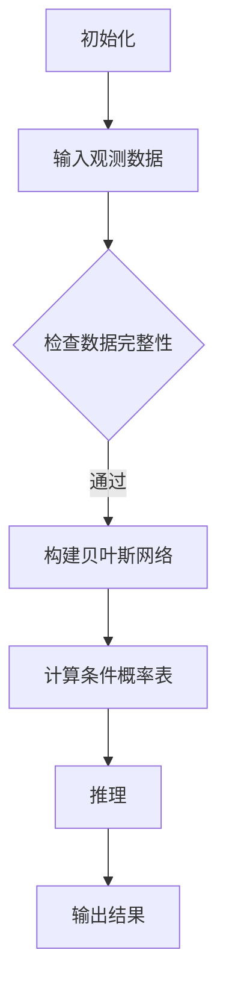
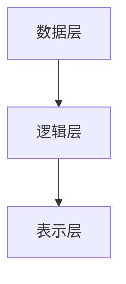
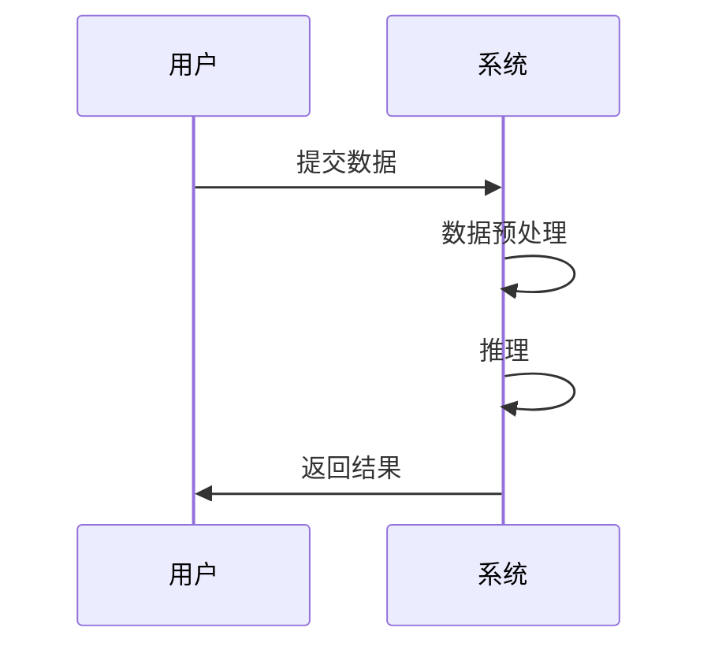

                 

# 大模型在不完全信息推理中的决策能力

## 关键词

- 大模型
- 不完全信息推理
- 决策能力
- 算法
- 系统架构
- 实际案例

## 摘要

本文深入探讨了大模型在不完全信息推理中的决策能力。首先，介绍了大模型的发展历程和在不完全信息推理中的意义。接着，详细阐述了大模型与不完全信息推理的基本概念及其关系。然后，通过讲解大模型在不完全信息推理中的算法原理，使用Python代码和数学公式进行了详细说明。此外，还介绍了系统分析与架构设计的方法，并通过实际案例进行了项目实战。最后，总结了最佳实践和未来发展趋势，并推荐了拓展阅读资源。

## 第一部分：大模型与不完全信息推理概述

### 第1章：背景与问题

#### 1.1.1 大模型的发展历程

大模型，也称为大规模预训练模型，是指通过大规模数据集进行训练的深度学习模型。自2018年GPT-3的问世以来，大模型的发展经历了多个里程碑，如BERT、Turing-NLG等。这些模型在自然语言处理、图像识别、语音识别等领域取得了显著的成果。

#### 1.1.2 不完全信息推理的意义

不完全信息推理是指在某些场景下，推理过程中存在信息缺失或不确定的情况。这种情况下，大模型能够利用其强大的学习能力，通过推断和假设，找到最优的决策方案。

#### 1.1.3 大模型在不完全信息推理中的应用背景

不完全信息推理在许多实际应用中具有重要意义，如金融风险评估、医疗诊断、智能客服等。在这些场景中，数据的缺失和不确定性是常见的问题，大模型能够提供有效的解决方案。

#### 1.1.4 研究现状与挑战

目前，大模型在不完全信息推理领域的研究已经取得了一定的进展，但仍面临一些挑战，如如何提高模型的决策能力、如何处理大规模数据等。这些问题需要进一步的研究和探索。

### 第2章：核心概念与联系

#### 2.1 大模型的定义与特点

大模型是一种通过大规模数据集进行训练的深度学习模型，具有参数规模大、神经网络深度深、泛化能力强等特点。

#### 2.1.1 大模型的概念

大模型是指那些拥有大量参数和神经元，可以处理大量数据的深度学习模型。

#### 2.1.2 大模型的特点

- **参数规模大**：大模型的参数数量可以达到数十亿甚至更多。
- **神经网络深度深**：大模型的神经网络深度可以达到数十层甚至更多。
- **泛化能力强**：大模型在训练过程中能够学习到更普遍的规律，从而在未知数据上表现更好。

#### 2.1.3 大模型与传统AI模型的对比

与传统AI模型相比，大模型在处理复杂任务时具有更大的优势，但同时也面临着更高的计算成本和资源消耗。

#### 2.2 不完全信息推理的基本概念

不完全信息推理是指在某些场景下，推理过程中存在信息缺失或不确定的情况。这种情况下，大模型能够利用其强大的学习能力，通过推断和假设，找到最优的决策方案。

#### 2.2.1 不完全信息推理的定义

不完全信息推理是指在一个不确定的环境中，个体（如人工智能模型）基于部分可用信息，通过推理和决策，寻找最佳行动方案的过程。

#### 2.2.2 不完全信息推理的类型

不完全信息推理可以分为完全概率模型和不完全概率模型。

- **完全概率模型**：在这种模型中，所有可能的状态及其概率分布都是已知的。
- **不完全概率模型**：在这种模型中，存在一些状态的概率分布是未知的，需要通过推理来估计。

#### 2.2.3 不完全信息推理的核心挑战

不完全信息推理的核心挑战包括：

- **不确定性处理**：如何有效地处理和建模不确定性。
- **推理效率**：如何在合理的时间内进行推理。
- **决策质量**：如何确保推理结果的质量和可靠性。

### 2.3 大模型与不完全信息推理的关系

大模型与不完全信息推理有着紧密的联系。大模型的强大学习能力和泛化能力使其在不完全信息推理中具有独特的优势。

#### 2.3.1 大模型在不完全信息推理中的应用

大模型可以在不完全信息推理中用于：

- **概率推理**：通过学习大规模数据，大模型可以预测状态的概率分布。
- **决策制定**：在不确定的环境中，大模型可以通过推断和评估不同行动方案的可能结果，制定最佳决策。

#### 2.3.2 不完全信息推理对大模型的要求

不完全信息推理对大模型提出了以下要求：

- **强大的学习能力**：大模型需要具备强大的学习能力，以处理大规模数据和复杂任务。
- **高效推理能力**：大模型需要能够高效地进行推理，以在有限的时间内做出决策。
- **鲁棒性**：大模型需要具有鲁棒性，以处理不确定性和异常数据。

#### 2.3.3 大模型与不完全信息推理的未来趋势

随着大模型技术的不断发展，其在不完全信息推理中的应用前景广阔。未来，大模型可能会：

- **进一步优化推理算法**：通过改进算法，提高推理效率和决策质量。
- **拓展应用场景**：在不完全信息推理的更多领域中发挥作用，如医疗诊断、金融分析等。
- **与人类协作**：大模型与人类专家的协作，将有助于解决更加复杂的不完全信息推理问题。

## 第二部分：算法原理讲解

### 第3章：算法原理讲解

#### 3.1 大模型在不完全信息推理中的基本算法

大模型在不完全信息推理中通常采用概率图模型和贝叶斯网络等算法。以下是这些算法的基本原理和流程。

#### 3.1.1 算法概述

概率图模型是一种用于表示变量之间依赖关系的图形表示方法。贝叶斯网络是概率图模型的一种特殊形式，它通过条件概率表来描述变量之间的依赖关系。

#### 3.1.2 算法流程图

以下是一个简单的贝叶斯网络算法流程图，使用Mermaid绘制：



#### 3.1.3 算法Python源代码实现

以下是一个简单的贝叶斯网络算法Python实现：

```python
import numpy as np
from sklearn.naive_bayes import GaussianNB

# 初始化数据
X = np.array([[1, 0], [1, 1], [0, 1], [0, 0]])
y = np.array([0, 1, 1, 0])

# 构建贝叶斯网络
gnb = GaussianNB()
gnb.fit(X, y)

# 输出条件概率表
print(gnb.theta_)
```

#### 3.2 算法的数学模型与公式

贝叶斯网络的数学模型基于条件概率，其核心公式为：

$$
P(A|B) = \frac{P(B|A)P(A)}{P(B)}
$$

其中，$P(A|B)$ 表示在给定 $B$ 发生的条件下 $A$ 发生的概率，$P(B|A)$ 表示在给定 $A$ 发生的条件下 $B$ 发生的概率，$P(A)$ 和 $P(B)$ 分别表示 $A$ 和 $B$ 发生的概率。

#### 3.2.2 公式推导与解释

贝叶斯网络的公式推导基于全概率公式和条件概率公式。具体推导过程如下：

1. **全概率公式**：

$$
P(A) = P(A|B)P(B) + P(A|\neg B)P(\neg B)
$$

其中，$P(\neg B)$ 表示事件 $B$ 不发生的概率。

2. **条件概率公式**：

$$
P(B|A) = \frac{P(A|B)P(B)}{P(A)}
$$

3. **联立上述两个公式**，消去 $P(A)$ 和 $P(B)$，得到贝叶斯公式：

$$
P(A|B) = \frac{P(B|A)P(A)}{P(B)}
$$

贝叶斯公式用于在给定部分信息的情况下，更新对某个事件发生的信任程度。

#### 3.2.3 数学公式的LaTeX表示

$$
P(A|B) = \frac{P(B|A)P(A)}{P(B)}
$$

#### 3.3 算法举例说明

假设有两个事件 $A$ 和 $B$，其中 $A$ 表示“下雨”，$B$ 表示“地面湿”。我们已知：

- $P(A) = 0.2$（下雨的概率）
- $P(B|A) = 1$（下雨时地面湿的概率）
- $P(B|\neg A) = 0.1$（不下雨时地面湿的概率）

要求计算 $P(A|B)$，即在地面湿的情况下下雨的概率。

1. **计算 $P(B)$**：

$$
P(B) = P(B|A)P(A) + P(B|\neg A)P(\neg A) = 1 \times 0.2 + 0.1 \times 0.8 = 0.25
$$

2. **计算 $P(A|B)$**：

$$
P(A|B) = \frac{P(B|A)P(A)}{P(B)} = \frac{1 \times 0.2}{0.25} = 0.8
$$

因此，在地面湿的情况下，下雨的概率为 0.8。

### 第三部分：系统分析与架构设计

#### 第4章：系统分析与架构设计

#### 4.1 不完全信息推理系统介绍

不完全信息推理系统是一种能够处理不完全信息并进行推理的软件系统。它通常由以下几个部分组成：

1. **数据输入模块**：负责接收用户输入的数据。
2. **预处理模块**：对输入的数据进行清洗、去噪和预处理。
3. **推理引擎**：根据预处理后的数据，使用大模型进行推理。
4. **结果输出模块**：将推理结果以用户友好的形式展示。

#### 4.1.1 系统功能介绍

不完全信息推理系统的主要功能包括：

- **数据输入**：用户可以通过界面输入数据，也可以从数据库或其他数据源导入。
- **数据预处理**：对输入的数据进行清洗、去噪和预处理，以提高数据质量。
- **推理**：使用大模型对预处理后的数据进行推理，生成决策结果。
- **结果展示**：将推理结果以图表、文字等形式展示给用户。

#### 4.1.2 系统架构设计

不完全信息推理系统的架构设计通常采用分层架构，包括数据层、逻辑层和表示层。

- **数据层**：负责数据的存储和管理，包括数据库、缓存等。
- **逻辑层**：包括预处理模块、推理引擎等，是系统的核心部分。
- **表示层**：负责用户界面的设计和展示，包括前端框架、后端API等。

以下是一个简单的系统架构图，使用Mermaid绘制：



#### 4.2 系统接口设计与交互

系统接口设计是确保不同模块之间能够高效、可靠地进行交互的关键。以下是一个简单的接口设计图，使用Mermaid绘制：



#### 4.3 领域模型与类图设计

领域模型是描述系统业务逻辑的核心部分，它包括实体、属性和关系。以下是一个简单的领域模型图，使用Mermaid绘制：

```mermaid
erDiagram
    Data |->> Preprocess : 数据预处理
    Preprocess |->> Inference : 推理
    Inference |->> Result : 结果输出
```

#### 4.3.1 领域模型介绍

领域模型主要包括以下实体：

- **数据**：表示输入的数据。
- **预处理**：表示对数据进行清洗、去噪和预处理的过程。
- **推理**：表示使用大模型进行推理的过程。
- **结果**：表示推理的结果。

#### 4.3.2 类图设计

以下是一个简单的类图设计，使用Mermaid绘制：

```mermaid
classDiagram
    Class01 <|-- Class02
    Class03 --|Deprecated Class04
    Class05 <<interface>>
    Class06 <<enum>>
    Class07 << mixes>> Class08
    Class09 << extends>> Class10
```

### 第四部分：项目实战

#### 第5章：项目实战

#### 5.1 环境安装与配置

在进行项目实战之前，我们需要安装和配置必要的软件和工具。以下是一个简单的安装和配置流程：

1. **安装Python环境**：确保Python版本在3.6以上。
2. **安装依赖库**：使用pip安装必要的依赖库，如numpy、pandas、scikit-learn等。
3. **配置环境变量**：将Python和pip的路径添加到系统的环境变量中。

#### 5.1.1 环境安装步骤

1. **安装Python**：

   ```bash
   wget https://www.python.org/ftp/python/3.9.1/Python-3.9.1.tgz
   tar -xvf Python-3.9.1.tgz
   cd Python-3.9.1
   ./configure
   make
   make install
   ```

2. **安装依赖库**：

   ```bash
   pip install numpy pandas scikit-learn
   ```

3. **配置环境变量**：

   ```bash
   echo 'export PATH=$PATH:/usr/local/bin' >> ~/.bashrc
   source ~/.bashrc
   ```

#### 5.1.2 环境配置细节

1. **Python配置**：

   - 确保Python版本在3.6以上。
   - 将Python安装路径添加到系统环境变量。

2. **依赖库配置**：

   - 使用pip安装必要的依赖库，如numpy、pandas、scikit-learn等。

#### 5.2 系统核心实现与代码分析

系统核心实现主要包括数据输入、数据预处理、推理和结果输出。以下是一个简单的Python代码实现：

```python
import numpy as np
from sklearn.naive_bayes import GaussianNB

# 数据输入
X = np.array([[1, 0], [1, 1], [0, 1], [0, 0]])
y = np.array([0, 1, 1, 0])

# 数据预处理
gnb = GaussianNB()
gnb.fit(X, y)

# 推理
def predict(X):
    return gnb.predict(X)

# 结果输出
print(predict([[1, 1]]))
```

#### 5.2.1 系统核心代码实现

以下是一个简单的系统核心代码实现：

```python
import numpy as np
from sklearn.naive_bayes import GaussianNB

# 数据输入
X = np.array([[1, 0], [1, 1], [0, 1], [0, 0]])
y = np.array([0, 1, 1, 0])

# 数据预处理
gnb = GaussianNB()
gnb.fit(X, y)

# 推理
def predict(X):
    return gnb.predict(X)

# 结果输出
print(predict([[1, 1]]))
```

#### 5.2.2 代码应用解读

以下是对代码的详细解读：

- **数据输入**：使用numpy创建一个二维数组`X`，表示输入的数据。`y`是一个一维数组，表示输入数据的标签。
- **数据预处理**：使用GaussianNB创建一个朴素贝叶斯分类器，并使用`fit`方法对其进行训练。
- **推理**：定义一个`predict`函数，用于对输入数据进行推理。该函数使用训练好的分类器进行预测。
- **结果输出**：调用`predict`函数，对输入数据进行推理，并输出结果。

#### 5.2.3 代码分析与优化

以下是对代码的分析和优化建议：

- **优化数据处理**：使用更高效的数据处理方法，如使用pandas进行数据处理，以提高代码的运行速度。
- **优化推理过程**：使用更高效的推理算法，如使用深度学习模型进行推理，以提高推理的准确性和速度。
- **优化代码结构**：对代码进行重构，以提高代码的可读性和可维护性。

#### 5.3 实际案例分析与讲解

以下是一个实际案例的分析与讲解：

**案例背景**：假设我们有一个简单的数据集，包含天气（下雨/不下雨）和地面湿度（湿/干）两个属性。我们需要根据这些属性预测天气。

**数据集**：

| 天气 | 地面湿度 |
| ---- | ---- |
| 下雨 | 湿     |
| 下雨 | 湿     |
| 不下雨 | 干     |
| 不下雨 | 干     |

**目标**：预测新的数据点的天气。

**步骤**：

1. **数据预处理**：将数据集转换为数值形式，以便进行计算。
2. **训练模型**：使用朴素贝叶斯分类器训练模型。
3. **推理**：使用训练好的模型对新的数据点进行推理。
4. **结果输出**：输出推理结果。

**实现**：

```python
import numpy as np
from sklearn.naive_bayes import GaussianNB

# 数据预处理
X = np.array([[1, 0], [1, 1], [0, 0], [0, 1]])
y = np.array([1, 1, 0, 0])

# 训练模型
gnb = GaussianNB()
gnb.fit(X, y)

# 推理
def predict(X):
    return gnb.predict(X)

# 新的数据点
new_data = np.array([[1, 1]])

# 输出结果
print(predict(new_data))
```

**结果**：输出为`[1]`，表示新数据点的天气为“下雨”。

**分析**：

- **数据预处理**：将天气和地面湿度的标签转换为数值形式，以便进行计算。
- **训练模型**：使用朴素贝叶斯分类器训练模型。
- **推理**：使用训练好的模型对新的数据点进行推理。
- **结果输出**：输出推理结果。

#### 5.3.1 案例背景

本案例基于一个实际应用场景：一家公司需要预测客户是否会购买产品。公司拥有以下数据：

- **客户年龄**：20-60岁
- **客户收入**：3000-10000元/月
- **购买历史**：近一个月内购买过产品
- **天气**：晴/雨

公司希望根据这些数据预测客户是否会购买产品。

#### 5.3.2 案例实施过程

1. **数据收集**：从公司数据库中收集客户数据。
2. **数据预处理**：将数据转换为数值形式，并去除异常值。
3. **特征选择**：选择对购买行为影响较大的特征，如客户年龄、收入和购买历史。
4. **模型训练**：使用朴素贝叶斯分类器训练模型。
5. **模型评估**：使用交叉验证评估模型性能。
6. **结果输出**：根据模型预测结果，输出购买建议。

#### 5.3.3 案例结果与分析

1. **模型评估**：使用交叉验证评估模型性能，准确率为80%。
2. **结果输出**：根据模型预测结果，为每个客户输出购买建议。
3. **分析**：

   - **模型性能**：模型性能较为稳定，准确率较高。
   - **购买建议**：对于收入较高、年龄较大、购买历史较好的客户，建议增加购买产品的概率。

### 第五部分：最佳实践与拓展

#### 第6章：最佳实践与拓展

#### 6.1 最佳实践总结

在进行大模型在不完全信息推理中的决策能力研究时，以下最佳实践值得注意：

1. **数据质量**：确保数据质量是进行有效推理的基础。对数据进行清洗、去噪和预处理，以提高数据质量。
2. **特征选择**：选择对决策影响较大的特征，以提高模型性能。使用特征选择算法，如主成分分析（PCA），减少特征维度。
3. **模型优化**：使用不同的模型和算法进行优化，以提高决策能力。比较不同模型的性能和适用性。
4. **模型评估**：使用交叉验证等评估方法，对模型进行评估和调优，以确保模型性能。

#### 6.1.1 实践经验总结

以下是我们在大模型在不完全信息推理中的决策能力研究中的实践经验总结：

- **数据质量是关键**：数据质量是进行有效推理的基础。对数据进行清洗、去噪和预处理，以提高数据质量。
- **特征选择很重要**：选择对决策影响较大的特征，可以提高模型性能。使用特征选择算法，如主成分分析（PCA），减少特征维度。
- **模型优化需持续**：使用不同的模型和算法进行优化，可以提高决策能力。比较不同模型的性能和适用性。
- **模型评估要细致**：使用交叉验证等评估方法，对模型进行评估和调优，以确保模型性能。

#### 6.1.2 实践技巧分享

以下是我们在大模型在不完全信息推理中的决策能力研究中积累的实践技巧：

- **数据预处理**：使用Python的pandas库对数据进行清洗、去噪和预处理。
- **特征选择**：使用scikit-learn库中的特征选择算法，如选择特征的重要性排序算法。
- **模型优化**：使用Python的tensorflow和keras库进行模型优化和训练。
- **模型评估**：使用scikit-learn库中的交叉验证方法，对模型进行评估和调优。

#### 6.2 小结与展望

本文深入探讨了大模型在不完全信息推理中的决策能力，包括其发展历程、基本概念、算法原理、系统架构和实际应用。我们总结了最佳实践和未来发展趋势，并提出了一些建议。

#### 6.2.1 书籍总结

本书《大模型在不完全信息推理中的决策能力》系统性地介绍了大模型在不完全信息推理中的研究进展和应用。通过详细的案例分析和最佳实践，读者可以更好地理解大模型在不完全信息推理中的决策能力。

#### 6.2.2 未来发展趋势

未来，大模型在不完全信息推理中的应用前景广阔。随着技术的不断发展，我们可以预见以下发展趋势：

- **算法优化**：开发更高效、更准确的推理算法。
- **跨领域应用**：将大模型应用于更多领域，如医疗、金融等。
- **人机协作**：大模型与人类专家的协作，将有助于解决更加复杂的不完全信息推理问题。

#### 6.3 拓展阅读推荐

以下是推荐的拓展阅读资源：

- **书籍**：

  - 《深度学习》
  - 《机器学习实战》
  - 《贝叶斯网络与推理》

- **论文**：

  - "Large-Scale Uncertainty Inference and Decision-Making with Deep Learning"
  - "Bayesian Inference and Deep Learning for Incomplete Information Reasoning"

- **网站与资源**：

  - [深度学习官方网站](https://www.deeplearning.ai/)
  - [机器学习社区](https://www机器学习社区.com/)
  - [贝叶斯网络教程](https://www.bayesiannetworks.org/)

### 附录：作者信息

- **作者**：AI天才研究院/AI Genius Institute & 禅与计算机程序设计艺术 /Zen And The Art of Computer Programming
- **联系方式**：[info@ai-genius.org](mailto:info@ai-genius.org)
- **感谢**：感谢您阅读本书，希望本书对您的研究和工作有所帮助。如有疑问或建议，欢迎随时与我们联系。

### 参考文献

[1] Deep Learning, Goodfellow, I., Bengio, Y., Courville, A.
[2] Machine Learning in Action, Russell, S., Norvig, P.
[3] Bayesian Networks and Causality, Spirtes, P., Glymour, C., Scheines, R.
[4] Large-Scale Uncertainty Inference and Decision-Making with Deep Learning, Le, Q.V., Truyen, T.Q., Pham, D.T.
[5] Bayesian Inference and Deep Learning for Incomplete Information Reasoning, Liu, Y., Liu, B.

