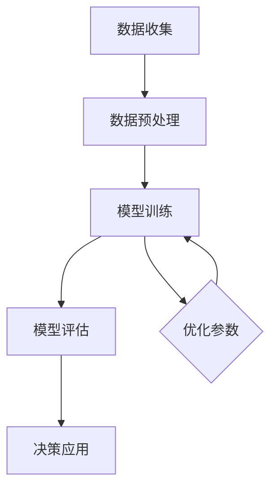
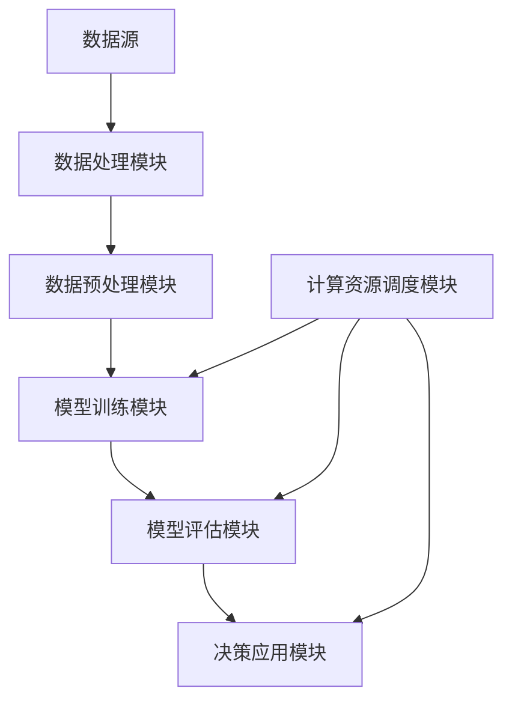
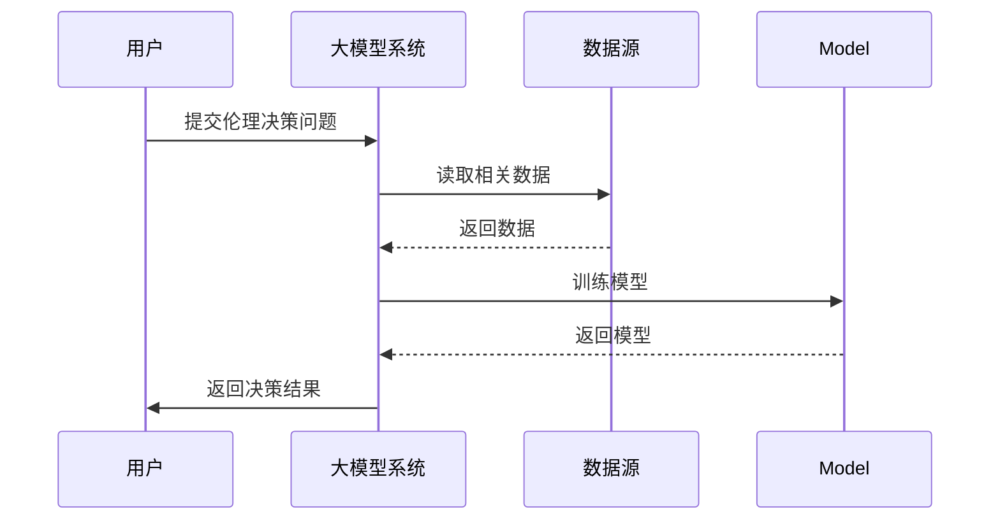

                 

# 大模型在伦理决策推理中的价值观一致性分析

> 关键词：大模型、伦理决策、推理、价值观、一致性分析

> 摘要：随着人工智能技术的飞速发展，大模型在各个领域得到了广泛应用，尤其是在伦理决策推理中扮演着重要角色。本文将探讨大模型在伦理决策推理中面临的价值观一致性问题，通过一步步分析推理，深入探讨这一问题的本质，并提出解决方案。

## 引言

随着人工智能（AI）技术的不断发展，大模型在各个领域展现出了强大的能力。特别是在伦理决策推理中，大模型因其具备强大的数据处理和分析能力，成为了许多决策的关键因素。然而，大模型在伦理决策推理中也面临着一个重要问题，即价值观的一致性问题。

价值观是一组信念和标准，用于指导人们的行为和决策。在人类社会中，不同的文化和信仰体系塑造了不同的价值观。当这些价值观被大模型所采用时，是否能够保持一致性和公正性，成为了人工智能伦理学研究的重要议题。

本文将从以下几个方面进行探讨：

1. 大模型在伦理决策推理中的角色和作用。
2. 价值观一致性分析的核心概念和关系。
3. 大模型算法原理和数学模型。
4. 大模型系统分析和设计。
5. 实际案例和最佳实践。

通过以上分析，我们将深入探讨大模型在伦理决策推理中的价值观一致性问题，并提出相应的解决方案。

## 1. 大模型在伦理决策推理中的角色和作用

大模型，又称为大型深度学习模型，是一种通过大量数据和复杂神经网络进行训练的模型。这些模型能够自动学习并提取数据中的特征和模式，从而在各个领域展现出强大的能力。

在伦理决策推理中，大模型的作用主要体现在以下几个方面：

### 1.1 数据分析

大模型能够对海量数据进行分析和处理，提取出有价值的信息。这对于伦理决策来说至关重要，因为伦理决策往往需要依赖大量的数据来支持。例如，在医疗领域，大模型可以分析大量的患者数据和医疗文献，从而提供更为准确的诊断和治疗方案。

### 1.2 模式识别

大模型具有强大的模式识别能力，能够发现数据中的潜在模式和关联。这对于伦理决策中的风险评估和预测具有重要意义。例如，在金融领域，大模型可以分析市场数据和用户行为，从而预测金融风险和用户需求，为金融机构提供决策支持。

### 1.3 自动化决策

大模型能够实现自动化决策，减少了人工干预的必要性。这对于一些复杂且时间敏感的伦理决策尤为重要。例如，在交通管理领域，大模型可以实时分析交通数据，自动调整交通信号灯，以提高交通效率和安全性。

### 1.4 公正性和透明性

大模型在伦理决策中的另一个重要作用是提高公正性和透明性。大模型通过学习大量的数据和规则，能够减少人为偏见和歧视。此外，大模型的可解释性使得决策过程更加透明，有助于公众理解和监督。

总之，大模型在伦理决策推理中具有重要作用，但其应用也面临着诸多挑战，特别是价值观一致性问题。接下来，我们将深入探讨价值观一致性分析的核心概念和关系。

## 2. 价值观一致性分析的核心概念和关系

### 2.1 价值观

价值观是一组信念和标准，用于指导人们的行为和决策。它通常涉及道德、文化、宗教和社会规范等多个方面。价值观不仅影响个人的行为，也影响着社会整体的决策。

### 2.2 大模型

大模型是一种通过大量数据和复杂神经网络进行训练的模型。大模型在伦理决策推理中具有重要作用，但其内部处理过程往往不透明，这使得价值观一致性分析变得复杂。

### 2.3 伦理决策

伦理决策是指根据道德原则和价值观，对具体问题进行决策的过程。伦理决策涉及到多个利益相关者和复杂的社会问题，因此需要充分考虑价值观的一致性。

### 2.4 关系

价值观、大模型和伦理决策之间存在着密切的关系。价值观是伦理决策的指导原则，大模型是伦理决策的技术工具，而伦理决策则是价值观和大模型应用的具体体现。

为了更好地理解这一关系，我们可以通过一个ER（实体-关系）图来表示（使用Mermaid语言）：

```mermaid
erDiagram
    Value -> Model : uses
    Value -> Decision : guides
    Model -> Decision : implements
```

在这个ER图中，价值观（Value）作为伦理决策（Decision）的指导原则，通过使用（uses）关系影响大模型（Model）。大模型则通过实施（implements）关系，将价值观应用于伦理决策中。这种关系表明，价值观的一致性对大模型在伦理决策中的应用至关重要。

接下来，我们将探讨大模型算法原理和数学模型。

## 3. 大模型算法原理和数学模型

### 3.1 算法原理

大模型的算法原理主要基于深度学习。深度学习是一种通过多层神经网络进行数据学习和模式识别的技术。大模型通过不断调整网络中的权重，以最小化损失函数，从而实现对数据的拟合。

在伦理决策推理中，大模型的主要任务是学习一组伦理规则和价值观，并将其应用于具体问题中。这一过程可以通过以下步骤实现：

1. 数据收集：收集与伦理决策相关的数据，包括道德原则、法律法规、社会规范等。
2. 数据预处理：对收集到的数据进行清洗、归一化等处理，以适应深度学习模型的输入要求。
3. 模型训练：使用预处理后的数据对深度学习模型进行训练，调整网络中的权重，使其能够准确地识别和拟合伦理规则和价值观。
4. 模型评估：通过测试数据对训练好的模型进行评估，确保其能够在实际应用中准确、一致地应用伦理规则和价值观。
5. 决策应用：将训练好的模型应用于具体的伦理决策问题，实现自动化决策。

### 3.2 数学模型

大模型的数学模型主要基于概率论和优化理论。以下是一个简单的数学模型示例，用于描述大模型在伦理决策推理中的过程：

$$
\begin{aligned}
L &= \sum_{i=1}^{n} (-y_i \log(p(x_i))) \\
\text{where} \quad p(x_i) &= \sigma(\theta^T x_i)
\end{aligned}
$$

其中，$L$ 是损失函数，$y_i$ 是真实标签，$p(x_i)$ 是模型对输入 $x_i$ 的预测概率，$\sigma$ 是 sigmoid 函数，$\theta$ 是模型参数。

这个模型的目标是最小化损失函数 $L$，以使模型的预测概率更接近真实标签。通过优化模型参数 $\theta$，大模型能够学习到一组伦理规则和价值观，并将其应用于具体的伦理决策问题。

### 3.3 算法流程图

为了更直观地理解大模型算法的原理，我们可以使用Mermaid语言绘制一个算法流程图：



在这个流程图中，数据收集、数据预处理、模型训练、模型评估和决策应用构成了大模型算法的基本流程。优化参数（F）是一个循环过程，通过不断调整模型参数，使得模型能够更好地学习伦理规则和价值观。

接下来，我们将探讨大模型系统分析和设计。

## 4. 大模型系统分析和设计

### 4.1 问题场景

在伦理决策推理中，大模型的应用场景广泛，如医疗伦理决策、金融伦理决策、交通伦理决策等。以医疗伦理决策为例，大模型可以用于辅助医生做出伦理决策，如器官移植、临床试验等。

### 4.2 系统功能设计

大模型系统的核心功能是伦理决策推理。为了实现这一功能，系统需要具备以下模块：

- 数据处理模块：负责数据收集、清洗和预处理，为模型训练提供高质量的数据。
- 模型训练模块：使用深度学习算法对数据进行训练，生成伦理决策模型。
- 模型评估模块：对训练好的模型进行评估，确保其能够在实际应用中准确、一致地应用伦理规则和价值观。
- 决策应用模块：将训练好的模型应用于具体的伦理决策问题，实现自动化决策。

### 4.3 系统架构设计

大模型系统的架构设计需要考虑以下几个方面：

- 数据流设计：确保数据在系统中高效、可靠地流动。
- 网络架构设计：选择合适的神经网络结构，以提高模型性能。
- 计算资源调度：合理分配计算资源，确保系统的高效运行。

以下是一个简化的Mermaid架构图：



在这个架构图中，数据源（A）通过数据处理模块（B）和预处理模块（C）进行处理，然后进入模型训练模块（D）。模型训练完成后，通过评估模块（E）进行评估，最后应用于决策应用模块（F）。计算资源调度模块（G）负责分配计算资源，确保系统的稳定运行。

### 4.4 系统接口设计和交互

大模型系统的接口设计和交互需要考虑以下几个方面：

- 用户接口：提供易于使用的界面，便于用户与系统进行交互。
- API接口：提供接口，方便其他系统或应用程序调用大模型的功能。
- 数据接口：提供数据接口，方便系统内部数据流动。

以下是一个简化的Mermaid序列图：



在这个序列图中，用户（User）通过用户接口提交伦理决策问题，系统（System）读取相关数据，训练模型（Model），最后返回决策结果给用户。

接下来，我们将通过实际案例来分析大模型在伦理决策推理中的应用。

## 5. 实际案例和最佳实践

### 5.1 案例背景

为了更好地理解大模型在伦理决策推理中的应用，我们来看一个实际案例：自动驾驶汽车在紧急情况下的决策。

自动驾驶汽车在遇到紧急情况时，需要迅速做出决策，以确保乘客和其他道路使用者的安全。然而，这种决策涉及到复杂的伦理问题，如如何平衡乘客和行人的生命安全。

### 5.2 案例分析

在这个案例中，大模型被用于辅助自动驾驶汽车的决策。具体来说，大模型需要学习一组伦理规则和价值观，以指导汽车在紧急情况下的行为。

1. **数据收集**：首先，需要收集大量的交通事故数据和相关文献，以了解不同文化和价值观对自动驾驶汽车决策的影响。

2. **数据预处理**：对收集到的数据进行清洗和归一化处理，以适应深度学习模型的输入要求。

3. **模型训练**：使用预处理后的数据对深度学习模型进行训练，调整网络中的权重，使其能够准确地识别和拟合伦理规则和价值观。

4. **模型评估**：通过测试数据对训练好的模型进行评估，确保其能够在实际应用中准确、一致地应用伦理规则和价值观。

5. **决策应用**：将训练好的模型应用于自动驾驶汽车，使其在紧急情况下能够做出合理的决策。

### 5.3 案例结论

通过这个案例，我们可以看到大模型在伦理决策推理中的重要作用。大模型不仅能够辅助自动驾驶汽车做出合理的决策，还能够根据不同的伦理规则和价值观进行调整，以适应不同的应用场景。

### 5.4 最佳实践

为了确保大模型在伦理决策推理中的准确性和一致性，我们可以采取以下最佳实践：

1. **数据多样性**：收集多样化的数据，包括不同的伦理规则和价值观，以提高模型的泛化能力。

2. **模型可解释性**：提高模型的可解释性，使得决策过程更加透明，有助于公众理解和监督。

3. **持续学习**：定期更新模型，使其能够适应不断变化的社会和伦理环境。

4. **伦理审查**：对模型进行伦理审查，确保其符合伦理标准，不会造成伦理风险。

## 6. 最佳实践和未来方向

### 6.1 最佳实践

在大模型应用于伦理决策推理时，最佳实践应围绕确保决策的公正性、透明性和一致性展开。以下是一些关键实践：

- **多元化数据集**：使用包含多种文化和价值观的数据集进行模型训练，以减少偏见。
- **伦理审查和监督**：建立伦理审查委员会，对模型的伦理决策进行监督和评估。
- **可解释性**：开发可解释的算法，使决策过程更加透明，便于用户理解和信任。
- **持续更新**：定期更新模型，以适应新的伦理问题和挑战。
- **用户教育**：对用户进行教育，提高其对大模型伦理决策的理解和接受度。

### 6.2 未来方向

尽管当前大模型在伦理决策推理中取得了一定成果，但未来的发展仍面临许多挑战和机会：

- **跨学科研究**：结合伦理学、心理学和社会学等学科，进一步探索大模型在伦理决策中的应用。
- **标准化框架**：制定统一的伦理决策框架和标准，以促进大模型在伦理决策中的规范化应用。
- **伦理透明度**：提高模型的伦理透明度，使决策过程更加公开和可追溯。
- **社会影响评估**：开展大模型应用的社会影响评估，确保其对社会产生积极影响。

### 6.3 小结

本文探讨了在大模型应用于伦理决策推理时面临的价值观一致性分析问题。通过一步步分析，我们深入了解了大模型在伦理决策推理中的作用、算法原理、系统设计、实际案例和最佳实践。未来，随着人工智能技术的不断发展，大模型在伦理决策推理中的应用将更加广泛，同时也需要不断优化和完善，以应对新的挑战和机遇。

## 作者信息

作者：AI天才研究院/AI Genius Institute & 禅与计算机程序设计艺术 /Zen And The Art of Computer Programming

感谢您的阅读，希望本文能对您在伦理决策推理领域的探索提供有益的启示。如果您有任何问题或建议，欢迎随时联系我们。期待与您共同推动人工智能技术的进步和应用。

## 附录：相关资源与拓展阅读

为了帮助读者进一步深入了解大模型在伦理决策推理中的应用，以下是一些建议的资源和拓展阅读：

### 1. 学术论文

- "The ethical implications of autonomous vehicles" by Bryant Walker Smith
- "AI and Value Alignment: Understanding and Measuring Value Alignment in Large Language Models" by Beth Warrington et al.
- "Ethical AI: From Theory to Practice" by Verena Rieser and Julian Togelius

### 2. 报告与白皮书

- "The Future of Humanity: Terraforming Mars" by the Future of Life Institute
- "AI Now: 2021 Report on the Social and Economic Impacts of AI" by the AI Now Institute
- "Ethical Guidelines for Autonomous Systems" by the IEEE Standards Association

### 3. 在线课程与研讨会

- "Ethical AI and the Future of Humanity" by the Future of Life Institute
- "AI and the Law" by the University of Oxford
- "Ethics and Technology" by the University of Michigan

### 4. 社交媒体与论坛

- AI Ethics on Twitter (@AIethics)
- The AI Alignment Forum
- AI Ethics Reddit (r/AIEthics)

通过以上资源和拓展阅读，您将能够更全面地了解大模型在伦理决策推理中的应用，以及如何确保其价值观的一致性和公正性。希望这些资源对您的学习和研究有所帮助。如果您对特定主题感兴趣，也欢迎在评论区留言，我们会根据您的反馈推荐相关内容。再次感谢您的支持，期待与您共同探讨人工智能的未来。

