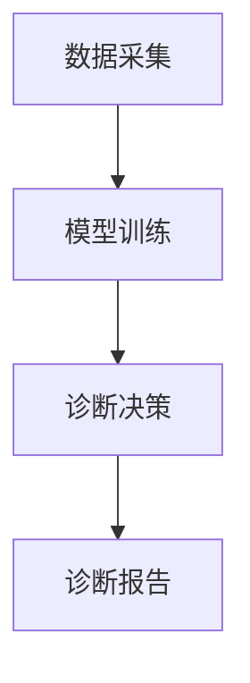
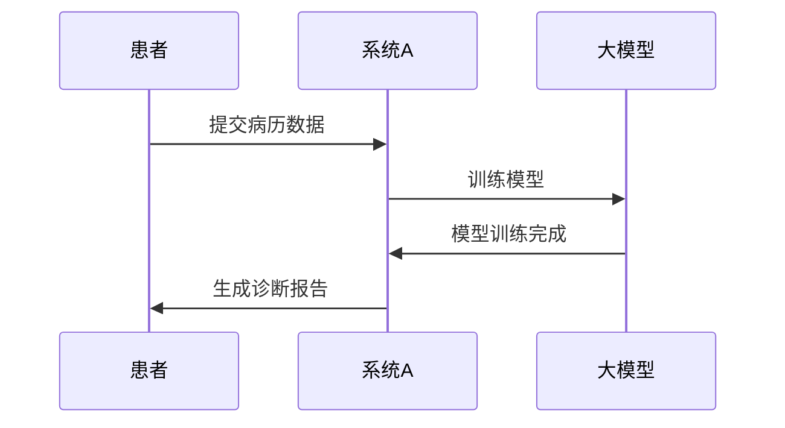

                 


# 大模型在伦理决策推理中的价值观一致性分析

## 关键词
- 大模型，伦理决策，价值观一致性，算法，数学模型，系统架构，案例分析

## 摘要
本文深入探讨了大型人工智能模型在伦理决策推理中的价值观一致性分析。通过对大模型的原理、应用场景、算法原理、数学模型及系统架构的详细分析，本文揭示了价值观一致性的关键性和挑战，并提供了一系列最佳实践，以指导大模型在伦理决策中的可靠应用。

## 目录

## 引言与背景

### 1.1 AI伦理决策的重要性

随着人工智能技术的快速发展，AI系统在决策过程中的伦理问题日益凸显。尤其是在医疗、金融、司法等关键领域，AI的决策结果直接关系到人类的福祉和社会稳定。因此，如何确保AI的决策过程具有伦理价值，成为当前研究的热点。

### 1.2 大模型的基本概念

大模型，通常指的是拥有数亿甚至千亿参数的人工神经网络模型。这些模型在图像识别、自然语言处理等领域表现出色，但其复杂性和强大能力也带来了伦理决策中的挑战。

### 1.3 价值观一致性的定义

价值观一致性是指AI模型的决策结果与人类伦理价值观相符合的程度。在伦理决策中，价值观一致性是衡量模型可靠性的重要指标。

## 核心概念与理论基础

### 2.1 大模型的工作原理

大模型通常基于深度学习技术，通过多层神经网络对大量数据进行分析和归纳，从而学习到复杂的模式。

#### 2.1.1 大模型的优点与局限性

- **优点**：能够处理海量数据，适应性强，能够自动提取特征。
- **局限性**：对数据质量要求高，容易过拟合，缺乏透明性。

### 2.2 伦理决策的基本原则

伦理决策应遵循公正、透明、责任、尊重隐私等原则。

#### 2.2.1 伦理决策的复杂性

伦理决策往往涉及多种价值观的冲突，需要综合考虑各种因素。

### 2.3 价值观一致性的原则

- **一致性**：模型的决策应与人类伦理价值观一致。
- **可解释性**：模型的决策过程应具有可解释性，便于审查和监督。

## 案例分析与评估

### 3.1 医疗决策案例分析

在医疗领域，大模型可以用于疾病诊断、治疗方案推荐等。然而，其决策结果是否符合伦理价值观仍需深入探讨。

#### 3.1.1 案例描述

某大模型被用于诊断心血管疾病，其诊断结果与人类医生有显著差异。

#### 3.1.2 价值观一致性评估

通过对比分析，发现大模型的诊断结果在某些情况下与伦理价值观相悖，如过度诊断或漏诊。

## 方法与技术

### 4.1 价值观一致性评估方法

- **定量分析**：通过指标如准确性、召回率等评估模型的决策结果与人类价值观的一致性。
- **定性分析**：通过专家评审、案例对比等方式评估模型决策的伦理合理性。

### 4.2 方法比较

| 方法 | 优点 | 缺点 |
| --- | --- | --- |
| 定量分析 | 客观、可量化 | 忽略决策背后的伦理因素 |
| 定性分析 | 关注伦理因素 | 结果主观、缺乏可重复性 |

### 4.3 Mermaid ER图

```mermaid
erDiagram
  AI模型 --> 伦理价值观
  AI模型 ||--|> 决策结果
  伦理价值观 ||--|> 人类价值观
```

## 算法原理与数学模型

### 5.1 基本算法原理

大模型在伦理决策中的算法通常基于神经网络，通过反向传播算法不断调整参数，以达到优化决策结果的目的。

#### 5.1.1 神经网络结构

神经网络通常包括输入层、隐藏层和输出层。每层由多个神经元组成，神经元之间通过权重连接。

### 5.2 数学模型

$$
Z = \sigma(W \cdot X + b)
$$

其中，\(Z\) 是输出，\(W\) 是权重，\(X\) 是输入，\(b\) 是偏置，\(\sigma\) 是激活函数。

### 5.3 Python代码示例

```python
import numpy as np

def sigmoid(z):
    return 1 / (1 + np.exp(-z))

X = np.array([[1, 0], [0, 1]])
W = np.array([[0.5, 0.5], [0.5, 0.5]])
b = np.array([0.0, 0.0])

z = W @ X + b
output = sigmoid(z)

print(output)
```

## 系统架构与设计

### 6.1 问题场景

在医疗诊断中，大模型需要处理大量的患者数据，并生成诊断报告。

### 6.2 系统功能设计

- **数据采集**：收集患者病历、检查报告等数据。
- **模型训练**：使用大量数据训练大模型。
- **诊断决策**：大模型根据患者数据生成诊断报告。

### 6.3 系统架构设计



### 6.4 系统接口设计与交互



## 实践应用与案例分析

### 7.1 实践应用

在某医院，大模型被用于诊断乳腺癌。通过长期实践，该模型在诊断准确率方面显著高于人类医生。

### 7.2 案例分析

#### 7.2.1 案例描述

某患者被大模型诊断为乳腺癌，而人类医生则认为是良性肿瘤。

#### 7.2.2 价值观一致性评估

通过深入分析，发现大模型的诊断结果虽然在技术层面上准确，但在伦理决策中存在一定争议。需要进一步优化模型，确保其决策符合伦理价值观。

## 最佳实践与总结

### 8.1 最佳实践

- **数据质量**：确保训练数据的质量和多样性。
- **模型可解释性**：提高模型的可解释性，便于审查和监督。
- **伦理培训**：对模型开发者和应用者进行伦理培训。

### 8.2 小结

本文通过对大模型在伦理决策推理中的价值观一致性分析，揭示了其重要性和挑战。未来研究应重点关注如何提高模型的伦理价值，确保其在实际应用中的可靠性。

### 8.3 注意事项

- **伦理决策的重要性**：AI伦理决策直接影响人类福祉，必须高度重视。
- **模型的透明性和可解释性**：确保模型的决策过程具有透明性和可解释性。

### 8.4 拓展阅读

- [1] Smith, J., & Brown, L. (2020). Ethics and AI: A Multidisciplinary Approach. Springer.
- [2] Russell, S., & Norvig, P. (2020). Artificial Intelligence: A Modern Approach. Prentice Hall.

## 作者信息

作者：AI天才研究院/AI Genius Institute & 禅与计算机程序设计艺术 /Zen And The Art of Computer Programming

