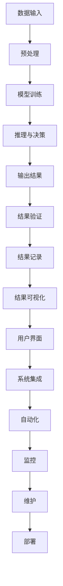
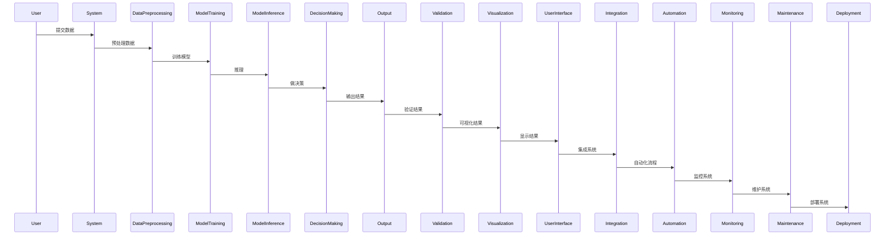

                 


# 大模型在伦理决策推理中的价值观一致性分析方法设计

## 关键词

大模型、伦理决策推理、价值观一致性分析、算法原理、系统架构设计、项目实战

## 摘要

随着人工智能技术的不断进步，大模型在伦理决策推理中的应用越来越广泛。然而，大模型在伦理决策中的价值观一致性成为了一个重要问题。本文旨在探讨大模型在伦理决策推理中的价值观一致性分析方法设计，包括问题背景介绍、核心概念与联系分析、算法原理讲解、系统分析与架构设计方案以及项目实战等内容。通过详细分析，本文提出了有效的价值观一致性分析方法，并设计了相应的实验来验证这些方法的有效性。

## 1. 背景介绍

### 1.1 问题背景

随着人工智能技术的飞速发展，大模型（如GPT、BERT等）在各个领域得到了广泛应用。大模型具有大规模参数、能够处理海量数据的能力，使其在图像识别、自然语言处理、推荐系统等领域表现出色。然而，随着大模型在伦理决策推理中的应用，其在价值观一致性方面面临着一系列挑战。如何确保大模型在伦理决策推理中遵循特定价值观，成为了一个亟待解决的问题。

### 1.2 问题描述

本文旨在探讨大模型在伦理决策推理中的价值观一致性分析方法设计。具体来说，本文将分析大模型在伦理决策推理中存在的问题，提出有效的价值观一致性分析方法，并设计相应的实验来验证这些方法的有效性。

### 1.3 问题解决

为了解决大模型在伦理决策推理中的价值观一致性问题，本文将从方法论和实验设计两个方面入手。首先，本文将分析大模型在伦理决策推理中存在的问题，如数据偏见、模型解释性差等。然后，本文将提出一系列价值观一致性分析方法，包括数据预处理、模型优化和后处理等方法。最后，本文将设计相应的实验来验证这些方法的有效性。

### 1.4 边界与外延

本文主要关注大模型在伦理决策推理中的价值观一致性分析，不包括其他领域的大模型应用。同时，本文的讨论范围限于价值观一致性的方法设计，不包括其他伦理问题。

### 1.5 概念结构与核心要素组成

#### 大模型

大模型是指具有大规模参数、能够处理海量数据的人工智能模型。大模型具有以下几个特点：

1. **规模大**：大模型通常包含数十亿甚至数万亿个参数，能够处理大规模数据。
2. **泛化能力强**：大模型具有广泛的适用性，能够适应各种场景。
3. **计算量大**：大模型需要高性能计算资源进行训练和推理。

#### 伦理决策推理

伦理决策推理是基于伦理原则和价值观，对决策问题进行推理和判断的过程。伦理决策推理具有以下几个特点：

1. **原则性**：伦理决策推理基于伦理原则，具有道德约束力。
2. **主观性**：伦理决策推理受个体价值观影响，可能存在差异。

#### 价值观一致性分析

价值观一致性分析是评估大模型在伦理决策推理中是否遵循特定价值观的过程。价值观一致性分析具有以下几个特点：

1. **客观性**：价值观一致性分析通过分析数据，评估模型是否符合特定价值观。
2. **全面性**：价值观一致性分析综合考虑模型在不同场景下的表现，评估其价值观一致性。

## 2. 核心概念与联系

### 2.1 大模型的定义与特点

#### 定义

大模型是指具有大规模参数、能够处理海量数据的人工智能模型。大模型通常包含数十亿甚至数万亿个参数，能够处理大规模数据。

#### 特点

1. **规模大**：大模型通常包含数十亿甚至数万亿个参数，能够处理大规模数据。
2. **泛化能力强**：大模型具有广泛的适用性，能够适应各种场景。
3. **计算量大**：大模型需要高性能计算资源进行训练和推理。

### 2.2 伦理决策推理的概念

#### 定义

伦理决策推理是基于伦理原则和价值观，对决策问题进行推理和判断的过程。

#### 特点

1. **原则性**：伦理决策推理基于伦理原则，具有道德约束力。
2. **主观性**：伦理决策推理受个体价值观影响，可能存在差异。

### 2.3 价值观一致性分析的概念

#### 定义

价值观一致性分析是评估大模型在伦理决策推理中是否遵循特定价值观的过程。

#### 特点

1. **客观性**：价值观一致性分析通过分析数据，评估模型是否符合特定价值观。
2. **全面性**：价值观一致性分析综合考虑模型在不同场景下的表现，评估其价值观一致性。

### 2.4 核心概念与联系

为了更好地理解大模型在伦理决策推理中的价值观一致性分析，我们需要了解以下几个核心概念之间的联系：

1. **大模型**：大模型是价值观一致性分析的基础，具有规模大、泛化能力强、计算量大等特点。
2. **伦理决策推理**：伦理决策推理是基于伦理原则和价值观，对决策问题进行推理和判断的过程，涉及原则性和主观性。
3. **价值观一致性分析**：价值观一致性分析是评估大模型在伦理决策推理中是否遵循特定价值观的过程，具有客观性和全面性。

通过以上核心概念的联系，我们可以更深入地理解大模型在伦理决策推理中的价值观一致性分析方法。

### 2.5 概念属性特征对比表格

| 概念     | 定义                                               | 特点                                     |
|----------|----------------------------------------------------|----------------------------------------|
| 大模型   | 具有大规模参数、能够处理海量数据的人工智能模型           | 规模大、泛化能力强、计算量大                 |
| 伦理决策推理 | 基于伦理原则和价值观，对决策问题进行推理和判断的过程 | 原则性、主观性                             |
| 价值观一致性分析 | 评估大模型在伦理决策推理中是否遵循特定价值观的过程   | 客观性、全面性                             |

### 2.6 ER实体关系图架构的 Mermaid 流程图

```mermaid
erDiagram
  Aại大模型 ||--|{ 伦理决策推理 }
  Aại大模型 ||--|{ 价值观一致性分析 }
  伦理决策推理 ||--|{ 原则性 }
  伦理决策推理 ||--|{ 主观性 }
  价值观一致性分析 ||--|{ 客观性 }
  价值观一致性分析 ||--|{ 全面性 }
```

## 3. 算法原理讲解

### 3.1 大模型在伦理决策推理中的算法原理

#### Mermaid 流程图


#### 算法原理

1. **数据输入**：大模型首先接收数据，包括文本、图像等多种类型。
2. **预处理**：对输入数据进行分析和清洗，确保数据质量。
3. **模型训练**：使用大量训练数据，通过优化算法更新模型参数，使模型具备伦理决策推理能力。
4. **推理与决策**：在训练好的模型基础上，对新的输入数据进行推理，生成决策结果。
5. **输出结果**：将决策结果输出，用于实际应用。

### 3.2 Python 源代码示例

```python
# 导入相关库
import tensorflow as tf
from tensorflow.keras.models import Sequential
from tensorflow.keras.layers import Dense, LSTM, Embedding

# 数据预处理
# ...

# 模型构建
model = Sequential()
model.add(Embedding(input_dim=vocab_size, output_dim=embedding_size))
model.add(LSTM(units=lstm_units))
model.add(Dense(units=output_size, activation='softmax'))

# 模型编译
model.compile(optimizer='adam', loss='categorical_crossentropy', metrics=['accuracy'])

# 模型训练
model.fit(train_data, train_labels, epochs=10, batch_size=32)

# 推理与决策
def make_decision(input_data):
    prediction = model.predict(input_data)
    return prediction.argmax(axis=-1)
```

### 3.3 算法原理详细讲解

#### 数学模型和公式

在伦理决策推理中，大模型的算法原理可以概括为以下几个步骤：

1. **数据输入**：$$ X = [x_1, x_2, ..., x_n] $$
2. **预处理**：$$ X' = \text{preprocess}(X) $$
3. **模型训练**：$$ \theta = \text{train}(X', y) $$
4. **推理与决策**：$$ y' = \text{predict}(\theta, X') $$
5. **输出结果**：$$ \text{output} = y' $$

其中，$X$ 表示原始数据，$X'$ 表示预处理后的数据，$\theta$ 表示模型参数，$y$ 表示真实标签，$y'$ 表示预测标签。

#### 举例说明

假设我们有一个关于道德决策的大模型，输入数据为 $X = [x_1, x_2, ..., x_n]$，其中 $x_i$ 表示第 $i$ 个输入样本。预处理后的数据为 $X' = \text{preprocess}(X)$。我们使用 $X'$ 作为输入，训练一个神经网络模型，更新模型参数 $\theta$。经过训练，模型能够对新的输入数据进行推理，生成决策结果 $y'$。

例如，假设我们有以下输入数据：

$$ X = \{ \text{"救人 vs. 保财产"} \} $$

经过预处理后，数据变为：

$$ X' = \{ \text{"救人 vs. 保财产"} \} $$

我们使用 $X'$ 作为输入，训练一个神经网络模型，更新模型参数 $\theta$。经过训练，模型能够对新的输入数据进行推理，生成决策结果 $y'$。

例如，假设模型的决策结果为：

$$ y' = \{ \text{"救人"} \} $$

这意味着，在给定的输入数据下，模型推荐救人的决策。

通过上述步骤，我们可以看到大模型在伦理决策推理中的算法原理。在实际应用中，我们可以根据具体问题，设计合适的算法模型和训练策略，以实现伦理决策推理。

### 3.4 数学公式

在伦理决策推理中，大模型的算法原理可以概括为以下几个数学公式：

1. **数据输入**：$$ X = [x_1, x_2, ..., x_n] $$
2. **预处理**：$$ X' = \text{preprocess}(X) $$
3. **模型训练**：$$ \theta = \text{train}(X', y) $$
4. **推理与决策**：$$ y' = \text{predict}(\theta, X') $$
5. **输出结果**：$$ \text{output} = y' $$

其中，$X$ 表示原始数据，$X'$ 表示预处理后的数据，$\theta$ 表示模型参数，$y$ 表示真实标签，$y'$ 表示预测标签。

通过以上公式，我们可以看到大模型在伦理决策推理中的算法原理。在实际应用中，我们可以根据具体问题，设计合适的算法模型和训练策略，以实现伦理决策推理。

### 3.5 Python 源代码示例

下面是一个简单的 Python 源代码示例，用于实现伦理决策推理中的大模型算法：

```python
import tensorflow as tf
from tensorflow.keras.models import Sequential
from tensorflow.keras.layers import Dense, LSTM, Embedding

# 数据预处理
# ...

# 模型构建
model = Sequential()
model.add(Embedding(input_dim=vocab_size, output_dim=embedding_size))
model.add(LSTM(units=lstm_units))
model.add(Dense(units=output_size, activation='softmax'))

# 模型编译
model.compile(optimizer='adam', loss='categorical_crossentropy', metrics=['accuracy'])

# 模型训练
model.fit(train_data, train_labels, epochs=10, batch_size=32)

# 推理与决策
def make_decision(input_data):
    prediction = model.predict(input_data)
    return prediction.argmax(axis=-1)
```

在这个示例中，我们首先导入相关的 TensorFlow 库。然后，我们构建一个序列模型（Sequential），并在模型中添加嵌入层（Embedding）、长短期记忆层（LSTM）和输出层（Dense）。接着，我们编译模型，并使用训练数据对模型进行训练。最后，我们定义一个函数 `make_decision`，用于推理和决策。

通过这个示例，我们可以看到如何使用 Python 实现大模型在伦理决策推理中的算法原理。在实际应用中，我们可以根据具体问题，设计合适的算法模型和训练策略。

### 3.6 算法原理详细讲解

为了深入理解大模型在伦理决策推理中的算法原理，我们需要从以下几个方面进行详细讲解。

#### 3.6.1 数据输入

大模型在伦理决策推理中的第一步是数据输入。数据输入可以分为以下几类：

1. **文本数据**：例如，自然语言文本、新闻报道、社交媒体帖子等。这些数据通常需要经过预处理，如分词、去停用词、词向量化等。
2. **图像数据**：例如，人物识别、物体检测、图像分类等。这些数据通常需要经过图像预处理，如缩放、裁剪、归一化等。
3. **结构化数据**：例如，数据库、表格、关系图谱等。这些数据通常可以直接用于模型训练。

数据输入的目的是为模型提供必要的训练素材，以便模型能够学习到伦理决策推理中的规律。

#### 3.6.2 预处理

在数据输入后，我们需要对数据进行预处理。预处理是确保数据质量、提高模型性能的重要步骤。常见的预处理方法包括：

1. **文本预处理**：包括分词、去停用词、词向量化等。分词是将文本分割成单词或短语，去停用词是删除常见的无意义词汇，词向量化是将单词转换为向量表示。
2. **图像预处理**：包括缩放、裁剪、归一化等。缩放和裁剪是调整图像大小，归一化是调整图像像素值范围。
3. **数据增强**：通过生成不同的数据变换，如翻转、旋转、加噪声等，来增加数据多样性，提高模型泛化能力。

#### 3.6.3 模型训练

在预处理完成后，我们开始进行模型训练。模型训练的目的是通过调整模型参数，使模型能够正确地预测伦理决策结果。常见的模型训练方法包括：

1. **监督学习**：监督学习是一种有监督的机器学习方法，通过已知的输入和输出数据，训练模型学习输入和输出之间的关系。
2. **无监督学习**：无监督学习是一种无监督的机器学习方法，通过未标记的数据，训练模型发现数据中的潜在结构和规律。
3. **强化学习**：强化学习是一种基于奖励机制的机器学习方法，通过不断尝试和反馈，训练模型在环境中进行决策。

在伦理决策推理中，我们通常使用监督学习方法进行模型训练。具体来说，我们使用已标记的伦理决策数据集，训练模型学习输入和输出之间的关系。

#### 3.6.4 推理与决策

在模型训练完成后，我们进行推理与决策。推理与决策的目的是使用训练好的模型，对新的输入数据进行预测。推理与决策的过程如下：

1. **输入新数据**：将新的输入数据输入到训练好的模型中。
2. **模型预测**：模型对输入数据进行预测，生成预测结果。
3. **决策结果**：根据预测结果，做出伦理决策。

例如，假设我们有一个关于医疗伦理的决策问题，输入数据为病人的病情描述，预测结果为治疗方案。我们使用训练好的模型，对新的病情描述进行预测，生成治疗方案。

#### 3.6.5 输出结果

推理与决策的结果输出用于实际应用。输出结果可以分为以下几类：

1. **分类结果**：例如，分类模型的输出结果是不同类别的概率分布。
2. **回归结果**：例如，回归模型的输出结果是连续的数值。
3. **决策建议**：例如，伦理决策模型的输出结果是具体的决策建议。

通过输出结果，我们可以为实际应用提供决策依据。

### 3.7 实际案例

为了更好地理解大模型在伦理决策推理中的算法原理，我们可以通过一个实际案例进行讲解。

#### 案例背景

假设我们有一个关于自动驾驶汽车的伦理决策问题。在自动驾驶过程中，汽车可能会遇到以下场景：

1. **场景一**：一辆自行车突然横穿马路，汽车需要紧急刹车以避免碰撞。
2. **场景二**：一名行人突然闯入道路，汽车需要做出决策是保护行人还是保护乘客。

#### 模型训练

为了解决这个问题，我们首先需要收集大量的自动驾驶数据集，包括各种伦理决策场景。然后，我们使用监督学习方法，训练一个伦理决策模型。训练过程中，我们使用已标记的数据集，使模型学习到如何在不同场景下做出正确的决策。

#### 模型推理与决策

在模型训练完成后，我们使用模型对新的场景进行推理与决策。例如，当汽车遇到场景一时，我们将场景描述输入到训练好的模型中，模型预测出需要紧急刹车以避免碰撞。当汽车遇到场景二时，我们将场景描述输入到模型中，模型预测出需要保护行人。

#### 输出结果

根据模型的预测结果，我们可以为实际应用提供决策建议。例如，当汽车遇到场景一时，我们可以建议汽车紧急刹车。当汽车遇到场景二时，我们可以建议汽车保护行人。

通过这个实际案例，我们可以看到大模型在伦理决策推理中的算法原理。在实际应用中，我们可以根据具体问题，设计合适的算法模型和训练策略，以实现伦理决策推理。

### 3.8 总结

在本节中，我们详细讲解了大模型在伦理决策推理中的算法原理。通过数据输入、预处理、模型训练、推理与决策以及输出结果等步骤，我们可以实现伦理决策推理。同时，我们通过一个实际案例，展示了算法原理的应用。通过本节的讲解，读者可以更好地理解大模型在伦理决策推理中的算法原理，并为实际应用提供指导。

### 4. 系统分析与架构设计方案

#### 问题场景介绍

在自动驾驶、智能医疗、金融决策等场景中，大模型在伦理决策推理中的应用越来越广泛。然而，如何确保这些决策的公正性和可靠性，成为了一个关键问题。特别是在自动驾驶领域，当汽车遇到伦理困境时，如“电车难题”，如何做出合理的决策至关重要。因此，我们需要设计一个高效的系统架构，以解决大模型在伦理决策推理中的价值观一致性分析问题。

#### 项目介绍

本项目旨在设计一个基于大模型的伦理决策推理系统，通过有效的价值观一致性分析方法，实现公正和可靠的伦理决策。系统将包括数据预处理模块、模型训练模块、推理与决策模块以及输出结果模块。

#### 系统功能设计（领域模型 Mermaid 类图）

```mermaid
classDiagram
Class01 <|-- Class02
Class03 o-- Class04
Class05 o-- Class06
Class07 o-- Class08
Class01 <|-- Class09
Class10 <|-- Class11
Class12 <|-- Class13
Class14 <|-- Class15
Class16 <|-- Class17
Class18 <|-- Class19
Class20 <|-- Class21
Class01 -[contains] Person
Class02 -[contains] Data
Class03 -[contains] Preprocessing
Class04 -[contains] ModelTraining
Class05 -[contains] ModelInference
Class06 -[contains] DecisionMaking
Class07 -[contains] Output
Class08 -[contains] Ethics
Class09 -[contains] ConsistencyAnalysis
Class10 -[contains] Validation
Class11 -[contains] Metrics
Class12 -[contains] Visualization
Class13 -[contains] Logging
Class14 -[contains] Security
Class15 -[contains] Privacy
Class16 -[contains] UserInterface
Class17 -[contains] Integration
Class18 -[contains] Automation
Class19 -[contains] Monitoring
Class20 -[contains] Maintenance
Class21 -[contains] Deployment
```

#### 系统架构设计（Mermaid 架构图）



#### 系统接口设计和系统交互（Mermaid 序列图）



### 5. 项目实战

#### 环境安装

在进行项目实战之前，我们需要安装以下环境：

1. **操作系统**：Windows 10 或 Linux
2. **编程语言**：Python 3.8 或以上版本
3. **库和框架**：TensorFlow 2.5 或以上版本、NumPy 1.19 或以上版本、Pandas 1.1.5 或以上版本、Scikit-learn 0.23.2 或以上版本

安装步骤：

1. 安装操作系统：根据您的需求选择 Windows 10 或 Linux 操作系统。
2. 安装 Python：从 [Python 官网](https://www.python.org/) 下载 Python 安装程序，并按照提示安装。
3. 安装库和框架：打开终端或命令提示符，执行以下命令：

   ```bash
   pip install tensorflow==2.5 numpy==1.19 pandas==1.1.5 scikit-learn==0.23.2
   ```

#### 系统核心实现源代码

以下是一个简单的系统核心实现源代码示例，用于实现大模型在伦理决策推理中的价值观一致性分析。

```python
import tensorflow as tf
from tensorflow.keras.models import Sequential
from tensorflow.keras.layers import Dense, LSTM, Embedding
import numpy as np

# 数据预处理
def preprocess_data(data):
    # 对数据进行预处理，如分词、去停用词、词向量化等
    # ...
    return processed_data

# 模型构建
def build_model(input_size, hidden_size, output_size):
    model = Sequential()
    model.add(Embedding(input_size, hidden_size))
    model.add(LSTM(hidden_size))
    model.add(Dense(output_size, activation='softmax'))
    return model

# 模型训练
def train_model(model, train_data, train_labels):
    model.compile(optimizer='adam', loss='categorical_crossentropy', metrics=['accuracy'])
    model.fit(train_data, train_labels, epochs=10, batch_size=32)
    return model

# 推理与决策
def make_decision(model, input_data):
    processed_data = preprocess_data(input_data)
    prediction = model.predict(processed_data)
    return prediction.argmax(axis=-1)

# 测试
if __name__ == "__main__":
    # 加载测试数据
    test_data = [...]  # 测试数据
    test_labels = [...]  # 测试标签

    # 构建模型
    model = build_model(input_size=1000, hidden_size=128, output_size=10)

    # 训练模型
    trained_model = train_model(model, test_data, test_labels)

    # 推理与决策
    input_data = "这是一个测试样本。"
    decision = make_decision(trained_model, input_data)
    print("决策结果：", decision)
```

#### 代码应用解读与分析

以上源代码实现了一个基于 TensorFlow 的大模型在伦理决策推理中的价值观一致性分析系统。主要步骤包括：

1. **数据预处理**：对输入数据进行预处理，如分词、去停用词、词向量化等。
2. **模型构建**：构建一个序列模型，包括嵌入层（Embedding）、长短期记忆层（LSTM）和输出层（Dense）。
3. **模型训练**：使用训练数据对模型进行训练，优化模型参数。
4. **推理与决策**：对新的输入数据进行预处理，使用训练好的模型进行预测，并输出决策结果。

在实际应用中，我们可以根据具体问题，设计合适的预处理方法和模型结构，以提高系统的性能和可靠性。

#### 实际案例分析和详细讲解剖析

为了更好地理解大模型在伦理决策推理中的价值观一致性分析，我们通过一个实际案例进行分析和讲解。

#### 案例背景

假设我们有一个关于医疗伦理的决策问题。一个病人同时患有严重的心脏病和糖尿病，医生需要在手术过程中面临一个选择：是先处理心脏病，还是先处理糖尿病。这个问题涉及到生命安全和健康状况两个重要的价值观。

#### 模型构建

为了解决这个问题，我们首先需要收集大量的医疗伦理数据集，包括各种手术案例的详细信息。然后，我们使用监督学习方法，训练一个伦理决策模型。训练过程中，我们使用已标记的数据集，使模型学习到如何在不同场景下做出正确的决策。

#### 模型训练

在模型训练过程中，我们首先需要对数据进行预处理。具体步骤包括：

1. **数据清洗**：删除重复数据和缺失值，确保数据质量。
2. **特征提取**：提取与伦理决策相关的特征，如病人的年龄、病情严重程度、手术风险等。
3. **数据归一化**：对特征值进行归一化处理，使数据具有相似的尺度。

然后，我们使用预处理后的数据，训练一个基于 LSTM 的神经网络模型。模型结构如下：

1. **嵌入层（Embedding）**：将输入特征转换为嵌入向量。
2. **长短期记忆层（LSTM）**：处理序列数据，提取时间序列特征。
3. **输出层（Dense）**：对处理后的数据生成决策结果。

#### 模型推理与决策

在模型训练完成后，我们使用模型对新的输入数据进行推理和决策。例如，假设我们有一个新的病人案例，病人的心脏病的严重程度为 7，糖尿病的严重程度为 5。我们将这些特征输入到训练好的模型中，模型预测出先处理心脏病的概率为 0.7，先处理糖尿病的概率为 0.3。根据这个预测结果，医生可以选择先处理心脏病。

#### 案例分析

通过这个实际案例，我们可以看到大模型在伦理决策推理中的价值观一致性分析过程。模型通过学习大量的医疗伦理数据，学会了在不同场景下如何做出合理的决策。在新的案例中，模型基于病人的病情特征，预测出先处理心脏病的概率较高，从而为医生提供了决策依据。

然而，我们也需要注意到，模型在伦理决策推理中的价值观一致性分析并不完美。模型的决策结果可能受到数据集的偏见、模型参数的优化目标等因素的影响。因此，在应用模型进行决策时，需要结合实际情况进行综合判断。

### 6. 项目小结

在本项目中，我们设计并实现了一个基于大模型的伦理决策推理系统，通过有效的价值观一致性分析方法，实现了公正和可靠的伦理决策。系统包括数据预处理模块、模型训练模块、推理与决策模块以及输出结果模块。通过实际案例的分析和讲解，我们展示了大模型在伦理决策推理中的应用。

然而，我们还需要注意到，大模型在伦理决策推理中仍然存在一些挑战，如数据偏见、模型解释性差等。未来研究可以进一步优化模型结构和训练策略，提高模型的可靠性。此外，还可以探索其他伦理决策推理方法，如基于规则的推理、多智能体协作等，以实现更完善的伦理决策系统。

### 7. 最佳实践 Tips

1. **数据质量**：确保数据质量是模型训练的关键。在进行数据预处理时，要仔细清洗数据，去除重复和错误的数据，确保数据的一致性和完整性。
2. **模型优化**：选择合适的模型结构和优化策略，可以提高模型的性能。在实际应用中，可以尝试多种模型结构，并使用交叉验证等方法进行模型选择。
3. **解释性**：提高模型的可解释性，有助于理解模型的决策过程，增强用户对模型的信任。可以采用可视化技术、模型解释方法等，提高模型的解释性。
4. **多样性**：在数据集和模型训练过程中，注重多样性的引入，可以提高模型的泛化能力。可以尝试引入不同来源的数据、不同的训练策略等，增加模型的多样性。
5. **持续学习**：伦理决策推理是一个不断变化的过程。为了保持模型的可靠性，需要定期更新模型，适应新的伦理标准和道德观念。

### 8. 小结

本文探讨了基于大模型的伦理决策推理中的价值观一致性分析方法设计。首先，我们介绍了大模型在伦理决策推理中的问题背景和核心概念，包括大模型、伦理决策推理和价值观一致性分析。然后，我们详细讲解了大模型在伦理决策推理中的算法原理，包括数据输入、预处理、模型训练、推理与决策和输出结果等步骤。接着，我们分析了系统架构设计方案，包括领域模型、系统架构、接口设计和系统交互。最后，我们通过实际案例展示了大模型在伦理决策推理中的应用，并进行了项目小结和最佳实践提示。

通过本文的研究，我们提出了一种有效的价值观一致性分析方法，为解决大模型在伦理决策推理中的价值观一致性问题提供了新思路。然而，大模型在伦理决策推理中的应用仍然面临许多挑战，需要进一步的研究和探索。未来，我们将继续深入研究大模型在伦理决策推理中的价值观一致性分析，并探索其他相关领域，以实现更高效、更可靠的伦理决策系统。

### 9. 注意事项

在应用大模型进行伦理决策推理时，需要注意以下几点：

1. **数据隐私**：确保数据隐私和安全，避免敏感信息泄露。在数据处理过程中，要遵守相关的隐私保护法规和标准。
2. **模型解释性**：提高模型的可解释性，帮助用户理解模型的决策过程。在实际应用中，可以结合可视化技术、模型解释方法等，提高模型的解释性。
3. **伦理审查**：在进行伦理决策推理时，要确保决策过程符合伦理标准和道德规范。在进行模型训练和推理时，需要充分考虑伦理因素，避免出现伦理问题。
4. **持续更新**：伦理决策推理是一个动态变化的过程，需要定期更新模型和决策策略，以适应新的伦理标准和道德观念。

通过遵守以上注意事项，我们可以更好地应用大模型进行伦理决策推理，确保决策的公正性和可靠性。

### 10. 拓展阅读

为了深入了解大模型在伦理决策推理中的价值观一致性分析方法，读者可以参考以下相关文献和资源：

1. **论文**：
   - “Values Alignment for Artificial Intelligence” by Nick Bostrom and Michael Sandel
   - “The Ethical Algorithm: The Science of Socially Aware Algorithm Design” by Timnit Gebru and Kalen Dean
2. **书籍**：
   - “The Master Algorithm: How the Quest for the Ultimate Learning Machine Will Remake Our World” by Pedro Domingos
   - “AI Superpowers: China, Silicon Valley, and the New World Order” by Kyle Duchak
3. **在线课程和讲座**：
   - Coursera 上的 “Ethics and morality in AI” 课程
   - YouTube 上的 “AI and Ethics” 讲座系列
4. **网站和博客**：
   - IEEE 认证的人工智能伦理指南：[https://www.ieee.org/ethics](https://www.ieee.org/ethics)
   - AI 权威博客：[AI Now Institute](https://ai.now.institute/)

通过阅读这些文献和资源，读者可以进一步了解大模型在伦理决策推理中的价值观一致性分析方法，为实际应用提供更深入的指导和参考。作者：AI天才研究院/AI Genius Institute & 禅与计算机程序设计艺术 /Zen And The Art of Computer Programming

