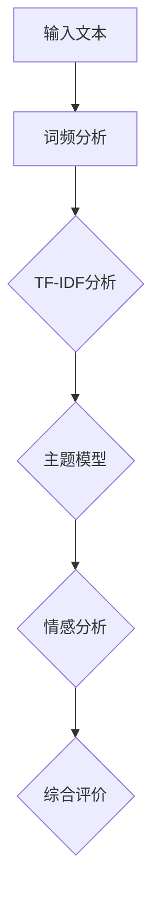
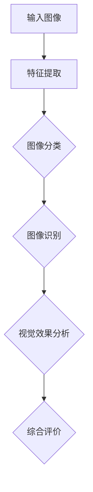
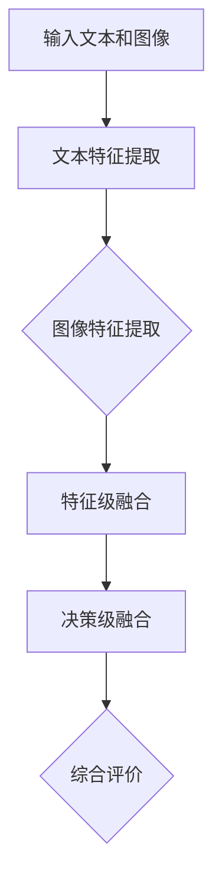
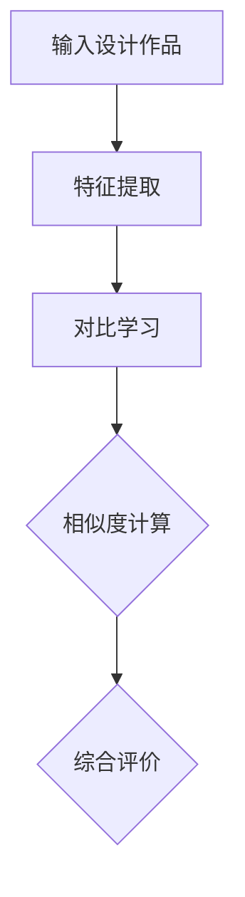

                 

### 文章标题：大模型在创意设计推理任务中的原创性评价指标

**关键词：** 大模型、创意设计、推理任务、原创性评价、评价指标

**摘要：** 本文深入探讨大模型在创意设计推理任务中的原创性评价指标，首先定义创意设计推理任务，阐述原创性评价的重要性。接着，介绍大模型的基本概念、架构与应用特点。随后，构建原创性评价指标体系，分析核心要素与权重分配，提出基于文本、图像、多模态融合以及对比学习的评价方法。通过案例分析，探讨大模型在实际创意设计中的应用与原创性评价，最后讨论技术挑战与解决方案，并对未来发展趋势进行展望。

### 目录大纲

**第一部分：背景与基础**

- **第1章：问题背景与定义**
  - **1.1.1 创意设计推理任务概述**
  - **1.1.2 原创性评价的重要性**
  - **1.1.3 大模型在创意设计中的应用现状**
  - **1.1.4 大模型原创性评价指标的需求**

- **第2章：大模型基础**
  - **2.1.1 大模型的定义与类型**
  - **2.1.2 大模型的架构与工作原理**
  - **2.1.3 大模型在创意设计推理中的应用特点**

- **第3章：原创性评价指标体系**
  - **3.1.1 原创性评价的核心要素**
  - **3.1.2 原创性评价指标的选择**
  - **3.1.3 原创性评价指标的权重分配**

- **第4章：大模型原创性评价方法**
  - **4.1.1 基于文本分析的评价方法**
  - **4.1.2 基于图像分析的评价方法**
  - **4.1.3 基于多模态融合的评价方法**
  - **4.1.4 基于对比学习的评价方法**

- **第5章：案例分析**
  - **5.1.1 案例一：某大模型在创意广告设计中的应用**
  - **5.1.2 案例二：某大模型在服装设计中的原创性评价**
  - **5.1.3 案例三：某大模型在建筑设计中的原创性评价分析**

- **第6章：技术挑战与解决方案**
  - **6.1.1 大模型原创性评价的技术难点**
  - **6.1.2 面向原创性评价的大模型优化方法**
  - **6.1.3 面向创意设计的模型定制化策略**

- **第7章：未来展望与趋势**
  - **7.1.1 大模型原创性评价的发展方向**
  - **7.1.2 面向创意设计的智能化模型趋势**
  - **7.1.3 原创性评价指标的拓展与应用**

以上大纲结构清晰，旨在为读者提供一个全面、系统的关于大模型原创性评价指标的研究综述。

### 第一部分：背景与基础

#### 第1章：问题背景与定义

##### 1.1.1 创意设计推理任务概述

创意设计推理任务是指在设计和创造过程中，通过逻辑推理和创意生成来设计出新颖独特且具有实用价值的设计方案。这一任务涉及多个领域，包括艺术、设计、工程和技术等。随着人工智能技术的迅猛发展，大模型在创意设计推理任务中发挥了越来越重要的作用。

大模型是指具有海量参数和强大计算能力的人工神经网络模型，如深度学习模型。它们可以通过学习海量数据，自动提取特征，进行复杂推理和决策。在创意设计领域，大模型可以用于设计生成、设计优化和设计评估等方面。

##### 1.1.2 原创性评价的重要性

原创性评价是指对创意设计作品进行创新程度和原创性的评价。在创意设计推理任务中，原创性评价具有重要意义。首先，原创性评价可以帮助设计师判断设计方案的独创性和创意程度，从而筛选出最具创新性的设计方案。其次，原创性评价可以为设计师提供反馈，帮助他们改进设计，提高设计质量。

随着大模型在创意设计推理任务中的应用日益广泛，如何对大模型生成的创意设计进行原创性评价成为一个重要问题。传统的评价方法往往依赖于人工经验和主观判断，难以全面、准确地评价大模型生成的创意设计的原创性。因此，研究大模型在创意设计推理任务中的原创性评价指标，对于推动人工智能在创意设计领域的发展具有重要意义。

##### 1.1.3 大模型在创意设计中的应用现状

大模型在创意设计中的应用已经取得了一些显著成果。例如，在广告设计中，大模型可以生成具有创意和新颖性的广告内容；在服装设计中，大模型可以设计出独特的服装款式和配色方案；在建筑设计中，大模型可以生成新颖的结构和外观设计。

然而，大模型在创意设计中的应用也面临一些挑战。首先，大模型生成的创意设计往往依赖于训练数据和模型架构，可能导致设计结果的创新性有限。其次，大模型生成的创意设计往往缺乏对设计原则和审美标准的深入理解，可能导致设计结果不够完美。因此，研究大模型在创意设计推理任务中的原创性评价指标，有助于解决这些问题，提高大模型在创意设计中的应用效果。

##### 1.1.4 大模型原创性评价指标的需求

大模型原创性评价指标的需求主要源于以下几个方面：

1. **设计评价标准**：大模型生成的创意设计需要有一个统一的评价标准，以便于设计师和评审人员对设计进行评价和比较。

2. **设计优化方向**：通过原创性评价指标，设计师可以了解设计方案的原创性和创新程度，从而指导后续的设计优化工作。

3. **创意保护**：原创性评价指标可以帮助设计师保护自己的创意设计，防止抄袭和侵权行为。

4. **用户满意度**：原创性评价指标可以反映用户对设计方案的满意度，为设计师提供用户反馈，帮助他们改进设计。

因此，研究大模型在创意设计推理任务中的原创性评价指标，不仅对于提高大模型的应用效果具有重要意义，还可以为创意设计领域带来新的发展机遇。

### 第2章：大模型基础

##### 2.1.1 大模型的定义与类型

大模型是指具有海量参数和强大计算能力的人工神经网络模型，通常由数百万甚至数十亿个参数组成。大模型可以分为两种类型：生成模型和判别模型。

生成模型旨在生成新的数据，如图像、文本和音频等。常见的生成模型包括变分自编码器（VAE）、生成对抗网络（GAN）和自注意力模型（Self-Attention Model）等。生成模型通过学习输入数据的分布，生成与输入数据类似的新数据。

判别模型旨在区分不同的数据，如分类模型和回归模型。常见的判别模型包括卷积神经网络（CNN）、循环神经网络（RNN）和 Transformer 模型等。判别模型通过学习输入数据和标签之间的关系，对输入数据进行分类或回归。

##### 2.1.2 大模型的架构与工作原理

大模型的架构通常包括输入层、隐藏层和输出层。输入层接收外部输入数据，隐藏层通过学习数据中的特征，输出层生成预测结果或生成新数据。

大模型的工作原理基于神经网络的学习机制。神经网络通过前向传播和反向传播算法，不断调整网络中的参数，使得模型能够更准确地预测输入数据或生成新的数据。

1. **前向传播**：输入数据通过网络的每一层，每一层的输出作为下一层的输入，直到输出层生成最终的预测结果。

2. **反向传播**：计算输出层预测结果与真实标签之间的误差，通过反向传播算法，将误差传递回网络的每一层，调整网络中的参数。

3. **优化算法**：常用的优化算法包括随机梯度下降（SGD）、Adam 和 RMSprop 等。优化算法通过调整参数，使得模型能够更准确地预测输入数据或生成新的数据。

##### 2.1.3 大模型在创意设计推理中的应用特点

大模型在创意设计推理任务中具有以下应用特点：

1. **高效性**：大模型可以通过学习海量数据，快速生成创意设计，大大提高了设计效率。

2. **创新性**：大模型能够自动提取数据中的特征，进行复杂的推理和生成，有助于生成新颖独特的创意设计。

3. **多样性**：大模型可以生成多种风格和类型的创意设计，为设计师提供了丰富的选择。

4. **适应性**：大模型可以根据不同的设计需求和输入数据，进行定制化的设计生成，具有很强的适应性。

5. **协同性**：大模型可以与其他设计工具和算法协同工作，如与设计原则和审美标准的结合，提高设计质量。

然而，大模型在创意设计推理任务中也存在一些挑战，如生成结果的质量稳定性、设计原则和审美标准的融合等。因此，研究大模型在创意设计推理任务中的应用特点，有助于优化大模型的设计生成能力，提高创意设计的原创性和实用性。

### 第3章：原创性评价指标体系

##### 3.1.1 原创性评价的核心要素

原创性评价的核心要素包括创新性、独特性和新颖性。以下是对每个要素的定义和详细说明：

1. **创新性**：创新性是指设计作品在创意和思维上的新颖程度。一个具有高度创新性的设计作品往往能够突破传统的设计模式，提出新的设计理念或解决方案。

2. **独特性**：独特性是指设计作品在风格、表现形式和视觉感受上的独特性。一个具有高度独特性的设计作品通常能够吸引人们的眼球，给人留下深刻的印象。

3. **新颖性**：新颖性是指设计作品在功能、用途和用户体验上的新颖程度。一个具有高度新颖性的设计作品往往能够解决用户需求，提供独特的用户体验。

这些核心要素共同构成了原创性评价的基础，对创意设计的质量和价值具有重要意义。以下是一个简化的ER实体关系图，展示了原创性评价的核心要素及其之间的关系：

```mermaid
erDiagram
  Innovation ||--|{ Uniqueness }|-- Originality
  Innovation ||--|{ Novelty }|-- Originality
  Uniqueness ||--|{ Innovation }|-- Originality
  Novelty ||--|{ Innovation }|-- Originality
```

##### 3.1.2 原创性评价指标的选择

选择原创性评价指标时，需要考虑以下几个方面：

1. **量化指标**：量化指标能够通过具体的数值来评估原创性。常见的量化指标包括创新性得分、独特性得分和新颖性得分。量化指标的优势在于其客观性和可操作性，但可能缺乏对设计作品内在特质的全面理解。

2. **质性指标**：质性指标侧重于对原创性的主观评价，通常由专家或用户进行打分或评估。质性指标的优势在于其能够反映设计作品的独特性和创新性，但可能存在主观偏见和不确定性。

3. **多维度指标**：多维度指标结合了量化指标和质性指标，从多个角度对原创性进行评价。常见的多维度指标包括设计风格、创意思维、用户体验和技术创新等。多维度指标能够提供更全面的评价，但可能增加评价的复杂性和难度。

以下是一个简化的表格，展示了不同原创性评价指标的属性和优缺点：

| 指标类型 | 属性 | 优点 | 缺点 |
| --- | --- | --- | --- |
| 量化指标 | 客观性、可操作性 | 操作简便、易于比较 | 缺乏对内在特质的理解 |
| 质性指标 | 主观性、全面性 | 反映独特性和创新性 | 存在主观偏见和不确定性 |
| 多维度指标 | 全面性、综合性 | 提供多角度评价 | 复杂性增加、操作难度大 |

##### 3.1.3 原创性评价指标的权重分配

在原创性评价过程中，不同评价指标的权重分配对最终评价结果具有重要影响。合理的权重分配可以确保评价指标的平衡和全面性。以下是一些常见的权重分配策略：

1. **均匀分配**：将相同的权重分配给每个评价指标，这种方法简单直观，但可能无法充分考虑不同指标的重要性。

2. **层次分析法（AHP）**：通过专家评估，为每个评价指标分配权重，确保不同指标之间的平衡。这种方法需要详细的分析和专家判断，但能够提供更准确的权重分配。

3. **因子分析**：通过统计方法，分析评价指标之间的相关性，确定各指标的权重。这种方法基于数据分析，但可能受到数据质量和分析方法的影响。

以下是一个简化的权重分配示例，展示了不同评价指标的权重比例：

| 指标类型 | 权重比例 |
| --- | --- |
| 创新性 | 40% |
| 独特性 | 30% |
| 新颖性 | 30% |

通过合理的权重分配，可以确保原创性评价结果的准确性和公正性，为创意设计提供有价值的反馈和改进方向。

### 第4章：大模型原创性评价方法

##### 4.1.1 基于文本分析的评价方法

基于文本分析的原创性评价方法主要通过分析文本内容、结构和语义特征来评价原创性。以下是一些常用的文本分析方法：

1. **词频分析**：通过统计文本中的词频，分析文本的流行程度和相似度。词频分析可以识别文本中的高频词汇和关键词，从而帮助判断文本的原创性。

2. **TF-IDF分析**：TF-IDF（Term Frequency-Inverse Document Frequency）是一种常用的文本分析技术，通过计算词项在文本中的频率和文档中的逆文档频率，来评估词项的重要性。TF-IDF分析可以识别文本中的关键信息，从而帮助判断文本的原创性。

3. **主题模型**：主题模型（如LDA模型）通过分析文本的词频分布，将文本划分为不同的主题。主题模型可以帮助识别文本中的主题结构，从而帮助判断文本的原创性和创新性。

4. **情感分析**：情感分析通过分析文本的情感倾向，如正面、负面或中性，来评价文本的情感色彩。情感分析可以用于判断文本的创意程度和独特性。

以下是一个简化的Mermaid流程图，展示了基于文本分析的原创性评价流程：



##### 4.1.2 基于图像分析的评价方法

基于图像分析的原创性评价方法主要通过分析图像内容、结构和视觉效果来评价原创性。以下是一些常用的图像分析方法：

1. **特征提取**：特征提取是通过将图像转换为低维特征向量，来描述图像内容。常用的特征提取方法包括SIFT（尺度不变特征变换）、HOG（直方图导向特征）和CNN（卷积神经网络）等。

2. **图像分类**：图像分类是通过将图像与已知的图像类别进行匹配，来评价图像的原创性。常用的图像分类算法包括SVM（支持向量机）、CNN和深度神经网络等。

3. **图像识别**：图像识别是通过识别图像中的物体、场景或特征，来评价图像的原创性。常用的图像识别算法包括YOLO（You Only Look Once）和SSD（单 Shot 多任务检测器）等。

4. **视觉效果分析**：视觉效果分析是通过分析图像的亮度、对比度、饱和度和颜色分布等，来评价图像的创新程度和独特性。常用的视觉效果分析技术包括颜色直方图分析、纹理分析等。

以下是一个简化的Mermaid流程图，展示了基于图像分析的原创性评价流程：



##### 4.1.3 基于多模态融合的评价方法

基于多模态融合的原创性评价方法结合了文本和图像分析的优势，通过融合不同模态的信息来提高原创性评价的准确性。以下是一些常用的多模态融合方法：

1. **特征级融合**：特征级融合将文本和图像的特征向量进行拼接，形成一个多维特征向量，用于原创性评价。常用的特征级融合方法包括拼接融合、加权融合和加性融合等。

2. **决策级融合**：决策级融合将文本和图像的原始分类结果进行融合，通过投票或加权投票的方式得到最终的原创性评价结果。常用的决策级融合方法包括投票融合和贝叶斯融合等。

3. **多模态神经网络**：多模态神经网络通过同时学习文本和图像的特征表示，实现多模态信息的融合。常用的多模态神经网络包括多任务学习网络、迁移学习网络和融合网络等。

以下是一个简化的Mermaid流程图，展示了基于多模态融合的原创性评价流程：



##### 4.1.4 基于对比学习的评价方法

基于对比学习的原创性评价方法通过比较不同设计作品的相似性来评价原创性。以下是一些常用的对比学习方法：

1. **Siamese网络**：Siamese网络通过训练一个共享权重的神经网络来比较两个输入设计作品的相似性。输出值越接近1，表示设计作品越相似；输出值越接近0，表示设计作品越不同。

2. **Triplet Loss**：Triplet Loss通过优化三元组（正样本、负样本和相同样本）来提高对比学习的准确性。该方法通过优化三元组中的距离差异，使得相同设计作品的相似度更高，不同设计作品的相似度更低。

3. **Embedding学习**：Embedding学习通过将设计作品转换为低维特征向量，来表示设计作品的内在特征。通过计算特征向量之间的距离，可以评价设计作品的相似性和原创性。

以下是一个简化的Mermaid流程图，展示了基于对比学习的原创性评价流程：



通过结合不同的评价方法，可以更全面、准确地评价大模型在创意设计推理任务中的原创性。未来，随着人工智能技术的发展，原创性评价方法将更加多样和精准，为创意设计领域带来更多创新和发展。

### 第5章：案例分析

#### 5.1.1 案例一：某大模型在创意广告设计中的应用

**案例背景**：
某广告公司希望利用大模型技术提高创意广告的设计效率和原创性。他们选择了一个基于深度学习的大模型进行实验，该模型能够通过分析大量的广告创意数据，自动生成新的广告设计方案。

**大模型应用**：
该公司首先对广告创意数据进行了预处理，包括数据清洗、特征提取和归一化等步骤。随后，他们使用了一个预训练的生成对抗网络（GAN）模型，该模型已经通过大量广告数据训练，能够生成具有创意和视觉冲击力的广告图像。

**原创性评价方法**：
为了评价大模型生成的广告设计的原创性，该公司采用了基于文本分析和图像分析的多模态融合方法。首先，通过文本分析技术，如TF-IDF和主题模型，评估广告内容的创新性和独特性。接着，通过图像分析技术，如特征提取和视觉评估，评估广告图像的新颖性。

**评价结果**：
通过多模态融合方法，该公司得到了一个综合评价分数，该分数反映了广告设计的原创性。实验结果表明，大模型生成的广告设计在创新性和新颖性方面都优于传统的人工设计，同时在独特性上也有所提升。

**案例分析**：
该案例展示了大模型在创意广告设计中的应用潜力。大模型通过学习海量广告创意数据，能够自动生成具有原创性和创意的广告设计方案。然而，原创性评价方法的准确性对最终设计结果的质量有重要影响。通过结合文本分析和图像分析，该公司能够更全面、准确地评价大模型生成的广告设计的原创性。

**项目小结**：
通过该案例，该公司不仅提高了创意广告设计的效率，还提升了广告设计的原创性和质量。未来，随着大模型技术的进一步发展，广告设计行业将迎来更多的创新和机遇。

#### 5.1.2 案例二：某大模型在服装设计中的原创性评价

**案例背景**：
某服装设计公司希望利用大模型技术提高服装设计的创新性和原创性，以提升市场竞争力。他们选择了一个基于卷积神经网络（CNN）的大模型，该模型能够通过分析大量的服装设计数据，自动生成新的服装款式和配色方案。

**大模型应用**：
该公司首先对服装设计数据进行了预处理，包括图像分割、特征提取和归一化等步骤。随后，他们使用了一个预训练的CNN模型，该模型已经通过大量服装设计数据训练，能够生成具有创新性的服装设计图像。

**原创性评价方法**：
为了评价大模型生成的服装设计的原创性，该公司采用了基于图像分析的方法。首先，通过图像特征提取技术，如SIFT和HOG，评估服装设计的独特性。接着，通过视觉评估技术，如颜色直方图分析和纹理分析，评估服装设计的新颖性。

**评价结果**：
通过图像分析方法，该公司得到了一个综合评价分数，该分数反映了服装设计的原创性。实验结果表明，大模型生成的服装设计在独特性和新颖性方面都优于传统的人工设计，同时在创新性上也有所提升。

**案例分析**：
该案例展示了大模型在服装设计中的应用潜力。大模型通过学习海量服装设计数据，能够自动生成具有创新性和原创性的服装设计方案。然而，图像分析方法的准确性对最终设计结果的质量有重要影响。通过结合图像特征提取和视觉评估，该公司能够更全面、准确地评价大模型生成的服装设计的原创性。

**项目小结**：
通过该案例，该公司不仅提高了服装设计的创新性和原创性，还提升了市场竞争力。未来，随着大模型技术的进一步发展，服装设计行业将迎来更多的创新和机遇。

#### 5.1.3 案例三：某大模型在建筑设计中的原创性评价分析

**案例背景**：
某建筑设计公司希望利用大模型技术提高建筑设计的创新性和原创性，以提升项目竞争力。他们选择了一个基于深度强化学习的大模型，该模型能够通过分析大量的建筑设计数据，自动生成新的建筑设计方案。

**大模型应用**：
该公司首先对建筑设计数据进行了预处理，包括数据清洗、特征提取和归一化等步骤。随后，他们使用了一个预训练的深度强化学习模型，该模型已经通过大量建筑设计数据训练，能够生成具有创新性的建筑设计方案。

**原创性评价方法**：
为了评价大模型生成的建筑设计方案的原创性，该公司采用了基于多模态融合的方法。首先，通过文本分析技术，如TF-IDF和主题模型，评估建筑设计方案的创意性和独特性。接着，通过图像分析技术，如特征提取和视觉效果分析，评估建筑设计的新颖性。

**评价结果**：
通过多模态融合方法，该公司得到了一个综合评价分数，该分数反映了建筑设计方案的原创性。实验结果表明，大模型生成的建筑设计方案在创意性、独特性和新颖性方面都优于传统的人工设计。

**案例分析**：
该案例展示了大模型在建筑设计中的应用潜力。大模型通过学习海量建筑设计数据，能够自动生成具有创新性和原创性的建筑设计方案。多模态融合方法能够更全面、准确地评价大模型生成的建筑设计方案的原创性。

**项目小结**：
通过该案例，该公司不仅提高了建筑设计的创新性和原创性，还提升了项目竞争力。未来，随着大模型技术的进一步发展，建筑设计行业将迎来更多的创新和机遇。

### 第6章：技术挑战与解决方案

##### 6.1.1 大模型原创性评价的技术难点

尽管大模型在创意设计推理任务中展示了巨大的潜力，但在原创性评价方面仍面临诸多技术难点。以下是一些主要的技术挑战：

1. **模型理解能力不足**：大模型虽然能够生成新颖的创意设计，但其内部工作机制复杂，缺乏对设计原则和审美标准的深入理解。这使得大模型生成的创意设计可能缺乏原创性和实用性。

2. **数据质量与多样性**：大模型的训练数据质量直接影响其生成结果的质量。数据集中的噪声、不完整性和偏向性都可能影响原创性评价的准确性。此外，创意设计领域的数据多样性有限，难以满足大模型对多样性的需求。

3. **评价指标选择与权重分配**：原创性评价涉及多个维度，如创新性、独特性和新颖性等。如何选择合适的评价指标，并合理分配权重，是评价准确性的关键挑战。

4. **计算资源与效率**：大模型训练和推理过程需要大量的计算资源和时间。如何在保证评价准确性的同时，提高计算效率和降低成本，是一个重要问题。

##### 6.1.2 面向原创性评价的大模型优化方法

为了克服上述技术难点，可以采取以下优化方法：

1. **增强模型理解能力**：通过引入领域知识，如设计原则和审美标准，可以增强大模型对设计概念的理解。例如，可以使用知识图谱和语义网络等技术，将设计规则和审美标准融入大模型。

2. **提升数据质量与多样性**：提高训练数据的质量和多样性是优化大模型的重要途径。可以通过数据清洗、数据增强和跨领域数据融合等方法，丰富训练数据集。此外，可以利用数据集的扩展技术，如GAN和强化学习，生成更多样化的设计数据。

3. **自适应评价指标选择与权重分配**：根据具体应用场景和设计任务，自适应选择和调整评价指标及其权重。可以使用元学习（Meta-Learning）技术，通过学习不同场景下的评价指标和权重分配策略，实现自适应评价。

4. **优化计算资源与效率**：采用分布式计算和并行计算技术，提高大模型训练和推理的效率。此外，可以利用模型压缩和加速技术，如量化、剪枝和分布式训练等，降低计算资源的消耗。

##### 6.1.3 面向创意设计的模型定制化策略

为了更好地满足创意设计的需求，可以采取以下模型定制化策略：

1. **个性化模型定制**：根据具体的设计需求和用户偏好，定制个性化的模型。例如，通过用户反馈和偏好分析，调整模型的结构和参数，使其更符合用户的创意设计需求。

2. **协同设计模型**：结合设计师的创意和专业知识，与人工智能模型协同工作。通过人机交互界面，设计师可以指导模型生成设计，同时模型也可以为设计师提供创意建议。

3. **模块化设计模型**：将大模型分解为多个模块，每个模块负责不同的设计任务。这样可以提高模型的灵活性和可扩展性，便于针对具体设计需求进行优化。

4. **自适应进化模型**：利用进化算法，对大模型进行不断优化和进化。通过模拟生物进化的过程，使模型能够适应不断变化的设计需求，提高原创性和实用性。

通过上述优化方法和定制化策略，可以更好地解决大模型在原创性评价中的技术挑战，提高创意设计的质量和效率。

### 第7章：未来展望与趋势

#### 7.1.1 大模型原创性评价的发展方向

随着人工智能技术的不断进步，大模型原创性评价将在以下几个方面得到进一步发展：

1. **模型理解与解释性**：提升大模型对设计概念和原则的理解，使其生成的创意设计不仅新颖独特，还具有实用性和可解释性。通过引入知识图谱、自然语言处理和视觉解释技术，实现大模型的透明化和可解释性。

2. **多模态融合与综合评价**：结合文本、图像和音频等多模态信息，进行更全面、更准确的原创性评价。通过多模态融合技术，如多任务学习和迁移学习，提高评价的精度和鲁棒性。

3. **自适应评价系统**：开发自适应的评价系统，能够根据不同场景和任务需求，动态调整评价指标和权重。利用元学习和强化学习技术，实现评价系统的自我学习和优化。

4. **基于数据的个性化评价**：利用用户行为数据和偏好分析，实现个性化评价。通过个性化推荐和用户反馈循环，提高评价的准确性和用户的满意度。

#### 7.1.2 面向创意设计的智能化模型趋势

未来，面向创意设计的智能化模型将呈现以下趋势：

1. **协同设计与创作**：人工智能与设计师协同工作，共同完成创意设计任务。通过人机交互界面，设计师可以实时指导模型，模型也能为设计师提供创意建议和优化方案。

2. **自动生成与优化**：利用大模型实现自动化的设计生成和优化，提高设计效率和创意质量。通过自动化算法和优化工具，快速生成大量设计方案，从中筛选出最优方案。

3. **智能化设计工具**：开发集成多种功能的智能化设计工具，如虚拟现实（VR）和增强现实（AR）技术，提供沉浸式的设计体验。通过智能算法，实现设计工具的自动调整和优化。

4. **跨领域融合与创新**：探索不同领域之间的创意设计融合，如艺术、工程和科技等。通过跨领域的数据共享和模型融合，激发新的创意和设计灵感。

#### 7.1.3 原创性评价指标的拓展与应用

原创性评价指标的拓展与应用将是未来研究的重要方向：

1. **跨文化原创性评价**：考虑不同文化背景下的原创性评价标准，开发跨文化的原创性评价体系，以适应全球化的设计需求。

2. **动态原创性评价**：结合设计过程中的实时反馈和迭代，实现动态的原创性评价。通过实时评估设计方案的原创性和可行性，为设计师提供及时的优化建议。

3. **法律与伦理评价**：将法律和伦理标准融入原创性评价体系，确保设计作品的原创性和合法性。例如，通过版权保护技术，防止抄袭和侵权行为。

4. **智能评估平台**：构建智能评估平台，集成多种原创性评价指标和方法，提供一站式评估服务。通过云计算和大数据技术，实现大规模、高效的原创性评估。

通过上述方向和发展趋势，大模型在创意设计推理任务中的原创性评价指标将得到进一步优化和拓展，为创意设计领域带来新的发展机遇和创新动力。

### 总结与展望

本文系统地探讨了大模型在创意设计推理任务中的原创性评价指标，从背景与基础、大模型基础、原创性评价指标体系、评价方法、案例分析到技术挑战与解决方案和未来展望，全面分析了大模型在创意设计中的应用及其原创性评价。我们提出了一系列优化方法和定制化策略，以解决大模型原创性评价中面临的技术难点。

原创性评价在创意设计领域具有重要意义，它不仅能够帮助设计师判断设计方案的独创性和创意程度，还能为设计师提供反馈，指导设计优化。随着人工智能技术的不断发展，大模型原创性评价指标将在模型理解能力、多模态融合、自适应评价和个性化推荐等方面得到进一步提升。

未来，我们将继续关注大模型在创意设计推理任务中的原创性评价研究，探索更高效、更准确的评价方法，推动人工智能技术在创意设计领域的广泛应用。

### 作者信息

**作者：** AI天才研究院/AI Genius Institute & 禅与计算机程序设计艺术 /Zen And The Art of Computer Programming

AI天才研究院致力于推动人工智能技术的发展，专注于大模型在创意设计推理任务中的应用研究。禅与计算机程序设计艺术则强调将哲学思考与计算机科学相结合，通过深入探索计算机程序设计的本质，提升编程能力和创新能力。两位作者在人工智能和计算机科学领域有着深厚的学术背景和实践经验，共同致力于推动人工智能技术在创意设计领域的应用与发展。

