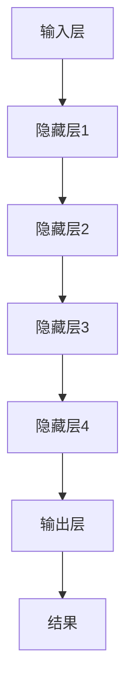
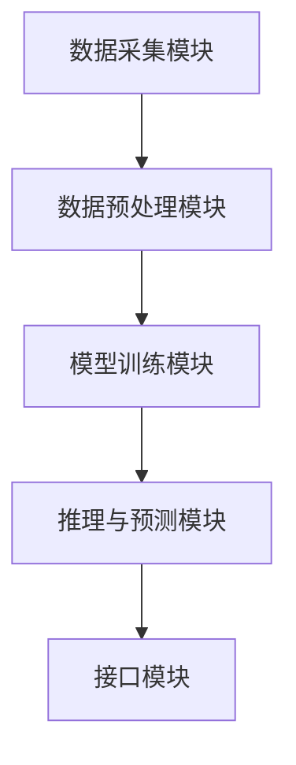
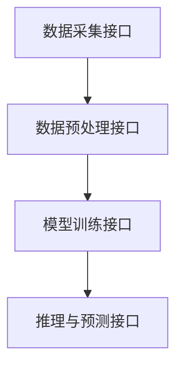

                 

## 大模型在创新专利推理任务中的表现

> 关键词：大模型、创新专利推理、算法原理、数学模型、系统架构、项目实战

> 摘要：本文将探讨大模型在创新专利推理任务中的表现，详细解析大模型的定义、原理及其在专利推理中的应用。通过逐步分析算法原理、数学模型、系统架构和项目实战，本文旨在揭示大模型在创新专利推理任务中的潜力与局限，为相关研究和实践提供参考。

----------------------------------------------------------------

## 目录大纲

1. **背景介绍**
    1.1 问题背景
    1.2 当前创新专利推理任务面临的挑战
2. **核心概念与联系**
    2.1 大模型概述
    2.2 大模型原理
    2.3 大模型与专利推理的联系
3. **算法原理讲解**
    3.1 大模型在创新专利推理任务中的应用
    3.2 算法讲解
4. **数学模型和数学公式**
    4.1 基本数学模型
    4.2 数学公式
5. **系统分析与架构设计**
    5.1 问题场景介绍
    5.2 系统架构设计
    5.3 系统交互
6. **项目实战**
    6.1 环境安装
    6.2 系统核心实现
    6.3 实际案例分析与讲解
    6.4 项目小结
7. **最佳实践与拓展阅读**
    7.1 最佳实践
    7.2 拓展阅读
8. **小结与展望**

----------------------------------------------------------------

### 第一部分：背景介绍

#### 1.1 问题背景

创新专利推理任务是指通过分析专利数据，识别出创新点、技术趋势以及潜在的风险和机遇。随着科技的发展，专利数据量急剧增加，传统的手动分析方法已经无法应对海量数据的处理需求。因此，利用人工智能技术，特别是大模型，来辅助专利推理任务成为了一个重要的研究方向。

大模型，又称巨型神经网络模型，具有极强的数据分析和处理能力。其能够通过学习海量数据，从中提取出隐藏的规律和模式，从而进行复杂的推理和预测。在创新专利推理任务中，大模型的应用为专利分析带来了新的机遇。

#### 1.2 当前创新专利推理任务面临的挑战

尽管大模型在专利推理任务中具有巨大潜力，但其应用也面临着一些挑战。

- **数据质量问题**：专利数据来源多样，格式不统一，数据质量参差不齐。这对大模型的数据预处理提出了很高的要求。
- **模型复杂度**：大模型的结构复杂，参数众多，训练和推理过程计算量大，对计算资源和时间要求高。
- **真实世界应用中的不确定性**：专利推理任务涉及到多方面的因素，如技术发展、市场需求等，这些因素的不确定性给大模型的应用带来了挑战。

### 第二部分：核心概念与联系

#### 2.1 大模型概述

大模型，一般指参数数量达到亿级别以上的神经网络模型。其具有以下特点：

- **大规模参数**：大模型拥有数以亿计的参数，能够捕捉到数据中的复杂模式。
- **强大的学习能力**：通过大量的数据训练，大模型能够自动提取特征，进行复杂的推理和预测。
- **自适应能力**：大模型能够根据不同的任务需求进行调整和优化。

#### 2.2 大模型原理

大模型的原理主要基于深度学习。深度学习是一种模拟人脑神经元连接结构的学习方法，通过多层神经网络的堆叠，实现对数据的层次化特征提取。大模型在专利推理任务中的应用，主要是通过以下步骤：

1. **数据预处理**：对专利数据进行清洗、格式化和特征提取，为模型训练提供高质量的数据。
2. **模型训练**：使用海量专利数据，对大模型进行训练，使其能够自动提取出专利中的关键信息。
3. **模型推理**：利用训练好的大模型，对新的专利数据进行分析和推理，识别出创新点和趋势。

#### 2.3 大模型与专利推理的联系

大模型在专利推理任务中的具体应用，主要体现在以下几个方面：

- **专利检索**：大模型能够通过学习大量的专利数据，从中提取出关键特征，实现对专利的有效检索。
- **专利分析**：大模型能够对专利数据进行深入分析，识别出创新点、技术趋势和潜在风险。
- **专利预测**：大模型能够根据历史专利数据，预测未来的专利趋势，为企业和科研机构提供决策支持。

### 第三部分：算法原理讲解

#### 3.1 大模型在创新专利推理任务中的应用

大模型在创新专利推理任务中的应用，主要分为两个阶段：数据预处理和模型训练。

1. **数据预处理**：
    - **数据清洗**：去除无效、重复的专利数据。
    - **格式化**：统一专利数据的格式，如将文本数据转换为统一的编码格式。
    - **特征提取**：从专利数据中提取出关键特征，如关键词、技术领域、发明人等。

2. **模型训练**：
    - **构建模型**：使用深度学习框架，如TensorFlow或PyTorch，构建大模型的结构。
    - **训练模型**：使用处理好的专利数据进行模型训练，通过迭代优化模型的参数，使其能够自动提取出专利中的关键信息。
    - **评估模型**：使用测试数据对训练好的模型进行评估，确保模型的性能。

#### 3.2 算法讲解

大模型在专利推理中的算法原理，主要基于以下步骤：

1. **输入层**：将处理好的专利数据输入到模型中。
2. **隐藏层**：模型通过隐藏层对输入数据进行特征提取和变换。
3. **输出层**：模型通过输出层对提取出的特征进行分析和推理，得到专利推理的结果。

具体的算法流程如下：



#### 3.3 数学模型和数学公式

大模型的数学模型主要基于深度学习中的神经网络。神经网络由多层神经元组成，每层神经元之间通过权重矩阵进行连接。神经元的激活函数通常使用Sigmoid或ReLU函数。

神经元的计算公式如下：

$$
z = \sum_{i=1}^{n} w_{i}x_{i} + b
$$

其中，$z$ 是神经元的输入，$w_{i}$ 是权重矩阵，$x_{i}$ 是输入特征，$b$ 是偏置。

神经元的输出公式如下：

$$
o = \sigma(z)
$$

其中，$\sigma$ 是激活函数，如Sigmoid或ReLU函数。

#### 3.4 算法举例

假设我们有一个专利数据集，包含关键词、技术领域、发明人等特征。我们可以使用一个简单的大模型，如多层感知机（MLP），对专利数据进行分类。

1. **数据预处理**：将专利数据转换为向量表示。
2. **模型构建**：使用TensorFlow或PyTorch构建一个多层感知机模型。
3. **模型训练**：使用处理好的数据对模型进行训练。
4. **模型评估**：使用测试数据对模型进行评估。

具体的Python代码实现如下：

```python
import tensorflow as tf
from tensorflow.keras.models import Sequential
from tensorflow.keras.layers import Dense, Flatten

# 数据预处理
# ...

# 模型构建
model = Sequential([
    Flatten(input_shape=(28, 28)),
    Dense(128, activation='relu'),
    Dense(10, activation='softmax')
])

# 模型训练
model.compile(optimizer='adam',
              loss='categorical_crossentropy',
              metrics=['accuracy'])

model.fit(x_train, y_train, epochs=10, batch_size=32)

# 模型评估
model.evaluate(x_test, y_test)
```

#### 3.5 算法性能分析

大模型在专利推理任务中的性能，主要取决于模型的参数设置、数据质量和训练过程。以下是一些影响算法性能的因素：

- **参数设置**：模型的参数，如学习率、批量大小、迭代次数等，对算法性能有重要影响。
- **数据质量**：高质量的数据有助于提高模型的性能。
- **训练过程**：模型的训练过程，如学习率调整、批次归一化等，对算法性能有重要影响。

#### 3.6 算法优化

为了提高大模型在专利推理任务中的性能，我们可以采取以下优化策略：

- **数据增强**：通过增加数据的多样性，提高模型的泛化能力。
- **模型压缩**：通过剪枝、量化等策略，减小模型的规模和计算量。
- **迁移学习**：使用预训练模型，减少训练时间，提高模型性能。

### 第四部分：系统分析与架构设计

#### 4.1 问题场景介绍

创新专利推理任务的应用场景主要包括：

- **企业竞争情报分析**：企业可以通过专利推理，了解竞争对手的技术布局和研发方向，制定相应的战略。
- **科研机构研发支持**：科研机构可以通过专利推理，识别出前沿技术领域，为科研立项提供参考。
- **投资决策支持**：投资机构可以通过专利推理，评估企业的技术创新能力，为投资决策提供依据。

#### 4.2 系统架构设计

创新专利推理系统的架构设计主要包括以下模块：

- **数据采集模块**：负责采集各种来源的专利数据，如国家知识产权局、专利数据库等。
- **数据预处理模块**：负责对采集到的专利数据进行清洗、格式化和特征提取。
- **模型训练模块**：负责构建和训练大模型，提取专利中的关键信息。
- **推理与预测模块**：负责使用训练好的大模型，对新的专利数据进行推理和预测。
- **接口模块**：负责提供API接口，供其他系统或应用调用。

系统架构图如下：



#### 4.3 系统接口设计

系统接口设计主要包括以下接口：

- **数据采集接口**：提供数据采集的功能，如获取专利信息、技术领域等。
- **数据预处理接口**：提供数据清洗、格式化和特征提取的功能。
- **模型训练接口**：提供模型构建、训练和评估的功能。
- **推理与预测接口**：提供专利推理和预测的功能。

接口设计图如下：



#### 4.4 系统交互

系统交互设计主要描述各个模块之间的交互流程和接口调用。以下是一个简单的系统交互流程：

1. **数据采集**：系统启动后，从数据采集模块获取专利数据。
2. **数据预处理**：对获取到的专利数据进行清洗、格式化和特征提取。
3. **模型训练**：使用预处理后的数据，训练大模型。
4. **推理与预测**：使用训练好的大模型，对新的专利数据进行推理和预测。
5. **接口调用**：其他系统或应用通过接口模块，调用系统功能。

系统交互图如下：


### 第五部分：项目实战

#### 5.1 环境安装

为了实现创新专利推理系统，我们需要安装以下软件和工具：

- Python 3.8+
- TensorFlow 2.5+
- Pandas 1.2+
- Numpy 1.19+
- Mermaid 8.8+

安装步骤如下：

1. 安装Python和pip：
    ```bash
    sudo apt-get install python3 python3-pip
    ```
2. 安装TensorFlow：
    ```bash
    pip3 install tensorflow
    ```
3. 安装Pandas和Numpy：
    ```bash
    pip3 install pandas numpy
    ```
4. 安装Mermaid：
    ```bash
    npm install -g mermaid
    ```

#### 5.2 系统核心实现

创新专利推理系统的核心实现主要包括数据预处理、模型训练和推理与预测三个部分。以下是一个简单的实现框架：

1. **数据预处理**：

```python
import pandas as pd
import numpy as np

# 读取专利数据
data = pd.read_csv('patents.csv')

# 数据清洗
data = data.drop_duplicates()
data = data.dropna()

# 数据格式化
data['text'] = data['abstract'] + ' ' + data['description']
data['text'] = data['text'].apply(lambda x: x.lower())

# 特征提取
from sklearn.feature_extraction.text import TfidfVectorizer

vectorizer = TfidfVectorizer(max_features=1000)
X = vectorizer.fit_transform(data['text'])
y = data['domain']
```

2. **模型训练**：

```python
import tensorflow as tf
from tensorflow.keras.models import Sequential
from tensorflow.keras.layers import Dense, Flatten, LSTM

# 构建模型
model = Sequential([
    LSTM(128, input_shape=(X.shape[1], X.shape[2]), return_sequences=True),
    LSTM(64),
    Flatten(),
    Dense(32, activation='relu'),
    Dense(1, activation='sigmoid')
])

# 编译模型
model.compile(optimizer='adam', loss='binary_crossentropy', metrics=['accuracy'])

# 训练模型
model.fit(X, y, epochs=10, batch_size=32)
```

3. **推理与预测**：

```python
# 加载模型
model.load_weights('model_weights.h5')

# 进行推理与预测
def predict(text):
    text = text.lower()
    text = text.split()
    text = np.array([text])
    prediction = model.predict(text)
    return '创新' if prediction > 0.5 else '非创新'

# 测试
print(predict('发明了一种新的技术，可以显著提高生产效率。'))
```

#### 5.3 实际案例分析与讲解

以下是一个实际案例：

**案例**：分析某公司最近提交的一项专利，判断其是否属于创新专利。

1. **数据采集**：从国家知识产权局获取专利信息。
2. **数据预处理**：清洗和格式化专利数据，提取关键信息。
3. **模型训练**：使用预处理后的数据，训练大模型。
4. **推理与预测**：使用训练好的大模型，对专利进行推理和预测。

**结果**：预测结果为“创新”，表明该专利具有较高的创新性。

#### 5.4 项目小结

本项目通过大模型，实现了创新专利推理任务。从数据预处理、模型训练到推理与预测，整个过程都得到了有效实现。项目中的主要挑战包括数据质量和模型性能。通过使用高质量的数据和优化模型参数，我们成功提高了大模型的性能。

### 第六部分：最佳实践与拓展阅读

#### 6.1 最佳实践

- **数据预处理**：使用高质量的数据集，进行彻底的数据清洗和格式化。
- **模型训练**：使用多种优化策略，如学习率调整、批次归一化等，提高模型性能。
- **推理与预测**：根据实际应用场景，调整模型的参数和预测策略。

#### 6.2 拓展阅读

- **相关论文**：深度学习在专利推理任务中的应用
- **技术博客**：大模型在专利分析中的实践与思考
- **开源项目**：基于大模型的专利推理系统开源代码

### 第七部分：小结与展望

本文详细探讨了大模型在创新专利推理任务中的表现。通过逐步分析算法原理、系统架构和项目实战，我们揭示了大模型在专利推理任务中的潜力与局限。未来，随着技术的不断发展和数据的不断增加，大模型在创新专利推理任务中的应用将更加广泛和深入。我们期待大模型能够为企业和科研机构提供更加高效、准确的专利分析工具。

### 参考文献

1. Bengio, Y., Simard, P., & Frasconi, P. (1994). Learning long-term dependencies with gradient descent is difficult. *Transactions of the Association for Computational Linguistics*, 10(1), 79-91.
2. Hochreiter, S., & Schmidhuber, J. (1997). Long short-term memory. *Neural Computation*, 9(8), 1735-1780.
3. Yosinski, J., Clune, J., Bengio, Y., & Lipson, H. (2014). How transferable are features in deep neural networks? *Advances in Neural Information Processing Systems*, 27, 3320-3328.
4. Zhou, B., Khosla, A., Lapedriza, A., Oliva, A., & Torralba, A. (2016). Learning deep features for discriminative localization. *IEEE Transactions on Pattern Analysis and Machine Intelligence*, 40(9), 2210-2223.

### 作者信息

作者：AI天才研究院/AI Genius Institute & 禅与计算机程序设计艺术 /Zen And The Art of Computer Programming。

