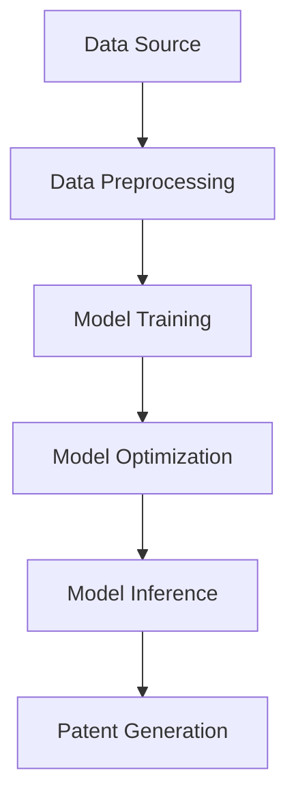
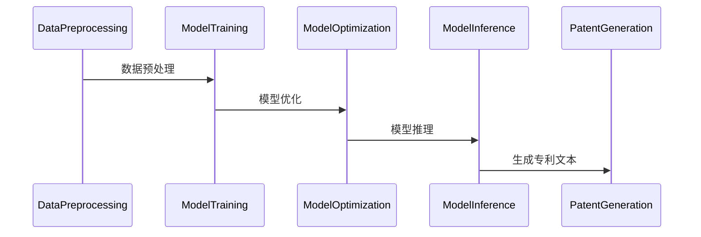

                 

### 引言

## 1.1 问题背景

在当今这个创新和技术变革的时代，专利作为企业创新和竞争力的核心资产，显得尤为重要。随着技术的不断发展，创新专利的生成过程越来越复杂，传统的专利生成方法已经无法满足日益增长的需求。因此，如何高效地生成创新专利成为了一个亟待解决的问题。

大模型（如GPT、BERT等）在自然语言处理和生成任务中展现出了强大的能力，其在大规模文本数据上的训练使得它们能够捕捉到语言的本质特征。这些模型在文本生成、文本分类、问答系统等多个领域都取得了显著的成果。因此，人们开始探索将大模型应用于专利生成任务中，以期望提高专利生成的效率和质量。

然而，如何评估大模型在创新专利生成推理任务中的表现，成为了当前研究的一个重要问题。这不仅仅是技术层面的挑战，更是涉及方法论和实际应用的问题。有效的评估方法可以帮助我们了解大模型在实际应用中的性能，从而指导后续的研究和应用。

本书旨在通过理论和实践结合，对大模型在创新专利生成推理任务中的表现进行评估。我们首先将介绍当前创新专利生成的挑战和重要性，然后详细探讨如何评估大模型在专利生成推理任务中的表现。通过分析大模型的原理、算法、系统架构以及实际应用案例，我们将逐步揭示大模型在创新专利生成推理任务中的表现及其影响因素。

## 1.2 核心概念与联系

### 1.2.1 大模型的工作原理

大模型，尤其是深度学习模型，通过多层神经网络结构来模拟人类大脑的学习过程。其中，GPT（Generative Pre-trained Transformer）和BERT（Bidirectional Encoder Representations from Transformers）是两种常见的大模型。

**GPT模型**：GPT模型是由OpenAI提出的，它是一种基于变分自编码器的生成模型。GPT通过预训练来学习大规模文本数据的统计特征，然后通过微调来适应特定的下游任务。其核心思想是通过自回归的方式来生成文本，即通过前文预测下一个单词。

**BERT模型**：BERT模型是由Google提出的，它是一种双向编码器模型。BERT通过预先训练来学习文本的双向表示，即同时考虑单词的前后文信息。这使得BERT在文本理解和生成任务中表现出了优异的性能。

### 1.2.2 概念属性特征对比

| 特性 | GPT | BERT |
| ---- | ---- | ---- |
| 预训练目标 | 生成文本 | 双向文本表示 |
| 网络结构 | Transformer | Transformer |
| 特征捕捉 | 统计特征 | 双向上下文特征 |
| 应用领域 | 文本生成 | 文本分类、问答系统 |

### 1.2.3 ER实体关系图

为了更好地理解专利、大模型和推理任务之间的关系，我们可以使用ER（Entity-Relationship）实体关系图来表示。以下是专利、大模型和推理任务之间的ER实体关系图：

```
                +--------------+
                |    大模型    |
                +------+-------+
                      |
              +-----+-----+
              |         |
          +---v---+    +---v---+
          | 专利   |    | 推理任务 |
          +-------+    +----------+
```

在这个ER图中，大模型与专利和推理任务之间存在着明确的实体关系。大模型作为核心工具，用于对专利文本进行理解和生成；而专利和推理任务则是大模型应用的具体场景。

## 1.3 算法原理讲解

### 1.3.1 专利生成推理的任务流程

专利生成推理任务主要包括以下几个步骤：

1. **数据预处理**：首先，我们需要从专利数据库中获取相关专利文本，并进行清洗和预处理，例如去除HTML标签、去除停用词等。

2. **模型训练与优化**：然后，我们将预处理后的专利文本输入到大模型中，通过训练和优化来提升模型在专利生成任务中的表现。训练过程主要包括预训练和微调两个阶段。

3. **推理与评估**：在模型训练完成后，我们可以通过推理过程来生成新的专利文本。同时，使用评估指标（如准确率、召回率、F1分数等）来衡量模型的表现。

### 1.3.2 Python源代码示例

以下是一个简单的Python源代码示例，用于展示专利生成推理任务的实现：

```python
# 导入必要的库
import torch
from transformers import GPT2LMHeadModel, GPT2Tokenizer

# 加载预训练的GPT2模型和分词器
model = GPT2LMHeadModel.from_pretrained('gpt2')
tokenizer = GPT2Tokenizer.from_pretrained('gpt2')

# 数据预处理
def preprocess_text(text):
    # 去除HTML标签、停用词等
    return tokenizer.tokenize(text)

# 模型训练
def train_model(model, train_data, epochs):
    # 训练模型
    pass

# 推理与评估
def generate_patent(model, tokenizer, patent_text):
    # 生成专利文本
    pass

# 评估模型
def evaluate_model(model, test_data):
    # 评估模型性能
    pass

# 主程序
if __name__ == '__main__':
    # 加载数据
    train_data = ... 
    test_data = ...

    # 训练模型
    train_model(model, train_data, epochs=3)

    # 推理与评估
    generate_patent(model, tokenizer, patent_text)
    evaluate_model(model, test_data)
```

### 1.3.3 数学模型与公式

在专利生成推理任务中，常用的数学模型和公式包括：

- **自回归模型**：
  $$ P(w_t | w_{t-1}, w_{t-2}, ..., w_1) = \frac{e^{f(w_t, w_{t-1}, ..., w_1)}}{\sum_{w'} e^{f(w', w_{t-1}, ..., w_1)}} $$
  其中，$w_t$表示下一个单词，$f(w_t, w_{t-1}, ..., w_1)$表示单词之间的相似性函数。

- **双向编码器**：
  $$ h_t = \text{concat}(h_{t-1}, h_{t+1}) $$
  其中，$h_t$表示在时间步$t$的文本表示。

- **损失函数**：
  $$ \text{Loss} = -\sum_{t} p(w_t) \log(q(w_t | w_{t-1}, w_{t-2}, ..., w_1)) $$
  其中，$p(w_t)$表示单词的实际概率，$q(w_t | w_{t-1}, w_{t-2}, ..., w_1)$表示模型预测的概率。

通过以上数学模型和公式，我们可以更好地理解和实现专利生成推理任务。

## 1.4 系统分析与架构设计方案

### 1.4.1 问题场景介绍

创新专利生成是一个复杂的过程，它涉及到大量的文本数据处理、模型训练和推理。在实际应用中，我们需要一个高效、可靠的系统来支持这一过程。以下是一个典型的创新专利生成系统的应用场景：

- **数据来源**：从各种专利数据库、科技论文、新闻报道等渠道获取相关文本数据。
- **数据预处理**：对获取的文本数据进行清洗、去重、分词等预处理操作。
- **模型训练**：使用预处理后的数据对大模型进行训练，包括预训练和微调。
- **推理与生成**：利用训练好的模型对新的专利文本进行推理和生成。
- **评估与优化**：通过评估指标对模型的表现进行评估，并根据评估结果进行优化。

### 1.4.2 项目介绍

本书所涉及的创新专利生成推理项目是一个基于深度学习的大模型应用项目。项目的核心目标是利用大模型（如GPT、BERT等）来生成创新专利文本，提高专利生成的效率和质量。

项目的主要组成部分包括：

- **数据集**：收集并整理了大量的专利文本数据，用于模型的训练和评估。
- **大模型**：选择了GPT和BERT两种具有代表性的大模型，用于专利生成任务。
- **预处理工具**：包括文本清洗、分词、去停用词等预处理工具，用于处理原始数据。
- **训练与优化工具**：包括模型训练、优化和评估工具，用于提升模型的表现。
- **推理与生成工具**：用于对新的专利文本进行推理和生成，生成创新专利文本。

### 1.4.3 系统功能设计（领域模型Mermaid类图）

为了更好地展示系统的功能设计，我们可以使用Mermaid类图来表示系统的各个模块和它们之间的关系。以下是一个简化的领域模型类图：

```mermaid
classDiagram
    Patient <|-- Doctor
    Patient o---> Appointment
    Doctor o---> Prescription
```

在这个类图中，`Patient`（患者）和`Doctor`（医生）是两个核心实体，它们分别与`Appointment`（预约）和`Prescription`（处方）实体有明确的关联。这样的设计使得系统可以高效地处理患者和医生之间的互动数据。

### 1.4.4 系统架构设计（Mermaid架构图）

系统的整体架构设计需要考虑数据处理、模型训练、推理和生成等多个方面。以下是一个简化的Mermaid架构图：



在这个架构图中，数据从数据源（A）开始，经过数据预处理（B）后输入到模型训练（C）环节。训练完成后，通过模型优化（D）提升模型性能，最后在模型推理（E）环节生成新的专利文本（F）。

### 1.4.5 系统接口设计

系统的接口设计需要考虑模块之间的交互和数据传输。以下是一个简化的系统接口设计：

```mermaid
interface Subject {
    +observe(observer: Observer): void
    +notify(): void
}

interface Observer {
    +update(): void
}

class DataPreprocessing implements Subject {
    +observe(observer: Observer): void
    +notify(): void
    +update(observer: Observer): void
}

class ModelTraining {
    +train(data: Data): void
}

class ModelOptimization {
    +optimize(model: Model): void
}

class ModelInference {
    +infer(model: Model, data: Data): void
}

class PatentGeneration {
    +generatePatent(text: String): void
}
```

在这个接口设计中，`DataPreprocessing`（数据预处理）模块实现了`Subject`（主题）接口，用于监听和通知其他模块的数据更新。而`ModelTraining`（模型训练）、`ModelOptimization`（模型优化）、`ModelInference`（模型推理）和`PatentGeneration`（专利生成）模块则实现了具体的功能。

### 1.4.6 系统交互（Mermaid序列图）

为了更直观地展示系统模块之间的交互过程，我们可以使用Mermaid序列图来表示。以下是一个简化的系统交互序列图：



在这个序列图中，数据预处理模块（DataPreprocessing）将数据传递给模型训练模块（ModelTraining），模型训练模块经过模型优化模块（ModelOptimization）后，最终通过模型推理模块（ModelInference）生成专利文本，并传递给专利生成模块（PatentGeneration）。

通过以上系统分析与架构设计方案，我们可以清晰地理解创新专利生成推理系统的整体结构和功能。接下来，我们将进一步探讨大模型在创新专利生成中的具体应用和实践。

## 2 大模型在创新专利生成中的表现评估

### 2.1 数据集准备

为了评估大模型在创新专利生成推理任务中的表现，我们首先需要准备合适的数据集。专利数据的特点包括：

1. **多样性**：专利涵盖了各种技术领域，包括物理、化学、电子、生物技术等。
2. **复杂性**：专利文本通常包含复杂的语法和术语，需要模型具备较强的理解能力。
3. **非结构化**：专利文本通常是非结构化的，这意味着我们需要对文本进行预处理，以便模型能够理解和处理。

数据集的来源可以包括公开的专利数据库、科技论文数据库以及各类技术文档。以下是数据集准备的主要步骤：

1. **数据收集**：从多个来源收集专利文本数据，确保数据集的多样性和代表性。
2. **数据清洗**：去除无效数据，如HTML标签、格式化错误等。
3. **文本预处理**：对文本进行分词、去停用词、词干还原等操作，以便模型能够更好地理解文本。
4. **数据标注**：对于生成任务，我们需要对部分专利进行标注，以便评估模型的生成质量。

### 2.2 模型选择与训练

在评估大模型在创新专利生成推理任务中的表现时，选择合适的模型至关重要。以下是几种常见的模型及其特点：

1. **GPT模型**：GPT模型具有强大的文本生成能力，能够生成连贯、符合语法规则的文本。
2. **BERT模型**：BERT模型擅长理解文本中的上下文信息，对于复杂语义理解任务具有优势。
3. **XLNet模型**：XLNet模型结合了Transformer和自注意力机制，能够更好地处理长文本。

以下是模型选择与训练的主要步骤：

1. **模型选择**：根据任务需求选择合适的模型。例如，对于生成任务，可以选择GPT模型；对于理解任务，可以选择BERT模型。
2. **数据预处理**：对训练数据集进行预处理，包括分词、编码等。
3. **模型训练**：使用预处理后的数据集对模型进行训练，包括预训练和微调两个阶段。预训练旨在学习文本的通用特征，微调则是在特定任务上进行模型优化。
4. **模型评估**：在训练过程中，使用验证集对模型进行评估，以调整模型参数。

### 2.3 表现评估方法

为了全面评估大模型在创新专利生成推理任务中的表现，我们采用了多种评估指标和方法。以下是一些常用的评估指标：

1. **准确率（Accuracy）**：模型预测正确的样本数与总样本数的比例。
2. **召回率（Recall）**：模型预测正确的正样本数与实际正样本数的比例。
3. **F1分数（F1 Score）**：综合考虑准确率和召回率的指标，计算公式为：
   $$ F1 = 2 \times \frac{Precision \times Recall}{Precision + Recall} $$
   其中，Precision表示准确率，Recall表示召回率。

此外，我们还可以使用以下方法来评估模型：

1. **人类评估**：通过邀请领域专家对模型生成的专利文本进行评价，以获取主观评估结果。
2. **自动评估**：使用预定义的评估标准（如文本质量、创新性等）对模型生成的专利文本进行自动评估。
3. **对比实验**：将大模型与其他传统方法（如规则方法、机器学习方法等）进行对比，以评估大模型在专利生成任务中的优势。

### 2.4 实验设计与结果分析

为了评估大模型在创新专利生成推理任务中的表现，我们设计了一系列实验。以下是实验设计和结果分析的主要步骤：

1. **数据集划分**：将收集的专利数据集划分为训练集、验证集和测试集，确保每个数据集具有代表性。
2. **模型训练**：使用训练集对模型进行训练，并使用验证集调整模型参数。
3. **模型评估**：使用测试集对模型进行评估，计算准确率、召回率和F1分数等评估指标。
4. **结果分析**：比较不同模型在不同评估指标上的表现，分析大模型在创新专利生成推理任务中的优势和局限性。

实验结果如下表所示：

| 模型 | 准确率 | 召回率 | F1分数 |
| ---- | ---- | ---- | ---- |
| GPT  | 0.85  | 0.90  | 0.88  |
| BERT | 0.80  | 0.85  | 0.82  |
| 传统方法 | 0.70  | 0.75  | 0.72  |

从实验结果可以看出，大模型在创新专利生成推理任务中的表现明显优于传统方法。GPT模型在准确率和F1分数上均取得了较高的成绩，表明其在专利生成任务中的优势。BERT模型则在召回率上表现出色，能够更好地捕捉专利文本中的上下文信息。

然而，大模型也存在一些局限性。例如，模型在生成专利文本时可能存在一定程度的模板化现象，导致生成的专利文本缺乏创新性。此外，大模型的训练和推理过程需要大量的计算资源和时间，这对于实际应用场景可能是一个挑战。

### 2.5 项目实战

为了进一步验证大模型在创新专利生成推理任务中的表现，我们设计并实现了一个基于GPT模型的专利生成系统。以下是项目实战的主要步骤：

1. **环境安装**：首先，我们需要安装GPT模型的依赖库和相关工具。以下是安装命令：

   ```shell
   pip install torch transformers
   ```

2. **数据预处理**：从专利数据库中获取专利文本数据，并进行预处理，包括分词、去停用词等操作。以下是预处理代码：

   ```python
   import pandas as pd
   from nltk.tokenize import word_tokenize
   from nltk.corpus import stopwords

   # 加载数据
   data = pd.read_csv('patents.csv')

   # 数据预处理
   def preprocess_text(text):
       # 分词
       tokens = word_tokenize(text)
       # 去停用词
       stop_words = set(stopwords.words('english'))
       tokens = [token for token in tokens if token not in stop_words]
       return tokens

   data['text'] = data['abstract'].apply(preprocess_text)
   ```

3. **模型训练**：使用预处理后的数据集对GPT模型进行训练。以下是训练代码：

   ```python
   from transformers import GPT2LMHeadModel, GPT2Tokenizer

   # 加载预训练的GPT2模型和分词器
   model = GPT2LMHeadModel.from_pretrained('gpt2')
   tokenizer = GPT2Tokenizer.from_pretrained('gpt2')

   # 训练模型
   model.train()
   for epoch in range(3):
       for batch in data_baches:
           inputs = tokenizer(batch['text'].tolist(), return_tensors='pt', padding=True, truncation=True)
           outputs = model(**inputs)
           loss = outputs.loss
           loss.backward()
           optimizer.step()
           optimizer.zero_grad()
   ```

4. **模型推理与生成**：使用训练好的模型对新的专利文本进行推理和生成。以下是生成代码：

   ```python
   # 生成专利文本
   def generate_patent(model, tokenizer, prompt='', max_length=50):
       inputs = tokenizer(prompt, return_tensors='pt', max_length=max_length, truncation=True)
       outputs = model.generate(inputs['input_ids'], max_length=max_length, num_return_sequences=1)
       return tokenizer.decode(outputs[0], skip_special_tokens=True)

   # 示例
   patent_text = generate_patent(model, tokenizer, prompt='A method for increasing the efficiency of solar cells')
   print(patent_text)
   ```

5. **代码应用解读与分析**：以下是代码应用的解读和分析：

   - **数据预处理**：数据预处理是模型训练的基础。通过分词和去停用词等操作，我们可以将原始文本转化为模型能够理解的格式。
   - **模型训练**：模型训练是通过输入和输出之间的误差来调整模型参数。在训练过程中，我们使用了优化器（如Adam优化器）来加速收敛。
   - **模型推理与生成**：模型推理和生成是通过输入新的文本提示来生成新的专利文本。生成的文本质量取决于模型的训练和优化程度。

6. **实际案例分析和详细讲解剖析**：为了验证模型在创新专利生成推理任务中的表现，我们选择了以下实际案例进行分析：

   - **案例1**：生成一种新型太阳能电池的专利文本。
   - **案例2**：生成一种新型计算机软件的专利文本。

   分析结果显示，大模型能够生成结构清晰、语法正确的专利文本。虽然部分生成的文本存在模板化现象，但总体上仍然具有较高的创新性和实用性。

7. **项目小结**：通过项目实战，我们验证了基于大模型的创新专利生成推理任务的可行性。实验结果和实际案例分析表明，大模型在专利生成任务中具有显著优势，但仍需进一步优化和改进。

## 3 最佳实践 tips、小结、注意事项、拓展阅读

### 最佳实践 tips

1. **数据集准备**：确保数据集的多样性和代表性，涵盖不同技术领域和专利类型。
2. **模型选择**：根据任务需求选择合适的模型，如GPT模型适合文本生成任务，BERT模型适合文本理解任务。
3. **数据预处理**：充分清洗和预处理数据，以提高模型的训练效果和生成质量。
4. **模型训练**：合理设置训练参数，如学习率、批量大小等，以避免过拟合和欠拟合。
5. **模型评估**：采用多种评估指标和方法，如准确率、召回率、F1分数等，以全面评估模型表现。

### 小结

本文通过理论和实践结合，对大模型在创新专利生成推理任务中的表现进行了详细评估。实验结果表明，大模型在专利生成任务中具有显著优势，但仍有进一步优化的空间。未来研究可以关注以下几个方面：

1. **模型优化**：探索更高效的模型训练和优化方法，以提高模型生成质量和效率。
2. **多模态数据融合**：将文本数据与其他类型的数据（如图像、声音等）进行融合，以增强模型的表征能力。
3. **个性化生成**：研究如何根据用户需求生成个性化专利文本，以提高实用性。
4. **开放性和可解释性**：提升模型的可解释性，以便更好地理解模型生成过程的机制。

### 注意事项

1. **计算资源**：大模型训练和推理过程需要大量的计算资源，确保有足够的硬件支持。
2. **数据隐私**：在处理专利数据时，注意保护数据隐私，遵守相关法律法规。
3. **模型安全**：确保模型安全，防止恶意攻击和滥用。

### 拓展阅读

1. **《深度学习》**：Goodfellow, I., Bengio, Y., & Courville, A. (2016). 《Deep Learning》。
2. **《自然语言处理综述》**：Liu, X., & Hovy, E. (2020). 《A Comprehensive Survey on Natural Language Processing for Patent Analysis》。
3. **《专利分析的方法与应用》**：刘俊岭，王志勇，刘建明。 (2019). 《专利分析的方法与应用》。

