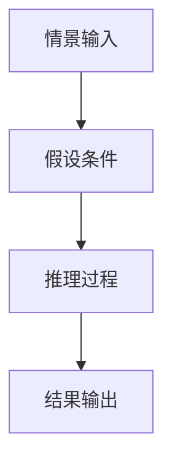
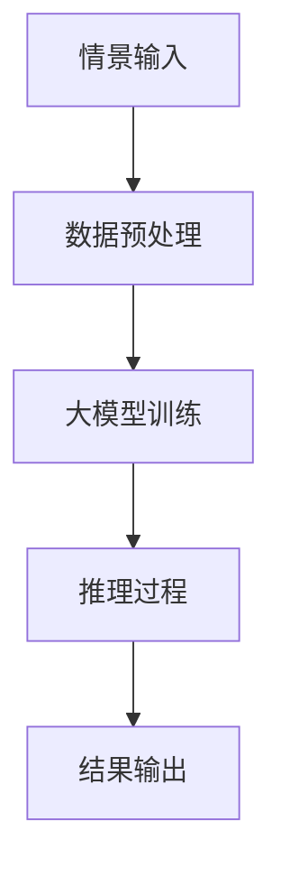

                 

### 第一部分: 背景与核心概念

#### 第1章: 问题背景与核心概念

##### 1.1 反事实情景推理概述

**问题描述**：反事实情景推理（Counterfactual Inference）是一种人工智能领域的重要方法，旨在推断如果某个假设条件成立，当前情景将会发生怎样的变化。在现实生活中，这种推理常常用于决策制定、事件分析、预测修正等领域。

**问题解决**：传统的反事实推理方法主要依赖于规则推理和统计方法，但它们的局限性在于难以处理复杂、不确定的问题。随着深度学习技术的发展，大模型（如Transformer、BERT等）在处理复杂推理任务方面表现出了强大的能力，使得反事实情景推理成为可能。

**边界与外延**：反事实情景推理不仅涉及现实世界中的逻辑推理，还包括对历史事件、未来预测的探讨。其边界涵盖了逻辑、概率、因果推断等多个领域，外延则扩展到包括决策支持、智能咨询、数据分析等应用场景。

##### 1.2 大模型的概念与作用

**大模型的定义**：大模型通常是指参数量超过十亿（Billion-scale）的深度学习模型。它们通过在海量数据上进行训练，可以提取出数据中的潜在模式和规律，具有强大的表达能力和泛化能力。

**大模型的核心特点**：大模型的核心特点包括：
1. **高参数量**：具有数亿到数十亿的参数，能够处理复杂的输入数据和任务。
2. **强大的表达能力**：通过多层神经网络结构，能够对输入数据进行复杂变换和抽象。
3. **良好的泛化能力**：通过大规模数据训练，能够在新数据上表现出良好的性能。

**大模型与传统AI的区别**：传统AI方法通常依赖于预定义的规则或特征，而大模型则通过学习数据中的内在规律来实现智能化。这使得大模型在处理不确定性和复杂任务方面具有显著优势。

##### 1.3 大模型在反事实情景推理中的优势

**大模型的优势**：
1. **数据驱动**：大模型通过海量数据训练，能够更好地理解和学习反事实情景的复杂性和多样性。
2. **强大的表示能力**：大模型能够捕捉到输入数据的深层特征，从而在反事实推理中更加准确地预测结果。
3. **自动特征提取**：大模型能够自动学习数据中的有用特征，减轻了传统方法中特征工程的工作负担。

**反事实情景推理的应用场景**：反事实情景推理在多个领域都有广泛应用，包括：
1. **医疗健康**：用于疾病预测和治疗方案优化。
2. **金融领域**：用于风险评估和投资决策。
3. **社会管理**：用于政策分析和事件预测。

**大模型的应用前景**：随着深度学习技术的不断发展，大模型在反事实情景推理中的应用前景广阔。未来，大模型有望在更多复杂场景中发挥重要作用，推动人工智能技术的发展。

#### 第2章: 核心概念与联系

##### 2.1 反事实情景推理的核心概念

**反事实情景推理的定义**：反事实情景推理是一种基于假设条件进行推理的方法，旨在探讨如果某个条件成立，现实世界将会发生怎样的变化。

**反事实情景推理的属性特征**：
1. **因果性**：反事实情景推理涉及到因果关系的分析，即探讨假设条件对现实结果的影响。
2. **不确定性**：反事实情景推理通常面临数据的不确定性和情境的不确定性，需要采用概率方法进行建模。
3. **复杂性**：反事实情景推理往往涉及多个变量和条件，需要复杂的计算和推理算法。

**反事实情景推理与相关概念的对比**：反事实情景推理与条件推理、因果推理等概念有密切联系，但又有显著区别。条件推理主要关注条件语句的推理，而因果推理则关注因果关系。反事实情景推理则将两者结合起来，旨在分析不同假设条件下的情景变化。

##### 2.2 大模型的核心概念与联系

**大模型的定义**：大模型是指参数量超过十亿（Billion-scale）的深度学习模型。

**大模型的属性特征**：
1. **高参数量**：大模型具有数亿到数十亿的参数，能够处理复杂的输入数据和任务。
2. **强大的表达能力**：通过多层神经网络结构，能够对输入数据进行复杂变换和抽象。
3. **良好的泛化能力**：通过大规模数据训练，能够在新数据上表现出良好的性能。

**大模型与反事实情景推理的联系**：大模型在反事实情景推理中的应用，主要在于其强大的数据处理和表达能力。大模型能够处理复杂的输入数据，提取深层特征，从而在反事实情景推理中更加准确地预测结果。

##### 2.3 大模型在反事实情景推理中的创新点

**大模型在反事实情景推理中的创新方法**：大模型在反事实情景推理中的应用，主要体现在以下方面：
1. **自注意力机制**：大模型通过自注意力机制，能够捕捉到输入数据中的关键特征，从而在反事实情景推理中更加准确地预测结果。
2. **预训练和微调**：大模型通过预训练和微调方法，能够在特定领域中获得更好的性能，从而在反事实情景推理中发挥更大的作用。

**大模型在反事实情景推理中的创新应用**：大模型在反事实情景推理中的应用，已经取得了显著成果，包括：
1. **医疗健康**：用于疾病预测和治疗方案优化。
2. **金融领域**：用于风险评估和投资决策。
3. **社会管理**：用于政策分析和事件预测。

**大模型在反事实情景推理中的创新前景**：随着深度学习技术的不断发展，大模型在反事实情景推理中的应用前景广阔。未来，大模型有望在更多复杂场景中发挥重要作用，推动人工智能技术的发展。

### 总结

本文首先介绍了反事实情景推理和大模型的基本概念，分析了大模型在反事实情景推理中的优势和应用前景。接着，深入探讨了反事实情景推理和大模型的核心概念及其相互联系。通过这一部分的介绍，读者可以初步了解大模型在反事实情景推理中的应用场景和潜在的创新点。

在接下来的章节中，我们将进一步探讨大模型在反事实情景推理中的算法原理、系统架构设计、项目实战以及最佳实践，帮助读者更深入地理解这一领域的前沿技术和应用。

## 第二部分：算法原理

### 第3章：算法原理讲解

#### 3.1 反事实情景推理算法的基本框架

反事实情景推理算法的基本框架通常包括以下几个步骤：

1. **情景输入**：首先，输入一个具体的情景，包括当前的状态和事件。
2. **假设条件**：根据问题需求，设定一个或多个假设条件，例如“如果事件A发生”。
3. **推理过程**：根据假设条件，对情景进行逻辑推理，分析不同条件下的可能结果。
4. **结果输出**：输出基于假设条件的推理结果，包括可能的结果和概率分布。

以下是一个简单的反事实情景推理算法的mermaid流程图示例：



#### 3.2 大模型在反事实情景推理中的应用

大模型在反事实情景推理中的应用，主要通过深度学习算法来实现。以下是一个大模型在反事实情景推理中应用的mermaid流程图：



**应用步骤**：

1. **情景输入**：输入具体的情景数据，包括状态和事件。
2. **数据预处理**：对输入数据进行清洗、标准化等处理，以便于大模型的训练。
3. **大模型训练**：使用海量数据对大模型进行训练，使其能够理解并处理复杂的反事实情景。
4. **推理过程**：利用训练好的大模型，对输入情景进行反事实推理。
5. **结果输出**：输出推理结果，包括可能的情景变化和概率分布。

#### 3.3 算法原理与数学模型

**算法原理的mermaid流程图**：


**算法原理的数学模型**：

假设我们有一个反事实情景推理问题，给定当前状态 $S$ 和事件 $E$，我们需要推断如果事件 $E$ 不发生，状态 $S$ 将会是什么。这可以用以下数学模型来表示：

$$
P(S'|E') = \frac{P(S', E')}{P(E')}
$$

其中，$P(S'|E')$ 表示在假设事件 $E$ 不发生的情况下，状态 $S'$ 的概率；$P(S', E')$ 表示状态 $S'$ 和事件 $E'$ 同时发生的概率；$P(E')$ 表示事件 $E$ 不发生的概率。

**算法原理的公式讲解**：

1. **概率基础**：该公式基于概率论的基本原理，即条件概率和全概率公式。
2. **推理过程**：通过条件概率 $P(S'|E')$ 和全概率公式，我们可以计算出在事件 $E$ 不发生的情况下，状态 $S'$ 的概率。
3. **应用场景**：在实际应用中，我们通常需要根据具体的问题需求，调整公式中的参数和条件，以适应不同的反事实情景推理任务。

#### 3.4 算法举例说明

**算法原理的举例说明**：

假设我们有一个简单的反事实情景推理问题：如果今天下雨，那么地面上会有水。现在，我们想知道如果今天没有下雨，地面上的情况会是什么。

**输入**：
- 当前状态 $S$：今天下雨。
- 事件 $E$：地面上有水。

**假设条件**：
- 假设今天没有下雨，即 $E'$：今天没有下雨。

**推理过程**：
- 根据假设条件，我们可以使用上述公式计算地面上的情况概率。

**结果输出**：
- $P(S'|E')$：在没有下雨的情况下，地面上的概率。

**Python源代码实现**：

```python
import numpy as np

# 概率参数
P_S_E = 0.7  # 如果下雨，地面有水的概率
P_E = 0.5  # 下雨的概率

# 计算如果没有下雨，地面上有水的概率
P_S_E_prime = P_S_E / P_E

print(f"P(S'|E') = {P_S_E_prime}")
```

**算法原理的应用案例**：

在实际应用中，反事实情景推理算法可以用于多个领域，例如：

1. **医疗健康**：用于疾病预测和治疗方案优化，例如分析如果患者接受不同治疗方案，疾病发展的可能性。
2. **金融领域**：用于风险评估和投资决策，例如分析如果市场发生变化，投资组合的风险和收益。
3. **社会管理**：用于政策分析和事件预测，例如分析如果实施某项政策，社会反应的可能性和结果。

通过上述算法原理讲解和举例说明，我们可以看到，反事实情景推理算法在大模型中的应用，不仅需要数学模型的支持，还需要具体的算法实现。在接下来的章节中，我们将进一步探讨大模型在反事实情景推理中的系统分析与架构设计，以及实际项目中的应用。

### 第4章: 系统分析与架构设计

#### 4.1 项目介绍

**项目背景**：随着人工智能技术的快速发展，反事实情景推理在各个领域都展现出了巨大的应用潜力。本项目旨在构建一个基于大模型的反事实情景推理系统，用于解决复杂情景下的推理问题。

**项目目标**：本项目的主要目标包括：
1. 设计并实现一个高效的反事实情景推理算法。
2. 构建一个可扩展的系

