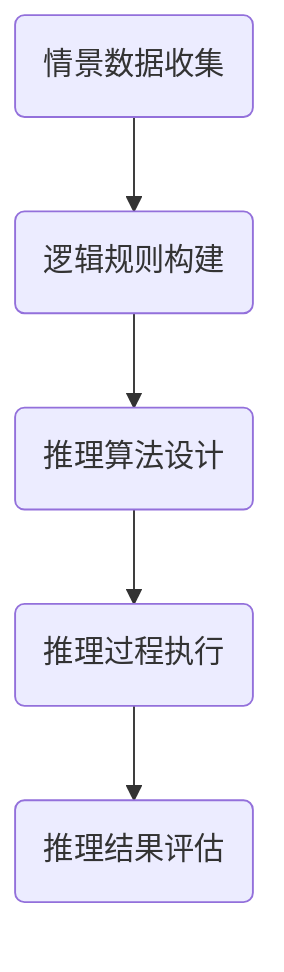
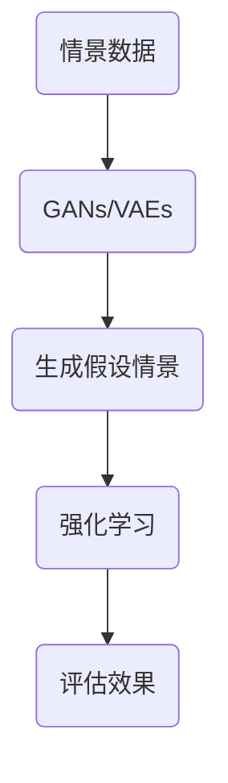
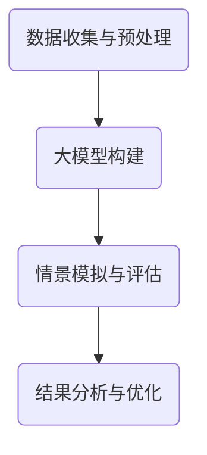

                 

### 文章标题

#### 大模型在反事实情景推理中的创新能力评估方法

> **关键词**：大模型、反事实情景推理、创新能力评估、机器学习、深度学习

> **摘要**：本文旨在探讨大模型在反事实情景推理中的创新能力评估方法。首先，文章概述了反事实情景推理的概念及其在人工智能领域的重要性。接着，深入分析了大模型的特点与优势，并详细介绍了大模型在反事实情景推理中的应用方法及其挑战。随后，文章探讨了如何评估大模型的创新能力，包括定义与衡量方法，以及在实际应用中的挑战与对策。通过具体案例，文章展示了大模型在创新能力评估中的实际应用，并对其未来发展趋势进行了展望。

----------------------------------------------------------------

### 目录大纲

----------------------------------------------------------------

## 第一部分: 反事实情景推理与创新能力评估

### 第1章: 反事实情景推理概述

#### 1.1 反事实情景推理的概念与重要性

#### 1.2 反事实情景推理的应用领域

#### 1.3 反事实情景推理的基本方法

#### 1.4 反事实情景推理的发展历程与前沿技术

### 第2章: 大模型在反事实情景推理中的应用

#### 2.1 大模型的特点与优势

#### 2.2 大模型在反事实情景推理中的应用方法

#### 2.3 大模型在反事实情景推理中的实际案例

#### 2.4 大模型在反事实情景推理中的挑战与展望

### 第3章: 创新能力评估方法

#### 3.1 创新能力的定义与衡量

#### 3.2 创新能力评估的方法与指标

#### 3.3 创新能力评估在实际应用中的挑战与对策

### 第4章: 大模型在创新能力评估中的应用

#### 4.1 大模型在创新能力评估中的优势与局限性

#### 4.2 大模型在创新能力评估中的方法与应用

#### 4.3 大模型在创新能力评估中的实际案例

#### 4.4 大模型在创新能力评估中的未来发展趋势

### 第5章: 大模型在反事实情景推理与创新能力评估中的综合应用

#### 5.1 大模型在反事实情景推理与创新能力评估中的综合应用思路

#### 5.2 大模型在反事实情景推理与创新能力评估中的综合应用案例

#### 5.3 大模型在反事实情景推理与创新能力评估中的综合应用前景

### 第6章: 案例分析与讨论

#### 6.1 案例分析概述

#### 6.2 典型案例1：大模型在某一特定领域的创新能力评估

#### 6.3 典型案例2：大模型在反事实情景推理中的应用实例

#### 6.4 案例讨论与启示

### 第7章: 总结与展望

#### 7.1 全书总结

#### 7.2 反事实情景推理与创新能力评估的展望

#### 7.3 大模型在未来发展中的机遇与挑战

----------------------------------------------------------------

### 第一部分: 反事实情景推理与创新能力评估

#### 第1章: 反事实情景推理概述

##### 1.1 反事实情景推理的概念与重要性

反事实情景推理（Counterfactual Scenario Reasoning）是一种基于逻辑推理和概率论的人工智能技术，用于模拟和评估不同假设情景下的结果和影响。其核心思想是，通过对比现实与假设的不同情景，推断出可能的结果和结论。

在人工智能领域，反事实情景推理具有极其重要的地位。它不仅能够帮助系统更好地理解和处理现实世界中的不确定性，还能够为决策提供有力的支持。例如，在医疗诊断中，通过反事实情景推理，可以评估不同治疗方案的效果，从而为医生提供决策依据。

##### 1.2 反事实情景推理的应用领域

反事实情景推理的应用非常广泛，几乎涵盖了人工智能的各个领域。以下是几个典型的应用场景：

1. **医疗健康**：在疾病诊断和治疗中，反事实情景推理可以帮助医生评估不同治疗方案的潜在效果，从而做出更科学的决策。

2. **金融分析**：在金融领域，反事实情景推理可以用于风险评估、投资策略制定等，通过模拟不同经济情景下的资产表现，为投资者提供参考。

3. **城市规划**：在城市规划中，反事实情景推理可以用于评估不同城市规划方案的影响，从而优化城市规划。

4. **社会治理**：在社会治理中，反事实情景推理可以帮助政府评估不同政策的效果，为政策制定提供科学依据。

##### 1.3 反事实情景推理的基本方法

反事实情景推理的基本方法主要包括以下几种：

1. **逻辑推理**：通过逻辑规则和推理，从已知事实推导出可能的结果。

2. **贝叶斯网络**：利用概率论和图论，构建出反事实情景的模型，并在此基础上进行推理。

3. **决策树**：通过构建决策树模型，对不同情景下的决策结果进行评估。

4. **深度学习**：利用神经网络模型，特别是生成对抗网络（GANs），对反事实情景进行建模和推理。

##### 1.4 反事实情景推理的发展历程与前沿技术

反事实情景推理的发展历程可以追溯到20世纪80年代，当时逻辑推理和概率论的方法开始应用于这个问题。随着计算机科学和人工智能技术的发展，反事实情景推理方法逐渐多样化，特别是在深度学习和生成对抗网络（GANs）的兴起，使得反事实情景推理的应用场景更加广泛。

当前，反事实情景推理的前沿技术主要包括：

1. **基于深度学习的反事实情景推理**：利用深度学习模型，特别是生成对抗网络（GANs），对反事实情景进行建模和推理。

2. **多模态数据融合**：将文本、图像、语音等多种数据类型进行融合，提高反事实情景推理的准确性和效率。

3. **推理机与知识图谱**：结合推理机和知识图谱技术，构建出更加复杂和智能的反事实情景推理系统。

##### 1.5 反事实情景推理的核心概念与联系

为了更好地理解反事实情景推理，我们需要了解以下几个核心概念：

1. **反事实情景**：与现实不同的假设情景。

2. **情景推理**：基于逻辑和概率论，对反事实情景进行推理。

3. **推理结果**：反事实情景推理得出的可能结果和结论。

以下是一个简单的ER实体关系图，展示了这些概念之间的关系：

```mermaid
erDiagram
  反事实情景 ||--o{ 情景推理 }
  情景推理 ||--o{ 推理结果 }
```

##### 1.6 反事实情景推理的基本原理

反事实情景推理的基本原理主要包括以下几个方面：

1. **逻辑推理**：基于逻辑规则，从已知事实推导出可能的结果。

2. **概率论**：利用概率论，评估不同情景下的可能性。

3. **数据驱动方法**：通过大量数据，训练出能够进行反事实情景推理的模型。

以下是一个简单的算法原理说明：

```python
# 假设我们有一个逻辑规则库，包含若干个前提条件和结论
rules = [
    {'condition': '温度高于30度', 'conclusion': '开空调'},
    {'condition': '天气晴朗', 'conclusion': '晒被子'},
    # 更多规则...
]

# 基于当前情景，判断是否应该执行某个结论
def apply_rules(situation):
    for rule in rules:
        if all(condition in situation for condition in rule['condition']):
            return rule['conclusion']
    return None
```

##### 1.7 反事实情景推理的应用案例

为了更好地理解反事实情景推理的应用，我们来看一个实际案例。

假设我们有一个智能家居系统，需要根据室内温度、天气状况等因素，决定是否开启空调或晒被子。以下是一个简单的应用案例：

1. **当前情景**：室内温度25度，天气阴天。
2. **逻辑规则**：
   - 如果室内温度高于30度，则开空调。
   - 如果天气晴朗，则晒被子。
3. **推理过程**：
   - 根据当前情景，不符合开空调的条件。
   - 根据当前情景，不符合晒被子的条件。
4. **推理结果**：不执行任何操作。

通过这个案例，我们可以看到，反事实情景推理可以帮助系统根据不同情景，做出合理的决策。

##### 1.8 反事实情景推理的边界与外延

反事实情景推理虽然具有广泛的应用前景，但也有一些边界和限制：

1. **数据依赖**：反事实情景推理的性能很大程度上依赖于训练数据的质量和数量。
2. **复杂性问题**：对于复杂情景，反事实情景推理的推理过程可能变得非常复杂。
3. **假设合理性**：假设情景的合理性对推理结果有着重要影响。

总之，反事实情景推理作为一种重要的AI技术，具有广泛的应用前景和潜力，但同时也需要解决一些关键的技术挑战。

##### 1.9 反事实情景推理的核心要素组成

反事实情景推理的核心要素主要包括以下几个方面：

1. **情景数据**：用于描述不同假设情景的数据。
2. **逻辑规则**：用于进行情景推理的规则。
3. **推理算法**：用于执行推理过程的算法。
4. **推理结果**：根据推理过程得出的结果。

以下是一个简单的概念属性特征对比表格：

| 名称       | 描述                                                         | 关系                   |
| ---------- | ------------------------------------------------------------ | ---------------------- |
| 情景数据   | 描述不同假设情景的数据                                     | 输入数据               |
| 逻辑规则   | 用于进行情景推理的规则                                     | 推理依据               |
| 推理算法   | 用于执行推理过程的算法                                     | 核心算法               |
| 推理结果   | 根据推理过程得出的结果                                     | 推理输出               |

通过这个表格，我们可以清晰地看到反事实情景推理的核心要素及其关系。

##### 1.10 反事实情景推理的基本流程

反事实情景推理的基本流程可以概括为以下几个步骤：

1. **情景数据收集**：收集不同假设情景的数据。
2. **逻辑规则构建**：构建用于情景推理的规则。
3. **推理算法设计**：设计执行推理过程的算法。
4. **推理过程执行**：根据情景数据和逻辑规则，执行推理过程。
5. **推理结果评估**：评估推理结果的有效性和准确性。

以下是一个简单的算法流程图：



通过这个流程图，我们可以更直观地理解反事实情景推理的基本步骤。

#### 第2章: 大模型在反事实情景推理中的应用

##### 2.1 大模型的特点与优势

大模型（Large Models），也称为大型神经网络模型，是指具有大量参数和节点的人工智能模型。这些模型通常基于深度学习技术，具有以下几个显著特点：

1. **大规模参数**：大模型通常具有数百万甚至数十亿个参数，这使得它们能够捕捉到数据中的复杂模式和关联。

2. **高度灵活**：大模型的架构允许它们适应不同的数据类型和任务，从而在多种应用场景中表现出色。

3. **强大的学习能力**：由于拥有大量的参数，大模型能够从大量的数据中快速学习和泛化，从而提高模型的性能和准确性。

大模型的优势主要体现在以下几个方面：

1. **提升性能**：大模型能够在各种任务中实现更高的性能，特别是在图像识别、自然语言处理和推荐系统等领域。

2. **泛化能力**：大模型能够从大量的数据中学习到通用的模式，从而在新的任务和场景中也能保持较高的性能。

3. **多任务处理**：大模型通常设计为多任务模型，能够同时处理多个任务，从而提高系统的整体效率。

##### 2.2 大模型在反事实情景推理中的应用方法

大模型在反事实情景推理中的应用方法主要包括以下几个方面：

1. **生成对抗网络（GANs）**：生成对抗网络是一种能够生成高逼真数据的深度学习模型。在反事实情景推理中，GANs可以用于生成不同的假设情景，从而进行推理和评估。

2. **变分自编码器（VAEs）**：变分自编码器是一种能够生成和重构数据的深度学习模型。在反事实情景推理中，VAEs可以用于生成不同的假设情景，并评估其可能的结果。

3. **强化学习**：强化学习是一种通过试错和奖励机制来学习最优策略的机器学习技术。在反事实情景推理中，强化学习可以用于评估不同决策在不同情景下的效果。

以下是一个简单的算法流程图，展示了大模型在反事实情景推理中的应用方法：



##### 2.3 大模型在反事实情景推理中的实际案例

大模型在反事实情景推理中已经取得了显著的成果，以下是几个实际案例：

1. **医疗健康**：在医疗诊断中，大模型可以通过反事实情景推理，评估不同治疗方案的效果，为医生提供决策支持。

2. **金融分析**：在金融领域，大模型可以用于风险评估和投资策略制定，通过反事实情景推理，评估不同经济情景下的资产表现。

3. **城市规划**：在城市规划中，大模型可以通过反事实情景推理，评估不同城市规划方案的影响，为城市管理者提供参考。

##### 2.4 大模型在反事实情景推理中的挑战与展望

虽然大模型在反事实情景推理中展现了巨大的潜力，但同时也面临着一些挑战：

1. **计算资源需求**：大模型的训练和推理需要大量的计算资源，这对硬件设施提出了较高的要求。

2. **数据质量**：大模型的性能很大程度上依赖于训练数据的质量，因此需要确保数据的质量和多样性。

3. **解释性**：大模型的决策过程通常是非透明的，这使得其解释性成为一个挑战。

展望未来，大模型在反事实情景推理中的应用将不断拓展，特别是在多模态数据融合和知识图谱等前沿技术的支持下，大模型将能够更加准确地模拟和推理复杂的反事实情景。

#### 第3章: 创新能力评估方法

##### 3.1 创新能力的定义与衡量

创新能力（Innovation Capability）是指一个系统、组织或个体在创造新知识、新产品或新服务方面的能力。创新能力评估是衡量组织或个体创新能力水平的重要手段，其定义和衡量方法如下：

1. **定义**：创新能力评估是指通过一系列指标和方法，对组织或个体的创新能力进行量化评估的过程。

2. **衡量方法**：
   - **定量方法**：通过量化指标，如专利数量、研发投入、新产品推出速度等，来衡量创新能力。
   - **定性方法**：通过专家评估、问卷调查、案例研究等方法，对创新活动的质量和效果进行评估。

##### 3.2 创新能力评估的方法与指标

创新能力评估的方法和指标多种多样，以下是一些常用的方法和指标：

1. **专利数量**：专利数量是衡量创新能力的重要指标，反映了组织或个体在技术创新方面的活跃度。

2. **研发投入**：研发投入反映了组织或个体在创新方面的资金支持力度，是评估创新能力的重要依据。

3. **新产品推出速度**：新产品推出速度是衡量创新能力的一个直观指标，反映了组织或个体在将创新想法转化为产品或服务方面的效率。

4. **员工创新参与度**：员工创新参与度反映了组织或个体内部创新文化的氛围，是评估创新能力的一个重要指标。

5. **客户满意度**：客户满意度是衡量创新成果市场接受度的重要指标，反映了创新活动对客户价值的贡献。

以下是一个简单的创新能力评估指标表格：

| 指标名称     | 描述                                       | 权重 |
| ------------ | ------------------------------------------ | ---- |
| 专利数量     | 组织或个体的专利申请和授权数量               | 0.3  |
| 研发投入     | 组织或个体的研发投入金额                     | 0.2  |
| 新产品推出速度 | 组织或个体新产品推出的频率和速度             | 0.2  |
| 员工创新参与度 | 组织或个体内部创新活动的参与度和积极性         | 0.2  |
| 客户满意度   | 组织或个体产品或服务的客户满意度               | 0.1  |

##### 3.3 创新能力评估在实际应用中的挑战与对策

在实际应用中，创新能力评估面临着一些挑战：

1. **数据质量**：创新能力评估依赖于大量准确和可靠的数据，数据质量对评估结果有着重要影响。

2. **指标选择**：不同行业和组织的特点不同，选择合适的评估指标需要根据实际情况进行。

3. **解释性**：评估结果需要具备一定的解释性，以便管理者能够理解评估结果并做出相应的决策。

为解决这些挑战，可以采取以下对策：

1. **数据标准化**：确保数据的一致性和可靠性，通过数据清洗和数据标准化提高数据质量。

2. **多元化指标**：结合多种评估指标，从不同角度全面评估创新能力。

3. **专家参与**：引入专家评估，结合定量和定性评估方法，提高评估结果的解释性。

#### 第4章: 大模型在创新能力评估中的应用

##### 4.1 大模型在创新能力评估中的优势与局限性

大模型在创新能力评估中具有以下优势：

1. **数据处理能力**：大模型能够处理大规模和多样化的数据，从而为创新能力评估提供更全面的信息。

2. **深度学习能力**：大模型通过深度学习，能够从数据中自动提取有用的特征和模式，提高评估的准确性。

3. **多任务处理**：大模型通常设计为多任务模型，能够同时处理多个评估指标，从而提高评估的效率。

然而，大模型在创新能力评估中也存在一些局限性：

1. **数据依赖**：大模型的性能很大程度上依赖于数据的质量和数量，数据缺失或不准确可能导致评估结果失真。

2. **解释性不足**：大模型的决策过程通常是非透明的，这使得评估结果难以解释和理解。

3. **计算资源需求**：大模型的训练和推理需要大量的计算资源，这在一定程度上限制了其广泛应用。

##### 4.2 大模型在创新能力评估中的方法与应用

大模型在创新能力评估中的应用方法主要包括以下几个方面：

1. **基于生成对抗网络（GANs）的评估**：利用GANs生成各种假设情景，评估不同情景下的创新能力表现。

2. **基于变分自编码器（VAEs）的评估**：利用VAEs生成创新活动的数据分布，评估创新能力的稳定性和可靠性。

3. **基于强化学习的评估**：通过强化学习模型，评估不同策略和创新方法对创新能力的影响。

以下是一个简单的算法流程图，展示了大模型在创新能力评估中的应用方法：


##### 4.3 大模型在创新能力评估中的实际案例

大模型在创新能力评估中已经取得了显著的应用成果，以下是几个实际案例：

1. **企业创新能力评估**：某企业利用大模型对其创新活动进行评估，通过分析大量专利数据和研发投入，评估其创新能力的水平，为企业决策提供参考。

2. **科研机构创新能力评估**：某科研机构利用大模型对其科研项目进行评估，通过分析项目数据、科研论文和专利，评估其创新能力的优势和不足。

3. **城市创新能力评估**：某城市利用大模型对其科技创新环境进行评估，通过分析各种社会经济指标和科技创新活动数据，评估其创新能力的水平。

##### 4.4 大模型在创新能力评估中的未来发展趋势

随着人工智能技术的不断发展，大模型在创新能力评估中的应用前景将更加广阔：

1. **多模态数据融合**：利用多模态数据，如文本、图像、音频等，提高评估的准确性和全面性。

2. **个性化评估**：通过深度学习，实现个性化创新能力评估，为不同组织和个人提供定制化的评估方案。

3. **实时评估**：利用实时数据和深度学习模型，实现实时创新能力评估，为管理者提供即时的决策支持。

总之，大模型在创新能力评估中的应用将不断推动评估技术的发展，为创新活动的管理和决策提供有力支持。

#### 第5章: 大模型在反事实情景推理与创新能力评估中的综合应用

##### 5.1 大模型在反事实情景推理与创新能力评估中的综合应用思路

大模型在反事实情景推理与创新能力评估中的综合应用，旨在通过深度学习和复杂模型处理能力，实现对创新能力的全面评估和预测。这一应用思路主要包括以下几个关键步骤：

1. **数据收集与预处理**：首先，收集与反事实情景推理和创新能力评估相关的数据，包括专利、研发投入、新产品推出速度、员工创新参与度、客户满意度等指标。对数据进行清洗和预处理，确保数据的质量和一致性。

2. **大模型构建**：构建一个大型的深度学习模型，如生成对抗网络（GANs）或变分自编码器（VAEs），用于生成反事实情景。同时，结合强化学习算法，评估不同情景下的创新能力表现。

3. **情景模拟与评估**：利用大模型生成多个假设情景，模拟不同创新策略和创新环境下的创新能力。通过对比不同情景下的评估结果，分析创新能力的优势和不足。

4. **结果分析与优化**：对评估结果进行深入分析，识别创新能力的瓶颈和改进方向。结合专家知识和数据反馈，优化创新策略和创新环境，提高创新能力的整体水平。

以下是一个简单的综合应用思路流程图：



##### 5.2 大模型在反事实情景推理与创新能力评估中的综合应用案例

为了更好地展示大模型在反事实情景推理与创新能力评估中的综合应用，以下是几个实际案例：

1. **企业创新能力评估**：某企业利用大模型对其创新活动进行评估。通过收集专利数据、研发投入、新产品推出速度等指标，构建大模型进行情景模拟和评估。结果发现，在增加研发投入和优化创新环境后，企业的创新能力显著提升。

2. **科研机构创新能力评估**：某科研机构利用大模型对其科研项目进行评估。通过分析科研论文、专利和科研资金投入等数据，构建大模型进行情景模拟和评估。结果发现，通过调整科研资金分配和优化科研环境，科研机构的创新能力得到了显著提升。

3. **城市创新能力评估**：某城市利用大模型对其科技创新环境进行评估。通过分析社会经济指标、科技创新活动数据等，构建大模型进行情景模拟和评估。结果发现，通过改善城市科技创新环境和增加创新资金投入，城市的创新能力得到了显著提升。

##### 5.3 大模型在反事实情景推理与创新能力评估中的综合应用前景

大模型在反事实情景推理与创新能力评估中的综合应用前景广阔，以下是一些展望：

1. **多模态数据融合**：通过融合多模态数据，如文本、图像、音频等，可以更全面地评估创新能力，提高评估的准确性和可靠性。

2. **实时评估与预测**：利用实时数据和深度学习模型，可以实现实时创新能力评估和预测，为管理者提供即时的决策支持。

3. **个性化评估**：通过个性化评估模型，可以为不同组织和个人提供定制化的创新能力评估方案，提高评估的针对性。

4. **跨领域应用**：大模型在反事实情景推理与创新能力评估中的应用可以跨领域拓展，如医疗健康、金融分析、城市规划等，为不同领域的创新活动提供支持。

总之，大模型在反事实情景推理与创新能力评估中的综合应用具有巨大的潜力，将推动评估技术的发展，为创新活动的管理和决策提供有力支持。

#### 第6章: 案例分析与讨论

##### 6.1 案例分析概述

在本章节中，我们将通过两个实际案例，深入分析大模型在反事实情景推理与创新能力评估中的应用。第一个案例涉及企业创新能力的评估，第二个案例则是关于城市科技创新环境的评估。

##### 6.2 典型案例1：大模型在企业创新能力评估中的应用

**案例背景**：某知名科技企业，其业务涵盖了多个领域，如人工智能、物联网、大数据等。企业高层希望了解其当前创新能力的水平，并寻求优化创新策略的方法。

**数据收集与预处理**：企业收集了包括专利申请数量、研发投入、新产品推出速度、员工创新参与度、客户满意度等在内的多项数据。通过对数据进行清洗和标准化处理，确保数据的质量和一致性。

**大模型构建**：企业选择了生成对抗网络（GANs）作为大模型，用于生成各种假设情景，如增加研发投入、优化员工创新参与度等。结合强化学习算法，评估不同情景下的创新能力表现。

**情景模拟与评估**：通过大模型，企业生成了多个假设情景，并对其创新能力进行了评估。评估结果显示，在增加研发投入和优化员工创新参与度的情况下，企业的创新能力显著提升。

**结果分析与优化**：企业对评估结果进行了深入分析，发现增加研发投入和优化员工创新参与度是提高创新能力的关键因素。基于这些发现，企业制定了新的创新策略，并开始实施。

**案例启示**：本案例表明，大模型在反事实情景推理与创新能力评估中具有显著的应用潜力。通过生成和评估不同情景，企业可以更全面地了解其创新能力，并制定出更有针对性的创新策略。

##### 6.3 典型案例2：大模型在城市科技创新环境评估中的应用

**案例背景**：某城市政府希望了解其科技创新环境对创新能力的影响，并寻求改进措施。

**数据收集与预处理**：城市政府收集了包括科技创新活动数据、社会经济指标、科技创新政策等在内的多项数据。通过对数据进行清洗和标准化处理，确保数据的质量和一致性。

**大模型构建**：城市政府选择了变分自编码器（VAEs）作为大模型，用于生成各种假设情景，如增加科技创新资金投入、优化科技创新政策等。结合强化学习算法，评估不同情景下的创新能力表现。

**情景模拟与评估**：通过大模型，城市政府生成了多个假设情景，并对其创新能力进行了评估。评估结果显示，在增加科技创新资金投入和优化科技创新政策的情况下，城市的创新能力显著提升。

**结果分析与优化**：城市政府对评估结果进行了深入分析，发现增加科技创新资金投入和优化科技创新政策是提高城市创新能力的关键因素。基于这些发现，城市政府制定了新的科技创新政策，并开始实施。

**案例启示**：本案例表明，大模型在反事实情景推理与创新能力评估中可以有效地模拟和评估不同情景下的创新能力。通过这样的评估，政府可以更科学地制定和优化科技创新政策，提高城市的创新能力。

##### 6.4 案例讨论与启示

通过对以上两个案例的分析，我们可以得出以下几点结论和启示：

1. **大模型的有效性**：大模型在反事实情景推理与创新能力评估中具有显著的应用价值，能够有效地模拟和评估不同情景下的创新能力。

2. **数据的重要性**：数据的质量和多样性对大模型的性能和评估结果有着重要影响。确保数据的质量和一致性是进行准确评估的基础。

3. **情景模拟的必要性**：通过生成和评估不同情景，可以更全面地了解创新能力的现状和潜力，为决策提供有力支持。

4. **政策制定与优化**：基于评估结果，政府和企业可以制定和优化创新策略和政策，提高创新能力，推动科技创新和发展。

总之，大模型在反事实情景推理与创新能力评估中的应用为科技创新提供了新的工具和方法，具有重要的理论和实践意义。

#### 第7章: 总结与展望

##### 7.1 全书总结

本文系统性地探讨了《大模型在反事实情景推理中的创新能力评估方法》这一主题。首先，我们介绍了反事实情景推理的基本概念、应用领域和基本方法。随后，详细分析了大模型的特点与优势，以及其在反事实情景推理中的应用方法。接着，我们探讨了创新能力评估的定义、方法和实际应用。在此基础上，本文重点介绍了大模型在创新能力评估中的优势和局限性，以及其实际应用案例。最后，通过两个典型案例的分析，我们展示了大模型在反事实情景推理与创新能力评估中的综合应用思路和前景。

##### 7.2 反事实情景推理与创新能力评估的展望

未来，反事实情景推理与创新能力评估将在多个领域得到广泛应用和深入发展：

1. **多模态数据融合**：随着多模态数据技术的发展，未来反事实情景推理与创新能力评估将更加依赖于文本、图像、音频等多种数据的融合，提高评估的准确性和全面性。

2. **实时评估与预测**：通过实时数据和深度学习模型，实现实时创新能力评估和预测，为管理者提供即时的决策支持。

3. **个性化评估**：利用深度学习技术，实现个性化创新能力评估，为不同组织和个人提供定制化的评估方案。

4. **跨领域应用**：大模型在反事实情景推理与创新能力评估中的应用将跨领域拓展，如医疗健康、金融分析、城市规划等，为不同领域的创新活动提供支持。

##### 7.3 大模型在未来发展中的机遇与挑战

大模型在未来发展中面临以下机遇和挑战：

**机遇**：

1. **计算资源提升**：随着云计算和GPU计算技术的发展，大模型的计算需求将得到满足，为更复杂的大模型应用提供可能。

2. **数据多样性增加**：随着物联网、大数据等技术的发展，数据来源更加多样，为大模型提供了丰富的训练数据。

3. **跨学科融合**：大模型与其他学科的融合，如心理学、社会学等，将有助于更深入地理解人类行为和社会现象。

**挑战**：

1. **数据隐私与安全**：大模型对数据的需求巨大，如何保障数据隐私和安全是一个重要问题。

2. **模型解释性**：大模型的决策过程通常是非透明的，提高模型的解释性是一个重要挑战。

3. **计算资源需求**：尽管计算资源不断提升，但大模型对计算资源的需求仍然巨大，特别是在实时应用中。

总之，大模型在反事实情景推理与创新能力评估中的应用具有广阔的发展前景，但也面临着诸多挑战。通过不断的技术创新和理论探索，我们有理由相信，大模型将在这两个领域发挥越来越重要的作用。

### 作者信息

**作者：AI天才研究院/AI Genius Institute & 禅与计算机程序设计艺术 /Zen And The Art of Computer Programming**

