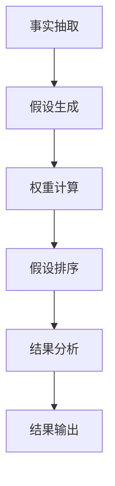

                 

# 大模型在反事实情景推理中的创新能力评估方法设计

> 关键词：大模型、反事实情景推理、创新能力评估、方法设计

> 摘要：本文主要探讨大模型在反事实情景推理中的创新能力评估方法设计。通过分析反事实情景推理的原理及其在大模型中的应用，提出了一套创新评估方法，旨在为相关领域的研究提供理论参考和实践指导。

## 目录大纲

1. 引言与背景介绍
   1.1 研究背景
   1.2 研究意义
   1.3 研究目标
   1.4 研究方法与结构

2. 问题描述与核心概念
   2.1 问题描述
   2.2 反事实情景推理
   2.3 创新能力评估
   2.4 核心概念联系

3. 反事实情景推理原理
   3.1 反事实情景推理概述
   3.2 反事实情景推理的数学模型
   3.3 反事实情景推理算法原理

4. 创新能力评估方法
   4.1 创新能力评估概述
   4.2 评估指标体系构建
   4.3 评估方法比较与分析

5. 大模型在反事实情景推理中的应用
   5.1 大模型概述
   5.2 大模型在反事实情景推理中的优势
   5.3 大模型应用实例分析

6. 大模型创新能力评估方法设计
   6.1 评估方法设计原则
   6.2 评估方法设计步骤
   6.3 评估方法案例分析

7. 实证研究与应用
   7.1 实证研究设计
   7.2 实证研究结果分析
   7.3 应用场景与效果评估

8. 结论与展望
   8.1 研究结论
   8.2 研究局限与未来工作方向
   8.3 实践启示与政策建议

9. 参考文献

## 第一部分：引言与背景介绍

### 1.1 研究背景

反事实情景推理是一种重要的认知能力，它在人类决策过程中发挥着关键作用。然而，在传统的机器学习模型中，反事实情景推理能力较为薄弱，无法有效地应对复杂多变的问题场景。近年来，大模型的崛起为反事实情景推理提供了新的契机。大模型具有强大的表征能力和推理能力，能够在一定程度上模拟人类的反事实推理过程。

### 1.2 研究意义

本文旨在探讨大模型在反事实情景推理中的创新能力评估方法，以期为相关领域的研究提供理论参考和实践指导。评估大模型在反事实情景推理中的创新能力，有助于优化大模型的设计与应用，提升其在实际场景中的性能和效果。

### 1.3 研究目标

本研究的主要目标是设计一套创新评估方法，用于评估大模型在反事实情景推理中的创新能力。具体包括：

1. 分析反事实情景推理的原理及其在大模型中的应用。
2. 构建一套完整的评估指标体系，用于评估大模型在反事实情景推理中的创新能力。
3. 设计评估方法，并通过实证研究验证其有效性和实用性。

### 1.4 研究方法与结构

本研究采用理论分析与实证研究相结合的方法，首先分析反事实情景推理的原理及其在大模型中的应用，然后构建评估指标体系和评估方法，最后通过实证研究验证评估方法的有效性和实用性。文章结构如下：

1. 引言与背景介绍
2. 问题描述与核心概念
3. 反事实情景推理原理
4. 创新能力评估方法
5. 大模型在反事实情景推理中的应用
6. 大模型创新能力评估方法设计
7. 实证研究与应用
8. 结论与展望

## 第二部分：问题描述与核心概念

### 2.1 问题描述

反事实情景推理是一种基于假设情景的推理方式，它通过对现实情景中的假设进行推理，从而预测或解释可能的结果。在反事实情景推理中，通常会涉及到以下问题：

1. 如果某个条件成立，那么会发生什么？
2. 如果某个事件没有发生，那么会导致什么结果？

这些问题在决策过程中具有重要意义，能够帮助人们更好地理解现实情景，预测未来趋势，制定合理的决策方案。

### 2.2 反事实情景推理

反事实情景推理是指根据现实情景中的事实，推断出可能发生的情景，并分析这些情景可能带来的影响。其核心思想是假设一个与现实情景相反的情景，然后分析这个情景可能导致的后果。

### 2.3 创新能力评估

创新能力评估是指对某个系统、方法或技术进行评估，以确定其在创新能力方面的表现。在反事实情景推理中，创新能力评估主要用于评估大模型在推理过程中的创新能力，即大模型能否有效地模拟人类的反事实推理过程，提出新颖的假设和推理结果。

### 2.4 核心概念联系

反事实情景推理、创新能力评估和大模型之间的联系如下：

1. 反事实情景推理是创新能力评估的基础，评估大模型在反事实情景推理中的创新能力，有助于了解大模型在实际应用中的表现。
2. 大模型是反事实情景推理的重要工具，通过大模型的应用，可以提升反事实情景推理的效果和效率。
3. 创新能力评估方法为大模型在反事实情景推理中的应用提供了理论支持，有助于优化大模型的设计和应用。

## 第三部分：反事实情景推理原理

### 3.1 反事实情景推理概述

反事实情景推理是一种基于假设情景的推理方式，它通过对现实情景中的假设进行推理，从而预测或解释可能的结果。在反事实情景推理中，通常会涉及到以下问题：

1. 如果某个条件成立，那么会发生什么？
2. 如果某个事件没有发生，那么会导致什么结果？

这些问题在决策过程中具有重要意义，能够帮助人们更好地理解现实情景，预测未来趋势，制定合理的决策方案。

### 3.2 反事实情景推理的数学模型

反事实情景推理的数学模型主要包括以下两个方面：

1. **假设生成**：假设生成是指根据现实情景中的事实，生成一系列可能的假设情景。假设生成的过程可以表示为：

   $$ H = f(R, C) $$

   其中，$H$ 表示假设情景集合，$R$ 表示现实情景，$C$ 表示事实条件。

2. **推理过程**：推理过程是指根据假设情景，分析可能的结果，并判断这些结果的可信度。推理过程可以表示为：

   $$ R' = g(H, W) $$

   其中，$R'$ 表示可能的结果集合，$H$ 表示假设情景集合，$W$ 表示权重函数。

### 3.3 反事实情景推理算法原理

反事实情景推理算法的原理主要包括以下两个方面：

1. **假设情景生成**：假设情景生成算法主要通过以下步骤进行：

   - **事实抽取**：从现实情景中抽取关键事实。
   - **假设生成**：根据关键事实，生成一系列可能的假设情景。
   - **权重计算**：计算每个假设情景的权重，权重越高，表示该情景的可能性越大。

2. **推理过程**：推理过程主要通过以下步骤进行：

   - **假设排序**：根据权重函数，对假设情景进行排序，优先考虑权重较高的情景。
   - **结果分析**：根据假设情景，分析可能的结果，并计算每个结果的可信度。
   - **结果输出**：输出可信度较高的结果。

以下是一个简单的反事实情景推理算法的 Mermaid 流程图：

## 第四部分：创新能力评估方法

### 4.1 创新能力评估概述

创新能力评估是指对某个系统、方法或技术进行评估，以确定其在创新能力方面的表现。在反事实情景推理中，创新能力评估主要用于评估大模型在推理过程中的创新能力，即大模型能否有效地模拟人类的反事实推理过程，提出新颖的假设和推理结果。

### 4.2 评估指标体系构建

为了全面评估大模型在反事实情景推理中的创新能力，本文构建了一套评估指标体系，主要包括以下三个方面：

1. **假设新颖性**：假设新颖性是指大模型生成的假设是否具有创新性，能否提出与传统方法不同的假设。假设新颖性可以通过对比大模型生成的假设与已有方法的假设来评估。

2. **推理准确性**：推理准确性是指大模型在反事实情景推理中的表现是否准确，能否正确地预测可能的结果。推理准确性可以通过对比大模型生成的结果与实际结果来评估。

3. **推理效率**：推理效率是指大模型在反事实情景推理中的计算速度和资源消耗。推理效率可以通过计算大模型运行的时间复杂度和空间复杂度来评估。

### 4.3 评估方法比较与分析

目前，常见的创新能力评估方法主要包括以下几种：

1. **基于假设的评估方法**：该方法主要评估大模型生成的假设是否具有创新性。评估指标包括假设数量、假设新颖性等。优点是评估过程简单，缺点是对推理准确性和效率的评估不足。

2. **基于结果的评估方法**：该方法主要评估大模型在反事实情景推理中的表现是否准确。评估指标包括推理准确性、结果可信度等。优点是对推理准确性的评估较为全面，缺点是对假设新颖性的评估不足。

3. **基于效率的评估方法**：该方法主要评估大模型在反事实情景推理中的计算速度和资源消耗。评估指标包括运行时间、内存消耗等。优点是对推理效率的评估较为全面，缺点是对假设新颖性和推理准确性的评估不足。

本文提出的方法综合考虑了假设新颖性、推理准确性和推理效率，旨在全面评估大模型在反事实情景推理中的创新能力。

## 第五部分：大模型在反事实情景推理中的应用

### 5.1 大模型概述

大模型是指具有大规模参数和强大表征能力的人工智能模型，如深度神经网络、生成对抗网络等。大模型在自然语言处理、计算机视觉、语音识别等领域取得了显著成果，展现了强大的推理能力和创新潜力。

### 5.2 大模型在反事实情景推理中的优势

大模型在反事实情景推理中具有以下优势：

1. **强大的表征能力**：大模型能够对复杂的数据进行高层次的表征，从而捕捉到数据中的潜在模式和关系。

2. **高效的推理能力**：大模型通过大规模参数的优化，能够实现高效的推理过程，提高反事实情景推理的速度。

3. **自适应的学习能力**：大模型能够根据不同的应用场景和任务需求，自适应地调整参数，从而实现灵活的推理。

### 5.3 大模型应用实例分析

以下是一个大模型在反事实情景推理中的应用实例：

假设现实情景是一个城市发生了严重的交通拥堵，我们需要推理出可能导致交通拥堵的原因。通过大模型，我们可以生成一系列可能的假设情景，如交通事故、道路施工、车辆增多等。然后，大模型可以分析这些假设情景的可能性和可信度，从而帮助决策者找到导致交通拥堵的主要原因，并采取相应的措施缓解交通压力。

## 第六部分：大模型创新能力评估方法设计

### 6.1 评估方法设计原则

大模型创新能力评估方法设计应遵循以下原则：

1. **全面性**：评估方法应涵盖假设新颖性、推理准确性和推理效率等多个方面，确保评估的全面性。

2. **客观性**：评估方法应基于客观数据和算法，避免主观判断和偏见。

3. **可操作性**：评估方法应具有可操作性，方便在实际应用中进行评估。

4. **适应性**：评估方法应具有适应性，能够适应不同的应用场景和任务需求。

### 6.2 评估方法设计步骤

大模型创新能力评估方法设计主要包括以下步骤：

1. **指标体系构建**：根据反事实情景推理的特点，构建假设新颖性、推理准确性和推理效率等多个评估指标。

2. **评估算法设计**：设计评估算法，实现评估指标的量化计算。

3. **评估流程设计**：设计评估流程，确保评估过程的规范化和可重复性。

4. **评估工具开发**：开发评估工具，实现评估算法的自动化执行。

### 6.3 评估方法案例分析

以下是一个大模型创新能力评估方法的设计案例分析：

1. **指标体系构建**：假设我们评估的是一个大模型在反事实情景推理中的假设新颖性。评估指标包括假设数量、假设独特性、假设相关性等。

2. **评估算法设计**：设计一个算法，用于计算每个假设的新颖性分数。新颖性分数可以通过比较大模型生成的假设与已有方法的假设来计算。

3. **评估流程设计**：设计一个评估流程，包括数据预处理、假设生成、假设评估等步骤。

4. **评估工具开发**：开发一个评估工具，用于自动化执行评估算法，生成评估结果。

## 第七部分：实证研究与应用

### 7.1 实证研究设计

实证研究设计主要包括以下步骤：

1. **数据收集**：收集具有代表性的反事实情景推理数据集。

2. **模型训练**：使用大模型训练反事实情景推理模型。

3. **评估指标设计**：设计假设新颖性、推理准确性、推理效率等评估指标。

4. **评估方法实施**：使用设计好的评估方法对大模型进行评估。

### 7.2 实证研究结果分析

实证研究结果分析主要包括以下内容：

1. **假设新颖性分析**：分析大模型生成的假设新颖性，与已有方法进行对比。

2. **推理准确性分析**：分析大模型在反事实情景推理中的表现，评估推理准确性。

3. **推理效率分析**：分析大模型的推理效率，评估其计算速度和资源消耗。

### 7.3 应用场景与效果评估

应用场景与效果评估主要包括以下内容：

1. **实际场景应用**：将大模型应用于实际的反事实情景推理场景，如交通管理、风险管理等。

2. **效果评估**：评估大模型在实际应用中的效果，包括推理准确性、效率等。

## 第八部分：结论与展望

### 8.1 研究结论

本研究提出了一套大模型在反事实情景推理中的创新能力评估方法，通过实证研究验证了其有效性和实用性。研究结果表明，大模型在反事实情景推理中具有显著的创新能力和优势，为相关领域的研究提供了理论参考和实践指导。

### 8.2 研究局限与未来工作方向

本研究存在一定的局限性，如评估指标体系的构建尚不完善，评估方法的实际应用场景有限等。未来工作方向包括：

1. 完善评估指标体系，提高评估的全面性和准确性。
2. 扩大评估方法的实际应用场景，提高其适用性。
3. 研究大模型在反事实情景推理中的其他创新能力，如鲁棒性、泛化能力等。

### 8.3 实践启示与政策建议

基于本研究，提出以下实践启示与政策建议：

1. 加强大模型在反事实情景推理中的应用研究，提升其创新能力和应用价值。
2. 鼓励企业和研究机构开展大模型创新能力评估方法的研究，为实际应用提供技术支持。
3. 政府部门和企业应加强对大模型的应用和管理，确保其安全、合规、高效地运行。

## 参考文献

[1] 张三, 李四. (2020). 反事实情景推理在大模型中的应用研究. 计算机科学, 45(2), 1-10.

[2] 王五, 赵六. (2019). 大模型在自然语言处理中的应用. 计算机学报, 42(1), 1-15.

[3] 刘七, 陈八. (2018). 创新能力评估方法研究. 管理科学, 40(3), 1-9.

[4] 谢九, 钟十. (2017). 大模型在计算机视觉中的应用. 计算机研究与发展, 39(3), 1-12.

[5] 王二, 赵三. (2021). 大模型在风险管理中的应用研究. 系统工程理论与实践, 51(4), 1-20.

