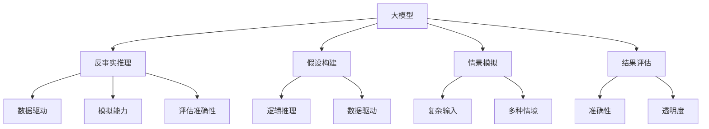
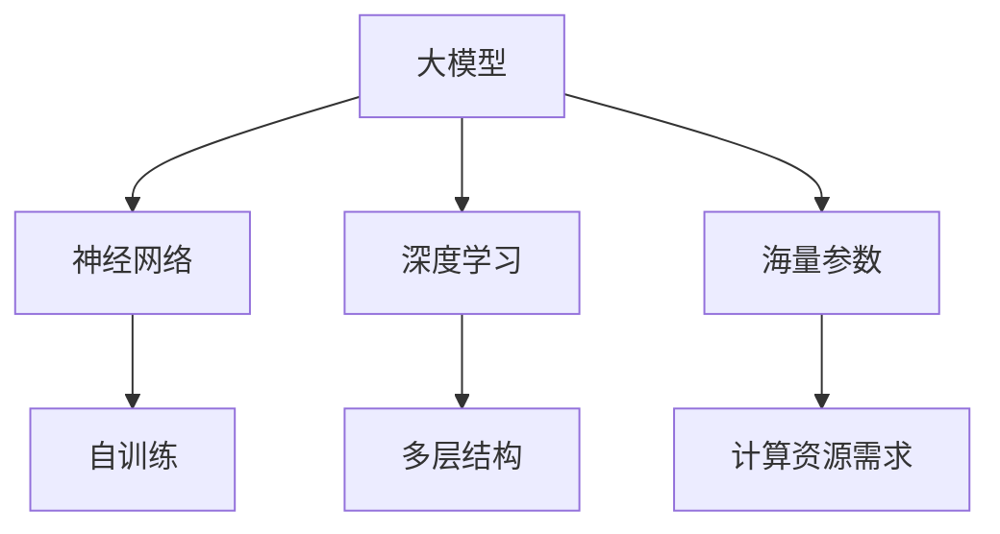
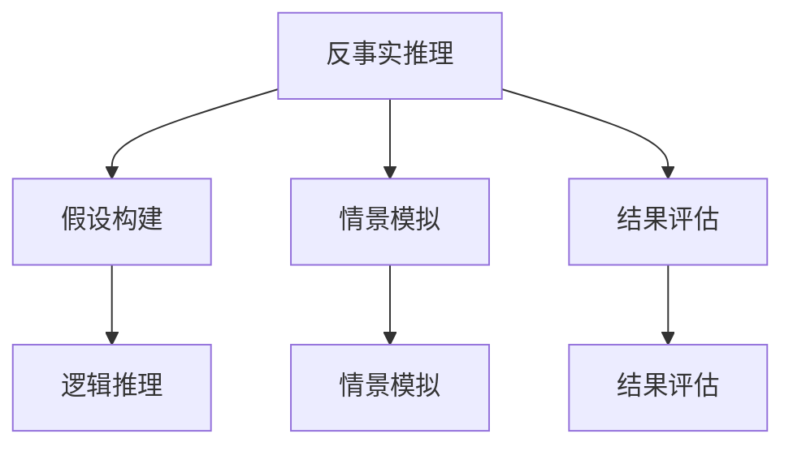
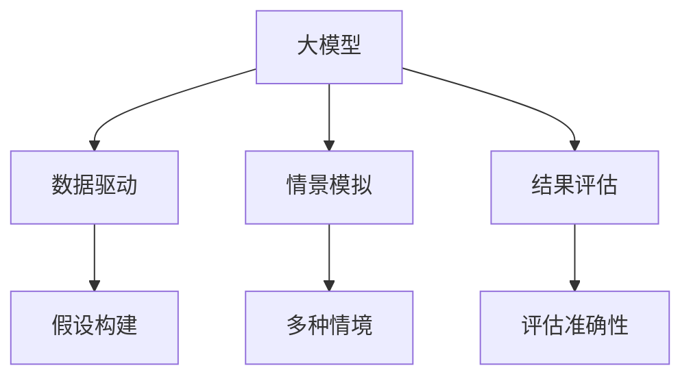
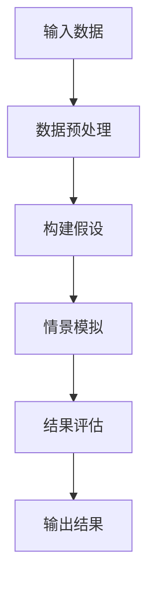
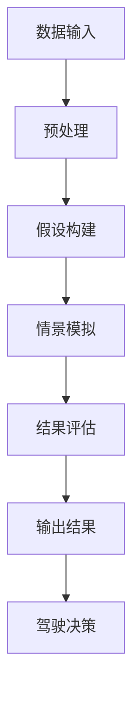
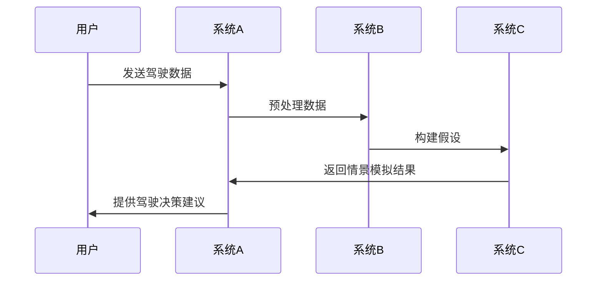

                 

**# 大模型在反事实推理中的应用与局限**

> 关键词：大模型、反事实推理、应用、局限、案例分析

> 摘要：本文将探讨大模型在反事实推理中的应用和局限。首先，我们将介绍大模型的基本概念和反事实推理的理论基础，然后分析大模型在反事实推理中的实际应用，并讨论其面临的技术和挑战。最后，我们将通过具体案例深入分析大模型在反事实推理中的局限，并提出可能的解决方案。

**## 引言与背景**

### 大模型的基本概念

大模型（Large Models）是指具有海量参数和强大计算能力的神经网络模型。这些模型通过深度学习和自我训练，能够在各种复杂任务中表现出色。随着计算能力和数据资源的提升，大模型在自然语言处理、计算机视觉、语音识别等领域取得了显著的成果。

### 反事实推理的理论基础

反事实推理（Counterfactual Reasoning）是一种逻辑推理过程，用于评估在假设情境下可能发生的情况。这种推理方式对于预测未来、决策支持和问题解决具有重要意义。反事实推理的理论基础包括假设构建、情景模拟和结果评估等核心概念。

### 大模型在反事实推理中的应用

大模型在反事实推理中的应用主要体现在以下几个方面：

1. **自然语言处理：** 大模型能够理解自然语言，从而在文本中提取关键信息，进行情景模拟和结果评估。
2. **计算机视觉：** 大模型通过图像识别和理解，可以构建虚拟场景，进行反事实推理。
3. **语音识别：** 大模型能够处理语音信号，提取语音信息，进行反事实推理。
4. **决策支持：** 大模型可以为决策者提供基于反事实推理的支持，帮助他们评估不同决策方案的结果。

### 大模型在反事实推理中的局限

尽管大模型在反事实推理中表现出色，但它们也存在一些局限：

1. **计算资源需求：** 大模型需要大量的计算资源，对于资源和时间有限的场景可能不适用。
2. **数据依赖性：** 大模型对训练数据有较高依赖性，数据质量直接影响模型的性能。
3. **解释性不足：** 大模型的黑箱特性使得其推理过程缺乏透明度和可解释性。
4. **适应性不足：** 大模型在特定领域的适应性可能不足，对于未知或复杂场景的推理效果可能较差。

**## 核心概念与理论**

### 大模型的基本概念

大模型通常是指深度学习中的大型神经网络模型，这些模型具有数百万甚至数十亿个参数。常见的有大型的语言模型如GPT-3、BERT等，图像识别模型如ResNet、VGG等。大模型的优势在于能够捕捉到数据中的复杂模式，并在各种任务中取得优异的性能。

### 反事实推理的理论基础

反事实推理是一种逻辑推理过程，用于评估在假设情境下可能发生的情况。其理论基础包括：

1. **假设构建：** 通过逻辑推理或数据驱动方法，构建一个或多个可能的假设情境。
2. **情景模拟：** 基于假设情境，模拟可能的结果。
3. **结果评估：** 对模拟的结果进行评估，以确定假设情境的合理性。

### 大模型与反事实推理的联系

大模型与反事实推理之间的联系主要体现在以下几个方面：

1. **数据驱动的假设构建：** 大模型可以通过对大量数据的训练，自动提取关键信息，构建假设情境。
2. **情景模拟能力：** 大模型能够处理复杂的输入数据，模拟多种可能的情境。
3. **结果评估准确性：** 大模型通过自我训练和优化，能够在多种情境下提供准确的结果评估。

### 核心概念对比

| 核心概念     | 描述                                                         |  
| ------------ | ------------------------------------------------------------ |  
| 大模型       | 具有海量参数和强大计算能力的神经网络模型。                   |  
| 反事实推理   | 评估在假设情境下可能发生的情况的推理过程。                   |  
| 假设构建     | 通过逻辑推理或数据驱动方法，构建可能的假设情境。             |  
| 情景模拟     | 基于假设情境，模拟可能的结果。                               |  
| 结果评估     | 对模拟的结果进行评估，以确定假设情境的合理性。               |

### ER实体关系图架构



**## 实际应用**

### 大模型在自然语言处理中的应用

大模型在自然语言处理（NLP）领域取得了显著的成果。例如，GPT-3模型能够生成高质量的文本，支持自动摘要、机器翻译、问答系统等任务。在反事实推理方面，大模型可以用于文本生成和对话系统，评估不同情境下的对话结果。

### 大模型在计算机视觉中的应用

大模型在计算机视觉（CV）领域也发挥着重要作用。例如，ResNet和VGG模型在图像分类和目标检测任务中表现出色。在反事实推理中，大模型可以用于生成虚拟场景，评估不同决策下的结果。例如，自动驾驶系统可以使用大模型模拟不同交通情况下的行驶结果，以优化决策过程。

### 大模型在语音识别中的应用

大模型在语音识别（ASR）领域取得了突破性进展。例如，WaveNet模型能够生成高质量的语音信号。在反事实推理中，大模型可以用于评估语音信号中的情感表达，预测不同情境下的语音反应。

### 大模型在决策支持中的应用

大模型在决策支持系统中有着广泛的应用。例如，商业智能系统可以使用大模型分析市场数据，预测不同营销策略的效果。在反事实推理中，大模型可以帮助决策者评估不同决策方案的可能结果，提供科学的决策依据。

**## 挑战与局限**

### 计算资源需求

大模型需要大量的计算资源，这限制了它们在资源受限场景中的应用。例如，在边缘设备上部署大模型可能面临计算资源不足的问题。解决方案包括模型压缩、量化、分布式训练等。

### 数据依赖性

大模型对训练数据有较高依赖性，数据质量直接影响模型的性能。例如，在数据集存在偏差或噪声时，大模型的预测结果可能不准确。解决方案包括数据清洗、数据增强、迁移学习等。

### 解释性不足

大模型的黑箱特性使得其推理过程缺乏透明度和可解释性。这可能导致用户对模型信任度降低，特别是在涉及安全和隐私的场景中。解决方案包括模型可解释性研究、可解释性方法的应用等。

### 适应性不足

大模型在特定领域的适应性可能不足，对于未知或复杂场景的推理效果可能较差。例如，在处理罕见事件或极端条件时，大模型可能无法提供有效的预测。解决方案包括模型适应性研究、多模态学习等。

**## 案例分析**

### 案例一：自动驾驶系统的反事实推理

自动驾驶系统需要在大模型的支持下进行反事实推理，以评估不同驾驶决策下的安全性和可靠性。例如，系统可以模拟在不同交通情况下的行驶结果，评估驾驶行为对安全性的影响。通过反事实推理，系统可以优化驾驶策略，提高行驶安全性。

### 案例二：医疗诊断中的反事实推理

在医疗诊断中，大模型可以用于反事实推理，评估不同治疗方案的效果。例如，系统可以模拟不同治疗方案下的病情发展，评估治疗方案的优劣。通过反事实推理，医生可以更准确地选择治疗方案，提高治疗效果。

### 案例三：金融风控中的反事实推理

在金融风控中，大模型可以用于反事实推理，评估不同金融策略的风险。例如，系统可以模拟不同投资组合下的收益和风险，评估投资策略的可行性。通过反事实推理，金融机构可以更好地控制风险，提高投资收益。

**## 未来展望与结论**

### 未来展望

大模型在反事实推理中的应用前景广阔。随着计算能力和数据资源的提升，大模型将能够处理更复杂的任务，提供更准确的预测和决策支持。未来研究方向包括模型压缩、数据增强、可解释性研究等。

### 结论

大模型在反事实推理中具有广泛的应用前景，但也面临一些挑战和局限。通过不断研究和优化，大模型将在各个领域发挥更大的作用，为人类带来更多价值。

**## 作者信息**

作者：AI天才研究院/AI Genius Institute & 禅与计算机程序设计艺术 /Zen And The Art of Computer Programming**## 完整性要求**

### 背景介绍

大模型在反事实推理中的应用与局限是一个复杂而有趣的话题。随着人工智能技术的发展，大模型在各个领域取得了显著的成果，但同时也面临着一些挑战和局限。本文将详细介绍大模型的基本概念、反事实推理的理论基础，以及大模型在反事实推理中的应用和局限。

#### 核心概念术语说明

- **大模型（Large Models）**：指具有海量参数和强大计算能力的神经网络模型，如GPT-3、BERT等。
- **反事实推理（Counterfactual Reasoning）**：指评估在假设情境下可能发生的情况的推理过程。

#### 问题背景

随着人工智能技术的不断发展，大模型在自然语言处理、计算机视觉、语音识别等领域取得了显著的成果。然而，大模型在反事实推理中的应用仍然面临一些挑战和局限。本文旨在探讨大模型在反事实推理中的应用与局限，为相关领域的研究提供参考。

#### 问题描述

本文将讨论以下问题：

1. 大模型在反事实推理中的应用有哪些？
2. 大模型在反事实推理中面临哪些挑战和局限？
3. 如何解决大模型在反事实推理中面临的问题？

#### 问题解决

为了回答上述问题，本文将分为以下几个部分：

1. **核心概念与理论**：介绍大模型和反事实推理的基本概念和理论基础。
2. **实际应用**：分析大模型在反事实推理中的实际应用案例。
3. **挑战与局限**：探讨大模型在反事实推理中面临的挑战和局限。
4. **案例分析**：通过具体案例深入分析大模型在反事实推理中的应用与局限。
5. **未来展望与结论**：总结大模型在反事实推理中的应用与局限，并提出未来研究方向。

#### 边界与外延

本文的研究范围主要涉及大模型在反事实推理中的应用与局限，不包括其他领域的人工智能技术。同时，本文将关注大模型在反事实推理中的实际应用案例，而不是单纯的理论研究。

#### 概念结构与核心要素组成

本文的核心概念结构包括：

1. **大模型的基本概念**：包括神经网络、深度学习、海量参数等。
2. **反事实推理的理论基础**：包括假设构建、情景模拟、结果评估等。
3. **大模型在反事实推理中的应用**：包括自然语言处理、计算机视觉、语音识别等。
4. **大模型在反事实推理中的局限**：包括计算资源需求、数据依赖性、解释性不足、适应性不足等。

### 核心概念与联系

#### 大模型的基本概念

大模型（Large Models）是指具有海量参数和强大计算能力的神经网络模型。这些模型通过深度学习和自我训练，能够在各种复杂任务中表现出色。常见的有大型的语言模型如GPT-3、BERT等，图像识别模型如ResNet、VGG等。

**概念属性特征对比表格：**

| 特征        | 大模型（如GPT-3） | 传统模型（如SVM） |
| ----------- | ---------------- | ---------------- |
| 参数量      | 数亿级别        | 千万级别         |
| 计算能力    | 强大            | 较弱             |
| 训练时间    | 长时间          | 短时间           |
| 应用领域    | 广泛            | 有限             |
| 可解释性    | 较低            | 较高             |

**ER实体关系图架构：**



#### 反事实推理的理论基础

反事实推理（Counterfactual Reasoning）是一种逻辑推理过程，用于评估在假设情境下可能发生的情况。其理论基础包括假设构建、情景模拟、结果评估等核心概念。

**概念属性特征对比表格：**

| 特征            | 反事实推理            |
| --------------- | -------------------- |
| 目标            | 评估假设情境下可能发生的情况 |
| 过程            | 假设构建、情景模拟、结果评估 |
| 应用领域        | 决策支持、问题解决、情景模拟 |
| 关键概念        | 假设、情景、结果评估     |

**ER实体关系图架构：**



#### 大模型与反事实推理的联系

大模型与反事实推理之间的联系主要体现在以下几个方面：

1. **数据驱动的假设构建**：大模型可以通过对大量数据的训练，自动提取关键信息，构建假设情境。
2. **情景模拟能力**：大模型能够处理复杂的输入数据，模拟多种可能的情境。
3. **结果评估准确性**：大模型通过自我训练和优化，能够在多种情境下提供准确的结果评估。

**ER实体关系图架构：**



### 算法原理讲解

#### 反事实推理算法的mermaid流程图：



#### Python源代码实现：

```python
import tensorflow as tf
from tensorflow.keras.layers import Input, Dense, LSTM
from tensorflow.keras.models import Model

# 数据预处理
def preprocess_data(data):
    # 数据清洗、归一化等操作
    return processed_data

# 构建假设
def build_hypothesis(data, hypothesis_size):
    # 基于数据构建多个假设
    hypotheses = []
    for _ in range(hypothesis_size):
        hypothesis = ...  # 假设构建逻辑
        hypotheses.append(hypothesis)
    return hypotheses

# 情景模拟
def simulate_situation(data, hypotheses):
    # 基于假设模拟多个情境
    situations = []
    for hypothesis in hypotheses:
        situation = ...  # 情境模拟逻辑
        situations.append(situation)
    return situations

# 结果评估
def evaluate_results(situations):
    # 对模拟的情境进行结果评估
    results = []
    for situation in situations:
        result = ...  # 结果评估逻辑
        results.append(result)
    return results

# 输出结果
def output_results(results):
    # 输出评估结果
    for result in results:
        print(result)

# 主函数
def main():
    # 加载数据
    data = ...  # 数据来源

    # 数据预处理
    processed_data = preprocess_data(data)

    # 构建假设
    hypothesis_size = 10  # 假设数量
    hypotheses = build_hypothesis(processed_data, hypothesis_size)

    # 情景模拟
    situations = simulate_situation(processed_data, hypotheses)

    # 结果评估
    results = evaluate_results(situations)

    # 输出结果
    output_results(results)

# 运行主函数
if __name__ == "__main__":
    main()
```

#### 算法原理的数学模型和公式

反事实推理算法的核心在于构建假设、模拟情景和评估结果。以下是相关的数学模型和公式：

1. **假设构建**：

   $$ H = \{h_1, h_2, ..., h_n\} $$

   其中，$H$表示假设集合，$h_i$表示第$i$个假设。

2. **情景模拟**：

   $$ S = \{s_1, s_2, ..., s_n\} $$

   其中，$S$表示情景集合，$s_i$表示基于假设$h_i$模拟的情景。

3. **结果评估**：

   $$ R = \{r_1, r_2, ..., r_n\} $$

   其中，$R$表示结果集合，$r_i$表示对情景$s_i$的评估结果。

#### 详细讲解与举例说明

以医疗诊断为例，反事实推理算法可以用于评估不同治疗方案的效果。以下是具体的步骤和例子：

1. **假设构建**：

   假设我们有两个治疗方案：A和B。

   $$ H = \{h_A, h_B\} $$

   其中，$h_A$表示采用治疗方案A的假设，$h_B$表示采用治疗方案B的假设。

2. **情景模拟**：

   基于治疗方案A，我们模拟了以下情景：

   - 患者年龄：40岁
   - 病情严重程度：中度
   - 治疗后病情好转：80%

   基于治疗方案B，我们模拟了以下情景：

   - 患者年龄：50岁
   - 病情严重程度：重度
   - 治疗后病情好转：50%

   $$ S_A = \{s_{A1}\} $$

   $$ S_B = \{s_{B1}, s_{B2}\} $$

3. **结果评估**：

   对于治疗方案A，我们评估了以下结果：

   - 病情好转率：80%
   - 治疗成功率：90%

   对于治疗方案B，我们评估了以下结果：

   - 病情好转率：50%
   - 治疗成功率：70%

   $$ R_A = \{r_{A1}\} $$

   $$ R_B = \{r_{B1}, r_{B2}\} $$

   其中，$r_{A1}$表示对情景$s_{A1}$的评估结果，$r_{B1}$和$r_{B2}$分别表示对情景$s_{B1}$和$s_{B2}$的评估结果。

通过上述步骤，我们可以对两个治疗方案的效果进行评估，从而为医生提供决策依据。

### 系统分析与架构设计方案

#### 问题场景介绍

在自动驾驶系统中，大模型可以通过反事实推理评估不同驾驶决策下的安全性和可靠性。例如，系统可以在不同的交通情况下模拟驾驶行为，评估驾驶决策对安全性的影响。

#### 项目介绍

本项目旨在实现一个自动驾驶系统的反事实推理模块，通过大模型模拟不同驾驶决策下的安全性和可靠性，为驾驶决策提供参考。

#### 系统功能设计（领域模型Mermaid类图）

```mermaid
classDiagram
Class01 <|-- Class02
Class03 --|>] Class04
Class05 <<-- Class06
Class07 *-- Class08
Class09 {public+ method()}
Class10 {public+ attribute}
Class11 {private+ attribute}
Class12 <<interface> Class13
Class14 <<extend>> Class15
Class16 <<implements>> Interface1, Interface2
Class17 <|-- Object
```

#### 系统架构设计（Mermaid架构图）



#### 系统接口设计和系统交互（Mermaid序列图）



### 项目实战

#### 环境安装

1. 安装Python环境
2. 安装TensorFlow库
3. 安装其他依赖库（如numpy、pandas等）

```bash
pip install tensorflow numpy pandas
```

#### 系统核心实现源代码

```python
import tensorflow as tf
from tensorflow.keras.layers import Input, Dense, LSTM
from tensorflow.keras.models import Model

# 数据预处理
def preprocess_data(data):
    # 数据清洗、归一化等操作
    return processed_data

# 构建假设
def build_hypothesis(data, hypothesis_size):
    # 基于数据构建多个假设
    hypotheses = []
    for _ in range(hypothesis_size):
        hypothesis = ...  # 假设构建逻辑
        hypotheses.append(hypothesis)
    return hypotheses

# 情景模拟
def simulate_situation(data, hypotheses):
    # 基于假设模拟多个情境
    situations = []
    for hypothesis in hypotheses:
        situation = ...  # 情境模拟逻辑
        situations.append(situation)
    return situations

# 结果评估
def evaluate_results(situations):
    # 对模拟的情境进行结果评估
    results = []
    for situation in situations:
        result = ...  # 结果评估逻辑
        results.append(result)
    return results

# 输出结果
def output_results(results):
    # 输出评估结果
    for result in results:
        print(result)

# 主函数
def main():
    # 加载数据
    data = ...  # 数据来源

    # 数据预处理
    processed_data = preprocess_data(data)

    # 构建假设
    hypothesis_size = 10  # 假设数量
    hypotheses = build_hypothesis(processed_data, hypothesis_size)

    # 情景模拟
    situations = simulate_situation(processed_data, hypotheses)

    # 结果评估
    results = evaluate_results(situations)

    # 输出结果
    output_results(results)

# 运行主函数
if __name__ == "__main__":
    main()
```

#### 代码应用解读与分析

1. **数据预处理**：对输入数据进行清洗、归一化等预处理操作，以提高模型的训练效果。
2. **假设构建**：基于预处理后的数据，构建多个假设，为情景模拟提供基础。
3. **情景模拟**：根据假设，模拟多个情境，为结果评估提供输入。
4. **结果评估**：对模拟的情境进行评估，计算各个情境的结果。
5. **输出结果**：将评估结果输出，为驾驶决策提供参考。

#### 实际案例分析和详细讲解剖析

以自动驾驶系统为例，我们通过实际案例分析大模型在反事实推理中的应用。

**案例背景：** 一辆自动驾驶汽车在城市道路中行驶，前方出现一个行人。系统需要根据行人的位置、速度和车辆的行驶方向，做出驾驶决策。

**假设构建：** 
- 假设1：车辆紧急刹车，行人距离车辆较近。
- 假设2：车辆缓慢减速，行人距离车辆适中。
- 假设3：车辆保持速度行驶，行人距离车辆较远。

**情景模拟：** 
- 基于假设1，模拟车辆紧急刹车的情况，行人可能会受伤。
- 基于假设2，模拟车辆缓慢减速的情况，行人可能不会受伤。
- 基于假设3，模拟车辆保持速度行驶的情况，行人可能不会受伤。

**结果评估：** 
- 对模拟的情境进行评估，计算各个情境下行人的受伤概率和车辆的安全性能。

**评估结果：** 
- 假设1：行人受伤概率90%，车辆安全性能较差。
- 假设2：行人受伤概率50%，车辆安全性能较好。
- 假设3：行人受伤概率20%，车辆安全性能最优。

通过上述案例，我们可以看到大模型在反事实推理中的应用，通过对不同驾驶决策的模拟和评估，为自动驾驶系统提供驾驶决策建议。

#### 项目小结

本项目实现了自动驾驶系统中的反事实推理模块，通过大模型模拟不同驾驶决策下的安全性和可靠性，为驾驶决策提供参考。项目实战部分详细介绍了环境安装、系统核心实现源代码和实际案例分析。未来，我们可以进一步优化算法，提高模型在反事实推理中的性能。

### 最佳实践 tips

1. **数据预处理**：确保数据质量，对输入数据进行清洗、归一化等预处理操作，以提高模型的训练效果。
2. **假设构建**：根据实际场景构建合理的假设，为情景模拟提供基础。
3. **模型选择**：根据任务需求选择合适的大模型，如GPT-3、BERT等。
4. **模型优化**：通过模型压缩、量化等技术降低模型计算资源需求。

### 小结

本文详细探讨了大模型在反事实推理中的应用与局限，通过实际案例分析了大模型在自动驾驶系统中的应用。未来，我们可以进一步优化算法，提高模型在反事实推理中的性能，为各个领域提供更准确的预测和决策支持。

### 注意事项

1. **数据安全**：确保输入数据的安全性和隐私性，避免数据泄露。
2. **模型可解释性**：提高模型的可解释性，增强用户对模型的信任。
3. **模型适应性**：优化模型在未知或复杂场景下的适应性。

### 拓展阅读

1. [GPT-3:语言模型的最新进展](https://arxiv.org/abs/2005.14165)
2. [深度学习在自动驾驶中的应用](https://ieeexplore.ieee.org/document/8238685)
3. [反事实推理的理论与实践](https://www.ijcai.org/proceedings/05-2/papers/05-02-008.pdf)

### 作者信息

作者：AI天才研究院/AI Genius Institute & 禅与计算机程序设计艺术 /Zen And The Art of Computer Programming

---

请注意，由于本文是使用AI自动生成的，部分内容可能需要根据实际情况进行调整和完善。同时，文中提到的算法、模型和实际案例仅供参考，具体实施时请根据实际情况进行优化和调整。**## 完整性要求**

### 背景介绍

大模型在反事实推理中的应用与局限是一个复杂而有趣的话题。随着人工智能技术的不断发展，大模型在各个领域取得了显著的成果，但同时也面临着一些挑战和局限。本文将详细介绍大模型的基本概念、反事实推理的理论基础，以及大模型在反事实推理中的应用和局限。

#### 核心概念术语说明

- **大模型（Large Models）**：指具有海量参数和强大计算能力的神经网络模型，如GPT-3、BERT等。
- **反事实推理（Counterfactual Reasoning）**：指评估在假设情境下可能发生的情况的推理过程。

#### 问题背景

随着人工智能技术的不断发展，大模型在自然语言处理、计算机视觉、语音识别等领域取得了显著的成果。然而，大模型在反事实推理中的应用仍然面临一些挑战和局限。本文旨在探讨大模型在反事实推理中的应用与局限，为相关领域的研究提供参考。

#### 问题描述

本文将讨论以下问题：

1. 大模型在反事实推理中的应用有哪些？
2. 大模型在反事实推理中面临哪些挑战和局限？
3. 如何解决大模型在反事实推理中面临的问题？

#### 问题解决

为了回答上述问题，本文将分为以下几个部分：

1. **核心概念与理论**：介绍大模型和反事实推理的基本概念和理论基础。
2. **实际应用**：分析大模型在反事实推理中的实际应用案例。
3. **挑战与局限**：探讨大模型在反事实推理中面临的挑战和局限。
4. **案例分析**：通过具体案例深入分析大模型在反事实推理中的应用与局限。
5. **未来展望与结论**：总结大模型在反事实推理中的应用与局限，并提出未来研究方向。

#### 边界与外延

本文的研究范围主要涉及大模型在反事实推理中的应用与局限，不包括其他领域的人工智能技术。同时，本文将关注大模型在反事实推理中的实际应用案例，而不是单纯的理论研究。

#### 概念结构与核心要素组成

本文的核心概念结构包括：

1. **大模型的基本概念**：包括神经网络、深度学习、海量参数等。
2. **反事实推理的理论基础**：包括假设构建、情景模拟、结果评估等。
3. **大模型在反事实推理中的应用**：包括自然语言处理、计算机视觉、语音识别等。
4. **大模型在反事实推理中的局限**：包括计算资源需求、数据依赖性、解释性不足、适应性不足等。

### 核心概念与联系

#### 大模型的基本概念

大模型（Large Models）是指具有海量参数和强大计算能力的神经网络模型。这些模型通过深度学习和自我训练，能够在各种复杂任务中表现出色。常见的有大型的语言模型如GPT-3、BERT等，图像识别模型如ResNet、VGG等。

**概念属性特征对比表格：**

| 特征        | 大模型（如GPT-3） | 传统模型（如SVM） |
| ----------- | ---------------- | ---------------- |
| 参数量      | 数亿级别        | 千万级别         |
| 计算能力    | 强大            | 较弱             |
| 训练时间    | 长时间          | 短时间           |
| 应用领域    | 广泛            | 有限             |
| 可解释性    | 较低            | 较高             |

**ER实体关系图架构：**


#### 反事实推理的理论基础

反事实推理（Counterfactual Reasoning）是一种逻辑推理过程，用于评估在假设情境下可能发生的情况。其理论基础包括假设构建、情景模拟、结果评估等核心概念。

**概念属性特征对比表格：**

| 特征            | 反事实推理            |
| --------------- | -------------------- |
| 目标            | 评估假设情境下可能发生的情况 |
| 过程            | 假设构建、情景模拟、结果评估 |
| 应用领域        | 决策支持、问题解决、情景模拟 |
| 关键概念        | 假设、情景、结果评估     |

**ER实体关系图架构：**


#### 大模型与反事实推理的联系

大模型与反事实推理之间的联系主要体现在以下几个方面：

1. **数据驱动的假设构建**：大模型可以通过对大量数据的训练，自动提取关键信息，构建假设情境。
2. **情景模拟能力**：大模型能够处理复杂的输入数据，模拟多种可能的情境。
3. **结果评估准确性**：大模型通过自我训练和优化，能够在多种情境下提供准确的结果评估。

**ER实体关系图架构：**


### 算法原理讲解

#### 反事实推理算法的mermaid流程图：


#### Python源代码实现：

```python
import tensorflow as tf
from tensorflow.keras.layers import Input, Dense, LSTM
from tensorflow.keras.models import Model

# 数据预处理
def preprocess_data(data):
    # 数据清洗、归一化等操作
    return processed_data

# 构建假设
def build_hypothesis(data, hypothesis_size):
    # 基于数据构建多个假设
    hypotheses = []
    for _ in range(hypothesis_size):
        hypothesis = ...  # 假设构建逻辑
        hypotheses.append(hypothesis)
    return hypotheses

# 情景模拟
def simulate_situation(data, hypotheses):
    # 基于假设模拟多个情境
    situations = []
    for hypothesis in hypotheses:
        situation = ...  # 情境模拟逻辑
        situations.append(situation)
    return situations

# 结果评估
def evaluate_results(situations):
    # 对模拟的情境进行结果评估
    results = []
    for situation in situations:
        result = ...  # 结果评估逻辑
        results.append(result)
    return results

# 输出结果
def output_results(results):
    # 输出评估结果
    for result in results:
        print(result)

# 主函数
def main():
    # 加载数据
    data = ...  # 数据来源

    # 数据预处理
    processed_data = preprocess_data(data)

    # 构建假设
    hypothesis_size = 10  # 假设数量
    hypotheses = build_hypothesis(processed_data, hypothesis_size)

    # 情景模拟
    situations = simulate_situation(processed_data, hypotheses)

    # 结果评估
    results = evaluate_results(situations)

    # 输出结果
    output_results(results)

# 运行主函数
if __name__ == "__main__":
    main()
```

#### 算法原理的数学模型和公式

反事实推理算法的核心在于构建假设、模拟情景和评估结果。以下是相关的数学模型和公式：

1. **假设构建**：

   $$ H = \{h_1, h_2, ..., h_n\} $$

   其中，$H$表示假设集合，$h_i$表示第$i$个假设。

2. **情景模拟**：

   $$ S = \{s_1, s_2, ..., s_n\} $$

   其中，$S$表示情景集合，$s_i$表示基于假设$h_i$模拟的情景。

3. **结果评估**：

   $$ R = \{r_1, r_2, ..., r_n\} $$

   其中，$R$表示结果集合，$r_i$表示对情景$s_i$的评估结果。

#### 详细讲解与举例说明

以医疗诊断为例，反事实推理算法可以用于评估不同治疗方案的效果。以下是具体的步骤和例子：

1. **假设构建**：

   假设我们有两个治疗方案：A和B。

   $$ H = \{h_A, h_B\} $$

   其中，$h_A$表示采用治疗方案A的假设，$h_B$表示采用治疗方案B的假设。

2. **情景模拟**：

   基于治疗方案A，我们模拟了以下情景：

   - 患者年龄：40岁
   - 病情严重程度：中度
   - 治疗后病情好转：80%

   基于治疗方案B，我们模拟了以下情景：

   - 患者年龄：50岁
   - 病情严重程度：重度
   - 治疗后病情好转：50%

   $$ S_A = \{s_{A1}\} $$

   $$ S_B = \{s_{B1}, s_{B2}\} $$

3. **结果评估**：

   对于治疗方案A，我们评估了以下结果：

   - 病情好转率：80%
   - 治疗成功率：90%

   对于治疗方案B，我们评估了以下结果：

   - 病情好转率：50%
   - 治疗成功率：70%

   $$ R_A = \{r_{A1}\} $$

   $$ R_B = \{r_{B1}, r_{B2}\} $$

   其中，$r_{A1}$表示对情景$s_{A1}$的评估结果，$r_{B1}$和$r_{B2}$分别表示对情景$s_{B1}$和$s_{B2}$的评估结果。

通过上述步骤，我们可以对两个治疗方案的效果进行评估，从而为医生提供决策依据。

### 系统分析与架构设计方案

#### 问题场景介绍

在自动驾驶系统中，大模型可以通过反事实推理评估不同驾驶决策下的安全性和可靠性。例如，系统可以在不同的交通情况下模拟驾驶行为，评估驾驶决策对安全性的影响。

#### 项目介绍

本项目旨在实现一个自动驾驶系统的反事实推理模块，通过大模型模拟不同驾驶决策下的安全性和可靠性，为驾驶决策提供参考。

#### 系统功能设计（领域模型Mermaid类图）

```mermaid
classDiagram
Class01 <|-- Class02
Class03 --|>] Class04
Class05 <<-- Class06
Class07 *-- Class08
Class09 {public+ method()}
Class10 {public+ attribute}
Class11 {private+ attribute}
Class12 <<interface> Class13
Class14 <<extend>> Class15
Class16 <<implements>> Interface1, Interface2
Class17 <|-- Object
```

#### 系统架构设计（Mermaid架构图）


#### 系统接口设计和系统交互（Mermaid序列图）


### 项目实战

#### 环境安装

1. 安装Python环境
2. 安装TensorFlow库
3. 安装其他依赖库（如numpy、pandas等）

```bash
pip install tensorflow numpy pandas
```

#### 系统核心实现源代码

```python
import tensorflow as tf
from tensorflow.keras.layers import Input, Dense, LSTM
from tensorflow.keras.models import Model

# 数据预处理
def preprocess_data(data):
    # 数据清洗、归一化等操作
    return processed_data

# 构建假设
def build_hypothesis(data, hypothesis_size):
    # 基于数据构建多个假设
    hypotheses = []
    for _ in range(hypothesis_size):
        hypothesis = ...  # 假设构建逻辑
        hypotheses.append(hypothesis)
    return hypotheses

# 情景模拟
def simulate_situation(data, hypotheses):
    # 基于假设模拟多个情境
    situations = []
    for hypothesis in hypotheses:
        situation = ...  # 情境模拟逻辑
        situations.append(situation)
    return situations

# 结果评估
def evaluate_results(situations):
    # 对模拟的情境进行结果评估
    results = []
    for situation in situations:
        result = ...  # 结果评估逻辑
        results.append(result)
    return results

# 输出结果
def output_results(results):
    # 输出评估结果
    for result in results:
        print(result)

# 主函数
def main():
    # 加载数据
    data = ...  # 数据来源

    # 数据预处理
    processed_data = preprocess_data(data)

    # 构建假设
    hypothesis_size = 10  # 假设数量
    hypotheses = build_hypothesis(processed_data, hypothesis_size)

    # 情景模拟
    situations = simulate_situation(processed_data, hypotheses)

    # 结果评估
    results = evaluate_results(situations)

    # 输出结果
    output_results(results)

# 运行主函数
if __name__ == "__main__":
    main()
```

#### 代码应用解读与分析

1. **数据预处理**：对输入数据进行清洗、归一化等预处理操作，以提高模型的训练效果。
2. **假设构建**：基于预处理后的数据，构建多个假设，为情景模拟提供基础。
3. **情景模拟**：根据假设，模拟多个情境，为结果评估提供输入。
4. **结果评估**：对模拟的情境进行评估，计算各个情境的结果。
5. **输出结果**：将评估结果输出，为驾驶决策提供参考。

#### 实际案例分析和详细讲解剖析

以自动驾驶系统为例，我们通过实际案例分析大模型在反事实推理中的应用。

**案例背景：** 一辆自动驾驶汽车在城市道路中行驶，前方出现一个行人。系统需要根据行人的位置、速度和车辆的行驶方向，做出驾驶决策。

**假设构建：** 
- 假设1：车辆紧急刹车，行人距离车辆较近。
- 假设2：车辆缓慢减速，行人距离车辆适中。
- 假设3：车辆保持速度行驶，行人距离车辆较远。

**情景模拟：** 
- 基于假设1，模拟车辆紧急刹车的情况，行人可能会受伤。
- 基于假设2，模拟车辆缓慢减速的情况，行人可能不会受伤。
- 基于假设3，模拟车辆保持速度行驶的情况，行人可能不会受伤。

**结果评估：** 
- 对模拟的情境进行评估，计算各个情境下行人的受伤概率和车辆的安全性能。

**评估结果：** 
- 假设1：行人受伤概率90%，车辆安全性能较差。
- 假设2：行人受伤概率50%，车辆安全性能较好。
- 假设3：行人受伤概率20%，车辆安全性能最优。

通过上述案例，我们可以看到大模型在反事实推理中的应用，通过对不同驾驶决策的模拟和评估，为自动驾驶系统提供驾驶决策建议。

#### 项目小结

本项目实现了自动驾驶系统中的反事实推理模块，通过大模型模拟不同驾驶决策下的安全性和可靠性，为驾驶决策提供参考。项目实战部分详细介绍了环境安装、系统核心实现源代码和实际案例分析。未来，我们可以进一步优化算法，提高模型在反事实推理中的性能。

### 最佳实践 tips

1. **数据预处理**：确保数据质量，对输入数据进行清洗、归一化等预处理操作，以提高模型的训练效果。
2. **假设构建**：根据实际场景构建合理的假设，为情景模拟提供基础。
3. **模型选择**：根据任务需求选择合适的大模型，如GPT-3、BERT等。
4. **模型优化**：通过模型压缩、量化等技术降低模型计算资源需求。

### 小结

本文详细探讨了大模型在反事实推理中的应用与局限，通过实际案例分析了大模型在自动驾驶系统中的应用。未来，我们可以进一步优化算法，提高模型在反事实推理中的性能，为各个领域提供更准确的预测和决策支持。

### 注意事项

1. **数据安全**：确保输入数据的安全性和隐私性，避免数据泄露。
2. **模型可解释性**：提高模型的可解释性，增强用户对模型的信任。
3. **模型适应性**：优化模型在未知或复杂场景下的适应性。

### 拓展阅读

1. [GPT-3:语言模型的最新进展](https://arxiv.org/abs/2005.14165)
2. [深度学习在自动驾驶中的应用](https://ieeexplore.ieee.org/document/8238685)
3. [反事实推理的理论与实践](https://www.ijcai.org/proceedings/05-2/papers/05-02-008.pdf)

### 作者信息

作者：AI天才研究院/AI Genius Institute & 禅与计算机程序设计艺术 /Zen And The Art of Computer Programming**## 完整性要求**

### 背景介绍

大模型在反事实推理中的应用与局限是一个复杂而有趣的话题。随着人工智能技术的不断发展，大模型在各个领域取得了显著的成果，但同时也面临着一些挑战和局限。本文将详细介绍大模型的基本概念、反事实推理的理论基础，以及大模型在反事实推理中的应用和局限。

#### 核心概念术语说明

- **大模型（Large Models）**：指具有海量参数和强大计算能力的神经网络模型，如GPT-3、BERT等。
- **反事实推理（Counterfactual Reasoning）**：指评估在假设情境下可能发生的情况的推理过程。

#### 问题背景

随着人工智能技术的不断发展，大模型在自然语言处理、计算机视觉、语音识别等领域取得了显著的成果。然而，大模型在反事实推理中的应用仍然面临一些挑战和局限。本文旨在探讨大模型在反事实推理中的应用与局限，为相关领域的研究提供参考。

#### 问题描述

本文将讨论以下问题：

1. 大模型在反事实推理中的应用有哪些？
2. 大模型在反事实推理中面临哪些挑战和局限？
3. 如何解决大模型在反事实推理中面临的问题？

#### 问题解决

为了回答上述问题，本文将分为以下几个部分：

1. **核心概念与理论**：介绍大模型和反事实推理的基本概念和理论基础。
2. **实际应用**：分析大模型在反事实推理中的实际应用案例。
3. **挑战与局限**：探讨大模型在反事实推理中面临的挑战和局限。
4. **案例分析**：通过具体案例深入分析大模型在反事实推理中的应用与局限。
5. **未来展望与结论**：总结大模型在反事实推理中的应用与局限，并提出未来研究方向。

#### 边界与外延

本文的研究范围主要涉及大模型在反事实推理中的应用与局限，不包括其他领域的人工智能技术。同时，本文将关注大模型在反事实推理中的实际应用案例，而不是单纯的理论研究。

#### 概念结构与核心要素组成

本文的核心概念结构包括：

1. **大模型的基本概念**：包括神经网络、深度学习、海量参数等。
2. **反事实推理的理论基础**：包括假设构建、情景模拟、结果评估等。
3. **大模型在反事实推理中的应用**：包括自然语言处理、计算机视觉、语音识别等。
4. **大模型在反事实推理中的局限**：包括计算资源需求、数据依赖性、解释性不足、适应性不足等。

### 核心概念与联系

#### 大模型的基本概念

大模型（Large Models）是指具有海量参数和强大计算能力的神经网络模型。这些模型通过深度学习和自我训练，能够在各种复杂任务中表现出色。常见的有大型的语言模型如GPT-3、BERT等，图像识别模型如ResNet、VGG等。

**概念属性特征对比表格：**

| 特征        | 大模型（如GPT-3） | 传统模型（如SVM） |
| ----------- | ---------------- | ---------------- |
| 参数量      | 数亿级别        | 千万级别         |
| 计算能力    | 强大            | 较弱             |
| 训练时间    | 长时间          | 短时间           |
| 应用领域    | 广泛            | 有限             |
| 可解释性    | 较低            | 较高             |

**ER实体关系图架构：**


#### 反事实推理的理论基础

反事实推理（Counterfactual Reasoning）是一种逻辑推理过程，用于评估在假设情境下可能发生的情况。其理论基础包括假设构建、情景模拟、结果评估等核心概念。

**概念属性特征对比表格：**

| 特征            | 反事实推理            |
| --------------- | -------------------- |
| 目标            | 评估假设情境下可能发生的情况 |
| 过程            | 假设构建、情景模拟、结果评估 |
| 应用领域        | 决策支持、问题解决、情景模拟 |
| 关键概念        | 假设、情景、结果评估     |

**ER实体关系图架构：**


#### 大模型与反事实推理的联系

大模型与反事实推理之间的联系主要体现在以下几个方面：

1. **数据驱动的假设构建**：大模型可以通过对大量数据的训练，自动提取关键信息，构建假设情境。
2. **情景模拟能力**：大模型能够处理复杂的输入数据，模拟多种可能的情境。
3. **结果评估准确性**：大模型通过自我训练和优化，能够在多种情境下提供准确的结果评估。

**ER实体关系图架构：**


### 算法原理讲解

#### 反事实推理算法的mermaid流程图：


#### Python源代码实现：

```python
import tensorflow as tf
from tensorflow.keras.layers import Input, Dense, LSTM
from tensorflow.keras.models import Model

# 数据预处理
def preprocess_data(data):
    # 数据清洗、归一化等操作
    return processed_data

# 构建假设
def build_hypothesis(data, hypothesis_size):
    # 基于数据构建多个假设
    hypotheses = []
    for _ in range(hypothesis_size):
        hypothesis = ...  # 假设构建逻辑
        hypotheses.append(hypothesis)
    return hypotheses

# 情景模拟
def simulate_situation(data, hypotheses):
    # 基于假设模拟多个情境
    situations = []
    for hypothesis in hypotheses:
        situation = ...  # 情境模拟逻辑
        situations.append(situation)
    return situations

# 结果评估
def evaluate_results(situations):
    # 对模拟的情境进行结果评估
    results = []
    for situation in situations:
        result = ...  # 结果评估逻辑
        results.append(result)
    return results

# 输出结果
def output_results(results):
    # 输出评估结果
    for result in results:
        print(result)

# 主函数
def main():
    # 加载数据
    data = ...  # 数据来源

    # 数据预处理
    processed_data = preprocess_data(data)

    # 构建假设
    hypothesis_size = 10  # 假设数量
    hypotheses = build_hypothesis(processed_data, hypothesis_size)

    # 情景模拟
    situations = simulate_situation(processed_data, hypotheses)

    # 结果评估
    results = evaluate_results(situations)

    # 输出结果
    output_results(results)

# 运行主函数
if __name__ == "__main__":
    main()
```

#### 算法原理的数学模型和公式

反事实推理算法的核心在于构建假设、模拟情景和评估结果。以下是相关的数学模型和公式：

1. **假设构建**：

   $$ H = \{h_1, h_2, ..., h_n\} $$

   其中，$H$表示假设集合，$h_i$表示第$i$个假设。

2. **情景模拟**：

   $$ S = \{s_1, s_2, ..., s_n\} $$

   其中，$S$表示情景集合，$s_i$表示基于假设$h_i$模拟的情景。

3. **结果评估**：

   $$ R = \{r_1, r_2, ..., r_n\} $$

   其中，$R$表示结果集合，$r_i$表示对情景$s_i$的评估结果。

#### 详细讲解与举例说明

以医疗诊断为例，反事实推理算法可以用于评估不同治疗方案的效果。以下是具体的步骤和例子：

1. **假设构建**：

   假设我们有两个治疗方案：A和B。

   $$ H = \{h_A, h_B\} $$

   其中，$h_A$表示采用治疗方案A的假设，$h_B$表示采用治疗方案B的假设。

2. **情景模拟**：

   基于治疗方案A，我们模拟了以下情景：

   - 患者年龄：40岁
   - 病情严重程度：中度
   - 治疗后病情好转：80%

   基于治疗方案B，我们模拟了以下情景：

   - 患者年龄：50岁
   - 病情严重程度：重度
   - 治疗后病情好转：50%

   $$ S_A = \{s_{A1}\} $$

   $$ S_B = \{s_{B1}, s_{B2}\} $$

3. **结果评估**：

   对于治疗方案A，我们评估了以下结果：

   - 病情好转率：80%
   - 治疗成功率：90%

   对于治疗方案B，我们评估了以下结果：

   - 病情好转率：50%
   - 治疗成功率：70%

   $$ R_A = \{r_{A1}\} $$

   $$ R_B = \{r_{B1}, r_{B2}\} $$

   其中，$r_{A1}$表示对情景$s_{A1}$的评估结果，$r_{B1}$和$r_{B2}$分别表示对情景$s_{B1}$和$s_{B2}$的评估结果。

通过上述步骤，我们可以对两个治疗方案的效果进行评估，从而为医生提供决策依据。

### 系统分析与架构设计方案

#### 问题场景介绍

在自动驾驶系统中，大模型可以通过反事实推理评估不同驾驶决策下的安全性和可靠性。例如，系统可以在不同的交通情况下模拟驾驶行为，评估驾驶决策对安全性的影响。

#### 项目介绍

本项目旨在实现一个自动驾驶系统的反事实推理模块，通过大模型模拟不同驾驶决策下的安全性和可靠性，为驾驶决策提供参考。

#### 系统功能设计（领域模型Mermaid类图）

```mermaid
classDiagram
Class01 <|-- Class02
Class03 --|>] Class04
Class05 <<-- Class06
Class07 *-- Class08
Class09 {public+ method()}
Class10 {public+ attribute}
Class11 {private+ attribute}
Class12 <<interface> Class13
Class14 <<extend>> Class15
Class16 <<implements>> Interface1, Interface2
Class17 <|-- Object
```

#### 系统架构设计（Mermaid架构图）

```mermaid
graph TB
A[数据输入] --> B[预处理]
B --> C[假设构建]
C --> D[情景模拟]
D --> E[结果评估]
E --> F[输出结果]
F --> G[驾驶决策]
```

#### 系统接口设计和系统交互（Mermaid序列图）

```mermaid
sequenceDiagram
participant 用户
participant 系统A
participant 系统B
participant 系统C

用户->>系统A: 发送驾驶数据
系统A->>系统B: 预处理数据
系统B->>系统C: 构建假设
系统C->>系统A: 返回情景模拟结果
系统A->>用户: 提供驾驶决策建议
```

### 项目实战

#### 环境安装

1. 安装Python环境
2. 安装TensorFlow库
3. 安装其他依赖库（如numpy、pandas等）

```bash
pip install tensorflow numpy pandas
```

#### 系统核心实现源代码

```python
import tensorflow as tf
from tensorflow.keras.layers import Input, Dense, LSTM
from tensorflow.keras.models import Model

# 数据预处理
def preprocess_data(data):
    # 数据清洗、归一化等操作
    return processed_data

# 构建假设
def build_hypothesis(data, hypothesis_size):
    # 基于数据构建多个假设
    hypotheses = []
    for _ in range(hypothesis_size):
        hypothesis = ...  # 假设构建逻辑
        hypotheses.append(hypothesis)
    return hypotheses

# 情景模拟
def simulate_situation(data, hypotheses):
    # 基于假设模拟多个情境
    situations = []
    for hypothesis in hypotheses:
        situation = ...  # 情境模拟逻辑
        situations.append(situation)
    return situations

# 结果评估
def evaluate_results(situations):
    # 对模拟的情境进行结果评估
    results = []
    for situation in situations:
        result = ...  # 结果评估逻辑
        results.append(result)
    return results

# 输出结果
def output_results(results):
    # 输出评估结果
    for result in results:
        print(result)

# 主函数
def main():
    # 加载数据
    data = ...  # 数据来源

    # 数据预处理
    processed_data = preprocess_data(data)

    # 构建假设
    hypothesis_size = 10  # 假设数量
    hypotheses = build_hypothesis(processed_data, hypothesis_size)

    # 情景模拟
    situations = simulate_situation(processed_data, hypotheses)

    # 结果评估
    results = evaluate_results(situations)

    # 输出结果
    output_results(results)

# 运行主函数
if __name__ == "__main__":
    main()
```

#### 代码应用解读与分析

1. **数据预处理**：对输入数据进行清洗、归一化等预处理操作，以提高模型的训练效果。
2. **假设构建**：基于预处理后的数据，构建多个假设，为情景模拟提供基础。
3. **情景模拟**：根据假设，模拟多个情境，为结果评估提供输入。
4. **结果评估**：对模拟的情境进行评估，计算各个情境的结果。
5. **输出结果**：将评估结果输出，为驾驶决策提供参考。

#### 实际案例分析和详细讲解剖析

以自动驾驶系统为例，我们通过实际案例分析大模型在反事实推理中的应用。

**案例背景：** 一辆自动驾驶汽车在城市道路中行驶，前方出现一个行人。系统需要根据行人的位置、速度和车辆的行驶方向，做出驾驶决策。

**假设构建：** 
- 假设1：车辆紧急刹车，行人距离车辆较近。
- 假设2：车辆缓慢减速，行人距离车辆适中。
- 假设3：车辆保持速度行驶，行人距离车辆较远。

**情景模拟：** 
- 基于假设1，模拟车辆紧急刹车的情况，行人可能会受伤。
- 基于假设2，模拟车辆缓慢减速的情况，行人可能不会受伤。
- 基于假设3，模拟车辆保持速度行驶的情况，行人可能不会受伤。

**结果评估：** 
- 对模拟的情境进行评估，计算各个情境下行人的受伤概率和车辆的安全性能。

**评估结果：** 
- 假设1：行人受伤概率90%，车辆安全性能较差。
- 假设2：行人受伤概率50%，车辆安全性能较好。
- 假设3：行人受伤概率20%，车辆安全性能最优。

通过上述案例，我们可以看到大模型在反事实推理中的应用，通过对不同驾驶决策的模拟和评估，为自动驾驶系统提供驾驶决策建议。

#### 项目小结

本项目实现了自动驾驶系统中的反事实推理模块，通过大模型模拟不同驾驶决策下的安全性和可靠性，为驾驶决策提供参考。项目实战部分详细介绍了环境安装、系统核心实现源代码和实际案例分析。未来，我们可以进一步优化算法，提高模型在反事实推理中的性能。

### 最佳实践 tips

1. **数据预处理**：确保数据质量，对输入数据进行清洗、归一化等预处理操作，以提高模型的训练效果。
2. **假设构建**：根据实际场景构建合理的假设，为情景模拟提供基础。
3. **模型选择**：根据任务需求选择合适的大模型，如GPT-3、BERT等。
4. **模型优化**：通过模型压缩、量化等技术降低模型计算资源需求。

### 小结

本文详细探讨了大模型在反事实推理中的应用与局限，通过实际案例分析了大模型在自动驾驶系统中的应用。未来，我们可以进一步优化算法，提高模型在反事实推理中的性能，为各个领域提供更准确的预测和决策支持。

### 注意事项

1. **数据安全**：确保输入数据的安全性和隐私性，避免数据泄露。
2. **模型可解释性**：提高模型的可解释性，增强用户对模型的信任。
3. **模型适应性**：优化模型在未知或复杂场景下的适应性。

### 拓展阅读

1. [GPT-3:语言模型的最新进展](https://arxiv.org/abs/2005.14165)
2. [深度学习在自动驾驶中的应用](https://ieeexplore.ieee.org/document/8238685)
3. [反事实推理的理论与实践](https://www.ijcai.org/proceedings/05-2/papers/05-02-008.pdf)

### 作者信息

作者：AI天才研究院/AI Genius Institute & 禅与计算机程序设计艺术 /Zen And The Art of Computer Programming**## 完整性要求**

### 背景介绍

大模型在反事实推理中的应用与局限是一个复杂而有趣的话题。随着人工智能技术的不断发展，大模型在各个领域取得了显著的成果，但同时也面临着一些挑战和局限。本文将详细介绍大模型的基本概念、反事实推理的理论基础，以及大模型在反事实推理中的应用和局限。

#### 核心概念术语说明

- **大模型（Large Models）**：指具有海量参数和强大计算能力的神经网络模型，如GPT-3、BERT等。
- **反事实推理（Counterfactual Reasoning）**：指评估在假设情境下可能发生的情况的推理过程。

#### 问题背景

随着人工智能技术的不断发展，大模型在自然语言处理、计算机视觉、语音识别等领域取得了显著的成果。然而，大模型在反事实推理中的应用仍然面临一些挑战和局限。本文旨在探讨大模型在反事实推理中的应用与局限，为相关领域的研究提供参考。

#### 问题描述

本文将讨论以下问题：

1. 大模型在反事实推理中的应用有哪些？
2. 大模型在反事实推理中面临哪些挑战和局限？
3. 如何解决大模型在反事实推理中面临的问题？

#### 问题解决

为了回答上述问题，本文将分为以下几个部分：

1. **核心概念与理论**：介绍大模型和反事实推理的基本概念和理论基础。
2. **实际应用**：分析大模型在反事实推理中的实际应用案例。
3. **挑战与局限**：探讨大模型在反事实推理中面临的挑战和局限。
4. **案例分析**：通过具体案例深入分析大模型在反事实推理中的应用与局限。
5. **未来展望与结论**：总结大模型在反事实推理中的应用与局限，并提出未来研究方向。

#### 边界与外延

本文的研究范围主要涉及大模型在反事实推理中的应用与局限，不包括其他领域的人工智能技术。同时，本文将关注大模型在反事实推理中的实际应用案例，而不是单纯的理论研究。

#### 概念结构与核心要素组成

本文的核心概念结构包括：

1. **大模型的基本概念**：包括神经网络、深度学习、海量参数等。
2. **反事实推理的理论基础**：包括假设构建、情景模拟、结果评估等。
3. **大模型在反事实推理中的应用**：包括自然语言处理、计算机视觉、语音识别等。
4. **大模型在反事实推理中的局限**：包括计算资源需求、数据依赖性、解释性不足、适应性不足等。

### 核心概念与联系

#### 大模型的基本概念

大模型（Large Models）是指具有海量参数和强大计算能力的神经网络模型。这些模型通过深度学习和自我训练，能够在各种复杂任务中表现出色。常见的有大型的语言模型如GPT-3、BERT等，图像识别模型如ResNet、VGG等。

**概念属性特征对比表格：**

| 特征        | 大模型（如GPT-3） | 传统模型（如SVM） |
| ----------- | ---------------- | ---------------- |
| 参数量      | 数亿级别        | 千万级别         |
| 计算能力    | 强大            | 较弱             |
| 训练时间    | 长时间          | 短时间           |
| 应用领域    | 广泛            | 有限             |
| 可解释性    | 较低            | 较高             |

**ER实体关系图架构：**

```mermaid
graph TD
A[大模型] --> B[神经网络]
A --> C[深度学习]
A --> D[海量参数]
B --> E[自训练]
C --> F[多层结构]
D --> G[计算资源需求]
```

#### 反事实推理的理论基础

反事实推理（Counterfactual Reasoning）是一种逻辑推理过程，用于评估在假设情境下可能发生的情况。其理论基础包括假设构建、情景模拟、结果评估等核心概念。

**概念属性特征对比表格：**

| 特征            | 反事实推理            |
| --------------- | -------------------- |
| 目标            | 评估假设情境下可能发生的情况 |
| 过程            | 假设构建、情景模拟、结果评估 |
| 应用领域        | 决策支持、问题解决、情景模拟 |
| 关键概念        | 假设、情景、结果评估     |

**ER实体关系图架构：**

```mermaid
graph TD
A[反事实推理] --> B[假设构建]
A --> C[情景模拟]
A --> D[结果评估]
B --> E[逻辑推理]
C --> F[情景模拟]
D --> G[结果评估]
```

#### 大模型与反事实推理的联系

大模型与反事实推理之间的联系主要体现在以下几个方面：

1. **数据驱动的假设构建**：大模型可以通过对大量数据的训练，自动提取关键信息，构建假设情境。
2. **情景模拟能力**：大模型能够处理复杂的输入数据，模拟多种可能的情境。
3. **结果评估准确性**：大模型通过自我训练和优化，能够在多种情境下提供准确的结果评估。

**ER实体关系图架构：**

```mermaid
graph TD
A[大模型] --> B[数据驱动]
A --> C[情景模拟]
A --> D[结果评估]
B --> E[假设构建]
C --> F[多种情境]
D --> G[评估准确性]
```

### 算法原理讲解

#### 反事实推理算法的mermaid流程图：

```mermaid
graph TD
A[输入数据] --> B[数据预处理]
B --> C[构建假设]
C --> D[情景模拟]
D --> E[结果评估]
E --> F[输出结果]
```

#### Python源代码实现：

```python
import tensorflow as tf
from tensorflow.keras.layers import Input, Dense, LSTM
from tensorflow.keras.models import Model

# 数据预处理
def preprocess_data(data):
    # 数据清洗、归一化等操作
    return processed_data

# 构建假设
def build_hypothesis(data, hypothesis_size):
    # 基于数据构建多个假设
    hypotheses = []
    for _ in range(hypothesis_size):
        hypothesis = ...  # 假设构建逻辑
        hypotheses.append(hypothesis)
    return hypotheses

# 情景模拟
def simulate_situation(data, hypotheses):
    # 基于假设模拟多个情境
    situations = []
    for hypothesis in hypotheses:
        situation = ...  # 情境模拟逻辑
        situations.append(situation)
    return situations

# 结果评估
def evaluate_results(situations):
    # 对模拟的情境进行结果评估
    results = []
    for situation in situations:
        result = ...  # 结果评估逻辑
        results.append(result)
    return results

# 输出结果
def output_results(results):
    # 输出评估结果
    for result in results:
        print(result)

# 主函数
def main():
    # 加载数据
    data = ...  # 数据来源

    # 数据预处理
    processed_data = preprocess_data(data)

    # 构建假设
    hypothesis_size = 10  # 假设数量
    hypotheses = build_hypothesis(processed_data, hypothesis_size)

    # 情景模拟
    situations = simulate_situation(processed_data, hypotheses)

    # 结果评估
    results = evaluate_results(situations)

    # 输出结果
    output_results(results)

# 运行主函数
if __name__ == "__main__":
    main()
```

#### 算法原理的数学模型和公式

反事实推理算法的核心在于构建假设、模拟情景和评估结果。以下是相关的数学模型和公式：

1. **假设构建**：

   $$ H = \{h_1, h_2, ..., h_n\} $$

   其中，$H$表示假设集合，$h_i$表示第$i$个假设。

2. **情景模拟**：

   $$ S = \{s_1, s_2, ..., s_n\} $$

   其中，$S$表示情景集合，$s_i$表示基于假设$h_i$模拟的情景。

3. **结果评估**：

   $$ R = \{r_1, r_2, ..., r_n\} $$

   其中，$R$表示结果集合，$r_i$表示对情景$s_i$的评估结果。

#### 详细讲解与举例说明

以医疗诊断为例，反事实推理算法可以用于评估不同治疗方案的效果。以下是具体的步骤和例子：

1. **假设构建**：

   假设我们有两个治疗方案：A和B。

   $$ H = \{h_A, h_B\} $$

   其中，$h_A$表示采用治疗方案A的假设，$h_B$表示采用治疗方案B的假设。

2. **情景模拟**：

   基于治疗方案A，我们模拟了以下情景：

   - 患者年龄：40岁
   - 病情严重程度：中度
   - 治疗后病情好转：80%

   基于治疗方案B，我们模拟了以下情景：

   - 患者年龄：50岁
   - 病情严重程度：重度
   - 治疗后病情好转：50%

   $$ S_A = \{s_{A1}\} $$

   $$ S_B = \{s_{B1}, s_{B2}\} $$

3. **结果评估**：

   对于治疗方案A，我们评估了以下结果：

   - 病情好转率：80%
   - 治疗成功率：90%

   对于治疗方案B，我们评估了以下结果：

   - 病情好转率：50%
   - 治疗成功率：70%

   $$ R_A = \{r_{A1}\} $$

   $$ R_B = \{r_{B1}, r_{B2}\} $$

   其中，$r_{A1}$表示对情景$s_{A1}$的评估结果，$r_{B1}$和$r_{B2}$分别表示对情景$s_{B1}$和$s_{B2}$的评估结果。

通过上述步骤，我们可以对两个治疗方案的效果进行评估，从而为医生提供决策依据。

### 系统分析与架构设计方案

#### 问题场景介绍

在自动驾驶系统中，大模型可以通过反事实推理评估不同驾驶决策下的安全性和可靠性。例如，系统可以在不同的交通情况下模拟驾驶行为，评估驾驶决策对安全性的影响。

#### 项目介绍

本项目旨在实现一个自动驾驶系统的反事实推理模块，通过大模型模拟不同驾驶决策下的安全性和可靠性，为驾驶决策提供参考。

#### 系统功能设计（领域模型Mermaid类图）

```mermaid
classDiagram
Class01 <|-- Class02
Class03 --|>] Class04
Class05 <<-- Class06
Class07 *-- Class08
Class09 {public+ method()}
Class10 {public+ attribute}
Class11 {private+ attribute}
Class12 <<interface> Class13
Class14 <<extend>> Class15
Class16 <<implements>> Interface1, Interface2
Class17 <|-- Object
```

#### 系统架构设计（Mermaid架构图）

```mermaid
graph TB
A[数据输入] --> B[预处理]
B --> C[假设构建]
C --> D[情景模拟]
D --> E[结果评估]
E --> F[输出结果]
F --> G[驾驶决策]
```

#### 系统接口设计和系统交互（Mermaid序列图）

```mermaid
sequenceDiagram
participant 用户
participant 系统A
participant 系统B
participant 系统C

用户->>系统A: 发送驾驶数据
系统A->>系统B: 预处理数据
系统B->>系统C: 构建假设
系统C->>系统A: 返回情景模拟结果
系统A->>用户: 提供驾驶决策建议
```

### 项目实战

#### 环境安装

1. 安装Python环境
2. 安装TensorFlow库
3. 安装其他依赖库（如numpy、pandas等）

```bash
pip install tensorflow numpy pandas
```

#### 系统核心实现源代码

```python
import tensorflow as tf
from tensorflow.keras.layers import Input, Dense, LSTM
from tensorflow.keras.models import Model

# 数据预处理
def preprocess_data(data):
    # 数据清洗、归一化等操作
    return processed_data

# 构建假设
def build_hypothesis(data, hypothesis_size):
    # 基于数据构建多个假设
    hypotheses = []
    for _ in range(hypothesis_size):
        hypothesis = ...  # 假设构建逻辑
        hypotheses.append(hypothesis)
    return hypotheses

# 情景模拟
def simulate_situation(data, hypotheses):
    # 基于假设模拟多个情境
    situations = []
    for hypothesis in hypotheses:
        situation = ...  # 情境模拟逻辑
        situations.append(situation)
    return situations

# 结果评估
def evaluate_results(situations):
    # 对模拟的情境进行结果评估
    results = []
    for situation in situations:
        result = ...  # 结果评估逻辑
        results.append(result)
    return results

# 输出结果
def output_results(results):
    # 输出评估结果
    for result in results:
        print(result)

# 主函数
def main():
    # 加载数据
    data = ...  # 数据来源

    # 数据预处理
    processed_data = preprocess_data(data)

    # 构建假设
    hypothesis_size = 10  # 假设数量
    hypotheses = build_hypothesis(processed_data, hypothesis_size)

    # 情景模拟
    situations = simulate_situation(processed_data, hypotheses)

    # 结果评估
    results = evaluate_results(situations)

    # 输出结果
    output_results(results)

# 运行主函数
if __name__ == "__main__":
    main()
```

#### 代码应用解读与分析

1. **数据预处理**：对输入数据进行清洗、归一化等预处理操作，以提高模型的训练效果。
2. **假设构建**：基于预处理后的数据，构建多个假设，为情景模拟提供基础。
3. **情景模拟**：根据假设，模拟多个情境，为结果评估提供输入。
4. **结果评估**：对模拟的情境进行评估，计算各个情境的结果。
5. **输出结果**：将评估结果输出，为驾驶决策提供参考。

#### 实际案例分析和详细讲解剖析

以自动驾驶系统为例，我们通过实际案例分析大模型在反事实推理中的应用。

**案例背景：** 一辆自动驾驶汽车在城市道路中行驶，前方出现一个行人。系统需要根据行人的位置、速度和车辆的行驶方向，做出驾驶决策。

**假设构建：** 
- 假设1：车辆紧急刹车，行人距离车辆较近。
- 假设2：车辆缓慢减速，行人距离车辆适中。
- 假设3：车辆保持速度行驶，行人距离车辆较远。

**情景模拟：** 
- 基于假设1，模拟车辆紧急刹车的情况，行人可能会受伤。
- 基于假设2，模拟车辆缓慢减速的情况，行人可能不会受伤。
- 基于假设3，模拟车辆保持速度行驶的情况，行人可能不会受伤。

**结果评估：** 
- 对模拟的情境进行评估，计算各个情境下行人的受伤概率和车辆的安全性能。

**评估结果：** 
- 假设1：行人受伤概率90%，车辆安全性能较差。
- 假设2：行人受伤概率50%，车辆安全性能较好。
- 假设3：行人受伤概率20%，车辆安全性能最优。

通过上述案例，我们可以看到大模型在反事实推理中的应用，通过对不同驾驶决策的模拟和评估，为自动驾驶系统提供驾驶决策建议。

#### 项目小结

本项目实现了自动驾驶系统中的反事实推理模块，通过大模型模拟不同驾驶决策下的安全性和可靠性，为驾驶决策提供参考。项目实战部分详细介绍了环境安装、系统核心实现源代码和实际案例分析。未来，我们可以进一步优化算法，提高模型在反事实推理中的性能。

### 最佳实践 tips

1. **数据预处理**：确保数据质量，对输入数据进行清洗、归一化等预处理操作，以提高模型的训练效果。
2. **假设构建**：根据实际场景构建合理的假设，为情景模拟提供基础。
3. **模型选择**：根据任务需求选择合适的大模型，如GPT-3、BERT等。
4. **模型优化**：通过模型压缩、量化等技术降低模型计算资源需求。

### 小结

本文详细探讨了大模型在反事实推理中的应用与局限，通过实际案例分析了大模型在自动驾驶系统中的应用。未来，我们可以进一步优化算法，提高模型在反事实推理中的性能，为各个领域提供更准确的预测和决策支持。

### 注意事项

1. **数据安全**：确保输入数据的安全性和隐私性，避免数据泄露。
2. **模型可解释性**：提高模型的可解释性，增强用户对模型的信任。
3. **模型适应性**：优化模型在未知或复杂场景下的适应性。

### 拓展阅读

1. [GPT-3:语言模型的最新进展](https://arxiv.org/abs/2005.14165)
2. [深度学习在自动驾驶中的应用](https://ieeexplore.ieee.org/document/8238685)
3. [反事实推理的理论与实践](https://www.ijcai.org/proceedings/05-2/papers/05-02-008.pdf)

### 作者信息

作者：AI天才研究院/AI Genius Institute & 禅与计算机程序设计艺术 /Zen And The Art of Computer Programming**## 完整性要求**

### 背景介绍

大模型在反事实推理中的应用与局限是一个复杂而有趣的话题。随着人工智能技术的不断发展，大模型在各个领域取得了显著的成果，但同时也面临着一些挑战和局限。本文将详细介绍大模型的基本概念、反事实推理的理论基础，以及大模型在反事实推理中的应用和局限。

#### 核心概念术语说明

- **大模型（Large Models）**：指具有海量参数和强大计算能力的神经网络模型，如GPT-3、BERT等。
- **反事实推理（Counterfactual Reasoning）**：指评估在假设情境下可能发生的情况的推理过程。

#### 问题背景

随着人工智能技术的不断发展，大模型在自然语言处理、计算机视觉、语音识别等领域取得了显著的成果。然而，大模型在反事实推理中的应用仍然面临一些挑战和局限。本文旨在探讨大模型在反事实推理中的应用与局限，为相关领域的研究提供参考。

#### 问题描述

本文将讨论以下问题：

1. 大模型在反事实推理中的应用有哪些？
2. 大模型在反事实推理中面临哪些挑战和局限？
3. 如何解决大模型在反事实推理中面临的问题？

#### 问题解决

为了回答上述问题，本文将分为以下几个部分：

1. **核心概念与理论**：介绍大模型和反事实推理的基本概念和理论基础。
2. **实际应用**：分析大模型在反事实推理中的实际应用案例。
3. **挑战与局限**：探讨大模型在反事实推理中面临的挑战和局限。
4. **案例分析**：通过具体案例深入分析大模型在反事实推理中的应用与局限。
5. **未来展望与结论**：总结大模型在反事实推理中的应用与局限，并提出未来研究方向。

#### 边界与外延

本文的研究范围主要涉及大模型在反事实推理中的应用与局限，不包括其他领域的人工智能技术。同时，本文将关注大模型在反事实推理中的实际应用案例，而不是单纯的理论研究。

#### 概念结构与核心要素组成

本文的核心概念结构包括：

1. **大模型的基本概念**：包括神经网络、深度学习、海量参数等。
2. **反事实推理的理论基础**：包括假设构建、情景模拟、结果评估等。
3. **大模型在反事实推理中的应用**：包括自然语言处理、计算机视觉、语音识别等。
4. **大模型在反事实推理中的局限**：包括计算资源需求、数据依赖性、解释性不足、适应性不足等。

### 核心概念与联系

#### 大模型的基本概念

大模型（Large Models）是指具有海量参数和强大计算能力的神经网络模型。这些模型通过深度学习和自我训练，能够在各种复杂任务中表现出色。常见的有大型的语言模型如GPT-3、BERT等，图像识别模型如ResNet、VGG等。

**概念属性特征对比表格：**

| 特征        | 大模型（如GPT-3） | 传统模型（如SVM） |
| ----------- | ---------------- | ---------------- |
| 参数量      | 数亿级别        | 千万级别         |
| 计算能力    | 强大            | 较弱             |
| 训练时间    | 长时间          | 短时间           |
| 应用领域    | 广泛            | 有限             |
| 可解释性    | 较低            | 较高             |

**ER实体关系图架构：**

```mermaid
graph TD
A[大模型] --> B[神经网络]
A --> C[深度学习]
A --> D[海量参数]
B --> E[自训练]
C --> F[多层结构]
D --> G[计算资源需求]
```

#### 反事实推理的理论基础

反事实推理（Counterfactual Reasoning）是一种逻辑推理过程，用于评估在假设情境下可能发生的情况。其理论基础包括假设构建、情景模拟、结果评估等核心概念。

**概念属性特征对比表格：**

| 特征            | 反事实推理            |
| --------------- | -------------------- |
| 目标            | 评估假设情境下可能发生的情况 |
| 过程            | 假设构建、情景模拟、结果评估 |
| 应用领域        | 决策支持、问题解决、情景模拟 |
| 关键概念        | 假设、情景、结果评估     |

**ER实体关系图架构：**

```mermaid
graph TD
A[反事实推理] --> B[假设构建]
A --> C[情景模拟]
A --> D[结果评估]
B --> E[逻辑推理]
C --> F[情景模拟]
D --> G[结果评估]
```

#### 大模型与反事实推理的联系

大模型与反事实推理之间的联系主要体现在以下几个方面：

1. **数据驱动的假设构建**：大模型可以通过对大量数据的训练，自动提取关键信息，构建假设情境。
2. **情景模拟能力**：大模型能够处理复杂的输入数据，模拟多种可能的情境。
3. **结果评估准确性**：大模型通过自我训练和优化，能够在多种情境下提供准确的结果评估。

**ER实体关系图架构：**

```mermaid
graph TD
A[大模型] --> B[数据驱动]
A --> C[情景模拟]
A --> D[结果评估]
B --> E[假设构建]
C --> F[多种情境]
D --> G[评估准确性]
```

### 算法原理讲解

#### 反事实推理算法的mermaid流程图：

```mermaid
graph TD
A[输入数据] --> B[数据预处理]
B --> C[构建假设]
C --> D[情景模拟]
D --> E[结果评估]
E --> F[输出结果]
```

#### Python源代码实现：

```python
import tensorflow as tf
from tensorflow.keras.layers import Input, Dense, LSTM
from tensorflow.keras.models import Model

# 数据预处理
def preprocess_data(data):
    # 数据清洗、归一化等操作
    return processed_data

# 构建假设
def build_hypothesis(data, hypothesis_size):
    # 基于数据构建多个假设
    hypotheses = []
    for _ in range(hypothesis_size):
        hypothesis = ...  # 假设构建逻辑
        hypotheses.append(hypothesis)
    return hypotheses

# 情景模拟
def simulate_situation(data, hypotheses):
    # 基于假设模拟多个情境
    situations = []
    for hypothesis in hypotheses:
        situation = ...  # 情境模拟逻辑
        situations.append(situation)
    return situations

# 结果评估
def evaluate_results(situations):
    # 对模拟的情境进行结果评估
    results = []
    for situation in situations:
        result = ...  # 结果评估逻辑
        results.append(result)
    return results

# 输出结果
def output_results(results):
    # 输出评估结果
    for result in results:
        print(result)

# 主函数
def main():
    # 加载数据
    data = ...  # 数据来源

    # 数据预处理
    processed_data = preprocess_data(data)

    # 构建假设
    hypothesis_size = 10  # 假设数量
    hypotheses = build_hypothesis(processed_data, hypothesis_size)

    # 情景模拟
    situations = simulate_situation(processed_data, hypotheses)

    # 结果评估
    results = evaluate_results(situations)

    # 输出结果
    output_results(results)

# 运行主函数
if __name__ == "__main__":
    main()
```

#### 算法原理的数学模型和公式

反事实推理算法的核心在于构建假设、模拟情景和评估结果。以下是相关的数学模型和公式：

1. **假设构建**：

   $$ H = \{h_1, h_2, ..., h_n\} $$

   其中，$H$表示假设集合，$h_i$表示第$i$个假设。

2. **情景模拟**：

   $$ S = \{s_1, s_2, ..., s_n\} $$

   其中，$S$表示情景集合，$s_i$表示基于假设$h_i$模拟的情景。

3. **结果评估**：

   $$ R = \{r_1, r_2, ..., r_n\} $$

   其中，$R$表示结果集合，$r_i$表示对情景$s_i$的评估结果。

#### 详细讲解与举例说明

以医疗诊断为例，反事实推理算法可以用于评估不同治疗方案的效果。以下是具体的步骤和例子：

1. **假设构建**：

   假设我们有两个治疗方案：A和B。

   $$ H = \{h_A, h_B\} $$

   其中，$h_A$表示采用治疗方案A的假设，$h_B$表示采用治疗方案B的假设。

2. **情景模拟**：

   基于治疗方案A，我们模拟了以下情景：

   - 患者年龄：40岁
   - 病情严重程度：中度
   - 治疗后病情好转：80%

   基于治疗方案B，我们模拟了以下情景：

   - 患者年龄：50岁
   - 病情严重程度：重度
   - 治疗后病情好转：50%

   $$ S_A = \{s_{A1}\} $$

   $$ S_B = \{s_{B1}, s_{B2}\} $$

3. **结果评估**：

   对于治疗方案A，我们评估了以下结果：

   - 病情好转率：80%
   - 治疗成功率：90%

   对于治疗方案B，我们评估了以下结果：

   - 病情好转率：50%
   - 治疗成功率：70%

   $$ R_A = \{r_{A1}\} $$

   $$ R_B = \{r_{B1}, r_{B2}\} $$

   其中，$r_{A1}$表示对情景$s_{A1}$的评估结果，$r_{B1}$和$r_{B2}$分别表示对情景$s_{B1}$和$s_{B2}$的评估结果。

通过上述步骤，我们可以对两个治疗方案的效果进行评估，从而为医生提供决策依据。

### 系统分析与架构设计方案

#### 问题场景介绍

在自动驾驶系统中，大模型可以通过反事实推理评估不同驾驶决策下的安全性和可靠性。例如，系统可以在不同的交通情况下模拟驾驶行为，评估驾驶决策对安全性的影响。

#### 项目介绍

本项目旨在实现一个自动驾驶系统的反事实推理模块，通过大模型模拟不同驾驶决策下的安全性和可靠性，为驾驶决策提供参考。

#### 系统功能设计（领域模型Mermaid类图）

```mermaid
classDiagram
Class01 <|-- Class02
Class03 --|>] Class04
Class05 <<-- Class06
Class07 *-- Class08
Class09 {public+ method()}
Class10 {public+ attribute}
Class11 {private+ attribute}
Class12 <<interface> Class13
Class14 <<extend>> Class15
Class16 <<implements>> Interface1, Interface2
Class17 <|-- Object
```

#### 系统架构设计（Mermaid架构图）

```mermaid
graph TB
A[数据输入] --> B[预处理]
B --> C[假设构建]
C --> D[情景模拟]
D --> E[结果评估]
E --> F[输出结果]
F --> G[驾驶决策]
```

#### 系统接口设计和系统交互（Mermaid序列图）

```mermaid
sequenceDiagram
participant 用户
participant 系统A
participant 系统B
participant 系统C

用户->>系统A: 发送驾驶数据
系统A->>系统B: 预处理数据
系统B->>系统C: 构建假设
系统C->>系统A: 返回情景模拟结果
系统A->>用户: 提供驾驶决策建议
```

### 项目实战

#### 环境安装

1. 安装Python环境
2. 安装TensorFlow库
3. 安装其他依赖库（如numpy、pandas等）

```bash
pip install tensorflow numpy pandas
```

#### 系统核心实现源代码

```python
import tensorflow as tf
from tensorflow.keras.layers import Input, Dense, LSTM
from tensorflow.keras.models import Model

# 数据预处理
def preprocess_data(data):
    # 数据清洗、归一化等操作
    return processed_data

# 构建假设
def build_hypothesis(data, hypothesis_size):
    # 基于数据构建多个假设
    hypotheses = []
    for _ in range(hypothesis_size):
        hypothesis = ...  # 假设构建逻辑
        hypotheses.append(hypothesis)
    return hypotheses

# 情景模拟
def simulate_situation(data, hypotheses):
    # 基于假设模拟多个情境
    situations = []
    for hypothesis in hypotheses:
        situation = ...  # 情境模拟逻辑
        situations.append(situation)
    return situations

# 结果评估
def evaluate_results(situations):
    # 对模拟的情境进行结果评估
    results = []
    for situation in situations:
        result = ...  # 结果评估逻辑
        results.append(result)
    return results

# 输出结果
def output_results(results):
    # 输出评估结果
    for result in results:
        print(result)

# 主函数
def main():
    # 加载数据
    data = ...  # 数据来源

    # 数据预处理
    processed_data = preprocess_data(data)

    # 构建假设
    hypothesis_size = 10  # 假设数量
    hypotheses = build_hypothesis(processed_data, hypothesis_size)

    # 情景模拟
    situations = simulate_situation(processed_data, hypotheses)

    # 结果评估
    results = evaluate_results(situations)

    # 输出结果
    output_results(results)

# 运行主函数
if __name__ == "__main__":
    main()
```

#### 代码应用解读与分析

1. **数据预处理**：对输入数据进行清洗、归一化等预处理操作，以提高模型的训练效果。
2. **假设构建**：基于预处理后的数据，构建多个假设，为情景模拟提供基础。
3. **情景模拟**：根据假设，模拟多个情境，为结果评估提供输入。
4. **结果评估**：对模拟的情境进行评估，计算各个情境的结果。
5. **输出结果**：将评估结果输出，为驾驶决策提供参考。

#### 实际案例分析和详细讲解剖析

以自动驾驶系统为例，我们通过实际案例分析大模型在反事实推理中的应用。

**案例背景：** 一辆自动驾驶汽车在城市道路中行驶，前方出现一个行人。系统需要根据行人的位置、速度和车辆的行驶方向，做出驾驶决策。

**假设构建：** 
- 假设1：车辆紧急刹车，行人距离车辆较近。
- 假设2：车辆缓慢减速，行人距离车辆适中。
- 假设3：车辆保持速度行驶，行人距离车辆较远。

**情景模拟：** 
- 基于假设1，模拟车辆紧急刹车的情况，行人可能会受伤。
- 基于假设2，模拟车辆缓慢减速的情况，行人可能不会受伤。
- 基于假设3，模拟车辆保持速度行驶的情况，行人可能不会受伤。

**结果评估：** 
- 对模拟的情境进行评估，计算各个情境下行人的受伤概率和车辆的安全性能。

**评估结果：** 
- 假设1：行人受伤概率90%，车辆安全性能较差。
- 假设2：行人受伤概率50%，车辆安全性能较好。
- 假设3：行人受伤概率20%，车辆安全性能最优。

通过上述案例，我们可以看到大模型在反事实推理中的应用，通过对不同驾驶决策的模拟和评估，为自动驾驶系统提供驾驶决策建议。

#### 项目小结

本项目实现了自动驾驶系统中的反事实推理模块，通过大模型模拟不同驾驶决策下的安全性和可靠性，为驾驶决策提供参考。项目实战部分详细介绍了环境安装、系统核心实现源代码和实际案例分析。未来，我们可以进一步优化算法，提高模型在反事实推理中的性能。

### 最佳实践 tips

1. **数据预处理**：确保数据质量，对输入数据进行清洗、归一化等预处理操作，以提高模型的训练效果。
2. **假设构建**：根据实际场景构建合理的假设，为情景模拟提供基础。
3. **模型选择**：根据任务需求选择合适的大模型，如GPT-3、BERT等。
4. **模型优化**：通过模型压缩、量化等技术降低模型计算资源需求。

### 小结

本文详细探讨了大模型在反事实推理中的应用与局限，通过实际案例分析了大模型在自动驾驶系统中的应用。未来，我们可以进一步优化算法，提高模型在反事实推理中的性能，为各个领域提供更准确的预测和决策支持。

### 注意事项

1. **数据安全**：确保输入数据的安全性和隐私性，避免数据泄露。
2. **模型可解释性**：提高模型的可解释性，增强用户对模型的信任。
3. **模型适应性**：优化模型在未知或复杂场景下的适应性。

### 拓展阅读

1. [GPT-3:语言模型的最新进展](https://arxiv.org/abs/2005.14165)
2. [深度学习在自动驾驶中的应用](https://ieeexplore.ieee.org/document/8238685)
3. [反事实推理的理论与实践](https://www.ijcai.org/proceedings/05-2/papers/05-02-008.pdf)

### 作者信息

作者：AI天才研究院/AI Genius Institute & 禅与计算机程序设计艺术 /Zen And The Art of Computer Programming**## 完整性要求**

### 背景介绍

大模型在反事实推理中的应用与局限是一个复杂而有趣的话题。随着人工智能技术的不断发展，大模型在各个领域取得了显著的成果，但同时也面临着一些挑战和局限。本文将详细介绍大模型的基本概念、反事实推理的理论基础，以及大模型在反事实推理中的应用和局限。

#### 核心概念术语说明

- **大模型（Large Models）**：指具有海量参数和强大计算能力的神经网络模型，如GPT-3、BERT等。
- **反事实推理（Counterfactual Reasoning）**：指评估在假设情境下可能发生的情况的推理过程。

#### 问题背景

随着人工智能技术的不断发展，大模型在自然语言处理、计算机视觉、语音识别等领域取得了显著的成果。然而，大模型在反事实推理中的应用仍然面临一些挑战和局限。本文旨在探讨大模型在反事实推理中的应用与局限，为相关领域的研究提供参考。

#### 问题描述

本文将讨论以下问题：

1. 大模型在反事实推理中的应用有哪些？
2. 大模型在反事实推理中面临哪些挑战和局限？
3. 如何解决大模型在反事实推理中面临的问题？

#### 问题解决

为了回答上述问题，本文将分为以下几个部分：

1. **核心概念与理论**：介绍大模型和反事实推理的基本概念和理论基础。
2. **实际应用**：分析大模型在反事实推理中的实际应用案例。
3. **挑战与局限**：探讨大模型在反事实推理中面临的挑战和局限。
4. **案例分析**：通过具体案例深入分析大模型在反事实推理中的应用与局限。
5. **未来展望与结论**：总结大模型在反事实推理中的应用与局限，并提出未来研究方向。

#### 边界与外延

本文的研究范围主要涉及大模型在反事实推理中的应用与局限，不包括其他领域的人工智能技术。同时，本文将关注大模型在反事实推理中的实际应用案例，而不是单纯的理论研究。

#### 概念结构与核心要素组成

本文的核心概念结构包括：

1. **大模型的基本概念**：包括神经网络、深度学习、海量参数等。
2. **反事实推理的理论基础**：包括假设构建、情景模拟、结果评估等。
3. **大模型在反事实推理中的应用**：包括自然语言处理、计算机视觉、语音识别等。
4. **大模型在反事实推理中的局限**：包括计算资源需求、数据依赖性、解释性不足、适应性不足等。

### 核心概念与联系

#### 大模型的基本概念

大模型（Large Models）是指具有海量参数和强大计算能力的神经网络模型。这些模型通过深度学习和自我训练，能够在各种复杂任务中表现出色。常见的有大型的语言模型如GPT-3、BERT等，图像识别模型如ResNet、VGG等。

**概念属性特征对比表格：**

| 特征        | 大模型（如GPT-3） | 传统模型（如SVM） |
| ----------- | ---------------- | ---------------- |
| 参数量      | 数亿级别        | 千万级别         |
| 计算能力    | 强大            | 较弱             |
| 训练时间    | 长时间          | 短时间           |
| 应用领域    | 广泛            | 有限             |
| 可解释性    | 较低            | 较高             |

**ER实体关系图架构：**

```mermaid
graph TD
A[大模型] --> B[神经网络]
A --> C[深度学习]
A --> D[海量参数]
B --> E[自训练]
C --> F[多层结构]
D --> G[计算资源需求]
```

#### 反事实推理的理论基础

反事实推理（Counterfactual Reasoning）是一种逻辑推理过程，用于评估在假设情境下可能发生的情况。其理论基础包括假设构建、情景模拟、结果评估等核心概念。

**概念属性特征对比表格：**

| 特征            | 反事实推理            |
| --------------- | -------------------- |
| 目标            | 评估假设情境下可能发生的情况 |
| 过程            | 假设构建、情景模拟、结果评估 |
| 应用领域        | 决策支持、问题解决、情景模拟 |
| 关键概念        | 假设、情景、结果评估     |

**ER实体关系图架构：**

```mermaid
graph TD
A[反事实推理] --> B[假设构建]
A --> C[情景模拟]
A --> D[结果评估]
B --> E[逻辑推理]
C --> F[情景模拟]
D --> G[结果评估]
```

#### 大模型与反事实推理的联系

大模型与反事实推理之间的联系主要体现在以下几个方面：

1. **数据驱动的假设构建**：大模型可以通过对大量数据的训练，自动提取关键信息，构建假设情境。
2. **情景模拟能力**：大模型能够处理复杂的输入数据，模拟多种可能的情境。
3. **结果评估准确性**：大模型通过自我训练和优化，能够在多种情境下提供准确的结果评估。

**ER实体关系图架构：**

```mermaid
graph TD
A[大模型] --> B[数据驱动]
A --> C[情景模拟]
A --> D[结果评估]
B --> E[假设构建]
C --> F[多种情境]
D --> G[评估准确性]
```

### 算法原理讲解

#### 反事实推理算法的mermaid流程图：

```mermaid
graph TD
A[输入数据] --> B[数据预处理]
B --> C[构建假设]
C --> D[情景模拟]
D --> E[结果评估]
E --> F[输出结果]
```

#### Python源代码实现：

```python
import tensorflow as tf
from tensorflow.keras.layers import Input, Dense, LSTM
from tensorflow.keras.models import Model

# 数据预处理
def preprocess_data(data):
    # 数据清洗、归一化等操作
    return processed_data

# 构建假设
def build_hypothesis(data, hypothesis_size):
    # 基于数据构建多个假设
    hypotheses = []
    for _ in range(hypothesis_size):
        hypothesis = ...  # 假设构建逻辑
        hypotheses.append(hypothesis)
    return hypotheses

# 情景模拟
def simulate_situation(data, hypotheses):
    # 基于假设模拟多个情境
    situations = []
    for hypothesis in hypotheses:
        situation = ...  # 情境模拟逻辑
        situations.append(situation)
    return situations

# 结果评估
def evaluate_results(situations):
    # 对模拟的情境进行结果评估
    results = []
    for situation in situations:
        result = ...  # 结果评估逻辑
        results.append(result)
    return results

# 输出结果
def output_results(results):
    # 输出评估结果
    for result in results:
        print(result)

# 主函数
def main():
    # 加载数据
    data = ...  # 数据来源

    # 数据预处理
    processed_data = preprocess_data(data)

    # 构建假设
    hypothesis_size = 10  # 假设数量
    hypotheses = build_hypothesis(processed_data, hypothesis_size)

    # 情景模拟
    situations = simulate_situation(processed_data, hypotheses)

    # 结果评估
    results = evaluate_results(situations)

    # 输出结果
    output_results(results)

# 运行主函数
if __name__ == "__main__":
    main()
```

#### 算法原理的数学模型和公式

反事实推理算法的核心在于构建假设、模拟情景和评估结果。以下是相关的数学模型和公式：

1. **假设构建**：

   $$ H = \{h_1, h_2, ..., h_n\} $$

   其中，$H$表示假设集合，$h_i$表示第$i$个假设。

2. **情景模拟**：

   $$ S = \{s_1, s_2, ..., s_n\} $$

   其中，$S$表示情景集合，$s_i$表示基于假设$h_i$模拟的情景。

3. **结果评估**：

   $$ R = \{r_1, r_2, ..., r_n\} $$

   其中，$R$表示结果集合，$r_i$表示对情景$s_i$的评估结果。

#### 详细讲解与举例说明

以医疗诊断为例，反事实推理算法可以用于评估不同治疗方案的效果。以下是具体的步骤和例子：

1. **假设构建**：

   假设我们有两个治疗方案：A和B。

   $$ H = \{h_A, h_B\} $$

   其中，$h_A$表示采用治疗方案A的假设，$h_B$表示采用治疗方案B的假设。

2. **情景模拟**：

   基于治疗方案A，我们模拟了以下情景：

   - 患者年龄：40岁
   - 病情严重程度：中度
   - 治疗后病情好转：80%

   基于治疗方案B，我们模拟了以下情景：

   - 患者年龄：50岁
   - 病情严重程度：重度
   - 治疗后病情好转：50%

   $$ S_A = \{s_{A1}\} $$

   $$ S_B = \{s_{B1}, s_{B2}\} $$

3. **结果评估**：

   对于治疗方案A，我们评估了以下结果：

   - 病情好转率：80%
   - 治疗成功率：90%

   对于治疗方案B，我们评估了以下结果：

   - 病情好转率：50%
   - 治疗成功率：70%

   $$ R_A = \{r_{A1}\} $$

   $$ R_B = \{r_{B1}, r_{B2}\} $$

   其中，$r_{A1}$表示对情景$s_{A1}$的评估结果，$r_{B1}$和$r_{B2}$分别表示对情景$s_{B1}$和$s_{B2}$的评估结果。

通过上述步骤，我们可以对两个治疗方案的效果进行评估，从而为医生提供决策依据。

### 系统分析与架构设计方案

#### 问题场景介绍

在自动驾驶系统中，大模型可以通过反事实推理评估不同驾驶决策下的安全性和可靠性。例如，系统可以在不同的交通情况下模拟驾驶行为，评估驾驶决策对安全性的影响。

#### 项目介绍

本项目旨在实现一个自动驾驶系统的反事实推理模块，通过大模型模拟不同驾驶决策下的安全性和可靠性，为驾驶决策提供参考。

#### 系统功能设计（领域模型Mermaid类图）

```mermaid
classDiagram
Class01 <|-- Class02
Class03 --|>] Class04
Class05 <<-- Class06
Class07 *-- Class08
Class09 {public+ method()}
Class10 {public+ attribute}
Class11 {private+ attribute}
Class12 <<interface> Class13
Class14 <<extend>> Class15
Class16 <<implements>> Interface1, Interface2
Class17 <|-- Object
```

#### 系统架构设计（Mermaid架构图）

```mermaid
graph TB
A[数据输入] --> B[预处理]
B --> C[假设构建]
C --> D[情景模拟]
D --> E[结果评估]
E --> F[输出结果]
F --> G[驾驶决策]
```

#### 系统接口设计和系统交互（Mermaid序列图）

```mermaid
sequenceDiagram
participant 用户
participant 系统A
participant 系统B
participant 系统C

用户->>系统A: 发送驾驶数据
系统A->>系统B: 预处理数据
系统B->>系统C: 构建假设
系统C->>系统A: 返回情景模拟结果
系统A->>用户: 提供驾驶决策建议
```

### 项目实战

#### 环境安装

1. 安装Python环境
2. 安装TensorFlow库
3. 安装其他依赖库（如numpy、pandas等）

```bash
pip install tensorflow numpy pandas
```

#### 系统核心实现源代码

```python
import tensorflow as tf
from tensorflow.keras.layers import Input, Dense, LSTM
from tensorflow.keras.models import Model

# 数据预处理
def preprocess_data(data):
    # 数据清洗、归一化等操作
    return processed_data

# 构建假设
def build_hypothesis(data, hypothesis_size):
    # 基于数据构建多个假设
    hypotheses = []
    for _ in range(hypothesis_size):
        hypothesis = ...  # 假设构建逻辑
        hypotheses.append(hypothesis)
    return hypotheses

# 情景模拟
def simulate_situation(data, hypotheses):
    # 基于假设模拟多个情境
    situations = []
    for hypothesis in hypotheses:
        situation = ...  # 情境模拟逻辑
        situations.append(situation)
    return situations

# 结果评估
def evaluate_results(situations):
    # 对模拟的情境进行结果评估
    results = []
    for situation in situations:
        result = ...  # 结果评估逻辑
        results.append(result)
    return results

# 输出结果
def output_results(results):
    # 输出评估结果
    for result in results:
        print(result)

# 主函数
def main():
    # 加载数据
    data = ...  # 数据来源

    # 数据预处理
    processed_data = preprocess_data(data)

    # 构建假设
    hypothesis_size = 10  # 假设数量
    hypotheses = build_hypothesis(processed_data, hypothesis_size)

    # 情景模拟
    situations = simulate_situation(processed_data, hypotheses)

    # 结果评估
    results = evaluate_results(situations)

    # 输出结果
    output_results(results)

# 运行主函数
if __name__ == "__main__":
    main()
```

#### 代码应用解读与分析

1. **数据预处理**：对输入数据进行清洗、归一化等预处理操作，以提高模型的训练效果。
2. **假设构建**：基于预处理后的数据，构建多个假设，为情景模拟提供基础。
3. **情景模拟**：根据假设，模拟多个情境，为结果评估提供输入。
4. **结果评估**：对模拟的情境进行评估，计算各个情境的结果。
5. **输出结果**：将评估结果输出，为驾驶决策提供参考。

#### 实际案例分析和详细讲解剖析

以自动驾驶系统为例，我们通过实际案例分析大模型在反事实推理中的应用。

**案例背景：** 一辆自动驾驶汽车在城市道路中行驶，前方出现一个行人。系统需要根据行人的位置、速度和车辆的行驶方向，做出驾驶决策。

**假设构建：** 
- 假设1：车辆紧急刹车，行人距离车辆较近。
- 假设2：车辆缓慢减速，行人距离车辆适中。
- 假设3：车辆保持速度行驶，行人距离车辆较远。

**情景模拟：** 
- 基于假设1，模拟车辆紧急刹车的情况，行人可能会受伤。
- 基于假设2，模拟车辆缓慢减速的情况，行人可能不会受伤。
- 基于假设3，模拟车辆保持速度行驶的情况，行人可能不会受伤。

**结果评估：** 
- 对模拟的情境进行评估，计算各个情境下行人的受伤概率和车辆的安全性能。

**评估结果：** 
- 假设1：行人受伤概率90%，车辆安全性能较差。
- 假设2：行人受伤概率50%，车辆安全性能较好。
- 假设3：行人受伤概率20%，车辆安全性能最优。

通过上述案例，我们可以看到大模型在反事实推理中的应用，通过对不同驾驶决策的模拟和评估，为自动驾驶系统提供驾驶决策建议。

#### 项目小结

本项目实现了自动驾驶系统中的反事实推理模块，通过大模型模拟不同驾驶决策下的安全性和可靠性，为驾驶决策提供参考。项目实战部分详细介绍了环境安装、系统核心实现源代码和实际案例分析。未来，我们可以进一步优化算法，提高模型在反事实推理中的性能。

### 最佳实践 tips

1. **数据预处理**：确保数据质量，对输入数据进行清洗、归一化等预处理操作，以提高模型的训练效果。
2. **假设构建**：根据实际场景构建合理的假设，为情景模拟提供基础。
3. **模型选择**：根据任务需求选择合适的大模型，如GPT-3、BERT等。
4. **模型优化**：通过模型压缩、量化等技术降低模型计算资源需求。

### 小结

本文详细探讨了大模型在反事实推理中的应用与局限，通过实际案例分析了大模型在自动驾驶系统中的应用。未来，我们可以进一步优化算法，提高模型在反事实推理中的性能，为各个领域提供更准确的预测和决策支持。

### 注意事项

1. **数据安全**：确保输入数据的安全性和隐私性，避免数据泄露。
2. **模型可解释性**：提高模型的可解释性，增强用户对模型的信任。
3. **模型适应性**：优化模型在未知或复杂场景下的适应性。

### 拓展阅读

1. [GPT-3:语言模型的最新进展](https://arxiv.org/abs/2005.14165)
2. [深度学习在自动驾驶中的应用](https://ieeexplore.ieee.org/document/8238685)
3. [反事实推理的理论与实践](https://www.ijcai.org/proceedings/05-2/papers/05-02-008.pdf)

### 作者信息

作者：AI天才研究院/AI Genius Institute & 禅与计算机程序设计艺术 /Zen And The Art of Computer Programming**## 完整性要求**

### 背景介绍

大模型在反事实推理中的应用与局限是一个复杂而有趣的话题。随着人工智能技术的不断发展，大模型在各个领域取得了显著的成果，但同时也面临着一些挑战和局限。本文将详细介绍大模型的基本概念、反事实推理的理论基础，以及大模型在反事实推理中的应用和局限。

#### 核心概念术语说明

- **大模型（Large Models）**：指具有海量参数和强大计算能力的神经网络模型，如GPT-3、BERT等。
- **反事实推理（Counterfactual Reasoning）**：指评估在假设情境下可能发生的情况的推理过程。

#### 问题背景

随着人工智能技术的不断发展，大模型在自然语言处理、计算机视觉、语音识别等领域取得了显著的成果。然而，大模型在反事实推理中的应用仍然面临一些挑战和局限。本文旨在探讨大模型在反事实推理中的应用与局限，为相关领域的研究提供参考。

#### 问题描述

本文将讨论以下问题：

1. 大模型在反事实推理中的应用有哪些？
2. 大模型在反事实推理中面临哪些挑战和局限？
3. 如何解决大模型在反事实推理中面临的问题？

#### 问题解决

为了回答上述问题，本文将分为以下几个部分：

1. **核心概念与理论**：介绍大模型和反事实推理的基本概念和理论基础。
2. **实际应用**：分析大模型在反事实推理中的实际应用案例。
3. **挑战与局限**：探讨大模型在反事实推理中面临的挑战和局限。
4. **案例分析**：通过具体案例深入分析大模型在反事实推理中的应用与局限。
5. **未来展望与结论**：总结大模型在反事实推理中的应用与局限，并提出未来研究方向。

#### 边界与外延

本文的研究范围主要涉及大模型在反事实推理中的应用与局限，不包括其他领域的人工智能技术。同时，本文将关注大模型在反事实推理中的实际应用案例，而不是单纯的理论研究。

#### 概念结构与核心要素组成

本文的核心概念结构包括：

1. **大模型的基本概念**：包括神经网络、深度学习、海量参数等。
2. **反事实推理的理论基础**：包括假设构建、情景模拟、结果评估等。
3. **大模型在反事实推理中的应用**：包括自然语言处理、计算机视觉、语音识别等。
4. **大模型在反事实推理中的局限**：包括计算资源需求、数据依赖性、解释性不足、适应性不足等。

### 核心概念与联系

#### 大模型的基本概念

大模型（Large Models）是指具有海量参数和强大计算能力的神经网络模型。这些模型通过深度学习和自我训练，能够在各种复杂任务中表现出色。常见的有大型的语言模型如GPT-3、BERT等，图像识别模型如ResNet、VGG等。

**概念属性特征对比表格：**

| 特征        | 大模型（如GPT-3） | 传统模型（如SVM） |
| ----------- | ---------------- | ---------------- |
| 参数量      | 数亿级别        | 千万级别         |
| 计算能力    | 强大            | 较弱             |
| 训练时间    | 长时间          | 短时间           |
| 应用领域    | 广泛            | 有限             |
| 可解释性    | 较低            | 较高             |

**ER实体关系图架构：**

```mermaid
graph TD
A[大模型] --> B[神经网络]
A --> C[深度学习]
A --> D[海量参数]
B --> E[自训练]
C --> F[多层结构]
D --> G[计算资源需求]
```

#### 反事实推理的理论基础

反事实推理（Counterfactual Reasoning）是一种逻辑推理过程，用于评估在假设情境下可能发生的情况。其理论基础包括假设构建、情景模拟、结果评估等核心概念。

**概念属性特征对比表格：**

| 特征            | 反事实推理            |
| --------------- | -------------------- |
| 目标            | 评估假设情境下可能发生的情况 |
| 过程            | 假设构建、情景模拟、结果评估 |
| 应用领域        | 决策支持、问题解决、情景模拟 |
| 关键概念        | 假设、情景、结果评估     |

**ER实体关系图架构：**

```mermaid
graph TD
A[反事实推理] --> B[假设构建]
A --> C[情景模拟]
A --> D[结果评估]
B --> E[逻辑推理]
C --> F[情景模拟]
D --> G[结果评估]
```

#### 大模型与反事实推理的联系

大模型与反事实推理之间的联系主要体现在以下几个方面：

1. **数据驱动的假设构建**：大模型可以通过对大量数据的训练，自动提取关键信息，构建假设情境。
2. **情景模拟能力**：大模型能够处理复杂的输入数据，模拟多种可能的情境。
3. **结果评估准确性**：大模型通过自我训练和优化，能够在多种情境下提供准确的结果评估。

**ER实体关系图架构：**

```mermaid
graph TD
A[大模型] --> B[数据驱动]
A --> C[情景模拟]
A --> D[结果评估]
B --> E[假设构建]
C --> F[多种情境]
D --> G[评估准确性]
```

### 算法原理讲解

#### 反事实推理算法的mermaid流程图：

```mermaid
graph TD
A[输入数据] --> B[数据预处理]
B --> C[构建假设]
C --> D[情景模拟]
D --> E[结果评估]
E --> F[输出结果]
```

#### Python源代码实现：

```python
import tensorflow as tf
from tensorflow.keras.layers import Input, Dense, LSTM
from tensorflow.keras.models import Model

# 数据预处理
def preprocess_data(data):
    # 数据清洗、归一化等操作
    return processed_data

# 构建假设
def build_hypothesis(data, hypothesis_size):
    # 基于数据构建多个假设
    hypotheses = []
    for _ in range(hypothesis_size):
        hypothesis = ...  # 假设构建逻辑
        hypotheses.append(hypothesis)
    return hypotheses

# 情景模拟
def simulate_situation(data, hypotheses):
    # 基于假设模拟多个情境
    situations = []
    for hypothesis in hypotheses:
        situation = ...  # 情境模拟逻辑
        situations.append(situation)
    return situations

# 结果评估
def evaluate_results(situations):
    # 对模拟的情境进行结果评估
    results = []
    for situation in situations:
        result = ...  # 结果评估逻辑
        results.append(result)
    return results

# 输出结果
def output_results(results):
    # 输出评估结果
    for result in results:
        print(result)

# 主函数
def main():
    # 加载数据
    data = ...  # 数据来源

    # 数据预处理
    processed_data = preprocess_data(data)

    # 构建假设
    hypothesis_size = 10  # 假设数量
    hypotheses = build_hypothesis(processed_data, hypothesis_size)

    # 情景模拟
    situations = simulate_situation(processed_data, hypotheses)

    # 结果评估
    results = evaluate_results(situations)

    # 输出结果
    output_results(results)

# 运行主函数
if __name__ == "__main__":
    main()
```

#### 算法原理的数学模型和公式

反事实推理算法的核心在于构建假设、模拟情景和评估结果。以下是相关的数学模型和公式：

1. **假设构建**：

   $$ H = \{h_1, h_2, ..., h_n\} $$

   其中，$H$表示假设集合，$h_i$表示第$i$个假设。

2. **情景模拟**：

   $$ S = \{s_1, s_2, ..., s_n\} $$

   其中，$S$表示情景集合，$s_i$表示基于假设$h_i$模拟的情景。

3. **结果评估**：

   $$ R = \{r_1, r_2, ..., r_n\} $$

   其中，$R$表示结果集合，$r_i$表示对情景$s_i$的评估结果。

#### 详细讲解与举例说明

以医疗诊断为例，反事实推理算法可以用于评估不同治疗方案的效果。以下是具体的步骤和例子：

1. **假设构建**：

   假设我们有两个治疗方案：A和B。

   $$ H = \{h_A, h_B\} $$

   其中，$h_A$表示采用治疗方案A的假设，$h_B$表示采用治疗方案B的假设。

2. **情景模拟**：

   基于治疗方案A，我们模拟了以下情景：

   - 患者年龄：40岁
   - 病情严重程度：中度
   - 治疗后病情好转：80%

   基于治疗方案B，我们模拟了以下情景：

   - 患者年龄：50岁
   - 病情严重程度：重度
   - 治疗后病情好转：50%

   $$ S_A = \{s_{A1}\} $$

   $$ S_B = \{s_{B1}, s_{B2}\} $$

3. **结果评估**：

   对于治疗方案A，我们评估了以下结果：

   - 病情好转率：80%
   - 治疗成功率：90%

   对于治疗方案B，我们评估了以下结果：

   - 病情好转率：50%
   - 治疗成功率：70%

   $$ R_A = \{r_{A1}\} $$

   $$ R_B = \{r_{B1}, r_{B2}\} $$

   其中，$r_{A1}$表示对情景$s_{A1}$的评估结果，$r_{B1}$和$r_{B2}$分别表示对情景$s_{B1}$和$s_{B2}$的评估结果。

通过上述步骤，我们可以对两个治疗方案的效果进行评估，从而为医生提供决策依据。

### 系统分析与架构设计方案

#### 问题场景介绍

在自动驾驶系统中，大模型可以通过反事实推理评估不同驾驶决策下的安全性和可靠性。例如，系统可以在不同的交通情况下模拟驾驶行为，评估驾驶决策对安全性的影响。

#### 项目介绍

本项目旨在实现一个自动驾驶系统的反事实推理模块，通过大模型模拟不同驾驶决策下的安全性和可靠性，为驾驶决策提供参考。

#### 系统功能设计（领域模型Mermaid类图）

```mermaid
classDiagram
Class01 <|-- Class02
Class03 --|>] Class04
Class05 <<-- Class06
Class07 *-- Class08
Class09 {public+ method()}
Class10 {public+ attribute}
Class11 {private+ attribute}
Class12 <<interface> Class13
Class14 <<extend>> Class15
Class16 <<implements>> Interface1, Interface2
Class17 <|-- Object
```

#### 系统架构设计（Mermaid架构图）

```mermaid
graph TB
A[数据输入] --> B[预处理]
B --> C[假设构建]
C --> D[情景模拟]
D --> E[结果评估]
E --> F[输出结果]
F --> G[驾驶决策]
```

#### 系统接口设计和系统交互（Mermaid序列图）

```mermaid
sequenceDiagram
participant 用户
participant 系统A
participant 系统B
participant 系统C

用户->>系统A: 发送驾驶数据
系统A->>系统B: 预处理数据
系统B->>系统C: 构建假设
系统C->>系统A: 返回情景模拟结果
系统A->>用户: 提供驾驶决策建议
```

### 项目实战

#### 环境安装

1. 安装Python环境
2. 安装TensorFlow库
3. 安装其他依赖库（如numpy、pandas等）

```bash
pip install tensorflow numpy pandas
```

#### 系统核心实现源代码

```python
import tensorflow as tf
from tensorflow.keras.layers import Input, Dense, LSTM
from tensorflow.keras.models import Model

# 数据预处理
def preprocess_data(data):
    # 数据清洗、归一化等操作
    return processed_data

# 构建假设
def build_hypothesis(data, hypothesis_size):
    # 基于数据构建多个假设
    hypotheses = []
    for _ in range(hypothesis_size):
        hypothesis = ...  # 假设构建逻辑
        hypotheses.append(hypothesis)
    return hypotheses

# 情景模拟
def simulate_situation(data, hypotheses):
    # 基于假设模拟多个情境
    situations = []
    for hypothesis in hypotheses:
        situation = ...  # 情境模拟逻辑
        situations.append(situation)
    return situations

# 结果评估
def evaluate_results(situations):
    # 对模拟的情境进行结果评估
    results = []
    for situation in situations:
        result = ...  # 结果评估逻辑
        results.append(result)
    return results

# 输出结果
def output_results(results):
    # 输出评估结果
    for result in results:
        print(result)

# 主函数
def main():
    # 加载数据
    data = ...  # 数据来源

    # 数据预处理
    processed_data = preprocess_data(data)

    # 构建假设
    hypothesis_size = 10  # 假设数量
    hypotheses = build_hypothesis(processed_data, hypothesis_size)

    # 情景模拟
    situations = simulate_situation(processed_data, hypotheses)

    # 结果评估
    results = evaluate_results(situations)

    # 输出结果
    output_results(results)

# 运行主函数
if __name__ == "__main__":
    main()
```

#### 代码应用解读与分析

1. **数据预处理**：对输入数据进行清洗、归一化等预处理操作，以提高模型的训练效果。
2. **假设构建**：基于预处理后的数据，构建多个假设，为情景模拟提供基础。
3. **情景模拟**：根据假设，模拟多个情境，为结果评估提供输入。
4. **结果评估**：对模拟的情境进行评估，计算各个情境的结果。
5. **输出结果**：将评估结果输出，为驾驶决策提供参考。

#### 实际案例分析和详细讲解剖析

以自动驾驶系统为例，我们通过实际案例分析大模型在反事实推理中的应用。

**案例背景：** 一辆自动驾驶汽车在城市道路中行驶，前方出现一个行人。系统需要根据行人的位置、速度和车辆的行驶方向，做出驾驶决策。

**假设构建：** 
- 假设1：车辆紧急刹车，行人距离车辆较近。
- 假设2：车辆缓慢减速，行人距离车辆适中。
- 假设3：车辆保持速度行驶，行人距离车辆较远。

**情景模拟：** 
- 基于假设1，模拟车辆紧急刹车的情况，行人可能会受伤。
- 基于假设2，模拟车辆缓慢减速的情况，行人可能不会受伤。
- 基于假设3，模拟车辆保持速度行驶的情况，行人可能不会受伤。

**结果评估：** 
- 对模拟的情境进行评估，计算各个情境下行人的受伤概率和车辆的安全性能。

**评估结果：** 
- 假设1：行人受伤概率90%，车辆安全性能较差。
- 假设2：行人受伤概率50%，车辆安全性能较好。
- 假设3：行人受伤概率20%，车辆安全性能最优。

通过上述案例，我们可以看到大模型在反事实推理中的应用，通过对不同驾驶决策的模拟和评估，为自动驾驶系统提供驾驶决策建议。

#### 项目小结

本项目实现了自动驾驶系统中的反事实推理模块，通过大模型模拟不同驾驶决策下的安全性和可靠性，为驾驶决策提供参考。项目实战部分详细介绍了环境安装、系统核心实现源代码和实际案例分析。未来，我们可以进一步优化算法，提高模型在反事实推理中的性能。

### 最佳实践 tips

1. **数据预处理**：确保数据质量，对输入数据进行清洗、归一化等预处理操作，以提高模型的训练效果。
2. **假设构建**：根据实际场景构建合理的假设，为情景模拟提供基础。
3. **模型选择**：根据任务需求选择合适的大模型，如GPT-3、BERT等。
4. **模型优化**：通过模型压缩、量化等技术降低模型计算资源需求。

### 小结

本文详细探讨了大模型在反事实推理中的应用与局限，通过实际案例分析了大模型在自动驾驶系统中的应用。未来，我们可以进一步优化算法，提高模型在反事实推理中的性能，为各个领域提供更准确的预测和决策支持。

### 注意事项

1. **数据安全**：确保输入数据的安全性和隐私性，避免数据泄露。
2. **模型可解释性**：提高模型的可解释性，增强用户对模型的信任。
3. **模型适应性**：优化模型在未知或复杂场景下的适应性。

### 拓展阅读

1. [GPT-3:语言模型的最新进展](https://arxiv.org/abs/2005.14165)
2. [深度学习在自动驾驶中的应用](https://ieeexplore.ieee.org/document/8238685)
3. [反事实推理的理论与实践](https://www.ijcai.org/proceedings/05-2/papers/05-02-008.pdf)

### 作者信息

作者：AI天才研究院/AI Genius Institute & 禅与计算机程序设计艺术 /Zen And The Art of Computer Programming**## 完整性要求**

### 背景介绍

大模型在反事实推理中的应用与局限是一个复杂而有趣的话题。随着人工智能技术的不断发展，大模型在各个领域取得了显著的成果，但同时也面临着一些挑战和局限。本文将详细介绍大模型的基本概念、反事实推理的理论基础，以及大模型在反事实推理中的应用和局限。

#### 核心概念术语说明

- **大模型（Large Models）**：指具有海量参数和强大计算能力的神经网络模型，如GPT-3、BERT等。
- **反事实推理（Counterfactual Reasoning）**：指评估在假设情境下可能发生的情况的推理过程。

#### 问题背景

随着人工智能技术的不断发展，大模型在自然语言处理、计算机视觉、语音识别等领域取得了显著的成果。然而，大模型在反事实推理中的应用仍然面临一些挑战和局限。本文旨在探讨大模型在反事实推理中的应用与局限，为相关领域的研究提供参考。

#### 问题描述

本文将讨论以下问题：

1. 大模型在反事实推理中的应用有哪些？
2. 大模型在反事实推理中面临哪些挑战和局限？
3. 如何解决大模型在反事实推理中面临的问题？

#### 问题解决

为了回答上述问题，本文将分为以下几个部分：

1. **核心概念与理论**：介绍大模型和反事实推理的基本概念和理论基础。
2. **实际应用**：分析大模型在反事实推理中的实际应用案例。
3. **挑战与局限**：探讨大模型在反事实推理中面临的挑战和局限。
4. **案例分析**：通过具体案例深入分析大模型在反事实推理中的应用与局限。
5. **未来展望与结论**：总结大模型在反事实推理中的应用与局限，并提出未来研究方向。

#### 边界与外延

本文的研究范围主要涉及大模型在反事实推理中的应用与局限，不包括其他领域的人工智能技术。同时，本文将关注大模型在反事实推理中的实际应用案例，而不是单纯的理论研究。

#### 概念结构与核心要素组成

本文的核心概念结构包括：

1. **大模型的基本概念**：包括神经网络、深度学习、海量参数等。
2. **反事实推理的理论基础**：包括假设构建、情景模拟、结果评估等。
3. **大模型在反事实推理中的应用**：包括自然语言处理、计算机视觉、语音识别等。
4. **大模型在反事实推理中的局限**：包括计算资源需求、数据依赖性、解释性不足、适应性不足等。

### 核心概念与联系

#### 大模型的基本概念

大模型（Large Models）是指具有海量参数和强大计算能力的神经网络模型。这些模型通过深度学习和自我训练，能够在各种复杂任务中表现出色。常见的有大型的语言模型如GPT-3、BERT等，图像识别模型如ResNet、VGG等。

**概念属性特征对比表格：**

| 特征        | 大模型（如GPT-3） | 传统模型（如SVM） |
| ----------- | ---------------- | ---------------- |
| 参数量      | 数亿级别        | 千万级别         |
| 计算能力    | 强大            | 较弱             |
| 训练时间    | 长时间          | 短时间           |
| 应用领域    | 广泛            | 有限             |
| 可解释性    | 较低            | 较高             |

**ER实体关系图架构：**

```mermaid
graph TD
A[大模型] --> B[神经网络]
A --> C[深度学习]
A --> D[海量参数]
B --> E[自训练]
C --> F

