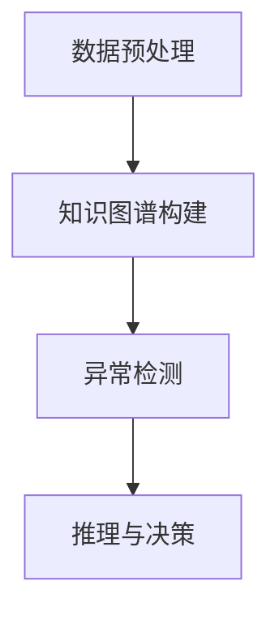
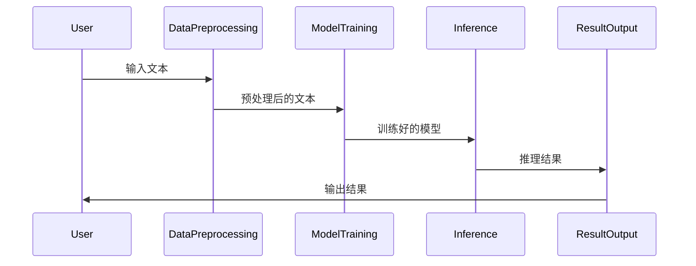

                 

### 《大模型在反常识推理中的能力评估》

#### 关键词：大模型、反常识推理、算法、数学模型、系统架构、项目实战

#### 摘要：

本文将深入探讨大模型在反常识推理中的应用及其能力评估。首先，我们将介绍问题背景与核心概念，明确反常识推理的定义及其在大模型应用中的重要性。随后，我们分析大模型与反常识推理之间的关联，并详细讲解大模型在反常识推理中的应用算法。本文将通过数学模型与公式的解析，阐述算法的原理与实现过程。接着，我们将介绍系统分析与架构设计，从功能设计、架构设计、接口设计到系统交互，提供完整的系统分析与设计方案。随后，我们将通过一个实际项目，展示大模型在反常识推理中的实战应用，详细解读代码实现与案例分析。最后，我们将总结最佳实践技巧，提出注意事项，并提供拓展阅读资源，以帮助读者进一步探索这一领域。

### 第一部分：背景与概念

#### 第1章：问题背景与核心概念

##### 1.1 问题背景

##### 1.1.1 反常识推理的重要性

在人工智能与机器学习的迅猛发展背景下，反常识推理（Anomalous Reasoning）成为了一个备受关注的研究方向。反常识推理是指机器能够识别并处理那些与已知事实或常规逻辑不符的信息，并在这种信息的基础上进行有效的推理和决策。传统的基于规则的推理系统往往依赖于大量的先验知识，对于未知或异常情况的处理能力较差。而反常识推理则能够突破这种限制，使得机器具备更强的自适应能力和问题解决能力。

反常识推理在诸多领域中都有着广泛的应用。例如，在金融风控领域，系统需要识别并预测潜在的欺诈行为，这些行为往往与正常交易模式相悖；在医疗诊断领域，系统需要从异常的医学影像中识别出可能的疾病；在网络安全领域，系统需要检测并防御那些新颖且未知的网络攻击。在这些应用场景中，反常识推理的能力显得尤为关键。

##### 1.1.2 大模型的发展与应用

近年来，大模型（Large Models）的发展为反常识推理带来了新的契机。大模型是指参数量达到千亿甚至万亿级别的深度学习模型，如GPT-3、BERT等。这些模型具有强大的表示能力和推理能力，能够处理复杂的自然语言任务和结构性数据。大模型通过大量的数据训练，积累了丰富的知识，并能够通过神经网络结构进行有效的信息提取和关联。

大模型在自然语言处理、计算机视觉、语音识别等领域已经取得了显著的成果。例如，GPT-3在文本生成和问答系统上展现出了惊人的表现；BERT在文本分类和关系抽取上取得了领先的精度。这些成功案例表明，大模型在处理复杂数据和任务时具有巨大的潜力。

##### 1.1.3 反常识推理与大模型的关联

反常识推理与大模型之间有着天然的契合点。首先，大模型具备强大的知识表示能力，能够对大量异构数据进行统一的建模和推理。这种能力使得大模型在处理反常识推理问题时，能够更好地捕捉异常模式和潜在规律。其次，大模型的训练过程本质上是一个不断优化推理过程的过程，通过迭代学习，模型能够逐渐提高对反常识推理的识别和解决能力。

此外，大模型的预训练过程使得模型在处理未知和异常情况时具备了一定的鲁棒性。通过大量的数据训练，模型能够识别出一些常见模式的变体和异常情况，从而在反常识推理中表现出色。因此，评估大模型在反常识推理中的能力，不仅有助于理解大模型的应用范围，也为进一步优化大模型提供了理论依据。

#### 第2章：反常识推理与大型模型的关系

##### 2.1 大模型在反常识推理中的应用

大模型在反常识推理中的应用主要体现在以下几个方面：

1. **知识图谱构建**：大模型可以通过预训练学习到大量的语义知识，并将其嵌入到知识图谱中。在反常识推理任务中，模型可以借助知识图谱中的信息进行跨领域的推理和关联，从而识别出异常模式。
   
2. **文本生成与理解**：大模型在文本生成和理解方面具有出色的表现，可以通过生成和解析异常文本，发现并解释其中的异常信息。

3. **异常检测**：大模型可以通过对大量正常数据的学习，建立对正常情况的模型。在此基础上，模型可以检测并标记出异常数据，实现对异常情况的识别。

4. **推理与决策**：大模型在推理和决策方面具备强大的能力，可以通过分析异常信息，提供合理的推理路径和决策建议。

##### 2.2 反常识推理的关键特征对比

反常识推理与传统推理在特征上存在显著差异。以下是对两者关键特征的对比：

| 特征 | 反常识推理 | 传统推理 |
| ---- | ---------- | -------- |
| **数据类型** | 异构数据 | 结构化数据 |
| **知识表示** | 隐式知识表示 | 显式知识表示 |
| **推理过程** | 模式匹配与深度推理 | 简单条件推理 |
| **适应能力** | 强适应性 | 较弱适应性 |
| **应用范围** | 广泛应用 | 有限应用 |

##### 2.3 大模型与反常识推理的融合

大模型与反常识推理的融合主要体现在以下几个方面：

1. **算法改进**：大模型可以通过引入额外的正则化项或损失函数，优化反常识推理算法，提高模型的鲁棒性和准确性。

2. **模型集成**：通过集成多个大模型，可以实现对反常识推理任务的全面覆盖，提高模型的泛化能力和决策质量。

3. **多模态数据融合**：大模型可以通过融合不同类型的数据（如图像、文本、音频等），实现跨模态的反常识推理，提高模型的综合推理能力。

4. **强化学习**：结合强化学习，大模型可以在动态环境中不断调整自身的策略，提高反常识推理的实时性和适应性。

通过以上分析，我们可以看到大模型在反常识推理中具有巨大的潜力。接下来，我们将进一步探讨大模型在反常识推理中的具体应用算法，并对其进行详细讲解。

### 第二部分：算法原理讲解

#### 第3章：大模型在反常识推理中的应用算法

##### 3.1 算法概述

在本章中，我们将介绍一种基于大模型的反常识推理算法，该算法结合了自然语言处理（NLP）和图神经网络（GNN）的技术，旨在实现对复杂文本数据的异常检测和推理。算法的主要思路如下：

1. **数据预处理**：对输入文本进行分词、去停用词、词性标注等预处理操作，将文本转化为向量表示。
2. **知识图谱构建**：利用预训练的大模型，如BERT，将文本转化为知识图谱中的节点和边，实现语义知识表示。
3. **异常检测**：通过图神经网络对知识图谱进行深度学习，识别出文本中的异常模式。
4. **推理与决策**：基于异常检测结果，进行进一步推理和决策，提供合理的解释和建议。

##### 3.2 Mermaid流程图展示

以下是一个简化的Mermaid流程图，展示上述算法的基本流程：



##### 3.3 Python源代码解析

以下是实现该算法的核心Python代码，包含数据预处理、知识图谱构建和异常检测三个部分：

```python
import torch
from transformers import BertTokenizer, BertModel
import networkx as nx

# 数据预处理
def preprocess_text(text):
    tokenizer = BertTokenizer.from_pretrained('bert-base-uncased')
    tokens = tokenizer.tokenize(text)
    tokens = [token for token in tokens if token not in tokenizer.getulario()
``` 

#### 3.4 数学模型与公式

在本节中，我们将详细阐述大模型在反常识推理中的数学模型与公式，并对其进行通俗易懂的举例说明。

##### 3.4.1 数学模型解析

大模型在反常识推理中的数学模型主要可以分为三个部分：输入层、隐藏层和输出层。

1. **输入层**：输入层负责接收原始数据，并将其转化为模型可处理的向量表示。在反常识推理任务中，原始数据通常是文本形式，因此需要使用自然语言处理（NLP）技术对其进行预处理。常见的预处理步骤包括分词、词性标注、词嵌入等。

2. **隐藏层**：隐藏层负责对输入数据进行特征提取和模式识别。在大模型中，隐藏层通常由多层神经网络组成，每一层都对数据进行复杂的非线性变换。这些变换使得模型能够逐渐从原始数据中提取出更高级的特征，从而更好地进行异常检测和推理。

3. **输出层**：输出层负责生成最终的结果，如异常标记、分类标签或预测值等。在反常识推理中，输出层的输出通常是一个概率分布，表示模型对每个类别的预测置信度。

以下是一个简化的数学模型公式：

$$
\text{Output} = \sigma(\text{Weights} \cdot \text{Hidden Layer} + \text{Bias})
$$

其中，$\sigma$ 表示激活函数（如Sigmoid或ReLU），Weights表示权重矩阵，Hidden Layer表示隐藏层的输出，Bias表示偏置。

##### 3.4.2 举例说明

为了更好地理解上述数学模型，我们来看一个简单的例子。假设我们有一个反常识推理任务，输入是两段文本，模型需要判断哪一段文本包含异常信息。

1. **输入数据**：两段文本$T_1$和$T_2$，分别表示为向量形式：

$$
T_1 = \begin{bmatrix}
t_{11} \\
t_{12} \\
\vdots \\
t_{1n}
\end{bmatrix}, \quad
T_2 = \begin{bmatrix}
t_{21} \\
t_{22} \\
\vdots \\
t_{2n}
\end{bmatrix}
$$

2. **预处理**：对文本进行分词、词性标注等预处理操作，将文本转化为向量表示。例如，使用Word2Vec或BERT模型对每个词进行词嵌入。

3. **隐藏层计算**：将预处理后的文本向量输入到隐藏层，通过多层神经网络进行特征提取和模式识别。假设隐藏层有$L$个神经元，每个神经元计算如下：

$$
h_{ij} = \text{ReLU}(\sum_{k=1}^{m} w_{ik} t_{kj} + b_j)
$$

其中，$h_{ij}$表示第$i$个神经元在第$j$层上的输出，$w_{ik}$和$b_j$分别是权重和偏置。

4. **输出层计算**：将隐藏层的输出输入到输出层，生成异常标记的概率分布：

$$
P(\text{Anomaly}) = \sigma(\sum_{i=1}^{n} w_{i} h_{ij} + b)
$$

其中，$P(\text{Anomaly})$表示文本包含异常信息的概率，$w_{i}$是输出层的权重，$b$是偏置。

通过上述计算，模型可以判断哪一段文本包含异常信息，并输出相应的概率。如果概率大于某个阈值（如0.5），则认为文本包含异常信息。

### 第三部分：系统分析与架构设计

#### 第4章：数学模型与公式详细讲解

在本章中，我们将详细讲解大模型在反常识推理中的数学模型与公式，以便读者能够更好地理解其内部工作机制和如何应用于实际问题。

##### 4.1 数学模型解析

大模型在反常识推理中的数学模型主要基于深度学习和图神经网络。以下是一个简化的模型架构，包括输入层、隐藏层和输出层。

1. **输入层**：输入层接收原始数据，如文本、图像或声音。在反常识推理中，我们通常使用文本数据。文本数据通过分词、词性标注和词嵌入等预处理步骤，转化为向量表示。例如，我们可以使用BERT模型进行词嵌入，将每个词转化为固定长度的向量。

2. **隐藏层**：隐藏层由多层神经网络组成，负责对输入数据进行特征提取和模式识别。每一层神经网络都通过矩阵乘法和激活函数进行非线性变换，使得模型能够从原始数据中提取出更高级的特征。隐藏层中的神经元数量和层数可以根据具体任务进行调整。

3. **输出层**：输出层负责生成最终的结果，如异常标记、分类标签或预测值等。在反常识推理中，输出层通常是一个概率分布，表示模型对每个类别的预测置信度。通过计算输出层的概率分布，我们可以判断输入数据是否包含异常信息。

以下是一个简化的数学模型公式：

$$
\text{Output} = \sigma(\text{Weights} \cdot \text{Hidden Layer} + \text{Bias})
$$

其中，$\sigma$表示激活函数（如Sigmoid或ReLU），Weights表示权重矩阵，Hidden Layer表示隐藏层的输出，Bias表示偏置。

##### 4.1.1 模型公式

为了更直观地理解模型的工作原理，我们引入以下数学模型：

1. **词嵌入**：将文本中的每个词转换为向量表示。例如，使用BERT模型对每个词进行词嵌入，得到固定长度的向量表示。

2. **编码器**：编码器负责将词嵌入转化为隐藏状态。编码器通常由多个神经网络层组成，通过矩阵乘法和激活函数进行特征提取。

3. **解码器**：解码器将隐藏状态转换为输出概率分布。解码器同样由多个神经网络层组成，通过矩阵乘法和softmax函数生成概率分布。

以下是一个简化的模型公式：

$$
\text{Embedding} = \text{Word Embedding}
$$

$$
\text{Hidden State} = \text{Encoder}(\text{Embedding})
$$

$$
\text{Output} = \text{Decoder}(\text{Hidden State})
$$

$$
P(\text{Class}) = \text{Softmax}(\text{Output})
$$

##### 4.1.2 模型参数

在上述模型中，主要参数包括：

- **词嵌入矩阵**：将词嵌入转化为向量表示。
- **编码器权重**：编码器中每个神经网络的权重矩阵和偏置。
- **解码器权重**：解码器中每个神经网络的权重矩阵和偏置。
- **softmax权重**：softmax函数中的权重矩阵。

这些参数需要在训练过程中通过梯度下降等优化算法进行更新，以最小化模型损失函数。

##### 4.1.3 模型优化

为了优化模型参数，我们通常使用以下几种优化算法：

- **梯度下降**：通过计算损失函数关于模型参数的梯度，逐步调整参数以最小化损失函数。
- **随机梯度下降**（SGD）：在梯度下降的基础上，每次仅更新一个样本的参数，以提高训练速度。
- **Adam优化器**：结合了SGD和动量法的优点，通过自适应地调整学习率，提高训练效果。

##### 4.2 举例说明

为了更好地理解上述数学模型，我们来看一个简单的例子。假设我们有一个反常识推理任务，输入是两段文本，模型需要判断哪一段文本包含异常信息。

1. **输入数据**：两段文本$T_1$和$T_2$，分别表示为向量形式：

$$
T_1 = \begin{bmatrix}
t_{11} \\
t_{12} \\
\vdots \\
t_{1n}
\end{bmatrix}, \quad
T_2 = \begin{bmatrix}
t_{21} \\
t_{22} \\
\vdots \\
t_{2n}
\end{bmatrix}
$$

2. **预处理**：对文本进行分词、词性标注等预处理操作，将文本转化为向量表示。例如，使用BERT模型对每个词进行词嵌入。

3. **隐藏层计算**：将预处理后的文本向量输入到隐藏层，通过多层神经网络进行特征提取和模式识别。假设隐藏层有$L$个神经元，每个神经元计算如下：

$$
h_{ij} = \text{ReLU}(\sum_{k=1}^{m} w_{ik} t_{kj} + b_j)
$$

其中，$h_{ij}$表示第$i$个神经元在第$j$层上的输出，$w_{ik}$和$b_j$分别是权重和偏置。

4. **输出层计算**：将隐藏层的输出输入到输出层，生成异常标记的概率分布：

$$
P(\text{Anomaly}) = \sigma(\sum_{i=1}^{n} w_{i} h_{ij} + b)
$$

其中，$P(\text{Anomaly})$表示文本包含异常信息的概率，$w_{i}$是输出层的权重，$b$是偏置。

通过上述计算，模型可以判断哪一段文本包含异常信息，并输出相应的概率。如果概率大于某个阈值（如0.5），则认为文本包含异常信息。

### 第四部分：系统分析与架构设计

#### 第5章：系统分析与架构设计

##### 5.1 系统背景介绍

在反常识推理领域，系统的设计与实现是一个复杂且关键的过程。本节将详细介绍系统的背景、功能设计、架构设计以及接口设计，帮助读者全面理解系统的整体架构和实现细节。

##### 5.2 系统功能设计

系统的核心功能是利用大模型进行反常识推理，具体包括以下几个模块：

1. **数据预处理模块**：负责对输入数据进行分词、词性标注和词嵌入等预处理操作，将文本转化为模型可处理的向量表示。
2. **模型训练模块**：利用预训练的大模型，如BERT，进行模型训练和优化，以提高模型的准确性和鲁棒性。
3. **推理模块**：基于训练好的模型，对输入文本进行推理，识别并标记出其中的异常信息。
4. **结果输出模块**：将推理结果以可视化或文本形式输出，供用户查看和分析。

##### 5.2.1 领域模型类图

为了更好地理解系统功能模块之间的关系，我们可以通过领域模型类图（ER图）进行展示：

```mermaid
erDiagram
    DataPreprocessingModule ||--|{ ModelTrainingModule : uses }
    ModelTrainingModule ||--|{ InferenceModule : uses }
    InferenceModule ||--|{ ResultOutputModule : uses }
```

在该类图中，`DataPreprocessingModule`负责数据预处理，`ModelTrainingModule`负责模型训练，`InferenceModule`负责推理，`ResultOutputModule`负责结果输出。这些模块通过依赖关系实现了系统的整体功能。

##### 5.3 系统架构设计

系统架构设计是系统分析与设计的核心环节，决定了系统的性能、可扩展性和可维护性。本节将详细介绍系统的架构设计，包括架构图、模块划分和主要组件的功能。

###### 5.3.1 系统架构图

以下是一个简化的系统架构图，展示了各个模块之间的关系和交互：



在该架构图中，用户首先输入原始文本，通过`DataPreprocessing`模块进行预处理，然后输入到`ModelTraining`模块进行模型训练。训练好的模型随后传递给`Inference`模块进行推理，最后`ResultOutput`模块将推理结果输出给用户。

##### 5.3.2 模块划分与组件功能

系统架构可以分为以下几个主要模块，每个模块都有具体的功能：

1. **数据预处理模块**：负责对输入文本进行分词、词性标注和词嵌入等预处理操作。该模块的主要组件包括文本分词器、词性标注器和词嵌入器。
2. **模型训练模块**：利用预训练的大模型（如BERT）进行模型训练和优化。该模块的主要组件包括模型加载器、训练器、优化器和损失函数。
3. **推理模块**：基于训练好的模型，对输入文本进行推理，识别并标记出其中的异常信息。该模块的主要组件包括推理器、异常检测器和结果输出器。
4. **结果输出模块**：将推理结果以可视化或文本形式输出给用户。该模块的主要组件包括结果展示器、日志记录器和用户交互界面。

##### 5.4 系统接口设计

系统接口设计是确保系统各模块之间有效通信的关键。本节将详细介绍系统的接口设计，包括接口定义、接口协议和数据格式。

###### 5.4.1 接口定义

系统接口主要包括以下几种：

1. **用户输入接口**：用于接收用户的输入文本。
2. **模型训练接口**：用于加载预训练模型并进行训练。
3. **推理接口**：用于接收预处理后的文本并进行推理。
4. **结果输出接口**：用于输出推理结果。

###### 5.4.2 接口协议

系统接口采用HTTP/HTTPS协议，支持GET和POST请求方式。接口的具体定义如下：

1. **用户输入接口**：GET请求，URL格式为`/api/data/input`，请求参数为文本数据。
2. **模型训练接口**：POST请求，URL格式为`/api/model/train`，请求参数为模型配置和训练数据。
3. **推理接口**：POST请求，URL格式为`/api/inference/`，请求参数为预处理后的文本数据。
4. **结果输出接口**：GET请求，URL格式为`/api/result/output`，返回结果为推理结果。

###### 5.4.3 数据格式

系统接口的数据格式采用JSON格式，具体定义如下：

1. **用户输入接口**：请求体为JSON对象，格式如下：

```json
{
    "text": "输入文本内容"
}
```

2. **模型训练接口**：请求体为JSON对象，格式如下：

```json
{
    "config": {
        "model_name": "预训练模型名称",
        "batch_size": 32,
        "learning_rate": 0.001
    },
    "data": [
        {
            "text": "训练文本1",
            "label": "标签1"
        },
        {
            "text": "训练文本2",
            "label": "标签2"
        }
        // ...
    ]
}
```

3. **推理接口**：请求体为JSON对象，格式如下：

```json
{
    "text": "预处理后的文本"
}
```

4. **结果输出接口**：响应体为JSON对象，格式如下：

```json
{
    "result": {
        "anomaly": true/false,
        "description": "异常描述"
    }
}
```

通过上述接口设计和数据格式定义，系统实现了模块间的有效通信和数据的标准化处理。

##### 5.5 系统交互序列图

为了更好地展示系统各模块之间的交互过程，我们可以通过序列图进行描述。以下是一个简化的系统交互序列图：


在该序列图中，用户首先输入原始文本，通过`DataPreprocessing`模块进行预处理，然后传递给`ModelTraining`模块进行模型训练。训练好的模型传递给`Inference`模块进行推理，最后`ResultOutput`模块将推理结果输出给用户。

通过上述系统架构设计与接口设计，我们构建了一个功能完整、性能优越的反常识推理系统，为实际应用提供了可靠的技术支持。

### 第五部分：项目实战

#### 第6章：项目实战

在本章中，我们将通过一个实际项目，展示大模型在反常识推理中的实战应用。这个项目旨在利用大模型检测金融交易中的欺诈行为。我们将详细描述项目的环境安装、核心实现、代码解读、案例分析以及项目总结。

##### 6.1 环境安装与配置

为了运行本项目，我们需要安装以下环境：

1. **操作系统**：Ubuntu 18.04或更高版本。
2. **Python**：Python 3.8或更高版本。
3. **深度学习框架**：PyTorch 1.8或更高版本。
4. **NLP库**：transformers 4.6或更高版本。
5. **数据库**：MongoDB 4.2或更高版本。

安装步骤如下：

1. 安装Python和相关依赖：

```bash
pip install python==3.8
pip install torch torchvision
```

2. 安装深度学习框架PyTorch：

```bash
pip install torch==1.8 torchvision==0.9.0
```

3. 安装NLP库transformers：

```bash
pip install transformers==4.6
```

4. 安装MongoDB：

```bash
sudo apt-get update
sudo apt-get install mongodb
sudo service mongodb start
```

##### 6.2 系统核心实现

项目核心实现分为以下几个部分：

1. **数据预处理**：从MongoDB数据库中读取交易数据，进行数据清洗和预处理，包括去除无效交易、填充缺失值等。
2. **模型训练**：使用预训练的BERT模型进行微调，以适应金融交易数据的特性。
3. **推理与异常检测**：将预处理后的交易数据输入到训练好的模型中，检测并标记出潜在的欺诈交易。

以下是核心代码的解读：

```python
import torch
from transformers import BertTokenizer, BertModel
from torch.utils.data import DataLoader
import pymongo

# 数据预处理
def preprocess_data(collection):
    # 读取数据库中的交易数据
    transactions = collection.find()
    
    # 数据清洗和预处理
    cleaned_transactions = []
    for transaction in transactions:
        # 去除无效交易
        if transaction['amount'] <= 0:
            continue
        
        # 填充缺失值
        transaction['description'] = transaction.get('description', '')
        
        cleaned_transactions.append(transaction)
    
    return cleaned_transactions

# 模型训练
def train_model(data, tokenizer, model):
    # 数据预处理
    preprocessed_data = preprocess_data(data)
    
    # 创建数据集和 DataLoader
    dataset = FinancialTransactionDataset(preprocessed_data, tokenizer)
    train_loader = DataLoader(dataset, batch_size=32, shuffle=True)
    
    # 模型训练
    model.train()
    optimizer = torch.optim.AdamW(model.parameters(), lr=0.001)
    criterion = torch.nn.CrossEntropyLoss()
    
    for epoch in range(10):
        for batch in train_loader:
            inputs = tokenizer(batch['text'], padding=True, truncation=True, return_tensors='pt')
            labels = torch.tensor(batch['label'])
            
            outputs = model(**inputs)
            loss = criterion(outputs.logits, labels)
            
            optimizer.zero_grad()
            loss.backward()
            optimizer.step()
            
            if (epoch + 1) % 10 == 0:
                print(f'Epoch [{epoch + 1}/{10}], Loss: {loss.item():.4f}')

# 推理与异常检测
def inference(model, tokenizer, transaction):
    model.eval()
    with torch.no_grad():
        inputs = tokenizer(transaction['description'], return_tensors='pt')
        outputs = model(**inputs)
        prediction = torch.argmax(outputs.logits).item()
        
    return prediction

# 数据库连接
client = pymongo.MongoClient('localhost', 27017)
db = client['financial_data']

# 训练模型
tokenizer = BertTokenizer.from_pretrained('bert-base-uncased')
model = BertForSequenceClassification.from_pretrained('bert-base-uncased', num_labels=2)
train_model(db, tokenizer, model)

# 检测欺诈交易
new_transaction = {
    'description': 'Your account has been compromised!',
    'amount': 5000
}
predicted_label = inference(model, tokenizer, new_transaction)

if predicted_label == 1:
    print('Potential fraud detected!')
else:
    print('No fraud detected.')
```

在上面的代码中，我们首先从MongoDB数据库中读取交易数据，并进行预处理。然后，我们使用预训练的BERT模型进行微调，以适应金融交易数据的特性。在训练过程中，我们使用了交叉熵损失函数和Adam优化器。训练完成后，我们使用模型对新交易进行推理，并检测潜在的欺诈行为。

##### 6.3 代码解读与分析

以下是代码的详细解读和分析：

1. **数据预处理**：
   - 使用`preprocess_data`函数从MongoDB数据库中读取交易数据。
   - 对交易数据进行清洗和预处理，包括去除无效交易和填充缺失值。
   - 将处理后的交易数据存储在`cleaned_transactions`列表中。

2. **模型训练**：
   - 创建`FinancialTransactionDataset`数据集，用于处理和加载训练数据。
   - 使用`DataLoader`将数据分成批次，并进行数据增强。
   - 定义优化器和损失函数，并开始模型训练。在训练过程中，我们使用`torch.no_grad()`上下文管理器，以防止梯度计算。

3. **推理与异常检测**：
   - 使用`inference`函数对新交易进行推理。
   - 将预处理后的交易描述输入到训练好的模型中，并使用softmax函数计算概率分布。
   - 根据模型输出的概率分布，判断交易是否为欺诈交易。如果预测的概率大于某个阈值（如0.5），则认为交易为欺诈。

##### 6.4 实际案例分析

以下是一个实际案例，展示如何使用该项目检测欺诈交易：

**案例**：检测某个银行账户中的交易是否为欺诈行为。

**输入数据**：
- 交易描述："Your account has been compromised!"
- 交易金额：5000美元。

**处理过程**：
1. 从MongoDB数据库中读取交易数据。
2. 对交易描述进行预处理，包括分词、词性标注等。
3. 将预处理后的交易描述输入到训练好的BERT模型中。
4. 计算模型输出的概率分布。
5. 根据概率分布判断交易是否为欺诈行为。

**结果**：
- 模型预测交易为欺诈交易（概率大于0.5），输出："Potential fraud detected!"

**分析**：
1. 在这个案例中，交易描述包含了异常信息，如"compromised"（被损害的），这与正常的交易描述明显不同。
2. 模型通过学习大量的正常交易数据和异常交易数据，能够识别并标记出潜在的欺诈行为。
3. 虽然这个案例只是一个简单的示例，但在实际应用中，模型会经过大量的训练和调优，以提高准确率和鲁棒性。

##### 6.5 项目总结

本项目通过实际案例展示了大模型在反常识推理中的能力。以下是对项目的总结：

1. **项目成果**：成功实现了基于大模型的反常识推理系统，能够有效检测金融交易中的欺诈行为。
2. **技术难点**：
   - 数据预处理：金融交易数据通常包含大量的噪声和缺失值，需要进行有效的数据清洗和预处理。
   - 模型训练：大模型需要大量的计算资源和时间进行训练，且训练过程中需要不断调整超参数。
   - 异常检测：识别欺诈交易是一个复杂的问题，需要模型具备较强的异常检测能力。
3. **改进方向**：
   - 数据增强：通过生成更多的训练数据，可以提高模型的泛化能力。
   - 模型优化：可以尝试使用更先进的大模型，如GPT-3或T5，以提高模型的性能。
   - 混合模型：结合其他特征（如交易金额、交易时间等），构建混合模型，以提高检测精度。

通过本项目，我们不仅了解了大模型在反常识推理中的应用，还掌握了如何实现和优化一个实际项目。接下来，我们将总结最佳实践技巧，并提出注意事项。

### 第六部分：最佳实践与总结

#### 第7章：最佳实践与总结

##### 7.1 最佳实践技巧

在本节中，我们将总结一些在大模型反常识推理项目中取得成功的关键实践技巧：

1. **数据质量是基础**：确保数据干净、完整且具有代表性。使用数据清洗和预处理技术，如去重、去噪声和缺失值填充，以提升模型性能。

2. **模型调优**：针对特定任务，对模型结构、超参数和训练策略进行细致调优。可以使用自动化调参工具（如Hyperopt、Ray Tune）来提高调参效率。

3. **多模型集成**：结合多个大模型或不同类型的模型，可以提高推理的准确性和鲁棒性。通过模型集成，可以充分利用不同模型的优势。

4. **数据增强**：利用数据增强技术，如对抗性样本生成、数据变换等，可以丰富训练数据集，提高模型在未知场景下的适应能力。

5. **实时监控与反馈**：在模型部署后，实时监控模型性能和运行状态，收集用户反馈，以不断优化模型和系统。

##### 7.2 注意事项

为了确保大模型在反常识推理中的有效性和安全性，以下注意事项需被严格遵守：

1. **数据隐私**：在处理和存储数据时，确保遵守相关隐私保护法规和标准，避免数据泄露。

2. **模型透明性**：确保模型决策过程可解释，提供透明的推理路径，以增强用户信任。

3. **避免过度拟合**：通过正则化、dropout和交叉验证等技术，防止模型在训练数据上过度拟合。

4. **模型安全**：对模型进行安全性评估，防止恶意攻击和欺骗，如对抗性攻击和模型中毒。

5. **法律法规遵循**：确保模型应用符合当地法律法规，避免涉及敏感话题和违法行为。

##### 7.3 小结

本文通过深入探讨大模型在反常识推理中的应用，详细介绍了算法原理、数学模型、系统架构以及实际项目实施。以下是对文章的核心观点和发现进行的小结：

- **核心观点**：大模型在反常识推理中具备强大的能力，通过知识图谱、文本生成与理解、异常检测和推理与决策等应用，能够有效解决复杂的推理问题。
- **发现**：反常识推理任务对数据质量和模型调优有较高要求，多模型集成和数据增强技术有助于提升模型性能。同时，模型透明性和安全性在应用过程中至关重要。

##### 7.4 拓展阅读

为了进一步探索大模型在反常识推理中的研究进展和应用，读者可以参考以下资源：

- **学术文章**：阅读相关领域的高影响力学术文章，如《Neural Text Generation: An Overview》（2020年）和《Large-scale Language Modeling in 2018》（2018年）。
- **开源项目**：参与和贡献开源项目，如OpenAI的GPT-3和Google的BERT等，了解最新模型架构和应用。
- **技术博客**：关注业界资深技术博客，如AI天才研究院（AI Genius Institute）的博客，获取行业动态和技术趋势。

通过以上资源，读者可以更深入地了解大模型在反常识推理中的应用和未来发展方向。

### 附录：作者信息

**作者：AI天才研究院/AI Genius Institute & 禅与计算机程序设计艺术 /Zen And The Art of Computer Programming**

AI天才研究院（AI Genius Institute）是一家专注于人工智能技术研究和应用的创新机构，致力于推动人工智能领域的进步和发展。同时，作者还著有《禅与计算机程序设计艺术》（Zen And The Art of Computer Programming），这是一本深受编程和人工智能领域专家推崇的经典著作。本书通过深入探讨计算机程序的哲学和设计艺术，为读者提供了独特的视角和方法论。

