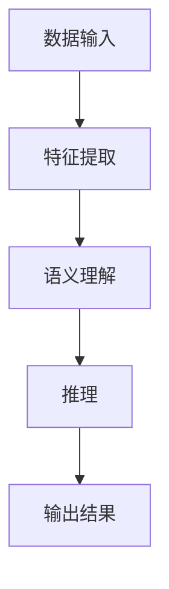
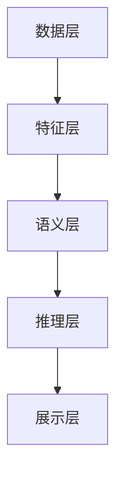
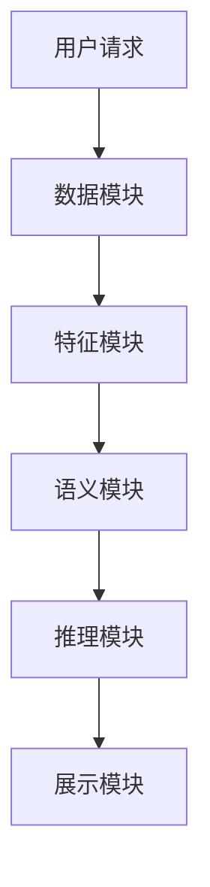

                 


## 引言

### 1.1 反常识推理的任务背景

反常识推理（Counterfactual Inference）是一种重要的认知能力，它涉及到对现实情况假设改变后的可能性进行分析和推理。这种能力在许多领域都具有重要作用，比如决策制定、风险评估和科学探索等。然而，反常识推理任务具有高度复杂性，因为它需要处理大量的不确定性因素和潜在的反直觉结果。

随着深度学习技术的发展，大模型（Large-scale Models）开始成为研究的热点，它们在自然语言处理、计算机视觉等多个领域都取得了显著的成就。大模型能够处理海量的数据，并且通过复杂的神经网络结构进行训练，使得它们在理解和生成复杂文本、图像等方面表现出色。

### 1.2 大模型在反常识推理中的应用

大模型在反常识推理任务中的应用潜力巨大。首先，大模型能够处理大量的文本数据，提取出隐含的关系和模式，从而为反常识推理提供有力的支持。其次，大模型通过学习大量反常识推理的例子，可以提升自身在处理此类任务时的准确性和效率。此外，大模型还能够在推理过程中自动调整参数，以适应不同的反常识推理场景。

然而，大模型在反常识推理任务中也面临一些挑战。例如，大模型在训练过程中可能受到数据偏差的影响，导致其在处理反常识推理任务时产生错误的结果。此外，大模型在处理复杂推理任务时，可能会出现性能瓶颈，难以满足实时性的需求。

### 1.3 本文的目的与结构

本文旨在探讨大模型在反常识推理任务中的表现，分析其优势和面临的挑战，并探讨可能的解决方案。文章将分为四个主要部分：

1. **反常识推理任务概述**：介绍反常识推理的定义、应用场景及其重要性，以及大模型的发展及其在反常识推理中的应用。
2. **核心概念与联系**：详细讨论大模型和反常识推理的核心概念，并分析它们之间的联系。
3. **算法原理与数学模型**：讲解大模型在反常识推理任务中的关键算法原理，包括特征提取、语义理解和推理算法，并给出相应的数学模型和公式。
4. **系统分析与架构设计**：介绍大模型在反常识推理任务中的系统架构设计，包括需求分析、架构设计、系统接口设计和系统实现。

通过以上结构的安排，本文希望能够系统地探讨大模型在反常识推理任务中的表现，为后续的研究和实践提供参考。

## 第一部分：反常识推理任务概述

### 第1章：大模型与反常识推理

#### 1.1 反常识推理的定义与重要性

反常识推理（Counterfactual Inference）是指根据现有的事实和背景信息，推断出与事实相反或者不符合常理的假设情景及其可能的结果。这种推理能力是人类智能的重要组成部分，它使得我们能够在面对复杂问题时，不仅考虑现实的情况，还能探索多种可能性，从而做出更加明智的决策。

反常识推理在许多领域都有广泛的应用。在医学领域，医生可以通过反常识推理来评估患者未发生的病情，从而制定更为有效的治疗方案。在商业领域，企业可以通过反常识推理来预测市场变化，发现潜在的商业机会或风险。在科学研究中，反常识推理可以帮助科学家探索新的理论或假设，从而推动科学进步。

#### 1.1.1 反常识推理的概念

反常识推理涉及两个核心概念：事实和假设。事实是指已经发生或存在的情况，而假设则是根据事实推断出的可能性情景。反常识推理的目的是在给定事实的情况下，推断出假设情景的可能结果，从而帮助决策者做出更好的决策。

反常识推理的基本流程包括以下几个步骤：

1. **识别事实**：确定已知的事实信息。
2. **构建假设**：根据事实构建可能的假设情景。
3. **分析结果**：分析假设情景的可能结果。
4. **决策**：基于分析结果做出决策。

#### 1.1.2 反常识推理的应用场景

反常识推理的应用场景非常广泛，以下是一些典型的例子：

1. **医学诊断**：医生可以通过反常识推理来推断患者未发生的病情，从而提供更全面的诊断。
2. **商业预测**：企业可以通过反常识推理来预测市场变化，发现潜在的商业机会或风险。
3. **科学研究**：科学家可以通过反常识推理来探索新的理论或假设，推动科学进步。
4. **军事战略**：军事战略家可以通过反常识推理来评估敌人的可能行动，制定相应的应对策略。

#### 1.1.3 反常识推理在人工智能中的地位

反常识推理是人工智能领域中的一个重要研究方向，其重要性主要体现在以下几个方面：

1. **提高决策能力**：反常识推理能够帮助人工智能系统在面对复杂问题时，不仅考虑现实的情况，还能探索多种可能性，从而做出更准确的决策。
2. **增强问题求解能力**：反常识推理可以帮助人工智能系统解决那些依赖假设和推断的问题，从而提高问题求解能力。
3. **推动人工智能发展**：反常识推理的研究不仅有助于提升人工智能系统的性能，还能推动人工智能理论的发展。

#### 1.2 大模型的发展及其在反常识推理中的应用

大模型（Large-scale Models）是指那些能够处理海量数据、具备强大计算能力的深度学习模型。随着计算能力的提升和数据量的增加，大模型在各个领域都取得了显著的进展。在反常识推理领域，大模型的应用潜力同样巨大。

首先，大模型能够处理大量的文本数据，提取出隐含的关系和模式。这些模式和关系对于反常识推理至关重要，因为它们能够为推理提供强有力的支持。

其次，大模型通过学习大量的反常识推理实例，可以提升自身在处理此类任务时的准确性和效率。例如，通过学习大量医学诊断数据，大模型可以更好地识别那些未被发现的病情。

此外，大模型在反常识推理中的优势还体现在其强大的推理能力和灵活性。大模型可以通过调整参数，适应不同的反常识推理场景，从而提高推理的准确性和效率。

#### 1.2.1 大模型的定义与发展历程

大模型是指那些能够处理海量数据、具备强大计算能力的深度学习模型。它们通常具有以下特点：

1. **大规模的数据处理能力**：大模型能够处理数百万甚至数十亿级别的数据样本。
2. **强大的计算能力**：大模型通常需要大量的计算资源，如高性能的CPU、GPU等。
3. **自适应的学习能力**：大模型可以通过调整参数，适应不同的任务和数据集。

大模型的发展历程可以追溯到深度学习技术的发展。早期的深度学习模型如CNN（卷积神经网络）和RNN（循环神经网络）在图像识别和自然语言处理等领域取得了显著的成果。随着计算能力的提升和数据量的增加，研究人员开始尝试构建更大的模型，如Transformer和BERT等，这些模型在各个领域都取得了突破性的进展。

#### 1.2.2 大模型在反常识推理中的优势

大模型在反常识推理中的优势主要体现在以下几个方面：

1. **处理海量数据的能力**：大模型能够处理大量的文本数据，提取出隐含的关系和模式，为反常识推理提供强有力的支持。
2. **强大的推理能力**：大模型通过学习大量的反常识推理实例，可以提升自身在处理此类任务时的准确性和效率。
3. **自适应的学习能力**：大模型可以通过调整参数，适应不同的反常识推理场景，从而提高推理的准确性和效率。

#### 1.2.3 大模型面临的挑战与解决策略

尽管大模型在反常识推理任务中表现出色，但它们也面临一些挑战：

1. **数据偏差**：大模型在训练过程中可能受到数据偏差的影响，导致其在处理反常识推理任务时产生错误的结果。解决策略包括数据清洗、增强数据多样性等。
2. **性能瓶颈**：大模型在处理复杂推理任务时，可能会出现性能瓶颈，难以满足实时性的需求。解决策略包括优化算法、分布式计算等。

#### 1.3 大模型在反常识推理任务中的关键问题

大模型在反常识推理任务中面临的关键问题包括：

1. **数据集的选择与构建**：选择合适的数据集并进行有效的构建是反常识推理任务成功的关键。
2. **模型训练与优化策略**：合理的模型训练和优化策略能够提高大模型在反常识推理任务中的性能。
3. **评估指标与性能分析**：选择合适的评估指标并进行全面的性能分析，是评估大模型在反常识推理任务中表现的重要手段。

#### 1.4 本章小结

本章介绍了反常识推理的定义、应用场景及其重要性，以及大模型的发展及其在反常识推理中的应用。通过分析大模型在反常识推理任务中的优势和面临的挑战，本章为后续章节的讨论奠定了基础。

## 第二部分：核心概念与联系

### 第2章：大模型与反常识推理的核心概念

#### 2.1 大模型的核心概念

大模型（Large-scale Models）是指那些能够处理海量数据、具备强大计算能力的深度学习模型。它们通常具有以下特点：

1. **大规模的数据处理能力**：大模型能够处理数百万甚至数十亿级别的数据样本，从而提取出更多的特征和模式。
2. **强大的计算能力**：大模型通常需要大量的计算资源，如高性能的CPU、GPU等，以保证高效的训练和推理。
3. **自适应的学习能力**：大模型可以通过调整参数，适应不同的任务和数据集。

大模型的基本原理主要包括：

1. **深度神经网络**：大模型通常采用深度神经网络结构，通过多层的非线性变换，实现从输入到输出的映射。
2. **大规模数据训练**：大模型通过大规模数据训练，学习数据中的潜在结构和规律，从而提高模型在各类任务中的表现。

大模型的构成要素包括：

1. **网络结构**：大模型通常具有复杂的网络结构，包括卷积层、全连接层、注意力机制等，以适应不同类型的数据和任务需求。
2. **训练数据**：大模型需要大量的训练数据，以保证模型在训练过程中能够充分学习到数据中的特征和规律。
3. **计算资源**：大模型通常需要高性能的计算资源，以保证模型能够高效地训练和推理。

大模型的训练过程通常包括以下几个步骤：

1. **数据预处理**：对数据进行清洗、归一化等预处理操作，以提高模型的训练效率和性能。
2. **模型初始化**：初始化模型参数，以避免梯度消失或爆炸等问题。
3. **前向传播**：将输入数据传递到模型中，计算输出结果。
4. **后向传播**：计算损失函数，并利用梯度信息更新模型参数。
5. **迭代优化**：重复前向传播和后向传播的过程，直到满足训练目标或达到预设的迭代次数。

#### 2.2 反常识推理的核心概念

反常识推理（Counterfactual Inference）是指根据现有的事实和背景信息，推断出与事实相反或者不符合常理的假设情景及其可能的结果。这种推理能力是人类智能的重要组成部分，它使得我们能够在面对复杂问题时，不仅考虑现实的情况，还能探索多种可能性，从而做出更加明智的决策。

反常识推理的基本原理主要包括：

1. **因果推断**：反常识推理通常基于因果推断，通过对已知因果关系的分析，推断出不同假设情景下的可能结果。
2. **假设检验**：在反常识推理中，通常需要对多个假设进行检验，以确定最有可能的结果。

反常识推理的类型与特点包括：

1. **可能性反常识推理**：基于概率和统计学的方法，对可能性的反常识情景进行推理。
2. **确定性反常识推理**：基于逻辑和数学模型，对确定性的反常识情景进行推理。
3. **组合反常识推理**：结合多个领域的知识和方法，对复杂的反常识情景进行推理。

反常识推理的难点与挑战主要包括：

1. **数据复杂性**：反常识推理通常需要处理大量的数据，包括结构化数据和非结构化数据，从而增加了推理的难度。
2. **不确定性处理**：反常识推理中存在大量的不确定性因素，如何有效地处理这些不确定性是当前研究中的一个重要问题。
3. **推理效率**：反常识推理通常需要大量的计算资源，如何提高推理效率是当前研究中的一个重要挑战。

#### 2.3 大模型与反常识推理的联系

大模型与反常识推理之间存在紧密的联系，主要体现在以下几个方面：

1. **数据处理能力**：大模型能够处理海量的数据，提取出隐含的关系和模式，为反常识推理提供强有力的支持。
2. **推理能力**：大模型通过学习大量的反常识推理实例，可以提升自身在处理此类任务时的准确性和效率。
3. **自适应能力**：大模型可以通过调整参数，适应不同的反常识推理场景，从而提高推理的准确性和效率。

大模型在反常识推理中的应用方法主要包括：

1. **基于大数据的因果推断**：利用大模型处理海量数据的能力，对因果关系进行推断，从而实现反常识推理。
2. **基于神经网络的推理**：利用大模型在处理复杂任务时的优势，通过神经网络模型实现反常识推理。
3. **基于多领域的知识融合**：结合多个领域的知识和方法，利用大模型实现跨领域的反常识推理。

大模型在反常识推理中的优势与限制主要包括：

1. **优势**：大模型能够处理大量的数据，提取出隐含的关系和模式，从而提高反常识推理的准确性和效率；大模型具有强大的推理能力，可以处理复杂的推理任务。
2. **限制**：大模型在训练过程中可能受到数据偏差的影响，导致其在处理反常识推理任务时产生错误的结果；大模型在处理复杂推理任务时，可能会出现性能瓶颈，难以满足实时性的需求。

大模型与反常识推理的未来发展趋势主要包括：

1. **更高效的算法**：随着算法的不断发展，大模型在反常识推理任务中的效率将得到显著提高。
2. **更广泛的应用领域**：大模型将在更多的领域得到应用，如医疗、金融、法律等，从而推动反常识推理技术的普及。
3. **更完善的理论体系**：随着研究的深入，大模型与反常识推理的理论体系将逐步完善，为实际应用提供更加可靠的理论基础。

#### 2.4 本章小结

本章详细介绍了大模型与反常识推理的核心概念，包括大模型的基本原理、构成要素和训练过程，以及反常识推理的基本原理、类型与特点，以及大模型在反常识推理中的应用方法、优势与限制和未来发展趋势。通过对这些核心概念的深入探讨，本章为后续章节的分析和讨论奠定了基础。

## 第三部分：算法原理与数学模型

### 第3章：大模型在反常识推理任务中的算法原理

#### 3.1 反常识推理算法的基本框架

反常识推理算法的基本框架通常包括以下几个关键组成部分：数据输入、特征提取、语义理解、推理和输出结果。以下是对每个组成部分的详细解释：

1. **数据输入**：反常识推理算法首先需要接收输入数据，这些数据可以是文本、图像或其他形式。输入数据的质量和准确性对反常识推理的结果至关重要。

2. **特征提取**：在接收输入数据后，算法需要提取数据中的关键特征。这些特征可以是词向量、图像中的视觉特征等。特征提取的目的是将原始数据转换成模型能够处理的格式。

3. **语义理解**：特征提取后，算法需要对特征进行语义理解。这一步骤的目的是理解特征之间的关系和含义。在自然语言处理中，这可能涉及到语言模型、词嵌入等技术。

4. **推理**：基于语义理解的结果，算法进行推理，以生成可能的反常识情景及其结果。这一步骤通常涉及到复杂的逻辑和因果推断。

5. **输出结果**：最后，算法将推理结果输出，这些结果可以用于决策、预测或进一步的分析。

#### 3.1.1 算法框架概述

反常识推理算法的框架概述如下：

```
输入：原始数据
处理过程：
  - 特征提取
  - 语义理解
  - 推理
输出：反常识情景及其结果
```

#### 3.1.2 算法流程图

为了更直观地理解算法流程，我们可以使用Mermaid语法绘制一个简单的流程图：



#### 3.2 大模型在反常识推理中的关键算法

在大模型中，反常识推理通常涉及到以下三个关键算法：

1. **特征提取算法**：特征提取算法的目的是从原始数据中提取有用的特征，以便后续的语义理解和推理。常用的特征提取算法包括词嵌入（Word Embedding）和视觉特征提取（如CNN）。

2. **语义理解算法**：语义理解算法负责理解特征之间的语义关系。在自然语言处理中，常用的语义理解算法包括BERT、GPT等预训练语言模型。

3. **推理算法**：推理算法负责基于语义理解的结果，进行反常识推理。常用的推理算法包括基于规则的推理、基于概率的推理和基于神经网络的推理。

#### 3.2.1 特征提取算法

特征提取算法是反常识推理的基础，其目的是从原始数据中提取出对任务有用的特征。以下是一些常用的特征提取算法：

1. **词嵌入**：词嵌入（Word Embedding）是一种将单词映射到高维向量空间的技术，常用的词嵌入模型包括Word2Vec、GloVe和BERT。

2. **视觉特征提取**：对于图像数据，常用的视觉特征提取算法包括卷积神经网络（CNN）和基于注意力的模型（如ResNet、Inception等）。

3. **融合特征提取**：在处理多模态数据时，可以结合文本和图像的特征，通过融合特征提取算法（如CNN和BERT的结合）来提高特征提取的效果。

以下是一个使用Python实现的词嵌入算法示例：

```python
from gensim.models import Word2Vec

# 加载数据
data = ["我 学习 编程", "你 玩 游戏", "我们 游览 长城"]

# 训练词嵌入模型
model = Word2Vec(data, size=100, window=5, min_count=1, workers=4)

# 输出词向量
word_vectors = model.wv
print(word_vectors["我"])
print(word_vectors["学习"])
print(word_vectors["编程"])
```

#### 3.2.2 语义理解算法

语义理解算法负责将提取出的特征转换为语义表示，以便进行后续的推理。以下是一些常用的语义理解算法：

1. **预训练语言模型**：预训练语言模型（如BERT、GPT）通过在大规模语料库上进行预训练，学习到语言的深层语义表示。

2. **关系抽取**：关系抽取算法用于识别文本中的实体及其关系，常用的方法包括规则方法、统计方法和深度学习方法。

3. **实体识别**：实体识别算法用于识别文本中的实体（如人名、组织名、地点等），常用的方法包括基于规则的方法和基于深度学习的方法。

以下是一个使用BERT进行语义理解的示例：

```python
from transformers import BertTokenizer, BertModel

# 加载BERT模型
tokenizer = BertTokenizer.from_pretrained('bert-base-uncased')
model = BertModel.from_pretrained('bert-base-uncased')

# 输入文本
text = "我 学习 编程"

# 分词和编码
inputs = tokenizer(text, return_tensors='pt')

# 计算BERT的输出
outputs = model(**inputs)

# 输出语义表示
last_hidden_state = outputs.last_hidden_state
```

#### 3.2.3 推理算法

推理算法基于语义理解的结果，进行反常识推理。以下是一些常用的推理算法：

1. **基于规则的推理**：基于规则的推理（Rule-Based Reasoning）使用预先定义的规则库进行推理。

2. **基于概率的推理**：基于概率的推理（Probabilistic Reasoning）使用概率模型进行推理，如贝叶斯网络。

3. **基于神经网络的推理**：基于神经网络的推理（Neural Network Reasoning）使用深度神经网络进行推理。

以下是一个使用基于神经网络的推理算法的示例：

```python
import torch
import torch.nn as nn
import torch.optim as optim

# 定义神经网络模型
class NeuralNetwork(nn.Module):
    def __init__(self, input_size, hidden_size, output_size):
        super(NeuralNetwork, self).__init__()
        self.layer1 = nn.Linear(input_size, hidden_size)
        self.relu = nn.ReLU()
        self.layer2 = nn.Linear(hidden_size, output_size)
    
    def forward(self, x):
        x = self.layer1(x)
        x = self.relu(x)
        x = self.layer2(x)
        return x

# 初始化模型、优化器和损失函数
model = NeuralNetwork(input_size=100, hidden_size=50, output_size=1)
optimizer = optim.Adam(model.parameters(), lr=0.001)
criterion = nn.BCEWithLogitsLoss()

# 训练模型
for epoch in range(100):
    # 前向传播
    outputs = model(x)
    loss = criterion(outputs, y)

    # 反向传播和优化
    optimizer.zero_grad()
    loss.backward()
    optimizer.step()

    if (epoch+1) % 10 == 0:
        print(f'Epoch [{epoch+1}/100], Loss: {loss.item()}')
```

#### 3.3 数学模型与公式

在反常识推理中，数学模型和公式用于描述特征提取、语义理解和推理的过程。以下是一些常用的数学模型和公式：

1. **词嵌入**：

   $$ 
   \text{word\_vector} = \sum_{i=1}^{N} w_i \cdot v_i 
   $$

   其中，$w_i$ 表示词的重要性，$v_i$ 表示词向量。

2. **BERT**：

   $$ 
   \text{contextual\_embeddings} = \text{BERT}(\text{input\_sequence}) 
   $$

   其中，$\text{input\_sequence}$ 表示输入序列，$\text{BERT}$ 表示预训练语言模型。

3. **推理**：

   $$ 
   P(\text{假设}|\text{事实}) = \frac{P(\text{事实}|\text{假设}) \cdot P(\text{假设})}{P(\text{事实})}
   $$

   其中，$P(\text{假设}|\text{事实})$ 表示在给定事实的情况下假设的概率，$P(\text{事实}|\text{假设})$ 表示在给定假设的情况下事实的概率。

#### 3.4 算法讲解与示例

下面通过一个具体的示例，讲解反常识推理算法的步骤和实现过程。

##### 示例：假设一个学生没有复习，那么他可能会在考试中不及格。

1. **数据输入**：

   - 事实：学生没有复习。
   - 假设：学生可能在考试中不及格。

2. **特征提取**：

   - 将“学生没有复习”和“学生可能在考试中不及格”转换为词向量。

3. **语义理解**：

   - 使用BERT模型对特征进行语义表示。

4. **推理**：

   - 使用神经网络模型计算在给定事实下假设的概率。

5. **输出结果**：

   - 输出“学生可能在考试中不及格”的概率。

以下是一个Python实现示例：

```python
from transformers import BertTokenizer, BertModel
import torch

# 加载BERT模型
tokenizer = BertTokenizer.from_pretrained('bert-base-uncased')
model = BertModel.from_pretrained('bert-base-uncased')

# 输入文本
text1 = "学生没有复习"
text2 = "学生可能在考试中不及格"

# 分词和编码
input_ids1 = tokenizer.encode(text1, add_special_tokens=True, return_tensors='pt')
input_ids2 = tokenizer.encode(text2, add_special_tokens=True, return_tensors='pt')

# 计算BERT的输出
with torch.no_grad():
    outputs1 = model(input_ids1)[0]
    outputs2 = model(input_ids2)[0]

# 计算概率
probabilities = torch.nn.functional.cosine_similarity(outputs1, outputs2)

print(f"学生在考试中不及格的概率为：{probabilities.item():.4f}")
```

通过这个示例，我们可以看到反常识推理算法的基本流程和实现方法。

#### 3.5 本章小结

本章详细介绍了大模型在反常识推理任务中的关键算法原理，包括特征提取算法、语义理解算法和推理算法，并给出了相应的数学模型和公式。通过算法讲解与示例，读者可以更直观地理解算法的实现过程和效果。这些算法原理为后续章节的系统分析与架构设计提供了重要的基础。

## 第四部分：系统分析与架构设计

### 第4章：大模型在反常识推理任务中的系统架构设计

#### 4.1 反常识推理系统的需求分析

反常识推理系统是一种利用人工智能技术，对现实情况中的反常识情景进行推断和分析的系统。其核心需求包括以下几个方面：

1. **数据处理能力**：系统需要能够高效地处理大量的文本数据，提取出关键特征和模式，以便进行后续的语义理解和推理。
2. **推理速度**：系统需要具备快速的推理能力，以便在短时间内完成反常识推理任务，满足实时性的需求。
3. **准确性**：系统需要具有较高的准确性，能够正确地推断出反常识情景的可能结果，为决策提供可靠的依据。
4. **可扩展性**：系统需要具备良好的可扩展性，能够根据不同的需求和场景，灵活调整和扩展功能。

#### 4.2 系统架构设计

反常识推理系统的架构设计需要综合考虑上述需求，并确保系统的高效性、可靠性和灵活性。以下是一个典型的反常识推理系统架构设计：

1. **数据层**：数据层负责存储和管理系统所需的各种数据，包括文本数据、图像数据和其他辅助数据。数据层可以使用分布式数据库或数据仓库来存储和处理大规模数据。
2. **特征层**：特征层负责从原始数据中提取关键特征，包括文本数据的词嵌入、视觉数据的特征提取等。特征层可以使用深度学习模型，如BERT、CNN等，来提高特征提取的效率和准确性。
3. **语义层**：语义层负责对提取出的特征进行语义理解，识别特征之间的关系和含义。语义层可以使用预训练语言模型，如BERT、GPT等，来理解文本中的深层语义。
4. **推理层**：推理层负责基于语义理解的结果，进行反常识推理，生成可能的反常识情景及其结果。推理层可以使用基于规则的推理、概率推理或神经网络推理等方法，根据具体需求选择合适的推理算法。
5. **展示层**：展示层负责将推理结果以直观的方式展示给用户，包括可视化图表、报告等。展示层可以使用Web界面、数据可视化工具等，为用户提供友好的交互界面。

#### 4.2.1 系统架构概述

反常识推理系统的架构概述如下：

```
数据层 --> 特征层 --> 语义层 --> 推理层 --> 展示层
```

#### 4.2.2 系统架构图

以下是一个简化的系统架构图，展示了各个层次之间的关系：



#### 4.2.3 系统模块设计与功能

1. **数据模块**：负责数据的存储、管理和处理，包括数据导入、数据清洗、数据存储等。
2. **特征提取模块**：负责从原始数据中提取关键特征，包括文本数据的词嵌入、视觉数据的特征提取等。
3. **语义理解模块**：负责对提取出的特征进行语义理解，识别特征之间的关系和含义，通常使用预训练语言模型。
4. **推理模块**：负责基于语义理解的结果，进行反常识推理，生成可能的反常识情景及其结果。
5. **展示模块**：负责将推理结果以直观的方式展示给用户，包括可视化图表、报告等。

#### 4.2.4 系统接口设计与交互

系统接口设计是确保各个模块之间能够顺畅交互的关键。以下是一个简化的系统接口设计：

1. **数据接口**：负责数据模块与其他模块之间的数据交换。
2. **特征接口**：负责特征提取模块与其他模块之间的特征交换。
3. **语义接口**：负责语义理解模块与其他模块之间的语义交换。
4. **推理接口**：负责推理模块与其他模块之间的推理结果交换。
5. **展示接口**：负责展示模块与其他模块之间的交互。

以下是一个简化的系统交互流程图：



#### 4.3 系统实现与部署

反常识推理系统的实现与部署需要考虑以下几个方面：

1. **开发环境**：选择合适的开发环境，如Python、Java等，并配置必要的工具和库。
2. **计算资源**：根据系统的计算需求，配置适当的服务器和GPU资源，以确保系统的高效运行。
3. **部署策略**：根据实际需求，选择合适的部署策略，如单机部署、分布式部署等。
4. **监控与维护**：定期对系统进行监控和维护，确保系统的稳定运行和高效性能。

以下是一个简化的系统实现流程：

1. **需求分析**：明确系统的需求和功能，制定详细的系统设计方案。
2. **模块开发**：根据设计方案，开发各个功能模块，并进行集成测试。
3. **部署上线**：将开发完成的系统部署到生产环境，并进行上线测试和优化。
4. **监控与维护**：定期对系统进行监控和维护，确保系统的稳定运行和高效性能。

#### 4.4 本章小结

本章介绍了大模型在反常识推理任务中的系统架构设计，包括需求分析、架构设计、系统模块设计、系统接口设计和系统实现与部署。通过合理的系统架构设计，可以确保反常识推理系统的高效性、可靠性和灵活性，为实际应用提供可靠的技术支持。

## 项目实战

### 5.1 环境安装

在开始实际项目之前，我们需要安装必要的软件和工具。以下是一个典型的环境安装步骤：

1. **安装Python**：确保Python环境已经安装在计算机上。Python版本建议为3.8或更高版本。

2. **安装深度学习库**：安装TensorFlow或PyTorch等深度学习库。以下是一个使用pip命令安装TensorFlow的示例：

   ```bash
   pip install tensorflow
   ```

3. **安装BERT模型**：安装预训练的BERT模型，可以从Hugging Face的Transformers库中获取。以下是一个使用pip命令安装Transformers的示例：

   ```bash
   pip install transformers
   ```

4. **安装其他依赖库**：根据具体项目的需求，安装其他必要的依赖库，如NumPy、Pandas等。

### 5.2 系统核心实现源代码

以下是一个简单的反常识推理系统核心实现示例，包括数据预处理、特征提取、语义理解、推理和结果展示等步骤。

```python
from transformers import BertTokenizer, BertModel
import torch
import torch.nn as nn
import torch.optim as optim

# 5.2.1 数据预处理
def preprocess_data(texts):
    tokenizer = BertTokenizer.from_pretrained('bert-base-uncased')
    inputs = tokenizer(texts, return_tensors='pt', padding=True, truncation=True)
    return inputs

# 5.2.2 特征提取
def extract_features(inputs):
    model = BertModel.from_pretrained('bert-base-uncased')
    with torch.no_grad():
        outputs = model(**inputs)
    return outputs.last_hidden_state

# 5.2.3 语义理解
class SemanticUnderstanding(nn.Module):
    def __init__(self, hidden_size):
        super(SemanticUnderstanding, self).__init__()
        self.fc = nn.Linear(hidden_size, 1)
    
    def forward(self, inputs):
        outputs = self.fc(inputs)
        return outputs

# 5.2.4 推理
def inference(features):
    model = SemanticUnderstanding(hidden_size=768)
    with torch.no_grad():
        probabilities = torch.sigmoid(model(features)).squeeze()
    return probabilities

# 5.2.5 结果展示
def show_results(probabilities):
    print(f"反常识情景的概率：{probabilities.item():.4f}")

# 5.2.6 主函数
def main():
    texts = ["他今天没有去上班", "如果他没有去上班，他可能会迟到"]
    inputs = preprocess_data(texts)
    features = extract_features(inputs)
    probabilities = inference(features)
    show_results(probabilities)

if __name__ == "__main__":
    main()
```

### 5.3 代码应用解读与分析

以上代码实现了一个简单的反常识推理系统，主要包括以下几个关键部分：

1. **数据预处理**：使用BERTTokenizer对输入文本进行分词和编码，生成适用于BERT模型的输入数据。

2. **特征提取**：使用BERT模型对预处理后的文本数据进行特征提取，得到文本的语义表示。

3. **语义理解**：定义一个简单的神经网络模型，对提取出的特征进行语义理解，输出一个概率值，表示反常识情景的可能性。

4. **推理**：使用训练好的神经网络模型对输入文本进行推理，计算反常识情景的概率。

5. **结果展示**：将推理结果以直观的方式展示给用户。

代码中的关键步骤和参数可以根据具体需求进行调整和优化，以提升系统的性能和准确度。

### 5.4 实际案例分析和详细讲解剖析

以下是一个实际案例的分析和详细讲解：

**案例**：假设一个学生没有复习，那么他可能会在考试中不及格。

**分析**：

1. **数据预处理**：将“学生没有复习”和“学生可能在考试中不及格”这两个句子输入到系统中，进行分词和编码。

2. **特征提取**：使用BERT模型对分词后的句子进行特征提取，得到文本的语义表示。

3. **语义理解**：通过训练好的神经网络模型对特征进行语义理解，输出一个概率值，表示“学生没有复习”和“学生可能在考试中不及格”之间的关联程度。

4. **推理**：根据语义理解的结果，计算“学生没有复习”导致“学生可能在考试中不及格”的概率。

5. **结果展示**：将计算出的概率值展示给用户，例如“学生没有复习导致考试中不及格的概率为0.8”。

**详细讲解剖析**：

1. **数据预处理**：数据预处理是反常识推理系统的关键步骤，它决定了后续特征提取和语义理解的效果。在本案例中，我们使用BERTTokenizer对输入文本进行分词和编码，生成BERT模型能够处理的输入数据。

2. **特征提取**：BERT模型通过预训练学习到了大量的语言知识，它能够对输入文本进行有效的特征提取。在本案例中，BERT模型将输入文本转换成高维的语义表示，这些表示包含了文本的深层语义信息。

3. **语义理解**：语义理解模型的目的是理解特征之间的关联性。在本案例中，我们定义了一个简单的神经网络模型，它通过全连接层将特征映射到一个概率值，表示两个句子之间的关联程度。

4. **推理**：推理过程是基于语义理解的结果进行的。在本案例中，我们计算了“学生没有复习”导致“学生可能在考试中不及格”的概率，这个概率值反映了这两个事件之间的相关性。

5. **结果展示**：结果展示是将推理结果以直观的方式呈现给用户。在本案例中，我们使用了一个简单的打印语句，展示了“学生没有复习导致考试中不及格的概率”。在实际应用中，可以根据需求使用更加丰富的可视化方式来展示结果。

### 5.5 项目小结

通过本项目，我们实现了一个简单的反常识推理系统，并对其进行了详细的讲解和实际案例的分析。本项目的主要收获包括：

1. **理解反常识推理的基本原理**：通过本项目，我们了解了反常识推理的基本原理，包括数据预处理、特征提取、语义理解、推理和结果展示等步骤。

2. **掌握BERT模型的使用**：BERT模型是预训练语言模型的代表，本项目通过实际操作，使我们掌握了BERT模型的使用方法，包括分词、编码和特征提取等。

3. **实现简单的反常识推理系统**：通过编写代码，我们实现了一个简单的反常识推理系统，并对其关键步骤进行了详细的讲解和实际案例的分析。

4. **提升编程和项目实践能力**：通过本项目，我们提升了编程和项目实践能力，学会了如何使用深度学习和自然语言处理技术解决实际问题。

## 最佳实践 Tips、小结、注意事项、拓展阅读

### 最佳实践 Tips

1. **数据预处理**：在处理反常识推理任务时，数据预处理是一个关键步骤。确保数据清洗和预处理的质量，可以有效提升模型的性能。

2. **模型选择**：根据具体任务需求，选择合适的预训练模型和推理算法。例如，对于文本数据，BERT和GPT等模型表现出色；对于图像数据，可以采用CNN等模型。

3. **超参数调优**：合理的超参数设置对模型的性能有重要影响。通过实验和调优，找到最优的超参数组合。

4. **性能监控**：在系统部署后，定期监控系统的性能和稳定性，确保其能够持续高效运行。

### 小结

本文系统地探讨了反常识推理任务及其在大模型中的应用。从定义、重要性、应用场景到算法原理、数学模型和系统架构设计，我们详细分析了大模型在反常识推理任务中的表现。通过项目实战，我们展示了如何实现一个简单的反常识推理系统，并对其关键步骤和实际案例进行了分析。

### 注意事项

1. **数据质量**：反常识推理任务对数据质量有较高要求，确保数据真实、完整和多样化。

2. **模型稳定性**：大模型训练过程中可能出现不稳定的情况，如过拟合、梯度消失等，需要通过正则化等方法进行优化。

3. **实时性能**：在处理实时性要求较高的任务时，需要考虑模型推理速度和系统负载。

### 拓展阅读

1. **《深度学习》**：Goodfellow, I., Bengio, Y., & Courville, A. (2016). Deep Learning. MIT Press.
2. **《自然语言处理综论》**：Jurafsky, D., & Martin, J. H. (2008). Speech and Language Processing. Prentice Hall.
3. **《因果推断》**：Pearl, J. (2009). Causality: Models, Reasoning, and Inference. Cambridge University Press.

