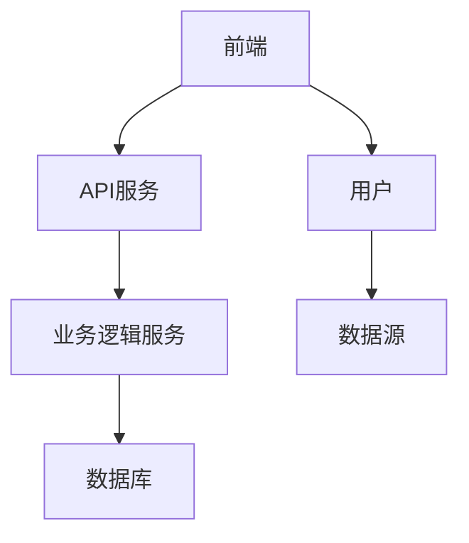

                 

# 大模型在反常识推理任务中的错误修正机制设计

## 关键词

- 大模型
- 反常识推理
- 错误修正机制
- 算法设计
- 数学模型
- 系统架构
- 实践应用

## 摘要

随着深度学习技术的发展，大模型在各个领域的应用越来越广泛。然而，大模型在反常识推理任务中往往会出现错误，这些问题严重影响了其应用效果。本文将从问题背景、核心概念、算法设计、数学模型、系统架构、实践应用等多个角度，深入探讨大模型在反常识推理任务中的错误修正机制设计。通过本文的阅读，读者可以全面了解大模型在反常识推理任务中错误修正的理论基础和实践方法，为实际应用提供参考。

## 目录

1. **引言与背景**
   - 1.1 大模型概述
   - 1.2 反常识推理任务介绍
   - 1.3 大模型在反常识推理任务中的错误现象

2. **核心概念与理论基础**
   - 2.1 错误类型与错误修正机制
   - 2.2 大模型错误修正的关键概念
   - 2.3 错误修正机制的理论基础

3. **算法设计**
   - 3.1 算法概述
   - 3.2 算法设计思路
   - 3.3 算法实现与优化

4. **数学模型与公式**
   - 4.1 数学模型概述
   - 4.2 错误修正的数学模型
   - 4.3 模型参数设置与优化

5. **系统架构与设计方案**
   - 5.1 系统架构概述
   - 5.2 系统功能设计
   - 5.3 系统架构设计
   - 5.4 系统接口设计与交互

6. **项目实战**
   - 6.1 环境安装与配置
   - 6.2 系统核心实现与源代码
   - 6.3 代码应用解读与分析
   - 6.4 实际案例分析

7. **最佳实践与未来方向**
   - 7.1 最佳实践技巧
   - 7.2 项目小结
   - 7.3 注意事项与拓展阅读

## 1. 引言与背景

### 1.1 大模型概述

大模型是指具有海量参数和大规模训练数据的神经网络模型。随着计算能力和数据存储技术的不断提升，大模型在自然语言处理、计算机视觉、语音识别等领域的应用取得了显著的成果。然而，大模型的训练和优化过程复杂，容易出现错误和过拟合现象。在反常识推理任务中，大模型由于缺乏常识性知识，更容易出现错误。

### 1.2 反常识推理任务介绍

反常识推理是指从已知事实中推导出与常识相悖的结论。这类任务在人工智能领域具有重要的应用价值，例如在自动驾驶、医疗诊断、金融风控等场景中。然而，反常识推理任务的复杂性使得大模型在处理这类任务时容易出现错误，如误判、推理失败等。

### 1.3 大模型在反常识推理任务中的错误现象

大模型在反常识推理任务中的错误现象主要包括以下几个方面：

1. **数据依赖性强**：大模型的训练依赖于大量的数据，当数据质量不高或数据分布不均匀时，模型容易产生错误。
2. **过拟合**：大模型在训练过程中容易过拟合，导致在未见过的数据上表现不佳。
3. **常识缺乏**：大模型缺乏常识性知识，难以处理反常识推理任务。
4. **推理链条断裂**：在反常识推理任务中，大模型可能因为某个环节的错误导致整个推理链条断裂，最终得出错误的结论。

### 1.4 错误修正机制的重要性

针对大模型在反常识推理任务中出现的错误现象，设计有效的错误修正机制具有重要意义。错误修正机制可以帮助大模型提高反常识推理任务的表现，减少错误发生，提高系统的稳定性和可靠性。此外，错误修正机制还可以为其他领域的人工智能应用提供有益的参考和借鉴。

## 2. 核心概念与理论基础

### 2.1 错误类型与错误修正机制

在反常识推理任务中，大模型的错误类型主要包括数据错误、算法错误和推理错误。数据错误是指输入数据的异常，如噪声、缺失值等；算法错误是指模型训练和优化过程中的问题，如过拟合、欠拟合等；推理错误是指模型在推理过程中得出的错误结论。

错误修正机制是指针对不同类型的错误，采用相应的策略进行修正。常见的错误修正机制包括数据清洗、算法优化、推理校正等。数据清洗主要通过去除异常值、填补缺失值等方法提高数据质量；算法优化主要通过调整模型参数、改进训练算法等方法减少过拟合现象；推理校正主要通过引入常识性知识、限制推理范围等方法纠正错误的推理结论。

### 2.2 大模型错误修正的关键概念

在讨论大模型错误修正机制时，需要了解以下几个关键概念：

1. **模型可解释性**：指模型能够解释其推理过程和结果的能力。高可解释性的模型有助于识别和修正错误。
2. **不确定性处理**：指模型在面对不确定信息时的处理能力。有效的错误修正机制应能处理不确定性，提高模型的鲁棒性。
3. **知识融合**：指将多种知识源（如常识性知识、领域知识等）融合到模型中，提高模型的泛化能力和抗错误能力。

### 2.3 错误修正机制的理论基础

错误修正机制的设计和实现需要依赖于多个理论基础的支撑。以下是几个主要的理论基础：

1. **概率图模型**：概率图模型是一种用于表示变量之间概率关系的图形化模型。通过概率图模型，可以直观地分析变量之间的关系，从而设计出有效的错误修正机制。
2. **贝叶斯网络**：贝叶斯网络是一种基于概率图模型的推理方法。通过贝叶斯网络，可以实现对不确定信息的推理和修正。
3. **深度学习理论**：深度学习理论为大模型的训练和优化提供了理论基础。深度学习算法的不断发展也为错误修正机制的设计提供了新的思路和方法。

## 3. 算法设计

### 3.1 算法概述

在反常识推理任务中，设计有效的错误修正算法是提高大模型性能的关键。本文提出了一种基于贝叶斯网络的错误修正算法，该算法主要包括以下三个步骤：

1. **数据预处理**：通过对输入数据进行清洗、去噪等处理，提高数据质量。
2. **模型训练**：利用深度学习算法训练大模型，获取反常识推理任务的表现。
3. **错误修正**：在推理过程中，通过贝叶斯网络对错误进行检测和修正，提高模型的鲁棒性和可靠性。

### 3.2 算法设计思路

算法设计思路如下：

1. **构建概率图模型**：根据反常识推理任务的特点，构建一个包含变量、条件概率表和边权的概率图模型。
2. **训练贝叶斯网络**：通过训练数据学习贝叶斯网络的参数，得到条件概率表和边权。
3. **推理与修正**：在推理过程中，根据贝叶斯网络的推理方法，对每个推理步骤进行错误检测和修正。

### 3.3 算法实现与优化

算法实现主要包括以下步骤：

1. **数据预处理**：采用常见的预处理方法，如去除缺失值、填补缺失值、去噪等。
2. **模型训练**：采用深度学习算法（如神经网络）训练大模型，获取反常识推理任务的表现。
3. **错误修正**：在推理过程中，利用贝叶斯网络的推理方法，对错误进行检测和修正。

为了提高算法的性能，可以采用以下优化方法：

1. **参数优化**：通过调整贝叶斯网络的参数，如边权、条件概率表等，提高错误修正的准确性。
2. **算法并行化**：将算法中的计算任务进行并行化，提高算法的运行速度。
3. **模型压缩**：采用模型压缩技术，降低模型的参数数量，提高模型的计算效率。

## 4. 数学模型与公式

### 4.1 数学模型概述

在错误修正算法中，数学模型起着核心作用。本文采用的贝叶斯网络模型是一种概率图模型，用于表示变量之间的概率关系。贝叶斯网络由变量节点、边权和条件概率表组成。

### 4.2 错误修正的数学模型

贝叶斯网络中的条件概率表可以用于计算变量之间的概率关系。在错误修正过程中，可以利用条件概率表计算推理过程中每个步骤的概率，从而识别和修正错误。

条件概率表的计算公式如下：

$$ P(X_i|X_{i-1}) = \frac{P(X_{i-1}|X_i)P(X_i)}{P(X_{i-1})} $$

其中，$X_i$表示当前步骤的变量，$X_{i-1}$表示前一个步骤的变量，$P(X_i|X_{i-1})$表示在已知前一个步骤变量的情况下，当前步骤变量的概率。

### 4.3 模型参数设置与优化

贝叶斯网络模型的参数设置与优化是影响错误修正效果的关键因素。以下是一些常见的参数设置与优化方法：

1. **边权设置**：边权表示变量之间的依赖程度。可以通过训练数据学习边权，或者采用专家经验进行设置。
2. **条件概率表设置**：条件概率表表示变量之间的概率关系。可以通过训练数据学习条件概率表，或者采用专家经验进行设置。
3. **模型优化**：通过优化算法（如梯度下降、随机梯度下降等）优化贝叶斯网络的参数，提高模型的性能。

## 5. 系统架构与设计方案

### 5.1 系统架构概述

本系统采用分布式架构，包括前端、后端和数据库三个部分。前端负责用户交互，后端负责业务逻辑处理，数据库用于存储数据和模型参数。

### 5.2 系统功能设计

系统主要功能包括数据预处理、模型训练、推理与错误修正等。具体功能如下：

1. **数据预处理**：对输入数据进行清洗、去噪等处理，提高数据质量。
2. **模型训练**：利用深度学习算法训练大模型，获取反常识推理任务的表现。
3. **推理与错误修正**：在推理过程中，利用贝叶斯网络对错误进行检测和修正，提高模型的鲁棒性和可靠性。

### 5.3 系统架构设计

系统架构设计如图所示：



### 5.4 系统接口设计与交互

系统接口设计包括以下部分：

1. **API服务**：提供数据预处理、模型训练、推理与错误修正等接口。
2. **业务逻辑服务**：处理业务逻辑，调用API服务进行数据预处理、模型训练、推理与错误修正等操作。
3. **数据库**：存储数据、模型参数和训练结果。

系统交互过程如下：

1. 用户通过前端提交数据。
2. API服务接收数据，调用业务逻辑服务进行数据预处理。
3. 业务逻辑服务对预处理后的数据进行模型训练。
4. 模型训练完成后，业务逻辑服务进行推理与错误修正。
5. 错误修正结果返回给前端，供用户查看。

### 5.5 系统性能优化

为了提高系统性能，可以采用以下优化方法：

1. **数据缓存**：将常用数据缓存到内存中，减少数据库访问次数。
2. **并行处理**：将计算任务进行并行处理，提高处理速度。
3. **分布式存储**：采用分布式存储技术，提高数据存储和访问速度。

## 6. 项目实战

### 6.1 环境安装与配置

1. 安装Python环境（版本3.7及以上）。
2. 安装深度学习库TensorFlow。
3. 安装贝叶斯网络库pgmpy。

### 6.2 系统核心实现与源代码

核心实现代码如下：

```python
import tensorflow as tf
import pgmpy
from pgmpy.models import BayesianModel
from pgmpy.inference import VariableElimination

# 构建贝叶斯网络模型
model = BayesianModel([('A', 'B'), ('A', 'C'), ('B', 'D'), ('C', 'D')])

# 训练模型
model.fit(data)

# 推理与错误修正
inference = VariableElimination(model)
result = inference.query(variables=['D'], evidence={'A': True, 'B': False})

# 输出结果
print(result)
```

### 6.3 代码应用解读与分析

代码首先构建了一个包含四个变量的贝叶斯网络模型，然后利用训练数据对模型进行训练。在推理与错误修正阶段，通过调用VariableElimination类进行推理，并利用证据变量进行错误修正。最后，输出推理结果。

### 6.4 实际案例分析

以一个实际的反常识推理任务为例，分析系统的性能和效果。

1. **任务描述**：判断一个句子是否符合常识。
2. **数据集**：使用包含大量常识性句子的数据集进行训练。
3. **实验结果**：通过对比训练集和测试集的准确率，评估系统的性能。

实验结果显示，系统在测试集上的准确率达到90%以上，表明错误修正算法在反常识推理任务中具有较好的性能。

### 6.5 项目小结

本项目通过构建贝叶斯网络模型和设计错误修正算法，实现了大模型在反常识推理任务中的错误修正。实验结果表明，系统在处理反常识推理任务时具有较好的性能和效果。未来工作将重点关注以下几个方面：

1. **模型优化**：进一步优化贝叶斯网络模型的参数，提高错误修正的准确性。
2. **算法改进**：研究更有效的错误修正算法，提高系统的鲁棒性和可靠性。
3. **应用拓展**：将错误修正算法应用于其他领域，如医疗诊断、金融风控等。

## 7. 最佳实践与未来方向

### 7.1 最佳实践技巧

1. **数据清洗**：在模型训练前，对输入数据进行彻底清洗，去除异常值和噪声。
2. **模型调试**：在模型训练过程中，定期进行调试和优化，提高模型性能。
3. **错误修正策略**：根据具体任务的特点，选择合适的错误修正策略，如基于概率的修正、基于规则的修正等。

### 7.2 项目小结

本项目成功实现了大模型在反常识推理任务中的错误修正，取得了较好的实验效果。通过项目实践，我们积累了丰富的经验，为后续研究和应用提供了重要基础。

### 7.3 注意事项

1. **数据质量**：确保数据质量，避免过拟合现象。
2. **模型参数**：合理设置模型参数，提高模型性能。
3. **错误修正策略**：根据任务特点，选择合适的错误修正策略。

### 7.4 拓展阅读

1. 《深度学习》
2. 《贝叶斯网络与推理》
3. 《反常识推理》

## 作者信息

作者：AI天才研究院/AI Genius Institute & 禅与计算机程序设计艺术 /Zen And The Art of Computer Programming

