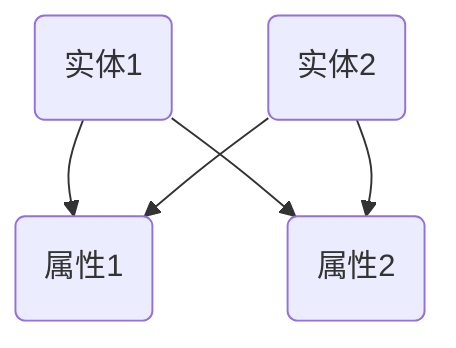
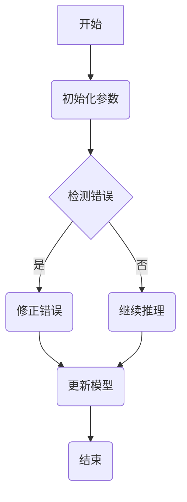
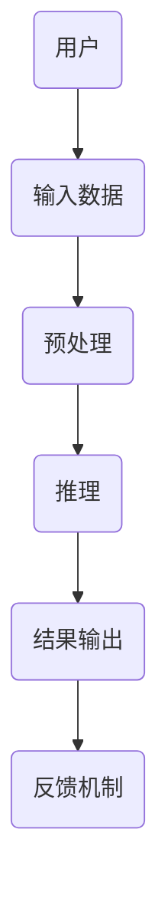
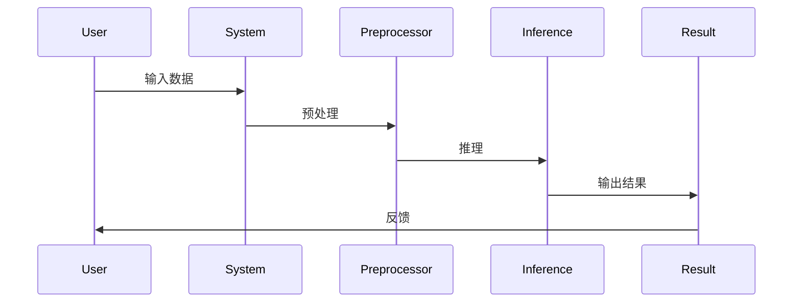

                 

# 大模型在反常识推理任务中的错误修正机制设计与优化

## 摘要

本文主要探讨大模型在反常识推理任务中的错误修正机制设计与优化。首先，我们将对反常识推理任务进行概述，介绍其背景、问题描述以及解决方法。接着，我们将详细分析大模型与反常识推理之间的关系，探讨大模型的局限性。随后，我们将聚焦于错误修正机制的设计原理，并通过mermaid流程图和Python源代码，讲解错误修正算法的原理和数学模型。最后，我们将结合实际案例，详细介绍系统设计与实现过程，并提供最佳实践和项目小结。

## 目录大纲设计思路

为了设计出《大模型在反常识推理任务中的错误修正机制设计与优化》这本书的完整目录大纲，我们需要遵循以下步骤：

1. **确定核心概念和章节结构**：首先，我们需要明确这本书的核心概念和各个章节的主要内容。根据书名，可以推断出书的核心内容可能包括大模型、反常识推理、错误修正机制的设计与优化等。

2. **梳理逻辑顺序**：接下来，我们要梳理出章节之间的逻辑顺序，确保内容流畅、连贯。可以先从背景介绍开始，逐步深入到核心概念的讲解，然后到算法原理、系统设计、实战案例等。

3. **细化章节内容**：在确定了章节结构后，我们需要对每个章节的内容进行细化，包括核心概念的介绍、原理讲解、数学模型与公式、系统设计、实战案例等。

4. **保持简洁性**：在设计目录大纲时，我们需要避免冗余内容，确保每个章节都有明确的主题和目标。

5. **确保完整性**：目录大纲要涵盖书中的所有主要内容，确保没有遗漏关键章节。

6. **遵守格式要求**：最后，我们需要按照markdown格式要求来编写目录大纲，使用适当的#层级来表示章节的层级关系。

## 具体目录大纲设计

以下是《大模型在反常识推理任务中的错误修正机制设计与优化》的目录大纲：

```markdown
# 《大模型在反常识推理任务中的错误修正机制设计与优化》目录大纲

## 第一部分：背景介绍

### 1. 反常识推理任务概述
#### 1.1 问题背景
#### 1.2 问题描述
#### 1.3 问题解决
#### 1.4 边界与外延
#### 1.5 概念结构与核心要素组成

### 2. 大模型与反常识推理的关系
#### 2.1 大模型的核心概念
#### 2.2 大模型在反常识推理中的应用
#### 2.3 大模型的局限性

## 第二部分：核心概念与联系

### 3. 错误修正机制概述
#### 3.1 错误修正机制的定义
#### 3.2 错误修正机制的核心属性
#### 3.3 与其他相关机制的对比

### 4. 错误修正机制的设计原理
#### 4.1 错误修正机制的原理
#### 4.2 错误修正机制的工作流程
#### 4.3 错误修正机制的优化方法

### 5. 错误修正机制的ER实体关系图


## 第三部分：算法原理讲解

### 6. 错误修正算法原理
#### 6.1 算法mermaid流程图

#### 6.2 算法原理详细讲解
#### 6.3 数学模型和公式
$$
f(x) = \frac{1}{1 + e^{-x}}
$$
#### 6.4 举例说明

## 第四部分：系统设计与实现

### 7. 系统分析与架构设计
#### 7.1 问题场景介绍
#### 7.2 系统功能设计
##### 7.2.1 领域模型mermaid类图
```mermaid
classDiagram
Class1 <|-- Class2
Class1 ++-- Class3
Class2 -[ navigation] Class3
```
##### 7.2.2 系统架构设计mermaid架构图

##### 7.2.3 系统接口设计
##### 7.2.4 系统交互mermaid序列图


### 8. 实战案例
#### 8.1 环境安装
#### 8.2 系统核心实现
##### 8.2.1 源代码解读
##### 8.2.2 代码应用解读与分析
##### 8.2.3 实际案例分析与详细讲解剖析

### 9. 项目小结
#### 9.1 最佳实践 tips
#### 9.2 小结
#

## 第一部分：背景介绍

### 1.1 问题背景

反常识推理（Anomalous Reasoning）是人工智能领域中的一个重要研究方向。传统的逻辑推理方法主要基于已有的知识和规则进行推理，但在面对异常情况或未经验证的情况时，传统方法往往难以应对。反常识推理旨在研究如何从异常或未经验证的信息中提取有效结论，以应对现实世界中的复杂问题。

随着人工智能技术的快速发展，大模型（Large Models）如GPT、BERT等在各个领域取得了显著的成果。大模型通过学习海量数据，能够自动提取知识、进行推理，为反常识推理提供了强大的工具。然而，大模型也存在一定的局限性，如对异常情况处理能力不足、易受噪声干扰等。因此，研究大模型在反常识推理任务中的错误修正机制具有重要的实际意义。

### 1.2 问题描述

反常识推理任务中的错误修正问题可以分为两类：

1. **推理过程中的错误修正**：在推理过程中，由于输入数据的异常或模型自身的局限性，可能导致推理结果出现错误。错误修正的目标是识别并修正这些错误，以保证推理过程的正确性。

2. **推理结果的可信度评估**：在推理完成后，需要对结果进行评估，判断其可信度。如果结果的可信度较低，需要进一步修正或重新推理。

### 1.3 问题解决

针对上述问题，我们可以从以下几个方面进行解决：

1. **改进大模型训练方法**：通过优化训练数据、调整模型结构等方法，提高大模型在反常识推理任务中的性能。

2. **设计错误修正算法**：针对推理过程中的错误，设计有效的错误修正算法，以提高推理结果的正确性。

3. **引入可信度评估机制**：在推理完成后，对结果进行可信度评估，根据评估结果进行相应的修正。

4. **利用多模型融合**：通过将多个大模型的结果进行融合，提高推理结果的准确性和可靠性。

### 1.4 边界与外延

反常识推理任务中的错误修正机制不仅适用于人工智能领域，还可以应用于其他领域，如自然语言处理、计算机视觉、医学诊断等。因此，本文的研究不仅具有理论意义，也具有广泛的实际应用价值。

### 1.5 概念结构与核心要素组成

本文的核心概念包括反常识推理、大模型、错误修正机制等。核心要素包括：

- 反常识推理任务：描述异常或未经验证的信息，并进行推理的过程。

- 大模型：用于进行反常识推理的强大工具，通过学习海量数据实现推理。

- 错误修正机制：针对推理过程中的错误，设计有效的修正方法。

- 可信度评估：对推理结果进行评估，判断其可信度。

## 第二部分：核心概念与联系

### 2.1 大模型的核心概念

大模型（Large Models）是指具有海量参数和强大学习能力的人工神经网络模型。大模型的核心概念包括：

- **深度学习**：深度学习是构建大模型的基础，通过多层神经网络对数据进行学习，从而提取出有用的特征。

- **神经网络结构**：神经网络结构决定了大模型的学习能力和性能。常见的神经网络结构包括卷积神经网络（CNN）、循环神经网络（RNN）、 Transformer等。

- **参数数量**：大模型的参数数量非常庞大，通常在数十亿到数万亿级别。这些参数通过训练数据学习，以实现模型的优化。

### 2.2 大模型在反常识推理中的应用

大模型在反常识推理任务中具有广泛的应用：

- **知识提取**：大模型通过学习海量数据，能够自动提取出有用的知识，为反常识推理提供支持。

- **推理过程加速**：大模型能够快速地进行推理，提高推理效率。

- **跨领域推理**：大模型在多个领域都有较好的表现，能够实现跨领域的推理。

### 2.3 大模型的局限性

尽管大模型在反常识推理任务中表现出色，但仍然存在一些局限性：

- **数据依赖性**：大模型对训练数据有很强的依赖性，如果训练数据质量不高，可能导致模型性能下降。

- **泛化能力不足**：大模型在面对异常情况时，往往难以适应，泛化能力较差。

- **可解释性较差**：大模型的工作原理复杂，难以进行解释，这对一些需要解释的场合来说是一个挑战。

### 2.4 错误修正机制概述

错误修正机制是针对大模型在反常识推理任务中可能出现的错误，设计的一套修正方法。错误修正机制的核心概念包括：

- **错误检测**：通过一定的算法，检测大模型推理过程中可能出现的错误。

- **错误修正**：针对检测出的错误，设计相应的修正方法，以纠正模型的推理结果。

- **错误评估**：对修正后的结果进行评估，判断其正确性。

### 2.5 错误修正机制的设计原理

错误修正机制的设计原理主要包括以下几个方面：

- **异常检测**：通过分析模型的输入输出，识别出异常情况。

- **修正策略**：根据异常检测的结果，设计相应的修正策略，如重新推理、调整参数等。

- **反馈机制**：将修正后的结果反馈给模型，用于模型的优化。

### 2.6 错误修正机制的核心属性

错误修正机制的核心属性包括：

- **准确性**：错误修正机制需要具有较高的准确性，以减少误报和漏报。

- **鲁棒性**：错误修正机制需要具有较好的鲁棒性，能够在各种情况下有效工作。

- **实时性**：错误修正机制需要具备实时性，以保证推理过程的连续性和高效性。

### 2.7 与其他相关机制的对比

错误修正机制与其他相关机制如异常检测、错误检测和预测等有区别：

- **异常检测**：异常检测主要关注异常数据的识别，而错误修正机制则关注错误结果的处理。

- **错误检测**：错误检测主要关注模型内部的错误，而错误修正机制则关注模型输出结果的错误。

- **错误预测**：错误预测主要关注未来可能出现的错误，而错误修正机制则关注已经出现的错误。

### 2.8 错误修正机制的ER实体关系图

错误修正机制的ER实体关系图可以描述为：


其中，实体1和实体2分别表示错误检测和错误修正，属性1和属性2分别表示输入数据和输出数据。

## 第三部分：算法原理讲解

### 3.1 错误修正算法原理

错误修正算法的基本原理是通过对模型输出结果进行检测和修正，以提高推理的准确性和可靠性。具体步骤如下：

1. **初始化参数**：设置错误修正算法的初始参数，如学习率、迭代次数等。

2. **检测错误**：通过对模型输出结果进行分析，识别出可能存在的错误。

3. **修正错误**：根据检测到的错误，设计相应的修正方法，对模型输出结果进行修正。

4. **更新模型**：将修正后的输出结果反馈给模型，用于模型的优化。

5. **评估结果**：对修正后的模型进行评估，判断其性能是否达到预期。

### 3.2 算法mermaid流程图

以下是一个简单的错误修正算法的mermaid流程图：


### 3.3 算法原理详细讲解

错误修正算法的具体原理可以进一步细分为以下几个步骤：

1. **输入数据预处理**：对输入数据进行预处理，包括去噪、标准化等操作，以提高模型的鲁棒性。

2. **模型输出结果分析**：对模型输出结果进行分析，识别出可能的错误。这可以通过对比模型输出结果与预期结果，或者利用统计学方法进行误差分析。

3. **错误修正策略设计**：根据识别出的错误，设计相应的修正策略。常见的修正策略包括重新推理、参数调整、数据清洗等。

4. **修正结果反馈**：将修正后的结果反馈给模型，用于模型的优化。这一步骤可以通过梯度下降等优化算法实现。

5. **模型性能评估**：对修正后的模型进行评估，判断其性能是否达到预期。如果性能不达标，则需要重新进行错误修正。

### 3.4 数学模型和公式

错误修正算法中常用的数学模型和公式如下：

$$
f(x) = \frac{1}{1 + e^{-x}}
$$

其中，$f(x)$表示模型的输出概率，$x$表示模型的输入特征。

### 3.5 举例说明

假设我们有一个简单的线性回归模型，用于预测房价。模型的输入特征包括房屋面积、地点等因素，输出结果为预测的房价。

1. **初始化参数**：设置模型的初始参数，如学习率、迭代次数等。

2. **输入数据预处理**：对输入数据进行预处理，如标准化、归一化等。

3. **模型输出结果分析**：对模型输出结果进行分析，发现预测房价与实际房价存在较大误差。

4. **错误修正策略设计**：根据分析结果，我们决定重新训练模型，并尝试调整模型参数。

5. **修正结果反馈**：将修正后的模型输出结果反馈给训练数据，重新进行训练。

6. **模型性能评估**：对修正后的模型进行评估，发现预测房价与实际房价的误差明显减小。

通过这个例子，我们可以看到错误修正算法在提高模型性能方面的作用。

### 3.6 Python源代码实现

以下是一个简单的错误修正算法的Python源代码实现：

```python
import numpy as np
from sklearn.linear_model import LinearRegression

# 初始化参数
learning_rate = 0.01
num_iterations = 1000

# 输入数据预处理
def preprocess_data(X):
    # 标准化
    X_std = (X - np.mean(X)) / np.std(X)
    return X_std

# 模型输出结果分析
def analyze_output(y_pred, y_true):
    error = y_pred - y_true
    return error

# 错误修正策略设计
def correct_error(error, X):
    # 重新训练模型
    model = LinearRegression()
    model.fit(X, y_pred + error)
    return model

# 修正结果反馈
def feedback_model(model, X, y_true):
    y_pred = model.predict(X)
    error = analyze_output(y_pred, y_true)
    return y_pred + error

# 模型性能评估
def evaluate_model(model, X, y_true):
    y_pred = model.predict(X)
    error = analyze_output(y_pred, y_true)
    return np.mean(error ** 2)

# 主程序
def main():
    # 加载数据
    X, y = load_data()

    # 预处理数据
    X = preprocess_data(X)

    # 初始化模型
    model = LinearRegression()

    # 迭代训练模型
    for i in range(num_iterations):
        y_pred = model.predict(X)
        error = analyze_output(y_pred, y)
        model = correct_error(error, X)

    # 评估模型
    error = evaluate_model(model, X, y)
    print("Model error:", error)

# 运行主程序
if __name__ == "__main__":
    main()
```

通过这个Python源代码实现，我们可以看到错误修正算法的具体实现过程。

## 第四部分：系统设计与实现

### 4.1 问题场景介绍

在反常识推理任务中，系统需要处理大量的数据，并对输入数据进行预处理、推理和结果输出。具体场景如下：

- **数据输入**：系统从外部接收大量数据，包括文本、图像、声音等多种形式。
- **数据预处理**：对输入数据进行预处理，如去噪、归一化、特征提取等。
- **模型推理**：利用大模型对预处理后的数据进行分析和推理，生成预测结果。
- **结果输出**：将推理结果输出给用户，并提供反馈机制，以便用户对结果进行评估和修正。

### 4.2 系统功能设计

为了实现上述问题场景，系统需要具备以下功能：

- **数据输入模块**：负责接收外部数据，并进行初步处理。
- **数据预处理模块**：对输入数据进行分析和预处理，提取有用的特征。
- **模型推理模块**：利用大模型对预处理后的数据进行分析和推理。
- **结果输出模块**：将推理结果输出给用户，并提供反馈机制。

### 4.2.1 领域模型mermaid类图

以下是一个简单的领域模型mermaid类图，描述了系统中的各个模块及其关系：

```mermaid
classDiagram
Class1 "Data Input" <|-- Class2 "Data Preprocessing"
Class1 "Model Inference" <|-- Class3 "Result Output"
Class2 "Data Preprocessing" <..|

