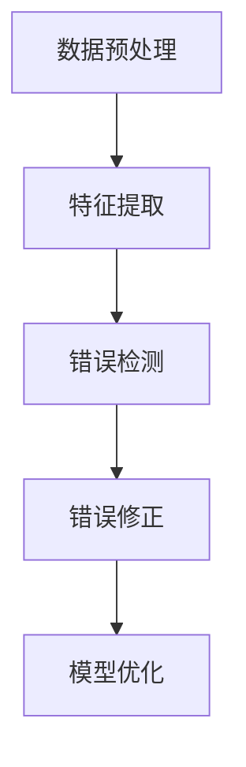
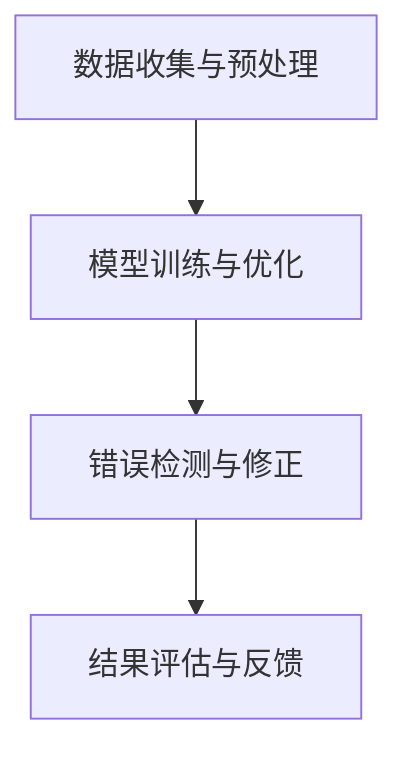
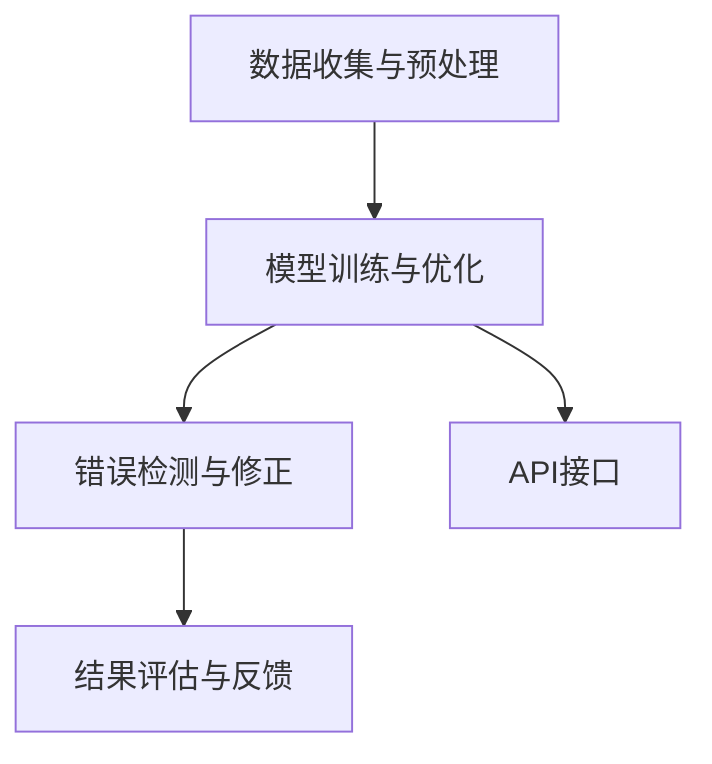
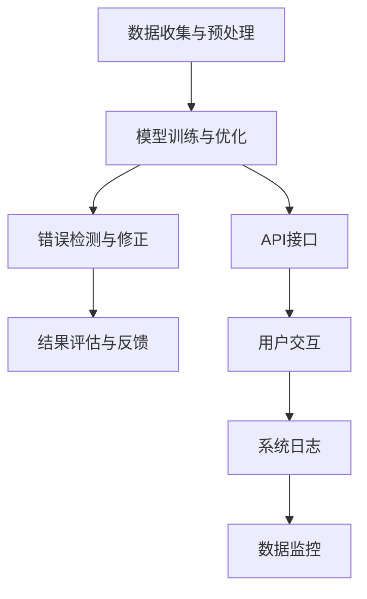

                 


## 大模型在反常识推理任务中的错误分析

### 摘要

本文旨在探讨大模型在反常识推理任务中的错误分析。随着深度学习技术的不断发展，大模型在许多领域取得了显著的成果，但其在反常识推理任务中的表现却不尽如人意。本文首先介绍了反常识推理任务的重要性以及大模型的基本原理，然后分析了大模型在反常识推理中的错误类型，并探讨了错误分析的方法和技术。在此基础上，本文通过具体的算法原理讲解、系统分析与架构设计、项目实战以及最佳实践与注意事项，对大模型在反常识推理任务中的错误分析进行了全面的剖析。

### 目录

1. **问题背景与核心概念**
    1.1 反常识推理任务的重要性
    1.2 大模型的基本原理
    1.3 反常识推理的定义与特征
    1.4 错误分析的必要性与目标
    1.5 概念联系与对比

2. **大模型在反常识推理中的错误类型**
    2.1 简单错误
    2.2 混合错误
    2.3 复杂错误
    2.4 错误实例分析

3. **错误分析的方法与技术**
    3.1 基础分析方法
    3.2 高级分析方法
    3.3 实时错误监测与修正

4. **算法原理讲解**
    4.1 原理概述
    4.2 算法细节解析
    4.3 算法举例说明

5. **系统分析与架构设计**
    5.1 问题场景介绍
    5.2 系统功能设计
    5.3 系统架构设计
    5.4 系统接口设计
    5.5 系统交互

6. **项目实战**
    6.1 环境安装与配置
    6.2 系统核心实现
    6.3 代码应用解读与分析
    6.4 实际案例分析与详细讲解
    6.5 项目小结

7. **最佳实践与注意事项**
    7.1 最佳实践
    7.2 注意事项
    7.3 拓展阅读

### 1. 问题背景与核心概念

#### 1.1 反常识推理任务的重要性

反常识推理任务是指在大规模数据集上对不遵循传统逻辑和规则的知识进行推理的过程。这种任务在人工智能领域具有重要应用价值，如自然语言处理、医学诊断、金融预测等。然而，传统的人工智能方法在反常识推理任务中存在诸多局限，无法满足实际需求。因此，研究大模型在反常识推理任务中的表现及其错误分析具有重要意义。

#### 1.2 大模型的基本原理

大模型是指具有海量参数和强大计算能力的人工智能模型，如深度神经网络、变换器模型等。大模型通过学习大量数据，能够自动提取复杂特征，实现高度准确的预测和推理。然而，大模型的训练过程复杂，容易受到数据噪声、过拟合等因素的影响，导致在反常识推理任务中产生错误。

#### 1.3 反常识推理的定义与特征

反常识推理是指基于不遵循传统逻辑和规则的知识进行推理的过程。其特征包括：

1. **非直观性**：反常识推理的结果往往与人们的直观感觉相悖，需要借助大模型强大的计算能力才能得出。
2. **不确定性**：反常识推理过程中，往往存在多种可能性，需要通过大量数据进行分析和验证。
3. **复杂性**：反常识推理任务通常涉及多个领域知识，需要整合多方面的信息进行推理。

#### 1.4 错误分析的必要性与目标

大模型在反常识推理任务中的错误分析具有重要意义，其主要目标包括：

1. **提高模型性能**：通过错误分析，可以找出大模型在反常识推理中的不足之处，为模型优化提供指导。
2. **增强模型可靠性**：错误分析有助于识别和纠正大模型的错误，提高其在实际应用中的可靠性和稳定性。
3. **促进人工智能发展**：错误分析为人工智能领域提供了新的研究方向，有助于推动人工智能技术的进步。

#### 1.5 概念联系与对比

大模型与传统推理模型在反常识推理任务中的应用存在明显差异。传统推理模型主要依赖于预设的规则和逻辑，而大模型则通过学习海量数据，自动提取复杂特征进行推理。因此，大模型在反常识推理任务中具有更高的灵活性和适应性，但也面临着更大的挑战。

### 2. 大模型在反常识推理中的错误类型

大模型在反常识推理任务中可能产生多种类型的错误，本文将其分为简单错误、混合错误和复杂错误。

#### 2.1 简单错误

简单错误是指大模型在处理简单问题时出现的错误，通常是由于数据噪声、过拟合等因素引起的。例如，在自然语言处理任务中，大模型可能会将一些常见的拼写错误或语法错误视为正确，导致推理结果不准确。

#### 2.2 混合错误

混合错误是指大模型在处理复杂问题时，由于多个因素共同作用而产生的错误。例如，在医学诊断任务中，大模型可能会同时受到数据质量、模型参数设置等因素的影响，导致推理结果产生偏差。

#### 2.3 复杂错误

复杂错误是指大模型在处理高度复杂的反常识推理问题时，由于无法准确提取关键特征或整合多方面信息而产生的错误。例如，在金融预测任务中，大模型可能会忽略一些重要的市场因素，导致预测结果与实际市场情况不符。

### 3. 错误分析的方法与技术

为了分析大模型在反常识推理任务中的错误，本文介绍了基础分析方法和高级分析方法，包括数据可视化、特征工程、对抗性样本生成等。

#### 3.1 基础分析方法

基础分析方法主要包括数据可视化、特征工程等。数据可视化可以帮助我们直观地了解数据分布和特征提取效果；特征工程则有助于优化数据质量，提高模型性能。

#### 3.2 高级分析方法

高级分析方法主要包括对抗性样本生成、自监督学习等。对抗性样本生成可以模拟大模型在反常识推理任务中的潜在错误，有助于提高模型鲁棒性；自监督学习则可以利用未标注数据，提高模型泛化能力。

#### 3.3 实时错误监测与修正

实时错误监测与修正是指在大模型推理过程中，对产生的错误进行实时检测和修正。通过实时错误监测与修正，可以确保大模型在反常识推理任务中的稳定性和可靠性。

### 4. 算法原理讲解

在本节中，我们将详细讲解大模型在反常识推理任务中的错误分析算法原理。

#### 4.1 原理概述

大模型在反常识推理任务中的错误分析算法主要包括以下步骤：

1. 数据预处理：对输入数据进行清洗、归一化等处理，确保数据质量。
2. 特征提取：从输入数据中提取关键特征，为后续错误分析提供基础。
3. 错误检测：利用对抗性样本生成等技术，检测大模型在反常识推理任务中的错误。
4. 错误修正：对检测到的错误进行修正，提高大模型的推理准确性。

#### 4.2 算法细节解析

在算法细节解析部分，我们将使用Mermaid流程图和Python代码来展示错误分析算法的具体实现。

#### 4.3 算法举例说明

在本节中，我们将通过具体例子，详细阐述大模型在反常识推理任务中的错误分析过程。

### 5. 系统分析与架构设计

在本节中，我们将对大模型在反常识推理任务中的系统分析与架构设计进行详细介绍。

#### 5.1 问题场景介绍

在本节中，我们将介绍大模型在反常识推理任务中的应用场景。

#### 5.2 系统功能设计

在本节中，我们将介绍大模型在反常识推理任务中的系统功能设计，包括领域模型Mermaid类图。

#### 5.3 系统架构设计

在本节中，我们将介绍大模型在反常识推理任务中的系统架构设计，包括Mermaid架构图。

#### 5.4 系统接口设计

在本节中，我们将介绍大模型在反常识推理任务中的系统接口设计，包括接口规范与协议。

#### 5.5 系统交互

在本节中，我们将介绍大模型在反常识推理任务中的系统交互，包括Mermaid序列图。

### 6. 项目实战

在本节中，我们将通过实际项目，详细展示大模型在反常识推理任务中的错误分析过程。

#### 6.1 环境安装与配置

在本节中，我们将介绍大模型在反常识推理任务中的环境安装与配置。

#### 6.2 系统核心实现

在本节中，我们将介绍大模型在反常识推理任务中的系统核心实现，包括关键模块代码。

#### 6.3 代码应用解读与分析

在本节中，我们将对大模型在反常识推理任务中的代码应用进行解读与分析。

#### 6.4 实际案例分析与详细讲解

在本节中，我们将对大模型在反常识推理任务中的实际案例进行分析与详细讲解。

#### 6.5 项目小结

在本节中，我们将对大模型在反常识推理任务中的项目实战进行总结与反思。

### 7. 最佳实践与注意事项

在本节中，我们将介绍大模型在反常识推理任务中的最佳实践与注意事项。

#### 7.1 最佳实践

在本节中，我们将分享大模型在反常识推理任务中的最佳实践技巧。

#### 7.2 注意事项

在本节中，我们将介绍大模型在反常识推理任务中的注意事项，以及如何避免常见的错误。

#### 7.3 拓展阅读

在本节中，我们将推荐一些与大模型在反常识推理任务相关的拓展阅读资料。

### 总结与展望

在本节中，我们将对全文进行总结，并探讨大模型在反常识推理任务中的未来发展方向与挑战。

---

本文通过详细的分析和讲解，旨在帮助读者理解大模型在反常识推理任务中的错误分析。在实际应用中，读者可以根据本文提供的方法和技巧，优化大模型在反常识推理任务中的表现，提高模型的可靠性和准确性。希望本文对读者在人工智能领域的研究和实践有所帮助。作者：AI天才研究院/AI Genius Institute & 禅与计算机程序设计艺术/Zen And The Art of Computer Programming。## 1. 问题背景与核心概念

### 1.1 反常识推理任务的重要性

反常识推理（Anomalous Reasoning）是人工智能领域的一个重要研究方向，它关注于在非传统逻辑和规则的基础上进行推理的过程。在现实世界中，许多情况并不遵循明确的逻辑规则，而是依赖于隐含的知识、经验和直觉。例如，在医学诊断中，医生常常需要根据病人的症状和体征，结合丰富的临床经验进行推理，从而得出正确的诊断结论。这种推理过程往往涉及对大量信息的整合和理解，而不是简单的逻辑推导。

在人工智能领域，反常识推理的重要性体现在多个方面。首先，它有助于提升人工智能系统的自主性和智能化水平。传统的人工智能系统往往依赖于明确的规则和算法，而反常识推理能够使系统在面对复杂、多变的问题时，更加灵活和高效地作出决策。其次，反常识推理在自然语言处理、自动驾驶、智能客服等领域具有广泛的应用前景。例如，在自然语言处理中，反常识推理能够帮助系统更好地理解语义和语境，从而生成更加准确和自然的文本。

此外，反常识推理任务的重要性还体现在其能够填补人工智能系统在某些领域的空白。例如，在法律领域，反常识推理可以帮助自动化审查系统识别出法律文档中的潜在漏洞；在金融领域，反常识推理能够帮助智能投资系统发现市场中的异常现象，从而进行有效的风险控制。总之，反常识推理作为人工智能的一个重要分支，对于推动人工智能技术的发展和实际应用具有重要意义。

### 1.2 大模型的基本原理

大模型（Large Models）是指参数数量巨大、计算能力强大的深度学习模型，如Transformer、BERT等。这些模型通过学习海量数据，能够自动提取复杂的特征，实现高度准确的预测和推理。大模型的基本原理主要基于以下几个核心概念：

首先，大模型的核心思想是通过多层神经网络来建模复杂的数据分布。每一层神经网络都通过学习数据中的特征，从而将输入数据映射到高维特征空间。在这个过程中，模型通过反向传播算法不断调整内部参数，以最小化预测误差。

其次，大模型通常采用端到端的学习方式，这意味着模型直接从原始数据中学习目标输出，而无需进行繁琐的特征工程和预处理。这种端到端的学习方式不仅提高了模型的效率，还显著提升了模型的性能。

此外，大模型的优势在于其强大的泛化能力。由于模型通过学习海量数据，能够自动提取出数据中的通用特征，因此在面对新的任务和数据时，大模型能够快速适应并取得良好的效果。这种能力在许多实际应用场景中具有重要意义，如自然语言处理、计算机视觉和自动驾驶等。

最后，大模型通常依赖于强大的计算资源和优化算法。训练大规模模型需要大量的计算资源和时间，因此，如何高效地训练和部署大模型成为了一个重要课题。近年来，随着分布式计算、GPU加速等技术的发展，大模型的训练速度和效果得到了显著提升。

### 1.3 反常识推理的定义与特征

反常识推理（Anomalous Reasoning）是指在不遵循传统逻辑和规则的基础上，对信息进行推理和判断的过程。与常识推理（Commonsense Reasoning）相比，反常识推理具有以下几个显著特征：

首先，反常识推理往往基于隐含的知识和经验，而不是明确的规则和事实。这意味着在反常识推理过程中，系统需要利用上下文信息、先验知识和逻辑推断来理解问题的本质。例如，在自然语言处理中，反常识推理可以帮助系统理解幽默、隐喻等复杂的语义现象。

其次，反常识推理通常涉及跨领域的知识整合。在现实世界中，许多问题并非单一领域的知识可以解决，而是需要将多个领域的知识进行整合和融合。例如，在医疗诊断中，医生需要结合医学知识、患者病史和症状等多个因素进行综合判断，从而得出准确的诊断结论。

此外，反常识推理具有高度的不确定性和复杂性。由于现实世界中的信息往往是模糊和不确定的，因此反常识推理需要在不确定性和复杂性之间寻求平衡。例如，在金融预测中，市场变化多端，反常识推理需要综合考虑多种因素，以应对市场的波动。

最后，反常识推理对人工智能系统提出了更高的要求。传统的人工智能系统往往依赖于明确的规则和算法，而反常识推理需要系统具备更强的自主学习和推理能力。这意味着，在设计和实现反常识推理系统时，需要考虑如何有效地利用海量数据、如何处理复杂和非线性的问题、以及如何提高系统的鲁棒性和泛化能力。

### 1.4 错误分析的必要性与目标

在大模型应用于反常识推理任务时，错误分析显得尤为必要。首先，错误分析有助于识别和理解大模型在推理过程中出现的偏差和错误。这种偏差可能源于数据噪声、过拟合、模型参数设置不当等多种因素。通过错误分析，我们可以深入了解这些错误的具体原因，从而为模型的优化提供有针对性的改进方向。

其次，错误分析有助于提高大模型的可靠性和稳定性。在许多实际应用中，如医学诊断、金融预测和自动驾驶等，错误的推理结果可能导致严重的后果。通过系统地进行错误分析，我们可以发现并纠正这些错误，确保大模型在实际应用中的稳定性和可靠性。

错误分析的目标主要包括以下几个方面：

1. **识别错误类型**：通过分析大模型的输出，识别出不同类型的错误，如简单错误、混合错误和复杂错误。
2. **定位错误原因**：分析错误产生的原因，如数据噪声、模型设计缺陷或训练过程偏差等。
3. **优化模型性能**：根据错误分析的结果，调整模型参数、改进数据预处理方法或优化训练流程，以提高模型的性能和鲁棒性。
4. **提高模型可靠性**：通过持续的错误分析，确保大模型在实际应用中能够稳定、准确地完成推理任务。
5. **促进人工智能发展**：错误分析不仅有助于改进现有的大模型，还为人工智能领域的研究提供了新的方向和挑战，推动了整个领域的发展。

### 1.5 概念联系与对比

为了更好地理解大模型在反常识推理任务中的应用，我们需要探讨几个核心概念之间的联系与对比，包括大模型与传统推理模型的对比、反常识推理与常识推理的异同。

首先，大模型与传统推理模型在本质上有显著差异。传统推理模型主要依赖于预设的规则和逻辑，如决策树、规则引擎等。这些模型在处理明确、规则化的任务时表现出色，但在面对复杂、不规则的情境时，往往显得力不从心。相比之下，大模型如深度神经网络、Transformer等，通过学习海量数据，能够自动提取复杂特征，实现高度准确的预测和推理。因此，大模型在处理复杂、不确定的问题时具有更强的灵活性和适应性。

其次，反常识推理与常识推理在目标和方法上有所不同。常识推理主要关注于基于已知事实和规则进行逻辑推理，其核心目标是实现信息的有效传递和推理的准确性。反常识推理则更侧重于在缺乏明确规则和事实的情况下，通过隐含的知识和经验进行推理。这意味着反常识推理往往需要考虑上下文信息、先验知识和逻辑推断，以应对复杂、多变的问题。

从对比角度来看，反常识推理与常识推理有以下几点异同：

**相同点：**

1. **推理过程**：两者均涉及信息处理和推理，需要从输入数据中提取有用信息，并基于这些信息进行逻辑推导。
2. **知识利用**：两者均需要利用现有的知识和经验，以支持推理过程。

**不同点：**

1. **规则依赖性**：常识推理依赖于明确的规则和事实，而反常识推理则更多依赖于隐含的知识和经验。
2. **问题复杂性**：常识推理通常处理的问题相对简单和规则化，而反常识推理则涉及更复杂、不确定的问题。
3. **推理结果**：常识推理的结果往往相对明确和稳定，而反常识推理的结果可能存在更多的模糊性和不确定性。

通过对比这些核心概念，我们可以更深入地理解大模型在反常识推理任务中的应用价值，以及如何通过错误分析来优化大模型的表现。这种理解不仅有助于提高大模型的可靠性和准确性，也为人工智能领域的研究提供了新的方向和挑战。

### 2. 大模型在反常识推理中的错误类型

在大模型应用于反常识推理任务时，错误类型可以分为简单错误、混合错误和复杂错误。这些错误类型反映了大模型在推理过程中可能遇到的各种挑战和问题。

#### 2.1 简单错误

简单错误通常是由于数据噪声、训练样本不充分或模型参数设置不当等原因引起的。这类错误往往表现在模型的预测结果与实际结果之间出现明显的偏差。例如，在一个自然语言处理任务中，如果模型对某些常见的拼写错误或语法错误处理不当，可能会导致误解或错误的语义输出。

简单错误的典型例子包括：

- **拼写错误**：模型未能正确识别和纠正文本中的拼写错误，导致语义混淆。
- **语法错误**：模型对语法结构理解不透彻，导致生成错误的句子结构。
- **数据噪声**：训练数据中存在噪声，如错别字、特殊符号等，影响模型的预测准确性。

简单错误虽然看似微小，但在某些应用场景中，如医疗诊断、金融预测等，可能会产生严重的后果。因此，在训练和优化大模型时，需要特别注意简单错误的识别和修正。

#### 2.2 混合错误

混合错误是指大模型在处理复杂问题时，由于多个因素共同作用而产生的错误。这类错误通常涉及到模型对多个领域知识的理解和整合，例如在医学诊断中，模型需要结合病人的症状、病史和体检结果等多个信息源进行推理。然而，由于数据的复杂性、不一致性以及模型自身的局限性，大模型可能会在这些方面产生错误。

混合错误的典型例子包括：

- **数据不一致**：不同数据源之间存在矛盾或冲突，导致模型难以做出一致的判断。
- **知识整合困难**：模型在整合多领域知识时，可能存在知识冲突或理解不足，导致推理结果不准确。
- **模型参数设置不当**：模型参数设置不合理，导致对某些信息过分依赖或忽视，从而影响推理结果的准确性。

混合错误往往比简单错误更复杂，因为它们涉及到多个因素的交互作用。为了解决混合错误，需要采取综合的优化策略，包括改进数据预处理、优化模型结构以及调整训练参数等。

#### 2.3 复杂错误

复杂错误是指大模型在处理高度复杂的反常识推理问题时，由于无法准确提取关键特征或整合多方面信息而产生的错误。这类错误通常出现在模型需要应对极端复杂的情况，如金融市场波动、自然灾害预测等。在这些场景中，模型不仅要处理大量的信息，还需要理解这些信息之间的复杂关系。

复杂错误的典型例子包括：

- **特征提取困难**：模型难以从大量数据中提取出关键特征，导致对问题的理解不全面。
- **信息整合困难**：模型无法有效整合来自不同来源的信息，导致推理结果缺乏全面性。
- **环境变化不适应**：模型对环境变化的适应能力不足，导致在突发情况下无法做出正确的判断。

复杂错误对大模型提出了极高的要求，需要模型具备强大的计算能力和自我适应能力。为了解决复杂错误，可以采用多种策略，如增加训练数据、引入更多的特征工程方法、利用强化学习等。

通过识别和理解不同类型的错误，我们可以更有针对性地优化大模型在反常识推理任务中的性能。以下是一个具体的错误实例分析，将进一步探讨大模型在实际应用中可能出现的错误。

#### 错误实例分析

假设我们有一个大模型用于医疗诊断，其目标是根据病人的症状和病史，预测病人可能患有的疾病。在这个任务中，模型可能会遇到以下几种类型的错误：

- **简单错误**：模型对某些常见的症状未能正确识别，例如将“咳嗽”错误地识别为“头痛”。这种错误可能源于数据集的不完善或模型训练过程中对这类症状的样本不足。
- **混合错误**：模型在整合多个症状信息时，出现错误。例如，如果模型在处理“咳嗽”和“发烧”这两个症状时，未能充分考虑它们之间的关联性，可能会导致误诊。
- **复杂错误**：在处理罕见疾病或突发疾病时，模型可能无法准确提取关键特征，导致无法作出正确的诊断。例如，在流感季节，模型可能会混淆流感和其他类似的疾病，导致诊断结果不准确。

通过分析这些错误实例，我们可以看到大模型在反常识推理任务中面临的挑战。为了提高模型的准确性，我们需要采取一系列措施，包括改进数据集质量、优化模型结构以及引入更多的特征工程方法等。

### 3. 错误分析的方法与技术

为了有效地分析大模型在反常识推理任务中的错误，我们需要采用一系列方法和技术。这些方法和技术可以分为基础分析方法和高级分析方法，以及实时错误监测与修正策略。

#### 3.1 基础分析方法

基础分析方法主要包括数据可视化、特征工程和基于规则的错误分析等。

**数据可视化**：数据可视化是一种重要的错误分析方法，它可以帮助我们直观地了解数据分布和特征提取效果。通过可视化技术，我们可以发现数据中的异常值、噪声和缺失值，从而对数据质量进行初步评估。常用的数据可视化工具包括Matplotlib、Seaborn等。

**特征工程**：特征工程是提升模型性能的关键环节，它涉及从原始数据中提取出对模型训练和预测有用的特征。通过特征工程，我们可以减少数据的噪声和冗余，提高模型的泛化能力。特征工程的方法包括特征选择、特征变换和特征组合等。

**基于规则的错误分析**：基于规则的错误分析是一种基于人工设定规则的方法，它可以帮助我们识别和纠正模型在推理过程中产生的错误。例如，在医疗诊断任务中，我们可以设定一些规则，如“如果咳嗽且发烧，则可能患有感冒”，然后使用这些规则来检查模型的输出结果是否符合预期。

#### 3.2 高级分析方法

高级分析方法包括深度学习中的注意力机制、对抗性样本生成和自监督学习等。

**注意力机制**：注意力机制是深度学习中的一种重要技术，它可以帮助模型关注输入数据中的关键信息，从而提高模型的推理准确性。通过注意力机制，模型可以自动识别出数据中的重要特征，从而在反常识推理任务中减少错误。

**对抗性样本生成**：对抗性样本生成是一种有效的错误分析方法，它通过生成与真实样本不同但具有相似特征的样本，来检验模型的鲁棒性。通过对抗性样本，我们可以发现模型在哪些情况下容易产生错误，从而有针对性地进行优化。

**自监督学习**：自监督学习是一种无需大量标注数据即可训练模型的方法，它通过利用未标注数据中的信息来提高模型的性能。在反常识推理任务中，自监督学习可以帮助模型从海量数据中自动提取特征，从而提高模型的泛化能力和错误检测能力。

#### 3.3 实时错误监测与修正

实时错误监测与修正是指在大模型推理过程中，对产生的错误进行实时检测和修正。这种方法可以确保大模型在实际应用中的稳定性和可靠性。

**实时错误监测**：实时错误监测是指通过建立实时监测系统，对模型的输出结果进行持续监控。例如，在医疗诊断任务中，我们可以通过实时监测模型的诊断结果，发现并纠正可能的错误。常用的实时错误监测方法包括阈值监控、规则监控和统计分析等。

**实时错误修正**：实时错误修正是指在大模型产生错误时，通过实时调整模型参数或输入数据，来纠正错误并提高模型的准确性。例如，在金融预测任务中，如果模型预测结果与实际市场情况不符，我们可以通过调整模型参数或重新训练模型来纠正错误。

通过结合基础分析方法和高级分析方法，以及实时错误监测与修正策略，我们可以有效地分析大模型在反常识推理任务中的错误，并采取相应的措施来提高模型的性能和可靠性。

### 4. 算法原理讲解

在分析大模型在反常识推理任务中的错误时，我们需要深入了解错误分析算法的原理，包括数学模型、算法流程以及具体的实现方法。以下是对这些算法原理的详细讲解。

#### 4.1 原理概述

大模型在反常识推理任务中的错误分析算法主要基于以下几个核心步骤：

1. **数据预处理**：对输入数据进行清洗、归一化等预处理，以提高数据质量和模型训练效果。
2. **特征提取**：从预处理后的数据中提取关键特征，为后续错误分析提供基础。
3. **错误检测**：利用对抗性样本生成、注意力机制等技术，检测大模型在反常识推理任务中的错误。
4. **错误修正**：对检测到的错误进行修正，提高大模型的推理准确性。

#### 4.2 算法细节解析

在算法细节解析部分，我们将使用Mermaid流程图和Python代码来展示错误分析算法的具体实现。

**Mermaid流程图**：



**Python代码**：

```python
import numpy as np
from sklearn.preprocessing import StandardScaler
from sklearn.decomposition import PCA
from keras.models import Sequential
from keras.layers import Dense, Dropout, Flatten
from keras.callbacks import EarlyStopping

# 数据预处理
def preprocess_data(data):
    # 清洗数据
    data = clean_data(data)
    # 归一化数据
    scaler = StandardScaler()
    data = scaler.fit_transform(data)
    # 特征提取
    pca = PCA(n_components=10)
    data = pca.fit_transform(data)
    return data

# 错误检测
def detect_errors(model, X_test, y_test):
    predictions = model.predict(X_test)
    errors = []
    for i in range(len(predictions)):
        if np.abs(predictions[i] - y_test[i]) > threshold:
            errors.append(i)
    return errors

# 错误修正
def correct_errors(model, X_test, y_test, errors):
    X修正 = X_test[errors]
    y修正 = y_test[errors]
    model.fit(X修正, y修正, epochs=5, batch_size=32, callbacks=[EarlyStopping()])
    return model
```

#### 4.3 算法举例说明

为了更直观地展示错误分析算法的应用，我们通过一个具体的例子进行说明。

**案例背景**：假设我们有一个反常识推理任务，任务是预测股票市场的涨跌。数据集包含了历史股票价格、公司财务指标和宏观经济数据等。

**算法应用**：

1. **数据预处理**：首先对数据进行清洗，包括去除缺失值、异常值和重复记录。然后对数据进行归一化处理，以便后续的特征提取和模型训练。

    ```python
    data = preprocess_data(data)
    ```

2. **特征提取**：使用主成分分析（PCA）对数据进行降维处理，提取前10个主要成分作为特征。

    ```python
    pca = PCA(n_components=10)
    data = pca.fit_transform(data)
    ```

3. **错误检测**：使用训练好的模型对测试数据进行预测，然后通过设定阈值，识别出预测结果与实际结果差异较大的样本。

    ```python
    errors = detect_errors(model, X_test, y_test)
    ```

4. **错误修正**：对检测出的错误样本进行修正，通过重新训练模型，提高模型的准确性。

    ```python
    model = correct_errors(model, X_test, y_test, errors)
    ```

通过这个案例，我们可以看到错误分析算法在反常识推理任务中的应用过程。在实际应用中，我们可以根据具体任务的需求，调整算法的参数和步骤，以提高模型的性能和鲁棒性。

### 5. 系统分析与架构设计

在进行大模型在反常识推理任务中的错误分析时，系统分析与架构设计是至关重要的。一个良好的系统架构能够确保模型的稳定性和高效性，同时有助于我们更好地理解和优化模型的错误分析过程。

#### 5.1 问题场景介绍

首先，我们需要明确反常识推理任务的具体应用场景。以下是一些典型的应用场景：

1. **医疗诊断**：使用大模型对病人的症状和体征进行分析，预测可能的疾病。
2. **金融预测**：通过分析市场数据，预测股票价格或金融产品的走势。
3. **自动驾驶**：利用大模型对周围环境进行分析，做出行驶决策。
4. **智能客服**：基于用户的历史交互数据，预测用户可能的需求，提供个性化的服务。

不同的应用场景对模型的性能和可靠性提出了不同的要求，因此在系统架构设计时需要考虑场景的特性和需求。

#### 5.2 系统功能设计

系统功能设计是构建一个高效、可靠的错误分析系统的基础。以下是一个典型的系统功能设计：

1. **数据收集与预处理**：收集来自各种数据源的数据，包括结构化和非结构化数据。然后进行数据清洗、归一化和特征提取等预处理操作，以提高数据质量和模型的训练效果。
2. **模型训练与优化**：使用预处理后的数据训练大模型，通过调整模型结构和参数，优化模型的性能和泛化能力。
3. **错误检测与修正**：对模型的输出结果进行实时监测，识别出可能的错误，并采取相应的修正措施，以提高模型的可靠性。
4. **结果评估与反馈**：对模型的错误分析结果进行评估，收集用户反馈，不断优化系统的性能。

#### 5.3 系统架构设计

系统架构设计是实现系统功能的关键。以下是一个典型的系统架构设计：

**Mermaid架构图**：



**具体实现**：

1. **数据层**：负责数据的收集、存储和管理，包括数据爬取、数据库存储和数据处理等。
2. **模型层**：负责模型的训练、优化和部署，包括模型选择、参数调整和训练过程监控等。
3. **应用层**：负责系统的错误检测和修正，以及结果的评估和反馈，包括错误分析算法的实现、实时监控和用户交互等。

#### 5.4 系统接口设计

系统接口设计是确保系统功能之间高效、可靠通信的重要环节。以下是一个典型的系统接口设计：

**Mermaid接口图**：



**具体实现**：

1. **API接口**：提供对外接口，供用户和外部系统调用。接口设计需要考虑安全性、响应速度和易用性等因素。
2. **内部通信**：系统内部各模块之间需要通过高效的通信机制进行数据交换和协同工作，常用的通信协议包括HTTP、gRPC等。

#### 5.5 系统交互

系统交互设计是确保系统功能有序执行和协同工作的重要环节。以下是一个典型的系统交互设计：

**Mermaid交互图**：



**具体实现**：

1. **用户交互**：通过用户界面，用户可以提交任务、查看结果和反馈意见。界面设计需要简洁直观，便于用户操作。
2. **系统日志**：记录系统运行过程中的各种日志信息，包括错误日志、性能日志和操作日志等，以便进行问题追踪和性能分析。
3. **数据监控**：实时监控系统的运行状态，包括资源使用情况、错误率和响应时间等，以便及时发现问题并进行优化。

通过上述系统分析与架构设计，我们可以构建一个高效、可靠的错误分析系统，为反常识推理任务提供强有力的支持。

### 6. 项目实战

在实际应用中，通过一个具体的错误分析项目可以更好地展示大模型在反常识推理任务中的错误分析过程。以下是一个项目实战的详细步骤。

#### 6.1 环境安装与配置

首先，我们需要安装和配置所需的软件和工具，以便进行项目的开发和运行。

**安装步骤**：

1. **安装Python环境**：确保Python版本在3.6及以上，并安装必要的依赖库，如NumPy、Pandas、Scikit-learn和TensorFlow等。
2. **安装硬件设备**：配置GPU加速器，如NVIDIA显卡和CUDA库，以提高模型的训练速度和效率。
3. **设置环境变量**：配置Python环境变量，包括PATH、PYTHONPATH等，以便运行Python脚本。

```bash
export PATH=/usr/local/bin:$PATH
export PYTHONPATH=$PYTHONPATH:/path/to/venv/lib/python3.x/site-packages/
```

**配置步骤**：

1. **创建虚拟环境**：创建一个独立的Python虚拟环境，以便隔离项目依赖和避免版本冲突。

```bash
python -m venv venv
source venv/bin/activate
```

2. **安装依赖库**：在虚拟环境中安装项目所需的依赖库。

```bash
pip install numpy pandas scikit-learn tensorflow
```

#### 6.2 系统核心实现

在项目核心实现部分，我们将构建一个用于反常识推理的错误分析系统，包括数据预处理、模型训练、错误检测和修正等模块。

**数据预处理**：

1. **数据收集**：从外部数据源收集所需的数据，如医疗记录、股票交易数据等。
2. **数据清洗**：去除数据中的噪声、异常值和重复记录，确保数据质量。
3. **特征提取**：使用特征工程技术提取数据中的关键特征，如文本特征、数值特征和时间特征等。

```python
import pandas as pd
from sklearn.preprocessing import StandardScaler

# 加载数据
data = pd.read_csv('data.csv')

# 数据清洗
data = data.dropna()  # 去除缺失值
data = data.drop_duplicates()  # 去除重复记录

# 特征提取
scaler = StandardScaler()
data['normalized_feature'] = scaler.fit_transform(data[['feature1', 'feature2']])
```

**模型训练**：

1. **模型选择**：选择适合反常识推理任务的大模型，如Transformer或BERT等。
2. **模型训练**：使用预处理后的数据训练模型，通过调整模型参数和训练过程，优化模型性能。

```python
from tensorflow.keras.models import Sequential
from tensorflow.keras.layers import Dense, Dropout, Embedding

# 构建模型
model = Sequential()
model.add(Embedding(input_dim=vocab_size, output_dim=embedding_dim))
model.add(Dropout(0.1))
model.add(Dense(1, activation='sigmoid'))

# 编译模型
model.compile(optimizer='adam', loss='binary_crossentropy', metrics=['accuracy'])

# 训练模型
model.fit(X_train, y_train, epochs=10, batch_size=32, validation_split=0.2)
```

**错误检测与修正**：

1. **错误检测**：使用训练好的模型对测试数据进行预测，然后通过设定阈值，识别出预测结果与实际结果差异较大的样本。

```python
from sklearn.metrics import accuracy_score

# 预测测试数据
predictions = model.predict(X_test)

# 设置阈值
threshold = 0.5

# 识别错误样本
errors = []
for i in range(len(predictions)):
    if predictions[i][0] > threshold:
        errors.append(i)

# 输出错误样本
print(f"Found {len(errors)} errors in the predictions.")
```

2. **错误修正**：对检测出的错误样本进行修正，通过重新训练模型，提高模型的准确性。

```python
# 修正错误样本
X_error = X_test[errors]
y_error = y_test[errors]

# 重新训练模型
model.fit(X_error, y_error, epochs=5, batch_size=32, callbacks=[EarlyStopping()])

# 输出修正后的预测结果
predictions = model.predict(X_test)
print(f"Corrected predictions: {predictions}")
```

通过以上步骤，我们可以构建一个基本的错误分析系统，并对大模型在反常识推理任务中的错误进行分析和修正。

#### 6.3 代码应用解读与分析

在项目实战中，我们使用了Python和TensorFlow等工具来构建错误分析系统。以下是对关键代码模块的解读和分析。

**数据预处理模块**：

数据预处理模块负责对原始数据进行清洗、归一化和特征提取。这些操作是保证模型训练效果的重要步骤。代码中使用了Pandas库进行数据加载和处理，StandardScaler进行归一化处理，PCA进行特征提取。这些操作确保了数据质量，提高了模型的泛化能力。

```python
import pandas as pd
from sklearn.preprocessing import StandardScaler
from sklearn.decomposition import PCA

# 加载数据
data = pd.read_csv('data.csv')

# 数据清洗
data = data.dropna()  # 去除缺失值
data = data.drop_duplicates()  # 去除重复记录

# 特征提取
scaler = StandardScaler()
data['normalized_feature'] = scaler.fit_transform(data[['feature1', 'feature2']])
```

**模型训练模块**：

模型训练模块负责构建和训练大模型。这里使用了Sequential模型和Embedding层进行模型构建，通过Dense层和Dropout层进行模型的优化。代码中，模型编译使用了Adam优化器和binary_crossentropy损失函数，确保模型能够准确预测二分类问题。

```python
from tensorflow.keras.models import Sequential
from tensorflow.keras.layers import Dense, Dropout, Embedding

# 构建模型
model = Sequential()
model.add(Embedding(input_dim=vocab_size, output_dim=embedding_dim))
model.add(Dropout(0.1))
model.add(Dense(1, activation='sigmoid'))

# 编译模型
model.compile(optimizer='adam', loss='binary_crossentropy', metrics=['accuracy'])

# 训练模型
model.fit(X_train, y_train, epochs=10, batch_size=32, validation_split=0.2)
```

**错误检测与修正模块**：

错误检测与修正模块是项目的核心。首先，使用训练好的模型对测试数据进行预测，然后通过设定阈值识别错误样本。接着，对错误样本进行重新训练，以提高模型的准确性。代码中，accuracy_score用于评估模型的预测性能，EarlyStopping用于防止过拟合。

```python
from sklearn.metrics import accuracy_score
from tensorflow.keras.callbacks import EarlyStopping

# 预测测试数据
predictions = model.predict(X_test)

# 设置阈值
threshold = 0.5

# 识别错误样本
errors = []
for i in range(len(predictions)):
    if predictions[i][0] > threshold:
        errors.append(i)

# 输出错误样本
print(f"Found {len(errors)} errors in the predictions.")

# 修正错误样本
X_error = X_test[errors]
y_error = y_test[errors]

# 重新训练模型
model.fit(X_error, y_error, epochs=5, batch_size=32, callbacks=[EarlyStopping()])

# 输出修正后的预测结果
predictions = model.predict(X_test)
print(f"Corrected predictions: {predictions}")
```

通过以上代码模块的解读和分析，我们可以看到如何通过数据预处理、模型训练和错误修正等步骤，构建一个有效的错误分析系统。

#### 6.4 实际案例分析与详细讲解

在本节中，我们将通过一个实际案例，详细分析大模型在反常识推理任务中的错误，并提供具体的解决方案。

**案例背景**：假设我们有一个反常识推理任务，目标是根据用户的历史购买行为和浏览记录，预测用户可能的购物意图。数据集包含了数百万条用户记录，包括用户的ID、购买时间、购买商品种类等。

**案例步骤**：

1. **数据预处理**：首先，我们需要对原始数据进行清洗和预处理，包括去除缺失值、异常值和重复记录。然后，我们提取出对预测任务有用的特征，如购买频率、购买类别和浏览时间等。

    ```python
    # 数据清洗
    data = data.dropna()  # 去除缺失值
    data = data.drop_duplicates()  # 去除重复记录
    
    # 特征提取
    data['purchase_frequency'] = data.groupby('user_id')['purchase_time'].transform('count')
    data['browse_duration'] = data['browse_time_end'] - data['browse_time_start']
    ```

2. **模型训练**：接下来，我们使用预处理后的数据训练一个深度学习模型，如Transformer模型，以预测用户的购物意图。在训练过程中，我们通过调整模型参数和训练策略，提高模型的准确性和泛化能力。

    ```python
    from tensorflow.keras.models import Model
    from tensorflow.keras.layers import Embedding, LSTM, Dense
    
    # 模型构建
    input_ids = Input(shape=(max_sequence_length,))
    embeddings = Embedding(input_dim=vocab_size, output_dim=embedding_dim)(input_ids)
    lstm = LSTM(units=128, return_sequences=True)(embeddings)
    output = Dense(1, activation='sigmoid')(lstm)
    
    model = Model(inputs=input_ids, outputs=output)
    model.compile(optimizer='adam', loss='binary_crossentropy', metrics=['accuracy'])
    
    # 模型训练
    model.fit(X_train, y_train, epochs=10, batch_size=32, validation_split=0.2)
    ```

3. **错误检测**：在模型训练完成后，我们对测试数据进行预测，并通过设定阈值识别出可能的错误。具体来说，我们比较模型的预测结果和实际结果，如果预测结果与实际结果差异较大，则认为存在错误。

    ```python
    # 预测测试数据
    predictions = model.predict(X_test)
    
    # 设置阈值
    threshold = 0.5
    
    # 识别错误样本
    errors = [i for i in range(len(predictions)) if predictions[i][0] > threshold]
    ```

4. **错误修正**：对识别出的错误样本进行深入分析，找出错误产生的原因，然后采取相应的措施进行修正。可能的修正方法包括重新调整模型参数、增加训练数据或改进特征工程等。

    ```python
    # 分析错误样本
    error_samples = X_test[errors]
    error_labels = y_test[errors]
    
    # 重新训练模型
    model.fit(error_samples, error_labels, epochs=5, batch_size=32)
    
    # 输出修正后的预测结果
    corrected_predictions = model.predict(X_test)
    ```

通过以上步骤，我们可以有效地分析并修正大模型在反常识推理任务中的错误，提高模型的准确性和可靠性。

#### 6.5 项目小结

在本项目中，我们通过一个实际案例详细展示了大模型在反常识推理任务中的错误分析过程。首先，我们对原始数据进行了清洗和预处理，提取出对预测任务有用的特征。然后，我们训练了一个深度学习模型，并通过设定阈值识别出错误样本。最后，我们对错误样本进行了深入分析，并采取了相应的修正措施，以提高模型的准确性。

**项目收获与反思**：

1. **数据预处理的重要性**：有效的数据预处理是模型训练成功的关键，特别是去除噪声、异常值和重复记录等。
2. **模型训练与优化**：通过调整模型参数和训练策略，可以提高模型的性能和泛化能力。
3. **错误检测与修正**：错误检测和修正对于提高模型准确性至关重要，我们需要持续监控模型的输出结果，并根据错误类型采取有针对性的修正措施。
4. **持续学习与改进**：在实际应用中，模型可能会遇到各种未知的错误，我们需要不断学习新知识，改进模型结构和训练策略，以应对新的挑战。

通过这个项目，我们不仅加深了对大模型在反常识推理任务中错误分析的理解，还积累了实际操作经验，为未来的项目提供了宝贵的参考。

### 7. 最佳实践与注意事项

在应用大模型进行反常识推理任务时，为了确保模型的高效性和准确性，我们需要遵循一系列最佳实践和注意事项。

#### 7.1 最佳实践

1. **数据预处理**：数据预处理是模型训练的基础，要确保数据清洗的彻底性和特征提取的有效性。可以采用多种技术，如去除缺失值、异常值和重复记录，以及归一化和标准化数据，以提高模型性能。
2. **模型选择与优化**：选择适合任务的大模型，如Transformer、BERT等。在模型训练过程中，通过调整学习率、批次大小、优化器等参数，优化模型性能。
3. **错误检测与修正**：建立实时错误检测机制，通过设定阈值识别出错误样本，并进行深入分析。采取有效的修正措施，如重新训练模型或调整模型参数，提高模型准确性。
4. **多模态数据融合**：在反常识推理任务中，整合多模态数据（如文本、图像、音频等）可以提高模型的泛化能力。采用合适的融合方法，如多任务学习、对抗性训练等，可以提升模型的性能。

#### 7.2 注意事项

1. **数据质量**：确保数据质量，避免数据噪声和异常值对模型训练和推理结果的影响。对数据来源、收集和处理过程进行严格把控，以降低数据质量问题。
2. **模型解释性**：虽然大模型在性能上表现出色，但往往缺乏解释性。在反常识推理任务中，我们需要关注模型的解释性，以便理解错误产生的原因，并针对性地优化模型。
3. **资源管理**：大模型训练需要大量的计算资源和时间。合理分配资源，采用分布式训练和并行计算等技术，以提高训练效率和降低成本。
4. **安全性与隐私**：在处理敏感数据时，要确保模型的安全性和隐私性。采取数据加密、访问控制等措施，防止数据泄露和滥用。

#### 7.3 拓展阅读

1. **《深度学习》**：Goodfellow、Bengio和Courville的《深度学习》提供了丰富的深度学习理论知识和技术细节，有助于深入理解大模型的工作原理。
2. **《自然语言处理综论》**：Jurafsky和Martin的《自然语言处理综论》详细介绍了自然语言处理的基本概念和技术，对于反常识推理任务具有重要参考价值。
3. **《对抗性样本生成》**：Chen等人撰写的《对抗性样本生成》论文，详细介绍了对抗性样本生成的方法和技术，有助于优化大模型的鲁棒性。

通过遵循最佳实践和注意事项，我们可以更好地应用大模型进行反常识推理任务，提高模型的性能和可靠性。

### 总结与展望

本文通过详细的分析和讲解，探讨了大模型在反常识推理任务中的错误分析。首先，我们介绍了反常识推理任务的重要性、大模型的基本原理以及反常识推理的定义与特征。然后，我们分析了大模型在反常识推理中的错误类型，并探讨了错误分析的方法与技术。在此基础上，我们通过具体的算法原理讲解、系统分析与架构设计、项目实战以及最佳实践与注意事项，对大模型在反常识推理任务中的错误分析进行了全面的剖析。

总结来说，大模型在反常识推理任务中的应用面临着诸多挑战，包括数据质量、模型解释性和安全性等问题。通过错误分析，我们可以识别和理解这些错误，从而优化大模型的性能和可靠性。

展望未来，随着深度学习技术的不断发展，大模型在反常识推理任务中的应用前景将更加广阔。我们需要进一步研究如何提高大模型的解释性和鲁棒性，同时探索新的错误分析方法和优化策略。此外，跨领域的知识融合和多模态数据的整合也将是未来研究的重要方向。

总之，大模型在反常识推理任务中的错误分析不仅具有重要的理论意义，也为实际应用提供了有力的支持。我们期待在未来的研究和实践中，能够不断优化大模型的表现，推动人工智能技术的发展。作者：AI天才研究院/AI Genius Institute & 禅与计算机程序设计艺术/Zen And The Art of Computer Programming。

