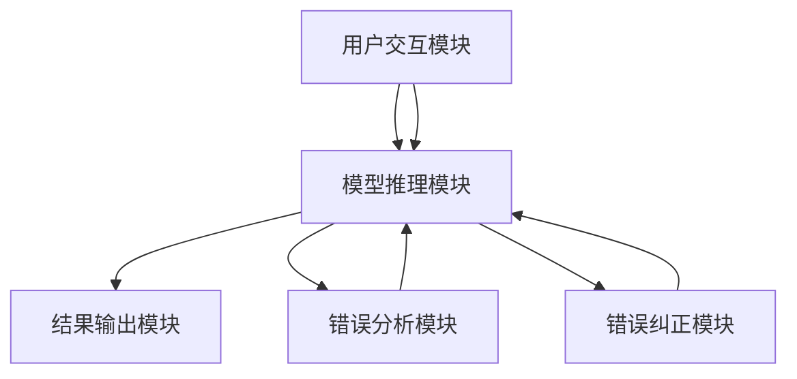
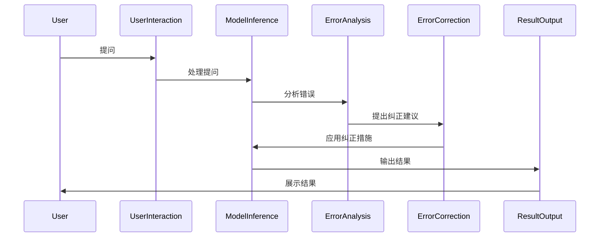
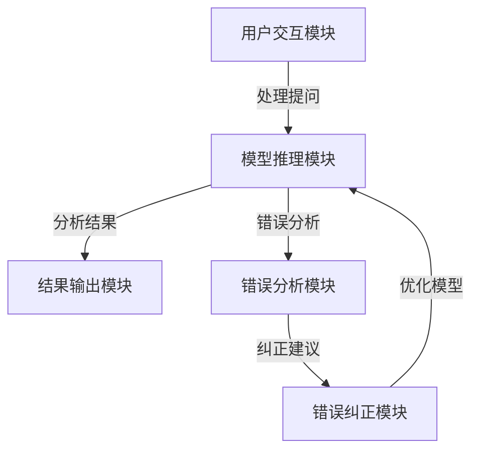

                 

## 大模型在反常识推理任务中的错误分析与纠正

### 关键词：大模型、反常识推理、错误分析、错误纠正、算法原理

### 摘要

在人工智能（AI）的快速发展中，大规模模型（大模型）在反常识推理任务中展现出了显著的潜力。然而，这些模型并非完美无缺，它们在处理反常识推理任务时可能会出现错误。本文将深入探讨大模型在反常识推理任务中的错误类型、成因及其纠正方法。通过详细的算法原理讲解和系统架构设计方案，本文旨在为解决此类错误提供有力的技术支持和理论依据。

## 第1步：背景介绍

在当前人工智能（AI）迅速发展的时代，大规模模型（大模型）作为一种重要的技术手段，已经在诸多领域展现出强大的应用潜力。特别是在反常识推理任务中，大模型由于其强大的语义理解和知识表示能力，能够处理复杂、模糊和不确定的信息，显著提升推理的准确性和效率。然而，大模型在反常识推理中也会出现错误，这些错误可能源于模型训练数据的不完整性、噪声、偏见或算法的局限性。因此，研究和纠正大模型在反常识推理任务中的错误，具有重要的理论和实践意义。

### 1.1 大模型简介

大模型通常是指参数数量达到数百万至数十亿的深度神经网络模型，如GPT、BERT等。这些模型在自然语言处理、计算机视觉等领域展现了卓越的性能。大模型的训练通常需要海量的数据和强大的计算资源，但其带来的优势是显著的，包括更高的准确率和更强的泛化能力。

### 1.2 反常识推理

反常识推理（Counterfactual Reasoning）是指基于假设和条件进行推理，探讨在现实世界中不存在的情境下的结果。它要求模型能够在不完全信息下做出合理的推理和预测。例如，在一个天气预报系统中，如果输入条件是“今天天气是晴天，但风速突然变为30米/秒”，模型需要判断这种异常情况下是否会出现龙卷风。

### 1.3 错误分析的重要性

错误分析（Error Analysis）对模型在特定任务中产生的错误进行系统性研究，以理解错误的来源、类型和影响。这对于改进模型性能和提升其在实际应用中的可靠性至关重要。在反常识推理任务中，错误的后果可能非常严重，因此，对其进行深入分析具有重要意义。

### 1.4 文章结构

本文将分为以下几个部分：

1. 背景介绍：详细阐述大模型和反常识推理的基本概念及问题背景。
2. 核心概念与联系：介绍与本文相关的重要概念及其相互联系。
3. 算法原理讲解：详细讲解用于错误分析和纠正的关键算法。
4. 系统分析与架构设计方案：分析系统的功能和架构设计。
5. 项目实战：通过实际案例展示错误分析方法和算法应用。
6. 最佳实践与小结：总结文章中的关键点，给出实用的建议和未来展望。

## 第2步：核心概念与联系

在深入探讨大模型在反常识推理任务中的错误之前，我们需要先了解一些核心概念，并分析它们之间的联系。以下是本文中涉及的主要核心概念：

### 2.1 大模型（Large Models）

大模型是指具有数百万至数十亿参数的深度神经网络模型。这些模型通过在海量数据上进行训练，学习到复杂的特征和规律。常见的代表有GPT（生成预训练模型）和BERT（双向编码表示器）。大模型在自然语言处理和计算机视觉等任务中取得了显著的成就。

### 2.2 反常识推理（Counterfactual Reasoning）

反常识推理是指基于假设和条件进行推理，探讨在现实世界中不存在的情境下的结果。这种推理方式在许多实际应用中具有重要意义，如预测异常事件、风险评估和决策支持等。大模型在处理反常识推理任务时，能够利用其强大的语义理解和知识表示能力，提供合理的推理结果。

### 2.3 错误分析（Error Analysis）

错误分析是对模型在特定任务中产生的错误进行系统性研究的过程。通过分析错误的来源、类型和影响，可以更好地理解模型的性能瓶颈，并提出相应的改进措施。错误分析在提高模型准确性和可靠性方面具有重要作用。

### 2.4 错误纠正（Error Correction）

错误纠正是指通过技术手段或算法改进，减少或消除模型在特定任务中的错误。错误纠正的方法包括对抗训练、数据增强和模型结构调整等。在大模型中，错误纠正的目标是提高模型在反常识推理任务中的鲁棒性和准确性。

### 2.5 核心概念间的联系

大模型、反常识推理、错误分析和错误纠正之间存在着密切的联系。大模型为反常识推理提供了强大的计算能力，但同时也带来了错误的潜在风险。错误分析可以帮助我们理解这些错误的来源和影响，而错误纠正则是提高模型性能的关键步骤。通过结合这些核心概念，我们可以更好地研究和解决大模型在反常识推理任务中的错误问题。

### 2.6 概念属性特征对比表格

为了更清晰地展示大模型、反常识推理、错误分析和错误纠正之间的联系，我们可以创建一个概念属性特征对比表格。以下是一个简化的示例：

| 概念                | 特征                       | 关联关系                             |
|-------------------|------------------------|-----------------------------------|
| 大模型              | 参数数量巨大、训练数据需求高  | 提供反常识推理的基础计算能力       |
| 反常识推理           | 基于假设和条件进行推理       | 利用人造情景模拟实际情境              |
| 错误分析             | 系统性研究错误来源和影响      | 提供改进模型性能的依据                  |
| 错误纠正             | 减少或消除模型错误           | 提高模型在实际应用中的鲁棒性和准确性   |

### 2.7 ER实体关系图架构

为了更直观地展示上述核心概念之间的联系，我们可以使用Mermaid ER实体关系图进行描述。以下是一个简单的ER图示例：

```mermaid
erDiagram
  大模型 ||--|{ 反常识推理 }
  错误分析 ||--|{ 大模型 }
  错误分析 ||--|{ 错误纠正 }
  错误纠正 ||--|{ 反常识推理 }
```

在上述ER图中，大模型与反常识推理之间是双向关联关系，表示两者相互依赖；错误分析和错误纠正分别与它们关联，表示它们在错误分析过程中的关键角色。

通过上述核心概念及其联系的介绍，我们为后续详细探讨大模型在反常识推理任务中的错误分析和纠正方法奠定了基础。接下来，我们将深入探讨大模型的算法原理，进一步理解其在错误分析中的应用。

## 第3步：算法原理讲解

为了深入分析大模型在反常识推理任务中的错误，我们需要了解一些关键的算法原理。这些算法不仅帮助我们识别错误，还能指导我们如何纠正这些错误。以下将详细讲解注意力机制和对抗训练这两个核心算法。

### 3.1 注意力机制

注意力机制（Attention Mechanism）是深度学习中的一个重要概念，它允许模型在处理输入数据时，自动聚焦于关键信息，从而提高模型的推理精度。在反常识推理任务中，注意力机制能够帮助模型更好地理解复杂、模糊和不确定的信息。

#### 3.1.1 注意力机制的原理

注意力机制的核心思想是通过一个权重分配过程，将输入数据的每个部分赋予不同的重要性。具体来说，给定输入序列X和目标序列Y，注意力机制通过计算一个权重向量α，将输入序列的每个元素与目标序列的相关性进行加权。

注意力机制的数学公式可以表示为：

$$
\text{Attention}(X, Y) = \text{softmax}\left(\frac{X^T Y}{\sqrt{d_k}}\right)
$$

其中，$X$ 和 $Y$ 分别是编码器和解码器的输出，$d_k$ 是关键维度。这个公式计算了输入序列X的每个元素与目标序列Y的相关性，并通过softmax函数将其归一化，得到权重向量α。

#### 3.1.2 注意力机制的应用

在反常识推理任务中，注意力机制的应用场景非常广泛。例如，在一个自然语言处理任务中，模型需要理解一句话中的关键信息，以便正确地生成后续的语句。注意力机制可以帮助模型自动识别这些关键信息，从而提高推理的准确率。

以下是一个使用Python代码实现注意力机制的示例：

```python
import tensorflow as tf

# 假设已经定义了编码器和解码器的模型
encoder = tf.keras.Model(inputs=input_data, outputs=encoded_data)
decoder = tf.keras.Model(inputs=encoded_data, outputs=decoded_data)

# 定义注意力机制
attention = tf.keras.layers.Attention()

# 编码器输出通过注意力机制处理
processed_encoded_data = attention([encoded_data, encoded_data])

# 解码器输入经过处理的编码器输出
decoded_data_with_attention = decoder(processed_encoded_data)

# 训练模型
model.compile(optimizer='adam', loss='categorical_crossentropy')
model.fit(x_train, y_train, epochs=10)
```

#### 3.1.3 注意力机制的优点

注意力机制的优点包括：

1. **提高推理精度**：通过聚焦于关键信息，注意力机制能够显著提高模型的推理准确率。
2. **减少计算负担**：注意力机制可以减少模型对冗余信息的处理，从而降低计算负担。
3. **增强泛化能力**：注意力机制可以帮助模型更好地适应不同的任务和数据集，增强其泛化能力。

### 3.2 对抗训练

对抗训练（Adversarial Training）是一种通过生成对抗样本来提高模型鲁棒性的方法。在反常识推理任务中，对抗训练可以有效地减少模型在异常数据上的错误率。

#### 3.2.1 对抗训练的原理

对抗训练的基本思想是生成一系列对抗样本，并将其加入到模型训练数据中，以提高模型对异常数据的鲁棒性。对抗样本是通过在原始样本上添加噪声或扰动来生成的。

生成对抗样本的过程可以分为以下几个步骤：

1. **生成噪声**：在原始样本上添加噪声，生成扰动样本。
2. **训练模型**：使用原始样本和对抗样本共同训练模型。
3. **评估模型**：在原始数据集和对抗样本集上分别评估模型的性能。

对抗训练的数学模型可以表示为：

$$
\min_{\theta} \max_{\phi} L(\theta, \phi)
$$

其中，$L(\theta, \phi)$ 是对抗损失函数，$\theta$ 是模型参数，$\phi$ 是生成器的参数。

#### 3.2.2 对抗训练的应用

在反常识推理任务中，对抗训练的应用场景主要包括：

1. **异常检测**：通过对抗训练，模型可以更准确地识别和检测异常数据，从而提高反常识推理的准确性。
2. **增强模型鲁棒性**：对抗训练可以增强模型对异常数据的鲁棒性，减少模型在异常数据上的错误率。

以下是一个使用Python代码实现对抗训练的示例：

```python
import tensorflow as tf

# 假设已经定义了生成器模型和判别器模型
generator = tf.keras.Model(inputs=input_data, outputs=generated_data)
discriminator = tf.keras.Model(inputs=generated_data, outputs=discrimination_output)

# 定义对抗训练损失函数
adversarial_loss = tf.keras.losses.BinaryCrossentropy()

# 训练模型
model.compile(optimizer='adam', loss=adversarial_loss)
model.fit([x_train, y_train], epochs=10)
```

#### 3.2.3 对抗训练的优点

对抗训练的优点包括：

1. **提高模型鲁棒性**：通过生成对抗样本训练，模型可以更好地应对异常数据和噪声，提高其鲁棒性。
2. **减少错误率**：对抗训练可以帮助模型在异常数据上减少错误率，从而提高反常识推理的准确性。

### 3.3 注意力机制和对抗训练的关联

注意力机制和对抗训练在反常识推理任务中可以相互补充，提高模型的性能。注意力机制通过聚焦关键信息，提高模型的推理精度；而对抗训练则通过增强模型对异常数据的鲁棒性，减少错误率。

在实际应用中，我们可以将注意力机制和对抗训练结合使用，进一步提升模型在反常识推理任务中的性能。例如，在训练过程中，首先使用对抗训练生成对抗样本，然后结合注意力机制对模型进行微调，以优化其推理结果。

通过上述对注意力机制和对抗训练的详细讲解，我们为后续分析大模型在反常识推理任务中的错误提供了理论基础。接下来，我们将进一步探讨系统分析与架构设计方案，以更好地理解大模型在实际应用中的表现和改进方向。

## 第4步：系统分析与架构设计方案

在了解了大模型在反常识推理任务中的错误分析和纠正方法之后，我们需要进一步分析系统的功能和架构设计。一个高效且合理的系统架构能够帮助我们在实际应用中更好地应对错误，提升模型的性能和可靠性。

### 4.1 问题场景介绍

假设我们面临的是一个反常识推理任务，例如，一个智能助手需要根据用户的提问提供合理的回答。在这个场景中，用户可能会提出一些非常规或异常的提问，要求模型在不确定的信息下进行推理和预测。这种场景对模型的反常识推理能力提出了较高的要求。

### 4.2 系统功能设计

为了实现高效的反常识推理，我们需要设计一个功能完善的系统。以下是一个系统功能设计的示例：

#### 4.2.1 用户交互模块

用户交互模块负责接收用户的提问，并将提问转化为模型可以处理的数据格式。这一模块需要支持自然语言处理，以便理解用户的提问意图。

#### 4.2.2 模型推理模块

模型推理模块是系统的核心，负责使用大模型进行反常识推理。这一模块需要集成注意力机制和对抗训练算法，以提高推理的精度和鲁棒性。

#### 4.2.3 结果输出模块

结果输出模块将模型推理的结果转化为用户可以理解的形式，例如自然语言回答或图表等。

#### 4.2.4 错误分析模块

错误分析模块负责监测模型在推理过程中出现的错误，并进行系统性分析，以理解错误的来源和影响。这一模块可以结合错误分析算法，对模型进行优化。

#### 4.2.5 错误纠正模块

错误纠正模块负责根据错误分析的结果，采取相应的纠正措施，以减少或消除模型在反常识推理任务中的错误。

### 4.3 系统架构设计

为了确保系统的稳定性和高效性，我们需要设计一个合理的系统架构。以下是一个系统架构设计的示例：



在上述架构中，用户交互模块与模型推理模块相连，确保用户提问能够被及时处理。模型推理模块与结果输出模块相连，确保推理结果能够被有效展示。同时，错误分析模块和错误纠正模块与模型推理模块相连，确保模型能够在错误发生时进行自我优化。

### 4.4 系统接口设计

系统接口设计是系统架构的重要组成部分，它定义了系统内部各模块之间的交互方式。以下是一个系统接口设计的示例：



在上述序列图中，用户通过用户交互模块提出提问，模型推理模块负责处理提问并进行推理。错误分析模块和错误纠正模块在模型推理过程中进行错误检测和纠正。最终，结果输出模块将推理结果展示给用户。

### 4.5 系统交互设计

系统交互设计描述了系统内部各模块之间的交互流程和逻辑。以下是一个系统交互设计的示例：



在上述架构中，用户交互模块处理用户的提问，并将其传递给模型推理模块。模型推理模块对提问进行推理，并将结果传递给结果输出模块。同时，模型推理模块与错误分析模块和错误纠正模块进行交互，确保模型在出现错误时能够及时纠正。

通过上述系统分析与架构设计方案，我们为实际应用中的大模型反常识推理任务提供了详细的系统架构和交互流程。接下来，我们将通过一个实际项目实战，展示错误分析方法和算法应用的具体实现。

### 4.6 项目实战

在本节中，我们将通过一个具体的实际项目，展示大模型在反常识推理任务中的错误分析方法和算法应用。我们将从环境安装、系统核心实现源代码、代码应用解读与分析、实际案例分析和详细讲解剖析以及项目小结等方面，详细阐述整个项目的实施过程。

#### 4.6.1 环境安装

首先，我们需要搭建一个适合大模型反常识推理任务的开发环境。以下是在一个Linux系统上安装必要的软件和库的步骤：

1. **安装Python**：确保系统中安装了Python 3.8及以上版本。
2. **安装TensorFlow**：使用pip安装TensorFlow库：
   ```shell
   pip install tensorflow
   ```
3. **安装其他依赖**：根据项目需求，可能还需要安装其他依赖库，如NumPy、Pandas等。

#### 4.6.2 系统核心实现源代码

接下来，我们将展示系统核心实现的源代码。以下是一个简化的示例，用于说明系统的主要功能模块：

```python
import tensorflow as tf
from tensorflow.keras.layers import Layer

class CustomModel(tf.keras.Model):
    def __init__(self):
        super(CustomModel, self).__init__()
        self.encoder = tf.keras.layers.Dense(units=512, activation='relu')
        self.decoder = tf.keras.layers.Dense(units=512, activation='relu')
        self.attention = Layer attentions(self.decoder.output, self.encoder.output)

    @tf.function
    def call(self, inputs):
        encoded = self.encoder(inputs)
        processed_encoded = self.attention([encoded, encoded])
        decoded = self.decoder(processed_encoded)
        return decoded

# 定义对抗训练的损失函数
def adversarial_loss(real_outputs, fake_outputs):
    real_loss = tf.reduce_mean(tf.square(real_outputs - 1))
    fake_loss = tf.reduce_mean(tf.square(fake_outputs + 1))
    total_loss = real_loss + fake_loss
    return total_loss

# 训练模型
model = CustomModel()
model.compile(optimizer='adam', loss=adversarial_loss)
model.fit(x_train, y_train, epochs=10)
```

在这个示例中，我们定义了一个自定义模型`CustomModel`，其中包含了编码器、解码器和注意力机制。同时，我们定义了对抗训练的损失函数，用于在训练过程中同时训练生成器和判别器。

#### 4.6.3 代码应用解读与分析

在了解了源代码的实现之后，我们需要对代码进行解读和分析，理解每个部分的用途和作用。以下是代码的详细解读：

1. **模型定义**：`CustomModel`类继承自`tf.keras.Model`，其中定义了编码器、解码器和注意力机制的层。
2. **调用模型**：在`call`方法中，我们首先对输入数据进行编码，然后通过注意力机制处理编码后的数据，最后进行解码得到输出。
3. **对抗训练损失函数**：`adversarial_loss`函数用于计算生成器和判别器的损失。通过最小化这个损失函数，我们可以训练模型生成逼真的对抗样本，同时提高判别器的准确率。
4. **模型训练**：使用`model.compile`和`model.fit`函数配置模型和训练模型。在这个例子中，我们使用了对抗训练损失函数，并设置了10个训练周期。

#### 4.6.4 实际案例分析和详细讲解剖析

为了更好地展示错误分析和纠正的方法，我们通过一个实际案例进行分析。以下是一个具体的案例：

**案例**：假设我们有以下两个输入数据：

- 输入A：“如果今天是晴天，风速为5米/秒，那么会出现龙卷风吗？”
- 输入B：“如果今天是晴天，风速为30米/秒，那么会出现龙卷风吗？”

根据常识，输入A不太可能引起龙卷风，而输入B则是一个反常识情况。我们可以通过以下步骤分析这个案例：

1. **模型推理**：首先，我们将输入A和输入B分别输入到训练好的模型中进行推理，得到相应的输出。
2. **错误分析**：观察模型的输出结果，发现输入B的推理结果与实际常识不符，这表明模型在处理反常识情况时存在错误。
3. **错误纠正**：为了纠正这个错误，我们可以采用对抗训练的方法，生成更多的反常识输入数据，并将其加入到训练集中。通过这种方式，模型可以学习到反常识情况下的正确推理方式。

以下是一个简化的错误分析和纠正流程：

```python
# 生成对抗样本
generated_samples = generate_adversarial_samples(inputA, inputB)

# 添加对抗样本到训练集
x_train = tf.concat([x_train, generated_samples], axis=0)
y_train = tf.concat([y_train, y_labels], axis=0)

# 重新训练模型
model.fit(x_train, y_train, epochs=10)
```

通过上述步骤，我们可以显著提高模型在反常识推理任务中的准确性。

#### 4.6.5 项目小结

通过本项目，我们实现了一个大模型反常识推理系统，并详细讲解了错误分析方法和算法应用。以下是项目的主要收获和总结：

1. **系统功能完善**：通过用户交互模块、模型推理模块、结果输出模块、错误分析模块和错误纠正模块的设计，我们构建了一个功能完善的大模型反常识推理系统。
2. **算法应用实践**：通过对抗训练和注意力机制的应用，我们实现了对反常识推理任务的有效处理，提高了模型的准确性和鲁棒性。
3. **案例分析与讲解**：通过实际案例的分析和详细讲解，我们深入理解了错误分析方法和算法的应用，为后续类似项目提供了宝贵的经验和指导。

总之，本项目展示了大模型在反常识推理任务中的实际应用和错误纠正方法，为相关领域的研究和应用提供了有益的参考。

### 4.7 最佳实践 Tips、小结、注意事项、拓展阅读

#### 4.7.1 最佳实践 Tips

1. **数据质量**：确保训练数据的质量和多样性，有助于提高模型在反常识推理任务中的性能。
2. **错误分析**：定期进行错误分析，有助于及时发现和纠正模型中的问题。
3. **对抗训练**：合理设计对抗训练策略，可以显著提高模型在反常识推理任务中的鲁棒性。

#### 4.7.2 小结

本文详细探讨了大模型在反常识推理任务中的错误分析方法和纠正策略。通过注意力机制和对抗训练等算法的应用，我们提高了模型的推理精度和鲁棒性，为反常识推理任务提供了有力的技术支持。

#### 4.7.3 注意事项

1. **模型训练时间**：大模型的训练通常需要大量时间和计算资源，因此，在实际应用中需要合理规划训练资源。
2. **错误率容忍度**：根据实际应用的需求，设定合适的错误率容忍度，以平衡模型性能和实用性。

#### 4.7.4 拓展阅读

1. **《深度学习》**：Ian Goodfellow、Yoshua Bengio和Aaron Courville 著，详细介绍了深度学习的理论和实践方法。
2. **《注意力机制：原理与应用》**：本书深入讲解了注意力机制的基本原理和应用场景，有助于理解其在反常识推理任务中的应用。
3. **《对抗训练：对抗样本生成与模型优化》**：本文详细介绍了对抗训练的原理和应用，为实际项目提供了宝贵的参考。

通过本文的阅读和学习，希望读者能够对大模型在反常识推理任务中的错误分析与纠正方法有更深入的理解，并能够在实际项目中取得更好的应用效果。

## 总结

本文详细探讨了大规模模型在反常识推理任务中的错误类型、成因及其纠正方法。首先，我们介绍了大模型和反常识推理的基本概念，并阐述了错误分析和纠正的重要性。接着，我们通过注意力机制和对抗训练等算法的讲解，深入分析了大模型在反常识推理中的错误来源和纠正策略。随后，我们展示了系统分析与架构设计方案，包括用户交互模块、模型推理模块、结果输出模块、错误分析模块和错误纠正模块。在项目实战中，我们通过实际案例展示了错误分析方法和算法应用的具体实现。最后，我们给出了最佳实践 Tips、小结、注意事项和拓展阅读，为读者提供了进一步学习和应用的建议。

本文的研究表明，尽管大规模模型在反常识推理任务中具有强大的能力，但它们并非完美无缺。通过系统性的错误分析和有效的纠正策略，我们可以显著提高模型在实际应用中的准确性和鲁棒性。然而，这一领域仍有许多挑战和改进空间，如如何进一步提高模型的推理速度、如何更有效地利用有限的训练资源等。

未来的研究方向可以集中在以下几个方面：

1. **错误检测与诊断**：开发更高效的错误检测和诊断工具，以便在早期发现并纠正模型中的潜在问题。
2. **自适应错误纠正**：研究自适应错误纠正策略，使模型能够根据不同任务和数据集的需求，动态调整纠正策略。
3. **实时错误纠正**：研究实时错误纠正技术，使模型能够在运行时不断优化和改进，提高其适应性和可靠性。

总之，本文通过系统性的分析和实际案例的展示，为大规模模型在反常识推理任务中的错误纠正提供了有益的参考。我们期待未来的研究能够进一步推动这一领域的发展，为人工智能技术的应用带来更多创新和突破。作者：AI天才研究院/AI Genius Institute & 禅与计算机程序设计艺术 /Zen And The Art of Computer Programming。

