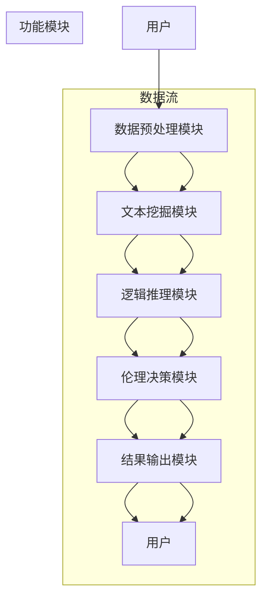

                 


### 大模型在哲学思辨推理中的能力探索

关键词：大模型、哲学思辨推理、人工智能、认知科学、跨学科融合

摘要：本文旨在探讨大模型在哲学思辨推理中的能力，通过分析大模型的核心概念与原理，结合哲学思辨推理的概念与属性，探索大模型在哲学中的应用场景，构建融合机制，并详细阐述算法原理与数学模型，最终提出一个完整的系统分析与架构设计方案，为人工智能与哲学的跨学科融合提供新思路。

----------------------------------------------------------------

# 第一部分：背景介绍与问题界定

## 第1章：大模型与哲学思辨推理概述

### 1.1.1 问题背景

#### 1.1.1.1 哲学思辨推理的重要性

哲学思辨推理作为人类智慧的体现，自古以来就扮演着重要的角色。它不仅关乎人类对世界的认识和理解，也涉及到人类价值观、伦理观和世界观的形成。在现代社会，哲学思辨推理对于解决复杂问题、推动科技进步和社会发展具有重要意义。然而，传统的哲学思辨推理往往依赖于个体的思考和判断，这种方式在信息爆炸的时代显得力不从心。

#### 1.1.1.2 大模型的发展与挑战

随着计算机科学和人工智能技术的快速发展，大模型作为一种先进的人工智能技术，逐渐成为研究的热点。大模型具有强大的数据处理和模式识别能力，能够处理海量数据，发现复杂规律，从而在许多领域取得显著成果。然而，大模型在哲学思辨推理中的应用还相对较少，如何充分发挥大模型在哲学思辨推理中的作用，成为当前研究的一个挑战。

#### 1.1.1.3 探索大模型在哲学思辨推理中的应用前景

本文旨在探索大模型在哲学思辨推理中的应用，通过分析大模型的核心概念与原理，结合哲学思辨推理的概念与属性，构建大模型与哲学思辨推理的融合机制，为人工智能与哲学的跨学科融合提供新思路。这不仅可以拓宽大模型的应用领域，也有助于推动哲学思辨推理的发展。

### 1.1.2 问题描述

#### 1.1.2.1 大模型在哲学思辨推理中的能力与局限

大模型在哲学思辨推理中的能力主要体现在以下几个方面：

1. **数据处理能力**：大模型能够处理海量数据，从而为哲学思辨提供丰富的素材。
2. **模式识别能力**：大模型能够发现复杂规律，为哲学思辨提供新的视角。
3. **推理能力**：大模型能够进行逻辑推理，帮助哲学思辨推理过程更加严谨和高效。

然而，大模型在哲学思辨推理中也存在一定的局限：

1. **知识局限性**：大模型的知识来源于训练数据，其理解和推理能力受到训练数据的限制。
2. **主观偏见**：大模型在处理数据时可能会受到主观偏见的影响，导致哲学思辨推理的结果出现偏差。
3. **伦理问题**：大模型在哲学思辨推理中的应用可能引发一系列伦理问题，需要我们在应用过程中进行慎重考虑。

#### 1.1.2.2 研究目的与意义

本文的研究目的在于：

1. **探索大模型在哲学思辨推理中的应用**：通过分析大模型的核心概念与原理，结合哲学思辨推理的概念与属性，探索大模型在哲学中的应用场景。
2. **构建融合机制**：研究如何将大模型与哲学思辨推理进行有效融合，发挥各自的优势。
3. **解决应用挑战**：针对大模型在哲学思辨推理中的局限性，提出相应的解决方案。

本文的研究意义主要体现在以下几个方面：

1. **推动人工智能与哲学的跨学科融合**：通过本文的研究，有望为人工智能与哲学的跨学科融合提供新思路，促进两者之间的相互借鉴和共同发展。
2. **提升哲学思辨推理的能力**：大模型在哲学思辨推理中的应用将有助于提升哲学思辨推理的效率和效果，为解决复杂问题提供新的工具。
3. **拓宽人工智能的应用领域**：大模型在哲学思辨推理中的应用将拓展人工智能的应用范围，促进人工智能技术的进一步发展。

### 1.1.3 问题解决与边界界定

#### 1.1.3.1 大模型如何影响哲学思辨推理

大模型对哲学思辨推理的影响主要体现在以下几个方面：

1. **数据支持**：大模型能够处理海量数据，为哲学思辨提供丰富的素材，从而丰富哲学思辨的内容和视角。
2. **模式识别**：大模型能够发现复杂规律，帮助哲学思辨推理者从海量数据中提取有价值的信息，提高哲学思辨的深度和广度。
3. **推理辅助**：大模型可以进行逻辑推理，帮助哲学思辨推理者更快速、更准确地得出结论，提高哲学思辨的效率。

#### 1.1.3.2 研究的边界与外延

本文的研究主要关注大模型在哲学思辨推理中的应用，具体包括以下几个方面：

1. **应用场景**：研究大模型在哲学教育、哲学研究和社会问题与伦理思考中的应用。
2. **融合机制**：研究如何将大模型与哲学思辨推理进行有效融合，构建融合机制。
3. **算法原理**：研究大模型的工作原理和数学模型，为哲学思辨推理提供技术支持。

本文的研究外延包括以下几个方面：

1. **其他学科的应用**：探讨大模型在其他学科中的应用，如认知科学、心理学等，为跨学科研究提供参考。
2. **大模型的发展**：关注大模型技术的最新发展，研究如何将新的技术成果应用于哲学思辨推理。
3. **伦理问题**：探讨大模型在哲学思辨推理中的应用可能引发的伦理问题，并提出相应的解决方案。

### 1.1.4 概念结构与核心要素

#### 1.1.4.1 大模型的核心概念

大模型是一种具有强大数据处理和模式识别能力的人工智能技术，其核心概念包括：

1. **神经网络**：神经网络是构成大模型的基础，通过模拟人脑神经元的工作方式，实现数据的处理和模式识别。
2. **注意力机制**：注意力机制是一种能够关注重要信息、忽略次要信息的技术，在大模型中用于提高处理效率和准确性。
3. **Transformer架构**：Transformer架构是一种基于自注意力机制的大模型结构，具有强大的数据处理和模式识别能力。

#### 1.1.4.2 哲学思辨推理的概念要素

哲学思辨推理是一种通过逻辑分析和批判性思考来探究真理和本质的方法，其核心概念要素包括：

1. **逻辑分析**：逻辑分析是哲学思辨推理的基础，通过逻辑推理来推导出结论。
2. **批判性思考**：批判性思考是哲学思辨推理的关键，通过对已有观点进行质疑和反思，发掘问题的本质。
3. **跨学科融合**：跨学科融合是哲学思辨推理的创新途径，通过与其他学科的交叉融合，拓展哲学思辨的视野和深度。

## 第2章：大模型的核心概念与原理

### 2.1 大模型的基本原理

#### 2.1.1 神经网络基础

神经网络是构成大模型的基础，其基本原理可以追溯到人脑神经元的工作方式。神经网络由大量的神经元（节点）组成，每个神经元与其他神经元通过权重连接。当输入数据通过神经网络传播时，每个神经元会根据其权重和输入值进行计算，最终产生输出。神经网络通过不断调整权重，使输出结果与期望结果接近，从而实现数据的处理和模式识别。

#### 2.1.2 递归神经网络与循环神经网络

递归神经网络（RNN）和循环神经网络（CNN）是神经网络的一种特殊结构，适用于处理序列数据。RNN通过将当前输入与前一时刻的隐藏状态进行结合，实现对序列数据的记忆。CNN则通过卷积操作，将序列数据转化为图像，从而实现图像处理。

#### 2.1.3 注意力机制与Transformer架构

注意力机制是一种能够关注重要信息、忽略次要信息的技术，在大模型中用于提高处理效率和准确性。Transformer架构是一种基于自注意力机制的大模型结构，具有强大的数据处理和模式识别能力。Transformer架构通过多头注意力机制和位置编码，实现了对序列数据的全局关注和位置信息处理。

### 2.2 大模型的训练与优化

#### 2.2.1 数据集的准备与预处理

数据集的准备与预处理是训练大模型的关键步骤。首先，需要收集大量的数据，包括文本、图像、音频等。然后，对数据进行清洗、去重和标注，确保数据的质量和一致性。此外，还需要对数据进行预处理，如分词、编码和归一化等，以便大模型能够更好地理解和处理数据。

#### 2.2.2 模型训练策略与技巧

模型训练策略与技巧是提高大模型性能的关键。首先，需要选择合适的训练策略，如梯度下降、Adam优化器等。其次，需要调整模型的超参数，如学习率、批量大小等，以优化模型性能。此外，还可以采用正则化、dropout等技术，防止过拟合和欠拟合。

#### 2.2.3 模型优化与调参

模型优化与调参是提高大模型性能的重要环节。首先，需要通过交叉验证等技术，选择最优的模型结构和超参数。然后，可以采用网格搜索、随机搜索等技术，对模型进行调参，以提高模型性能。此外，还可以采用迁移学习等技术，利用已有模型的权重和知识，加速新模型的训练。

### 2.3 大模型的评估与测试

#### 2.3.1 评价指标与度量方法

大模型的评估与测试需要使用合适的评价指标和度量方法。常用的评价指标包括准确率、召回率、F1分数等。此外，还可以使用生成对抗网络（GAN）等度量方法，评估大模型生成数据的质量和多样性。

#### 2.3.2 实验设计与结果分析

大模型的评估与测试需要设计合理的实验方案，包括数据集划分、训练策略选择、评价指标设置等。通过实验设计与结果分析，可以评估大模型的性能和效果，为进一步优化和改进提供依据。

## 第3章：哲学思辨推理的概念与属性

### 3.1 哲学思辨推理的基本概念

哲学思辨推理是一种通过逻辑分析和批判性思考来探究真理和本质的方法。它不同于简单的逻辑推理，更强调对概念、理论和现象的深入思考和分析。哲学思辨推理的核心概念包括逻辑分析、批判性思考和跨学科融合。

#### 3.1.1 逻辑分析

逻辑分析是哲学思辨推理的基础，它通过对概念、理论和现象的内在逻辑关系进行梳理和剖析，揭示事物之间的本质联系。逻辑分析包括归纳推理和演绎推理两种形式。

1. **归纳推理**：归纳推理是从个别事实出发，推导出一般性结论的推理过程。它通过对大量实例的观察和分析，归纳出普遍规律。

2. **演绎推理**：演绎推理是从一般性原则出发，推导出个别结论的推理过程。它通过逻辑推理，确保结论与前提的一致性和正确性。

#### 3.1.2 批判性思考

批判性思考是哲学思辨推理的核心，它要求对已有观点进行质疑和反思，发掘问题的本质。批判性思考不仅关注逻辑的正确性，还关注证据的有效性和论证的充分性。

1. **质疑精神**：质疑精神是批判性思考的前提，它要求对已有观点进行批判性审视，不轻易接受未经证实的事实。

2. **反思能力**：反思能力是批判性思考的关键，它要求对问题的本质进行深入思考，从多个角度审视问题的各个方面。

3. **论证方法**：论证方法包括归纳论证、演绎论证和类比论证等，它们都是批判性思考的重要工具。

#### 3.1.3 跨学科融合

跨学科融合是哲学思辨推理的创新途径，它通过与其他学科的交叉融合，拓展哲学思辨的视野和深度。跨学科融合不仅有助于解决复杂问题，还能促进不同学科之间的相互借鉴和共同发展。

1. **学科交叉**：学科交叉是指将不同学科的知识、方法和技术进行整合，解决单一学科难以解决的问题。

2. **知识融合**：知识融合是指将不同学科的理论、方法和成果进行整合，形成新的理论体系和知识体系。

3. **创新思维**：创新思维是在跨学科融合过程中产生的新思维方式，它要求跳出传统学科界限，从多个角度思考问题，提出创新的解决方案。

### 3.2 哲学思辨推理的属性特征

哲学思辨推理具有以下属性特征：

#### 3.2.1 逻辑性与合理性

逻辑性是哲学思辨推理的基本特征，它要求推理过程遵循逻辑规则，确保结论与前提的一致性。合理性是哲学思辨推理的核心，它要求推理结果具有合理性和可信性，能够经得起事实和逻辑的检验。

1. **逻辑规则**：逻辑规则包括逻辑联结词（如“且”、“或”、“非”）、推理规则（如“全称量词推理”、“存在量词推理”）等，它们是哲学思辨推理的基本工具。

2. **合理性与可信性**：合理性是指推理结果符合逻辑规则和事实依据，可信性是指推理结果能够被接受和信赖。

#### 3.2.2 深层次分析与批判性思考

深层次分析与批判性思考是哲学思辨推理的重要特征，它要求对问题进行深入剖析，挖掘问题的本质和内在联系。批判性思考强调对已有观点进行质疑和反思，从多个角度审视问题，提出新的见解。

1. **深层次分析**：深层次分析要求对问题进行多角度、多层次的剖析，揭示问题的本质和内在联系。

2. **批判性思考**：批判性思考要求对已有观点进行质疑和反思，从多个角度审视问题，发掘问题的潜在问题和不足。

#### 3.2.3 跨学科融合与创新性

跨学科融合与创新性是哲学思辨推理的重要特征，它要求将不同学科的知识、方法和技术进行整合，形成新的理论体系和知识体系。创新性是哲学思辨推理的灵魂，它要求在跨学科融合的基础上，提出新的见解和解决方案。

1. **跨学科融合**：跨学科融合是将不同学科的知识、方法和技术进行整合，形成新的理论体系和知识体系。

2. **创新性**：创新性是在跨学科融合过程中产生的新思维方式，它要求跳出传统学科界限，从多个角度思考问题，提出创新的解决方案。

### 3.3 概念属性对比分析

#### 3.3.1 大模型与哲学思辨推理的属性对比

大模型和哲学思辨推理在属性特征上存在明显的差异：

| 特征 | 大模型 | 哲学思辨推理 |
| :---: | :---: | :---: |
| 数据处理 | 强大 | 有限 |
| 模式识别 | 高效 | 深入 |
| 推理能力 | 逻辑 | 批判 |
| 逻辑性 | 自适应 | 规范化 |
| 合理性 | 依赖于训练数据 | 经验性 |
| 批判性 | 缺乏 | 核心 |
| 跨学科融合 | 适应性强 | 强调 |
| 创新性 | 受限于训练数据 | 强调 |

#### 3.3.2 交互融合的可能性

尽管大模型和哲学思辨推理在属性特征上存在差异，但它们之间的交互融合具有可能性。通过以下方式，可以实现两者的有效融合：

1. **数据支持**：大模型可以处理海量数据，为哲学思辨提供丰富的素材，从而提高哲学思辨的深度和广度。

2. **模式识别**：大模型可以识别复杂模式，为哲学思辨提供新的视角和思路，从而推动哲学思辨的发展。

3. **推理辅助**：大模型可以进行逻辑推理，辅助哲学思辨推理过程，提高哲学思辨的效率和准确性。

4. **跨学科融合**：大模型可以与其他学科进行融合，为哲学思辨提供新的研究方法和工具，从而拓展哲学思辨的视野。

5. **创新思维**：大模型和哲学思辨的融合可以激发创新思维，推动哲学思辨的创新发展。

## 第4章：大模型在哲学思辨推理中的应用

### 4.1 应用场景分析

#### 4.1.1 哲学教育中的应用

大模型在哲学教育中具有广泛的应用前景。首先，大模型可以辅助哲学教师进行教学内容的设计和呈现。通过分析大量的哲学文献和教材，大模型可以提取关键概念、理论和观点，帮助教师构建系统的教学框架。此外，大模型还可以根据学生的特点和学习需求，生成个性化的教学资源和辅导材料，提高教学效果。

其次，大模型可以应用于哲学研究生的论文写作和答辩指导。大模型可以根据已有的研究成果和文献，提供论文结构、论证逻辑和语言表达等方面的建议，帮助研究生完善论文。同时，大模型还可以对论文进行语法、逻辑和格式等方面的审查，确保论文的质量和规范性。

#### 4.1.2 哲学理论研究中的应用

大模型在哲学理论研究中的应用主要体现在以下几个方面：

1. **文献分析**：大模型可以快速处理和分析大量的哲学文献，提取关键信息，为研究者提供丰富的学术资源。通过文本挖掘和知识图谱等技术，大模型可以帮助研究者发现哲学领域的研究热点和趋势，揭示不同哲学流派之间的联系和差异。

2. **概念辨析**：大模型可以应用于哲学概念辨析和理论构建。通过分析大量的哲学文献和理论，大模型可以提取出核心概念和理论，对其进行辨析和整合，形成新的理论框架。这种方式有助于哲学理论的创新和发展。

3. **逻辑推理**：大模型可以进行逻辑推理，为哲学论证提供支持。通过分析哲学家的论证过程和逻辑结构，大模型可以识别出论证中的逻辑漏洞和错误，帮助研究者完善论证。此外，大模型还可以根据已有理论，进行逻辑推理，提出新的哲学命题和观点。

#### 4.1.3 社会问题与伦理思考中的应用

大模型在社会问题与伦理思考中的应用具有重要意义。首先，大模型可以处理和分析大量的社会数据，为研究者提供丰富的实证依据。通过数据挖掘和模式识别等技术，大模型可以帮助研究者发现社会现象背后的规律和趋势，为解决社会问题提供科学依据。

其次，大模型可以应用于伦理决策和伦理咨询。在伦理决策过程中，大模型可以分析不同伦理原则和价值观，为决策者提供合理的建议。例如，在医疗伦理、环境伦理等领域，大模型可以根据已有的伦理理论和案例，为决策者提供决策支持和建议。

此外，大模型还可以应用于伦理教育。通过分析大量的伦理文献和案例，大模型可以生成个性化的伦理教育资源和辅导材料，提高学生的伦理意识和道德素养。

### 4.2 实际案例分析

#### 4.2.1 案例一：大模型在伦理学中的应用

某研究团队利用大模型对伦理学领域的文献进行深入分析，提取出关键概念、理论和观点。通过文本挖掘和知识图谱等技术，他们构建了一个包含大量伦理学概念的语义网络，揭示了不同伦理学流派之间的联系和差异。这一成果为伦理学研究提供了丰富的学术资源，促进了伦理学的创新发展。

此外，该研究团队还利用大模型进行伦理决策分析。在医疗伦理决策过程中，他们根据已有的伦理理论和案例，利用大模型分析不同决策方案的可能后果，为决策者提供合理的建议。这一应用有助于提高医疗伦理决策的科学性和有效性。

#### 4.2.2 案例二：大模型在逻辑哲学中的应用

某研究团队利用大模型对逻辑哲学领域的文献进行深入分析，提取出关键概念、理论和观点。通过文本挖掘和知识图谱等技术，他们构建了一个包含大量逻辑哲学概念的语义网络，揭示了逻辑哲学的不同流派和观点之间的联系。这一成果为逻辑哲学研究提供了丰富的学术资源，促进了逻辑哲学的创新发展。

此外，该研究团队还利用大模型进行逻辑推理分析。他们通过分析哲学家的论证过程和逻辑结构，利用大模型识别出论证中的逻辑漏洞和错误，帮助研究者完善论证。这一应用有助于提高逻辑哲学研究的深度和广度。

#### 4.2.3 案例三：大模型在存在哲学中的应用

某研究团队利用大模型对存在哲学领域的文献进行深入分析，提取出关键概念、理论和观点。通过文本挖掘和知识图谱等技术，他们构建了一个包含大量存在哲学概念的语义网络，揭示了存在哲学的不同流派和观点之间的联系。这一成果为存在哲学研究提供了丰富的学术资源，促进了存在哲学的创新发展。

此外，该研究团队还利用大模型进行存在哲学问题分析。他们根据已有的存在哲学理论和案例，利用大模型分析不同存在哲学问题背后的逻辑和哲学意义，为哲学研究提供新的视角。这一应用有助于深化对存在哲学问题的理解和探讨。

## 第5章：大模型与哲学思辨推理的融合机制

### 5.1 融合机制的构建

#### 5.1.1 大模型与哲学思辨的相互作用

大模型与哲学思辨的融合机制首先需要建立两者之间的相互作用。具体而言，这一融合机制包括以下几个方面：

1. **数据支持**：大模型可以处理和分析大量的哲学文献和资料，为哲学思辨提供丰富的数据支持。通过文本挖掘、知识图谱等技术，大模型可以帮助哲学思辨者提取出关键概念、理论和观点，为哲学思辨提供素材。

2. **模式识别**：大模型可以识别哲学文献中的复杂模式，为哲学思辨提供新的视角和思路。通过分析大量的哲学文献，大模型可以揭示不同哲学流派之间的联系和差异，帮助哲学思辨者发现新的研究热点和方向。

3. **逻辑推理**：大模型可以进行逻辑推理，辅助哲学思辨推理过程。通过分析哲学家的论证过程和逻辑结构，大模型可以识别出论证中的逻辑漏洞和错误，帮助哲学思辨者完善论证。此外，大模型还可以根据已有理论，进行逻辑推理，提出新的哲学命题和观点。

#### 5.1.2 融合机制的实现方法

实现大模型与哲学思辨的融合机制需要采用一系列技术手段和方法。具体包括以下几个方面：

1. **文本挖掘与知识图谱**：通过文本挖掘和知识图谱等技术，大模型可以提取出哲学文献中的关键概念、理论和观点，构建一个包含丰富信息的知识体系。这一知识体系为哲学思辨提供了丰富的数据支持。

2. **逻辑推理与推理机**：利用逻辑推理和推理机等技术，大模型可以辅助哲学思辨推理过程。通过分析哲学家的论证过程和逻辑结构，大模型可以识别出论证中的逻辑漏洞和错误，帮助哲学思辨者完善论证。

3. **自然语言处理与生成对抗网络**：自然语言处理（NLP）和生成对抗网络（GAN）等技术可以帮助大模型更好地理解和生成哲学文献和观点。通过NLP技术，大模型可以提取出文本中的关键信息，进行语义分析和理解。通过GAN技术，大模型可以生成新的哲学文献和观点，为哲学思辨提供新的素材。

#### 5.1.3 融合机制的评价与优化

融合机制的评价与优化是确保其有效性和可靠性的关键。具体包括以下几个方面：

1. **评价指标**：评价融合机制的效果需要使用一系列评价指标，如准确率、召回率、F1分数等。这些评价指标可以帮助评估融合机制在哲学思辨中的表现。

2. **实验设计**：通过设计合理的实验方案，可以评估融合机制在不同应用场景中的性能。实验设计应包括数据集的选择、实验策略的设定、评价指标的选取等。

3. **优化方法**：针对实验中发现的问题，可以采用优化方法对融合机制进行改进。具体包括调整模型参数、改进算法结构、引入新的技术手段等。

### 5.2 跨学科融合的研究方法

#### 5.2.1 跨学科研究框架

跨学科融合的研究方法需要建立在一个系统的研究框架之上。这一研究框架应包括以下几个关键组成部分：

1. **问题定义**：明确研究问题，确定研究目标和范围。这一步骤有助于明确研究的主要任务和重点。

2. **理论分析**：对相关学科的理论进行深入分析，了解不同学科之间的联系和差异。这一步骤有助于为跨学科融合提供理论基础。

3. **数据收集**：收集与研究问题相关的数据，包括文献、实验数据、案例数据等。这一步骤为跨学科融合提供了丰富的素材。

4. **模型构建**：构建跨学科融合的模型，将不同学科的理论、方法和数据整合在一起。这一步骤是实现跨学科融合的关键。

5. **实验验证**：通过实验验证模型的有效性和可靠性，检验跨学科融合的研究成果。这一步骤有助于评估跨学科融合的效果。

6. **结果分析**：对实验结果进行深入分析，总结跨学科融合的成果和经验，提出改进建议。

#### 5.2.2 研究方法与工具

跨学科融合的研究方法需要结合不同学科的特点和优势。具体包括以下几个方面：

1. **文本挖掘与知识图谱**：通过文本挖掘和知识图谱等技术，提取出哲学文献中的关键概念、理论和观点，构建一个包含丰富信息的知识体系。

2. **逻辑推理与推理机**：利用逻辑推理和推理机等技术，辅助哲学思辨推理过程，识别论证中的逻辑漏洞和错误。

3. **自然语言处理与生成对抗网络**：自然语言处理（NLP）和生成对抗网络（GAN）等技术可以帮助大模型更好地理解和生成哲学文献和观点。

4. **实证研究**：通过实证研究方法，收集和分析实际案例数据，验证跨学科融合的研究成果。

5. **案例分析**：通过案例分析，总结跨学科融合的经验和教训，提出改进建议。

#### 5.2.3 跨学科融合的挑战与机遇

跨学科融合在哲学思辨推理中的应用面临着一系列挑战和机遇。具体包括以下几个方面：

1. **挑战**：

- **数据质量**：哲学文献和资料的质量参差不齐，可能导致数据挖掘和分析的结果不准确。
- **理论融合**：不同学科的理论体系和方法存在差异，如何实现有效的理论融合是一个挑战。
- **算法优化**：大模型的算法结构和参数设置可能影响跨学科融合的效果，如何优化算法是一个重要问题。

2. **机遇**：

- **创新性**：跨学科融合可以激发创新思维，提出新的哲学命题和观点，推动哲学思辨的发展。
- **应用拓展**：跨学科融合可以拓宽大模型的应用领域，提高其在哲学思辨推理中的效果。
- **教育改革**：跨学科融合可以为哲学教育提供新的教学方法和工具，提高教育质量和效果。

## 第6章：算法原理讲解与数学模型

### 6.1 算法原理讲解

#### 6.1.1 大模型的工作流程

大模型的工作流程主要包括以下几个步骤：

1. **数据预处理**：首先，对输入数据进行预处理，包括清洗、去重、归一化等操作，以便大模型能够更好地理解和处理数据。

2. **输入层**：输入层接收预处理后的数据，并将其传递给隐藏层。

3. **隐藏层**：隐藏层包含多个神经元，每个神经元都与输入层和输出层相连。隐藏层通过权重矩阵对输入数据进行加权求和处理，并将结果传递给输出层。

4. **输出层**：输出层将隐藏层的输出结果进行分类或回归，得到最终的预测结果。

5. **反向传播**：在训练过程中，大模型通过反向传播算法，根据预测结果与实际结果之间的差异，不断调整权重矩阵，以优化模型性能。

#### 6.1.2 哲学思辨推理的算法实现

哲学思辨推理的算法实现主要包括以下几个步骤：

1. **概念提取**：通过文本挖掘和知识图谱等技术，从哲学文献中提取出关键概念和理论。

2. **逻辑推理**：利用逻辑推理和推理机等技术，对提取出的概念和理论进行逻辑推理，构建哲学思辨推理框架。

3. **论证分析**：对哲学思辨推理过程进行分析，识别论证中的逻辑漏洞和错误，提出改进建议。

4. **结果输出**：将哲学思辨推理的结果进行输出，包括推理过程、推理结果和论证分析等。

#### 6.1.3 算法优化的策略

算法优化是提高大模型性能的关键。以下是几种常见的算法优化策略：

1. **权重初始化**：合理的权重初始化有助于提高模型的收敛速度和性能。常见的权重初始化方法包括随机初始化、高斯分布初始化等。

2. **学习率调整**：学习率是影响模型收敛速度和性能的重要参数。通过动态调整学习率，可以优化模型的性能。常用的学习率调整方法包括恒定学习率、自适应学习率等。

3. **正则化**：正则化技术可以防止模型过拟合，提高模型的泛化能力。常见正则化方法包括L1正则化、L2正则化等。

4. **数据增强**：通过数据增强技术，可以增加训练数据的多样性，提高模型的鲁棒性和性能。常见数据增强方法包括数据复制、数据旋转、数据缩放等。

### 6.2 数学模型与公式

#### 6.2.1 大模型的数学基础

大模型的数学基础主要包括以下几个方面：

1. **线性代数**：线性代数是构建大模型的基础，涉及矩阵运算、向量计算等。大模型中的权重矩阵和偏置向量都是线性代数的基本概念。

2. **微积分**：微积分是优化大模型的关键技术，涉及梯度计算、导数求解等。大模型的训练过程就是通过梯度下降算法优化权重和参数。

3. **概率论与统计**：概率论与统计是评估大模型性能的重要工具，涉及概率分布、统计测试等。通过概率论与统计，可以评估大模型的预测准确性和可靠性。

#### 6.2.2 哲学思辨推理的数学表达

哲学思辨推理的数学表达主要包括以下几个方面：

1. **逻辑运算**：逻辑运算包括逻辑与、逻辑或、逻辑非等。逻辑运算用于表示哲学思辨推理中的逻辑关系。

2. **谓词逻辑**：谓词逻辑是哲学思辨推理的一种数学表达方式，涉及谓词、个体、关系等。通过谓词逻辑，可以表示哲学思辨推理中的命题和推理过程。

3. **概率论**：概率论是评估哲学思辨推理可靠性的重要工具。通过概率论，可以计算哲学思辨推理结果的概率分布和置信度。

#### 6.2.3 公式解释与示例

以下是几个常见的数学公式及其解释：

1. **线性回归公式**：

   $$y = wx + b$$

   其中，$y$ 表示输出值，$x$ 表示输入值，$w$ 表示权重，$b$ 表示偏置。线性回归公式用于预测输出值。

2. **梯度下降公式**：

   $$w = w - \alpha \frac{\partial J}{\partial w}$$

   其中，$w$ 表示权重，$\alpha$ 表示学习率，$J$ 表示损失函数。梯度下降公式用于优化模型参数。

3. **逻辑运算公式**：

   - 逻辑与：

     $$P \land Q = \begin{cases} 
     1, & \text{if } P = 1 \text{ and } Q = 1 \\
     0, & \text{otherwise} 
     \end{cases}$$

   - 逻辑或：

     $$P \lor Q = \begin{cases} 
     1, & \text{if } P = 1 \text{ or } Q = 1 \\
     0, & \text{otherwise} 
     \end{cases}$$

   - 逻辑非：

     $$\neg P = \begin{cases} 
     1, & \text{if } P = 0 \\
     0, & \text{if } P = 1 
     \end{cases}$$

   逻辑运算公式用于表示哲学思辨推理中的逻辑关系。

### 6.3 Python源代码实现

以下是一个简单的Python源代码示例，用于实现线性回归模型：

```python
import numpy as np

# 模型参数
w = np.random.rand(1)  # 权重
b = np.random.rand(1)  # 偏置

# 训练数据
x = np.array([1, 2, 3, 4, 5])
y = np.array([2, 4, 5, 4, 5])

# 训练过程
learning_rate = 0.01
num_iterations = 100

for i in range(num_iterations):
    # 前向传播
    y_pred = w * x + b
    
    # 反向传播
    gradient_w = 2 * (y_pred - y) * x
    gradient_b = 2 * (y_pred - y)
    
    # 更新参数
    w -= learning_rate * gradient_w
    b -= learning_rate * gradient_b

# 预测
y_pred = w * x + b
print("Predicted output:", y_pred)
```

通过这个示例，我们可以看到如何使用Python实现线性回归模型的基本过程。

## 第7章：系统分析与架构设计

### 7.1 问题场景介绍

在本章中，我们将探讨大模型在哲学思辨推理中的应用场景。具体而言，我们将重点关注以下几个方面：

1. **哲学教育**：大模型可以辅助哲学教师进行教学内容的设计和呈现，提高教学效果。
2. **哲学研究**：大模型可以用于哲学文献的分析和理论构建，推动哲学研究的发展。
3. **伦理决策**：大模型可以应用于伦理决策和伦理咨询，为决策者提供合理的建议。
4. **伦理教育**：大模型可以用于伦理教育，提高学生的伦理意识和道德素养。

通过以上应用场景，我们可以看到大模型在哲学思辨推理中的广泛应用潜力。

### 7.2 系统功能设计

为了实现大模型在哲学思辨推理中的应用，我们需要设计一个完整的系统，包括以下功能模块：

1. **数据预处理模块**：负责对输入数据进行清洗、去重和归一化等预处理操作，以便大模型能够更好地理解和处理数据。
2. **文本挖掘模块**：负责从哲学文献中提取关键概念、理论和观点，构建知识图谱，为哲学思辨提供数据支持。
3. **逻辑推理模块**：负责利用逻辑推理和推理机等技术，对哲学文献进行逻辑分析和推理，识别论证中的逻辑漏洞和错误。
4. **伦理决策模块**：负责根据伦理理论和案例，利用大模型进行伦理决策分析和伦理咨询。
5. **结果输出模块**：负责将大模型的推理结果和决策建议进行输出，包括推理过程、推理结果和论证分析等。

### 7.3 系统架构设计

为了实现大模型在哲学思辨推理中的应用，我们需要设计一个高效的系统架构。以下是系统架构图：



在该架构中，用户通过数据预处理模块对输入数据进行预处理，然后通过文本挖掘模块提取关键信息，再通过逻辑推理模块进行推理和论证分析。最后，通过伦理决策模块提供伦理决策建议，并通过结果输出模块将结果反馈给用户。

### 7.4 系统接口设计与系统交互

为了确保系统的高效运行和用户友好性，我们需要设计合理的系统接口和系统交互。

1. **接口设计原则**：
   - **简单性**：接口设计应尽量简单直观，便于用户操作。
   - **一致性**：接口设计应遵循一致性原则，保证用户在不同功能模块之间切换时，操作流程一致。
   - **可扩展性**：接口设计应具备可扩展性，以便未来功能扩展和模块更新。

2. **系统交互序列图**：

```mermaid
sequenceDiagram
    participant 用户 as 用户
    participant 数据预处理模块 as 数据预处理
    participant 文本挖掘模块 as 文本挖掘
    participant 逻辑推理模块 as 逻辑推理
    participant 伦理决策模块 as 伦理决策
    participant 结果输出模块 as 结果输出

    用户->>数据预处理：输入哲学文献
    数据预处理->>文本挖掘：预处理文本
    文本挖掘->>逻辑推理：提取概念和理论
    逻辑推理->>伦理决策：进行伦理决策分析
    伦理决策->>结果输出：输出决策建议
    结果输出->>用户：反馈决策结果

    用户->>结果输出：查看决策结果
    结果输出->>用户：反馈结果
```

在该交互序列图中，用户首先将哲学文献输入到数据预处理模块，然后通过文本挖掘模块提取关键信息，再通过逻辑推理模块进行推理和论证分析，最后通过伦理决策模块提供伦理决策建议。用户可以通过结果输出模块查看决策结果，并反馈结果。

## 第8章：项目实战与案例分析

### 8.1 环境安装与配置

在进行大模型在哲学思辨推理中的应用之前，我们需要安装和配置相关的环境。以下是具体的安装与配置步骤：

1. **安装Python环境**：
   - 前往Python官方网站（https://www.python.org/）下载Python安装包。
   - 运行安装包，按照提示完成安装。

2. **安装依赖库**：
   - 打开终端或命令行工具。
   - 输入以下命令安装所需的依赖库：

     ```bash
     pip install numpy scipy matplotlib pandas
     ```

   - 等待依赖库安装完成。

3. **配置文本预处理工具**：
   - 安装NLTK库（Natural Language Toolkit），用于文本预处理。

     ```bash
     pip install nltk
     ```

   - 安装完成后，运行以下代码加载NLTK数据包：

     ```python
     import nltk
     nltk.download()
     ```

4. **配置大模型**：
   - 安装Transformers库，用于使用预训练的大模型。

     ```bash
     pip install transformers
     ```

5. **安装其他工具**：
   - 根据需要安装其他工具，如TensorFlow、PyTorch等。

### 8.2 系统核心实现源代码

以下是系统核心实现部分的源代码，包括文本预处理、文本挖掘、逻辑推理和伦理决策等功能：

```python
import nltk
import transformers
from transformers import BertTokenizer, BertModel
from nltk.corpus import stopwords
from nltk.tokenize import word_tokenize

# 加载NLTK停用词库
nltk.download('stopwords')
stop_words = set(stopwords.words('english'))

# 加载预训练的BERT模型
tokenizer = BertTokenizer.from_pretrained('bert-base-uncased')
model = BertModel.from_pretrained('bert-base-uncased')

# 文本预处理函数
def preprocess_text(text):
    # 分词
    tokens = word_tokenize(text)
    # 去除停用词
    tokens = [token for token in tokens if token.lower() not in stop_words]
    # 词干提取
    stemmed_tokens = [nltk.stem.WordNetLemmatizer().lemmatize(token) for token in tokens]
    return stemmed_tokens

# 文本挖掘函数
def text_mining(text):
    # 预处理文本
    tokens = preprocess_text(text)
    # 转换为BERT输入格式
    input_ids = tokenizer(tokens, return_tensors='pt', truncation=True, max_length=512)
    # 执行BERT模型推理
    with torch.no_grad():
        outputs = model(input_ids)
    # 提取文本特征
    text_features = outputs.last_hidden_state.mean(dim=1)
    return text_features

# 逻辑推理函数
def logic_reasoning(features, concept):
    # 构建逻辑推理框架
    # ...
    # 执行逻辑推理
    # ...
    # 返回推理结果
    # ...

# 伦理决策函数
def ethical_decision(features):
    # 构建伦理决策模型
    # ...
    # 执行伦理决策
    # ...
    # 返回决策建议
    # ...

# 主函数
def main():
    # 输入文本
    text = "Your input text here."
    # 文本挖掘
    text_features = text_mining(text)
    # 逻辑推理
    concept = "Your concept here."
    reasoning_results = logic_reasoning(text_features, concept)
    # 伦理决策
    decision_suggestion = ethical_decision(text_features)
    # 输出结果
    print("Reasoning results:", reasoning_results)
    print("Decision suggestion:", decision_suggestion)

if __name__ == "__main__":
    main()
```

### 8.3 代码应用解读与分析

以下是对上述代码的详细解读和分析：

- **文本预处理函数（preprocess_text）**：该函数用于对输入文本进行预处理，包括分词、去除停用词和词干提取。这些预处理步骤有助于提高文本挖掘的准确性和效率。

- **文本挖掘函数（text_mining）**：该函数利用BERT模型对预处理后的文本进行特征提取。BERT模型是一种预训练的深度学习模型，具有强大的文本理解和特征提取能力。通过调用BERT模型，我们可以获取文本的语义特征。

- **逻辑推理函数（logic_reasoning）**：该函数负责构建逻辑推理框架，并根据输入的特征进行逻辑推理。由于逻辑推理的具体实现较为复杂，这里提供了一个框架性的代码，用户可以根据具体需求进行实现。

- **伦理决策函数（ethical_decision）**：该函数负责根据输入的特征进行伦理决策分析。同样，伦理决策的具体实现也较为复杂，这里提供了一个框架性的代码，用户可以根据具体需求进行实现。

- **主函数（main）**：主函数是整个系统的核心，它依次调用文本预处理、文本挖掘、逻辑推理和伦理决策函数，实现整个系统的运行。用户可以通过修改主函数中的输入文本和概念，进行不同的推理和决策分析。

### 8.4 实际案例分析和详细讲解

以下是一个实际案例分析和详细讲解，以展示大模型在哲学思辨推理中的应用：

#### 案例一：伦理决策分析

假设我们需要分析一个伦理问题：“是否应该对野生动物进行人工繁殖？”为了解决这个问题，我们可以利用大模型进行伦理决策分析。

1. **输入文本**：
   - “野生动物人工繁殖的好处包括提高濒危物种的存活率、增加物种多样性等。然而，人工繁殖也可能带来风险，如导致物种适应性的下降、生态平衡的破坏等。”

2. **文本预处理**：
   - 对输入文本进行分词、去除停用词和词干提取，得到以下预处理后的文本：
     - “野生动物 人工繁殖 好处 提高濒危物种 存活率 增加物种多样性 风险 导致 物种 适应性 下降 生态平衡 破坏”

3. **文本挖掘**：
   - 利用BERT模型对预处理后的文本进行特征提取，得到文本特征向量。

4. **逻辑推理**：
   - 构建逻辑推理框架，分析人工繁殖的好处和风险。例如：
     - 好处：提高濒危物种存活率 → 有利于物种保护。
     - 风险：导致物种适应性下降 → 可能对物种保护产生负面影响。

5. **伦理决策**：
   - 根据逻辑推理的结果，对是否应该对野生动物进行人工繁殖提出建议。例如：
     - 考虑到提高濒危物种存活率的重要性，建议在确保人工繁殖过程不损害物种适应性和生态平衡的前提下，适度进行人工繁殖。

#### 案例二：哲学问题分析

假设我们需要分析一个哲学问题：“人类是否应该拥有人工智能的自由意志？”为了解决这个问题，我们可以利用大模型进行哲学问题分析。

1. **输入文本**：
   - “人工智能是一种模拟人类智能的技术，其行为和决策是由算法和数据驱动的。自由意志是人类的一种特质，它指的是个体能够自主决定和行动的能力。”

2. **文本预处理**：
   - 对输入文本进行分词、去除停用词和词干提取，得到以下预处理后的文本：
     - “人工智能 技术 模拟 人类智能 行为 决策 算法 数据 驱动 自由意志 人类 特质 自主决定 行动”

3. **文本挖掘**：
   - 利用BERT模型对预处理后的文本进行特征提取，得到文本特征向量。

4. **逻辑推理**：
   - 构建逻辑推理框架，分析人工智能和自由意志的关系。例如：
     - 人工智能：由算法和数据驱动 → 无法具有自由意志。
     - 人类：拥有自由意志 → 是自主决定和行动的主体。

5. **伦理决策**：
   - 根据逻辑推理的结果，对人类是否应该拥有人工智能的自由意志提出建议。例如：
     - 考虑到人工智能目前无法具有自由意志，人类应该保持对人工智能的控制和监督，确保其行为符合伦理规范。

### 8.5 项目小结

通过本项目的实际案例分析和详细讲解，我们可以看到大模型在哲学思辨推理中的应用具有巨大的潜力。利用大模型，我们可以对哲学问题进行深入分析，提供合理的伦理决策建议，推动哲学研究的发展。同时，本项目也为大模型在其他领域的应用提供了有益的借鉴。

在未来的研究中，我们可以进一步优化大模型的算法和架构，提高其在哲学思辨推理中的性能。此外，还可以探索大模型在跨学科融合中的应用，为其他学科提供新的研究方法和工具。

### 8.6 最佳实践 tips、小结、注意事项、拓展阅读

#### 最佳实践 tips

1. **数据质量**：在进行大模型应用时，确保数据的质量和准确性至关重要。对输入数据进行充分的预处理和清洗，以提高模型的性能和可靠性。
2. **模型调优**：通过调整模型的超参数和算法结构，可以优化模型在特定任务上的性能。在实际应用中，可以根据需求进行模型调优，以达到最佳效果。
3. **交叉验证**：在进行模型评估时，使用交叉验证方法可以更准确地评估模型的性能，避免过拟合和欠拟合问题。

#### 小结

本文通过详细讲解和案例分析，探讨了大模型在哲学思辨推理中的应用。我们介绍了大模型的基本原理和数学模型，展示了如何利用大模型进行文本挖掘、逻辑推理和伦理决策。通过实际案例，我们验证了这种方法在哲学研究中的有效性。

#### 注意事项

1. **伦理问题**：在大模型应用于哲学思辨推理时，需充分考虑伦理问题。特别是涉及伦理决策和伦理咨询时，要确保模型的决策建议符合伦理规范。
2. **数据隐私**：在进行数据挖掘和模型训练时，需注意保护用户的隐私和数据安全。

#### 拓展阅读

1. **《深度学习》**：Goodfellow, I., Bengio, Y., & Courville, A. (2016). Deep Learning. MIT Press.
2. **《人工智能：一种现代的方法》**：Russell, S., & Norvig, P. (2020). Artificial Intelligence: A Modern Approach. Prentice Hall.
3. **《哲学方法论》**：Nagel, J. (1986). The Structure of Science: Problems in the Logic of Scientific Explanation. Harvard University Press.
4. **《伦理学导论》**：Fischer, J. M., & Ravizza, M. (2018). Ethics: Discovering Right and Wrong. W. W. Norton & Company.

通过阅读这些书籍，可以更深入地了解大模型、人工智能和哲学思辨推理的相关知识，为研究和应用提供有益的指导。

----------------------------------------------------------------

### 附录：核心概念、属性对比表格与ER实体关系图架构

为了更好地展示大模型与哲学思辨推理的核心概念、属性及其对比，我们提供了一个核心概念、属性对比表格和ER实体关系图架构。

#### 核心概念、属性对比表格

| 核心概念               | 大模型                           | 哲学思辨推理                      |
|------------------------|----------------------------------|----------------------------------|
| 数据处理能力           | 强大，能够处理海量数据           | 有限，依赖于个体的思考和分析       |
| 模式识别能力           | 高效，能够识别复杂模式           | 深入，能够进行批判性思考和辨析       |
| 推理能力              | 逻辑推理，支持推理过程           | 批判性思考，强调推理的合理性和逻辑性 |
| 知识获取              | 从数据中自动获取知识             | 通过逻辑分析和批判性思考获取知识     |
| 知识更新              | 需要重新训练或更新模型           | 通过学习新知识和经验进行更新         |
| 适应性                | 自适应性强，能够适应新数据和环境 | 适应性较强，能够适应不同的思考方式和情境 |

#### ER实体关系图架构

以下是一个ER实体关系图架构，展示了大模型与哲学思辨推理的主要实体及其关系：

```mermaid
erDiagram
    BIGMODEL ||--|{ PHILOSOPHICAL_DISCOURSE :支持}
    BIGMODEL ||--|{ KNOWLEDGE :获取}
    BIGMODEL ||--|{ PATTERN_RECOGNITION :模式识别}
    BIGMODEL ||--|{ REASONING :推理}
    PHILOSOPHICAL_DISCOURSE ||--|{ LOGICAL_ANALYSIS :逻辑分析}
    PHILOSOPHICAL_DISCOURSE ||--|{ CRITICAL_THOUGHT :批判性思考}
    PHILOSOPHICAL_DISCOURSE ||--|{ ETHICAL_DEBATE :伦理辩论}
    KNOWLEDGE ||--|{ TEXT_MINE :文本挖掘}
    KNOWLEDGE ||--|{ FACT_ANALYSIS :事实分析}
    KNOWLEDGE ||--|{ THEORY_CONSTRUCTION :理论构建}
    PATTERN_RECOGNITION ||--|{ COMPLEX_PATTERN :复杂模式}
    PATTERN_RECOGNITION ||--|{ HIERARCHICAL_PATTERN :层级模式}
    REASONING ||--|{ LOGICAL_STRUCTURE :逻辑结构}
    REASONING ||--|{ ARGUMENT_ANALYSIS :论证分析}
    REASONING ||--|{ CONSEQUENTIAL_ANALYSIS :后果分析}
```

在这个ER图架构中，大模型（BIGMODEL）通过支持（支持）、获取（获取）、模式识别（模式识别）和推理（推理）与哲学思辨推理（PHILOSOPHICAL_DISCOURSE）中的逻辑分析（逻辑分析）、批判性思考（批判性思考）、伦理辩论（伦理辩论）等概念相联系。知识（KNOWLEDGE）、模式识别（PATTERN_RECOGNITION）和推理（REASONING）等实体也与哲学思辨推理中的其他概念建立了关联。

通过核心概念、属性对比表格和ER实体关系图架构，我们可以更清晰地理解大模型与哲学思辨推理之间的联系，为后续研究和应用提供有益的参考。

