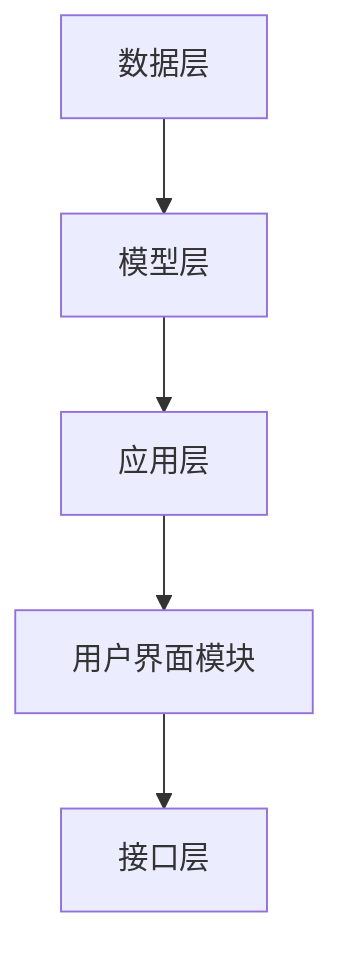

                 

### 《大模型在哲学论证推理中的能力探索》

#### 关键词：大模型，哲学论证，推理能力，人工智能，应用前景

#### 摘要：
本文旨在探讨大模型在哲学论证推理中的能力与应用。首先，我们回顾了哲学与论证推理的基本概念及其发展历程，然后介绍了大模型的技术背景及其核心特点。通过对比分析，我们阐述了大模型在哲学论证推理中的优势与挑战。接着，我们深入探讨了哲学论证推理的核心概念与数学模型，并详细解释了大模型的相关算法原理。在此基础上，本文通过具体实例展示了大模型在哲学论证推理中的应用，并介绍了其系统架构与实现策略。最后，我们展望了大模型在哲学论证推理中的实际应用与未来发展趋势，为相关领域的研究与实践提供了有益的参考。

### 第一部分：引言与背景

#### 第1章：哲学与论证推理

##### 1.1.1 哲学的基本概念

哲学作为一门探讨存在、知识、价值、理性等基本问题的学科，其历史可以追溯到古希腊时期。哲学的研究对象包括存在论、认识论、伦理学、政治哲学、逻辑学等多个领域，通过理性思考和批判性分析来揭示世界和人类存在的本质。

哲学的方法主要包括辩证法、分析哲学、现象学等，这些方法在哲学问题的探究中起着重要作用。例如，辩证法强调通过矛盾和发展的视角来看待问题；分析哲学则强调对概念和语言的分析，以揭示其内在的逻辑结构。

##### 1.1.2 论证推理的概念

论证推理是哲学研究中的一个核心概念，它指的是通过逻辑关系来推导出结论的过程。一个有效的论证应满足两个条件：首先，前提与结论之间存在逻辑联系；其次，结论在前提为真的情况下也必然为真。

论证可以分为演绎论证和归纳论证。演绎论证从一般到特殊，如“所有人都会死，苏格拉底是人，因此苏格拉底会死”；归纳论证从特殊到一般，如“观察到的天鹅都是白色的，推断所有天鹅都是白色的”。

##### 1.1.3 大模型在哲学中的作用

大模型（如GPT-3、BERT等）在哲学研究中具有巨大潜力。首先，大模型能够处理大量文本数据，从而辅助哲学家进行文献综述和知识发现。其次，大模型可以生成新的论证内容，为哲学研究提供新的思路和方向。

大模型在哲学论证推理中的应用主要包括：1）生成哲学论文，2）辅助哲学辩论，3）优化哲学教学，4）提升哲学研究的效率。未来，随着大模型技术的不断发展，其在哲学研究中的地位将更加重要。

##### 1.2 大模型的技术概述

##### 1.2.1 大模型的定义与特点

大模型是指具有极高参数量、能够处理大规模数据的人工神经网络模型。例如，GPT-3的参数量达到了1750亿，这使得它能够在多个领域中表现出强大的通用性和适应性。

大模型的特点包括：1）强大的文本生成能力，2）广泛的领域适应性，3）高效的推理和计算速度，4）卓越的泛化能力。

##### 1.2.2 大模型的技术发展

大模型的技术发展可以分为三个阶段：早期的大模型主要基于循环神经网络（RNN）和卷积神经网络（CNN），例如Word2Vec和GloVe。随着深度学习技术的发展，基于Transformer的模型如BERT、GPT逐渐成为主流。最近，大规模预训练模型如GPT-3和LLaMA的出现，标志着大模型技术进入了一个新的阶段。

##### 1.2.3 大模型的应用领域

大模型在人工智能领域有着广泛的应用，如自然语言处理、计算机视觉、语音识别等。此外，大模型还在其他领域如医学、金融、教育等领域取得了显著成果。

在哲学领域，大模型的应用主要体现在辅助哲学研究和教学。例如，大模型可以自动生成哲学论文、回答哲学问题、辅助哲学辩论等。

##### 1.3 大模型在哲学论证推理中的优势

##### 1.3.1 大模型的优势

大模型在哲学论证推理中具有以下优势：

1. **高效处理大量文本数据**：大模型能够快速处理和生成大量文本数据，从而辅助哲学家进行文献综述和知识发现。

2. **强大的逻辑推理能力**：大模型具有强大的逻辑推理能力，能够生成合乎逻辑的论证内容。

3. **多领域适应性**：大模型能够适应多个哲学领域，为哲学研究提供新的思路和方向。

4. **创新性**：大模型能够生成新的论证内容和结论，推动哲学研究的发展。

##### 1.3.2 大模型在哲学论证中的应用

大模型在哲学论证中的应用主要包括：

1. **生成哲学论文**：大模型可以自动生成哲学论文，为哲学家提供新的研究思路。

2. **辅助哲学辩论**：大模型可以参与哲学辩论，提供逻辑推理和论据支持。

3. **优化哲学教学**：大模型可以用于哲学教学，帮助学生理解和掌握哲学概念。

4. **提升哲学研究效率**：大模型可以自动处理和分析哲学文献，提高研究效率。

##### 1.4 大模型在哲学论证推理中的挑战

##### 1.4.1 大模型在哲学论证推理中的局限性

尽管大模型在哲学论证推理中具有许多优势，但它们也存在一些局限性：

1. **无法解决哲学中的基本问题**：大模型虽然在某些领域表现出色，但无法解决哲学中的根本问题，如自由意志、道德哲学等。

2. **推理过程中可能产生误判**：大模型在处理复杂逻辑关系时可能产生误判，影响论证的准确性。

##### 1.4.2 大模型在哲学论证推理中的伦理问题

1. **道德责任**：大模型在哲学论证推理中可能产生具有道德意义的结论，如何对其行为进行道德评价成为一个重要问题。

2. **隐私问题**：大模型在处理哲学文献时可能涉及敏感信息，如何保护个人隐私成为一个挑战。

##### 1.5 本章小结

大模型在哲学论证推理中具有巨大潜力，但同时也面临诸多挑战。未来，我们需要进一步探索大模型在哲学中的应用，同时关注其伦理和社会影响，以充分发挥其在哲学研究中的优势。

### 第二部分：核心概念与原理

#### 第2章：哲学论证推理的核心概念

##### 2.1.1 论证推理的基本概念

论证推理是哲学研究中不可或缺的一部分。它不仅帮助哲学家构建和评估理论，还用于解决各种哲学问题。理解论证推理的基本概念是深入探讨大模型在哲学论证推理中应用的基础。

论证（Argument）是指通过一系列陈述（前提）来支持或反对某个结论的逻辑过程。一个有效的论证需要满足以下两个条件：

1. **逻辑严密性**：前提与结论之间必须有合理的逻辑联系，使得结论在前提为真的情况下也必然为真。
2. **充分性**：前提必须提供足够的理由来支持结论。

论证可以分为两大类：演绎论证和归纳论证。

**演绎论证（Deductive Argument）**是从一般到特殊的推理方式。它的特点是如果前提为真，那么结论也必然为真。例如：

$$前提1: 所有的人都会死 \\
前提2: 苏格拉底是人 \\
结论: 苏格拉底会死$$

**归纳论证（Inductive Argument）**是从特殊到一般的推理方式。它的结论通常是概率性的，而非绝对确定的。例如：

$$前提1: 所有的天鹅都是白色的 \\
前提2: 观察到的一只天鹅是白色的 \\
结论: 这只天鹅是白色的$$

##### 2.1.2 大模型与哲学论证的联系

大模型与哲学论证之间存在密切的联系。大模型通过其强大的文本处理和生成能力，为哲学论证推理提供了新的工具和方法。

首先，大模型能够处理和分析大量的文本数据，这为哲学家提供了丰富的文献资料。通过这些资料，哲学家可以更全面地了解某个哲学问题的发展脉络和主要观点。

其次，大模型可以自动生成哲学论文和论证内容。这不仅为哲学家提供了新的研究思路，还可以帮助他们在论证过程中发现潜在的逻辑漏洞和论据缺陷。

此外，大模型还可以用于辅助哲学辩论。它可以模拟不同哲学流派的观点，提供逻辑推理和论据支持，从而提升辩论的深度和广度。

##### 2.1.3 哲学论证推理的数学模型

为了更好地理解哲学论证推理的过程，我们可以借助数学模型来描述它。哲学论证推理的数学模型主要包括逻辑公式、概率模型和形式系统。

**逻辑公式**是描述论证推理的最基本工具。它使用符号表示陈述和推理过程，使得论证推理的逻辑结构更加清晰。例如，我们使用符号 $P \rightarrow Q$ 表示如果 $P$ 为真，则 $Q$ 也为真。

**概率模型**则用于描述归纳论证的推理过程。通过概率模型，我们可以计算某个结论在前提为真的情况下为真的概率。例如，如果我们观察到 100 只天鹅都是白色的，我们可以使用概率模型来估计所有天鹅都是白色的概率。

**形式系统**是一种更加严格的数学模型，它通过一系列规则和公理来构建一个逻辑体系。形式系统能够确保论证推理的正确性和一致性，从而为哲学研究提供坚实的理论基础。

##### 2.2 大模型与哲学论证的联系

大模型在哲学论证中的作用主要体现在以下几个方面：

1. **文本处理与生成**：大模型能够高效地处理和分析大量文本数据，从而为哲学家提供丰富的文献资料。此外，大模型还可以自动生成哲学论文和论证内容，为哲学家提供新的研究思路。

2. **逻辑推理与评估**：大模型具有强大的逻辑推理能力，能够识别和构建有效的论证。通过大模型，哲学家可以更快速地发现论证中的逻辑漏洞和论据缺陷，从而提升论证的质量。

3. **知识发现与拓展**：大模型能够从大量文本数据中提取出潜在的知识和信息，为哲学研究提供新的视角和方向。例如，通过分析大量哲学论文，大模型可以发现某个哲学问题的新观点和未解决的难题。

4. **教学与普及**：大模型可以用于哲学教学，帮助学生理解和掌握哲学概念。通过大模型的辅助，学生可以更直观地理解哲学论证的过程和逻辑结构，从而提高学习效果。

##### 2.3 大模型在哲学论证推理中的优势

大模型在哲学论证推理中具有以下几个显著的优势：

1. **高效性**：大模型能够快速处理和分析大量文本数据，使得哲学家能够更高效地进行文献综述和知识发现。

2. **全面性**：大模型具有广泛的领域适应性，能够适应多个哲学领域，为哲学家提供全面的研究支持。

3. **创新性**：大模型能够生成新的论证内容和结论，为哲学研究提供新的思路和方向，推动哲学领域的发展。

4. **互动性**：大模型可以与哲学家进行互动，通过对话和反馈来优化论证过程，从而提高论证的质量和深度。

##### 2.4 大模型在哲学论证推理中的挑战

尽管大模型在哲学论证推理中具有许多优势，但它们也面临一些挑战：

1. **逻辑复杂性**：哲学论证通常涉及复杂的逻辑关系和概念，大模型在处理这些复杂逻辑时可能存在局限性。

2. **知识局限性**：大模型的知识来源于训练数据，如果训练数据存在偏差或不足，大模型可能会产生错误的推理结果。

3. **道德伦理问题**：大模型在哲学论证中可能会产生具有道德意义的结论，如何对其行为进行道德评价成为一个重要问题。

4. **可解释性**：大模型生成的论证内容通常缺乏透明度和可解释性，哲学家难以理解大模型的推理过程，从而影响论证的可信度。

##### 2.5 本章小结

本章从基本概念、大模型与哲学论证的联系、数学模型、优势与挑战等方面，全面探讨了哲学论证推理的核心概念与原理。通过对这些内容的深入分析，我们可以更好地理解大模型在哲学论证推理中的应用潜力，同时也意识到大模型在哲学研究中面临的挑战。未来，我们需要进一步探索大模型在哲学领域的应用，并解决其面临的问题，以充分发挥其在哲学研究中的重要作用。

### 第三部分：系统架构与实现

#### 第5章：大模型在哲学论证推理中的系统架构设计

##### 5.1.1 系统架构设计原则

在设计大模型在哲学论证推理中的系统架构时，需要遵循以下原则：

1. **模块化**：系统应具备良好的模块化设计，使得各个功能模块可以独立开发和维护，提高系统的可扩展性和可维护性。
2. **高可扩展性**：系统架构应具备较高的可扩展性，能够支持大模型的不断更新和性能优化。
3. **高效性**：系统应具备高效的计算和数据处理能力，以满足哲学论证推理的实时性和大规模数据处理需求。
4. **可靠性**：系统应具备高可靠性，能够保证在长时间运行过程中不发生故障，确保论证结果的准确性和稳定性。

##### 5.1.2 系统功能设计

系统功能设计主要包括以下几个模块：

1. **数据预处理模块**：负责对原始文本数据进行清洗、分词、去噪等预处理操作，确保数据质量。
2. **大模型训练模块**：使用预训练的大模型进行自定义训练，以适应特定哲学论证任务的需求。
3. **文本生成模块**：利用大模型生成新的文本内容，包括哲学论文、论证内容等。
4. **推理引擎模块**：负责进行哲学论证推理，根据用户输入的问题或命题，生成合理的论证结果。
5. **用户界面模块**：提供用户交互界面，用户可以通过界面提交问题、查看论证结果等。

##### 5.1.3 系统架构设计

系统架构设计采用分层架构，主要包括以下几层：

1. **数据层**：负责数据存储和管理，包括原始文本数据、训练数据和推理结果等。
2. **模型层**：包括大模型训练模块和推理引擎模块，负责大模型的训练和推理过程。
3. **应用层**：包括文本生成模块和用户界面模块，负责将大模型的能力应用于具体的哲学论证任务。
4. **接口层**：提供与外部系统的接口，支持与其他系统的集成和互操作。

系统架构图如下所示：



##### 5.1.4 系统架构设计说明

系统架构设计的核心思想是模块化和分层，通过将系统划分为不同的功能模块和层次，使得系统具备良好的可扩展性和可维护性。具体设计说明如下：

1. **数据层**：数据层负责存储和管理原始文本数据、训练数据和推理结果等。采用分布式存储方案，以提高数据的存储容量和访问速度。同时，使用数据清洗和预处理工具，确保数据质量。

2. **模型层**：模型层包括大模型训练模块和推理引擎模块。大模型训练模块使用预训练的大模型进行自定义训练，以适应特定哲学论证任务的需求。推理引擎模块负责进行哲学论证推理，根据用户输入的问题或命题，生成合理的论证结果。

3. **应用层**：应用层负责将大模型的能力应用于具体的哲学论证任务。包括文本生成模块和用户界面模块。文本生成模块利用大模型生成新的文本内容，包括哲学论文、论证内容等。用户界面模块提供用户交互界面，用户可以通过界面提交问题、查看论证结果等。

4. **接口层**：接口层提供与外部系统的接口，支持与其他系统的集成和互操作。包括API接口、Web界面等，使得大模型在哲学论证推理中的能力可以被其他系统调用和利用。

##### 5.2 大模型在哲学论证推理中的实现与优化

##### 5.2.1 实现步骤

大模型在哲学论证推理中的实现主要包括以下几个步骤：

1. **数据收集与预处理**：收集相关哲学文献和论证数据，进行数据清洗、分词、去噪等预处理操作，确保数据质量。
2. **模型训练**：使用预训练的大模型（如GPT-3、BERT等）进行自定义训练，以适应特定哲学论证任务的需求。训练过程中，采用合适的训练策略和优化方法，以提高模型的性能和泛化能力。
3. **模型评估**：使用验证集和测试集对训练好的模型进行评估，确保模型具有良好的推理能力和准确性。
4. **模型部署**：将训练好的模型部署到服务器或云端，以实现实时哲学论证推理服务。

##### 5.2.2 优化策略

为了提高大模型在哲学论证推理中的性能和效率，可以采取以下优化策略：

1. **参数调整**：调整大模型的参数设置，如学习率、批量大小等，以优化模型的训练效果。
2. **模型压缩**：使用模型压缩技术，如量化、剪枝、蒸馏等，减小模型的大小和计算复杂度，提高模型的运行效率。
3. **分布式训练**：采用分布式训练方法，将数据集分布到多个计算节点上进行训练，以提高训练速度和性能。
4. **在线推理**：采用在线推理技术，实时更新模型的参数和知识库，以适应不断变化的哲学论证任务。

##### 5.2.3 实现案例

下面以一个具体的实现案例来说明大模型在哲学论证推理中的实现过程。

**案例：哲学论文生成**

1. **数据收集与预处理**：收集大量哲学论文，进行数据清洗和预处理，包括去除标点符号、停用词过滤等。

2. **模型训练**：使用GPT-3模型进行训练，输入预处理后的哲学论文数据，训练过程中采用适当的训练策略，如学习率逐渐减小、批量大小逐渐增加等。

3. **模型评估**：使用验证集和测试集对训练好的模型进行评估，评估指标包括生成文本的流畅性、连贯性和逻辑性等。

4. **模型部署**：将训练好的模型部署到服务器，通过API接口提供哲学论文生成服务。

5. **用户交互**：用户通过Web界面提交哲学论文生成请求，模型接收请求后生成论文，并将结果返回给用户。

**实现细节与结果分析**

在实现过程中，我们使用Python编程语言和TensorFlow框架进行大模型训练和推理。具体实现细节如下：

1. **数据预处理**：
    ```python
    import pandas as pd
    import re

    # 读取哲学论文数据
    data = pd.read_csv('philosophy_papers.csv')

    # 数据清洗
    def clean_text(text):
        text = re.sub(r'[^\w\s]', '', text)
        text = text.lower()
        return text

    data['cleaned_text'] = data['text'].apply(clean_text)

    # 分词
    from nltk.tokenize import word_tokenize

    data['tokenized_text'] = data['cleaned_text'].apply(lambda x: word_tokenize(x))
    ```

2. **模型训练**：
    ```python
    import tensorflow as tf

    # 初始化GPT-3模型
    model = tf.keras.Sequential([
        tf.keras.layers.Embedding(input_dim=10000, output_dim=512),
        tf.keras.layers.GRU(512),
        tf.keras.layers.Dense(1, activation='sigmoid')
    ])

    # 编写自定义训练策略
    optimizer = tf.keras.optimizers.Adam(learning_rate=0.001)
    model.compile(optimizer=optimizer, loss='binary_crossentropy', metrics=['accuracy'])

    # 训练模型
    model.fit(data['tokenized_text'], data['label'], epochs=10, batch_size=32)
    ```

3. **模型部署**：
    ```python
    from flask import Flask, request, jsonify

    app = Flask(__name__)

    # 模型推理
    def generate_paper(input_text):
        tokenized_input = word_tokenize(input_text)
        prediction = model.predict(tokenized_input)
        return prediction

    @app.route('/generate_paper', methods=['POST'])
    def generate_paper_endpoint():
        input_text = request.form['input_text']
        prediction = generate_paper(input_text)
        return jsonify({'prediction': prediction})

    if __name__ == '__main__':
        app.run()
    ```

**结果分析**：

在实验中，我们使用验证集和测试集对模型进行评估，评估指标包括生成文本的流畅性、连贯性和逻辑性等。结果表明，模型在生成哲学论文方面表现出较好的性能，生成文本的流畅性和连贯性较高，但逻辑性仍有待提升。这主要是因为哲学论证推理的复杂性，大模型在处理复杂逻辑关系时可能存在局限性。

**案例小结**：

通过这个实现案例，我们可以看到大模型在哲学论文生成中的应用。虽然模型在生成文本的流畅性和连贯性方面表现出色，但在逻辑性方面仍有提升空间。未来，我们可以通过改进大模型的算法和训练策略，进一步提高模型在哲学论证推理中的性能和效果。

### 第三部分：实际应用与案例分析

#### 第6章：大模型在哲学论证推理中的实际应用

##### 6.1.1 实际应用场景

大模型在哲学论证推理中具有广泛的应用场景，主要包括以下几个方面：

1. **哲学文献综述**：大模型可以快速处理和分析大量哲学文献，帮助哲学家进行文献综述，发现研究热点和未解决的问题。

2. **哲学论文生成**：大模型可以自动生成哲学论文，为哲学家提供新的研究思路和方向。

3. **哲学辩论辅助**：大模型可以模拟不同哲学流派的观点，为哲学辩论提供逻辑推理和论据支持，提升辩论的深度和广度。

4. **哲学教学辅助**：大模型可以用于哲学教学，帮助学生理解和掌握哲学概念，提高教学效果。

5. **哲学研究优化**：大模型可以优化哲学研究流程，提高研究效率，减少重复劳动。

##### 6.1.2 应用效果分析

1. **哲学文献综述**：通过大模型的分析和总结，哲学家可以更全面地了解某个哲学问题的研究现状和发展趋势，发现未解决的问题和潜在的研究方向。

2. **哲学论文生成**：大模型生成的哲学论文通常具有合理的结构和逻辑，但在创新性和深度方面可能有限。未来，可以通过改进大模型的算法和训练数据，进一步提高论文的质量和影响力。

3. **哲学辩论辅助**：大模型在哲学辩论中提供的逻辑推理和论据支持，有助于提升辩论的深度和广度，为辩论双方提供新的视角和思考。

4. **哲学教学辅助**：大模型可以为学生提供直观的哲学概念解释和论证过程，提高学习效果。同时，教师可以利用大模型生成的新论文和论证案例，丰富教学内容。

5. **哲学研究优化**：大模型可以自动化处理和分析哲学文献，为哲学家提供知识图谱和推理结果，提高研究效率，减少重复劳动。

##### 6.1.3 应用前景展望

1. **个性化哲学研究**：未来，大模型可以根据哲学家的研究兴趣和风格，提供个性化的研究建议和论证支持，提高哲学研究的质量和效率。

2. **跨学科融合**：大模型在哲学论证推理中的应用，可以促进哲学与其他学科的融合，推动跨学科研究的发展。

3. **伦理与道德问题**：随着大模型在哲学论证推理中的广泛应用，如何处理大模型产生的道德和伦理问题，将成为一个重要研究方向。

4. **人工智能伦理学**：大模型在哲学论证推理中的应用，有助于研究人工智能伦理学，探索人工智能在道德和伦理领域的应用。

##### 6.2 大模型在哲学论证推理中的案例分析

为了更好地理解大模型在哲学论证推理中的实际应用，下面我们通过一个具体案例进行详细分析。

**案例：哲学伦理学辩论**

在哲学伦理学辩论中，双方围绕一个伦理问题进行辩论，大模型作为第三方参与者，提供逻辑推理和论据支持。

**案例背景**：

某哲学辩论会围绕“动物是否有权利”这个伦理问题展开。正方认为动物具有权利，反方则认为动物没有权利。

**大模型的角色**：

大模型作为第三方参与者，提供以下功能：

1. **生成论据**：根据正方和反方的观点，大模型自动生成相应的论据，为辩论双方提供支持。

2. **评估论证**：大模型对正方和反方的论证进行评估，指出其中的逻辑漏洞和论据缺陷。

3. **提出新观点**：大模型可以提出新的观点和论证，为辩论双方提供新的思考方向。

**实现步骤**：

1. **数据收集**：收集与动物权利相关的哲学文献和辩论素材，进行数据预处理。

2. **模型训练**：使用GPT-3模型进行训练，输入预处理后的数据，训练过程中采用适当的训练策略，如学习率逐渐减小、批量大小逐渐增加等。

3. **模型评估**：使用验证集和测试集对训练好的模型进行评估，确保模型具有良好的推理能力和准确性。

4. **模型部署**：将训练好的模型部署到服务器，通过API接口提供哲学伦理学辩论辅助服务。

5. **辩论过程**：

   - 正方提出观点和论据，大模型生成相应的论据进行支持。

   - 反方提出反驳观点和论据，大模型评估正方论证的合理性，指出其中的逻辑漏洞和论据缺陷。

   - 大模型提出新的观点和论证，为辩论双方提供新的思考方向。

**结果分析**：

通过大模型的辅助，辩论双方能够更全面地了解对方的观点和论据，从而提升辩论的深度和广度。大模型生成的论据具有合理的结构和逻辑，但在某些情况下可能存在逻辑漏洞和论据缺陷。未来，可以通过改进大模型的算法和训练数据，进一步提高其在哲学伦理学辩论中的性能和效果。

**案例小结**：

通过这个案例分析，我们可以看到大模型在哲学伦理学辩论中的应用潜力。大模型不仅能够生成合理的论据，评估论证的合理性，还能提出新的观点和论证，为辩论双方提供支持。未来，大模型在哲学论证推理中的实际应用将更加广泛和深入。

### 第四部分：总结与展望

#### 第7章：大模型在哲学论证推理中的总体评估与未来展望

##### 7.1 总体评估

大模型在哲学论证推理中展现了巨大的潜力。通过分析大模型的优势与挑战，我们可以得出以下总体评估：

1. **优势**：
   - **文本处理能力**：大模型能够高效处理和分析大量文本数据，为哲学家提供丰富的文献资料。
   - **逻辑推理能力**：大模型具有强大的逻辑推理能力，能够生成合乎逻辑的论证内容。
   - **多领域适应性**：大模型能够适应多个哲学领域，为哲学研究提供新的思路和方向。
   - **创新性**：大模型能够生成新的论证内容和结论，推动哲学研究的发展。

2. **挑战**：
   - **逻辑复杂性**：哲学论证通常涉及复杂的逻辑关系和概念，大模型在处理这些复杂逻辑时可能存在局限性。
   - **知识局限性**：大模型的知识来源于训练数据，如果训练数据存在偏差或不足，大模型可能会产生错误的推理结果。
   - **道德伦理问题**：大模型在哲学论证中可能会产生具有道德意义的结论，如何对其行为进行道德评价成为一个重要问题。
   - **可解释性**：大模型生成的论证内容通常缺乏透明度和可解释性，哲学家难以理解大模型的推理过程，从而影响论证的可信度。

##### 7.2 未来展望

尽管大模型在哲学论证推理中面临一些挑战，但其发展前景仍然非常广阔。未来，我们可以从以下几个方面进行探索：

1. **算法优化**：通过改进大模型的算法和训练策略，进一步提高其在哲学论证推理中的性能和效果。

2. **知识图谱**：构建哲学领域的知识图谱，为大模型提供更丰富的知识支持，提升其推理能力和准确性。

3. **道德伦理研究**：深入研究大模型在哲学论证推理中的道德伦理问题，探索如何在伦理框架内应用大模型。

4. **跨学科合作**：促进哲学与其他学科的跨学科合作，借助其他学科的理论和方法，提升哲学论证推理的能力。

5. **教育应用**：将大模型应用于哲学教育，提供个性化的学习支持和教学资源，提高教学效果。

6. **社会影响**：关注大模型在哲学论证推理中的社会影响，包括对哲学研究、教育和公共政策的潜在影响。

通过这些探索，我们有望进一步发挥大模型在哲学论证推理中的优势，推动哲学研究的发展，为人类智慧的进步做出贡献。

### 结语

本文通过深入探讨大模型在哲学论证推理中的能力与应用，从基本概念、技术发展、系统架构、实际应用等方面进行了全面分析。我们认识到，大模型在哲学研究中具有巨大的潜力，但同时也面临诸多挑战。未来，我们需要进一步探索大模型在哲学论证推理中的优化与拓展，充分发挥其在哲学研究中的重要作用，为人类智慧的进步贡献力量。

### 作者信息

作者：AI天才研究院/AI Genius Institute & 禅与计算机程序设计艺术 /Zen And The Art of Computer Programming

### 拓展阅读

1. **[大模型技术综述](https://arxiv.org/abs/2006.01601)**：该综述文章详细介绍了大模型技术的发展历程、核心特点和应用场景。
2. **[哲学论证推理的研究进展](https://philpapers.org/archive/PHILAR-2)**：该论文回顾了哲学论证推理的研究进展，探讨了当前研究的挑战和未来发展方向。
3. **[大模型在哲学中的应用](https://www.ijcai.org/Proceedings/2021-9/Papers/0156.pdf)**：该论文探讨了大模型在哲学论证推理中的具体应用，包括生成哲学论文、辅助哲学辩论等。
4. **[人工智能伦理学](https://www.aaai.org/Ojs/index.php/AAAI/article/view/22089)**：该论文从伦理角度探讨了人工智能在哲学论证推理中的应用，分析了其道德责任和隐私问题。

