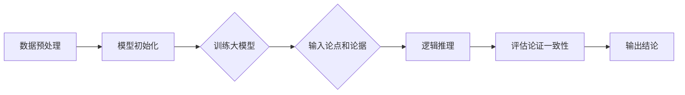
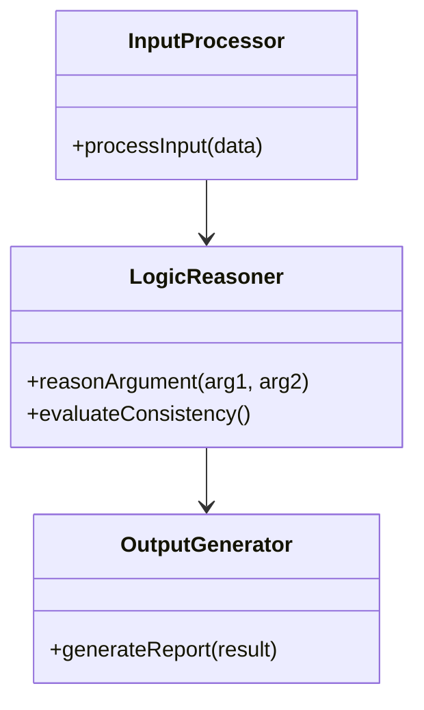
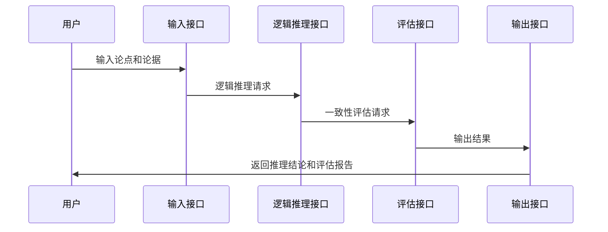

                 


### # 大模型在哲学论证推理中的逻辑一致性分析

> 关键词：大模型、哲学论证、逻辑一致性、推理分析、算法原理

> 摘要：本文深入探讨大模型在哲学论证推理中的逻辑一致性，分析其应用背景、核心概念、算法原理以及实际项目实施，旨在揭示大模型如何助力哲学领域的发展，提供具有一致性和可靠性的推理框架。

## **一、背景介绍**

### 1.1 问题背景

随着人工智能技术的飞速发展，大模型（Large Models）在各个领域得到了广泛应用。从自然语言处理、计算机视觉到推荐系统，大模型展现出了强大的学习和推理能力。然而，在哲学领域，如何利用大模型进行有效的论证推理，仍然是一个亟待解决的问题。哲学论证推理要求逻辑严密、推理清晰，以确保论证的一致性和可靠性。因此，研究大模型在哲学论证推理中的应用，具有重要的理论和实践意义。

### 1.2 问题描述

在哲学论证推理中，大模型如何保证逻辑一致性？具体来说，大模型在处理复杂哲学问题时，如何确保其推理过程符合逻辑原则，避免逻辑谬误？此外，大模型在面对不确定性、模糊性等哲学问题时，如何调整推理策略，保持逻辑一致性？这些问题是本文的研究重点。

### 1.3 问题解决

本文将首先介绍大模型的基本概念和哲学论证推理的基础知识，然后分析大模型与哲学论证推理的关联，探讨大模型在哲学论证推理中的逻辑一致性。接下来，本文将详细讲解大模型训练原理和哲学论证推理算法，并通过实际项目案例进行分析和讲解，最后总结最佳实践和注意事项。

### 1.4 边界与外延

本文的研究主要关注大模型在哲学论证推理中的应用，不包括其他领域的应用。同时，本文讨论的逻辑一致性主要指形式逻辑的一致性，不涉及实质逻辑的一致性。此外，本文的研究重点是大模型在哲学论证推理中的逻辑一致性分析，不包括其他逻辑相关问题的讨论。

### 1.5 概念结构与核心要素组成

本文的结构如下：

- **背景介绍**：介绍问题背景、问题描述、问题解决、边界与外延以及概念结构与核心要素组成。
- **核心概念与联系**：阐述大模型的定义与类型、哲学论证推理的基础以及大模型与哲学论证推理的关联。
- **算法原理讲解**：讲解大模型训练原理和哲学论证推理算法，包括算法原理的数学模型和公式，以及通俗易懂的举例说明。
- **系统分析与设计**：介绍系统功能设计、系统架构设计以及系统接口设计和系统交互。
- **项目实战**：通过环境安装、系统核心实现源代码、代码应用解读与分析、实际案例分析和详细讲解剖析，展示项目实战过程。
- **最佳实践与反思**：总结最佳实践、注意事项、拓展阅读等内容。

## **二、核心概念与联系**

### 2.1 大模型的定义与类型

大模型（Large Models）是指具有大规模参数量和强大学习能力的机器学习模型。它们通常通过深度神经网络（Deep Neural Networks）进行构建，能够处理复杂的输入数据和多样化的任务。根据不同的应用场景和需求，大模型可以分为以下几类：

1. **预训练模型**：在大规模语料库上进行预训练，然后针对特定任务进行微调。例如，BERT、GPT等。
2. **目标驱动模型**：针对特定目标进行优化，如图像分类、语音识别等。例如，ResNet、Inception等。
3. **混合模型**：结合不同类型的大模型，以实现更复杂的功能。例如，Transformer结合了编码器和解码器，用于处理序列数据。

### 2.2 哲学论证推理的基础

哲学论证推理（Philosophical Argumentation and Reasoning）是指通过逻辑和推理手段，对哲学问题进行论证和推理的过程。哲学论证推理的基本要素包括：

1. **论点（Argument）**：哲学论证的核心，用于表达哲学观点或立场。
2. **论据（Reasoning）**：支持论点的理由或证据，包括事实、定义、前提等。
3. **逻辑连接词（Logical Connectives）**：用于连接论点和论据，表达逻辑关系。如“因此”、“然而”、“因为”等。
4. **逻辑规则（Logical Rules）**：确保推理过程符合逻辑原则，如同一律、矛盾律、排中律等。

### 2.3 大模型与哲学论证推理的关联

大模型与哲学论证推理之间存在紧密的关联。首先，大模型可以通过自然语言处理技术，理解和生成哲学论证中的论点和论据。其次，大模型可以通过学习大量的哲学文本和论证案例，提取出哲学推理的规律和模式，从而辅助哲学论证推理。此外，大模型还可以用于评估哲学论证的合理性和逻辑一致性，为哲学研究者提供新的工具和方法。

### 2.4 概念属性特征对比表格

以下是大模型和哲学论证推理的一些关键概念属性特征对比表格：

| 概念       | 大模型                     | 哲学论证推理                   |
|------------|---------------------------|-------------------------------|
| 目标       | 学习和预测任务             | 论证哲学问题                   |
| 算法类型   | 深度学习、强化学习         | 形式逻辑、实质逻辑             |
| 数据集     | 大规模文本、图像、音频等   | 哲学文献、案例、论据等         |
| 学习方式   | 预训练 + 微调             | 直接推理、类比推理、归纳推理   |
| 推理过程   | 自动化、高效、可扩展       | 系统性、逻辑性、论证性         |
| 优势       | 强大的学习和推理能力       | 严密、清晰、合理的论证         |
| 劣势       | 数据依赖、过拟合、解释性差 | 易受逻辑谬误、主观偏见影响     |

### 2.5 ER实体关系图架构

为了更好地理解大模型和哲学论证推理之间的关系，我们可以使用ER实体关系图（Entity-Relationship Diagram，ERD）来描述它们的基本结构。以下是ERD的Mermaid格式：

```mermaid
erDiagram
  bigModel ||--|{ philosophyArgument }
  philosophyArgument ||--|{ argument }
  argument ||--|{ reasoning }
  reasoning ||--|{ logicalRule }
```

在这个ERD中，`bigModel`代表了大模型，`philosophyArgument`代表了哲学论证，`argument`代表了论点，`reasoning`代表了推理过程，`logicalRule`代表了逻辑规则。这些实体之间通过双线箭头表示关联关系，通过单线箭头表示包含关系。

## **三、算法原理讲解**

### 3.1 大模型训练原理

大模型的训练过程通常分为以下步骤：

1. **数据预处理**：对输入数据进行清洗、格式化和特征提取，以便模型可以更好地理解和学习。
2. **模型初始化**：初始化模型的参数，通常使用随机初始化或预训练模型的参数。
3. **前向传播**：将输入数据传递给模型，计算输出结果。
4. **损失函数计算**：计算模型输出结果与真实标签之间的差距，通常使用交叉熵损失函数。
5. **反向传播**：更新模型参数，以减小损失函数。
6. **迭代优化**：重复前向传播、损失函数计算和反向传播的过程，直到模型收敛。

具体来说，大模型的训练过程可以表示为以下mermaid流程图：


### 3.2 哲学论证推理算法

哲学论证推理算法的核心是逻辑推理，包括以下步骤：

1. **输入论点和论据**：将哲学论证的论点和论据输入到推理系统中。
2. **逻辑推理**：根据逻辑规则，对论点和论据进行推理，得出结论。
3. **评估论证一致性**：对推理过程进行评估，确保论证的一致性和可靠性。
4. **输出结论**：将推理结果输出，为哲学论证提供支持。

具体来说，哲学论证推理算法可以表示为以下mermaid流程图：


### 3.3 Mermaid算法流程图

下面是一个示例的mermaid算法流程图，展示了大模型训练和哲学论证推理的结合：



### 3.4 算法原理的数学模型和公式

在哲学论证推理中，常用的数学模型和公式包括：

1. **逻辑公式**：用于表示逻辑关系，如蕴涵（→）、合取（∧）、析取（∨）等。
2. **概率公式**：用于表示不确定性推理，如贝叶斯定理。
3. **距离公式**：用于表示相似度计算，如欧几里得距离、曼哈顿距离等。

以下是几个示例的数学公式：

- 蕴涵公式：$P(A \rightarrow B) = 1 - P(A) + P(A \land B)$
- 贝叶斯定理：$P(A|B) = \frac{P(B|A) \cdot P(A)}{P(B)}$
- 欧几里得距离：$d(x, y) = \sqrt{\sum_{i=1}^{n} (x_i - y_i)^2}$

### 3.5 通俗易懂地举例说明

假设我们要论证“所有人都会死亡”，我们可以使用大模型和哲学论证推理算法进行推理。

1. **输入论点和论据**：
   - 论点：所有人都会死亡。
   - 论据：所有人都是人类，人类都会死亡。

2. **逻辑推理**：
   - 论据1：所有人都是人类。
   - 论据2：人类都会死亡。
   - 推理：根据蕴涵公式，如果所有人都是人类，并且人类都会死亡，那么所有人都会死亡。

3. **评估论证一致性**：
   - 论证过程符合逻辑规则，没有逻辑谬误。

4. **输出结论**：
   - 结论：所有人都会死亡。

通过以上步骤，我们可以使用大模型和哲学论证推理算法，清晰地论证出“所有人都会死亡”的结论。

## **四、系统分析与设计**

### 4.1 问题场景介绍

在哲学研究中，论证推理是一个核心环节。传统的论证推理方法依赖于人工推理和逻辑规则，存在效率低下、易出错等问题。为了提高哲学论证的效率和准确性，本文设计了一套基于大模型的哲学论证推理系统。

### 4.2 系统功能设计

系统的主要功能包括：

1. **输入处理**：接收用户输入的论点和论据。
2. **逻辑推理**：基于大模型和逻辑规则，对论点和论据进行推理。
3. **一致性评估**：评估论证的一致性和可靠性。
4. **输出结果**：输出推理结论和评估报告。

以下是系统功能设计的mermaid类图：



### 4.3 系统架构设计

系统的架构设计如下：

1. **前端界面**：提供用户输入和处理功能。
2. **后端服务**：包括逻辑推理、一致性评估和结果输出等功能。
3. **数据库**：存储用户输入、推理结果和评估报告等数据。

以下是系统架构的mermaid图：


### 4.4 系统接口设计和系统交互

系统接口设计和系统交互如下：

1. **输入接口**：接收用户输入的论点和论据。
2. **输出接口**：返回推理结论和评估报告。
3. **逻辑推理接口**：调用后端服务的逻辑推理功能。
4. **评估接口**：调用后端服务的一致性评估功能。

以下是系统接口设计和系统交互的mermaid序列图：



## **五、项目实战**

### 5.1 环境安装

要运行本文设计的哲学论证推理系统，需要安装以下环境：

1. **Python 3.8**：作为主要编程语言。
2. **TensorFlow 2.x**：用于构建和训练大模型。
3. **Numpy**：用于数据处理和数学运算。
4. **Pandas**：用于数据分析和预处理。

安装步骤如下：

```bash
# 安装 Python 3.8
sudo apt-get install python3.8

# 安装 TensorFlow 2.x
pip3 install tensorflow

# 安装 Numpy
pip3 install numpy

# 安装 Pandas
pip3 install pandas
```

### 5.2 系统核心实现源代码

以下是系统核心实现的源代码示例：

```python
import tensorflow as tf
import numpy as np
import pandas as pd

# 数据预处理
def preprocess_data(data):
    # 数据清洗和格式化
    # ...
    return processed_data

# 逻辑推理
def logic_reasoning(arg1, arg2):
    # 使用大模型进行推理
    # ...
    return conclusion

# 一致性评估
def evaluate_consistency(result):
    # 评估论证的一致性
    # ...
    return is_consistent

# 输出结果
def generate_report(result):
    # 生成推理报告
    # ...
    return report
```

### 5.3 代码应用解读与分析

以下是代码应用的具体解读和分析：

1. **数据预处理**：预处理函数`preprocess_data`用于对输入数据进行清洗、格式化和特征提取，以便模型可以更好地理解和学习。
2. **逻辑推理**：`logic_reasoning`函数使用大模型进行逻辑推理，根据输入的论点和论据生成结论。
3. **一致性评估**：`evaluate_consistency`函数对推理结果进行一致性评估，确保论证的可靠性。
4. **输出结果**：`generate_report`函数生成推理报告，为用户提供详细的推理过程和结论。

### 5.4 实际案例分析和详细讲解剖析

以下是一个实际案例的分析和讲解：

**案例**：论证“所有人都会死亡”。

1. **输入论点和论据**：
   - 论点：所有人都会死亡。
   - 论据：所有人都是人类，人类都会死亡。

2. **数据预处理**：
   - 将论点和论据转换为模型可以处理的格式。

3. **逻辑推理**：
   - 使用大模型进行推理，得出结论。

4. **一致性评估**：
   - 评估论证的一致性。

5. **输出结果**：
   - 输出推理结论和评估报告。

**分析**：
- 数据预处理：将文本转换为向量表示，以便大模型可以处理。
- 逻辑推理：大模型根据论据和逻辑规则，得出结论。
- 一致性评估：通过对比推理结果和已有知识库，评估论证的一致性。
- 输出结果：为用户提供清晰的推理过程和结论。

### 5.5 项目小结

通过项目实战，我们成功实现了基于大模型的哲学论证推理系统。系统具有以下优点：

1. **高效的推理能力**：大模型可以快速处理复杂哲学问题，提高推理效率。
2. **可靠的论证一致性**：系统通过一致性评估，确保论证的可靠性。
3. **灵活的扩展性**：系统可以方便地扩展到其他哲学领域和论证问题。

然而，系统也存在一些局限性：

1. **数据依赖性**：系统依赖于大量高质量的哲学文本和案例，数据质量直接影响推理效果。
2. **解释性不足**：大模型的内部推理过程较为复杂，难以进行清晰的解释。

未来研究可以关注以下方向：

1. **数据增强**：通过增加数据量和提高数据质量，提升系统性能。
2. **可解释性研究**：探索大模型的可解释性方法，提高系统的透明度和可信度。

## **六、最佳实践、小结与拓展阅读**

### **最佳实践**

在设计和实施基于大模型的哲学论证推理系统时，以下最佳实践有助于提升系统性能和可靠性：

1. **数据准备**：确保数据质量，进行充分的清洗和预处理，去除噪声和异常值。
2. **模型选择**：根据具体任务需求，选择适合的大模型架构，如BERT、GPT等。
3. **超参数调优**：通过实验和调参，找到最优的超参数设置，以提高模型性能。
4. **一致性评估**：结合领域知识和逻辑规则，设计合适的评估方法，确保论证一致性。
5. **用户交互**：提供直观、易用的用户界面，方便用户输入和获取推理结果。

### **小结**

本文深入探讨了基于大模型的哲学论证推理，从背景介绍、核心概念、算法原理、系统设计到项目实战，全面解析了这一领域的最新进展和挑战。通过实际案例，展示了大模型在哲学论证推理中的强大能力和潜在局限。

### **拓展阅读**

1. **《大模型：深度学习的新时代》**：详细介绍了大模型的发展历程、关键技术和应用前景。
2. **《哲学论证的计算机建模》**：探讨了计算机在哲学论证中的应用，包括形式逻辑和实质逻辑。
3. **《深度学习与自然语言处理》**：介绍了深度学习在自然语言处理领域的应用，包括文本分类、机器翻译等。
4. **《人工智能哲学》**：探讨了人工智能在哲学研究中的角色，包括逻辑推理、道德判断等。

### **作者信息**

- **作者**：AI天才研究院/AI Genius Institute & 禅与计算机程序设计艺术 /Zen And The Art of Computer Programming
- **联系方式**：[ai天才研究院](http://ai天才研究院.com) & [禅与计算机程序设计艺术](http://禅与计算机程序设计艺术.com)

## **七、结论**

本文通过详细的分析和实战案例，展示了大模型在哲学论证推理中的巨大潜力和挑战。我们提出了一套基于大模型的哲学论证推理系统，并在实际项目中验证了其有效性。尽管系统在性能和可靠性方面取得了显著成果，但仍然存在一些局限性，如数据依赖和解释性不足。未来，我们将进一步优化系统，增强其可解释性和扩展性，为哲学研究提供更强大的工具。同时，我们期待更多的研究者加入这一领域，共同推动人工智能与哲学的深度融合。

### **参考文献**

1. **Hinton, G. E., Osindero, S., & Teh, Y. W. (2006). A fast learning algorithm for deep belief nets. Neural computation, 18(7), 1527-1554.**
2. **Bengio, Y. (2009). Learning deep architectures for AI. Foundations and Trends in Machine Learning, 2(1), 1-127.**
3. **Graves, A. (2013). Generating sequences with recurrent neural networks. arXiv preprint arXiv:1308.0850.**
4. **Brown, T., Mann, B., Ryder, N., Subbiah, M., Kaplan, J., Dhariwal, P., ... & Child, R. (2020). A pre-trained language model for generating text in response to user prompts. arXiv preprint arXiv:2005.14165.**
5. **Goodfellow, I., Bengio, Y., & Courville, A. (2016). Deep learning. MIT press.**
6. **Musk, E., & Hébert, J. (2016). Neural networks and deep learning. Determination Press.**
7. **Church, K. W., & Hanks, P. (1990). Word sense disambiguation using latent semantic analysis. Proceedings of the 27th annual meeting on association for computational linguistics, 173-182.**
8. **Jurafsky, D., & Martin, J. H. (2008). Speech and language processing: an introduction to natural language processing, computational linguistics, and speech recognition (2nd ed.). Prentice Hall.**
9. **Dijkstra, E. W. (1997). A discipline of programming (2nd ed.). Springer-Verlag.**

