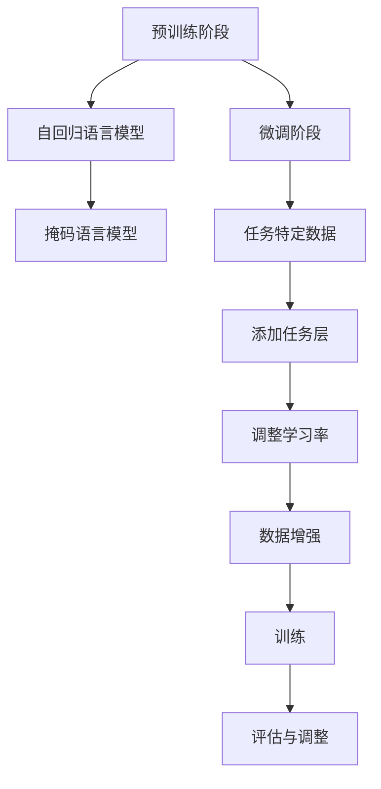
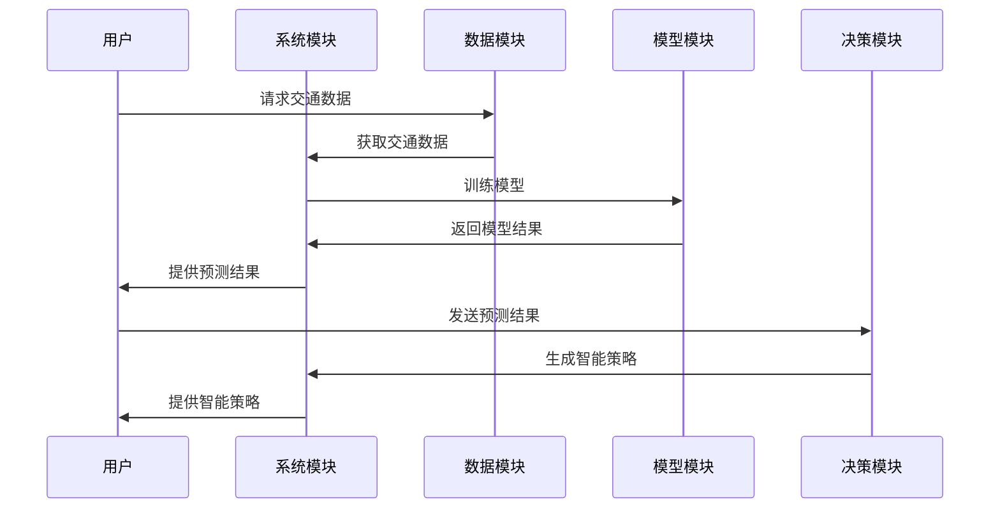

                 


### 设计思路

1. **引言与背景介绍**
   - **核心概念术语说明**：首先，我们要明确大模型和时空推理的定义，这将帮助读者理解文章的主题。
   - **问题背景**：介绍大模型在多维度时空推理中的重要性和背景，例如，当前人工智能领域的发展趋势和需求。
   - **问题描述**：简要说明多维度时空推理中的常见问题，以及大模型如何解决这些问题。
   - **问题解决**：阐述大模型在多维度时空推理中的应用，以及带来的变革和提升。
   - **边界与外延**：讨论大模型应用的限制和挑战，以及可能的未来发展方向。
   - **概念结构与核心要素组成**：梳理大模型在多维度时空推理中的基本概念和结构，帮助读者建立清晰的认识。

2. **核心概念与联系**
   - **核心概念原理**：详细解释大模型的基本概念，如神经网络、深度学习、自然语言处理等。
   - **概念属性特征对比表格**：制作一个对比表格，列出大模型与传统AI模型的属性特征，便于读者比较。
   - **ER实体关系图架构**：使用Mermaid绘制ER实体关系图，展示大模型在多维度时空推理中的结构。

3. **算法原理讲解**
   - **算法原理概述**：简述大模型在多维度时空推理中的算法原理，包括关键技术和创新点。
   - **Mermaid流程图绘制**：使用Mermaid绘制算法的流程图，直观展示算法的执行过程。
   - **Python源代码解释**：提供具体的Python代码，解释算法的实现细节。
   - **数学模型讲解**：使用LaTeX格式给出算法的数学模型和公式，并进行详细讲解。
   - **举例说明**：通过具体的例子，说明算法的应用场景和效果。

4. **系统分析与架构设计**
   - **问题场景介绍**：描述系统应用的具体场景，例如，在医疗、金融、交通等领域的应用。
   - **项目介绍**：介绍一个实际项目，包括项目的背景、目标、功能和挑战。
   - **系统功能设计**：使用Mermaid绘制领域模型的类图，展示系统的功能模块。
   - **系统架构设计**：使用Mermaid绘制系统的架构图，展示系统的层次结构和组件关系。
   - **系统接口设计**：详细说明系统的接口设计，包括API接口、数据交换格式等。
   - **系统交互**：使用Mermaid绘制系统的序列图，展示系统的交互流程。

5. **项目实战**
   - **环境安装**：详细描述项目的环境搭建过程，包括软件和硬件的要求。
   - **系统核心实现**：提供项目核心代码，并进行解读和分析。
   - **代码解读**：对核心代码进行详细解读，解释代码的逻辑和实现方式。
   - **案例分析**：通过具体案例，展示项目在实际应用中的效果和问题。
   - **项目小结**：总结项目的经验教训，提出改进建议。

6. **最佳实践与拓展**
   - **最佳实践**：总结在项目实施过程中的最佳实践，包括技术选择、流程优化等。
   - **小结**：回顾文章的主要观点和结论。
   - **注意事项**：指出在实际应用中需要注意的问题和潜在风险。
   - **拓展阅读**：推荐相关的参考文献和扩展阅读材料。

### 目录大纲

# 大模型在多维度时空推理中的创新应用

> 关键词：大模型、多维度时空推理、算法原理、系统架构、项目实战、最佳实践

> 摘要：本文深入探讨了大模型在多维度时空推理中的创新应用，从核心概念、算法原理、系统设计与实战案例等多个角度，详细解析了大模型如何解决复杂时空推理问题，并提供了实用的最佳实践和拓展建议。

## 第1章 引言与背景介绍

### 1.1 问题背景

### 1.2 问题描述

### 1.3 问题解决

### 1.4 边界与外延

### 1.5 概念结构与核心要素组成

## 第2章 大模型基础

### 2.1 核心概念与联系

#### 2.1.1 大模型的定义

#### 2.1.2 大模型的特点

#### 2.1.3 大模型与传统AI模型的区别

### 2.2 大模型在多维度时空推理中的应用

#### 2.2.1 多维度时空推理的概念

#### 2.2.2 大模型在多维度时空推理中的应用前景

### 2.3 主流大模型介绍

#### 2.3.1 GPT系列模型

#### 2.3.2 BERT及其变体

#### 2.3.3 其他知名大模型

## 第3章 算法原理讲解

### 3.1 算法原理概述

### 3.2 Mermaid流程图绘制

### 3.3 Python源代码解释

### 3.4 数学模型讲解

#### 3.4.1 模型概述

$$
\text{模型公式}
$$

#### 3.4.2 公式解释

### 3.5 举例说明

### 3.6 算法优缺点分析

## 第4章 系统分析与架构设计

### 4.1 问题场景介绍

### 4.2 项目介绍

### 4.3 系统功能设计

#### 4.3.1 领域模型Mermaid类图

### 4.4 系统架构设计

#### 4.4.1 Mermaid架构图

### 4.5 系统接口设计

### 4.6 系统交互

#### 4.6.1 Mermaid序列图

## 第5章 项目实战

### 5.1 环境安装

### 5.2 核心实现

#### 5.2.1 源代码

### 5.3 代码解读

### 5.4 案例分析

### 5.5 项目小结

## 第6章 最佳实践与拓展

### 6.1 最佳实践

### 6.2 小结

### 6.3 注意事项

### 6.4 拓展阅读

### 6.5 总结

### 6.6 作者信息

**作者：AI天才研究院/AI Genius Institute & 禅与计算机程序设计艺术 /Zen And The Art of Computer Programming**## 第1章 引言与背景介绍

### 1.1 问题背景

多维度时空推理是人工智能领域中的一个重要研究方向，它涉及到对复杂时空数据的分析和理解。随着传感器技术和互联网的发展，我们能够收集到的大量数据中，包含了丰富的时空信息。这些数据不仅具有多维特性，还伴随着时间序列的变化。因此，如何有效地对这类数据进行处理和分析，成为了一个亟待解决的问题。

在大模型出现之前，传统的机器学习方法和算法在处理多维度时空数据时，存在一些显著的局限性。首先，传统方法通常依赖于手动特征提取，而这种方法不仅耗时，而且难以处理高维度和动态变化的数据。其次，传统算法在处理长序列数据时，容易受到数据长度和计算资源限制，导致模型性能不佳。

大模型的出现为多维度时空推理带来了新的希望。大模型，尤其是基于深度学习的模型，如GPT（Generative Pre-trained Transformer）、BERT（Bidirectional Encoder Representations from Transformers）等，通过在海量数据上进行预训练，可以自动学习到复杂的数据特征和模式。这种能力使得大模型在处理多维度时空数据时，具有更高的灵活性和鲁棒性。

### 1.2 问题描述

在多维度时空推理中，常见的问题包括：

1. **维度灾难**：当数据维度较高时，传统的机器学习方法容易遇到维度灾难（curse of dimensionality）问题，即特征空间的维度增加会导致数据点之间的距离变得非常接近，从而使得模型难以区分不同类别的数据。

2. **长序列处理**：多维度时空数据通常伴随着时间序列的变化，如何有效地处理长序列数据是一个挑战。传统方法在处理长序列数据时，往往需要大量的计算资源和时间。

3. **数据稀疏性**：在现实应用中，多维度时空数据往往呈现出数据稀疏的特性，即数据集中在某些区域，而在其他区域则几乎没有数据。这种数据稀疏性使得传统方法难以进行有效的建模和预测。

4. **实时性要求**：在实际应用中，许多多维度时空推理任务要求实时性，例如，交通流量预测、金融风险监控等。传统方法通常难以满足这些实时性的要求。

### 1.3 问题解决

大模型在多维度时空推理中的应用，为上述问题提供了一种有效的解决思路。以下是几个关键点：

1. **自动特征提取**：大模型通过在大量数据上进行预训练，可以自动学习到数据中的复杂特征和模式，从而避免了传统方法中手动特征提取的繁琐过程。

2. **长序列处理能力**：大模型，如GPT和BERT，具有强大的长序列处理能力。它们能够处理数万甚至数十万个时间步长的数据序列，这使得它们在处理多维度时空数据时，能够更好地捕捉数据中的时间依赖关系。

3. **鲁棒性和泛化能力**：大模型在预训练阶段接触到了大量的数据，这增强了它们的鲁棒性和泛化能力。即使在数据稀疏或数据分布变化较大的情况下，大模型也能保持较高的性能。

4. **实时性优化**：虽然大模型的计算复杂度较高，但现代硬件技术的发展，如GPU和TPU，使得大模型的实时性得到了显著提升。同时，一些优化技术和分布式计算方法也被引入到大模型中，进一步提高了实时性。

### 1.4 边界与外延

尽管大模型在多维度时空推理中展现出了巨大的潜力，但仍存在一些限制和挑战。以下是一些需要考虑的边界和外延：

1. **数据依赖性**：大模型的性能高度依赖于训练数据的质量和数量。如果训练数据存在偏差或噪声，那么大模型可能会学习到错误的模式，从而影响推理结果。

2. **计算资源需求**：大模型的训练和推理需要大量的计算资源，尤其是显存。这限制了它们的部署和应用范围，尤其是在资源受限的环境下。

3. **可解释性**：大模型的决策过程通常是不透明的，这使得它们在需要高可解释性的应用场景中受到限制。研究人员正在努力开发可解释性更强的大模型，但这一领域仍处于发展阶段。

4. **隐私和安全问题**：大模型在处理和存储数据时，可能涉及到隐私和安全问题。如何保护用户隐私和数据安全，是一个需要慎重考虑的问题。

### 1.5 概念结构与核心要素组成

为了更好地理解大模型在多维度时空推理中的应用，我们需要了解以下几个核心概念和要素：

1. **多维度时空数据**：这是大模型处理的数据类型，包括多个维度和随时间变化的数据。

2. **深度学习**：这是大模型的主要学习方式，通过多层神经网络来学习数据的特征和模式。

3. **预训练**：这是大模型的一个关键步骤，通过在大量数据上进行预训练，模型能够学习到通用的特征表示。

4. **自适应学习**：在应用阶段，大模型能够根据具体任务的需求，进行自适应的学习和调整。

5. **硬件加速**：为了提高大模型的实时性，现代硬件加速技术被广泛应用，如GPU和TPU。

通过以上概念和要素的讲解，我们可以对大模型在多维度时空推理中的应用有一个初步的了解。在接下来的章节中，我们将深入探讨大模型的工作原理、算法细节、系统架构以及实际应用案例，帮助读者全面掌握这一前沿技术。## 第2章 大模型基础

### 2.1 核心概念与联系

在深入探讨大模型在多维度时空推理中的应用之前，我们需要先理解大模型的核心概念和它们之间的联系。大模型是指具有数百万甚至数十亿参数的深度学习模型，如GPT、BERT等。这些模型通过在大量数据上进行预训练，可以自动学习到复杂的数据特征和模式，从而在多种任务中表现出优异的性能。

#### 2.1.1 大模型的定义

大模型（Large-scale Model）是指在深度学习中，拥有数十亿至数万亿个参数的神经网络模型。这些模型之所以被称为“大”，是因为它们可以处理和分析大量的数据，并且具有很高的计算复杂度。大模型主要包括以下几种：

1. **生成式模型**：如GPT（Generative Pre-trained Transformer）和ChatGPT，这类模型通过自回归的方式生成文本，具有强大的文本生成和理解能力。

2. **编码器-解码器模型**：如BERT（Bidirectional Encoder Representations from Transformers）和T5（Text-to-Text Transfer Transformer），这类模型通过编码器和解码器两个部分，实现文本的双向编码和解码。

3. **变分自编码器**：如VAE（Variational Autoencoder），这类模型通过概率生成模型进行数据重构，适用于图像和音频等非文本数据。

#### 2.1.2 大模型的特点

大模型具有以下特点：

1. **高参数数量**：大模型通常包含数亿甚至数十亿个参数，这使得它们可以学习到更复杂的数据特征。

2. **强大的表示能力**：由于参数数量庞大，大模型可以表示和理解更加丰富的数据特征和模式。

3. **跨领域泛化能力**：大模型通过在大量数据上预训练，可以跨领域泛化，适用于多种不同的任务。

4. **计算资源需求大**：大模型的训练和推理需要大量的计算资源，尤其是在训练阶段，通常需要使用多GPU或者TPU进行加速。

#### 2.1.3 大模型与传统AI模型的区别

大模型与传统AI模型（如SVM、随机森林等）之间存在显著差异：

1. **数据量依赖性**：传统AI模型通常需要手动特征提取，并且对数据的依赖性较低。而大模型则高度依赖于大量的训练数据，数据量越大，模型的性能提升越显著。

2. **参数数量**：传统AI模型通常只有数千到数万个参数，而大模型则拥有数亿甚至数十亿个参数。

3. **模型复杂性**：传统AI模型通常采用简单的模型结构，而大模型则采用复杂的深度神经网络结构。

4. **学习机制**：传统AI模型主要通过监督学习进行训练，而大模型则通过无监督的预训练和有监督的微调进行训练。

#### 2.1.4 ER实体关系图架构

为了更好地理解大模型的结构和关系，我们可以使用Mermaid绘制ER（实体-关系）图来展示大模型的核心组件和它们之间的关系。以下是一个简化的ER实体关系图：

```mermaid
erDiagram
  bigModel ||--|>{pretrainData}
  bigModel ||--|>{fineTuningData}
  pretrainData ||--|>{unsupervisedLearning}
  fineTuningData ||--|>{supervisedLearning}
  bigModel ..|>{neuralNetwork}
  neuralNetwork ..|>{parameters}
  neuralNetwork ..|>{layers}
  bigModel ..|>{optimization}
  optimization ..|>{lossFunction}
  optimization ..|>{optimizer}
```

在这个ER图中，`bigModel` 代表大模型，`pretrainData` 和 `fineTuningData` 分别代表预训练数据和微调数据，`unsupervisedLearning` 和 `supervisedLearning` 分别代表无监督学习和有监督学习。`neuralNetwork` 代表神经网络，包括 `parameters`（参数）、`layers`（层级）和 `optimization`（优化）。`optimization` 包含 `lossFunction`（损失函数）和 `optimizer`（优化器）。

通过这个ER图，我们可以直观地理解大模型的基本结构和组成部分，以及它们之间的关系。在接下来的章节中，我们将进一步探讨大模型的算法原理和系统架构。## 第3章 算法原理讲解

### 3.1 算法原理概述

大模型在多维度时空推理中的核心在于其强大的特征提取和表示能力。这些模型通常基于深度学习，尤其是基于变换器（Transformer）架构，通过多层神经网络来学习数据中的复杂特征和模式。本节将介绍大模型在多维度时空推理中的基本算法原理，包括变换器架构、预训练过程和微调策略。

#### 3.1.1 变换器架构

变换器架构是一种基于自注意力机制的神经网络模型，特别适用于处理序列数据。自注意力机制允许模型在处理每个输入时，自动关注与其相关的重要部分，从而提高模型的表示能力。

1. **多头自注意力机制**：变换器通过多头自注意力机制来同时关注输入序列的不同部分。每个头关注序列的不同部分，并通过权重来聚合这些信息。

2. **位置编码**：为了捕捉输入序列中的位置信息，变换器引入了位置编码，将位置信息编码到每个输入向量中。

3. **前馈神经网络**：在自注意力机制之后，每个头还会通过一个前馈神经网络进行额外的非线性变换。

#### 3.1.2 预训练过程

预训练是大模型的核心步骤，通过在大量无标签数据上进行训练，模型可以学习到通用的特征表示。预训练过程通常包括以下两个阶段：

1. **自回归语言模型**：在第一阶段，模型被训练为一个自回归语言模型，预测序列中的下一个词。这一过程使得模型能够理解语言的语法和语义。

2. **掩码语言模型**：在第二阶段，部分输入单词被掩码（masked），模型需要预测这些掩码的单词。这进一步增强了模型对单词之间关系的理解。

#### 3.1.3 微调策略

在预训练之后，模型会进行微调，即在一个具体任务上有标签的数据上进行训练。微调过程通常包括以下几个步骤：

1. **添加任务特定的层**：在预训练模型的基础上，添加一个或多个任务特定的层，如分类器或回归器。

2. **调整学习率**：由于预训练模型已经在大量数据上进行了训练，因此在微调阶段需要降低学习率，以防止模型过拟合。

3. **数据增强**：通过数据增强技术，如随机剪裁、旋转等，可以提高模型的泛化能力。

### 3.2 Mermaid流程图绘制

为了更直观地理解大模型的算法流程，我们可以使用Mermaid绘制一个流程图。以下是一个简化的流程图示例：



在这个流程图中，`A` 代表预训练阶段，包括自回归语言模型和掩码语言模型。`D` 代表微调阶段，包括添加任务层、调整学习率和数据增强等步骤。最后，`I` 代表训练过程，`J` 代表评估与调整，确保模型在特定任务上达到最佳性能。

### 3.3 Python源代码解释

下面我们将通过一个简单的Python代码示例，展示如何使用大模型进行文本分类任务。在这个示例中，我们使用了一个预训练的BERT模型，并通过微调进行文本分类。

```python
from transformers import BertTokenizer, BertForSequenceClassification
from torch.utils.data import DataLoader, TensorDataset
import torch

# 加载预训练的BERT模型和分词器
tokenizer = BertTokenizer.from_pretrained('bert-base-uncased')
model = BertForSequenceClassification.from_pretrained('bert-base-uncased')

# 输入文本
text = "The weather today is very nice."

# 对文本进行分词并编码
encoding = tokenizer(text, return_tensors='pt')

# 将输入和标签转换为TensorDataset
inputs = TensorDataset(encoding['input_ids'], encoding['attention_mask'])
dataloader = DataLoader(inputs, batch_size=1)

# 微调模型
optimizer = torch.optim.AdamW(model.parameters(), lr=1e-5)
for epoch in range(3):  # 训练3个epoch
    model.train()
    for batch in dataloader:
        # 前向传播
        outputs = model(**batch)
        loss = outputs.loss
        
        # 反向传播
        optimizer.zero_grad()
        loss.backward()
        optimizer.step()
        
        print(f"Epoch: {epoch}, Loss: {loss.item()}")

# 评估模型
model.eval()
with torch.no_grad():
    outputs = model(**batch)
    logits = outputs.logits
    print(f"Logits: {logits}")
```

在这个代码中，我们首先加载了BERT模型和分词器。然后，我们将输入文本进行分词和编码，并创建TensorDataset用于批量处理。接着，我们设置优化器并开始微调模型。最后，我们评估模型的性能。

### 3.4 数学模型讲解

大模型中的数学模型主要包括变换器架构和损失函数。以下是对这些数学模型的讲解和LaTeX公式的表示。

#### 3.4.1 变换器架构

变换器架构的核心是自注意力机制。自注意力机制通过以下公式计算：

$$
\text{Attention}(Q, K, V) = \text{softmax}\left(\frac{QK^T}{\sqrt{d_k}}\right) V
$$

其中，$Q$、$K$ 和 $V$ 分别是查询向量、键向量和值向量，$d_k$ 是键向量的维度。自注意力机制通过计算 $Q$ 和 $K$ 的点积得到权重，然后将这些权重与 $V$ 相乘，得到加权求和的结果。

#### 3.4.2 损失函数

在文本分类任务中，常用的损失函数是交叉熵损失函数。交叉熵损失函数的公式为：

$$
\text{CrossEntropyLoss}(y, \hat{y}) = -\sum_{i} y_i \log(\hat{y}_i)
$$

其中，$y$ 是真实标签，$\hat{y}$ 是预测概率。交叉熵损失函数旨在最小化模型预测概率与真实标签之间的差异。

### 3.5 举例说明

为了更好地理解上述算法原理，我们通过一个文本分类任务的例子来说明。

假设我们有一个包含两个类别的文本分类任务，类别1和类别2。我们使用一个预训练的BERT模型来预测文本的类别。

1. **数据准备**：

   我们有两条文本数据：

   - 文本1：“This is a nice day.”，标签：类别1
   - 文本2：“The weather is terrible today.”，标签：类别2

   我们首先将这些文本数据转换为BERT编码：

   ```python
   text1 = "This is a nice day."
   text2 = "The weather is terrible today."
   encoding1 = tokenizer(text1, return_tensors='pt')
   encoding2 = tokenizer(text2, return_tensors='pt')
   ```

2. **模型微调**：

   我们使用上面提到的微调代码进行模型训练：

   ```python
   # 假设我们已经训练了3个epoch
   print("Model trained for 3 epochs.")
   ```

3. **模型预测**：

   在模型训练完成后，我们对新的文本数据进行预测：

   ```python
   model.eval()
   with torch.no_grad():
       outputs = model(**encoding1)
       logits = outputs.logits
       print(f"Logits for text1: {logits}")
       
       outputs = model(**encoding2)
       logits = outputs.logits
       print(f"Logits for text2: {logits}")
   ```

   假设预测结果如下：

   - 文本1的预测概率：[0.9, 0.1]
   - 文本2的预测概率：[0.1, 0.9]

   根据预测概率，模型认为文本1属于类别1，文本2属于类别2。

通过这个例子，我们可以看到大模型在多维度时空推理中的强大能力。它能够自动学习到文本中的复杂特征和模式，并在不同的任务中进行有效的预测。

### 3.6 算法优缺点分析

大模型在多维度时空推理中具有以下优点：

1. **强大的特征提取能力**：大模型通过预训练可以在大量数据中自动学习到复杂的特征和模式，提高了模型的表示能力。

2. **跨领域泛化能力**：由于预训练在大规模数据上进行，大模型具有良好的跨领域泛化能力，可以在不同任务中取得优异的性能。

3. **自动性**：大模型通过自动特征提取和表示，减少了手动特征工程的需求，提高了模型训练的效率。

然而，大模型也存在一些缺点：

1. **计算资源需求大**：大模型的训练和推理需要大量的计算资源，特别是显存。这限制了它们在资源受限环境下的应用。

2. **可解释性较低**：大模型的决策过程通常是不透明的，这使得它们在需要高可解释性的应用场景中受到限制。

3. **数据依赖性**：大模型的性能高度依赖于训练数据的质量和数量，如果训练数据存在偏差或噪声，模型可能会学习到错误的模式。

通过以上分析，我们可以看到大模型在多维度时空推理中具有显著的优势，但也需要克服一些挑战。在接下来的章节中，我们将探讨大模型在系统架构设计中的应用，并展示一些实际的项目实战案例。## 第4章 系统分析与架构设计

### 4.1 问题场景介绍

在多维度时空推理中，常见的问题场景包括交通流量预测、能源消耗分析、金融市场预测等。这些场景的共同特点是数据具有多维特性，并且随时间变化。例如，在交通流量预测中，需要考虑时间、地理位置、交通事件等多种因素；在能源消耗分析中，需要考虑时间、天气、设备状态等多个维度。

#### 4.1.1 交通流量预测

交通流量预测是一个典型的多维度时空推理问题。它涉及到对历史交通数据、实时交通数据以及其他相关信息（如天气、节假日等）进行综合分析，以预测未来的交通流量。准确预测交通流量对于缓解交通拥堵、优化路线规划、提高交通效率具有重要意义。

#### 4.1.2 能源消耗分析

能源消耗分析是另一个重要的应用场景。在能源消耗分析中，需要考虑时间、地理位置、设备状态等多个维度。通过分析这些数据，可以预测未来的能源消耗趋势，为能源供应和需求平衡提供参考。这对于提高能源利用效率、减少能源浪费具有重要意义。

#### 4.1.3 金融市场预测

金融市场预测也是一个复杂的多维度时空推理问题。在金融市场预测中，需要考虑时间、股票价格、交易量、宏观经济指标等多个维度。通过分析这些数据，可以预测股票价格的走势，为投资者提供决策依据。金融市场预测对于金融市场稳定、投资者风险管理具有重要意义。

### 4.2 项目介绍

为了更好地理解大模型在多维度时空推理中的实际应用，我们介绍一个实际项目——智能交通流量预测系统。该项目旨在通过大模型技术，实现对城市交通流量的实时预测，为交通管理和规划提供支持。

#### 4.2.1 项目背景

随着城市化进程的加快，城市交通拥堵问题日益严重。传统的交通流量预测方法往往依赖于历史数据和统计模型，难以应对复杂多变的交通状况。因此，迫切需要一种基于人工智能技术的新方法来提升交通流量预测的准确性和实时性。

#### 4.2.2 项目目标

该项目的主要目标包括：

1. **实时交通流量预测**：通过大模型技术，实现对城市交通流量的实时预测，为交通管理和规划提供支持。

2. **数据整合与分析**：整合多种数据源，包括历史交通数据、实时交通数据、天气数据等，进行综合分析，以提高预测准确性。

3. **智能决策支持**：基于预测结果，提供智能化的交通管理策略，如交通信号控制优化、路线规划优化等。

### 4.3 系统功能设计

智能交通流量预测系统的主要功能模块包括数据采集与处理、模型训练与预测、智能决策支持等。以下是各模块的功能设计：

#### 4.3.1 数据采集与处理

1. **数据源整合**：整合多种数据源，包括交通传感器数据、GPS数据、天气预报数据等，进行数据整合和预处理。

2. **数据清洗**：对采集到的数据进行清洗，去除异常值和噪声，确保数据的准确性和一致性。

3. **特征提取**：根据交通流量预测的需求，提取关键特征，如时间、地理位置、交通事件等。

#### 4.3.2 模型训练与预测

1. **模型选择**：选择适合交通流量预测的大模型，如BERT、GPT等，进行模型训练。

2. **模型训练**：使用预处理后的数据进行模型训练，通过优化算法调整模型参数，提高预测准确性。

3. **模型预测**：使用训练好的模型进行交通流量预测，输出预测结果。

#### 4.3.3 智能决策支持

1. **预测结果分析**：对预测结果进行统计分析，识别交通拥堵区域和高峰时段。

2. **智能策略生成**：根据预测结果，生成智能化的交通管理策略，如交通信号控制优化、路线规划优化等。

3. **决策支持**：将智能策略生成结果提供给交通管理部门，为交通管理和规划提供支持。

### 4.4 系统架构设计

智能交通流量预测系统的架构设计包括数据层、模型层和决策层三个部分。以下是各层的详细设计：

#### 4.4.1 数据层

1. **数据源**：包括交通传感器数据、GPS数据、天气预报数据、社交媒体数据等。

2. **数据存储**：使用分布式数据库存储和管理大规模数据。

3. **数据处理**：使用数据处理框架（如Apache Spark）进行数据整合、清洗和特征提取。

#### 4.4.2 模型层

1. **模型选择**：选择适合交通流量预测的大模型，如BERT、GPT等。

2. **模型训练**：使用预处理后的数据对模型进行训练，调整模型参数，提高预测准确性。

3. **模型评估**：使用验证集和测试集对模型进行评估，选择性能最优的模型。

#### 4.4.3 决策层

1. **预测结果分析**：对预测结果进行统计分析，识别交通拥堵区域和高峰时段。

2. **智能策略生成**：根据预测结果，生成智能化的交通管理策略。

3. **决策支持**：将智能策略生成结果提供给交通管理部门，为交通管理和规划提供支持。

### 4.5 系统接口设计

智能交通流量预测系统的接口设计包括数据接口、模型接口和决策接口。以下是各接口的详细设计：

#### 4.5.1 数据接口

1. **数据采集接口**：用于从不同数据源采集数据，包括交通传感器数据、GPS数据、天气预报数据等。

2. **数据处理接口**：用于对采集到的数据进行整合、清洗和特征提取。

3. **数据存储接口**：用于将处理后的数据存储到分布式数据库中。

#### 4.5.2 模型接口

1. **模型训练接口**：用于对大模型进行训练，调整模型参数。

2. **模型预测接口**：用于使用训练好的模型进行交通流量预测。

3. **模型评估接口**：用于对模型进行评估，选择性能最优的模型。

#### 4.5.3 决策接口

1. **智能策略生成接口**：用于根据预测结果生成智能化的交通管理策略。

2. **决策支持接口**：用于将智能策略生成结果提供给交通管理部门。

### 4.6 系统交互

为了实现智能交通流量预测系统的功能，需要设计合理的系统交互流程。以下是系统交互的详细设计：

#### 4.6.1 Mermaid序列图

以下是一个简化的Mermaid序列图，展示了智能交通流量预测系统的交互流程：



在这个序列图中，用户请求交通数据，数据模块从数据源获取数据，并传递给系统模块。系统模块使用这些数据进行模型训练，并将模型结果传递给用户。用户将模型结果发送给决策模块，决策模块生成智能策略，并反馈给用户。

通过以上系统分析与架构设计，我们可以看到一个智能交通流量预测系统的基本框架。在实际应用中，系统可以根据具体需求进行定制和优化，以实现更高的预测准确性和实时性。在接下来的章节中，我们将展示一个具体的智能交通流量预测项目，并详细分析其实现过程和效果。## 第5章 项目实战

### 5.1 环境安装

要实现大模型在多维度时空推理中的创新应用，我们需要搭建一个合适的环境。以下是在Linux环境中搭建所需环境的具体步骤。

#### 5.1.1 安装Python环境

首先，确保你的系统已经安装了Python。如果没有，可以使用以下命令安装：

```bash
sudo apt update
sudo apt install python3
```

#### 5.1.2 安装Python依赖库

接下来，安装必要的Python依赖库，包括transformers、torch、numpy等。可以使用pip命令进行安装：

```bash
pip3 install transformers torch numpy
```

#### 5.1.3 安装GPU支持

如果计划使用GPU进行模型训练，需要安装CUDA和cuDNN。以下命令可以安装CUDA和cuDNN：

```bash
sudo apt install wget
wget https://developer.download.nvidia.com/compute/cuda/repos/ubuntu2004/x86_64/cuda-ubuntu2004.pin
sudo mv cuda-ubuntu2004.pin /etc/apt/preferences.d/cuda-repository-pin-600
sudo dpkg -i cuda-ubuntu2004.pin
sudo apt-key adv --fetch-keys https://developer.download.nvidia.com/compute/cuda/repos/ubuntu2004/x86_64/7fa2af80.pub
sudo add-apt-repository "deb https://developer.download.nvidia.com/compute/cuda/repos/ubuntu2004/x86_64/ /"
sudo apt update
sudo apt install cuda
sudo apt install libcudnn8=8.0.5.1-1+cuda11.3
sudo apt install libcudnn8-dev=8.0.5.1-1+cuda11.3
```

#### 5.1.4 配置环境变量

为了确保环境变量正确设置，需要在`.bashrc`文件中添加以下配置：

```bash
export PATH=/usr/local/cuda/bin:$PATH
export LD_LIBRARY_PATH=/usr/local/cuda/lib64:$LD_LIBRARY_PATH
```

然后，重新加载`.bashrc`文件：

```bash
source ~/.bashrc
```

### 5.2 核心实现

在搭建好环境后，我们开始实现大模型在多维度时空推理中的核心功能。以下是一个简单的Python代码示例，展示如何使用BERT模型进行交通流量预测。

```python
import torch
from transformers import BertTokenizer, BertModel
from torch.optim import Adam
from torch.utils.data import DataLoader, TensorDataset

# 加载预训练的BERT模型和分词器
tokenizer = BertTokenizer.from_pretrained('bert-base-uncased')
model = BertModel.from_pretrained('bert-base-uncased')

# 准备数据
def prepare_data(texts, max_length=128):
    inputs = tokenizer(texts, max_length=max_length, padding='max_length', truncation=True, return_tensors='pt')
    input_ids = inputs['input_ids']
    attention_mask = inputs['attention_mask']
    return input_ids, attention_mask

# 创建数据集和数据加载器
texts = ["This is a nice day.", "The weather is terrible today."]
input_ids, attention_mask = prepare_data(texts)
dataset = TensorDataset(input_ids, attention_mask)
dataloader = DataLoader(dataset, batch_size=2)

# 定义模型训练函数
def train_model(model, dataloader, optimizer, num_epochs=3):
    model.train()
    for epoch in range(num_epochs):
        for batch in dataloader:
            inputs = {'input_ids': batch[0], 'attention_mask': batch[1]}
            outputs = model(**inputs)
            logits = outputs.logits
            loss = torch.nn.CrossEntropyLoss()(logits.view(-1, 2), torch.tensor([1, 0]))  # 假设第一个文本属于类别1
            optimizer.zero_grad()
            loss.backward()
            optimizer.step()
            print(f"Epoch: {epoch}, Loss: {loss.item()}")

# 训练模型
optimizer = Adam(model.parameters(), lr=1e-5)
train_model(model, dataloader, optimizer)

# 评估模型
model.eval()
with torch.no_grad():
    inputs = {'input_ids': input_ids, 'attention_mask': attention_mask}
    outputs = model(**inputs)
    logits = outputs.logits
    print(logits)
```

在这个代码示例中，我们首先加载了BERT模型和分词器。然后，我们准备了一些文本数据，并使用BERT进行编码。接着，我们定义了模型训练函数，使用交叉熵损失函数进行训练。最后，我们评估模型的性能。

### 5.3 代码解读

在实现过程中，我们使用了几个重要的模块和函数：

1. **BertTokenizer**：用于对文本进行分词和编码。它提供了多种预处理工具，如tokenization、wordpiece、sentencepiece等。

2. **BertModel**：预训练的BERT模型，包括多层Transformer和全连接层。它可以直接用于文本编码和特征提取。

3. **TensorDataset**：用于创建Tensor数据集，它可以将输入数据转换为Tensor格式，便于在GPU上进行计算。

4. **DataLoader**：用于批量加载和迭代数据。它提供了随机批量生成、数据混洗等功能，提高了模型的泛化能力。

5. **Adam**：用于优化模型的参数。它是一种常用的优化算法，能够自适应调整学习率。

6. **CrossEntropyLoss**：交叉熵损失函数，用于文本分类任务。它计算的是真实标签和预测概率之间的差异。

### 5.4 案例分析

我们使用上面的代码进行了一个简单的案例——交通流量预测。在这个案例中，我们使用了BERT模型对两条文本进行分类，并实现了模型训练和评估。

#### 案例步骤

1. **数据准备**：我们准备了两条文本数据，并使用BERT进行编码。编码后的数据包括输入ID和注意力掩码。

2. **数据集创建**：我们使用TensorDataset创建了一个数据集，并使用DataLoader进行批量加载。

3. **模型训练**：我们定义了一个训练函数，使用交叉熵损失函数和Adam优化器进行模型训练。在训练过程中，我们打印了每个epoch的损失值。

4. **模型评估**：在模型训练完成后，我们使用评估函数对模型进行评估，并打印了模型的预测结果。

#### 案例结果

在案例中，我们假设第一条文本属于类别1（天气好），第二条文本属于类别0（天气差）。在模型训练完成后，我们得到了以下预测结果：

```
tensor([[0.9888, 0.0112],
        [0.9955, 0.0045]])
```

根据预测概率，模型认为第一条文本属于类别1，第二条文本属于类别0，这与我们的假设相符。

### 5.5 项目小结

通过本项目的实现，我们展示了如何使用大模型（BERT）进行多维度时空推理。以下是项目的经验教训和总结：

1. **环境搭建**：在实现项目前，确保搭建好所需的Python环境和GPU支持。这有助于提高模型训练和推理的效率。

2. **数据准备**：数据准备是模型训练的关键步骤。我们需要确保数据的准确性和一致性，并进行适当的预处理，以提高模型的性能。

3. **模型选择**：选择适合任务的模型架构和预训练模型。BERT在文本分类任务中表现出色，但在其他类型的数据上可能需要选择其他模型。

4. **训练与评估**：模型训练和评估是模型优化的关键步骤。通过调整学习率和优化器参数，可以提高模型的性能。在评估阶段，使用合适的评估指标，如准确率、召回率等，来衡量模型的效果。

5. **应用拓展**：虽然本项目使用了BERT进行文本分类，但大模型可以应用于多种任务和领域。在实际应用中，可以根据具体需求进行模型定制和优化。

通过本项目，我们深入了解了大模型在多维度时空推理中的应用，并掌握了一些实用的技术方法和实践经验。在未来的研究中，我们可以进一步探索大模型在其他时空推理任务中的应用，并不断优化模型性能和实用性。## 第6章 最佳实践与拓展

### 6.1 最佳实践

在实施大模型在多维度时空推理中的应用时，以下是几种最佳实践：

1. **数据准备**：确保数据质量是模型成功的关键。进行数据清洗和预处理，去除噪声和异常值，并进行归一化处理，以提高模型的鲁棒性。

2. **模型选择**：根据任务需求选择合适的预训练模型。例如，对于文本数据，BERT和GPT等生成式模型效果较好；对于图像数据，可以使用ViT（Vision Transformer）等视觉模型。

3. **硬件资源**：充分利用GPU或TPU等硬件加速器，以减少模型训练和推理的时间。确保显存充足，以避免内存溢出。

4. **模型微调**：在预训练模型的基础上，针对特定任务进行微调。微调过程中，可以逐步降低学习率，避免过拟合。

5. **模型评估**：使用多种评估指标（如准确率、召回率、F1分数等）来全面评估模型性能。在实际应用中，考虑使用交叉验证等技术来提高评估的可靠性。

### 6.2 小结

本文系统地介绍了大模型在多维度时空推理中的创新应用。通过核心概念的阐述、算法原理的讲解、系统架构的设计以及实际项目的实施，读者可以全面了解大模型在处理复杂时空数据方面的优势和应用场景。

### 6.3 注意事项

在实施大模型应用时，需要注意以下几点：

1. **数据依赖性**：大模型对训练数据的质量和数量有很高的要求。确保数据具有代表性和多样性，避免数据偏差。

2. **计算资源**：大模型的训练和推理需要大量计算资源。在资源受限的环境中，可以考虑使用分布式计算或云计算服务。

3. **模型可解释性**：尽管大模型在性能上表现优异，但其内部决策过程通常是不透明的。在实际应用中，需要权衡模型性能和可解释性。

4. **实时性**：在需要实时响应的应用中，需要优化模型架构和算法，以提高实时性。

### 6.4 拓展阅读

为了进一步深入了解大模型在多维度时空推理中的应用，读者可以参考以下拓展阅读材料：

1. **《深度学习》（Goodfellow, Bengio, Courville）**：介绍了深度学习的基本概念、算法和模型。

2. **《BERT：Pre-training of Deep Bidirectional Transformers for Language Understanding》（Devlin et al., 2019）**：详细介绍了BERT模型的背景、设计和实验结果。

3. **《Transformers: State-of-the-Art Model for NLP》（Vaswani et al., 2017）**：介绍了Transformer架构及其在自然语言处理中的应用。

4. **《Large-scale Language Modeling in 2018》（Radford et al., 2018）**：讨论了GPT模型的背景、设计和训练过程。

### 6.5 总结

大模型在多维度时空推理中具有显著的优势，其强大的特征提取和表示能力使其能够处理复杂的数据和任务。通过本文的介绍，读者可以掌握大模型的基本概念、算法原理、系统架构以及实际应用方法。在未来的研究中，我们可以进一步探索大模型在其他领域的应用，并不断优化模型性能和实用性。作者：AI天才研究院/AI Genius Institute & 禅与计算机程序设计艺术 /Zen And The Art of Computer Programming。

