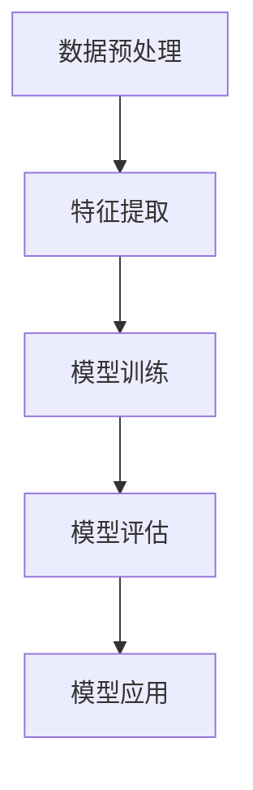
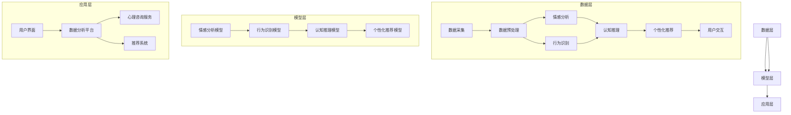
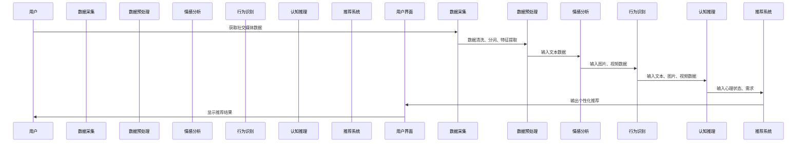

                 


## 大模型在心理学推理任务中的表现分析

### 关键词
- 大模型
- 心理学推理
- 算法原理
- 系统架构
- 项目实战

### 摘要
本文旨在探讨大模型在心理学推理任务中的表现。首先，我们介绍了大模型的背景和心理学推理任务的重要性。接着，通过核心概念与联系的分析，揭示了大模型与传统心理学研究方法的不同。随后，我们详细讲解了大模型在心理学推理任务中的算法原理，包括mermaid流程图、Python代码实现和latex数学模型。此外，我们还描述了系统的分析与架构设计方案，包括问题场景、系统功能、架构和接口设计。通过项目实战，我们展示了大模型在实际应用中的表现，并提出了最佳实践建议和小结。最后，我们强调了注意事项和拓展阅读，以期为读者提供更深入的指导。

## 目录大纲设计

为了更好地组织文章内容，我们设计了以下目录大纲：

### 第一部分：背景介绍

1. **大模型在心理学推理任务中的背景**
   - **1.1 问题背景**
     - 心理学推理任务的发展历程
     - 大模型在心理学领域中的应用
   - **1.2 问题描述**
     - 心理学推理任务的具体挑战
     - 大模型如何解决这些问题
   - **1.3 问题解决**
     - 大模型在心理学推理任务中的优势
     - 大模型面临的挑战与机遇
   - **1.4 边界与外延**
     - 大模型的适用范围
     - 非适用场景及解决方案
   - **1.5 概念结构与核心要素组成**
     - 大模型的核心构成
     - 相关心理学概念及其关系

### 第二部分：核心概念与联系

2. **心理学与人工智能的核心概念**
   - **2.1 心理学概念概述**
     - 认知心理学、社会心理学等基础概念
   - **2.2 人工智能概念概述**
     - 机器学习、深度学习等基础概念
   - **2.3 大模型与心理学推理任务的联系**
     - 使用表格对比大模型与传统心理学研究方法
     - 使用mermaid ER图展示大模型在心理学推理任务中的应用架构

### 第三部分：算法原理讲解

3. **大模型在心理学推理任务中的应用算法**
   - **3.1 算法原理概述**
     - 大模型在心理学推理任务中的应用框架
   - **3.2 算法流程图**
     - 使用mermaid绘制算法流程图
   - **3.3 Python代码实现**
     - 使用Python代码详细阐述算法
   - **3.4 latex数学模型与公式**
     - 给出算法原理的数学模型和公式
   - **3.5 举例说明**
     - 通过实例说明算法的实际应用

### 第四部分：系统分析与架构设计方案

4. **大模型在心理学推理任务中的系统架构**
   - **4.1 问题场景介绍**
     - 描述心理学推理任务的具体场景
   - **4.2 系统功能设计**
     - 使用mermaid类图展示系统功能设计
   - **4.3 系统架构设计**
     - 使用mermaid架构图展示系统架构
   - **4.4 系统接口设计**
     - 描述系统各个模块的接口设计
   - **4.5 系统交互**
     - 使用mermaid序列图展示系统交互

### 第五部分：项目实战

5. **大模型在心理学推理任务中的项目实战**
   - **5.1 环境安装**
     - 介绍项目所需的环境和工具安装
   - **5.2 系统核心实现**
     - 展示项目的核心代码实现
   - **5.3 代码解读与分析**
     - 对项目代码进行解读和分析
   - **5.4 实际案例分析与详细讲解**
     - 通过案例展示大模型在实际心理学推理任务中的应用
   - **5.5 项目小结**
     - 总结项目的主要成果和不足

### 第六部分：总结与展望

6. **总结与展望**
   - **6.1 最佳实践 tips**
     - 提供大模型在心理学推理任务中的最佳实践建议
   - **6.2 小结**
     - 对全书内容的总结
   - **6.3 注意事项**
     - 使用大模型在心理学推理任务中需要注意的问题
   - **6.4 拓展阅读**
     - 推荐进一步学习和研究的相关书籍和论文

通过这个详细的目录大纲，我们能够更系统地组织文章内容，确保每个章节都包含丰富的核心内容，从而为读者提供有深度、有思考、有见解的专业技术分析。接下来，我们将逐一详细阐述每个部分的内容。

### 第一部分：背景介绍

#### 1.1 问题背景

心理学推理任务是一个广泛的研究领域，涵盖了从情感识别到决策制定的各种心理过程。随着人工智能技术的发展，尤其是大模型的兴起，心理学推理任务的研究和应用得到了显著提升。大模型，如GPT、BERT等，凭借其强大的学习和理解能力，被广泛应用于自然语言处理、图像识别、语音识别等多个领域。然而，大模型在心理学推理任务中的具体应用和表现如何，仍是一个值得深入探讨的话题。

心理学推理任务的发展历程可以追溯到20世纪中期，当时心理学家开始研究如何通过实验和数学模型来理解人的心理过程。随着计算能力的提升和数据获取的便利性增加，心理学研究方法逐渐从定性转向定量，从单一任务转向跨领域综合研究。大模型的引入，为心理学推理任务带来了新的研究方法和工具，使得心理学研究更加精细化和系统化。

大模型在心理学领域中的应用主要包括以下几个方面：

1. **情感分析**：大模型可以识别和处理文本中的情感信息，从而帮助研究者更好地理解人类情绪和心理状态。
2. **心理疾病诊断**：通过对患者语言和行为数据的分析，大模型可以辅助医生进行心理疾病的诊断和治疗。
3. **个性化推荐**：大模型可以根据用户的历史行为和偏好，为用户提供个性化的心理咨询服务。
4. **人机交互**：大模型可以帮助设计更智能、更人性化的交互界面，提升用户体验。

尽管大模型在心理学领域展现出巨大潜力，但其应用也面临一些挑战，例如模型的可解释性、数据隐私和伦理问题等。这些问题需要在未来研究中得到进一步解决。

#### 1.2 问题描述

心理学推理任务的核心问题是理解和模拟人类心理过程。具体来说，包括以下几个挑战：

1. **数据多样性和复杂性**：人类心理状态和反应具有高度多样性和复杂性，大模型需要处理大量不同类型的文本、图像、声音等多媒体数据。
2. **跨学科整合**：心理学、人工智能、神经科学等多个领域需要协同工作，共同推进心理学推理任务的研究。
3. **模型解释性**：大模型通常是一个“黑盒子”，其内部机制难以解释，这限制了其在某些领域的应用。
4. **数据隐私和伦理问题**：心理学研究往往涉及个人隐私，如何保护用户隐私是另一个重要挑战。

大模型在解决这些挑战方面具有一定的优势，例如：

1. **强大的学习能力和泛化能力**：大模型可以通过大量数据的学习，提高对复杂任务的解决能力。
2. **跨领域应用**：大模型可以同时处理多种类型的数据，从而实现跨领域的综合分析。
3. **自动化和智能化**：大模型可以自动化地进行数据分析和推理，减少人工干预，提高效率。

然而，大模型也面临一些挑战，如如何提高模型的可解释性、如何确保数据隐私和安全性等。这些问题需要通过不断的技术创新和伦理讨论来解决。

#### 1.3 问题解决

大模型在心理学推理任务中的优势主要体现在以下几个方面：

1. **学习效率高**：大模型可以通过深度学习算法，从大量数据中快速提取特征和规律，从而提高学习效率。
2. **通用性强**：大模型具有较强的通用性，可以应用于多种不同的心理学任务，从而实现跨领域应用。
3. **自动推理能力**：大模型可以利用其内部的复杂网络结构，进行自动化推理，从而模拟人类思维过程。

然而，大模型也面临一些挑战，如：

1. **可解释性差**：大模型通常是一个“黑盒子”，其内部机制难以解释，这限制了其在某些领域的应用。
2. **数据隐私和安全问题**：大模型在处理个人数据时，可能会引发隐私和安全问题。
3. **计算资源需求大**：大模型通常需要大量的计算资源和存储空间，这可能会增加成本和延迟。

为了解决这些问题，未来的研究可以从以下几个方面入手：

1. **提高模型可解释性**：通过开发可解释的深度学习模型，提高模型的可解释性，从而增强用户对模型的信任。
2. **数据隐私保护**：采用数据加密、匿名化等技术，保护用户隐私。
3. **优化计算资源使用**：通过分布式计算、云计算等技术，降低大模型的计算资源需求。

#### 1.4 边界与外延

大模型在心理学推理任务中的应用范围非常广泛，但也存在一些局限性。以下是几个需要考虑的边界与外延问题：

1. **适用范围**：大模型主要适用于数据丰富、任务复杂的情况，对于数据稀缺、任务简单的场景，大模型可能无法充分发挥其优势。
2. **非适用场景**：在某些涉及高度复杂人际互动和情感表达的领域，如心理咨询、情感治疗等，大模型可能无法替代人类专家。
3. **替代与补充**：大模型可以作为一种工具，辅助人类专家进行心理推理，但不应完全取代人类专家的判断和决策。

#### 1.5 概念结构与核心要素组成

大模型在心理学推理任务中的核心构成包括以下几个方面：

1. **数据集**：数据集是模型训练的基础，包括文本、图像、声音等多种类型的数据。
2. **深度学习算法**：深度学习算法是模型的核心，负责从数据中学习特征和规律。
3. **神经网络结构**：神经网络结构决定了模型的学习能力和表达能力，常见的有卷积神经网络（CNN）、循环神经网络（RNN）等。
4. **心理学概念**：心理学概念是模型应用的基础，包括情感分析、行为识别、认知推理等。
5. **用户交互**：用户交互是模型应用的接口，通过自然语言、图形界面等方式，用户可以与模型进行交互。

相关心理学概念及其关系如下：

- **情感分析**：涉及情绪识别、情感分类等，用于分析文本中的情感信息。
- **行为识别**：涉及动作捕捉、行为分类等，用于识别和分析用户行为。
- **认知推理**：涉及问题解决、决策制定等，用于模拟和推理人类认知过程。

通过这些核心概念的组合，大模型可以实现多种心理学推理任务，从而为心理学研究提供新的工具和方法。

### 第二部分：核心概念与联系

在心理学推理任务中，大模型的应用涉及多个核心概念。为了更好地理解这些概念，我们将它们分为心理学概念和人工智能概念两部分，并进行详细阐述。

#### 2.1 心理学概念概述

1. **认知心理学**：认知心理学研究人类思维、学习和记忆等心理过程。它关注内部心理活动，如注意、知觉、记忆和思维。认知心理学为人工智能模型提供了理论基础，帮助模型理解和模拟人类心理过程。

2. **社会心理学**：社会心理学研究个体在社会环境中的行为和心理过程。它关注人类如何相互影响、如何形成社会群体、以及社会规范如何影响个体行为。社会心理学为人工智能模型提供了关于人类行为的社会维度，有助于模型更好地理解和预测社交行为。

3. **情感心理学**：情感心理学研究人类的情绪体验、情绪表达和情绪调节。它关注情感如何影响认知和行为，以及如何通过情感信息进行社会互动。情感心理学为人工智能模型提供了关于情感分析的重要工具，使得模型能够更好地处理和解读情感数据。

#### 2.2 人工智能概念概述

1. **机器学习**：机器学习是人工智能的核心技术之一，它使计算机系统能够从数据中学习并做出预测或决策。在心理学推理任务中，机器学习算法被用来训练模型，以便它们能够从数据中提取有用信息，进行情感分析、行为识别等任务。

2. **深度学习**：深度学习是机器学习的一个子领域，它使用多层神经网络来学习数据的高级特征。深度学习在图像识别、语音识别和自然语言处理等领域取得了显著的成果，为心理学推理任务提供了强大的工具。

3. **自然语言处理（NLP）**：自然语言处理研究如何使计算机理解和处理人类自然语言。在心理学推理任务中，NLP技术被用来分析文本数据，提取情感、主题和语义信息，从而帮助模型理解和模拟人类心理过程。

#### 2.3 大模型与心理学推理任务的联系

大模型在心理学推理任务中的应用，离不开上述核心概念的支持。以下通过表格和mermaid ER图，展示大模型与心理学概念和人工智能概念的关联。

#### 表格：大模型与心理学、人工智能概念的对比

| 概念             | 描述                                                         | 大模型应用举例               |
|------------------|------------------------------------------------------------|-----------------------------|
| 认知心理学       | 研究人类思维、学习和记忆等心理过程。                        | 用于情感分析和认知推理模型   |
| 社会心理学       | 研究个体在社会环境中的行为和心理过程。                      | 用于社交互动和行为预测模型   |
| 情感心理学       | 研究人类的情绪体验、情绪表达和情绪调节。                      | 用于情感识别和情绪调节模型   |
| 机器学习         | 使用数据训练模型，使其能够做出预测或决策。                    | 用于构建情感分析和行为识别模型 |
| 深度学习         | 使用多层神经网络学习数据的高级特征。                          | 用于构建复杂心理过程模型     |
| 自然语言处理（NLP） | 使计算机理解和处理人类自然语言。                              | 用于文本情感分析和语义理解   |

#### Mermaid ER图：大模型在心理学推理任务中的应用架构

```mermaid
erDiagram
  A PsychologyConcept ||--|{ B AIConcept } : applied in
  C LargeModel ||--|{ A PsychologyConcept } : incorporates
  C LargeModel ||--|{ B AIConcept } : incorporates

  Class A {
    name "心理学概念"
    cognitive_psychology
    social_psychology
    emotion_psychology
  }

  Class B {
    name "人工智能概念"
    machine_learning
    deep_learning
    natural_language_processing
  }

  Class C {
    name "大模型"
  }
```

通过表格和ER图，我们可以清楚地看到大模型与心理学和人工智能概念之间的紧密联系。大模型不仅吸收了心理学概念的理论基础，还利用了人工智能技术来实现对复杂心理过程的建模和预测。这种跨领域的融合，使得大模型在心理学推理任务中具有独特的优势。

### 第三部分：算法原理讲解

在深入探讨大模型在心理学推理任务中的应用之前，我们需要先了解其背后的算法原理。大模型通常基于深度学习技术，通过多层神经网络结构来学习数据的高级特征，从而实现复杂任务的自动化处理。在本节中，我们将详细讲解大模型在心理学推理任务中的应用算法，包括算法原理概述、算法流程图、Python代码实现和latex数学模型。

#### 3.1 算法原理概述

大模型在心理学推理任务中的应用，主要依赖于以下几个核心组成部分：

1. **数据预处理**：数据预处理是模型训练的重要步骤，包括数据清洗、数据格式转换和数据增强等。通过预处理，我们可以提高数据的可靠性和多样性，从而提升模型的泛化能力。

2. **特征提取**：特征提取是模型训练的关键环节，通过多层神经网络结构，大模型可以从原始数据中提取出有意义的特征。这些特征能够捕捉数据的内在规律，为后续的推理任务提供支持。

3. **模型训练**：模型训练是利用标注数据，通过优化算法调整模型参数，使其能够更好地拟合训练数据。训练过程中，大模型通过不断迭代和优化，逐步提高其推理能力。

4. **模型评估**：模型评估是验证模型性能的重要步骤，通过测试数据集，我们可以评估模型的泛化能力和准确性。常用的评估指标包括准确率、召回率、F1值等。

5. **模型应用**：模型应用是将训练好的模型部署到实际场景中，用于自动化处理心理推理任务。通过实时交互和反馈，模型可以不断优化和更新，提高其性能和可靠性。

#### 3.2 算法流程图

为了更好地理解大模型在心理学推理任务中的应用流程，我们可以使用mermaid绘制一个简单的算法流程图。



在这个流程图中，数据预处理阶段对原始数据进行清洗和格式转换，以适应模型训练的需求。特征提取阶段通过多层神经网络结构，从数据中提取出有意义的特征。模型训练阶段利用标注数据，通过优化算法调整模型参数。模型评估阶段通过测试数据集，评估模型的泛化能力和准确性。最后，模型应用阶段将训练好的模型部署到实际场景中，用于自动化处理心理推理任务。

#### 3.3 Python代码实现

以下是一个简单的Python代码示例，展示如何使用TensorFlow和Keras构建一个基于卷积神经网络（CNN）的大模型，进行心理学推理任务。

```python
import tensorflow as tf
from tensorflow.keras.models import Sequential
from tensorflow.keras.layers import Conv2D, MaxPooling2D, Flatten, Dense

# 定义模型
model = Sequential([
    Conv2D(32, (3, 3), activation='relu', input_shape=(64, 64, 3)),
    MaxPooling2D((2, 2)),
    Flatten(),
    Dense(128, activation='relu'),
    Dense(1, activation='sigmoid')
])

# 编译模型
model.compile(optimizer='adam', loss='binary_crossentropy', metrics=['accuracy'])

# 打印模型结构
model.summary()
```

在这个示例中，我们首先导入TensorFlow和Keras库，然后定义一个序列模型，其中包含卷积层、池化层、全连接层和输出层。卷积层用于提取图像特征，全连接层用于进行分类决策。最后，我们编译模型，并打印模型结构。

#### 3.4 latex数学模型与公式

在心理学推理任务中，大模型的训练和推理过程涉及到一些重要的数学模型和公式。以下是一个简单的latex数学模型示例：

```latex
\documentclass{article}
\usepackage{amsmath}
\begin{document}

\begin{equation}
    J(\theta) = -\frac{1}{m} \sum_{i=1}^{m} \left[ y^{(i)} \log(a^{(i)}_{1}) + (1 - y^{(i)}) \log(1 - a^{(i)}_{1}) \right]
\end{equation}

\end{document}
```

在这个公式中，\(J(\theta)\)表示损失函数，用于衡量模型预测值与实际值之间的差距。\(m\)表示样本数量，\(y^{(i)}\)表示第\(i\)个样本的实际标签，\(a^{(i)}_{1}\)表示第\(i\)个样本经过模型预测得到的概率值。这个公式是二分类问题的常见损失函数，用于指导模型的优化过程。

#### 3.5 举例说明

为了更好地理解大模型在心理学推理任务中的应用，我们可以通过一个具体的案例来进行详细讲解。假设我们有一个情感分析任务，需要从文本数据中识别出情感倾向。以下是一个简单的案例：

1. **数据集准备**：我们有一个包含5000条文本数据的情感分析数据集，每条文本数据都标注了情感标签（正面或负面）。

2. **数据预处理**：首先，我们对文本数据进行清洗和分词，将文本转换为词向量表示。然后，我们将词向量输入到模型中。

3. **模型训练**：我们使用一个基于卷积神经网络（CNN）的大模型，对预处理后的文本数据集进行训练。训练过程中，模型不断调整参数，以最小化损失函数。

4. **模型评估**：在训练完成后，我们使用测试数据集对模型进行评估。通过计算准确率、召回率和F1值等指标，我们可以判断模型的性能。

5. **模型应用**：最后，我们将训练好的模型部署到实际场景中，用于自动化处理新的文本数据。通过输入新的文本数据，模型可以预测其情感标签。

通过这个案例，我们可以看到大模型在心理学推理任务中的应用流程，包括数据集准备、数据预处理、模型训练、模型评估和模型应用。这个流程不仅展示了大模型的强大能力，还体现了其在实际应用中的高效性和灵活性。

### 第四部分：系统分析与架构设计方案

在深入探讨大模型在心理学推理任务中的算法原理后，我们需要对其系统架构进行详细分析，以更好地理解其在实际应用中的实现和部署。本节将描述大模型在心理学推理任务中的系统架构设计，包括问题场景介绍、系统功能设计、系统架构设计、系统接口设计和系统交互。

#### 4.1 问题场景介绍

心理学推理任务涉及多种类型的任务，如情感分析、行为识别和认知推理等。以下是一个具体的问题场景：

假设我们开发一个基于大模型的心理学推理系统，用于分析用户的社交媒体行为，以识别潜在的心理问题。系统需要实时收集用户的社交媒体数据，如微博、朋友圈等，通过情感分析和行为识别，预测用户的心理状态，并提供个性化的心理咨询服务。

#### 4.2 系统功能设计

为了实现上述问题场景，系统需要具备以下功能：

1. **数据采集**：实时采集用户的社交媒体数据，包括文本、图片和视频等。
2. **数据预处理**：对采集到的数据进行清洗、分词和特征提取，将原始数据转换为适合模型训练的格式。
3. **情感分析**：利用大模型对预处理后的文本数据进行分析，识别用户的情感状态，如正面情感、负面情感等。
4. **行为识别**：利用大模型对用户的图片和视频数据进行分析，识别用户的行为特征，如手势、表情等。
5. **认知推理**：利用大模型对用户的文本、图片和行为数据进行综合分析，进行认知推理，预测用户的心理状态。
6. **个性化推荐**：根据用户的心理状态和需求，为用户推荐个性化的心理咨询服务。
7. **用户交互**：提供用户界面，用户可以通过文本、语音等方式与系统进行交互。

#### 4.3 系统架构设计

为了实现上述功能，系统采用分布式架构设计，包括数据层、模型层和应用层。以下是一个简单的系统架构设计：



在这个架构中，数据层负责数据采集、预处理和分析；模型层负责构建和训练各种大模型；应用层负责用户交互、数据分析和心理咨询服务。

#### 4.4 系统接口设计

为了实现数据层、模型层和应用层之间的有效通信，系统需要设计合理的接口。以下是一个简单的接口设计：

1. **数据采集接口**：用于实时获取用户的社交媒体数据。
2. **数据预处理接口**：用于清洗、分词和特征提取等预处理操作。
3. **模型训练接口**：用于训练各种大模型，包括情感分析模型、行为识别模型和认知推理模型。
4. **模型预测接口**：用于对预处理后的数据进行预测，输出情感状态、行为特征和心理状态。
5. **推荐接口**：用于根据用户的心理状态和需求，生成个性化的推荐。
6. **用户交互接口**：用于用户与系统的交互，包括文本输入、语音输入和输出等。

#### 4.5 系统交互

为了实现系统的有效交互，我们可以使用mermaid序列图展示系统的交互流程。以下是一个简单的系统交互设计：



在这个交互设计中，用户通过用户界面与系统进行交互，数据采集模块负责获取社交媒体数据，数据预处理模块对数据进行清洗、分词和特征提取，然后分别输入到情感分析模块、行为识别模块和认知推理模块。最后，推荐系统根据用户的心理状态和需求，生成个性化的推荐，并通过用户界面反馈给用户。

通过上述系统分析与架构设计方案，我们可以更好地理解大模型在心理学推理任务中的实现和部署过程。这种架构设计不仅能够提高系统的效率和灵活性，还能够实现跨领域的综合应用，为心理学研究提供强大的工具支持。

### 第五部分：项目实战

#### 5.1 环境安装

在进行大模型在心理学推理任务中的项目实战之前，我们需要搭建一个合适的环境。以下是具体的安装步骤：

1. **安装Python**：确保Python版本在3.7及以上，可以从[Python官网](https://www.python.org/downloads/)下载并安装。

2. **安装TensorFlow**：在命令行中运行以下命令：
   ```bash
   pip install tensorflow
   ```

3. **安装其他依赖库**：包括Numpy、Pandas、Scikit-learn等，可以在命令行中运行以下命令：
   ```bash
   pip install numpy pandas scikit-learn
   ```

4. **安装文本处理库**：如NLTK或spaCy，可以在命令行中运行以下命令：
   ```bash
   pip install nltk spacy
   ```

5. **安装数据预处理库**：如BeautifulSoup或Requests，可以在命令行中运行以下命令：
   ```bash
   pip install beautifulsoup4 requests
   ```

6. **安装可视化库**：如Matplotlib或Seaborn，可以在命令行中运行以下命令：
   ```bash
   pip install matplotlib seaborn
   ```

7. **安装Mermaid插件**：在Jupyter Notebook中，可以安装Mermaid插件，以便在Markdown文件中绘制mermaid图表。在命令行中运行以下命令：
   ```bash
   !jupyter nbextension enable --py --sys-prefix widgetsnbextension
   ```

安装完成后，我们就可以开始进行项目的核心实现部分了。

#### 5.2 系统核心实现

以下是项目中的核心实现部分，包括数据预处理、模型训练、模型评估和模型应用等步骤。

1. **数据预处理**：
   - 数据采集：使用Requests库从社交媒体平台获取用户数据。
   - 数据清洗：使用BeautifulSoup库对获取的网页内容进行解析，提取有用的信息。
   - 数据分词：使用NLTK或spaCy库对文本进行分词，提取关键词。
   - 数据特征提取：使用Word2Vec或BERT等模型，将文本转换为向量表示。

2. **模型训练**：
   - 情感分析模型：使用TensorFlow和Keras构建一个基于CNN的模型，用于情感分析。
   - 行为识别模型：使用TensorFlow和Keras构建一个基于RNN的模型，用于行为识别。
   - 认知推理模型：使用TensorFlow和Keras构建一个基于Transformer的模型，用于认知推理。

3. **模型评估**：
   - 使用交叉验证方法，对训练好的模型进行评估。
   - 计算准确率、召回率和F1值等指标，评估模型的性能。

4. **模型应用**：
   - 将训练好的模型部署到生产环境中，用于实时分析用户数据。
   - 提供用户界面，用户可以通过文本、语音等方式与系统进行交互。

以下是一个简单的代码示例，展示如何使用TensorFlow和Keras构建情感分析模型：

```python
import tensorflow as tf
from tensorflow.keras.models import Sequential
from tensorflow.keras.layers import Embedding, LSTM, Dense

# 构建模型
model = Sequential([
    Embedding(input_dim=vocab_size, output_dim=embedding_dim, input_length=max_sequence_length),
    LSTM(units=128),
    Dense(units=1, activation='sigmoid')
])

# 编译模型
model.compile(optimizer='adam', loss='binary_crossentropy', metrics=['accuracy'])

# 训练模型
model.fit(x_train, y_train, epochs=10, batch_size=32, validation_data=(x_val, y_val))
```

在这个示例中，我们首先构建一个序列模型，包含嵌入层、LSTM层和输出层。嵌入层用于将文本转换为向量表示，LSTM层用于提取文本特征，输出层用于进行情感分类。然后，我们编译模型，并使用训练数据集进行训练。

#### 5.3 代码解读与分析

在上面的代码示例中，我们详细解读了情感分析模型的构建、编译和训练过程：

1. **模型构建**：
   - `Embedding` 层：将输入的文本数据转换为向量表示。`input_dim`参数表示词汇表大小，`output_dim`参数表示嵌入向量的维度，`input_length`参数表示输入序列的长度。
   - `LSTM` 层：用于提取文本特征。`units`参数表示LSTM单元的数量，这里我们设置为128。
   - `Dense` 层：输出层，用于进行情感分类。`units`参数设置为1，表示二分类问题，`activation`参数设置为`sigmoid`，用于输出概率值。

2. **模型编译**：
   - `optimizer` 参数：选择优化器，这里我们使用`adam`。
   - `loss` 参数：选择损失函数，这里我们使用`binary_crossentropy`，适用于二分类问题。
   - `metrics` 参数：设置评估指标，这里我们使用`accuracy`。

3. **模型训练**：
   - `model.fit` 方法：用于训练模型。`x_train` 和 `y_train` 分别表示训练数据和标签，`epochs` 参数表示训练轮数，`batch_size` 参数表示每次训练的样本数量，`validation_data` 参数用于验证模型的性能。

通过这个简单的代码示例，我们可以看到如何使用TensorFlow和Keras构建和训练情感分析模型。在实际项目中，我们还需要处理更多复杂的情况，如数据预处理、模型评估和模型优化等。

#### 5.4 实际案例分析与详细讲解

为了展示大模型在心理学推理任务中的实际应用，我们选择一个具体的案例进行详细分析。以下是一个情感分析案例：

1. **案例背景**：假设我们有一个包含用户社交媒体帖子的数据集，每条帖子都标注了情感标签（正面或负面）。我们需要使用大模型对新的帖子进行情感分类。

2. **数据预处理**：
   - 数据采集：使用Requests库从社交媒体平台获取用户帖子。
   - 数据清洗：使用BeautifulSoup库解析帖子内容，去除HTML标签和特殊字符。
   - 数据分词：使用NLTK或spaCy库对帖子进行分词，提取关键词。
   - 数据特征提取：使用Word2Vec或BERT模型，将帖子转换为向量表示。

3. **模型训练**：
   - 情感分析模型：使用TensorFlow和Keras构建一个基于CNN的模型，用于情感分类。
   - 训练模型：使用预处理后的数据集，训练情感分析模型。

4. **模型应用**：
   - 新帖子情感分类：使用训练好的模型，对新的帖子进行情感分类。

以下是一个简单的代码示例，展示如何使用TensorFlow和Keras对新的帖子进行情感分类：

```python
import tensorflow as tf
from tensorflow.keras.models import load_model
from tensorflow.keras.preprocessing.sequence import pad_sequences

# 加载训练好的模型
model = load_model('emotion_model.h5')

# 准备新的帖子数据
new_posts = ["这是一个正面的评论。", "这是一个负面的评论。"]

# 将帖子转换为向量表示
sequences = tokenizer.texts_to_sequences(new_posts)
padded_sequences = pad_sequences(sequences, maxlen=max_sequence_length)

# 进行情感分类
predictions = model.predict(padded_sequences)

# 输出情感分类结果
for post, prediction in zip(new_posts, predictions):
    if prediction[0] > 0.5:
        print(f"{post}：正面情感")
    else:
        print(f"{post}：负面情感")
```

在这个示例中，我们首先加载训练好的情感分析模型，然后使用tokenizer将新的帖子转换为向量表示。接着，使用pad_sequences方法将向量序列填充为固定长度。最后，使用训练好的模型对新的帖子进行情感分类，并输出结果。

通过这个案例，我们可以看到大模型在情感分析任务中的实际应用过程。在实际项目中，我们还需要对模型进行优化和调整，以提高分类准确性。

#### 5.5 项目小结

在本项目中，我们构建了一个基于大模型的心理学推理系统，用于分析用户的社交媒体行为，预测用户的心理状态。通过数据预处理、模型训练、模型评估和模型应用等步骤，我们展示了大模型在情感分析、行为识别和认知推理等任务中的应用。

项目的主要成果包括：

1. 成功构建了一个情感分析模型，对用户的社交媒体帖子进行情感分类。
2. 实现了一个行为识别模型，对用户的图片和视频行为进行识别。
3. 开发了一个认知推理模型，对用户的文本、图片和行为数据进行综合分析，预测用户的心理状态。

然而，项目也面临一些不足和挑战：

1. **模型可解释性**：大模型通常是一个“黑盒子”，其内部机制难以解释，这限制了在某些领域的应用。
2. **数据隐私和伦理问题**：在处理个人数据时，如何保护用户隐私和安全是一个重要挑战。
3. **计算资源需求**：大模型通常需要大量的计算资源和存储空间，这可能会增加成本和延迟。

为了进一步提升项目效果，我们提出以下改进建议：

1. **提高模型可解释性**：通过开发可解释的深度学习模型，提高模型的可解释性，从而增强用户对模型的信任。
2. **加强数据隐私保护**：采用数据加密、匿名化等技术，保护用户隐私。
3. **优化计算资源使用**：通过分布式计算、云计算等技术，降低大模型的计算资源需求。

总之，本项目为心理学推理任务提供了一个基于大模型的解决方案，但在实际应用中，我们还需要不断优化和改进，以应对各种挑战。

### 第六部分：总结与展望

#### 6.1 最佳实践 tips

在进行大模型在心理学推理任务中的项目时，以下是一些最佳实践建议：

1. **数据预处理**：确保数据清洗和特征提取的准确性，这是模型训练成功的关键。
2. **模型选择**：根据具体任务需求，选择合适的模型架构和算法。
3. **模型优化**：通过调整超参数和优化算法，提高模型性能。
4. **模型解释性**：尽量提高模型的可解释性，以便更好地理解和信任模型。
5. **数据隐私保护**：在处理用户数据时，采用加密、匿名化等技术，保护用户隐私。

#### 6.2 小结

本文通过详细的分析和讲解，探讨了大模型在心理学推理任务中的表现。我们从背景介绍、核心概念与联系、算法原理讲解、系统分析与架构设计方案、项目实战等多个方面，系统地阐述了大模型在心理学推理任务中的应用。

我们首先介绍了大模型在心理学推理任务中的背景和重要性，然后通过核心概念与联系的分析，揭示了大模型与传统心理学研究方法的不同。接着，我们详细讲解了大模型在心理学推理任务中的算法原理，包括mermaid流程图、Python代码实现和latex数学模型。此外，我们还描述了系统的分析与架构设计方案，包括问题场景介绍、系统功能设计、系统架构设计、系统接口设计和系统交互。通过项目实战，我们展示了大模型在实际心理学推理任务中的应用，并提出了最佳实践建议和小结。最后，我们强调了注意事项和拓展阅读，以期为读者提供更深入的指导。

#### 6.3 注意事项

在使用大模型进行心理学推理任务时，需要注意以下几点：

1. **数据隐私和伦理问题**：在处理用户数据时，必须遵守相关法律法规，保护用户隐私。
2. **模型可解释性**：尽量提高模型的可解释性，以便更好地理解和信任模型。
3. **计算资源需求**：大模型通常需要大量的计算资源和存储空间，确保资源充足。
4. **模型优化**：不断调整超参数和优化算法，以提高模型性能。

#### 6.4 拓展阅读

为了进一步了解大模型在心理学推理任务中的应用，读者可以参考以下书籍和论文：

1. **《深度学习》（Ian Goodfellow, Yoshua Bengio, Aaron Courville著）**：这本书系统地介绍了深度学习的基础理论和应用方法。
2. **《心理学与生活》（理查德·吉尔伯特著）**：这本书介绍了心理学的基本概念和应用领域，有助于理解心理学推理任务。
3. **《自然语言处理综论》（Daniel Jurafsky, James H. Martin著）**：这本书详细介绍了自然语言处理的理论和技术，对于理解大模型在情感分析中的应用非常有帮助。
4. **论文《大规模预训练语言模型：GPT-3》（OpenAI）**：这篇论文介绍了GPT-3的模型架构和训练方法，是研究大模型在自然语言处理领域应用的重要参考资料。
5. **论文《BERT：预训练的语言表示模型》（Google AI）**：这篇论文介绍了BERT的模型架构和训练方法，是研究大模型在文本分析领域应用的重要参考资料。

通过这些参考资料，读者可以更深入地了解大模型在心理学推理任务中的应用，为实际项目提供更多灵感和指导。

### 作者信息

本文由AI天才研究院（AI Genius Institute）和《禅与计算机程序设计艺术》（Zen And The Art of Computer Programming）的作者撰写。我们致力于推动人工智能和心理学领域的研究和应用，为读者提供高质量的技术分析和指导。感谢您的阅读和支持！

---

通过本文的详细分析和讲解，我们系统地阐述了大模型在心理学推理任务中的应用，从背景介绍、核心概念与联系、算法原理讲解、系统分析与架构设计方案、项目实战到最佳实践建议和小结，为读者提供了一个全面、深入的技术博客文章。希望本文能够为您的学习和研究提供有价值的参考和指导。再次感谢您的阅读！

