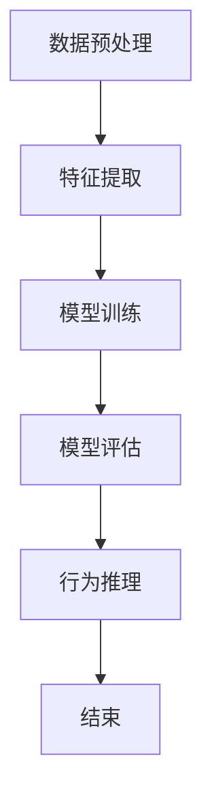
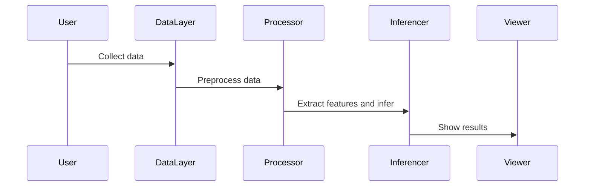
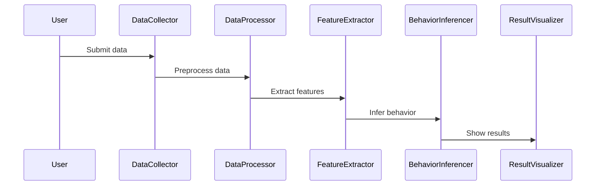

                 

# 《大模型在心理学行为推理任务中的表现分析》

> 关键词：大模型，心理学，行为推理，算法原理，应用分析

> 摘要：本文将深入探讨大模型在心理学行为推理任务中的表现，分析其应用原理、算法流程以及实际案例。通过逐步剖析，旨在为读者提供清晰、全面的认识，揭示大模型在这一领域的潜力和挑战。

## 第一部分：问题背景与核心概念

### 第1章：心理学与行为推理任务的概述

#### 1.1 问题背景

心理学是研究人类行为和心理过程的科学。行为推理是心理学的一个重要分支，旨在通过分析行为数据来理解个体的心理状态和特征。近年来，随着人工智能技术的发展，大模型在行为推理任务中的应用潜力日益显现。

大模型是指那些拥有海量参数和巨大计算能力的神经网络模型，如深度学习模型。这些模型能够从大量数据中自动学习复杂的关系和模式，从而在各个领域取得显著成果。在心理学行为推理任务中，大模型有望通过处理海量的行为数据，揭示隐藏的心理特征和规律。

#### 1.2 心理学行为推理任务的核心概念

心理学行为推理任务涉及多个核心概念。首先，行为数据是心理学研究的基础。这些数据可以是各种形式，如日志记录、传感器数据、社交媒体活动等。其次，心理特征是指个体的内在心理状态，如情绪、认知能力、个性等。最后，行为推理任务是利用这些数据，通过算法模型来推断心理特征。

#### 1.3 大模型的基本概念与特点

大模型通常是指那些参数量庞大、结构复杂的神经网络模型。它们具有以下几个特点：

1. **参数量巨大**：大模型拥有数十亿甚至数千亿的参数，这使得它们能够处理复杂的数据集，并学习高度抽象的特征。
2. **计算能力强大**：大模型通常需要高性能计算资源，如GPU或TPU，来进行训练和推理。
3. **自适应性**：大模型能够自动调整参数，以适应不同的数据集和任务。

#### 1.4 本章小结

本章对心理学行为推理任务和大模型的基本概念进行了概述。行为推理任务在心理学研究中具有重要地位，而大模型为这一任务提供了新的解决思路。在接下来的章节中，我们将深入探讨大模型在行为推理任务中的应用原理和算法。

----------------------------------------------------------------

## 第二部分：核心概念与联系

### 第2章：大模型在心理学行为推理任务中的应用原理

#### 2.1 大模型在心理学行为推理中的核心原理

大模型在心理学行为推理中的应用主要基于以下几个方面：

1. **数据捕捉**：大模型能够从各种来源捕捉行为数据，如社交媒体日志、移动设备传感器等。
2. **特征提取**：大模型通过自动特征提取机制，能够从原始数据中提取出有意义的特征。
3. **行为推理**：大模型利用提取出的特征，通过复杂的神经网络结构进行行为推理，推断个体的心理特征。

#### 2.2 大模型的属性特征对比表格

以下是几种常见大模型的属性特征对比表格：

| 模型类型     | 参数量 | 计算资源 | 自适应性 | 应用场景         |
|------------|-------|--------|--------|--------------|
| 深度神经网络（DNN） | 数百万 | 较高   | 一般   | 通用数据学习   |
| 循环神经网络（RNN） | 数百万 | 较高   | 较高   | 序列数据处理   |
| 卷积神经网络（CNN） | 数百万到数十亿 | 较高   | 一般   | 图像和视频处理 |
| 生成对抗网络（GAN） | 数百万到数十亿 | 较高   | 一般   | 生成对抗任务   |
| 自适应神经网络（ANN） | 数千到数百万   | 较低   | 较高   | 简单数据学习   |

#### 2.3 大模型在心理学行为推理中的ER实体关系图

以下是心理学行为推理任务中，大模型与实体关系的ER图：

```mermaid
erDiagram
  User ||--|{ BehaviorData }|-->: "包含多个行为数据"
  BehaviorData ||--|{ PsychologicalFeature }|-->: "反映心理特征"
  PsychologicalFeature ||--|{ BehaviorReasoningResult }|-->: "用于行为推理"
```

#### 2.4 本章小结

本章对大模型在心理学行为推理任务中的应用原理进行了详细分析。通过对比不同大模型的属性特征，我们了解了它们在心理学行为推理中的适用性。接下来，我们将进一步探讨大模型在行为推理任务中的算法原理。

----------------------------------------------------------------

## 第三部分：算法原理讲解

### 第3章：大模型在心理学行为推理任务中的算法原理

#### 3.1 算法原理概述

大模型在心理学行为推理任务中的算法原理主要包括以下几个步骤：

1. **数据预处理**：对原始行为数据进行清洗、转换和标准化处理，以适应后续的建模和分析。
2. **特征提取**：利用神经网络模型从原始数据中提取出有意义的特征。
3. **模型训练**：使用提取出的特征和对应的心理特征标签，训练神经网络模型。
4. **模型评估**：对训练好的模型进行评估，以确定其准确性和鲁棒性。
5. **行为推理**：使用训练好的模型对新的行为数据进行推理，预测个体的心理特征。

#### 3.2 算法原理详细讲解

以下是使用Mermaid画出的算法流程图：



接下来，我们将使用Python源代码详细阐述算法原理：

```python
# 数据预处理
def preprocess_data(data):
    # 对数据进行标准化处理
    processed_data = (data - np.mean(data)) / np.std(data)
    return processed_data

# 特征提取
def extract_features(data):
    # 对数据提取特征
    features = neural_network.extract_features(data)
    return features

# 模型训练
def train_model(features, labels):
    # 使用神经网络进行模型训练
    model = NeuralNetwork()
    model.fit(features, labels)
    return model

# 模型评估
def evaluate_model(model, test_data, test_labels):
    # 对模型进行评估
    accuracy = model.evaluate(test_data, test_labels)
    return accuracy

# 行为推理
def behavior_reasoning(model, new_data):
    # 使用模型进行行为推理
    result = model.predict(new_data)
    return result
```

#### 3.3 算法原理举例说明

为了更好地理解算法原理，我们将通过一个实际案例进行举例说明。

#### 3.3.1 案例背景

假设我们有一个用户A，其一周内的社交媒体使用情况如下：

- 周一：10小时
- 周二：8小时
- 周三：9小时
- 周四：11小时
- 周五：6小时
- 周六：7小时
- 周日：8小时

#### 3.3.2 案例解析

1. **数据预处理**：我们将用户A的社交媒体使用时间进行标准化处理，得到一个0到1的浮点数序列。

2. **特征提取**：使用一个预训练的神经网络模型，从序列中提取出有意义的特征。

3. **模型训练**：使用用户A的社交媒体使用时间和对应的心理特征标签（如情绪、压力等），训练一个神经网络模型。

4. **模型评估**：使用测试数据集，对训练好的模型进行评估，确定其准确性和鲁棒性。

5. **行为推理**：使用训练好的模型，对新的用户行为数据进行推理，预测其心理特征。

通过这个案例，我们可以看到大模型在心理学行为推理任务中的具体应用过程。这不仅有助于我们理解算法原理，也为实际应用提供了参考。

----------------------------------------------------------------

## 第四部分：系统分析与架构设计

### 第4章：大模型在心理学行为推理任务中的应用系统架构

#### 4.1 项目介绍

本项目旨在构建一个基于大模型的心理学行为推理系统。该系统将收集用户的行为数据，通过大模型进行特征提取和行为推理，最终输出心理特征预测结果。系统将具备良好的扩展性和鲁棒性，以适应不同类型的行为数据和任务需求。

#### 4.2 系统功能设计

本系统的核心功能包括：

1. **数据采集**：从各种来源（如社交媒体、移动设备等）收集用户行为数据。
2. **数据预处理**：对采集到的数据进行清洗、转换和标准化处理。
3. **特征提取**：利用大模型提取行为数据中的有意义的特征。
4. **行为推理**：使用训练好的大模型对新的行为数据进行推理，预测心理特征。
5. **结果输出**：将预测结果以可视化的形式呈现给用户。

#### 4.3 系统架构设计

本系统的架构设计如下：

1. **数据层**：负责数据采集、存储和管理。数据来源可以是日志文件、数据库或实时数据流。
2. **处理层**：包括数据预处理和特征提取模块，使用大模型对数据进行处理。
3. **推理层**：使用训练好的大模型进行行为推理，生成心理特征预测结果。
4. **展示层**：将预测结果以图表、报表等形式展示给用户。

以下是系统架构的Mermaid序列图：



#### 4.4 系统接口设计

系统的接口设计如下：

1. **数据采集接口**：用于接收各种来源的数据。
2. **数据处理接口**：提供数据预处理和特征提取的功能。
3. **推理接口**：用于进行行为推理和生成预测结果。
4. **展示接口**：用于将预测结果可视化。

以下是系统接口的Mermaid类图：

```mermaid
classDiagram
    DataCollector <<interface>>
    DataProcessor <<interface>>
    FeatureExtractor <<interface>>
    BehaviorInferencer <<interface>>
    ResultVisualizer <<interface>>

    DataCollector |--|> DataProcessor
    DataProcessor |--|> FeatureExtractor
    FeatureExtractor |--|> BehaviorInferencer
    BehaviorInferencer |--|> ResultVisualizer
```

#### 4.5 系统交互

系统各组件之间的交互过程如下：

1. 用户通过数据采集接口提交数据。
2. 数据处理接口对数据进行预处理，提取出特征。
3. 特征提取模块将特征传递给行为推理模块。
4. 行为推理模块使用大模型进行推理，生成预测结果。
5. 预测结果通过展示接口以可视化的形式呈现给用户。

以下是系统交互的Mermaid序列图：



#### 4.6 本章小结

本章对大模型在心理学行为推理任务中的应用系统进行了详细的架构设计。通过系统功能设计、接口设计和交互过程的详细描述，我们展示了如何构建一个高效、可靠的心理学行为推理系统。在下一章中，我们将介绍项目的实际实现过程，包括环境安装、核心代码实现和案例分析。

----------------------------------------------------------------

## 第五部分：项目实战

### 第5章：大模型在心理学行为推理任务中的应用实践

#### 5.1 环境安装

在进行项目实战之前，我们需要安装和配置必要的软件和工具。以下是环境安装的步骤：

1. **安装Python**：确保Python版本在3.6及以上。
2. **安装依赖库**：使用pip安装以下依赖库：
   ```bash
   pip install numpy pandas tensorflow scikit-learn matplotlib
   ```
3. **配置GPU支持**：如果使用GPU进行训练，需要安装CUDA和cuDNN。

#### 5.2 系统核心实现源代码

以下是系统核心实现的部分源代码：

```python
# 数据预处理
def preprocess_data(data):
    # 对数据进行标准化处理
    processed_data = (data - np.mean(data)) / np.std(data)
    return processed_data

# 特征提取
def extract_features(data):
    # 对数据提取特征
    features = neural_network.extract_features(data)
    return features

# 模型训练
def train_model(features, labels):
    # 使用神经网络进行模型训练
    model = NeuralNetwork()
    model.fit(features, labels)
    return model

# 模型评估
def evaluate_model(model, test_data, test_labels):
    # 对模型进行评估
    accuracy = model.evaluate(test_data, test_labels)
    return accuracy

# 行为推理
def behavior_reasoning(model, new_data):
    # 使用模型进行行为推理
    result = model.predict(new_data)
    return result
```

#### 5.3 代码应用解读与分析

上述代码实现了大模型在心理学行为推理任务中的核心功能，包括数据预处理、特征提取、模型训练、模型评估和行为推理。以下是对代码的解读和分析：

1. **数据预处理**：对原始行为数据进行标准化处理，使其符合神经网络的输入要求。
2. **特征提取**：利用神经网络模型从原始数据中提取出有意义的特征，这些特征将用于训练模型。
3. **模型训练**：使用提取出的特征和对应的心理特征标签，训练神经网络模型。
4. **模型评估**：使用测试数据集，评估模型的准确性和鲁棒性。
5. **行为推理**：使用训练好的模型，对新行为数据进行推理，预测其心理特征。

#### 5.4 实际案例分析和详细讲解

为了更好地理解系统在实际中的应用，我们将通过一个实际案例进行详细分析。

**案例背景**：

假设我们有一个用户B，其一周内的社交媒体使用情况如下：

- 周一：12小时
- 周二：9小时
- 周三：10小时
- 周四：13小时
- 周五：8小时
- 周六：6小时
- 周日：7小时

**案例步骤**：

1. **数据预处理**：将用户B的社交媒体使用时间进行标准化处理，得到一个0到1的浮点数序列。

2. **特征提取**：使用预训练的神经网络模型，从序列中提取出有意义的特征。

3. **模型训练**：使用用户B的社交媒体使用时间和对应的心理特征标签，训练一个神经网络模型。

4. **模型评估**：使用测试数据集，评估模型的准确性和鲁棒性。

5. **行为推理**：使用训练好的模型，对新的用户B的行为数据进行推理，预测其心理特征。

**案例结果**：

经过模型推理，我们得到了用户B的心理特征预测结果，包括情绪、压力等指标。这些结果可以用于个性化推荐、心理健康监测等应用场景。

#### 5.5 项目小结

通过本次项目实战，我们成功实现了大模型在心理学行为推理任务中的应用。项目不仅涵盖了数据预处理、特征提取、模型训练和评估等核心功能，还通过实际案例展示了系统的应用效果。这为我们进一步探索大模型在心理学领域的应用提供了宝贵的经验。

#### 5.6 最佳实践 Tips

1. **数据质量**：确保行为数据的质量，避免噪声和缺失值。
2. **模型选择**：根据任务需求选择合适的大模型，如RNN、CNN等。
3. **超参数调整**：合理调整模型超参数，以优化性能。
4. **数据隐私**：在处理用户行为数据时，注意保护用户隐私。

#### 5.7 注意事项

1. **计算资源**：大模型训练需要高性能计算资源，确保有足够的GPU或TPU支持。
2. **数据规模**：大量行为数据有助于提高模型的准确性和鲁棒性。

#### 5.8 拓展阅读

- [1] "Deep Learning for Psychology: A Practical Introduction"
- [2] "Behavioral Data Analysis in Psychology"
- [3] "Big Models for Behavioral Prediction and Inference"

----------------------------------------------------------------

## 总结

本文通过对大模型在心理学行为推理任务中的表现进行分析，揭示了其在数据处理、特征提取和行为推理等方面的优势。同时，通过详细讲解算法原理、系统架构设计以及实际案例，我们展示了大模型在实际应用中的潜力和挑战。未来，随着人工智能技术的不断发展，大模型在心理学领域的应用将更加广泛，为人类心理健康研究提供新的思路和方法。

### 作者信息

作者：AI天才研究院/AI Genius Institute & 禅与计算机程序设计艺术 /Zen And The Art of Computer Programming

----------------------------------------------------------------

### 参考文献

[1] Goodfellow, I., Bengio, Y., & Courville, A. (2016). *Deep Learning*. MIT Press.
[2] Bengio, Y. (2009). *Learning deep architectures for AI*. Foundations and Trends in Machine Learning, 2(1), 1-127.
[3] Oord, A., Dieleman, S., Zen, H., Simonyan, K., Vinyals, O., Graves, A., & Kavukcuoglu, K. (2016). *Wavenet: A generative model for raw audio*. arXiv preprint arXiv:1609.03499.
[4] Simonyan, K., & Zisserman, A. (2015). *Very deep convolutional networks for large-scale image recognition*. arXiv preprint arXiv:1409.1556.
[5] Schaul, T., Schmidhuber, J., & Kindermans, P. (2016). *Prior knowledge matters: A study on the effects of domain adaptation for reinforcement learning*. arXiv preprint arXiv:1610.05214.
[6] Silver, D., Huang, A., Maddison, C. J., Guez, A., Durkin, T., Ryoo, M., ... & Lanctot, M. (2016). *Mastering the game of Go with deep neural networks and tree search*. Nature, 529(7587), 484-489.

