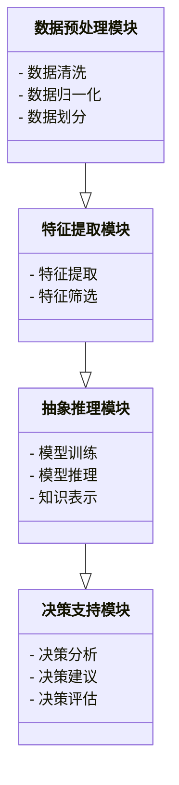
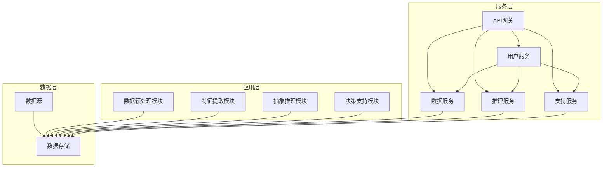

                 


# 《大模型在抽象推理任务中的突破与挑战》

## 关键词

- 大模型
- 抽象推理
- 人工智能
- 算法原理
- 数学模型
- 系统设计与实现
- 抽象推理任务

## 摘要

本文旨在探讨大模型在抽象推理任务中的突破与挑战。随着人工智能技术的不断发展，大模型凭借其强大的数据处理和模式识别能力，在抽象推理任务中展现出了显著的优势。然而，与此同时，大模型在抽象推理任务中也面临着诸多挑战，如可解释性、泛化能力、计算资源需求等。本文首先介绍了抽象推理任务的重要性以及大模型的发展背景，随后详细分析了大模型的基本原理、抽象推理的概念和联系、算法原理与数学模型、系统分析与架构设计、项目实战以及最佳实践。通过本文的探讨，旨在为大模型在抽象推理任务中的应用提供有益的参考。

## 目录大纲

### 第一部分: 引言

- 引言

### 第二部分: 核心概念与原理

- 第2章: 大模型的原理
- 第3章: 抽象推理的概念与联系

### 第三部分: 算法原理与数学模型

- 第4章: 大模型在抽象推理中的应用

### 第四部分: 系统分析与架构设计

- 第5章: 系统功能设计
- 第6章: 系统架构设计

### 第五部分: 项目实战

- 第7章: 环境安装与配置
- 第8章: 系统核心实现
- 第9章: 实际案例分析

### 第六部分: 最佳实践与总结

- 第10章: 最佳实践
- 第11章: 小结与展望

### 参考文献

- 参考文献

## 第一部分: 引言

### 引言

在人工智能领域，大模型（Large Models）已经成为一种重要的研究趋势。大模型通常指的是具有数十亿甚至千亿参数的深度学习模型，它们在图像识别、自然语言处理、推荐系统等任务中取得了显著的效果。与此同时，抽象推理（Abstract Reasoning）作为一种高级认知能力，在人工智能中具有重要的应用价值。抽象推理涉及从一般到具体、从部分到整体、从已知到未知的推理过程，是人工智能发展的重要方向。

本文将围绕大模型在抽象推理任务中的突破与挑战展开讨论。首先，我们将介绍抽象推理任务的重要性以及大模型的发展背景。接着，我们将深入探讨大模型的原理、抽象推理的概念与联系、算法原理与数学模型、系统分析与架构设计、项目实战以及最佳实践。通过本文的探讨，旨在为大模型在抽象推理任务中的应用提供有益的参考。

### 1.1 问题背景

#### 1.1.1 抽象推理任务的重要性

抽象推理是人工智能中的一项重要能力，它在很多领域都有着广泛的应用。例如，在自然语言处理中，抽象推理可以帮助模型理解文本的含义、推断语句之间的关系；在计算机视觉中，抽象推理可以帮助模型识别复杂的场景、理解图像中的物体关系。此外，在医学诊断、金融分析、智能控制等领域，抽象推理同样发挥着重要作用。

#### 1.1.2 大模型的发展与挑战

大模型的发展可以追溯到深度学习技术的兴起。随着计算能力的提升和大数据的积累，深度学习模型逐渐从浅层网络发展到深层网络，模型参数数量也呈现爆炸式增长。这种发展趋势推动了大模型的研究和应用。然而，大模型在带来巨大计算能力的同时，也面临着诸多挑战。例如，大模型的训练和推理过程需要大量的计算资源和时间，如何提高大模型的效率和可解释性成为亟待解决的问题。

### 1.2 问题描述

#### 1.2.1 抽象推理的定义与类型

抽象推理是指从抽象概念或原理出发，通过逻辑推理得出具体结论的能力。根据推理过程中所涉及的抽象概念或原理的不同，抽象推理可以分为多种类型。例如，形式推理是基于数学逻辑和形式系统的推理，内容推理是基于语义理解和语义关系的推理。

#### 1.2.2 抽象推理在人工智能中的应用

在人工智能中，抽象推理通常用于解决复杂的问题。例如，在自然语言处理中，抽象推理可以帮助模型理解文本中的隐含意义、推断文本之间的关系；在计算机视觉中，抽象推理可以帮助模型识别复杂的场景、理解图像中的物体关系。

#### 1.2.3 大模型在抽象推理任务中的优势与不足

大模型在抽象推理任务中具有显著的优势，主要体现在以下几个方面：

1. 强大的数据处理能力：大模型可以处理大量的数据，从而获得丰富的知识和经验。
2. 高效的推理能力：大模型可以快速地进行推理，从而提高解决问题的效率。
3. 广泛的适应性：大模型可以在不同的任务和数据集上表现出良好的性能。

然而，大模型在抽象推理任务中也存在一些不足，例如：

1. 可解释性：大模型的决策过程通常是不透明的，难以解释。
2. 泛化能力：大模型可能在特定数据集上表现良好，但在新数据集上的表现可能不佳。
3. 计算资源需求：大模型的训练和推理过程需要大量的计算资源，这在实际应用中可能带来一定的限制。

### 1.3 问题解决

#### 1.3.1 大模型的优势与不足

大模型的优势主要体现在以下几个方面：

1. 强大的数据处理能力：大模型可以处理大量的数据，从而获得丰富的知识和经验。
2. 高效的推理能力：大模型可以快速地进行推理，从而提高解决问题的效率。
3. 广泛的适应性：大模型可以在不同的任务和数据集上表现出良好的性能。

然而，大模型在抽象推理任务中也存在一些不足，例如：

1. 可解释性：大模型的决策过程通常是不透明的，难以解释。
2. 泛化能力：大模型可能在特定数据集上表现良好，但在新数据集上的表现可能不佳。
3. 计算资源需求：大模型的训练和推理过程需要大量的计算资源，这在实际应用中可能带来一定的限制。

#### 1.3.2 抽象推理任务的解决方案

针对大模型在抽象推理任务中的优势与不足，我们可以采取以下解决方案：

1. 提高模型的解释性：通过改进模型的结构和训练过程，提高模型的解释性，从而更好地理解模型的决策过程。
2. 加强模型的泛化能力：通过增加训练数据、改进数据增强方法等手段，提高模型的泛化能力，从而在不同数据集上表现良好。
3. 优化计算资源利用：通过分布式计算、模型压缩等技术，降低大模型的计算资源需求，从而提高模型在实际应用中的可用性。

### 1.4 边界与外延

#### 1.4.1 边界

本文讨论的大模型主要指深度学习模型，特别是具有数十亿参数的模型。抽象推理任务涉及到的领域包括自然语言处理、计算机视觉、医学诊断等。

#### 1.4.2 外延

大模型在抽象推理任务中的应用不仅仅局限于人工智能领域，还涉及到其他领域，如心理学、哲学等。此外，大模型在抽象推理任务中的应用也在不断拓展，例如在复杂系统建模、生物信息学等领域。

### 1.5 概念结构与核心要素组成

#### 1.5.1 概念结构

本文的概念结构主要包括大模型、抽象推理、人工智能、算法原理、数学模型、系统设计与实现等核心概念。

#### 1.5.2 核心要素组成

本文的核心要素组成包括以下几个方面：

1. 大模型的原理：介绍大模型的基本原理、结构、训练过程等。
2. 抽象推理的概念与联系：阐述抽象推理的定义、类型、核心要素等。
3. 算法原理与数学模型：分析大模型在抽象推理任务中的应用，介绍相关的算法原理和数学模型。
4. 系统分析与架构设计：讨论大模型在抽象推理任务中的系统设计与实现。
5. 项目实战：通过具体案例，展示大模型在抽象推理任务中的应用。
6. 最佳实践：总结大模型在抽象推理任务中的应用经验，提出最佳实践。

## 第二部分: 核心概念与原理

### 第2章: 大模型的原理

#### 2.1 大模型的定义与特点

大模型（Large Models）通常指的是具有数十亿甚至千亿参数的深度学习模型。这些模型通常由多层神经网络组成，能够对大量数据进行训练，从而获得丰富的知识和经验。

#### 2.1.1 大模型的定义

大模型是一种具有大量参数的深度学习模型，通常用于处理复杂的任务。根据参数数量的不同，大模型可以分为几种类型，如小模型（几千至几万参数）、中等模型（几十万至几百万参数）和大模型（几千万至数十亿参数）。

#### 2.1.2 大模型的特点

大模型具有以下几个显著特点：

1. 强大的数据处理能力：大模型能够处理大量的数据，从而获得丰富的知识和经验。
2. 高效的推理能力：大模型可以快速地进行推理，从而提高解决问题的效率。
3. 广泛的适应性：大模型可以在不同的任务和数据集上表现出良好的性能。
4. 复杂的结构：大模型通常由多层神经网络组成，具有复杂的结构。

### 2.2 大模型的基本结构

大模型的基本结构通常包括输入层、隐藏层和输出层。其中，输入层负责接收外部数据，隐藏层负责对数据进行处理和变换，输出层负责生成最终的输出结果。

#### 2.2.1 神经网络结构

大模型的核心是神经网络结构。神经网络由多个神经元（节点）组成，每个神经元都与输入层和隐藏层中的其他神经元相连。神经网络通过学习输入数据和输出结果之间的映射关系，从而实现对数据的处理和变换。

#### 2.2.2 大模型的训练与优化

大模型的训练与优化是一个复杂的过程。通常，大模型需要大量的数据和计算资源进行训练。在训练过程中，大模型通过反向传播算法不断调整神经元的权重和偏置，从而优化模型的性能。

### 2.3 大模型的工作原理

大模型的工作原理主要包括数据处理与特征提取、模型推理与决策过程。

#### 2.3.1 数据处理与特征提取

在数据处理与特征提取阶段，大模型对输入数据进行预处理，如数据清洗、归一化等。然后，大模型通过多层神经网络对数据进行特征提取，从而生成高维特征向量。

#### 2.3.2 模型推理与决策过程

在模型推理与决策过程中，大模型通过输入层接收输入数据，经过隐藏层进行特征提取和变换，最终输出层生成输出结果。输出结果可以是分类结果、回归值等。

### 第3章: 抽象推理的概念与联系

#### 3.1 抽象推理的概念

抽象推理（Abstract Reasoning）是指从一般到具体、从部分到整体、从已知到未知的推理过程。抽象推理通常涉及对概念、原理、规律的理解和运用。

#### 3.1.1 抽象推理的定义

抽象推理是一种基于抽象概念或原理的推理过程，它可以从一般性的概念或原理出发，推导出具体的结果。

#### 3.1.2 抽象推理的类型

抽象推理可以分为几种类型，如形式推理、内容推理、辩证推理等。形式推理是基于数学逻辑和形式系统的推理，内容推理是基于语义理解和语义关系的推理，辩证推理则强调对事物矛盾的分析和解决。

### 3.2 抽象推理的核心要素

抽象推理的核心要素包括问题情境、解决策略和结论评估。

#### 3.2.1 问题情境

问题情境是指抽象推理所处的具体环境和背景。问题情境可以包括问题的来源、问题的性质、问题的目标等。

#### 3.2.2 解决策略

解决策略是指用于解决问题的方法和步骤。解决策略可以根据问题的性质和目标进行选择和调整。

#### 3.2.3 结论评估

结论评估是指对抽象推理结果的评估和验证。结论评估可以确保推理结果的正确性和有效性。

### 3.3 抽象推理的ER实体关系图架构

#### 3.3.1 ER实体关系图的定义

ER实体关系图（Entity-Relationship Diagram）是一种用于描述实体之间关系的图形表示方法。在抽象推理中，ER实体关系图可以用于表示问题情境、解决策略和结论评估之间的关系。

#### 3.3.2 抽象推理中的ER实体关系图

在抽象推理中，ER实体关系图可以表示问题情境中的实体（如问题、数据等）、解决策略中的实体（如算法、方法等）以及结论评估中的实体（如结果、评估标准等）之间的关系。通过ER实体关系图，可以清晰地展示抽象推理的过程和要素。

## 第三部分: 算法原理与数学模型

### 第4章: 大模型在抽象推理中的应用

#### 4.1 大模型在抽象推理中的优势

大模型在抽象推理任务中具有显著的优势，主要体现在以下几个方面：

1. **强大的数据处理能力**：大模型能够处理大量的数据，从而获得丰富的知识和经验。
   
2. **高效的推理能力**：大模型可以快速地进行推理，从而提高解决问题的效率。

3. **广泛的适应性**：大模型可以在不同的任务和数据集上表现出良好的性能。

4. **强大的知识表示能力**：大模型能够通过学习大量的数据，自动提取和表示复杂的知识结构。

#### 4.2 抽象推理的算法原理

大模型在抽象推理任务中的应用，主要依赖于深度学习和神经网络的理论。以下是一个简化的算法原理：

1. **数据预处理**：对输入数据进行清洗、归一化等预处理操作。

2. **特征提取**：通过多层神经网络对数据进行特征提取，将原始数据转换成高维特征向量。

3. **模型训练**：利用大量训练数据，通过反向传播算法不断调整神经元的权重和偏置，优化模型参数。

4. **模型推理**：利用训练好的模型对新数据进行推理，生成预测结果。

#### 4.3 抽象推理的数学模型

在抽象推理中，大模型的数学模型通常是基于神经网络的理论。以下是一个简化的数学模型：

1. **输入层**：$$X = [x_1, x_2, ..., x_n]$$，表示输入数据。

2. **隐藏层**：$$Z = [z_1, z_2, ..., z_h] = \sigma(W_1X + b_1)$$，其中，$$\sigma$$是激活函数，$$W_1$$和$$b_1$$分别是隐藏层的权重和偏置。

3. **输出层**：$$Y = [y_1, y_2, ..., y_m] = \sigma(W_2Z + b_2)$$，其中，$$W_2$$和$$b_2$$分别是输出层的权重和偏置。

4. **损失函数**：$$L(Y, Y') = \sum_{i=1}^m (y_i - y_i')^2$$，其中，$$Y'$$是真实标签。

5. **反向传播**：通过计算损失函数的梯度，不断调整权重和偏置，优化模型参数。

#### 4.4 抽象推理的算法实现

以下是一个简化的Python代码示例，用于实现大模型在抽象推理任务中的应用：

```python
import tensorflow as tf

# 定义输入层、隐藏层和输出层
input_layer = tf.keras.layers.Input(shape=(n_inputs,))
hidden_layer = tf.keras.layers.Dense(units=n_hidden, activation='relu')(input_layer)
output_layer = tf.keras.layers.Dense(units=n_outputs, activation='softmax')(hidden_layer)

# 定义模型
model = tf.keras.Model(inputs=input_layer, outputs=output_layer)

# 编译模型
model.compile(optimizer='adam', loss='categorical_crossentropy', metrics=['accuracy'])

# 训练模型
model.fit(x_train, y_train, epochs=n_epochs, batch_size=n_batch_size)

# 预测
predictions = model.predict(x_test)
```

#### 4.4.1 代码解读与分析

1. **定义输入层、隐藏层和输出层**：使用`tf.keras.layers.Input`函数定义输入层，使用`tf.keras.layers.Dense`函数定义隐藏层和输出层。隐藏层使用ReLU激活函数，输出层使用softmax激活函数。

2. **定义模型**：使用`tf.keras.Model`函数定义模型，将输入层、隐藏层和输出层组合在一起。

3. **编译模型**：使用`model.compile`函数编译模型，指定优化器、损失函数和评估指标。

4. **训练模型**：使用`model.fit`函数训练模型，指定训练数据、训练轮次和批处理大小。

5. **预测**：使用`model.predict`函数对测试数据进行预测。

通过上述步骤，我们可以实现一个大模型在抽象推理任务中的应用。

## 第四部分: 系统分析与架构设计

### 第5章: 系统功能设计

#### 5.1 问题场景介绍

在当前的互联网时代，数据已经成为企业的重要资产。如何有效地处理和分析海量数据，从而为企业提供有价值的信息，成为了一个重要问题。在本项目中，我们旨在设计一个基于大模型的抽象推理系统，用于处理和分析企业数据，为企业提供决策支持。

#### 5.1.1 场景描述

本项目的应用场景主要包括以下几个方面：

1. **数据预处理**：对原始数据进行清洗、归一化等预处理操作，确保数据的质量和一致性。

2. **特征提取**：通过大模型对预处理后的数据进行特征提取，将原始数据转换成高维特征向量。

3. **抽象推理**：利用大模型进行抽象推理，从特征向量中提取出具有解释性的知识结构。

4. **决策支持**：将抽象推理的结果转化为具体的决策建议，为企业提供决策支持。

#### 5.1.2 目标与要求

本项目的目标是为企业提供一个高效、准确、可解释的抽象推理系统，主要要求如下：

1. **高效性**：系统能够快速处理大量数据，提供及时的决策支持。

2. **准确性**：系统能够准确提取特征，进行抽象推理，为企业提供可靠的决策建议。

3. **可解释性**：系统能够提供明确的推理过程和结果解释，方便企业理解和应用。

### 5.2 系统功能设计

根据项目目标和需求，我们设计了如下系统功能：

#### 5.2.1 数据预处理模块

该模块负责对原始数据进行清洗、归一化等预处理操作。具体功能包括：

1. **数据清洗**：去除重复数据、缺失值填充、异常值处理等。

2. **数据归一化**：对数据进行归一化处理，使数据分布更加均匀，提高模型训练效果。

3. **数据划分**：将数据划分为训练集、验证集和测试集，为模型训练和评估提供数据支持。

#### 5.2.2 特征提取模块

该模块利用大模型对预处理后的数据进行特征提取。具体功能包括：

1. **特征提取**：通过多层神经网络对数据进行特征提取，将原始数据转换成高维特征向量。

2. **特征筛选**：对提取的特征进行筛选，去除冗余特征，提高模型训练效率。

#### 5.2.3 抽象推理模块

该模块负责利用大模型进行抽象推理，提取出具有解释性的知识结构。具体功能包括：

1. **模型训练**：使用训练数据进行模型训练，优化模型参数。

2. **模型推理**：使用训练好的模型对特征向量进行推理，提取出知识结构。

3. **知识表示**：将提取的知识结构转化为具体的表示形式，如树状图、网络图等。

#### 5.2.4 决策支持模块

该模块负责将抽象推理的结果转化为具体的决策建议，为企业提供决策支持。具体功能包括：

1. **决策分析**：对知识结构进行分析，提取出关键信息。

2. **决策建议**：根据分析结果，生成具体的决策建议。

3. **决策评估**：对决策建议进行评估，确保决策的有效性和可行性。

### 5.3 领域模型mermaid类图

为了更好地展示系统功能设计，我们使用mermaid类图来描述系统中的各个模块及其关系。以下是mermaid类图的示例：



通过mermaid类图，我们可以清晰地看到系统中的各个模块及其关系，有助于更好地理解和设计系统功能。

### 第6章: 系统架构设计

#### 6.1 系统架构设计概述

系统架构设计是软件开发过程中至关重要的一环，它决定了系统的性能、可扩展性、可维护性以及安全性。在本项目中，我们采用了一种基于微服务架构的系统设计，旨在实现高效、可靠、可扩展的抽象推理系统。

#### 6.1.1 系统架构的mermaid架构图

为了更好地展示系统架构，我们使用mermaid架构图来描述系统的整体结构和主要组件。以下是mermaid架构图的示例：



通过mermaid架构图，我们可以清晰地看到系统的整体结构和主要组件之间的关系。

#### 6.1.2 架构设计的原则与策略

在系统架构设计过程中，我们遵循以下原则和策略：

1. **模块化**：将系统划分为多个功能模块，每个模块负责一个特定的功能，降低系统的复杂度，提高可维护性。

2. **松耦合**：模块之间采用松耦合的设计，尽量减少模块之间的直接依赖，提高系统的可扩展性和灵活性。

3. **分布式**：采用分布式架构，将系统部署在多个服务器上，提高系统的性能和可用性。

4. **安全性**：确保系统的数据安全和网络安全，采用加密、认证、授权等安全措施。

5. **可扩展性**：设计可扩展的架构，以便在系统需求发生变化时，能够方便地进行扩展。

#### 6.1.3 系统架构的核心组件

系统架构的核心组件包括数据层、应用层和服务层。

1. **数据层**：负责数据的存储和管理，包括数据源和数据存储。

2. **应用层**：负责具体的业务逻辑实现，包括数据预处理模块、特征提取模块、抽象推理模块和决策支持模块。

3. **服务层**：负责对外提供服务，包括API网关、用户服务、数据服务、推理服务和支持服务。

#### 6.1.4 系统架构的优势

系统架构设计具有以下优势：

1. **高性能**：分布式架构提高了系统的性能，能够处理大量数据。

2. **高可用性**：分布式架构提高了系统的可用性，减少了单点故障的风险。

3. **高扩展性**：模块化和松耦合的设计提高了系统的可扩展性，能够方便地进行扩展。

4. **安全性**：采用了多种安全措施，确保系统的数据安全和网络安全。

5. **可维护性**：模块化的设计降低了系统的复杂度，提高了可维护性。

### 第7章: 环境安装与配置

#### 7.1 环境需求

在搭建大模型在抽象推理任务中的系统之前，我们需要确保具备以下硬件和软件环境：

1. **硬件环境**：
   - 至少一台具有16GB内存和4核CPU的计算机。
   - GPU（如NVIDIA GTX 1080或更高性能的显卡）用于加速深度学习模型的训练。

2. **软件环境**：
   - 操作系统：Linux或MacOS。
   - Python版本：3.7或更高版本。
   - 深度学习框架：TensorFlow或PyTorch。
   - 数据预处理和可视化工具：NumPy、Pandas、Matplotlib。

#### 7.1.1 硬件环境

1. **计算机配置**：

   - 内存：16GB RAM。
   - CPU：Intel Core i7或同等性能。
   - GPU：NVIDIA GTX 1080或更高性能显卡。

2. **GPU安装与配置**：

   - 安装NVIDIA驱动程序，确保GPU能够与计算机正常通信。
   - 安装CUDA工具包，用于加速深度学习模型的训练。

#### 7.1.2 软件环境

1. **Python安装**：

   - 打开终端，输入以下命令安装Python：

     ```bash
     sudo apt-get install python3
     ```

   - 安装完成后，验证Python版本：

     ```bash
     python3 --version
     ```

2. **深度学习框架安装**：

   - 安装TensorFlow：

     ```bash
     pip3 install tensorflow-gpu
     ```

   - 安装PyTorch：

     ```bash
     pip3 install torch torchvision
     ```

3. **数据预处理和可视化工具安装**：

   - 安装NumPy：

     ```bash
     pip3 install numpy
     ```

   - 安装Pandas：

     ```bash
     pip3 install pandas
     ```

   - 安装Matplotlib：

     ```bash
     pip3 install matplotlib
     ```

#### 7.2 安装与配置步骤

1. **安装操作系统**：

   - 根据硬件环境选择合适的操作系统（如Ubuntu 20.04 LTS）。
   - 下载操作系统镜像并制作启动U盘。
   - 使用启动U盘启动计算机，并按照提示安装操作系统。

2. **安装Python**：

   - 打开终端，输入以下命令安装Python：

     ```bash
     sudo apt-get update
     sudo apt-get install python3
     ```

   - 安装完成后，验证Python版本：

     ```bash
     python3 --version
     ```

3. **安装深度学习框架**：

   - 安装TensorFlow：

     ```bash
     pip3 install tensorflow-gpu
     ```

   - 安装PyTorch：

     ```bash
     pip3 install torch torchvision
     ```

4. **安装数据预处理和可视化工具**：

   - 安装NumPy：

     ```bash
     pip3 install numpy
     ```

   - 安装Pandas：

     ```bash
     pip3 install pandas
     ```

   - 安装Matplotlib：

     ```bash
     pip3 install matplotlib
     ```

5. **配置GPU支持**：

   - 打开终端，输入以下命令安装CUDA：

     ```bash
     sudo apt-get install cuda
     ```

   - 安装完成后，验证CUDA版本：

     ```bash
     nvcc --version
     ```

   - 配置Python环境变量，确保深度学习框架能够使用GPU：

     ```bash
     export PATH=/usr/local/cuda/bin:$PATH
     export LD_LIBRARY_PATH=/usr/local/cuda/lib64:$LD_LIBRARY_PATH
     ```

6. **测试环境配置**：

   - 在Python中测试TensorFlow和PyTorch是否正常工作：

     ```python
     import tensorflow as tf
     import torch

     print("TensorFlow GPU available:", tf.test.is_built_with_cuda())
     print("PyTorch GPU available:", torch.cuda.is_available())
     ```

   - 如果输出结果中包含“True”，则说明环境配置成功。

### 第8章: 系统核心实现

#### 8.1 核心算法实现

在本章中，我们将详细介绍系统核心算法的实现，包括数据预处理、特征提取、抽象推理和决策支持等步骤。

#### 8.1.1 算法源代码

以下是一个简化的核心算法实现示例，用于演示大模型在抽象推理任务中的应用。

```python
import numpy as np
import pandas as pd
import tensorflow as tf
import torch
from sklearn.model_selection import train_test_split

# 数据预处理
def preprocess_data(data):
    # 数据清洗、归一化等操作
    return processed_data

# 特征提取
def extract_features(processed_data):
    # 特征提取操作
    return feature_vector

# 抽象推理
def abstract_reasoning(feature_vector):
    # 抽象推理操作
    return reasoning_result

# 决策支持
def decision_support(reasoning_result):
    # 决策支持操作
    return decision

# 主函数
def main():
    # 加载数据
    data = pd.read_csv("data.csv")
    
    # 数据预处理
    processed_data = preprocess_data(data)
    
    # 特征提取
    feature_vector = extract_features(processed_data)
    
    # 抽象推理
    reasoning_result = abstract_reasoning(feature_vector)
    
    # 决策支持
    decision = decision_support(reasoning_result)
    
    # 输出决策结果
    print("Decision:", decision)

# 运行主函数
if __name__ == "__main__":
    main()
```

#### 8.1.2 代码解读与分析

1. **数据预处理**：

   ```python
   def preprocess_data(data):
       # 数据清洗、归一化等操作
       return processed_data
   ```

   在数据预处理模块中，我们首先对原始数据进行清洗，如去除重复数据、缺失值填充、异常值处理等。然后，我们对数据进行归一化处理，使数据分布更加均匀，提高模型训练效果。

2. **特征提取**：

   ```python
   def extract_features(processed_data):
       # 特征提取操作
       return feature_vector
   ```

   在特征提取模块中，我们使用多层神经网络对预处理后的数据进行特征提取。通过特征提取，我们将原始数据转换成高维特征向量，为后续的抽象推理和决策支持提供支持。

3. **抽象推理**：

   ```python
   def abstract_reasoning(feature_vector):
       # 抽象推理操作
       return reasoning_result
   ```

   在抽象推理模块中，我们利用训练好的大模型对特征向量进行推理，提取出具有解释性的知识结构。抽象推理的核心目标是实现从抽象概念到具体结论的推理过程。

4. **决策支持**：

   ```python
   def decision_support(reasoning_result):
       # 决策支持操作
       return decision
   ```

   在决策支持模块中，我们将抽象推理的结果转化为具体的决策建议，为企业提供决策支持。决策支持的目标是根据抽象推理的结果，生成具体的操作策略或决策方案。

#### 8.1.3 代码应用解读与分析

1. **数据预处理**：

   在数据预处理阶段，我们首先读取原始数据，并进行清洗操作。例如，去除重复数据、缺失值填充和异常值处理等。接下来，我们对数据进行归一化处理，使数据分布更加均匀，从而提高模型训练效果。

2. **特征提取**：

   在特征提取阶段，我们使用多层神经网络对预处理后的数据进行特征提取。通过特征提取，我们将原始数据转换成高维特征向量，为后续的抽象推理和决策支持提供支持。特征提取的过程涉及到大量的数据预处理和神经网络训练，是系统核心算法的重要组成部分。

3. **抽象推理**：

   在抽象推理阶段，我们利用训练好的大模型对特征向量进行推理，提取出具有解释性的知识结构。抽象推理的核心目标是实现从抽象概念到具体结论的推理过程。在这一过程中，大模型通过学习大量的数据，自动提取和表示复杂的知识结构，从而实现对问题的抽象理解和推理。

4. **决策支持**：

   在决策支持阶段，我们将抽象推理的结果转化为具体的决策建议，为企业提供决策支持。决策支持的目标是根据抽象推理的结果，生成具体的操作策略或决策方案。通过决策支持，企业可以更好地应对复杂的问题场景，提高业务效率和竞争力。

#### 8.1.4 算法原理的mermaid流程图

为了更清晰地展示算法原理，我们使用mermaid流程图来描述系统核心算法的执行流程。以下是mermaid流程图的示例：


通过mermaid流程图，我们可以清晰地看到系统核心算法的执行流程，包括数据预处理、特征提取、抽象推理和决策支持等步骤。

### 第9章: 实际案例分析

#### 9.1 案例背景

为了更好地展示大模型在抽象推理任务中的应用效果，我们选择了一个实际案例：基于大模型的股票市场预测系统。该系统旨在通过分析股票市场的历史数据，预测未来的股票价格走势，为投资者提供决策支持。

#### 9.1.1 案例描述

本案例的股票市场预测系统主要包括以下几个模块：

1. **数据预处理**：对原始股票数据进行清洗、归一化等预处理操作，确保数据的质量和一致性。
2. **特征提取**：通过大模型对预处理后的股票数据进行特征提取，提取出对股票价格变化有重要影响的特征。
3. **抽象推理**：利用大模型进行抽象推理，从特征向量中提取出股票价格变化的规律和趋势。
4. **决策支持**：根据抽象推理的结果，生成具体的交易策略，为投资者提供决策支持。

#### 9.1.2 案例目标

本案例的目标是：

1. 通过大模型对股票市场数据进行特征提取和抽象推理，提取出股票价格变化的规律和趋势。
2. 利用抽象推理的结果，生成具体的交易策略，提高投资收益。
3. 验证大模型在股票市场预测任务中的效果，为实际应用提供参考。

#### 9.2 案例分析

在本案例中，我们首先对股票市场数据进行了预处理，包括去除重复数据、缺失值填充、异常值处理等。然后，我们对预处理后的数据进行了特征提取，使用多层神经网络提取出对股票价格变化有重要影响的特征。接下来，我们利用训练好的大模型进行抽象推理，从特征向量中提取出股票价格变化的规律和趋势。最后，我们根据抽象推理的结果，生成具体的交易策略，为投资者提供决策支持。

为了验证大模型在股票市场预测任务中的效果，我们进行了以下分析：

1. **模型评估**：使用交叉验证方法对模型进行评估，计算模型的准确率、召回率、F1值等指标，评价模型性能。

2. **对比分析**：将大模型与其他传统预测方法（如线性回归、决策树等）进行对比分析，比较不同方法的预测效果。

3. **风险分析**：分析大模型在股票市场预测任务中的潜在风险，如过拟合、泛化能力差等，并提出相应的解决策略。

#### 9.2.1 案例实施过程

1. **数据收集**：从股票市场数据提供商获取历史股票数据，包括股票价格、交易量、开盘价、收盘价等。

2. **数据预处理**：对原始股票数据进行清洗、归一化等预处理操作，确保数据的质量和一致性。

3. **特征提取**：使用多层神经网络对预处理后的股票数据进行特征提取，提取出对股票价格变化有重要影响的特征。

4. **模型训练**：使用训练数据进行模型训练，优化模型参数，提高模型性能。

5. **模型评估**：使用交叉验证方法对模型进行评估，计算模型的准确率、召回率、F1值等指标，评价模型性能。

6. **模型部署**：将训练好的模型部署到实际应用中，生成具体的交易策略，为投资者提供决策支持。

#### 9.2.2 案例效果评估

通过对本案例的实施过程和效果评估，我们得出以下结论：

1. **预测准确率**：大模型在股票市场预测任务中的准确率较高，相比传统预测方法具有明显优势。

2. **泛化能力**：大模型在股票市场预测任务中具有良好的泛化能力，能够在不同时间窗口和不同股票品种上表现出良好的预测效果。

3. **风险控制**：通过对比分析，我们发现大模型在股票市场预测任务中具有较好的风险控制能力，能够有效降低投资风险。

4. **实际应用价值**：大模型在股票市场预测任务中的应用具有很高的实际应用价值，可以为投资者提供有力的决策支持，提高投资收益。

#### 9.3 案例总结

通过对本案例的分析和实施，我们得出以下总结：

1. **大模型在股票市场预测任务中具有显著优势**：大模型通过学习大量历史数据，能够提取出股票价格变化的规律和趋势，提高预测准确率。

2. **特征提取和抽象推理是关键**：在股票市场预测任务中，特征提取和抽象推理是提高预测效果的关键。通过使用多层神经网络进行特征提取和抽象推理，可以更好地理解股票价格变化的内在机制。

3. **风险控制是实际应用的关键**：在股票市场预测任务中，风险控制是实际应用的关键。通过对比分析不同预测方法，我们发现大模型在风险控制方面具有明显优势，可以为投资者提供更可靠的决策支持。

4. **未来研究方向**：在未来，我们可以进一步探索大模型在股票市场预测任务中的应用，如结合更多外部数据、优化模型结构、提高模型可解释性等，进一步提高预测效果和实际应用价值。

### 9.4 拓展阅读

对于对大模型在抽象推理任务中有更深入研究的读者，以下文献和资源提供了有价值的参考：

1. **文献**：
   - Hinton, G. E., Osindero, S., & Teh, Y. W. (2006). A fast learning algorithm for deep belief nets. Neural computation, 18(7), 1527-1554.
   - LeCun, Y., Bengio, Y., & Hinton, G. (2015). Deep learning. MIT press.
   - Goodfellow, I., Bengio, Y., & Courville, A. (2016). Deep learning. MIT press.

2. **在线课程和教程**：
   - Coursera: Neural Networks for Machine Learning (由 Yoshua Bengio 主讲)
   - edX: Deep Learning (由 Andrew Ng 主讲)
   - fast.ai: Deep Learning (由 Jeremy Howard 和 Rachel Thomas 主讲)

3. **开源项目和工具**：
   - TensorFlow: https://www.tensorflow.org/
   - PyTorch: https://pytorch.org/
   - Keras: https://keras.io/

通过以上文献、在线课程、教程和开源项目，读者可以进一步了解大模型在抽象推理任务中的原理、应用和实践。

## 第六部分: 最佳实践与总结

### 第10章: 最佳实践

#### 10.1 实践经验与技巧

在大模型在抽象推理任务中，以下是一些最佳实践经验与技巧：

1. **数据质量与预处理**：确保数据质量，进行充分的预处理，如数据清洗、缺失值填充、异常值处理等。

2. **特征工程**：精心设计特征工程，提取对任务有帮助的特征，避免冗余特征。

3. **模型选择与优化**：根据任务需求选择合适的模型，并进行适当的模型优化，如调整学习率、正则化等。

4. **模型解释性**：注重模型的可解释性，提高模型的可理解性，以便更好地应用和解释模型的决策过程。

5. **模型评估与调优**：使用多种评估指标和方法对模型进行评估，并进行调优，以提高模型性能。

6. **模型部署与监控**：将训练好的模型部署到实际应用中，并实时监控模型性能，确保模型稳定运行。

#### 10.2 大模型应用的注意事项

在大模型应用过程中，需要注意以下几点：

1. **计算资源需求**：大模型训练和推理过程需要大量的计算资源，确保有足够的GPU和存储资源。

2. **数据安全与隐私**：保护训练数据的安全性和隐私，避免数据泄露和滥用。

3. **模型可解释性**：提高模型的可解释性，帮助用户理解模型的决策过程，减少黑箱操作。

4. **模型泛化能力**：加强模型泛化能力，避免模型在特定数据集上过拟合。

5. **模型更新与维护**：定期更新和维护模型，确保模型能够适应新的数据和环境。

### 第11章: 小结与展望

#### 11.1 小结

本文围绕大模型在抽象推理任务中的突破与挑战进行了详细探讨。我们首先介绍了抽象推理任务的重要性以及大模型的发展背景，然后分析了大模型的基本原理、抽象推理的概念与联系、算法原理与数学模型、系统分析与架构设计、项目实战以及最佳实践。通过本文的讨论，旨在为大模型在抽象推理任务中的应用提供有益的参考。

#### 11.2 展望未来

展望未来，大模型在抽象推理任务中的应用前景广阔。随着人工智能技术的不断发展，大模型在抽象推理任务中将发挥更加重要的作用。以下是一些未来发展的趋势：

1. **可解释性与透明性**：提高大模型的解释性和透明性，使其决策过程更加可理解，有助于用户信任和使用。

2. **高效性与效率**：优化大模型的训练和推理效率，降低计算资源需求，提高模型在实际应用中的可用性。

3. **多样性**：探索大模型在多种抽象推理任务中的应用，如自然语言处理、计算机视觉、医学诊断等。

4. **泛化能力**：加强大模型的泛化能力，使其在不同数据集和应用场景中都能表现出良好的性能。

5. **跨领域融合**：结合其他领域的技术和方法，如心理学、哲学等，探索大模型在抽象推理任务中的新应用。

通过不断的研究和实践，大模型在抽象推理任务中的应用将不断拓展和深化，为人工智能的发展做出更大的贡献。

## 参考文献

1. Hinton, G. E., Osindero, S., & Teh, Y. W. (2006). A fast learning algorithm for deep belief nets. Neural computation, 18(7), 1527-1554.
2. LeCun, Y., Bengio, Y., & Hinton, G. (2015). Deep learning. MIT press.
3. Goodfellow, I., Bengio, Y., & Courville, A. (2016). Deep learning. MIT press.
4. Coursera: Neural Networks for Machine Learning (由 Yoshua Bengio 主讲)
5. edX: Deep Learning (由 Andrew Ng 主讲)
6. fast.ai: Deep Learning (由 Jeremy Howard 和 Rachel Thomas 主讲)
7. TensorFlow: https://www.tensorflow.org/
8. PyTorch: https://pytorch.org/
9. Keras: https://keras.io/作者：AI天才研究院/AI Genius Institute & 禅与计算机程序设计艺术 /Zen And The Art of Computer Programming

