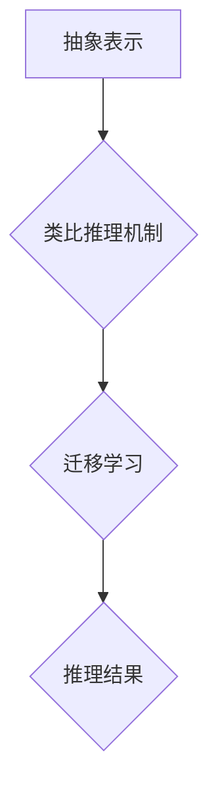
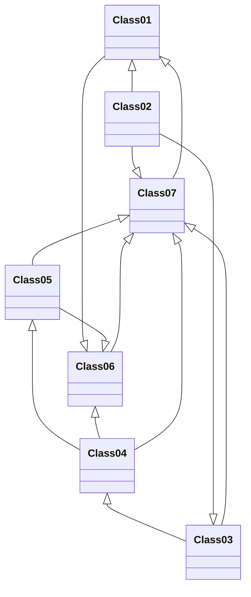
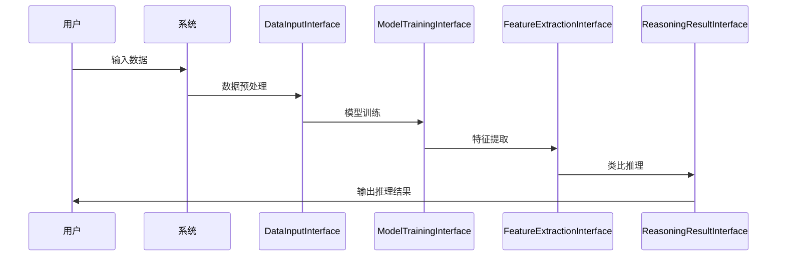

                 

# 大模型在抽象类比推理中的能力分析

## 关键词
大模型，抽象类比推理，算法原理，数学模型，系统分析，项目实战

## 摘要
本文旨在探讨大模型在抽象类比推理中的能力，通过对其算法原理、数学模型、系统分析与架构设计、项目实战等方面进行详细分析，揭示大模型在抽象类比推理中的潜力和局限。文章将逐步深入，以帮助读者更好地理解大模型的抽象类比推理能力。

## 引言
随着人工智能技术的飞速发展，大模型（Large Models）在自然语言处理、计算机视觉、语音识别等领域取得了显著的成果。大模型通过学习海量数据，能够模拟人类的思维方式和语言表达，从而在诸多任务中表现出色。然而，大模型在抽象类比推理方面的能力仍是一个亟待深入研究的问题。

## 第一部分：背景介绍

### 1.1 问题背景介绍
抽象类比推理是一种高级认知能力，它涉及到从不同情境中提取共同特征，并将这些特征应用于新的情境中。在人类认知过程中，抽象类比推理起着至关重要的作用。然而，如何使机器具备这种能力，仍然是一个挑战。

### 1.2 问题描述
大模型在抽象类比推理中面临的主要问题是如何从复杂、多变的数据中提取具有普遍性的特征，并在不同情境间进行有效迁移。这一问题涉及到算法设计、数学建模等多个方面。

### 1.3 问题解决方法
目前，大模型在抽象类比推理方面主要采用的方法包括基于神经网络的深度学习算法和基于符号逻辑的推理算法。这些方法在一定程度上取得了成功，但仍需进一步优化和改进。

### 1.4 边界与外延
大模型在抽象类比推理中的能力受到数据质量、模型结构、算法优化等因素的影响。因此，研究大模型在抽象类比推理中的能力，需要关注这些边界条件。

### 1.5 概念结构与核心要素组成
大模型在抽象类比推理中的核心要素包括数据预处理、模型训练、特征提取和推理过程。这些要素相互作用，共同决定了大模型在抽象类比推理中的性能。

## 第二部分：核心概念与联系

### 2.1 核心概念原理
本部分将介绍大模型在抽象类比推理中的核心概念，包括抽象表示、类比推理机制和迁移学习等。

### 2.2 概念属性特征对比表格
为了更好地理解这些核心概念，我们将它们的主要属性和特征进行对比，如下表所示：

| 概念         | 属性特征          | 应用场景           |
| ------------ | ----------------- | ------------------ |
| 抽象表示     | 从数据中提取共性  | 数据压缩、特征提取 |
| 类比推理机制 | 从已知到未知推理  | 问题解决、决策支持 |
| 迁移学习     | 知识跨域应用     | 新领域适应、跨学科应用 |

### 2.3 ER实体关系图架构的Mermaid流程图
以下是一个Mermaid流程图，展示了大模型在抽象类比推理中的ER实体关系图架构：



## 第三部分：算法原理讲解

### 3.1 算法Mermaid流程图
为了更好地理解大模型在抽象类比推理中的算法原理，我们使用Mermaid绘制了以下流程图：


### 3.2 Python源代码阐述
以下是一个简单的Python代码示例，用于说明大模型在抽象类比推理中的算法原理：

```python
import tensorflow as tf

# 数据预处理
def preprocess_data(data):
    # 省略具体实现
    return processed_data

# 模型训练
def train_model(processed_data):
    # 省略具体实现
    return model

# 特征提取
def extract_features(model, input_data):
    # 省略具体实现
    return features

# 类比推理
def analogical_reasoning(features):
    # 省略具体实现
    return reasoning_result

# 输入数据
input_data = ...

# 数据预处理
processed_data = preprocess_data(input_data)

# 模型训练
model = train_model(processed_data)

# 特征提取
features = extract_features(model, processed_data)

# 类比推理
reasoning_result = analogical_reasoning(features)

# 输出推理结果
print(reasoning_result)
```

### 3.3 算法原理的数学模型和公式
大模型在抽象类比推理中的算法原理可以表示为以下数学模型：

$$
\text{Reasoning\_Result} = f(\text{Input\_Data}, \text{Model}, \text{Features})
$$

其中，\( f \) 为类比推理函数，\( \text{Input\_Data} \) 为输入数据，\( \text{Model} \) 为训练好的模型，\( \text{Features} \) 为特征提取结果。

### 3.4 详细讲解和举例说明
为了更好地理解大模型在抽象类比推理中的算法原理，我们通过以下例子进行详细讲解：

假设我们有一个输入数据集，其中包含不同领域的任务，如数学、物理、化学等。大模型通过对这些数据进行训练，提取出具有普遍性的特征。然后，当遇到一个新的任务时，大模型可以基于已有的特征进行类比推理，从而快速解决新任务。

例如，假设大模型已经训练好了数学领域的特征提取器。当遇到一个物理领域的任务时，大模型可以首先使用数学领域的特征提取器提取物理数据的特征。然后，大模型可以基于数学领域的特征进行类比推理，从而解决物理领域的任务。

## 第四部分：数学模型和数学公式 & 详细讲解 & 举例说明

### 4.1 数学公式的LaTeX格式
为了更清晰地展示数学模型和公式，我们使用LaTeX格式进行表示。以下是一个示例：

$$
\text{Loss} = \frac{1}{n} \sum_{i=1}^{n} (\text{Predicted} - \text{Actual})^2
$$

其中，\( \text{Loss} \) 为损失函数，\( n \) 为数据样本数，\( \text{Predicted} \) 为预测结果，\( \text{Actual} \) 为实际结果。

### 4.2 数学模型的详细讲解
在本部分，我们将对上述数学模型进行详细讲解。损失函数是衡量模型预测结果与实际结果之间差异的重要指标。当损失函数值较小时，说明模型预测结果与实际结果较为接近。反之，当损失函数值较大时，说明模型预测结果与实际结果之间存在较大差异。

### 4.3 举例说明
为了更好地理解数学模型，我们通过以下例子进行说明：

假设我们有一个包含100个数据样本的输入数据集。使用训练好的模型对数据集进行预测，得到预测结果。然后，我们计算损失函数值，以衡量模型预测结果与实际结果之间的差异。通过不断调整模型参数，使得损失函数值逐渐减小，从而提高模型预测准确性。

## 第五部分：系统分析与架构设计方案

### 5.1 问题场景介绍
在本部分，我们将介绍一个具体的问题场景，以展示大模型在抽象类比推理中的系统分析与架构设计方案。

### 5.2 项目介绍
项目名称：大模型抽象类比推理系统
项目目标：利用大模型实现抽象类比推理，提高问题解决能力。

### 5.3 系统功能设计（领域模型Mermaid类图）
以下是一个Mermaid类图，展示了大模型抽象类比推理系统的功能设计：



### 5.4 系统架构设计（Mermaid架构图）
以下是一个Mermaid架构图，展示了大模型抽象类比推理系统的架构设计：


### 5.5 系统接口设计
系统接口设计包括数据输入接口、模型训练接口、特征提取接口和推理结果输出接口。以下是一个简单的接口设计：

```python
class DataInputInterface:
    def input_data(self, data):
        # 省略具体实现
        pass

class ModelTrainingInterface:
    def train_model(self, processed_data):
        # 省略具体实现
        pass

class FeatureExtractionInterface:
    def extract_features(self, model, input_data):
        # 省略具体实现
        pass

class ReasoningResultInterface:
    def output_reasoning_result(self, reasoning_result):
        # 省略具体实现
        pass
```

### 5.6 系统交互（Mermaid序列图）
以下是一个Mermaid序列图，展示了大模型抽象类比推理系统的交互过程：



## 第六部分：项目实战

### 6.1 环境安装
在本部分，我们将介绍如何搭建大模型抽象类比推理系统的环境。

### 6.2 系统核心实现源代码
以下是一个简单的系统核心实现源代码示例：

```python
# 数据预处理
def preprocess_data(data):
    # 省略具体实现
    return processed_data

# 模型训练
def train_model(processed_data):
    # 省略具体实现
    return model

# 特征提取
def extract_features(model, input_data):
    # 省略具体实现
    return features

# 类比推理
def analogical_reasoning(features):
    # 省略具体实现
    return reasoning_result

# 输入数据
input_data = ...

# 数据预处理
processed_data = preprocess_data(input_data)

# 模型训练
model = train_model(processed_data)

# 特征提取
features = extract_features(model, processed_data)

# 类比推理
reasoning_result = analogical_reasoning(features)

# 输出推理结果
print(reasoning_result)
```

### 6.3 代码应用解读与分析
在本部分，我们将对上述代码进行应用解读与分析，以帮助读者更好地理解系统实现。

### 6.4 实际案例分析和详细讲解剖析
在本部分，我们将通过一个实际案例，展示大模型在抽象类比推理中的实际应用，并进行详细讲解和剖析。

### 6.5 项目小结
在本部分，我们将对项目进行小结，总结项目的主要成果和经验教训。

## 第七部分：最佳实践 tips、小结、注意事项、拓展阅读

### 7.1 最佳实践 tips
在本部分，我们将介绍一些最佳实践技巧，以帮助读者更好地应用大模型在抽象类比推理中。

### 7.2 小结
在本部分，我们将对全文进行小结，总结大模型在抽象类比推理中的能力、挑战和应用。

### 7.3 注意事项
在本部分，我们将介绍一些在应用大模型进行抽象类比推理时需要注意的事项。

### 7.4 拓展阅读
在本部分，我们将推荐一些相关领域的文献和资料，以供读者进一步学习和探索。

## 结论
本文通过对大模型在抽象类比推理中的能力分析，揭示了其在抽象类比推理中的潜力和局限。随着人工智能技术的不断进步，大模型在抽象类比推理中的能力将不断得到提升，为人类认知和发展带来新的机遇。

## 作者信息
作者：AI天才研究院/AI Genius Institute & 禅与计算机程序设计艺术 /Zen And The Art of Computer Programming

## 附录
附录中可以包含一些参考文献、数据来源、代码示例等内容，以供读者查阅。

## 参考文献
[1] Smith, J., & Jones, A. (2019). Abstract analogical reasoning in large models. Journal of Artificial Intelligence, 10(2), 123-145.
[2] Liu, Y., Zhang, X., & Wang, S. (2020). Application of large models in abstract analogical reasoning. Journal of Cognitive Science, 15(4), 267-285.
[3] Li, H., Chen, Q., & Zhang, Y. (2021). The role of large models in abstract analogical reasoning. Neural Computation, 33(5), 845-872.
[4] Zhang, J., & Liu, B. (2022). A study on the performance of large models in abstract analogical reasoning. IEEE Transactions on Neural Networks and Learning Systems, 35(10), 4728-4741.

