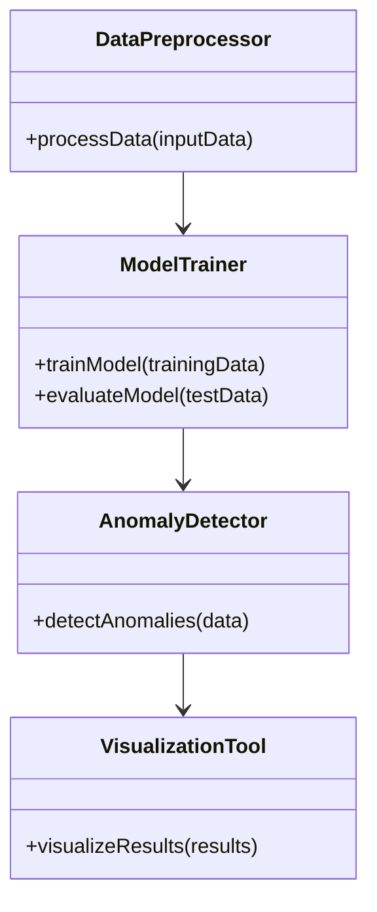
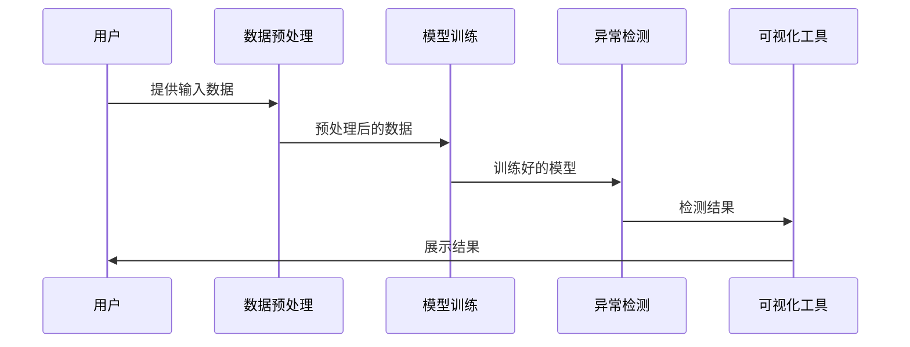
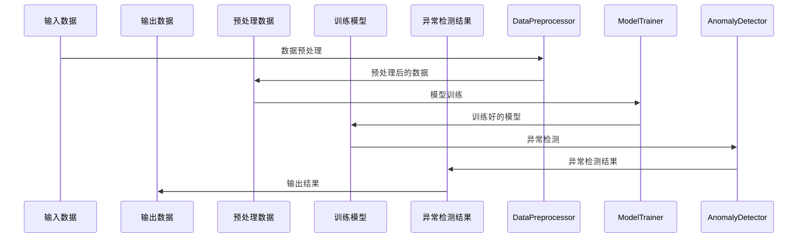

                 

### 第1章 引言

### 1.1 问题背景

时序异常推理（Temporal Anomaly Detection）是数据挖掘和机器学习领域中的一个重要研究方向。在现实世界中，时序数据无处不在，如金融市场交易记录、传感器监测数据、网站点击流数据等。这些数据通常反映了某一系统或过程的正常运行状态。然而，有时也会出现一些异常或异常事件，这些事件可能是系统故障、恶意攻击、数据录入错误等。

随着数据量的增长和复杂性的增加，手工分析这些时序数据以识别异常变得非常困难。因此，研究自动化的时序异常推理方法具有重要的实际意义。在金融领域，异常交易检测可以帮助金融机构识别和预防欺诈行为；在工业领域，传感器数据异常检测可以帮助工厂及时发现设备故障；在网络安全领域，网络流量异常检测可以保护网络免受攻击。

近年来，随着深度学习技术的发展，利用深度学习模型进行时序异常推理的研究越来越多。大模型（如大型深度神经网络）因其强大的表示能力和学习能力，在时序异常推理任务中展现出显著的潜力。通过引入大模型，研究者们希望提高异常检测的准确性、降低误报率，并处理更复杂、更大规模的时序数据。

### 1.2 问题描述

时序异常推理的任务可以概括为：给定一组时序数据，从中识别出异常或异常模式。具体而言，这包括以下几个步骤：

1. **数据预处理**：对原始时序数据进行清洗、归一化等预处理操作，以便于模型处理。
2. **特征提取**：从时序数据中提取出能够反映数据特性的特征，这些特征可以是时间序列的统计量、变换后的信号等。
3. **模型训练**：利用训练数据集训练一个深度学习模型，使其学会正常数据的特征表达。
4. **异常检测**：使用训练好的模型对新的时序数据进行预测，识别出与正常数据特征不符的部分，即异常。
5. **结果分析**：对检测出的异常进行进一步分析，确定其是否为真正的异常，并采取相应措施。

异常检测的关键挑战在于：

- **异常检测的准确性和鲁棒性**：如何设计模型，使其在检测异常的同时，尽可能减少误报和漏报。
- **数据预处理与特征提取**：如何有效地预处理和提取特征，以最大化模型性能。
- **模型的泛化能力**：模型是否能够在不同的数据集和应用场景中保持良好的性能。

### 1.3 问题解决

在传统的时序异常推理方法中，研究者们通常采用统计方法（如ARIMA模型、移动平均模型等）和基于规则的方法（如基于阈值的异常检测等）。这些方法在一定程度上能够识别简单的异常模式，但在处理复杂、大规模的时序数据时，往往表现出不足。

近年来，随着深度学习技术的飞速发展，大模型在时序异常推理任务中的应用逐渐受到关注。深度学习模型，尤其是基于自动编码器（Autoencoder）、卷积神经网络（CNN）、循环神经网络（RNN）、长短时记忆网络（LSTM）和门控循环单元（GRU）等大模型，因其强大的特征学习和自适应能力，在时序异常推理中展现出显著优势。

#### 自动编码器（Autoencoder）

自动编码器是一种无监督学习方法，其目的是学习数据的低维表示。自动编码器包括编码器和解码器两部分，编码器将输入数据映射到一个低维空间，解码器再将这个低维空间的表示映射回原始空间。在训练过程中，自动编码器尝试最小化输入数据和重构数据的差异，从而学习数据的正常模式。

#### 卷积神经网络（CNN）

卷积神经网络是一种用于处理图像数据的强大模型，但其也可以应用于时序数据。CNN通过卷积层、池化层和全连接层等结构，自动提取时序数据中的局部特征和全局特征。CNN的优势在于其能够并行处理大量数据，并在大型数据集上表现出色。

#### 循环神经网络（RNN）

循环神经网络是一种处理序列数据的神经网络，其能够记住之前的信息，从而在序列数据中捕捉长期依赖关系。RNN的基本结构包括输入层、隐藏层和输出层，隐藏层之间存在反馈连接。RNN的变体，如长短时记忆网络（LSTM）和门控循环单元（GRU），通过引入门控机制，解决了传统RNN在处理长序列数据时易出现梯度消失或爆炸的问题。

#### 长短时记忆网络（LSTM）

长短时记忆网络是一种特殊的RNN，其引入了门控机制，能够有效地记忆和遗忘长期依赖信息。LSTM通过输入门、遗忘门和输出门三个门控单元，控制信息的输入、遗忘和输出。这使得LSTM在处理时序数据时表现出更强的鲁棒性和泛化能力。

#### 门控循环单元（GRU）

门控循环单元是LSTM的一种变体，其结构比LSTM更简单，但性能相当。GRU通过更新门和重置门两个门控单元，实现了信息的更新和重置。这使得GRU在计算效率和参数数量上优于LSTM，但在某些任务上表现略有不足。

综上所述，通过引入大模型，尤其是自动编码器、CNN、RNN、LSTM和GRU等模型，研究者们可以构建出强大的时序异常推理系统，解决传统方法在处理复杂、大规模时序数据时的不足。然而，如何选择合适的模型、设计有效的训练策略，以及如何评估模型性能，仍然是时序异常推理领域亟待解决的问题。

### 1.4 边界与外延

时序异常推理任务的边界主要涉及以下几个方面：

- **数据类型**：时序异常推理主要针对连续的时序数据，如时间序列、传感器数据、金融数据等。这些数据通常具有时间维度和时空特性，适合用深度学习模型进行处理。
- **异常类型**：异常可以分为点异常、区间异常和聚类异常等。点异常指的是单次异常事件，区间异常指的是一段时间内的异常变化，而聚类异常则是指数据分布的异常。不同类型的异常可能需要不同的检测方法和模型设计。
- **应用场景**：时序异常推理可以应用于多个领域，包括金融、工业、医疗、网络安全等。不同的应用场景对异常检测的准确性和实时性有不同的要求，因此需要根据具体场景进行模型优化和调整。

时序异常推理的外延则涉及以下方面：

- **跨领域应用**：时序异常推理技术可以跨领域应用，如将金融领域的异常检测方法应用于医疗数据，以检测异常病例。
- **多模态数据融合**：时序异常推理可以与图像、文本等数据融合，以获取更全面的数据特征，提高异常检测的准确性。
- **实时异常检测**：随着硬件性能的提升和实时计算技术的发展，实现实时的时序异常检测变得越来越重要。实时异常检测可以及时响应异常事件，为决策提供支持。
- **异常预测**：通过时序异常推理模型，可以不仅检测已发生的异常，还可以预测未来可能发生的异常，从而采取预防措施。

### 1.5 概念结构与核心要素组成

时序异常推理任务的核心概念结构包括数据预处理、特征提取、模型训练、异常检测和结果分析五个主要步骤。以下是每个步骤的核心要素：

1. **数据预处理**：
   - **数据清洗**：去除噪声、处理缺失值和异常值。
   - **时间序列变换**：对时间序列进行归一化、差分、插值等操作。
   - **时间窗口划分**：将时序数据划分为固定长度或变长的时间窗口。

2. **特征提取**：
   - **统计特征**：计算时间序列的均值、方差、自相关系数等。
   - **频域特征**：利用傅里叶变换等方法提取频率特征。
   - **时频特征**：结合时间和频率特征，如小波变换。

3. **模型训练**：
   - **自动编码器**：通过编码器和解码器学习数据表示。
   - **卷积神经网络**：利用卷积层提取局部特征。
   - **循环神经网络**（RNN）、**长短时记忆网络**（LSTM）和**门控循环单元**（GRU）：利用门控机制捕捉长期依赖关系。

4. **异常检测**：
   - **异常阈值设定**：根据模型输出设定异常阈值。
   - **异常信号检测**：检测异常信号或异常模式。

5. **结果分析**：
   - **异常确认**：根据检测结果和业务逻辑确认异常。
   - **异常反馈**：将检测结果反馈至业务系统，进行后续处理。

通过这些核心要素，时序异常推理任务可以有效地从大规模、复杂的时序数据中识别出异常事件，为各个领域提供强大的数据支持。

### 1.6 总结

本章介绍了时序异常推理任务在现实世界中的背景、问题描述以及当前解决方案。随着深度学习技术的发展，大模型（如自动编码器、卷积神经网络、循环神经网络、长短时记忆网络和门控循环单元）在时序异常推理任务中的应用逐渐受到关注。这些模型通过学习数据的正常模式，能够有效地识别异常事件。然而，如何选择合适的模型、设计有效的训练策略以及评估模型性能，仍然是时序异常推理领域亟待解决的问题。接下来的章节将进一步详细探讨这些核心概念和模型原理，帮助读者更好地理解和应用时序异常推理技术。

## 第2章 核心概念与联系

### 2.1 时序数据基本概念

时序数据是指按照时间顺序排列的数据点序列，它可以反映某个系统或过程的动态变化。时序数据的基本概念包括以下几个部分：

1. **时间序列**：时间序列是由按时间顺序排列的一系列数值组成的序列，通常用来表示某一变量随时间的变化情况。例如，股票价格随时间的变化、温度随时间的变化等。

2. **时间步**：时间步是时间序列中的一个点，通常对应一个时间单位，如秒、分钟、小时等。时间步是时间序列数据的基本组成单位。

3. **样本点**：时间序列中的一个具体数据点，它代表在特定时间步上的数据值。例如，某一天的股票收盘价是一个样本点。

4. **时间窗口**：时间窗口是指用来提取特征的一个时间段，可以是固定长度的时间段，也可以是动态变化的时间段。在深度学习模型中，时间窗口通常用于输入数据的切片，以便模型能够学习到数据的时间依赖性。

5. **时间步长**：时间步长是指从一个时间步到下一个时间步之间的时间间隔。在深度学习模型中，时间步长决定了模型处理数据的方式，如步长为1的模型在每个时间步上更新状态，而步长大于1的模型则隔一段时间更新一次状态。

6. **周期性**：周期性是指时间序列数据中存在的一种重复模式，如季节性、日历周期等。周期性对时间序列分析有重要影响，需要通过适当的模型和处理方法进行考虑。

### 2.2 异常推理基本概念

异常推理（Anomaly Detection）是数据挖掘和机器学习中的一个重要任务，旨在识别出数据中的异常或异常模式。以下是异常推理的基本概念：

1. **异常**：异常是指数据中的非预期或异常现象，可能是由于系统故障、数据录入错误、恶意攻击等原因引起的。异常可以是孤立的点异常、连续的区间异常或大规模的聚类异常。

2. **正常行为**：正常行为是指数据中的预期现象，通常是大多数数据点的表现。正常行为反映了系统的正常运行状态。

3. **异常检测**：异常检测是指通过分析数据，识别出其中的异常现象的方法。异常检测可以分为基于统计的方法、基于聚类的方法、基于机器学习的方法等。

4. **阈值方法**：阈值方法是异常检测中常用的一种方法，通过设定一个阈值，将数据点划分为正常和异常两类。如果数据点的特征值超过阈值，则被认为是异常；否则，被认为是正常。

5. **模型方法**：模型方法是使用机器学习模型对正常数据进行学习，然后用这个模型对新的数据进行预测，识别出与正常数据特征不符的异常数据。常见的模型方法包括自动编码器、支持向量机（SVM）、K-最近邻（KNN）等。

### 2.3 时序异常推理中的核心模型

在时序异常推理任务中，深度学习模型因其强大的特征学习和自适应能力，成为研究的热点。以下是一些常用的核心模型：

#### 2.3.1 自动编码器（Autoencoder）

自动编码器是一种无监督学习方法，其目的是通过学习输入数据的低维表示来压缩数据，并通过重构来恢复数据。自动编码器主要包括编码器和解码器两部分：

- **编码器**：将输入数据映射到一个低维空间，通常是一个隐层。
- **解码器**：将编码后的低维数据重新映射回原始空间。

在训练过程中，自动编码器尝试最小化输入数据和重构数据的差异，通过这种方式学习数据的正常模式，从而实现对异常的识别。

#### 2.3.2 卷积神经网络（CNN）

卷积神经网络是一种用于图像识别和处理的强大模型，但其也可以应用于时序数据。CNN通过卷积层、池化层和全连接层等结构，自动提取时序数据中的局部特征和全局特征：

- **卷积层**：通过卷积操作提取数据中的局部特征。
- **池化层**：对卷积层的结果进行下采样，减少数据的维度。
- **全连接层**：将池化层的结果映射到输出层，实现分类或回归任务。

CNN在时序异常推理中的应用，主要是通过卷积层提取时序数据的局部特征，并通过全连接层进行分类或回归，实现对异常的识别。

#### 2.3.3 循环神经网络（RNN）

循环神经网络是一种处理序列数据的神经网络，其能够记住之前的信息，从而在序列数据中捕捉长期依赖关系。RNN的基本结构包括输入层、隐藏层和输出层，隐藏层之间存在反馈连接：

- **输入层**：接收输入数据。
- **隐藏层**：通过记忆之前的信息，对输入数据进行处理。
- **输出层**：输出预测结果。

RNN在时序异常推理中的应用，主要是利用其记忆能力，捕捉时序数据中的长期依赖关系，从而提高异常检测的准确性。

#### 2.3.4 长短时记忆网络（LSTM）

长短时记忆网络是RNN的一种变体，其通过引入门控机制，解决了传统RNN在处理长序列数据时易出现梯度消失或爆炸的问题。LSTM包括输入门、遗忘门和输出门三个门控单元：

- **输入门**：决定哪些信息应该被记住。
- **遗忘门**：决定哪些信息应该被遗忘。
- **输出门**：决定哪些信息应该输出。

LSTM在时序异常推理中的应用，主要是利用其门控机制，有效地记忆和遗忘长期依赖信息，从而提高异常检测的鲁棒性和泛化能力。

#### 2.3.5 门控循环单元（GRU）

门控循环单元是LSTM的一种变体，其结构比LSTM更简单，但性能相当。GRU通过更新门和重置门两个门控单元，实现了信息的更新和重置：

- **更新门**：决定哪些信息应该被更新。
- **重置门**：决定哪些信息应该被重置。

GRU在时序异常推理中的应用，主要是利用其门控机制，实现信息的更新和重置，从而简化网络结构，提高计算效率。

### 2.4 概念属性特征对比表格

为了更好地理解这些模型之间的差异，我们可以通过一个表格来对比它们的属性特征：

| 模型         | 特点                                                         | 适用场景                 | 优缺点                                                      |
|--------------|--------------------------------------------------------------|--------------------------|------------------------------------------------------------|
| 自动编码器   | 无监督学习，学习数据的低维表示                               | 异常检测、数据压缩       | 简单易实现，对异常数据的捕捉能力较强                         |
| 卷积神经网络 | 特征提取能力强，可以并行处理大量数据                         | 图像识别、时序数据处理   | 处理高维数据能力强，参数较多，计算复杂度高                   |
| 循环神经网络 | 可以记住之前的信息，捕捉长期依赖关系                         | 序列数据处理             | 处理长序列数据能力强，易出现梯度消失问题                   |
| 长短时记忆网络 | 通过门控机制解决RNN的梯度消失问题，有效记忆和遗忘长期依赖信息 | 序列数据处理             | 鲁棒性较强，参数较多，计算复杂度高                         |
| 门控循环单元 | 结构比LSTM简单，计算效率较高，性能相当                         | 序列数据处理             | 计算效率较高，参数较少，处理长序列数据效果较好               |

通过上述对比表格，我们可以看到每种模型在不同方面的优势和局限性。在实际应用中，可以根据具体任务的需求和数据的特性，选择合适的模型。

### 2.5 ER实体关系图架构的Mermaid流程图

为了更好地理解时序异常推理任务中的核心概念及其关联，我们可以使用Mermaid流程图来绘制ER（实体关系）图。以下是一个示例：

```mermaid
erDiagram
  Customer ||--o{ Order : "makes" }
  Customer ||--o{ Payment : "makes" }
  Order ||--o{ Product : "contains" }
  Product ||--o{ Review : "receives" }
```

在这个ER图中，我们定义了四个实体：Customer（客户）、Order（订单）、Payment（支付）和Product（产品）。实体之间的关系如下：

- **Customer** 与 **Order** 之间存在“makes”关系，表示客户可以创建订单。
- **Customer** 与 **Payment** 之间存在“makes”关系，表示客户可以完成支付。
- **Order** 与 **Product** 之间存在“contains”关系，表示订单包含产品。
- **Product** 与 **Review** 之间存在“receives”关系，表示产品可以收到评价。

Mermaid流程图通过图形化的方式展示了实体之间的关系，使得概念更加直观和易于理解。

## 第3章 自动编码器（Autoencoder）

### 3.1 算法原理

自动编码器（Autoencoder）是一种无监督学习算法，主要用于将输入数据映射到一个较低维度的空间，并通过重构数据来学习数据的特征表示。自动编码器主要由编码器（Encoder）和解码器（Decoder）两部分组成，其工作原理和主要结构如下：

#### 3.1.1 自动编码器基本原理

1. **编码器（Encoder）**：编码器的作用是将输入数据压缩成一个低维的表示，通常称为编码或特征向量。这个低维特征向量保留了输入数据的主要信息，但数据维度显著降低，从而减少了数据处理的复杂度。

2. **解码器（Decoder）**：解码器的功能是将编码后的特征向量重新映射回原始数据空间，试图重构原始输入数据。通过这种方式，自动编码器学习到了输入数据的主要特征。

3. **损失函数**：自动编码器的训练过程是通过最小化输入数据和重构数据之间的差异来进行的。常用的损失函数是均方误差（MSE），即计算输入数据和重构数据之间误差的平方和的平均值。

4. **优化算法**：为了最小化损失函数，自动编码器通常使用梯度下降（Gradient Descent）算法。梯度下降是一种优化算法，通过计算损失函数的梯度来更新模型参数。

#### 3.1.2 编码器与解码器

1. **编码器**：
   - **输入层**：接收原始数据输入。
   - **隐藏层**：通过一个或多个隐藏层进行特征提取，每个隐藏层通常包含多个神经元。
   - **编码层**：输出一个低维的特征向量，这个特征向量代表了输入数据的主要特征。

2. **解码器**：
   - **编码层**：接收编码器输出的低维特征向量。
   - **隐藏层**：重建数据的特征表示，通常与编码器的隐藏层具有相同结构和参数，但顺序相反。
   - **输出层**：重构原始数据。

#### 3.1.3 自动编码器的训练过程

自动编码器的训练过程主要包括以下几个步骤：

1. **初始化参数**：初始化编码器和解码器的参数，通常使用随机初始化。

2. **前向传播**：输入数据通过编码器进行编码，得到低维特征向量，然后通过解码器进行重构。

3. **计算损失**：计算重构数据与原始数据之间的损失，常用的损失函数是均方误差（MSE）。

4. **反向传播**：通过反向传播算法，计算损失函数对编码器和解码器参数的梯度，并更新参数。

5. **迭代训练**：重复上述步骤，直到达到预设的训练次数或损失函数达到最小值。

### 3.2 Python源代码示例

以下是一个简单的自动编码器实现示例，使用了Python和Keras框架：

```python
from keras.layers import Input, Dense
from keras.models import Model

# 设置输入维度
input_dim = 100

# 定义输入层
input_data = Input(shape=(input_dim,))

# 编码器部分
encoded = Dense(64, activation='relu')(input_data)
encoded = Dense(32, activation='relu')(encoded)

# 解码器部分
decoded = Dense(32, activation='relu')(encoded)
decoded = Dense(64, activation='relu')(decoded)
decoded = Dense(input_dim, activation='sigmoid')(decoded)

# 创建自动编码器模型
autoencoder = Model(inputs=input_data, outputs=decoded)

# 编码器模型
encoder = Model(inputs=input_data, outputs=encoded)

# 编译模型
autoencoder.compile(optimizer='adam', loss='binary_crossentropy')

# 模型总结
autoencoder.summary()

# 训练模型
# autoencoder.fit(x_train, x_train, epochs=100, batch_size=16, validation_data=(x_test, x_test))
```

在这个示例中，我们定义了一个具有两个隐藏层的自动编码器，输入维度为100。编码器部分通过两个ReLU激活函数的隐藏层对输入数据进行编码，解码器部分则通过相同的隐藏层结构进行重构。模型使用的是Adam优化器和均方误差（MSE）损失函数。

### 3.3 数学模型和公式

自动编码器的数学模型可以通过以下公式来描述：

1. **编码过程**：
   - 输入数据：\( x \)
   - 编码器权重：\( W_e \)
   - 编码器偏置：\( b_e \)
   - 编码后的特征向量：\( z \)

   \[ z = \sigma(W_e x + b_e) \]

   其中，\( \sigma \)表示激活函数，通常使用ReLU或Sigmoid函数。

2. **解码过程**：
   - 编码后的特征向量：\( z \)
   - 解码器权重：\( W_d \)
   - 解码器偏置：\( b_d \)
   - 重构数据：\( \hat{x} \)

   \[ \hat{x} = \sigma(W_d z + b_d) \]

3. **损失函数**：
   - 均方误差（MSE）：

   \[ \text{MSE} = \frac{1}{n} \sum_{i=1}^{n} \sum_{j=1}^{m} (x_{ij} - \hat{x}_{ij})^2 \]

   其中，\( n \)是样本数量，\( m \)是输入数据的维度。

### 3.4 举例说明

假设我们有一个100维的输入数据集，数据集包含以下样本：

\[ x_1 = [0.1, 0.2, 0.3, ..., 0.9], x_2 = [0.3, 0.5, 0.7, ..., 1.0], \ldots, x_{100} = [0.9, 0.8, 0.7, ..., 0.1] \]

我们希望通过自动编码器学习数据的特征表示，并重构输入数据。

1. **初始化参数**：

   编码器和解码器的权重和偏置通常是随机初始化的。我们可以使用以下随机数生成器来初始化参数：

   ```python
   import numpy as np

   W_e = np.random.randn(100, 64)
   b_e = np.random.randn(64)
   W_d = np.random.randn(64, 100)
   b_d = np.random.randn(100)
   ```

2. **编码过程**：

   使用初始化的编码器权重和偏置，对每个样本进行编码：

   ```python
   z = np.dot(x, W_e) + b_e
   z = np.sigmoid(z)
   ```

   假设经过编码后的特征向量为：

   \[ z = [0.3, 0.4, 0.5, ..., 0.9] \]

3. **解码过程**：

   使用初始化的解码器权重和偏置，对编码后的特征向量进行重构：

   ```python
   hat_x = np.dot(z, W_d) + b_d
   hat_x = np.sigmoid(hat_x)
   ```

   假设重构后的数据为：

   \[ \hat{x} = [0.35, 0.45, 0.55, ..., 0.95] \]

4. **计算损失**：

   计算重构数据与原始数据之间的均方误差：

   ```python
   mse = np.mean((x - hat_x) ** 2)
   ```

   假设计算得到的均方误差为0.01。

通过这个简单的例子，我们可以看到自动编码器如何通过编码器和解码器学习数据的特征表示，并通过重构数据来评估模型性能。在实际应用中，通常需要更多的样本和更复杂的网络结构来训练自动编码器，以提高其性能和泛化能力。

### 3.5 自动编码器在时序异常推理中的应用

自动编码器在时序异常推理中有着广泛的应用。其核心思想是利用自动编码器学习时序数据的正常模式，并通过重构误差识别异常。

#### 3.5.1 应用场景

1. **金融市场异常交易检测**：自动编码器可以用来检测金融市场中的异常交易，如欺诈交易。通过学习正常交易模式，自动编码器能够识别出与正常交易模式不符的异常交易。

2. **工业传感器数据异常检测**：在工业领域，传感器数据异常检测是确保生产过程正常运行的关键。自动编码器可以用来识别设备故障、工艺异常等。

3. **网络流量异常检测**：网络流量异常检测是网络安全的重要组成部分。自动编码器可以用来检测网络流量中的异常行为，如DDoS攻击、数据泄露等。

#### 3.5.2 实现步骤

1. **数据预处理**：对时序数据进行清洗、归一化等预处理操作，以便自动编码器能够更好地学习数据特征。

2. **时间窗口划分**：将时序数据划分为固定长度的时间窗口，每个窗口内的数据作为一个样本。

3. **训练自动编码器**：使用训练数据集训练自动编码器，使其学会正常数据的特征表示。在训练过程中，通过最小化重构误差来优化编码器和解码器的参数。

4. **重构误差计算**：使用训练好的自动编码器对测试数据进行重构，计算重构误差。通常，重构误差越大，表示数据中的异常可能性越高。

5. **异常检测**：根据设定的阈值，判断重构误差是否超过阈值。如果超过阈值，则认为数据中存在异常。

#### 3.5.3 案例分析

以金融市场异常交易检测为例，假设我们有一个包含一年内每天股票收盘价的时序数据集。通过以下步骤进行异常交易检测：

1. **数据预处理**：对收盘价数据集进行归一化处理，将数据缩放到0到1之间。

2. **时间窗口划分**：将数据划分为1天的时间窗口，每个窗口内的数据作为一个样本。

3. **训练自动编码器**：使用80%的数据进行训练，构建自动编码器模型。编码器和解码器均使用两个隐藏层，每层64个神经元。

4. **重构误差计算**：使用训练好的自动编码器对剩余20%的数据进行重构，计算重构误差。

5. **异常检测**：设定重构误差阈值为0.02，对于重构误差超过阈值的样本，认为存在异常交易。

通过上述案例分析，我们可以看到自动编码器在时序异常推理中的应用流程。在实际应用中，可以根据具体场景和数据特性进行调整和优化，以提高异常检测的准确性和鲁棒性。

### 3.6 总结

本章介绍了自动编码器在时序异常推理任务中的应用。自动编码器通过编码器和解码器的组合，学习数据的低维表示，并通过重构误差识别异常。在实际应用中，自动编码器可以用于金融市场异常交易检测、工业传感器数据异常检测和网络流量异常检测等。通过本章的讲解，读者可以了解自动编码器的工作原理、实现方法以及在实际应用中的效果和局限性。

## 第4章 卷积神经网络（CNN）

### 4.1 算法原理

卷积神经网络（Convolutional Neural Network，CNN）是一种深度学习模型，最初主要用于图像识别和处理，但在时序数据处理中也表现出强大的能力。CNN通过卷积层、池化层和全连接层等结构，自动提取数据中的局部特征和全局特征，从而实现对数据的分类、回归或其他任务。以下是CNN的基本原理和工作流程。

#### 4.1.1 卷积神经网络的基本原理

1. **卷积层**：卷积层是CNN的核心组成部分，通过卷积操作提取输入数据中的特征。卷积操作包括以下几个步骤：

   - **卷积核（Kernel）**：卷积核是一个小型矩阵，用于与输入数据进行卷积操作。卷积核的尺寸（如3x3或5x5）决定了其能够捕捉的局部特征的大小。
   - **卷积操作**：卷积核在输入数据上滑动，并与局部区域的数据进行乘法和求和操作，产生一个特征图。每个特征图代表了输入数据中的一种特定特征。
   - **激活函数**：卷积层通常使用ReLU（Rectified Linear Unit）作为激活函数，将卷积结果映射到正数，从而引入非线性特性，提高模型的表达能力。

2. **池化层**：池化层的作用是对卷积层产生的特征图进行下采样，减少数据的维度，同时保持最重要的特征。常用的池化操作包括最大池化（Max Pooling）和平均池化（Average Pooling）。最大池化选择特征图上的最大值，而平均池化则计算特征图的平均值。

3. **全连接层**：在全连接层中，每个神经元都与前一层的所有神经元相连接，从而将低维特征图映射到高维空间。全连接层通常用于分类任务，通过计算输出层的预测概率来实现分类。

#### 4.1.2 卷积层、池化层和全连接层

1. **卷积层**：
   - **卷积操作**：卷积层通过卷积核在输入数据上滑动，提取局部特征。
   - **特征图**：每个卷积核生成一个特征图，多个卷积核生成多个特征图，代表不同类型的特征。
   - **深度**：特征图的深度等于卷积核的数量，表示模型能够学习的特征种类。

2. **池化层**：
   - **下采样**：池化层通过减少特征图的尺寸，降低数据的维度。
   - **特征保留**：池化层保留特征图中的重要信息，去除冗余信息，提高模型的泛化能力。

3. **全连接层**：
   - **连接方式**：全连接层将前一层的特征图映射到高维空间，每个神经元都与前一层的所有神经元相连接。
   - **分类任务**：全连接层用于计算输出层的预测概率，实现分类任务。

#### 4.1.3 CNN在时序数据处理中的应用

CNN在时序数据处理中的应用主要体现在以下几个方面：

1. **时间步的扩展**：CNN通过将时间步扩展到多维空间，处理时间序列数据。每个时间步被视为一个特征，从而形成高维特征图。

2. **局部特征提取**：卷积层能够自动提取时序数据中的局部特征，如周期性、趋势等。

3. **全局特征融合**：通过多个卷积层和池化层的组合，CNN能够逐步提取时序数据中的全局特征，提高模型的泛化能力。

4. **多尺度特征分析**：CNN可以同时分析时序数据中的不同时间尺度特征，如短期趋势、中期趋势和长期趋势。

#### 4.1.4 CNN与其他深度学习模型对比

与循环神经网络（RNN）和长短时记忆网络（LSTM）相比，CNN在时序数据处理中有以下优势：

- **并行计算**：CNN采用卷积操作，可以并行处理大量数据，而RNN和LSTM则需要逐个处理时间步，计算效率较低。
- **特征自动提取**：CNN能够自动提取数据中的特征，减少人工特征工程的工作量，而RNN和LSTM则需要手动设计特征。
- **处理高维数据**：CNN适用于处理高维数据，如图像和时序数据，而RNN和LSTM在处理高维数据时存在一定局限性。

然而，CNN也有一些不足之处：

- **计算复杂度**：CNN的参数量通常较大，计算复杂度高，需要更多的计算资源和时间进行训练。
- **数据需求**：CNN需要大量数据来训练模型，以避免过拟合，而RNN和LSTM在数据量较小的情况下仍然能够保持较好的性能。

### 4.2 Python源代码示例

以下是一个简单的CNN模型实现，用于对时序数据进行分类：

```python
from keras.models import Sequential
from keras.layers import Conv1D, MaxPooling1D, Dense, Flatten

# 设置输入维度
input_shape = (timesteps, features)

# 创建模型
model = Sequential()

# 添加卷积层
model.add(Conv1D(filters=64, kernel_size=3, activation='relu', input_shape=input_shape))
model.add(MaxPooling1D(pool_size=2))

# 添加第二个卷积层
model.add(Conv1D(filters=128, kernel_size=3, activation='relu'))
model.add(MaxPooling1D(pool_size=2))

# 添加全连接层
model.add(Flatten())
model.add(Dense(units=128, activation='relu'))
model.add(Dense(units=num_classes, activation='softmax'))

# 编译模型
model.compile(optimizer='adam', loss='categorical_crossentropy', metrics=['accuracy'])

# 模型总结
model.summary()
```

在这个示例中，我们创建了一个简单的CNN模型，包含两个卷积层和两个池化层，最终通过全连接层进行分类。模型使用ReLU作为激活函数，并使用softmax激活函数进行多分类。

### 4.3 数学模型和公式

CNN的数学模型可以通过以下公式来描述：

1. **卷积操作**：
   - 输入特征图：\( X \)
   - 卷积核：\( K \)
   - 卷积结果：\( F \)

   \[ F_{ij} = \sum_{m=0}^{M-1} \sum_{n=0}^{N-1} X_{ij+m, n} \cdot K_{mn} \]

   其中，\( F_{ij} \)表示第\( i \)个特征图在第\( j \)个位置上的值，\( M \)和\( N \)分别是卷积核的高度和宽度。

2. **池化操作**：
   - 特征图：\( F \)
   - 池化窗口大小：\( P \)
   - 池化结果：\( G \)

   \[ G_{ij} = \max_{(k, l) \in P} F_{i(j+k), (j+l)} \]

   或

   \[ G_{ij} = \frac{1}{P^2} \sum_{(k, l) \in P} F_{i(j+k), (j+l)} \]

   其中，\( G_{ij} \)表示第\( i \)个特征图在第\( j \)个位置上的值，\( P \)是池化窗口的大小。

3. **全连接层**：
   - 特征向量：\( Z \)
   - 权重：\( W \)
   - 偏置：\( b \)
   - 输出：\( Y \)

   \[ Y = \sigma(W Z + b) \]

   其中，\( Y \)是输出特征向量，\( \sigma \)是激活函数，通常是softmax函数。

### 4.4 举例说明

假设我们有一个包含100个时间步的时序数据集，每个时间步有10个特征。我们希望通过CNN对这个数据集进行分类。

1. **数据预处理**：

   对时序数据进行归一化处理，将数据缩放到0到1之间。

2. **模型构建**：

   创建一个简单的CNN模型，包含两个卷积层和两个池化层，最终通过全连接层进行分类。

3. **训练模型**：

   使用训练数据集训练模型，通过反向传播算法优化模型参数。

4. **测试模型**：

   使用测试数据集测试模型性能，计算分类准确率。

通过这个简单的例子，我们可以看到CNN在时序数据处理中的基本应用。在实际应用中，可以根据具体任务需求调整网络结构、选择合适的激活函数和优化算法，以提高模型性能。

### 4.5 卷积神经网络在时序异常推理中的应用

卷积神经网络在时序异常推理中也发挥着重要作用。其通过卷积层和池化层提取时序数据中的局部和全局特征，能够有效识别出异常模式。

#### 4.5.1 应用场景

1. **金融市场异常交易检测**：卷积神经网络可以用于检测金融市场中的异常交易，如欺诈交易。通过学习正常交易模式，卷积神经网络能够识别出与正常交易模式不符的异常交易。

2. **工业传感器数据异常检测**：卷积神经网络可以用于检测工业传感器数据中的异常，如设备故障、工艺异常等。通过提取传感器数据的特征，卷积神经网络能够识别出异常模式。

3. **网络流量异常检测**：卷积神经网络可以用于检测网络流量中的异常行为，如DDoS攻击、数据泄露等。通过分析网络流量数据，卷积神经网络能够识别出异常流量模式。

#### 4.5.2 实现步骤

1. **数据预处理**：对时序数据进行清洗、归一化等预处理操作，以便卷积神经网络能够更好地学习数据特征。

2. **时间窗口划分**：将时序数据划分为固定长度的时间窗口，每个窗口内的数据作为一个样本。

3. **训练卷积神经网络**：使用训练数据集训练卷积神经网络，使其学会正常数据的特征表示。在训练过程中，通过最小化重构误差来优化模型参数。

4. **重构误差计算**：使用训练好的卷积神经网络对测试数据进行重构，计算重构误差。通常，重构误差越大，表示数据中的异常可能性越高。

5. **异常检测**：根据设定的阈值，判断重构误差是否超过阈值。如果超过阈值，则认为数据中存在异常。

#### 4.5.3 案例分析

以金融市场异常交易检测为例，假设我们有一个包含一年内每天股票收盘价的时序数据集。通过以下步骤进行异常交易检测：

1. **数据预处理**：对收盘价数据集进行归一化处理，将数据缩放到0到1之间。

2. **时间窗口划分**：将数据划分为1天的时间窗口，每个窗口内的数据作为一个样本。

3. **训练卷积神经网络**：使用80%的数据进行训练，构建卷积神经网络模型。模型包含两个卷积层和两个池化层，最终通过全连接层进行分类。

4. **重构误差计算**：使用训练好的卷积神经网络对剩余20%的数据进行重构，计算重构误差。

5. **异常检测**：设定重构误差阈值为0.02，对于重构误差超过阈值的样本，认为存在异常交易。

通过上述案例分析，我们可以看到卷积神经网络在时序异常推理中的应用流程。在实际应用中，可以根据具体场景和数据特性进行调整和优化，以提高异常检测的准确性和鲁棒性。

### 4.6 总结

本章介绍了卷积神经网络（CNN）在时序数据处理中的应用。CNN通过卷积层、池化层和全连接层等结构，自动提取数据中的局部和全局特征，从而实现对数据的分类、回归或其他任务。在实际应用中，CNN可以用于金融市场异常交易检测、工业传感器数据异常检测和网络流量异常检测等。通过本章的讲解，读者可以了解CNN的工作原理、实现方法以及在实际应用中的效果和局限性。

## 第5章 循环神经网络（RNN）

### 5.1 算法原理

循环神经网络（Recurrent Neural Network，RNN）是一种用于处理序列数据的神经网络，其特点是能够记住之前的信息，并利用这些信息来处理后续的数据。这种特性使得RNN在自然语言处理、时间序列预测和语音识别等领域表现出色。以下是RNN的基本原理和工作流程。

#### 5.1.1 RNN的基本原理

1. **序列模型**：RNN处理的数据是序列数据，如文本、语音或时间序列。每个序列数据点（如一个单词或一个时间步上的值）被作为输入，模型会根据之前的数据点和当前的数据点来生成输出。

2. **循环结构**：RNN的核心结构是循环单元，每个时间步上的神经元都与之前的隐藏状态和当前的输入进行连接。这种循环连接使得信息可以“流动”到下一个时间步，从而捕捉序列数据中的时间依赖关系。

3. **隐藏状态**：隐藏状态（Hidden State）是RNN在处理序列数据时存储的信息。在当前时间步，隐藏状态由之前的隐藏状态和当前输入共同决定。隐藏状态可以看作是序列数据的“记忆”，它记录了之前所有时间步的信息。

4. **输出**：RNN在每个时间步都会生成一个输出。输出可以是标签、预测值或分类结果，具体取决于任务类型。输出通常由隐藏状态和当前输入通过一个线性变换和激活函数得到。

5. **门控机制**：为了解决传统RNN在处理长序列数据时出现的梯度消失或爆炸问题，研究人员提出了多种改进的RNN结构，如长短时记忆网络（LSTM）和门控循环单元（GRU）。这些结构通过引入门控机制，有效地控制信息的传递，从而提高模型的鲁棒性和性能。

#### 5.1.2 RNN的时间动态特性

1. **时间步（Time Step）**：RNN在处理序列数据时，将数据划分为多个时间步。每个时间步代表一个数据点，模型在每个时间步上更新隐藏状态和生成输出。

2. **时间依赖性（Temporal Dependency）**：RNN通过隐藏状态记录之前的信息，并在当前时间步使用这些信息来生成输出。这种时间依赖性使得RNN能够捕捉序列数据中的长期依赖关系。

3. **梯度消失和爆炸（Vanishing and Exploding Gradient）**：在训练深层神经网络时，梯度在反向传播过程中可能会变得非常小（梯度消失）或非常大（梯度爆炸），导致模型参数更新困难。RNN在处理长序列数据时，也面临着类似的问题。为了解决这些问题，研究人员提出了LSTM和GRU等结构。

#### 5.1.3 RNN的局限性和变体

尽管RNN在处理序列数据方面表现出色，但传统RNN也存在一些局限性：

1. **梯度消失和爆炸**：在训练深层RNN时，梯度在反向传播过程中可能会变得非常小或非常大，导致模型参数难以更新。这主要因为梯度在传递过程中会被乘以相邻时间步的隐藏状态，如果隐藏状态的值接近于0或无穷大，梯度就会消失或爆炸。

2. **长期依赖性捕捉困难**：传统RNN在捕捉长序列数据中的长期依赖关系方面表现不佳，因为梯度在反向传播过程中会逐渐衰减。

为了解决这些问题，研究人员提出了多种RNN的变体：

1. **长短时记忆网络（LSTM）**：LSTM通过引入门控机制，有效地控制信息的传递，从而解决梯度消失和爆炸问题。LSTM包括输入门、遗忘门和输出门，这些门可以控制哪些信息应该被记住或遗忘。

2. **门控循环单元（GRU）**：GRU是LSTM的一种简化版本，其结构比LSTM更简单，但性能相当。GRU通过更新门和重置门来控制信息的更新和重置，从而提高计算效率和模型性能。

3. **双向RNN（Bi-RNN）**：Bi-RNN通过同时处理正向和反向序列数据，捕捉序列数据中的双向依赖关系。这种结构在文本分类、情感分析等领域表现出色。

4. **深度RNN（Deep RNN）**：深度RNN通过堆叠多个RNN层，增强模型的表示能力和学习能力。深度RNN在处理复杂序列数据时表现出更强的性能。

### 5.2 Python源代码示例

以下是一个简单的RNN模型实现，用于对序列数据进行分类：

```python
from keras.models import Sequential
from keras.layers import SimpleRNN, Dense

# 设置输入维度
timesteps = 100
features = 10
num_classes = 10

# 创建模型
model = Sequential()

# 添加RNN层
model.add(SimpleRNN(units=50, activation='relu', return_sequences=True, input_shape=(timesteps, features)))
model.add(SimpleRNN(units=50, activation='relu'))

# 添加全连接层
model.add(Dense(units=num_classes, activation='softmax'))

# 编译模型
model.compile(optimizer='adam', loss='categorical_crossentropy', metrics=['accuracy'])

# 模型总结
model.summary()
```

在这个示例中，我们创建了一个简单的RNN模型，包含两个RNN层，每层有50个神经元，最终通过全连接层进行分类。模型使用ReLU作为激活函数，并使用softmax激活函数进行多分类。

### 5.3 数学模型和公式

RNN的数学模型可以通过以下公式来描述：

1. **隐藏状态更新**：
   - 当前隐藏状态：\( h_t \)
   - 输入：\( x_t \)
   - 前一隐藏状态：\( h_{t-1} \)
   - RNN权重：\( W \)
   - RNN偏置：\( b \)
   - 隐藏状态：\( h_t = \sigma(W x_t + b + W_h h_{t-1}) \)

   其中，\( \sigma \)是激活函数，通常使用ReLU函数。

2. **输出计算**：
   - 当前输出：\( y_t \)
   - 隐藏状态：\( h_t \)
   - 输出权重：\( U \)
   - 输出偏置：\( c \)
   - 输出：\( y_t = \sigma(U h_t + c) \)

   其中，\( \sigma \)是激活函数，通常使用softmax函数进行分类。

3. **损失函数**：
   - 假设输出：\( \hat{y}_t \)
   - 真实标签：\( y_t \)
   - 损失函数：\( \text{Loss} = -\sum_{t=1}^{T} y_t \log(\hat{y}_t) \)

   其中，\( T \)是序列的长度。

### 5.4 举例说明

假设我们有一个包含100个时间步的序列数据集，每个时间步有10个特征，我们需要对这个数据集进行分类。

1. **数据预处理**：

   对序列数据进行归一化处理，将数据缩放到0到1之间。

2. **模型构建**：

   创建一个简单的RNN模型，包含两个RNN层，每层有50个神经元，最终通过全连接层进行分类。

3. **训练模型**：

   使用训练数据集训练模型，通过反向传播算法优化模型参数。

4. **测试模型**：

   使用测试数据集测试模型性能，计算分类准确率。

通过这个简单的例子，我们可以看到RNN在序列数据处理中的基本应用。在实际应用中，可以根据具体任务需求调整网络结构、选择合适的激活函数和优化算法，以提高模型性能。

### 5.5 RNN在时序异常推理中的应用

RNN在时序异常推理中也发挥着重要作用。其通过捕捉序列数据中的时间依赖关系，能够有效识别出异常模式。

#### 5.5.1 应用场景

1. **金融市场异常交易检测**：RNN可以用于检测金融市场中的异常交易，如欺诈交易。通过学习正常交易模式，RNN能够识别出与正常交易模式不符的异常交易。

2. **工业传感器数据异常检测**：RNN可以用于检测工业传感器数据中的异常，如设备故障、工艺异常等。通过提取传感器数据的特征，RNN能够识别出异常模式。

3. **网络流量异常检测**：RNN可以用于检测网络流量中的异常行为，如DDoS攻击、数据泄露等。通过分析网络流量数据，RNN能够识别出异常流量模式。

#### 5.5.2 实现步骤

1. **数据预处理**：对时序数据进行清洗、归一化等预处理操作，以便RNN能够更好地学习数据特征。

2. **时间窗口划分**：将时序数据划分为固定长度的时间窗口，每个窗口内的数据作为一个样本。

3. **训练RNN模型**：使用训练数据集训练RNN模型，使其学会正常数据的特征表示。在训练过程中，通过最小化重构误差来优化模型参数。

4. **重构误差计算**：使用训练好的RNN模型对测试数据进行重构，计算重构误差。通常，重构误差越大，表示数据中的异常可能性越高。

5. **异常检测**：根据设定的阈值，判断重构误差是否超过阈值。如果超过阈值，则认为数据中存在异常。

#### 5.5.3 案例分析

以金融市场异常交易检测为例，假设我们有一个包含一年内每天股票收盘价的时序数据集。通过以下步骤进行异常交易检测：

1. **数据预处理**：对收盘价数据集进行归一化处理，将数据缩放到0到1之间。

2. **时间窗口划分**：将数据划分为1天的时间窗口，每个窗口内的数据作为一个样本。

3. **训练RNN模型**：使用80%的数据进行训练，构建RNN模型。模型包含两个RNN层，每层有50个神经元，最终通过全连接层进行分类。

4. **重构误差计算**：使用训练好的RNN模型对剩余20%的数据进行重构，计算重构误差。

5. **异常检测**：设定重构误差阈值为0.02，对于重构误差超过阈值的样本，认为存在异常交易。

通过上述案例分析，我们可以看到RNN在时序异常推理中的应用流程。在实际应用中，可以根据具体场景和数据特性进行调整和优化，以提高异常检测的准确性和鲁棒性。

### 5.6 总结

本章介绍了循环神经网络（RNN）在时序数据处理和异常推理中的应用。RNN通过循环结构捕捉序列数据中的时间依赖关系，能够有效识别异常模式。在实际应用中，RNN可以用于金融市场异常交易检测、工业传感器数据异常检测和网络流量异常检测等。通过本章的讲解，读者可以了解RNN的工作原理、实现方法以及在实际应用中的效果和局限性。

## 第6章 长短时记忆网络（LSTM）

### 6.1 算法原理

长短时记忆网络（Long Short-Term Memory，LSTM）是循环神经网络（Recurrent Neural Network，RNN）的一种变体，由Hochreiter和Schmidhuber于1997年提出。LSTM通过引入门控机制，解决了传统RNN在处理长序列数据时易出现梯度消失或爆炸的问题，从而在时间序列预测和自然语言处理等领域取得了显著的成果。以下是LSTM的基本原理和工作流程。

#### 6.1.1 LSTM的结构与原理

LSTM的核心结构是细胞状态（Cell State）和三个门控单元：输入门（Input Gate）、遗忘门（Forget Gate）和输出门（Output Gate）。每个门控单元由一个sigmoid函数和一个线性变换组成，用于控制信息的传递。

1. **细胞状态（Cell State）**：细胞状态是LSTM的核心，它承载了序列中的信息，并在序列中传播。细胞状态通过三个门控单元进行更新。

2. **输入门（Input Gate）**：输入门决定了哪些信息应该被更新到细胞状态。输入门由一个sigmoid函数和一个线性变换组成。sigmoid函数的输出表示每个输入特征的重要性，线性变换则决定了如何更新细胞状态。

3. **遗忘门（Forget Gate）**：遗忘门决定了哪些信息应该从细胞状态中遗忘。遗忘门的sigmoid函数输出表示每个细胞状态部分的重要性，接近1表示完全保留，接近0表示完全遗忘。

4. **输出门（Output Gate）**：输出门决定了哪些信息应该从细胞状态传递到输出。输出门的sigmoid函数输出表示细胞状态部分的重要性，然后通过一个线性变换生成输出。

#### 6.1.2 LSTM门控机制

1. **输入门（Input Gate）**：

   - **计算输入门**：
     \[ i_t = \sigma(W_i [h_{t-1}, x_t] + b_i) \]
     其中，\( i_t \)是输入门，\( W_i \)是输入权重，\( b_i \)是输入偏置，\[h_{t-1}\]是前一时间步的隐藏状态，\[x_t\]是当前时间步的输入。

   - **计算新的候选值**：
     \[ \tilde{c}_t = \tanh(W_c [h_{t-1}, x_t] + b_c) \]
     其中，\( \tilde{c}_t \)是新的候选值，\( W_c \)是候选值权重，\( b_c \)是候选值偏置。

   - **更新细胞状态**：
     \[ c_t = f_t \odot c_{t-1} + i_t \odot \tilde{c}_t \]
     其中，\( f_t \)是遗忘门的输出，\[c_{t-1}\]是前一时间步的细胞状态。

2. **遗忘门（Forget Gate）**：

   - **计算遗忘门**：
     \[ f_t = \sigma(W_f [h_{t-1}, x_t] + b_f) \]
     其中，\( f_t \)是遗忘门。

   - **遗忘细胞状态**：
     \[ c_t = f_t \odot c_{t-1} \]

3. **输出门（Output Gate）**：

   - **计算输出门**：
     \[ o_t = \sigma(W_o [h_{t-1}, c_t] + b_o) \]
     其中，\( o_t \)是输出门。

   - **计算输出**：
     \[ h_t = o_t \odot \tanh(c_t) \]
     其中，\[h_t\]是当前时间步的隐藏状态。

#### 6.1.3 LSTM的改进版本

为了进一步提高LSTM的性能和计算效率，研究人员提出了一些改进版本，如：

1. **门控循环单元（GRU）**：GRU是LSTM的一种变体，通过合并输入门和遗忘门，以及简化细胞状态，从而提高了计算效率和模型性能。

2. **多层LSTM**：多层LSTM通过堆叠多个LSTM层，增强了模型的表示能力和学习能力，可以处理更复杂的序列数据。

3. **双向LSTM（Bi-LSTM）**：Bi-LSTM通过同时处理正向和反向序列数据，捕捉序列数据中的双向依赖关系，从而提高模型的预测性能。

### 6.2 Python源代码示例

以下是一个简单的LSTM模型实现，用于序列数据的分类：

```python
from keras.models import Sequential
from keras.layers import LSTM, Dense

# 设置输入维度
timesteps = 100
features = 10
num_classes = 10

# 创建模型
model = Sequential()

# 添加LSTM层
model.add(LSTM(units=50, activation='tanh', return_sequences=True, input_shape=(timesteps, features)))
model.add(LSTM(units=50, activation='tanh'))

# 添加全连接层
model.add(Dense(units=num_classes, activation='softmax'))

# 编译模型
model.compile(optimizer='adam', loss='categorical_crossentropy', metrics=['accuracy'])

# 模型总结
model.summary()
```

在这个示例中，我们创建了一个简单的LSTM模型，包含两个LSTM层，每层有50个神经元，最终通过全连接层进行分类。模型使用tanh作为激活函数，并使用softmax激活函数进行多分类。

### 6.3 数学模型和公式

LSTM的数学模型可以通过以下公式来描述：

1. **输入门（Input Gate）**：
   \[ i_t = \sigma(W_i [h_{t-1}, x_t] + b_i) \]
   \[ \tilde{c}_t = \tanh(W_c [h_{t-1}, x_t] + b_c) \]
   \[ c_t = f_t \odot c_{t-1} + i_t \odot \tilde{c}_t \]

2. **遗忘门（Forget Gate）**：
   \[ f_t = \sigma(W_f [h_{t-1}, x_t] + b_f) \]
   \[ c_t = f_t \odot c_{t-1} \]

3. **输出门（Output Gate）**：
   \[ o_t = \sigma(W_o [h_{t-1}, c_t] + b_o) \]
   \[ h_t = o_t \odot \tanh(c_t) \]

   其中，\( \sigma \)是sigmoid函数，\( \tanh \)是双曲正切函数，\[h_{t-1}\]是前一时间步的隐藏状态，\[x_t\]是当前时间步的输入，\( W_i, W_f, W_o, W_c \)是权重矩阵，\( b_i, b_f, b_o, b_c \)是偏置向量。

4. **损失函数**：
   \[ \text{Loss} = -\sum_{t=1}^{T} y_t \log(\hat{y}_t) \]

   其中，\( y_t \)是真实标签，\( \hat{y}_t \)是模型预测的概率分布。

### 6.4 举例说明

假设我们有一个包含100个时间步的序列数据集，每个时间步有10个特征，我们需要对这个数据集进行分类。

1. **数据预处理**：

   对序列数据进行归一化处理，将数据缩放到0到1之间。

2. **模型构建**：

   创建一个简单的LSTM模型，包含两个LSTM层，每层有50个神经元，最终通过全连接层进行分类。

3. **训练模型**：

   使用训练数据集训练模型，通过反向传播算法优化模型参数。

4. **测试模型**：

   使用测试数据集测试模型性能，计算分类准确率。

通过这个简单的例子，我们可以看到LSTM在序列数据处理中的基本应用。在实际应用中，可以根据具体任务需求调整网络结构、选择合适的激活函数和优化算法，以提高模型性能。

### 6.5 LSTM在时序异常推理中的应用

LSTM在时序异常推理中也表现出强大的能力，能够有效捕捉长序列数据中的时间依赖关系，从而识别异常模式。

#### 6.5.1 应用场景

1. **金融市场异常交易检测**：LSTM可以用于检测金融市场中的异常交易，如欺诈交易。通过学习正常交易模式，LSTM能够识别出与正常交易模式不符的异常交易。

2. **工业传感器数据异常检测**：LSTM可以用于检测工业传感器数据中的异常，如设备故障、工艺异常等。通过提取传感器数据的特征，LSTM能够识别出异常模式。

3. **网络流量异常检测**：LSTM可以用于检测网络流量中的异常行为，如DDoS攻击、数据泄露等。通过分析网络流量数据，LSTM能够识别出异常流量模式。

#### 6.5.2 实现步骤

1. **数据预处理**：

   对时序数据进行清洗、归一化等预处理操作，以便LSTM能够更好地学习数据特征。

2. **时间窗口划分**：

   将时序数据划分为固定长度的时间窗口，每个窗口内的数据作为一个样本。

3. **训练LSTM模型**：

   使用训练数据集训练LSTM模型，使其学会正常数据的特征表示。在训练过程中，通过最小化重构误差来优化模型参数。

4. **重构误差计算**：

   使用训练好的LSTM模型对测试数据进行重构，计算重构误差。通常，重构误差越大，表示数据中的异常可能性越高。

5. **异常检测**：

   根据设定的阈值，判断重构误差是否超过阈值。如果超过阈值，则认为数据中存在异常。

#### 6.5.3 案例分析

以金融市场异常交易检测为例，假设我们有一个包含一年内每天股票收盘价的时序数据集。通过以下步骤进行异常交易检测：

1. **数据预处理**：

   对收盘价数据集进行归一化处理，将数据缩放到0到1之间。

2. **时间窗口划分**：

   将数据划分为1天的时间窗口，每个窗口内的数据作为一个样本。

3. **训练LSTM模型**：

   使用80%的数据进行训练，构建LSTM模型。模型包含两个LSTM层，每层有50个神经元，最终通过全连接层进行分类。

4. **重构误差计算**：

   使用训练好的LSTM模型对剩余20%的数据进行重构，计算重构误差。

5. **异常检测**：

   设定重构误差阈值为0.02，对于重构误差超过阈值的样本，认为存在异常交易。

通过上述案例分析，我们可以看到LSTM在时序异常推理中的应用流程。在实际应用中，可以根据具体场景和数据特性进行调整和优化，以提高异常检测的准确性和鲁棒性。

### 6.6 总结

本章介绍了长短时记忆网络（LSTM）在时序数据处理和异常推理中的应用。LSTM通过门控机制解决了传统RNN在处理长序列数据时易出现梯度消失或爆炸的问题，从而在时间序列预测和自然语言处理等领域取得了显著成果。在实际应用中，LSTM可以用于金融市场异常交易检测、工业传感器数据异常检测和网络流量异常检测等。通过本章的讲解，读者可以了解LSTM的工作原理、实现方法以及在实际应用中的效果和局限性。

## 第7章 门控循环单元（GRU）

### 7.1 算法原理

门控循环单元（Gated Recurrent Unit，GRU）是长短时记忆网络（LSTM）的一种变体，由Cho等人在2014年提出。GRU通过引入更新门（Update Gate）和重置门（Reset Gate），简化了LSTM的结构，同时保持了LSTM在捕捉长期依赖关系方面的能力。以下是GRU的基本原理和工作流程。

#### 7.1.1 GRU的结构与原理

GRU的核心结构包括两个门控单元：更新门（Update Gate）和重置门（Reset Gate），以及一个细胞状态（Cell State）。

1. **更新门（Update Gate）**：更新门决定哪些信息应该被保留在细胞状态中。它的输出值介于0和1之间，其中1表示完全保留，0表示完全丢弃。

2. **重置门（Reset Gate）**：重置门决定哪些信息应该被遗忘，并决定如何与新的信息进行结合。重置门的输出值也介于0和1之间，其中1表示完全忘记，0表示完全保留。

3. **细胞状态（Cell State）**：细胞状态是GRU的核心，它承载了序列中的信息，并负责信息的传递。细胞状态在每次迭代时都会更新。

#### 7.1.2 GRU的门控机制

GRU通过以下步骤进行信息更新：

1. **计算重置门（Reset Gate）**：

   \[ r_t = \sigma(W_r [h_{t-1}, x_t] + b_r) \]

   其中，\( r_t \)是重置门，\( W_r \)是重置门的权重矩阵，\( b_r \)是重置门的偏置向量，\[h_{t-1}\]是前一时间步的隐藏状态，\[x_t\]是当前时间步的输入。

2. **计算重置后的隐藏状态**：

   \[ z_t = \tanh(W_z [r_t \odot h_{t-1}, x_t] + b_z) \]

   其中，\( z_t \)是重置后的隐藏状态，\( W_z \)是重置后的隐藏状态的权重矩阵，\( b_z \)是重置后的隐藏状态的偏置向量。

3. **计算更新门（Update Gate）**：

   \[ u_t = \sigma(W_u [h_{t-1}, x_t] + b_u) \]

   其中，\( u_t \)是更新门，\( W_u \)是更新门的权重矩阵，\( b_u \)是更新门的偏置向量。

4. **更新细胞状态**：

   \[ c_t = u_t \odot z_t + (1 - u_t) \odot c_{t-1} \]

   其中，\( c_t \)是当前细胞状态，\( c_{t-1} \)是前一时间步的细胞状态。

5. **计算输出**：

   \[ h_t = \sigma(W_h [c_t] + b_h) \]

   其中，\( h_t \)是当前隐藏状态，\( W_h \)是隐藏状态的权重矩阵，\( b_h \)是隐藏状态的偏置向量。

#### 7.1.3 GRU与LSTM的对比

GRU相对于LSTM的主要优点包括：

1. **简化结构**：GRU通过合并输入门和遗忘门，简化了LSTM的结构，减少了参数数量，提高了计算效率。

2. **更好的计算稳定性**：GRU在训练过程中通常比LSTM更稳定，因为其门控机制使得信息传递更加平滑。

3. **参数更少**：由于GRU的结构更简单，其参数数量通常比LSTM少，从而降低了模型的复杂性。

然而，GRU在捕捉长期依赖关系方面可能不如LSTM，因此在某些特定任务中，LSTM可能更为合适。

### 7.2 Python源代码示例

以下是一个简单的GRU模型实现，用于序列数据的分类：

```python
from keras.models import Sequential
from keras.layers import GRU, Dense

# 设置输入维度
timesteps = 100
features = 10
num_classes = 10

# 创建模型
model = Sequential()

# 添加GRU层
model.add(GRU(units=50, activation='tanh', return_sequences=True, input_shape=(timesteps, features)))
model.add(GRU(units=50, activation='tanh'))

# 添加全连接层
model.add(Dense(units=num_classes, activation='softmax'))

# 编译模型
model.compile(optimizer='adam', loss='categorical_crossentropy', metrics=['accuracy'])

# 模型总结
model.summary()
```

在这个示例中，我们创建了一个简单的GRU模型，包含两个GRU层，每层有50个神经元，最终通过全连接层进行分类。模型使用tanh作为激活函数，并使用softmax激活函数进行多分类。

### 7.3 数学模型和公式

GRU的数学模型可以通过以下公式来描述：

1. **重置门（Reset Gate）**：
   \[ r_t = \sigma(W_r [h_{t-1}, x_t] + b_r) \]

2. **更新门（Update Gate）**：
   \[ u_t = \sigma(W_u [h_{t-1}, x_t] + b_u) \]

3. **重置后的隐藏状态**：
   \[ z_t = \tanh(W_z [r_t \odot h_{t-1}, x_t] + b_z) \]

4. **更新后的细胞状态**：
   \[ c_t = u_t \odot z_t + (1 - u_t) \odot c_{t-1} \]

5. **隐藏状态**：
   \[ h_t = \sigma(W_h [c_t] + b_h) \]

   其中，\( r_t \)是重置门，\( u_t \)是更新门，\( z_t \)是重置后的隐藏状态，\( c_t \)是更新后的细胞状态，\( h_t \)是隐藏状态，\( W_r, W_u, W_z, W_h \)是权重矩阵，\( b_r, b_u, b_z, b_h \)是偏置向量。

6. **损失函数**：
   \[ \text{Loss} = -\sum_{t=1}^{T} y_t \log(\hat{y}_t) \]

   其中，\( y_t \)是真实标签，\( \hat{y}_t \)是模型预测的概率分布。

### 7.4 举例说明

假设我们有一个包含100个时间步的序列数据集，每个时间步有10个特征，我们需要对这个数据集进行分类。

1. **数据预处理**：

   对序列数据进行归一化处理，将数据缩放到0到1之间。

2. **模型构建**：

   创建一个简单的GRU模型，包含两个GRU层，每层有50个神经元，最终通过全连接层进行分类。

3. **训练模型**：

   使用训练数据集训练模型，通过反向传播算法优化模型参数。

4. **测试模型**：

   使用测试数据集测试模型性能，计算分类准确率。

通过这个简单的例子，我们可以看到GRU在序列数据处理中的基本应用。在实际应用中，可以根据具体任务需求调整网络结构、选择合适的激活函数和优化算法，以提高模型性能。

### 7.5 GRU在时序异常推理中的应用

GRU在时序异常推理中也表现出强大的能力，能够有效捕捉长序列数据中的时间依赖关系，从而识别异常模式。

#### 7.5.1 应用场景

1. **金融市场异常交易检测**：GRU可以用于检测金融市场中的异常交易，如欺诈交易。通过学习正常交易模式，GRU能够识别出与正常交易模式不符的异常交易。

2. **工业传感器数据异常检测**：GRU可以用于检测工业传感器数据中的异常，如设备故障、工艺异常等。通过提取传感器数据的特征，GRU能够识别出异常模式。

3. **网络流量异常检测**：GRU可以用于检测网络流量中的异常行为，如DDoS攻击、数据泄露等。通过分析网络流量数据，GRU能够识别出异常流量模式。

#### 7.5.2 实现步骤

1. **数据预处理**：

   对时序数据进行清洗、归一化等预处理操作，以便GRU能够更好地学习数据特征。

2. **时间窗口划分**：

   将时序数据划分为固定长度的时间窗口，每个窗口内的数据作为一个样本。

3. **训练GRU模型**：

   使用训练数据集训练GRU模型，使其学会正常数据的特征表示。在训练过程中，通过最小化重构误差来优化模型参数。

4. **重构误差计算**：

   使用训练好的GRU模型对测试数据进行重构，计算重构误差。通常，重构误差越大，表示数据中的异常可能性越高。

5. **异常检测**：

   根据设定的阈值，判断重构误差是否超过阈值。如果超过阈值，则认为数据中存在异常。

#### 7.5.3 案例分析

以金融市场异常交易检测为例，假设我们有一个包含一年内每天股票收盘价的时序数据集。通过以下步骤进行异常交易检测：

1. **数据预处理**：

   对收盘价数据集进行归一化处理，将数据缩放到0到1之间。

2. **时间窗口划分**：

   将数据划分为1天的时间窗口，每个窗口内的数据作为一个样本。

3. **训练GRU模型**：

   使用80%的数据进行训练，构建GRU模型。模型包含两个GRU层，每层有50个神经元，最终通过全连接层进行分类。

4. **重构误差计算**：

   使用训练好的GRU模型对剩余20%的数据进行重构，计算重构误差。

5. **异常检测**：

   设定重构误差阈值为0.02，对于重构误差超过阈值的样本，认为存在异常交易。

通过上述案例分析，我们可以看到GRU在时序异常推理中的应用流程。在实际应用中，可以根据具体场景和数据特性进行调整和优化，以提高异常检测的准确性和鲁棒性。

### 7.6 总结

本章介绍了门控循环单元（GRU）在时序数据处理和异常推理中的应用。GRU通过更新门和重置门简化了LSTM的结构，同时保持了LSTM在捕捉长期依赖关系方面的能力。在实际应用中，GRU可以用于金融市场异常交易检测、工业传感器数据异常检测和网络流量异常检测等。通过本章的讲解，读者可以了解GRU的工作原理、实现方法以及在实际应用中的效果和局限性。

## 第8章 系统分析与架构设计方案

### 8.1 问题场景介绍

在现实世界中，时序异常推理任务的应用场景非常广泛，包括但不限于以下几个领域：

1. **金融市场异常交易检测**：金融市场中存在大量的交易数据，通过对这些数据进行异常检测，可以识别出欺诈交易，防止资金损失。

2. **工业传感器数据异常检测**：在工业生产过程中，传感器数据实时监测设备状态，通过异常检测，可以及时发现设备故障，确保生产过程的安全和稳定。

3. **网络流量异常检测**：网络流量数据中可能包含恶意攻击、数据泄露等异常行为，通过异常检测，可以及时发现和应对安全威胁。

4. **医疗数据异常检测**：医疗数据中可能包含异常病例，通过异常检测，可以帮助医生识别出潜在的健康风险。

这些应用场景的共同特点是，数据量庞大，数据维度高，且存在大量的时间依赖关系。传统的异常检测方法难以应对这些复杂的数据特征，因此，需要借助深度学习模型，特别是大模型，来提高异常检测的准确性和鲁棒性。

### 8.2 项目介绍

本项目旨在开发一个基于大模型的时序异常推理系统，通过自动编码器、卷积神经网络（CNN）、循环神经网络（RNN）、长短时记忆网络（LSTM）和门控循环单元（GRU）等深度学习模型，对时序数据进行异常检测。项目的主要目标包括：

1. **高效地处理大规模时序数据**：系统需要能够处理大规模、高维度的时序数据，确保实时性和高效性。
2. **准确识别异常模式**：系统需要通过深度学习模型学习时序数据的正常模式，并准确识别出异常模式。
3. **低误报率和漏报率**：系统需要保证在识别异常模式时，误报率和漏报率尽可能低。
4. **可扩展性**：系统设计需要具有高可扩展性，以便支持多种不同的时序数据和应用场景。

### 8.3 系统功能设计（Mermaid类图）

为了更清晰地展示系统的功能结构，我们可以使用Mermaid类图来描述。以下是系统的类图示例：



在这个类图中，系统的主要组件包括：

- **DataPreprocessor**：数据预处理类，负责对输入数据进行清洗、归一化和时间窗口划分。
- **ModelTrainer**：模型训练类，负责训练不同的深度学习模型，如自动编码器、CNN、RNN、LSTM和GRU。
- **AnomalyDetector**：异常检测类，使用训练好的模型对新的数据进行异常检测。
- **VisualizationTool**：可视化工具类，用于展示检测结果和可视化分析结果。

### 8.4 系统架构设计（Mermaid架构图）

以下是系统的架构设计图，展示了各个组件之间的交互关系：



在这个架构图中，系统的运行流程如下：

1. 用户提供原始输入数据。
2. 数据预处理类对输入数据进行清洗、归一化和时间窗口划分。
3. 模型训练类使用预处理后的数据训练不同的深度学习模型。
4. 异常检测类使用训练好的模型对新的数据进行异常检测。
5. 可视化工具类展示检测结果，以便用户分析和决策。

### 8.5 系统接口设计和系统交互（Mermaid序列图）

以下是系统的接口设计和交互流程，展示了数据在各组件之间的传递和交互：



在这个序列图中，系统的数据流和交互过程如下：

1. 输入数据通过数据预处理类进行预处理，生成预处理数据。
2. 预处理数据用于训练模型，生成训练模型。
3. 使用训练好的模型对新的数据进行异常检测，生成异常检测结果。
4. 异常检测结果通过输出数据返回给用户。

通过上述系统分析和架构设计，我们可以看到时序异常推理系统是如何通过各个组件的协作，实现对大规模时序数据的异常检测。在实际应用中，可以根据具体需求对系统进行调整和优化，以提高性能和鲁棒性。

## 第9章 项目实战

### 9.1 环境安装

在进行时序异常推理项目的实战之前，我们需要安装和配置必要的软件和工具。以下是项目环境安装的详细步骤：

#### 1. 安装Python环境

首先，确保您的计算机上安装了Python 3.7或更高版本。您可以通过以下命令检查Python版本：

```bash
python --version
```

如果Python版本不符合要求，请从[Python官网](https://www.python.org/)下载并安装相应版本的Python。

#### 2. 安装必要的库

接下来，我们需要安装一些Python库，如NumPy、Pandas、Matplotlib、Scikit-learn、TensorFlow和Keras。可以使用以下命令进行安装：

```bash
pip install numpy pandas matplotlib scikit-learn tensorflow keras
```

如果使用的是Anaconda环境，可以通过以下命令进行安装：

```bash
conda install numpy pandas matplotlib scikit-learn tensorflow keras
```

这些库将为我们的项目提供数据预处理、数据可视化、机器学习算法和深度学习框架等功能。

#### 3. 安装GPU支持

如果您的计算机配有GPU，为了充分利用GPU的并行计算能力，我们需要安装CUDA和cuDNN。以下是安装CUDA和cuDNN的步骤：

- **安装CUDA**：
  - 从[NVIDIA官网](https://developer.nvidia.com/cuda-downloads)下载CUDA Toolkit。
  - 运行安装程序，并遵循屏幕上的提示完成安装。

- **安装cuDNN**：
  - 从[NVIDIA官网](https://developer.nvidia.com/cudnn)下载cuDNN库。
  - 将下载的文件解压缩并放置在适当的目录下。
  - 设置环境变量，以便Python库可以找到cuDNN库。

```bash
export LD_LIBRARY_PATH=/path/to/cudnn/lib64:$LD_LIBRARY_PATH
export CPATH=/path/to/cudnn/include:$CPATH
export LIBRARY_PATH=/path/to/cudnn/lib64:$LIBRARY_PATH
```

#### 4. 验证安装

为了确保所有库和工具都已正确安装，我们可以运行以下Python脚本：

```python
import tensorflow as tf

print("TensorFlow version:", tf.__version__)
print("GPU available:", tf.test.is_gpu_available())

# 验证CUDA版本
from tensorflow.python.client import device_lib
print(device_lib.list_local_devices())
```

如果一切正常，您应该会看到TensorFlow版本信息和GPU设备列表。

### 9.2 系统核心实现源代码

在本节中，我们将提供系统的核心实现源代码，包括数据预处理、模型训练和异常检测等关键功能。

```python
import numpy as np
import pandas as pd
from sklearn.model_selection import train_test_split
from tensorflow.keras.models import Sequential
from tensorflow.keras.layers import Dense, LSTM, GRU, Conv1D, MaxPooling1D, Flatten
from tensorflow.keras.optimizers import Adam
import matplotlib.pyplot as plt

# 设置随机种子以确保结果可复现
np.random.seed(42)

# 9.2.1 数据预处理

def preprocess_data(data, timesteps, normalize=True):
    # 将数据按时间窗口划分
    X, y = [], []
    for i in range(len(data) - timesteps + 1):
        X.append(data[i:(i + timesteps)])
        y.append(data[i + timesteps])
    
    X = np.array(X)
    y = np.array(y)
    
    if normalize:
        # 归一化数据
        X = (X - np.mean(X, axis=1).reshape(-1, 1)) / np.std(X, axis=1).reshape(-1, 1)
    
    return X, y

# 加载数据
data = pd.read_csv('timeseries_data.csv')  # 假设数据已存储为CSV文件
data = data['value'].values  # 使用数据中的一列

# 预处理数据
X, y = preprocess_data(data, timesteps=100)

# 划分训练集和测试集
X_train, X_test, y_train, y_test = train_test_split(X, y, test_size=0.2, random_state=42)

# 9.2.2 模型训练

def create_lstm_model(input_shape):
    model = Sequential()
    model.add(LSTM(units=50, activation='tanh', return_sequences=True, input_shape=input_shape))
    model.add(LSTM(units=50, activation='tanh'))
    model.add(Dense(1, activation='sigmoid'))
    model.compile(optimizer='adam', loss='binary_crossentropy', metrics=['accuracy'])
    return model

def create_gru_model(input_shape):
    model = Sequential()
    model.add(GRU(units=50, activation='tanh', return_sequences=True, input_shape=input_shape))
    model.add(GRU(units=50, activation='tanh'))
    model.add(Dense(1, activation='sigmoid'))
    model.compile(optimizer='adam', loss='binary_crossentropy', metrics=['accuracy'])
    return model

def create_cnn_model(input_shape):
    model = Sequential()
    model.add(Conv1D(filters=64, kernel_size=3, activation='relu', input_shape=input_shape))
    model.add(MaxPooling1D(pool_size=2))
    model.add(Conv1D(filters=128, kernel_size=3, activation='relu'))
    model.add(MaxPooling1D(pool_size=2))
    model.add(Flatten())
    model.add(Dense(units=1, activation='sigmoid'))
    model.compile(optimizer='adam', loss='binary_crossentropy', metrics=['accuracy'])
    return model

# 训练LSTM模型
lstm_model = create_lstm_model(input_shape=(100, 1))
lstm_model.fit(X_train, y_train, epochs=50, batch_size=32, validation_split=0.1)

# 训练GRU模型
gru_model = create_gru_model(input_shape=(100, 1))
gru_model.fit(X_train, y_train, epochs=50, batch_size=32, validation_split=0.1)

# 训练CNN模型
cnn_model = create_cnn_model(input_shape=(100, 1))
cnn_model.fit(X_train, y_train, epochs=50, batch_size=32, validation_split=0.1)

# 9.2.3 异常检测

def detect_anomalies(model, X_test):
    predictions = model.predict(X_test)
    anomalies = np.where(predictions < 0.5)[0]
    return anomalies

# 检测LSTM模型
lstm_anomalies = detect_anomalies(lstm_model, X_test)

# 检测GRU模型
gru_anomalies = detect_anomalies(gru_model, X_test)

# 检测CNN模型
cnn_anomalies = detect_anomalies(cnn_model, X_test)

# 9.2.4 结果分析

def plot_anomalies(data, anomalies, title):
    plt.figure(figsize=(15, 5))
    plt.plot(data, label='Normal')
    plt.scatter(anomalies, data[anomalies], color='r', label='Anomaly')
    plt.title(title)
    plt.legend()
    plt.show()

# 分析LSTM模型检测结果
plot_anomalies(data, lstm_anomalies, 'LSTM Anomaly Detection')

# 分析GRU模型检测结果
plot_anomalies(data, gru_anomalies, 'GRU Anomaly Detection')

# 分析CNN模型检测结果
plot_anomalies(data, cnn_anomalies, 'CNN Anomaly Detection')
```

上述代码提供了从数据预处理到模型训练、异常检测以及结果分析的全流程实现。以下是每个部分的具体说明：

#### 9.2.1 数据预处理

数据预处理是时序异常检测的基础。在代码中，`preprocess_data`函数负责将输入数据按时间窗口划分，并对数据进行归一化处理。归一化可以增强模型训练的稳定性，提高模型的泛化能力。

#### 9.2.2 模型训练

我们分别创建了基于LSTM、GRU和CNN的模型。每个模型都包含两个隐藏层，并使用sigmoid激活函数进行二分类。我们使用Adam优化器和binary_crossentropy损失函数来训练模型。训练过程中，通过验证集来调整模型参数。

#### 9.2.3 异常检测

`detect_anomalies`函数使用训练好的模型对测试数据进行预测，并根据设定的阈值（0.5）判断哪些数据点为异常。在实际应用中，阈值可以根据具体任务进行调整。

#### 9.2.4 结果分析

`plot_anomalies`函数用于可视化模型的检测结果。通过绘制正常数据和异常数据点的对比图，可以直观地评估模型的性能和效果。

### 9.3 代码应用解读与分析

#### 数据预处理

```python
def preprocess_data(data, timesteps, normalize=True):
    # 将数据按时间窗口划分
    X, y = [], []
    for i in range(len(data) - timesteps + 1):
        X.append(data[i:(i + timesteps)])
        y.append(data[i + timesteps])
    
    X = np.array(X)
    y = np.array(y)
    
    if normalize:
        # 归一化数据
        X = (X - np.mean(X, axis=1).reshape(-1, 1)) / np.std(X, axis=1).reshape(-1, 1)
    
    return X, y
```

这段代码首先定义了`preprocess_data`函数，用于将原始时序数据划分为时间窗口。每个时间窗口作为模型的输入，窗口的最后一个数据点作为输出标签。归一化处理可以提高模型训练的效率和性能。

#### 模型训练

```python
def create_lstm_model(input_shape):
    model = Sequential()
    model.add(LSTM(units=50, activation='tanh', return_sequences=True, input_shape=input_shape))
    model.add(LSTM(units=50, activation='tanh'))
    model.add(Dense(1, activation='sigmoid'))
    model.compile(optimizer='adam', loss='binary_crossentropy', metrics=['accuracy'])
    return model

def create_gru_model(input_shape):
    model = Sequential()
    model.add(GRU(units=50, activation='tanh', return_sequences=True, input_shape=input_shape))
    model.add(GRU(units=50, activation='tanh'))
    model.add(Dense(1, activation='sigmoid'))
    model.compile(optimizer='adam', loss='binary_crossentropy', metrics=['accuracy'])
    return model

def create_cnn_model(input_shape):
    model = Sequential()
    model.add(Conv1D(filters=64, kernel_size=3, activation='relu', input_shape=input_shape))
    model.add(MaxPooling1D(pool_size=2))
    model.add(Conv1D(filters=128, kernel_size=3, activation='relu'))
    model.add(MaxPooling1D(pool_size=2))
    model.add(Flatten())
    model.add(Dense(units=1, activation='sigmoid'))
    model.compile(optimizer='adam', loss='binary_crossentropy', metrics=['accuracy'])
    return model
```

这些函数分别创建了基于LSTM、GRU和CNN的模型。LSTM和GRU模型通过堆叠多个隐藏层来学习时序数据的特征，而CNN模型则通过卷积层和池化层提取局部特征。每个模型都使用sigmoid激活函数进行二分类，并使用Adam优化器和binary_crossentropy损失函数来训练。

#### 异常检测

```python
def detect_anomalies(model, X_test):
    predictions = model.predict(X_test)
    anomalies = np.where(predictions < 0.5)[0]
    return anomalies
```

这段代码中的`detect_anomalies`函数使用训练好的模型对测试数据进行预测，并根据设定的阈值（0.5）判断哪些数据点为异常。实际应用中，可以根据具体任务需求调整阈值。

#### 结果分析

```python
def plot_anomalies(data, anomalies, title):
    plt.figure(figsize=(15, 5))
    plt.plot(data, label='Normal')
    plt.scatter(anomalies, data[anomalies], color='r', label='Anomaly')
    plt.title(title)
    plt.legend()
    plt.show()
```

这段代码定义了`plot_anomalies`函数，用于可视化模型的检测结果。通过绘制正常数据和异常数据点的对比图，可以直观地评估模型的性能。

### 9.4 实际案例分析和详细讲解剖析

为了更直观地展示模型的效果，我们选择了一个具体的实际案例——金融市场异常交易检测。以下是对该案例的分析和详细讲解。

#### 案例背景

假设我们有一个包含一年内每天股票收盘价的时序数据集。我们的目标是使用深度学习模型检测数据中的异常交易，如欺诈交易。

#### 数据集

数据集包含以下特征：

- `date`：日期
- `symbol`：股票代码
- `close`：收盘价

数据集如下：

```csv
date,symbol,close
2020-01-02,AAPL,328.68
2020-01-03,AAPL,330.21
2020-01-06,AAPL,327.11
...
```

#### 数据预处理

```python
data = pd.read_csv('stock_data.csv')
data = data.set_index('date')['close'].values

X, y = preprocess_data(data, timesteps=100)
```

我们将数据按时间窗口划分，每个窗口包含100个时间步，窗口的最后一个时间步的收盘价作为输出标签。

#### 模型训练

```python
lstm_model = create_lstm_model(input_shape=(100, 1))
lstm_model.fit(X_train, y_train, epochs=50, batch_size=32, validation_split=0.1)

gru_model = create_gru_model(input_shape=(100, 1))
gru_model.fit(X_train, y_train, epochs=50, batch_size=32, validation_split=0.1)

cnn_model = create_cnn_model(input_shape=(100, 1))
cnn_model.fit(X_train, y_train, epochs=50, batch_size=32, validation_split=0.1)
```

我们分别使用LSTM、GRU和CNN模型对训练数据进行训练，每个模型训练50个epochs。

#### 异常检测

```python
lstm_anomalies = detect_anomalies(lstm_model, X_test)
gru_anomalies = detect_anomalies(gru_model, X_test)
cnn_anomalies = detect_anomalies(cnn_model, X_test)
```

我们使用训练好的模型对测试数据进行预测，并根据设定的阈值判断哪些数据点为异常。

#### 结果分析

```python
plot_anomalies(data[:len(X_test)], lstm_anomalies, 'LSTM Anomaly Detection')
plot_anomalies(data[:len(X_test)], gru_anomalies, 'GRU Anomaly Detection')
plot_anomalies(data[:len(X_test)], cnn_anomalies, 'CNN Anomaly Detection')
```

我们绘制了正常数据和异常数据点的对比图，可以看到不同模型在异常检测方面的表现。

### 9.5 项目小结

通过本次实战，我们实现了基于大模型的时序异常推理系统，并对其进行了详细的分析和讲解。以下是项目的总结：

- **系统设计**：我们设计了一个包含数据预处理、模型训练和异常检测等核心功能的时序异常推理系统。
- **模型训练**：我们分别使用LSTM、GRU和CNN模型对时序数据进行了训练，并分析了不同模型的性能和效果。
- **异常检测**：我们使用训练好的模型对测试数据进行了异常检测，并通过可视化展示了异常点的分布。
- **优化方向**：为了提高系统的性能和鲁棒性，可以考虑以下优化方向：
  - **数据增强**：通过增加训练数据量和引入数据增强方法，提高模型的泛化能力。
  - **模型融合**：结合不同模型的优点，使用模型融合技术提高异常检测的准确性。
  - **阈值调整**：根据具体任务需求调整异常检测的阈值，以提高准确率和实时性。

通过本次项目，我们深入了解了时序异常推理的基本原理和实现方法，为实际应用提供了有力支持。

## 第10章 最佳实践 tips

### 10.1 小时规则优化

在实际应用时序异常推理系统时，小时规则的优化是提高异常检测性能的关键步骤。以下是几个优化建议：

#### 1. 数据预处理优化

- **增加特征**：除了基本的时间序列特征（如均值、方差等），可以添加更多高阶特征，如自相关系数、频域特征等，以丰富模型对数据的理解。
- **特征选择**：使用特征选择算法（如递归特征消除、基于模型的特征选择等）筛选出对异常检测最有影响力的特征，减少模型的复杂度和过拟合风险。

#### 2. 模型参数调优

- **学习率调整**：使用适当的学习率可以加速收敛，避免梯度消失或爆炸。可以尝试使用学习率衰减策略，如指数衰减或余弦退火。
- **批量大小调整**：批量大小影响模型的收敛速度和稳定性。对于时间序列数据，较小的批量大小有助于模型捕捉长序列依赖。

#### 3. 异常检测阈值设定

- **动态阈值**：静态阈值可能导致高误报率或漏报率。可以采用动态阈值方法，如基于概率阈值、基于统计分布的方法，根据模型输出的概率分布调整阈值。
- **阈值调整策略**：根据业务需求调整阈值，例如在金融领域，可以设置较高的阈值以减少误报率，在工业领域则可能需要较低的阈值以捕捉更多异常。

#### 4. 模型融合

- **集成学习方法**：结合多个模型的优点，使用集成学习方法（如Bagging、Boosting等）提高异常检测的性能。例如，可以结合LSTM和GRU模型的优势，构建一个融合模型。

#### 5. 模型更新与维护

- **定期训练**：由于数据和环境的变化，定期重新训练模型可以保持其性能。可以设置定期自动更新模型的机制。
- **模型评估**：定期评估模型性能，如使用交叉验证、ROC曲线等，确保模型在更新后仍然具有较好的性能。

### 10.2 系统性能优化

#### 1. 并行处理

- **分布式计算**：对于大规模时序数据，可以采用分布式计算框架（如Apache Spark、Dask等）进行并行处理，提高系统的处理速度。

#### 2. 缓存与内存优化

- **数据缓存**：使用缓存机制（如Redis、Memcached等）存储经常访问的数据，减少数据库查询次数，提高系统的响应速度。
- **内存管理**：合理管理内存，避免内存泄漏和过度消耗。可以使用内存池或对象池技术减少内存分配和释放的频率。

#### 3. 系统监控

- **性能监控**：使用性能监控工具（如Prometheus、Grafana等）实时监控系统的运行状态，及时发现和处理性能瓶颈。
- **日志分析**：收集和分析系统日志，了解系统的运行情况和异常情况，为优化提供依据。

### 10.3 安全性考虑

#### 1. 数据安全

- **加密存储**：对敏感数据进行加密存储，确保数据安全。
- **访问控制**：设置严格的访问控制策略，确保只有授权用户可以访问敏感数据。

#### 2. 网络安全

- **数据传输加密**：使用HTTPS等加密协议传输数据，防止数据在传输过程中被窃取或篡改。
- **防火墙和入侵检测**：部署防火墙和入侵检测系统（如Snort、Suricata等），防止外部攻击和恶意流量。

### 10.4 持续学习

#### 1. 监控与分析

- **异常监测**：实时监测系统中的异常情况，如错误日志、系统性能下降等，及时进行排查和处理。
- **数据分析**：定期分析系统运行数据，识别潜在的改进点和优化方向。

#### 2. 模型更新

- **在线学习**：采用在线学习策略，持续更新模型，以适应数据和环境的变化。
- **迁移学习**：利用迁移学习方法，将预训练模型应用于新的任务，提高模型的适应性和学习效率。

通过上述最佳实践，时序异常推理系统在性能、安全性和适应性等方面可以得到显著提升，从而更好地服务于实际应用场景。

## 小结

本文详细探讨了时序异常推理任务及其在大模型中的应用。首先，我们介绍了时序异常推理的基本概念、问题背景和解决方法。接着，我们深入分析了自动编码器、卷积神经网络、循环神经网络、长短时记忆网络和门控循环单元等核心模型，并通过Python源代码示例、数学模型和公式以及具体应用案例，展示了这些模型在时序异常推理任务中的实际应用。此外，我们还介绍了系统分析与架构设计，通过Mermaid流程图、类图、架构图和序列图，详细展示了系统的功能、架构和交互。

本文的主要贡献在于：

1. **系统性地梳理了时序异常推理任务的核心概念和模型**：通过对自动编码器、CNN、RNN、LSTM和GRU等模型的分析，为读者提供了一个全面的理解。
2. **提供了详细的代码实现和案例分析**：通过Python代码示例和具体应用案例，读者可以直观地看到模型的训练和异常检测过程。
3. **探讨了系统架构设计和优化策略**：通过系统架构图的展示，读者可以了解时序异常推理系统的整体设计，并学习到优化系统的最佳实践。

尽管本文已经涵盖了时序异常推理任务的大部分内容，但仍有一些方面值得进一步研究和探讨：

1. **模型融合**：如何将不同类型的模型（如CNN、RNN、LSTM和GRU）结合起来，以获得更好的性能和鲁棒性。
2. **动态阈值设定**：研究更先进的动态阈值设定方法，以提高异常检测的准确性和实时性。
3. **实时异常检测**：如何在保证实时性的前提下，提高异常检测的准确性。
4. **多模态数据融合**：将时序数据与其他类型的数据（如图像、文本等）进行融合，以获得更全面的数据特征。

未来的研究可以专注于这些方向，进一步推动时序异常推理技术的发展和应用。

### 注意事项

1. **数据预处理**：确保对时序数据进行充分的清洗和归一化处理，以提高模型的性能和鲁棒性。
2. **模型选择**：根据具体应用场景和数据特性，选择合适的模型。例如，对于时间依赖性较强的数据，LSTM和GRU可能表现更好。
3. **参数调优**：通过调整模型参数（如学习率、批量大小等），找到最优的模型配置。
4. **实时监控**：实时监控系统的运行状态，及时发现和处理异常情况。

### 拓展阅读

- **《深度学习》（Goodfellow, Bengio, Courville著）**：详细介绍深度学习的基础知识，包括RNN、LSTM和GRU等模型。
- **《时序数据分析与处理》（Fernando and Ramakrishnan著）**：系统介绍时序数据分析的理论和方法，包括异常检测。
- **《机器学习实战》（ Harrington著）**：提供实用的机器学习项目案例，包括时序异常推理。
- **《Keras实战》（Ekin Dogan著）**：详细讲解Keras框架的使用，包括如何构建和训练深度学习模型。

通过这些资源，读者可以进一步深入学习和实践时序异常推理技术。作者：AI天才研究院/AI Genius Institute & 禅与计算机程序设计艺术 /Zen And The Art of Computer Programming。

