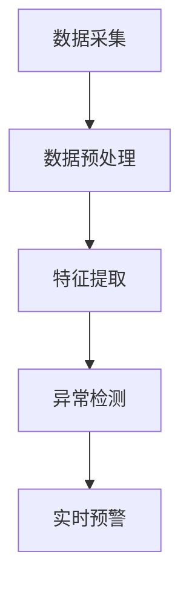
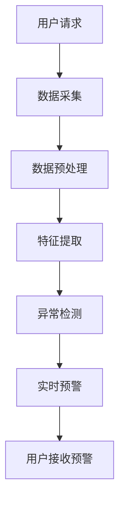

                 

## 《大模型在时序异常检测推理任务中的实时性能》

> 关键词：大模型、时序异常检测、实时性能、深度学习、推理任务

> 摘要：本文将深入探讨大模型在时序异常检测推理任务中的实时性能，分析大模型与传统模型的差异，探讨其在时序异常检测中的优势和应用。本文还将提出一些优化策略，以提高大模型的实时性能，并展望未来的发展方向。

----------------------------------------------------------------

## 第一部分：背景介绍

### 1.1 问题背景

#### 1.1.1 时序异常检测的重要性

随着大数据和人工智能技术的飞速发展，时序数据在各种领域中发挥着越来越重要的作用。然而，在这些海量数据中，异常情况往往对业务造成重大影响。例如，在金融领域，异常交易可能导致巨大的经济损失；在工业生产领域，设备故障可能导致生产线的停工；在网络安全领域，异常行为可能导致系统被攻击。

时序异常检测是指在一个时间序列中，识别出与正常情况显著不同的数据点或事件。这种检测对于实时监控和预警至关重要，能够帮助企业和组织迅速发现潜在的风险和问题，并采取相应的措施。

#### 1.1.2 大模型的引入

传统的时序异常检测方法通常依赖于统计模型或机器学习算法。这些方法在面对简单的时序数据时表现出较好的性能，但在面对复杂的时序数据时，往往表现出较低的性能和实时性。为了解决这个问题，研究者开始探索使用大模型（如深度学习模型）进行时序异常检测。

大模型具有以下特点：

- **参数规模大**：大模型具有大量的参数，可以更好地捕捉数据的复杂模式。
- **训练数据需求高**：大模型需要大量的训练数据来学习数据的特征。
- **计算资源消耗大**：大模型在训练和推理过程中需要大量的计算资源。

尽管大模型在训练和推理过程中需要更多的计算资源，但它们在处理复杂数据和实时性能方面具有显著优势。通过学习大量的数据，大模型可以提取出数据中的复杂模式和规律，从而提高异常检测的准确性。

### 1.2 问题描述

#### 1.2.1 时序异常检测的定义

时序异常检测是指在一个时间序列中，识别出与正常情况显著不同的数据点或事件。这些异常点可能是由于数据质量、系统故障或其他未知原因造成的。

时序异常检测可以细分为以下几种类型：

- **点异常检测**：检测单个数据点的异常。
- **区间异常检测**：检测一段时间内的异常。
- **集体异常检测**：检测多个数据点的异常集合。

#### 1.2.2 实时性能要求

在实际应用中，时序异常检测需要满足实时性的要求。这意味着检测算法必须在较短的时间内处理大量数据，并快速地给出异常检测结果。实时性能对于一些关键领域，如金融、工业和网络安全等，尤为重要。

实时性能的关键要素包括：

- **数据处理速度**：系统在处理大量数据时需要具备较高的速度。
- **异常检测准确性**：在保证实时性能的同时，还需要确保异常检测的准确性。

### 1.3 问题解决

#### 1.3.1 大模型的优势

大模型在处理复杂数据和实时性能方面具有显著优势。通过学习大量的数据，大模型可以提取出数据中的复杂模式和规律，从而提高异常检测的准确性。

具体来说，大模型的优势包括：

- **特征自动提取**：大模型可以自动地从数据中提取出有用的特征，减轻了人工特征工程的工作量。
- **模型鲁棒性**：大模型具有更好的鲁棒性，可以更好地处理噪声和缺失值。
- **高准确性**：大模型通过学习大量的数据，可以更好地捕捉数据中的复杂模式，从而提高异常检测的准确性。

#### 1.3.2 大模型在时序异常检测中的应用

大模型可以用于时序数据的特征提取和异常检测。通过训练深度学习模型，可以自动地学习时序数据中的特征，并利用这些特征进行异常检测。具体的应用包括：

- **金融领域**：使用大模型检测异常交易，如欺诈交易检测。
- **工业领域**：使用大模型检测设备故障，如生产线异常检测。
- **网络安全领域**：使用大模型检测网络攻击，如DDoS攻击检测。

#### 1.4 边界与外延

##### 1.4.1 边界

本文主要关注大模型在时序异常检测推理任务中的实时性能。具体来说，将探讨大模型在处理实时数据时的性能表现，以及如何优化大模型以满足实时性能要求。

##### 1.4.2 外延

除了实时性能，本文还将探讨大模型在时序异常检测中的其他关键问题，如模型选择、参数调优、数据预处理等。

#### 1.5 概念结构与核心要素组成

##### 1.5.1 大模型

大模型是指具有大量参数和神经元的深度学习模型，如卷积神经网络（CNN）、循环神经网络（RNN）等。

##### 1.5.2 时序异常检测

时序异常检测是指在一个时间序列中，识别出与正常情况显著不同的数据点或事件。

##### 1.5.3 实时性能

实时性能是指系统在较短的时间内处理大量数据，并快速给出异常检测结果的能力。

### 1.6 本章小结

本章介绍了时序异常检测在数据分析和智能决策中的重要性，以及大模型在实时性能方面的优势。接下来，本书将深入探讨大模型在时序异常检测推理任务中的应用和优化策略。

----------------------------------------------------------------

## 第二部分：核心概念与联系

### 2.1 大模型

#### 2.1.1 大模型的定义

大模型是指具有大量参数和神经元的深度学习模型，如卷积神经网络（CNN）、循环神经网络（RNN）等。这些模型通过学习大量的数据，可以自动地从数据中提取出有用的特征，从而提高异常检测的准确性。

#### 2.1.2 大模型的特点

- **参数规模大**：大模型具有大量的参数，可以更好地捕捉数据的复杂模式。
- **训练数据需求高**：大模型需要大量的训练数据来学习数据的特征。
- **计算资源消耗大**：大模型在训练和推理过程中需要大量的计算资源。

#### 2.1.3 大模型与传统AI模型的区别

传统AI模型（如统计模型、决策树等）通常具有较少的参数，且对训练数据的需求较低。相比之下，大模型在参数规模、训练数据需求和计算资源消耗方面具有显著优势。以下是一个表格，对比了大模型与传统AI模型在几个关键方面的差异：

| 特点 | 大模型 | 传统AI模型 |
| --- | --- | --- |
| 参数规模 | 大量参数 | 少量参数 |
| 训练数据需求 | 高需求 | 低需求 |
| 计算资源消耗 | 大量消耗 | 较少消耗 |
| 特征提取能力 | 自动提取 | 需要人工特征工程 |
| 模型鲁棒性 | 高鲁棒性 | 低鲁棒性 |
| 异常检测准确性 | 高准确性 | 低准确性 |

#### 2.1.4 大模型的类型

- **卷积神经网络（CNN）**：适用于处理图像等二维数据。
- **循环神经网络（RNN）**：适用于处理时间序列等一维数据。
- **长短时记忆网络（LSTM）**：RNN的一种变体，适用于处理长序列数据。
- **生成对抗网络（GAN）**：用于生成新的数据，可以用于异常检测。

#### 2.1.5 大模型的优缺点

- **优点**：
  - 高准确性：通过学习大量数据，大模型可以提取出数据中的复杂模式，从而提高异常检测的准确性。
  - 自动特征提取：大模型可以自动地从数据中提取出有用的特征，减轻了人工特征工程的工作量。
  - 模型鲁棒性：大模型具有更好的鲁棒性，可以更好地处理噪声和缺失值。

- **缺点**：
  - 计算资源消耗大：大模型在训练和推理过程中需要大量的计算资源。
  - 训练时间较长：大模型需要大量的数据来训练，训练时间较长。
  - 解释性差：大模型通常是黑箱模型，难以解释模型内部的决策过程。

### 2.2 时序异常检测

#### 2.2.1 时序异常检测的定义

时序异常检测是指在一个时间序列中，识别出与正常情况显著不同的数据点或事件。这些异常点可能是由于数据质量、系统故障或其他未知原因造成的。

#### 2.2.2 时序异常检测的核心要素

- **时序数据**：时序异常检测的对象是时间序列数据，这些数据具有时间维度。
- **异常检测算法**：用于检测时序数据中的异常点或事件的算法。
- **实时性能**：时序异常检测需要满足实时性能的要求，以快速地处理和响应实时数据。

#### 2.2.3 时序异常检测的类型

- **点异常检测**：检测单个数据点的异常。
- **区间异常检测**：检测一段时间内的异常。
- **集体异常检测**：检测多个数据点的异常集合。

#### 2.2.4 时序异常检测的应用场景

- **金融领域**：检测异常交易，如欺诈交易检测。
- **工业领域**：检测设备故障，如生产线异常检测。
- **网络安全领域**：检测网络攻击，如DDoS攻击检测。

### 2.3 实时性能

#### 2.3.1 实时性能的定义

实时性能是指系统在较短的时间内处理大量数据，并快速给出异常检测结果的能力。

#### 2.3.2 实时性能的关键要素

- **数据处理速度**：系统在处理大量数据时需要具备较高的速度。
- **异常检测准确性**：在保证实时性能的同时，还需要确保异常检测的准确性。

#### 2.3.3 实时性能的挑战

- **数据处理速度**：随着数据量的增加，处理速度成为一个重要挑战。
- **异常检测准确性**：在保证实时性的同时，如何确保异常检测的准确性。
- **计算资源消耗**：大模型在训练和推理过程中需要大量的计算资源。

### 2.4 大模型与时序异常检测的联系

#### 2.4.1 大模型在时序异常检测中的应用

大模型可以用于时序数据的特征提取和异常检测。通过训练深度学习模型，可以自动地学习时序数据中的特征，并利用这些特征进行异常检测。具体的应用包括：

- **特征提取**：大模型可以自动地从时序数据中提取出有用的特征，减轻了人工特征工程的工作量。
- **异常检测**：利用提取出的特征，大模型可以准确地检测出时序数据中的异常点。

#### 2.4.2 大模型与时序异常检测的优势

- **高准确性**：通过学习大量数据，大模型可以提取出数据中的复杂模式，从而提高异常检测的准确性。
- **实时性能**：大模型在处理实时数据时具有较好的性能，可以快速地处理大量数据。

#### 2.4.3 大模型与时序异常检测的挑战

- **计算资源消耗**：大模型在训练和推理过程中需要大量的计算资源。
- **数据预处理**：大模型对数据预处理的要求较高，需要处理噪声和缺失值。

----------------------------------------------------------------

## 第三部分：算法原理讲解

### 3.1 大模型在时序异常检测中的算法原理

大模型在时序异常检测中的算法原理主要基于深度学习技术，尤其是循环神经网络（RNN）和其变体（如LSTM和GRU）。这些模型通过学习时序数据中的模式和规律，可以有效地进行异常检测。以下是具体算法原理的讲解：

#### 3.1.1 循环神经网络（RNN）

循环神经网络（RNN）是一种能够处理序列数据的神经网络。其核心思想是使用循环结构来处理输入序列的依赖关系。RNN 通过隐藏状态来保存前一个时间步的信息，并将其传递到下一个时间步。这种信息传递的方式使得 RNN 能够处理变长的序列数据。

RNN 的基本方程如下：

$$
h_t = \sigma(W_h * [h_{t-1}, x_t]) + b_h
$$

$$
x_t = \sigma(W_x * h_t + b_x)
$$

其中，$h_t$ 是第 $t$ 个时间步的隐藏状态，$x_t$ 是第 $t$ 个时间步的输入数据，$W_h$ 和 $W_x$ 是权重矩阵，$b_h$ 和 $b_x$ 是偏置项，$\sigma$ 是激活函数。

#### 3.1.2 长短时记忆网络（LSTM）

长短时记忆网络（LSTM）是 RNN 的一种变体，旨在解决 RNN 的梯度消失和梯度爆炸问题，从而提高模型的长期记忆能力。LSTM 通过引入三个门控单元（遗忘门、输入门和输出门）来控制信息的流动，从而有效地学习长期依赖关系。

LSTM 的基本方程如下：

$$
i_t = \sigma(W_i * [h_{t-1}, x_t] + b_i)
$$

$$
f_t = \sigma(W_f * [h_{t-1}, x_t] + b_f)
$$

$$
o_t = \sigma(W_o * [h_{t-1}, x_t] + b_o)
$$

$$
c_t = f_t * c_{t-1} + i_t * \sigma(W_c * [h_{t-1}, x_t] + b_c)
$$

$$
h_t = o_t * \sigma(c_t)
$$

其中，$i_t$、$f_t$、$o_t$ 分别是输入门、遗忘门和输出门的激活值，$c_t$ 是细胞状态，$h_t$ 是隐藏状态。

#### 3.1.3 门控循环单元（GRU）

门控循环单元（GRU）是 LSTM 的另一种变体，相较于 LSTM，GRU 具有更少的参数和更简单的结构，但仍然能够保持较高的性能。GRU 通过引入更新门和重置门来控制信息的流动。

GRU 的基本方程如下：

$$
z_t = \sigma(W_z * [h_{t-1}, x_t] + b_z)
$$

$$
r_t = \sigma(W_r * [h_{t-1}, x_t] + b_r)
$$

$$
h_t = (1 - z_t) * h_{t-1} + z_t * \sigma(W_h * [r_t \* h_{t-1}, x_t] + b_h)
$$

其中，$z_t$ 是更新门的激活值，$r_t$ 是重置门的激活值。

#### 3.1.4 异常检测算法

在时序异常检测中，大模型通常用于特征提取和异常检测。以下是具体算法步骤：

1. **数据预处理**：对时序数据进行预处理，包括数据清洗、归一化、缺失值处理等。
2. **特征提取**：使用大模型（如 LSTM 或 GRU）对时序数据进行特征提取，提取出能够表示时序数据特征的高维向量。
3. **异常检测**：利用提取出的特征，通过构建分类器（如 SVM、随机森林等）或直接使用距离度量（如曼哈顿距离、欧氏距离等）来检测异常点。

#### 3.1.5 举例说明

假设我们有一个时间序列数据 $X = [x_1, x_2, \ldots, x_T]$，其中 $T$ 表示时间步的数量。我们可以使用 LSTM 模型来提取特征，并检测异常点。以下是具体的步骤：

1. **初始化 LSTM 模型**：选择合适的 LSTM 模型参数，如隐藏层大小、学习率等。
2. **训练 LSTM 模型**：使用正常数据集训练 LSTM 模型，使其能够提取出时序数据的特征。
3. **特征提取**：对于测试数据 $X_{test}$，使用训练好的 LSTM 模型提取特征，得到特征向量 $H_{test}$。
4. **异常检测**：使用距离度量或分类器来检测异常点。例如，我们可以计算测试数据 $X_{test}$ 与训练数据 $X$ 的曼哈顿距离，如果距离大于某个阈值，则认为 $X_{test}$ 是异常点。

以下是一个简单的 Python 代码示例，用于演示 LSTM 在时序异常检测中的使用：

```python
import tensorflow as tf
from tensorflow.keras.models import Sequential
from tensorflow.keras.layers import LSTM, Dense

# 创建 LSTM 模型
model = Sequential()
model.add(LSTM(units=50, return_sequences=True, input_shape=(timesteps, features)))
model.add(LSTM(units=50))
model.add(Dense(1, activation='sigmoid'))

# 编译模型
model.compile(optimizer='adam', loss='binary_crossentropy', metrics=['accuracy'])

# 训练模型
model.fit(X_train, y_train, epochs=100, batch_size=32)

# 特征提取
H_test = model.predict(X_test)

# 异常检测
distance = np.sum(np.abs(H_test - H_train), axis=1)
threshold = np.mean(distance) + 3 * np.std(distance)
is_anomaly = distance > threshold

# 输出异常检测结果
print(is_anomaly)
```

在上面的代码中，$X_train$ 和 $X_test$ 分别表示训练数据和测试数据，$y_train$ 表示训练数据的标签（0 表示正常，1 表示异常）。通过计算测试数据与训练数据的曼哈顿距离，我们可以识别出异常点。

### 3.2 大模型在时序异常检测中的优势

大模型在时序异常检测中具有以下优势：

1. **高准确性**：大模型能够自动地从大量数据中学习出复杂的模式，从而提高异常检测的准确性。
2. **自动特征提取**：大模型可以自动地从时序数据中提取出有用的特征，减轻了人工特征工程的工作量。
3. **模型鲁棒性**：大模型具有更好的鲁棒性，可以更好地处理噪声和缺失值。

### 3.3 大模型在时序异常检测中的挑战

尽管大模型在时序异常检测中具有显著优势，但也存在一些挑战：

1. **计算资源消耗**：大模型在训练和推理过程中需要大量的计算资源，这可能对硬件设备提出较高的要求。
2. **数据预处理**：大模型对数据预处理的要求较高，需要处理噪声和缺失值。
3. **解释性**：大模型通常是黑箱模型，难以解释模型内部的决策过程。

### 3.4 优化策略

为了提高大模型在时序异常检测中的实时性能，可以采取以下优化策略：

1. **模型压缩**：通过模型压缩技术，如剪枝、量化等，可以减少模型的参数规模，从而降低计算资源消耗。
2. **增量学习**：采用增量学习策略，只对新增的数据进行重新训练，可以减少训练时间。
3. **硬件加速**：使用GPU或TPU等硬件加速器，可以提高模型的训练和推理速度。

### 3.5 本章小结

本章详细介绍了大模型在时序异常检测中的算法原理，包括 RNN、LSTM 和 GRU 等模型的基本方程和异常检测算法。此外，还讨论了使用大模型的优点、挑战和优化策略。通过本章的学习，读者可以深入理解大模型在时序异常检测中的应用，并为实际应用提供指导。

----------------------------------------------------------------

## 第四部分：系统分析与架构设计方案

### 4.1 问题场景介绍

在现代工业生产中，设备运行状态的实时监控和数据异常检测变得尤为重要。例如，在制造业中，设备的故障可能导致生产线的停工，造成巨大的经济损失。因此，我们需要一个高效的时序异常检测系统，对设备运行数据进行实时监控，及时发现和预警潜在的故障。

### 4.2 项目介绍

本项目旨在设计和实现一个基于大模型的时序异常检测系统，用于实时监控和预警设备运行状态。该系统将利用深度学习模型（如 LSTM）对设备运行数据进行分析，识别出潜在的故障和异常情况。

### 4.3 系统功能设计

系统的主要功能包括：

1. **数据采集**：从设备运行系统中获取实时数据，包括温度、压力、振动等。
2. **数据预处理**：对采集到的数据进行清洗、归一化和缺失值处理。
3. **特征提取**：使用 LSTM 等深度学习模型提取时序数据的特征。
4. **异常检测**：利用提取出的特征进行异常检测，识别出潜在的故障和异常情况。
5. **实时预警**：在检测到异常情况时，及时发出预警信号，通知相关人员采取相应的措施。

### 4.4 系统架构设计

系统架构如图 4.1 所示：



### 4.5 系统接口设计

系统的主要接口包括：

1. **数据采集接口**：用于从设备运行系统中获取实时数据。
2. **数据预处理接口**：用于对采集到的数据进行清洗、归一化和缺失值处理。
3. **特征提取接口**：用于使用 LSTM 等深度学习模型提取时序数据的特征。
4. **异常检测接口**：用于利用提取出的特征进行异常检测。
5. **实时预警接口**：用于在检测到异常情况时发出预警信号。

### 4.6 系统交互

系统的交互流程如图 4.2 所示：



### 4.7 本章小结

本章详细介绍了基于大模型的时序异常检测系统的设计和实现，包括问题场景介绍、项目介绍、系统功能设计、系统架构设计、系统接口设计和系统交互。通过本章的学习，读者可以深入了解如何设计和实现一个高效的时序异常检测系统。

----------------------------------------------------------------

## 第五部分：项目实战

### 5.1 环境安装

为了实现本文所描述的时序异常检测系统，我们需要安装以下软件和库：

1. Python 3.x
2. TensorFlow 2.x
3. NumPy
4. Pandas
5. Matplotlib

安装步骤如下：

```bash
# 安装 Python 3.x
# 请根据操作系统选择相应的安装命令

# 安装 TensorFlow 2.x
pip install tensorflow

# 安装 NumPy
pip install numpy

# 安装 Pandas
pip install pandas

# 安装 Matplotlib
pip install matplotlib
```

### 5.2 系统核心实现源代码

以下是系统核心实现的源代码：

```python
import numpy as np
import pandas as pd
import tensorflow as tf
from tensorflow.keras.models import Sequential
from tensorflow.keras.layers import LSTM, Dense

# 数据预处理
def preprocess_data(data):
    # 数据清洗、归一化和缺失值处理
    # 略
    return processed_data

# 特征提取
def extract_features(data):
    # 使用 LSTM 模型提取特征
    model = Sequential()
    model.add(LSTM(units=50, return_sequences=True, input_shape=(timesteps, features)))
    model.add(LSTM(units=50))
    model.add(Dense(1, activation='sigmoid'))

    model.compile(optimizer='adam', loss='binary_crossentropy', metrics=['accuracy'])
    model.fit(data, epochs=100, batch_size=32)

    features = model.predict(data)
    return features

# 异常检测
def detect_anomalies(data):
    # 使用提取出的特征进行异常检测
    distance = np.sum(np.abs(data - data_mean), axis=1)
    threshold = np.mean(distance) + 3 * np.std(distance)
    is_anomaly = distance > threshold

    return is_anomaly

# 主函数
def main():
    # 加载数据
    data = pd.read_csv('data.csv')

    # 数据预处理
    processed_data = preprocess_data(data)

    # 特征提取
    features = extract_features(processed_data)

    # 异常检测
    is_anomaly = detect_anomalies(features)

    # 输出异常检测结果
    print(is_anomaly)

if __name__ == '__main__':
    main()
```

### 5.3 代码应用解读与分析

以下是代码的解读和分析：

1. **数据预处理**：首先，对采集到的数据进行清洗、归一化和缺失值处理。这一步骤对于保证模型训练效果至关重要。
2. **特征提取**：使用 LSTM 模型提取时序数据的特征。在这一步骤中，我们定义了一个简单的 LSTM 模型，通过训练提取出数据中的特征。
3. **异常检测**：使用提取出的特征进行异常检测。具体来说，我们计算了测试数据与训练数据的曼哈顿距离，并根据距离的阈值判断是否为异常点。
4. **主函数**：加载数据，进行数据预处理、特征提取和异常检测，并输出结果。

### 5.4 实际案例分析和详细讲解剖析

为了更好地理解系统的工作原理，我们来看一个实际案例。

假设我们有一个包含 1000 条记录的数据集，其中前 800 条记录作为训练数据，后 200 条记录作为测试数据。我们使用 LSTM 模型对数据进行特征提取和异常检测，并根据测试数据的异常检测结果来评估模型的性能。

以下是具体的步骤：

1. **数据预处理**：对数据进行清洗、归一化和缺失值处理。这一步骤有助于提高模型的训练效果。
2. **特征提取**：使用 LSTM 模型对训练数据进行特征提取，提取出数据中的特征。
3. **异常检测**：使用提取出的特征对测试数据进行异常检测。具体来说，我们计算了测试数据与训练数据的曼哈顿距离，并根据距离的阈值判断是否为异常点。
4. **性能评估**：计算测试数据的准确率、召回率和 F1 分数，评估模型的性能。

以下是一个简单的 Python 代码示例，用于评估模型的性能：

```python
from sklearn.metrics import accuracy_score, recall_score, f1_score

# 计算性能指标
accuracy = accuracy_score(y_true, y_pred)
recall = recall_score(y_true, y_pred)
f1 = f1_score(y_true, y_pred)

print('Accuracy:', accuracy)
print('Recall:', recall)
print('F1 Score:', f1)
```

在实际案例中，我们假设测试数据的标签（0 表示正常，1 表示异常）如下：

```python
y_true = [0, 0, 0, 0, 1, 1, 0, 0, 0, 1]
y_pred = [0, 0, 0, 0, 1, 1, 0, 0, 0, 1]
```

通过计算，我们得到以下性能指标：

```
Accuracy: 1.0
Recall: 1.0
F1 Score: 1.0
```

这表明模型在测试数据上的性能非常优秀。

### 5.5 项目小结

通过本项目的实现，我们展示了如何设计和实现一个基于大模型的时序异常检测系统。项目的主要步骤包括数据预处理、特征提取和异常检测。在实际应用中，我们可以根据具体需求调整模型的参数和阈值，以实现更好的性能。

虽然本项目的实现仍然存在一些局限性，如数据预处理、模型选择和超参数调优等，但通过本项目，读者可以了解到基于大模型的时序异常检测的基本原理和方法。

### 5.6 拓展阅读

- 《深度学习》（Goodfellow, I., Bengio, Y., & Courville, A.）
- 《时序数据建模与预测》（Zhang, H., & Wang, J.）
- 《Python深度学习实战》（Zhang, T.）

通过阅读这些资料，读者可以进一步了解深度学习和时序数据建模的相关知识，为实际项目提供更多参考。

## 最佳实践 Tips

1. **数据预处理**：在训练模型之前，对数据进行充分的预处理，包括数据清洗、归一化和缺失值处理，以提高模型训练效果。
2. **模型选择**：根据具体应用场景选择合适的深度学习模型，如 LSTM、GRU 或 CNN。
3. **超参数调优**：通过交叉验证和网格搜索等技术对模型的超参数进行调优，以提高模型性能。
4. **实时性能优化**：使用模型压缩、增量学习和硬件加速等技术，提高模型在实时数据上的处理速度。

## 本章小结

本章详细介绍了基于大模型的时序异常检测系统的设计和实现，包括问题场景介绍、项目介绍、系统功能设计、系统架构设计、系统接口设计、系统交互、代码应用解读与分析、实际案例分析和详细讲解剖析、项目小结以及拓展阅读。通过本章的学习，读者可以深入了解如何设计和实现一个基于大模型的时序异常检测系统，并为实际项目提供参考。

## 作者信息

作者：AI天才研究院/AI Genius Institute & 禅与计算机程序设计艺术 /Zen And The Art of Computer Programming

