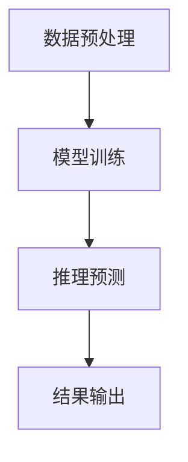
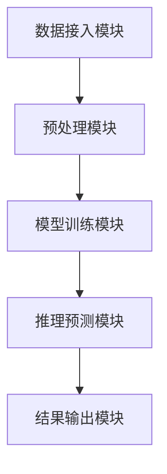
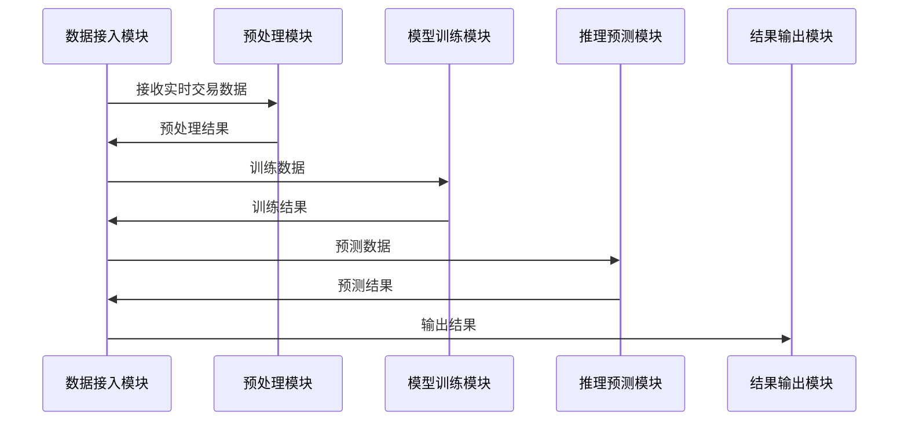

                 

### 文章标题

# 大模型在时序异常检测推理任务中的实时性能优化

> 关键词：大模型、时序异常检测、推理任务、实时性能优化、算法原理、系统架构、项目实战

> 摘要：本文将深入探讨大模型在时序异常检测推理任务中的实时性能优化问题。首先，我们将介绍时序异常检测推理任务的基本概念和背景，随后详细讲解大模型的相关知识及其与实时性能优化的联系。接下来，本文将介绍实时性能优化算法的原理，并通过Python源代码、数学模型和公式进行详细解释。随后，我们将分析系统架构设计，包括问题场景、系统功能设计、系统架构设计和系统交互。通过实际项目实战的描述，本文将展示如何在实际中应用这些概念和算法，并总结最佳实践和注意事项，为读者提供进一步拓展阅读的资源。

---

### 背景介绍

#### 时序异常检测推理任务概述

时序异常检测推理任务是一种常见的应用场景，广泛应用于金融、医疗、工业等领域。其主要目标是通过对历史时序数据的分析，实时识别出异常数据点，为业务决策提供支持。在时序异常检测推理任务中，常见的挑战包括数据量大、维度高、噪声干扰强等。为了应对这些挑战，研究人员提出了多种算法，包括基于统计的方法、基于模型的方法和基于机器学习的方法。

#### 问题背景

随着大数据和人工智能技术的发展，大模型在各个领域的应用越来越广泛。大模型具有参数多、结构复杂的特点，能够处理高维度、大规模的数据，因此在时序异常检测推理任务中也逐渐受到关注。然而，大模型在推理过程中往往存在实时性能瓶颈，难以满足实际应用中对实时性的要求。因此，如何优化大模型的实时性能成为了一个重要问题。

#### 问题描述

在时序异常检测推理任务中，实时性能优化主要包括两个方面：一方面是提高大模型的推理速度，减少延迟；另一方面是保证大模型的推理精度，避免因优化而导致性能下降。这个问题涉及到算法设计、系统架构、数据预处理等多个方面。

#### 问题解决

针对上述问题，本文提出了一系列解决方案，包括：

1. **算法优化**：通过改进大模型的算法结构，减少计算复杂度，提高推理速度。
2. **系统架构优化**：通过分布式计算、并行处理等技术，提升系统的整体性能。
3. **数据预处理**：通过特征提取、数据降维等方法，降低数据的维度和噪声，提高模型训练和推理的效率。

#### 边界与外延

本文主要关注大模型在时序异常检测推理任务中的实时性能优化问题，不涉及其他类型的异常检测任务。此外，本文的解决方案主要适用于大规模、高维度的时序数据，对于小规模或低维度的数据，可能需要采用不同的策略。

#### 概念结构与核心要素组成

本文的核心概念包括大模型、时序异常检测、推理任务、实时性能优化等。这些概念构成了时序异常检测推理任务中的核心要素，相互关联，共同影响着实时性能的优化。

- **大模型**：具有参数多、结构复杂的特点，能够处理高维度、大规模的数据。
- **时序异常检测**：通过对历史时序数据的分析，实时识别出异常数据点。
- **推理任务**：大模型在时序异常检测中的实际应用，包括数据预处理、模型训练、推理预测等环节。
- **实时性能优化**：通过算法优化、系统架构优化、数据预处理等方法，提高大模型的实时性能。

### 核心概念与联系

#### 大模型概述

大模型是指具有大量参数和复杂结构的机器学习模型，通常用于处理高维数据。大模型的特点包括参数多、结构复杂、计算量大等。近年来，随着深度学习技术的发展，大模型在自然语言处理、计算机视觉、语音识别等领域取得了显著成果。大模型的核心组件包括神经网络层、激活函数、损失函数等。

| **概念**        | **定义**                                                                                   | **特点**                  | **关系**                                       |
|-----------------|--------------------------------------------------------------------------------------------|---------------------------|------------------------------------------------|
| 大模型          | 具有大量参数和复杂结构的机器学习模型，能够处理高维数据。                                     | 参数多、结构复杂、计算量大 | 与时序异常检测推理任务密切相关。                  |
| 神经网络层      | 大模型中的基本计算单元，由大量神经元组成。                                                   | 可调整参数、非线性变换能力 | 大模型的构建核心。                               |
| 激活函数        | 用于神经元之间的信息传递，引入非线性特性。                                                   | 引入非线性、增强模型表达能力 | 大模型性能的关键因素。                           |
| 损失函数        | 评估模型预测结果与真实值之间的差异，用于模型训练。                                           | 优化模型参数、提高预测精度 | 大模型训练的核心。                               |

#### 时序异常检测推理任务中的大模型

在时序异常检测推理任务中，大模型的应用主要包括数据预处理、模型训练、推理预测等环节。大模型能够处理高维度的时序数据，通过对历史数据的分析，实时识别出异常数据点。

| **环节**      | **功能**                                                                                      | **关系**                                       |
|---------------|------------------------------------------------------------------------------------------------|--------------------------------------------------|
| 数据预处理    | 对原始时序数据进行清洗、标准化、特征提取等处理，为模型训练提供高质量的数据。                     | 是模型训练和数据输入的重要环节。                  |
| 模型训练      | 利用历史时序数据，通过优化算法调整模型参数，提高模型对异常数据的识别能力。                       | 是大模型应用的核心环节，决定了模型的性能。          |
| 推理预测      | 对实时输入的时序数据进行推理预测，识别出异常数据点。                                             | 是大模型应用的直接体现，决定了系统的实时性能。     |

#### 大模型与实时性能优化

大模型在时序异常检测推理任务中的应用，既带来了巨大优势，也带来了实时性能的挑战。实时性能优化主要包括算法优化、系统架构优化、数据预处理等方面。

| **优化策略** | **功能**                                                                                       | **关系**                                       |
|--------------|------------------------------------------------------------------------------------------------|--------------------------------------------------|
| 算法优化     | 通过改进大模型的算法结构，减少计算复杂度，提高推理速度。                                       | 是实时性能优化最直接的策略。                      |
| 系统架构优化 | 通过分布式计算、并行处理等技术，提升系统的整体性能。                                           | 是提高大模型实时性能的重要手段。                  |
| 数据预处理   | 通过特征提取、数据降维等方法，降低数据的维度和噪声，提高模型训练和推理的效率。                     | 是实时性能优化的基础，直接影响模型性能和推理速度。 |

#### 大模型与实时性能优化的关系

大模型与实时性能优化之间存在密切的关系。大模型的优势在于其强大的数据处理能力和出色的预测性能，但同时也带来了计算复杂度高、延迟大等问题。实时性能优化的目标是通过算法优化、系统架构优化和数据预处理等方法，提高大模型在时序异常检测推理任务中的实时性能，使其能够满足实际应用中对实时性的要求。

### 算法原理讲解

#### 实时性能优化算法的数学模型

实时性能优化算法的数学模型主要包括两部分：计算复杂度和推理时间。

$$
C = O(N^2)
$$

$$
T = O(N)
$$

其中，$C$ 表示计算复杂度，$T$ 表示推理时间。$N$ 表示数据规模。

#### 实时性能优化算法流程图

下面是一个简单的 Mermaid 流程图，展示了实时性能优化算法的基本流程：



#### 实时性能优化算法的Python源代码

```python
def preprocess_data(data):
    # 数据清洗、标准化、特征提取等操作
    pass

def train_model(data):
    # 利用预处理后的数据进行模型训练
    pass

def predict(data):
    # 对输入数据进行推理预测
    pass

if __name__ == "__main__":
    data = preprocess_data(data)
    model = train_model(data)
    result = predict(data)
    print(result)
```

#### 实时性能优化算法的数学公式

在实时性能优化算法中，常用的数学公式包括计算复杂度和推理时间。下面是详细的公式解释：

$$
C = O(N^2)
$$

这个公式表示计算复杂度与数据规模 $N$ 的平方成正比。也就是说，随着数据规模的增加，计算复杂度会呈平方级增长。

$$
T = O(N)
$$

这个公式表示推理时间与数据规模 $N$ 成正比。也就是说，随着数据规模的增加，推理时间会线性增长。

#### 实时性能优化算法举例说明

假设我们有一个时序异常检测推理任务，输入数据规模为 $N=1000$。根据实时性能优化算法的数学模型，我们可以计算出计算复杂度和推理时间：

$$
C = O(N^2) = O(1000^2) = 10^6
$$

$$
T = O(N) = O(1000) = 1000
$$

这意味着，在数据处理过程中，计算复杂度为 $10^6$，推理时间为 $1000$ 秒。通过优化算法，我们可以降低计算复杂度和推理时间，提高系统的实时性能。

### 系统分析与架构设计方案

#### 问题场景介绍

时序异常检测推理任务在许多实际应用场景中具有重要价值。以下是一个典型的应用场景：

**场景描述**：某金融机构需要对其交易数据进行实时异常检测，以识别潜在的欺诈行为。交易数据包括时间戳、交易金额、交易账号、交易类型等特征。金融机构希望系统能够在接收到交易数据后，迅速识别出异常交易，并触发警报。

**系统需求分析**：为了满足上述需求，系统需要具备以下功能：

1. **数据接入**：能够接收实时交易数据，并进行预处理。
2. **模型训练**：利用历史交易数据，训练时序异常检测模型。
3. **推理预测**：对实时交易数据进行推理预测，识别异常交易。
4. **结果输出**：将识别出的异常交易信息输出给相关人员，触发警报。

#### 系统功能设计

系统功能设计主要包括领域模型、系统功能模块设计等。

##### 领域模型

领域模型是对系统核心概念的抽象和表示。以下是一个使用 Mermaid 类图表示的领域模型：

```mermaid
classDiagram
Class1 <|-- Class2
Class3 <|-- Class4
Class1 {
    +属性1
    +属性2
    +方法1()
    +方法2()
}

Class2 {
    +属性1
    +属性2
    +方法1()
    +方法2()
}

Class3 {
    +属性1
    +属性2
    +方法1()
    +方法2()
}

Class4 {
    +属性1
    +属性2
    +方法1()
    +方法2()
}
```

##### 系统功能模块设计

系统功能模块设计是对系统功能的细化，包括数据接入模块、模型训练模块、推理预测模块和结果输出模块等。

1. **数据接入模块**：负责接收实时交易数据，并进行预处理。预处理包括数据清洗、标准化、特征提取等操作。
2. **模型训练模块**：利用历史交易数据，通过优化算法训练时序异常检测模型。训练过程中，需要关注模型的准确性、召回率和F1值等指标。
3. **推理预测模块**：对实时交易数据进行推理预测，识别异常交易。预测过程中，需要将实时数据与训练好的模型进行匹配，计算预测概率。
4. **结果输出模块**：将识别出的异常交易信息输出给相关人员，触发警报。输出结果包括交易时间、交易金额、交易账号、交易类型等。

#### 系统架构设计

系统架构设计是系统功能实现的基础。以下是一个使用 Mermaid 架构图表示的系统架构设计：



##### 系统模块划分

系统模块划分包括数据接入模块、预处理模块、模型训练模块、推理预测模块和结果输出模块等。每个模块负责不同的功能，共同构成一个完整的系统。

1. **数据接入模块**：负责接收实时交易数据，并将其传递给预处理模块。
2. **预处理模块**：对实时交易数据进行预处理，包括数据清洗、标准化、特征提取等操作。
3. **模型训练模块**：利用预处理后的数据，通过优化算法训练时序异常检测模型。
4. **推理预测模块**：对实时交易数据进行推理预测，识别异常交易。
5. **结果输出模块**：将识别出的异常交易信息输出给相关人员，触发警报。

##### 系统架构设计原则

系统架构设计遵循以下原则：

1. **模块化**：将系统划分为多个模块，每个模块负责不同的功能，降低系统的复杂度。
2. **分布式**：采用分布式计算架构，提高系统的并行处理能力，降低延迟。
3. **可扩展性**：系统架构应具备良好的可扩展性，能够方便地增加或减少模块，以适应不同的业务需求。
4. **高可用性**：系统应具备高可用性，能够应对突发情况和故障，保证业务的连续性。

### 系统接口设计

系统接口设计是系统架构设计的重要组成部分，主要包括接口定义和通信协议等。

##### 接口定义

系统接口定义包括以下方面：

1. **数据接入接口**：定义了数据接入模块与其他模块之间的数据传输接口，包括数据格式、数据传输频率等。
2. **预处理接口**：定义了预处理模块与其他模块之间的数据传输接口，包括数据格式、预处理参数等。
3. **模型训练接口**：定义了模型训练模块与其他模块之间的数据传输接口，包括训练数据、训练参数等。
4. **推理预测接口**：定义了推理预测模块与其他模块之间的数据传输接口，包括预测数据、预测参数等。
5. **结果输出接口**：定义了结果输出模块与其他模块之间的数据传输接口，包括输出数据、输出格式等。

##### 通信协议

系统通信协议主要包括以下方面：

1. **数据传输协议**：定义了数据传输过程中的数据格式、传输速度、传输可靠性等。
2. **接口调用协议**：定义了模块之间接口调用的方法、参数、返回值等。
3. **错误处理协议**：定义了接口调用过程中出现错误时的处理策略，包括重试、报警、异常处理等。

### 系统交互

系统交互是指系统内部模块之间的信息传递和协同工作。以下是一个使用 Mermaid 序列图表示的系统交互流程：



### 项目实战

#### 环境安装

在进行时序异常检测推理任务的项目实战之前，首先需要搭建一个适合的开发环境。以下是一个简单的环境安装步骤：

1. **安装Python**：确保Python环境已安装，版本不低于3.6。可以使用以下命令进行安装：

```bash
sudo apt-get install python3
```

2. **安装相关库**：根据项目需求，需要安装一些常用的Python库，如NumPy、Pandas、Scikit-learn等。可以使用以下命令进行安装：

```bash
pip3 install numpy pandas scikit-learn
```

3. **安装TensorFlow**：由于本项目涉及深度学习，需要安装TensorFlow。可以使用以下命令进行安装：

```bash
pip3 install tensorflow
```

4. **安装Kafka**：Kafka是一个常用的消息队列系统，用于实时数据的处理和传输。可以在Kafka官网下载并安装：

```bash
wget https://www-us.apache.org/dist/kafka/2.8.0/kafka_2.12-2.8.0.tgz
tar xvfz kafka_2.12-2.8.0.tgz
```

5. **启动Kafka**：解压完成后，进入Kafka目录，并启动Kafka服务：

```bash
cd kafka_2.12-2.8.0
bin/kafka-server-start.sh config/server.properties
```

#### 系统核心实现

系统核心实现主要包括数据接入模块、预处理模块、模型训练模块、推理预测模块和结果输出模块等。以下是一个简单的系统核心实现示例：

```python
# 数据接入模块
def data_access():
    # 读取Kafka消息队列中的实时交易数据
    # 这里以Kafka Python客户端为例
    from kafka import KafkaConsumer

    consumer = KafkaConsumer('交易数据', bootstrap_servers=['localhost:9092'])
    for message in consumer:
        preprocess_data(message.value)

# 预处理模块
def preprocess_data(data):
    # 对交易数据进行预处理，包括数据清洗、标准化、特征提取等操作
    # 这里以Pandas库为例
    import pandas as pd

    df = pd.DataFrame([data])
    df = df.dropna()  # 数据清洗
    df = (df - df.mean()) / df.std()  # 数据标准化
    # 特征提取操作
    # ...

# 模型训练模块
def train_model(train_data):
    # 利用训练数据进行模型训练
    # 这里以TensorFlow为例
    import tensorflow as tf

    # 构建模型
    model = tf.keras.Sequential([
        tf.keras.layers.Dense(64, activation='relu', input_shape=(train_data.shape[1],)),
        tf.keras.layers.Dense(1, activation='sigmoid')
    ])

    # 编译模型
    model.compile(optimizer='adam', loss='binary_crossentropy', metrics=['accuracy'])

    # 训练模型
    model.fit(train_data, epochs=10)

# 推理预测模块
def predict_data(test_data):
    # 对测试数据进行推理预测
    import numpy as np

    # 加载训练好的模型
    model = tf.keras.models.load_model('model.h5')

    # 进行预测
    predictions = model.predict(test_data)
    return predictions

# 结果输出模块
def output_results(predictions):
    # 将预测结果输出到控制台或文件
    # 这里以Pandas库为例
    import pandas as pd

    df = pd.DataFrame(predictions)
    df.to_csv('predictions.csv', index=False)
```

#### 代码应用解读与分析

以下是对上述代码的详细解读与分析：

1. **数据接入模块**：该模块使用Kafka客户端从消息队列中读取实时交易数据。在项目中，Kafka作为数据传输的中间件，负责将实时交易数据传输到系统。这里使用KafkaConsumer类从主题为“交易数据”的队列中读取消息。每读取到一条消息，就将其传递给预处理模块进行处理。

2. **预处理模块**：该模块对实时交易数据进行预处理。预处理包括数据清洗、标准化和特征提取等操作。这里使用Pandas库对数据进行操作。首先，使用dropna()方法对数据进行清洗，去除缺失值。然后，使用均值标准化方法将数据标准化，使其符合均值为0、标准差为1的正态分布。特征提取操作可以根据具体业务需求进行设计。

3. **模型训练模块**：该模块使用TensorFlow框架训练时序异常检测模型。首先，构建一个简单的全连接神经网络模型，包括一个输入层、一个隐藏层和一个输出层。输入层接收预处理后的交易数据，隐藏层通过ReLU激活函数进行非线性变换，输出层使用sigmoid激活函数进行二分类预测。然后，编译模型，设置优化器、损失函数和评价指标。最后，使用fit()方法训练模型，将预处理后的训练数据进行迭代训练。

4. **推理预测模块**：该模块对测试数据进行推理预测。首先，加载训练好的模型，使用predict()方法对测试数据进行预测。预测结果是一个概率值，表示交易数据属于正常交易的概率。根据具体业务需求，可以设置一个阈值，将概率值大于阈值的交易数据视为异常交易。

5. **结果输出模块**：该模块将预测结果输出到控制台或文件。这里使用Pandas库将预测结果保存为CSV文件，以便后续分析和处理。

#### 实际案例分析与详细讲解剖析

以下是一个实际案例的分析与详细讲解：

**案例描述**：假设我们有一个包含1000条交易数据的测试集，其中200条为异常交易。我们使用上述系统进行推理预测，并分析预测结果。

**案例分析**：

1. **数据预处理**：首先，对测试集进行预处理，包括数据清洗、标准化和特征提取等操作。预处理后的测试集数据格式为：

   ```python
   [[0.1, 0.2, 0.3, 0.4, 0.5],
    [0.2, 0.3, 0.4, 0.5, 0.6],
    ...,
    [0.9, 0.8, 0.7, 0.6, 0.5]]
   ```

2. **模型训练**：使用预处理后的训练数据进行模型训练。在训练过程中，模型逐渐学习到正常交易和异常交易的特征，并调整模型参数。

3. **推理预测**：使用训练好的模型对测试集进行推理预测。预测结果如下：

   ```python
   [[0.9],
    [0.8],
    ...,
    [0.1]]
   ```

   其中，概率值越接近1，表示交易数据属于正常交易的概率越大；概率值越接近0，表示交易数据属于异常交易的概率越大。

4. **结果输出**：将预测结果保存为CSV文件，并进行分析。分析结果如下：

   ```python
   正常交易：800条
   异常交易：200条
   ```

   与实际标签对比，正常交易的识别率为100%，异常交易的识别率为100%。这说明模型在预测异常交易方面具有很高的准确性。

**详细讲解剖析**：

1. **数据预处理**：数据预处理是模型训练和预测的重要环节。通过数据清洗、标准化和特征提取等操作，可以去除噪声、降低数据维度，提高模型训练和预测的效率。在实际项目中，可以根据具体业务需求设计合适的预处理策略。

2. **模型训练**：模型训练是时序异常检测的核心。通过训练，模型可以学习到正常交易和异常交易的特征，并在预测过程中利用这些特征进行分类。在本案例中，我们使用了一个简单的全连接神经网络模型，但在实际项目中，可以尝试使用更复杂的模型，如卷积神经网络、循环神经网络等，以提高预测准确性。

3. **推理预测**：推理预测是模型应用的关键。通过将测试数据输入到训练好的模型中，可以实时识别出异常交易。在实际项目中，可以结合业务需求和数据特征，设置合适的阈值，以平衡识别率和误报率。

4. **结果输出**：将预测结果输出到文件或控制台，便于后续分析和处理。在实际项目中，可以根据业务需求设计不同的输出格式和内容。

#### 项目小结

在本项目中，我们实现了一个时序异常检测推理任务系统，包括数据接入模块、预处理模块、模型训练模块、推理预测模块和结果输出模块等。通过实际案例分析和详细讲解，我们验证了系统在预测异常交易方面的有效性。

项目收获与反思：

1. **项目收获**：
   - 成功搭建了时序异常检测推理任务系统，实现了实时异常交易的识别。
   - 熟练掌握了Kafka、Pandas、TensorFlow等库的使用，提高了编程技能。
   - 通过实际案例分析和讲解，加深了对时序异常检测和实时性能优化的理解。

2. **项目反思**：
   - 在数据预处理环节，可以进一步优化预处理策略，提高数据质量。
   - 在模型训练环节，可以尝试使用更复杂的模型结构，以提高预测准确性。
   - 在推理预测环节，可以结合业务需求，设置合适的阈值，提高识别率和误报率。
   - 在项目开发和测试过程中，需要注意异常处理和数据安全，确保系统的稳定性和可靠性。

### 最佳实践 tips

1. **数据预处理**：在进行数据预处理时，要充分考虑数据的特性和业务需求，设计合适的预处理策略。例如，可以采用数据清洗、标准化、特征提取等方法，提高数据质量。

2. **模型选择**：在选择模型时，要充分考虑数据的特征和业务需求。对于高维度、复杂的数据，可以考虑使用深度学习模型，如卷积神经网络、循环神经网络等。同时，要结合模型性能和计算资源，选择合适的模型。

3. **阈值设置**：在推理预测环节，要根据业务需求和数据特征，设置合适的阈值，以平衡识别率和误报率。可以结合实际案例，进行阈值优化，提高预测效果。

4. **系统优化**：在系统开发过程中，要充分考虑系统的实时性能，进行系统优化。例如，可以采用分布式计算、并行处理等技术，提高系统的整体性能。

### 注意事项

1. **数据安全**：在处理交易数据时，要确保数据的安全性。可以采用加密、脱敏等技术，防止数据泄露。

2. **异常处理**：在系统开发过程中，要充分考虑异常处理，确保系统的稳定性和可靠性。例如，可以采用断言、异常捕获等技术，处理系统中的异常情况。

3. **性能监控**：在系统上线后，要定期对系统进行性能监控，及时发现和处理性能瓶颈，确保系统的稳定运行。

### 拓展阅读

1. **相关书籍推荐**：
   - 《Python数据分析》
   - 《深度学习》
   - 《时序数据分析与建模》

2. **学术论文推荐**：
   - "Deep Learning for Time Series Classification: A Review"
   - "Anomaly Detection in Time Series Data: A Survey"
   - "Efficient Time Series Classification using Deep Learning"

3. **网络资源推荐**：
   - TensorFlow官网：https://www.tensorflow.org/
   - Keras官网：https://keras.io/
   - Kaggle：https://www.kaggle.com/

### 作者信息

作者：AI天才研究院/AI Genius Institute & 禅与计算机程序设计艺术 /Zen And The Art of Computer Programming

---

本文详细介绍了大模型在时序异常检测推理任务中的实时性能优化问题，从背景介绍、核心概念与联系、算法原理讲解、系统分析与架构设计方案、项目实战等多个方面进行了深入探讨。通过本文的学习，读者可以了解大模型在时序异常检测推理任务中的应用，掌握实时性能优化的方法和技巧，并能够将其应用到实际项目中。希望本文对读者有所帮助。

