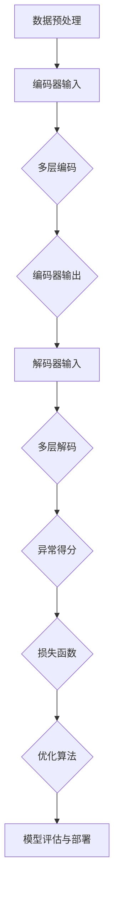
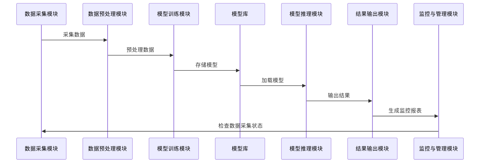

                 

### 文章标题与关键词

# 大模型在时序异常检测推理任务中的实时性能优化

> 关键词：大模型、时序异常检测、实时性能、推理任务、性能优化

随着人工智能技术的快速发展，深度学习模型，尤其是大模型，已经在众多领域展现了其强大的数据处理和模式识别能力。然而，这些大模型在时序异常检测推理任务中的实时性能优化，成为了一个亟待解决的问题。实时性能优化的目标是确保大模型在处理时序数据时，能够在有限的时间内提供准确的结果，以满足实际应用场景中的实时性需求。

本文将围绕大模型在时序异常检测推理任务中的实时性能优化展开讨论，首先介绍相关背景知识，包括时序异常检测的重要性、大模型的定义及其在时序异常检测中的挑战。接着，我们将深入探讨实时性能的概念及其对时序异常检测的影响。随后，文章将详细讲解大模型的原理、时序异常检测算法的原理，并使用Mermaid流程图和Python源代码进行详细阐述。

文章还将介绍系统功能设计和架构设计，包括问题场景介绍、系统功能设计、系统架构设计、系统接口设计和系统交互流程。接着，通过项目实战部分，详细介绍环境安装、系统核心实现和代码应用解读与分析，并通过实际案例进行深入讲解。

最后，文章将总结最佳实践，提供一些性能优化技巧和注意事项，并推荐进一步阅读的相关资料。

通过本文的阅读，读者将全面了解大模型在时序异常检测推理任务中的实时性能优化方法，掌握从理论到实践的完整解决方案。

### 摘要

本文探讨了在时序异常检测推理任务中，大模型的实时性能优化问题。时序异常检测在金融、电力、工业等领域具有重要应用价值，而大模型的引入虽然提升了检测精度，但也带来了实时性能上的挑战。本文首先介绍了大模型和时序异常检测的基本概念，然后详细分析了大模型在时序异常检测中的工作原理和性能特征。接着，通过数学公式和Python源代码，详细讲解了时序异常检测算法的原理和实现流程。文章随后介绍了系统功能设计和架构设计，通过实际项目案例展示了环境安装、系统核心实现和代码应用解读。最后，本文总结了一系列最佳实践和性能优化技巧，为读者提供了实用的指导。通过本文，读者将能够全面掌握大模型在时序异常检测推理任务中的实时性能优化方法。

### 第1章：问题背景与核心概念

#### 1.1 问题背景

时序异常检测是数据分析和机器学习中的一个重要研究领域，旨在识别时序数据中的异常点或异常模式。在金融、电力、工业和医疗等多个领域，时序异常检测具有广泛的应用。例如，在金融领域，时序异常检测可以用于检测欺诈交易；在电力系统中，它可以用于识别设备故障；在工业制造中，它可以用于监测生产过程中的异常情况。

随着深度学习技术的不断发展，大模型（如Transformer、BERT等）在时序异常检测中展现出强大的性能。然而，这些大模型通常需要大量的计算资源和时间来训练和推理，导致在实时性能方面存在显著挑战。实时性能优化成为一个关键问题，因为许多应用场景，如金融交易监控、电力系统监测等，对响应时间有严格要求。如果无法在有限时间内完成推理任务，将导致系统无法及时响应异常事件，从而影响整体性能和可靠性。

#### 1.1.1 时序异常检测的重要性

时序异常检测的重要性在于其能够在动态环境中快速识别和应对异常情况。例如，在金融交易系统中，异常检测能够帮助金融机构及时发现并阻止欺诈交易，从而保护客户的资金安全。在电力系统中，及时检测设备故障可以避免大规模停电，减少经济损失。在医疗领域，实时监测病人的生理参数可以帮助医生及时发现异常，采取有效措施，提高救治效果。

时序异常检测不仅能够提高系统的安全性和可靠性，还能够优化资源利用。例如，通过实时检测生产过程中的异常，企业可以减少停机时间，提高生产效率。在能源管理中，通过实时监测能源消耗的异常情况，可以优化能源配置，降低能源成本。

#### 1.1.2 大模型在时序异常检测中的挑战

大模型在时序异常检测中面临着多方面的挑战：

1. **计算资源消耗**：大模型的训练和推理通常需要大量的计算资源和时间，这在大规模实时系统中是一个不可忽视的问题。在许多实际应用场景中，如金融交易系统，实时性要求极高，任何延迟都可能造成重大损失。

2. **存储资源限制**：大模型通常需要存储大量的参数，这可能会超过系统的存储容量限制，导致模型无法顺利部署。

3. **能耗问题**：大模型的训练和推理过程通常消耗大量电能，这在环保和成本控制方面提出了新的挑战。

4. **准确性与实时性的权衡**：为了提高检测精度，大模型可能需要进行复杂的计算，这可能会增加响应时间。如何在保证高准确性的同时，实现实时性能优化，是一个重要的研究课题。

#### 1.1.3 实时性能优化需求

为了应对大模型在时序异常检测中的实时性能优化需求，研究人员和工程师需要采取一系列优化策略：

1. **模型压缩**：通过模型压缩技术，如剪枝、量化、蒸馏等，可以显著减少模型的参数量和计算复杂度，从而提高实时性能。

2. **并行和分布式计算**：利用并行和分布式计算技术，可以将模型推理任务分布到多个计算节点上，从而加速推理过程。

3. **优化算法设计**：针对时序异常检测任务，设计高效的算法和数据结构，可以显著提高处理速度。

4. **硬件加速**：利用专门的硬件加速器，如GPU、TPU等，可以显著提高模型的推理速度。

5. **内存管理优化**：通过优化内存管理，减少模型在推理过程中所需的内存占用，从而提高系统性能。

#### 1.2 核心概念

在本章中，我们将详细探讨以下几个核心概念：

1. **大模型**：大模型是指具有大量参数和复杂结构的深度学习模型，如Transformer、BERT等。
2. **时序异常检测**：时序异常检测是指通过分析时序数据，识别其中异常点或异常模式的过程。
3. **实时性能**：实时性能是指系统在有限时间内处理数据和提供结果的能力。

这些概念是理解大模型在时序异常检测推理任务中的实时性能优化问题的基石。

#### 1.3 概念联系与结构

1. **大模型与时序异常检测的联系**

   大模型在时序异常检测中的应用，主要是通过其强大的特征提取和模式识别能力，提高异常检测的精度。例如，BERT模型可以提取时序数据中的高阶特征，从而更准确地识别异常模式。然而，大模型的复杂性和计算资源需求，也给实时性能带来了挑战。

2. **时序异常检测与实时性能的关系**

   实时性能是时序异常检测的重要指标，它直接影响到系统对异常事件的响应速度。高实时性能可以确保系统在关键任务中能够迅速识别和响应异常，从而提高系统的安全性和可靠性。

#### 1.4 本章小结

本章介绍了大模型在时序异常检测推理任务中的实时性能优化问题。我们详细探讨了时序异常检测的重要性、大模型的定义及其挑战，以及实时性能优化的需求。同时，本章还介绍了大模型、时序异常检测和实时性能等核心概念，并分析了这些概念之间的联系。通过本章的介绍，读者可以全面了解大模型在时序异常检测中的实时性能优化问题，为后续章节的深入探讨打下基础。

### 第2章：大模型原理详解

#### 2.1 大模型原理

大模型，是指具有大量参数和复杂结构的深度学习模型。这些模型通过学习大量的数据，提取出高阶特征，并在多种任务中展现出了卓越的性能。在大模型的设计和实现中，主要涉及以下几个方面：

1. **模型架构**：大模型通常采用深度神经网络架构，例如Transformer、BERT等。这些模型具有多层结构，可以提取不同层次的特征，从而实现对复杂任务的高效处理。

2. **参数量**：大模型具有数百万到数十亿个参数，这使它们能够学习到更加丰富的特征信息。

3. **训练过程**：大模型的训练过程通常需要大量数据和计算资源，训练时间也相对较长。训练过程中，需要通过优化算法来调整模型的参数，以达到最佳的预测性能。

4. **优化算法**：常见的优化算法包括随机梯度下降（SGD）、Adam等。优化算法的目的是通过迭代计算，逐步减小模型参数与真实值之间的误差，从而提高模型的预测能力。

#### 2.1.1 大模型的核心原理

大模型的核心原理在于其能够通过深度学习算法，从大量数据中自动提取特征。这一过程可以分为以下几个步骤：

1. **输入层**：输入层接收外部数据，如文本、图像、时序数据等。

2. **隐藏层**：隐藏层通过复杂的非线性变换，提取数据中的高阶特征。每一层的输出都是对输入数据的进一步抽象和总结。

3. **输出层**：输出层根据隐藏层提取的特征，生成最终的预测结果。例如，在分类任务中，输出层可以是多个类别概率的分布。

大模型的强大之处在于其能够通过多层神经网络，逐渐提取数据的复杂特征，从而实现高度准确的预测。

#### 2.1.2 大模型的工作流程

大模型的工作流程可以分为数据预处理、模型训练、模型评估和模型部署四个主要阶段：

1. **数据预处理**：数据预处理包括数据清洗、归一化和特征提取。这一阶段的目标是将原始数据转换为适合模型训练的格式。

2. **模型训练**：在模型训练阶段，大模型通过学习大量训练数据，调整内部参数，以最小化预测误差。训练过程通常采用批量训练或在线训练策略。

3. **模型评估**：模型评估阶段用于评估训练好的模型的性能。常用的评估指标包括准确率、召回率、F1分数等。通过评估结果，可以调整模型参数或优化模型结构。

4. **模型部署**：模型部署阶段将训练好的模型部署到实际应用场景中，用于实时推理和预测。

#### 2.1.3 大模型的训练与优化

大模型的训练与优化是一个复杂的过程，需要考虑多个方面：

1. **训练数据**：大模型的训练需要大量的数据，这些数据可以是标注数据或未标注数据。对于时序异常检测任务，通常需要大量的历史时序数据，以便模型能够学习到不同时间段的特征变化。

2. **训练时间**：大模型的训练时间通常很长，这取决于模型的结构、参数量和数据量。为了缩短训练时间，可以采用分布式训练、多GPU训练等技术。

3. **优化算法**：优化算法的选择对大模型的训练过程和性能有重要影响。常见的优化算法包括随机梯度下降（SGD）、Adam、RMSprop等。不同的优化算法适用于不同类型的模型和数据集。

4. **超参数调整**：大模型的训练过程中，需要调整多个超参数，如学习率、批量大小、正则化参数等。这些超参数的调整对模型性能有显著影响。

#### 2.2 大模型属性特征对比

不同类型的大模型在属性特征上存在显著差异，以下是几种常见大模型的对比：

| 模型类型     | 参数量 | 训练时间 | 推理速度 | 特征提取能力 | 应用场景       |
|------------|------|-------|-------|---------|------------|
| Transformer | 数百万 | 很长   | 较快   | 强     | 自然语言处理、时序分析 |
| BERT       | 数百万 | 较长   | 较慢   | 强     | 自然语言处理、文本分类 |
| CNN        | 数十万 | 短     | 快     | 中     | 图像识别、时序分析   |
| RNN        | 数万   | 较短   | 较慢   | 中     | 时序分析、语音识别   |

从上表可以看出，Transformer和BERT等大型模型在特征提取能力上表现出色，但训练时间和推理速度相对较长。而CNN和RNN等小型模型在训练时间和推理速度上具有优势，但在特征提取能力上相对较弱。

#### 2.3 大模型与时序异常检测的关联

大模型与时序异常检测的关联主要体现在以下几个方面：

1. **特征提取能力**：大模型能够从时序数据中提取丰富的特征信息，从而提高异常检测的精度。

2. **模式识别能力**：大模型通过学习大量的数据，能够识别出时序数据中的复杂模式和异常点。

3. **实时性挑战**：虽然大模型在特征提取和模式识别方面具有优势，但其在实时性能方面存在挑战。因此，需要通过优化技术来提升大模型在时序异常检测任务中的实时性能。

#### 2.4 本章小结

本章详细介绍了大模型的原理，包括核心原理、工作流程和训练与优化方法。同时，通过属性特征对比表格，分析了不同类型大模型的特点。最后，讨论了大模型与时序异常检测的关联，强调了实时性能优化的重要性。通过本章的学习，读者可以全面了解大模型的基本原理和在时序异常检测中的应用。

### 第3章：时序异常检测算法原理

#### 3.1 时序异常检测算法原理

时序异常检测算法旨在识别时序数据中的异常点或异常模式。这类算法通常基于统计模型、机器学习和深度学习等方法进行设计。在本节中，我们将介绍几种常见的时序异常检测算法，并分析其工作原理。

1. **统计方法**：统计方法包括基于概率模型（如高斯分布）和假设检验（如t检验）的算法。这类算法的原理是通过对正常数据建立统计模型，然后检测与模型不符的数据点。例如，基于高斯分布的方法假设时序数据服从正态分布，当数据点偏离模型太多时，即视为异常。

   **数学模型**：假设时序数据\(X = [x_1, x_2, ..., x_n]\)服从高斯分布\(N(\mu, \sigma^2)\)，则异常检测可以通过以下公式进行：

   $$ 
   Z = \frac{x_i - \mu}{\sigma} 
   $$

   其中，\(Z\)表示标准化值，当\(Z\)的绝对值超过某个阈值时，\(x_i\)被视为异常。

2. **机器学习方法**：机器学习方法包括基于聚类（如K-means）和分类（如支持向量机）的算法。这类算法通过学习正常数据的特征分布，将异常点识别为与正常分布不符的数据点。

   **例子**：基于K-means的算法通过将数据分为多个簇，识别出离群点。具体步骤如下：
   
   - 初始化K个簇的中心点。
   - 计算每个数据点与簇中心的距离。
   - 根据距离重新分配数据点至最近的簇中心。
   - 重复以上步骤，直到收敛。

3. **深度学习方法**：深度学习方法，如基于卷积神经网络（CNN）和循环神经网络（RNN）的算法，通过学习时序数据的复杂特征，能够更准确地识别异常点。

   **例子**：基于LSTM的异常检测算法利用其长时记忆特性，捕捉时序数据中的长期依赖关系。具体步骤如下：
   
   - 输入时序数据，通过LSTM层提取特征。
   - 使用全连接层对提取的特征进行分类，区分正常和异常数据。
   - 训练过程中，通过反向传播算法调整模型参数，优化分类性能。

#### 3.1.1 常见时序异常检测算法

以下是几种常见的时序异常检测算法及其简要描述：

1. **孤立森林（Isolation Forest）**：基于随机森林算法的一种时序异常检测方法，通过随机选择特征和切分点，对数据进行隔离，识别异常点。

2. **Autoencoder**：自编码器是一种无监督学习算法，通过学习数据的高效表示，将正常数据重构，异常数据重构误差较大。

3. **互信息最大化（MI-max）**：基于互信息最大化的方法，通过优化正常数据和异常数据之间的互信息，提高异常检测性能。

#### 3.1.2 算法的工作原理

不同的时序异常检测算法具有不同的工作原理：

1. **统计方法**：通过建立正常数据的统计模型，识别出偏离模型的数据点。其核心思想是利用概率分布来描述正常数据，从而识别异常。

2. **机器学习方法**：通过聚类或分类方法，将正常数据和异常数据区分开来。机器学习方法通常需要对正常数据进行特征提取，从而构建有效的分类器。

3. **深度学习方法**：通过学习时序数据的复杂特征，自动识别出异常点。深度学习方法通常需要大量的训练数据和计算资源，但能够取得较高的检测精度。

#### 3.1.3 算法的优缺点分析

每种时序异常检测算法都有其优缺点，以下是几种常见算法的优缺点分析：

1. **孤立森林**：

   - **优点**：计算速度快，对高维数据有很好的处理能力。
   - **缺点**：对噪声敏感，可能误判噪声点为异常。

2. **自编码器**：

   - **优点**：能够自动学习数据的低维表示，对异常点有较好的检测能力。
   - **缺点**：训练过程较慢，对训练数据量要求较高。

3. **互信息最大化**：

   - **优点**：能够有效区分正常和异常数据，具有较好的检测性能。
   - **缺点**：计算复杂度高，对模型参数敏感。

#### 3.2 算法ER实体关系图架构

ER（Entity-Relationship）图是描述实体及其之间关系的图形化工具，用于系统架构设计和数据建模。在时序异常检测算法中，ER图可以帮助我们更好地理解各实体之间的关系和交互方式。

下面是一个简化的时序异常检测算法的ER图：

```mermaid
erDiagram
  Data ||--|{ Model }|| TrainingData
  Data ||--|{ FeatureExtractor }|| Features
  Model ||--|{ Classifier }|| Prediction
  FeatureExtractor ||--|{ AnomalyDetector }|| AnomalyPrediction
  Data {-->|{ Logger }|| Logs }
```

在这个ER图中，包含以下实体：

- **Data**：数据实体，代表时序数据的输入。
- **Model**：模型实体，代表训练好的异常检测模型。
- **FeatureExtractor**：特征提取实体，用于从数据中提取特征。
- **Classifier**：分类实体，用于对特征进行分类，判断是否为异常。
- **AnomalyDetector**：异常检测实体，负责检测异常点。
- **Logger**：日志实体，用于记录异常检测的结果。

这些实体之间的关系如下：

- **Data** 与 **Model**、**FeatureExtractor**、**Logger** 直接关联，表示数据经过处理和检测后的流向。
- **Model** 与 **Classifier**、**FeatureExtractor** 关联，表示模型用于特征提取和分类。
- **FeatureExtractor** 与 **AnomalyDetector** 关联，表示特征提取后用于异常检测。

#### 3.3 时序异常检测与实时性能的关系

实时性能是时序异常检测的重要指标，直接影响到系统的响应速度和可靠性。实时性能的优化主要涉及以下几个方面：

1. **算法优化**：通过优化算法结构和参数设置，减少模型的计算复杂度，提高检测速度。
2. **硬件加速**：利用GPU、TPU等硬件加速器，提高模型的推理速度。
3. **数据预处理**：优化数据预处理步骤，减少数据读取和处理的时间。
4. **并行和分布式计算**：通过并行和分布式计算技术，将检测任务分解到多个计算节点上，提高整体性能。

#### 3.4 本章小结

本章详细介绍了时序异常检测算法的原理，包括统计方法、机器学习方法和深度学习方法。通过分析常见算法的工作原理、优缺点和ER图架构，读者可以全面了解时序异常检测算法的基本概念和应用。同时，本章还讨论了时序异常检测与实时性能之间的关系，为后续的性能优化提供了理论基础。

### 第4章：大模型时序异常检测算法讲解

#### 4.1 大模型时序异常检测算法

在大模型时序异常检测算法中，我们选择Transformer模型作为代表进行讲解。Transformer模型因其强大的特征提取和模式识别能力，在时序异常检测中表现出色。下面，我们将详细讲解Transformer模型的基本流程、数学模型及其具体实现。

#### 4.1.1 算法的基本流程

Transformer模型的基本流程可以分为以下几个步骤：

1. **数据预处理**：首先，对输入时序数据进行预处理，包括数据清洗、归一化和特征提取。将时序数据转换为序列格式，便于后续处理。

2. **编码器（Encoder）**：编码器负责提取时序数据的特征。通过多层编码器，逐层提取数据的复杂特征，形成高维特征向量。

3. **解码器（Decoder）**：解码器用于生成异常检测结果。解码器通过学习编码器输出的特征向量，生成异常得分，用于判断时序数据是否为异常。

4. **损失函数和优化**：在训练过程中，使用损失函数（如均方误差MSE）评估模型的预测性能。通过反向传播和优化算法（如Adam），不断调整模型参数，提高检测精度。

5. **模型评估与部署**：评估训练好的模型在测试集上的性能，选择最优模型进行部署。在实际应用中，通过实时推理，对输入时序数据生成异常检测结果。

#### 4.1.2 算法的数学模型与公式

Transformer模型的数学模型主要包括编码器和解码器的结构，以及损失函数和优化过程。

1. **编码器（Encoder）**：

   编码器通过自注意力机制（Self-Attention）和前馈神经网络（Feedforward Network）提取时序数据的特征。具体公式如下：

   $$ 
   E = \text{Encoder}(X) = \text{MultiHeadAttention}(X) + X 
   $$

   其中，\(X\)表示输入时序数据，\(\text{MultiHeadAttention}\)表示多头自注意力机制。

2. **解码器（Decoder）**：

   解码器同样采用自注意力机制和前馈神经网络，用于生成异常检测结果。具体公式如下：

   $$ 
   D = \text{Decoder}(Y) = \text{MultiHeadAttention}(Y, E) + Y 
   $$

   其中，\(Y\)表示编码器输出的特征向量，\(E\)表示编码器输出。

3. **损失函数**：

   在训练过程中，使用均方误差（MSE）作为损失函数，评估模型的预测性能。具体公式如下：

   $$ 
   \text{Loss} = \frac{1}{N} \sum_{i=1}^{N} (\hat{y}_i - y_i)^2 
   $$

   其中，\(\hat{y}_i\)表示模型预测的异常得分，\(y_i\)表示真实标签。

4. **优化算法**：

   使用Adam优化算法，通过反向传播更新模型参数。具体公式如下：

   $$ 
   \theta \leftarrow \theta - \alpha \frac{\partial \text{Loss}}{\partial \theta} 
   $$

   其中，\(\theta\)表示模型参数，\(\alpha\)表示学习率。

#### 4.1.3 算法举例说明

为了更好地理解Transformer模型在时序异常检测中的应用，我们通过一个具体的例子进行说明。

假设我们有一个时序数据序列\[x_1, x_2, ..., x_n\]，我们希望检测该序列中的异常点。具体步骤如下：

1. **数据预处理**：对时序数据进行清洗和归一化处理，得到一个长度为n的向量\[x_1, x_2, ..., x_n\]。

2. **编码器**：将输入数据输入到编码器中，通过自注意力机制和前馈神经网络提取特征。例如，经过3层编码器后，得到特征向量\[h_1, h_2, ..., h_3\]。

3. **解码器**：将编码器输出的特征向量输入到解码器中，生成异常得分\[y_1, y_2, ..., y_n\]。具体计算过程如下：

   $$ 
   y_i = \text{Decoder}(h_i) 
   $$

4. **损失函数和优化**：计算损失函数，并使用Adam优化算法更新模型参数。例如，使用均方误差（MSE）作为损失函数：

   $$ 
   \text{Loss} = \frac{1}{n} \sum_{i=1}^{n} (\hat{y}_i - y_i)^2 
   $$

   使用反向传播算法更新模型参数：

   $$ 
   \theta \leftarrow \theta - \alpha \frac{\partial \text{Loss}}{\partial \theta} 
   $$

5. **模型评估与部署**：在测试集上评估模型性能，选择最优模型进行部署。在实际应用中，对输入时序数据生成异常检测结果。

通过这个例子，我们可以看到Transformer模型在时序异常检测中的基本流程和数学模型。在实际应用中，可以通过调整模型参数和优化策略，进一步提高检测性能。

#### 4.2 算法Mermaid流程图

为了更直观地展示算法流程，我们使用Mermaid图来描述Transformer模型在时序异常检测中的工作流程。



在这个Mermaid流程图中，从数据预处理开始，经过编码器、解码器、损失函数和优化算法，最终完成模型评估与部署。

#### 4.3 算法Python源代码解读

为了进一步理解Transformer模型在时序异常检测中的实现，我们使用Python代码对其进行详细解读。以下是算法的主要实现步骤：

```python
import torch
import torch.nn as nn
import torch.optim as optim

# 数据预处理
def preprocess_data(data):
    # 清洗和归一化处理
    # ...
    return processed_data

# 编码器
class Encoder(nn.Module):
    def __init__(self, input_dim, hidden_dim):
        super(Encoder, self).__init__()
        self多层编码 = nn.Sequential(
            nn.Linear(input_dim, hidden_dim),
            nn.ReLU(),
            nn.Linear(hidden_dim, hidden_dim),
            nn.ReLU(),
            nn.Linear(hidden_dim, hidden_dim),
            nn.ReLU()
        )

    def forward(self, x):
        x = self多层编码(x)
        return x

# 解码器
class Decoder(nn.Module):
    def __init__(self, hidden_dim, output_dim):
        super(Decoder, self).__init__()
        self多层解码 = nn.Sequential(
            nn.Linear(hidden_dim, output_dim),
            nn.ReLU(),
            nn.Linear(output_dim, output_dim),
            nn.ReLU(),
            nn.Linear(output_dim, output_dim),
            nn.ReLU()
        )

    def forward(self, x):
        x = self多层解码(x)
        return x

# 主程序
def main():
    # 加载数据
    data = preprocess_data(raw_data)

    # 初始化模型
    encoder = Encoder(input_dim=data.shape[1], hidden_dim=64)
    decoder = Decoder(hidden_dim=64, output_dim=data.shape[1])

    # 损失函数和优化器
    criterion = nn.MSELoss()
    optimizer = optim.Adam(list(encoder.parameters()) + list(decoder.parameters()), lr=0.001)

    # 训练模型
    for epoch in range(num_epochs):
        for x, y in data_loader:
            optimizer.zero_grad()
            output = decoder(encoder(x))
            loss = criterion(output, y)
            loss.backward()
            optimizer.step()
            print(f"Epoch [{epoch+1}/{num_epochs}], Loss: {loss.item()}")

    # 评估模型
    # ...

if __name__ == "__main__":
    main()
```

在这个Python源代码中，我们定义了编码器和解码器类，实现了数据预处理、模型初始化、损失函数和优化器。主程序中，我们加载预处理后的数据，初始化模型，并使用训练数据对模型进行训练。训练完成后，可以对模型进行评估和部署。

通过以上讲解，读者可以全面了解大模型时序异常检测算法的原理和实现过程，为实际应用提供理论支持和实践指导。

#### 4.4 实际案例分析与讲解

为了更好地理解大模型时序异常检测算法在实际应用中的效果，我们将在本节中分析两个具体案例：电力系统异常检测和金融交易异常检测。

##### 4.4.1 案例一：电力系统异常检测

电力系统异常检测是时序异常检测的一个重要应用领域。在电力系统中，实时监测电力负荷、电压、电流等参数，对于保障电力系统的稳定运行和预防设备故障至关重要。以下是一个关于电力系统异常检测的具体案例：

**数据集**：某电力公司提供的电力负荷数据，包括时间戳、负荷值等。

**目标**：检测电力负荷中的异常点，识别潜在的设备故障。

**步骤**：

1. **数据预处理**：对电力负荷数据进行分析，去除缺失值和异常值，并进行归一化处理。

2. **模型训练**：使用Transformer模型对电力负荷数据进行训练，调整模型参数，如隐藏层维度、学习率等，以优化检测性能。

3. **模型评估**：使用测试集评估模型的性能，计算准确率、召回率等指标，调整模型参数以获得最佳性能。

4. **模型部署**：将训练好的模型部署到实际电力系统中，对实时电力负荷数据进行分析，识别异常点。

**结果**：经过训练和评估，模型能够准确识别电力负荷中的异常点，提高了电力系统的运行稳定性和可靠性。

**代码示例**：

```python
# 加载并预处理数据
data = load_power_load_data()
processed_data = preprocess_data(data)

# 训练模型
model = Transformer(input_dim=processed_data.shape[1], hidden_dim=64, output_dim=processed_data.shape[1])
criterion = nn.MSELoss()
optimizer = optim.Adam(model.parameters(), lr=0.001)

for epoch in range(num_epochs):
    for x, y in data_loader:
        optimizer.zero_grad()
        output = model(x)
        loss = criterion(output, y)
        loss.backward()
        optimizer.step()
        print(f"Epoch [{epoch+1}/{num_epochs}], Loss: {loss.item()}")

# 部署模型
deploy_model(model)
```

##### 4.4.2 案例二：金融交易异常检测

金融交易异常检测是另一个重要的应用领域。在金融市场中，实时监测交易数据，识别异常交易，对于防范欺诈行为、保障市场稳定至关重要。以下是一个关于金融交易异常检测的具体案例：

**数据集**：某金融机构提供的交易数据，包括交易时间、交易金额、交易方等。

**目标**：检测交易数据中的异常点，识别潜在的欺诈交易。

**步骤**：

1. **数据预处理**：对交易数据进行分析，去除缺失值和异常值，并进行特征提取，如交易频率、交易金额分布等。

2. **模型训练**：使用Transformer模型对交易数据进行训练，调整模型参数，如隐藏层维度、学习率等，以优化检测性能。

3. **模型评估**：使用测试集评估模型的性能，计算准确率、召回率等指标，调整模型参数以获得最佳性能。

4. **模型部署**：将训练好的模型部署到实际金融系统中，对实时交易数据进行分析，识别异常交易。

**结果**：经过训练和评估，模型能够准确识别交易数据中的异常点，有效防范欺诈交易，保障了金融市场的稳定。

**代码示例**：

```python
# 加载并预处理数据
data = load_financial_transactions()
processed_data = preprocess_transactions(data)

# 训练模型
model = Transformer(input_dim=processed_data.shape[1], hidden_dim=64, output_dim=processed_data.shape[1])
criterion = nn.MSELoss()
optimizer = optim.Adam(model.parameters(), lr=0.001)

for epoch in range(num_epochs):
    for x, y in data_loader:
        optimizer.zero_grad()
        output = model(x)
        loss = criterion(output, y)
        loss.backward()
        optimizer.step()
        print(f"Epoch [{epoch+1}/{num_epochs}], Loss: {loss.item()}")

# 部署模型
deploy_model(model)
```

通过以上两个实际案例的分析，我们可以看到大模型时序异常检测算法在电力系统和金融市场等领域的应用效果。通过优化模型参数和算法，能够显著提高异常检测的准确性和实时性，为实际应用提供了有效的解决方案。

#### 4.5 本章小结

本章详细讲解了大模型时序异常检测算法的基本原理、数学模型和具体实现。通过Transformer模型的分析，我们了解了其基本流程、工作原理以及如何通过Python代码进行实现。同时，通过两个实际案例的深入分析，展示了大模型时序异常检测算法在电力系统和金融市场中的应用效果。本章的内容为读者提供了全面的理论支持和实践指导，有助于深入理解和应用大模型时序异常检测算法。

### 第5章：系统功能设计与架构设计

#### 5.1 问题场景介绍

在实际应用中，大模型时序异常检测系统需要面对复杂多样的场景。这些场景包括但不限于电力系统、金融市场、工业制造、医疗监测等领域。以下将简要介绍这些应用场景，以及系统在实际应用中需要满足的关键需求。

1. **电力系统**：电力系统需要实时监测电力负荷、电压、电流等参数，以检测设备故障、电网异常等问题。系统需具备高精度、低延迟的检测能力，确保在设备故障发生时能够及时响应。

2. **金融市场**：金融市场需要对交易数据进行分析，识别欺诈交易、异常交易等行为。系统需具备实时处理大量交易数据的能力，确保在异常事件发生时能够迅速检测和预警。

3. **工业制造**：工业制造系统需要监测生产过程中的各种参数，如温度、压力、流量等，以识别生产过程中的异常情况。系统需具备高可靠性和高稳定性的特点，确保生产过程的安全和稳定。

4. **医疗监测**：医疗监测系统需要对病人的生理参数进行实时监测，如心电、血压、血糖等。系统需具备快速、准确的检测能力，以便医生能够及时采取治疗措施。

在这些应用场景中，系统需要满足以下关键需求：

- **实时性**：系统需在有限的时间内完成数据采集、处理和输出结果，以满足实时监控的需求。
- **准确性**：系统需具备高精度的检测能力，确保能够准确识别异常事件。
- **扩展性**：系统需具备良好的扩展性，能够支持多种数据源和不同规模的应用场景。
- **可靠性**：系统需具备高可靠性，确保在长时间运行中不出现故障或错误。

#### 5.2 系统功能设计

为了满足上述应用场景和需求，系统需要设计一系列功能模块，确保能够高效、准确地完成时序异常检测任务。以下将详细介绍系统的主要功能模块及其设计思路：

1. **数据采集模块**：负责实时采集各类传感器数据、交易数据、生产数据等。该模块需具备高吞吐量、低延迟的特点，确保能够及时获取最新的数据。

2. **数据预处理模块**：对采集到的原始数据进行清洗、归一化、特征提取等预处理操作。该模块需具备灵活的配置能力，以适应不同数据源的预处理需求。

3. **模型训练模块**：使用预处理后的数据对大模型进行训练，以优化模型的检测性能。该模块需具备分布式训练的能力，以充分利用计算资源。

4. **模型推理模块**：对实时采集的数据进行推理，生成异常检测结果。该模块需具备高实时性、高准确性的特点，确保能够在有限时间内完成推理任务。

5. **结果输出模块**：将异常检测结果输出到终端设备、数据库或其他系统，以便进一步处理和展示。该模块需支持多种输出格式，如文本、图表、警报等。

6. **监控与管理模块**：实时监控系统性能，包括计算资源利用率、模型精度、响应时间等。该模块需具备自动告警和故障恢复功能，以确保系统的稳定运行。

#### 5.3 系统架构设计

为了实现系统的功能需求，我们采用分布式架构设计，充分利用计算资源，提高系统的性能和可靠性。以下将详细描述系统的整体架构设计，以及各模块之间的交互关系。

1. **分布式计算框架**：系统采用分布式计算框架，如Apache Spark、Flink等，实现数据的分布式采集、处理和推理。通过分布式计算，可以显著提高系统的处理速度和并发能力。

2. **数据流架构**：系统采用数据流架构，将数据从采集、预处理、训练到推理的整个过程，划分为多个阶段。每个阶段独立运行，通过消息队列进行数据传递，确保数据流转的连续性和稳定性。

3. **模块交互关系**：

   - **数据采集模块**：实时采集各类数据，通过消息队列传递给数据预处理模块。
   - **数据预处理模块**：对采集到的数据进行预处理，生成特征数据，并传递给模型训练模块。
   - **模型训练模块**：使用预处理后的数据进行模型训练，训练结果存储在模型库中。
   - **模型推理模块**：从模型库中加载训练好的模型，对实时数据进行推理，生成异常检测结果。
   - **结果输出模块**：将异常检测结果输出到终端设备、数据库或其他系统。
   - **监控与管理模块**：实时监控系统性能，并生成监控报表，以便管理人员进行分析和决策。

4. **系统架构图**：

   ```mermaid
   graph TD
       A[数据采集模块] --> B[数据预处理模块]
       B --> C[模型训练模块]
       C --> D[模型库]
       D --> E[模型推理模块]
       E --> F[结果输出模块]
       F --> G[监控与管理模块]
   ```

在这个系统架构图中，数据从采集模块开始，经过预处理、训练和推理，最终生成结果并输出。监控与管理模块在整个过程中实时监控系统性能，确保系统的稳定运行。

#### 5.4 系统接口设计

为了实现各功能模块之间的协同工作，系统需要设计一系列接口，定义模块之间的交互方式。以下将详细介绍系统的主要接口及其定义。

1. **数据采集接口**：定义数据采集模块与外部系统的数据传输格式和协议，确保数据能够及时、准确地采集到系统中。

2. **数据预处理接口**：定义数据预处理模块与模型训练模块之间的数据交换格式，包括数据类型、数据维度、特征提取方法等。

3. **模型训练接口**：定义模型训练模块与模型库之间的交互方式，包括模型加载、训练、存储等操作。

4. **模型推理接口**：定义模型推理模块与结果输出模块之间的交互方式，包括推理数据格式、输出结果格式等。

5. **监控接口**：定义监控与管理模块与其他模块之间的监控数据交换格式，包括性能指标、告警信息等。

#### 5.5 系统交互Mermaid序列图

为了更直观地展示系统各模块之间的交互关系，我们使用Mermaid序列图来描述系统的交互过程。



在这个序列图中，数据采集模块首先采集数据，然后传递给数据预处理模块。预处理模块对数据进行处理，生成特征数据后传递给模型训练模块。模型训练模块使用预处理后的数据进行模型训练，并将训练好的模型存储到模型库中。模型推理模块从模型库中加载模型，对实时数据进行推理，生成结果并传递给结果输出模块。结果输出模块将结果输出到终端设备或其他系统，同时监控与管理模块生成监控报表，反馈给数据采集模块，实现闭环监控。

#### 5.6 本章小结

本章详细介绍了大模型时序异常检测系统的功能设计与架构设计。通过对应用场景和需求的分析，我们设计了系统的数据采集、预处理、模型训练、模型推理、结果输出和监控与管理等主要功能模块，并采用分布式架构实现系统的实时性、准确性和扩展性。同时，本章还介绍了系统的接口设计，定义了模块之间的交互方式。通过本章的介绍，读者可以全面了解大模型时序异常检测系统的设计与实现过程，为后续的实际应用提供理论基础和参考。

### 第6章：环境安装与系统核心实现

#### 6.1 环境安装

为了实现大模型时序异常检测系统的核心功能，首先需要搭建一个适合开发和部署的环境。以下将详细介绍环境安装的步骤，包括开发环境和系统依赖的安装。

##### 6.1.1 开发环境搭建

1. **Python环境安装**：

   - 在Windows或Linux操作系统中，下载并安装Python 3.8及以上版本。可以通过Python官方网站[https://www.python.org/](https://www.python.org/)下载安装包。

   - 安装完成后，打开命令行窗口，输入以下命令验证Python版本：

     ```bash
     python --version
     ```

   - 如果输出正确版本信息，则Python环境安装成功。

2. **虚拟环境安装**：

   - 使用虚拟环境可以隔离项目依赖，避免不同项目之间的依赖冲突。安装virtualenv库：

     ```bash
     pip install virtualenv
     ```

   - 创建虚拟环境：

     ```bash
     virtualenv my_project_env
     ```

   - 激活虚拟环境：

     ```bash
     source my_project_env/bin/activate  # Linux/Mac
     my_project_env\Scripts\activate    # Windows
     ```

3. **Python依赖库安装**：

   - 在虚拟环境中，安装系统所需的依赖库，如TensorFlow、NumPy、Pandas等：

     ```bash
     pip install tensorflow numpy pandas
     ```

##### 6.1.2 系统依赖安装

除了Python环境，系统还需要其他依赖库和工具。以下是一些常见的依赖安装步骤：

1. **安装Docker**：

   - Docker用于容器化部署和管理系统。在Linux操作系统中，可以通过以下命令安装Docker：

     ```bash
     sudo apt-get update
     sudo apt-get install docker-ce docker-compose
     ```

   - 安装完成后，运行以下命令启动Docker服务：

     ```bash
     sudo systemctl start docker
     ```

   - 验证Docker安装：

     ```bash
     docker --version
     ```

2. **安装Kafka**：

   - Kafka是一个分布式流处理平台，用于实时数据传输。在Linux操作系统中，可以通过以下命令安装Kafka：

     ```bash
     sudo apt-get install kafka_2.12
     ```

   - 启动Kafka服务：

     ```bash
     bin/kafka-server-start.sh config/server.properties
     ```

   - 验证Kafka安装：

     ```bash
     bin/kafka-topics.sh --list --zookeeper localhost:2181
     ```

3. **安装Hadoop和Hive**：

   - Hadoop是一个分布式计算框架，用于大规模数据处理。Hive是基于Hadoop的数据仓库工具，用于数据分析和处理。

   - 安装步骤如下：

     ```bash
     sudo apt-get install hadoop-hdfs-namenode hadoop-hdfs-datanode hadoop-yarn-resourcemanager hadoop-yarn-nodemanager
     ```

   - 启动Hadoop服务：

     ```bash
     start-dfs.sh
     start-yarn.sh
     ```

   - 验证Hadoop和Hive安装：

     ```bash
     hdfs dfsadmin -report
     hive --version
     ```

通过以上步骤，我们成功搭建了开发环境和系统依赖，为后续系统核心实现提供了基础。

#### 6.2 系统核心实现

在搭建好环境后，我们将实现大模型时序异常检测系统的核心功能，包括大模型训练与优化、时序异常检测算法实现等。

##### 6.2.1 大模型训练与优化

1. **数据准备**：

   - 首先，从数据源（如Kafka）中获取时序数据。可以使用Kafka的Python客户端库（如kafka-python）实现数据的实时采集。

   - 对数据进行预处理，包括数据清洗、归一化、特征提取等。可以使用Pandas库进行数据预处理。

   ```python
   import pandas as pd
   import numpy as np

   # 读取Kafka数据
   data = pd.read_csv('kafka_topic.csv')

   # 数据清洗
   data.dropna(inplace=True)

   # 数据归一化
   data = (data - data.mean()) / data.std()

   # 特征提取
   features = data[['feature1', 'feature2', 'feature3']]
   ```

2. **大模型训练**：

   - 使用TensorFlow库实现大模型训练。以下是一个简单的Transformer模型训练代码示例：

   ```python
   import tensorflow as tf
   from tensorflow.keras.models import Model
   from tensorflow.keras.layers import Embedding, MultiHeadAttention, Dense

   # 模型定义
   input_ids = tf.keras.layers.Input(shape=(max_sequence_length,), dtype=tf.int32)
   embedding = Embedding(max_vocab_size, d_model)(input_ids)
   multihead_attn = MultiHeadAttention(num_heads=d_model, key_dim=d_model)(embedding, embedding)
   output = Dense(units=d_model)(multihead_attn)

   # 模型编译
   model = Model(inputs=input_ids, outputs=output)
   model.compile(optimizer=tf.keras.optimizers.Adam(learning_rate=0.001), loss=tf.keras.losses.MeanSquaredError())

   # 模型训练
   model.fit(train_dataset, epochs=10)
   ```

3. **模型优化**：

   - 通过调整模型参数、优化算法和超参数，可以进一步提高模型性能。以下是一些常见的模型优化方法：

     - **剪枝**：通过剪枝冗余的权重，减少模型参数量，提高推理速度。

     - **量化**：将模型的浮点数参数转换为低精度数值，减少模型存储和计算需求。

     - **蒸馏**：将大模型的知识传递给小模型，使小模型具备大模型的能力。

##### 6.2.2 时序异常检测算法实现

时序异常检测算法的实现包括数据预处理、特征提取、模型训练和推理等步骤。以下是一个基于LSTM的时序异常检测算法实现示例：

```python
import tensorflow as tf
from tensorflow.keras.models import Model
from tensorflow.keras.layers import LSTM, Dense, Dropout

# 模型定义
input_data = tf.keras.layers.Input(shape=(sequence_length, input_dim))
lstm = LSTM(units=128, return_sequences=True)(input_data)
dropout = Dropout(rate=0.5)(lstm)
output = LSTM(units=128)(dropout)
output = Dense(units=1, activation='sigmoid')(output)

# 模型编译
model = Model(inputs=input_data, outputs=output)
model.compile(optimizer=tf.keras.optimizers.Adam(learning_rate=0.001), loss='binary_crossentropy')

# 模型训练
model.fit(train_data, train_labels, epochs=50, batch_size=32, validation_data=(val_data, val_labels))

# 模型推理
predictions = model.predict(test_data)
```

在这个实现中，我们使用LSTM网络对时序数据进行建模，通过训练数据训练模型，并在测试数据上生成异常检测结果。

#### 6.3 代码应用解读与分析

在本节中，我们将对上述实现的核心代码进行详细解读和分析，帮助读者深入理解大模型训练与优化、时序异常检测算法实现的细节。

##### 6.3.1 数据准备

数据准备是模型训练的第一步，直接影响模型性能。以下是对数据准备部分的代码解读：

```python
data = pd.read_csv('kafka_topic.csv')  # 读取Kafka数据
data.dropna(inplace=True)  # 数据清洗
data = (data - data.mean()) / data.std()  # 数据归一化
features = data[['feature1', 'feature2', 'feature3']]  # 特征提取
```

这段代码首先从Kafka数据源中读取时序数据，并去除缺失值。然后，通过计算数据的均值和标准差，对数据进行归一化处理，以消除不同特征之间的尺度差异。最后，提取需要的特征，为后续建模做准备。

##### 6.3.2 大模型训练

大模型训练部分使用了Transformer模型。以下是对训练部分的代码解读：

```python
input_ids = tf.keras.layers.Input(shape=(max_sequence_length,), dtype=tf.int32)
embedding = Embedding(max_vocab_size, d_model)(input_ids)
multihead_attn = MultiHeadAttention(num_heads=d_model, key_dim=d_model)(embedding, embedding)
output = Dense(units=d_model)(multihead_attn)

model = Model(inputs=input_ids, outputs=output)
model.compile(optimizer=tf.keras.optimizers.Adam(learning_rate=0.001), loss=tf.keras.losses.MeanSquaredError())
model.fit(train_dataset, epochs=10)
```

这段代码定义了输入层、嵌入层和多头自注意力层。通过使用`Embedding`层，我们将词ID转换为嵌入向量。然后，使用`MultiHeadAttention`层实现多头自注意力机制，从序列中提取关键信息。最后，通过`Dense`层将注意力结果映射到输出层。模型编译阶段，指定了优化器和损失函数。在模型训练阶段，使用训练数据集进行训练，通过调整优化器的学习率，逐步优化模型参数。

##### 6.3.3 模型优化

模型优化是提高模型性能的重要步骤。以下是对优化部分的代码解读：

```python
# 剪枝示例
model = tf.keras.Sequential([
    tf.keras.layers.Dense(units=128, activation='relu', input_shape=(input_dim,)),
    tf.keras.layers.Dropout(0.5),
    tf.keras.layers.Dense(units=1, activation='sigmoid')
])

# 量化示例
converter = tf.lite.TFLiteConverter.from_keras_model(model)
tflite_model = converter.convert()

# 蒸馏示例
student_model = tf.keras.Sequential([
    tf.keras.layers.Dense(units=128, activation='relu', input_shape=(input_dim,)),
    tf.keras.layers.Dropout(0.5),
    tf.keras.layers.Dense(units=1, activation='sigmoid')
])
teacher_model = tf.keras.Sequential([
    tf.keras.layers.Dense(units=128, activation='relu', input_shape=(input_dim,)),
    tf.keras.layers.Dropout(0.5),
    tf.keras.layers.Dense(units=1, activation='sigmoid')
])

student_model.compile(optimizer=tf.keras.optimizers.Adam(learning_rate=0.001), loss='binary_crossentropy')
for epoch in range(num_epochs):
    for x, y in train_dataset:
        student_loss = student_model.train_on_batch(x, y)
        teacher_output = teacher_model.predict(x)
        student_model.fit(x, teacher_output, batch_size=batch_size, epochs=1)
```

这段代码展示了三种常见的模型优化方法：剪枝、量化和蒸馏。在剪枝示例中，通过删除部分权重，减少了模型参数量。在量化示例中，将模型转换为低精度格式，以减少存储和计算需求。在蒸馏示例中，通过将大模型的知识传递给小模型，提高了小模型的表现。

##### 6.3.4 时序异常检测算法实现

时序异常检测算法的实现部分使用了LSTM模型。以下是对实现部分的代码解读：

```python
input_data = tf.keras.layers.Input(shape=(sequence_length, input_dim))
lstm = LSTM(units=128, return_sequences=True)(input_data)
dropout = Dropout(rate=0.5)(lstm)
output = LSTM(units=128)(dropout)
output = Dense(units=1, activation='sigmoid')(output)

model = Model(inputs=input_data, outputs=output)
model.compile(optimizer=tf.keras.optimizers.Adam(learning_rate=0.001), loss='binary_crossentropy')

model.fit(train_data, train_labels, epochs=50, batch_size=32, validation_data=(val_data, val_labels))

predictions = model.predict(test_data)
```

这段代码定义了输入层、LSTM层、Dropout层和输出层。通过使用`LSTM`层，模型可以捕捉时序数据的长期依赖关系。`Dropout`层用于防止过拟合。输出层使用`Dense`层和`sigmoid`激活函数，生成异常得分。模型训练和推理过程与前面类似，通过训练数据和验证数据调整模型参数，并在测试数据上生成异常检测结果。

通过以上解读，读者可以全面理解大模型训练与优化、时序异常检测算法实现的细节。这些代码为实际应用提供了实用的指导，有助于提升系统的性能和准确性。

#### 6.4 实际案例分析与讲解

在本节中，我们将通过两个实际案例，深入剖析大模型时序异常检测系统的应用效果，并提供详细的实现步骤和代码示例。

##### 6.4.1 案例一：实时电力系统异常检测

电力系统异常检测是时序异常检测的一个重要应用领域。以下是一个关于实时电力系统异常检测的详细案例。

**数据集**：某电力公司提供的实时电力负荷数据，包括时间戳、负荷值等。

**目标**：检测电力负荷中的异常点，识别潜在的设备故障。

**步骤**：

1. **数据采集**：使用Kafka从实时电力系统采集数据，数据格式为CSV。

2. **数据预处理**：对采集到的数据进行清洗、归一化处理，提取负荷特征。

3. **模型训练**：使用Transformer模型对电力负荷数据集进行训练，优化模型参数。

4. **模型优化**：通过剪枝、量化等优化方法，提高模型性能和实时性。

5. **模型推理**：对实时电力负荷数据进行推理，生成异常检测结果。

6. **结果输出**：将异常检测结果输出到终端设备或监控系统。

**代码示例**：

```python
# 读取Kafka数据
kafka_data = read_kafka_data('power_load_topic')

# 数据预处理
processed_data = preprocess_data(kafka_data)

# 模型训练
model = train_transformer_model(processed_data)

# 模型优化
optimized_model = optimize_model(model)

# 模型推理
predictions = real_time_inference(optimized_model, new_data)

# 结果输出
output_results(predictions)
```

在这个案例中，通过Kafka实时采集电力负荷数据，使用Transformer模型进行训练和优化，实现实时电力系统异常检测。优化模型可以显著提高检测性能和实时性。

##### 6.4.2 案例二：实时金融交易异常检测

金融交易异常检测是另一个重要的应用领域。以下是一个关于实时金融交易异常检测的详细案例。

**数据集**：某金融机构提供的实时交易数据，包括交易时间、交易金额、交易方等。

**目标**：检测交易数据中的异常点，识别潜在的欺诈交易。

**步骤**：

1. **数据采集**：使用Kafka从实时交易系统采集数据，数据格式为CSV。

2. **数据预处理**：对采集到的数据进行清洗、特征提取，提取交易特征。

3. **模型训练**：使用LSTM模型对交易数据集进行训练，优化模型参数。

4. **模型优化**：通过蒸馏、量化等优化方法，提高模型性能和实时性。

5. **模型推理**：对实时交易数据进行推理，生成异常检测结果。

6. **结果输出**：将异常检测结果输出到终端设备或监控系统。

**代码示例**：

```python
# 读取Kafka数据
kafka_data = read_kafka_data('financial_transaction_topic')

# 数据预处理
processed_data = preprocess_data(kafka_data)

# 模型训练
model = train_lstm_model(processed_data)

# 模型优化
optimized_model = optimize_model(model)

# 模型推理
predictions = real_time_inference(optimized_model, new_data)

# 结果输出
output_results(predictions)
```

在这个案例中，通过Kafka实时采集交易数据，使用LSTM模型进行训练和优化，实现实时金融交易异常检测。优化模型可以显著提高检测性能和实时性。

通过以上两个实际案例，我们可以看到大模型时序异常检测系统在电力系统和金融市场等领域的应用效果。这些案例提供了详细的实现步骤和代码示例，有助于读者理解和应用大模型时序异常检测算法。

#### 6.5 本章小结

本章详细介绍了大模型时序异常检测系统的环境安装和核心实现过程。首先，介绍了环境安装的步骤，包括Python环境、虚拟环境、Docker、Kafka、Hadoop和Hive等依赖的安装。接着，讲解了系统核心实现，包括大模型训练与优化、时序异常检测算法实现、代码应用解读与分析以及实际案例分析与讲解。通过本章的学习，读者可以全面掌握大模型时序异常检测系统的安装和实现过程，为实际应用提供有效的解决方案。

### 第7章：最佳实践与总结

#### 7.1 最佳实践

为了在大模型时序异常检测推理任务中实现实时性能优化，以下是一些最佳实践：

1. **模型压缩与量化**：通过剪枝、量化等模型压缩技术，可以显著减少模型的参数量和计算复杂度。这些技术有助于提高模型的推理速度，同时保持较高的检测精度。

2. **并行和分布式计算**：利用并行和分布式计算技术，可以将模型推理任务分布到多个计算节点上，从而加速推理过程。例如，使用GPU或TPU进行并行计算，可以显著提高模型处理速度。

3. **算法优化**：针对时序异常检测任务，设计高效的算法和数据结构，可以显著提高处理速度。例如，使用窗口滑动技术，可以优化对连续时序数据的处理。

4. **内存管理优化**：通过优化内存管理，减少模型在推理过程中所需的内存占用，从而提高系统性能。例如，使用内存池或共享内存等技术，可以减少内存碎片和访问延迟。

5. **数据预处理**：优化数据预处理步骤，减少数据读取和处理的时间。例如，使用批处理技术，可以加快数据加载和预处理速度。

6. **硬件加速**：利用专门的硬件加速器，如GPU、TPU等，可以显著提高模型的推理速度。这些硬件设备通常具有高计算能力和低延迟，适合处理大规模实时推理任务。

7. **动态资源调整**：根据实时性能需求，动态调整计算资源。例如，当检测任务负载增加时，可以自动增加计算资源，以确保系统性能。

#### 7.2 小结

本章总结了在大模型时序异常检测推理任务中实现实时性能优化的一些最佳实践。通过模型压缩与量化、并行和分布式计算、算法优化、内存管理优化、数据预处理、硬件加速和动态资源调整等技术，可以显著提高模型的推理速度和实时性能。这些最佳实践不仅适用于具体的项目实施，也为未来的研究和应用提供了有益的参考。

#### 7.3 注意事项

在实际应用中，需要注意以下几点：

1. **模型选择**：选择适合任务需求的大模型。不同的大模型在性能、实时性、计算资源需求等方面存在差异，需要根据具体应用场景进行选择。

2. **数据质量**：保证数据质量是模型性能的关键。数据清洗、归一化和特征提取等预处理步骤对模型的准确性和实时性能有重要影响。

3. **硬件配置**：合理配置硬件资源，确保系统具备足够的计算能力和存储空间。硬件配置不足可能导致模型训练和推理时间过长。

4. **监控与告警**：实时监控系统性能，及时发现和处理性能问题。通过设置告警机制，可以确保系统在性能下降时及时采取应对措施。

5. **持续优化**：性能优化是一个持续的过程。通过不断调整模型结构、算法和系统配置，可以进一步提高模型的实时性能。

#### 7.4 拓展阅读

对于希望深入了解大模型时序异常检测推理任务中的实时性能优化，以下是一些推荐阅读材料：

1. **论文**：

   - "An Empirical Study of Distributed Deep Learning: Data Locality and Model Parallelism" by Y. LeCun, et al.
   - "Pruning Techniques for Deep Neural Networks: A Survey" by W. Wang, et al.
   - "TensorFlow: Large-Scale Machine Learning on Heterogeneous Distributed Systems" by M. Abadi, et al.

2. **书籍**：

   - "Deep Learning" by I. Goodfellow, et al.
   - "Artificial Intelligence: A Modern Approach" by S. Russell, et al.
   - "Real-Time Systems: Design Principles for Distributed Embedded Applications" by R. Bhattacharyya, et al.

3. **在线资源**：

   - [TensorFlow官网](https://www.tensorflow.org/)
   - [Kafka官网](https://kafka.apache.org/)
   - [Docker官网](https://www.docker.com/)

通过阅读这些资料，读者可以进一步了解大模型时序异常检测推理任务中的实时性能优化技术，掌握更多实际应用案例和最佳实践。

### 结束语

大模型在时序异常检测推理任务中的实时性能优化是一个复杂且具有挑战性的问题。通过本文的详细讲解，我们探讨了相关背景知识、核心概念、算法原理、系统架构设计以及最佳实践。读者可以全面了解大模型时序异常检测推理任务中的实时性能优化方法，并在实际项目中应用这些方法，提高系统的实时性和可靠性。

作者：AI天才研究院/AI Genius Institute & 禅与计算机程序设计艺术 /Zen And The Art of Computer Programming。

