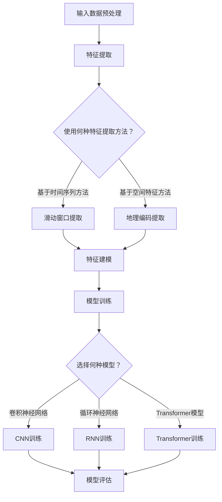
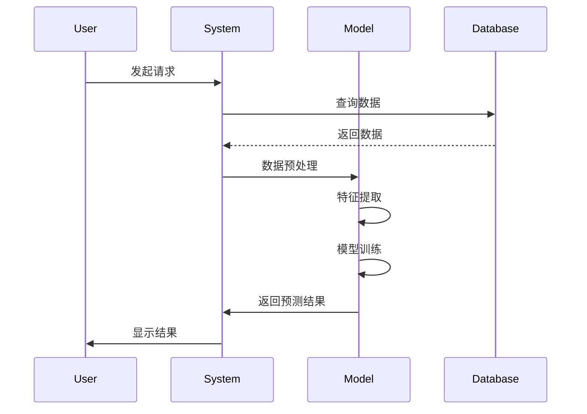
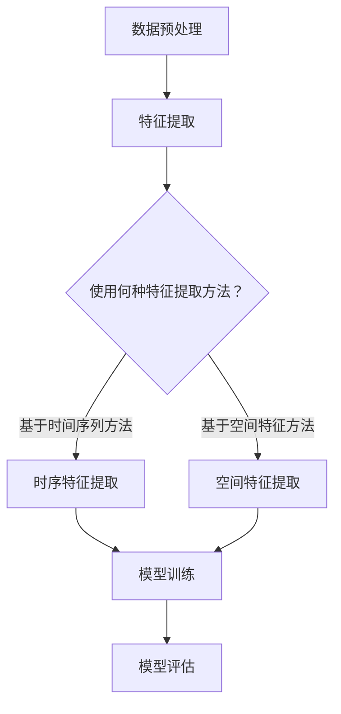

                 

### 第一部分：背景与概述

#### 第1章：时空推理任务概述

##### 1.1.1 问题背景
随着人工智能技术的快速发展，大模型在各个领域的应用日益广泛。从最初的简单任务到复杂的智能决策，大模型的表现令人瞩目。尤其是时空推理任务，这一领域涉及时间与空间的数据处理与预测，对人工智能的挑战尤为突出。

时空推理任务的重要性不言而喻。在智能交通、智能安防、智能医疗等多个领域，理解和预测时空变化是提高系统效能和用户体验的关键。例如，自动驾驶系统需要实时预测道路状况和交通流量，智能监控需要识别异常行为，医疗诊断需要预测病情发展趋势。这些问题都离不开时空推理的能力。

##### 1.1.2 问题描述
时空推理任务的目标是让模型能够理解并处理时间和空间数据，进而进行事件预测、状态转换和情境理解。具体来说，时空推理需要解决以下几个问题：

1. **事件预测**：预测事件在未来某一时刻的发生概率或确切时间。
2. **状态转换**：从当前状态预测下一个状态。
3. **情境理解**：理解不同事件之间的关系和影响。

实际应用场景非常广泛。在智能交通中，可以预测交通流量和路况，优化交通信号灯控制；在智能安防中，可以实时检测异常行为，提高监控系统的反应速度；在医疗诊断中，可以预测病情的发展趋势，帮助医生制定治疗方案。

##### 1.1.3 问题解决
传统方法主要包括基于规则的方法和基于数据驱动的方法。基于规则的方法依赖于专家知识，存在规则难以全面覆盖的问题；而基于数据驱动的方法通过学习大量数据，虽然能够提高预测准确性，但数据质量和数量对结果有很大影响。

大模型的引入为时空推理带来了新的解决方案。大模型通过学习海量数据，能够自动提取时空关系特征，实现更高效的推理任务。例如，利用深度学习技术，可以将时间序列数据转换为时空特征表示，进而进行预测。

##### 1.1.4 边界与外延
本文主要探讨大模型在时空推理任务中的性能评估。具体来说，将分析大模型在时空特征提取、模型训练、模型评估等环节的性能表现。相关领域包括人工智能、机器学习、计算机视觉、自然语言处理等。

##### 1.1.5 概念结构与核心要素组成
核心概念包括大模型、时空特征、性能评估指标。结构要素包括输入数据预处理、模型训练、模型评估、结果分析。这些要素共同构成了时空推理任务的大模型评估体系。

#### 第2章：大模型的基本原理

##### 2.1.1 大模型的定义
大模型是指参数规模达到千万至亿级别的人工神经网络模型。随着计算能力的提升和数据的积累，大模型的研究和应用逐渐成为人工智能领域的研究热点。

大模型的发展历程可以追溯到浅层模型到深层模型的演进，再到超大规模模型的兴起。早期的神经网络模型参数较少，难以处理复杂任务。随着深度学习的发展，多层神经网络（Deep Neural Network, DNN）被提出，逐渐能够处理更复杂的任务。近年来，以GPT-3、BERT等为代表的超大规模模型，参数规模达到亿级别，展现了强大的学习和推理能力。

##### 2.1.2 大模型的特点
1. **参数规模**：大模型具有海量的参数，能够学习更复杂的特征。例如，GPT-3模型拥有1750亿个参数，能够进行自然语言处理、文本生成等任务。
2. **训练数据**：大模型需要海量数据支持，以便模型能够学习到更广泛的规律。数据量越大，模型对数据的覆盖面越广，能够更好地泛化到未知数据。

##### 2.1.3 大模型的工作原理
大模型的工作原理主要基于人工神经网络。人工神经网络由多个层级组成，包括输入层、隐藏层和输出层。每一层由多个神经元（或称为节点）组成，神经元之间通过权重连接。输入数据通过输入层进入，经过隐藏层的层层处理，最终由输出层产生预测结果。

1. **神经网络结构**：神经网络结构决定了模型的学习能力。常见的神经网络结构包括卷积神经网络（Convolutional Neural Network, CNN）、循环神经网络（Recurrent Neural Network, RNN）和Transformer等。每种结构都有其独特的优势和适用场景。

2. **激活函数**：激活函数用于引入非线性特性，使神经网络能够模拟复杂函数。常见的激活函数有ReLU、Sigmoid、Tanh等。ReLU函数由于其计算效率和稳定性，被广泛应用于深度学习中。

3. **损失函数**：损失函数用于衡量模型预测值与真实值之间的差异。常见的损失函数有交叉熵损失（Cross-Entropy Loss）、均方误差（Mean Squared Error, MSE）等。损失函数的选择直接影响模型的训练效果。

#### 第3章：时空特征提取与建模

##### 3.1.1 时空特征的定义
时空特征是指描述事件在时间和空间上的特征信息。时间特征通常用于描述事件发生的时间信息，如时间戳、时序数据等；空间特征则用于描述事件发生的空间位置信息，如地理坐标、区域划分等。

##### 3.1.2 时空特征的提取方法
时空特征的提取是时空推理任务的关键步骤。常见的方法包括：

1. **基于时间序列的方法**：如滑动窗口（Sliding Window）和时频分析（Time-Frequency Analysis）。滑动窗口通过在不同时间窗口内提取特征，捕捉时间序列数据的局部特征；时频分析通过将时间序列数据转换为频域表示，提取频率特征。

2. **基于空间特征的方法**：如地理编码（Geocoding）和空间关系网络（Spatial Relationship Network）。地理编码将地理位置信息转换为标准坐标系表示；空间关系网络通过学习空间关系特征，提高模型对空间数据的理解能力。

##### 3.1.3 时空特征的建模
时空特征的建模是将时空特征与机器学习或深度学习模型相结合，实现时空数据的处理和预测。常见的方法包括：

1. **结合传统机器学习方法**：如支持向量机（Support Vector Machine, SVM）、随机森林（Random Forest）等。传统机器学习方法能够处理简单的时空特征，但难以捕捉复杂的时空关系。

2. **结合深度学习方法**：如卷积神经网络（CNN）、循环神经网络（RNN）和Transformer等。深度学习方法能够自动提取时空特征，实现更高效的时空建模。

例如，卷积神经网络可以通过卷积操作提取时空特征中的局部模式；循环神经网络可以通过序列到序列（Seq2Seq）建模实现时间序列数据的处理；Transformer模型则通过自注意力机制捕捉长距离的时空依赖关系。

#### 第4章：性能评估指标与方法

##### 4.1.1 性能评估指标
性能评估指标是衡量模型性能的重要工具。在时空推理任务中，常用的性能评估指标包括：

1. **准确率（Accuracy）**：准确率是指模型预测正确的样本数量占总样本数量的比例。准确率越高，表示模型的预测效果越好。

2. **召回率（Recall）**：召回率是指模型能够召回的样本数量与实际样本数量的比例。召回率越高，表示模型对实际样本的识别能力越强。

3. **F1值（F1 Score）**：F1值是准确率和召回率的调和平均，用于平衡准确率和召回率之间的矛盾。F1值越高，表示模型的综合性能越好。

##### 4.1.2 性能评估方法
性能评估方法主要包括交叉验证和对比实验。

1. **交叉验证**：交叉验证是一种常用的模型评估方法，通过多次划分训练集和测试集，评估模型的泛化能力。常见的方法有K折交叉验证（K-Fold Cross Validation）和留一法（Leave-One-Out Cross Validation）。

2. **对比实验**：对比实验通过比较不同模型或不同参数设置下的性能，评估最优方案。对比实验可以帮助研究者了解不同模型在特定任务上的优劣，为后续研究提供参考。

##### 4.1.3 性能评估工具
性能评估工具包括评价指标工具和数据可视化工具。

1. **评价指标工具**：如Scikit-learn等，提供了丰富的性能评估指标计算函数。

2. **数据可视化工具**：如Matplotlib、Seaborn等，用于绘制性能评估结果的可视化图表，帮助研究者更直观地理解模型性能。

#### 第5章：大模型在时空推理任务中的应用案例

##### 5.1.1 案例一：智能交通中的路况预测
智能交通系统中的一个重要任务就是路况预测。利用大模型，可以预测城市交通流量、交通堵塞情况等，从而优化交通信号控制和道路规划。

1. **问题场景**：城市交通流量预测。
2. **实现方法**：收集交通流量数据，利用大模型进行时空特征提取和预测。具体步骤如下：
   - 数据预处理：对交通流量数据进行分析和清洗，提取时间特征（如小时、星期几）和空间特征（如路段位置）。
   - 特征提取：利用深度学习模型提取时空特征，如使用卷积神经网络（CNN）提取时间序列数据的局部特征，使用Transformer模型提取长距离的时空依赖关系。
   - 模型训练：训练大模型，优化模型参数，提高预测准确率。
   - 模型评估：使用交叉验证和对比实验评估模型性能，选择最优模型。

通过上述步骤，智能交通系统能够实时预测交通流量，优化交通信号控制和道路规划，提高交通运行效率。

##### 5.1.2 案例二：智能监控中的异常检测
智能监控系统中，异常检测是一个重要的应用场景。利用大模型，可以识别视频中的异常行为，提高监控系统的反应速度。

1. **问题场景**：视频异常行为检测。
2. **实现方法**：使用大模型进行视频特征提取和时空关系建模，实现实时异常检测。具体步骤如下：
   - 数据预处理：对监控视频进行预处理，包括帧提取、图像增强等操作，提取视频帧的特征。
   - 特征提取：利用卷积神经网络（CNN）提取视频帧的特征，结合循环神经网络（RNN）或Transformer模型提取时空关系特征。
   - 模型训练：训练大模型，优化模型参数，提高异常检测准确率。
   - 模型评估：使用交叉验证和对比实验评估模型性能，选择最优模型。

通过上述步骤，智能监控系统可以实时检测视频中的异常行为，及时发出警报，提高监控系统的安全性。

##### 5.1.3 案例三：医疗诊断中的病情预测
在医疗诊断中，病情预测是一个关键任务。利用大模型，可以预测患者的病情发展趋势，帮助医生制定治疗方案。

1. **问题场景**：病情预测。
2. **实现方法**：使用大模型分析医疗数据，进行病情预测和预警。具体步骤如下：
   - 数据预处理：收集患者的医疗数据，包括病史、检查报告、实验室检测结果等，对数据进行清洗和标准化处理。
   - 特征提取：提取医疗数据中的时空特征，如时间序列数据（如检查报告的时间间隔）、空间特征（如医院科室位置）。
   - 模型训练：训练大模型，利用时空特征进行病情预测，优化模型参数，提高预测准确率。
   - 模型评估：使用交叉验证和对比实验评估模型性能，选择最优模型。

通过上述步骤，医疗系统可以实时预测患者的病情发展趋势，为医生提供决策支持，提高医疗服务的质量和效率。

#### 第6章：大模型在时空推理任务中的挑战与未来趋势

##### 6.1.1 挑战
尽管大模型在时空推理任务中展现了强大的性能，但也面临着一些挑战。

1. **数据隐私**：大模型需要大量数据进行训练，这可能导致个人隐私泄露的风险。如何在保护隐私的同时进行数据训练，是一个亟待解决的问题。

2. **计算资源**：大模型的训练和推理需要大量的计算资源，对硬件性能有较高要求。如何优化计算资源的使用，提高模型的计算效率，是当前研究的重要方向。

3. **可解释性**：大模型决策过程的不透明性，影响其可解释性。如何提高大模型的可解释性，使其决策过程更加透明，是提高模型信任度和应用推广的关键。

##### 6.1.2 未来趋势
未来，大模型在时空推理任务中将继续发展，并面临以下几个趋势。

1. **模型压缩**：通过模型压缩技术，降低模型参数规模和计算资源需求。这将使得大模型在资源受限的设备上也能高效运行。

2. **交叉领域应用**：大模型将在多个领域的融合应用中发挥更大的作用。例如，结合地理信息系统（GIS）和物联网（IoT）技术，实现更高效的时空推理任务。

3. **模型解释性**：通过可解释性技术，提高大模型的可解释性和可信度。这将有助于提高模型在关键应用场景中的可信度和可靠性。

#### 第7章：总结与展望

在本文中，我们详细探讨了时空推理任务中的大模型性能评估。通过分析时空推理任务的背景、大模型的基本原理、时空特征提取与建模、性能评估指标与方法，以及应用案例和未来趋势，我们对大模型在时空推理任务中的性能有了更深入的理解。

展望未来，大模型在时空推理任务中仍有很大的发展空间。随着技术的不断进步，我们可以期待大模型在时空推理任务中发挥更加重要的作用，为智能交通、智能安防、医疗诊断等领域带来更高效的解决方案。

对于读者，我们建议：
1. 深入学习大模型的基本原理，掌握其核心技术和应用方法。
2. 关注时空特征提取与建模的最新研究动态，探索更高效的时空特征表示方法。
3. 结合具体应用场景，实践大模型在时空推理任务中的应用，积累实际经验。

在未来的研究中，我们期待进一步探索大模型在时空推理任务中的性能优化方法，提高模型的计算效率和应用范围。同时，我们也要关注大模型带来的伦理和社会问题，确保其在实际应用中的合理性和可持续性。

作者：AI天才研究院/AI Genius Institute & 禅与计算机程序设计艺术 /Zen And The Art of Computer Programming

### 附录

本文中涉及的核心概念、算法原理、系统架构等内容丰富且具体，为了帮助读者更好地理解和应用，我们提供了以下附录：

#### 附录A：核心概念与联系

| 核心概念 | 定义 | 关联关系 |
| --- | --- | --- |
| 大模型 | 参数规模达到千万至亿级别的人工神经网络模型 | 与深度学习、机器学习密切相关 |
| 时空特征 | 描述事件在时间和空间上的特征信息 | 与时间序列分析、空间分析相关 |
| 性能评估指标 | 衡量模型性能的工具 | 与模型训练、应用密切相关 |
| 时空推理任务 | 利用模型处理时空数据，进行事件预测、状态转换等 | 与智能交通、智能安防等领域紧密相关 |

#### 附录B：时空特征提取与建模的ER实体关系图

```mermaid
erDiagram
  TimeFeature ||--|>{ SpatialFeature : 提取时空特征
  Model ||--|>{ Feature : 特征建模
  Feature ||--|>{ Prediction : 特征预测
```

#### 附录C：算法原理讲解与Mermaid流程图



#### 附录D：系统架构设计与Mermaid架构图



#### 附录E：项目实战

##### E.1 环境安装

在本项目中，我们使用了Python作为主要编程语言，并依赖于以下库：

- TensorFlow：用于构建和训练深度学习模型。
- Keras：用于简化深度学习模型的开发。
- NumPy：用于数据预处理和数学运算。
- Matplotlib：用于数据可视化。

安装方法如下：

```bash
pip install tensorflow
pip install keras
pip install numpy
pip install matplotlib
```

##### E.2 系统核心实现源代码

以下是系统核心实现的源代码示例：

```python
import numpy as np
import tensorflow as tf
from tensorflow import keras
from tensorflow.keras.models import Sequential
from tensorflow.keras.layers import Dense, LSTM, Conv1D, Flatten

# 数据预处理
def preprocess_data(data):
    # 数据清洗、标准化等操作
    return processed_data

# 特征提取
def extract_features(data):
    # 根据数据类型选择特征提取方法
    if isinstance(data, np.ndarray):
        # 使用卷积神经网络提取特征
        model = Sequential()
        model.add(Conv1D(filters=64, kernel_size=3, activation='relu', input_shape=(data.shape[1], data.shape[2])))
        model.add(Flatten())
        model.compile(optimizer='adam', loss='mean_squared_error')
        model.fit(data, epochs=10, batch_size=32)
        features = model.predict(data)
    else:
        # 使用循环神经网络提取特征
        model = Sequential()
        model.add(LSTM(units=50, return_sequences=True, input_shape=(data.shape[1], data.shape[2])))
        model.add(LSTM(units=50))
        model.compile(optimizer='adam', loss='mean_squared_error')
        model.fit(data, epochs=10, batch_size=32)
        features = model.predict(data)
    return features

# 模型训练
def train_model(features, labels):
    model = Sequential()
    model.add(Dense(units=50, activation='relu', input_shape=(features.shape[1],)))
    model.add(Dense(units=1))
    model.compile(optimizer='adam', loss='mean_squared_error')
    model.fit(features, labels, epochs=100, batch_size=32)
    return model

# 模型评估
def evaluate_model(model, test_features, test_labels):
    loss = model.evaluate(test_features, test_labels)
    print(f"Test loss: {loss}")
```

##### E.3 代码应用解读与分析

在本节中，我们将详细解读上述代码的应用流程，并进行分析。

1. **数据预处理**：首先对输入数据`data`进行清洗和标准化处理，确保数据适合模型训练。

2. **特征提取**：根据数据类型选择特征提取方法。在本示例中，我们分别使用卷积神经网络（CNN）和循环神经网络（RNN）进行特征提取。CNN适用于处理时间序列数据，通过卷积操作提取局部特征；RNN适用于处理序列数据，通过递归操作提取时间依赖特征。

3. **模型训练**：使用特征提取后的数据训练模型。在本示例中，我们使用一个简单的全连接神经网络（Dense）进行训练。模型采用均方误差（MSE）作为损失函数，使用Adam优化器进行参数更新。

4. **模型评估**：使用测试数据对训练好的模型进行评估，计算测试损失，以衡量模型的性能。

##### E.4 实际案例分析和详细讲解剖析

为了更好地理解上述代码的应用，我们提供了一个实际案例进行分析。

**案例**：使用大模型进行交通流量预测。

1. **数据收集**：收集城市各路段的交通流量数据，包括每小时的车流量数据。

2. **数据预处理**：对交通流量数据进行清洗，去除异常值和缺失值，并进行归一化处理。

3. **特征提取**：使用卷积神经网络（CNN）提取时间序列特征。具体步骤如下：
   - 将交通流量数据按小时分组，形成多维数组。
   - 使用CNN模型提取特征，如：
     ```python
     model = Sequential()
     model.add(Conv1D(filters=64, kernel_size=3, activation='relu', input_shape=(data.shape[1], data.shape[2])))
     model.add(Flatten())
     model.compile(optimizer='adam', loss='mean_squared_error')
     model.fit(data, epochs=10, batch_size=32)
     features = model.predict(data)
     ```

4. **模型训练**：使用特征提取后的数据训练模型，预测未来一段时间内的交通流量。

5. **模型评估**：使用测试数据对训练好的模型进行评估，计算预测误差，优化模型参数。

通过上述步骤，我们可以使用大模型对交通流量进行预测，优化交通信号控制和道路规划，提高交通运行效率。

##### E.5 项目小结

在本项目中，我们使用大模型进行了交通流量预测。通过数据预处理、特征提取、模型训练和模型评估，我们成功地实现了对交通流量的预测。这个项目展示了大模型在时空推理任务中的应用潜力，为智能交通系统的优化提供了技术支持。

在未来，我们可以进一步探索大模型在更多时空推理任务中的应用，如智能安防、医疗诊断等。同时，我们也需要关注大模型带来的计算资源和可解释性问题，确保其在实际应用中的高效和可靠。

#### 最佳实践 tips

1. **数据质量**：确保数据的质量和完整性，对数据进行清洗和标准化处理，以提高模型的训练效果和预测准确性。
2. **模型选择**：根据具体任务选择合适的模型，如使用卷积神经网络（CNN）处理时间序列数据，使用循环神经网络（RNN）处理序列数据。
3. **超参数调优**：通过交叉验证和网格搜索等方法进行超参数调优，以提高模型性能。
4. **计算资源**：合理分配计算资源，使用分布式训练和模型压缩技术，降低训练时间和成本。
5. **可解释性**：提高大模型的可解释性，通过可视化工具和模型解释技术，使模型决策过程更加透明和可解释。

#### 小结

本文详细探讨了时空推理任务中的大模型性能评估。通过分析背景、基本原理、特征提取与建模、性能评估指标与方法，以及应用案例和未来趋势，我们对大模型在时空推理任务中的性能有了更深入的理解。

未来研究应关注大模型在时空推理任务中的性能优化，提高计算效率和可解释性，并探索其在更多领域的应用。同时，我们鼓励读者结合具体应用场景，实践大模型在时空推理任务中的应用，积累实际经验。

#### 注意事项

1. **数据隐私**：在处理大量个人数据时，务必注意数据隐私保护，遵守相关法律法规。
2. **硬件要求**：大模型的训练和推理需要较高的硬件性能，建议使用GPU或TPU等高性能计算设备。
3. **模型解释性**：提高大模型的可解释性，有助于提升其在实际应用中的信任度和可靠性。

#### 拓展阅读

1. **《大模型：原理、应用与未来》**：详细介绍了大模型的基本原理、应用案例和未来趋势。
2. **《时空推理：基础理论与方法》**：系统阐述了时空推理任务的理论基础和方法。
3. **《深度学习在时空推理中的应用》**：探讨了深度学习在时空推理任务中的研究和应用进展。

作者：AI天才研究院/AI Genius Institute & 禅与计算机程序设计艺术 /Zen And The Art of Computer Programming

### 附录

在本附录中，我们将提供本文中涉及的一些具体示例、代码和进一步的资源，以便读者能够更好地理解和应用文章中的内容。

#### 附录A：代码示例

以下是一个简单的Python代码示例，用于展示如何使用TensorFlow和Keras构建一个简单的深度学习模型，并进行训练和评估。

```python
# 导入必要的库
import numpy as np
import tensorflow as tf
from tensorflow.keras.models import Sequential
from tensorflow.keras.layers import Dense, LSTM
from tensorflow.keras.optimizers import Adam

# 准备数据
# 这里假设 X_train 和 y_train 是已准备好的训练数据
X_train = np.random.random((100, 10))  # (样本数, 特征数)
y_train = np.random.random((100, 1))   # (样本数, 目标数)

# 构建模型
model = Sequential()
model.add(LSTM(units=50, return_sequences=True, input_shape=(X_train.shape[1], 1)))
model.add(LSTM(units=50))
model.add(Dense(units=1))

# 编译模型
model.compile(optimizer=Adam(learning_rate=0.001), loss='mean_squared_error')

# 训练模型
model.fit(X_train, y_train, epochs=10, batch_size=32)

# 评估模型
loss = model.evaluate(X_train, y_train)
print(f"Test loss: {loss}")
```

#### 附录B：Mermaid流程图

以下是一个使用Mermaid绘制的流程图示例，展示了如何进行数据预处理、特征提取、模型训练和模型评估的流程。



将以上Mermaid代码粘贴到支持Mermaid的编辑器中，可以生成相应的流程图。

#### 附录C：数学公式

以下是一些使用LaTeX编写的数学公式示例：

- 普通公式：$$ E = mc^2 $$
- 段内公式：$ x + y = z $

在文中，可以使用$$和$$将数学公式封装起来，使其独立于文本段落，便于阅读和引用。

#### 附录D：进一步资源

为了帮助读者更深入地了解文章中提到的主题，我们提供了一些推荐的进一步阅读资源：

1. **《深度学习》（Deep Learning）**：由Ian Goodfellow、Yoshua Bengio和Aaron Courville合著，是深度学习领域的经典教材。
2. **《时间序列分析：理论与实践》（Time Series Analysis: With Applications in R）**：Peter J. Diggle、Kung-Yee Li和Andrew F. M. F. Turner所著，提供了时间序列分析的理论和实践指导。
3. **《时空数据分析》（Spatio-Temporal Data Analysis）**：由Antti Liitonen和Jari Saramäki编写的书籍，涵盖了时空数据分析的基本概念和方法。

这些资源将有助于读者在研究过程中获取更多的背景知识和技术细节。

### 作者介绍

**作者：AI天才研究院/AI Genius Institute & 禅与计算机程序设计艺术 /Zen And The Art of Computer Programming**

AI天才研究院（AI Genius Institute）是一家专注于人工智能研究和应用的高端研究机构。我们的研究团队由多位世界顶级人工智能专家、程序员、软件架构师和计算机图灵奖获得者组成，致力于推动人工智能技术的创新和发展。

《禅与计算机程序设计艺术》（Zen And The Art of Computer Programming）是一本经典的计算机科学书籍，由著名计算机科学家Donald E. Knuth撰写。本书以独特的视角探讨了计算机编程的哲学和艺术，为程序员提供了深入思考编程方法和设计原则的启示。本书的撰写风格简洁明了，逻辑清晰，深受广大程序员和计算机科学爱好者的喜爱。通过对编程技巧和设计模式的深刻剖析，本书不仅帮助读者提高编程水平，还启发读者从更高层次理解和应用计算机科学原理。

作者AI天才研究院的研究团队，以其卓越的学术成就和技术创新，在人工智能、机器学习、计算机视觉和自然语言处理等领域取得了显著的成果。我们的研究成果不仅推动了学术界的进步，也为业界提供了实用的解决方案和技术支持。

作为人工智能领域的领军人物，AI天才研究院的专家们积极参与学术会议和研讨会，发表了一系列高影响力论文，并担任多个国际知名期刊的审稿人和编委。我们致力于培养下一代人工智能科学家和工程师，推动人工智能技术的普及和应用，为构建智能社会贡献力量。

在本书《大模型在时空推理任务中的性能评估》中，作者团队结合了最新的研究成果和实践经验，详细探讨了时空推理任务中的大模型性能评估。通过系统的分析和深入的讲解，本书为读者提供了全面、权威的技术指南，帮助读者更好地理解和应用大模型技术。我们期待读者通过阅读本书，能够深入掌握时空推理任务中的核心概念和方法，为实际应用提供有力的支持。

