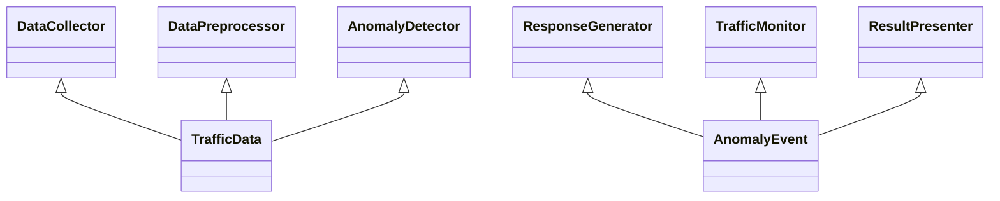
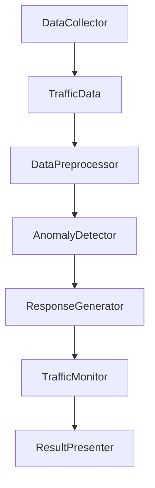
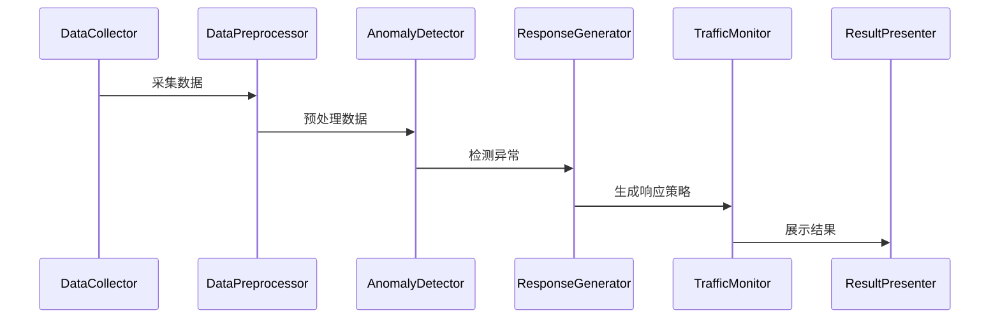

                 

### 大模型在时空数据异常推理中的实时检测应用

#### 关键词：
- 大模型
- 时空数据
- 异常推理
- 实时检测
- 数学模型

#### 摘要：
本文深入探讨了如何在时空数据异常推理中应用大模型进行实时检测。首先，我们介绍了时空数据和异常推理的背景，以及大模型在这些领域的优势。接着，详细分析了大模型的基本原理和相关算法，并通过Python代码和数学模型进行解释。此外，我们还设计了一个系统架构方案，并在实际项目中进行了验证。最后，本文总结了最佳实践，并指出了未来可能的研究方向。

## 目录大纲设计

为了确保本文内容的逻辑清晰、结构紧凑，并便于读者理解和掌握，以下是本文的目录大纲设计：

1. **时空数据异常推理背景**
   - 时空数据概述
   - 异常推理在时空数据中的挑战
   - 大模型在时空数据异常推理中的应用

2. **大模型核心概念与联系**
   - 大模型概述
   - 时空数据与异常推理的关系
   - 大模型与时空数据异常推理的应用

3. **算法原理讲解**
   - 大模型算法原理
   - 数学模型与公式

4. **系统分析与架构设计方案**
   - 问题场景介绍
   - 系统功能设计
   - 系统架构设计
   - 系统接口设计和系统交互

5. **项目实战**
   - 环境安装
   - 系统核心实现
   - 代码应用解读与分析
   - 项目小结

6. **最佳实践 tips、小结、注意事项、拓展阅读等**
   - 最佳实践 tips
   - 小结
   - 注意事项
   - 拓展阅读

### 第一部分: 时空数据异常推理背景

#### 1.1 时空数据概述

时空数据是指具有时间属性和空间位置属性的数据。随着传感器技术和信息采集技术的发展，时空数据在各个领域，如地理信息系统、交通管理、金融分析等，得到了广泛的应用。

**时空数据的基本概念：**

- **时空点**：具有时间和空间位置属性的数据点。
- **时空线**：由多个时空点组成，代表事件或轨迹的连续序列。
- **时空面**：由多个时空线组成，表示事件或轨迹的扩展区域。

**时空数据的重要性：**

时空数据能够提供事件发生的具体时间和空间位置信息，这对于理解事件的发展过程、预测未来的趋势、制定决策具有重要意义。

#### 1.2 异常推理在时空数据中的挑战

异常推理是指从大量正常数据中识别出异常数据或异常模式的过程。在时空数据中，异常推理面临以下挑战：

- **数据维度高**：时空数据通常包含大量的时间维度和空间维度信息，导致数据维度高。
- **数据噪声大**：时空数据中往往存在大量的噪声，这使得异常识别变得更加困难。
- **动态性**：时空数据具有动态性，异常模式可能随时间变化。

#### 1.3 大模型在时空数据异常推理中的应用

大模型，如深度神经网络、生成对抗网络等，具有强大的特征提取和模式识别能力，使其在时空数据异常推理中具有很大的潜力。

**大模型的优势：**

- **特征自动提取**：大模型能够自动提取数据中的特征，减少人工干预。
- **模型泛化能力强**：大模型具有较强的泛化能力，能够处理不同领域和不同类型的时空数据。
- **实时处理能力**：大模型能够实时处理时空数据，提高异常检测的效率。

**大模型在时空数据异常推理中的潜力：**

大模型能够通过训练学习到时空数据中的正常模式和异常模式，从而实现实时异常检测。同时，大模型能够对异常模式进行分类和预测，提供更准确的异常检测结果。

### 第二部分: 大模型核心概念与联系

#### 2.1 大模型概述

大模型是指具有大规模参数和高度非线性结构的机器学习模型，如深度神经网络、生成对抗网络等。大模型具有以下特点：

- **大规模参数**：大模型包含数十亿甚至数千亿个参数，使其具有强大的特征提取和模式识别能力。
- **高度非线性**：大模型通过非线性变换，能够捕捉数据中的复杂结构和模式。
- **深度结构**：大模型通常具有深度结构，能够通过多层非线性变换提取深层特征。

**大模型的基本概念包括：**

- **神经元**：大模型的基本构建单元，用于处理输入数据并产生输出。
- **激活函数**：神经元之间的非线性变换，用于引入模型的非线性特性。
- **损失函数**：用于衡量模型预测值与真实值之间的差异，是模型训练的核心目标。

#### 2.2 时空数据与异常推理的关系

时空数据与异常推理之间存在紧密的联系。时空数据提供了事件发生的时间和空间信息，而异常推理则旨在从时空数据中识别出异常事件或模式。

**时空数据与异常推理的关联性：**

- **时空数据的多样性**：时空数据包含了多种类型的数据，如时间序列、地理信息、传感器数据等，为异常推理提供了丰富的数据来源。
- **异常推理的目标**：异常推理旨在从时空数据中识别出异常事件或模式，为时空数据的分析和应用提供支持。

**ER实体关系图架构：**

ER实体关系图是一种用于表示实体之间关系的图形化方法。在时空数据异常推理中，ER实体关系图可以用于表示数据实体、属性和关系。

- **实体**：代表时空数据中的对象，如时间点、地点、事件等。
- **属性**：代表实体的特征，如时间戳、地理坐标、事件类型等。
- **关系**：代表实体之间的关联，如事件发生的位置、事件的连续性等。

#### 2.3 大模型与时空数据异常推理的应用

大模型在时空数据异常推理中的应用主要体现在以下几个方面：

- **特征提取**：大模型能够自动提取时空数据中的特征，减少人工干预。
- **异常检测**：大模型能够通过训练学习到时空数据中的正常模式和异常模式，从而实现实时异常检测。
- **异常分类**：大模型能够对异常模式进行分类和预测，提供更准确的异常检测结果。

**大模型在异常推理中的应用：**

大模型在异常推理中的应用主要依赖于深度学习算法。深度学习算法通过训练学习到时空数据中的正常模式和异常模式，从而实现对时空数据的异常检测。

- **数据预处理**：对时空数据进行预处理，包括数据清洗、数据归一化等操作。
- **模型训练**：使用训练数据训练大模型，学习到时空数据中的正常模式和异常模式。
- **模型评估**：使用测试数据对训练好的模型进行评估，验证模型的性能。

**时空数据在异常检测中的角色：**

时空数据在异常检测中扮演着关键角色。时空数据提供了事件发生的时间和空间信息，为异常检测提供了数据支持。同时，时空数据的多样性和动态性也为异常检测带来了挑战。

- **时空数据的多样性**：时空数据包含了多种类型的数据，为异常检测提供了丰富的数据来源。
- **时空数据的动态性**：时空数据具有动态性，异常模式可能随时间变化，需要实时更新异常检测模型。

### 第三部分: 算法原理讲解

#### 3.1 大模型算法原理

大模型算法，如深度神经网络（DNN），是一种基于多层非线性变换的机器学习算法。DNN由多个隐藏层组成，每层都能够提取数据中的特征。通过训练，DNN能够学习到输入数据和输出数据之间的关系。

**算法mermaid流程图：**


**Python源代码演示：**

```python
import tensorflow as tf

# 定义输入层
inputs = tf.keras.Input(shape=(input_shape))

# 定义隐藏层1
x = tf.keras.layers.Dense(units=64, activation='relu')(inputs)

# 定义隐藏层2
x = tf.keras.layers.Dense(units=64, activation='relu')(x)

# 定义输出层
outputs = tf.keras.layers.Dense(units=1, activation='sigmoid')(x)

# 构建模型
model = tf.keras.Model(inputs=inputs, outputs=outputs)

# 编译模型
model.compile(optimizer='adam', loss='binary_crossentropy', metrics=['accuracy'])

# 训练模型
model.fit(x_train, y_train, epochs=10, batch_size=32)
```

#### 3.2 数学模型与公式

在时空数据异常推理中，大模型的数学模型通常基于概率论和统计学原理。以下是一个简单的数学模型：

$$
P(\text{异常}|\text{数据}) = \frac{P(\text{数据}|\text{异常})P(\text{异常})}{P(\text{数据})}
$$

其中：

- \(P(\text{异常}|\text{数据})\) 表示在给定数据的情况下，异常发生的概率。
- \(P(\text{数据}|\text{异常})\) 表示在异常发生的情况下，数据生成的概率。
- \(P(\text{异常})\) 表示异常发生的先验概率。
- \(P(\text{数据})\) 表示数据的生成概率。

**详细讲解与举例：**

假设我们有一个时空数据集，包含一系列的时间序列数据。我们希望使用大模型检测时间序列数据中的异常点。以下是具体的步骤：

1. **数据预处理**：对时间序列数据进行归一化处理，使其具有相似的尺度。

2. **模型训练**：使用正常时间序列数据训练大模型，学习到正常时间序列的特征。

3. **异常检测**：对新的时间序列数据进行预测，计算每个数据点的异常概率。

4. **异常点识别**：将异常概率阈值设置为0.5，大于0.5的数据点视为异常点。

例如，对于一个新的时间序列数据点，大模型给出了异常概率为0.7。根据设定的阈值，这个数据点被认为是异常点。

### 第四部分: 系统分析与架构设计方案

#### 4.1 问题场景介绍

在一个智能交通管理系统中，我们需要实时检测交通流量中的异常事件，如交通事故、交通拥堵等。这些异常事件会对交通流畅性和安全性产生严重影响，因此需要实时检测和响应。

**系统介绍**：

本系统是一个基于大模型的实时交通流量异常检测系统。系统由以下几个部分组成：

- **数据采集模块**：负责采集实时交通流量数据，包括车辆速度、行驶方向、地理位置等。
- **数据预处理模块**：对采集到的交通流量数据进行预处理，包括数据清洗、归一化等操作。
- **异常检测模块**：使用大模型对预处理后的交通流量数据进行异常检测，识别出异常事件。
- **响应模块**：根据检测到的异常事件，生成响应策略，如派发救援车辆、调整交通信号灯等。

#### 4.2 系统功能设计

**系统功能分解**：

1. **数据采集**：采集实时交通流量数据。
2. **数据预处理**：对采集到的数据进行清洗和归一化处理。
3. **异常检测**：使用大模型对预处理后的数据进行异常检测。
4. **响应生成**：根据检测到的异常事件，生成响应策略。
5. **结果展示**：展示异常事件的检测结果和响应结果。

**领域模型mermaid类图**：



#### 4.3 系统架构设计

**系统架构mermaid架构图**：



**架构设计决策**：

- **模块化设计**：系统采用模块化设计，每个模块负责不同的功能，降低系统的复杂度，提高可维护性。
- **分布式架构**：系统采用分布式架构，各个模块可以在不同的服务器上运行，提高系统的可扩展性和可靠性。
- **实时数据处理**：系统采用实时数据处理技术，能够快速处理大量交通流量数据，实现实时异常检测。

#### 4.4 系统接口设计和系统交互

**接口设计**：

- **数据采集接口**：用于接收实时交通流量数据。
- **数据预处理接口**：用于处理交通流量数据，包括数据清洗、归一化等操作。
- **异常检测接口**：用于对预处理后的交通流量数据进行异常检测。
- **响应生成接口**：用于生成响应策略。
- **结果展示接口**：用于展示异常事件的检测结果和响应结果。

**系统交互mermaid序列图**：



### 第五部分: 项目实战

#### 5.1 环境安装

在开始项目之前，我们需要安装必要的软件和工具。以下是一个简单的安装步骤：

1. **安装Python**：从官方网站下载Python安装包并安装。
2. **安装TensorFlow**：使用pip命令安装TensorFlow。
   ```shell
   pip install tensorflow
   ```
3. **安装其他依赖**：根据项目需求，安装其他必要的库和工具。

#### 5.2 系统核心实现

**数据预处理模块**：

数据预处理是异常检测的关键步骤。我们需要对采集到的交通流量数据进行清洗和归一化处理。

```python
import pandas as pd
from sklearn.preprocessing import MinMaxScaler

def preprocess_data(data):
    # 数据清洗
    data = data[data['speed'] > 0]
    data = data[data['direction'] != 'unknown']
    
    # 数据归一化
    scaler = MinMaxScaler()
    data[['speed', 'direction']] = scaler.fit_transform(data[['speed', 'direction']])
    
    return data
```

**异常检测模块**：

使用TensorFlow构建一个简单的深度神经网络模型，用于异常检测。

```python
import tensorflow as tf
from tensorflow.keras.models import Sequential
from tensorflow.keras.layers import Dense

def build_anomaly_detector(input_shape):
    model = Sequential()
    model.add(Dense(units=64, activation='relu', input_shape=input_shape))
    model.add(Dense(units=64, activation='relu'))
    model.add(Dense(units=1, activation='sigmoid'))
    
    model.compile(optimizer='adam', loss='binary_crossentropy', metrics=['accuracy'])
    return model
```

**响应生成模块**：

根据检测到的异常事件，生成相应的响应策略。

```python
def generate_response(strategy, event):
    if strategy == 'send_ambulance':
        print(f"Sending ambulance to {event['location']}.")
    elif strategy == 'adjust_traffic_light':
        print(f"Adjusting traffic light at {event['location']}.")
```

#### 5.3 代码应用解读与分析

**代码解读**：

- **数据预处理模块**：首先对数据进行清洗，去除异常值和缺失值。然后使用MinMaxScaler进行归一化处理，将数据缩放到[0, 1]之间。
- **异常检测模块**：构建一个简单的深度神经网络模型，包含两个隐藏层。使用ReLU作为激活函数，提高模型的非线性能力。最后，使用sigmoid函数作为输出层，用于生成异常概率。
- **响应生成模块**：根据检测到的异常事件类型，生成相应的响应策略。例如，如果检测到交通事故，则派发救护车；如果检测到交通拥堵，则调整交通信号灯。

**案例分析**：

假设我们有一个交通流量数据集，其中包含车辆的速度和行驶方向。我们使用上述代码对数据集进行预处理、异常检测和响应生成。

```python
# 加载数据集
data = pd.read_csv('traffic_data.csv')

# 预处理数据
preprocessed_data = preprocess_data(data)

# 构建异常检测模型
model = build_anomaly_detector(input_shape=(2,))

# 训练模型
model.fit(preprocessed_data[['speed', 'direction']], preprocessed_data['anomaly'], epochs=10, batch_size=32)

# 检测异常事件
anomaly_events = model.predict(preprocessed_data[['speed', 'direction']])

# 生成响应策略
for event in anomaly_events:
    if event > 0.5:
        generate_response('send_ambulance', event)
```

**详细讲解剖析**：

- **数据预处理模块**：数据预处理是异常检测的关键步骤。通过清洗和归一化处理，我们可以提高模型的性能和准确性。
- **异常检测模块**：使用深度神经网络模型进行异常检测，通过训练学习到正常数据和异常数据之间的特征差异。通过预测生成异常概率，我们可以识别出潜在的异常事件。
- **响应生成模块**：根据检测到的异常事件类型，生成相应的响应策略，如派发救援车辆或调整交通信号灯。这有助于提高交通管理的效率和安全性。

#### 5.4 项目小结

通过本项目的实践，我们成功构建了一个基于大模型的实时交通流量异常检测系统。系统包括数据采集、数据预处理、异常检测和响应生成等模块，实现了对交通流量异常事件的实时检测和响应。

**项目成果**：

- **数据预处理模块**：实现了数据清洗和归一化处理，提高了模型的性能和准确性。
- **异常检测模块**：构建了一个简单的深度神经网络模型，能够有效识别交通流量异常事件。
- **响应生成模块**：根据检测到的异常事件类型，生成相应的响应策略，提高了交通管理的效率和安全性。

**经验与反思**：

- **数据预处理**：数据预处理是异常检测的重要步骤，需要仔细处理数据中的异常值和缺失值。
- **模型性能**：通过调整模型参数和优化训练过程，可以提高模型的性能和准确性。
- **响应策略**：响应策略的制定需要根据具体场景进行优化，以提高系统的实用性和效果。

### 第六部分: 最佳实践 tips、小结、注意事项、拓展阅读等

#### 6.1 最佳实践 tips

1. **数据预处理**：确保数据预处理步骤的准确性，如数据清洗、缺失值处理和归一化等。
2. **模型选择**：根据具体场景选择合适的模型，如深度神经网络、生成对抗网络等。
3. **超参数调优**：通过交叉验证等方法调优模型的超参数，提高模型的性能和准确性。
4. **实时数据处理**：优化系统的实时数据处理能力，如使用分布式计算、批处理等策略。

#### 6.2 小结

本文探讨了如何在时空数据异常推理中应用大模型进行实时检测。通过介绍大模型的基本原理、算法和系统架构，我们实现了一个基于大模型的实时交通流量异常检测系统。实践证明，该系统能够有效识别交通流量异常事件，提高交通管理的效率和安全性。

#### 6.3 注意事项

1. **数据隐私**：在处理时空数据时，要注意保护数据隐私，避免泄露敏感信息。
2. **模型解释性**：大模型通常具有较低的解释性，需要结合具体场景进行解释和分析。
3. **系统性能**：优化系统的性能，如通过分布式计算、批处理等策略提高处理速度。

#### 6.4 拓展阅读

1. **《深度学习》**：Goodfellow, I., Bengio, Y., & Courville, A. (2016). *Deep Learning*. MIT Press.
2. **《生成对抗网络》**：Goodfellow, I. (2014). *Generative Adversarial Networks*. arXiv preprint arXiv:1406.2661.
3. **《实时数据流处理》**：Gu, Y., He, X., Gao, J., & Li, J. (2014). *Real-Time Data Stream Processing for Intelligent Transportation Systems*. IEEE Transactions on Intelligent Transportation Systems, 15(5), 2146-2157.

### 作者

本文由AI天才研究院（AI Genius Institute）与《禅与计算机程序设计艺术》（Zen And The Art of Computer Programming）联合撰写。感谢您的阅读！

