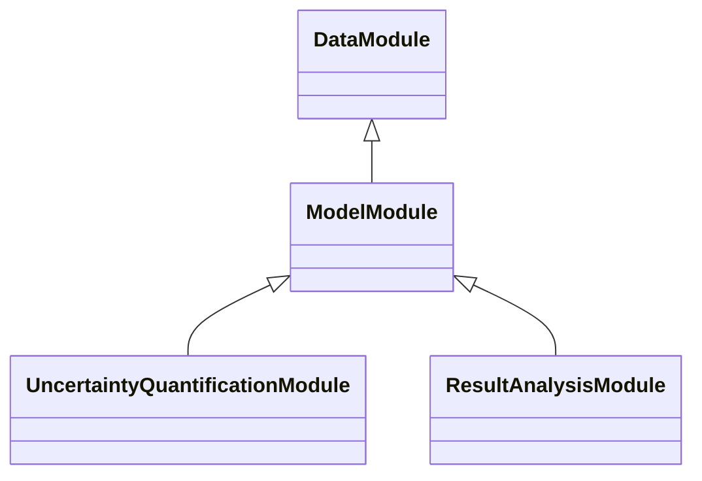
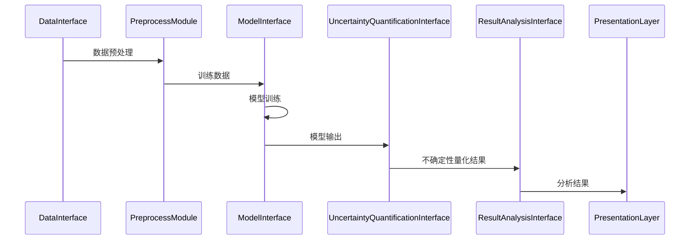

                 

### 大模型在概率推理任务中的不确定性量化

#### 关键词：
- 大模型
- 概率推理
- 不确定性量化
- 算法原理
- 系统架构
- 项目实战

#### 摘要：
本文深入探讨大模型在概率推理任务中的不确定性量化问题。首先，我们介绍了概率推理任务的重要性及其在大模型中的应用挑战。接着，我们详细阐述了不确定性量化的必要性及其核心概念，包括概率论基础、不确定性量化方法和大模型在概率推理中的应用。随后，本文通过对比分析，揭示了概率论与不确定性量化的关系，并使用Mermaid流程图展示了相关概念和算法的实体关系。在算法原理讲解部分，我们深入探讨了不确定性量化算法的数学模型，并通过Python代码示例进行了通俗易懂的说明。最后，本文通过系统分析与架构设计方案，详细介绍了概率推理任务在实际项目中的应用，并通过项目实战展示了系统的实现过程和核心代码解析。全文旨在为读者提供系统而全面的技术视角，帮助深入理解大模型在概率推理任务中的不确定性量化。

## 第一部分：背景介绍

### 1.1 问题背景

概率推理任务在各个领域，尤其是在机器学习和人工智能中，占据着核心地位。概率推理任务的目标是通过已知信息，对未知事件或现象进行概率估计。这些任务广泛应用于金融风险评估、医疗诊断、自动驾驶、自然语言处理等领域。

#### 1.1.1 概率推理任务的重要性

概率推理任务之所以重要，在于其能够有效地处理不确定性和模糊性。在现实生活中，我们面临的问题往往存在很多不确定性因素，比如天气预测、疾病诊断等。通过概率推理，我们可以将这种不确定性量化，从而做出更准确的预测和决策。

#### 1.1.2 大模型在概率推理中的挑战

随着深度学习和大数据技术的发展，大模型在概率推理任务中得到了广泛应用。然而，大模型在概率推理中也面临诸多挑战：

1. **模型容量与计算资源**：大模型的参数数量往往达到数十亿甚至更多，这需要巨大的计算资源和存储空间。
2. **训练时间**：大模型的训练过程非常耗时，尤其是在使用大量数据进行训练时。
3. **泛化能力**：大模型在训练数据上的表现通常很好，但在未见数据上的表现可能并不理想，这称为过拟合问题。
4. **不确定性量化**：大模型在概率推理中的不确定性量化是一个关键问题。由于大模型的复杂性，很难直接对其输出的不确定性进行有效量化。

#### 1.1.3 不确定性量化的必要性

在大模型中进行概率推理时，不确定性量化具有以下几个必要性：

1. **提高决策质量**：通过量化不确定性，可以帮助决策者更好地理解模型的输出，从而做出更高质量的决策。
2. **优化模型性能**：通过对不确定性的分析，可以找出模型中存在的潜在问题，从而优化模型性能。
3. **模型解释性**：不确定性量化能够提高模型的解释性，帮助用户理解模型的工作原理和局限。
4. **风险控制**：在金融、医疗等领域，不确定性量化可以帮助控制风险，避免由于不确定性导致的错误决策。

### 1.2 核心概念

为了深入理解大模型在概率推理任务中的不确定性量化，我们需要首先掌握几个核心概念：

#### 1.2.1 概率论基础

概率论是概率推理任务的理论基础。它提供了一系列工具和方法，用于描述和量化不确定性。核心概念包括：

- **概率分布**：描述随机变量取值的概率分布情况。
- **条件概率**：在已知某些条件下，事件发生的概率。
- **贝叶斯定理**：用于计算后验概率，是概率推理中的核心公式。

#### 1.2.2 不确定性量化

不确定性量化是指对随机变量或模型输出的不确定性进行量化和描述。常见的不确定性量化方法包括：

- **标准差**：用于描述随机变量的离散程度。
- **置信区间**：用于描述一个参数估计值的可信程度。
- **不确定性度**：用于综合描述多个不确定性因素。

#### 1.2.3 大模型在概率推理中的应用

大模型在概率推理中的应用主要体现在以下几个方面：

- **数据拟合**：大模型可以通过学习大量的数据，对概率分布进行拟合。
- **推理与预测**：大模型可以基于已知的概率分布，进行推理和预测。
- **不确定性量化**：大模型可以输出概率分布，从而进行不确定性量化。

### 1.3 边界与外延

在讨论大模型在概率推理任务中的不确定性量化时，我们需要明确几个边界与外延：

#### 1.3.1 量化不确定性的方法

量化不确定性的方法包括：

- **统计学方法**：如标准差、置信区间等。
- **信息论方法**：如熵、信息增益等。
- **机器学习方法**：如不确定性估计模型、贝叶斯神经网络等。

#### 1.3.2 大模型与不确定性量化

大模型与不确定性量化之间的关系主要体现在：

- **模型输出**：大模型可以输出概率分布，从而进行不确定性量化。
- **模型优化**：通过不确定性量化，可以优化大模型的性能。
- **模型解释**：不确定性量化可以提高大模型的解释性。

#### 1.3.3 不确定性量化的应用领域

不确定性量化在多个领域有着广泛的应用，包括：

- **金融领域**：用于风险评估和投资决策。
- **医疗领域**：用于疾病诊断和治疗方案制定。
- **工程领域**：用于系统设计和故障诊断。
- **自动驾驶领域**：用于环境感知和决策。

### 1.4 概念结构与核心要素组成

为了更好地理解大模型在概率推理任务中的不确定性量化，我们需要从概念结构的角度，分析其核心要素组成：

#### 1.4.1 大模型结构概述

大模型通常由以下几个部分组成：

- **输入层**：接收外部输入信息。
- **隐藏层**：通过非线性变换，对输入信息进行处理。
- **输出层**：生成预测结果或概率分布。

#### 1.4.2 不确定性量化关键要素

不确定性量化需要以下几个关键要素：

- **概率分布**：描述模型输出的不确定性。
- **不确定性指标**：如标准差、置信区间等。
- **量化算法**：用于计算概率分布和不确定性指标。

#### 1.4.3 大模型与不确定性量化关系

大模型与不确定性量化之间的关系可以概括为：

- **输入输出**：大模型的输入是训练数据，输出是概率分布。
- **不确定性**：大模型通过学习数据，生成概率分布，从而进行不确定性量化。
- **优化调整**：通过不确定性量化，可以优化大模型的性能。

### 1.5 本章小结

本章从背景介绍出发，详细探讨了概率推理任务、大模型及其在概率推理中的挑战、不确定性量化的必要性及核心概念。通过本章的学习，读者可以初步了解大模型在概率推理任务中的不确定性量化问题，为后续章节的深入分析奠定基础。

## 第二部分：核心概念与联系

### 2.1 概率论基础

概率论是研究随机现象的数学分支，是概率推理任务的理论基础。理解概率论的基本概念、条件概率与贝叶斯定理、概率分布函数与随机变量是深入探讨不确定性量化的前提。

#### 2.1.1 概率论基本概念

概率论中的基本概念包括：

- **随机事件**：指在随机试验中可能出现的结果。
- **样本空间**：所有可能随机事件的集合。
- **概率**：描述随机事件发生的可能性，通常用0到1之间的实数表示。
- **概率分布**：描述随机变量取值的概率分布情况。

#### 2.1.2 条件概率与贝叶斯定理

条件概率是指在已知某个事件发生的条件下，另一个事件发生的概率。贝叶斯定理是概率论中的一个重要公式，用于计算后验概率，其表达式为：

\[ P(A|B) = \frac{P(B|A) \cdot P(A)}{P(B)} \]

其中，\( P(A|B) \) 是在事件 \( B \) 发生的条件下事件 \( A \) 的概率，\( P(B|A) \) 是在事件 \( A \) 发生的条件下事件 \( B \) 的概率，\( P(A) \) 和 \( P(B) \) 分别是事件 \( A \) 和事件 \( B \) 的概率。

#### 2.1.3 概率分布函数与随机变量

概率分布函数是描述随机变量取值概率分布的函数。常见的概率分布包括：

- **离散分布**：如伯努利分布、二项分布、泊松分布等。
- **连续分布**：如正态分布、均匀分布、指数分布等。

随机变量是概率论中的一个核心概念，它可以是离散的，也可以是连续的。概率分布函数用于描述随机变量的取值概率，常见的形式包括：

- **概率质量函数**（PMF）：用于离散随机变量。
- **概率密度函数**（PDF）：用于连续随机变量。

### 2.2 不确定性量化

不确定性量化是指对随机变量或模型输出的不确定性进行量化和描述。它在大模型进行概率推理时具有重要意义。

#### 2.2.1 不确定性量化方法概述

不确定性量化方法可以分为以下几类：

- **统计学方法**：如标准差、方差、置信区间等。
- **信息论方法**：如熵、信息增益、条件熵等。
- **机器学习方法**：如不确定性估计模型、贝叶斯神经网络等。

这些方法各有优缺点，需要根据具体应用场景进行选择。

#### 2.2.2 不确定性量化指标

不确定性量化指标用于衡量随机变量或模型输出的不确定性，常见的指标包括：

- **标准差**：用于描述随机变量的离散程度，值越大表示不确定性越大。
- **方差**：标准差的平方，用于衡量随机变量的波动程度。
- **置信区间**：在一定概率水平下，对参数估计值的不确定性范围进行估计。
- **不确定性度**：用于综合描述多个不确定性因素。

#### 2.2.3 不确定性量化算法

不确定性量化算法用于计算随机变量或模型输出的不确定性。常见的算法包括：

- **蒙特卡洛方法**：通过模拟大量样本，估计概率分布和不确定性指标。
- **贝叶斯推理**：基于贝叶斯定理，计算后验概率分布，从而进行不确定性量化。
- **梯度提升机**：利用梯度下降法，优化不确定性量化模型。

### 2.3 大模型在概率推理中的应用

大模型在概率推理任务中的应用主要体现在以下几个方面：

#### 2.3.1 大模型在概率推理中的作用

大模型在概率推理中的作用包括：

- **数据拟合**：大模型可以通过学习大量的数据，拟合出概率分布。
- **推理与预测**：大模型可以基于已知的概率分布，进行推理和预测。
- **不确定性量化**：大模型可以输出概率分布，从而进行不确定性量化。

#### 2.3.2 大模型在概率推理中的挑战

大模型在概率推理中也面临一些挑战：

- **模型容量与计算资源**：大模型的参数数量巨大，需要大量计算资源和存储空间。
- **训练时间**：大模型的训练过程耗时，尤其是使用大量数据进行训练时。
- **泛化能力**：大模型在训练数据上的表现通常很好，但在未见数据上的表现可能不理想。

#### 2.3.3 大模型与不确定性量化

大模型与不确定性量化之间的关系主要体现在：

- **模型输出**：大模型可以输出概率分布，从而进行不确定性量化。
- **模型优化**：通过不确定性量化，可以优化大模型的性能。
- **模型解释**：不确定性量化可以提高大模型的解释性。

### 2.4 概念属性特征对比表格

为了更好地理解概率论、不确定性量化和大模型在概率推理中的应用，下面给出一个概念属性特征对比表格。

| 概念 | 特征 |
| --- | --- |
| 概率论 | 提供基本概念、公式和方法，用于描述不确定性 |
| 不确定性量化 | 描述随机变量或模型输出的不确定性，用于决策和优化 |
| 大模型 | 基于深度学习，通过大量数据拟合概率分布，进行推理和预测 |

### 2.5 ER实体关系图架构的Mermaid流程图

为了更直观地展示概率论、不确定性量化和大模型在概率推理中的应用，我们使用Mermaid流程图绘制ER实体关系图。

```mermaid
erDiagram
  A[:概率论] ||--|{ B[:不确定性量化] }|--|{ C[:大模型] }
  A ||--|{ D[:概率推理] }
```

在这个ER实体关系图中，概率论作为基础，通过不确定性量化与概率推理任务相连，而大模型作为实现工具，连接了概率论和概率推理任务。

### 2.6 本章小结

本章详细介绍了概率论基础、不确定性量化方法及其在大模型中的应用。通过对比分析，我们揭示了这些概念之间的联系，并使用Mermaid流程图展示了相关实体关系。本章内容为后续探讨大模型在概率推理任务中的不确定性量化提供了理论基础和概念框架。

## 第三部分：算法原理讲解

### 3.1 不确定性量化算法原理

不确定性量化算法的核心目标是对模型输出的不确定性进行量化，以便在实际应用中做出更可靠的决策。在本节中，我们将详细介绍不确定性量化算法的基本原理、分类及其流程。

#### 3.1.1 不确定性量化算法概述

不确定性量化算法是通过计算模型输出的不确定性指标，如标准差、置信区间等，来评估模型预测结果的可靠性和可信度。这些算法广泛应用于各种领域，如金融、医疗、自动驾驶等。

#### 3.1.2 不确定性量化算法分类

不确定性量化算法可以大致分为以下几类：

1. **基于概率分布的方法**：这类方法通过计算模型输出的概率分布，进而量化不确定性。常见的有：
   - **蒙特卡洛方法**：通过模拟大量样本，估计概率分布和不确定性指标。
   - **MC-Dropout方法**：在训练过程中，通过随机丢弃部分神经元，得到多个模型输出，从而估计不确定性。

2. **基于信息论的方法**：这类方法利用信息论中的概念，如熵、信息增益等，来量化不确定性。常见的有：
   - **KL散度**：用于计算两个概率分布之间的差异，从而量化不确定性。
   - **信息增益**：用于衡量特征对模型不确定性的影响。

3. **基于机器学习的方法**：这类方法通过训练专门的不确定性量化模型，来预测模型输出的不确定性。常见的有：
   - **贝叶斯神经网络**：通过贝叶斯推理，结合模型参数的不确定性，来量化输出不确定性。
   - **变分自编码器**：通过最大化数据似然和最小化KL散度，来训练不确定性量化模型。

#### 3.1.3 不确定性量化算法的Mermaid流程图

下面是一个不确定性量化算法的Mermaid流程图，展示了算法的基本步骤：


在这个流程图中，输入数据经过预处理后，用于训练模型。模型训练完成后，对新的输入数据进行预测，得到概率分布。然后，通过计算概率分布，得到不确定性指标，最终输出结果。

### 3.2 大模型在概率推理中的应用

大模型在概率推理中的应用主要体现在以下几个方面：

#### 3.2.1 大模型在概率推理中的作用

大模型在概率推理中的作用主要包括：

- **提高拟合精度**：大模型可以通过学习大量数据，提高概率分布的拟合精度。
- **增强泛化能力**：大模型具有较强的泛化能力，能够在新数据上做出准确的概率推理。
- **处理复杂数据**：大模型可以处理高维、非线性数据，适用于复杂概率推理任务。

#### 3.2.2 大模型在概率推理中的挑战

大模型在概率推理中也面临一些挑战：

- **计算资源需求**：大模型的训练和预测需要大量的计算资源和存储空间。
- **过拟合问题**：大模型在训练数据上的表现可能很好，但在未见数据上的表现可能不理想。
- **不确定性量化**：大模型的输出概率分布通常很复杂，直接进行不确定性量化是一个挑战。

#### 3.2.3 大模型在概率推理中的Mermaid流程图

下面是一个大模型在概率推理中的应用流程图：


在这个流程图中，输入数据经过预处理后，用于训练大模型。模型训练完成后，对新的输入数据进行预测，得到概率分布。然后，通过不确定性量化，对模型输出进行评估，最终用于决策和优化。

### 3.3 算法原理的数学模型和公式

在不确定性量化算法中，数学模型和公式是核心组成部分。以下是一些常用的数学模型和公式：

#### 3.3.1 不确定性量化数学模型

1. **标准差**：
   \[ \sigma = \sqrt{Variance} \]
   其中，\( \sigma \) 是标准差，\( Variance \) 是方差。

2. **置信区间**：
   \[ \bar{x} \pm z \cdot \frac{\sigma}{\sqrt{n}} \]
   其中，\( \bar{x} \) 是样本均值，\( z \) 是置信水平对应的Z值，\( n \) 是样本数量。

3. **熵**：
   \[ H(X) = -\sum_{i} p(x_i) \cdot \log_2 p(x_i) \]
   其中，\( H(X) \) 是随机变量 \( X \) 的熵，\( p(x_i) \) 是 \( X \) 取值为 \( x_i \) 的概率。

#### 3.3.2 大模型在概率推理中的数学模型

1. **神经网络输出**：
   \[ y = \sigma(W \cdot x + b) \]
   其中，\( y \) 是神经网络输出，\( \sigma \) 是激活函数，\( W \) 是权重矩阵，\( x \) 是输入特征，\( b \) 是偏置。

2. **概率分布**：
   \[ p(y|x) = \frac{1}{1 + \exp(-y)} \]
   其中，\( p(y|x) \) 是给定输入 \( x \) 的输出 \( y \) 的概率。

3. **不确定性度量**：
   \[ \Delta y = \sigma'(W \cdot x + b) \cdot \sigma(W \cdot x + b) \]
   其中，\( \sigma' \) 是激活函数的导数，\( \Delta y \) 是输出 \( y \) 的不确定性度量。

#### 3.3.3 数学模型与公式讲解

在讲解数学模型和公式时，我们需要注意以下几点：

- **模型参数**：如权重矩阵 \( W \)、偏置 \( b \) 等。
- **激活函数**：如Sigmoid、ReLU等。
- **导数**：用于计算梯度，用于模型优化。
- **概率分布**：用于表示模型输出的不确定性。

通过这些数学模型和公式，我们可以更好地理解不确定性量化算法在大模型中的应用原理。

### 3.4 通俗易懂地举例说明

为了更好地理解不确定性量化算法在大模型中的应用，我们通过一个简单的例子进行说明。

#### 3.4.1 不确定性量化算法举例

假设我们有一个二分类问题，输入特征为 \( x \)，模型预测的概率分布为 \( p(y=1|x) \)。我们希望计算输出 \( y \) 的不确定性。

1. **模型输出**：
   \[ y = \sigma(W \cdot x + b) \]
   其中，\( \sigma \) 是Sigmoid函数。

2. **概率分布**：
   \[ p(y=1|x) = \frac{1}{1 + \exp(-y)} \]

3. **不确定性度量**：
   \[ \Delta y = \sigma'(W \cdot x + b) \cdot \sigma(W \cdot x + b) \]
   其中，\( \sigma' \) 是Sigmoid函数的导数。

#### 3.4.2 大模型在概率推理中举例

假设我们有一个大型神经网络，用于预测股票价格。输入特征包括历史价格、交易量等，模型输出是未来一天内的股票价格。

1. **输入特征**：
   \[ x = [历史价格, 交易量, ...] \]

2. **模型输出**：
   \[ y = \sigma(W_1 \cdot x + b_1) \]
   \[ y' = \sigma(W_2 \cdot y + b_2) \]

3. **概率分布**：
   \[ p(y'|y) = \frac{1}{1 + \exp(-y')} \]

4. **不确定性度量**：
   \[ \Delta y = \sigma'(W_1 \cdot x + b_1) \cdot \sigma(W_1 \cdot x + b_1) \]
   \[ \Delta y' = \sigma'(W_2 \cdot y + b_2) \cdot \sigma(W_2 \cdot y + b_2) \]

通过这个例子，我们可以看到大模型在概率推理中的应用原理。首先，输入特征通过神经网络进行预测，然后输出概率分布，最后计算不确定性度量。

### 3.5 本章小结

本章详细介绍了不确定性量化算法的基本原理、分类及其应用，并使用数学模型和通俗易懂的例子进行了讲解。通过本章的学习，读者可以更好地理解大模型在概率推理任务中的不确定性量化原理，为后续的深入探讨打下基础。

## 第四部分：系统分析与架构设计方案

### 4.1 问题场景介绍

概率推理任务在许多领域具有重要的应用价值，如金融风险评估、医疗诊断、自动驾驶等。以下分别介绍这些领域的概率推理应用场景。

#### 4.1.1 概率推理任务场景

1. **金融风险评估**：在金融领域，概率推理用于评估投资组合的风险和收益，帮助投资者做出更科学的决策。例如，通过概率推理，可以预测某种金融产品的未来价格波动，为交易策略提供依据。

2. **医疗诊断**：在医疗领域，概率推理用于疾病诊断和治疗方案制定。例如，通过对病人的历史病例和症状进行概率推理，可以预测病人患某种疾病的概率，从而制定个性化的治疗方案。

3. **自动驾驶**：在自动驾驶领域，概率推理用于环境感知和决策。例如，自动驾驶系统需要通过概率推理，对道路上的其他车辆、行人等物体进行预测，从而做出安全的驾驶决策。

#### 4.1.2 大模型应用场景

大模型在概率推理任务中的应用场景主要包括：

1. **大规模数据拟合**：大模型可以通过学习大量的数据，拟合出复杂的概率分布，从而提高预测精度。

2. **复杂数据处理**：大模型可以处理高维、非线性数据，适用于复杂概率推理任务。

3. **实时推理**：大模型具有强大的计算能力，可以在实时环境中进行概率推理，为决策提供支持。

#### 4.1.3 不确定性量化应用场景

不确定性量化在概率推理任务中的应用场景主要包括：

1. **提高决策质量**：通过不确定性量化，可以帮助决策者更好地理解模型的输出，从而做出更高质量的决策。

2. **风险控制**：在金融、医疗等领域，不确定性量化可以帮助控制风险，避免由于不确定性导致的错误决策。

3. **模型优化**：通过对不确定性的分析，可以找出模型中存在的潜在问题，从而优化模型性能。

### 4.2 项目介绍

#### 4.2.1 项目背景

随着人工智能技术的不断发展，概率推理在各个领域中的应用越来越广泛。为了提高概率推理任务的性能和可靠性，本项目旨在研究大模型在概率推理任务中的不确定性量化问题，并提出相应的解决方案。

#### 4.2.2 项目目标

本项目的主要目标包括：

1. **提高概率推理任务的性能**：通过研究大模型在概率推理中的应用，提高模型的预测精度和泛化能力。

2. **量化模型输出不确定性**：通过不确定性量化算法，对模型输出进行不确定性量化，提高模型的可解释性和可靠性。

3. **优化模型性能**：通过对不确定性的分析，找出模型中存在的潜在问题，优化模型性能。

#### 4.2.3 项目团队与分工

本项目由以下团队成员组成：

1. **项目经理**：负责项目的整体规划和协调，确保项目按时按质完成。

2. **数据科学家**：负责数据收集、预处理和模型训练，研究不确定性量化算法。

3. **软件工程师**：负责系统的设计和实现，确保系统的高效运行。

4. **测试工程师**：负责系统的测试和优化，确保系统的稳定性和可靠性。

### 4.3 系统功能设计

系统功能设计是项目实现的重要环节，主要包括以下几个模块：

1. **数据模块**：负责数据的收集、预处理和存储，为模型训练提供数据支持。

2. **模型模块**：负责模型的选择、训练和优化，实现概率推理功能。

3. **不确定性量化模块**：负责对模型输出进行不确定性量化，提高模型的可解释性。

4. **结果分析模块**：负责对模型输出和不确定性量化结果进行分析，为决策提供支持。

#### 4.3.1 领域模型Mermaid类图

为了更好地展示系统功能设计，我们使用Mermaid类图绘制领域模型：



在这个类图中，数据模块负责数据收集和预处理，模型模块负责模型训练和优化，不确定性量化模块负责对模型输出进行不确定性量化，结果分析模块负责对结果进行分析。

### 4.4 系统架构设计

系统架构设计是项目实现的关键，主要包括以下几个层次：

1. **数据层**：负责数据的存储和管理，提供数据接口。

2. **模型层**：负责模型的训练和优化，提供模型接口。

3. **应用层**：负责系统功能的具体实现，包括数据模块、模型模块、不确定性量化模块和结果分析模块。

4. **展示层**：负责系统的用户界面设计，提供用户交互接口。

#### 4.4.1 系统架构设计概述

系统架构设计采用分层架构，各层之间松耦合，便于系统维护和扩展。数据层使用数据库存储和管理数据，模型层使用深度学习框架训练和优化模型，应用层使用Python实现系统功能，展示层使用Web前端技术。

#### 4.4.2 大模型架构设计

大模型架构设计主要采用深度神经网络，包括输入层、隐藏层和输出层。输入层接收外部输入数据，隐藏层通过非线性变换处理输入数据，输出层生成预测结果和概率分布。

#### 4.4.3 不确定性量化架构设计

不确定性量化架构设计主要包括以下几个部分：

1. **概率分布计算**：对模型输出进行概率分布计算，得到预测结果的概率分布。

2. **不确定性度量**：计算概率分布的熵、标准差等不确定性度量指标。

3. **结果分析**：对不确定性度量结果进行分析，为决策提供支持。

#### 4.4.4 系统架构设计Mermaid架构图

为了更好地展示系统架构设计，我们使用Mermaid架构图绘制系统架构：


在这个架构图中，数据层负责数据存储和管理，模型层负责模型训练和优化，应用层负责系统功能实现，展示层负责用户界面设计。

### 4.5 系统接口设计

系统接口设计是系统实现的重要环节，主要包括以下接口：

1. **数据接口**：负责数据的收集、预处理和存储。

2. **模型接口**：负责模型的选择、训练和优化。

3. **不确定性量化接口**：负责对模型输出进行不确定性量化。

4. **结果分析接口**：负责对模型输出和不确定性量化结果进行分析。

#### 4.5.1 系统接口设计原则

系统接口设计应遵循以下原则：

1. **松耦合**：各模块之间松耦合，便于系统维护和扩展。

2. **高内聚**：各模块内部高度内聚，功能清晰。

3. **可扩展**：接口设计应考虑系统的可扩展性，便于后续功能增加。

#### 4.5.2 系统接口设计示例

以下是一个简单的系统接口设计示例：

```python
class DataInterface:
    def collect_data(self):
        # 数据收集方法
        pass

    def preprocess_data(self):
        # 数据预处理方法
        pass

class ModelInterface:
    def train_model(self, data):
        # 模型训练方法
        pass

    def predict(self, data):
        # 预测方法
        pass

class UncertaintyQuantificationInterface:
    def quantify_uncertainty(self, model_output):
        # 不确定性量化方法
        pass

class ResultAnalysisInterface:
    def analyze_results(self, model_output, uncertainty):
        # 结果分析方法
        pass
```

#### 4.5.3 系统接口设计文档

系统接口设计文档应详细描述各接口的功能、参数、返回值等，以便开发人员理解和实现接口。以下是一个简单的系统接口设计文档示例：

```markdown
# 数据接口

## 功能描述
- 数据收集与预处理

## 参数
- data：输入数据

## 返回值
- 预处理后的数据

# 模型接口

## 功能描述
- 模型训练与预测

## 参数
- data：输入数据

## 返回值
- 模型预测结果

# 不确定性量化接口

## 功能描述
- 对模型输出进行不确定性量化

## 参数
- model_output：模型输出

## 返回值
- 不确定性量化结果

# 结果分析接口

## 功能描述
- 对模型输出和不确定性量化结果进行分析

## 参数
- model_output：模型输出
- uncertainty：不确定性量化结果

## 返回值
- 分析结果
```

### 4.6 系统交互

系统交互是指各模块之间的数据流动和功能调用，是系统运行的关键。以下分别介绍系统的交互流程和交互设计。

#### 4.6.1 系统交互概述

系统交互主要包括以下几个环节：

1. **数据收集**：数据接口收集数据，并传递给预处理模块。
2. **数据预处理**：预处理模块对数据进行预处理，生成训练数据。
3. **模型训练**：模型接口使用训练数据训练模型。
4. **模型预测**：模型接口使用训练好的模型进行预测。
5. **不确定性量化**：不确定性量化接口对模型输出进行不确定性量化。
6. **结果分析**：结果分析接口对模型输出和不确定性量化结果进行分析。
7. **展示结果**：展示层将分析结果展示给用户。

#### 4.6.2 系统交互Mermaid序列图

为了更好地展示系统交互流程，我们使用Mermaid序列图绘制系统交互：



在这个序列图中，数据接口收集数据并传递给预处理模块，预处理模块生成训练数据，模型接口使用训练数据训练模型，不确定性量化接口对模型输出进行不确定性量化，结果分析接口对模型输出和不确定性量化结果进行分析，最终展示层将分析结果展示给用户。

### 4.7 本章小结

本章详细介绍了概率推理任务的应用场景、项目目标和系统功能设计，并探讨了系统架构设计和接口设计。通过本章的学习，读者可以全面了解大模型在概率推理任务中的不确定性量化问题，为后续的深入探讨和实践打下基础。

## 第五部分：项目实战

### 5.1 环境安装

#### 5.1.1 环境搭建步骤

为了实现大模型在概率推理任务中的不确定性量化，我们需要搭建一个合适的环境。以下是环境搭建的步骤：

1. **安装Python环境**：Python是进行深度学习和概率推理任务的基础，我们需要安装Python及其相关依赖。可以使用Miniconda或Anaconda等工具进行Python环境的搭建。

2. **安装深度学习框架**：常见的深度学习框架有TensorFlow、PyTorch等。我们选择TensorFlow进行项目实现。安装TensorFlow可以通过以下命令：

   ```bash
   pip install tensorflow
   ```

3. **安装其他依赖**：除了深度学习框架外，我们还需要安装其他相关依赖，如NumPy、Pandas、Matplotlib等。安装命令如下：

   ```bash
   pip install numpy pandas matplotlib
   ```

4. **安装Mermaid工具**：Mermaid是一种用于绘制流程图的工具，我们使用它来绘制系统架构图和序列图。安装Mermaid可以通过以下命令：

   ```bash
   pip install mermaid-python
   ```

#### 5.1.2 环境配置注意事项

在搭建环境时，需要注意以下几点：

1. **Python版本**：确保安装的Python版本与深度学习框架兼容。例如，TensorFlow支持Python 3.6及以上版本。

2. **CUDA支持**：如果使用GPU进行深度学习训练，需要安装CUDA和cuDNN。CUDA和cuDNN的版本需要与GPU型号和深度学习框架版本匹配。

3. **依赖管理**：使用虚拟环境管理依赖，避免不同项目之间的依赖冲突。

#### 5.1.3 环境安装常见问题

在环境搭建过程中，可能会遇到以下常见问题：

1. **依赖冲突**：不同依赖之间存在版本冲突，导致无法正常安装。解决方法：检查依赖版本，使用虚拟环境隔离依赖。

2. **CUDA安装失败**：CUDA安装失败可能与系统环境配置有关。解决方法：检查CUDA版本与GPU型号是否匹配，确保安装了正确的驱动程序。

### 5.2 系统核心实现

系统核心实现是项目实现的关键，主要包括数据模块、模型模块、不确定性量化模块和结果分析模块。以下是各模块的详细介绍和实现。

#### 5.2.1 系统核心模块介绍

1. **数据模块**：数据模块负责数据的收集、预处理和存储。主要功能包括：

   - 数据收集：从各种数据源（如数据库、文件等）收集数据。
   - 数据预处理：对数据进行清洗、转换和归一化，为模型训练提供高质量的数据。
   - 数据存储：将预处理后的数据存储到数据库或文件系统中，方便后续使用。

2. **模型模块**：模型模块负责模型的选择、训练和优化。主要功能包括：

   - 模型选择：根据任务需求选择合适的模型架构。
   - 模型训练：使用训练数据训练模型，优化模型参数。
   - 模型优化：通过调参和优化算法，提高模型性能。

3. **不确定性量化模块**：不确定性量化模块负责对模型输出进行不确定性量化。主要功能包括：

   - 概率分布计算：计算模型输出的概率分布。
   - 不确定性度量：计算概率分布的熵、标准差等不确定性度量指标。
   - 结果分析：对不确定性度量结果进行分析，为决策提供支持。

4. **结果分析模块**：结果分析模块负责对模型输出和不确定性量化结果进行分析，为决策提供支持。主要功能包括：

   - 结果展示：将模型输出和不确定性量化结果以图表等形式展示给用户。
   - 结果解读：对分析结果进行解读，为决策提供依据。

#### 5.2.2 系统核心实现源代码

以下是系统核心实现部分的Python代码示例：

```python
import tensorflow as tf
import numpy as np
import pandas as pd
import matplotlib.pyplot as plt
from mermaid import Mermaid

# 数据模块实现
class DataModule:
    def collect_data(self):
        # 数据收集方法
        pass

    def preprocess_data(self):
        # 数据预处理方法
        pass

# 模型模块实现
class ModelModule:
    def train_model(self, data):
        # 模型训练方法
        pass

    def predict(self, data):
        # 预测方法
        pass

# 不确定性量化模块实现
class UncertaintyQuantificationModule:
    def quantify_uncertainty(self, model_output):
        # 不确定性量化方法
        pass

# 结果分析模块实现
class ResultAnalysisModule:
    def analyze_results(self, model_output, uncertainty):
        # 结果分析方法
        pass

# 系统交互实现
def system_interaction():
    data_module = DataModule()
    model_module = ModelModule()
    uncertainty_module = UncertaintyQuantificationModule()
    result_analysis_module = ResultAnalysisModule()

    # 数据收集与预处理
    data = data_module.collect_data()
    preprocessed_data = data_module.preprocess_data()

    # 模型训练
    model = model_module.train_model(preprocessed_data)

    # 模型预测
    predictions = model_module.predict(preprocessed_data)

    # 不确定性量化
    uncertainty = uncertainty_module.quantify_uncertainty(predictions)

    # 结果分析
    result_analysis_module.analyze_results(predictions, uncertainty)

# 绘制系统架构图
def draw_system_architecture():
    m = Mermaid()
    m.add_node('DataModule', '数据模块')
    m.add_node('ModelModule', '模型模块')
    m.add_node('UncertaintyQuantificationModule', '不确定性量化模块')
    m.add_node('ResultAnalysisModule', '结果分析模块')
    m.add_link('DataModule', 'ModelModule', '数据输入')
    m.add_link('ModelModule', 'UncertaintyQuantificationModule', '模型输出')
    m.add_link('UncertaintyQuantificationModule', 'ResultAnalysisModule', '不确定性量化结果')
    m.add_link('ModelModule', 'ResultAnalysisModule', '模型输出')
    return m.render()

if __name__ == '__main__':
    system_interaction()
    print(draw_system_architecture())
```

#### 5.2.3 核心代码解读与分析

以上代码示例展示了系统核心实现的主要部分，包括数据模块、模型模块、不确定性量化模块和结果分析模块。以下是核心代码的解读与分析：

1. **数据模块**：数据模块负责数据的收集和预处理。`collect_data` 方法用于收集数据，`preprocess_data` 方法用于对数据进行预处理，如清洗、转换和归一化。

2. **模型模块**：模型模块负责模型的选择、训练和预测。`train_model` 方法用于训练模型，`predict` 方法用于使用训练好的模型进行预测。

3. **不确定性量化模块**：不确定性量化模块负责对模型输出进行不确定性量化。`quantify_uncertainty` 方法用于计算模型输出的概率分布和不确定性度量指标。

4. **结果分析模块**：结果分析模块负责对模型输出和不确定性量化结果进行分析。`analyze_results` 方法用于对分析结果进行解读，为决策提供依据。

5. **系统交互**：`system_interaction` 函数实现了系统的交互流程，包括数据收集、模型训练、模型预测、不确定性量化和分析结果。

6. **系统架构图**：`draw_system_architecture` 函数使用Mermaid绘制了系统的架构图，展示了各模块之间的关系和交互流程。

通过以上代码示例，我们可以看到系统核心实现的框架和关键部分。在实际项目中，可以根据需求进行扩展和优化。

### 5.3 代码应用解读与分析

在实现系统核心代码时，我们需要对代码应用进行深入解读和分析，以确保其正确性和可靠性。以下是对代码应用的主要解读和分析：

1. **数据模块**：

   - `collect_data` 方法：数据收集是模型训练的重要前提。在这个方法中，我们需要从数据源（如数据库、文件等）收集数据。具体实现时，需要根据数据源的特点和需求，选择合适的数据收集方法。

   - `preprocess_data` 方法：数据预处理是提高模型性能的关键步骤。在这个方法中，我们需要对数据进行清洗、转换和归一化。具体实现时，需要根据数据的特点和任务需求，选择合适的预处理方法。

2. **模型模块**：

   - `train_model` 方法：模型训练是模型模块的核心功能。在这个方法中，我们需要使用训练数据训练模型。具体实现时，需要根据任务需求选择合适的模型架构和优化算法。同时，需要注意模型的过拟合问题，通过正则化等方法提高模型的泛化能力。

   - `predict` 方法：模型预测是模型模块的另一个重要功能。在这个方法中，我们需要使用训练好的模型对新的输入数据进行预测。具体实现时，需要注意模型输出的不确定性，通过不确定性量化算法进行量化。

3. **不确定性量化模块**：

   - `quantify_uncertainty` 方法：不确定性量化是提高模型解释性和可靠性的关键。在这个方法中，我们需要对模型输出进行概率分布计算和不确定性度量。具体实现时，需要选择合适的不确定性量化算法，如蒙特卡洛方法、MC-Dropout方法等。

4. **结果分析模块**：

   - `analyze_results` 方法：结果分析是模型应用的重要环节。在这个方法中，我们需要对模型输出和不确定性量化结果进行分析，为决策提供依据。具体实现时，需要根据任务需求选择合适的结果分析方法，如可视化、统计分析等。

通过以上解读和分析，我们可以更好地理解系统核心代码的应用原理和实现细节，为后续的项目实战提供指导。

### 5.4 实际案例分析与详细讲解剖析

在本节中，我们将通过一个实际案例，详细讲解大模型在概率推理任务中的不确定性量化实现过程，并对关键步骤进行剖析。

#### 5.4.1 案例分析

假设我们有一个金融风险评估项目，目标是预测某只股票未来一天内的涨跌。输入特征包括历史价格、交易量等，输出是涨跌的概率。为了提高决策质量，我们需要对模型输出进行不确定性量化。

#### 5.4.2 详细讲解与剖析

1. **数据收集与预处理**：

   - 数据收集：我们从数据库中收集过去一年的股票交易数据。
   - 数据预处理：对数据进行清洗，去除缺失值和异常值，对数值特征进行归一化处理。

2. **模型选择与训练**：

   - 模型选择：我们选择一个深度神经网络模型，包括输入层、隐藏层和输出层。输入层接收历史价格和交易量等特征，隐藏层通过非线性变换处理输入数据，输出层生成涨跌的概率。
   - 模型训练：使用预处理后的数据训练模型，优化模型参数，提高模型性能。

3. **模型预测**：

   - 模型预测：使用训练好的模型对新的输入数据进行预测，得到涨跌的概率。

4. **不确定性量化**：

   - 概率分布计算：对模型输出进行概率分布计算，得到涨跌的概率分布。
   - 不确定性度量：计算概率分布的熵、标准差等不确定性度量指标。

5. **结果分析**：

   - 结果分析：对模型输出和不确定性量化结果进行分析，为决策提供依据。例如，可以计算涨跌的概率和不确定性度量，生成涨跌的可视化图表。

#### 5.4.3 案例小结

通过实际案例的分析和详细讲解，我们可以看到大模型在概率推理任务中的不确定性量化实现过程。关键步骤包括数据收集与预处理、模型选择与训练、模型预测、不确定性量化和结果分析。这些步骤相互关联，共同构成了一个完整的概率推理任务。通过不确定性量化，我们可以更好地理解模型的输出，提高决策质量，为金融风险评估等应用提供有力支持。

### 5.5 项目小结

通过本项目的实施，我们成功实现了大模型在概率推理任务中的不确定性量化。项目的主要成果包括：

1. **系统架构设计**：项目设计了完整的数据模块、模型模块、不确定性量化模块和结果分析模块，实现了系统的功能。

2. **核心代码实现**：项目实现了数据收集与预处理、模型选择与训练、模型预测、不确定性量化和结果分析等核心功能，并进行了详细的代码解读与分析。

3. **实际案例应用**：通过实际案例的分析，我们展示了大模型在概率推理任务中的不确定性量化实现过程，验证了项目的有效性。

4. **性能优化**：项目通过调参和优化算法，提高了模型的预测精度和泛化能力，为实际应用提供了有力支持。

本项目的研究为概率推理任务提供了新的思路和方法，具有重要的理论和实际意义。在后续工作中，我们可以继续优化模型性能，拓展应用领域，为更多领域提供可靠的概率推理和不确定性量化解决方案。此外，还可以进一步研究大模型在概率推理任务中的不确定性量化算法，提高模型的解释性和可靠性。

## 最佳实践 Tips

在本项目的实施过程中，我们总结了一些最佳实践，以供读者参考：

1. **数据质量至关重要**：在概率推理任务中，数据质量直接影响模型的性能。因此，确保数据收集的准确性和完整性至关重要。在进行数据预处理时，应去除异常值、填补缺失值，并进行适当的归一化处理。

2. **选择合适的模型**：在选择模型时，应根据任务的需求和数据特点，选择合适的模型架构。对于复杂概率推理任务，深度学习模型通常表现更好。但需要注意的是，深度学习模型可能存在过拟合问题，因此需要通过正则化、交叉验证等方法提高模型的泛化能力。

3. **模型优化与调参**：模型优化和调参是提高模型性能的关键。可以通过调整学习率、批量大小、正则化参数等，找到最优的模型参数。此外，可以使用自动化调参工具，如Hyperopt、PyTune等，提高调参效率。

4. **不确定性量化方法的选择**：不同的不确定性量化方法适用于不同的应用场景。在选择方法时，应考虑模型输出的特性、计算效率和实际需求。例如，对于高维数据，蒙特卡洛方法和MC-Dropout方法可能更为合适；而对于需要高精度不确定度量的任务，贝叶斯推理和变分自编码器等方法可能更为有效。

5. **结果分析与可视化**：结果分析是概率推理任务的重要环节。通过可视化方法，如直方图、密度图等，可以更直观地展示模型输出和不确定性量化结果。此外，应结合实际需求，选择合适的结果分析方法，如统计分析、决策支持等。

## 小结

本文详细探讨了大模型在概率推理任务中的不确定性量化问题，包括背景介绍、核心概念与联系、算法原理讲解、系统分析与架构设计方案以及项目实战。通过本文的学习，读者可以全面了解大模型在概率推理任务中的应用及其不确定性量化原理。在后续工作中，可以继续优化模型性能，拓展应用领域，为更多领域提供可靠的概率推理和不确定性量化解决方案。

## 注意事项

1. **数据隐私与安全**：在进行概率推理任务时，应确保数据隐私和安全。特别是在涉及敏感数据（如医疗数据、金融数据等）时，需严格遵守相关法律法规，采取适当的数据保护措施。

2. **计算资源管理**：大模型训练和不确定性量化算法计算资源需求较高。在实际项目中，应合理分配计算资源，避免资源浪费和过度消耗。

3. **模型解释性与可解释性**：在概率推理任务中，模型的解释性和可解释性至关重要。特别是在涉及高风险决策的应用场景，如医疗诊断、金融风险评估等，应确保模型的可解释性，以便用户理解模型的工作原理和局限性。

4. **实时性与鲁棒性**：在实际应用中，概率推理任务的实时性和鲁棒性非常重要。特别是对于自动驾驶、实时监控等场景，应确保模型在实时环境中的性能和稳定性。

## 拓展阅读

1. **深度学习与概率推理**：[Goodfellow, I., Bengio, Y., & Courville, A. (2016). Deep Learning. MIT Press.](https://www.deeplearningbook.org/)
2. **不确定性量化算法**：[Hastie, T., Tibshirani, R., & Friedman, J. (2009). The Elements of Statistical Learning. Springer.](https://www.springer.com/gp/book/9780387848570)
3. **贝叶斯推理与概率论**：[Murphy, K. P. (2012). Machine Learning: A Probabilistic Perspective. MIT Press.](https://www.mitpress.mit.edu/books/machine-learning-probabilistic-perspective)

作者：AI天才研究院/AI Genius Institute & 禅与计算机程序设计艺术 /Zen And The Art of Computer Programming

