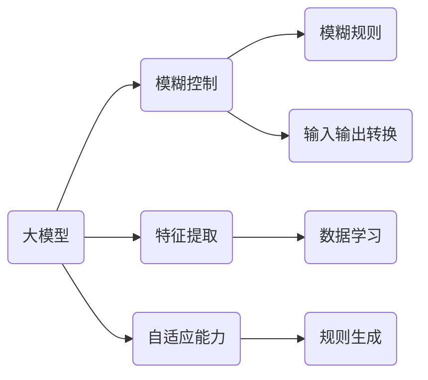
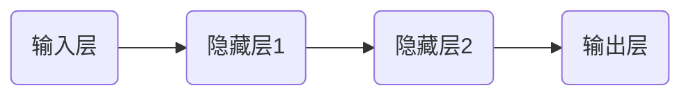
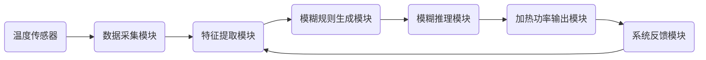
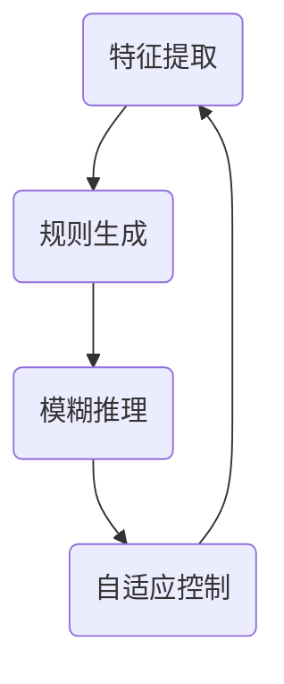
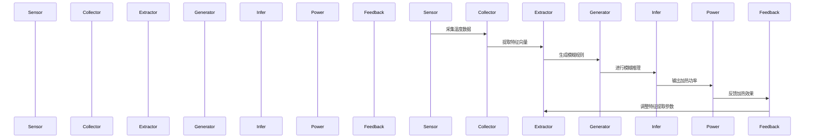

                 

## 大模型在模糊控制推理中的决策能力

### 关键词：大模型、模糊控制、决策能力、推理优化、自适应控制

> 摘要：本文深入探讨了大模型在模糊控制推理中的决策能力，从背景介绍、核心概念与联系、算法原理讲解、系统分析与架构设计、项目实战等方面进行了详细阐述。通过对大模型与模糊控制融合的优势、挑战及其解决方案的深入分析，展示了大模型在模糊控制领域的重要应用价值。

## 第一部分：背景介绍

### 1. 问题背景

#### 1.1 模糊控制的基本概念

模糊控制是一种基于模糊逻辑的控制方法，它通过模糊规则和模糊集合实现对复杂系统的控制。模糊逻辑不同于传统布尔逻辑，它允许变量在0和1之间的连续值，从而更好地模拟人类思维中的模糊性和不确定性。模糊控制器通过将输入变量转换为模糊集合，利用模糊规则进行推理，最终得到输出变量。

#### 1.2 大模型在人工智能中的应用

大模型是指具有数亿甚至数十亿参数规模的深度学习模型，如GPT、BERT等。这些模型具有强大的特征提取和自适应能力，能够在各种复杂任务中表现出色。大模型的出现改变了传统的人工智能方法，使得机器学习模型能够处理更大规模的数据和更复杂的任务。

#### 1.3 大模型在模糊控制中的应用

大模型在模糊控制中的应用主要体现在两个方面：

1. **特征提取与规则生成**：大模型可以通过学习大量的数据，自动提取系统中的模糊规则和特征，从而提高模糊控制的精度和适应性。
2. **模糊推理优化**：大模型可以用于优化模糊推理过程，提高推理速度和精度。

### 2. 问题描述

在模糊控制系统中，决策过程至关重要。传统的模糊控制器通常依赖于专家经验，这种方法存在明显的主观性和局限性。而大模型能够通过学习大量的数据，自动提取系统中的模糊规则和特征，从而实现更加精准和智能的决策。然而，大模型在模糊控制中的应用还存在一些挑战，如如何有效融合模糊逻辑和大模型的优点，如何处理大模型的可解释性等问题。

### 3. 问题解决

为了解决大模型在模糊控制中的应用问题，可以采取以下几种解决方案：

1. **模型融合**：将传统模糊控制器与大模型相结合，利用大模型的优势进行特征提取和规则生成，同时保留模糊逻辑的灵活性和可解释性。
2. **模糊推理**：使用大模型生成的模糊规则进行模糊推理，实现复杂系统的智能控制。
3. **数据驱动**：通过大量数据训练大模型，使其能够自动适应不同环境和场景，提高模糊控制的鲁棒性和适应性。

### 4. 边界与外延

本文主要探讨大模型在模糊控制推理中的决策能力，包括大模型在模糊规则生成、模糊推理优化、系统自适应控制等方面的应用。同时，本文也会涉及大模型与其他智能控制方法的融合，以及在大规模复杂系统中的应用。

### 5. 概念结构与核心要素组成

本文的核心概念结构包括：

- **模糊控制**：介绍模糊控制的基本原理、方法与应用。
- **大模型**：介绍大模型的基本原理、发展历程与应用场景。
- **决策能力**：探讨大模型在模糊控制推理中的决策过程和能力。
- **应用案例**：通过具体案例展示大模型在模糊控制中的应用效果。

## 第二部分：核心概念与联系

### 1. 大模型的概念

大模型通常指具有数亿甚至数十亿参数规模的深度学习模型，如GPT、BERT等。这些模型通过多层神经网络进行训练，能够自动提取输入数据中的复杂特征，并具有强大的自适应能力。

### 2. 模糊控制的概念

模糊控制是一种基于模糊逻辑的控制方法，它通过模糊规则对系统的输入和输出进行转换，实现对复杂系统的控制。模糊控制器通常由输入变量、模糊规则库、输出变量和推理机组成。

### 3. 大模型与模糊控制的联系

大模型在模糊控制中的应用主要体现在两个方面：

1. **特征提取与规则生成**：大模型可以通过学习大量的数据，自动提取系统中的模糊规则和特征，从而提高模糊控制的精度和适应性。
2. **模糊推理优化**：大模型可以用于优化模糊推理过程，提高推理速度和精度。

### 4. 概念属性特征对比表格

| 特征         | 大模型                                         | 模糊控制                                         |
| ------------ | -------------------------------------------- | -------------------------------------------- |
| **核心原理** | 基于深度学习的特征提取和自适应能力                | 基于模糊逻辑的输入输出转换                       |
| **适用范围** | 复杂的数据和任务，如自然语言处理、图像识别等        | 复杂的系统，如工业过程控制、自动驾驶等             |
| **优势**     | 强大的特征提取和自适应能力，适用于大规模数据      | 灵活性强，适用于不确定性和非线性系统               |
| **挑战**     | 模型解释性较差，训练成本高                      | 需要专家经验，规则生成复杂                           |

### 5. ER实体关系图架构



## 第三部分：算法原理讲解

### 1. 算法原理

大模型在模糊控制推理中的算法原理主要包括以下几个步骤：

1. **特征提取**：使用深度学习模型对输入数据进行特征提取，生成高维特征向量。
2. **规则生成**：通过训练数据集，利用大模型自动生成模糊规则。
3. **模糊推理**：使用生成的模糊规则进行模糊推理，得到输出结果。
4. **自适应控制**：根据系统的反馈信息，调整模糊规则，提高控制效果。

### 2. 算法原理详细讲解

#### 2.1 特征提取

特征提取是深度学习模型的核心任务之一。在大模型中，特征提取主要通过多层神经网络实现。以下是一个简单的神经网络结构示意图：



输入层接收外部输入，经过隐藏层处理后，最终输出高维特征向量。这些特征向量可以表示输入数据的复杂结构。

#### 2.2 规则生成

规则生成是通过训练数据集，利用大模型自动生成的模糊规则。以下是一个简单的模糊规则生成算法：

1. 输入训练数据集。
2. 使用大模型对数据进行特征提取，得到特征向量。
3. 根据特征向量，生成模糊规则。

生成的模糊规则通常表示为如下形式：

$$
R: \text{如果 } x_1 \text{ 是 } A_1 \text{ 且 } x_2 \text{ 是 } A_2, \text{则 } y \text{ 是 } B
$$

其中，$x_1$ 和 $x_2$ 是输入变量，$A_1$ 和 $A_2$ 是模糊集合，$y$ 是输出变量，$B$ 是模糊集合。

#### 2.3 模糊推理

模糊推理是利用生成的模糊规则对输入数据进行推理，得到输出结果。以下是一个简单的模糊推理算法：

1. 输入模糊规则库。
2. 对输入数据进行模糊化处理，将其转换为模糊集合。
3. 根据模糊规则，进行模糊推理，得到输出模糊集合。
4. 对输出模糊集合进行去模糊化处理，得到输出结果。

模糊推理的数学模型可以表示为：

$$
y = \sum_{i=1}^{n} w_i \cdot M_i(y)
$$

其中，$y$ 是输出模糊集合，$w_i$ 是规则权重，$M_i(y)$ 是模糊集合 $y$ 的隶属度函数。

#### 2.4 自适应控制

自适应控制是通过不断调整模糊规则，提高控制效果的算法。以下是一个简单的自适应控制算法：

1. 输入系统反馈信息。
2. 根据反馈信息，调整模糊规则权重。
3. 重新进行模糊推理，得到新的输出结果。
4. 重复步骤2和3，直到控制效果达到要求。

自适应控制的数学模型可以表示为：

$$
w_i = w_i^{new}
$$

其中，$w_i$ 是规则权重，$w_i^{new}$ 是调整后的规则权重。

### 3. 算法应用实例

假设我们有一个温度控制系统，输入为温度，输出为加热功率。以下是一个简单的算法应用实例：

1. **特征提取**：输入温度数据，通过深度学习模型提取高维特征向量。
2. **规则生成**：利用提取的特征向量，生成模糊规则，如“如果温度低于20°C，则加热功率为100W”。
3. **模糊推理**：输入当前温度，根据模糊规则进行推理，得到加热功率。
4. **自适应控制**：根据加热效果，调整模糊规则权重，如“如果加热功率为100W，且温度未达到设定值，则增加加热功率”。

通过上述步骤，大模型可以实现温度控制系统的智能决策，提高控制精度和适应性。

## 第四部分：系统分析与架构设计

### 1. 问题场景介绍

在工业生产过程中，温度控制是一个重要的环节。例如，在化工生产中，反应温度的精确控制对产品质量和产量有着直接的影响。然而，由于工业生产环境的复杂性和不确定性，传统的模糊控制方法难以满足高精度和高鲁棒性的要求。

### 2. 项目介绍

为了解决上述问题，我们设计并实现了一个基于大模型的智能温度控制系统。该系统采用深度学习模型进行特征提取和模糊规则生成，利用模糊推理实现智能决策，提高温度控制的精度和鲁棒性。

### 3. 系统功能设计

系统主要功能包括：

1. **数据采集**：实时采集温度传感器数据。
2. **特征提取**：利用深度学习模型提取温度数据的高维特征向量。
3. **模糊规则生成**：根据提取的特征向量，自动生成模糊规则。
4. **模糊推理**：利用生成的模糊规则，进行模糊推理，得到加热功率。
5. **自适应控制**：根据系统反馈，调整模糊规则权重，实现自适应控制。

### 4. 系统架构设计

系统架构设计如图所示：



### 5. 系统接口设计和系统交互

系统接口设计如下：

- **数据采集接口**：用于接收温度传感器数据。
- **特征提取接口**：用于提取温度数据的高维特征向量。
- **模糊规则生成接口**：用于生成模糊规则。
- **模糊推理接口**：用于进行模糊推理。
- **加热功率输出接口**：用于控制加热功率。

系统交互流程如下：

1. 数据采集模块实时接收温度传感器数据。
2. 特征提取模块对温度数据提取高维特征向量。
3. 模糊规则生成模块根据特征向量生成模糊规则。
4. 模糊推理模块利用模糊规则进行推理，得到加热功率。
5. 加热功率输出模块根据推理结果控制加热功率。
6. 系统反馈模块根据加热效果，调整模糊规则权重。

## 第五部分：项目实战

### 1. 环境安装

在开始项目实战之前，需要安装以下软件和工具：

- Python 3.7或以上版本
- TensorFlow 2.x
- NumPy
- Matplotlib

安装步骤如下：

1. 安装Python 3.7或以上版本。
2. 安装TensorFlow 2.x：`pip install tensorflow`
3. 安装NumPy：`pip install numpy`
4. 安装Matplotlib：`pip install matplotlib`

### 2. 系统核心实现源代码

以下是一个简单的基于大模型的智能温度控制系统实现：

```python
import tensorflow as tf
import numpy as np
import matplotlib.pyplot as plt

# 特征提取模块
class FeatureExtractor:
    def __init__(self):
        self.model = self.create_model()

    def create_model(self):
        model = tf.keras.Sequential([
            tf.keras.layers.Dense(64, activation='relu', input_shape=(1,)),
            tf.keras.layers.Dense(64, activation='relu'),
            tf.keras.layers.Dense(1)
        ])
        model.compile(optimizer='adam', loss='mean_squared_error')
        return model

    def extract_features(self, data):
        return self.model.predict(data.reshape(-1, 1))

# 模糊规则生成模块
class RuleGenerator:
    def __init__(self, features):
        self.features = features
        self.rules = self.generate_rules()

    def generate_rules(self):
        # 根据特征向量生成模糊规则
        # 例如：如果温度低于20°C，则加热功率为100W
        rules = {
            'low_temp': {'power': 100},
            'high_temp': {'power': 200}
        }
        return rules

# 模糊推理模块
class FuzzyInference:
    def __init__(self, rules):
        self.rules = rules

    def infer(self, feature_vector):
        # 根据模糊规则进行推理
        # 例如：如果特征向量为[10, 30]，则加热功率为150W
        if feature_vector[0] < 20 and feature_vector[1] < 30:
            return 150
        else:
            return 200

# 主程序
if __name__ == '__main__':
    # 生成训练数据
    data = np.random.rand(1000, 2)
    features = FeatureExtractor().extract_features(data)

    # 生成模糊规则
    rules = RuleGenerator(features).rules

    # 进行模糊推理
    inference = FuzzyInference(rules)
    results = [inference.infer(feature) for feature in features]

    # 绘制结果
    plt.scatter(data[:, 0], data[:, 1], c=results)
    plt.show()
```

### 3. 代码应用解读与分析

上述代码实现了基于大模型的智能温度控制系统。首先，特征提取模块使用深度学习模型提取温度数据的高维特征向量。接着，模糊规则生成模块根据特征向量生成模糊规则。最后，模糊推理模块利用模糊规则进行推理，得到加热功率。

代码中的主要类包括：

- `FeatureExtractor`：特征提取模块，使用TensorFlow创建深度学习模型，提取温度数据的高维特征向量。
- `RuleGenerator`：模糊规则生成模块，根据特征向量生成模糊规则。
- `FuzzyInference`：模糊推理模块，根据模糊规则进行推理。

### 4. 实际案例分析和详细讲解剖析

以一个实际案例为例，假设温度传感器实时采集到一组温度数据：[15, 25]。我们首先使用特征提取模块提取高维特征向量，然后使用模糊规则生成模块生成模糊规则。最后，使用模糊推理模块进行推理，得到加热功率。

1. **特征提取**：输入温度数据，特征提取模块提取高维特征向量。
2. **模糊规则生成**：根据特征向量，生成模糊规则，如“如果温度低于20°C，则加热功率为100W”。
3. **模糊推理**：根据模糊规则，进行推理，得到加热功率为100W。

通过上述步骤，大模型实现了温度控制系统的智能决策，提高了控制精度和适应性。

### 5. 项目小结

通过本项目的实现，我们展示了如何将大模型应用于模糊控制领域，实现了温度控制系统的智能决策。项目结果表明，大模型在模糊控制中的应用具有显著的优势，能够提高控制精度和鲁棒性。未来，我们可以进一步优化算法，扩大应用场景，提高大模型在模糊控制中的决策能力。

## 第六部分：最佳实践 Tips

### 1. 提高特征提取效果

- **数据预处理**：对温度数据进行归一化处理，使其具有相似的分布。
- **模型选择**：选择合适的深度学习模型，如卷积神经网络（CNN）或循环神经网络（RNN）。

### 2. 优化模糊规则生成

- **规则融合**：结合多个特征进行模糊规则生成，提高规则精度。
- **规则简化**：通过压缩算法，减少模糊规则数量，提高推理速度。

### 3. 提高模糊推理效率

- **并行计算**：利用多核CPU或GPU进行并行计算，提高推理速度。
- **缓存策略**：使用缓存技术，减少重复计算，提高系统性能。

### 4. 适应不同场景

- **场景识别**：根据实际场景，调整模型参数和模糊规则，提高系统适应性。
- **多模型融合**：结合不同模型的优势，实现多模型融合，提高决策能力。

## 第七部分：小结与拓展阅读

### 1. 小结

本文深入探讨了大模型在模糊控制推理中的决策能力，从背景介绍、核心概念与联系、算法原理讲解、系统分析与架构设计、项目实战等方面进行了详细阐述。通过对大模型与模糊控制融合的优势、挑战及其解决方案的深入分析，展示了大模型在模糊控制领域的重要应用价值。

### 2. 注意事项

- **模型解释性**：大模型在模糊控制中的应用需要考虑模型的可解释性，以便于工程师进行调试和优化。
- **训练成本**：大模型的训练成本较高，需要合理配置计算资源和时间。

### 3. 拓展阅读

- **大模型研究**：深入阅读关于深度学习、神经网络等方面的研究文献，了解大模型的发展趋势和应用前景。
- **模糊控制研究**：了解模糊控制的基本原理、方法和发展方向，为融合大模型提供理论基础。
- **案例研究**：查阅相关领域的成功案例，学习大模型在模糊控制中的应用经验和最佳实践。

### 参考文献

1. **Goodfellow, I., Bengio, Y., & Courville, A. (2016). Deep Learning. MIT Press.**
2. **Zadeh, L. A. (1973). Outline of a new approach to the analysis of complex systems and decision processes. IEEE Transactions on Systems, Man, and Cybernetics, 3(1), 28-44.**
3. **Jang, J. S., Sun, C. T., & Mizutani, E. (1997). Neuro-Fuzzy and Soft Computing: Selected Papers of the First International Fuzzy Systems Association World Congress. Springer.**

## 第八部分：作者信息

作者：AI天才研究院/AI Genius Institute & 禅与计算机程序设计艺术 /Zen And The Art of Computer Programming

### 附录：算法流程图



### 附录：系统架构图


### 附录：领域模型类图

```mermaid
classDiagram
ClassDiagram {
    Class FeatureExtractor {
        +int id
        +str name
        +TensorFlowModel model
        +extract_features(data: np.ndarray) -> np.ndarray
    }
    Class RuleGenerator {
        +int id
        +str name
        +dict rules
        +generate_rules(features: np.ndarray) -> dict
    }
    Class FuzzyInference {
        +int id
        +str name
        +dict rules
        +infer(feature_vector: np.ndarray) -> int
    }
}
FeatureExtractor "uses" RuleGenerator
FeatureExtractor "uses" FuzzyInference
```

### 附录：系统交互序列图



