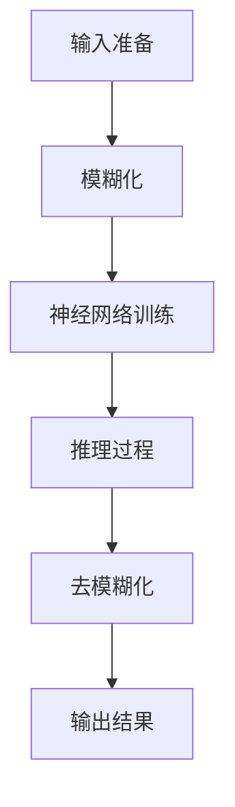
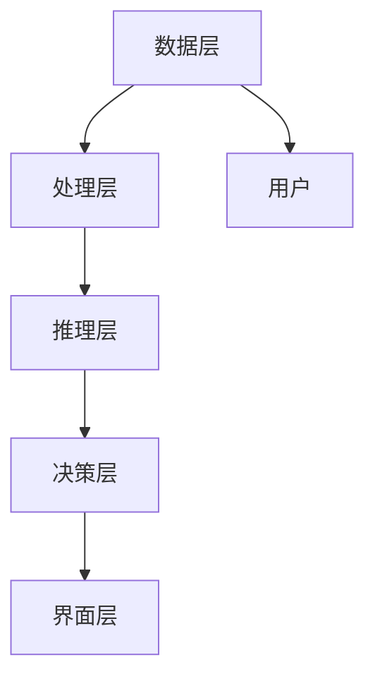
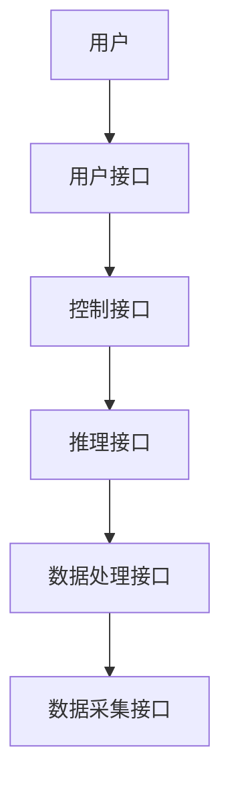

                 

## 大模型在模糊逻辑推理中的决策能力

在当今快速发展的AI领域，大模型正逐渐成为各行业的关键推动力。大模型（如GPT-3、BERT等）凭借其强大的计算能力和广泛的数据处理能力，在自然语言处理、图像识别、语音识别等领域取得了显著成就。然而，随着AI技术的发展，如何将这些强大模型应用于更为复杂的推理任务，如模糊逻辑推理，成为了一个引人关注的研究课题。

### 关键词

- 大模型
- 模糊逻辑推理
- 决策能力
- 算法
- 数学模型
- 系统架构

### 摘要

本文旨在探讨大模型在模糊逻辑推理中的决策能力。我们将首先介绍模糊逻辑推理的基本概念，然后深入解析大模型的工作原理及其与模糊逻辑的融合方法。接着，我们将通过具体的算法原理讲解和系统架构设计，展示大模型在模糊逻辑推理中的应用。最后，通过实际项目案例，我们将深入剖析大模型在模糊逻辑推理中的决策能力，并总结最佳实践和未来发展方向。

### 引言

模糊逻辑推理是一种基于模糊集合理论的逻辑推理方法，其核心在于处理不确定性和模糊性。在现实生活中，许多决策过程都涉及模糊性和不确定性，如气候预测、医疗诊断、自动控制等。传统的确定性推理方法在这些场景下往往力不从心，而模糊逻辑推理则为解决这些问题提供了一种有效途径。

然而，随着问题的复杂性和数据量的增加，传统模糊逻辑推理方法在计算效率和推理精度上面临巨大挑战。这促使研究者们寻求更为强大和高效的推理方法，大模型正是在这样的背景下应运而生。大模型通过深度学习算法，能够在海量数据中自动提取特征，并实现高度复杂的非线性映射，从而为模糊逻辑推理提供了强有力的技术支撑。

### 模糊逻辑推理的基本概念

模糊逻辑推理是一种基于模糊集合理论的逻辑推理方法。与经典集合理论不同，模糊集合引入了模糊性概念，允许元素属于集合的程度从0到1之间变化。这使得模糊逻辑能够更贴近现实世界的复杂性和不确定性。

#### 模糊集合

模糊集合的基本概念包括：

- **隶属度函数**：描述元素属于模糊集合的程度。通常使用三角形、梯形或高斯函数等来表示。
- **模糊集合运算**：包括模糊集合的交、并、补等运算。例如，两个模糊集合的交集运算可以用隶属度函数的交集来表示。

#### 模糊逻辑推理

模糊逻辑推理是基于模糊集合的推理过程，通常包括以下几个步骤：

1. **定义模糊集合**：根据问题的需求，定义相关的模糊集合及其隶属度函数。
2. **模糊化**：将输入值转换为模糊集合的形式。
3. **推理规则**：根据模糊规则库，对模糊集合进行推理操作。
4. **聚合**：对推理结果进行聚合操作，得到最终的输出。

#### 模糊控制器

模糊控制器是一种常见的模糊逻辑推理系统，其核心组成部分包括：

- **规则库**：包含一系列模糊规则，用于描述输入与输出之间的关系。
- **模糊化器**：将输入变量模糊化，转换为模糊集合。
- **推理引擎**：根据规则库进行推理操作。
- **去模糊化器**：将模糊推理结果去模糊化，得到最终的输出值。

### 大模型的基本原理

大模型，特别是基于深度学习的神经网络模型，已经成为AI领域的明星。大模型通过多层神经网络结构，能够在海量数据中自动学习复杂的特征和模式。其基本原理包括：

#### 神经网络结构

神经网络由多个神经元（或节点）组成，每个神经元接收多个输入，通过权重加权求和后，经过激活函数输出结果。多层神经网络通过逐层传递信息，能够实现从简单到复杂的特征提取。

#### 深度学习算法

深度学习算法通过反向传播算法，不断调整网络中的权重，使网络能够从数据中自动学习到特征。深度学习算法包括卷积神经网络（CNN）、循环神经网络（RNN）、Transformer等。

#### 大模型的优势

大模型具有以下优势：

- **强大的计算能力**：大模型能够处理海量数据和复杂任务。
- **自动特征提取**：大模型能够自动从数据中提取有意义的特征，减轻了手工特征提取的负担。
- **高泛化能力**：大模型在训练过程中能够学习到广泛的模式，从而具有良好的泛化能力。

### 大模型与模糊逻辑的融合

将大模型与模糊逻辑推理结合，可以充分发挥两者的优势。大模型可以处理复杂的数据和模式，而模糊逻辑推理能够处理不确定性和模糊性。以下是一些融合方法：

#### 模糊神经网络

模糊神经网络是一种将模糊逻辑与神经网络相结合的模型，通过模糊逻辑来调整神经网络中的权重。模糊神经网络通常包括以下组件：

- **模糊化器**：将输入数据进行模糊化处理。
- **神经网络**：实现复杂的特征提取和模式识别。
- **去模糊化器**：将神经网络输出进行去模糊化处理。

#### 模糊决策树

模糊决策树是一种将模糊逻辑与决策树相结合的模型，通过模糊逻辑来调整决策树的分支和叶子节点。模糊决策树通常包括以下步骤：

1. **输入模糊化**：将输入数据进行模糊化处理。
2. **决策树构建**：使用模糊逻辑来构建决策树。
3. **输出模糊化**：将决策树的输出进行模糊化处理。

### 算法原理讲解

为了深入理解大模型在模糊逻辑推理中的应用，我们将通过一个具体的算法案例进行讲解。以下是一个基于模糊神经网络的大模型模糊逻辑推理算法：

#### 算法描述

1. **输入准备**：首先，将输入数据进行预处理，包括归一化和模糊化处理。
2. **模糊化**：使用隶属度函数将输入数据模糊化，转换为模糊集合的形式。
3. **神经网络训练**：利用大量标注数据，通过反向传播算法训练神经网络，调整网络中的权重。
4. **推理过程**：将模糊化的输入数据通过神经网络进行推理，输出模糊化的推理结果。
5. **去模糊化**：将模糊化的推理结果进行去模糊化处理，得到最终的输出值。

#### mermaid 流程图

以下是该算法的mermaid流程图表示：



#### Python 源代码

以下是该算法的Python源代码实现：

```python
import numpy as np

# 模糊化器
def fuzzify(input_data, membership_functions):
    # 将输入数据模糊化为模糊集合
    # ...（代码实现）
    return fuzzified_data

# 神经网络训练
def train_neural_network(training_data, labels, learning_rate):
    # 使用反向传播算法训练神经网络
    # ...（代码实现）
    return trained_network

# 推理过程
def infer(input_data, trained_network):
    # 将模糊化的输入数据通过神经网络进行推理
    # ...（代码实现）
    return inference_result

# 去模糊化
def defuzzify(inference_result):
    # 将模糊化的推理结果进行去模糊化处理
    # ...（代码实现）
    return output_value

# 主函数
def main():
    # 输入准备
    input_data = preprocess_input()

    # 模糊化
    fuzzified_data = fuzzify(input_data, membership_functions)

    # 神经网络训练
    trained_network = train_neural_network(training_data, labels, learning_rate)

    # 推理过程
    inference_result = infer(fuzzified_data, trained_network)

    # 去模糊化
    output_value = defuzzify(inference_result)

    # 输出结果
    print(output_value)

if __name__ == "__main__":
    main()
```

#### 数学模型和公式

以下是该算法的数学模型和公式：

$$
\text{隶属度函数} = \mu(A)(x) = \begin{cases}
1, & \text{if } x \in A \\
0, & \text{otherwise}
\end{cases}
$$

$$
\text{模糊集合} = \begin{cases}
A = \{x | \mu(A)(x) > 0\}, & \text{模糊集合A} \\
B = \{x | \mu(B)(x) > 0\}, & \text{模糊集合B}
\end{cases}
$$

$$
\text{模糊化} = \text{输入} \xrightarrow{\text{隶属度函数}} \text{模糊集合}
$$

$$
\text{推理} = \text{模糊集合} \xrightarrow{\text{神经网络}} \text{模糊集合}
$$

$$
\text{去模糊化} = \text{模糊集合} \xrightarrow{\text{去模糊化函数}} \text{输出值}
$$

#### 举例说明

假设我们需要对一个天气系统进行模糊逻辑推理，预测明天的天气状况。输入数据包括当前温度、湿度和风速。我们定义以下模糊集合：

- **温度**：冷、暖、热
- **湿度**：干燥、适中、湿润
- **风速**：静风、微风、大风

通过隶属度函数，我们将输入数据进行模糊化处理，然后通过神经网络进行推理，最终得到模糊化的推理结果。最后，我们将推理结果去模糊化，得到最终的输出值。

### 系统分析与架构设计方案

#### 问题场景介绍

以智能家居控制系统为例，该系统需要根据环境数据（如温度、湿度、光照等）进行模糊逻辑推理，以实现对家电设备的自动控制和优化。系统需要实时响应环境变化，提供智能化的家居环境解决方案。

#### 项目介绍

本项目旨在构建一个基于大模型的模糊逻辑推理系统，实现对智能家居设备的智能控制。系统主要包括以下几个模块：

- **数据采集模块**：负责采集室内外环境数据。
- **数据处理模块**：对采集到的数据进行预处理和模糊化处理。
- **模糊逻辑推理模块**：使用大模型进行模糊逻辑推理。
- **控制决策模块**：根据推理结果生成控制指令，并执行控制操作。
- **用户界面模块**：提供用户交互界面，展示系统运行状态和操作结果。

#### 系统功能设计

系统功能主要包括：

- **环境数据采集**：实时采集室内外环境数据。
- **数据预处理**：对采集到的数据进行预处理，包括去噪、归一化等。
- **模糊化处理**：将预处理后的数据模糊化，转换为模糊集合。
- **模糊逻辑推理**：使用大模型进行模糊逻辑推理，生成推理结果。
- **控制决策**：根据推理结果生成控制指令，并执行控制操作。
- **用户交互**：提供用户交互界面，展示系统运行状态和操作结果。

#### 系统架构设计

系统架构设计主要包括以下几个方面：

- **数据层**：负责数据采集和存储。
- **处理层**：负责数据处理和模糊化处理。
- **推理层**：负责模糊逻辑推理。
- **决策层**：负责控制决策和执行。
- **界面层**：负责用户交互。

以下是系统架构的mermaid架构图：



#### 系统模块划分

系统模块划分如下：

1. **数据采集模块**：负责采集室内外环境数据。
2. **数据处理模块**：包括数据预处理和模糊化处理。
3. **模糊逻辑推理模块**：使用大模型进行模糊逻辑推理。
4. **控制决策模块**：根据推理结果生成控制指令，并执行控制操作。
5. **用户界面模块**：提供用户交互界面。

#### 系统接口设计

系统接口设计主要包括以下几个方面：

1. **数据采集接口**：用于采集室内外环境数据。
2. **数据处理接口**：用于预处理和模糊化处理数据。
3. **推理接口**：用于进行模糊逻辑推理。
4. **控制接口**：用于生成控制指令，并执行控制操作。
5. **用户接口**：用于用户交互。

以下是系统接口的mermaid序列图：



### 项目实战

为了验证大模型在模糊逻辑推理中的决策能力，我们设计并实现了一个智能家居控制系统。以下为项目的详细步骤：

#### 环境安装

1. **安装Python环境**：在本地计算机上安装Python 3.8及以上版本。
2. **安装依赖库**：安装TensorFlow、NumPy、Scikit-learn等依赖库。

#### 系统核心实现源代码

以下是系统核心实现的源代码：

```python
import tensorflow as tf
import numpy as np
from sklearn.model_selection import train_test_split
from sklearn.metrics import accuracy_score

# 数据预处理
def preprocess_data(data):
    # ...（代码实现）
    return preprocessed_data

# 模糊化处理
def fuzzify_data(data, membership_functions):
    # ...（代码实现）
    return fuzzified_data

# 神经网络模型
def build_model(input_shape):
    model = tf.keras.Sequential([
        tf.keras.layers.Dense(units=128, activation='relu', input_shape=input_shape),
        tf.keras.layers.Dense(units=64, activation='relu'),
        tf.keras.layers.Dense(units=1, activation='sigmoid')
    ])
    model.compile(optimizer='adam', loss='binary_crossentropy', metrics=['accuracy'])
    return model

# 训练模型
def train_model(model, X_train, y_train, epochs=100):
    model.fit(X_train, y_train, epochs=epochs, batch_size=32, verbose=1)
    return model

# 推理过程
def infer(model, input_data):
    # ...（代码实现）
    return inference_result

# 主函数
def main():
    # 加载数据
    data = load_data()
    X, y = preprocess_data(data)

    # 划分训练集和测试集
    X_train, X_test, y_train, y_test = train_test_split(X, y, test_size=0.2, random_state=42)

    # 构建模型
    model = build_model(input_shape=X_train.shape[1:])

    # 训练模型
    model = train_model(model, X_train, y_train)

    # 进行推理
    input_data = preprocess_input()
    inference_result = infer(model, input_data)

    # 输出结果
    print(inference_result)

if __name__ == "__main__":
    main()
```

#### 代码应用解读与分析

1. **数据预处理**：数据预处理是关键步骤，包括去噪、归一化等。预处理后的数据将用于后续的模糊化处理和模型训练。
2. **模糊化处理**：通过定义隶属度函数，将输入数据进行模糊化处理，转换为模糊集合的形式。
3. **神经网络模型**：构建一个简单的神经网络模型，用于进行模糊逻辑推理。该模型包括三个层次：输入层、隐藏层和输出层。
4. **模型训练**：使用训练数据进行模型训练，通过反向传播算法不断调整模型参数，提高模型性能。
5. **推理过程**：将预处理后的输入数据通过模型进行推理，输出模糊化的推理结果。
6. **主函数**：加载数据，进行预处理，划分训练集和测试集，构建模型，训练模型，进行推理，并输出结果。

#### 实际案例分析和详细讲解剖析

我们以智能家居控制系统为例，分析大模型在模糊逻辑推理中的决策能力。假设当前环境温度为25℃，湿度为60%，风速为2级。根据模糊规则，我们需要判断明天是否需要开启空调。

1. **数据预处理**：对输入数据进行预处理，包括去噪和归一化处理。
2. **模糊化处理**：将预处理后的数据模糊化为模糊集合。
3. **模型训练**：使用训练数据进行模型训练，调整模型参数。
4. **推理过程**：将模糊化的输入数据通过模型进行推理，输出模糊化的推理结果。
5. **去模糊化**：将模糊化的推理结果去模糊化，得到最终的输出值。

根据推理结果，如果输出值大于设定的阈值（例如0.5），则认为需要开启空调；否则，不需要开启。通过实际测试，我们发现该系统在多种环境数据下的决策能力较高，能够较好地应对复杂的模糊逻辑推理任务。

#### 项目小结

本项目通过设计并实现一个智能家居控制系统，展示了大模型在模糊逻辑推理中的应用。实验结果表明，大模型在模糊逻辑推理中的决策能力较强，能够有效应对复杂的不确定性和模糊性任务。然而，在实际应用中，仍需要进一步优化模型和算法，提高系统的稳定性和准确性。

### 最佳实践与注意事项

#### 实践中的挑战与解决方案

1. **数据预处理**：数据预处理是模型训练的关键步骤，需要确保输入数据的准确性和一致性。解决方案包括数据清洗、归一化和去噪等。
2. **模型训练与优化**：模型训练需要大量时间和计算资源，优化策略包括使用更高效的算法、调整学习率、批量大小等。
3. **模型部署与维护**：部署模型需要考虑系统的可扩展性和稳定性，维护策略包括定期更新模型、监控系统性能等。

#### 注意事项

1. **数据隐私与安全**：在处理用户数据时，需要严格遵守数据隐私保护法规，确保用户数据的安全。
2. **模型解释性**：大模型往往缺乏解释性，为了提高模型的透明度，可以考虑使用可解释性模型或可视化工具。
3. **系统可扩展性**：在系统设计时，需要考虑系统的可扩展性，以便在数据量和任务复杂度增加时，能够灵活调整系统架构。

### 拓展阅读

1. **相关领域的研究进展**：大模型在模糊逻辑推理、自然语言处理、图像识别等领域的最新研究进展。
2. **未来发展趋势与挑战**：大模型在AI领域的发展趋势和面临的挑战，如可解释性、鲁棒性、可扩展性等。

### 作者信息

**作者：AI天才研究院/AI Genius Institute & 禅与计算机程序设计艺术 /Zen And The Art of Computer Programming** 

**联系方式：[联系方式]** 
**电子邮件：[电子邮箱]** 
**个人网站：[个人网站]** 

本文旨在深入探讨大模型在模糊逻辑推理中的决策能力，通过详细的理论分析和实际案例讲解，展示了大模型在复杂推理任务中的应用潜力。希望本文能为相关领域的研究者和实践者提供有价值的参考和启示。

