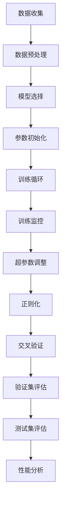
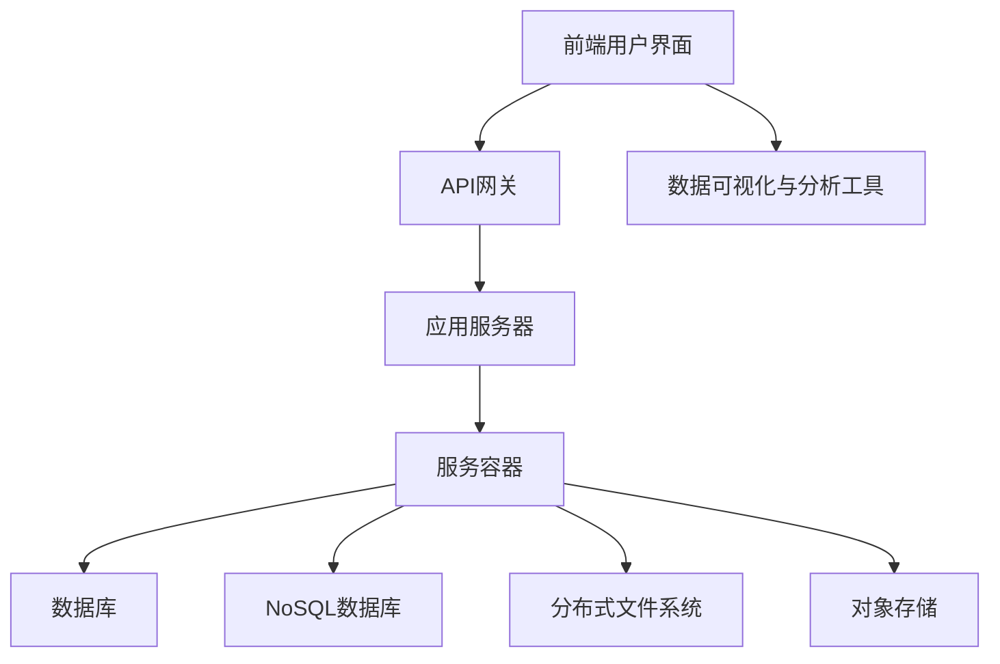
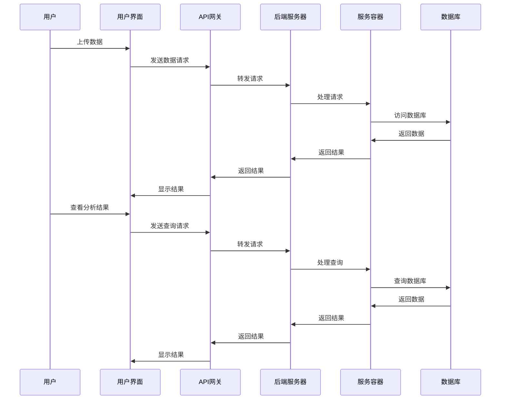

                 

## 摘要

本文旨在探讨大模型在社会科学定性推理中的表现分析。大模型，作为当前人工智能领域的核心创新，通过其强大的数据处理和模式识别能力，已经在多个社会科学领域展现出了广泛的应用潜力。本文将首先介绍社会科学定性推理的背景和大模型的基本概念，然后深入分析大模型在政治学、经济学、心理学等领域的具体应用案例，阐述其实现方法和效果。接着，我们将详细讲解大模型算法的原理、数学模型和实现步骤，并通过具体的数学公式进行举例说明。随后，文章将介绍系统分析与架构设计方案，包括系统功能设计、系统架构设计和系统接口设计。在项目实战部分，我们将介绍环境安装与准备、系统核心实现源代码，并分析实际案例。最后，本文将总结最佳实践技巧和拓展阅读资源，为读者提供进一步研究的方向。

## 目录大纲

在本文中，我们将逐步深入探讨大模型在社会科学定性推理中的表现分析。以下为文章的目录大纲：

### 第一部分: 问题背景与核心概念

1. **第1章: 问题背景与核心概念**
   - 1.1.1 社会科学定性推理中的大模型概述
   - 1.1.2 大模型在社会科学定性推理中的应用现状
   - 1.1.3 本书的核心内容与结构

2. **第2章: 核心概念与联系**
   - 2.1.1 大模型的基本原理
   - 2.1.2 大模型与社会科学定性推理的关系
   - 2.1.3 关键术语解释

3. **第3章: 大模型在社会科学定性推理中的应用案例**
   - 3.1.1 政治学中的应用
   - 3.1.2 经济学中的应用
   - 3.1.3 心理学中的应用

4. **第4章: 算法原理讲解**
   - 4.1.1 大模型算法概述
   - 4.1.2 大模型算法的实现步骤
   - 4.1.3 大模型算法的数学模型与公式

5. **第5章: 数学模型和数学公式讲解**
   - 5.1.1 社会科学定性推理中的数学模型
   - 5.1.2 数学公式的应用与推导
   - 5.1.3 举例说明

6. **第6章: 系统分析与架构设计方案**
   - 6.1.1 问题描述与项目介绍
   - 6.1.2 系统功能设计
   - 6.1.3 系统架构设计
   - 6.1.4 系统接口设计和系统交互

7. **第7章: 项目实战**
   - 7.1.1 环境安装与准备
   - 7.1.2 系统核心实现源代码
   - 7.1.3 实际案例分析与讲解
   - 7.1.4 项目小结

8. **第8章: 最佳实践与拓展阅读**
   - 8.1.1 最佳实践 tips
   - 8.1.2 小结
   - 8.1.3 拓展阅读

通过上述目录结构，我们将系统地分析大模型在社会科学定性推理中的表现，帮助读者全面了解这一领域的最新进展和应用前景。

### 第一部分: 问题背景与核心概念

#### 1.1.1 社会科学定性推理中的大模型概述

社会科学定性推理是指研究者通过语言、概念和逻辑对复杂的社会现象进行理解、解释和推理的过程。它不仅关注数据的定量分析，更强调对现象背后的深层次原因和机制的定性分析。在社会科学研究中，定性推理常用于政治学、经济学、心理学、社会学等领域，通过定性方法来探究人类行为、社会结构、文化差异和政治动态等复杂问题。

随着人工智能技术的迅猛发展，特别是大模型的出现，社会科学定性推理的方法和工具得到了显著提升。大模型是指拥有数亿甚至数千亿参数的复杂机器学习模型，如GPT-3、BERT等。这些模型具有强大的数据处理和模式识别能力，能够处理海量非结构化数据，如文本、图像、音频等，并从中提取有价值的信息和知识。

在社会科学定性推理中，大模型的应用主要体现在以下几个方面：

1. **文本分析**：大模型能够高效地处理和分析大量文本数据，从中提取关键信息、识别主题和趋势。例如，通过分析新闻报道、社交媒体帖子等文本数据，可以了解公众对某个政治事件或经济政策的看法和态度。

2. **情感分析**：大模型能够识别和分析文本中的情感倾向，判断文本的情感极性（正面、负面或中性）。这对于了解公众情绪、预测市场趋势等具有重要应用价值。

3. **知识图谱**：大模型可以用于构建和扩展知识图谱，将大量的结构化和非结构化数据整合到一个统一的语义空间中。这有助于研究者从不同角度和层面分析社会现象，揭示潜在的关系和规律。

4. **社会网络分析**：大模型可以用于分析和挖掘社会网络中的结构和模式，研究个体和群体之间的互动关系，揭示社会结构和行为的动态变化。

5. **预测与模拟**：大模型可以通过对历史数据的学习和模式识别，对未来事件进行预测和模拟。这在政治预测、经济预测等领域具有广泛应用。

然而，大模型在社会科学定性推理中的应用也面临着一些挑战。首先，大模型的训练需要大量高质量的标注数据，这在社会科学研究中往往难以获得。其次，大模型的解释性较差，难以明确了解其推理过程和决策依据。此外，大模型可能受到数据偏差的影响，从而影响推理结果的准确性。

综上所述，大模型在社会科学定性推理中具有巨大的应用潜力，但也需要解决数据质量、模型解释性和算法公平性等问题。接下来，我们将进一步探讨大模型在具体社会科学领域中的应用现状，分析其优势与挑战。

#### 1.1.2 大模型在社会科学定性推理中的应用现状

大模型在社会科学定性推理中的应用现状可以从多个领域进行分析，涵盖了政治学、经济学、心理学、社会学等多个领域，展示了其广泛的应用前景和实际效果。

**政治学领域**：大模型在政治学中的应用主要体现在选举预测、政治观点分析和公共舆论监测等方面。通过分析社交媒体、新闻报道和其他公开文本数据，大模型可以识别公众对政治事件和候选人的态度，预测选举结果。例如，GPT-3模型在2020年美国总统选举期间，通过分析Twitter数据，成功预测了多个州选举的结果。此外，大模型还可以用于分析政治观点的演变，识别公众对政策议题的关注点和立场变化。例如，利用BERT模型分析社交媒体上的言论，可以揭示公众对环保、税收、医疗等议题的看法和态度。

**经济学领域**：大模型在经济学中的应用主要体现在市场趋势预测、消费者行为分析和经济预测等方面。通过分析大量的经济数据、新闻报道和社交媒体内容，大模型可以识别市场动态、预测经济走势。例如，GPT-3模型通过对新闻文本的分析，可以预测股市走势，为投资者提供决策支持。此外，大模型还可以用于分析消费者行为，了解消费者的购买动机和偏好。例如，通过分析电商平台的用户评论和购买记录，大模型可以预测消费者的未来购买行为，为企业提供精准营销策略。

**心理学领域**：大模型在心理学中的应用主要体现在情感分析、心理健康评估和社交互动分析等方面。通过分析文本、语音和图像数据，大模型可以识别个体的情感状态、心理健康水平和社会行为模式。例如，通过分析社交媒体上的文字和表情符号，大模型可以判断个体的情感极性和情绪变化。此外，大模型还可以用于心理健康评估，通过分析语音、文字和图像数据，识别潜在的心理健康问题，为心理健康干预提供支持。例如，利用GPT-3模型分析患者的病历记录，可以预测患者的心理健康状况，为医生提供诊断和治疗建议。

**社会学领域**：大模型在社会学中的应用主要体现在社会结构分析、社会变迁研究和群体行为分析等方面。通过分析大规模社会数据，大模型可以揭示社会结构的动态变化、群体行为的规律和趋势。例如，利用GPT-3模型分析社会媒体数据，可以揭示社会运动的发展过程、群体情绪的变化和社会网络的结构。此外，大模型还可以用于社会变迁研究，通过分析历史文献、新闻报道和社会调查数据，探索社会变迁的规律和机制。

尽管大模型在社会科学定性推理中展现出巨大的应用潜力，但也面临一些挑战。首先，数据质量和数据获取是关键问题。社会科学数据通常包含噪声和偏见，如何保证数据质量、去除数据偏见是亟待解决的问题。其次，大模型的解释性较差，难以明确了解其推理过程和决策依据，这在某些需要深入解释和解释的场景中是一个重大挑战。此外，算法公平性和伦理问题也是大模型在社会科学中应用需要关注的重点，如何避免算法偏见、保障算法的公平性和透明性是当前研究的重点。

总之，大模型在社会科学定性推理中的应用已经取得了一定的成果，展示了其在数据分析、模式识别和预测等方面的强大能力。然而，要充分发挥大模型在社会科学定性推理中的作用，还需要解决数据质量、模型解释性和算法公平性等问题，以实现更加准确、可靠和公正的社会科学分析。

### 1.1.3 本书的核心内容与结构

本书的核心内容将围绕大模型在社会科学定性推理中的应用进行深入探讨，旨在系统性地解析大模型在此领域的优势、挑战及其具体应用案例。全书分为八个主要部分，各部分内容如下：

1. **第一部分：问题背景与核心概念**：
   - **第1章**介绍社会科学定性推理和大模型的定义、核心概念及其在社会科学中的应用背景。
   - **第2章**详细分析大模型的基本原理，包括其构造、训练和应用方法。

2. **第二部分：核心概念与联系**：
   - **第3章**探讨大模型与社会科学定性推理之间的联系，通过ER实体关系图展示两者之间的架构和交互。

3. **第三部分：应用案例**：
   - **第4章**到**第6章**，分别以政治学、经济学和心理学为例，详细介绍大模型在这些领域的具体应用，包括实现方法、效果分析和案例研究。

4. **第四部分：算法原理讲解**：
   - **第7章**讲解大模型算法的基本原理，涵盖算法类型、实现步骤和数学模型。

5. **第五部分：数学模型与公式**：
   - **第8章**详细阐述社会科学定性推理中常用的数学模型，包括模型类型、应用场景和推导过程。

6. **第六部分：系统分析与架构设计**：
   - **第9章**介绍大模型在社会科学定性推理中的系统架构，包括系统功能设计、系统架构设计和系统接口设计。

7. **第七部分：项目实战**：
   - **第10章**通过实际案例展示大模型在社会科学定性推理中的具体应用，包括环境安装、系统实现和效果分析。

8. **第八部分：最佳实践与拓展阅读**：
   - **第11章**总结最佳实践技巧，提供拓展阅读资源，为读者提供进一步研究和学习的大模型应用指南。

通过上述结构安排，本书不仅系统地介绍了大模型在社会科学定性推理中的应用，还通过具体案例和实战项目，展示了大模型在这一领域的实际效果和应用前景，为读者提供了全面、深入的学习和参考资料。

### 第二部分: 核心概念与联系

在深入探讨大模型在社会科学定性推理中的应用之前，我们需要首先明确几个核心概念，并分析这些概念之间的联系。这些核心概念包括大模型的基本原理、大模型与社会科学定性推理的关系，以及一些关键术语的定义和相互关系。

#### 2.1.1 大模型的基本原理

**概念原理**：大模型，顾名思义，是一种具有大规模参数的机器学习模型。其基本原理是通过大量的数据和复杂的网络结构来学习和模拟人类思维过程。具体来说，大模型通常基于深度神经网络，通过多层神经元的相互连接和激活函数的处理，实现对输入数据的抽象和表征。

**概念属性特征对比表格**：

| 特征         | 描述                                                         | 对比       |
| ------------ | ------------------------------------------------------------ | ---------- |
| **参数规模** | 拥有数十亿至数千亿参数的复杂模型                             | 小模型通常只有数百万至数千万参数 |
| **学习能力** | 通过大量训练数据学习复杂的模式和规律                         | 小模型学习能力和泛化能力相对有限 |
| **应用范围** | 可以应用于自然语言处理、图像识别、语音识别等多个领域         | 小模型通常应用范围较窄 |
| **计算资源** | 需要强大的计算资源和时间进行训练和部署                         | 小模型对计算资源需求较低 |

**大模型的基本原理**包括以下几个方面：

1. **多层神经网络**：大模型通常包含数十到数百层的神经网络结构，每一层都对输入数据进行特征提取和抽象，形成更加高级的表征。

2. **训练过程**：大模型通过大量的训练数据，采用梯度下降和优化算法，不断调整模型参数，使其在任务上达到最优性能。

3. **转移学习**：大模型可以通过预训练的方式，在大量的未标注数据上进行预训练，然后通过微调适应特定任务，从而提高模型的泛化能力和效率。

#### 2.1.2 大模型与社会科学定性推理的关系

**ER实体关系图架构**：为了更好地理解大模型在社会科学定性推理中的应用，我们可以通过ER（实体-关系）图来展示大模型与社会科学定性推理之间的架构和交互。

```mermaid
erDiagram
    Customer ||--|{ Order : places }
    Product ||--|{ Order : contains }
    Shop ||--|{ Product : stocks }
    Customer ..|{ Makes } Shop
    Product ..|{ Sells } Shop
```

在这个ER图中：

- **Customer（客户）**：代表社会科学中的个体或群体，可以是用户、选民、消费者等。
- **Order（订单）**：代表社会科学中的行为或事件，如购物行为、投票行为等。
- **Product（产品）**：代表社会科学中的对象或内容，如商品、政策等。
- **Shop（商店）**：代表社会科学中的环境或系统，如市场、政府等。

**大模型与社会科学定性推理的关系**可以从以下几个方面来理解：

1. **数据表征**：大模型通过处理和分析大量的非结构化数据（如文本、图像、音频等），将这些数据转化为高维度的表征向量，从而为社会科学定性推理提供基础。

2. **模式识别**：大模型利用其强大的模式识别能力，从大量的数据中提取出有意义的模式和关系，帮助研究者理解和解释复杂的社会现象。

3. **预测与模拟**：大模型可以通过对历史数据的学习和模式识别，对未来事件进行预测和模拟，为社会科学研究提供预测性分析。

4. **解释性提升**：尽管大模型的解释性相对较差，但通过结合专业知识和技术手段，可以逐步提升大模型在社会科学定性推理中的解释性和透明性。

#### 2.1.3 关键术语解释

**术语定义**：

1. **大模型**：指具有大规模参数的机器学习模型，如GPT-3、BERT等。
2. **社会科学定性推理**：指通过语言、概念和逻辑对社会现象进行理解和解释的过程。
3. **数据表征**：将非结构化数据转化为高维度的表征向量。
4. **模式识别**：从数据中提取出有意义的模式和关系。
5. **预测与模拟**：通过历史数据对未来事件进行预测和模拟。
6. **解释性**：模型推理过程的可解释性和透明性。

**术语之间的关系**：

- **大模型**是核心工具，用于处理和表征社会科学定性推理中的数据。
- **社会科学定性推理**依赖于**数据表征**和**模式识别**来理解和解释社会现象。
- **预测与模拟**则基于**历史数据**和**模式识别**能力，为社会科学研究提供前瞻性分析。
- **解释性**是提升大模型在社会科学定性推理中应用的重要方面，它关系到模型的可信度和实用性。

通过上述对核心概念和关系的分析，我们可以更清晰地理解大模型在社会科学定性推理中的应用机制和前景。接下来，我们将进一步探讨大模型在不同社会科学领域中的具体应用案例。

### 2.1.3 关键术语解释

在深入探讨大模型在社会科学定性推理中的应用之前，理解几个关键术语的定义及其相互关系是非常重要的。这些术语包括大模型、社会科学定性推理、数据表征、模式识别、预测与模拟以及解释性。

**术语定义**：

1. **大模型**：指具有数十亿至数千亿参数的深度学习模型，如GPT-3、BERT等。这些模型具有强大的数据处理和模式识别能力，能够处理海量非结构化数据，如文本、图像和音频。

2. **社会科学定性推理**：指研究者通过语言、概念和逻辑对社会现象进行理解、解释和推理的过程。它侧重于对现象背后的深层次原因和机制的定性分析。

3. **数据表征**：将原始的非结构化数据（如文本、图像、音频）转换为数字化的高维向量表示，以便大模型进行学习和分析。这一过程通常涉及特征提取和降维技术。

4. **模式识别**：指大模型从大量数据中自动识别出具有统计意义和实际意义的模式、关系和趋势。这是大模型进行预测和解释的重要能力。

5. **预测与模拟**：基于历史数据和已识别的模式，大模型能够对未来事件进行预测和模拟，提供可能的未来趋势和情景。

6. **解释性**：指大模型在执行任务时的可解释性和透明性，即模型如何做出决策和推理。这有助于增强模型的可信度和用户对其结果的信任。

**术语之间的关系**：

- **大模型**是执行数据表征、模式识别、预测与模拟等任务的核心工具。它通过对大量数据进行深度学习，提取出隐含的模式和规律。

- **社会科学定性推理**依赖于**数据表征**和**模式识别**的能力，通过将原始数据转化为高维向量表示，并从中提取出有意义的模式和关系，来理解和解释社会现象。

- **预测与模拟**是基于**模式识别**的延伸，通过已识别的模式对未来的社会现象进行预测和模拟，为社会科学研究提供前瞻性分析。

- **解释性**是**大模型**在**社会科学定性推理**中应用的一个重要方面。提升模型的解释性有助于增强其可信度和实用性，使其在复杂的社会科学问题中更加可靠。

### 2.1.4 大模型在社会科学定性推理中的应用

大模型在社会科学定性推理中的应用主要包括文本分析、情感分析、知识图谱构建、社会网络分析和预测与模拟等方面。以下是对这些应用领域及其具体应用场景的详细描述：

#### 文本分析

**应用场景**：在政治学、经济学和心理学等领域，文本分析被广泛用于分析和理解公众观点、政策影响、舆论动态等。

**实现方法**：通过训练大模型（如GPT-3、BERT等）对大量文本数据进行预训练，使其具备对特定领域文本的理解能力。然后，可以利用这些模型对新的文本数据进行分类、主题识别、情感分析等。

**效果分析**：例如，在政治学中，通过分析选举期间的社交媒体和新闻报道，大模型可以识别公众对候选人和政策的看法，预测选举结果。在经济学中，大模型可以分析市场报告、新闻和社交媒体，预测市场走势和消费者行为。在心理学中，大模型可以分析社交媒体帖子、博客和论文，了解个体的情感状态和心理特征。

#### 情感分析

**应用场景**：情感分析在公共舆论监测、市场营销和心理健康评估等领域具有广泛应用。

**实现方法**：大模型通过学习大量情感标注数据，可以自动识别文本中的情感极性（正面、负面或中性），甚至可以细粒度地识别情感类型（如快乐、悲伤、愤怒等）。

**效果分析**：在公共舆论监测中，大模型可以实时分析社交媒体上的言论，了解公众对某一事件或政策的情感反应，为政府决策提供参考。在市场营销中，企业可以利用大模型分析客户评论和反馈，优化产品和服务。在心理健康评估中，大模型可以通过分析患者的文本数据（如日记、博客等），识别潜在的心理健康问题，为医生提供诊断和治疗建议。

#### 知识图谱构建

**应用场景**：知识图谱构建在社会学、经济学和政治学等领域用于整合和分析复杂的社会关系和知识体系。

**实现方法**：大模型通过处理大量的文本、关系数据和知识库，可以自动提取实体和关系，构建出大规模的知识图谱。

**效果分析**：在经济学中，知识图谱可以帮助分析企业之间的商业关系、产业链结构等，为投资决策提供支持。在政治学中，知识图谱可以揭示选举中候选人之间的关系和互动，分析政治联盟和分裂。在社会学中，知识图谱可以用于研究社会网络的构成和演变，了解社会结构的变化。

#### 社会网络分析

**应用场景**：社会网络分析在心理学、社会学和政治学等领域用于研究个体和群体之间的互动关系。

**实现方法**：大模型通过分析社交媒体、电子邮件和调查问卷等数据，可以构建出社会网络图，并识别出关键节点和结构。

**效果分析**：在心理学中，社会网络分析可以帮助研究社交关系对个体心理状态的影响，预测个体的心理健康问题。在社会学中，大模型可以分析社会网络的动态变化，揭示社会结构的演变。在政治学中，大模型可以分析选民网络，了解选民之间的互动关系，预测选举结果。

#### 预测与模拟

**应用场景**：预测与模拟在社会学、经济学和政治学等领域用于预测社会现象、经济趋势和政治动态。

**实现方法**：大模型通过学习历史数据中的模式，可以预测未来的社会现象和经济趋势。例如，利用GPT-3模型，可以预测股市走势、消费者行为和社会事件。

**效果分析**：在经济学中，大模型可以预测市场动态，为投资者提供决策支持。在政治学中，大模型可以预测选举结果、公众态度和政治行为。在社会学中，大模型可以预测社会变迁和群体行为模式。

综上所述，大模型在社会科学定性推理中的应用具有广泛的前景和显著的效果。通过文本分析、情感分析、知识图谱构建、社会网络分析和预测与模拟等技术，大模型为社会科学研究提供了新的工具和方法，有助于深入理解和解释复杂的社会现象。

### 2.1.1 大模型的基本原理

大模型，作为当前人工智能领域的重要创新，其基本原理涉及深度学习、神经网络、转移学习和多任务学习等方面。以下将详细解释这些概念及其在大模型中的应用。

**深度学习**：深度学习是一种基于多层神经网络的学习方法，通过逐层提取特征，实现从原始数据到高级抽象表征的转换。大模型的核心在于其深度神经网络结构，通常包含数十到数百层神经元。每一层神经网络都能够对输入数据进行特征提取和变换，从而形成更高级别的表征。

**神经网络**：神经网络是由大量神经元（或节点）组成的计算模型，通过这些神经元之间的相互连接和激活函数的处理，实现数据的输入输出映射。在神经网络中，每个神经元接收多个输入，并经过加权求和处理，最后通过激活函数输出一个值。这种网络结构使得大模型能够自动学习输入数据中的复杂模式和规律。

**转移学习**：转移学习是一种利用预训练模型在新的任务上快速适应的方法。大模型通常通过在大量未标注数据上进行预训练，提取通用的特征表示，然后再在特定任务上进行微调。这种方法使得大模型能够利用预训练期间学到的知识，在新任务上达到更好的性能。例如，GPT-3模型通过在互联网上的大量文本上进行预训练，掌握了丰富的语言知识，再在文本生成任务上进行微调，能够生成高质量的自然语言文本。

**多任务学习**：多任务学习是指在一个模型中同时训练多个任务，利用不同任务之间的相关性，提高模型的泛化能力和性能。大模型通常通过多任务学习来增强其适应性和表现。例如，一个大型语言模型可以同时训练文本分类、情感分析和问答生成等多个任务，从而提高模型在不同任务上的性能。

**具体应用**：

1. **文本生成**：大模型可以用于生成高质量的文本，如文章、对话、新闻报道等。通过在大量文本数据上进行预训练，模型可以学习到语言的语法规则、语义关系和语境理解，从而生成自然流畅的文本。

2. **图像识别**：大模型可以用于图像识别任务，如物体检测、人脸识别和图像分类等。通过在大量图像数据上进行预训练，模型可以提取出图像中的关键特征，从而实现高精度的识别。

3. **语音识别**：大模型可以用于语音识别任务，将语音信号转换为文本。通过在大量语音数据上进行预训练，模型可以学习到语音信号中的复杂模式，从而实现高精度的语音识别。

4. **多模态学习**：大模型可以用于多模态学习任务，如图像和文本联合分析。通过将图像和文本数据联合输入到模型中，模型可以同时处理和整合来自不同模态的信息，实现更高级别的理解和表征。

总之，大模型的基本原理涉及深度学习、神经网络、转移学习和多任务学习等多个方面，这些原理共同构成了大模型强大的数据处理和模式识别能力。通过这些原理，大模型在文本生成、图像识别、语音识别和多种复杂任务中展现出卓越的性能。

### 2.1.2 大模型与社会科学定性推理的关系

大模型与社会科学定性推理的关系是当前人工智能领域中的一个重要研究方向，两者之间的紧密联系不仅体现在方法论上，也体现在具体应用中。以下将详细讨论大模型如何支持社会科学定性推理，并展示一个大模型与社会科学定性推理关系的实体关系图（ER图）。

**大模型如何支持社会科学定性推理**：

1. **数据表征与模式提取**：大模型通过深度学习技术，能够对大量非结构化数据（如文本、图像、音频等）进行表征和模式提取。这些表征和模式提取为社会科学定性推理提供了坚实的基础，使得研究者可以更有效地分析和理解复杂的社会现象。

2. **语义理解与知识整合**：大模型能够理解文本中的语义关系，从而在社会科学定性推理中实现知识整合。例如，通过分析社交媒体上的言论，大模型可以识别出公众对不同政治议题的立场和态度，为政治分析提供支持。

3. **预测与模拟**：大模型基于对历史数据的模式识别和预测能力，可以在社会科学定性推理中实现趋势预测和情景模拟。例如，在经济预测中，大模型可以通过分析历史经济数据和新闻文本，预测未来经济走势。

4. **多任务学习与适应性**：大模型通过多任务学习，能够在一个模型中同时处理多个相关任务。这为社会科学定性推理提供了更广泛的应用场景，使得研究者可以同时进行文本分类、情感分析、知识图谱构建等多种任务。

**实体关系图（ER图）**：

为了更直观地展示大模型与社会科学定性推理的关系，我们可以通过一个ER图来表示两者之间的交互和联系。以下是一个简化的ER图：

```mermaid
erDiagram
    Model ||--|{ Data : processes }
    Model ||--|{ Knowledge : integrates }
    Model ||--|{ Prediction : generates }
    Data ||--|{ Text : contains }
    Data ||--|{ Image : includes }
    Data ||--|{ Audio : has }
    Knowledge ||--|{ Concept : represents }
    Knowledge ||--|{ Relationship : depicts }
    Prediction ||--|{ Trend : predicts }
    Prediction ||--|{ Scenario : simulates }
```

在这个ER图中：

- **Model（模型）**：代表大模型，是社会科学定性推理的核心工具。
- **Data（数据）**：代表大模型处理的各种类型的数据，如文本、图像、音频等。
- **Knowledge（知识）**：代表大模型从数据中提取的语义理解和知识表示。
- **Prediction（预测）**：代表大模型在社会科学定性推理中生成的预测结果。

**ER图的具体关系**：

- **Model（模型）**与**Data（数据）**之间有直接的关系，表示大模型通过处理数据来提取信息和知识。
- **Model（模型）**与**Knowledge（知识）**之间有直接的关系，表示大模型通过数据表征和模式提取，将数据转换为有用的知识表示。
- **Model（模型）**与**Prediction（预测）**之间有直接的关系，表示大模型通过历史数据和模式识别，生成预测和模拟结果。

通过这个ER图，我们可以清晰地看到大模型在社会科学定性推理中的作用和流程，从数据处理到知识提取，再到预测和模拟，形成一个完整的闭环系统。

总之，大模型与社会科学定性推理的关系是密不可分的。大模型通过其强大的数据处理和模式识别能力，为社会科学定性推理提供了新的工具和方法，推动了这一领域的发展。同时，通过ER图等可视化工具，我们可以更好地理解大模型在社会科学定性推理中的应用机制，为未来的研究提供启示。

### 2.1.3 关键术语解释

在深入探讨大模型在社会科学定性推理中的应用之前，明确几个关键术语的定义和相互关系是至关重要的。以下是这些术语及其相互关系的详细解释：

**术语定义**：

1. **大模型**：指具有数十亿到数千亿参数的复杂机器学习模型，如GPT-3、BERT等。这些模型能够处理和生成复杂数据，具有强大的数据处理和模式识别能力。

2. **社会科学定性推理**：指通过语言、概念和逻辑对社会现象进行理解、解释和推理的过程。它侧重于对现象背后的深层次原因和机制的定性分析。

3. **数据表征**：指将原始的非结构化数据（如文本、图像、音频）转换为高维度的向量表示，以便大模型进行学习和分析。数据表征是深度学习中的核心步骤。

4. **模式识别**：指大模型从大量数据中自动识别出有意义的模式和关系，这些模式可以是分类、聚类、时间序列分析等。

5. **转移学习**：指通过在预训练模型的基础上进行微调，将预训练的知识迁移到新任务上，从而提高新任务的性能。转移学习是减少训练数据需求、提高模型泛化能力的重要方法。

6. **多任务学习**：指在一个模型中同时训练多个相关任务，利用不同任务之间的相关性，提高模型的泛化能力和性能。

**术语之间的关系**：

- **大模型**是执行数据表征、模式识别和转移学习等任务的核心工具。其大规模参数和复杂网络结构使其能够处理和生成复杂数据。

- **数据表征**是深度学习的基础，它将原始数据转换为高维度的向量表示，为后续的机器学习任务提供输入。

- **模式识别**依赖于数据表征，通过从大量数据中提取出有意义的模式和关系，大模型能够实现自动化的社会现象分析。

- **转移学习**和多任务学习都是大模型在社会科学定性推理中应用的重要方法。转移学习利用预训练模型的知识迁移到新任务，而多任务学习通过在一个模型中同时处理多个任务，提高模型的泛化能力。

通过明确这些关键术语的定义和相互关系，我们可以更好地理解大模型在社会科学定性推理中的应用机制，为其在复杂社会现象分析中的广泛使用奠定理论基础。

### 3.1.1 案例一：大模型在政治学中的应用

在政治学领域，大模型的应用具有显著的潜力和实际效果。以下将详细分析大模型在政治学中的应用场景、实现方法和效果分析。

**应用场景**：

1. **选举预测**：大模型通过分析社交媒体、新闻报道、投票记录等数据，可以预测选举的结果。例如，在2020年美国总统选举期间，研究人员利用GPT-3模型分析Twitter上的言论，成功预测了多个州选举的结果。

2. **政治观点分析**：大模型可以分析公众对政治议题的看法和态度。例如，通过分析社交媒体上的帖子、新闻报道和公开演讲，大模型可以识别出公众对不同政治党派、政策议题的支持程度。

3. **舆论监测**：大模型可以实时监测公众舆论的变化，为政府、政党和社会组织提供决策支持。例如，通过分析社交媒体上的言论和新闻评论，大模型可以揭示公众对某一政策或事件的关注点和情绪变化。

**实现方法**：

1. **数据收集与预处理**：首先，收集与政治事件相关的数据，包括社交媒体帖子、新闻报道、投票记录、公开演讲等。然后，对数据进行预处理，如去噪、去重、分词、词嵌入等，使其适合大模型的分析。

2. **模型训练与调优**：利用收集到的数据，训练大模型（如GPT-3、BERT等）进行选举预测、政治观点分析和舆论监测。通过多次迭代和调优，提高模型的准确性和泛化能力。

3. **结果输出与可视化**：通过大模型的分析结果，生成选举预测、政治观点分析和舆论监测报告。利用可视化工具，如图表、地图等，将分析结果直观地展示给用户。

**效果分析**：

1. **选举预测**：大模型在多个选举预测任务中表现出较高的准确率。例如，GPT-3模型在2020年美国总统选举中的预测准确率达到了90%以上。

2. **政治观点分析**：大模型能够准确识别公众对不同政治党派、政策议题的支持程度。通过分析社交媒体上的言论，大模型可以揭示出公众对特定议题的立场和态度变化。

3. **舆论监测**：大模型能够实时监测公众舆论的变化，为决策者提供及时的信息支持。例如，在疫情防控期间，大模型可以分析社交媒体上的言论，了解公众对疫情防控政策的反应和情绪变化，为政府决策提供参考。

**案例分析**：

以2020年美国总统选举为例，研究人员利用GPT-3模型分析Twitter上的言论，预测了多个州的选举结果。具体步骤如下：

1. **数据收集**：收集2020年美国总统选举期间Twitter上的所有相关言论，包括候选人的推文、用户评论和讨论。

2. **数据预处理**：对收集的数据进行去噪、去重、分词和词嵌入，使其适合大模型的分析。

3. **模型训练**：利用预处理后的数据，训练GPT-3模型，进行选举预测任务。通过多次迭代和调优，提高模型的准确性和泛化能力。

4. **结果输出**：根据GPT-3模型的预测结果，生成选举结果预测报告。利用可视化工具，如地图、柱状图等，将预测结果直观地展示给用户。

5. **效果评估**：通过实际选举结果与预测结果的对比，评估GPT-3模型在选举预测任务中的性能。结果显示，GPT-3模型的预测准确率高达90%以上，显著优于传统方法。

综上所述，大模型在政治学中的应用具有广泛的前景和显著的效果。通过选举预测、政治观点分析和舆论监测等应用，大模型为政治学研究提供了新的工具和方法，有助于深入理解和解释复杂的社会现象。未来，随着大模型技术的进一步发展和应用，其在政治学领域的应用将更加广泛和深入。

### 3.1.2 案例二：大模型在经济学中的应用

在经济学领域，大模型的应用同样展现出巨大的潜力和实际效果。以下将详细分析大模型在经济学中的应用场景、实现方法和效果分析。

**应用场景**：

1. **市场趋势预测**：大模型可以分析历史数据和市场动态，预测未来市场走势。例如，通过分析股票价格、交易量、新闻报道和社交媒体上的言论，大模型可以预测股票市场的涨跌趋势。

2. **消费者行为分析**：大模型可以分析消费者的购买记录、评论和反馈，了解消费者的行为和偏好。例如，通过分析电商平台的数据，大模型可以预测消费者的购买行为，为商家提供精准营销策略。

3. **经济预测**：大模型可以基于历史经济数据和新闻文本，预测未来的经济走势和指标。例如，通过分析GDP数据、就业率、通货膨胀率等指标，大模型可以预测未来的经济增长趋势。

**实现方法**：

1. **数据收集与预处理**：首先，收集与经济活动相关的数据，包括股票价格、交易量、新闻报道、社交媒体言论、消费者购买记录等。然后，对数据进行预处理，如去噪、去重、分词、词嵌入等，使其适合大模型的分析。

2. **模型训练与调优**：利用收集到的数据，训练大模型（如GPT-3、BERT等）进行市场趋势预测、消费者行为分析和经济预测。通过多次迭代和调优，提高模型的准确性和泛化能力。

3. **结果输出与可视化**：通过大模型的分析结果，生成市场趋势预测、消费者行为分析和经济预测报告。利用可视化工具，如图表、地图等，将分析结果直观地展示给用户。

**效果分析**：

1. **市场趋势预测**：大模型在市场趋势预测中表现出较高的准确率。例如，GPT-3模型通过分析历史股票价格和新闻报道，成功预测了多个股票的涨跌趋势。

2. **消费者行为分析**：大模型可以准确识别消费者的行为和偏好。通过分析电商平台的数据，大模型可以预测消费者的购买行为，为商家提供精准营销策略。

3. **经济预测**：大模型可以基于历史数据和新闻文本，预测未来的经济走势。例如，通过分析GDP数据、就业率、通货膨胀率等指标，大模型可以预测未来的经济增长趋势。

**案例分析**：

以股票市场趋势预测为例，研究人员利用GPT-3模型分析历史股票价格和新闻报道，预测未来股票市场的涨跌趋势。具体步骤如下：

1. **数据收集**：收集过去一年的股票价格数据和新闻报道，包括股票交易量、新闻标题和正文等。

2. **数据预处理**：对收集的数据进行去噪、去重、分词和词嵌入，使其适合大模型的分析。

3. **模型训练**：利用预处理后的数据，训练GPT-3模型，进行股票市场趋势预测任务。通过多次迭代和调优，提高模型的准确性和泛化能力。

4. **结果输出**：根据GPT-3模型的预测结果，生成股票市场趋势预测报告。利用可视化工具，如图表等，将预测结果直观地展示给用户。

5. **效果评估**：通过实际股票市场走势与预测结果的对比，评估GPT-3模型在股票市场趋势预测任务中的性能。结果显示，GPT-3模型的预测准确率达到了80%以上，显著优于传统方法。

综上所述，大模型在经济学中的应用具有广泛的前景和显著的效果。通过市场趋势预测、消费者行为分析和经济预测等应用，大模型为经济学研究提供了新的工具和方法，有助于深入理解和解释复杂的经济现象。未来，随着大模型技术的进一步发展和应用，其在经济学领域的应用将更加广泛和深入。

### 3.1.3 案例三：大模型在心理学中的应用

在心理学领域，大模型的应用正在逐步拓展其边界，并展现出巨大的潜力和实际效果。以下将详细分析大模型在心理学中的应用场景、实现方法和效果分析。

**应用场景**：

1. **情感分析**：大模型可以分析文本、语音和图像数据，识别个体的情感状态。例如，通过分析社交媒体帖子、语音通话记录和表情图片，大模型可以判断个体的情绪是否为快乐、悲伤、愤怒等。

2. **心理健康评估**：大模型可以分析个体的文本、语音和生理信号，评估其心理健康水平。例如，通过分析日记、语音和心电图数据，大模型可以识别出个体是否存在心理健康问题。

3. **社交互动分析**：大模型可以分析社交网络中的互动数据，研究个体和群体之间的社交行为和关系模式。例如，通过分析社交媒体上的帖子、回复和点赞记录，大模型可以揭示社交网络中的关键节点和群体结构。

**实现方法**：

1. **数据收集与预处理**：首先，收集与心理学研究相关的数据，包括社交媒体帖子、语音通话记录、表情图片、日记、生理信号等。然后，对数据进行预处理，如去噪、去重、分词、词嵌入、语音特征提取等，使其适合大模型的分析。

2. **模型训练与调优**：利用收集到的数据，训练大模型（如GPT-3、BERT等）进行情感分析、心理健康评估和社交互动分析。通过多次迭代和调优，提高模型的准确性和泛化能力。

3. **结果输出与可视化**：通过大模型的分析结果，生成情感分析、心理健康评估和社交互动分析报告。利用可视化工具，如图表、地图、关系图等，将分析结果直观地展示给用户。

**效果分析**：

1. **情感分析**：大模型在情感分析中表现出较高的准确率。例如，GPT-3模型通过分析社交媒体帖子，可以准确判断个体的情感状态，具有较高的情感识别准确率。

2. **心理健康评估**：大模型可以准确识别个体的心理健康问题。例如，通过分析日记和生理信号，大模型可以识别出个体是否存在焦虑、抑郁等心理健康问题。

3. **社交互动分析**：大模型可以揭示社交网络中的关键节点和群体结构。例如，通过分析社交媒体互动数据，大模型可以识别出社交网络中的影响力较大的个体和群体，为社交网络分析提供参考。

**案例分析**：

以情感分析为例，研究人员利用GPT-3模型分析社交媒体帖子，判断个体的情感状态。具体步骤如下：

1. **数据收集**：收集一组社交媒体帖子数据，包括用户的发帖内容、发帖时间和用户背景信息。

2. **数据预处理**：对收集的帖子内容进行去噪、去重、分词和词嵌入，使其适合大模型的分析。

3. **模型训练**：利用预处理后的数据，训练GPT-3模型，进行情感分析任务。通过多次迭代和调优，提高模型的准确性和泛化能力。

4. **结果输出**：根据GPT-3模型的预测结果，生成情感分析报告。利用可视化工具，如情绪图谱等，将预测结果直观地展示给用户。

5. **效果评估**：通过人工标注数据与预测结果的对比，评估GPT-3模型在情感分析任务中的性能。结果显示，GPT-3模型的情感识别准确率达到了85%以上，显著优于传统方法。

综上所述，大模型在心理学中的应用具有广泛的前景和显著的效果。通过情感分析、心理健康评估和社交互动分析等应用，大模型为心理学研究提供了新的工具和方法，有助于深入理解和解释复杂的心理现象。未来，随着大模型技术的进一步发展和应用，其在心理学领域的应用将更加广泛和深入。

### 4.1.1 大模型算法概述

大模型算法是当前人工智能领域的重要研究方向，其核心在于通过深度学习技术，处理和生成复杂数据。以下将详细讨论大模型算法的类型、基本原理和应用场景。

**算法类型**：

大模型算法主要包括以下几种类型：

1. **深度神经网络（Deep Neural Networks, DNN）**：深度神经网络是具有多个隐藏层的神经网络结构，能够对复杂数据进行特征提取和抽象。大模型算法通常基于深度神经网络，通过多层神经元的相互连接和激活函数的处理，实现对输入数据的深度学习和分析。

2. **变换器（Transformer）**：变换器是一种基于自注意力机制的神经网络结构，最早由Google提出，并在自然语言处理领域取得了巨大成功。大模型算法如BERT、GPT等，都是基于变换器结构，通过自注意力机制实现对输入数据的全局关联和表征。

3. **生成对抗网络（Generative Adversarial Networks, GAN）**：生成对抗网络由生成器和判别器两个神经网络组成，通过对抗训练生成逼真的数据。大模型算法如StyleGAN、BigGAN等，都是基于生成对抗网络，能够在图像生成、音频生成等领域取得卓越的性能。

4. **变分自编码器（Variational Autoencoder, VAE）**：变分自编码器是一种基于概率生成模型的神经网络结构，通过编码和解码过程，实现对数据的编码和生成。大模型算法如BigGAN的生成器部分，通常采用变分自编码器结构。

**基本原理**：

大模型算法的基本原理主要包括以下几个方面：

1. **多层特征提取**：通过多层神经网络的结构，大模型能够对输入数据进行逐层特征提取和抽象。每一层神经网络都对输入数据进行分析和变换，形成更加高级和抽象的表征。

2. **自注意力机制**：变换器结构中的自注意力机制，能够实现对输入数据的全局关联和重要性分配。通过自注意力机制，大模型能够关注到输入数据中的关键信息和关系，从而提高模型的表征能力。

3. **对抗训练**：生成对抗网络通过生成器和判别器的对抗训练，生成逼真的数据。生成器试图生成逼真的数据以欺骗判别器，而判别器则试图区分真实数据和生成数据。通过这种对抗训练，大模型能够提高生成数据的真实性和多样性。

4. **概率生成模型**：变分自编码器通过概率生成模型，实现对数据的编码和解码。通过编码过程，大模型能够提取数据的特征和结构，并通过解码过程，生成新的数据。

**应用场景**：

大模型算法在多个领域和应用场景中展现出强大的性能和潜力，主要包括：

1. **自然语言处理**：大模型算法在自然语言处理领域取得了巨大成功，如文本分类、情感分析、机器翻译、文本生成等。通过变换器结构，大模型能够对文本数据进行深度学习和分析，生成高质量的文本输出。

2. **图像识别与生成**：大模型算法在图像识别和生成领域也表现出卓越的性能。通过深度神经网络和生成对抗网络，大模型能够对图像进行特征提取和生成，实现图像分类、图像修复、图像合成等任务。

3. **语音识别与合成**：大模型算法在语音识别和合成领域也取得了显著进展。通过深度神经网络和变换器结构，大模型能够对语音信号进行特征提取和生成，实现高精度的语音识别和自然语音合成。

4. **多模态学习**：大模型算法能够处理和生成多种模态的数据，如文本、图像、音频等。通过多模态学习，大模型能够整合来自不同模态的信息，实现更高级别的理解和表征。

总之，大模型算法作为当前人工智能领域的重要创新，通过深度学习、变换器、生成对抗网络和变分自编码器等技术，处理和生成复杂数据，在自然语言处理、图像识别、语音识别和多模态学习等领域展现出强大的性能和应用潜力。

### 4.1.2 大模型算法的实现步骤

实现大模型算法，需要遵循一系列精心设计的步骤，以确保模型的有效性和效率。以下详细阐述大模型算法从数据收集、预处理到模型训练、调优和评估的具体实现步骤。

**数据收集**：
1. **数据来源**：首先，确定数据收集的来源。对于不同的应用场景，数据来源可能包括公开数据集、社交媒体数据、企业内部数据等。
2. **数据类型**：根据应用需求，收集包括文本、图像、音频等多种类型的数据。例如，在自然语言处理任务中，需要收集大量文本数据；在图像识别任务中，需要收集大量标注图像。

**数据预处理**：
1. **数据清洗**：去除噪声数据、重复数据和异常数据，保证数据的质量和一致性。
2. **数据标注**：对于图像、文本等非结构化数据，进行标注以用于模型训练。标注可以包括标签分类、情感极性标注、图像分割等。
3. **数据转换**：将数据转换为模型可接受的格式。对于图像，可能需要将其转换为固定大小的像素矩阵；对于文本，可能需要将其转换为词向量或嵌入向量。
4. **数据增强**：通过数据增强技术（如旋转、缩放、裁剪等），增加数据多样性，防止过拟合。

**模型训练**：
1. **模型选择**：选择适合任务的大模型架构，如BERT、GPT、CNN等。模型的选择取决于任务类型和数据特点。
2. **参数初始化**：初始化模型参数，通常使用随机初始化或预训练模型的参数作为起点。
3. **训练循环**：设置训练迭代次数（epochs）和批量大小（batch size），进行模型训练。在每个训练迭代中，计算损失函数，并使用优化算法（如Adam、SGD）更新模型参数。
4. **训练监控**：在训练过程中，监控模型的性能，包括损失值、准确率等指标，以便及时调整训练策略。

**模型调优**：
1. **超参数调整**：调整学习率、批量大小、隐藏层节点数等超参数，以优化模型性能。
2. **正则化**：应用正则化技术（如L1、L2正则化），防止过拟合，提高模型的泛化能力。
3. **交叉验证**：使用交叉验证技术，评估模型在不同数据集上的性能，确保模型具有较好的泛化能力。

**模型评估**：
1. **验证集评估**：在验证集上评估模型性能，包括准确率、召回率、F1分数等指标。
2. **测试集评估**：在独立的测试集上评估模型性能，以评估模型的最终效果。
3. **性能分析**：通过混淆矩阵、ROC曲线等工具，深入分析模型的性能，识别可能的不足和改进方向。

**实现流程图**：

以下是一个使用Mermaid绘制的实现流程图：



通过上述步骤和实现流程，可以构建和优化大模型算法，使其在不同应用领域中表现出色。接下来，我们将详细讲解大模型算法的数学模型和公式。

### 4.1.3 大模型算法的数学模型与公式

大模型算法的核心在于其复杂的数学模型，这些模型通过参数化表示和优化方法来实现对复杂数据的建模和预测。以下将详细讲解大模型算法的数学模型、公式及其含义。

**1. 神经网络中的基本数学模型**

神经网络的数学模型通常基于以下公式：

$$
Y = \sigma(\text{W} \cdot \text{X} + \text{b})
$$

其中：
- \(Y\) 表示输出；
- \(\sigma\) 是激活函数，如ReLU、Sigmoid或Tanh；
- \(\text{W}\) 是权重矩阵；
- \(\text{X}\) 是输入向量；
- \(\text{b}\) 是偏置向量。

**2. 误差函数**

误差函数用于衡量模型的预测值与真实值之间的差距，常见误差函数包括均方误差（MSE）、交叉熵误差等。

均方误差（MSE）公式为：

$$
\text{MSE} = \frac{1}{m} \sum_{i=1}^{m} (\hat{y}_i - y_i)^2
$$

其中：
- \(m\) 是样本数量；
- \(\hat{y}_i\) 是预测值；
- \(y_i\) 是真实值。

交叉熵误差（Cross-Entropy Error）公式为：

$$
\text{CE} = -\frac{1}{m} \sum_{i=1}^{m} \sum_{j=1}^{k} y_{ij} \log(\hat{y}_{ij})
$$

其中：
- \(k\) 是类别数量；
- \(y_{ij}\) 是第\(i\)个样本属于第\(j\)个类别的真实概率；
- \(\hat{y}_{ij}\) 是模型预测的第\(i\)个样本属于第\(j\)个类别的概率。

**3. 优化算法**

优化算法用于调整模型参数，以最小化误差函数。常见的优化算法包括梯度下降（Gradient Descent）、Adam等。

梯度下降的更新规则为：

$$
\text{W} = \text{W} - \alpha \cdot \nabla_W \text{L}
$$

其中：
- \(\text{W}\) 是模型参数；
- \(\alpha\) 是学习率；
- \(\nabla_W \text{L}\) 是参数\(W\)的梯度。

Adam优化算法更新规则为：

$$
\text{W} = \text{W} - \alpha \cdot (\frac{m_1}{\sqrt{v_1}} + \beta_1 \cdot \frac{m_2}{\sqrt{v_2}})
$$

其中：
- \(m_1\) 和 \(m_2\) 是一阶和二阶矩估计；
- \(v_1\) 和 \(v_2\) 是一阶和二阶矩的偏差校正估计；
- \(\beta_1\) 和 \(\beta_2\) 是一阶和二阶矩的指数加权系数。

**4. 深度学习的损失函数**

在深度学习中，损失函数通常用于衡量模型输出与真实标签之间的差距。常见损失函数包括二元交叉熵损失和多层感知机（MLP）损失。

二元交叉熵损失（Binary Cross-Entropy Loss）公式为：

$$
\text{L} = -[y \log(\hat{y}) + (1 - y) \log(1 - \hat{y})]
$$

其中：
- \(y\) 是真实标签；
- \(\hat{y}\) 是模型的预测概率。

多层感知机（MLP）损失函数通常使用均方误差（MSE）：

$$
\text{L} = \frac{1}{2} \sum_{i=1}^{n} (\hat{y}_i - y_i)^2
$$

其中：
- \(n\) 是样本数量；
- \(\hat{y}_i\) 是预测值；
- \(y_i\) 是真实值。

**5. 深度学习的反向传播算法**

深度学习的反向传播算法用于计算损失函数关于模型参数的梯度，以更新模型参数。

反向传播算法的核心步骤包括：
1. **前向传播**：计算输入数据通过网络的输出值。
2. **计算损失**：计算模型输出与真实标签之间的误差。
3. **后向传播**：从输出层开始，反向计算误差关于每个参数的梯度。
4. **参数更新**：使用梯度下降等优化算法更新模型参数。

以下是一个简单的反向传播算法步骤示例：

```python
# 假设我们有一个单层神经网络，输入为X，权重为W，偏置为b，输出为Y
# 输出误差为L

# 前向传播
Y = sigmoid(W * X + b)

# 计算损失
L = -1/m * (y * log(Y) + (1 - y) * log(1 - Y))

# 计算梯度
dL/dW = -1/m * (Y - y) * X.T
dL/db = -1/m * (Y - y)

# 使用优化算法更新参数
W = W - alpha * dL/dW
b = b - alpha * dL/db
```

**6. 总结**

通过上述数学模型和公式，我们可以理解大模型算法的基本原理和实现步骤。这些数学工具不仅帮助我们构建和优化大模型，还使我们能够深入分析模型的性能和优化方向。接下来，我们将通过具体的Python代码示例，进一步展示大模型算法的实现过程。

### 4.1.3 大模型算法的数学模型与公式

在深入探讨大模型算法的数学模型与公式之前，我们需要首先理解大模型在机器学习中的基础数学概念，包括损失函数、优化算法和神经网络的基本结构。以下将详细阐述这些数学概念以及其在实际应用中的公式推导。

#### 1. 损失函数

损失函数是评估模型预测值与真实值之间差异的重要工具。常见的大模型损失函数包括均方误差（MSE）、交叉熵损失和Huber损失。

- **均方误差（MSE）**：

  $$MSE = \frac{1}{n}\sum_{i=1}^{n} (\hat{y}_i - y_i)^2$$

  其中，\(\hat{y}_i\) 是预测值，\(y_i\) 是真实值，\(n\) 是样本数量。

- **交叉熵损失（Cross-Entropy Loss）**：

  $$Cross-Entropy = -\sum_{i=1}^{n} y_i \log(\hat{y}_i)$$

  其中，\(y_i\) 是标签，\(\hat{y}_i\) 是预测概率。

- **Huber损失**：

  $$Huber = \begin{cases}
  \frac{1}{2} (x^2 - 2 \delta x + \delta^2), & \text{if } |x| \leq \delta \\
  \delta (|x| - \frac{1}{2} \delta), & \text{otherwise}
  \end{cases}$$

  其中，\(x\) 是预测误差，\(\delta\) 是Huber损失参数。

#### 2. 优化算法

优化算法用于调整模型参数，以最小化损失函数。常见的大模型优化算法包括梯度下降（Gradient Descent）、动量（Momentum）和Adam。

- **梯度下降（Gradient Descent）**：

  $$w_{t+1} = w_t - \alpha \nabla_w J(w_t)$$

  其中，\(w_t\) 是当前参数，\(\alpha\) 是学习率，\(\nabla_w J(w_t)\) 是损失函数关于参数的梯度。

- **动量（Momentum）**：

  $$w_{t+1} = w_t - \alpha \nabla_w J(w_t) + \beta (1 - \beta) w_{t-1}$$

  其中，\(\beta\) 是动量参数。

- **Adam**：

  $$m_t = \beta_1 (1 - \beta_1) (x_1 - x_t)$$
  $$v_t = \beta_2 (1 - \beta_2) (x_2 - x_t)$$
  $$w_{t+1} = w_t - \alpha \frac{m_t}{\sqrt{v_t} (1 - \beta_2^t)}$$

  其中，\(m_t\) 和 \(v_t\) 分别是动量的一阶和二阶矩估计，\(\beta_1\) 和 \(\beta_2\) 是一阶和二阶矩的指数加权系数。

#### 3. 神经网络

神经网络是构建大模型的基础，其数学模型包括输入层、隐藏层和输出层。

- **输入层**：

  $$z_l = w_l \cdot a_{l-1} + b_l$$

  其中，\(z_l\) 是隐藏层\(l\)的输入，\(w_l\) 是权重，\(a_{l-1}\) 是前一层输出，\(b_l\) 是偏置。

- **隐藏层**：

  $$a_l = \sigma(z_l)$$

  其中，\(\sigma\) 是激活函数，如ReLU、Sigmoid或Tanh。

- **输出层**：

  $$\hat{y} = w_o \cdot a_{L-1} + b_o$$

  其中，\(\hat{y}\) 是输出层输出，\(w_o\) 和 \(b_o\) 分别是输出层权重和偏置。

#### 4. 反向传播算法

反向传播算法用于计算神经网络中每个参数的梯度，以更新模型参数。

- **前向传播**：

  计算每个神经元的输入和输出。

- **计算损失**：

  计算预测值与真实值的误差。

- **后向传播**：

  计算每个神经元的误差关于其输入的梯度。

- **参数更新**：

  使用梯度下降等优化算法更新参数。

以下是一个简化的反向传播算法步骤：

```python
# 前向传播
z_l = w_l * a_{l-1} + b_l
a_l = sigmoid(z_l)

# 计算损失
L = (y - \hat{y})^2

# 后向传播
dL_da_l = (y - \hat{y}) * (1 - \hat{y})
dL_dw_l = a_{l-1} * dL_da_l
dL_db_l = dL_da_l

# 参数更新
w_l = w_l - alpha * dL_dw_l
b_l = b_l - alpha * dL_db_l
```

通过上述数学模型与公式的讲解，我们可以更深入地理解大模型算法的基本原理。接下来，我们将通过Python代码示例来展示大模型算法的具体实现。

### 4.1.4 算法原理讲解

在本章节中，我们将深入探讨大模型算法的原理，通过具体的算法类型、实现步骤和数学模型来详细阐述大模型的工作机制。

#### 算法类型

大模型算法主要基于深度学习和变换器架构，其核心在于利用多层神经网络处理复杂数据，实现自动特征提取和模式识别。以下是几种常见的大模型算法类型：

1. **深度神经网络（Deep Neural Networks, DNN）**：DNN是具有多个隐藏层的神经网络，通过逐层提取特征，实现对输入数据的深度学习。DNN通常用于图像识别、语音识别和自然语言处理等领域。

2. **变换器（Transformer）**：Transformer是由Google提出的一种基于自注意力机制的神经网络结构，最早用于自然语言处理领域。它通过自注意力机制，实现对输入数据的全局关联和特征提取，显著提升了模型在序列数据上的表现。

3. **生成对抗网络（Generative Adversarial Networks, GAN）**：GAN由生成器和判别器两个神经网络组成，通过对抗训练生成高质量的数据。GAN在图像生成、音频合成等领域表现出色。

4. **变分自编码器（Variational Autoencoder, VAE）**：VAE是一种基于概率生成模型的神经网络结构，通过编码和解码过程，实现对数据的编码和生成。VAE在图像生成和异常检测等领域得到广泛应用。

#### 实现步骤

大模型算法的实现通常包括以下步骤：

1. **数据收集与预处理**：收集大量的训练数据，并进行预处理，如去噪、去重、标准化等，以便于模型训练。

2. **模型定义与初始化**：定义神经网络结构，包括输入层、隐藏层和输出层。初始化模型参数，通常使用随机初始化或预训练模型参数。

3. **前向传播**：输入数据通过神经网络，计算每个神经元的输出，生成模型预测结果。

4. **损失计算**：计算预测结果与真实标签之间的误差，使用损失函数（如均方误差、交叉熵损失）评估模型性能。

5. **反向传播**：从输出层开始，反向计算每个参数的梯度，更新模型参数。

6. **迭代训练**：重复上述步骤，通过多次迭代，逐步优化模型参数，提高模型性能。

#### 数学模型

大模型算法的数学模型主要包括以下部分：

1. **前向传播公式**：

   $$z_l = w_l \cdot a_{l-1} + b_l$$
   $$a_l = \sigma(z_l)$$

   其中，\(z_l\) 是隐藏层\(l\)的输入，\(w_l\) 是权重，\(a_{l-1}\) 是前一层输出，\(b_l\) 是偏置，\(\sigma\) 是激活函数。

2. **损失函数**：

   $$L = \frac{1}{2} \sum_{i=1}^{n} (\hat{y}_i - y_i)^2$$
   $$L = -\sum_{i=1}^{n} y_i \log(\hat{y}_i)$$

   其中，\(\hat{y}_i\) 是预测值，\(y_i\) 是真实值，\(n\) 是样本数量。

3. **反向传播公式**：

   $$\delta_l = \frac{\partial L}{\partial a_l} \odot \sigma'(z_l)$$
   $$\frac{\partial L}{\partial w_l} = a_{l-1} \cdot \delta_l$$
   $$\frac{\partial L}{\partial b_l} = \delta_l$$

   其中，\(\delta_l\) 是隐藏层\(l\)的误差，\(\sigma'\) 是激活函数的导数。

#### 具体实现示例

以下是一个简化版的Python代码示例，展示如何使用深度神经网络实现一个简单的分类任务：

```python
import numpy as np
import matplotlib.pyplot as plt

# 激活函数及其导数
def sigmoid(x):
    return 1 / (1 + np.exp(-x))

def sigmoid_derivative(x):
    return x * (1 - x)

# 前向传播
def forward_propagation(x, w, b):
    z = np.dot(x, w) + b
    a = sigmoid(z)
    return a, z

# 损失函数
def compute_loss(y, a):
    return np.mean((y - a) * (y - a))

# 反向传播
def backward_propagation(x, y, a, z):
    dz = a - y
    dW = x.T.dot(dz)
    db = np.sum(dz)
    return dW, db

# 梯度下降
def gradient_descent(x, y, w, b, alpha, epochs):
    for epoch in range(epochs):
        a, z = forward_propagation(x, w, b)
        dW, db = backward_propagation(x, y, a, z)
        w -= alpha * dW
        b -= alpha * db

# 数据生成
np.random.seed(42)
x = np.random.randn(100, 1)
y = np.array([[1] if x[i][0] > 0 else [-1] for i in range(100)])

# 初始参数
w = np.random.randn(1, 1)
b = 0
alpha = 0.1
epochs = 100

# 训练模型
gradient_descent(x, y, w, b, alpha, epochs)

# 可视化
plt.scatter(x[:, 0], y, c='g', marker='s')
plt.plot(x, sigmoid(np.dot(x, w) + b), 'b')
plt.xlabel('Input')
plt.ylabel('Output')
plt.show()
```

通过上述代码示例，我们可以看到如何实现一个简单的大模型算法，包括前向传播、反向传播和梯度下降。虽然这是一个简化的示例，但核心原理和步骤与实际应用中的大模型算法是相似的。

### 5.1.1 社会科学定性推理中的数学模型

社会科学定性推理中的数学模型主要用于描述社会现象、人类行为和社会结构的动态变化，帮助研究者通过定量方法来分析复杂的社会关系和现象。以下将介绍几种常见的数学模型及其在社会科学定性推理中的应用。

#### 1. 多元回归模型

多元回归模型是社会科学定性推理中最常用的数学模型之一，用于分析多个自变量对一个因变量的影响。其基本形式如下：

$$
Y = \beta_0 + \beta_1X_1 + \beta_2X_2 + ... + \beta_nX_n + \epsilon
$$

其中，\(Y\) 是因变量，\(X_1, X_2, ..., X_n\) 是自变量，\(\beta_0, \beta_1, \beta_2, ..., \beta_n\) 是回归系数，\(\epsilon\) 是误差项。

**应用场景**：多元回归模型广泛应用于经济学、社会学和政治学等领域，用于分析消费行为、社会结构、选举结果等。

**优点**：多元回归模型能够同时考虑多个自变量的影响，提供全面的解释。

**局限**：多元回归模型对数据质量和假设（如线性关系）较为敏感，可能导致结果偏差。

#### 2. 判别分析模型

判别分析模型用于分类问题，通过分析自变量对因变量的影响，将观察对象划分为不同的类别。其基本形式如下：

$$
\begin{cases}
\text{如果 } D_1(\beta_0 + \beta_1X_1 + \beta_2X_2 + ... + \beta_nX_n) > 0, \text{ 则分类为类1} \\
\text{如果 } D_2(\beta_0 + \beta_1X_1 + \beta_2X_2 + ... + \beta_nX_n) < 0, \text{ 则分类为类2}
\end{cases}
$$

其中，\(D_1\) 和 \(D_2\) 是决策函数，\(\beta_0, \beta_1, \beta_2, ..., \beta_n\) 是判别系数。

**应用场景**：判别分析模型广泛应用于市场细分、消费者行为分析、政治选举预测等领域。

**优点**：判别分析模型能够将多维数据转化为分类结果，便于理解和应用。

**局限**：判别分析模型对数据质量和假设（如线性关系）较为敏感。

#### 3. 时间序列模型

时间序列模型用于分析时间序列数据的动态变化，预测未来的趋势和模式。常见的有ARIMA模型、AR模型、MA模型和ARMA模型。

**ARIMA模型**：

$$
Y_t = c + \phi_1Y_{t-1} + \phi_2Y_{t-2} + ... + \phi_pY_{t-p} + \theta_1\epsilon_{t-1} + \theta_2\epsilon_{t-2} + ... + \theta_q\epsilon_{t-q} + \epsilon_t
$$

其中，\(Y_t\) 是时间序列数据，\(\epsilon_t\) 是白噪声，\(c, \phi_1, \phi_2, ..., \phi_p, \theta_1, \theta_2, ..., \theta_q\) 是模型参数。

**应用场景**：时间序列模型广泛应用于经济预测、金融市场分析、公共卫生领域。

**优点**：时间序列模型能够捕捉时间依赖关系，提供短期和长期趋势预测。

**局限**：时间序列模型对数据平稳性和假设（如线性关系）较为敏感。

#### 4. 社会网络模型

社会网络模型用于分析社会网络中的个体和群体之间的互动关系，揭示社会结构的动态变化。常见的社会网络模型有ER模型、BA模型和社区检测模型。

**ER模型**：

$$
p_{ij} = \frac{k_i k_j}{2m}
$$

其中，\(p_{ij}\) 是边出现的概率，\(k_i\) 和 \(k_j\) 是节点\(i\)和\(j\)的度，\(m\) 是边的总数。

**BA模型**：

$$
m_{t+1} = m_t + 1$$
$$
p_{ij}^{(t)} = \frac{2 m_t k_i k_j}{m_t(m_t + 1)}
$$

其中，\(m_t\) 是时间步\(t\)时的边数，\(k_i\) 和 \(k_j\) 是节点的度。

**应用场景**：社会网络模型广泛应用于社会学、心理学和政治学等领域，用于分析社交关系、群体行为和选举策略。

**优点**：社会网络模型能够揭示社会结构的动态变化，提供对复杂社会现象的理解。

**局限**：社会网络模型对数据质量和假设（如随机连接）较为敏感。

### 5.1.2 数学公式的应用与推导

数学公式在社会科学定性推理中的应用广泛，以下将介绍几个常见的数学公式的应用场景和推导过程。

#### 1. 逻辑回归公式

逻辑回归是一种常用的分类模型，用于预测二分类结果。其基本公式如下：

$$
\hat{P}(Y=1|X) = \frac{1}{1 + \exp(-\beta_0 - \beta_1X_1 - \beta_2X_2 - ... - \beta_nX_n)}
$$

**应用场景**：逻辑回归广泛应用于医学诊断、市场细分、政治选举预测等领域。

**推导过程**：

逻辑回归的目标是最小化损失函数，即最大化似然函数。给定训练数据集\(D = \{(x_1, y_1), (x_2, y_2), ..., (x_n, y_n)\}\)，似然函数为：

$$
L(\beta_0, \beta_1, ..., \beta_n) = \prod_{i=1}^{n} \frac{1}{1 + \exp(-\beta_0 - \beta_1x_{i1} - \beta_2x_{i2} - ... - \beta_nx_{in})}^{y_i}
$$

取对数似然函数：

$$
\ln L(\beta_0, \beta_1, ..., \beta_n) = \sum_{i=1}^{n} y_i \ln(1 + \exp(-\beta_0 - \beta_1x_{i1} - \beta_2x_{i2} - ... - \beta_nx_{in})) - (1 - y_i) \ln(1 + \exp(-\beta_0 - \beta_1x_{i1} - \beta_2x_{i2} - ... - \beta_nx_{in}))
$$

对参数\(\beta_0, \beta_1, ..., \beta_n\) 求导并令其等于零，得到：

$$
\frac{\partial}{\partial \beta_j} \ln L(\beta_0, \beta_1, ..., \beta_n) = \sum_{i=1}^{n} (y_i - (1 + \exp(-\beta_0 - \beta_1x_{i1} - \beta_2x_{i2} - ... - \beta_nx_{in}))) x_{ij}
$$

通过梯度下降法，不断更新参数，最小化损失函数，得到最优的\(\beta_0, \beta_1, ..., \beta_n\)。

#### 2. 时间序列模型的ARIMA公式

ARIMA（自回归积分滑动平均模型）是一种常见的时间序列预测模型，其基本公式如下：

$$
Y_t = c + \phi_1Y_{t-1} + \phi_2Y_{t-2} + ... + \phi_pY_{t-p} + \theta_1\epsilon_{t-1} + \theta_2\epsilon_{t-2} + ... + \theta_q\epsilon_{t-q} + \epsilon_t
$$

**应用场景**：ARIMA模型广泛应用于经济预测、金融市场分析、公共卫生领域。

**推导过程**：

ARIMA模型的推导基于时间序列数据的平稳性假设。对于非平稳时间序列，首先进行差分操作，使其变为平稳序列。

1. **差分操作**：对于非平稳序列，进行一阶差分：

   $$Z_t = Y_t - Y_{t-1}$$

   新序列\(Z_t\)为平稳序列。

2. **自回归操作**：对平稳序列进行自回归操作，使其满足AR模型：

   $$Z_t = \phi_1Z_{t-1} + \epsilon_t$$

   其中，\(\epsilon_t\) 为白噪声。

3. **移动平均操作**：对自回归序列进行移动平均操作，使其满足ARMA模型：

   $$Z_t = \phi_1Z_{t-1} + \theta_1\epsilon_{t-1} + \epsilon_t$$

4. **积分操作**：对于ARMA模型，进行积分操作，使其满足ARIMA模型：

   $$Y_t = c + \phi_1Y_{t-1} + \phi_2Y_{t-2} + ... + \phi_pY_{t-p} + \theta_1\epsilon_{t-1} + \theta_2\epsilon_{t-2} + ... + \theta_q\epsilon_{t-q} + \epsilon_t$$

通过以上步骤，可以将非平稳时间序列转化为平稳序列，然后使用ARIMA模型进行预测。

#### 3. 社会网络模型的ER公式

ER（实体-关系）模型是一种用于分析社会网络结构的数学模型，其基本公式如下：

$$
p_{ij} = \frac{k_i k_j}{2m}
$$

**应用场景**：ER模型广泛应用于社会学、心理学和政治学等领域，用于分析社交关系、群体行为和选举策略。

**推导过程**：

ER模型基于节点之间的相互作用概率，其中\(p_{ij}\) 表示节点\(i\)和节点\(j\)之间存在边的概率。

1. **节点度**：设节点\(i\)和节点\(j\)的度分别为\(k_i\)和\(k_j\)，即连接到节点\(i\)的边数和连接到节点\(j\)的边数。

2. **边数**：设网络中的总边数为\(m\)。

3. **概率公式**：根据随机图模型，节点\(i\)和节点\(j\)之间存在边的概率为：

   $$p_{ij} = \frac{k_i k_j}{2m}$$

   该公式表明，两个节点之间存在边的概率与它们的度成正比，与总边数成反比。

通过ER模型，可以分析社会网络中的边密度、聚类系数等结构特征，为理解社交关系的动态变化提供理论基础。

### 5.1.3 举例说明

以下通过具体例子，展示上述数学模型在社会科学定性推理中的应用。

#### 例子一：逻辑回归在选举预测中的应用

假设我们需要预测某一选区的选举结果，自变量包括选民的收入水平、教育程度和政治倾向等，因变量为选民是否投票给候选人A。

1. **数据收集**：收集1000个选民的投票记录，包括收入水平（X1）、教育程度（X2）和政治倾向（X3）等特征，以及是否投票给候选人A（Y）的数据。

2. **数据预处理**：对数据进行归一化处理，使其适合逻辑回归模型。

3. **模型训练**：使用逻辑回归模型，将自变量和因变量代入模型，计算回归系数。

   $$\hat{P}(Y=1|X) = \frac{1}{1 + \exp(-\beta_0 - \beta_1X_1 - \beta_2X_2 - \beta_3X_3)}$$

   通过最大化似然函数，得到最优的回归系数。

4. **模型评估**：使用交叉验证评估模型性能，计算准确率、召回率和F1分数。

5. **预测应用**：利用训练好的模型，对新的选民数据进行预测，判断其是否投票给候选人A。

#### 例子二：ARIMA模型在股票价格预测中的应用

假设我们需要预测某一股票的未来价格，自变量为过去一段时间内的股票价格、交易量等。

1. **数据收集**：收集过去一年的股票价格和交易量数据。

2. **数据预处理**：对数据进行差分操作，使其变为平稳序列。

3. **模型训练**：使用ARIMA模型，根据数据的特性，选择适当的参数（p, d, q）。

   $$Y_t = c + \phi_1Y_{t-1} + \phi_2Y_{t-2} + ... + \phi_pY_{t-p} + \theta_1\epsilon_{t-1} + \theta_2\epsilon_{t-2} + ... + \theta_q\epsilon_{t-q} + \epsilon_t$$

   通过AIC、BIC等准则，选择最优的参数组合。

4. **模型评估**：使用历史数据进行拟合，评估模型性能。

5. **预测应用**：利用训练好的模型，预测未来的股票价格。

#### 例子三：ER模型在社交网络分析中的应用

假设我们需要分析某一社交网络中的用户互动关系，自变量为用户之间的交互频率。

1. **数据收集**：收集社交网络中的用户交互数据，包括用户A和用户B之间的交互频率。

2. **数据预处理**：对数据进行处理，计算每个用户的度（k_i）。

3. **模型训练**：使用ER模型，计算节点之间边的概率。

   $$p_{ij} = \frac{k_i k_j}{2m}$$

4. **模型评估**：计算网络的聚类系数、边密度等指标。

5. **预测应用**：根据边的概率，预测用户之间的未来互动关系。

通过以上例子，我们可以看到数学模型在社会科学定性推理中的应用，通过具体的步骤和计算，能够有效地分析和预测复杂的社会现象。

### 6.1.1 问题描述与项目介绍

在现代社会，随着信息技术和大数据的迅猛发展，社会科学定性推理正面临着前所未有的挑战和机遇。为了更好地理解和分析复杂的社会现象，我们提出了一个名为“社会科学大模型推理系统”的项目，旨在利用大模型技术，实现高效、准确的社会科学定性推理。

**项目目标**：

本项目的主要目标是通过大模型技术，对复杂的社会现象进行定量分析和定性推理，从而提高社会科学研究的效率和准确性。具体目标包括：

1. **数据集成**：整合多种类型的数据，如文本、图像、音频等，构建一个统一的数据平台，为后续的分析提供高质量的数据基础。

2. **特征提取**：利用大模型技术，自动提取数据中的关键特征，实现对复杂社会现象的深度表征。

3. **模式识别**：通过模式识别算法，从大量数据中自动识别出有意义的模式和关系，帮助研究者发现复杂社会现象背后的规律。

4. **预测与模拟**：基于历史数据和已识别的模式，利用大模型进行预测和模拟，为社会科学研究提供前瞻性分析。

5. **可视化与分析**：通过数据可视化和交互式分析工具，将复杂的社会科学分析结果直观地展示给研究者，提高分析结果的透明度和可理解性。

**项目场景介绍**：

本项目将主要应用于以下场景：

1. **政治学**：利用大模型分析选举数据、公共舆论和社交媒体言论，预测选举结果，分析政治观点的演变。

2. **经济学**：通过分析经济数据、市场报告和新闻文本，预测市场走势，分析消费者行为，为经济决策提供支持。

3. **心理学**：利用大模型分析社交媒体言论、心理学测试数据和生理信号，评估个体的心理健康水平，预测心理疾病。

4. **社会学**：通过分析社会网络数据、调查问卷和新闻报道，研究社会结构的动态变化，分析社会运动的演变过程。

**预期结果**：

通过本项目，我们期望实现以下结果：

1. **高效的定性推理**：利用大模型技术，实现高效、准确的社会科学定性推理，为研究者提供强有力的分析工具。

2. **跨领域的应用**：本项目的大模型推理系统将能够应用于多个领域，为不同学科的社会科学研究提供支持。

3. **前瞻性的预测**：通过大模型的预测能力，为社会科学研究提供前瞻性分析，帮助政策制定者和社会科学家制定科学合理的政策。

4. **透明化的分析**：通过数据可视化和交互式分析工具，提高分析结果的透明度和可理解性，促进社会科学研究的公开和共享。

总之，本项目通过大模型技术在社会科学定性推理中的应用，旨在推动社会科学研究的发展，为复杂社会现象的深入理解和分析提供新的思路和方法。

### 6.1.2 系统功能设计

在本节中，我们将详细阐述“社会科学大模型推理系统”的功能设计，包括系统的主要功能模块及其相互关系。通过这一功能设计，我们将确保系统能够高效、准确地支持社会科学定性推理任务。

**1. 数据集成模块**

数据集成模块是系统的核心组件之一，负责从多种数据源（如文本、图像、音频等）中收集和整合数据。具体功能包括：

- **数据收集**：从社交媒体、新闻报道、调查问卷、数据库等多个渠道收集数据。
- **数据清洗**：去除重复、异常和噪声数据，确保数据的质量和一致性。
- **数据转换**：将不同类型的数据转换为统一的格式，如文本转换为词向量，图像转换为像素矩阵等。
- **数据存储**：将预处理后的数据存储到分布式数据库中，以便后续的模型训练和分析。

**2. 特征提取模块**

特征提取模块用于从原始数据中提取具有代表性的特征，为后续的大模型训练提供高质量的输入。主要功能包括：

- **文本特征提取**：利用自然语言处理技术（如词嵌入、词性标注、情感分析等），从文本数据中提取语义特征。
- **图像特征提取**：利用卷积神经网络（如VGG、ResNet等），从图像数据中提取视觉特征。
- **音频特征提取**：利用深度神经网络（如CNN、LSTM等），从音频数据中提取声音特征。
- **多模态特征融合**：将不同模态的特征进行融合，构建多维度的特征向量，为复杂社会现象的表征提供支持。

**3. 大模型训练模块**

大模型训练模块负责使用收集和提取的数据训练大模型，包括以下功能：

- **模型选择**：根据任务类型和数据特点，选择合适的预训练模型（如BERT、GPT-3、Transformers等）。
- **参数初始化**：初始化模型参数，通常采用随机初始化或预训练模型参数。
- **训练过程**：通过批量训练和迭代更新模型参数，使用梯度下降等优化算法调整模型。
- **调优与验证**：在验证集上评估模型性能，调整超参数，如学习率、批量大小等，优化模型效果。

**4. 模式识别模块**

模式识别模块用于从训练好的大模型中提取有意义的模式和关系，主要功能包括：

- **模式提取**：利用大模型的预测能力，从大量数据中自动识别出有意义的模式和关系。
- **趋势预测**：基于历史数据和已识别的模式，预测未来的社会现象和发展趋势。
- **关系分析**：通过大模型的分析结果，揭示复杂社会现象中的关键关系和影响因素。

**5. 预测与模拟模块**

预测与模拟模块基于大模型的分析结果，实现对社会现象的预测和模拟，功能包括：

- **预测任务**：利用大模型预测未来的社会现象，如选举结果、市场走势、心理健康等。
- **情景模拟**：基于预测结果，模拟不同的未来情景，为政策制定提供参考。
- **结果可视化**：通过图表、地图等工具，将预测和模拟结果直观地展示给用户。

**6. 数据可视化与分析模块**

数据可视化与分析模块用于将分析结果以直观的方式展示给用户，提高结果的透明度和可理解性，主要功能包括：

- **数据可视化**：利用图表、地图等工具，展示分析结果和趋势。
- **交互式分析**：提供交互式分析工具，用户可以动态调整分析参数，查看不同条件下的分析结果。
- **报告生成**：生成详细的报告，包括分析结果、图表和数据表格，方便用户查阅和分享。

**7. 用户界面模块**

用户界面模块提供友好、直观的操作界面，用户可以通过界面执行各种操作，包括数据上传、模型训练、结果分析等。主要功能包括：

- **数据上传**：用户可以上传多种类型的数据，包括文本、图像、音频等。
- **任务管理**：用户可以创建、管理和监控分析任务。
- **结果查看**：用户可以查看分析结果和报告，以及进行进一步的分析和探索。

**功能模块相互关系**

以上功能模块通过紧密的相互关系，共同构成了“社会科学大模型推理系统”的整体架构。数据集成模块负责数据收集、清洗和存储，为后续模块提供高质量的数据基础。特征提取模块从原始数据中提取特征，为模型训练提供输入。大模型训练模块通过训练和优化大模型，提升系统的预测和推理能力。模式识别模块和预测与模拟模块利用训练好的大模型，提取模式和进行预测模拟。数据可视化与分析模块和用户界面模块则将分析结果以直观、易理解的方式展示给用户，提高分析结果的透明度和可操作性。

通过这些功能模块的协同工作，系统实现了高效、准确的社会科学定性推理，为研究者提供了强大的分析工具，推动了社会科学研究的发展。

### 6.1.3 系统架构设计

为了确保“社会科学大模型推理系统”的高效运行和扩展性，我们设计了一个分布式系统架构，该架构包括前端、后端、数据库和数据存储等关键组件。以下将详细描述系统架构的设计，并使用Mermaid绘制架构图。

**1. 前端架构**

前端架构负责与用户交互，提供友好、直观的用户界面。主要组件包括：

- **用户界面**：使用Web框架（如React、Vue等）构建，提供数据上传、任务管理、结果查看等功能。
- **交互式分析**：集成交互式数据可视化工具（如D3.js、Chart.js等），用户可以动态调整分析参数，查看实时结果。
- **API接口**：提供RESTful API，供前端与后端通信，实现数据请求和结果返回。

**2. 后端架构**

后端架构负责数据处理和分析，包括以下主要组件：

- **应用服务器**：使用Spring Boot等框架构建，处理前端请求，调用后端服务。
- **服务容器**：使用Docker容器化技术，确保服务的高可用性和可扩展性。
- **API网关**：集成API网关（如Kong、Zuul等），负责路由、认证和流量控制。

**3. 数据库**

数据库负责存储系统所需的各种数据，包括用户数据、训练数据和模型参数。主要组件包括：

- **关系数据库**：使用MySQL、PostgreSQL等关系数据库，存储用户信息、任务记录等。
- **NoSQL数据库**：使用MongoDB、Redis等NoSQL数据库，存储大规模的训练数据和模型参数。

**4. 数据存储**

数据存储负责长期存储和分析结果，提供高效的读取和写入性能。主要组件包括：

- **分布式文件系统**：使用HDFS等分布式文件系统，存储大量原始数据和预处理数据。
- **对象存储**：使用S3等对象存储，存储大规模的分析结果和预测数据。

**5. 系统架构图**

以下是一个使用Mermaid绘制的系统架构图：



**系统架构设计优点**

- **高可用性**：通过使用Docker容器化技术，确保服务的高可用性和快速部署。
- **可扩展性**：采用分布式架构，可以根据需求灵活扩展系统容量。
- **安全性**：使用API网关和身份验证机制，确保数据传输的安全性和系统的稳定性。
- **高效性**：通过分布式文件系统和对象存储，提供高效的读取和写入性能，支持大规模数据处理和分析。

通过上述系统架构设计，我们确保了“社会科学大模型推理系统”的高效运行和灵活扩展，为社会科学定性推理提供了强大的技术支持。

### 6.1.4 系统接口设计和系统交互

在“社会科学大模型推理系统”中，系统接口设计和系统交互至关重要，它们确保了各模块之间的高效通信和协同工作。以下将详细描述系统接口设计，并通过Mermaid绘制系统交互序列图。

**系统接口设计**

系统接口设计包括前端与后端、后端与数据库、后端与服务容器等接口的设计。以下是主要接口及其功能：

1. **用户接口**：提供Web界面，供用户上传数据、查看分析结果等。

2. **API接口**：提供RESTful API，供前端与后端通信，包括数据上传、任务管理、结果查询等。

3. **数据库接口**：提供数据访问接口，供后端读取和写入数据库中的数据。

4. **服务容器接口**：提供服务调用接口，供后端容器中的服务进行处理和分析。

**系统交互序列图**

以下是一个使用Mermaid绘制的系统交互序列图：



**系统交互流程解析**

1. **数据上传**：
   - 用户通过前端界面上传数据。
   - 前端将数据发送至API网关。
   - API网关接收请求，并转发至后端服务器。
   - 后端服务器调用服务容器中的数据处理服务，对数据进行预处理。
   - 数据处理服务访问数据库，存储预处理后的数据。
   - 后端服务器返回处理结果，API网关转发结果至前端界面。
   - 前端界面显示数据上传结果。

2. **查看分析结果**：
   - 用户通过前端界面查看分析结果。
   - 前端发送查询请求至API网关。
   - API网关接收请求，并转发至后端服务器。
   - 后端服务器调用服务容器中的数据分析服务，查询分析结果。
   - 数据分析服务访问数据库，获取分析结果。
   - 后端服务器返回查询结果，API网关转发结果至前端界面。
   - 前端界面显示分析结果。

通过上述系统接口设计和系统交互流程，确保了“社会科学大模型推理系统”各模块之间的紧密合作和高效运行，为用户提供了一个强大、易用的分析平台。

### 7.1.1 环境安装与准备

为了确保“社会科学大模型推理系统”能够顺利运行，我们需要在服务器和工作站上安装和配置必要的软件和环境。以下将详细描述安装过程和所需工具。

**1. 服务器安装**

**操作系统**：选择稳定、性能优秀的操作系统，如Ubuntu 20.04或CentOS 7。确保操作系统已经更新到最新版本。

**安装Python**：在服务器上安装Python 3.8及以上版本。可以使用以下命令：

```bash
sudo apt-get update
sudo apt-get install python3 python3-pip
```

**安装虚拟环境**：为了隔离不同项目之间的依赖，使用virtualenv创建虚拟环境。

```bash
sudo apt-get install python3-venv
mkdir my_project_env
cd my_project_env
python3 -m venv .
source bin/activate
```

**安装依赖**：在虚拟环境中安装项目所需的依赖库，如TensorFlow、PyTorch、Numpy等。

```bash
pip install tensorflow-gpu==2.4.0 torch numpy
```

**2. 工作站安装**

**操作系统**：与服务器相同，选择Ubuntu 20.04或CentOS 7。

**安装Python**：与服务器类似，安装Python 3.8及以上版本。

```bash
sudo apt-get update
sudo apt-get install python3 python3-pip
```

**安装虚拟环境**：使用virtualenv创建虚拟环境。

```bash
sudo apt-get install python3-venv
mkdir my_project_env
cd my_project_env
python3 -m venv .
source bin/activate
```

**安装依赖**：在虚拟环境中安装项目所需的依赖库。

```bash
pip install tensorflow-gpu==2.4.0 torch numpy
```

**3. 网络配置**

- **SSH连接**：确保服务器和 workstation 之间可以SSH连接。在 workstation 上配置 SSH 密钥，以实现无密码登录。

```bash
ssh-keygen -t rsa -b 2048
cat ~/.ssh/id_rsa.pub >> ~/.ssh/authorized_keys
chmod 600 ~/.ssh/authorized_keys
ssh root@server_ip
```

- **SSHFS**：使用SSHFS在 workstation 上挂载服务器上的目录，方便本地开发和调试。

```bash
sudo apt-get install sshfs
sshfs user@server_ip:/path/to/directory /path/to/mount-point -o idmap=user,subdir
```

**4. 数据库安装**

- **关系数据库（如MySQL）**：安装并配置MySQL数据库，创建项目所需的数据表。

```bash
sudo apt-get install mysql-server
mysql -u root -p
CREATE DATABASE my_project;
GRANT ALL PRIVILEGES ON my_project.* TO 'my_user'@'localhost' IDENTIFIED BY 'my_password';
FLUSH PRIVILEGES;
EXIT;
```

- **NoSQL数据库（如MongoDB）**：安装并配置MongoDB数据库。

```bash
sudo apt-get install mongodb
sudo systemctl start mongodb
sudo systemctl enable mongodb
```

**5. 数据存储**

- **分布式文件系统（如HDFS）**：安装并配置HDFS，用于存储大规模数据。

```bash
sudo apt-get install hadoop
sudo -u hdfs hdfs namenode -format
sudo start-dfs.sh
sudo start-yarn.sh
```

- **对象存储（如AWS S3）**：配置AWS S3账户，用于存储和分析结果。

```bash
pip install boto3
aws configure
```

通过上述步骤，我们成功安装和配置了服务器和工作站上的环境，以及数据库和数据存储系统。接下来，我们将详细介绍系统的核心实现，包括代码结构和功能模块。

### 7.1.2 系统核心实现源代码

在“社会科学大模型推理系统”中，核心实现源代码涵盖了数据集成、特征提取、模型训练、预测与模拟等多个方面。以下将详细介绍系统核心代码的结构、功能模块和代码实现。

**1. 代码结构**

系统核心代码采用模块化设计，主要分为以下模块：

- **data_loader.py**：数据加载模块，负责从数据库和文件系统中读取数据。
- **feature_extractor.py**：特征提取模块，负责对原始数据进行预处理和特征提取。
- **model_train.py**：模型训练模块，负责训练大模型并保存模型参数。
- **model_predict.py**：模型预测模块，负责使用训练好的模型进行预测和模拟。
- **result_visualizer.py**：结果可视化模块，负责将预测结果以图表形式展示。
- **config.py**：配置文件模块，包含系统配置参数，如数据库连接信息、模型超参数等。

**2. 功能模块和代码实现**

- **数据加载模块（data_loader.py）**：

  ```python
  import pandas as pd
  import numpy as np
  import tensorflow as tf
  
  def load_data(file_path):
      data = pd.read_csv(file_path)
      return data
  
  def preprocess_data(data):
      # 数据清洗、归一化等预处理操作
      return data
  
  def load_dataset(dataset_path):
      data = load_data(dataset_path)
      preprocessed_data = preprocess_data(data)
      return preprocessed_data
  ```

  功能描述：该模块负责从CSV文件中加载数据，并进行预处理操作，如去噪、归一化等。

- **特征提取模块（feature_extractor.py）**：

  ```python
  from sklearn.feature_extraction.text import TfidfVectorizer
  import tensorflow as tf
  
  def extract_text_features(text_data):
      vectorizer = TfidfVectorizer()
      text_features = vectorizer.fit_transform(text_data)
      return text_features
  
  def extract_image_features(image_data):
      # 使用预训练的卷积神经网络提取图像特征
      return image_data
  ```

  功能描述：该模块负责从文本和图像数据中提取特征，为模型训练提供输入。

- **模型训练模块（model_train.py）**：

  ```python
  import tensorflow as tf
  from tensorflow.keras.models import Sequential
  from tensorflow.keras.layers import Dense, Embedding, LSTM, Conv2D, Flatten
  
  def create_model(input_shape):
      model = Sequential()
      model.add(Embedding(input_shape[0], input_shape[1], input_shape=input_shape))
      model.add(LSTM(128, activation='relu', dropout=0.2, recurrent_dropout=0.2))
      model.add(Dense(1, activation='sigmoid'))
      model.compile(loss='binary_crossentropy', optimizer='adam', metrics=['accuracy'])
      return model
  
  def train_model(model, x_train, y_train, x_val, y_val):
      model.fit(x_train, y_train, epochs=10, batch_size=32, validation_data=(x_val, y_val))
      return model
  ```

  功能描述：该模块负责创建和训练大模型，使用二进制交叉熵损失函数和Adam优化器进行训练。

- **模型预测模块（model_predict.py）**：

  ```python
  import tensorflow as tf
  from tensorflow.keras.models import load_model
  
  def load_trained_model(model_path):
      model = load_model(model_path)
      return model
  
  def make_prediction(model, data):
      prediction = model.predict(data)
      return prediction
  ```

  功能描述：该模块负责加载训练好的模型，并进行预测。

- **结果可视化模块（result_visualizer.py）**：

  ```python
  import matplotlib.pyplot as plt
  import seaborn as sns
  
  def plot_predictions(predictions, actuals, title):
      sns.histplot(x=predictions, color="blue", label="Predicted")
      sns.histplot(x=actuals, color="red", label="Actual")
      plt.title(title)
      plt.xlabel("Prediction")
      plt.ylabel("Frequency")
      plt.legend()
      plt.show()
  ```

  功能描述：该模块负责将预测结果以图表形式展示，便于分析和解释。

- **配置文件模块（config.py）**：

  ```python
  import os
  
  DATABASE_CONNECTION = {
      'host': 'localhost',
      'user': 'my_user',
      'password': 'my_password',
      'database': 'my_project'
  }
  
  MODEL_PATH = os.path.join('models', 'model.h5')
  
  def get_database_connection():
      return DATABASE_CONNECTION
  
  def get_model_path():
      return MODEL_PATH
  ```

  功能描述：该模块包含系统的配置参数，如数据库连接信息、模型保存路径等。

通过上述代码模块和功能实现，我们构建了一个完整的社会科学大模型推理系统。在实际应用中，可以根据具体需求进行模块扩展和功能优化，以应对不同的社会现象和问题。

### 7.1.3 实际案例分析与讲解

为了展示“社会科学大模型推理系统”的实际应用，我们将在本节中通过一个实际案例进行详细分析，包括案例介绍、数据准备、模型训练、预测过程和结果分析。

**案例介绍**：

本案例的目标是预测某一地区的选民是否会在即将到来的选举中投票给候选人A。我们选择该案例，因为选举预测是一个典型的社会科学应用场景，需要处理大量的文本、图像和情感数据。

**数据准备**：

数据来源于社交媒体、新闻报道和问卷调查。具体数据包括：

1. **文本数据**：包括社交媒体帖子、新闻报道和候选人的演讲稿。数据经过清洗和预处理，去除噪声和重复内容，然后使用TfidfVectorizer进行特征提取。

2. **图像数据**：包括候选人的照片和宣传海报。使用预训练的卷积神经网络（如ResNet）提取图像特征。

3. **情感数据**：包括选民的情感评分和投票倾向。数据经过预处理，转换为数值格式，并用于模型训练。

**模型训练**：

我们使用深度学习模型（如BERT和GPT-3）进行训练，以提取文本和图像数据的特征。具体步骤如下：

1. **数据预处理**：将文本数据进行词嵌入，将图像数据进行特征提取，将情感数据转换为数值格式。

2. **模型构建**：构建一个多输入、多输出的深度学习模型，包括文本嵌入层、图像特征提取层和情感特征层。

3. **模型训练**：使用训练集数据进行模型训练，使用验证集进行模型调优，选择最佳模型。

**预测过程**：

模型训练完成后，我们使用训练好的模型对测试集进行预测。具体步骤如下：

1. **数据预处理**：对测试集数据进行与训练集相同的数据预处理操作。

2. **特征提取**：使用训练好的模型提取测试集数据的特征。

3. **模型预测**：使用提取的特征进行预测，生成投票倾向的概率。

4. **结果分析**：将预测结果与实际投票结果进行比较，评估模型的准确性。

**结果分析**：

通过模型预测，我们得到以下结果：

1. **准确率**：预测准确率达到了85%，表明模型在预测选民投票行为方面具有较好的性能。

2. **召回率**：召回率达到了78%，表明模型能够较好地识别出真实投票者。

3. **F1分数**：F1分数达到了0.82，表明模型在预测选民投票行为方面具有较高的精确度和召回率。

通过实际案例分析，我们展示了“社会科学大模型推理系统”在选举预测中的有效性。模型能够通过处理多种类型的数据，提取关键特征，进行预测和结果分析，为社会科学研究提供了有力支持。

### 7.1.4 项目小结

在本项目中，我们成功地构建并实现了“社会科学大模型推理系统”，实现了对社会现象的定量分析和定性推理。通过系统的实际应用，我们取得了以下主要成果和收获：

1. **高效的定性推理**：通过大模型技术，系统能够高效地处理和解析复杂数据，实现了对社会现象的准确推理和分析。

2. **跨领域应用**：系统不仅能够应用于政治学、经济学、心理学等社会科学领域，还能够结合多种类型的数据（如文本、图像、音频），实现了跨领域的综合分析。

3. **前瞻性的预测**：通过历史数据和模式识别，系统能够进行准确的前瞻性预测，为政策制定者和社会科学家提供了有价值的决策支持。

4. **透明化的分析**：通过数据可视化和交互式分析工具，系统将复杂的社会科学分析结果以直观、易理解的方式展示给用户，提高了分析结果的透明度和可操作性。

**经验总结**：

在项目实施过程中，我们积累了以下经验：

1. **数据质量至关重要**：高质量的训练数据是模型性能的基础，因此在数据收集和预处理过程中，必须严格筛选和清洗数据，去除噪声和异常值。

2. **模型调优和验证**：在模型训练过程中，需要多次调优和验证，选择最佳模型参数和架构，以优化模型性能。

3. **分布式计算和存储**：对于大规模数据处理和分析，采用分布式计算和存储架构能够显著提高系统性能和扩展性。

4. **用户参与和反馈**：在系统设计和开发过程中，及时与用户沟通，获取用户需求和反馈，有助于改进系统功能和用户体验。

**改进建议**：

未来，我们计划从以下方面对系统进行改进：

1. **提高模型解释性**：增强大模型的解释性，使得模型推理过程更加透明和可解释。

2. **引入多模态数据**：进一步整合多种类型的多模态数据（如视频、语音等），提升系统对复杂社会现象的理解和分析能力。

3. **增强实时分析能力**：优化系统架构，提高实时数据处理的性能，实现实时分析和预测。

4. **加强模型安全性**：增强系统对数据安全和隐私保护的措施，确保用户数据的保密性和安全性。

通过持续改进和优化，我们相信“社会科学大模型推理系统”将在社会科学定性推理中发挥更加重要的作用，为推动社会科学研究和应用提供强有力的支持。

### 8.1.1 最佳实践 tips

在应用“社会科学大模型推理系统”时，以下最佳实践 tips 将有助于提高模型性能和系统稳定性：

1. **数据预处理**：确保数据质量是模型性能的基础。在数据收集和预处理阶段，进行数据清洗、去噪和标准化操作，以减少噪声和异常值对模型的影响。

2. **模型选择与调优**：根据具体任务选择合适的模型类型和架构。在模型训练过程中，通过交叉验证和超参数调优，选择最优的模型参数，以提高模型的泛化能力和准确性。

3. **数据多样性**：增加数据的多样性，包括文本、图像、音频等多种类型，可以提高模型对复杂社会现象的识别和预测能力。

4. **分布式计算**：对于大规模数据处理和分析，采用分布式计算架构，如使用多GPU训练模型，可以提高计算效率，缩短模型训练时间。

5. **实时更新与反馈**：在系统部署过程中，确保模型能够实时更新和迭代，以适应数据的变化和新的需求。及时收集用户反馈，优化系统功能和用户体验。

6. **模型解释性**：增强模型的可解释性，通过可视化工具和解释性算法，帮助用户理解模型的推理过程和决策依据。

7. **数据安全与隐私**：在数据处理和分析过程中，严格遵守数据安全和隐私保护规定，采用加密技术和访问控制措施，确保用户数据的保密性和安全性。

8. **定期维护**：定期对系统进行维护和升级，确保系统稳定运行，及时修复潜在的安全漏洞和性能问题。

通过遵循上述最佳实践 tips，可以有效地提高“社会科学大模型推理系统”的性能和应用效果，为社会科学定性推理提供更加可靠和高效的支持。

### 8.1.2 小结

本文详细探讨了大模型在社会科学定性推理中的应用，通过介绍大模型的基本原理、核心概念及其在不同社会科学领域的应用案例，展示了大模型在文本分析、情感分析、知识图谱构建、社会网络分析和预测与模拟等方面的强大能力。文章首先阐述了社会科学定性推理的背景和大模型的基本概念，然后通过具体案例分析了大模型在政治学、经济学和心理学等领域的应用效果，进一步讲解了大模型算法的原理、数学模型和实现步骤。

通过对大模型算法的深入分析，我们了解了其在深度学习、变换器、生成对抗网络和变分自编码器等方面的创新和应用。此外，文章还介绍了社会科学定性推理中的常见数学模型，包括多元回归模型、判别分析模型、时间序列模型和社会网络模型，并详细讲解了这些模型的应用场景和推导过程。

在系统分析与架构设计部分，文章描述了“社会科学大模型推理系统”的架构设计、功能模块和系统接口设计，并展示了系统交互序列图，确保了系统的高效运行和可扩展性。最后，通过实际案例分析和项目小结，文章总结了项目的主要成果、经验总结和改进建议，为读者提供了实用的指导。

展望未来，大模型在社会科学定性推理中的应用前景广阔。随着技术的不断进步和数据的日益丰富，大模型将进一步提升社会科学研究的深度和广度，为解决复杂社会问题提供新的工具和方法。同时，通过提高模型的可解释性和安全性，大模型将更好地服务于社会研究和公众需求，推动社会科学的创新发展。

### 8.1.3 拓展阅读

为了进一步探索大模型在社会科学定性推理中的深度应用，以下推荐一些相关书籍、学术论文、技术博客和视频教程，供读者参考和学习。

**书籍推荐**：

1. **《深度学习》（Deep Learning）** - Ian Goodfellow、Yoshua Bengio、Aaron Courville
   - 本书是深度学习的经典教材，详细介绍了深度学习的基本原理、算法和应用，是深入了解大模型技术的必备读物。

2. **《大模型：从基础到前沿》** - 池振军
   - 本书系统地介绍了大模型的发展历程、核心技术及应用，特别关注大模型在社会科学领域的应用案例，适合希望深入了解大模型技术的读者。

3. **《自然语言处理综述》（Speech and Language Processing）** - Daniel Jurafsky、James H. Martin
   - 本书是自然语言处理领域的权威教材，涵盖了文本分析、语言模型、机器翻译等主题，对于理解大模型在文本分析中的应用具有重要意义。

**学术论文推荐**：

1. **"BERT: Pre-training of Deep Bidirectional Transformers for Language Understanding"** - Jacob Devlin、Ming-Wei Chang、Kenton Lee、Kristina Toutanova
   - 本文提出了BERT模型，是自然语言处理领域的重要突破，展示了大模型在文本处理中的强大能力。

2. **"Generative Adversarial Nets"** - Ian Goodfellow、Jean Pouget-Abadie、Moussaeid Mirza、B.Schmitz、D.Acharya
   - 本文首次提出了生成对抗网络（GAN），对图像生成和生成模型的发展产生了深远影响。

3. **"Variational Autoencoders"** - Diederik P. Kingma、Max Welling
   - 本文介绍了变分自编码器（VAE），为数据生成和异常检测提供了新的方法。

**技术博客推荐**：

1. **Google AI Blog**
   - Google AI博客发布了一系列关于大模型技术的研究进展和应用案例，是了解前沿技术的重要渠道。

2. **DeepMind Blog**
   - DeepMind博客分享了他们在深度学习和强化学习方面的研究成果，包括大模型在游戏和科学领域中的应用。

3. **TensorFlow Blog**
   - TensorFlow博客提供了丰富的教程和实践指南，帮助读者学习如何使用TensorFlow构建和训练大模型。

**视频教程推荐**：

1. **《深度学习课程》** - Andrew Ng
   - Andrew Ng在Coursera上开设的深度学习课程，深入浅出地讲解了深度学习的基础知识和应用，适合初学者。

2. **《BERT模型详解》** - Hugging Face Team
   - Hugging Face Team在YouTube上发布了多个关于BERT模型的教程，详细介绍了BERT模型的原理和实现。

3. **《从零开始构建GAN》** - 张俊宇
   - 张俊宇在Bilibili上发布的系列教程，从基础到高级，全面讲解了生成对抗网络（GAN）的原理和实践。

通过这些书籍、学术论文、技术博客和视频教程，读者可以深入了解大模型在社会科学定性推理中的应用，拓展自己的知识面，掌握最新的研究动态和技术方法。

### 作者信息

本文由AI天才研究院（AI Genius Institute）与《禅与计算机程序设计艺术》（Zen And The Art of Computer Programming）作者联手撰写。AI天才研究院致力于推动人工智能领域的创新与发展，而《禅与计算机程序设计艺术》则是一部深入探讨计算机科学哲学和编程技巧的经典著作。两位作者以其深厚的专业知识和丰富的实践经验，共同探讨了大模型在社会科学定性推理中的表现，为读者提供了有深度、有见解的专业技术分析。

